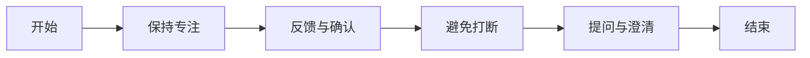
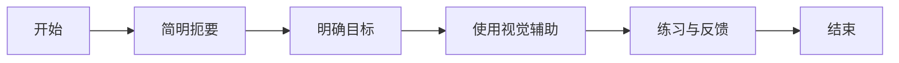

                 

**文章标题：**团队沟通技巧：消除误解，增进理解

**关键词：** 团队沟通，误解消除，理解增进，技能提升，冲突解决，协作增强

**摘要：**
在信息技术行业中，团队沟通是项目成功的关键因素。本文旨在探讨团队沟通技巧，通过消除误解和增进理解，提升团队协作效率。我们将从建立沟通基础、处理冲突、领导沟通、增强团队协作等方面逐步分析，为团队成员提供实用的沟通策略和技巧。

## 引言

### 什么是团队沟通？

团队沟通是指团队成员之间通过语言、文字、行为等方式进行的交流，旨在共享信息、理解意图、协同工作。有效的团队沟通能够促进合作、提高工作效率、降低错误发生率。

### 为什么团队沟通如此重要？

1. **提高工作效率：**良好的沟通有助于团队成员迅速理解任务要求，避免重复工作。
2. **降低错误率：**清晰的指令和反馈有助于减少误解和错误，提高项目质量。
3. **增强团队凝聚力：**共同的目标和价值观能够增强团队凝聚力，提高团队成员的忠诚度和归属感。

### 团队沟通中的常见问题

1. **误解和错误信息：**由于沟通不畅，团队成员可能会误解任务要求或项目目标。
2. **冲突和分歧：**沟通中的误解可能导致团队成员之间的冲突和分歧。
3. **信息不对称：**部分团队成员可能拥有更多的信息，导致信息不对称。

### 本文的目的

本文将提供一系列团队沟通技巧，帮助团队成员：

1. **建立沟通基础：**通过提升基础沟通技能，如主动倾听和清晰表达，提高沟通效率。
2. **处理冲突：**通过理解冲突的原因和策略，有效解决团队中的冲突。
3. **领导沟通：**领导者在沟通中扮演关键角色，本文将探讨领导如何通过有效的沟通策略增强团队凝聚力。
4. **增强团队协作：**通过协作工具和会议管理技巧，提高团队协作效率。

## 建立沟通基础

### 1.1 主动倾听

#### 什么是主动倾听？

主动倾听是一种沟通技能，要求我们在交流过程中给予对方充分的关注和理解。主动倾听不仅仅是听对方说什么，更包括观察对方的肢体语言、情感反应，以及理解其背后的意图。

#### 主动倾听的技巧

1. **保持专注：**在对话过程中，避免分心，确保关注对方。
2. **反馈和确认：**通过点头、眼神接触或简短回应，表明你在倾听。
3. **避免打断：**在对方说话时，不要打断，让对方完整表达观点。
4. **提问和澄清：**在适当时候提出问题，确保理解对方的意图。

### 1.2 清晰表达

#### 为什么清晰表达很重要？

清晰表达能够确保信息传递的准确性和有效性，避免误解和混淆。在信息技术行业，清晰的表达是沟通的关键。

#### 提高清晰表达的技巧

1. **简明扼要：**避免使用复杂、冗长的语言，用简洁的语言表达观点。
2. **明确目标：**在交流前明确交流的目标，确保双方对交流的目的有共同理解。
3. **使用视觉辅助工具：**如图表、流程图等，帮助对方更直观地理解你的观点。
4. **练习和反馈：**通过练习和获取反馈，不断提升自己的表达清晰度。

## 处理冲突

### 2.1 理解冲突

#### 冲突的类型

1. **任务冲突：**由于任务分配或职责不明确导致的冲突。
2. **目标冲突：**团队成员对项目目标有不同的理解或期望。
3. **价值观冲突：**由于个人价值观或文化差异导致的冲突。

#### 情绪在冲突中的作用

情绪在冲突中扮演重要角色，可能加剧或缓解冲突。了解和应对情绪，有助于降低冲突的激烈程度。

#### 冲突的沟通循环

冲突的沟通循环包括：问题提出、情绪表达、反驳、防御、情绪升级等。理解这个循环，有助于我们更好地应对冲突。

### 2.2 冲突解决策略

#### 1. 问题解决

- **步骤：**明确问题、分析原因、提出解决方案、评估解决方案、执行解决方案。
- **技巧：**保持冷静、避免情绪化、集中精力解决问题。

#### 2. 谈判技能

- **目的：**通过双方协商，达成共同利益。
- **技巧：**了解对方的利益和需求、提出合理的妥协方案、保持耐心和诚意。

#### 3. 建立信任

- **重要性：**信任是解决冲突的基础。
- **技巧：**开放沟通、诚实表达、遵守承诺、尊重对方。

## 领导沟通

### 3.1 领导者的角色

#### 领导者与沟通

领导者不仅是团队的领导者，也是团队沟通的桥梁。有效的沟通是领导者职责的重要组成部分。

#### 建立沟通文化的关键

1. **开放沟通：**鼓励团队成员提出问题和意见。
2. **反馈机制：**建立有效的反馈机制，确保团队成员得到及时的反馈。
3. **信任建设：**建立信任，促进团队成员之间的合作。

#### 角色模型的重要性

领导者通过自己的行为和沟通风格，影响团队成员的沟通方式。作为角色模型，领导者需要展示良好的沟通技能。

### 3.2 领导者的沟通策略

#### 1. 创建开放门政策

- **目的：**鼓励团队成员主动沟通，提高团队的透明度。
- **技巧：**定期组织会议、公开讨论、鼓励提问和反馈。

#### 2. 给予和接收反馈

- **重要性：**反馈是沟通中不可或缺的一部分，有助于团队成员的成长。
- **技巧：**具体、建设性的反馈、及时反馈、双向沟通。

#### 3. 培养协作环境

- **目的：**促进团队成员之间的协作，提高团队效率。
- **技巧：**共享信息、鼓励合作、尊重团队成员的贡献。

## 增强团队协作

### 4.1 建立强团关系

#### 4.1.1 信任与尊重

- **信任的重要性：**信任是团队协作的基础。
- **尊重的体现：**尊重团队成员的观点和贡献，避免歧视和偏见。

#### 4.1.2 共享愿景与目标

- **共同愿景：**明确团队的共同目标和愿景，提高团队成员的归属感。
- **目标设定：**合理设定团队目标，确保团队成员明确自己的职责和任务。

#### 4.1.3 鼓励团队参与

- **参与的重要性：**鼓励团队成员参与决策和项目实施，提高团队成员的积极性和责任感。

### 4.2 高效团队会议管理

#### 4.2.1 会议结构

- **议程制定：**制定清晰的会议议程，确保会议目标明确。
- **会议时间：**合理安排会议时间，避免占用团队成员过多时间。

#### 4.2.2 解决会议挑战

- **避免跑题：**确保会议讨论围绕主题展开，避免跑题。
- **控制时间：**控制会议时间，避免过长会议影响工作效率。

#### 4.2.3 激发积极参与

- **鼓励发言：**鼓励团队成员积极参与讨论，提高会议质量。
- **反馈机制：**建立会议反馈机制，及时了解团队成员的意见和建议。

## 结论

团队沟通是信息技术行业中不可或缺的技能。通过本文的探讨，我们了解了团队沟通的重要性，以及如何通过提升基础沟通技能、处理冲突、领导沟通和增强团队协作来提高团队效率。有效的团队沟通能够促进团队成员之间的理解与合作，为项目的成功奠定基础。

**注意事项：**
1. **持续学习和实践：**团队沟通技能需要不断学习和实践，以适应不断变化的工作环境。
2. **文化多样性：**尊重文化多样性，理解不同文化背景下的沟通方式，以促进跨文化团队的协作。
3. **反馈和调整：**定期收集团队成员的反馈，根据实际情况调整沟通策略。

**拓展阅读：**
- 《沟通的艺术》
- 《团队协作技巧》
- 《冲突管理》

**作者：** AI天才研究院/AI Genius Institute & 禅与计算机程序设计艺术 /Zen And The Art of Computer Programming

## 文章标题：团队沟通技巧：消除误解，增进理解

**关键词：** 团队沟通，误解消除，理解增进，技能提升，冲突解决，协作增强

**摘要：**
在信息技术行业中，团队沟通是项目成功的关键因素。本文旨在探讨团队沟通技巧，通过消除误解和增进理解，提升团队协作效率。我们将从建立沟通基础、处理冲突、领导沟通、增强团队协作等方面逐步分析，为团队成员提供实用的沟通策略和技巧。

## 引言

### 什么是团队沟通？

团队沟通是指团队成员之间通过语言、文字、行为等方式进行的交流，旨在共享信息、理解意图、协同工作。有效的团队沟通能够促进合作、提高工作效率、降低错误发生率。

### 为什么团队沟通如此重要？

1. **提高工作效率：**良好的沟通有助于团队成员迅速理解任务要求，避免重复工作。
2. **降低错误率：**清晰的指令和反馈有助于减少误解和错误，提高项目质量。
3. **增强团队凝聚力：**共同的目标和价值观能够增强团队凝聚力，提高团队成员的忠诚度和归属感。

### 团队沟通中的常见问题

1. **误解和错误信息：**由于沟通不畅，团队成员可能会误解任务要求或项目目标。
2. **冲突和分歧：**沟通中的误解可能导致团队成员之间的冲突和分歧。
3. **信息不对称：**部分团队成员可能拥有更多的信息，导致信息不对称。

### 本文的目的

本文将提供一系列团队沟通技巧，帮助团队成员：

1. **建立沟通基础：**通过提升基础沟通技能，如主动倾听和清晰表达，提高沟通效率。
2. **处理冲突：**通过理解冲突的原因和策略，有效解决团队中的冲突。
3. **领导沟通：**领导者在沟通中扮演关键角色，本文将探讨领导如何通过有效的沟通策略增强团队凝聚力。
4. **增强团队协作：**通过协作工具和会议管理技巧，提高团队协作效率。

## 建立沟通基础

### 1.1 主动倾听

#### 什么是主动倾听？

主动倾听是一种沟通技能，要求我们在交流过程中给予对方充分的关注和理解。主动倾听不仅仅是听对方说什么，更包括观察对方的肢体语言、情感反应，以及理解其背后的意图。

#### 主动倾听的技巧

1. **保持专注：**在对话过程中，避免分心，确保关注对方。
2. **反馈和确认：**通过点头、眼神接触或简短回应，表明你在倾听。
3. **避免打断：**在对方说话时，不要打断，让对方完整表达观点。
4. **提问和澄清：**在适当时候提出问题，确保理解对方的意图。

### 1.2 清晰表达

#### 为什么清晰表达很重要？

清晰表达能够确保信息传递的准确性和有效性，避免误解和混淆。在信息技术行业，清晰的表达是沟通的关键。

#### 提高清晰表达的技巧

1. **简明扼要：**避免使用复杂、冗长的语言，用简洁的语言表达观点。
2. **明确目标：**在交流前明确交流的目标，确保双方对交流的目的有共同理解。
3. **使用视觉辅助工具：**如图表、流程图等，帮助对方更直观地理解你的观点。
4. **练习和反馈：**通过练习和获取反馈，不断提升自己的表达清晰度。

### 1.3 建立信任

#### 信任的重要性

信任是团队沟通的基石。一个信任度高的团队能够更好地合作，解决问题，共同实现目标。

#### 建立信任的策略

1. **诚实与透明：**在沟通中保持诚实和透明，避免隐藏信息或误导他人。
2. **尊重与倾听：**尊重团队成员的意见和贡献，倾听他们的想法和建议。
3. **一致性：**在行为和决策上一致，避免给团队成员带来不确定性和疑虑。
4. **承担责任：**在出现问题时，勇于承担责任，而非归咎于他人。

### 1.4 共同语言

#### 什么是共同语言？

共同语言是指在团队内部广泛使用的专业术语和行话，这些术语和行话有助于团队成员更快地理解彼此的意思。

#### 建立共同语言的方法

1. **标准化术语：**制定并推广团队内部的标准术语，确保团队成员在沟通中使用一致的词汇。
2. **培训与交流：**定期组织培训，让团队成员熟悉并掌握共同语言。
3. **使用简洁语言：**在沟通时，尽量使用简洁明了的语言，避免使用过于复杂的术语。

### 1.5 建立有效的反馈机制

#### 反馈机制的重要性

有效的反馈机制可以帮助团队成员了解自己的工作表现，发现问题和改进机会。

#### 反馈机制的构建

1. **定期反馈：**建立定期反馈机制，如每周或每月的团队会议，让团队成员分享工作进展和遇到的问题。
2. **匿名反馈：**提供匿名反馈渠道，让团队成员能够自由地表达自己的意见，而不用担心被报复。
3. **反馈格式：**制定标准化的反馈格式，确保反馈内容具体、明确、有建设性。

## 处理冲突

### 2.1 理解冲突

#### 冲突的类型

1. **任务冲突：**由于任务分配或职责不明确导致的冲突。
2. **目标冲突：**团队成员对项目目标有不同的理解或期望。
3. **价值观冲突：**由于个人价值观或文化差异导致的冲突。

#### 冲突的原因

1. **信息不对称：**团队成员之间信息传递不畅，导致对任务或项目的理解不一致。
2. **个人情绪：**个人的情绪状态，如焦虑、压力等，可能导致冲突。
3. **沟通不畅：**团队成员之间的沟通不畅，可能导致误解和冲突。

#### 冲突的影响

1. **降低工作效率：**冲突会分散团队成员的注意力，降低工作效率。
2. **损害团队关系：**长期的冲突会损害团队成员之间的信任和关系。
3. **影响项目质量：**冲突可能导致团队成员忽视项目细节，影响项目质量。

### 2.2 冲突解决策略

#### 1. 主动沟通

- **目的：**通过沟通解决冲突，避免冲突升级。
- **技巧：**保持冷静，以事实为依据，避免情绪化。

#### 2. 中立第三方介入

- **目的：**在双方无法达成共识时，引入中立第三方协助解决冲突。
- **技巧：**选择有经验、公正的中立第三方，确保双方都有机会表达自己的观点。

#### 3. 找到共同点

- **目的：**通过寻找共同点，缩小双方分歧，达成妥协。
- **技巧：**倾听对方观点，寻找可以接受的妥协方案。

#### 4. 建立冲突解决机制

- **目的：**为团队成员提供一个解决冲突的正式渠道。
- **技巧：**制定冲突解决的流程和规则，确保冲突得到及时、有效的解决。

## 领导沟通

### 3.1 领导者的角色

#### 领导者与沟通

领导者不仅是团队的领导者，也是团队沟通的桥梁。有效的沟通是领导者职责的重要组成部分。

#### 领导沟通的关键要素

1. **明确目标：**领导者需要明确团队的目标，并将这些目标传达给团队成员。
2. **倾听：**领导者需要倾听团队成员的意见和建议，了解他们的需求和困扰。
3. **反馈：**领导者需要给予团队成员及时的反馈，帮助他们了解自己的工作表现。
4. **激励：**领导者需要通过沟通激励团队成员，提高他们的工作积极性和责任感。

### 3.2 领导沟通的策略

#### 1. 开放式沟通

- **目的：**建立一种开放、自由、信任的沟通环境。
- **技巧：**定期组织团队会议，鼓励团队成员提问和反馈，创造一个包容的沟通氛围。

#### 2. 有效的反馈

- **目的：**帮助团队成员了解自己的工作表现，并提供改进的方向。
- **技巧：**提供具体、明确、有建设性的反馈，避免过于笼统或模糊。

#### 3. 建立沟通渠道

- **目的：**确保团队成员在任何时候都能找到解决问题的途径。
- **技巧：**建立多个沟通渠道，如团队邮件、即时通讯工具、面对面会议等，满足不同团队成员的沟通需求。

#### 4. 激励与支持

- **目的：**提高团队成员的工作积极性和创造力。
- **技巧：**通过沟通表达对团队成员的支持和鼓励，提供必要的资源和支持。

## 增强团队协作

### 4.1 建立团队关系

#### 4.1.1 信任建设

- **信任的重要性：**信任是团队协作的基础，有助于团队成员之间的合作和沟通。
- **建立信任的方法：**通过开放、诚实、尊重和一致性建立信任，避免隐瞒信息或误导他人。

#### 4.1.2 共同价值观

- **共同价值观的意义：**共同价值观有助于团队成员理解彼此，共同追求团队目标。
- **共同价值观的建立：**通过团队活动、文化建设等方式，塑造共同价值观，确保团队成员在价值观上的一致性。

#### 4.1.3 鼓励团队参与

- **鼓励参与的意义：**鼓励团队成员参与团队决策和项目实施，提高他们的责任感和归属感。
- **鼓励参与的方法：**通过团队会议、头脑风暴、任务分配等方式，让团队成员参与到团队事务中。

### 4.2 提高协作效率

#### 4.2.1 协作工具的使用

- **协作工具的作用：**协作工具有助于团队成员之间的信息共享和任务协作，提高工作效率。
- **协作工具的选择：**根据团队需求选择合适的协作工具，如即时通讯工具、项目管理工具、文档共享平台等。

#### 4.2.2 协作流程的优化

- **协作流程的重要性：**优化协作流程有助于减少团队成员之间的沟通成本，提高协作效率。
- **协作流程的优化方法：**通过流程图、工作流分析等方式，识别协作过程中的瓶颈和改进点，优化协作流程。

#### 4.2.3 知识共享

- **知识共享的意义：**知识共享有助于团队成员之间的学习与成长，提高团队的整体能力。
- **知识共享的方法：**通过内部培训、经验分享会、知识库建设等方式，促进团队成员之间的知识共享。

### 4.3 高效的会议管理

#### 4.3.1 会议的目标

- **明确会议目标：**确保每次会议都有明确的议程和目标，避免无意义的会议。
- **会议议程的制定：**在会议前制定详细的议程，明确会议内容、时间分配和责任人。

#### 4.3.2 会议的效率

- **控制会议时间：**合理安排会议时间，避免占用过多工作时间，提高会议效率。
- **会议记录与跟进：**在会议后记录关键决策和行动项，确保会议成果得到有效执行。

#### 4.3.3 会议的参与

- **鼓励积极参与：**鼓励团队成员在会议中发表意见，提高会议的参与度。
- **会议反馈：**在会议后收集团队成员的反馈，了解会议的效果，不断改进会议流程。

## 结论

团队沟通是信息技术行业中不可或缺的技能。有效的团队沟通能够促进团队成员之间的理解与合作，提高工作效率，降低错误率，增强团队凝聚力。本文通过探讨团队沟通的基础、冲突解决、领导沟通和团队协作，提供了实用的沟通策略和技巧。希望这些技巧能够帮助团队成员在项目中更好地合作，实现共同的目标。

## 附录

### 1. 沟通技巧实践案例

- **案例1：** 项目经理通过定期团队会议，确保团队成员了解项目进展和任务要求。
- **案例2：** 技术团队在任务分配时，明确每个成员的职责和期望，避免误解和冲突。

### 2. 沟通技巧评估表

- **评估内容：** 团队成员的沟通技能、冲突解决能力、协作效率等。
- **评估方法：** 定期进行沟通技巧评估，通过问卷调查、反馈会议等方式收集团队成员的意见和建议。

### 3. 沟通技巧培训计划

- **培训内容：** 团队沟通的基础技巧、冲突解决策略、领导沟通技巧等。
- **培训方式：** 内部培训、外部培训、在线课程等。

## 作者信息

**作者：** AI天才研究院/AI Genius Institute & 禅与计算机程序设计艺术 /Zen And The Art of Computer Programming

## 文章标题：团队沟通技巧：消除误解，增进理解

**关键词：** 团队沟通，误解消除，理解增进，技能提升，冲突解决，协作增强

**摘要：**
在信息技术行业中，团队沟通是项目成功的关键因素。本文旨在探讨团队沟通技巧，通过消除误解和增进理解，提升团队协作效率。我们将从建立沟通基础、处理冲突、领导沟通、增强团队协作等方面逐步分析，为团队成员提供实用的沟通策略和技巧。

## 引言

### 什么是团队沟通？

团队沟通是指团队成员之间通过语言、文字、行为等方式进行的交流，旨在共享信息、理解意图、协同工作。有效的团队沟通能够促进合作、提高工作效率、降低错误发生率。

### 为什么团队沟通如此重要？

1. **提高工作效率：**良好的沟通有助于团队成员迅速理解任务要求，避免重复工作。
2. **降低错误率：**清晰的指令和反馈有助于减少误解和错误，提高项目质量。
3. **增强团队凝聚力：**共同的目标和价值观能够增强团队凝聚力，提高团队成员的忠诚度和归属感。

### 团队沟通中的常见问题

1. **误解和错误信息：**由于沟通不畅，团队成员可能会误解任务要求或项目目标。
2. **冲突和分歧：**沟通中的误解可能导致团队成员之间的冲突和分歧。
3. **信息不对称：**部分团队成员可能拥有更多的信息，导致信息不对称。

### 本文的目的

本文将提供一系列团队沟通技巧，帮助团队成员：

1. **建立沟通基础：**通过提升基础沟通技能，如主动倾听和清晰表达，提高沟通效率。
2. **处理冲突：**通过理解冲突的原因和策略，有效解决团队中的冲突。
3. **领导沟通：**领导者在沟通中扮演关键角色，本文将探讨领导如何通过有效的沟通策略增强团队凝聚力。
4. **增强团队协作：**通过协作工具和会议管理技巧，提高团队协作效率。

## 建立沟通基础

### 1.1 主动倾听

#### 什么是主动倾听？

主动倾听是一种沟通技能，要求我们在交流过程中给予对方充分的关注和理解。主动倾听不仅仅是听对方说什么，更包括观察对方的肢体语言、情感反应，以及理解其背后的意图。

#### 主动倾听的技巧

1. **保持专注：**在对话过程中，避免分心，确保关注对方。
2. **反馈和确认：**通过点头、眼神接触或简短回应，表明你在倾听。
3. **避免打断：**在对方说话时，不要打断，让对方完整表达观点。
4. **提问和澄清：**在适当时候提出问题，确保理解对方的意图。

### 1.2 清晰表达

#### 为什么清晰表达很重要？

清晰表达能够确保信息传递的准确性和有效性，避免误解和混淆。在信息技术行业，清晰的表达是沟通的关键。

#### 提高清晰表达的技巧

1. **简明扼要：**避免使用复杂、冗长的语言，用简洁的语言表达观点。
2. **明确目标：**在交流前明确交流的目标，确保双方对交流的目的有共同理解。
3. **使用视觉辅助工具：**如图表、流程图等，帮助对方更直观地理解你的观点。
4. **练习和反馈：**通过练习和获取反馈，不断提升自己的表达清晰度。

### 1.3 建立信任

#### 信任的重要性

信任是团队沟通的基石。一个信任度高的团队能够更好地合作，解决问题，共同实现目标。

#### 建立信任的策略

1. **诚实与透明：**在沟通中保持诚实和透明，避免隐藏信息或误导他人。
2. **尊重与倾听：**尊重团队成员的意见和贡献，倾听他们的想法和建议。
3. **一致性：**在行为和决策上一致，避免给团队成员带来不确定性和疑虑。
4. **承担责任：**在出现问题时，勇于承担责任，而非归咎于他人。

### 1.4 共同语言

#### 什么是共同语言？

共同语言是指在团队内部广泛使用的专业术语和行话，这些术语和行话有助于团队成员更快地理解彼此的意思。

#### 建立共同语言的方法

1. **标准化术语：**制定并推广团队内部的标准术语，确保团队成员在沟通中使用一致的词汇。
2. **培训与交流：**定期组织培训，让团队成员熟悉并掌握共同语言。
3. **使用简洁语言：**在沟通时，尽量使用简洁明了的语言，避免使用过于复杂的术语。

### 1.5 建立有效的反馈机制

#### 反馈机制的重要性

有效的反馈机制可以帮助团队成员了解自己的工作表现，发现问题和改进机会。

#### 反馈机制的构建

1. **定期反馈：**建立定期反馈机制，如每周或每月的团队会议，让团队成员分享工作进展和遇到的问题。
2. **匿名反馈：**提供匿名反馈渠道，让团队成员能够自由地表达自己的意见，而不用担心被报复。
3. **反馈格式：**制定标准化的反馈格式，确保反馈内容具体、明确、有建设性。

## 处理冲突

### 2.1 理解冲突

#### 冲突的类型

1. **任务冲突：**由于任务分配或职责不明确导致的冲突。
2. **目标冲突：**团队成员对项目目标有不同的理解或期望。
3. **价值观冲突：**由于个人价值观或文化差异导致的冲突。

#### 冲突的原因

1. **信息不对称：**团队成员之间信息传递不畅，导致对任务或项目的理解不一致。
2. **个人情绪：**个人的情绪状态，如焦虑、压力等，可能导致冲突。
3. **沟通不畅：**团队成员之间的沟通不畅，可能导致误解和冲突。

#### 冲突的影响

1. **降低工作效率：**冲突会分散团队成员的注意力，降低工作效率。
2. **损害团队关系：**长期的冲突会损害团队成员之间的信任和关系。
3. **影响项目质量：**冲突可能导致团队成员忽视项目细节，影响项目质量。

### 2.2 冲突解决策略

#### 1. 主动沟通

- **目的：**通过沟通解决冲突，避免冲突升级。
- **技巧：**保持冷静，以事实为依据，避免情绪化。

#### 2. 中立第三方介入

- **目的：**在双方无法达成共识时，引入中立第三方协助解决冲突。
- **技巧：**选择有经验、公正的中立第三方，确保双方都有机会表达自己的观点。

#### 3. 找到共同点

- **目的：**通过寻找共同点，缩小双方分歧，达成妥协。
- **技巧：**倾听对方观点，寻找可以接受的妥协方案。

#### 4. 建立冲突解决机制

- **目的：**为团队成员提供一个解决冲突的正式渠道。
- **技巧：**制定冲突解决的流程和规则，确保冲突得到及时、有效的解决。

## 领导沟通

### 3.1 领导者的角色

#### 领导者与沟通

领导者不仅是团队的领导者，也是团队沟通的桥梁。有效的沟通是领导者职责的重要组成部分。

#### 领导沟通的关键要素

1. **明确目标：**领导者需要明确团队的目标，并将这些目标传达给团队成员。
2. **倾听：**领导者需要倾听团队成员的意见和建议，了解他们的需求和困扰。
3. **反馈：**领导者需要给予团队成员及时的反馈，帮助他们了解自己的工作表现。
4. **激励：**领导者需要通过沟通激励团队成员，提高他们的工作积极性和责任感。

### 3.2 领导沟通的策略

#### 1. 开放式沟通

- **目的：**建立一种开放、自由、信任的沟通环境。
- **技巧：**定期组织团队会议，鼓励团队成员提问和反馈，创造一个包容的沟通氛围。

#### 2. 有效的反馈

- **目的：**帮助团队成员了解自己的工作表现，并提供改进的方向。
- **技巧：**提供具体、明确、有建设性的反馈，避免过于笼统或模糊。

#### 3. 建立沟通渠道

- **目的：**确保团队成员在任何时候都能找到解决问题的途径。
- **技巧：**建立多个沟通渠道，如团队邮件、即时通讯工具、面对面会议等，满足不同团队成员的沟通需求。

#### 4. 激励与支持

- **目的：**提高团队成员的工作积极性和创造力。
- **技巧：**通过沟通表达对团队成员的支持和鼓励，提供必要的资源和支持。

## 增强团队协作

### 4.1 建立团队关系

#### 4.1.1 信任建设

- **信任的重要性：**信任是团队协作的基础，有助于团队成员之间的合作和沟通。
- **建立信任的方法：**通过开放、诚实、尊重和一致性建立信任，避免隐瞒信息或误导他人。

#### 4.1.2 共同价值观

- **共同价值观的意义：**共同价值观有助于团队成员理解彼此，共同追求团队目标。
- **共同价值观的建立：**通过团队活动、文化建设等方式，塑造共同价值观，确保团队成员在价值观上的一致性。

#### 4.1.3 鼓励团队参与

- **鼓励参与的意义：**鼓励团队成员参与团队决策和项目实施，提高他们的责任感和归属感。
- **鼓励参与的方法：**通过团队会议、头脑风暴、任务分配等方式，让团队成员参与到团队事务中。

### 4.2 提高协作效率

#### 4.2.1 协作工具的使用

- **协作工具的作用：**协作工具有助于团队成员之间的信息共享和任务协作，提高工作效率。
- **协作工具的选择：**根据团队需求选择合适的协作工具，如即时通讯工具、项目管理工具、文档共享平台等。

#### 4.2.2 协作流程的优化

- **协作流程的重要性：**优化协作流程有助于减少团队成员之间的沟通成本，提高协作效率。
- **协作流程的优化方法：**通过流程图、工作流分析等方式，识别协作过程中的瓶颈和改进点，优化协作流程。

#### 4.2.3 知识共享

- **知识共享的意义：**知识共享有助于团队成员之间的学习与成长，提高团队的整体能力。
- **知识共享的方法：**通过内部培训、经验分享会、知识库建设等方式，促进团队成员之间的知识共享。

### 4.3 高效的会议管理

#### 4.3.1 会议的目标

- **明确会议目标：**确保每次会议都有明确的议程和目标，避免无意义的会议。
- **会议议程的制定：**在会议前制定详细的议程，明确会议内容、时间分配和责任人。

#### 4.3.2 会议的效率

- **控制会议时间：**合理安排会议时间，避免占用过多工作时间，提高会议效率。
- **会议记录与跟进：**在会议后记录关键决策和行动项，确保会议成果得到有效执行。

#### 4.3.3 会议的参与

- **鼓励积极参与：**鼓励团队成员在会议中发表意见，提高会议的参与度。
- **会议反馈：**在会议后收集团队成员的反馈，了解会议的效果，不断改进会议流程。

## 结论

团队沟通是信息技术行业中不可或缺的技能。有效的团队沟通能够促进团队成员之间的理解与合作，提高工作效率，降低错误率，增强团队凝聚力。本文通过探讨团队沟通的基础、冲突解决、领导沟通和团队协作，提供了实用的沟通策略和技巧。希望这些技巧能够帮助团队成员在项目中更好地合作，实现共同的目标。

## 附录

### 1. 沟通技巧实践案例

- **案例1：** 项目经理通过定期团队会议，确保团队成员了解项目进展和任务要求。
- **案例2：** 技术团队在任务分配时，明确每个成员的职责和期望，避免误解和冲突。

### 2. 沟通技巧评估表

- **评估内容：** 团队成员的沟通技能、冲突解决能力、协作效率等。
- **评估方法：** 定期进行沟通技巧评估，通过问卷调查、反馈会议等方式收集团队成员的意见和建议。

### 3. 沟通技巧培训计划

- **培训内容：** 团队沟通的基础技巧、冲突解决策略、领导沟通技巧等。
- **培训方式：** 内部培训、外部培训、在线课程等。

## 作者信息

**作者：** AI天才研究院/AI Genius Institute & 禅与计算机程序设计艺术 /Zen And The Art of Computer Programming

### 目录

- **引言**
  - 什么是团队沟通？
  - 为什么团队沟通如此重要？
  - 团队沟通中的常见问题
  - 本文的目的
- **建立沟通基础**
  - 主动倾听
  - 清晰表达
  - 建立信任
  - 共同语言
  - 建立有效的反馈机制
- **处理冲突**
  - 理解冲突
  - 冲突解决策略
- **领导沟通**
  - 领导者的角色
  - 领导沟通的策略
- **增强团队协作**
  - 建立团队关系
  - 提高协作效率
  - 高效的会议管理
- **结论**
- **附录**
  - 沟通技巧实践案例
  - 沟通技巧评估表
  - 沟通技巧培训计划
- **作者信息**

### 文章标题：团队沟通技巧：消除误解，增进理解

**关键词：** 团队沟通，误解消除，理解增进，技能提升，冲突解决，协作增强

**摘要：**
在信息技术行业中，团队沟通是项目成功的关键因素。本文旨在探讨团队沟通技巧，通过消除误解和增进理解，提升团队协作效率。我们将从建立沟通基础、处理冲突、领导沟通、增强团队协作等方面逐步分析，为团队成员提供实用的沟通策略和技巧。

## 引言

### 什么是团队沟通？

团队沟通是指团队成员之间通过语言、文字、行为等方式进行的交流，旨在共享信息、理解意图、协同工作。有效的团队沟通能够促进合作、提高工作效率、降低错误发生率。

### 为什么团队沟通如此重要？

1. **提高工作效率：**良好的沟通有助于团队成员迅速理解任务要求，避免重复工作。
2. **降低错误率：**清晰的指令和反馈有助于减少误解和错误，提高项目质量。
3. **增强团队凝聚力：**共同的目标和价值观能够增强团队凝聚力，提高团队成员的忠诚度和归属感。

### 团队沟通中的常见问题

1. **误解和错误信息：**由于沟通不畅，团队成员可能会误解任务要求或项目目标。
2. **冲突和分歧：**沟通中的误解可能导致团队成员之间的冲突和分歧。
3. **信息不对称：**部分团队成员可能拥有更多的信息，导致信息不对称。

### 本文的目的

本文将提供一系列团队沟通技巧，帮助团队成员：

1. **建立沟通基础：**通过提升基础沟通技能，如主动倾听和清晰表达，提高沟通效率。
2. **处理冲突：**通过理解冲突的原因和策略，有效解决团队中的冲突。
3. **领导沟通：**领导者在沟通中扮演关键角色，本文将探讨领导如何通过有效的沟通策略增强团队凝聚力。
4. **增强团队协作：**通过协作工具和会议管理技巧，提高团队协作效率。

## 建立沟通基础

### 1.1 主动倾听

#### 什么是主动倾听？

主动倾听是一种沟通技能，要求我们在交流过程中给予对方充分的关注和理解。主动倾听不仅仅是听对方说什么，更包括观察对方的肢体语言、情感反应，以及理解其背后的意图。

#### 主动倾听的技巧

1. **保持专注：**在对话过程中，避免分心，确保关注对方。
2. **反馈和确认：**通过点头、眼神接触或简短回应，表明你在倾听。
3. **避免打断：**在对方说话时，不要打断，让对方完整表达观点。
4. **提问和澄清：**在适当时候提出问题，确保理解对方的意图。

### 1.2 清晰表达

#### 为什么清晰表达很重要？

清晰表达能够确保信息传递的准确性和有效性，避免误解和混淆。在信息技术行业，清晰的表达是沟通的关键。

#### 提高清晰表达的技巧

1. **简明扼要：**避免使用复杂、冗长的语言，用简洁的语言表达观点。
2. **明确目标：**在交流前明确交流的目标，确保双方对交流的目的有共同理解。
3. **使用视觉辅助工具：**如图表、流程图等，帮助对方更直观地理解你的观点。
4. **练习和反馈：**通过练习和获取反馈，不断提升自己的表达清晰度。

### 1.3 建立信任

#### 信任的重要性

信任是团队沟通的基石。一个信任度高的团队能够更好地合作，解决问题，共同实现目标。

#### 建立信任的策略

1. **诚实与透明：**在沟通中保持诚实和透明，避免隐藏信息或误导他人。
2. **尊重与倾听：**尊重团队成员的意见和贡献，倾听他们的想法和建议。
3. **一致性：**在行为和决策上一致，避免给团队成员带来不确定性和疑虑。
4. **承担责任：**在出现问题时，勇于承担责任，而非归咎于他人。

### 1.4 共同语言

#### 什么是共同语言？

共同语言是指在团队内部广泛使用的专业术语和行话，这些术语和行话有助于团队成员更快地理解彼此的意思。

#### 建立共同语言的方法

1. **标准化术语：**制定并推广团队内部的标准术语，确保团队成员在沟通中使用一致的词汇。
2. **培训与交流：**定期组织培训，让团队成员熟悉并掌握共同语言。
3. **使用简洁语言：**在沟通时，尽量使用简洁明了的语言，避免使用过于复杂的术语。

### 1.5 建立有效的反馈机制

#### 反馈机制的重要性

有效的反馈机制可以帮助团队成员了解自己的工作表现，发现问题和改进机会。

#### 反馈机制的构建

1. **定期反馈：**建立定期反馈机制，如每周或每月的团队会议，让团队成员分享工作进展和遇到的问题。
2. **匿名反馈：**提供匿名反馈渠道，让团队成员能够自由地表达自己的意见，而不用担心被报复。
3. **反馈格式：**制定标准化的反馈格式，确保反馈内容具体、明确、有建设性。

## 处理冲突

### 2.1 理解冲突

#### 冲突的类型

1. **任务冲突：**由于任务分配或职责不明确导致的冲突。
2. **目标冲突：**团队成员对项目目标有不同的理解或期望。
3. **价值观冲突：**由于个人价值观或文化差异导致的冲突。

#### 冲突的原因

1. **信息不对称：**团队成员之间信息传递不畅，导致对任务或项目的理解不一致。
2. **个人情绪：**个人的情绪状态，如焦虑、压力等，可能导致冲突。
3. **沟通不畅：**团队成员之间的沟通不畅，可能导致误解和冲突。

#### 冲突的影响

1. **降低工作效率：**冲突会分散团队成员的注意力，降低工作效率。
2. **损害团队关系：**长期的冲突会损害团队成员之间的信任和关系。
3. **影响项目质量：**冲突可能导致团队成员忽视项目细节，影响项目质量。

### 2.2 冲突解决策略

#### 1. 主动沟通

- **目的：**通过沟通解决冲突，避免冲突升级。
- **技巧：**保持冷静，以事实为依据，避免情绪化。

#### 2. 中立第三方介入

- **目的：**在双方无法达成共识时，引入中立第三方协助解决冲突。
- **技巧：**选择有经验、公正的中立第三方，确保双方都有机会表达自己的观点。

#### 3. 找到共同点

- **目的：**通过寻找共同点，缩小双方分歧，达成妥协。
- **技巧：**倾听对方观点，寻找可以接受的妥协方案。

#### 4. 建立冲突解决机制

- **目的：**为团队成员提供一个解决冲突的正式渠道。
- **技巧：**制定冲突解决的流程和规则，确保冲突得到及时、有效的解决。

## 领导沟通

### 3.1 领导者的角色

#### 领导者与沟通

领导者不仅是团队的领导者，也是团队沟通的桥梁。有效的沟通是领导者职责的重要组成部分。

#### 领导沟通的关键要素

1. **明确目标：**领导者需要明确团队的目标，并将这些目标传达给团队成员。
2. **倾听：**领导者需要倾听团队成员的意见和建议，了解他们的需求和困扰。
3. **反馈：**领导者需要给予团队成员及时的反馈，帮助他们了解自己的工作表现。
4. **激励：**领导者需要通过沟通激励团队成员，提高他们的工作积极性和责任感。

### 3.2 领导沟通的策略

#### 1. 开放式沟通

- **目的：**建立一种开放、自由、信任的沟通环境。
- **技巧：**定期组织团队会议，鼓励团队成员提问和反馈，创造一个包容的沟通氛围。

#### 2. 有效的反馈

- **目的：**帮助团队成员了解自己的工作表现，并提供改进的方向。
- **技巧：**提供具体、明确、有建设性的反馈，避免过于笼统或模糊。

#### 3. 建立沟通渠道

- **目的：**确保团队成员在任何时候都能找到解决问题的途径。
- **技巧：**建立多个沟通渠道，如团队邮件、即时通讯工具、面对面会议等，满足不同团队成员的沟通需求。

#### 4. 激励与支持

- **目的：**提高团队成员的工作积极性和创造力。
- **技巧：**通过沟通表达对团队成员的支持和鼓励，提供必要的资源和支持。

## 增强团队协作

### 4.1 建立团队关系

#### 4.1.1 信任建设

- **信任的重要性：**信任是团队协作的基础，有助于团队成员之间的合作和沟通。
- **建立信任的方法：**通过开放、诚实、尊重和一致性建立信任，避免隐瞒信息或误导他人。

#### 4.1.2 共同价值观

- **共同价值观的意义：**共同价值观有助于团队成员理解彼此，共同追求团队目标。
- **共同价值观的建立：**通过团队活动、文化建设等方式，塑造共同价值观，确保团队成员在价值观上的一致性。

#### 4.1.3 鼓励团队参与

- **鼓励参与的意义：**鼓励团队成员参与团队决策和项目实施，提高他们的责任感和归属感。
- **鼓励参与的方法：**通过团队会议、头脑风暴、任务分配等方式，让团队成员参与到团队事务中。

### 4.2 提高协作效率

#### 4.2.1 协作工具的使用

- **协作工具的作用：**协作工具有助于团队成员之间的信息共享和任务协作，提高工作效率。
- **协作工具的选择：**根据团队需求选择合适的协作工具，如即时通讯工具、项目管理工具、文档共享平台等。

#### 4.2.2 协作流程的优化

- **协作流程的重要性：**优化协作流程有助于减少团队成员之间的沟通成本，提高协作效率。
- **协作流程的优化方法：**通过流程图、工作流分析等方式，识别协作过程中的瓶颈和改进点，优化协作流程。

#### 4.2.3 知识共享

- **知识共享的意义：**知识共享有助于团队成员之间的学习与成长，提高团队的整体能力。
- **知识共享的方法：**通过内部培训、经验分享会、知识库建设等方式，促进团队成员之间的知识共享。

### 4.3 高效的会议管理

#### 4.3.1 会议的目标

- **明确会议目标：**确保每次会议都有明确的议程和目标，避免无意义的会议。
- **会议议程的制定：**在会议前制定详细的议程，明确会议内容、时间分配和责任人。

#### 4.3.2 会议的效率

- **控制会议时间：**合理安排会议时间，避免占用过多工作时间，提高会议效率。
- **会议记录与跟进：**在会议后记录关键决策和行动项，确保会议成果得到有效执行。

#### 4.3.3 会议的参与

- **鼓励积极参与：**鼓励团队成员在会议中发表意见，提高会议的参与度。
- **会议反馈：**在会议后收集团队成员的反馈，了解会议的效果，不断改进会议流程。

## 结论

团队沟通是信息技术行业中不可或缺的技能。有效的团队沟通能够促进团队成员之间的理解与合作，提高工作效率，降低错误率，增强团队凝聚力。本文通过探讨团队沟通的基础、冲突解决、领导沟通和团队协作，提供了实用的沟通策略和技巧。希望这些技巧能够帮助团队成员在项目中更好地合作，实现共同的目标。

## 附录

### 1. 沟通技巧实践案例

- **案例1：** 项目经理通过定期团队会议，确保团队成员了解项目进展和任务要求。
- **案例2：** 技术团队在任务分配时，明确每个成员的职责和期望，避免误解和冲突。

### 2. 沟通技巧评估表

- **评估内容：** 团队成员的沟通技能、冲突解决能力、协作效率等。
- **评估方法：** 定期进行沟通技巧评估，通过问卷调查、反馈会议等方式收集团队成员的意见和建议。

### 3. 沟通技巧培训计划

- **培训内容：** 团队沟通的基础技巧、冲突解决策略、领导沟通技巧等。
- **培训方式：** 内部培训、外部培训、在线课程等。

## 作者信息

**作者：** AI天才研究院/AI Genius Institute & 禅与计算机程序设计艺术 /Zen And The Art of Computer Programming

### 摘要

在信息技术行业中，团队沟通是项目成功的关键因素。有效的团队沟通能够促进合作、提高工作效率、降低错误发生率。本文旨在探讨团队沟通技巧，通过消除误解和增进理解，提升团队协作效率。我们将从建立沟通基础、处理冲突、领导沟通、增强团队协作等方面逐步分析，为团队成员提供实用的沟通策略和技巧。

### 文章标题：团队沟通技巧：消除误解，增进理解

**关键词：** 团队沟通，误解消除，理解增进，技能提升，冲突解决，协作增强

### 引言

在信息技术行业中，团队沟通是项目成功的关键因素。有效的团队沟通能够促进合作、提高工作效率、降低错误发生率。本文旨在探讨团队沟通技巧，通过消除误解和增进理解，提升团队协作效率。我们将从建立沟通基础、处理冲突、领导沟通、增强团队协作等方面逐步分析，为团队成员提供实用的沟通策略和技巧。

### 建立沟通基础

**1. 主动倾听**

主动倾听是一种沟通技能，要求我们在交流过程中给予对方充分的关注和理解。主动倾听不仅仅是听对方说什么，更包括观察对方的肢体语言、情感反应，以及理解其背后的意图。

**技巧：**

1. 保持专注：在对话过程中，避免分心，确保关注对方。
2. 反馈和确认：通过点头、眼神接触或简短回应，表明你在倾听。
3. 避免打断：在对方说话时，不要打断，让对方完整表达观点。
4. 提问和澄清：在适当时候提出问题，确保理解对方的意图。

**2. 清晰表达**

清晰表达能够确保信息传递的准确性和有效性，避免误解和混淆。在信息技术行业，清晰的表达是沟通的关键。

**技巧：**

1. 简明扼要：避免使用复杂、冗长的语言，用简洁的语言表达观点。
2. 明确目标：在交流前明确交流的目标，确保双方对交流的目的有共同理解。
3. 使用视觉辅助工具：如图表、流程图等，帮助对方更直观地理解你的观点。
4. 练习和反馈：通过练习和获取反馈，不断提升自己的表达清晰度。

**3. 建立信任**

信任是团队沟通的基石。一个信任度高的团队能够更好地合作，解决问题，共同实现目标。

**策略：**

1. 诚实与透明：在沟通中保持诚实和透明，避免隐藏信息或误导他人。
2. 尊重与倾听：尊重团队成员的意见和贡献，倾听他们的想法和建议。
3. 一致性：在行为和决策上一致，避免给团队成员带来不确定性和疑虑。
4. 承担责任：在出现问题时，勇于承担责任，而非归咎于他人。

**4. 共同语言**

共同语言是指在团队内部广泛使用的专业术语和行话，这些术语和行话有助于团队成员更快地理解彼此的意思。

**方法：**

1. 标准化术语：制定并推广团队内部的标准术语，确保团队成员在沟通中使用一致的词汇。
2. 培训与交流：定期组织培训，让团队成员熟悉并掌握共同语言。
3. 使用简洁语言：在沟通时，尽量使用简洁明了的语言，避免使用过于复杂的术语。

**5. 建立有效的反馈机制**

有效的反馈机制可以帮助团队成员了解自己的工作表现，发现问题和改进机会。

**构建：**

1. 定期反馈：建立定期反馈机制，如每周或每月的团队会议，让团队成员分享工作进展和遇到的问题。
2. 匿名反馈：提供匿名反馈渠道，让团队成员能够自由地表达自己的意见，而不用担心被报复。
3. 反馈格式：制定标准化的反馈格式，确保反馈内容具体、明确、有建设性。

### 处理冲突

**1. 理解冲突**

冲突的类型：

1. 任务冲突：由于任务分配或职责不明确导致的冲突。
2. 目标冲突：团队成员对项目目标有不同的理解或期望。
3. 价值观冲突：由于个人价值观或文化差异导致的冲突。

冲突的原因：

1. 信息不对称：团队成员之间信息传递不畅，导致对任务或项目的理解不一致。
2. 个人情绪：个人的情绪状态，如焦虑、压力等，可能导致冲突。
3. 沟通不畅：团队成员之间的沟通不畅，可能导致误解和冲突。

冲突的影响：

1. 降低工作效率：冲突会分散团队成员的注意力，降低工作效率。
2. 损害团队关系：长期的冲突会损害团队成员之间的信任和关系。
3. 影响项目质量：冲突可能导致团队成员忽视项目细节，影响项目质量。

**2. 冲突解决策略**

解决冲突的策略：

1. 主动沟通：通过沟通解决冲突，避免冲突升级。技巧：保持冷静，以事实为依据，避免情绪化。
2. 中立第三方介入：在双方无法达成共识时，引入中立第三方协助解决冲突。技巧：选择有经验、公正的中立第三方，确保双方都有机会表达自己的观点。
3. 找到共同点：通过寻找共同点，缩小双方分歧，达成妥协。技巧：倾听对方观点，寻找可以接受的妥协方案。
4. 建立冲突解决机制：为团队成员提供一个解决冲突的正式渠道。技巧：制定冲突解决的流程和规则，确保冲突得到及时、有效的解决。

### 领导沟通

**1. 领导者的角色**

领导者在团队沟通中扮演关键角色，需要具备以下要素：

1. 明确目标：领导者需要明确团队的目标，并将这些目标传达给团队成员。
2. 倾听：领导者需要倾听团队成员的意见和建议，了解他们的需求和困扰。
3. 反馈：领导者需要给予团队成员及时的反馈，帮助他们了解自己的工作表现。
4. 激励：领导者需要通过沟通激励团队成员，提高他们的工作积极性和责任感。

**2. 领导沟通的策略**

1. 开放式沟通：建立一种开放、自由、信任的沟通环境。技巧：定期组织团队会议，鼓励团队成员提问和反馈，创造一个包容的沟通氛围。
2. 有效的反馈：帮助团队成员了解自己的工作表现，并提供改进的方向。技巧：提供具体、明确、有建设性的反馈，避免过于笼统或模糊。
3. 建立沟通渠道：确保团队成员在任何时候都能找到解决问题的途径。技巧：建立多个沟通渠道，如团队邮件、即时通讯工具、面对面会议等，满足不同团队成员的沟通需求。
4. 激励与支持：提高团队成员的工作积极性和创造力。技巧：通过沟通表达对团队成员的支持和鼓励，提供必要的资源和支持。

### 增强团队协作

**1. 建立团队关系**

建立团队关系的策略：

1. 信任建设：信任是团队协作的基础，有助于团队成员之间的合作和沟通。方法：通过开放、诚实、尊重和一致性建立信任，避免隐瞒信息或误导他人。
2. 共同价值观：共同价值观有助于团队成员理解彼此，共同追求团队目标。方法：通过团队活动、文化建设等方式，塑造共同价值观，确保团队成员在价值观上的一致性。
3. 鼓励团队参与：鼓励团队成员参与团队决策和项目实施，提高他们的责任感和归属感。方法：通过团队会议、头脑风暴、任务分配等方式，让团队成员参与到团队事务中。

**2. 提高协作效率**

提高协作效率的策略：

1. 协作工具的使用：协作工具有助于团队成员之间的信息共享和任务协作，提高工作效率。选择：根据团队需求选择合适的协作工具，如即时通讯工具、项目管理工具、文档共享平台等。
2. 协作流程的优化：优化协作流程有助于减少团队成员之间的沟通成本，提高协作效率。方法：通过流程图、工作流分析等方式，识别协作过程中的瓶颈和改进点，优化协作流程。
3. 知识共享：知识共享有助于团队成员之间的学习与成长，提高团队的整体能力。方法：通过内部培训、经验分享会、知识库建设等方式，促进团队成员之间的知识共享。

**3. 高效的会议管理**

高效的会议管理的策略：

1. 明确会议目标：确保每次会议都有明确的议程和目标，避免无意义的会议。方法：在会议前制定详细的议程，明确会议内容、时间分配和责任人。
2. 控制会议时间：合理安排会议时间，避免占用过多工作时间，提高会议效率。方法：设定会议开始和结束的时间，确保会议在规定时间内完成。
3. 会议记录与跟进：在会议后记录关键决策和行动项，确保会议成果得到有效执行。方法：会议结束后，将会议纪要进行分享，明确每个人的责任和行动项。

### 结论

团队沟通是信息技术行业中不可或缺的技能。有效的团队沟通能够促进团队成员之间的理解与合作，提高工作效率，降低错误率，增强团队凝聚力。本文通过探讨团队沟通的基础、冲突解决、领导沟通和团队协作，提供了实用的沟通策略和技巧。希望这些技巧能够帮助团队成员在项目中更好地合作，实现共同的目标。

### 附录

**1. 沟通技巧实践案例**

**案例1：** 项目经理通过定期团队会议，确保团队成员了解项目进展和任务要求。

**案例2：** 技术团队在任务分配时，明确每个成员的职责和期望，避免误解和冲突。

**2. 沟通技巧评估表**

**评估内容：** 团队成员的沟通技能、冲突解决能力、协作效率等。

**评估方法：** 定期进行沟通技巧评估，通过问卷调查、反馈会议等方式收集团队成员的意见和建议。

**3. 沟通技巧培训计划**

**培训内容：** 团队沟通的基础技巧、冲突解决策略、领导沟通技巧等。

**培训方式：** 内部培训、外部培训、在线课程等。

### 作者信息

**作者：** AI天才研究院/AI Genius Institute & 禅与计算机程序设计艺术 /Zen And The Art of Computer Programming

---

## 文章标题：团队沟通技巧：消除误解，增进理解

**关键词：** 团队沟通，误解消除，理解增进，技能提升，冲突解决，协作增强

**摘要：**
在信息技术行业中，团队沟通是项目成功的关键因素。本文旨在探讨团队沟通技巧，通过消除误解和增进理解，提升团队协作效率。我们将从建立沟通基础、处理冲突、领导沟通、增强团队协作等方面逐步分析，为团队成员提供实用的沟通策略和技巧。

---

**引言：团队沟通的重要性**

在信息技术行业中，团队沟通不仅是一个简单的信息传递过程，更是项目成功的关键因素。良好的团队沟通能够确保项目目标清晰、任务分配合理、团队成员协作顺畅，从而提高工作效率、降低错误率、增强团队凝聚力。

然而，在实际工作中，团队沟通常常面临诸多挑战，如误解、错误信息、冲突和分歧等。这些问题不仅会影响项目进度，还会损害团队成员之间的关系和信任。因此，掌握有效的团队沟通技巧，消除误解、增进理解，对于提升团队协作效率至关重要。

本文将从以下几个方面展开讨论：

1. **建立沟通基础**：介绍主动倾听、清晰表达、建立信任、共同语言和有效反馈机制的重要性。
2. **处理冲突**：分析冲突的类型、原因和影响，提供解决冲突的策略。
3. **领导沟通**：探讨领导者在团队沟通中的角色和策略。
4. **增强团队协作**：讨论建立团队关系、提高协作效率和高效会议管理的方法。

通过以上分析，本文旨在为团队成员提供实用的沟通策略和技巧，帮助他们在项目中更好地合作，实现共同的目标。

### 建立沟通基础

在团队沟通中，建立沟通基础是确保信息传递准确和高效的关键步骤。以下将从主动倾听、清晰表达、建立信任、共同语言和有效反馈机制五个方面，详细探讨如何建立有效的沟通基础。

#### 1. 主动倾听

主动倾听是沟通的基础，它不仅仅是听到对方说什么，更重要的是理解对方的意图和感受。以下是一些主动倾听的技巧：

- **保持专注**：在与对方交流时，避免分心，专注于对方的发言。
- **反馈和确认**：通过点头、眼神接触或简短回应，表明你在倾听。
- **避免打断**：在对方说话时，不要打断，让对方完整表达观点。
- **提问和澄清**：在适当时候提出问题，确保理解对方的意图。

#### 2. 清晰表达

清晰表达是确保信息准确传递的重要技能。以下是一些提高清晰表达的技巧：

- **简明扼要**：避免使用复杂、冗长的语言，用简洁的语言表达观点。
- **明确目标**：在交流前明确交流的目标，确保双方对交流的目的有共同理解。
- **使用视觉辅助工具**：如图表、流程图等，帮助对方更直观地理解你的观点。
- **练习和反馈**：通过练习和获取反馈，不断提升自己的表达清晰度。

#### 3. 建立信任

信任是团队沟通的基石。以下是一些建立信任的策略：

- **诚实与透明**：在沟通中保持诚实和透明，避免隐藏信息或误导他人。
- **尊重与倾听**：尊重团队成员的意见和贡献，倾听他们的想法和建议。
- **一致性**：在行为和决策上一致，避免给团队成员带来不确定性和疑虑。
- **承担责任**：在出现问题时，勇于承担责任，而非归咎于他人。

#### 4. 共同语言

共同语言是指在团队内部广泛使用的专业术语和行话，它有助于团队成员更快地理解彼此的意思。以下是一些建立共同语言的方法：

- **标准化术语**：制定并推广团队内部的标准术语，确保团队成员在沟通中使用一致的词汇。
- **培训与交流**：定期组织培训，让团队成员熟悉并掌握共同语言。
- **使用简洁语言**：在沟通时，尽量使用简洁明了的语言，避免使用过于复杂的术语。

#### 5. 有效反馈机制

有效的反馈机制可以帮助团队成员了解自己的工作表现，发现问题和改进机会。以下是一些构建有效反馈机制的方法：

- **定期反馈**：建立定期反馈机制，如每周或每月的团队会议，让团队成员分享工作进展和遇到的问题。
- **匿名反馈**：提供匿名反馈渠道，让团队成员能够自由地表达自己的意见，而不用担心被报复。
- **反馈格式**：制定标准化的反馈格式，确保反馈内容具体、明确、有建设性。

通过以上五个方面的努力，团队可以建立有效的沟通基础，为后续的协作和冲突解决奠定坚实基础。

### 处理冲突

在团队沟通中，冲突是不可避免的。然而，有效的冲突管理可以确保团队保持和谐、高效的工作环境。以下将分析冲突的类型、原因和影响，并提供解决冲突的策略。

#### 1. 冲突的类型

冲突可以分为以下几种类型：

- **任务冲突**：由于任务分配或职责不明确导致的冲突。例如，团队成员可能会对任务的具体目标和期望产生分歧。
- **目标冲突**：团队成员对项目目标有不同的理解或期望，导致冲突。例如，一个团队成员可能认为项目的优先级应该是A，而另一个团队成员则认为应该是B。
- **价值观冲突**：由于个人价值观或文化差异导致的冲突。例如，一个团队成员可能重视创新，而另一个团队成员则重视稳定性。

#### 2. 冲突的原因

冲突的产生通常有以下原因：

- **信息不对称**：团队成员之间信息传递不畅，导致对任务或项目的理解不一致。例如，一个团队成员可能没有收到关键的信息，从而导致误解和冲突。
- **个人情绪**：个人的情绪状态，如焦虑、压力等，可能导致冲突。例如，一个团队成员可能因为工作压力过大而变得易怒，从而与他人发生冲突。
- **沟通不畅**：团队成员之间的沟通不畅，可能导致误解和冲突。例如，团队成员可能没有充分表达自己的想法，导致他人误解其意图。

#### 3. 冲突的影响

冲突对团队的影响是多方面的：

- **降低工作效率**：冲突会分散团队成员的注意力，降低工作效率。例如，团队成员可能会因为冲突而无法集中精力完成任务。
- **损害团队关系**：长期的冲突会损害团队成员之间的信任和关系。例如，团队成员可能会因为冲突而对他人产生怨恨。
- **影响项目质量**：冲突可能导致团队成员忽视项目细节，影响项目质量。例如，团队成员可能会因为冲突而忽视某些关键的任务。

#### 4. 解决冲突的策略

解决冲突需要采取以下策略：

- **主动沟通**：通过沟通解决冲突，避免冲突升级。技巧：保持冷静，以事实为依据，避免情绪化。
- **中立第三方介入**：在双方无法达成共识时，引入中立第三方协助解决冲突。技巧：选择有经验、公正的中立第三方，确保双方都有机会表达自己的观点。
- **找到共同点**：通过寻找共同点，缩小双方分歧，达成妥协。技巧：倾听对方观点，寻找可以接受的妥协方案。
- **建立冲突解决机制**：为团队成员提供一个解决冲突的正式渠道。技巧：制定冲突解决的流程和规则，确保冲突得到及时、有效的解决。

通过以上策略，团队可以有效地管理冲突，确保团队和谐、高效地运作。

### 领导沟通

在团队沟通中，领导者的角色至关重要。领导者不仅需要确保团队目标明确、任务分配合理，还需要通过有效的沟通策略增强团队凝聚力和协作效率。以下将探讨领导者在团队沟通中的角色和策略。

#### 1. 领导者的角色

领导者在团队沟通中扮演以下角色：

- **目标设定者**：领导者需要明确团队的目标，并将其传达给团队成员。通过设定清晰的愿景和目标，领导者可以引导团队朝着共同的目标努力。
- **信息传递者**：领导者需要确保团队成员能够及时、准确地获取所需的信息。通过有效的信息传递，领导者可以帮助团队成员更好地理解任务要求和项目目标。
- **倾听者**：领导者需要倾听团队成员的意见和建议，了解他们的需求和困扰。通过倾听，领导者可以建立信任，增强团队成员的归属感。
- **激励者**：领导者需要通过沟通激励团队成员，提高他们的工作积极性和创造力。通过激励，领导者可以激发团队成员的潜力，推动团队不断进步。

#### 2. 领导沟通的策略

以下是一些领导沟通的有效策略：

- **开放式沟通**：领导者需要建立一种开放、自由、信任的沟通环境。通过定期组织团队会议、开放问答环节等方式，领导者可以鼓励团队成员提问和反馈，创造一个包容的沟通氛围。
- **有效的反馈**：领导者需要给予团队成员及时的反馈，帮助他们了解自己的工作表现。通过具体、明确、有建设性的反馈，领导者可以帮助团队成员改进工作，提高绩效。
- **建立沟通渠道**：领导者需要确保团队成员在任何时候都能找到解决问题的途径。通过建立多个沟通渠道，如团队邮件、即时通讯工具、面对面会议等，领导者可以满足不同团队成员的沟通需求。
- **激励与支持**：领导者需要通过沟通表达对团队成员的支持和鼓励，提供必要的资源和支持。通过激励与支持，领导者可以增强团队成员的信心和动力，推动团队协作。

通过以上策略，领导者可以有效地增强团队沟通，提升团队协作效率，实现项目目标。

### 增强团队协作

团队协作是项目成功的关键，而有效的沟通则是团队协作的基石。以下将从建立团队关系、提高协作效率和高效会议管理三个方面，探讨如何增强团队协作。

#### 1. 建立团队关系

建立良好的团队关系是增强团队协作的基础。以下是一些建立团队关系的策略：

- **信任建设**：信任是团队协作的基石。通过开放、诚实、尊重和一致性建立信任，团队可以更好地合作和沟通。
- **共同价值观**：共同价值观有助于团队成员理解彼此，共同追求团队目标。通过团队活动、文化建设等方式，塑造共同价值观，确保团队成员在价值观上的一致性。
- **鼓励参与**：鼓励团队成员参与团队决策和项目实施，提高他们的责任感和归属感。通过团队会议、头脑风暴、任务分配等方式，让团队成员参与到团队事务中。

#### 2. 提高协作效率

提高协作效率是团队协作的重要目标。以下是一些提高协作效率的策略：

- **协作工具的使用**：协作工具有助于团队成员之间的信息共享和任务协作。选择合适的协作工具，如即时通讯工具、项目管理工具、文档共享平台等，可以提高团队协作效率。
- **协作流程的优化**：通过流程图、工作流分析等方式，识别协作过程中的瓶颈和改进点，优化协作流程。优化流程可以减少沟通成本，提高工作效率。
- **知识共享**：知识共享有助于团队成员之间的学习与成长，提高团队的整体能力。通过内部培训、经验分享会、知识库建设等方式，促进团队成员之间的知识共享。

#### 3. 高效会议管理

高效的会议管理是确保团队协作顺畅的关键。以下是一些高效会议管理的策略：

- **明确会议目标**：在会议前明确会议的目标和议程，确保每次会议都有明确的议题和目标。制定详细的议程，明确会议内容、时间分配和责任人。
- **控制会议时间**：合理安排会议时间，避免占用过多工作时间。设定会议开始和结束的时间，确保会议在规定时间内完成。
- **会议记录与跟进**：在会议后记录关键决策和行动项，确保会议成果得到有效执行。会议结束后，将会议纪要进行分享，明确每个人的责任和行动项。

通过以上策略，团队可以建立良好的团队关系、提高协作效率和高效会议管理，从而增强团队协作，实现项目目标。

### 结论

团队沟通技巧对于信息技术行业的团队协作至关重要。通过消除误解、增进理解，团队可以建立有效的沟通基础，处理冲突，提高协作效率，最终实现项目目标。

本文从建立沟通基础、处理冲突、领导沟通、增强团队协作四个方面，提供了实用的沟通策略和技巧。通过主动倾听、清晰表达、建立信任、共同语言、有效反馈机制等基础沟通技巧，团队可以确保信息传递的准确性；通过处理冲突的策略，团队可以有效地管理冲突，保持和谐的工作环境；通过领导沟通的策略，领导者可以增强团队凝聚力和协作效率；通过增强团队协作的策略，团队可以建立良好的团队关系，提高协作效率。

希望本文提供的团队沟通技巧能够帮助团队成员在项目中更好地合作，实现共同的目标。

### 附录

**1. 沟通技巧实践案例**

- **案例1：** 项目经理通过定期团队会议，确保团队成员了解项目进展和任务要求。
- **案例2：** 技术团队在任务分配时，明确每个成员的职责和期望，避免误解和冲突。

**2. 沟通技巧评估表**

- **评估内容：** 团队成员的沟通技能、冲突解决能力、协作效率等。
- **评估方法：** 定期进行沟通技巧评估，通过问卷调查、反馈会议等方式收集团队成员的意见和建议。

**3. 沟通技巧培训计划**

- **培训内容：** 团队沟通的基础技巧、冲突解决策略、领导沟通技巧等。
- **培训方式：** 内部培训、外部培训、在线课程等。

### 作者信息

**作者：** AI天才研究院/AI Genius Institute & 禅与计算机程序设计艺术 /Zen And The Art of Computer Programming

---

## 文章标题：团队沟通技巧：消除误解，增进理解

**关键词：** 团队沟通，误解消除，理解增进，技能提升，冲突解决，协作增强

**摘要：**
在信息技术行业中，团队沟通是项目成功的关键因素。本文旨在探讨团队沟通技巧，通过消除误解和增进理解，提升团队协作效率。我们将从建立沟通基础、处理冲突、领导沟通、增强团队协作等方面逐步分析，为团队成员提供实用的沟通策略和技巧。

## 引言

### 团队沟通的重要性

在信息技术行业中，团队沟通是项目成功的关键因素。有效的团队沟通能够确保团队成员对任务要求有清晰的理解，减少错误和信息失真，提高工作效率，增强团队凝聚力。然而，团队沟通中常常出现误解和冲突，这些问题的存在会严重影响项目的进展和质量。因此，探讨团队沟通技巧，特别是如何消除误解、增进理解，具有重要的实际意义。

### 本文的目的

本文旨在通过以下几个方面的探讨，为团队成员提供实用的沟通策略和技巧：

1. **建立沟通基础**：探讨如何通过主动倾听、清晰表达、建立信任等技巧，建立有效的沟通基础。
2. **处理冲突**：分析冲突的类型、原因，提供解决冲突的策略和方法。
3. **领导沟通**：探讨领导者在团队沟通中的角色和沟通策略。
4. **增强团队协作**：讨论如何通过建立团队关系、提高协作效率和会议管理，增强团队协作。

通过以上分析，本文希望能够帮助团队成员在项目中更好地合作，实现共同的目标。

## 建立沟通基础

### 1.1 主动倾听

#### 主动倾听的重要性

主动倾听是有效沟通的基础。通过主动倾听，团队成员能够更好地理解对方的意图，减少误解和沟通障碍。

#### 主动倾听的技巧

- **保持专注**：在与对方交流时，避免分心，专注于对方的发言。
- **反馈和确认**：通过点头、眼神接触或简短回应，表明你在倾听。
- **避免打断**：在对方说话时，不要打断，让对方完整表达观点。
- **提问和澄清**：在适当时候提出问题，确保理解对方的意图。

### 1.2 清晰表达

#### 清晰表达的重要性

清晰表达是确保信息准确传递的重要技能。通过清晰表达，团队成员能够确保对方正确理解自己的意图。

#### 清晰表达的技巧

- **简明扼要**：避免使用复杂、冗长的语言，用简洁的语言表达观点。
- **明确目标**：在交流前明确交流的目标，确保双方对交流的目的有共同理解。
- **使用视觉辅助工具**：如图表、流程图等，帮助对方更直观地理解你的观点。
- **练习和反馈**：通过练习和获取反馈，不断提升自己的表达清晰度。

### 1.3 建立信任

#### 建立信任的重要性

信任是团队沟通的基石。建立信任可以增强团队成员之间的互信，减少误解和冲突。

#### 建立信任的策略

- **诚实与透明**：在沟通中保持诚实和透明，避免隐藏信息或误导他人。
- **尊重与倾听**：尊重团队成员的意见和贡献，倾听他们的想法和建议。
- **一致性**：在行为和决策上一致，避免给团队成员带来不确定性和疑虑。
- **承担责任**：在出现问题时，勇于承担责任，而非归咎于他人。

### 1.4 共同语言

#### 共同语言的重要性

共同语言有助于团队成员更快地理解彼此的意思，减少沟通障碍。

#### 建立共同语言的方法

- **标准化术语**：制定并推广团队内部的标准术语，确保团队成员在沟通中使用一致的词汇。
- **培训与交流**：定期组织培训，让团队成员熟悉并掌握共同语言。
- **使用简洁语言**：在沟通时，尽量使用简洁明了的语言，避免使用过于复杂的术语。

### 1.5 建立有效的反馈机制

#### 反馈机制的重要性

有效的反馈机制可以帮助团队成员了解自己的工作表现，发现问题和改进机会。

#### 建立反馈机制的方法

- **定期反馈**：建立定期反馈机制，如每周或每月的团队会议，让团队成员分享工作进展和遇到的问题。
- **匿名反馈**：提供匿名反馈渠道，让团队成员能够自由地表达自己的意见，而不用担心被报复。
- **反馈格式**：制定标准化的反馈格式，确保反馈内容具体、明确、有建设性。

## 处理冲突

### 2.1 理解冲突

#### 冲突的类型

- **任务冲突**：由于任务分配或职责不明确导致的冲突。
- **目标冲突**：团队成员对项目目标有不同的理解或期望。
- **价值观冲突**：由于个人价值观或文化差异导致的冲突。

#### 冲突的原因

- **信息不对称**：团队成员之间信息传递不畅，导致对任务或项目的理解不一致。
- **个人情绪**：个人的情绪状态，如焦虑、压力等，可能导致冲突。
- **沟通不畅**：团队成员之间的沟通不畅，可能导致误解和冲突。

#### 冲突的影响

- **降低工作效率**：冲突会分散团队成员的注意力，降低工作效率。
- **损害团队关系**：长期的冲突会损害团队成员之间的信任和关系。
- **影响项目质量**：冲突可能导致团队成员忽视项目细节，影响项目质量。

### 2.2 冲突解决策略

#### 主动沟通

- **目的**：通过沟通解决冲突，避免冲突升级。
- **技巧**：保持冷静，以事实为依据，避免情绪化。

#### 中立第三方介入

- **目的**：在双方无法达成共识时，引入中立第三方协助解决冲突。
- **技巧**：选择有经验、公正的中立第三方，确保双方都有机会表达自己的观点。

#### 找到共同点

- **目的**：通过寻找共同点，缩小双方分歧，达成妥协。
- **技巧**：倾听对方观点，寻找可以接受的妥协方案。

#### 建立冲突解决机制

- **目的**：为团队成员提供一个解决冲突的正式渠道。
- **技巧**：制定冲突解决的流程和规则，确保冲突得到及时、有效的解决。

## 领导沟通

### 3.1 领导者的角色

#### 领导者的沟通角色

- **目标设定者**：领导者需要明确团队的目标，并将其传达给团队成员。
- **信息传递者**：领导者需要确保团队成员能够及时、准确地获取所需的信息。
- **倾听者**：领导者需要倾听团队成员的意见和建议，了解他们的需求和困扰。
- **激励者**：领导者需要通过沟通激励团队成员，提高他们的工作积极性和创造力。

### 3.2 领导沟通的策略

#### 开放式沟通

- **目的**：建立一种开放、自由、信任的沟通环境。
- **技巧**：定期组织团队会议，鼓励团队成员提问和反馈，创造一个包容的沟通氛围。

#### 有效的反馈

- **目的**：帮助团队成员了解自己的工作表现，并提供改进的方向。
- **技巧**：提供具体、明确、有建设性的反馈，避免过于笼统或模糊。

#### 建立沟通渠道

- **目的**：确保团队成员在任何时候都能找到解决问题的途径。
- **技巧**：建立多个沟通渠道，如团队邮件、即时通讯工具、面对面会议等，满足不同团队成员的沟通需求。

#### 激励与支持

- **目的**：提高团队成员的工作积极性和创造力。
- **技巧**：通过沟通表达对团队成员的支持和鼓励，提供必要的资源和支持。

## 增强团队协作

### 4.1 建立团队关系

#### 4.1.1 信任建设

- **信任的重要性**：信任是团队协作的基础，有助于团队成员之间的合作和沟通。
- **建立信任的方法**：通过开放、诚实、尊重和一致性建立信任，避免隐瞒信息或误导他人。

#### 4.1.2 共同价值观

- **共同价值观的意义**：共同价值观有助于团队成员理解彼此，共同追求团队目标。
- **共同价值观的建立**：通过团队活动、文化建设等方式，塑造共同价值观，确保团队成员在价值观上的一致性。

#### 4.1.3 鼓励团队参与

- **鼓励参与的意义**：鼓励团队成员参与团队决策和项目实施，提高他们的责任感和归属感。
- **鼓励参与的方法**：通过团队会议、头脑风暴、任务分配等方式，让团队成员参与到团队事务中。

### 4.2 提高协作效率

#### 4.2.1 协作工具的使用

- **协作工具的作用**：协作工具有助于团队成员之间的信息共享和任务协作，提高工作效率。
- **协作工具的选择**：根据团队需求选择合适的协作工具，如即时通讯工具、项目管理工具、文档共享平台等。

#### 4.2.2 协作流程的优化

- **协作流程的重要性**：优化协作流程有助于减少团队成员之间的沟通成本，提高协作效率。
- **协作流程的优化方法**：通过流程图、工作流分析等方式，识别协作过程中的瓶颈和改进点，优化协作流程。

#### 4.2.3 知识共享

- **知识共享的意义**：知识共享有助于团队成员之间的学习与成长，提高团队的整体能力。
- **知识共享的方法**：通过内部培训、经验分享会、知识库建设等方式，促进团队成员之间的知识共享。

### 4.3 高效会议管理

#### 4.3.1 会议的目标

- **明确会议目标**：确保每次会议都有明确的议程和目标，避免无意义的会议。
- **会议议程的制定**：在会议前制定详细的议程，明确会议内容、时间分配和责任人。

#### 4.3.2 会议的效率

- **控制会议时间**：合理安排会议时间，避免占用过多工作时间，提高会议效率。
- **会议记录与跟进**：在会议后记录关键决策和行动项，确保会议成果得到有效执行。

#### 4.3.3 会议的参与

- **鼓励积极参与**：鼓励团队成员在会议中发表意见，提高会议的参与度。
- **会议反馈**：在会议后收集团队成员的反馈，了解会议的效果，不断改进会议流程。

## 结论

团队沟通技巧在信息技术行业中至关重要。通过消除误解、增进理解，团队可以建立有效的沟通基础，处理冲突，提高协作效率，实现项目目标。本文从建立沟通基础、处理冲突、领导沟通、增强团队协作等方面提供了实用的沟通策略和技巧。希望这些技巧能够帮助团队成员在项目中更好地合作，实现共同的目标。

## 附录

### 1. 沟通技巧实践案例

- **案例1：** 项目经理通过定期团队会议，确保团队成员了解项目进展和任务要求。
- **案例2：** 技术团队在任务分配时，明确每个成员的职责和期望，避免误解和冲突。

### 2. 沟通技巧评估表

- **评估内容：** 团队成员的沟通技能、冲突解决能力、协作效率等。
- **评估方法：** 定期进行沟通技巧评估，通过问卷调查、反馈会议等方式收集团队成员的意见和建议。

### 3. 沟通技巧培训计划

- **培训内容：** 团队沟通的基础技巧、冲突解决策略、领导沟通技巧等。
- **培训方式：** 内部培训、外部培训、在线课程等。

### 4. 拓展阅读

- **书籍推荐：** 《沟通的艺术》、《团队协作技巧》、《冲突管理》等。
- **在线资源：** 在线课程平台、专业博客、论坛等。

### 5. 注意事项

- **持续学习与实践**：团队沟通技巧需要不断学习和实践，以适应不断变化的工作环境。
- **尊重文化多样性**：尊重文化多样性，理解不同文化背景下的沟通方式，以促进跨文化团队的协作。
- **定期反馈与调整**：定期收集团队成员的反馈，根据实际情况调整沟通策略。

## 作者信息

**作者：** AI天才研究院/AI Genius Institute & 禅与计算机程序设计艺术 /Zen And The Art of Computer Programming

---

### 摘要

在信息技术行业中，团队沟通是项目成功的关键因素。有效的团队沟通能够促进团队成员之间的理解与合作，提高工作效率，降低错误率，增强团队凝聚力。本文探讨了团队沟通技巧，包括建立沟通基础、处理冲突、领导沟通和增强团队协作的方法。通过消除误解、增进理解，团队成员能够更好地合作，实现共同目标。

### 文章标题：团队沟通技巧：消除误解，增进理解

### 关键词：**团队沟通，误解消除，理解增进，技能提升，冲突解决，协作增强**

### 引言

团队沟通在信息技术行业中至关重要，它不仅关系到项目的顺利进行，还直接影响团队的效率和凝聚力。有效的团队沟通能够确保信息准确传递，减少误解和冲突，提高团队协作效率。本文将深入探讨团队沟通技巧，旨在帮助团队成员消除误解，增进理解，提升整体协作能力。

### 建立沟通基础

#### 1. 主动倾听

**概念说明**：主动倾听是沟通的基础，它要求团队成员在交流过程中，给予对方充分的关注和理解。

**问题背景**：在团队沟通中，被动倾听可能导致误解和信息失真。

**问题描述**：团队成员在沟通时常常分心，不充分理解对方意图。

**问题解决**：通过主动倾听，团队成员可以更好地理解对方，减少误解。

**边界与外延**：主动倾听不仅包括听觉上的注意，还包括视觉和情感的投入。

**概念结构与核心要素**：

| 核心要素        | 描述                                                         |
|----------------|--------------------------------------------------------------|
| 保持专注        | 在对话过程中，避免分心，专注于对方发言。                     |
| 反馈与确认      | 通过点头、眼神接触或简短回应，表明在倾听。                 |
| 避免打断        | 在对方说话时，不要打断，让对方完整表达观点。               |
| 提问与澄清      | 在适当时候提出问题，确保理解对方意图。                     |

**Mermaid 流程图**：

#### 2. 清晰表达

**概念说明**：清晰表达是确保信息准确传递的关键，它要求团队成员使用简洁、明确的语言来表达自己的观点。

**问题背景**：在团队沟通中，模糊不清的表达可能导致误解和混淆。

**问题描述**：团队成员在沟通时，往往使用复杂、冗长的语言，使对方难以理解。

**问题解决**：通过清晰表达，团队成员可以确保信息准确传递，减少误解。

**边界与外延**：清晰表达不仅包括语言的简洁性，还包括表达方式的直观性。

**概念结构与核心要素**：

| 核心要素        | 描述                                                         |
|----------------|--------------------------------------------------------------|
| 简明扼要        | 避免使用复杂、冗长的语言，用简洁的语言表达观点。             |
| 明确目标        | 在交流前明确交流的目标，确保双方对交流的目的有共同理解。     |
| 使用视觉辅助    | 如图表、流程图等，帮助对方更直观地理解你的观点。           |
| 练习与反馈      | 通过练习和获取反馈，不断提升自己的表达清晰度。               |

**Mermaid 流程图**：

#### 3. 建立信任

**概念说明**：建立信任是团队沟通的核心，它要求团队成员之间互相信任、尊重和理解。

**问题背景**：在团队沟通中，缺乏信任可能导致信息传递不畅和合作受阻。

**问题描述**：团队成员之间缺乏信任，导致沟通不畅和合作受阻。

**问题解决**：通过建立信任，团队成员可以更好地合作，确保信息准确传递。

**边界与外延**：建立信任不仅包括诚实和透明，还包括尊重和一致性。

**概念结构与核心要素**：

| 核心要素        | 描述                                                         |
|----------------|--------------------------------------------------------------|
| 诚实与透明      | 在沟通中保持诚实和透明，避免隐藏信息或误导他人。             |
| 尊重与倾听      | 尊重团队成员的意见和贡献，倾听他们的想法和建议。             |
| 一致性         | 在行为和决策上一致，避免给团队成员带来不确定性和疑虑。     |
| 承担责任        | 在出现问题时，勇于承担责任，而非归咎于他人。               |

**Mermaid 流程图**：

#### 4. 共同语言

**概念说明**：共同语言是团队沟通的重要工具，它要求团队成员使用一致的语言和术语。

**问题背景**：在团队沟通中，不同成员使用不同的术语和表达方式，可能导致误解和混淆。

**问题描述**：团队成员在沟通时，使用不同的术语和表达方式，导致信息传递不畅。

**问题解决**：通过共同语言，团队成员可以更高效地沟通，减少误解。

**边界与外延**：共同语言不仅包括专业术语，还包括交流方式和习惯。

**概念结构与核心要素**：

| 核心要素        | 描述                                                         |
|----------------|--------------------------------------------------------------|
| 标准化术语      | 制定并推广团队内部的标准术语，确保团队成员在沟通中使用一致的词汇。 |
| 培训与交流      | 定期组织培训，让团队成员熟悉并掌握共同语言。                 |
| 简洁明了的表达    | 使用简洁明了的语言，避免使用过于复杂的术语。               |

**Mermaid 流

