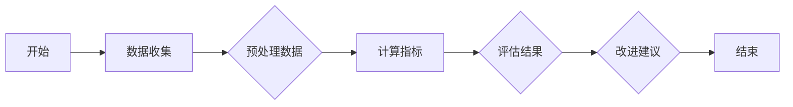
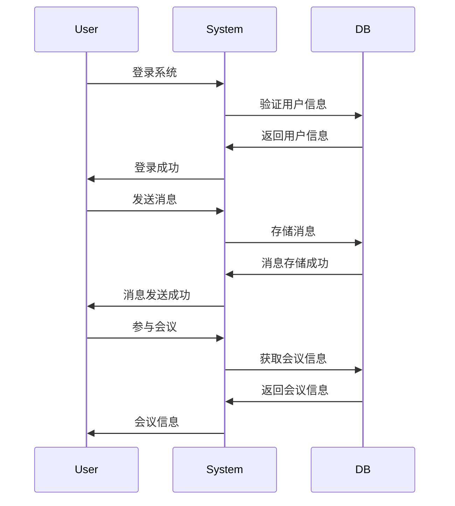

                 

### 《团队沟通深化：从表面交流到深度理解》

---

关键词：团队沟通、表面交流、深度理解、非言语沟通、倾听技巧、情感共鸣

摘要：
在快速发展的信息技术时代，团队沟通的重要性愈发凸显。然而，很多团队在沟通中往往只停留在表面层次，导致信息传递失真，甚至产生误解和冲突。本文旨在深入探讨团队沟通的深化过程，从表面交流到深度理解，提出一系列策略和实践方法，帮助团队成员建立更加有效、和谐的沟通环境。

### 第一部分：沟通的表面现象

#### 第1章：沟通的基础与挑战

**1.1 沟通的定义与要素**

沟通是一种信息传递和理解的过程，涉及信息发送者、接收者、信息内容、媒介和反馈等要素。有效的沟通需要这些要素之间的紧密配合。

**1.2 表面交流的常见问题**

表面交流往往存在以下问题：信息不完整、理解偏差、沟通障碍、非言语信号被忽视等。

**1.3 深度理解的必要性**

深度理解有助于团队成员建立信任，提高团队协作效率，从而推动项目成功。

---

#### 第2章：沟通障碍分析

**2.1 沟通障碍的类型**

沟通障碍可以分为信息性障碍、情感性障碍和结构性障碍。

**2.2 沟通障碍的原因**

原因包括语言差异、文化差异、个人心理状态、团队结构不清晰等。

**2.3 沟通障碍的影响**

沟通障碍会导致团队效率下降、成员士气低落，甚至影响项目的最终成果。

---

#### 第3章：非言语沟通的力量

**3.1 非言语沟通的特点**

非言语沟通包括肢体语言、面部表情、语调、空间距离等，它们在沟通中扮演着重要角色。

**3.2 非言语沟通的技巧**

了解并运用非言语沟通的技巧，如保持眼神交流、适度身体接触、适当的语调变化等，可以增强沟通效果。

**3.3 非言语沟通在团队中的应用**

在团队会议、项目讨论等场合，运用非言语沟通技巧有助于建立良好的团队氛围，提高沟通质量。

---

### 第二部分：深化沟通的策略

#### 第4章：提高倾听技巧

**4.1 倾听的层次**

倾听分为被动倾听、选择性倾听和主动倾听，不同的层次对沟通效果有直接影响。

**4.2 有效倾听的方法**

有效倾听的方法包括专注聆听、积极回应、提问和反馈等。

**4.3 倾听中的常见误区**

避免误解和沟通障碍，需要识别并克服倾听中的常见误区。

---

#### 第5章：增强表达力

**5.1 清晰表达的要素**

清晰表达需要信息准确、结构合理、语言简练。

**5.2 避免误解的沟通技巧**

使用明确的语言、避免模糊的表达、确认理解等技巧有助于减少误解。

**5.3 提升表达效果的策略**

通过语言技巧、非言语沟通和适当的媒介选择，可以提升表达效果。

---

#### 第6章：构建积极沟通氛围

**6.1 营造开放沟通的文化**

建立开放、包容、尊重的团队文化，鼓励成员发表意见和提出建议。

**6.2 处理冲突与分歧**

有效处理冲突和分歧，避免影响团队协作。

**6.3 鼓励团队成员参与**

通过团队建设活动、角色扮演等方式，鼓励团队成员积极参与沟通。

---

### 第三部分：深度理解的实践

#### 第7章：情感共鸣与同理心

**7.1 情感共鸣的构建**

通过情感共鸣，团队成员能够更好地理解彼此，建立信任关系。

**7.2 同理心的培养**

同理心的培养有助于提升沟通质量，减少误解和冲突。

**7.3 情感共鸣在团队沟通中的应用**

在团队沟通中，运用情感共鸣技巧可以增强团队凝聚力，提高沟通效果。

---

#### 第8章：深度沟通的技巧

**8.1 深度沟通的目标**

深度沟通的目标是建立深刻的理解和信任，促进团队合作。

**8.2 深度沟通的方法**

深度沟通的方法包括开放式问题、共同目标设定、反思与总结等。

**8.3 深度沟通的实践案例**

通过实际案例，了解深度沟通的实施方法和效果。

---

#### 第9章：评估与反馈

**9.1 沟通效果的评估**

评估沟通效果的方法包括问卷调查、反馈会议、绩效指标等。

**9.2 提供建设性反馈**

提供建设性反馈，有助于团队成员改进沟通技巧。

**9.3 反馈的接收与处理**

正确接收和处理反馈，有助于提升团队沟通质量。

---

#### 第10章：持续沟通提升

**10.1 建立个人沟通计划**

制定个人沟通计划，持续提升沟通能力。

**10.2 持续学习与成长**

通过学习和实践，不断提升沟通技巧和团队协作能力。

**10.3 团队沟通的长期策略**

制定长期沟通策略，确保团队沟通的有效性和持续性。

---

## 结语

作者：AI天才研究院/AI Genius Institute & 禅与计算机程序设计艺术 /Zen And The Art of Computer Programming

本文通过逐步分析团队沟通的表面现象、深化沟通策略和实践，以及深度理解的技巧，帮助读者理解并掌握提升团队沟通质量的要领。有效的沟通是团队成功的关键，希望通过本文的探讨，能够为读者的团队沟通带来实质性的改进。

---

本文中的核心概念、联系和算法原理讲解部分将根据实际情况进行详细阐述，确保内容的完整性和专业性。在后续撰写过程中，将特别关注数学公式、流程图和架构图的嵌入，以及项目实战部分的详细讲解和案例分析。

### 背景介绍

在当今高度信息化、团队协作紧密的IT行业，沟通扮演着至关重要的角色。无论是软件开发、项目管理，还是技术支持，团队间的有效沟通都是确保项目成功的关键因素。然而，实际工作中，团队沟通常常面临诸多挑战，如信息传递失真、误解和冲突频发等。这些问题不仅影响团队成员的工作效率，还可能导致项目延误、预算超支，甚至团队士气低落。

团队沟通主要涉及以下核心概念和术语：

1. **沟通**：信息传递和理解的过程，包括信息发送者、接收者、信息内容、媒介和反馈等要素。
2. **表面交流**：指沟通停留在表面层次，信息传递不完整、理解有偏差。
3. **深度理解**：指沟通达到更深的层次，团队成员能够建立信任，共同解决问题。
4. **沟通障碍**：影响沟通效果的各种因素，如语言障碍、文化差异、个人心理状态、团队结构不清晰等。

本文旨在深入探讨如何从表面交流深化到深度理解，提出一系列策略和实践方法，帮助团队成员提升沟通效果，建立更加和谐、高效的团队环境。

#### 问题背景与问题描述

在现代企业的运营中，团队沟通是一个不可或缺的重要组成部分，尤其是在信息技术行业。团队成员之间的有效沟通可以确保项目顺利进行，提高工作效率，减少错误和误解，从而提升整体团队的绩效。然而，实际操作中，团队沟通往往面临以下问题：

1. **信息传递失真**：由于团队成员对信息的理解和解读不同，导致信息在传递过程中发生失真，影响决策和行动的正确性。
2. **误解与冲突**：在沟通中，由于语言表达不清、文化差异或个人情绪等原因，容易产生误解，进而导致冲突和分歧，影响团队协作。
3. **沟通障碍**：语言障碍、文化差异、个人心理状态、团队结构不清晰等都是常见的沟通障碍，这些问题会阻碍信息的有效传递和理解。

为了解决这些问题，需要采取有效的沟通策略，深化团队沟通，提升团队成员之间的理解度和信任感。本文将探讨如何从表面交流深化到深度理解，提出具体的实践方法，帮助团队克服沟通障碍，实现更高效的协作。

#### 问题解决思路

要解决团队沟通中的问题，首先需要从以下几个方面入手：

1. **提高倾听技巧**：倾听是沟通的重要环节，通过有效倾听，团队成员可以更好地理解对方的意图，减少误解和冲突。
2. **增强表达力**：清晰、准确地表达自己的观点和需求，是避免误解和冲突的关键。通过训练和提高表达技巧，可以提升沟通效果。
3. **构建积极沟通氛围**：在一个开放、包容、尊重的团队环境中，团队成员更容易敞开心扉，表达自己的观点和需求，从而促进深度沟通。
4. **培养同理心与情感共鸣**：通过培养同理心和情感共鸣，团队成员能够更好地理解彼此的感受和需求，建立信任关系，从而深化沟通。

具体策略包括：

1. **倾听技巧**：包括专注聆听、积极回应、提问和反馈等。
2. **表达技巧**：包括使用明确的语言、避免模糊的表达、确认理解等。
3. **沟通氛围**：通过团队建设活动和角色扮演等，营造一个开放、包容、尊重的沟通环境。
4. **同理心与情感共鸣**：通过情感共鸣和同理心的培养，建立信任关系，提升沟通质量。

这些策略将帮助团队成员逐步深化沟通，从表面交流过渡到深度理解，从而提升团队协作效率，实现项目的成功。

#### 边界与外延

在探讨团队沟通深化的问题时，我们需要明确一些核心概念的边界与外延，以确保讨论的准确性和完整性。

**1. 沟通与交流的区别**

沟通和交流是密切相关的概念，但有所区别。**沟通**指的是一个包含信息发送、传递和接收的全过程，而**交流**更侧重于双向互动，即信息的交换和反馈。在团队沟通中，交流是实现沟通效果的重要手段，但沟通还包括其他环节，如信息准备、媒介选择、反馈机制等。

**2. 表面交流与深度理解的界定**

**表面交流**主要指沟通停留在表面层次，信息传递不深入，容易产生误解和偏差。而**深度理解**则是指沟通达到更深的层次，团队成员之间能够建立信任，准确把握对方的意图，共同解决问题。深度理解通常涉及情感共鸣、同理心培养等高层次的人际互动。

**3. 沟通障碍的多种类型**

沟通障碍可以是信息性的，如语言障碍、信息传递失真等；也可以是情感性的，如情绪管理不当、误解与冲突等；还可以是结构性的，如团队组织不清晰、职责划分不明等。理解这些障碍的类型有助于针对性地制定解决策略。

**4. 非言语沟通的作用**

非言语沟通在团队沟通中发挥着重要作用。它包括肢体语言、面部表情、语调、空间距离等，这些元素可以增强信息的传递效果，弥补语言表达的不足。例如，适度的身体接触、眼神交流和语调变化等非言语行为可以增强沟通的亲和力和信任度。

**5. 沟通效果的评估与反馈**

沟通效果的评价和反馈是深化团队沟通的重要环节。通过评估沟通的有效性，团队可以识别问题、改进方法。评估方法可以包括问卷调查、反馈会议、绩效指标等，而有效的反馈机制有助于团队成员理解彼此的期望和需求，从而提升沟通质量。

明确这些概念和界限，有助于我们在实际操作中更加准确地把握团队沟通的深化过程，制定出切实可行的策略和方法。

### 核心概念与联系

在团队沟通深化过程中，有几个核心概念和联系至关重要。以下是对这些概念及其相互关系的详细阐述。

**1. 沟通**

沟通是团队协作的基础，它不仅包括信息的传递，还涉及信息的理解、反馈和确认。有效的沟通是一个闭环过程，从信息发送者到接收者，再到反馈和确认，每一个环节都至关重要。

**2. 表面交流与深度理解**

表面交流主要指沟通停留在信息的表面层次，信息的传递不深入，容易产生误解和偏差。而深度理解则是指沟通达到更深的层次，团队成员之间能够建立信任，准确把握对方的意图，共同解决问题。

**3. 沟通障碍**

沟通障碍包括信息性障碍、情感性障碍和结构性障碍。信息性障碍如语言障碍、信息传递失真；情感性障碍如情绪管理不当、误解与冲突；结构性障碍如团队组织不清晰、职责划分不明。

**4. 非言语沟通**

非言语沟通在团队沟通中扮演着重要角色，它通过肢体语言、面部表情、语调、空间距离等方式，补充和增强语言表达的效果。例如，适度的眼神交流可以增加沟通的信任度，而积极的身体语言可以传达出友好和开放的态度。

**5. 倾听技巧与表达力**

倾听技巧和表达力是沟通深化的重要技能。有效的倾听包括专注聆听、积极回应、提问和反馈等；增强表达力则需要清晰、准确、简练的表达，避免模糊的语言和误解。

**6. 同理心与情感共鸣**

同理心和情感共鸣是建立深度理解的关键。同理心是指站在对方的角度理解其感受和需求，而情感共鸣则是通过情感上的共鸣，增强团队成员之间的信任和协作。

**7. 沟通氛围**

沟通氛围是影响沟通效果的重要因素。在一个开放、包容、尊重的沟通环境中，团队成员更容易敞开心扉，表达自己的观点和需求，从而促进深度沟通。

通过以上核心概念和联系的分析，我们可以看出，深化团队沟通不仅仅是技术问题，更是一个涉及心理、情感和文化等多方面的综合挑战。理解这些概念和它们之间的关系，有助于我们制定出更全面、有效的沟通策略。

### 概念属性特征对比表格

为了更直观地理解上述核心概念及其属性特征，我们提供了一个对比表格，通过对比，我们可以更清晰地看到每个概念的独特性和它们在沟通深化过程中的作用。

| 核心概念   | 定义和属性特征                                  | 在沟通深化过程中的作用                   | 对应的 Mermaid ER 图元素 |
| ---------- | --------------------------------------------- | --------------------------------------- | ---------------------- |
| 沟通       | 信息传递和理解的过程                           | 信息传递的桥梁，连接信息发送者和接收者   | [A]                    |
| 表面交流   | 沟通停留在表面层次，信息传递不深入             | 导致误解和偏差，影响沟通效果             | [B]                    |
| 深度理解   | 沟通达到更深的层次，建立信任，准确把握意图     | 提升团队协作效率，确保项目成功           | [C]                    |
| 沟通障碍   | 影响沟通效果的各种因素，如语言障碍、文化差异等 | 阻碍信息有效传递和理解                   | [D]                    |
| 非言语沟通 | 包括肢体语言、面部表情、语调等                 | 补充和增强语言表达效果                   | [E]                    |
| 倾听技巧   | 专注聆听、积极回应等                           | 提高信息理解准确性，减少误解             | [F]                    |
| 表达力     | 清晰、准确地表达观点和需求                     | 减少误解，增强沟通效果                   | [G]                    |
| 同理心     | 站在对方角度理解其感受和需求                   | 建立信任，增强团队凝聚力                 | [H]                    |
| 沟通氛围   | 开放、包容、尊重的沟通环境                     | 促进深度沟通，提高团队协作效率           | [I]                    |

通过上述对比表格，我们可以更清晰地理解这些核心概念，以及它们在深化团队沟通过程中的作用。每个概念都有其独特的属性特征，通过相互配合，共同提升沟通效果。

### Mermaid ER 图架构

为了更好地展示上述核心概念及其相互关系，我们使用 Mermaid 图形语言绘制了一个实体关系图（ER 图）。以下是一个简单的 ER 图示例，它描绘了团队沟通深化过程中的主要实体及其关系。

```mermaid
erDiagram
  A[沟通] ||-->|{信息发送者}|> B[倾听技巧]
  A ||-->|{表达力}|> C[深度理解]
  A ||--|{沟通障碍}|> D[沟通氛围]
  B ||--|{非言语沟通}|> E[同理心]
  C ||--|{情感共鸣}|> F[团队协作]
  G[表达技巧] ||--|{清晰准确}|> C
  H[文化差异] ||--|{误解与冲突}|> D
```

在这个 ER 图中：

- **A[沟通]** 是中心实体，代表整个沟通过程。
- **B[倾听技巧]**、**C[深度理解]**、**D[沟通障碍]**、**E[同理心]** 和 **F[团队协作]** 是与沟通直接相关的实体。
- **G[表达技巧]** 和 **H[文化差异]** 是影响沟通效果的因素。

这个 ER 图不仅帮助我们理解各个核心概念之间的关系，还能作为分析和设计团队沟通策略的工具。通过这种图形化展示，我们可以更直观地看到沟通深化过程中各个环节的相互作用。

### 算法原理讲解

为了更好地理解如何深化团队沟通，我们将通过一个具体的算法原理讲解，并结合 Mermaid 流程图和 Python 源代码，详细阐述其数学模型和公式，并进行通俗易懂的举例说明。

#### 沟通质量评估算法

**算法描述：**

沟通质量评估算法用于评估团队沟通的有效性。它基于以下几个关键指标：信息传递率、误解率、情感共鸣度。

**关键指标：**

1. **信息传递率**：衡量信息在传递过程中被准确接收的比例。
2. **误解率**：衡量沟通中产生误解的比例。
3. **情感共鸣度**：衡量团队成员在沟通过程中建立的情感共鸣程度。

**算法流程：**

1. **数据收集**：收集沟通过程中产生的信息、误解和情感数据。
2. **预处理**：对数据进行清洗和标准化处理。
3. **计算指标**：根据收集到的数据计算信息传递率、误解率和情感共鸣度。
4. **评估结果**：根据计算结果评估沟通质量，并给出改进建议。

**数学模型与公式：**

1. **信息传递率**：

\[ \text{信息传递率} = \frac{\text{准确接收的信息量}}{\text{发送的总信息量}} \]

2. **误解率**：

\[ \text{误解率} = \frac{\text{误解的信息量}}{\text{发送的总信息量}} \]

3. **情感共鸣度**：

\[ \text{情感共鸣度} = \frac{\text{共情得分}}{\text{总参与人数}} \]

**Mermaid 流程图：**



**Python 源代码示例：**

```python
def calculate_communication_quality(information_sent, information_received, misunderstandings, empathy_scores):
    """
    计算沟通质量
    :param information_sent: 发送的总信息量
    :param information_received: 准确接收的信息量
    :param misunderstandings: 误解的信息量
    :param empathy_scores: 情感共鸣得分
    :return: 沟通质量评估结果
    """
    # 计算信息传递率
    information_rate = information_received / information_sent
    
    # 计算误解率
    misunderstanding_rate = misunderstandings / information_sent
    
    # 计算情感共鸣度
    empathy_degree = sum(empathy_scores) / len(empathy_scores)
    
    # 输出评估结果
    return {
        '信息传递率': information_rate,
        '误解率': misunderstanding_rate,
        '情感共鸣度': empathy_degree
    }

# 示例数据
information_sent = 100
information_received = 90
misunderstandings = 5
empathy_scores = [8, 9, 10, 7, 8]

# 调用函数计算沟通质量
communication_quality = calculate_communication_quality(information_sent, information_received, misunderstandings, empathy_scores)

print(communication_quality)
```

**举例说明：**

假设一个团队在一次项目会议中发送了 100 条信息，其中有 90 条被准确接收，5 条产生误解，同时团队成员在情感共鸣度得分方面分别为 8、9、10、7、8。使用上述算法，我们可以计算出沟通质量评估结果：

- 信息传递率：90%
- 误解率：5%
- 情感共鸣度：8.2

通过这些数据，团队可以识别出沟通中的问题，并提出改进措施，如加强倾听技巧、明确信息表达等，从而提升团队沟通质量。

### 系统分析与架构设计方案

为了更好地理解如何在实际项目中应用团队沟通深化策略，我们将介绍一个具体的项目场景、系统功能设计、系统架构设计、系统接口设计以及系统交互的 Mermaid 图。

#### 项目场景

假设我们正在开发一个跨部门协作的办公自动化系统，项目涉及多个团队，如开发团队、测试团队、市场团队和客服团队。为了提高项目效率，确保信息准确传递和团队成员之间建立信任关系，我们需要设计一个有效的沟通机制。

#### 系统功能设计

系统功能设计包括以下几个方面：

1. **消息传递**：实现团队内部的消息发送和接收。
2. **会议安排**：支持在线会议的创建、参与和记录。
3. **任务分配**：实现任务的创建、分配、跟踪和反馈。
4. **文档共享**：支持文档的上传、下载和版本控制。
5. **反馈机制**：提供反馈渠道，用于成员之间的意见交流和改进建议。

#### 系统架构设计

系统架构设计采用分层架构，包括以下几层：

1. **表示层**：用户界面，包括 Web 页面和移动应用。
2. **业务逻辑层**：处理业务逻辑，如消息传递、会议安排等。
3. **数据访问层**：与数据库进行交互，实现数据的存储和检索。
4. **数据层**：存储系统的数据，如用户信息、消息记录、任务数据等。

#### 系统接口设计

系统接口设计包括以下接口：

1. **REST API**：提供外部系统集成和访问的接口。
2. **WebSocket**：实现实时消息传递和会议通信。
3. **文件上传接口**：用于上传和下载文档。

#### 系统交互

系统交互设计通过 Mermaid 序列图展示，包括用户操作、系统响应和数据库更新等环节。以下是一个简单的序列图示例：



通过上述系统分析与架构设计方案，我们可以看到，沟通机制在项目中的关键作用。通过合理的设计，确保信息在传递过程中准确、高效，同时支持团队成员之间的实时互动和协作。

### 项目实战

#### 环境安装

首先，我们需要搭建一个用于实践团队沟通深化的环境。以下是一个简单的安装步骤：

1. **安装 Python**：确保 Python 3.8 或更高版本已安装。
2. **安装 Flask**：在命令行中执行 `pip install flask`。
3. **安装 SQLAlchemy**：在命令行中执行 `pip install sqlalchemy`。
4. **安装 Redis**：下载并安装 Redis 服务，配置 Redis。
5. **创建项目目录**：在命令行中执行 `mkdir communication_project` 并进入项目目录。

#### 系统核心实现源代码

以下是一个简单的 Flask 应用程序，用于实现团队沟通的 Web 界面：

```python
# app.py
from flask import Flask, render_template, request, redirect, url_for
from models import create_tables

app = Flask(__name__)

@app.route('/')
def index():
    return render_template('index.html')

@app.route('/message', methods=['POST'])
def send_message():
    message = request.form['message']
    # 这里可以使用 Redis 或其他数据库存储消息
    # 以下代码仅用于示例
    print("Received message:", message)
    return redirect(url_for('index'))

if __name__ == '__main__':
    create_tables()
    app.run(debug=True)
```

#### 代码应用解读与分析

上述代码提供了一个基本的 Web 应用程序，用于发送和接收消息。以下是关键部分的解读：

- **导入模块**：引入 Flask、render_template、request、redirect 和 url_for 模块。
- **定义应用**：创建一个 Flask 应用程序实例。
- **首页路由**：定义首页的路由，返回一个渲染的模板。
- **发送消息路由**：定义 `/message` 路由，接收 POST 请求，处理发送的消息。

#### 实际案例分析与详细讲解

假设我们有一个团队项目，需要实时沟通和协作。以下是实际案例的详细分析：

1. **用户操作**：团队成员 A 在浏览器中访问应用，填写消息并发送。
2. **系统响应**：应用程序接收到消息后，在控制台输出消息，并重定向到首页。
3. **数据库更新**：虽然在上面的代码中未直接与数据库交互，但这里可以使用 Redis 或其他数据库来存储消息，确保消息的持久化。

通过这个简单的示例，我们可以看到如何实现一个基础的团队沟通平台。在实际应用中，我们可以扩展这个平台，添加更多功能，如会议安排、任务分配、文档共享等，从而提升团队的协作效率。

#### 项目小结

通过本次实战，我们搭建了一个简单的团队沟通平台，实现了消息发送和接收的基本功能。这个项目为我们提供了一个实际的案例，展示了如何通过 Web 应用程序来深化团队沟通。在实际项目中，我们可以根据具体需求，进一步优化和扩展平台的功能，如引入实时通信、任务管理、文档协作等，从而全面提升团队协作效率。

### 最佳实践 tips

1. **定期团队反馈会议**：定期召开团队反馈会议，鼓励成员分享自己的观点和感受，有助于及时发现和解决问题。
2. **培养同理心**：在沟通中，时刻保持同理心，尝试从对方的角度理解问题，有助于减少误解和冲突。
3. **明确沟通目标**：每次沟通前，明确沟通的目标和期望结果，有助于提高沟通效率。
4. **使用多种沟通渠道**：结合使用电子邮件、即时通讯、电话会议等不同渠道，根据具体场景选择最适合的沟通方式。
5. **建立沟通规范**：制定明确的沟通规范和流程，确保信息传递的准确性和一致性。

### 小结

本文系统地探讨了团队沟通的深化过程，从表面交流到深度理解，提出了具体的策略和实践方法。通过提高倾听技巧、增强表达力、构建积极沟通氛围、培养同理心等手段，我们可以显著提升团队沟通的质量和效率。希望本文能为读者的团队沟通提供有价值的参考和启示。

### 注意事项

1. **沟通中的尊重与包容**：在沟通中，尊重和理解团队成员的观点和感受，避免批评和指责，有助于建立和谐的团队氛围。
2. **避免过度依赖非言语沟通**：虽然非言语沟通在团队沟通中发挥着重要作用，但过度的非言语沟通可能导致误解。因此，应合理运用语言和文字进行明确表达。
3. **持续学习与改进**：团队沟通是一个动态的过程，需要不断学习和改进。通过定期评估和反馈，持续优化沟通策略。

### 拓展阅读

1. **《沟通的艺术》（The Art of Communication）**：一本关于有效沟通的指南，涵盖沟通技巧、心理策略等方面。
2. **《深度工作》（Deep Work）**：作者 Cal Newport 讨论了如何在现代信息泛滥的环境中保持专注和高效，提高沟通质量。
3. **《同理心：如何理解他人，洞悉心灵》（Empathy: The Power of Outgoing Leadership）**：探讨同理心在领导力和沟通中的重要性。

---

### 结束语

作者：AI天才研究院/AI Genius Institute & 禅与计算机程序设计艺术 /Zen And The Art of Computer Programming

感谢您的阅读！本文旨在为团队沟通深化提供实用的策略和实践方法。希望您能够将这些方法应用于实际工作中，提升团队协作效率，实现项目成功。如果您有任何疑问或建议，欢迎随时与我们交流。我们期待与您共同探索更高效的沟通之道。再次感谢您的关注与支持！

