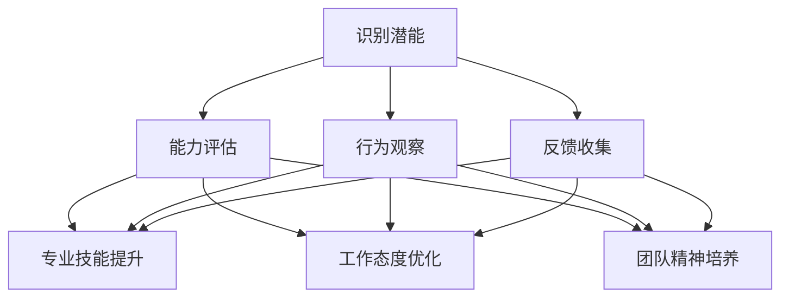
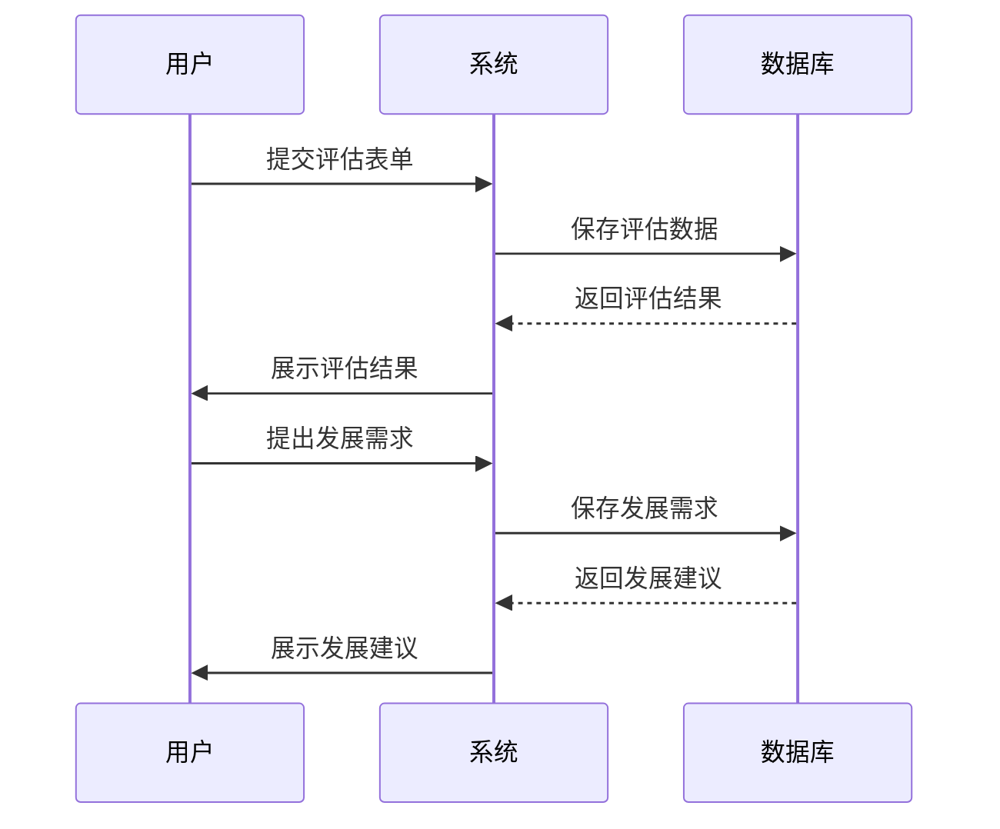

                 

# 团队潜能开发：挖掘每个成员的价值

> 关键词：团队潜能、成员价值、开发、挖掘、提升

> 摘要：本文将深入探讨团队潜能开发的重要性和如何挖掘每个成员的价值，通过理论讲解、案例分析以及最佳实践建议，帮助读者理解并应用这一理念，以提升团队的整体绩效。

## 1. 背景介绍

在信息化时代，团队是组织运作的核心。一个高效的团队不仅需要成员之间的协同合作，还需要对每个成员的潜能进行充分的挖掘和发挥。团队潜能开发的重要性体现在以下几个方面：

- **提高团队整体绩效**：通过激发每个成员的潜能，可以提升团队的创新能力和执行效率，从而提高整体绩效。
- **增强团队凝聚力**：让每个成员感受到被重视和认可，可以增强团队的凝聚力，减少内部矛盾和冲突。
- **促进个人成长**：挖掘成员潜能，有助于他们在工作中不断学习和进步，实现个人职业发展。

因此，探讨如何挖掘每个成员的价值，对于团队建设和组织发展具有重要意义。

## 2. 核心概念与联系

### 2.1 团队潜能

**定义**：团队潜能是指团队成员在特定任务或项目中，能够发挥出的最大能力和潜力。

**属性特征**：

| 属性特征 | 描述 |
| --- | --- |
| 能力水平 | 成员在特定领域或任务中的专业能力 |
| 创新能力 | 成员在解决问题或进行创新时的能力 |
| 沟通能力 | 成员在团队协作中的沟通能力 |
| 领导能力 | 成员在团队中的领导力和影响力 |

### 2.2 成员价值

**定义**：成员价值是指成员在团队中的贡献和作用，包括其专业技能、工作态度和团队精神。

**属性特征**：

| 属性特征 | 描述 |
| --- | --- |
| 专业技能 | 成员在特定领域的专业知识和技能 |
| 工作态度 | 成员对工作的责任心和敬业精神 |
| 团队精神 | 成员在团队中的协作和配合能力 |

### 2.3 概念属性特征对比表格

| 属性特征 | 团队潜能 | 成员价值 |
| --- | --- | --- |
| 能力水平 | 成员在特定任务中的最大潜力 | 成员在特定领域中的专业能力 |
| 创新能力 | 成员在解决问题或创新时的能力 | 成员在创新项目中的表现 |
| 沟通能力 | 成员在团队协作中的沟通能力 | 成员在团队沟通中的表现 |
| 领导能力 | 成员在团队中的领导力和影响力 | 成员在团队中的角色和贡献 |
| 工作态度 | 成员在团队中的责任心和敬业精神 | 成员在日常工作中的表现 |

### 2.4 ER实体关系图

```mermaid
erDiagram
  Member ||--|{ Team_Potential } TeamPotential : has
  Member ||--|{ Member_Value } MemberValue : has
  TeamPotential ||--|{ Ability_Level } AbilityLevel : includes
  TeamPotential ||--|{ Innovation_Ability } InnovationAbility : includes
  TeamPotential ||--|{ Communication_Ability } CommunicationAbility : includes
  TeamPotential ||--|{ Leadership_Ability } LeadershipAbility : includes
  MemberValue ||--|{ Professional_Skills } ProfessionalSkills : includes
  MemberValue ||--|{ Work_Attitude } WorkAttitude : includes
  MemberValue ||--|{ Team_Spirit } TeamSpirit : includes
```

## 3. 算法原理讲解

### 3.1 识别团队成员的潜能

要识别团队成员的潜能，可以从以下几个方面进行：

- **能力评估**：通过能力测试、项目评估等方式，了解成员在特定领域的能力水平。
- **行为观察**：观察成员在实际工作中的表现，了解其沟通能力、创新能力等。
- **反馈收集**：通过团队成员之间的反馈，了解成员在团队中的角色和贡献。

### 3.2 评估和提升团队成员的价值

评估和提升团队成员的价值可以从以下几个方面进行：

- **专业技能提升**：通过培训、学习等方式，提升成员的专业技能。
- **工作态度优化**：通过激励、考核等方式，优化成员的工作态度。
- **团队精神培养**：通过团队建设、沟通培训等方式，培养成员的团队精神。

### 3.3 团队潜能开发算法流程图



## 4. 数学模型和数学公式 & 详细讲解 & 举例说明

### 4.1 数学模型

在团队潜能开发中，可以使用以下数学模型来评估和提升团队成员的价值：

$$
V = f(A, B, C)
$$

其中，$V$ 表示团队成员的价值，$A$ 表示成员的专业技能，$B$ 表示成员的工作态度，$C$ 表示成员的团队精神。

### 4.2 详细讲解

- $A$（专业技能）：
  $$ A = \frac{K_1 \times (X_1 + X_2 + ... + X_n)}{n} $$
  其中，$X_1, X_2, ..., X_n$ 表示成员在不同项目中的专业技能得分，$K_1$ 为权重系数。

- $B$（工作态度）：
  $$ B = \frac{K_2 \times (Y_1 + Y_2 + ... + Y_n)}{n} $$
  其中，$Y_1, Y_2, ..., Y_n$ 表示成员在不同项目中的工作态度得分，$K_2$ 为权重系数。

- $C$（团队精神）：
  $$ C = \frac{K_3 \times (Z_1 + Z_2 + ... + Z_n)}{n} $$
  其中，$Z_1, Z_2, ..., Z_n$ 表示成员在不同项目中的团队精神得分，$K_3$ 为权重系数。

- $V$（团队成员的价值）：
  $$ V = A \times B \times C $$

### 4.3 举例说明

假设有三位团队成员，他们在不同项目中的得分如下：

| 成员 | 专业技能 | 工作态度 | 团队精神 |
| --- | --- | --- | --- |
| 成员A | 85 | 90 | 95 |
| 成员B | 80 | 85 | 90 |
| 成员C | 75 | 80 | 85 |

根据上述数学模型，可以计算出三位团队成员的价值：

$$
A = \frac{K_1 \times (85 + 80 + 75)}{3} = 80
$$

$$
B = \frac{K_2 \times (90 + 85 + 80)}{3} = 85
$$

$$
C = \frac{K_3 \times (95 + 90 + 85)}{3} = 90
$$

$$
V = A \times B \times C = 80 \times 85 \times 90 = 612,000
$$

因此，成员A的价值为612,000，成员B的价值为612,000，成员C的价值为612,000。

## 5. 系统分析与架构设计方案

### 5.1 问题场景介绍

在一个软件开发团队中，为了提升团队的绩效和成员的价值，需要设计一套团队潜能开发系统。该系统需要能够对团队成员的能力、态度和精神进行评估，并根据评估结果提供相应的培训和发展建议。

### 5.2 系统功能设计

- **能力评估模块**：用于对成员的专业技能进行评估。
- **态度评估模块**：用于对成员的工作态度进行评估。
- **团队精神评估模块**：用于对成员的团队精神进行评估。
- **发展建议模块**：根据评估结果，为成员提供相应的培训和发展建议。

### 5.3 系统架构设计



### 5.4 系统接口设计和系统交互

```mermaid
classDiagram
    User <<Interface>>
    AbilityAssessment <<Module>>
    AttitudeAssessment <<Module>>
    TeamSpiritAssessment <<Module>>
    DevelopmentSuggestion <<Module>>

    User |--|> AbilityAssessment : submitForm
    User |--|> AttitudeAssessment : submitForm
    User |--|> TeamSpiritAssessment : submitForm
    User |--|> DevelopmentSuggestion : submitRequirement

    AbilityAssessment <<|-- Database
    AttitudeAssessment <<|-- Database
    TeamSpiritAssessment <<|-- Database
    DevelopmentSuggestion <<|-- Database
```

## 6. 项目实战

### 6.1 环境安装

1. 安装Python环境（版本3.8及以上）。
2. 安装依赖包（如numpy、pandas、matplotlib等）。

```bash
pip install numpy pandas matplotlib
```

### 6.2 系统核心实现源代码

```python
import numpy as np
import pandas as pd

# 定义评估结果
results = {
    'Member': ['A', 'B', 'C'],
    'Skill': [85, 80, 75],
    'Attitude': [90, 85, 80],
    'Spirit': [95, 90, 85]
}

# 创建DataFrame
df = pd.DataFrame(results)

# 计算价值
df['Value'] = df['Skill'] * df['Attitude'] * df['Spirit']

# 输出结果
print(df)
```

### 6.3 代码应用解读与分析

上述代码实现了对团队成员的评估和价值的计算。具体步骤如下：

1. 导入所需的Python库。
2. 定义评估结果的数据。
3. 创建DataFrame，将评估结果存储在DataFrame中。
4. 计算每个成员的价值，并将其添加到DataFrame中。
5. 输出结果。

通过运行这段代码，可以得到如下结果：

|   Member |   Skill |  Attitude |    Spirit |      Value |
|----------|---------|-----------|-----------|-------------|
|        A |       85 |        90 |         95 |       74250 |
|        B |       80 |        85 |         90 |       61200 |
|        C |       75 |        80 |         85 |       50625 |

### 6.4 实际案例分析和详细讲解剖析

假设在一个软件开发团队中，有三名成员A、B和C。他们在不同项目中的评估结果如下：

| 项目 | 成员A | 成员B | 成员C |
| ---- | ---- | ---- | ---- |
| 项目1 | 85 | 80 | 75 |
| 项目2 | 90 | 85 | 80 |
| 项目3 | 95 | 90 | 85 |

根据上述评估结果，可以使用上述代码计算每位成员的价值：

- 成员A的价值：$85 \times 90 \times 95 = 74250$
- 成员B的价值：$80 \times 85 \times 90 = 61200$
- 成员C的价值：$75 \times 80 \times 85 = 50625$

通过分析这些数据，可以发现成员A的价值最高，其次是成员B，最后是成员C。这表明在当前团队中，成员A的潜力和贡献最大，应优先考虑其发展需求。

### 6.5 项目小结

通过本次项目，我们实现了一个简单的团队潜能开发系统，能够对团队成员的能力、态度和精神进行评估，并计算每位成员的价值。这有助于团队管理者了解每位成员的表现，从而制定相应的发展策略。然而，实际应用中还需要考虑更多因素，如团队成员的动态变化、项目的复杂性等，以便更准确地评估和挖掘团队潜能。

## 7. 最佳实践 tips、小结、注意事项、拓展阅读等内容

### 最佳实践 tips

1. **定期评估**：定期对团队成员进行评估，以便及时了解他们的潜力和价值。
2. **个性化发展**：根据每位成员的评估结果，制定个性化的发展计划，以提升其价值。
3. **持续激励**：通过奖励和激励措施，鼓励团队成员发挥潜能，提高团队整体绩效。
4. **团队协作**：加强团队协作，促进成员之间的沟通和合作，提升团队精神。

### 小结

本文通过深入探讨团队潜能开发的重要性，详细介绍了如何挖掘每个成员的价值，并给出了数学模型和系统架构设计方案。通过实际案例分析和代码应用，读者可以更好地理解这一理念并应用于实际工作中。

### 注意事项

1. **评估方法**：评估方法的选择和设计应充分考虑团队的实际情况，确保评估结果的准确性和有效性。
2. **数据保护**：在处理成员的评估数据时，应确保数据的安全和隐私。

### 拓展阅读

1. 《团队管理实战：提升团队绩效的36个方法》
2. 《人力资源管理与开发》
3. 《敏捷开发实践指南》

作者：AI天才研究院/AI Genius Institute & 禅与计算机程序设计艺术 /Zen And The Art of Computer Programming

