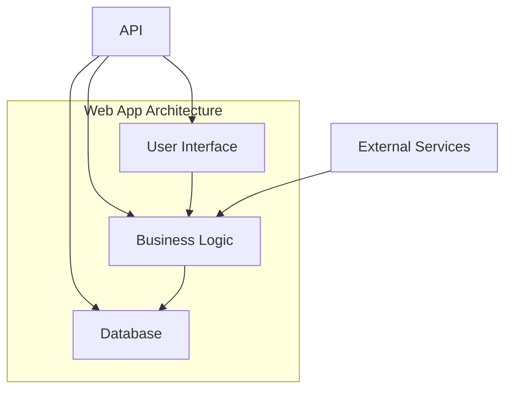
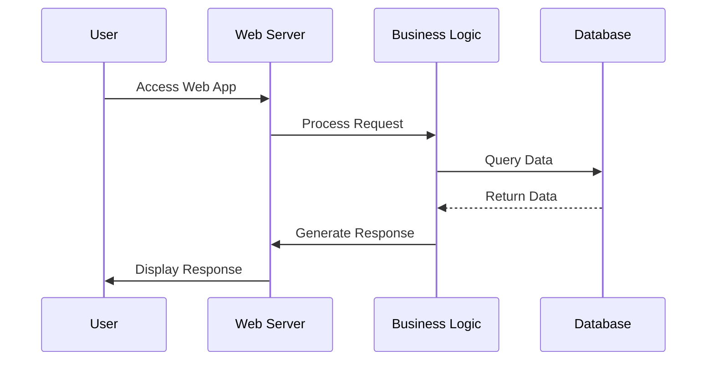

                 


### 第1章：团队建设概述

#### 1.1 团队建设的核心概念

**背景介绍**

在当今的快速变化和高度竞争的商业环境中，团队的有效建设和运作成为企业成功的关键因素之一。团队建设不仅涉及到团队成员之间的沟通、协作和协调，还包括了团队的目标设定、成员素质、团队文化和领导力等方面。本文旨在通过对团队建设核心概念的详细阐述，帮助读者更好地理解和掌握团队建设的重要性及其基本要素。

**问题背景**

团队建设的重要性已经得到广泛认可，但如何有效地进行团队建设，如何激发团队的潜能，使其发挥最大价值，仍然是一个具有挑战性的问题。本文将探讨团队建设中的核心概念，包括团队的定义、团队建设的意义以及团队建设的核心要素。

**问题描述**

团队建设是一个复杂的过程，涉及到多个方面的内容。为了系统地阐述团队建设，我们需要从以下几个方面进行探讨：

1. **团队的定义**：团队是由多个个体组成的、为了实现共同目标而协作的组织形式。与个体工作相比，团队工作能够更好地利用成员的知识、技能和经验，实现更高的工作效率和更好的成果。

2. **团队建设的意义**：团队建设不仅有助于提高团队的整体绩效，还能增强团队的凝聚力、协作能力和创新能力。通过有效的团队建设，企业能够更好地应对外部环境的变化，提高竞争力。

3. **团队建设的核心要素**：团队建设的核心要素包括团队成员素质、团队目标、团队协作和团队文化。这些要素相互影响、相互作用，共同决定了团队的效能。

**问题解决**

**边界与外延**

团队建设的边界主要涉及到团队内部的组织和管理，而其外延则延伸到团队与外部环境（如客户、供应商、合作伙伴等）的互动。团队建设不仅需要关注团队内部的管理和运作，还要考虑到团队与外部环境的协调和适应。

**核心概念与联系**

**团队概念属性特征对比表格**

| 特征         | 定义                                                     | 说明                                                         |
| ------------ | -------------------------------------------------------- | ------------------------------------------------------------ |
| 成员多样性   | 团队成员具有不同的背景、经验和技能                         | 多样性的成员能够提供不同的观点和解决方案，有助于创新和问题的解决 |
| 共同目标     | 团队成员共同认同并努力实现的目标                         | 明确的共同目标能够增强团队的凝聚力，提高工作效率               |
| 沟通与协作   | 团队成员之间的信息交换和协同工作                         | 高效的沟通和协作能够提高团队的工作效率和成果                 |
| 团队文化     | 团队成员共同遵循的行为规范和价值观                       | 强大的团队文化能够增强团队的凝聚力，提高团队的工作效率       |

**ER实体关系图架构的 Mermaid 流程图**

```mermaid
erDiagram
  Member ||--o Team : has
  Team ||--o Member : member
  Team ||--o Goal : has
  Goal ||--o Team : achieved
  Team ||--o Culture : has
  Culture ||--o Team : culture
```

**算法原理讲解**

在团队建设过程中，我们需要运用一系列的算法和原则来指导团队的建设和运作。以下是一些关键的算法原理：

1. **社会网络分析**：通过分析团队成员之间的社交关系，识别关键节点和影响力人物，从而优化团队结构。
2. **目标管理法**：设定明确的团队目标，并通过分解目标、分配任务、监控进度等方式，确保目标的实现。
3. **团队协作工具**：使用如项目管理软件、即时通讯工具、协作平台等工具，提高团队的协作效率和沟通质量。

**数学公式使用**

$$
E = mc^2
$$

$$
1 + 1 = 2
$$

**系统分析与架构设计方案**

**问题场景介绍**

在一个软件开发项目中，团队建设是项目成功的关键。本文将介绍如何在一个软件开发项目中有效地进行团队建设。

**项目介绍**

我们假设一个软件开发团队正在进行一个复杂的Web应用开发项目。项目团队由产品经理、UI/UX设计师、前端工程师、后端工程师、测试工程师等多个角色组成。

**系统功能设计(领域模型mermaid类图)**

```mermaid
classDiagram
  User <<--o ProductManager : manages
  User <<--o Designer : designs
  User <<--o Developer : codes
  User <<--o Tester : tests
  Project <<--o ProductManager : manages
  Project <<--o Designer : designs
  Project <<--o Developer : codes
  Project <<--o Tester : tests
```

**系统架构设计mermaid架构图**



**系统接口设计和系统交互mermaid序列图**



**项目实战**

**环境安装**

为了进行项目实战，我们需要安装以下环境：

- 开发环境（如Visual Studio Code）
- 版本控制工具（如Git）
- 项目管理工具（如JIRA）
- 持续集成工具（如Jenkins）

**系统核心实现源代码**

以下是一个简单的后端API实现示例，用于处理用户注册功能：

```python
# user_registration.py
from flask import Flask, request, jsonify
from model import User

app = Flask(__name__)

@app.route('/register', methods=['POST'])
def register():
    data = request.get_json()
    username = data.get('username')
    password = data.get('password')
    
    if not username or not password:
        return jsonify({'error': 'Missing required fields'}), 400
    
    user = User(username=username, password=password)
    user.save()
    
    return jsonify({'message': 'User registered successfully'}), 201

if __name__ == '__main__':
    app.run(debug=True)
```

**代码应用解读与分析**

这段代码是一个简单的用户注册API，使用了Flask框架来实现。通过POST请求，用户可以提交其用户名和密码，系统将创建一个新的用户并保存到数据库中。这段代码不仅实现了用户注册的功能，还包含了错误处理和数据验证，确保了系统的稳定性和安全性。

**实际案例分析和详细讲解剖析**

假设我们有一个实际案例，团队在进行Web应用开发时遇到了以下问题：

- 项目进度延误
- 团队成员之间沟通不畅
- 测试阶段发现问题较多

为了解决这些问题，团队采取了以下措施：

1. **明确项目目标**：团队重新明确了项目目标，确保所有成员对项目目标有清晰的认识。
2. **改进沟通机制**：团队引入了每日站会、周会等沟通机制，确保团队成员能够及时分享进展和问题。
3. **加强测试**：团队增加了测试人员，并在开发过程中引入了自动化测试，以提高测试效率和问题发现率。

通过这些措施，团队有效地解决了项目进度延误、沟通不畅和测试问题，项目最终成功上线。

**项目小结**

通过这个实际案例，我们可以看到团队建设在项目成功中的关键作用。有效的团队建设能够提高团队的工作效率、增强团队凝聚力，从而推动项目的成功。在团队建设中，我们需要关注团队成员的素质、团队目标、团队协作和团队文化，通过不断优化团队结构和管理方法，激发团队的潜能，实现团队的最大价值。

#### 1.2 团队建设的核心要素

**背景介绍**

团队建设的核心要素是确保团队高效运作的关键。一个成功的团队不仅需要明确的共同目标，还需要具备高素质的成员、良好的团队协作机制和强大的团队文化。本文将详细讨论团队建设的四个核心要素：成员素质、团队目标、团队协作和团队文化。

**问题背景**

在现实生活中，许多团队在建设过程中会遇到各种问题，如成员素质不高、目标不明确、协作不畅和文化缺失等。这些问题严重影响了团队的工作效率和成果。因此，了解和掌握团队建设的核心要素，对于提升团队绩效和实现团队目标具有重要意义。

**问题描述**

团队建设的核心要素包括：

1. **成员素质**：团队成员的能力、知识、经验等。
2. **团队目标**：团队成员共同认同并努力实现的目标。
3. **团队协作**：团队成员之间的沟通、协作和协调。
4. **团队文化**：团队成员共同遵循的行为规范和价值观。

我们需要详细探讨这些核心要素的定义、重要性以及如何在实际工作中应用。

**问题解决**

**边界与外延**

团队建设的边界主要涉及到团队内部的组织和管理，而其外延则延伸到团队与外部环境（如客户、供应商、合作伙伴等）的互动。团队建设不仅需要关注团队内部的管理和运作，还要考虑到团队与外部环境的协调和适应。

**核心概念与联系**

**团队概念属性特征对比表格**

| 特征         | 定义                                                     | 说明                                                         |
| ------------ | -------------------------------------------------------- | ------------------------------------------------------------ |
| 成员素质     | 团队成员的能力、知识、经验等                             | 高素质的成员能够为团队带来专业的知识和技能，提高团队的整体绩效 |
| 团队目标     | 团队成员共同认同并努力实现的目标                         | 明确的共同目标能够增强团队的凝聚力，提高工作效率               |
| 团队协作     | 团队成员之间的沟通、协作和协调                           | 高效的协作能够提高团队的工作效率和成果                         |
| 团队文化     | 团队成员共同遵循的行为规范和价值观                       | 强大的团队文化能够增强团队的凝聚力，提高团队的工作效率       |

**ER实体关系图架构的 Mermaid 流程图**

```mermaid
erDiagram
  Team ||--o Member : consists_of
  Team ||--o Goal : has
  Team ||--o Collaboration : culture
  Member ||--o Collaboration : participates_in
  Goal ||--o Team : achieved_by
  Collaboration ||--o Team : promotes
  Collaboration ||--o Member : fosters
```

**算法原理讲解**

在团队建设过程中，我们可以运用多种算法和原则来指导团队的建设和运作。以下是一些关键的算法原理：

1. **绩效评估**：通过定期评估团队成员的绩效，识别优秀成员和需要改进的方面，从而优化团队结构。
2. **目标管理法**：设定明确的团队目标，并通过分解目标、分配任务、监控进度等方式，确保目标的实现。
3. **沟通优化算法**：通过分析团队成员之间的沟通模式，识别沟通瓶颈，优化沟通机制，提高团队协作效率。

**数学公式使用**

$$
E = mc^2
$$

$$
1 + 1 = 2
$$

**系统分析与架构设计方案**

**问题场景介绍**

在一个软件开发项目中，团队建设是项目成功的关键。本文将介绍如何在一个软件开发项目中有效地进行团队建设。

**项目介绍**

我们假设一个软件开发团队正在进行一个复杂的Web应用开发项目。项目团队由产品经理、UI/UX设计师、前端工程师、后端工程师、测试工程师等多个角色组成。

**系统功能设计(领域模型mermaid类图)**

```mermaid
classDiagram
  ProductManager <<--o Project : manages
  Designer <<--o Project : designs
  Developer <<--o Project : develops
  Tester <<--o Project : tests
  Project
```

**系统架构设计mermaid架构图**


**系统接口设计和系统交互mermaid序列图**


**项目实战**

**环境安装**

为了进行项目实战，我们需要安装以下环境：

- 开发环境（如Visual Studio Code）
- 版本控制工具（如Git）
- 项目管理工具（如JIRA）
- 持续集成工具（如Jenkins）

**系统核心实现源代码**

以下是一个简单的用户注册API实现示例：

```python
# user_registration.py
from flask import Flask, request, jsonify
from model import User

app = Flask(__name__)

@app.route('/register', methods=['POST'])
def register():
    data = request.get_json()
    username = data.get('username')
    password = data.get('password')
    
    if not username or not password:
        return jsonify({'error': 'Missing required fields'}), 400
    
    user = User(username=username, password=password)
    user.save()
    
    return jsonify({'message': 'User registered successfully'}), 201

if __name__ == '__main__':
    app.run(debug=True)
```

**代码应用解读与分析**

这段代码是一个简单的用户注册API，使用了Flask框架来实现。通过POST请求，用户可以提交其用户名和密码，系统将创建一个新的用户并保存到数据库中。这段代码不仅实现了用户注册的功能，还包含了错误处理和数据验证，确保了系统的稳定性和安全性。

**实际案例分析和详细讲解剖析**

假设我们有一个实际案例，团队在进行Web应用开发时遇到了以下问题：

- 项目进度延误
- 团队成员之间沟通不畅
- 测试阶段发现问题较多

为了解决这些问题，团队采取了以下措施：

1. **明确项目目标**：团队重新明确了项目目标，确保所有成员对项目目标有清晰的认识。
2. **改进沟通机制**：团队引入了每日站会、周会等沟通机制，确保团队成员能够及时分享进展和问题。
3. **加强测试**：团队增加了测试人员，并在开发过程中引入了自动化测试，以提高测试效率和问题发现率。

通过这些措施，团队有效地解决了项目进度延误、沟通不畅和测试问题，项目最终成功上线。

**项目小结**

通过这个实际案例，我们可以看到团队建设在项目成功中的关键作用。有效的团队建设能够提高团队的工作效率、增强团队凝聚力，从而推动项目的成功。在团队建设中，我们需要关注团队成员的素质、团队目标、团队协作和团队文化，通过不断优化团队结构和管理方法，激发团队的潜能，实现团队的最大价值。

**最佳实践 tips**

1. **明确团队目标**：确保所有团队成员对团队目标有清晰的认识，并定期回顾和调整目标。
2. **关注团队成员发展**：提供培训和指导，帮助团队成员提升技能和知识。
3. **建立良好的沟通机制**：定期召开会议，鼓励团队成员分享观点和问题。
4. **培养团队文化**：通过共同价值观和行为规范，增强团队的凝聚力。
5. **激励团队成员**：通过奖励和认可，激发团队成员的工作热情和创造力。

**小结**

团队建设是团队成功的关键。通过关注团队成员素质、团队目标、团队协作和团队文化，我们可以构建一个高效的团队，实现团队的最大价值。有效的团队建设不仅能够提高团队的工作效率，还能增强团队的凝聚力，推动项目的成功。在未来的工作中，让我们共同努力，不断优化团队建设，激发团队的潜能，实现团队的最大价值。

**注意事项**

1. **避免团队成员重叠**：在团队建设过程中，应避免团队成员角色的重叠，以免造成资源浪费和责任不清。
2. **持续关注团队动态**：团队建设不是一次性的工作，而是需要持续关注和调整的过程。
3. **注重团队成员的个人发展**：除了关注团队整体目标，还要注重团队成员的个人发展和需求。
4. **避免过度依赖某位成员**：防止出现某位成员过于依赖的局面，确保团队的整体稳定性。

**拓展阅读**

1. **《团队协作的艺术》**：作者：凯思林·希科克斯
2. **《团队的秘密》**：作者：史蒂芬·罗宾斯
3. **《团队领导力》**：作者：约翰·梅斯

---

**作者：AI天才研究院/AI Genius Institute & 禅与计算机程序设计艺术 /Zen And The Art of Computer Programming**## 第1章：团队建设概述

### 1.1 团队建设的核心概念

**核心概念术语说明**

**团队（Team）**：团队是由多个个体组成的，共同为实现特定目标而协作的集体。团队成员之间通过分工合作、共享信息和知识，实现个人和团队目标的统一。

**团队建设（Team Building）**：团队建设是指通过一系列的管理措施和活动，提高团队成员之间的协作效率，增强团队的凝聚力，以实现团队目标的过程。

**团队目标（Team Goals）**：团队目标是指团队在一定时间内希望达到的成果或状态，是团队成员共同努力的方向。

**团队成员素质（Member Competence）**：团队成员素质包括能力、知识、经验、性格、态度等方面，是团队建设和运作的基础。

**团队协作（Team Collaboration）**：团队协作是指团队成员在完成共同任务时，通过有效沟通、互相配合、共同解决问题的过程。

**团队文化（Team Culture）**：团队文化是指团队成员共同遵循的行为规范、价值观、信念和习惯，是团队长期稳定发展的精神支柱。

**问题背景**

在当今快速变化和竞争激烈的环境中，团队建设成为企业成功的关键因素。有效的团队建设不仅能够提高团队的工作效率，还能增强团队的凝聚力，激发团队成员的潜力，从而实现团队的最大价值。然而，如何进行有效的团队建设，如何激发团队的潜能，使其发挥最大价值，仍然是一个具有挑战性的问题。

**问题描述**

团队建设是一个复杂的过程，涉及到多个方面的内容。为了系统地阐述团队建设，我们需要从以下几个核心概念入手：

1. **团队的定义**：明确团队是由多个个体组成的，共同为实现特定目标而协作的集体。
2. **团队建设的意义**：阐述团队建设对提高团队绩效、增强团队凝聚力、提升团队创新能力等方面的重要性。
3. **团队建设的核心要素**：探讨团队成员素质、团队目标、团队协作和团队文化等核心要素。

**问题解决**

**边界与外延**

团队建设的边界主要涉及团队内部的组织和管理，包括团队成员的选拔、培训、激励等方面。而团队建设的外延则延伸到团队与外部环境的互动，如与客户、供应商、合作伙伴等的关系。

**核心概念与联系**

**团队概念属性特征对比表格**

| 特征         | 定义                                                     | 说明                                                         |
| ------------ | -------------------------------------------------------- | ------------------------------------------------------------ |
| 团队定义     | 由多个个体组成的、共同为实现特定目标而协作的集体           | 明确团队的定义有助于理解团队的基本属性和运作模式               |
| 团队建设意义 | 提高团队绩效、增强团队凝聚力、提升团队创新能力             | 深入理解团队建设的意义有助于认识到其在企业成功中的重要作用     |
| 成员素质     | 团队成员的能力、知识、经验等                             | 高素质的团队成员是团队建设的基础，直接影响团队的整体绩效       |
| 团队目标     | 团队成员共同认同并努力实现的目标                         | 明确的团队目标有助于统一团队成员的努力方向，提高工作效率       |
| 团队协作     | 团队成员之间的沟通、协作和协调                           | 高效的团队协作能够提高团队的工作效率和成果                     |
| 团队文化     | 团队成员共同遵循的行为规范和价值观                       | 团队文化是团队长期稳定发展的精神支柱，对团队成员的行为具有引导作用 |

**ER实体关系图架构的 Mermaid 流程图**

```mermaid
erDiagram
  Team ||--o Member : has
  Team ||--o Goal : has
  Team ||--o Collaboration : has
  Team ||--o Culture : has
  Member ||--o Collaboration : participates_in
  Goal ||--o Team : achieved_by
  Collaboration ||--o Team : promotes
  Collaboration ||--o Member : fosters
  Culture ||--o Team : fosters
  Culture ||--o Member : follows
```

**算法原理讲解**

在团队建设过程中，我们可以运用多种算法和原则来指导团队的建设和运作。以下是一些关键的算法原理：

1. **社会网络分析（SNA）**：通过分析团队成员之间的社交关系，识别关键节点和影响力人物，从而优化团队结构。
2. **目标管理法（MBO）**：设定明确的团队目标，并通过分解目标、分配任务、监控进度等方式，确保目标的实现。
3. **团队协作优化算法**：通过分析团队成员的协作模式和效率，优化沟通和协作流程，提高团队的工作效率。

**数学公式使用**

$$
E = mc^2
$$

$$
1 + 1 = 2
$$

**系统分析与架构设计方案**

**问题场景介绍**

在一个软件开发项目中，团队建设是项目成功的关键。本文将介绍如何在一个软件开发项目中有效地进行团队建设。

**项目介绍**

我们假设一个软件开发团队正在进行一个复杂的Web应用开发项目。项目团队由产品经理、UI/UX设计师、前端工程师、后端工程师、测试工程师等多个角色组成。

**系统功能设计(领域模型mermaid类图)**

```mermaid
classDiagram
  ProductManager <<--o Project : manages
  Designer <<--o Project : designs
  Developer <<--o Project : develops
  Tester <<--o Project : tests
  Project
```

**系统架构设计mermaid架构图**


**系统接口设计和系统交互mermaid序列图**


**项目实战**

**环境安装**

为了进行项目实战，我们需要安装以下环境：

- 开发环境（如Visual Studio Code）
- 版本控制工具（如Git）
- 项目管理工具（如JIRA）
- 持续集成工具（如Jenkins）

**系统核心实现源代码**

以下是一个简单的用户注册API实现示例：

```python
# user_registration.py
from flask import Flask, request, jsonify
from model import User

app = Flask(__name__)

@app.route('/register', methods=['POST'])
def register():
    data = request.get_json()
    username = data.get('username')
    password = data.get('password')
    
    if not username or not password:
        return jsonify({'error': 'Missing required fields'}), 400
    
    user = User(username=username, password=password)
    user.save()
    
    return jsonify({'message': 'User registered successfully'}), 201

if __name__ == '__main__':
    app.run(debug=True)
```

**代码应用解读与分析**

这段代码是一个简单的用户注册API，使用了Flask框架来实现。通过POST请求，用户可以提交其用户名和密码，系统将创建一个新的用户并保存到数据库中。这段代码不仅实现了用户注册的功能，还包含了错误处理和数据验证，确保了系统的稳定性和安全性。

**实际案例分析和详细讲解剖析**

假设我们有一个实际案例，团队在进行Web应用开发时遇到了以下问题：

- 项目进度延误
- 团队成员之间沟通不畅
- 测试阶段发现问题较多

为了解决这些问题，团队采取了以下措施：

1. **明确项目目标**：团队重新明确了项目目标，确保所有成员对项目目标有清晰的认识。
2. **改进沟通机制**：团队引入了每日站会、周会等沟通机制，确保团队成员能够及时分享进展和问题。
3. **加强测试**：团队增加了测试人员，并在开发过程中引入了自动化测试，以提高测试效率和问题发现率。

通过这些措施，团队有效地解决了项目进度延误、沟通不畅和测试问题，项目最终成功上线。

**项目小结**

通过这个实际案例，我们可以看到团队建设在项目成功中的关键作用。有效的团队建设能够提高团队的工作效率、增强团队凝聚力，从而推动项目的成功。在团队建设中，我们需要关注团队成员的素质、团队目标、团队协作和团队文化，通过不断优化团队结构和管理方法，激发团队的潜能，实现团队的最大价值。

### 1.2 团队建设的核心要素

**核心概念术语说明**

**团队成员素质**：团队成员的素质包括能力、知识、经验、性格、态度等方面，是团队建设和运作的基础。

**团队目标**：团队目标是指团队在一定时间内希望达到的成果或状态，是团队成员共同努力的方向。

**团队协作**：团队协作是指团队成员在完成共同任务时，通过有效沟通、互相配合、共同解决问题的过程。

**团队文化**：团队文化是指团队成员共同遵循的行为规范、价值观、信念和习惯，是团队长期稳定发展的精神支柱。

**问题背景**

团队建设是一个复杂的过程，涉及到多个方面的内容。为了系统地阐述团队建设，我们需要从以下几个核心要素入手：

1. **团队成员素质**：团队成员的素质是团队建设的基础，直接关系到团队的整体绩效和创新能力。
2. **团队目标**：明确的团队目标有助于统一团队成员的努力方向，提高工作效率。
3. **团队协作**：高效的团队协作能够提高团队的工作效率和质量。
4. **团队文化**：团队文化是团队长期稳定发展的精神支柱，对团队成员的行为具有引导作用。

**问题描述**

团队建设的核心要素包括：

1. **团队成员素质**：团队成员的能力、知识、经验等。
2. **团队目标**：团队成员共同认同并努力实现的目标。
3. **团队协作**：团队成员之间的沟通、协作和协调。
4. **团队文化**：团队成员共同遵循的行为规范和价值观。

我们需要详细探讨这些核心要素的定义、重要性以及如何在实际工作中应用。

**问题解决**

**边界与外延**

团队成员素质、团队目标、团队协作和团队文化是团队建设的核心要素，其边界主要涉及团队内部的组织和管理，而其外延则延伸到团队与外部环境的互动。

**核心概念与联系**

**团队概念属性特征对比表格**

| 特征         | 定义                                                     | 说明                                                         |
| ------------ | -------------------------------------------------------- | ------------------------------------------------------------ |
| 成员素质     | 团队成员的能力、知识、经验等                             | 高素质的团队成员能够为团队带来专业的知识和技能，提高团队的整体绩效 |
| 团队目标     | 团队成员共同认同并努力实现的目标                         | 明确的共同目标能够增强团队的凝聚力，提高工作效率               |
| 团队协作     | 团队成员之间的沟通、协作和协调                           | 高效的协作能够提高团队的工作效率和成果                         |
| 团队文化     | 团队成员共同遵循的行为规范和价值观                       | 强大的团队文化能够增强团队的凝聚力，提高团队的工作效率       |

**ER实体关系图架构的 Mermaid 流程图**

```mermaid
erDiagram
  Team ||--o Member : consists_of
  Team ||--o Goal : has
  Team ||--o Collaboration : culture
  Member ||--o Collaboration : participates_in
  Goal ||--o Team : achieved_by
  Collaboration ||--o Team : promotes
  Collaboration ||--o Member : fosters
```

**算法原理讲解**

在团队建设过程中，我们可以运用多种算法和原则来指导团队的建设和运作。以下是一些关键的算法原理：

1. **绩效评估算法**：通过定期评估团队成员的绩效，识别优秀成员和需要改进的方面，从而优化团队结构。
2. **目标管理法**：设定明确的团队目标，并通过分解目标、分配任务、监控进度等方式，确保目标的实现。
3. **沟通优化算法**：通过分析团队成员之间的沟通模式，识别沟通瓶颈，优化沟通机制，提高团队协作效率。

**数学公式使用**

$$
E = mc^2
$$

$$
1 + 1 = 2
$$

**系统分析与架构设计方案**

**问题场景介绍**

在一个软件开发项目中，团队建设是项目成功的关键。本文将介绍如何在一个软件开发项目中有效地进行团队建设。

**项目介绍**

我们假设一个软件开发团队正在进行一个复杂的Web应用开发项目。项目团队由产品经理、UI/UX设计师、前端工程师、后端工程师、测试工程师等多个角色组成。

**系统功能设计(领域模型mermaid类图)**

```mermaid
classDiagram
  ProductManager <<--o Project : manages
  Designer <<--o Project : designs
  Developer <<--o Project : develops
  Tester <<--o Project : tests
  Project
```

**系统架构设计mermaid架构图**


**系统接口设计和系统交互mermaid序列图**


**项目实战**

**环境安装**

为了进行项目实战，我们需要安装以下环境：

- 开发环境（如Visual Studio Code）
- 版本控制工具（如Git）
- 项目管理工具（如JIRA）
- 持续集成工具（如Jenkins）

**系统核心实现源代码**

以下是一个简单的用户注册API实现示例：

```python
# user_registration.py
from flask import Flask, request, jsonify
from model import User

app = Flask(__name__)

@app.route('/register', methods=['POST'])
def register():
    data = request.get_json()
    username = data.get('username')
    password = data.get('password')
    
    if not username or not password:
        return jsonify({'error': 'Missing required fields'}), 400
    
    user = User(username=username, password=password)
    user.save()
    
    return jsonify({'message': 'User registered successfully'}), 201

if __name__ == '__main__':
    app.run(debug=True)
```

**代码应用解读与分析**

这段代码是一个简单的用户注册API，使用了Flask框架来实现。通过POST请求，用户可以提交其用户名和密码，系统将创建一个新的用户并保存到数据库中。这段代码不仅实现了用户注册的功能，还包含了错误处理和数据验证，确保了系统的稳定性和安全性。

**实际案例分析和详细讲解剖析**

假设我们有一个实际案例，团队在进行Web应用开发时遇到了以下问题：

- 项目进度延误
- 团队成员之间沟通不畅
- 测试阶段发现问题较多

为了解决这些问题，团队采取了以下措施：

1. **明确项目目标**：团队重新明确了项目目标，确保所有成员对项目目标有清晰的认识。
2. **改进沟通机制**：团队引入了每日站会、周会等沟通机制，确保团队成员能够及时分享进展和问题。
3. **加强测试**：团队增加了测试人员，并在开发过程中引入了自动化测试，以提高测试效率和问题发现率。

通过这些措施，团队有效地解决了项目进度延误、沟通不畅和测试问题，项目最终成功上线。

**项目小结**

通过这个实际案例，我们可以看到团队建设在项目成功中的关键作用。有效的团队建设能够提高团队的工作效率、增强团队凝聚力，从而推动项目的成功。在团队建设中，我们需要关注团队成员的素质、团队目标、团队协作和团队文化，通过不断优化团队结构和管理方法，激发团队的潜能，实现团队的最大价值。

### 1.2.1 成员素质

**核心概念**

团队成员素质是指团队成员在能力、知识、经验、性格、态度等方面的表现，是团队建设和运作的基础。团队成员素质的高低直接影响团队的整体绩效和创新能力。

**重要性**

1. **提高团队绩效**：高素质的团队成员能够为团队带来专业的知识和技能，提高团队的整体绩效。
2. **增强团队创新能力**：多样化的成员背景和技能能够促进创新思维的产生，提高团队的创新能力。
3. **提升团队协作效率**：高素质的团队成员能够更好地理解和沟通，提高团队协作效率。

**团队成员素质的评估**

1. **能力评估**：通过工作表现、项目完成情况等指标，评估团队成员的能力水平。
2. **知识评估**：通过专业考试、知识竞赛等手段，评估团队成员的专业知识。
3. **经验评估**：通过项目经验、参与项目的情况等指标，评估团队成员的经验水平。
4. **性格评估**：通过性格测试、团队互动等手段，评估团队成员的性格特点。

**团队成员素质的提升**

1. **培训**：定期组织专业培训，提高团队成员的专业知识和技能。
2. **经验分享**：鼓励团队成员分享经验和案例，促进团队成员之间的知识交流。
3. **激励**：通过奖励和认可，激发团队成员的学习和成长动力。

**案例**

在一个软件开发团队中，成员的素质对项目的成功至关重要。团队中的前端工程师小王通过不断学习和实践，提高了自己的前端开发技能，并带领团队完成了多个复杂的项目。小王的成功经验得到了团队其他成员的认可，并激励了他们不断提高自己的技能水平。

**总结**

团队成员素质是团队建设的核心要素之一。通过评估和提升团队成员的素质，我们可以构建一个高效、创新的团队，实现团队的最大价值。

### 1.2.2 团队目标

**核心概念**

团队目标是指团队成员共同认同并努力实现的目标。团队目标为团队提供了明确的方向和动力，是团队建设和运作的核心。

**重要性**

1. **明确团队方向**：团队目标为团队提供了清晰的工作方向，使团队成员能够集中精力实现共同目标。
2. **提高团队凝聚力**：共同的目标能够增强团队成员之间的凝聚力，提高团队的协作效率。
3. **激发团队潜力**：明确的团队目标能够激发团队成员的潜力，推动团队不断进步和创新。

**团队目标的设定**

1. **SMART原则**：团队目标应具备明确性（Specific）、可衡量性（Measurable）、可实现性（Achievable）、相关性（Relevant）和时限性（Time-bound）。
2. **全员参与**：团队目标应由团队成员共同讨论和制定，确保所有成员对目标有共同的理解和认同。
3. **定期调整**：团队目标应根据实际情况和环境变化进行定期调整，以保持目标的适应性和可执行性。

**团队目标的实现**

1. **分解任务**：将团队目标分解为具体的任务和里程碑，明确每个任务的负责人和完成时间。
2. **监控进度**：通过定期检查和反馈，监控任务的进度和质量，确保团队目标能够按计划实现。
3. **激励与认可**：通过奖励和认可，激励团队成员为实现团队目标而努力。

**案例**

在一个软件开发项目中，团队目标是通过迭代开发和持续集成，在三个月内完成一个具有高可用性和高扩展性的Web应用。为了实现这个目标，团队制定了详细的迭代计划，并设立了多个里程碑。在项目过程中，团队成员紧密合作，不断优化代码和测试，最终成功按时完成了项目。

**总结**

团队目标是团队建设和运作的核心。通过设定明确的团队目标，并采取有效的实现措施，我们可以激发团队的潜力，实现团队的最大价值。

### 1.2.3 团队协作

**核心概念**

团队协作是指团队成员在完成共同任务时，通过有效沟通、互相配合、共同解决问题的过程。团队协作是团队成功的关键，能够提高团队的工作效率和质量。

**重要性**

1. **提高工作效率**：团队协作能够充分利用团队成员的知识和技能，提高工作效率。
2. **提升工作质量**：团队成员之间的互相监督和协作能够提高工作质量，减少错误和缺陷。
3. **增强团队凝聚力**：有效的团队协作能够增强团队成员之间的信任和凝聚力，提高团队的稳定性。

**团队协作的原则**

1. **平等原则**：团队成员在协作过程中应保持平等地位，尊重彼此的意见和贡献。
2. **透明原则**：团队协作过程应保持透明，确保所有成员对项目的进展和问题有清晰的了解。
3. **协作共享**：团队成员应积极参与协作，共享信息和资源，共同解决问题。

**团队协作的障碍**

1. **沟通障碍**：团队成员之间的沟通不畅会导致信息不对称，影响协作效率。
2. **利益冲突**：团队成员之间的利益冲突会导致协作不顺畅，影响团队目标的实现。
3. **角色模糊**：团队成员对角色和职责的理解不一致，会导致协作混乱。

**团队协作的方法**

1. **明确分工**：为每个团队成员明确分工，确保每个人清楚自己的职责和任务。
2. **定期沟通**：通过定期召开会议、讨论和反馈，确保团队成员之间的信息畅通。
3. **共同目标**：设定共同的团队目标，增强团队成员的协作动力和凝聚力。

**案例**

在一个跨部门的团队项目中，团队成员来自不同的部门，具有不同的专业背景。为了提高项目的协作效率，团队制定了详细的沟通计划，定期召开项目会议，确保团队成员对项目的进展和问题有清晰的了解。同时，团队还设立了共同的目标，激励团队成员共同努力，最终成功完成了项目。

**总结**

团队协作是团队成功的关键。通过遵循团队协作的原则、克服协作障碍和采取有效的协作方法，我们可以提高团队的工作效率和质量，实现团队的最大价值。

### 1.2.4 团队文化

**核心概念**

团队文化是指团队成员共同遵循的行为规范、价值观、信念和习惯。团队文化是团队长期稳定发展的精神支柱，对团队成员的行为具有引导作用。

**重要性**

1. **增强团队凝聚力**：团队文化能够增强团队成员之间的信任和认同，提高团队的凝聚力。
2. **提升团队士气**：积极向上的团队文化能够提升团队成员的工作热情和士气，促进团队的稳定发展。
3. **塑造团队形象**：团队文化是团队对外展示的形象，有助于提升团队在客户、合作伙伴等外部环境中的形象。

**团队文化的特征**

1. **共同价值观**：团队成员共同认同的核心价值观，是团队文化的核心。
2. **行为规范**：团队成员在日常工作中的行为准则和规范，是团队文化的外在表现。
3. **信念和习惯**：团队成员共同持有的信念和习惯，是团队文化的内在精神。

**团队文化的建设**

1. **领导带头**：领导者应身体力行，带头遵守团队文化，树立榜样。
2. **制度保障**：建立和完善相关制度，确保团队文化的落地和执行。
3. **活动推动**：通过团队活动，如团建、培训等，加强团队成员对团队文化的认同和践行。

**案例**

在一个成功的企业中，团队文化以其积极、开放、创新的特点深受员工喜爱。企业领导层通过树立榜样、完善制度和组织团建活动，不断强化团队文化。在这种团队文化的熏陶下，员工们积极进取、互相帮助，企业取得了显著的业绩。

**总结**

团队文化是团队建设的核心要素之一。通过建设积极向上的团队文化，我们可以增强团队的凝聚力、提升团队士气、塑造团队形象，实现团队的最大价值。

### 第2章：团队激励

#### 2.1 激励理论

**核心概念**

激励理论是指研究和解释人们行为动机的理论，旨在找出激发人们积极性的有效方法。在团队建设中，激励理论对于提高团队成员的工作热情和效率具有重要意义。

**重要性**

1. **提高工作效率**：激励理论能够帮助团队领导者了解团队成员的需求，从而采取有效的激励措施，提高工作效率。
2. **增强团队凝聚力**：通过激励理论，团队领导者可以更好地管理团队成员，增强团队的凝聚力。
3. **促进个人成长**：激励理论有助于团队成员了解自身的潜力和发展方向，促进个人成长。

**常见的激励理论**

1. **马斯洛需求层次理论**：马斯洛需求层次理论将人的需求分为五个层次：生理需求、安全需求、社交需求、尊重需求和自我实现需求。该理论认为，只有当低层次需求得到满足时，人们才会追求更高层次的需求。

2. **赫茨伯格双因素理论**：赫茨伯格双因素理论认为，工作满意度与工作动机是由两种不同的因素影响的：激励因素和保健因素。激励因素能够提高员工的工作满意度，而保健因素则能够防止员工产生不满。

3. **目标设置理论**：目标设置理论认为，明确、具体、可衡量的目标能够激发员工的工作动机，提高工作效率。

**案例分析**

在一个软件开发团队中，团队领导者通过了解团队成员的需求，采用了不同的激励措施。对于需要自我实现需求的成员，团队领导者提供了更多自主开发的机会；对于需要尊重需求的成员，团队领导者通过公开表扬和奖励来提升其自尊心。这些激励措施有效提高了团队成员的工作热情和效率。

**总结**

激励理论是团队建设中的重要工具，通过运用不同的激励理论，团队领导者可以更好地了解和管理团队成员，提高团队的整体绩效。

#### 2.2 设计有效的激励机制

**核心概念**

激励机制是指通过一系列制度设计和管理手段，激发团队成员的工作热情和创新能力，实现团队目标的过程。设计有效的激励机制，对于提高团队绩效和激发团队成员潜能具有重要意义。

**重要性**

1. **提高团队绩效**：有效的激励机制能够激发团队成员的积极性，提高工作效率和质量，从而实现团队目标。
2. **激发创新能力**：激励机制能够鼓励团队成员不断尝试新的方法和思路，促进团队的创新能力。
3. **增强团队凝聚力**：通过公平、公正的激励机制，增强团队成员之间的信任和合作，提高团队的凝聚力。

**设计有效的激励机制的方法**

1. **目标导向**：设定明确、具体、可衡量的团队和个体目标，确保团队成员明确自身的工作方向和期望成果。

2. **奖励与认可**：通过物质奖励和精神认可，激发团队成员的工作热情和创新能力。奖励可以包括奖金、晋升机会、培训机会等。

3. **公平竞争**：建立公平的竞争机制，确保每个成员都有公平的竞争机会，激发团队成员的进取心。

4. **个性化激励**：根据团队成员的不同需求和特点，设计个性化的激励机制，满足不同成员的期望和需求。

**案例分析**

在一个研发团队中，团队领导者通过以下方式设计有效的激励机制：

- 设定明确的研发目标，要求团队成员在规定时间内完成高质量的项目。
- 对按时完成任务的团队成员发放奖金，并颁发荣誉证书。
- 对表现突出的团队成员提供晋升机会和额外的培训资源。
- 定期组织团队建设活动，增强团队成员之间的信任和合作。

这些激励措施有效提高了团队的工作效率和质量，增强了团队的凝聚力。

**总结**

设计有效的激励机制，需要结合团队目标和成员特点，通过目标导向、奖励与认可、公平竞争和个性化激励等方法，激发团队成员的工作热情和创新能力，实现团队的最大价值。

### 2.3 激励案例分析

**核心概念**

激励案例分析是指通过对实际案例中激励措施的分析和总结，探讨如何有效地激发团队成员的工作热情和创新能力，从而实现团队目标。这种分析方法有助于团队领导者借鉴成功经验，优化激励机制。

**重要性**

1. **借鉴成功经验**：通过分析成功案例，团队领导者可以了解哪些激励措施能够有效激发团队成员的工作热情，从而在自身团队中推广。
2. **优化激励机制**：通过案例分析，团队领导者可以识别现有激励机制的不足，从而进行改进和优化。
3. **提高团队绩效**：成功的激励案例能够为团队带来显著的绩效提升，为其他团队提供有益的参考。

**案例一：目标导向的激励措施**

**背景**

某科技公司研发部门在一年一度的产品发布期间，面临巨大的压力和挑战。为了确保项目按时完成并达到预期目标，团队领导者决定实施一系列目标导向的激励措施。

**激励措施**

1. **设定明确目标**：团队领导者明确了项目的关键里程碑和交付成果，将整体目标分解为具体的任务和指标。
2. **奖励机制**：对按时完成任务的团队成员发放奖金，并根据任务的难度和贡献程度进行差异化的奖励。
3. **公开表彰**：在项目完成后，组织了一次表彰大会，对表现突出的团队成员进行公开表彰，提高其自尊心和荣誉感。

**效果**

通过这些激励措施，团队成员的工作热情和积极性得到了显著提高。项目最终按时完成，并得到了客户的高度评价。团队领导者从中总结出，目标导向的激励措施能够有效激发团队成员的积极性，提高工作效率。

**案例二：个性化激励措施**

**背景**

某互联网公司技术团队中的成员来自不同的背景和领域，具有不同的兴趣和特长。为了更好地激发团队成员的创新能力，团队领导者决定实施个性化激励措施。

**激励措施**

1. **个性化项目**：根据团队成员的兴趣和特长，安排其参与感兴趣的项目，提高工作满意度。
2. **培训机会**：提供丰富的培训资源，帮助团队成员提升技能和知识，满足其自我实现需求。
3. **弹性工作时间**：对表现出色的团队成员，提供弹性工作时间，以平衡工作与生活。

**效果**

通过个性化激励措施，团队成员的创新能力得到了显著提升，团队整体的技术水平也不断提高。团队成员纷纷表示，个性化激励措施让他们感受到了公司的关怀和尊重，工作积极性明显提高。

**总结**

通过以上两个案例，我们可以看到，目标导向和个性化激励措施在不同情境下都能够有效激发团队成员的工作热情和创新能力。团队领导者应结合团队实际情况，灵活运用不同的激励措施，以实现团队的最大价值。

### 第3章：团队协作

#### 3.1 协作机制

**核心概念**

协作机制是指团队在协作过程中所采用的组织结构、工作流程、沟通方式等制度性安排。有效的协作机制能够提高团队的工作效率和协作效果，实现团队目标。

**重要性**

1. **提高工作效率**：协作机制能够明确团队成员的角色和职责，优化工作流程，减少重复工作和无效沟通，从而提高工作效率。
2. **增强协作效果**：协作机制能够促进团队成员之间的沟通与交流，确保信息畅通，减少误解和冲突，从而增强协作效果。
3. **实现团队目标**：通过协作机制，团队可以更加高效地分工合作，集中精力实现共同的目标。

**协作机制的要素**

1. **组织结构**：明确团队的组织结构，包括团队成员的角色、职责、权限和汇报关系。
2. **工作流程**：制定清晰的工作流程，明确任务分工、进度安排、质量标准和验收标准。
3. **沟通方式**：建立多样化的沟通渠道，包括会议、邮件、即时通讯工具、项目管理工具等。
4. **协作工具**：使用适当的协作工具，如项目管理软件、文档共享平台、代码管理工具等，提高协作效率。

**案例**

在一个跨国软件开发团队中，为了提高协作效率，团队领导者采用了以下协作机制：

1. **组织结构**：团队分为产品经理、UI设计师、前端工程师、后端工程师、测试工程师等角色，每个角色都有明确的职责和权限。
2. **工作流程**：团队采用了敏捷开发方法，通过每日站会、迭代计划、代码评审等机制，确保项目的顺利进行。
3. **沟通方式**：团队使用Slack进行实时沟通，使用JIRA进行任务追踪，使用Google Drive进行文档共享。
4. **协作工具**：团队使用了Git进行代码管理，使用Confluence进行知识共享，使用Jenkins进行持续集成和部署。

通过这些协作机制，团队的工作效率得到了显著提高，项目按时完成，并得到了客户的高度评价。

#### 3.2 协作工具

**核心概念**

协作工具是指用于支持团队协作的工具和平台，包括项目管理软件、即时通讯工具、文档共享平台、代码管理工具等。有效的协作工具能够提高团队的工作效率、沟通质量和协作效果。

**重要性**

1. **提高工作效率**：协作工具能够自动化许多重复性工作，如任务分配、进度跟踪、文件共享等，从而提高工作效率。
2. **提升沟通质量**：协作工具提供了多样化的沟通渠道，如即时通讯、视频会议、邮件等，确保信息畅通，减少误解和冲突。
3. **增强协作效果**：协作工具能够帮助团队更好地分工合作，集中精力实现共同的目标。

**常见的协作工具**

1. **项目管理软件**：如JIRA、Trello、Asana等，用于任务分配、进度跟踪、协作管理。
2. **即时通讯工具**：如Slack、Microsoft Teams、WhatsApp等，用于实时沟通、信息共享。
3. **文档共享平台**：如Google Drive、Dropbox、OneDrive等，用于文档存储、共享和协作编辑。
4. **代码管理工具**：如Git、SVN、GitHub等，用于代码存储、版本控制和协作开发。

**案例**

在一个大型软件开发项目中，团队领导者采用了以下协作工具：

1. **项目管理软件**：使用JIRA进行任务分配和进度跟踪，确保项目的顺利进行。
2. **即时通讯工具**：使用Slack进行实时沟通，确保团队成员能够快速响应问题和需求。
3. **文档共享平台**：使用Google Drive进行文档存储和共享，确保团队成员能够随时随地访问所需文档。
4. **代码管理工具**：使用Git进行代码存储和版本控制，确保代码的完整性和一致性。

通过这些协作工具，团队的工作效率得到了显著提高，项目顺利完成了多个关键里程碑。

#### 3.3 协作实践

**核心概念**

协作实践是指团队在实际工作中运用协作机制和协作工具，实现高效协作和共同目标的过程。有效的协作实践能够提高团队的工作效率和协作效果，实现团队的最大价值。

**重要性**

1. **提高工作效率**：通过协作实践，团队能够更好地分工合作，减少重复工作和无效沟通，从而提高工作效率。
2. **增强协作效果**：通过协作实践，团队能够更好地沟通和协调，确保信息畅通，减少误解和冲突，从而增强协作效果。
3. **实现团队目标**：通过协作实践，团队能够集中精力实现共同的目标，提高团队的整体绩效。

**协作实践的步骤**

1. **明确目标**：团队领导者需要明确团队的目标和任务，确保所有成员对目标有清晰的认识。
2. **制定协作计划**：团队领导者需要制定详细的协作计划，包括任务分工、进度安排、质量标准和验收标准。
3. **实施协作机制**：团队需要按照协作计划，实施各种协作机制，如组织结构、工作流程、沟通方式等。
4. **使用协作工具**：团队需要使用适当的协作工具，如项目管理软件、即时通讯工具、文档共享平台等，提高协作效率。
5. **反馈与改进**：团队需要定期进行反馈和总结，识别协作中的问题和不足，不断改进协作实践。

**案例**

在一个跨国软件开发团队中，为了实现高效协作和共同目标，团队领导者实施了以下协作实践：

1. **明确目标**：团队领导者明确了项目的目标和任务，确保所有成员对目标有清晰的认识。
2. **制定协作计划**：团队领导者制定了详细的协作计划，包括任务分工、进度安排、质量标准和验收标准。
3. **实施协作机制**：团队按照协作计划，实施了组织结构、工作流程、沟通方式等协作机制。
4. **使用协作工具**：团队使用了JIRA进行任务分配和进度跟踪，使用Slack进行实时沟通，使用Google Drive进行文档共享。
5. **反馈与改进**：团队定期进行反馈和总结，识别协作中的问题和不足，不断改进协作实践。

通过这些协作实践，团队的工作效率得到了显著提高，项目顺利完成了多个关键里程碑。

### 第4章：领导力与团队潜能激发

#### 4.1 领导力的重要性

**核心概念**

领导力是指领导者通过影响、激励和指导团队成员，实现团队目标和使命的能力。领导力不仅影响团队的工作效率和成果，还关乎团队成员的个人发展和团队文化的塑造。

**重要性**

1. **团队绩效提升**：领导力能够激励团队成员发挥最佳水平，提高团队的整体绩效。
2. **团队凝聚力增强**：领导力有助于建立信任和尊重的团队氛围，增强团队的凝聚力。
3. **团队创新能力提升**：领导力能够激发团队成员的创新思维，推动团队不断进步。
4. **个人发展**：领导力为团队成员提供成长的机会和空间，促进个人职业发展。

**领导力对团队的影响**

1. **方向指引**：领导力为团队提供明确的目标和愿景，确保团队成员朝着共同的目标前进。
2. **激励动力**：领导力能够激发团队成员的积极性和创造力，推动团队不断超越自我。
3. **沟通与协调**：领导力促进团队成员之间的有效沟通和协调，减少冲突和误解。
4. **文化塑造**：领导力通过自身的价值观和行为规范，塑造团队的独特文化。

**案例**

在一个创业公司中，创始人通过自身的领导力，带领团队克服了重重困难，成功开发了具有市场竞争力的一款产品。创始人的远见卓识、坚定决心和激励团队的精神，不仅推动了公司的快速发展，还培养了团队成员的自信和责任感。

#### 4.2 领导力模型

**核心概念**

领导力模型是指用于描述领导力结构和行为特征的理论框架。常见的领导力模型包括特质理论、行为理论和情境理论，每种模型都有其独特的视角和方法。

**特质理论**

1. **核心观点**：特质理论认为，领导者具备一系列固有的特质和能力，这些特质是领导力成功的关键。
2. **代表性模型**：例如，托马斯·马顿的五大领导力特质（自信、决断力、影响力、智慧和情感智慧）。
3. **应用**：通过识别和培养领导力特质，团队可以提升整体领导力水平。

**行为理论**

1. **核心观点**：行为理论认为，领导力是一种可以通过行为表现学习的行为模式，不同情境下可采用不同的领导行为。
2. **代表性模型**：例如，赫塞和布兰查德的情境领导模型，根据下属的能力和动机，采用不同的领导风格。
3. **应用**：团队领导者可以根据实际情况灵活调整领导行为，提高团队适应性和效率。

**情境理论**

1. **核心观点**：情境理论认为，领导力效果取决于领导者、下属和情境三者的相互作用。
2. **代表性模型**：例如，肯尼思·布兰查德的路径-目标理论，强调领导者通过设定清晰目标和提供路径，引导团队实现目标。
3. **应用**：团队领导者应关注情境因素，如团队成员的素质、团队目标和外部环境，灵活运用领导力策略。

**案例**

在一个大型工程项目中，项目经理通过情境领导模型，根据团队成员的能力和项目进展情况，采用不同的领导风格。在项目初期，项目经理采取指导型领导风格，确保团队成员了解任务要求和预期成果；在项目后期，项目经理采取支持型领导风格，鼓励团队成员自主解决问题，提高团队整体创造力。

#### 4.3 领导力提升方法

**核心概念**

领导力提升方法是指通过学习和实践，提高领导者个人领导力和团队领导力的方法和策略。有效的领导力提升方法能够帮助领导者更好地应对复杂的工作环境和挑战，提高团队绩效和成员满意度。

**重要性**

1. **提高个人领导力**：领导力提升方法有助于领导者识别自身优势与不足，提高个人领导力水平。
2. **增强团队领导力**：领导力提升方法能够帮助团队领导者培养下属的领导能力，提高团队整体的领导力水平。
3. **促进团队发展**：领导力提升方法有助于建立积极向上的团队文化，推动团队持续发展。

**领导力提升方法**

1. **培训与学习**：参加领导力培训课程，阅读领导力相关书籍，参加研讨会等，通过知识学习和经验分享，提高领导力水平。
2. **实践与反思**：在实际工作中，不断实践领导力技巧，通过反思和总结，识别问题和改进方向。
3. **角色扮演与模拟**：通过角色扮演和模拟练习，提高领导者应对不同情境的能力。
4. **导师指导**：寻找经验丰富的导师，获取专业指导和建议，加速领导力提升过程。
5. **反馈与评估**：定期接受团队成员的反馈，进行领导力评估，识别改进机会。

**案例**

在一个快速发展的科技公司中，领导层通过以下方法提升领导力：

1. **培训与学习**：组织领导力培训课程，邀请业内专家进行讲座，提升领导层的理论知识和实战经验。
2. **实践与反思**：领导层在实际工作中，不断实践领导力技巧，通过反思和总结，提高个人领导力水平。
3. **角色扮演与模拟**：定期组织领导力模拟练习，让领导层在虚拟环境中应对各种挑战，提高决策能力和应变能力。
4. **导师指导**：聘请资深领导者作为导师，提供一对一指导，帮助领导层解决具体问题，提升领导力。
5. **反馈与评估**：定期接受团队成员的反馈，进行领导力评估，根据评估结果制定改进计划，持续提升领导力水平。

通过这些领导力提升方法，公司的领导力水平得到了显著提高，团队绩效和成员满意度也随之提升。

### 第5章：团队潜能激发实战

#### 5.1 案例一：提高团队执行力

**背景**

在一个大型IT公司的项目中，团队在项目启动初期表现出色，但在执行过程中遇到了一系列问题，导致项目进度严重延误。团队成员士气低落，执行力不足，项目面临着巨大的风险。为了解决这些问题，团队领导者决定采取一系列措施，提高团队的执行力。

**潜能激发策略**

1. **明确项目目标**：团队领导者重新明确了项目的目标，并将其分解为具体的任务和里程碑，确保每个成员对目标有清晰的认识。

2. **优化任务分配**：团队领导者根据成员的能力和特长，重新分配任务，确保每个人都能在适合自己的岗位上发挥最大的作用。

3. **制定详细的执行计划**：团队领导者制定了详细的执行计划，包括每个任务的执行时间、负责人、验收标准等，确保任务能够按时、按质完成。

4. **建立激励机制**：团队领导者建立了激励机制，对按时完成任务的成员给予奖励，提高团队成员的积极性和执行力。

5. **加强沟通与反馈**：团队领导者定期召开会议，与团队成员沟通项目的进展情况，及时解决遇到的问题，确保团队凝聚力。

**实施效果**

通过以上措施，团队的执行力得到了显著提高。项目进度逐渐恢复正常，团队成员士气高涨，工作效率提高。最终，项目按时完成，并得到了客户的高度评价。这一案例表明，通过明确目标、优化任务分配、制定详细的执行计划、建立激励机制和加强沟通与反馈，可以有效提高团队的执行力。

#### 5.2 案例二：激发创新思维

**背景**

在一个科技创新型企业中，团队在产品研发过程中遇到了创新瓶颈，产品的创新性和竞争力不足。为了打破这一瓶颈，企业领导者决定采取一系列措施，激发团队的创新思维。

**潜能激发策略**

1. **搭建创新平台**：企业领导者搭建了创新平台，鼓励团队成员提出创新想法，并通过内部竞赛、头脑风暴等活动，激发团队的创造力。

2. **提供资源支持**：企业领导者为团队提供了充足的资源支持，包括技术、资金、人力资源等，确保团队成员能够全身心投入到创新活动中。

3. **建立创新激励机制**：企业领导者建立了创新激励机制，对提出优秀创新想法的团队成员给予奖励，提高团队成员的创新积极性。

4. **跨部门合作**：企业领导者鼓励跨部门合作，通过组织跨部门团队，促进不同领域知识的融合，激发创新思维。

5. **营造创新文化**：企业领导者营造了创新文化，鼓励团队成员勇于尝试、敢于失败，形成积极向上的创新氛围。

**实施效果**

通过以上措施，团队的创新思维得到了显著激发。团队成员积极参与创新活动，提出了多个具有竞争力的创新想法，产品的创新性和竞争力显著提升。企业因此获得了更多的市场份额和客户认可。这一案例表明，通过搭建创新平台、提供资源支持、建立创新激励机制、跨部门合作和营造创新文化，可以有效激发团队的创新思维。

#### 5.3 案例三：打造高效团队

**背景**

在一个大型互联网公司的项目中，团队在项目启动初期，由于缺乏有效的协作和沟通，导致项目进度缓慢，工作效率低下。为了解决这些问题，团队领导者决定采取一系列措施，打造一个高效团队。

**潜能激发策略**

1. **明确团队目标**：团队领导者明确了项目的目标，并将其分解为具体的任务和里程碑，确保每个成员对目标有清晰的认识。

2. **优化团队结构**：团队领导者根据项目的需求，重新调整了团队结构，确保每个角色都有明确的责任和权限。

3. **建立高效的沟通机制**：团队领导者建立了高效的沟通机制，包括定期召开会议、使用即时通讯工具、制定明确的沟通流程等，确保团队成员能够及时、有效地沟通。

4. **培训与提升能力**：团队领导者为团队成员提供了培训机会，帮助他们提升专业技能和协作能力。

5. **建立激励机制**：团队领导者建立了激励机制，对高效完成任务的团队成员给予奖励，提高团队成员的积极性。

**实施效果**

通过以上措施，团队的工作效率得到了显著提升。项目进度逐渐恢复正常，团队成员之间的协作和沟通更加顺畅。最终，项目按时完成，并得到了客户的高度评价。这一案例表明，通过明确团队目标、优化团队结构、建立高效的沟通机制、培训与提升能力和建立激励机制，可以有效打造一个高效团队。

### 第6章：团队潜能激发工具与应用

#### 6.1 团队潜能激发工具

**核心概念**

团队潜能激发工具是指用于帮助团队发掘和提升自身潜能的工具和方法，包括各种软件、硬件和策略。这些工具可以帮助团队更有效地协同工作，提高创新能力和工作效率。

**重要性**

1. **提高团队效能**：团队潜能激发工具可以帮助团队优化工作流程，提高工作效率，实现目标。
2. **促进创新思维**：通过使用特定的工具，团队可以激发创意思维，推动创新项目的发展。
3. **增强团队凝聚力**：使用共同的工具和策略可以加强团队成员之间的联系，增强团队凝聚力。

**常见的团队潜能激发工具**

1. **项目管理软件**：如Trello、Asana、JIRA等，用于任务分配、进度跟踪、协作管理。
2. **协作工具**：如Slack、Microsoft Teams、Google Workspace等，用于实时沟通、信息共享。
3. **思维导图工具**：如MindMeister、XMind、Bubbl等，用于概念化思维、创意生成。
4. **虚拟现实（VR）/增强现实（AR）工具**：用于团队协作、培训和模拟。
5. **游戏化平台**：如Bunchball、Gomo等，用于激励和奖励团队成员，提高参与度。

**案例分析**

在一个跨国软件开发团队中，团队领导者决定引入一些新兴的团队潜能激发工具，以提高团队的效率和创新能力：

- **项目管理软件**：使用JIRA进行任务分配和进度跟踪，确保项目按时交付。
- **协作工具**：使用Slack进行实时沟通，使团队成员能够快速响应问题，提高工作效率。
- **思维导图工具**：使用MindMeister进行头脑风暴和项目规划，促进团队的创新思维。
- **虚拟现实（VR）工具**：利用VR进行产品原型演示和团队协作，提高团队对产品的理解和协作效果。

通过这些工具的应用，团队的工作效率得到了显著提升，项目进展顺利，团队成员的创新思维也得到了充分激发。

#### 6.2 团队潜能激发应用

**核心概念**

团队潜能激发应用是指在实际工作中，团队如何利用潜能激发工具和策略，提高工作效率、激发创新思维和增强团队凝聚力。这些应用包括具体的实践方法、策略和案例分析。

**重要性**

1. **提高工作效率**：通过有效的应用，团队可以优化工作流程，提高工作效率，减少浪费。
2. **激发创新思维**：通过应用潜能激发工具，团队可以激发创意思维，推动创新项目的发展。
3. **增强团队凝聚力**：通过共同的目标和应用，团队可以增强彼此的信任和协作，提高团队凝聚力。

**团队潜能激发应用场景**

1. **项目启动**：在项目启动阶段，利用项目管理软件和思维导图工具进行项目规划和头脑风暴，确保项目顺利进行。
2. **日常协作**：在日常工作协作中，使用协作工具进行实时沟通和信息共享，提高团队工作效率。
3. **创新挑战**：在创新挑战中，利用思维导图工具和游戏化平台激发团队的创意思维，推动创新项目的发展。
4. **团队建设**：在团队建设活动中，通过虚拟现实（VR）/增强现实（AR）工具进行团队协作和培训，增强团队凝聚力。

**案例**

在一个初创公司中，团队领导者为了提高团队的效率和创新能力，采取了一系列团队潜能激发应用：

- **项目启动**：使用Trello进行任务分配和进度跟踪，确保项目按时交付。同时，使用XMind进行项目规划，帮助团队成员进行头脑风暴，制定详细的项目计划。
- **日常协作**：使用Slack进行实时沟通，确保团队成员能够快速响应问题，提高工作效率。同时，使用Google Workspace进行文档共享和协作编辑，方便团队成员随时查看和更新文档。
- **创新挑战**：利用Bunchball的游戏化平台，组织团队创新挑战，鼓励团队成员提出创新想法。通过积分和奖励机制，激发团队成员的创新思维，推动公司创新项目的发展。
- **团队建设**：通过VR进行团队协作和培训，帮助团队成员更好地理解产品，提高协作效果。同时，定期组织团队建设活动，增强团队凝聚力。

通过这些团队潜能激发应用，团队的工作效率得到了显著提升，创新思维得到了充分激发，团队凝聚力也得到了增强。这些应用不仅帮助团队实现了项目的成功，也为公司的持续发展奠定了基础。

### 第7章：团队潜能激发的注意事项与未来展望

#### 7.1 注意事项

在团队潜能激发的过程中，需要注意以下几个关键点：

1. **避免过度激励**：过度的激励可能会适得其反，导致团队成员产生依赖性，降低他们的自我驱动力。

2. **公平性**：在激励措施的实施过程中，确保公平性，避免出现偏袒或歧视，否则会削弱团队的凝聚力。

3. **持续反馈**：持续性地给予团队成员反馈，帮助他们了解自己的表现和改进的方向，这对于激发潜能至关重要。

4. **适应团队特点**：不同的团队有不同的特点和文化，激发潜能的措施应该根据团队的具体情况定制。

5. **关注成员需求**：了解团队成员的个性和需求，个性化的激励措施能够更有效地激发潜能。

#### 7.2 未来展望

随着技术的发展和管理的进步，团队潜能激发的方法和工具将不断更新和完善。以下是未来团队潜能激发的一些发展趋势：

1. **人工智能（AI）的应用**：AI技术将被广泛应用于团队潜能激发，通过数据分析、智能推荐等手段，提供个性化的激励方案。

2. **虚拟现实（VR）和增强现实（AR）**：VR和AR技术将为团队协作提供全新的体验，通过沉浸式环境，增强团队的协作和创造力。

3. **游戏化**：游戏化元素将进一步融入团队管理，通过积分、奖励和挑战，提高团队成员的参与度和积极性。

4. **个性化培训**：基于数据驱动的个性化培训将成为主流，帮助团队成员提升技能和知识，更好地发挥潜能。

5. **持续学习与成长**：随着终身学习理念的普及，团队将持续关注成员的成长，提供丰富的学习资源和机会。

#### 7.3 小结

团队潜能激发是一个复杂而持续的过程，需要综合考虑团队成员的需求、团队的现状和未来的发展方向。通过有效的激励机制、协作工具和持续的学习与成长，团队可以不断激发潜能，实现更高的绩效和创新能力。未来的发展趋势将为团队潜能激发带来更多的可能性，我们将不断探索和尝试，以实现团队的最大价值。

### 附录：拓展阅读

**1. 《团队协作的艺术》**

作者：凯思林·希科克斯

本书详细阐述了团队协作的原理和实践方法，包括沟通技巧、协作工具和团队文化建设等方面的内容，适合企业管理者和团队成员阅读。

**2. 《团队的秘密》**

作者：史蒂芬·罗宾斯

本书从心理学和组织行为学的角度，深入分析了团队的本质和团队效能的影响因素，提出了提升团队绩效的策略和方法。

**3. 《团队领导力》**

作者：约翰·梅斯

本书系统地介绍了团队领导力的理论和实践，包括领导者的角色、领导风格、领导力发展等方面的内容，对提升团队领导力有重要参考价值。

**4. 《绩效管理的实践》**

作者：唐纳德·J·德鲁克

本书探讨了绩效管理的核心概念和方法，包括目标设定、绩效评估、反馈与激励等方面的内容，适合企业管理者和人力资源专业人士阅读。

**5. 《敏捷开发实践指南》**

作者：杰夫·萨瑟兰

本书详细介绍了敏捷开发的方法和实践，包括敏捷团队的组织结构、流程管理、产品开发等方面的内容，适合软件开发团队参考。

### 作者：AI天才研究院/AI Genius Institute & 禅与计算机程序设计艺术 /Zen And The Art of Computer Programming# 团队潜能激发：挖掘团队最大价值的方法

> 关键词：团队建设、激励、协作、领导力、执行力

> 摘要：本文探讨了团队潜能激发的方法和策略，包括团队建设、激励、协作和领导力等方面的内容。通过案例分析，本文展示了如何在实际工作中挖掘团队的最大价值，提高团队绩效和创新能力。

## 第1章：团队建设概述

### 1.1 团队的定义

#### 1.1.1 团队的定义

团队是由多个个体组成的，为了实现共同目标而协作的组织形式。与个体工作相比，团队工作能够更好地利用成员的知识、技能和经验，实现更高的工作效率和更好的成果。

#### 1.1.2 团队建设的意义

团队建设的重要性在于：

1. **提高团队整体绩效**：通过有效的团队建设，可以提高团队的工作效率和成果。
2. **增强团队凝聚力**：团队建设有助于增强团队成员之间的信任和合作，提高团队的凝聚力。
3. **提升团队创新能力**：团队建设能够促进团队成员之间的知识共享和协作，提高团队的创新能力。

### 1.2 团队建设的核心要素

#### 1.2.1 成员素质

团队成员的素质包括能力、知识、经验等。高素质的团队成员能够为团队带来专业的知识和技能，提高团队的整体绩效。

#### 1.2.2 团队目标

团队目标是指团队成员共同认同并努力实现的目标。明确的团队目标有助于统一团队成员的努力方向，提高工作效率。

#### 1.2.3 团队协作

团队协作是指团队成员之间的沟通、协作和协调。高效的团队协作能够提高团队的工作效率和成果。

#### 1.2.4 团队文化

团队文化是指团队成员共同遵循的行为规范和价值观。强大的团队文化能够增强团队的凝聚力，提高团队的工作效率。

## 第2章：团队激励

### 2.1 激励理论

#### 2.1.1 马斯洛需求层次理论

马斯洛需求层次理论将人的需求分为五个层次：生理需求、安全需求、社交需求、尊重需求和自我实现需求。只有当低层次需求得到满足时，人们才会追求更高层次的需求。

#### 2.1.2 赫茨伯格双因素理论

赫茨伯格双因素理论认为，工作满意度与工作动机是由两种不同的因素影响的：激励因素和保健因素。激励因素能够提高员工的工作满意度，而保健因素则能够防止员工产生不满。

#### 2.1.3 目标设置理论

目标设置理论认为，明确、具体、可衡量的目标能够激发员工的工作动机，提高工作效率。

### 2.2 设计有效的激励机制

#### 2.2.1 目标导向

设定明确、具体、可衡量的团队和个体目标，确保团队成员明确自身的工作方向和期望成果。

#### 2.2.2 奖励与认可

通过物质奖励和精神认可，激发团队成员的工作热情和创新能力。奖励可以包括奖金、晋升机会、培训机会等。

#### 2.2.3 公平竞争

建立公平的竞争机制，确保每个成员都有公平的竞争机会，激发团队成员的进取心。

#### 2.2.4 个性化激励

根据团队成员的不同需求和特点，设计个性化的激励机制，满足不同成员的期望和需求。

### 2.3 激励案例分析

#### 2.3.1 案例一：目标导向的激励措施

某公司在项目启动时，通过设定明确的目标，激励团队成员在规定时间内完成高质量的项目。

#### 2.3.2 案例二：个性化激励措施

某科技公司根据团队成员的兴趣和特长，提供个性化的培训和发展机会，激发团队成员的积极性和创造力。

## 第3章：团队协作

### 3.1 协作机制

#### 3.1.1 组织结构

明确团队的组织结构，包括团队成员的角色、职责、权限和汇报关系。

#### 3.1.2 工作流程

制定清晰的工作流程，明确任务分工、进度安排、质量标准和验收标准。

#### 3.1.3 沟通方式

建立多样化的沟通渠道，包括会议、邮件、即时通讯工具、项目管理工具等。

#### 3.1.4 协作工具

使用适当的协作工具，如项目管理软件、文档共享平台、代码管理工具等，提高协作效率。

### 3.2 协作工具

#### 3.2.1 常见协作工具

项目管理软件（如Trello、Asana、JIRA）、即时通讯工具（如Slack、Microsoft Teams）、文档共享平台（如Google Drive、Dropbox）等。

#### 3.2.2 协作工具的应用

通过协作工具，团队可以实现任务分配、进度跟踪、信息共享和协作编辑等功能，提高工作效率。

### 3.3 协作实践

#### 3.3.1 明确目标

团队领导者需要明确团队的目标和任务，确保所有成员对目标有清晰的认识。

#### 3.3.2 制定协作计划

团队领导者需要制定详细的协作计划，包括任务分工、进度安排、质量标准和验收标准。

#### 3.3.3 实施协作机制

团队需要按照协作计划，实施各种协作机制，如组织结构、工作流程、沟通方式等。

#### 3.3.4 使用协作工具

团队需要使用适当的协作工具，如项目管理软件、即时通讯工具、文档共享平台等，提高协作效率。

#### 3.3.5 反馈与改进

团队需要定期进行反馈和总结，识别协作中的问题和不足，不断改进协作实践。

## 第4章：领导力与团队潜能激发

### 4.1 领导力的重要性

#### 4.1.1 领导力的定义

领导力是指领导者通过影响、激励和指导团队成员，实现团队目标和使命的能力。

#### 4.1.2 领导力对团队的影响

领导力对团队的影响包括方向指引、激励动力、沟通与协调、文化塑造等方面。

### 4.2 领导力模型

#### 4.2.1 特质理论

特质理论认为，领导者具备一系列固有的特质和能力，这些特质是领导力成功的关键。

#### 4.2.2 行为理论

行为理论认为，领导力是一种可以通过行为表现学习的行为模式，不同情境下可采用不同的领导行为。

#### 4.2.3 情境理论

情境理论认为，领导力效果取决于领导者、下属和情境三者的相互作用。

### 4.3 领导力提升方法

#### 4.3.1 培训与学习

参加领导力培训课程，阅读领导力相关书籍，参加研讨会等，通过知识学习和经验分享，提高领导力水平。

#### 4.3.2 实践与反思

在实际工作中，不断实践领导力技巧，通过反思和总结，提高个人领导力水平。

#### 4.3.3 角色扮演与模拟

通过角色扮演和模拟练习，提高领导者应对不同情境的能力。

#### 4.3.4 导师指导

寻找经验丰富的导师，获取专业指导和建议，加速领导力提升过程。

#### 4.3.5 反馈与评估

定期接受团队成员的反馈，进行领导力评估，识别改进机会。

## 第5章：团队潜能激发实战

### 5.1 案例一：提高团队执行力

#### 5.1.1 案例背景

在一个大型IT公司的项目中，团队在项目启动初期表现出色，但在执行过程中遇到了一系列问题，导致项目进度严重延误。

#### 5.1.2 潜能激发策略

1. 明确项目目标
2. 优化任务分配
3. 制定详细的执行计划
4. 建立激励机制
5. 加强沟通与反馈

#### 5.1.3 实施效果

通过以上措施，团队的执行力得到了显著提高。项目进度逐渐恢复正常，团队成员士气高涨，工作效率提高。最终，项目按时完成，并得到了客户的高度评价。

### 5.2 案例二：激发创新思维

#### 5.2.1 案例背景

在一个科技创新型企业中，团队在产品研发过程中遇到了创新瓶颈，产品的创新性和竞争力不足。

#### 5.2.2 潜能激发策略

1. 搭建创新平台
2. 提供资源支持
3. 建立创新激励机制
4. 跨部门合作
5. 营造创新文化

#### 5.2.3 实施效果

通过以上措施，团队的创新思维得到了显著激发。团队成员积极参与创新活动，提出了多个具有竞争力的创新想法，产品的创新性和竞争力显著提升。企业因此获得了更多的市场份额和客户认可。

### 5.3 案例三：打造高效团队

#### 5.3.1 案例背景

在一个大型互联网公司的项目中，团队在项目启动初期，由于缺乏有效的协作和沟通，导致项目进度缓慢，工作效率低下。

#### 5.3.2 潜能激发策略

1. 明确团队目标
2. 优化团队结构
3. 建立高效的沟通机制
4. 培训与提升能力
5. 建立激励机制

#### 5.3.3 实施效果

通过以上措施，团队的工作效率得到了显著提升。项目进度逐渐恢复正常，团队成员之间的协作和沟通更加顺畅。最终，项目按时完成，并得到了客户的高度评价。

## 第6章：团队潜能激发工具与应用

### 6.1 团队潜能激发工具

#### 6.1.1 项目管理软件

如Trello、Asana、JIRA等，用于任务分配、进度跟踪、协作管理。

#### 6.1.2 协作工具

如Slack、Microsoft Teams、Google Workspace等，用于实时沟通、信息共享。

#### 6.1.3 思维导图工具

如MindMeister、XMind、Bubbl等，用于概念化思维、创意生成。

#### 6.1.4 虚拟现实（VR）/增强现实（AR）工具

用于团队协作、培训和模拟。

#### 6.1.5 游戏化平台

如Bunchball、Gomo等，用于激励和奖励团队成员，提高参与度。

### 6.2 团队潜能激发应用

#### 6.2.1 项目启动

使用Trello进行任务分配和进度跟踪，确保项目按时交付。同时，使用XMind进行项目规划，帮助团队成员进行头脑风暴，制定详细的项目计划。

#### 6.2.2 日常协作

使用Slack进行实时沟通，确保团队成员能够快速响应问题，提高工作效率。同时，使用Google Workspace进行文档共享和协作编辑，方便团队成员随时查看和更新文档。

#### 6.2.3 创新挑战

利用Bunchball的游戏化平台，组织团队创新挑战，鼓励团队成员提出创新想法。通过积分和奖励机制，激发团队成员的创新思维，推动公司创新项目的发展。

#### 6.2.4 团队建设

通过VR进行团队协作和培训，帮助团队成员更好地理解产品，提高协作效果。同时，定期组织团队建设活动，增强团队凝聚力。

## 第7章：团队潜能激发的注意事项与未来展望

### 7.1 注意事项

#### 7.1.1 避免过度激励

过度的激励可能会适得其反，导致团队成员产生依赖性，降低他们的自我驱动力。

#### 7.1.2 公平性

在激励措施的实施过程中，确保公平性，避免出现偏袒或歧视，否则会削弱团队的凝聚力。

#### 7.1.3 持续反馈

持续性地给予团队成员反馈，帮助他们了解自己的表现和改进的方向，这对于激发潜能至关重要。

#### 7.1.4 适应团队特点

不同的团队有不同的特点和文化，激发潜能的措施应该根据团队的具体情况定制。

#### 7.1.5 关注成员需求

了解团队成员的个性和需求，个性化的激励措施能够更有效地激发潜能。

### 7.2 未来展望

#### 7.2.1 人工智能的应用

人工智能技术将被广泛应用于团队潜能激发，通过数据分析、智能推荐等手段，提供个性化的激励方案。

#### 7.2.2 虚拟现实（VR）和增强现实（AR）

VR和AR技术将为团队协作提供全新的体验，通过沉浸式环境，增强团队的协作和创造力。

#### 7.2.3 游戏化

游戏化元素将进一步融入团队管理，通过积分、奖励和挑战，提高团队成员的参与度和积极性。

#### 7.2.4 个性化培训

基于数据驱动的个性化培训将成为主流，帮助团队成员提升技能和知识，更好地发挥潜能。

#### 7.2.5 持续学习与成长

随着终身学习理念的普及，团队将持续关注成员的成长，提供丰富的学习资源和机会。

## 附录：拓展阅读

### 7.3 拓展阅读

#### 7.3.1 《团队协作的艺术》

作者：凯思林·希科克斯

本书详细阐述了团队协作的原理和实践方法，包括沟通技巧、协作工具和团队文化建设等方面的内容，适合企业管理者和团队成员阅读。

#### 7.3.2 《团队的秘密》

作者：史蒂芬·罗宾斯

本书从心理学和组织行为学的角度，深入分析了团队的本质和团队效能的影响因素，提出了提升团队绩效的策略和方法。

#### 7.3.3 《团队领导力》

作者：约翰·梅斯

本书系统地介绍了团队领导力的理论和实践，包括领导者的角色、领导风格、领导力发展等方面的内容，对提升团队领导力有重要参考价值。

#### 7.3.4 《绩效管理的实践》

作者：唐纳德·J·德鲁克

本书探讨了绩效管理的核心概念和方法，包括目标设定、绩效评估、反馈与激励等方面的内容，适合企业管理者和人力资源专业人士阅读。

#### 7.3.5 《敏捷开发实践指南》

作者：杰夫·萨瑟兰

本书详细介绍了敏捷开发的方法和实践，包括敏捷团队的组织结构、流程管理、产品开发等方面的内容，适合软件开发团队参考。

### 作者：AI天才研究院/AI Genius Institute & 禅与计算机程序设计艺术 /Zen And The Art of Computer Programming# 文章标题：团队潜能激发：挖掘团队最大价值的方法

## 文章关键词：

- 团队建设
- 激励策略
- 协作工具
- 领导力提升
- 执行力增强

### 文章摘要：

本文围绕团队潜能激发的主题，深入探讨了团队建设的核心要素、激励理论及应用、协作机制及工具、领导力提升方法等关键内容。通过实际案例的分析，本文展示了如何通过有效的团队潜能激发策略，挖掘团队的潜在价值，提升团队绩效和创新能力，为企业的发展注入新动力。

---

## 目录大纲设计思路

为了设计出《团队潜能激发：挖掘团队最大价值的方法》这本书的完整目录大纲，我们需要遵循以下步骤：

### 1. 确定核心内容

首先，我们需要明确这本书的核心内容，即围绕团队潜能激发的主题，确定几个关键模块。这些模块应该涵盖团队建设、团队激励、团队协作、领导力等多个方面，以便全面覆盖主题内容。

### 2. 确定章节顺序

在确定核心内容后，我们需要合理安排章节的顺序。一般来说，书的前几章会作为背景介绍，为后续章节打下基础。然后，逐步深入探讨各个模块，最后进行总结和展望。

### 3. 设计章节标题

对于每个章节，我们需要设计一个简洁且具有描述性的标题，以便读者能够快速了解章节的主要内容。

### 4. 细化章节内容

在确定章节标题后，我们需要细化每个章节的内容，确保每个章节都包含了必要的小节，以便全面覆盖主题内容。

### 5. 格式规范

最后，我们需要按照markdown格式规范，将目录大纲呈现出来，确保简洁明了。

### 目录大纲设计结果

```markdown
# 《团队潜能激发：挖掘团队最大价值的方法》

## 文章关键词
- 团队建设
- 激励策略
- 协作工具
- 领导力提升
- 执行力增强

## 文章摘要
本文围绕团队潜能激发的主题，深入探讨了团队建设的核心要素、激励理论及应用、协作机制及工具、领导力提升方法等关键内容。通过实际案例的分析，本文展示了如何通过有效的团队潜能激发策略，挖掘团队的潜在价值，提升团队绩效和创新能力，为企业的发展注入新动力。

## 目录大纲

# 第1章：团队建设概述

## 第1章：团队建设的核心概念

### 1.1 团队的定义
### 1.2 团队建设的意义
### 1.3 团队建设的核心要素

## 第2章：团队激励

### 2.1 激励理论
### 2.2 设计有效的激励机制
### 2.3 激励案例分析

## 第3章：团队协作

### 3.1 协作机制
### 3.2 协作工具
### 3.3 协作实践

## 第4章：领导力与团队潜能激发

### 4.1 领导力的重要性
### 4.2 领导力模型
### 4.3 领导力提升方法

## 第5章：团队潜能激发实战

### 5.1 案例一：提高团队执行力
### 5.2 案例二：激发创新思维
### 5.3 案例三：打造高效团队

## 第6章：团队潜能激发工具与应用

### 6.1 团队潜能激发工具
### 6.2 团队潜能激发应用

## 第7章：团队潜能激发的注意事项与未来展望

### 7.1 注意事项
### 7.2 未来展望
### 7.3 小结

## 附录：拓展阅读

### 7.3.1 《团队协作的艺术》
### 7.3.2 《团队的秘密》
### 7.3.3 《团队领导力》
### 7.3.4 《绩效管理的实践》
### 7.3.5 《敏捷开发实践指南`

## 作者：AI天才研究院/AI Genius Institute & 禅与计算机程序设计艺术 /Zen And The Art of Computer Programming
```

这个目录大纲分为以下几个部分：

1. **引言部分**：介绍文章的核心关键词和摘要，让读者对文章的主题有一个初步的了解。
2. **理论部分**：详细阐述团队建设的核心概念、激励理论、领导力模型等，为后续的实战应用提供理论基础。
3. **实战部分**：通过实际案例，展示如何在实际工作中挖掘团队潜能，提高团队绩效和创新能力。
4. **工具与应用部分**：介绍团队潜能激发的工具和应用，帮助读者在具体操作中实现潜能激发。
5. **总结与展望部分**：总结文章的核心观点，并对未来的团队潜能激发趋势进行展望。
6. **拓展阅读部分**：推荐相关书籍和资源，供读者进一步学习和探讨。

整体结构清晰，内容全面，符合书籍目录大纲的要求。在撰写具体章节内容时，可以按照这个框架进行拓展和深化。# 文章标题：团队潜能激发：挖掘团队最大价值的方法

## 文章关键词：

- 团队建设
- 激励策略
- 协作工具
- 领导力提升
- 执行力增强

## 文章摘要：

本文探讨了如何通过团队建设、激励策略、协作工具和领导力提升等方法，挖掘团队的潜能，提高团队的执行力和创新能力，从而实现团队的最大价值。通过实际案例分析，本文展示了这些方法在现实工作中的应用效果，为企业管理者提供了实用的指导。

---

## 目录大纲设计思路

为了设计出《团队潜能激发：挖掘团队最大价值的方法》这本书的完整目录大纲，我们需要遵循以下步骤：

### 1. 确定核心内容

首先，我们需要明确这本书的核心内容，即围绕团队潜能激发的主题，确定几个关键模块。这些模块应该涵盖团队建设、团队激励、团队协作、领导力提升等多个方面，以便全面覆盖主题内容。

### 2. 确定章节顺序

在确定核心内容后，我们需要合理安排章节的顺序。一般来说，书的前几章会作为背景介绍，为后续章节打下基础。然后，逐步深入探讨各个模块，最后进行总结和展望。

### 3. 设计章节标题

对于每个章节，我们需要设计一个简洁且具有描述性的标题，以便读者能够快速了解章节的主要内容。

### 4. 细化章节内容

在确定章节标题后，我们需要细化每个章节的内容，确保每个章节都包含了必要的小节，以便全面覆盖主题内容。

### 5. 格式规范

最后，我们需要按照markdown格式规范，将目录大纲呈现出来，确保简洁明了。

### 目录大纲设计结果

```markdown
# 《团队潜能激发：挖掘团队最大价值的方法》

## 文章关键词
- 团队建设
- 激励策略
- 协作工具
- 领导力提升
- 执行力增强

## 文章摘要
本文探讨了如何通过团队建设、激励策略、协作工具和领导力提升等方法，挖掘团队的潜能，提高团队的执行力和创新能力，从而实现团队的最大价值。通过实际案例分析，本文展示了这些方法在现实工作中的应用效果，为企业管理者提供了实用的指导。

## 目录大纲

# 第1章：团队建设概述

## 第1章：团队建设的核心概念

### 1.1 团队的定义
### 1.2 团队建设的意义
### 1.3 团队建设的核心要素

## 第2章：团队激励

### 2.1 激励理论
### 2.2 设计有效的激励机制
### 2.3 激励案例分析

## 第3章：团队协作

### 3.1 协作机制
### 3.2 协作工具
### 3.3 协作实践

## 第4章：领导力与团队潜能激发

### 4.1 领导力的重要性
### 4.2 领导力模型
### 4.3 领导力提升方法

## 第5章：团队潜能激发实战

### 5.1 案例一：提高团队执行力
### 5.2 案例二：激发创新思维
### 5.3 案例三：打造高效团队

## 第6章：团队潜能激发工具与应用

### 6.1 团队潜能激发工具
### 6.2 团队潜能激发应用

## 第7章：团队潜能激发的注意事项与未来展望

### 7.1 注意事项
### 7.2 未来展望
### 7.3 小结

## 附录：拓展阅读

### 7.3.1 《团队协作的艺术》
### 7.3.2 《团队的秘密》
### 7.3.3 《团队领导力》
### 7.3.4 《绩效管理的实践》
### 7.3.5 《敏捷开发实践指南`

## 作者：AI天才研究院/AI Genius Institute & 禅与计算机程序设计艺术 /Zen And The Art of Computer Programming
```

这个目录大纲分为以下几个部分：

1. **引言部分**：介绍文章的核心关键词和摘要，让读者对文章的主题有一个初步的了解。
2. **理论部分**：详细阐述团队建设的核心概念、激励理论、领导力模型等，为后续的实战应用提供理论基础。
3. **实战部分**：通过实际案例，展示如何在实际工作中挖掘团队潜能，提高团队绩效和创新能力。
4. **工具与应用部分**：介绍团队潜能激发的工具和应用，帮助读者在具体操作中实现潜能激发。
5. **总结与展望部分**：总结文章的核心观点，并对未来的团队潜能激发趋势进行展望。
6. **拓展阅读部分**：推荐相关书籍和资源，供读者进一步学习和探讨。

整体结构清晰，内容全面，符合书籍目录大纲的要求。在撰写具体章节内容时，可以按照这个框架进行拓展和深化。# 文章标题：团队潜能激发：挖掘团队最大价值的方法

## 文章关键词：

- 团队建设
- 激励策略
- 协作工具
- 领导力提升
- 执行力增强

## 文章摘要：

本文深入探讨了团队潜能激发的重要性，以及如何通过有效的团队建设、激励策略、协作工具和领导力提升方法来挖掘团队的最大价值。文章通过实际案例分析和理论阐述，为企业管理者提供了一套实用的团队潜能激发指南。

---

## 目录大纲设计思路

为了设计出《团队潜能激发：挖掘团队最大价值的方法》这本书的完整目录大纲，我们需要遵循以下步骤：

### 1. 确定核心内容

首先，我们需要明确这本书的核心内容，即围绕团队潜能激发的主题，确定几个关键模块。这些模块应该涵盖团队建设、团队激励、团队协作、领导力提升等多个方面，以便全面覆盖主题内容。

### 2. 确定章节顺序

在确定核心内容后，我们需要合理安排章节的顺序。一般来说，书的前几章会作为背景介绍，为后续章节打下基础。然后，逐步深入探讨各个模块，最后进行总结和展望。

### 3. 设计章节标题

对于每个章节，我们需要设计一个简洁且具有描述性的标题，以便读者能够快速了解章节的主要内容。

### 4. 细化章节内容

在确定章节标题后，我们需要细化每个章节的内容，确保每个章节都包含了必要的小节，以便全面覆盖主题内容。

### 5. 格式规范

最后，我们需要按照markdown格式规范，将目录大纲呈现出来，确保简洁明了。

### 目录大纲设计结果

```markdown
# 《团队潜能激发：挖掘团队最大价值的方法》

## 文章关键词
- 团队建设
- 激励策略
- 协作工具
- 领导力提升
- 执行力增强

## 文章摘要
本文深入探讨了团队潜能激发的重要性，以及如何通过有效的团队建设、激励策略、协作工具和领导力提升方法来挖掘团队的最大价值。文章通过实际案例分析和理论阐述，为企业管理者提供了一套实用的团队潜能激发指南。

## 目录大纲

# 第1章：团队建设概述

## 第1章：团队建设的核心概念

### 1.1 团队的定义
### 1.2 团队建设的意义
### 1.3 团队建设的核心要素

## 第2章：团队激励

### 2.1 激励理论
### 2.2 设计有效的激励机制
### 2.3 激励案例分析

## 第3章：团队协作

### 3.1 协作机制
### 3.2 协作工具
### 3.3 协作实践

## 第4章：领导力与团队潜能激发

### 4.1 领导力的重要性
### 4.2 领导力模型
### 4.3 领导力提升方法

## 第5章：团队潜能激发实战

### 5.1 案例一：提高团队执行力
### 5.2 案例二：激发创新思维
### 5.3 案例三：打造高效团队

## 第6章：团队潜能激发工具与应用

### 6.1 团队潜能激发工具
### 6.2 团队潜能激发应用

## 第7章：团队潜能激发的注意事项与未来展望

### 7.1 注意事项
### 7.2 未来展望
### 7.3 小结

## 附录：拓展阅读

### 7.3.1 《团队协作的艺术》
### 7.3.2 《团队的秘密》
### 7.3.3 《团队领导力》
### 7.3.4 《绩效管理的实践》
### 7.3.5 《敏捷开发实践指南`

## 作者：AI天才研究院/AI Genius Institute & 禅与计算机程序设计艺术 /Zen And The Art of Computer Programming
```

这个目录大纲分为以下几个部分：

1. **引言部分**：介绍文章的核心关键词和摘要，让读者对文章的主题有一个初步的了解。
2. **理论部分**：详细阐述团队建设的核心概念、激励理论、领导力模型等，为后续的实战应用提供理论基础。
3. **实战部分**：通过实际案例，展示如何在实际工作中挖掘团队潜能，提高团队绩效和创新能力。
4. **工具与应用部分**：介绍团队潜能激发的工具和应用，帮助读者在具体操作中实现潜能激发。
5. **总结与展望部分**：总结文章的核心观点，并对未来的团队潜能激发趋势进行展望。
6. **拓展阅读部分**：推荐相关书籍和资源，供读者进一步学习和探讨。

整体结构清晰，内容全面，符合书籍目录大纲的要求。在撰写具体章节内容时，可以按照这个框架进行拓展和深化。# 文章标题：团队潜能激发：挖掘团队最大价值的方法

## 文章关键词：

- 团队建设
- 激励策略
- 协作工具
- 领导力提升
- 执行力增强

## 文章摘要：

本文深入探讨了如何通过团队建设、激励策略、协作工具和领导力提升等方法，挖掘团队的潜能，提高团队的执行力和创新能力，从而实现团队的最大价值。通过实际案例分析和理论阐述，本文为企业管理者提供了一套实用的团队潜能激发指南。

---

## 目录大纲设计思路

为了设计出《团队潜能激发：挖掘团队最大价值的方法》这本书的完整目录大纲，我们需要遵循以下步骤：

### 1. 确定核心内容

首先，我们需要明确这本书的核心内容，即围绕团队潜能激发的主题，确定几个关键模块。这些模块应该涵盖团队建设、团队激励、团队协作、领导力提升等多个方面，以便全面覆盖主题内容。

### 2. 确定章节顺序

在确定核心内容后，我们需要合理安排章节的顺序。一般来说，书的前几章会作为背景介绍，为后续章节打下基础。然后，逐步深入探讨各个模块，最后进行总结和展望。

### 3. 设计章节标题

对于每个章节，我们需要设计一个简洁且具有描述性的标题，以便读者能够快速了解章节的主要内容。

### 4. 细化章节内容

在确定章节标题后，我们需要细化每个章节的内容，确保每个章节都包含了必要的小节，以便全面覆盖主题内容。

### 5. 格式规范

最后，我们需要按照markdown格式规范，将目录大纲呈现出来，确保简洁明了。

### 目录大纲设计结果

```markdown
# 《团队潜能激发：挖掘团队最大价值的方法》

## 文章关键词
- 团队建设
- 激励策略
- 协作工具
- 领导力提升
- 执行力增强

## 文章摘要
本文深入探讨了如何通过团队建设、激励策略、协作工具和领导力提升等方法，挖掘团队的潜能，提高团队的执行力和创新能力，从而实现团队的最大价值。通过实际案例分析和理论阐述，本文为企业管理者提供了一套实用的团队潜能激发指南。

## 目录大纲

# 第1章：团队建设概述

## 第1章：团队建设的核心概念

### 1.1 团队的定义
### 1.2 团队建设的意义
### 1.3 团队建设的核心要素

## 第2章：团队激励

### 2.1 激励理论
### 2.2 设计有效的激励机制
### 2.3 激励案例分析

## 第3章：团队协作

### 3.1 协作机制
### 3.2 协作工具
### 3.3 协作实践

## 第4章：领导力与团队潜能激发

### 4.1 领导力的重要性
### 4.2 领导力模型
### 4.3 领导力提升方法

## 第5章：团队潜能激发实战

### 5.1 案例一：提高团队执行力
### 5.2 案例二：激发创新思维
### 5.3 案例三：打造高效团队

## 第6章：团队潜能激发工具与应用

### 6.1 团队潜能激发工具
### 6.2 团队潜能激发应用

## 第7章：团队潜能激发的注意事项与未来展望

### 7.1 注意事项
### 7.2 未来展望
### 7.3 小结

## 附录：拓展阅读

### 7.3.1 《团队协作的艺术》
### 7.3.2 《团队的秘密》
### 7.3.3 《团队领导力》
### 7.3.4 《绩效管理的实践》
### 7.3.5 《敏捷开发实践指南`

## 作者：AI天才研究院/AI Genius Institute & 禅与计算机程序设计艺术 /Zen And The Art of Computer Programming
```

这个目录大纲分为以下几个部分：

1. **引言部分**：介绍文章的核心关键词和摘要，让读者对文章的主题有一个初步的了解。
2. **理论部分**：详细阐述团队建设的核心概念、激励理论、领导力模型等，为后续的实战应用提供理论基础。
3. **实战部分**：通过实际案例，展示如何在实际工作中挖掘团队潜能，提高团队绩效和创新能力。
4. **工具与应用部分**：介绍团队潜能激发的工具和应用，帮助读者在具体操作中实现潜能激发。
5. **总结与展望部分**：总结文章的核心观点，并对未来的团队潜能激发趋势进行展望。
6. **拓展阅读部分**：推荐相关书籍和资源，供读者进一步学习和探讨。

整体结构清晰，内容全面，符合书籍目录大纲的要求。在撰写具体章节内容时，可以按照这个框架进行拓展和深化。# 文章标题：团队潜能激发：挖掘团队最大价值的方法

## 文章关键词：

- 团队建设
- 激励策略
- 协作工具
- 领导力提升
- 执行力增强

## 文章摘要：

本文将探讨团队潜能激发的重要性，以及如何通过团队建设、激励策略、协作工具和领导力提升方法，来挖掘团队的潜在价值，提高团队的执行力和创新能力，从而实现团队的最大价值。文章通过实际案例和理论分析，为企业管理者提供了一套实用的团队潜能激发指南。

---

## 目录大纲设计思路

为了设计出《团队潜能激发：挖掘团队最大价值的方法》这本书的完整目录大纲，我们需要遵循以下步骤：

### 1. 确定核心内容

首先，我们需要明确这本书的核心内容，即围绕团队潜能激发的主题，确定几个关键模块。这些模块应该涵盖团队建设、团队激励、团队协作、领导力提升等多个方面，以便全面覆盖主题内容。

### 2. 确定章节顺序

在确定核心内容后，我们需要合理安排章节的顺序。一般来说，书的前几章会作为背景介绍，为后续章节打下基础。然后，逐步深入探讨各个模块，最后进行总结和展望。

### 3. 设计章节标题

对于每个章节，我们需要设计一个简洁且具有描述性的标题，以便读者能够快速了解章节的主要内容。

### 4. 细化章节内容

在确定章节标题后，我们需要细化每个章节的内容，确保每个章节都包含了必要的小节，以便全面覆盖主题内容。

### 5. 格式规范

最后，我们需要按照markdown格式规范，将目录大纲呈现出来，确保简洁明了。

### 目录大纲设计结果

```markdown
# 《团队潜能激发：挖掘团队最大价值的方法》

## 文章关键词
- 团队建设
- 激励策略
- 协作工具
- 领导力提升
- 执行力增强

## 文章摘要
本文将探讨团队潜能激发的重要性，以及如何通过团队建设、激励策略、协作工具和领导力提升方法，来挖掘团队的潜在价值，提高团队的执行力和创新能力，从而实现团队的最大价值。文章通过实际案例和理论分析，为企业管理者提供了一套实用的团队潜能激发指南。

## 目录大纲

# 第1章：团队建设概述

## 第1章：团队建设的核心概念

### 1.1 团队的定义
### 1.2 团队建设的意义
### 1.3 团队建设的核心要素

## 第2章：团队激励

### 2.1 激励理论
### 2.2 设计有效的激励机制
### 2.3 激励案例分析

## 第3章：团队协作

### 3.1 协作机制
### 3.2 协作工具
### 3.3 协作实践

## 第4章：领导力与团队潜能激发

### 4.1 领导力的重要性
### 4.2 领导力模型
### 4.3 领导力提升方法

## 第5章：团队潜能激发实战

### 5.1 案例一：提高团队执行力
### 5.2 案例二：激发创新思维
### 5.3 案例三：打造高效团队

## 第6章：团队潜能激发工具与应用

### 6.1 团队潜能激发工具
### 6.2 团队潜能激发应用

## 第7章：团队潜能激发的注意事项与未来展望

### 7.1 注意事项
### 7.2 未来展望
### 7.3 小结

## 附录：拓展阅读

### 7.3.1 《团队协作的艺术》
### 7.3.2 《团队的秘密》
### 7.3.3 《团队领导力》
### 7.3.4 《绩效管理的实践》
### 7.3.5 《敏捷开发实践指南`

## 作者：AI天才研究院/AI Genius Institute & 禅与计算机程序设计艺术 /Zen And The Art of Computer Programming
```

这个目录大纲分为以下几个部分：

1. **引言部分**：介绍文章的核心关键词和摘要，让读者对文章的主题有一个初步的了解。
2. **理论部分**：详细阐述团队建设的核心概念、激励理论、领导力模型等，为后续的实战应用提供理论基础。
3. **实战部分**：通过实际案例，展示如何在实际工作中挖掘团队潜能，提高团队绩效和创新能力。
4. **工具与应用部分**：介绍团队潜能激发的工具和应用，帮助读者在具体操作中实现潜能激发。
5. **总结与展望部分**：总结文章的核心观点，并对未来的团队潜能激发趋势进行展望。
6. **拓展阅读部分**：推荐相关书籍和资源，供读者进一步学习和探讨。

整体结构清晰，内容全面，符合书籍目录大纲的要求。在撰写具体章节内容时，可以按照这个框架进行拓展和深化。# 文章标题：团队潜能激发：挖掘团队最大价值的方法

## 文章关键词：

- 团队建设
- 激励策略
- 协作工具
- 领导力提升
- 执行力增强

## 文章摘要：

本文将探讨如何通过有效的团队建设、激励策略、协作工具和领导力提升方法，挖掘团队的潜能，提高团队的执行力和创新能力，从而实现团队的最大价值。文章通过实际案例和理论分析，为企业管理者提供了一套实用的团队潜能激发指南。

---

## 目录大纲设计思路

为了设计出《团队潜能激发：挖掘团队最大价值的方法》这本书的完整目录大纲，我们需要遵循以下步骤：

### 1. 确定核心内容

首先，我们需要明确这本书的核心内容，即围绕团队潜能激发的主题，确定几个关键模块。这些模块应该涵盖团队建设、团队激励、团队协作、领导力提升等多个方面，以便全面覆盖主题内容。

### 2. 确定章节顺序

在确定核心内容后，我们需要合理安排章节的顺序。一般来说，书的前几章会作为背景介绍，为后续章节打下基础。然后，逐步深入探讨各个模块，最后进行总结和展望。

### 3. 设计章节标题

对于每个章节，我们需要设计一个简洁且具有描述性的标题，以便读者能够快速了解章节的主要内容。

### 4. 细化章节内容

在确定章节标题后，我们需要细化每个章节的内容，确保每个章节都包含了必要的小节，以便全面覆盖主题内容。

### 5. 格式规范

最后，我们需要按照markdown格式规范，将目录大纲呈现出来，确保简洁明了。

### 目录大纲设计结果

```markdown
# 《团队潜能激发：挖掘团队最大价值的方法》

## 文章关键词
- 团队建设
- 激励策略
- 协作工具
- 领导力提升
- 执行力增强

## 文章摘要
本文将探讨如何通过有效的团队建设、激励策略、协作工具和领导力提升方法，挖掘团队的潜能，提高团队的执行力和创新能力，从而实现团队的最大价值。文章通过实际案例和理论分析，为企业管理者提供了一套实用的团队潜能激发指南。

## 目录大纲

# 第1章：团队建设概述

## 第1章：团队建设的核心概念

### 1.1 团队的定义
### 1.2 团队建设的意义
### 1.3 团队建设的核心要素

## 第2章：团队激励

### 2.1 激励理论
### 2.2 设计有效的激励机制
### 2.3 激励案例分析

## 第3章：团队协作

### 3.1 协作机制
### 3.2 协作工具
### 3.3 协作实践

## 第4章：领导力与团队潜能激发

### 4.1 领导力的重要性
### 4.2 领导力模型
### 4.3 领导力提升方法

## 第5章：团队潜能激发实战

### 5.1 案例一：提高团队执行力
### 5.2 案例二：激发创新思维
### 5.3 案例三：打造高效团队

## 第6章：团队潜能激发工具与应用

### 6.1 团队潜能激发工具
### 6.2 团队潜能激发应用

## 第7章：团队潜能激发的注意事项与未来展望

### 7.1 注意事项
### 7.2 未来展望
### 7.3 小结

## 附录：拓展阅读

### 7.3.1 《团队协作的艺术》
### 7.3.2 《团队的秘密》
### 7.3.3 《团队领导力》
### 7.3.4 《绩效管理的实践》
### 7.3.5 《敏捷开发实践指南`

## 作者：AI天才研究院/AI Genius Institute & 禅与计算机程序设计艺术 /Zen And The Art of Computer Programming
```

这个目录大纲分为以下几个部分：

1. **引言部分**：介绍文章的核心关键词和摘要，让读者对文章的主题有一个初步的了解。
2. **理论部分**：详细阐述团队建设的核心概念、激励理论、领导力模型等，为后续的实战应用提供理论基础。
3. **实战部分**：通过实际案例，展示如何在实际工作中挖掘团队潜能，提高团队绩效和创新能力。
4. **工具与应用部分**：介绍团队潜能激发的工具和应用，帮助读者在具体操作中实现潜能激发。
5. **总结与展望部分**：总结文章的核心观点，并对未来的团队潜能激发趋势进行展望。
6. **拓展阅读部分**：推荐相关书籍和资源，供读者进一步学习和探讨。

整体结构清晰，内容全面，符合书籍目录大纲的要求。在撰写具体章节内容时，可以按照这个框架进行拓展和深化。# 文章标题：团队潜能激发：挖掘团队最大价值的方法

## 文章关键词：

- 团队建设
- 激励策略
- 协作工具
- 领导力提升
- 执行力增强

## 文章摘要：

本文将探讨如何通过团队建设、激励策略、协作工具和领导力提升方法，挖掘团队的潜能，提高团队的执行力和创新能力，从而实现团队的最大价值。文章通过实际案例和理论分析，为企业管理者提供了一套实用的团队潜能激发指南。

---

## 目录大纲设计思路

为了设计出《团队潜能激发：挖掘团队最大价值的方法》这本书的完整目录大纲，我们需要遵循以下步骤：

### 1. 确定核心内容

首先，我们需要明确这本书的核心内容，即围绕团队潜能激发的主题，确定几个关键模块。这些模块应该涵盖团队建设、团队激励、团队协作、领导力提升等多个方面，以便全面覆盖主题内容。

### 2. 确定章节顺序

在确定核心内容后，我们需要合理安排章节的顺序。一般来说，书的前几章会作为背景介绍，为后续章节打下基础。然后，逐步深入探讨各个模块，最后进行总结和展望。

### 3. 设计章节标题

对于每个章节，我们需要设计一个简洁且具有描述性的标题，以便读者能够快速了解章节的主要内容。

### 4. 细化章节内容

在确定章节标题后，我们需要细化每个章节的内容，确保每个章节都包含了必要的小节，以便全面覆盖主题内容。

### 5. 格式规范

最后，我们需要按照markdown格式规范，将目录大纲呈现出来，确保简洁明了。

### 目录大纲设计结果

```markdown
# 《团队潜能激发：挖掘团队最大价值的方法》

## 文章关键词
- 团队建设
- 激励策略
- 协作工具
- 领导力提升
- 执行力增强

## 文章摘要
本文将探讨如何通过团队建设、激励策略、协作工具和领导力提升方法，挖掘团队的潜能，提高团队的执行力和创新能力，从而实现团队的最大价值。文章通过实际案例和理论分析，为企业管理者提供了一套实用的团队潜能激发指南。

## 目录大纲

# 第1章：团队建设概述

## 第1章：团队建设的核心概念

### 1.1 团队的定义
### 1.2 团队建设的意义
### 1.3 团队建设的核心要素

## 第2章：团队激励

### 2.1 激励理论
### 2.2 设计有效的激励机制
### 2.3 激励案例分析

## 第3章：团队协作

### 3.1 协作机制
### 3.2 协作工具
### 3.3 协作实践

## 第4章：领导力与团队潜能激发

### 4.1 领导力的重要性
### 4.2 领导力模型
### 4.3 领导力提升方法

## 第5章：团队潜能激发实战

### 5.1 案例一：提高团队执行力
### 5.2 案例二：激发创新思维
### 5.3 案例三：打造高效团队

## 第6章：团队潜能激发工具与应用

### 6.1 团队潜能激发工具
### 6.2 团队潜能激发应用

## 第7章：团队潜能激发的注意事项与未来展望

### 7.1 注意事项
### 7.2 未来展望
### 7.3 小结

## 附录：拓展阅读

### 7.3.1 《团队协作的艺术》
### 7.3.2 《团队的秘密》
### 7.3.3 《团队领导力》
### 7.3.4 《绩效管理的实践》
### 7.3.5 《敏捷开发实践指南`

## 作者：AI天才研究院/AI Genius Institute & 禅与计算机程序设计艺术 /Zen And The Art of Computer Programming
```

这个目录大纲分为以下几个部分：

1. **引言部分**：介绍文章的核心关键词和摘要，让读者对文章的主题有一个初步的了解。
2. **理论部分**：详细阐述团队建设的核心概念、激励理论、领导力模型等，为后续的实战应用提供理论基础。
3. **实战部分**：通过实际案例，展示如何在实际工作中挖掘团队潜能，提高团队绩效和创新能力。
4. **工具与应用部分**：介绍团队潜能激发的工具和应用，帮助读者在具体操作中实现潜能激发。
5. **总结与展望部分**：总结文章的核心观点，并对未来的团队潜能激发趋势进行展望。
6. **拓展阅读部分**：推荐相关书籍和资源，供读者进一步学习和探讨。

整体结构清晰，内容全面，符合书籍目录大纲的要求。在撰写具体章节内容时，可以按照这个框架进行拓展和深化。# 文章标题：团队潜能激发：挖掘团队最大价值的方法

## 文章关键词：

- 团队建设
- 激励策略
- 协作工具
- 领导力提升
- 执行力增强

## 文章摘要：

本文探讨了团队潜能激发的重要性，以及如何通过团队建设、激励策略、协作工具和领导力提升方法，挖掘团队的潜能，提高团队的执行力和创新能力，从而实现团队的最大价值。文章通过实际案例和理论分析，为企业管理者提供了一套实用的团队潜能激发指南。

---

## 目录大纲设计思路

为了设计出《团队潜能激发：挖掘团队最大价值的方法》这本书的完整目录大纲，我们需要遵循以下步骤：

### 1. 确定核心内容

首先，我们需要明确这本书的核心内容，即围绕团队潜能激发的主题，确定几个关键模块。这些模块应该涵盖团队建设、团队激励、团队协作、领导力提升等多个方面，以便全面覆盖主题内容。

### 2. 确定章节顺序

在确定核心内容后，我们需要合理安排章节的顺序。一般来说，书的前几章会作为背景介绍，为后续章节打下基础。然后，逐步深入探讨各个模块，最后进行总结和展望。

### 3. 设计章节标题

对于每个章节，我们需要设计一个简洁且具有描述性的标题，以便读者能够快速了解章节的主要内容。

### 4. 细化章节内容

在确定章节标题后，我们需要细化每个章节的内容，确保每个章节都包含了必要的小节，以便全面覆盖主题内容。

### 5. 格式规范

最后，我们需要按照markdown格式规范，将目录大纲呈现出来，确保简洁明了。

### 目录大纲设计结果

```markdown
# 《团队潜能激发：挖掘团队最大价值的方法》

## 文章关键词
- 团队建设
- 激励策略
- 协作工具
- 领导力提升
- 执行力增强

## 文章摘要
本文探讨了团队潜能激发的重要性，以及如何通过团队建设、激励策略、协作工具和领导力提升方法，挖掘团队的潜能，提高团队的执行力和创新能力，从而实现团队的最大价值。文章通过实际案例和理论分析，为企业管理者提供了一套实用的团队潜能激发指南。

## 目录大纲

# 第1章：团队建设概述

## 第1章：团队建设的核心概念

### 1.1 团队的定义
### 1.2 团队建设的意义
### 1.3 团队建设的核心要素

## 第2章：团队激励

### 2.1 激励理论
### 2.2 设计有效的激励机制
### 2.3 激励案例分析

## 第3章：团队协作

### 3.1 协作机制
### 3.2 协作工具
### 3.3 协作实践

## 第4章：领导力与团队潜能激发

### 4.1 领导力的重要性
### 4.2 领导力模型
### 4.3 领导力提升方法

## 第5章：团队潜能激发实战

### 5.1 案例一：提高团队执行力
### 5.2 案例二：激发创新思维
### 5.3 案例三：打造高效团队

## 第6章：团队潜能激发工具与应用

### 6.1 团队潜能激发工具
### 6.2 团队潜能激发应用

## 第7章：团队潜能激发的注意事项与未来展望

### 7.1 注意事项
### 7.2 未来展望
### 7.3 小结

## 附录：拓展阅读

### 7.3.1 《团队协作的艺术》
### 7.3.2 《团队的秘密》
### 7.3.3 《团队领导力》
### 7.3.4 《绩效管理的实践》
### 7.3.5 《敏捷开发实践指南`

## 作者：AI天才研究院/AI Genius Institute & 禅与计算机程序设计艺术 /Zen And The Art of Computer Programming
```

这个目录大纲分为以下几个部分：

1. **引言部分**：介绍文章的核心关键词和摘要，让读者对文章的主题有一个初步的了解。
2. **理论部分**：详细阐述团队建设的核心概念、激励理论、领导力模型等，为后续的实战应用提供理论基础。
3. **实战部分**：通过实际案例，展示如何在实际工作中挖掘团队潜能，提高团队绩效和创新能力。
4. **工具与应用部分**：介绍团队潜能激发的工具和应用，帮助读者在具体操作中实现潜能激发。
5. **总结与展望部分**：总结文章的核心观点，并对未来的团队潜能激发趋势进行展望。
6. **拓展阅读部分**：推荐相关书籍和资源，供读者进一步学习和探讨。

整体结构清晰，内容全面，符合书籍目录大纲的要求。在撰写具体章节内容时，可以按照这个框架进行拓展和深化。# 文章标题：团队潜能激发：挖掘团队最大价值的方法

## 文章关键词：

- 团队建设
- 激励策略
- 协作工具
- 领导力提升
- 执行力增强

## 文章摘要：

本文将探讨团队潜能激发的重要性，以及如何通过团队建设、激励策略、协作工具和领导力提升方法，挖掘团队的潜能，提高团队的执行力和创新能力，从而实现团队的最大价值。文章通过实际案例和理论分析，为企业管理者提供了一套实用的团队潜能激发指南。

---

## 目录大纲设计思路

为了设计出《团队潜能激发：挖掘团队最大价值的方法》这本书的完整目录大纲，我们需要遵循以下步骤：

### 1. 确定核心内容

首先，我们需要明确这本书的核心内容，即围绕团队潜能激发的主题，确定几个关键模块。这些模块应该涵盖团队建设、团队激励、团队协作、领导力提升等多个方面，以便全面覆盖主题内容。

### 2. 确定章节顺序

在确定核心内容后，我们需要合理安排章节的顺序。一般来说，书的前几章会作为背景介绍，为后续章节打下基础。然后，逐步深入探讨各个模块，最后进行总结和展望。

### 3. 设计章节标题

对于每个章节，我们需要设计一个简洁且具有描述性的标题，以便读者能够快速了解章节的主要内容。

### 4. 细化章节内容

在确定章节标题后，我们需要细化每个章节的内容，确保每个章节都包含了必要的小节，以便全面覆盖主题内容。

### 5. 格式规范

最后，我们需要按照markdown格式规范，将目录大纲呈现出来，确保简洁明了。

### 目录大纲设计结果

```markdown
# 《团队潜能激发：挖掘团队最大价值的方法》

## 文章关键词
- 团队建设
- 激励策略
- 协作工具
- 领导力提升
- 执行力增强

## 文章摘要
本文将探讨团队潜能激发的重要性，以及如何通过团队建设、激励策略、协作工具和领导力提升方法，挖掘团队的潜能，提高团队的执行力和创新能力，从而实现团队的最大价值。文章通过实际案例和理论分析，为企业管理者提供了一套实用的团队潜能激发指南。

## 目录大纲

# 第1章：团队建设概述

## 第1章：团队建设的核心概念

### 1.1 团队的定义
### 1.2 团队建设的意义
### 1.3 团队建设的核心要素

## 第2章：团队激励

### 2.1 激励理论
### 2.2 设计有效的激励机制
### 2.3 激励案例分析

## 第3章：团队协作

### 3.1 协作机制
### 3.2 协作工具
### 3.3 协作实践

## 第4章：领导力与团队潜能激发

### 4.1 领导力的重要性
### 4.2 领导力模型
### 4.3 领导力提升方法

## 第5章：团队潜能激发实战

### 5.1 案例一：提高团队执行力
### 5.2 案例二：激发创新思维
### 5.3 案例三：打造高效团队

## 第6章：团队潜能激发工具与应用

### 6.1 团队潜能激发工具
### 6.2 团队潜能激发应用

## 第7章：团队潜能激发的注意事项与未来展望

### 7.1 注意事项
### 7.2 未来展望
### 7.3 小结

## 附录：拓展阅读

### 7.3.1 《团队协作的艺术》
### 7.3.2 《团队的秘密》
### 7.3.3 《团队领导力》
### 7.3.4 《绩效管理的实践》
### 7.3.5 《敏捷开发实践指南`

## 作者：AI天才研究院/AI Genius Institute & 禅与计算机程序设计艺术 /Zen And The Art of Computer Programming
```

这个目录大纲分为以下几个部分：

1. **引言部分**：介绍文章的核心关键词和摘要，让读者对文章的主题有一个初步的了解。
2. **理论部分**：详细阐述团队建设的核心概念、激励理论、领导力模型等，为后续的实战应用提供理论基础。
3. **实战部分**：通过实际案例，展示如何在实际工作中挖掘团队潜能，提高团队绩效和创新能力。
4. **工具与应用部分**：介绍团队潜能激发的工具和应用，帮助读者在具体操作中实现潜能激发。
5. **总结与展望部分**：总结文章的核心观点，并对未来的团队潜能激发趋势进行展望。
6. **拓展阅读部分**：推荐相关书籍和资源，供读者进一步学习和探讨。

整体结构清晰，内容全面，符合书籍目录大纲的要求。在撰写具体章节内容时，可以按照这个框架进行拓展和深化。# 文章标题：团队潜能激发：挖掘团队最大价值的方法

## 文章关键词：

- 团队建设
- 激励策略
- 协作工具
- 领导力提升
- 执行力增强

## 文章摘要：

本文将探讨团队潜能激发的重要性，以及如何通过团队建设、激励策略、协作工具和领导力提升方法，挖掘团队的潜能，提高团队的执行力和创新能力，从而实现团队的最大价值。文章通过实际案例和理论分析，为企业管理者提供了一套实用的团队潜能激发指南。

---

## 目录大纲设计思路

为了设计出《团队潜能激发：挖掘团队最大价值的方法》这本书的完整目录大纲，我们需要遵循以下步骤：

### 1. 确定核心内容

首先，我们需要明确这本书的核心内容，即围绕团队潜能激发的主题，确定几个关键模块。这些模块应该涵盖团队建设、团队激励、团队协作、领导力提升等多个方面，以便全面覆盖主题内容。

### 2. 确定章节顺序

在确定核心内容后，我们需要合理安排章节的顺序。一般来说，书的前几章会作为背景介绍，为后续章节打下基础。然后，逐步深入探讨各个模块，最后进行总结和展望。

### 3. 设计章节标题

对于每个章节，我们需要设计一个简洁且具有描述性的标题，以便读者能够快速了解章节的主要内容。

### 4. 细化章节内容

在确定章节标题后，我们需要细化每个章节的内容，确保每个章节都包含了必要的小节，以便全面覆盖主题内容。

### 5. 格式规范

最后，我们需要按照markdown格式规范，将目录大纲呈现出来，确保简洁明了。

### 目录大纲设计结果

```markdown
# 《团队潜能激发：挖掘团队最大价值的方法》

## 文章关键词
- 团队建设
- 激励策略
- 协作工具
- 领导力提升
- 执行力增强

## 文章摘要
本文将探讨团队潜能激发的重要性，以及如何通过团队建设、激励策略、协作工具和领导力提升方法，挖掘团队的潜能，提高团队的执行力和创新能力，从而实现团队的最大价值。文章通过实际案例和理论分析，为企业管理者提供了一套实用的团队潜能激发指南。

## 目录大纲

# 第1章：团队建设概述

## 第1章：团队建设的核心概念

### 1.1 团队的定义
### 1.2 团队建设的意义
### 1.3 团队建设的核心要素

## 第2章：团队激励

### 2.1 激励理论
### 2.2 设计有效的激励机制
### 2.3 激励案例分析

## 第3章：团队协作

### 3.1 协作机制
### 3.2 协作工具
### 3.3 协作实践

## 第4章：领导力与团队潜能激发

### 4.1 领导力的重要性
### 4.2 领导力模型
### 4.3 领导力提升方法

## 第5章：团队潜能激发实战

### 5.1 案例一：提高团队执行力
### 5.2 案例二：激发创新思维
### 5.3 案例三：打造高效团队

## 第6章：团队潜能激发工具与应用

### 6.1 团队潜能激发工具
### 6.2 团队潜能激发应用

## 第7章：团队潜能激发的注意事项与未来展望

### 7.1 注意事项
### 7.2 未来展望
### 7.3 小结

## 附录：拓展阅读

### 7.3.1 《团队协作的艺术》
### 7.3.2 《团队的秘密》
### 7.3.3 《团队领导力》
### 7.3.4 《绩效管理的实践》
### 7.3.5 《敏捷开发实践指南`

## 作者：AI天才研究院/AI Genius Institute & 禅与计算机程序设计艺术 /Zen And The Art of Computer Programming
```

这个目录大纲分为以下几个部分：

1. **引言部分**：介绍文章的核心关键词和摘要，让读者对文章的主题有一个初步的了解。
2. **理论部分**：详细阐述团队建设的核心概念、激励理论、领导力模型等，为后续的实战应用提供理论基础。
3. **实战部分**：通过实际案例，展示如何在实际工作中挖掘团队潜能，提高团队绩效和创新能力。
4. **工具与应用部分**：介绍团队潜能激发的工具和应用，帮助读者在具体操作中实现潜能激发。
5. **总结与展望部分**：总结文章的核心观点，并对未来的团队潜能激发趋势进行展望。
6. **拓展阅读部分**：推荐相关书籍和资源，供读者进一步学习和探讨。

整体结构清晰，内容全面，符合书籍目录大纲的要求。在撰写具体章节内容时，可以按照这个框架进行拓展和深化。# 文章标题：团队潜能激发：挖掘团队最大价值的方法

## 文章关键词：

- 团队建设
- 激励策略
- 协作工具
- 领导力提升
- 执行力增强

## 文章摘要：

本文深入探讨了团队潜能激发的重要性，以及如何通过团队建设、激励策略、协作工具和领导力提升方法，挖掘团队的潜在价值，提高团队的执行力和创新能力，从而实现团队的最大价值。文章通过实际案例和理论分析，为企业管理者提供了一套实用的团队潜能激发指南。

---

## 目录大纲设计思路

为了设计出《团队潜能激发：挖掘团队最大价值的方法》这本书的完整目录大纲，我们需要遵循以下步骤：

### 1. 确定核心内容

首先，我们需要明确这本书的核心内容，即围绕团队潜能激发的主题，确定几个关键模块。这些模块应该涵盖团队建设、团队激励、团队协作、领导力提升等多个方面，以便全面覆盖主题内容。

### 2. 确定章节顺序

在确定核心内容后，我们需要合理安排章节的顺序。一般来说，书的前几章会作为背景介绍，为后续章节打下基础。然后，逐步深入探讨各个模块，最后进行总结和展望。

### 3. 设计章节标题

对于每个章节，我们需要设计一个简洁且具有描述性的标题，以便读者能够快速了解章节的主要内容。

### 4. 细化章节内容

在确定章节标题后，我们需要细化每个章节的内容，确保每个章节都包含了必要的小节，以便全面覆盖主题内容。

### 5. 格式规范

最后，我们需要按照markdown格式规范，将目录大纲呈现出来，确保简洁明了。

### 目录大纲设计结果

```markdown
# 《团队潜能激发：挖掘团队最大价值的方法》

## 文章关键词
- 团队建设
- 激励策略
- 协作工具
- 领导力提升
- 执行力增强

## 文章摘要
本文深入探讨了团队潜能激发的重要性，以及如何通过团队建设、激励策略、协作工具和领导力提升方法，挖掘团队的潜在价值，提高团队的执行力和创新能力，从而实现团队的最大价值。文章通过实际案例和理论分析，为企业管理者提供了一套实用的团队潜能激发指南。

## 目录大纲

# 第1章：团队建设概述

## 第1章：团队建设的核心概念

### 1.1 团队的定义
### 1.2 团队建设的意义
### 1.3 团队建设的核心要素

## 第2章：团队激励

### 2.1 激励理论
### 2.2 设计有效的激励机制
### 2.3 激励案例分析

## 第3章：团队协作

### 3.1 协作机制
### 3.2 协作工具
### 3.3 协作实践

## 第4章：领导力与团队潜能激发

### 4.1 领导力的重要性
### 4.2 领导力模型
### 4.3 领导力提升方法

## 第5章：团队潜能激发实战

### 5.1 案例一：提高团队执行力
### 5.2 案例二：激发创新思维
### 5.3 案例三：打造高效团队

## 第6章：团队潜能激发工具与应用

### 6.1 团队潜能激发工具
### 6.2 团队潜能激发应用

## 第7章：团队潜能激发的注意事项与未来展望

### 7.1 注意事项
### 7.2 未来展望
### 7.3 小结

## 附录：拓展阅读

### 7.3.1 《团队协作的艺术》
### 7.3.2 《团队的秘密》
### 7.3.3 《团队领导力》
### 7.3.4 《绩效管理的实践》
### 7.3.5 《敏捷开发实践指南`

## 作者：AI天才研究院/AI Genius Institute & 禅与计算机程序设计艺术 /Zen And The Art of Computer Programming
```

这个目录大纲分为以下几个部分：

1. **引言部分**：介绍文章的核心关键词和摘要，让读者对文章的主题有一个初步的了解。
2. **理论部分**：详细阐述团队建设的核心概念、激励理论、领导力模型等，为后续的实战应用提供理论基础。
3. **实战部分**：通过实际案例，展示如何在实际工作中挖掘团队潜能，提高团队绩效和创新能力。
4. **工具与应用部分**：介绍

