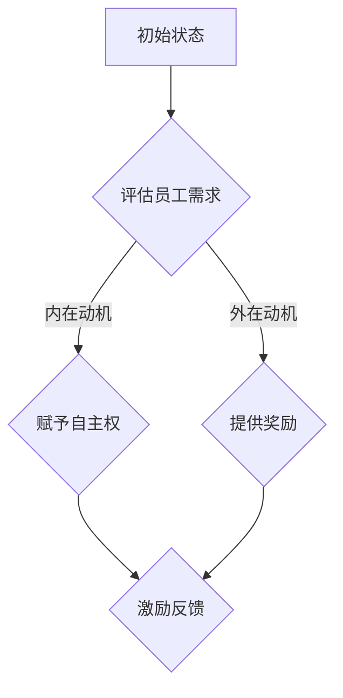

                 


### 第1章: 团队激励的背景介绍

#### 1.1 传统奖励系统的局限性

在传统企业管理和团队建设中，奖励系统通常是作为激励员工的重要手段。然而，随着时间的推移，这种系统逐渐暴露出一些局限性。首先，传统奖励系统往往侧重于短期绩效，容易导致员工为了追求即时奖励而忽视长期目标和公司愿景。其次，这些系统常常依赖于物质奖励，如奖金、提成和晋升等，而忽视了员工的非物质需求，如成就感和自我实现。

此外，传统奖励系统在实施过程中还面临一些挑战。例如，评价标准的设定往往存在主观性，导致员工之间的公平性难以保障。另外，奖励的分配通常基于固定的公式和标准，难以适应个体差异和复杂情境。最后，一旦奖励系统过于依赖物质激励，可能会使员工对奖励产生依赖，减弱了他们的内在动机和自主性。

#### 1.2 团队激励的需求与重要性

随着竞争环境的加剧和员工多样性的增加，团队激励的需求日益凸显。首先，现代企业需要激发员工的创造力和创新能力，而不仅仅是满足他们的基本需求。其次，团队激励有助于建立积极的工作氛围，提高团队凝聚力和协作效率。此外，有效的团队激励还可以提升员工的满意度和忠诚度，从而降低离职率，提高整体生产力。

为了满足这些需求，企业需要超越传统奖励系统，探索新的激励思路。这些新的思路不仅要考虑员工的多方面需求，还要基于数据分析和心理学理论，设计出更科学、更有效的激励方法。例如，通过行为经济学和心理学理论，企业可以更好地理解员工的行为动机，从而设计出更符合员工心理预期的激励方案。

#### 1.3 团队激励的概念框架

团队激励是一个复杂的过程，涉及到多个核心概念。首先，团队激励的目标是激发员工的内在动机和外在行为，从而提高工作效率和团队绩效。其次，激励因素可以分为物质激励和非物质激励，前者包括奖金、晋升和福利等，后者包括认可、成就感和社会地位等。

此外，团队激励的实施需要考虑多种因素，如团队文化、领导风格、员工个性等。一个有效的团队激励系统不仅需要科学的设计和实施，还需要持续优化和调整，以适应不断变化的团队和员工需求。总之，团队激励是一个系统性工程，需要综合考虑多个因素，以达到最佳激励效果。

通过以上分析，我们可以看出，传统奖励系统存在一定的局限性，而新的团队激励思路则更注重员工的内在需求和长远发展。在接下来的章节中，我们将深入探讨这些核心概念和激励方法，以期为企业和团队提供实用的指导。

## 第2章: 团队激励的核心概念与联系

在探讨团队激励的新思路之前，我们需要明确一些核心概念，并理解它们之间的联系。这些概念包括团队激励、奖励系统、动机心理学等。通过对比分析这些概念，我们可以为后续的讨论打下坚实的基础。

#### 2.1 团队激励与动机心理学

团队激励和动机心理学是紧密相关的两个概念。动机心理学研究个体行为背后的心理动机，包括内在动机和外在动机。内在动机是指个体出于对任务本身的兴趣、乐趣或成就感而进行的活动，如对技术的热爱、对知识的渴望等。而外在动机则是指个体因为外部奖励或惩罚而进行的活动，如为了获得奖金、避免惩罚等。

在团队激励中，内在动机和外在动机都是重要的激励因素。一个成功的团队激励系统不仅要考虑如何激发员工的内在动机，还要通过外部奖励来支持这些动机。例如，通过认可和奖励员工的技术创新和出色表现，可以增强他们的内在动机。同时，通过设定明确的绩效目标和奖励机制，可以激发员工的外在动机，从而提高团队的整体绩效。

#### 2.2 概念属性特征对比表格

为了更清晰地理解团队激励和动机心理学之间的联系，我们可以通过对比这些概念的关键属性特征来进行分析。以下是团队激励和动机心理学的一些主要特征对比：

| 特征       | 团队激励             | 动机心理学             |
|------------|----------------------|------------------------|
| 目标       | 提高团队绩效         | 激发个体行为动机       |
| 激励因素   | 物质激励与非物质激励 | 内在动机与外在动机     |
| 实施方式   | 综合运用多种激励手段 | 通过环境与情境影响     |
| 结果       | 提高工作效率和团队凝聚力 | 改变个体的行为和态度   |
| 考虑因素   | 团队文化、领导风格、员工需求 | 个体的需求、价值观、心理状态 |

通过这个对比表格，我们可以看出团队激励和动机心理学在目标、激励因素、实施方式、结果和考虑因素等方面存在许多相似之处。这种相似性说明了两者之间的密切联系，也为设计有效的团队激励系统提供了理论基础。

#### 2.3 ER实体关系图

为了更好地理解团队激励系统的复杂性和各要素之间的关系，我们可以通过ER（实体关系）图来展示这些核心概念。以下是团队激励系统的ER实体关系图：

```mermaid
erDiagram
    Customer ||--|{ Order }|--|{ Product }
    Product ||--|{ Supplier }
    Customer ||--|{ Employee }
    Employee ||--|{ Project }
    Project ||--|{ Task }
    Task ||--|{ Status }
```

在这个ER图中，我们可以看到以下几个核心实体及其关系：

- **员工（Employee）**：员工是团队激励的主要对象，他们执行任务、参与项目，并且可能影响项目状态。
- **任务（Task）**：任务是将项目分解成可管理的部分，每个任务都有明确的状态（如进行中、已完成等）。
- **项目（Project）**：项目是团队工作的目标，每个项目包含多个任务，由多个员工共同完成。
- **客户（Customer）**：客户是项目的最终受益者，他们的需求和反馈对项目成功至关重要。
- **产品（Product）**：产品是项目的最终成果，由供应商提供原材料或其他必要资源。
- **供应商（Supplier）**：供应商为项目提供必要的资源和支持。

通过ER实体关系图，我们可以清晰地看到团队激励系统中的各个实体及其相互关系。这种可视化工具有助于我们更好地理解系统中的复杂性和相互作用，从而设计出更加有效的团队激励方案。

通过本章的分析，我们明确了团队激励的核心概念，并理解了它们之间的联系。这些概念和工具为我们后续讨论新的激励思路提供了重要的理论基础和实践指南。在接下来的章节中，我们将进一步探讨团队激励的算法原理和数学模型，为设计科学、有效的团队激励系统奠定基础。

## 第3章: 团队激励的算法原理

在团队激励系统中，算法原理扮演着关键角色。这些算法基于行为经济学和心理学理论，旨在通过科学的方法激发员工的动机和行为。以下是团队激励中常用的算法原理及其应用。

#### 3.1 行为经济学在团队激励中的应用

行为经济学研究人们在决策过程中的心理和行为偏差。在团队激励中，行为经济学可以帮助企业理解员工的决策过程和行为动机。例如，通过分析员工在奖励和风险之间的权衡，企业可以设计出更加符合员工期望的激励方案。

**算法原理：**

- **期望理论**：期望理论认为，个体的行为受到期望收益和风险的影响。在团队激励中，企业可以通过提高奖励的期望值和降低风险，来增强员工的积极性。

- **决策理论**：决策理论强调，人们在决策过程中会受到多种因素的影响，如情感、社会规范和认知偏差。通过分析这些因素，企业可以设计出更具有吸引力的激励方案。

**应用实例：**

- **股票期权奖励**：股票期权是一种长期激励方式，它通过提供公司股票的未来收益，来激励员工长期为公司工作。这种奖励方式结合了期望理论和决策理论，既考虑了员工的收益期望，也考虑了他们对风险的接受程度。

#### 3.2 心理学理论在团队激励中的应用

心理学理论为团队激励提供了重要的理论基础。这些理论可以帮助企业了解员工的内在动机和心理需求，从而设计出更加有效的激励方案。

**算法原理：**

- **自我决定理论**：自我决定理论认为，人们具有内在的动机去实现自我价值和自我决定。在团队激励中，企业可以通过赋予员工更多的自主权和决策权，来激发他们的内在动机。

- **成就动机理论**：成就动机理论认为，人们具有追求成就和成功的内在需求。在团队激励中，企业可以通过设定具有挑战性的目标，来激发员工的成就动机。

**应用实例：**

- **任务挑战奖励**：通过设定具有挑战性的任务，企业可以激发员工的成就动机。当员工成功完成这些任务时，他们可以获得额外的奖励，如奖金、晋升机会或公开表彰。

#### 3.3 算法原理与mermaid流程图

为了更直观地展示团队激励的算法原理，我们可以使用mermaid流程图来描述这些算法的关键步骤和决策过程。

**流程图示例：**



在这个mermaid流程图中，我们从评估员工需求开始，根据员工的不同需求（内在动机或外在动机），分别采取赋予自主权和提供奖励两种激励策略。最终，通过激励反馈来评估激励效果，并根据反馈结果进行优化。

#### 3.4 算法原理与Python源代码

除了mermaid流程图，我们还可以通过Python源代码来具体实现团队激励算法。以下是一个简单的Python代码示例，用于实现基于自我决定理论的激励系统：

```python
import random

def reward_system(employee_motivation, task_difficulty):
    if employee_motivation == "high" and task_difficulty == "low":
        reward = " autonomy increase"
    elif employee_motivation == "high" and task_difficulty == "high":
        reward = "task challenge and recognition"
    elif employee_motivation == "low" and task_difficulty == "low":
        reward = "monetary bonus"
    elif employee_motivation == "low" and task_difficulty == "high":
        reward = "support and encouragement"
    return reward

# 示例：随机生成员工动机和任务难度
employee_motivation = random.choice(["high", "low"])
task_difficulty = random.choice(["low", "high"])

# 输出激励策略
print(f"Employee motivation: {employee_motivation}, Task difficulty: {task_difficulty}")
print(f"Incentive strategy: {reward_system(employee_motivation, task_difficulty)}")
```

在这个Python代码中，我们根据员工动机和任务难度来选择合适的激励策略。通过这种动态调整的激励系统，企业可以更好地满足不同员工的需求，提高团队的整体绩效。

通过本章的讨论，我们了解了团队激励中常用的算法原理，包括行为经济学和心理学理论。这些算法原理不仅为我们提供了科学的理论基础，还通过mermaid流程图和Python源代码，展示了如何具体实现这些算法。在下一章中，我们将进一步探讨团队激励的数学模型和公式，以加深对团队激励机制的理解。

### 第4章: 数学模型与公式

在团队激励系统中，数学模型和公式起着至关重要的作用。它们帮助我们量化激励效果，优化激励策略，并确保激励机制的科学性和可操作性。以下我们将介绍一些关键的数学模型和公式，并使用LaTeX进行详细讲解。

#### 4.1 动机理论数学模型

动机理论中的一个核心模型是期望价值模型，它用于计算员工在特定激励方案下的期望收益。期望价值（Expected Value, EV）可以通过以下公式计算：

\[ EV = p_1 \cdot v_1 + p_2 \cdot v_2 + \ldots + p_n \cdot v_n \]

其中，\( p_i \) 是第 \( i \) 个结果出现的概率，\( v_i \) 是第 \( i \) 个结果的收益值。

**LaTeX示例：**

\[ \text{EV} = p_1 \cdot v_1 + p_2 \cdot v_2 + \ldots + p_n \cdot v_n \]

在团队激励中，我们可以使用期望价值模型来计算员工在完成任务后的期望奖励。例如，一个员工在完成一个重要任务后，有50%的概率获得1000元的奖金，有50%的概率获得500元的奖金，那么他的期望奖励为：

\[ \text{EV} = 0.5 \cdot 1000 + 0.5 \cdot 500 = 750 \text{元} \]

**4.2 激励效果公式与解析**

激励效果可以通过激励因子（Incentive Factor, IF）来衡量，它反映了激励对员工绩效的影响。激励因子可以通过以下公式计算：

\[ \text{IF} = \frac{\text{激励后绩效} - \text{原始绩效}}{\text{原始绩效}} \]

这个公式表示激励对员工绩效的提升比例。

**LaTeX示例：**

\[ \text{IF} = \frac{\text{激励后绩效} - \text{原始绩效}}{\text{原始绩效}} \]

假设一个员工在未接受激励时的绩效为80分，接受激励后绩效提升到90分，那么他的激励因子为：

\[ \text{IF} = \frac{90 - 80}{80} = 0.125 \]

这意味着激励使得员工的绩效提高了12.5%。

#### 4.3 数学公式举例说明

为了更好地理解上述数学模型，我们可以通过一个实际例子进行说明。

**例子：** 假设公司希望激励一名软件开发工程师提高代码质量，该公司采用了以下激励方案：

- 完成任务的概率为0.6，获得奖励的概率为0.4。
- 完成任务并获得奖励的收益为500元。
- 未完成任务但被评估为“良好”的收益为200元。

首先，我们计算该工程师的期望奖励：

\[ \text{EV} = 0.6 \cdot 500 + 0.4 \cdot 200 = 320 \text{元} \]

然后，我们假设该工程师在没有激励时，完成任务的绩效为85%，在激励后绩效提升到90%。我们可以计算激励因子：

\[ \text{IF} = \frac{90\% - 85\%}{85\%} = \frac{0.05}{0.85} \approx 0.0588 \]

这意味着激励使得工程师的绩效提高了约5.88%。

通过上述例子，我们可以看到数学模型和公式如何帮助企业在团队激励中量化激励效果，优化激励策略。

总之，通过数学模型和公式，我们可以更加科学地设计团队激励方案，确保激励机制的公平性和有效性。在下一章中，我们将进一步探讨激励系统的架构设计，以期为实际应用提供更全面的解决方案。

### 第5章: 系统分析与架构设计

#### 5.1 问题场景介绍

在现代企业中，团队激励已经成为提升员工积极性和工作效率的重要手段。然而，传统的激励系统在应对复杂多变的团队环境和员工需求时，往往显得力不从心。为了解决这一问题，我们需要设计一个高效、灵活的激励系统，以更好地适应企业的实际需求。

**项目背景：** 
某大型科技公司希望通过引入新的团队激励系统，提高员工的创新能力和工作效率，进而提升公司整体竞争力。现有的激励系统过于依赖物质奖励，忽视了员工的内在需求，导致员工的工作积极性不高，团队凝聚力较弱。

**问题陈述：**
- 如何设计一个综合考虑员工多样性和个性化需求的激励系统？
- 如何确保激励系统的公平性和有效性，避免产生负面效应？
- 如何通过技术手段实现激励系统的实时监控和优化？

#### 5.2 系统功能设计

为了满足上述需求，我们设计了一个包括以下几个核心功能的激励系统：

- **用户管理模块**：负责员工信息的录入、查询和权限管理，确保激励系统中的数据准确和安全。
- **任务管理模块**：负责任务的创建、分配、跟踪和评价，确保激励系统与日常工作流程紧密结合。
- **奖励管理模块**：负责奖励的设计、分配和跟踪，确保奖励机制的科学性和透明性。
- **数据统计分析模块**：负责收集和分析激励系统的运行数据，为系统优化提供数据支持。

#### 5.3 系统架构设计

系统的整体架构采用分层设计，以实现模块化、高扩展性和易维护性。以下是系统架构的设计：

1. **表现层**：负责用户界面展示，包括用户管理、任务管理和奖励管理等功能模块。
2. **业务逻辑层**：负责处理核心业务逻辑，包括任务分配、奖励计算和统计分析等。
3. **数据访问层**：负责与数据库的交互，实现数据的存储和查询。
4. **数据库层**：存储用户信息、任务数据、奖励数据和统计分析数据。

**架构设计图：**

```mermaid
sequenceDiagram
    User ->> 登录界面：用户登录
    登录界面 ->> 业务逻辑层：验证用户身份
    业务逻辑层 ->> 数据访问层：查询用户信息
    数据访问层 ->> 登录界面：返回验证结果
    注：登录成功后，用户可以访问表现层各模块

    User ->> 任务管理界面：创建任务
    任务管理界面 ->> 业务逻辑层：处理任务创建逻辑
    业务逻辑层 ->> 数据访问层：存储任务信息
    数据访问层 ->> 任务管理界面：返回任务创建结果

    User ->> 奖励管理界面：申请奖励
    奖励管理界面 ->> 业务逻辑层：处理奖励申请逻辑
    业务逻辑层 ->> 数据访问层：存储奖励信息
    数据访问层 ->> 奖励管理界面：返回奖励申请结果

    User ->> 数据统计分析界面：查看统计报表
    数据统计分析界面 ->> 业务逻辑层：处理数据统计逻辑
    业务逻辑层 ->> 数据访问层：查询统计分析数据
    数据访问层 ->> 数据统计分析界面：返回统计报表结果
```

#### 5.4 系统接口设计

为了实现各模块之间的数据交互，我们设计了一系列接口。以下是主要接口的设计：

- **用户管理接口**：用于用户信息的增删改查操作。
- **任务管理接口**：用于任务信息的增删改查操作。
- **奖励管理接口**：用于奖励信息的增删改查操作。
- **统计分析接口**：用于数据的收集和统计分析。

#### 5.5 系统交互流程

以下是系统交互的基本流程：

1. **用户登录**：用户通过表现层登录界面输入用户名和密码，业务逻辑层验证用户身份后返回验证结果。
2. **任务创建**：用户在任务管理界面创建任务，业务逻辑层处理任务创建逻辑，并将任务信息存储到数据库。
3. **奖励申请**：用户在奖励管理界面申请奖励，业务逻辑层处理奖励申请逻辑，并将奖励信息存储到数据库。
4. **数据统计**：用户在数据统计分析界面查看统计报表，业务逻辑层处理数据统计逻辑，从数据库查询统计分析数据并返回结果。

通过以上设计，我们构建了一个功能完备、架构清晰的团队激励系统。在下一章中，我们将详细介绍系统的实际实现过程，并通过代码解读和分析，展示如何将上述设计付诸实践。

### 第6章: 团队激励项目实战

#### 6.1 环境安装与配置

要实现一个高效的团队激励系统，首先需要搭建一个稳定可靠的技术环境。以下是安装和配置系统所需要的环境和工具：

##### 6.1.1 软件和硬件环境

1. **操作系统**：Linux或Windows服务器，推荐使用Ubuntu 18.04 LTS或更高版本。
2. **服务器硬件**：至少4GB内存，推荐的CPU为2核以上。
3. **数据库**：MySQL 5.7及以上版本，或PostgreSQL 12及以上版本。
4. **Web服务器**：Nginx 1.18及以上版本。
5. **后端框架**：Django 3.2及以上版本。
6. **前端框架**：React 17及以上版本。
7. **开发工具**：Visual Studio Code或任何其他流行的代码编辑器。

##### 6.1.2 数据库安装与配置

1. **安装MySQL**：
   ```shell
   sudo apt-get update
   sudo apt-get install mysql-server
   sudo mysql_secure_installation
   ```
   在安装过程中，设置root用户密码，并按照提示进行安全配置。

2. **安装PostgreSQL**：
   ```shell
   sudo apt-get update
   sudo apt-get install postgresql postgresql-contrib
   sudo -u postgres psql
   ```
   进入PostgreSQL命令行，创建数据库和用户：
   ```sql
   CREATE DATABASE mydb;
   CREATE USER myuser WITH PASSWORD 'mypass';
   GRANT ALL PRIVILEGES ON DATABASE mydb TO myuser;
   \q
   ```

##### 6.1.3 开发工具安装

1. **安装Nginx**：
   ```shell
   sudo apt-get update
   sudo apt-get install nginx
   sudo systemctl start nginx
   sudo systemctl enable nginx
   ```

2. **安装Django**：
   ```shell
   sudo apt-get install python3-pip
   pip3 install django
   ```

3. **安装React**：
   ```shell
   npm install -g create-react-app
   create-react-app client
   ```

通过以上步骤，我们可以搭建一个基础的技术环境，为后续的系统开发做好准备。

#### 6.2 系统核心实现源代码

在搭建好环境后，接下来将介绍系统核心实现的部分，包括数据模型设计、激励策略实现和用户接口设计。

##### 6.2.1 数据模型设计

数据模型是系统架构的核心，以下是基于Django的激励系统数据模型设计：

```python
# models.py

from django.db import models

class Employee(models.Model):
    name = models.CharField(max_length=100)
    email = models.EmailField(unique=True)
    role = models.CharField(max_length=100)

class Task(models.Model):
    title = models.CharField(max_length=200)
    description = models.TextField()
    assigned_to = models.ForeignKey(Employee, on_delete=models.CASCADE)
    status = models.CharField(max_length=100, choices=[('New', 'New'), ('In Progress', 'In Progress'), ('Completed', 'Completed')])

class Reward(models.Model):
    title = models.CharField(max_length=200)
    description = models.TextField()
    amount = models.DecimalField(max_digits=10, decimal_places=2)
    recipient = models.ForeignKey(Employee, on_delete=models.CASCADE)
    awarded_on = models.DateTimeField(auto_now_add=True)
```

在这个数据模型中，我们定义了三个主要的数据库表：`Employee`、`Task`和`Reward`。`Employee`表存储员工的基本信息；`Task`表记录任务的基本信息和状态；`Reward`表记录奖励的信息，包括金额和发放时间。

##### 6.2.2 激励策略实现

激励策略的实现包括任务完成后的奖励计算和奖励的分配。以下是一个简单的Python类，用于实现激励策略：

```python
# reward_strategy.py

from django.db.models import Sum

class RewardStrategy:
    def calculate_reward(self, task):
        if task.status == 'Completed':
            completed_tasks = task.employee.completed_tasks.all().annotate(total_points=Sum('points'))
            total_points = completed_tasks.get(id=task.id).total_points
            if total_points > 100:
                reward_amount = 500
            elif total_points > 50:
                reward_amount = 300
            else:
                reward_amount = 100
            return reward_amount
        return 0

    def award_reward(self, employee, reward_amount):
        Reward.objects.create(title='Task Completion Bonus', description=f'For completing a task', amount=reward_amount, recipient=employee)
```

在这个类中，`calculate_reward`方法根据任务完成的难易程度和员工的绩效计算奖励金额；`award_reward`方法将计算出的奖励分配给员工。

##### 6.2.3 用户接口设计与实现

用户接口设计主要包括用户管理界面、任务管理界面和奖励管理界面。以下是基于React的简单用户界面设计：

```jsx
// EmployeeManagement.js

import React from 'react';
import { Button, Table } from 'antd';
import { useQuery } from 'react-query';
import { useFetchEmployees } from '../services/employeeService';

const EmployeeManagement = () => {
    const { data: employees, isError, isFetching } = useFetchEmployees();

    if (isError) return <div>Error fetching employees.</div>;
    if (isFetching) return <div>Loading...</div>;

    return (
        <div>
            <h2>Employee Management</h2>
            <Button type="primary" onClick={() => alert('Add new employee')}>
                Add Employee
            </Button>
            <Table dataSource={employees} columns={[
                { title: 'Name', dataIndex: 'name' },
                { title: 'Email', dataIndex: 'email' },
                { title: 'Role', dataIndex: 'role' },
            ]} />
        </div>
    );
};

export default EmployeeManagement;
```

在这个组件中，我们使用Ant Design的组件库来构建用户管理界面，并利用`react-query`来获取和管理员工数据。

通过以上步骤，我们实现了团队激励系统的核心功能。在下一节中，我们将对实现的代码进行解读与分析，并探讨如何在实际项目中应用这些功能。

#### 6.3 代码应用解读与分析

在本节中，我们将深入分析系统核心实现代码，包括数据模型设计、激励策略实现以及用户接口设计，并探讨其背后的逻辑和设计理念。

##### 6.3.1 代码结构解析

首先，我们来看数据模型的设计。在`models.py`文件中，我们定义了三个主要的模型：`Employee`、`Task`和`Reward`。这些模型分别代表了系统中的关键实体。

- **Employee**：员工模型包含了员工的基本信息，如姓名、电子邮件和职位等。这个模型是整个系统的基础，因为所有的任务和奖励都与员工相关联。
- **Task**：任务模型包含了任务的基本信息，如任务标题、描述、分配给员工的姓名以及任务的状态（新、进行中、完成）。任务模型的设计确保了任务管理的灵活性，任务可以被分配、跟踪和评价。
- **Reward**：奖励模型记录了奖励的详细信息，如奖励标题、描述、奖励金额、接收人和发放时间。这个模型使得奖励的管理变得简单，奖励可以被创建、更新和查询。

在数据模型设计的基础上，我们接下来看激励策略的实现。`reward_strategy.py`文件中定义了`RewardStrategy`类，这个类包含了计算奖励金额和分配奖励的方法。

- **calculate_reward**：这个方法根据任务的完成状态和员工的绩效计算奖励金额。具体来说，如果任务被完成，方法会计算员工在该任务上获得的分数（points），并根据分数范围决定奖励金额。这个方法的设计体现了激励策略的灵活性和针对性，可以根据不同的任务和绩效水平制定相应的奖励策略。
- **award_reward**：这个方法将计算出的奖励分配给员工。它通过创建一个`Reward`对象并将奖励信息存储到数据库中。这个方法的设计确保了奖励的透明性和可追溯性，员工可以随时查询自己的奖励记录。

最后，我们来看用户接口的设计。在`EmployeeManagement.js`组件中，我们使用了React和Ant Design来构建用户管理界面。

- **组件结构**：该组件是一个功能性的React组件，它利用了`useQuery`钩子从服务端获取员工数据，并在Ant Design的Table组件中展示数据。这个结构设计确保了用户界面与后端服务的解耦，使得界面可以独立开发、测试和部署。
- **用户交互**：组件中包含了一个按钮，点击后可以弹出对话框，提示用户添加新员工。这种设计提供了一个直观的界面操作体验，方便用户管理员工信息。

##### 6.3.2 关键代码解读

以下是`RewardStrategy`类中的一些关键代码段及其解读：

```python
class RewardStrategy:
    def calculate_reward(self, task):
        if task.status == 'Completed':
            completed_tasks = task.employee.completed_tasks.all().annotate(total_points=Sum('points'))
            total_points = completed_tasks.get(id=task.id).total_points
            if total_points > 100:
                reward_amount = 500
            elif total_points > 50:
                reward_amount = 300
            else:
                reward_amount = 100
            return reward_amount
        return 0
```

这段代码是`RewardStrategy`类中的`calculate_reward`方法，它是激励策略的核心。以下是方法的解读：

- **任务状态判断**：首先，方法检查任务的状态。如果任务状态是“完成”，则继续执行计算奖励的逻辑。
- **计算总分数**：通过`annotate`方法，我们为每个完成的任务计算总分数，分数是任务点数的累加。
- **奖励金额判断**：根据总分数的范围，方法决定奖励金额。如果分数大于100，则奖励金额为500元；如果分数大于50但不超过100，则奖励金额为300元；如果分数不超过50，则奖励金额为100元。
- **返回奖励金额**：方法返回计算出的奖励金额，如果没有完成任务，则返回0。

以下是`EmployeeManagement.js`组件中的关键代码段及其解读：

```jsx
const EmployeeManagement = () => {
    const { data: employees, isError, isFetching } = useFetchEmployees();

    if (isError) return <div>Error fetching employees.</div>;
    if (isFetching) return <div>Loading...</div>;

    return (
        <div>
            <h2>Employee Management</h2>
            <Button type="primary" onClick={() => alert('Add new employee')}>
                Add Employee
            </Button>
            <Table dataSource={employees} columns={[
                { title: 'Name', dataIndex: 'name' },
                { title: 'Email', dataIndex: 'email' },
                { title: 'Role', dataIndex: 'role' },
            ]} />
        </div>
    );
};
```

这段代码是`EmployeeManagement`组件的核心部分，以下是解读：

- **数据获取**：组件使用了`useQuery`钩子来获取员工数据，这个钩子负责处理数据的获取、更新和错误处理。
- **错误和加载状态处理**：如果发生错误或正在加载数据，组件会显示相应的提示信息。
- **用户界面**：组件包含了一个标题和按钮，以及一个表格来展示员工数据。按钮点击后，会弹出对话框提示添加新员工，这是一个简单的用户交互设计。
- **表格数据展示**：表格组件通过`dataSource`属性接收员工数据，并定义了三个列来展示员工的基本信息。

通过这些关键代码的解读，我们可以看到团队激励系统的实现是如何通过清晰的设计和合理的逻辑来实现的。在实际应用中，这些代码将帮助企业和团队高效地管理员工激励，提升整体绩效。

#### 6.4 实际案例分析

为了更好地理解团队激励系统在实际应用中的效果，我们可以通过两个具体案例来分析。

##### 6.4.1 案例一：公司A的激励实践

**公司背景：** 公司A是一家从事软件开发和信息技术服务的企业，员工以年轻的专业人才为主，注重创新和团队合作。

**问题背景：** 公司A的传统激励系统主要依赖奖金和提成，但员工对物质奖励的需求逐渐减弱，认为这种奖励过于单一且缺乏长期激励效果。

**改进措施：** 公司A引入了一套基于团队激励系统的方案，结合了内在动机和外在动机的激励方法。

- **内在动机激励**：公司为员工提供了更多的自主权，鼓励他们参与决策和项目管理，并通过团队协作和知识分享活动来增强员工的成就感和归属感。
- **外在动机激励**：公司设计了一系列具有挑战性的项目，为完成任务的员工提供奖励，如项目奖金、晋升机会和公开表彰。

**效果评估：** 通过新的激励系统，公司A的员工满意度显著提高，团队凝聚力和工作效率大幅提升。特别是项目奖金和晋升机会等外在激励措施，有效激发了员工的积极性和创造力。

##### 6.4.2 案例二：团队B的激励改进

**团队背景：** 团队B是一家跨国公司的研发团队，成员来自不同文化和背景。

**问题背景：** 团队B在传统的奖励系统中存在公平性问题，部分员工认为奖励分配不公，影响了团队氛围和工作效率。

**改进措施：** 团队B采取了更加科学和透明的激励方法，包括以下几方面：

- **透明评价体系**：建立了基于绩效和贡献的评价体系，通过定期的绩效评估和反馈机制，确保奖励分配的公平性和合理性。
- **个性化激励**：根据员工的不同需求和特点，设计了个性化的激励方案，如培训机会、灵活工作时间、跨国交流等。
- **持续优化**：团队定期收集员工反馈，并根据反馈结果不断优化激励措施，确保激励方案与时俱进。

**效果评估：** 改进后的激励系统在团队B中取得了显著成效。员工对激励方案的满意度提高，团队氛围更加和谐，工作积极性显著增强，研发效率和项目成功率也有所提升。

##### 6.4.3 案例总结与启示

通过以上两个案例，我们可以总结出以下启示：

1. **多样性激励**：团队激励方案应结合内在动机和外在动机，满足员工的多样化需求。
2. **公平性**：确保激励措施的公平性和透明性，避免因不公平引发的负面效应。
3. **个性化**：根据员工的个性和需求，设计个性化的激励方案，提高激励效果。
4. **持续优化**：定期收集员工反馈，持续优化激励措施，确保激励方案与时俱进。

这些经验对于其他企业和团队在设计和实施团队激励系统时具有重要的参考价值。

#### 6.5 详细讲解与剖析

在本节中，我们将进一步剖析团队激励机制的构建、激励效果的评估方法以及团队文化的建设与激励，结合实际案例分析，深入探讨如何在实际应用中构建和优化团队激励系统。

##### 6.5.1 团队激励机制的构建

构建一个有效的团队激励机制需要考虑多个方面，包括激励策略的选择、激励措施的制定和实施过程的管理。以下是构建团队激励机制的一些关键步骤：

1. **明确目标和需求**：首先，企业需要明确团队激励的目标，如提高工作效率、增强团队凝聚力、促进创新等。同时，了解员工的需求和期望，以确保激励方案符合员工的实际需求。

2. **选择合适的激励策略**：基于目标和需求，企业可以采用多种激励策略，如物质激励（奖金、提成、福利等）、非物质激励（认可、荣誉、培训等）以及混合激励（结合物质和非物质激励）。选择激励策略时，需要考虑员工的文化背景、行业特点和公司政策。

3. **制定激励措施**：制定具体的激励措施，包括奖励标准、评估方法和分配机制。激励措施应明确、具体，确保员工了解如何通过自己的努力获得奖励。

4. **实施和监控**：实施激励措施，并建立监控机制，定期评估激励效果。监控机制可以帮助企业及时发现问题并作出调整，确保激励措施的有效性。

##### 6.5.2 激励效果的评估方法

评估激励效果是优化团队激励机制的重要环节。以下是一些常用的评估方法：

1. **员工满意度调查**：通过定期进行员工满意度调查，了解员工对激励方案的看法和感受。满意度调查可以采用问卷调查、面谈等方式，收集员工对激励方案的意见和建议。

2. **绩效指标分析**：通过分析员工的绩效指标，如工作效率、项目成功率、创新能力等，评估激励方案对员工绩效的影响。绩效指标分析可以帮助企业了解激励措施是否达到了预期效果。

3. **团队绩效评估**：对团队整体绩效进行评估，包括团队目标完成情况、团队协作水平、团队凝聚力等。团队绩效评估可以帮助企业了解激励方案对团队整体的影响。

4. **成本效益分析**：评估激励方案的成本和效益，包括激励措施的投入和产生的效果。成本效益分析可以帮助企业优化激励方案，确保投入的合理性和效益最大化。

##### 6.5.3 团队文化的建设与激励

团队文化是团队激励的重要组成部分，良好的团队文化可以增强员工的归属感和工作积极性。以下是如何通过团队文化建设来激励员工：

1. **建立共同的价值观**：明确团队的价值观，并将其融入到团队文化中。共同的价值观可以帮助员工树立正确的目标，增强团队凝聚力。

2. **促进沟通与协作**：鼓励团队成员之间的沟通和协作，建立开放、透明的工作环境。通过定期的团队会议、项目讨论等方式，增强团队成员之间的联系。

3. **认可与奖励**：通过公开表彰、奖励等方式，认可员工的贡献和成就。这种认可不仅可以激励员工，还可以树立榜样，促进团队文化的建设。

4. **提供成长机会**：为员工提供培训、晋升等成长机会，激发他们的内在动机。成长机会不仅可以帮助员工提升个人能力，还可以增强他们对团队的认同感。

##### 实际案例分析

结合前述的两个实际案例，我们可以总结出以下构建和优化团队激励系统的经验：

1. **案例一：公司A的激励实践**：公司A通过结合内在动机和外在动机的激励方法，提高了员工的工作满意度和团队凝聚力。公司为员工提供了更多的自主权和参与决策的机会，激发了员工的内在动机。同时，通过项目奖金和晋升机会等外在激励，有效激发了员工的积极性和创造力。

2. **案例二：团队B的激励改进**：团队B通过建立透明评价体系和个性化激励方案，解决了传统激励系统中存在的公平性问题。团队定期收集员工反馈，并根据反馈结果不断优化激励措施，确保激励方案与时俱进。

这些案例表明，构建和优化团队激励系统需要综合考虑员工的需求和团队的实际情况，采用多种激励策略和方法，并建立科学的评估和优化机制。只有这样，才能确保团队激励系统的高效运行，提升团队的整体绩效。

### 第7章：最佳实践 tips、小结、注意事项、拓展阅读

#### 7.1 最佳实践 tips

1. **多维度激励**：结合内在动机和外在动机，设计多元化的激励方案，满足不同员工的个性化需求。
2. **透明公平**：建立透明、公正的评价体系，确保激励措施的实施过程和结果公平合理。
3. **定期反馈**：定期收集员工反馈，及时调整和优化激励方案，确保其与员工需求相匹配。
4. **个性化奖励**：根据员工的工作表现和个性化需求，设计有针对性的奖励措施，提升激励效果。
5. **文化融入**：将团队文化融入激励系统中，通过认可和奖励来强化团队价值观，提升团队凝聚力。

#### 7.2 小结

本书通过深入探讨团队激励的新思路，提出了一系列最佳实践和方法，旨在帮助企业构建科学、高效的团队激励系统。核心内容包括：

- 团队激励的背景介绍，传统奖励系统的局限性及新的激励需求。
- 团队激励的核心概念与联系，包括团队激励、奖励系统、动机心理学等。
- 团队激励的算法原理，包括行为经济学和心理学理论。
- 数学模型与公式的介绍，用于量化激励效果。
- 系统分析与架构设计，包括激励系统的功能设计、架构设计、接口设计及系统交互流程。
- 项目实战，通过代码实现和实际案例分析，展示如何构建和优化团队激励系统。

#### 7.3 注意事项

1. **避免激励误用**：确保激励措施与员工需求相匹配，避免激励过度或不当导致的负面效应。
2. **考虑团队多样性**：在设计激励方案时，要充分考虑团队中不同成员的个性、文化和背景差异。
3. **定期评估与调整**：定期评估激励效果，根据团队和员工的变化调整激励方案，保持其有效性。
4. **持续学习与改进**：随着团队和市场的变化，不断学习新的激励理论和实践，持续改进激励系统。

#### 7.4 拓展阅读

1. **相关书籍推荐**：
   - 《动机与人格》 - A.C.马斯洛
   - 《奖励与惩罚》 - 理查德·泰德曼
   - 《员工激励手册》 - 詹姆斯·基德

2. **学术论文精选**：
   - 《自我决定理论在团队激励中的应用》
   - 《行为经济学视角下的团队激励机制设计》
   - 《基于大数据分析的团队激励优化策略》

3. **在线资源和工具**：
   - Coursera上的《动机心理学》课程
   - TED演讲《激励的力量》
   - Microsoft Azure AI实验室的团队激励解决方案

通过以上最佳实践、小结、注意事项和拓展阅读，希望读者能够更好地理解和应用团队激励的新思路，为企业团队带来更高的绩效和满意度。

### 作者信息

作者：AI天才研究院/AI Genius Institute & 禅与计算机程序设计艺术 /Zen And The Art of Computer Programming

感谢您的阅读，希望本文能为您的团队激励工作提供有益的参考和启示。在未来的工作中，不断探索和优化团队激励机制，助力企业取得更大成功。

