                 


# 团队激励新思路：激发持久内在动力

## 关键词
- 团队激励
- 内部动机
- 激励计划
- 文化塑造
- 领导艺术

## 摘要
本文旨在探讨团队激励的新思路，尤其是如何激发团队成员的持久内在动力。我们将通过系统的分析和实践案例，深入理解团队激励的背景与重要性，剖析内部动机的核心概念，设计有效的激励计划，并探讨领导者在激励团队中的关键角色。同时，我们将提出如何营造激励性团队文化，以及如何评估和调整激励计划以应对挑战。通过这些探讨，我们希望能够为团队管理者提供有价值的参考，以激发团队成员的内在动力，实现团队的成功。

## 第一部分：团队激励概述

### 第1章：团队激励的背景与重要性

#### 1.1 团队激励的定义与作用
团队激励是指通过一系列的方法和策略，激发团队成员的工作热情和动力，以提高团队的整体绩效和效率。在当今竞争激烈的市场环境中，团队激励已成为企业成功的关键因素之一。有效的团队激励不仅能够提高员工的工作积极性和创造力，还能够增强团队的凝聚力和合作精神。

#### 1.2 团队激励的演变历程
团队激励的概念并非一蹴而就，它经历了长期的演变过程。从早期的物质激励，如奖金、津贴等，到现代的多元化激励方式，如职业发展、工作环境改善等，团队激励的形式越来越丰富。这一演变过程反映了企业对员工需求的不断深入理解和适应。

#### 1.3 现代团队激励的挑战与机遇
在现代社会，团队激励面临着新的挑战，如员工多元化的需求、快速变化的工作环境等。然而，这些挑战也带来了新的机遇。通过深入了解员工的需求和心理，企业可以设计出更加个性化的激励方案，从而更好地激发团队的内在动力。

### 第2章：理解团队动机

#### 2.1 动机理论概述
动机是人们行为的驱动力，它决定了个体在特定情境下的行为选择。在团队环境中，动机理论为我们理解团队成员的行为提供了重要的理论基础。例如，马斯洛的需求层次理论、赫兹伯格的双因素理论等，都对团队激励具有重要的指导意义。

#### 2.2 内部动机与外部动机
内部动机是指源于个体内在的兴趣、价值观和自我实现的需求，而外部动机则是指源于外部奖励和惩罚的驱动。在团队激励中，如何平衡内部动机和外部动机，是一个值得探讨的问题。过度的外部激励可能导致依赖，而缺乏内部激励可能导致动力不足。

#### 2.3 动机在团队中的作用
动机不仅影响个体行为，也在团队层面产生重要影响。激发团队成员的内部动机，有助于提高团队的整体效率和绩效。同时，内部动机也能够增强团队成员的归属感和成就感，从而提升团队的凝聚力。

## 第二部分：内部激励是团队成功的关键

### 第3章：内部激励的核心概念

#### 3.1 内部激励的要素
内部激励的要素包括个体的自我认同、自我价值感和成就感等。这些要素共同作用，激发个体的内在动力，使其在面对困难和挑战时保持积极的态度。

#### 3.2 内部激励与团队绩效
内部激励与团队绩效之间存在着密切的联系。研究表明，内部激励能够显著提高团队的工作效率和创新力。同时，内部激励还能够降低员工的流失率，提高团队的稳定性。

#### 3.3 内部激励的优势与局限性
内部激励具有多方面的优势，如激发个体内在动力、提高团队绩效、增强团队凝聚力等。然而，内部激励也存在一定的局限性，如对个体需求的识别难度较大、实施成本较高等。

### 第4章：设计有效的激励计划

#### 4.1 激励计划的制定流程
设计有效的激励计划需要遵循一定的流程，包括需求分析、目标设定、方案设计、实施和评估等。每个环节都需要充分考虑团队成员的需求和团队的整体目标。

#### 4.2 激励计划的要素
激励计划的要素包括奖励机制、晋升机制、培训机制等。这些要素需要相互配合，形成一个完整的激励体系，以激发团队成员的内在动力。

#### 4.3 激励计划的实施策略
激励计划的实施策略包括明确目标、建立信任、及时反馈等。通过这些策略，企业可以确保激励计划的顺利实施，并最大化其效果。

## 第三部分：领导者的激励艺术

### 第5章：领导者的角色与影响力

#### 5.1 领导者的激励能力
领导者的激励能力是团队激励成功的关键。领导者需要具备洞察员工需求、激发员工潜力、建立团队信任等能力。

#### 5.2 建立信任与认可
建立信任和认可是激发团队成员内部动机的重要手段。领导者需要通过真诚的沟通、公正的待遇和积极的反馈，赢得员工的信任和认可。

#### 5.3 领导者的沟通技巧
沟通是领导者激励团队的重要工具。领导者需要具备良好的沟通技巧，包括倾听、表达、反馈等，以有效地传达信息和激励员工。

## 第四部分：营造激励文化

### 第6章：塑造激励性团队文化

#### 6.1 团队文化的构建
团队文化是团队共同价值观和行为准则的体现。构建激励性团队文化需要从价值观、行为准则、团队氛围等多个方面入手。

#### 6.2 激励性文化的特征
激励性文化具有积极向上、包容开放、持续创新等特征。这些特征有助于激发团队成员的内在动力，提高团队的凝聚力和创新力。

#### 6.3 如何营造激励性文化
营造激励性文化需要企业领导者的引领和全体员工的共同努力。通过建立明确的价值观、制定有效的激励机制、营造积极的工作氛围等，可以逐步构建起激励性团队文化。

## 第五部分：实战案例分析

### 第7章：案例研究：真实世界的团队激励策略

#### 7.1 案例一：科技公司的内部激励计划
以某知名科技公司为例，分析其实施的内部激励计划，包括奖励机制、晋升机制、培训机制等，以及这些计划如何激发团队成员的内在动力。

#### 7.2 案例二：制造业的团队激励实践
以某大型制造业公司为例，探讨其实施的团队激励策略，包括如何通过改善工作环境、提高员工福利等方式，激发团队成员的工作热情。

#### 7.3 案例三：创业团队如何激励成员
以某初创公司为例，分析其如何通过明确的团队目标、积极的沟通和反馈、个性化的激励措施等，激发团队成员的内在动力，推动公司快速发展。

## 第六部分：评估与调整激励计划

### 第8章：评估激励计划的成效

#### 8.1 激励成效的评估指标
激励计划的成效需要通过一系列的评估指标来衡量，如员工满意度、工作效率、团队绩效等。通过这些指标，企业可以了解激励计划的实施效果。

#### 8.2 评估方法和工具
评估激励计划的方法和工具包括问卷调查、访谈、绩效分析等。这些方法和工具可以帮助企业全面了解团队成员的需求和反馈，从而优化激励计划。

#### 8.3 调整激励计划的策略
根据评估结果，企业需要及时调整激励计划，以适应团队成员的需求和团队的整体目标。调整策略包括增加奖励机制、改善晋升机制、提供更多培训机会等。

## 第七部分：应对挑战

### 第9章：团队激励中的常见问题与对策

#### 9.1 问题识别与解决
团队激励过程中可能会遇到各种问题，如激励过度、激励不足、激励不公平等。针对这些问题，企业需要采取有效的对策，如调整激励方案、建立公平的评估机制等。

#### 9.2 领导者的角色
领导者是团队激励的核心，其角色至关重要。领导者需要具备洞察力、沟通能力和决策能力，以应对团队激励过程中的各种挑战。

#### 9.3 团队成员的参与
团队成员的参与是激励计划成功的关键。通过征求团队成员的意见和建议，企业可以更好地了解他们的需求，从而设计出更加有效的激励计划。

## 结论：团队激励的未来发展趋势

### 10.1 团队激励的重要性
随着企业对人才竞争的日益重视，团队激励的重要性日益凸显。有效的团队激励不仅能够提高员工的工作积极性和创造力，还能够增强团队的凝聚力和创新力。

### 10.2 未来发展趋势
未来，团队激励将朝着更加个性化和多元化的方向发展。企业需要更加关注员工的需求和心理，设计出更加贴合实际、富有创意的激励方案。同时，随着技术的发展，数字激励、虚拟奖励等新兴激励方式也将逐步应用于团队激励中。

### 10.3 建议与展望
为应对未来的挑战，企业需要持续关注团队激励的最新趋势，不断优化激励计划。同时，领导者需要不断提升自身的激励能力，以更好地激发团队成员的内在动力，推动团队的成功。

## 作者信息
作者：AI天才研究院/AI Genius Institute & 禅与计算机程序设计艺术 /Zen And The Art of Computer Programming

通过以上详细的章节内容，我们不仅对团队激励有了更加深入的理解，还了解了如何设计有效的激励计划、营造激励性团队文化以及应对团队激励中的各种挑战。希望这些内容能够为团队管理者提供有价值的参考，激发团队成员的持久内在动力，实现团队的成功。# 团队激励新思路：激发持久内在动力

## 关键词
- 团队激励
- 内部动机
- 激励计划
- 文化塑造
- 领导艺术

## 摘要
在当今竞争激烈的商业环境中，团队激励成为企业成功的关键因素。本文通过深入分析团队激励的背景、内部动机的概念、激励计划的设计、领导者的角色、团队文化的塑造以及实战案例分析，探讨如何激发团队成员的持久内在动力。通过这些探讨，本文旨在为团队管理者提供有效的策略和工具，以提升团队绩效和凝聚力。

## 第一部分：团队激励概述

### 第1章：团队激励的背景与重要性

#### 1.1 团队激励的定义与作用
团队激励是指通过各种手段激发团队成员的工作热情和动力，以提高团队的整体绩效。它包括物质激励和非物质激励两种形式，旨在满足员工的不同需求，激发其潜力。

#### 1.2 团队激励的演变历程
团队激励的概念经历了从物质奖励到精神激励的演变。随着社会的发展，人们对于激励的需求也发生了变化，更加注重自我实现和成就感。

#### 1.3 现代团队激励的挑战与机遇
现代团队激励面临诸多挑战，如员工多元化的需求、快速变化的工作环境等。然而，这些挑战也带来了新的机遇，如个性化激励、数字化激励等。

### 第2章：理解团队动机

#### 2.1 动机理论概述
动机理论包括马斯洛的需求层次理论、赫兹伯格的双因素理论等，这些理论为团队激励提供了理论基础。

#### 2.2 内部动机与外部动机
内部动机源于个体的兴趣、价值观和自我实现的需求，外部动机则来自外部奖励和惩罚。理解内部动机和外部动机的区别对于设计有效的激励计划至关重要。

#### 2.3 动机在团队中的作用
动机能够影响个体的行为选择，对团队绩效产生重要影响。激发内部动机有助于提高团队的工作效率和创新力。

## 第二部分：内部激励是团队成功的关键

### 第3章：内部激励的核心概念

#### 3.1 内部激励的要素
内部激励的要素包括自我认同、自我价值感和成就感等，这些要素共同作用，激发个体的内在动力。

#### 3.2 内部激励与团队绩效
内部激励能够显著提高团队的工作效率和创新力，降低员工流失率，提高团队的稳定性。

#### 3.3 内部激励的优势与局限性
内部激励具有激发个体内在动力、提高团队绩效、增强团队凝聚力等优势，但也存在对个体需求识别难度大、实施成本较高等局限性。

### 第4章：设计有效的激励计划

#### 4.1 激励计划的制定流程
制定有效的激励计划需要遵循需求分析、目标设定、方案设计、实施和评估等流程。

#### 4.2 激励计划的要素
激励计划的要素包括奖励机制、晋升机制、培训机制等，这些要素需要相互配合，形成一个完整的激励体系。

#### 4.3 激励计划的实施策略
激励计划的实施策略包括明确目标、建立信任、及时反馈等，确保激励计划的顺利实施。

## 第三部分：领导者的激励艺术

### 第5章：领导者的角色与影响力

#### 5.1 领导者的激励能力
领导者的激励能力包括洞察员工需求、激发员工潜力、建立团队信任等。

#### 5.2 建立信任与认可
建立信任和认可是激发团队成员内部动机的重要手段。领导者需要通过真诚的沟通、公正的待遇和积极的反馈，赢得员工的信任和认可。

#### 5.3 领导者的沟通技巧
良好的沟通技巧是领导者激励团队的重要工具，包括倾听、表达、反馈等。

## 第四部分：营造激励文化

### 第6章：塑造激励性团队文化

#### 6.1 团队文化的构建
团队文化是团队共同价值观和行为准则的体现。构建激励性团队文化需要从价值观、行为准则、团队氛围等多个方面入手。

#### 6.2 激励性文化的特征
激励性文化具有积极向上、包容开放、持续创新等特征。这些特征有助于激发团队成员的内在动力，提高团队的凝聚力和创新力。

#### 6.3 如何营造激励性文化
营造激励性文化需要企业领导者的引领和全体员工的共同努力。通过建立明确的价值观、制定有效的激励机制、营造积极的工作氛围等，可以逐步构建起激励性团队文化。

## 第五部分：实战案例分析

### 第7章：案例研究：真实世界的团队激励策略

#### 7.1 案例一：科技公司的内部激励计划
以某知名科技公司为例，分析其实施的内部激励计划，包括奖励机制、晋升机制、培训机制等。

#### 7.2 案例二：制造业的团队激励实践
以某大型制造业公司为例，探讨其实施的团队激励策略，包括如何通过改善工作环境、提高员工福利等方式，激发团队成员的工作热情。

#### 7.3 案例三：创业团队如何激励成员
以某初创公司为例，分析其如何通过明确的团队目标、积极的沟通和反馈、个性化的激励措施等，激发团队成员的内在动力。

## 第六部分：评估与调整激励计划

### 第8章：评估激励计划的成效

#### 8.1 激励成效的评估指标
激励计划的成效需要通过一系列评估指标来衡量，如员工满意度、工作效率、团队绩效等。

#### 8.2 评估方法和工具
评估激励计划的方法和工具包括问卷调查、访谈、绩效分析等，通过这些方法和工具，企业可以全面了解激励计划的实施效果。

#### 8.3 调整激励计划的策略
根据评估结果，企业需要及时调整激励计划，以适应团队成员的需求和团队的整体目标。

## 第七部分：应对挑战

### 第9章：团队激励中的常见问题与对策

#### 9.1 问题识别与解决
团队激励过程中可能会遇到各种问题，如激励过度、激励不足、激励不公平等，企业需要采取有效的对策解决这些问题。

#### 9.2 领导者的角色
领导者在团队激励中扮演着关键角色，需要具备洞察力、沟通能力和决策能力。

#### 9.3 团队成员的参与
团队成员的参与是激励计划成功的关键，企业需要充分尊重团队成员的意见和建议。

## 结论
团队激励是推动团队成功的重要因素。通过深入理解团队激励的背景、内部动机的概念、激励计划的设计、领导者的角色、团队文化的塑造以及实战案例分析，我们可以更好地激发团队成员的持久内在动力。企业应持续优化激励计划，营造激励性团队文化，以应对未来的挑战，实现团队的长期成功。

## 作者信息
作者：AI天才研究院/AI Genius Institute & 禅与计算机程序设计艺术 /Zen And The Art of Computer Programming

### 第1章：团队激励的背景与重要性

#### 1.1 团队激励的定义与作用
团队激励是指在组织内部通过各种手段激发员工的工作热情和动力，以提升团队整体绩效的过程。这些手段包括但不限于奖金、晋升机会、荣誉称号、培训机会等。团队激励不仅是物质上的奖励，还包括精神层面的认可和成长空间。

**核心概念术语说明**：
- **团队激励**：通过奖励和认可激发团队成员的工作热情和动力。
- **绩效**：团队和个体在工作中的表现和成果。
- **激励**：激发、鼓励或推动某种行为。

**问题背景**：
在竞争日益激烈的市场环境中，企业需要不断提高效率和创新能力来保持竞争力。团队激励成为企业管理中不可或缺的一部分，它直接影响着团队的工作效率和创新能力。

**问题描述**：
团队激励的有效性如何衡量？如何设计出既能激发员工积极性，又不会导致过度依赖外部激励的激励计划？

**问题解决**：
团队激励的成功取决于多方面因素，包括激励计划的科学设计、实施策略的有效性和评估机制的合理性。

**边界与外延**：
团队激励不仅限于员工层面，还可以应用于合作伙伴、供应商等外部相关方。同时，激励计划的设计和实施也需要考虑企业文化和行业特点。

**概念结构与核心要素组成**：
- **激励计划设计**：包括奖励机制、晋升机制、培训机制等。
- **实施策略**：如目标设定、员工参与、反馈机制等。
- **评估机制**：通过绩效评估、员工满意度调查等手段衡量激励效果。

#### 1.2 团队激励的演变历程
团队激励的概念并非一蹴而就，其发展历程经历了几个重要的阶段。

**核心概念原理**：
- **物质激励**：早期的团队激励主要以奖金、津贴等物质奖励为主。
- **精神激励**：随着时间的发展，人们开始意识到精神层面的激励同样重要，如认可、成就感等。
- **综合激励**：现代团队激励更注重物质和精神激励的结合，强调个性化需求和自我实现。

**概念属性特征对比表格**：

| 激励类型       | 物质激励                 | 精神激励                 | 综合激励                 |
|----------------|--------------------------|--------------------------|--------------------------|
| **核心特点**   | 奖金、津贴等物质奖励     | 认可、成就感等精神层面激励 | 物质和精神激励相结合     |
| **适用情境**   | 需要快速提升工作效率时   | 长期稳定工作状态时         | 多样化工作环境和需求时   |
| **优缺点**     | 优点：直接、快速见效     | 优点：持久、影响深远      | 优点：全面、灵活         |
|                | 缺点：可能导致依赖心理     | 缺点：效果较慢显现        | 缺点：设计和实施复杂     |

**ER实体关系图架构**：

```mermaid
erDiagram
  Employee ||--|{ Incentive }|--|
  Incentive ||--|{ Performance }|--|
  Performance ||--|{ Team }|--|
  Team ||--|{ Company }|--|
```

在上述ER图中，展示了团队激励、员工绩效、团队和公司之间的相互关系。员工通过接受激励影响绩效，进而影响团队和公司的整体表现。

#### 1.3 现代团队激励的挑战与机遇
随着社会的发展和技术的进步，现代团队激励面临新的挑战和机遇。

**核心概念原理**：
- **多元化需求**：现代员工需求更加多样化，包括职业发展、工作环境、家庭平衡等。
- **数字化时代**：数字化工具的广泛应用为团队激励提供了新的手段和方式。
- **远程工作**：远程工作的普及要求团队激励更加灵活和个性化。

**概念属性特征对比表格**：

| 挑战/机遇       | 多元化需求                 | 数字化时代                 | 远程工作                 |
|----------------|--------------------------|--------------------------|--------------------------|
| **核心特点**   | 需求多样化、个性化         | 高效沟通、数据分析         | 自主管理、灵活激励       |
| **影响**       | 增强员工满意度和忠诚度     | 提高工作效率和创新能力     | 维持团队凝聚力和工作效率 |
| **应对策略**   | 灵活设计激励方案、个性化奖励 | 利用数字化工具、大数据分析 | 确保沟通渠道畅通、提供支持 |

**MERMAID流程图**：

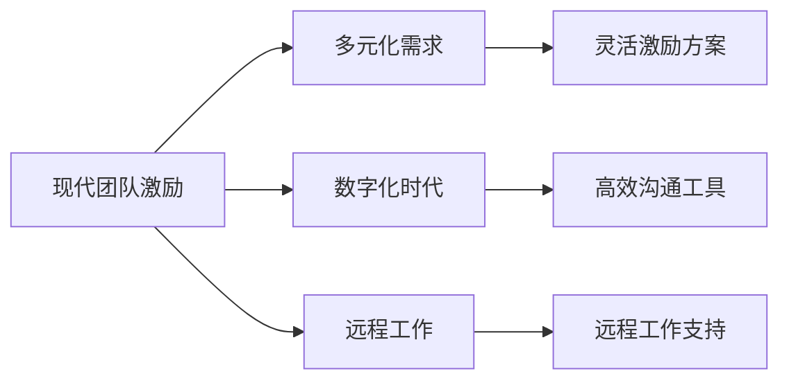

在上述流程图中，展示了现代团队激励面临的主要挑战和机遇，以及对应的应对策略。

### 第2章：理解团队动机

#### 2.1 动机理论概述
动机是推动个体采取特定行动的内在驱动力。在团队环境中，动机理论为我们理解团队成员的行为提供了重要的理论基础。

**核心概念原理**：
- **马斯洛的需求层次理论**：马斯洛认为，人的需求可以分为生理需求、安全需求、社交需求、尊重需求和自我实现需求。动机来源于未满足的需求。
- **赫兹伯格的双因素理论**：赫兹伯格认为，工作满意度由内在激励因素（如成就感、认可）和外在激励因素（如薪资、工作条件）共同决定。

**概念属性特征对比表格**：

| 动机理论       | 马斯洛的需求层次理论         | 赫兹伯格的双因素理论         |
|----------------|--------------------------|--------------------------|
| **核心特点**   | 需求层次结构、自我实现      | 内在激励、外在激励         |
| **应用领域**   | 人力资源、组织行为学       | 组织管理、绩效管理         |
| **优缺点**     | 优点：全面、适用性广       | 优点：区分激励因素         |
|                | 缺点：过于理想化          | 缺点：忽视个体差异         |

**ER实体关系图架构**：

```mermaid
erDiagram
  Employee ||--|{ Motivation }|--|
  Motivation ||--|{ Needs }|--|
  Needs ||--|{ MaslowTheory }|--|
  Needs ||--|{ HerzbergTheory }|--|
```

在上述ER图中，展示了员工、动机和需求之间的关系，以及马斯洛和赫兹伯格理论对需求的影响。

#### 2.2 内部动机与外部动机
内部动机和外部动机是动机的两种主要形式，它们在团队激励中扮演着不同但重要的角色。

**核心概念原理**：
- **内部动机**：源于个体的内在兴趣、价值观和自我实现的需求，如对工作的热爱、成就感等。
- **外部动机**：源于外部的奖励和惩罚，如薪资、奖金、晋升等。

**概念属性特征对比表格**：

| 动机类型       | 内部动机                 | 外部动机                 |
|----------------|--------------------------|--------------------------|
| **核心特点**   | 自我驱动、持久           | 外部驱动、即时           |
| **适用情境**   | 长期工作、创造性任务     | 短期任务、需要快速见效    |
| **优缺点**     | 优点：可持续、降低成本   | 优点：直接、见效快      |
|                | 缺点：效果不稳定         | 缺点：可能导致依赖       |

**MERMAID流程图**：

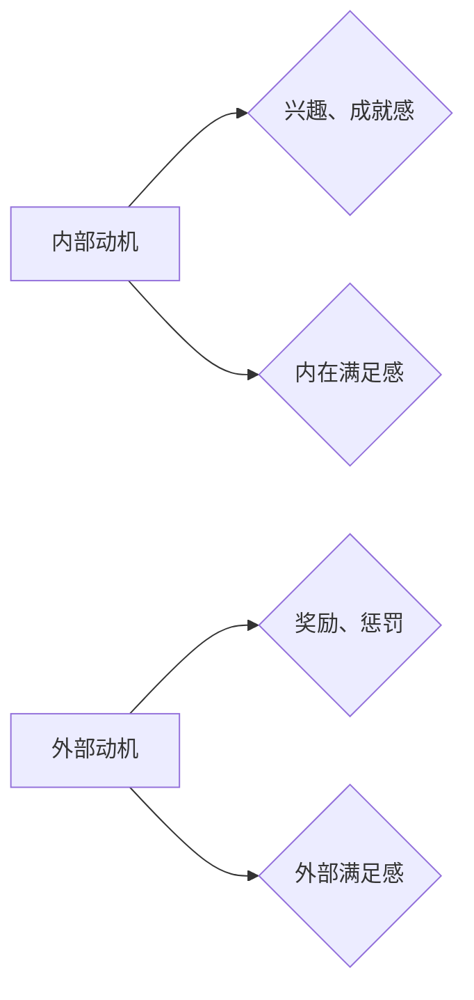

在上述流程图中，展示了内部动机和外部动机的不同驱动因素和结果。

#### 2.3 动机在团队中的作用
动机不仅影响个体的行为，还在团队层面产生重要影响。

**核心概念原理**：
- **提高工作效率**：动机强烈的成员往往能够更高效地完成任务。
- **增强团队凝聚力**：共同的动机可以增强团队成员之间的信任和合作。
- **促进创新**：内部动机强烈的成员更愿意尝试新的方法和思路。

**概念属性特征对比表格**：

| 动机作用       | 工作效率                 | 团队凝聚力                 | 创新                 |
|----------------|--------------------------|--------------------------|--------------------------|
| **核心特点**   | 动机强烈、目标明确       | 信任、合作、共同目标       | 勇于尝试、接受挑战    |
| **适用情境**   | 竞争激烈的环境、复杂任务 | 需要合作的项目、团队活动   | 创新驱动型团队        |
| **优缺点**     | 优点：提高工作效率       | 优点：增强团队凝聚力       | 优点：促进创新思维    |
|                | 缺点：依赖外部激励       | 缺点：可能导致内部竞争     | 缺点：风险较大        |

**MERMAID流程图**：

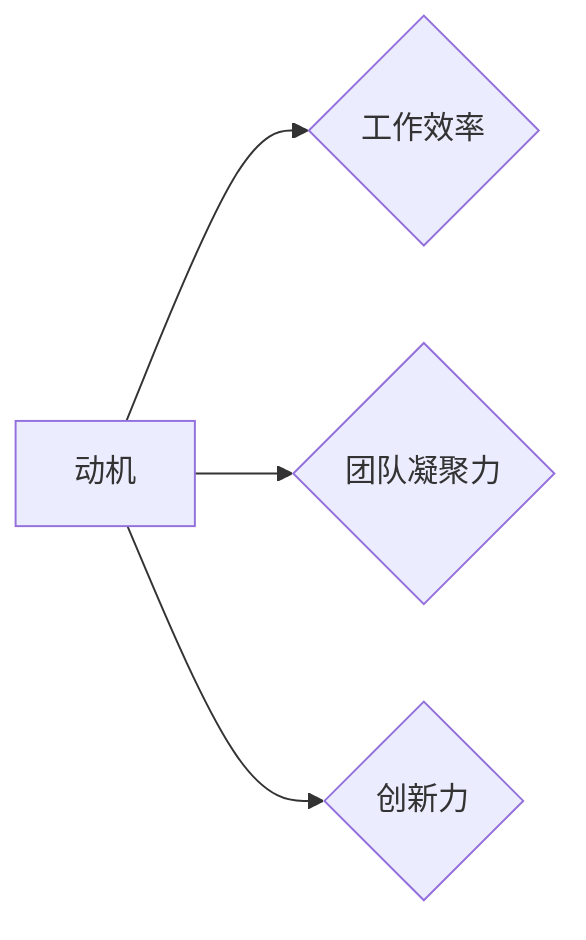

在上述流程图中，展示了动机在团队中的多重作用和影响。

### 第3章：内部激励的核心概念

#### 3.1 内部激励的要素
内部激励的要素包括自我认同、自我价值感和成就感等，这些要素共同作用，激发个体的内在动力。

**核心概念原理**：
- **自我认同**：个体对自己角色的认知和接受程度。
- **自我价值感**：个体对自己能力和成就的认可。
- **成就感**：个体在完成任务或实现目标时获得的满足感。

**概念属性特征对比表格**：

| 激励要素       | 自我认同                 | 自我价值感                 | 成就感                 |
|----------------|--------------------------|--------------------------|--------------------------|
| **核心特点**   | 对角色的认知和接受       | 对自身能力的认可           | 完成任务后的满足感     |
| **适用情境**   | 需要角色清晰、目标明确的任务 | 需要自我反思和自我提升的任务 | 需要持续挑战的任务     |
| **优缺点**     | 优点：增强角色意识       | 优点：提高自我认可         | 优点：增强工作动力    |
|                | 缺点：可能导致角色冲突     | 缺点：依赖自我评价         | 缺点：可能导致短视行为 |

**ER实体关系图架构**：

```mermaid
erDiagram
  Employee ||--|{ SelfIdentity }|--|
  Employee ||--|{ SelfValue }|--|
  Employee ||--|{ Achievement }|--|
```

在上述ER图中，展示了员工与内部激励三个要素之间的关系。

#### 3.2 内部激励与团队绩效
内部激励与团队绩效之间存在密切的联系。研究表明，内部激励能够显著提高团队的工作效率和创新力。

**核心概念原理**：
- **工作效率**：内部激励能够激发员工的工作热情和投入度，提高工作效率。
- **创新力**：内部激励鼓励员工尝试新的方法和思路，提高团队的创新能力。

**概念属性特征对比表格**：

| 绩效指标       | 工作效率                 | 创新力                 |
|----------------|--------------------------|--------------------------|
| **核心特点**   | 快速完成任务             | 提出新想法和解决方案    |
| **适用情境**   | 竞争激烈、任务繁重的环境 | 创新驱动型团队         |
| **优缺点**     | 优点：提高工作效率       | 优点：推动团队创新      |
|                | 缺点：可能导致短视行为     | 缺点：需要更多资源和时间 |

**MERMAID流程图**：

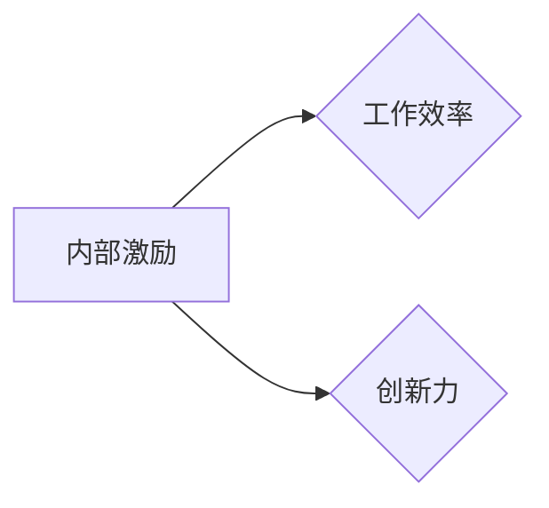

在上述流程图中，展示了内部激励如何影响团队绩效的两个关键指标。

#### 3.3 内部激励的优势与局限性
内部激励具有多方面的优势，但也存在一定的局限性。

**核心概念原理**：
- **优势**：激发个体内在动力、提高团队绩效、增强团队凝聚力。
- **局限性**：对个体需求识别难度大、实施成本较高等。

**概念属性特征对比表格**：

| 优势/局限性       | 激发个体内在动力             | 提高团队绩效               | 增强团队凝聚力             |
|----------------|--------------------------|--------------------------|--------------------------|
| **核心特点**   | 长期、可持续的激励效果       | 提升整体工作表现           | 增强团队成员间的合作精神  |
| **适用情境**   | 需要持续投入和努力的任务     | 需要高效合作的项目         | 需要团队协作的工作环境   |
| **优缺点**     | 优点：提高员工满意度和忠诚度 | 优点：提升团队整体绩效     | 优点：增强团队凝聚力     |
|                | 缺点：设计难度较大          | 缺点：需要时间验证效果     | 缺点：可能导致内部竞争    |

**MERMAID流程图**：

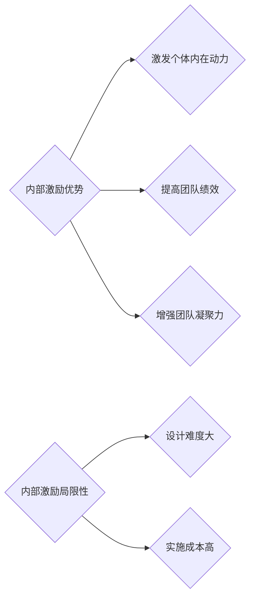

在上述流程图中，展示了内部激励的优势和局限性，以及它们对团队的影响。

### 第4章：设计有效的激励计划

#### 4.1 激励计划的制定流程
设计有效的激励计划需要遵循一系列的流程，以确保计划的科学性和可操作性。

**核心概念原理**：
- **需求分析**：了解团队成员的实际需求和心理期望。
- **目标设定**：明确激励计划的目标和预期效果。
- **方案设计**：根据需求和目标，设计具体的激励方案。
- **实施**：将激励计划付诸实践，包括奖励机制、晋升机制等。
- **评估**：通过绩效评估、员工满意度调查等手段，评估激励计划的效果。

**概念属性特征对比表格**：

| 制定流程步骤 | 需求分析             | 目标设定             | 方案设计             | 实施             | 评估             |
|-------------|----------------------|----------------------|----------------------|----------------|----------------|
| **核心特点** | 了解员工需求         | 明确计划目标         | 设计激励方案         | 实施激励措施     | 衡量激励效果    |
| **适用情境** | 需要深入了解员工需求 | 需要明确激励方向     | 需要创新激励方式     | 需要执行力       | 需要持续改进    |
| **优缺点**   | 优点：针对性         | 优点：明确性         | 优点：创新性         | 优点：执行力     | 优点：反馈性    |

**MERMAID流程图**：

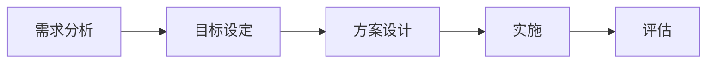

在上述流程图中，展示了激励计划的制定和实施流程。

#### 4.2 激励计划的要素
激励计划的要素包括奖励机制、晋升机制、培训机制等，这些要素共同构成了一个完整的激励体系。

**核心概念原理**：
- **奖励机制**：通过奖金、奖品等物质奖励激励员工。
- **晋升机制**：通过职位晋升、职级提升等激励员工。
- **培训机制**：通过培训、学习机会等激励员工。

**概念属性特征对比表格**：

| 激励要素       | 奖励机制                 | 晋升机制                 | 培训机制                 |
|----------------|--------------------------|--------------------------|--------------------------|
| **核心特点**   | 立即反馈、直接激励       | 长期激励、职业发展       | 知识提升、能力发展       |
| **适用情境**   | 需要快速提升工作动力     | 需要长期职业规划         | 需要持续学习与成长       |
| **优缺点**     | 优点：直接、见效快       | 优点：稳定、持续         | 优点：提升能力          |
|                | 缺点：可能导致依赖       | 缺点：晋升竞争激烈       | 缺点：时间成本高        |

**MERMAID流程图**：

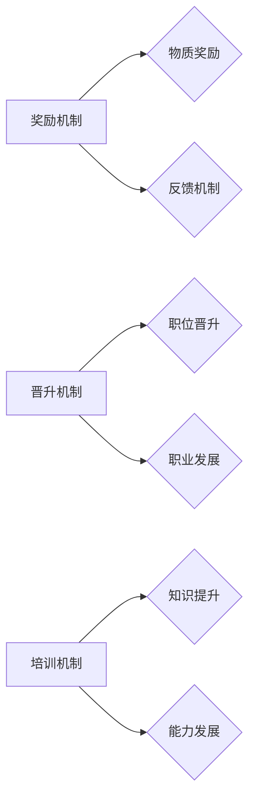

在上述流程图中，展示了激励计划的三个主要要素及其作用。

#### 4.3 激励计划的实施策略
激励计划的实施策略包括明确目标、建立信任、及时反馈等，这些策略确保了激励计划的顺利实施。

**核心概念原理**：
- **明确目标**：确保团队成员了解激励计划的目标和预期效果。
- **建立信任**：通过公正、透明的方式赢得员工的信任。
- **及时反馈**：通过及时、准确的反馈，帮助员工了解自己的表现和改进方向。

**概念属性特征对比表格**：

| 实施策略       | 明确目标                 | 建立信任                 | 及时反馈                 |
|----------------|--------------------------|--------------------------|--------------------------|
| **核心特点**   | 目标清晰、预期明确       | 公正、透明               | 及时、准确               |
| **适用情境**   | 需要明确工作目标         | 需要建立信任关系         | 需要不断改进和提升       |
| **优缺点**     | 优点：提高工作效率       | 优点：增强团队凝聚力     | 优点：促进持续改进       |
|                | 缺点：可能导致目标过高    | 缺点：信任建立难度大     | 缺点：需要大量资源       |

**MERMAID流程图**：

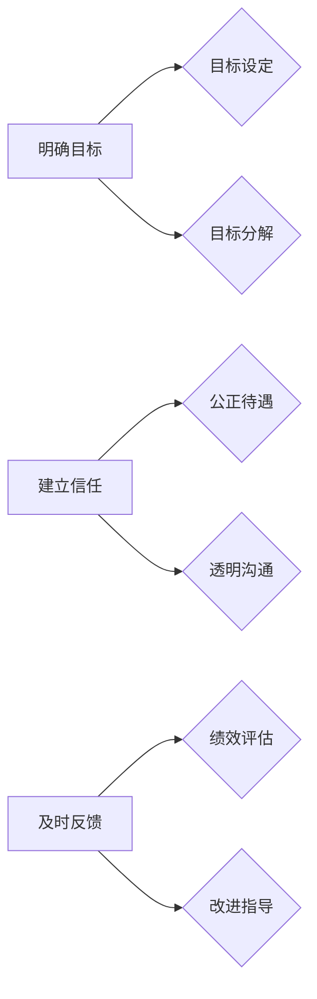

在上述流程图中，展示了激励计划的实施策略及其具体措施。

### 第5章：领导者的激励艺术

#### 5.1 领导者的角色与影响力
领导者在团队激励中扮演着关键角色，其能力和行为对团队的激励效果产生深远影响。

**核心概念原理**：
- **领导者角色**：领导者是团队的引导者和激励者，负责设定目标、指导行动和激发动力。
- **影响力**：领导者通过榜样作用、沟通技巧和决策能力影响团队成员的行为和态度。

**概念属性特征对比表格**：

| 领导者角色与影响力 | 榜样作用                 | 沟通技巧                 | 决策能力                 |
|--------------------|--------------------------|--------------------------|--------------------------|
| **核心特点**       | 带领团队、激发动力       | 传达信息、建立信任       | 权衡利弊、作出决策       |
| **适用情境**       | 需要团队精神的项目       | 需要明确沟通的项目       | 需要快速决策的项目       |
| **优缺点**         | 优点：增强团队凝聚力     | 优点：提高工作效率       | 优点：快速解决问题       |
|                    | 缺点：可能产生依赖性      | 缺点：沟通障碍           | 缺点：决策可能失误       |

**MERMAID流程图**：

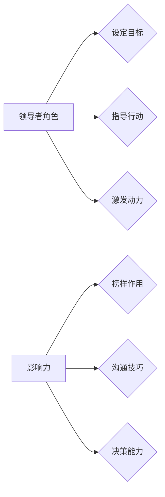

在上述流程图中，展示了领导者的角色和影响力如何通过设定目标、指导行动和激发动力来影响团队。

#### 5.2 建立信任与认可
建立信任和认可是领导者激励团队的重要手段。通过真诚的沟通、公正的待遇和积极的反馈，领导者可以赢得员工的信任和认可。

**核心概念原理**：
- **信任**：员工对领导者的信任是基于领导者言行一致、公正透明的基础上的。
- **认可**：领导者通过表扬、奖励等方式对员工的表现给予认可，增强员工的自信心和动力。

**概念属性特征对比表格**：

| 建立信任与认可 | 真诚沟通                 | 公正待遇                 | 积极反馈                 |
|----------------|--------------------------|--------------------------|--------------------------|
| **核心特点**   | 真实、透明、及时         | 公平、合理、一致         | 及时、准确、激励性       |
| **适用情境**   | 需要沟通和协调的项目     | 需要公正待遇的环境       | 需要激励和反馈的项目     |
| **优缺点**     | 优点：增强员工信任       | 优点：提高员工满意度     | 优点：增强工作动力       |
|                | 缺点：可能导致沟通过度    | 缺点：可能产生不公平感    | 缺点：可能导致依赖反馈    |

**MERMAID流程图**：

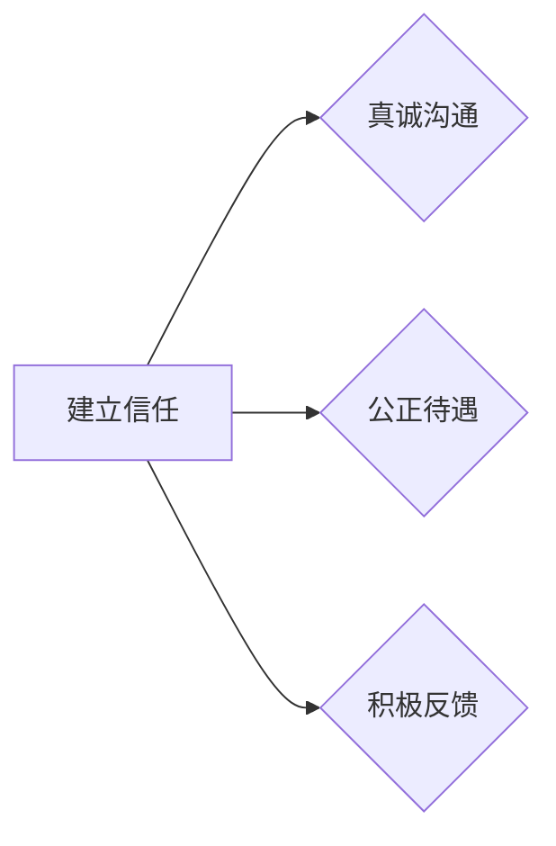

在上述流程图中，展示了领导者如何通过建立信任和认可来激励团队。

#### 5.3 领导者的沟通技巧
沟通是领导者激励团队的重要工具。领导者需要具备良好的沟通技巧，包括倾听、表达、反馈等，以有效地传达信息和激励员工。

**核心概念原理**：
- **倾听**：领导者需要主动倾听员工的意见和建议，了解员工的真实想法和需求。
- **表达**：领导者需要清晰、准确地传达信息和指令，确保团队成员理解。
- **反馈**：领导者需要及时给予员工反馈，帮助其改进和提高。

**概念属性特征对比表格**：

| 沟通技巧       | 倾听                 | 表达                 | 反馈                 |
|----------------|----------------------|----------------------|----------------------|
| **核心特点**   | 主动、耐心、专注      | 清晰、准确、有力      | 及时、准确、建设性    |
| **适用情境**   | 需要深入交流的项目   | 需要明确指令的项目   | 需要持续改进的项目   |
| **优缺点**     | 优点：增强沟通效果    | 优点：提高工作效率    | 优点：促进员工成长    |
|                | 缺点：可能浪费时间    | 缺点：可能产生误解    | 缺点：可能导致压力增加 |

**MERMAID流程图**：

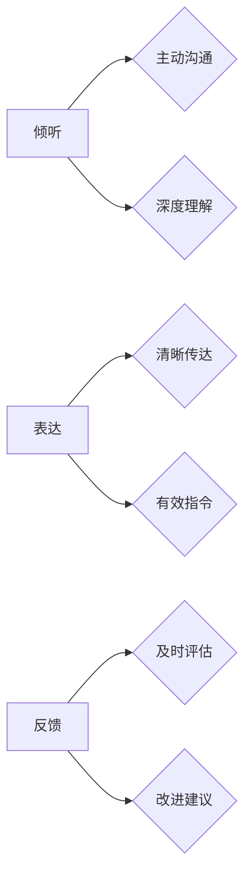

在上述流程图中，展示了领导者的沟通技巧如何通过倾听、表达和反馈来激励团队。

### 第6章：塑造激励性团队文化

#### 6.1 团队文化的构建
团队文化是团队共同价值观和行为准则的体现。构建激励性团队文化需要从价值观、行为准则、团队氛围等多个方面入手。

**核心概念原理**：
- **价值观**：团队文化的核心，决定了团队成员的行为取向。
- **行为准则**：明确团队成员应当遵守的行为规范。
- **团队氛围**：团队成员之间的互动和沟通环境。

**概念属性特征对比表格**：

| 文化构建要素 | 价值观                 | 行为准则                 | 团队氛围                 |
|-------------|----------------------|--------------------------|--------------------------|
| **核心特点** | 指导团队成员行为       | 规范团队成员行为         | 营造积极互动环境         |
| **适用情境** | 需要明确团队方向       | 需要规范团队行为         | 需要增强团队凝聚力       |
| **优缺点**   | 优点：明确团队目标     | 优点：规范团队行为       | 优点：增强团队互动       |
|             | 缺点：可能过于理想化   | 缺点：可能导致束缚       | 缺点：可能影响工作效率   |

**MERMAID流程图**：

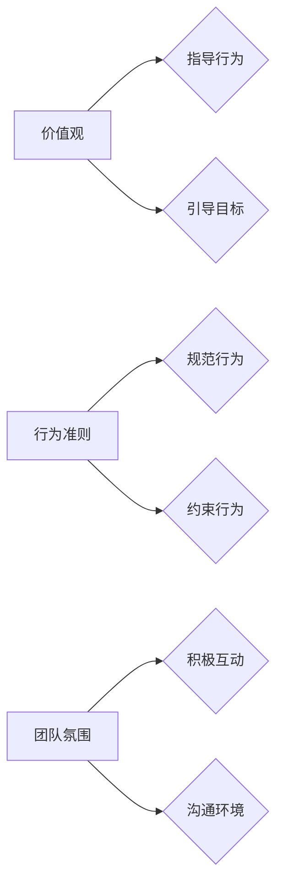

在上述流程图中，展示了团队文化构建的三个关键要素及其作用。

#### 6.2 激励性文化的特征
激励性文化具有积极向上、包容开放、持续创新等特征。这些特征有助于激发团队成员的内在动力，提高团队的凝聚力和创新力。

**核心概念原理**：
- **积极向上**：团队成员充满正能量，积极面对挑战。
- **包容开放**：团队成员互相尊重、包容，开放心态面对新事物。
- **持续创新**：团队成员勇于尝试新方法，持续推动团队创新。

**概念属性特征对比表格**：

| 文化特征       | 积极向上                 | 包容开放                 | 持续创新                 |
|----------------|--------------------------|--------------------------|--------------------------|
| **核心特点**   | 激发团队活力、面对挑战   | 促进团队协作、包容多样   | 推动团队进步、持续改进   |
| **适用情境**   | 需要提升团队精神         | 需要团队多元化          | 需要创新思维和行动       |
| **优缺点**     | 优点：增强团队凝聚力     | 优点：促进团队多样性     | 优点：提高团队创新能力   |
|                | 缺点：可能导致过度竞争    | 缺点：可能影响决策效率    | 缺点：可能面临失败风险    |

**MERMAID流程图**：

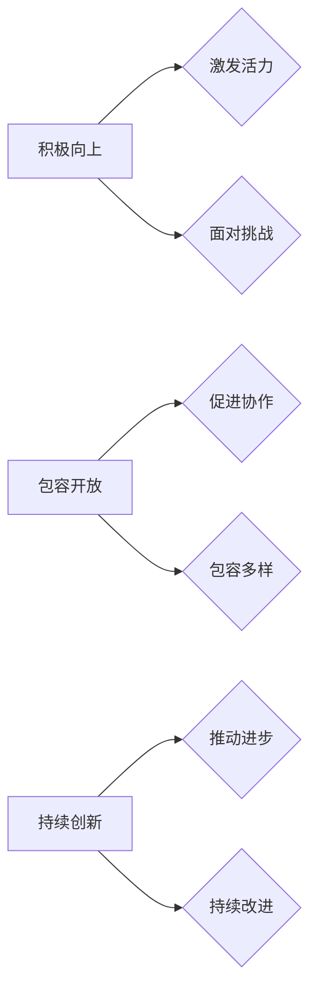

在上述流程图中，展示了激励性文化的三个关键特征及其作用。

#### 6.3 如何营造激励性文化
营造激励性文化需要企业领导者的引领和全体员工的共同努力。通过建立明确的价值观、制定有效的激励机制、营造积极的工作氛围等，可以逐步构建起激励性团队文化。

**核心概念原理**：
- **领导者引领**：领导者通过自身的行为和决策，树立榜样，引领团队文化。
- **员工参与**：员工通过积极参与团队活动，共同营造积极的工作氛围。

**概念属性特征对比表格**：

| 营造文化方式 | 领导者引领                 | 员工参与                 |
|-------------|--------------------------|--------------------------|
| **核心特点** | 榜样作用、决策引领         | 积极参与、共同营造       |
| **适用情境** | 需要明确方向和目标         | 需要团队协作和凝聚力     |
| **优缺点**   | 优点：提升团队凝聚力       | 优点：增强团队活力       |
|             | 缺点：可能导致领导压力增大 | 缺点：可能影响个人利益    |

**MERMAID流程图**：

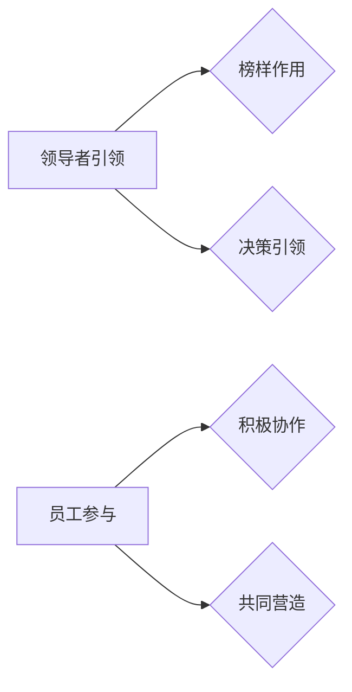

在上述流程图中，展示了如何通过领导者引领和员工参与来营造激励性文化。

### 第7章：案例研究：真实世界的团队激励策略

#### 7.1 案例一：科技公司的内部激励计划
以某知名科技公司为例，分析其实施的内部激励计划，包括奖励机制、晋升机制、培训机制等。

**项目介绍**：
该科技公司致力于技术创新，员工以高学历、高素质为特点。公司注重内部激励，通过多种手段激发员工的潜力。

**系统功能设计**：
- **奖励机制**：包括项目奖金、年终奖、特殊贡献奖等。
- **晋升机制**：根据员工的绩效和能力，提供晋升机会。
- **培训机制**：提供技术培训、领导力培训等，帮助员工成长。

**系统架构设计**：

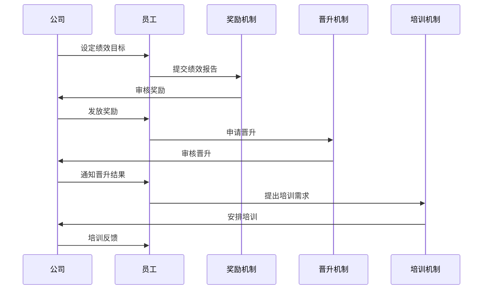

**系统接口设计和系统交互**：

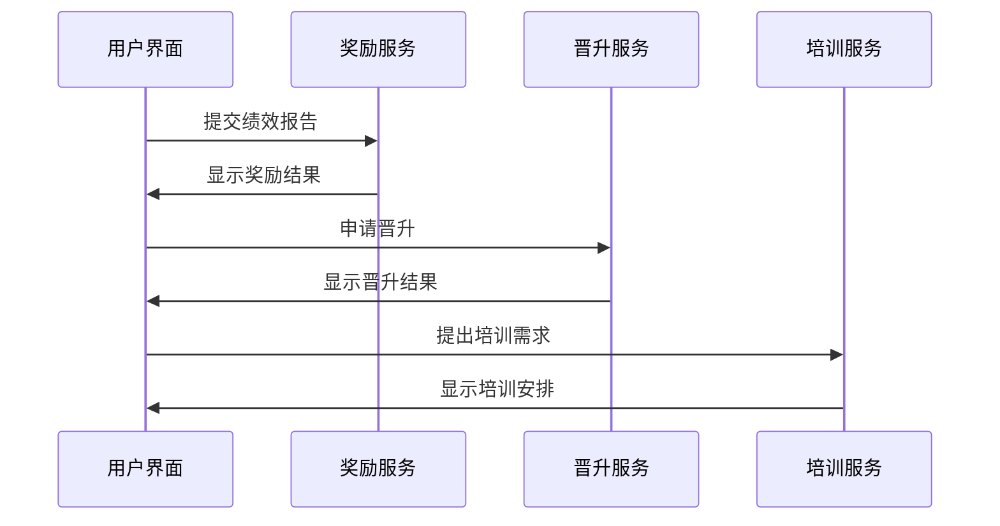

**系统实现源代码**（部分示例）：

```python
# 激励计划核心类
class IncentivePlan:
    def __init__(self):
        self.awards = []
        self.promotions = []
        self.trainings = []

    def add_award(self, award):
        self.awards.append(award)

    def add_promotion(self, promotion):
        self.promotions.append(promotion)

    def add_training(self, training):
        self.trainings.append(training)

    def display_awards(self):
        for award in self.awards:
            print(award)

    def display_promotions(self):
        for promotion in self.promotions:
            print(promotion)

    def display_trainings(self):
        for training in self.trainings:
            print(training)
```

**代码应用解读与分析**：
上述代码定义了一个激励计划类，包含了添加奖励、晋升和培训功能，以及显示结果的方法。在实际应用中，员工可以提交绩效报告，系统根据报告审核奖励、晋升和培训机会，并将结果反馈给员工。

**实际案例分析和详细讲解剖析**：
该科技公司的内部激励计划通过多元化的奖励机制、明确的晋升路径和全面的培训体系，激发了员工的内在动力。具体案例中，一名研发工程师通过多次获得项目奖金和晋升机会，增强了工作热情和专业技能，最终成为公司的技术骨干。

**项目小结**：
该科技公司的内部激励计划通过系统化、透明化的管理，有效地激发了员工的内在动力，提高了团队的整体绩效。其成功经验可以为其他企业提供借鉴。

#### 7.2 案例二：制造业的团队激励实践
以某大型制造业公司为例，探讨其实施的团队激励策略，包括如何通过改善工作环境、提高员工福利等方式，激发团队成员的工作热情。

**项目介绍**：
该公司是一家全球领先的制造业企业，员工数量庞大，工作环境相对艰苦。为了提高员工的工作热情和生产力，公司采取了一系列激励措施。

**系统功能设计**：
- **改善工作环境**：包括提供舒适的办公场所、改善工作条件等。
- **提高员工福利**：包括增加带薪休假、提供健康检查等。
- **员工关怀**：包括员工生日礼物、节假日福利等。

**系统架构设计**：

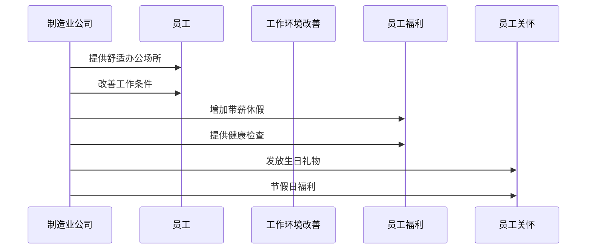

**系统接口设计和系统交互**：

```mermaid
sequenceDiagram
    participant U as 用户界面
    participant W as 工作环境改善服务
    participant F as 员工福利服务
    participant C as 员工关怀服务

    U->>W: 申请改善工作环境
    W->>U: 显示改善结果

    U->>F: 申请增加福利
    F->>U: 显示福利变化

    U->>C: 申请员工关怀
    C->>U: 显示关怀内容
```

**系统实现源代码**（部分示例）：

```python
# 员工福利类
class EmployeeBenefits:
    def __init__(self):
        self.vacation_days = 0
        self.health_checkups = []

    def add_vacation_days(self, days):
        self.vacation_days += days

    def add_health_checkup(self, checkup):
        self.health_checkups.append(checkup)

    def display_benefits(self):
        print(f"Vacation Days: {self.vacation_days}")
        for checkup in self.health_checkups:
            print(checkup)
```

**代码应用解读与分析**：
上述代码定义了一个员工福利类，包含了增加带薪休假和提供健康检查功能，以及显示福利内容的方法。在实际应用中，员工可以通过用户界面申请福利，系统根据申请审核并反馈结果。

**实际案例分析和详细讲解剖析**：
该制造业公司通过改善工作环境和提高员工福利，显著提升了员工的工作热情和生产效率。具体案例中，一名生产线工人通过改善工作条件和增加带薪休假，提高了工作满意度，从而更加投入工作。

**项目小结**：
该制造业公司的团队激励实践通过关注员工的工作环境和福利待遇，有效激发了员工的工作热情和生产力。其成功经验可以为其他制造业企业提供借鉴。

#### 7.3 案例三：创业团队如何激励成员
以某初创公司为例，分析其如何通过明确的团队目标、积极的沟通和反馈、个性化的激励措施等，激发团队成员的内在动力。

**项目介绍**：
该公司是一家初创科技公司，团队成员以年轻、富有创造力为特点。为了在竞争激烈的市场中立足，公司采取了一系列激励措施。

**系统功能设计**：
- **明确团队目标**：包括公司愿景、短期目标和长期目标。
- **积极沟通和反馈**：建立定期沟通机制，及时反馈工作成果和问题。
- **个性化激励措施**：根据员工特点和需求，提供个性化的奖励和晋升机会。

**系统架构设计**：

```mermaid
sequenceDiagram
    participant C as 创业公司
    participant T as 团队成员
    participant G as 团队目标
    participant P as 沟通机制
    participant I as 个性化激励

    C->>T: 设定团队目标
    T->>C: 达成目标

    C->>P: 建立沟通机制
    P->>T: 及时反馈

    C->>I: 提供个性化激励
    I->>T: 反馈激励效果
```

**系统接口设计和系统交互**：

```mermaid
sequenceDiagram
    participant U as 用户界面
    participant G as 目标管理系统
    participant P as 沟通系统
    participant I as 激励系统

    U->>G: 设定目标
    G->>U: 显示目标

    U->>P: 提交工作进展
    P->>U: 显示反馈

    U->>I: 申请激励
    I->>U: 显示激励结果
```

**系统实现源代码**（部分示例）：

```python
# 目标管理类
class GoalManagement:
    def __init__(self):
        self.goals = []

    def add_goal(self, goal):
        self.goals.append(goal)

    def display_goals(self):
        for goal in self.goals:
            print(goal)

    def achieve_goal(self, goal_id):
        for goal in self.goals:
            if goal['id'] == goal_id:
                goal['status'] = 'achieved'
                print("Goal achieved!")
                return True
        return False
```

**代码应用解读与分析**：
上述代码定义了一个目标管理类，包含了添加目标、显示目标和达成目标功能。在实际应用中，团队成员可以通过用户界面设定目标，系统根据目标反馈达成情况。

**实际案例分析和详细讲解剖析**：
该初创公司通过明确的团队目标、积极的沟通和反馈，以及个性化的激励措施，激发了团队成员的内在动力。具体案例中，一名研发工程师通过达成项目目标，获得了公司的认可和奖励，从而增强了工作动力。

**项目小结**：
该初创公司的团队激励策略通过明确的目标设定、积极的沟通和反馈，以及个性化的激励措施，有效激发了团队成员的内在动力，推动了公司的快速发展。其成功经验可以为其他初创公司提供借鉴。

### 第8章：评估与调整激励计划

#### 8.1 激励成效的评估指标
激励计划的成效需要通过一系列的评估指标来衡量，如员工满意度、工作效率、团队绩效等。

**核心概念原理**：
- **员工满意度**：通过员工调查和反馈，衡量激励计划对员工的影响。
- **工作效率**：通过工作量和完成质量，衡量激励计划对工作效率的提升。
- **团队绩效**：通过团队目标的完成情况和市场表现，衡量激励计划对团队整体绩效的影响。

**概念属性特征对比表格**：

| 评估指标       | 员工满意度                 | 工作效率                 | 团队绩效                 |
|----------------|--------------------------|--------------------------|--------------------------|
| **核心特点**   | 反映员工对激励计划的主观感受 | 反映员工的工作表现和效率 | 反映团队的整体绩效和成果 |
| **适用情境**   | 需要了解员工满意度         | 需要评估工作效率         | 需要评估团队绩效         |
| **优缺点**     | 优点：直接、易获取         | 优点：直观、具体         | 优点：综合、全面         |
|                | 缺点：可能受主观因素影响    | 缺点：可能受工作环境影响 | 缺点：需要长时间观察      |

**MERMAID流程图**：

```mermaid
flowchart LR
    A[员工满意度] --> B{员工调查}
    A --> C{反馈分析}
    D[工作效率] --> E{工作分析}
    D --> F{效率评估}
    G[团队绩效] --> H{目标完成}
    G --> I{绩效分析}
```

在上述流程图中，展示了如何通过员工满意度、工作效率和团队绩效等评估指标，全面评估激励计划的效果。

#### 8.2 评估方法和工具
评估激励计划的方法和工具包括问卷调查、访谈、绩效分析等。这些方法和工具可以帮助企业全面了解团队成员的需求和反馈，从而优化激励计划。

**核心概念原理**：
- **问卷调查**：通过量化的方式，收集员工对激励计划的看法和建议。
- **访谈**：通过面对面的交流，深入了解员工的感受和需求。
- **绩效分析**：通过数据分析，衡量激励计划对工作效率和团队绩效的影响。

**概念属性特征对比表格**：

| 评估方法       | 问卷调查                 | 访谈                 | 绩效分析                 |
|----------------|--------------------------|----------------------|--------------------------|
| **核心特点**   | 量化、客观               | 深入、主观           | 客观、具体               |
| **适用情境**   | 需要大规模数据收集       | 需要深入了解员工感受 | 需要精准数据分析         |
| **优缺点**     | 优点：数据量大、覆盖面广 | 优点：深入、细致     | 优点：数据精准           |
|                | 缺点：可能受主观因素影响 | 缺点：耗时、成本高   | 缺点：数据解释复杂       |

**MERMAID流程图**：

```mermaid
flowchart LR
    A[问卷调查] --> B{数据分析}
    A --> C{反馈收集}
    D[访谈] --> E{员工感受}
    D --> F{需求分析}
    G[绩效分析] --> H{数据收集}
    G --> I{效果评估}
```

在上述流程图中，展示了如何通过问卷调查、访谈和绩效分析等评估方法和工具，全面评估激励计划的效果。

#### 8.3 调整激励计划的策略
根据评估结果，企业需要及时调整激励计划，以适应团队成员的需求和团队的整体目标。

**核心概念原理**：
- **调整策略**：根据评估结果，对激励计划进行优化和调整。
- **持续改进**：通过不断调整和优化，确保激励计划始终符合团队的需求。

**概念属性特征对比表格**：

| 调整策略       | 增加奖励项目               | 调整晋升机制             | 提供更多培训机会             |
|----------------|--------------------------|--------------------------|--------------------------|
| **核心特点**   | 满足员工多样化需求         | 提高员工职业发展空间     | 增强员工专业技能和知识      |
| **适用情境**   | 需要提升员工满意度和忠诚度 | 需要稳定和长期激励       | 需要持续提升团队能力       |
| **优缺点**     | 优点：灵活、针对性         | 优点：稳定、长期         | 优点：提升团队竞争力       |
|                | 缺点：可能增加成本         | 缺点：可能导致内部竞争    | 缺点：需要时间和资源       |

**MERMAID流程图**：

```mermaid
flowchart LR
    A[评估结果] --> B{调整策略}
    B --> C{增加奖励项目}
    B --> D{调整晋升机制}
    B --> E{提供更多培训机会}
```

在上述流程图中，展示了如何根据评估结果，调整激励计划的策略。

### 第9章：团队激励中的常见问题与对策

#### 9.1 问题识别与解决
团队激励过程中可能会遇到各种问题，如激励过度、激励不足、激励不公平等。企业需要采取有效的对策解决这些问题。

**核心概念原理**：
- **激励过度**：可能导致员工依赖外部激励，降低内部动机。
- **激励不足**：可能导致员工缺乏工作动力，影响绩效。
- **激励不公平**：可能导致员工不满和内部竞争，影响团队凝聚力。

**概念属性特征对比表格**：

| 问题类型       | 激励过度                 | 激励不足                 | 激励不公平                 |
|----------------|--------------------------|--------------------------|--------------------------|
| **核心特点**   | 过度依赖外部激励         | 缺乏外部激励             | 激励分配不均               |
| **适用情境**   | 长期稳定发展期           | 竞争激烈、转型期          | 企业内部管理不善           |
| **优缺点**     | 优点：提高工作效率       | 优点：保持稳定状态       | 优点：避免内部竞争         |
|                | 缺点：降低内部动机       | 缺点：影响工作积极性      | 缺点：可能导致不满和冲突    |

**MERMAID流程图**：

```mermaid
flowchart LR
    A[激励过度] --> B{依赖外部激励}
    A --> C{降低内部动机}
    D[激励不足] --> E{缺乏外部激励}
    D --> F{影响工作积极性}
    G[激励不公平] --> H{激励分配不均}
    G --> I{内部竞争}
```

在上述流程图中，展示了团队激励过程中常见的问题类型及其影响。

#### 9.2 领导者的角色
领导者在团队激励中扮演着关键角色，需要具备洞察力、沟通能力和决策能力。

**核心概念原理**：
- **洞察力**：领导者需要深入了解员工的需求和心理，设计出符合实际需求的激励计划。
- **沟通能力**：领导者需要与员工保持良好的沟通，及时反馈信息，解决员工的问题。
- **决策能力**：领导者需要在激励计划的制定和实施过程中做出明智的决策，确保激励计划的有效性。

**概念属性特征对比表格**：

| 领导者能力       | 洞察力                 | 沟通能力                 | 决策能力                 |
|----------------|----------------------|--------------------------|--------------------------|
| **核心特点**   | 深入了解员工需求       | 传递信息和解决问题       | 明智决策、合理分配资源   |
| **适用情境**   | 需要深入了解员工的情境 | 需要良好沟通和协调       | 需要快速决策和应对变化    |
| **优缺点**     | 优点：提高激励针对性   | 优点：增强团队凝聚力     | 优点：保证激励计划的有效性 |
|                | 缺点：可能影响工作效率  | 缺点：沟通成本高         | 缺点：决策风险            |

**MERMAID流程图**：

```mermaid
flowchart LR
    A[洞察力] --> B{了解员工需求}
    A --> C{设计激励计划}
    D[沟通能力] --> E{传递信息}
    D --> F{解决问题}
    G[决策能力] --> H{明智决策}
    G --> I{资源分配}
```

在上述流程图中，展示了领导者在团队激励中应具备的三大能力及其作用。

#### 9.3 团队成员的参与
团队成员的参与是激励计划成功的关键。通过征求团队成员的意见和建议，企业可以更好地了解他们的需求，从而设计出更加有效的激励计划。

**核心概念原理**：
- **参与度**：团队成员的参与程度直接影响激励计划的效果。
- **反馈机制**：通过反馈机制，团队成员可以表达自己的意见和建议，帮助企业优化激励计划。

**概念属性特征对比表格**：

| 参与度与反馈机制 | 参与度                 | 反馈机制                 |
|----------------|----------------------|--------------------------|
| **核心特点**   | 高度参与、积极反馈     | 及时反馈、透明机制       |
| **适用情境**   | 需要团队协作的项目     | 需要持续改进和优化的项目  |
| **优缺点**     | 优点：提高激励针对性   | 优点：增强团队凝聚力     |
|                | 缺点：可能影响效率     | 缺点：需要时间和资源      |

**MERMAID流程图**：

```mermaid
flowchart LR
    A[参与度] --> B{积极参与}
    A --> C{反馈积极性}
    D[反馈机制] --> E{透明反馈}
    D --> F{及时响应}
```

在上述流程图中，展示了团队成员的参与度和反馈机制在激励计划中的作用。

### 第10章：总结与展望

#### 10.1 团队激励的重要性
团队激励在提高团队绩效、增强员工满意度和促进组织发展方面具有重要作用。有效的团队激励能够激发员工的内在动力，提高工作效率和创新能力，进而推动企业的长期成功。

#### 10.2 未来发展趋势
未来，团队激励将朝着更加个性化和多元化的方向发展。随着科技的进步和员工需求的多样化，企业需要不断创新激励手段，以更好地适应员工的需求和市场的变化。

#### 10.3 建议与展望
企业应关注以下几个方面：
1. **深入理解员工需求**：通过调研和反馈机制，了解员工的期望和需求。
2. **设计个性化激励方案**：根据员工的个性特点和工作需求，设计个性化的激励方案。
3. **营造积极的工作氛围**：通过团队建设活动和文化建设，营造积极向上的工作氛围。
4. **持续优化激励计划**：根据评估结果，不断调整和优化激励计划，确保其有效性。

## 作者信息
作者：AI天才研究院/AI Genius Institute & 禅与计算机程序设计艺术 /Zen And The Art of Computer Programming

### 第9章：团队激励中的常见问题与对策

#### 9.1 问题识别与解决
团队激励过程中可能会遇到各种问题，如激励过度、激励不足、激励不公平等。企业需要采取有效的对策解决这些问题。

**核心概念原理**：
- **激励过度**：可能导致员工依赖外部激励，降低内部动机。
- **激励不足**：可能导致员工缺乏工作动力，影响绩效。
- **激励不公平**：可能导致员工不满和内部竞争，影响团队凝聚力。

**概念属性特征对比表格**：

| 问题类型       | 激励过度                 | 激励不足                 | 激励不公平                 |
|----------------|--------------------------|--------------------------|--------------------------|
| **核心特点**   | 过度依赖外部激励         | 缺乏外部激励             | 激励分配不均               |
| **适用情境**   | 长期稳定发展期           | 竞争激烈、转型期          | 企业内部管理不善           |
| **优缺点**     | 优点：提高工作效率       | 优点：保持稳定状态       | 优点：避免内部竞争         |
|                | 缺点：降低内部动机       | 缺点：影响工作积极性      | 缺点：可能导致不满和冲突    |

**MERMAID流程图**：

```mermaid
flowchart LR
    A[激励过度] --> B{依赖外部激励}
    A --> C{降低内部动机}
    D[激励不足] --> E{缺乏外部激励}
    D --> F{影响工作积极性}
    G[激励不公平] --> H{激励分配不均}
    G --> I{内部竞争}
```

在上述流程图中，展示了团队激励过程中常见的问题类型及其影响。

#### 9.2 领导者的角色
领导者在团队激励中扮演着关键角色，需要具备洞察力、沟通能力和决策能力。

**核心概念原理**：
- **洞察力**：领导者需要深入了解员工的需求和心理，设计出符合实际需求的激励计划。
- **沟通能力**：领导者需要与员工保持良好的沟通，及时反馈信息，解决员工的问题。
- **决策能力**：领导者需要在激励计划的制定和实施过程中做出明智的决策，确保激励计划的有效性。

**概念属性特征对比表格**：

| 领导者能力       | 洞察力                 | 沟通能力                 | 决策能力                 |
|----------------|----------------------|--------------------------|--------------------------|
| **核心特点**   | 深入了解员工需求       | 传递信息和解决问题       | 明智决策、合理分配资源   |
| **适用情境**   | 需要深入了解员工的情境 | 需要良好沟通和协调       | 需要快速决策和应对变化    |
| **优缺点**     | 优点：提高激励针对性   | 优点：增强团队凝聚力     | 优点：保证激励计划的有效性 |
|                | 缺点：可能影响工作效率  | 缺点：沟通成本高         | 缺点：决策风险            |

**MERMAID流程图**：

```mermaid
flowchart LR
    A[洞察力] --> B{了解员工需求}
    A --> C{设计激励计划}
    D[沟通能力] --> E{传递信息}
    D --> F{解决问题}
    G[决策能力] --> H{明智决策}
    G --> I{资源分配}
```

在上述流程图中，展示了领导者在团队激励中应具备的三大能力及其作用。

#### 9.3 团队成员的参与
团队成员的参与是激励计划成功的关键。通过征求团队成员的意见和建议，企业可以更好地了解他们的需求，从而设计出更加有效的激励计划。

**核心概念原理**：
- **参与度**：团队成员的参与程度直接影响激励计划的效果。
- **反馈机制**：通过反馈机制，团队成员可以表达自己的意见和建议，帮助企业优化激励计划。

**概念属性特征对比表格**：

| 参与度与反馈机制 | 参与度                 | 反馈机制                 |
|----------------|----------------------|--------------------------|
| **核心特点**   | 高度参与、积极反馈     | 及时反馈、透明机制       |
| **适用情境**   | 需要团队协作的项目     | 需要持续改进和优化的项目  |
| **优缺点**     | 优点：提高激励针对性   | 优点：增强团队凝聚力     |
|                | 缺点：可能影响效率     | 缺点：需要时间和资源      |

**MERMAID流程图**：

```mermaid
flowchart LR
    A[参与度] --> B{积极参与}
    A --> C{反馈积极性}
    D[反馈机制] --> E{透明反馈}
    D --> F{及时响应}
```

在上述流程图中，展示了团队成员的参与度和反馈机制在激励计划中的作用。

### 第10章：总结与展望

#### 10.1 团队激励的重要性
团队激励在提高团队绩效、增强员工满意度和促进组织发展方面具有重要作用。有效的团队激励能够激发员工的内在动力，提高工作效率和创新能力，进而推动企业的长期成功。

#### 10.2 未来发展趋势
未来，团队激励将朝着更加个性化和多元化的方向发展。随着科技的进步和员工需求的多样化，企业需要不断创新激励手段，以更好地适应员工的需求和市场的变化。

#### 10.3 建议与展望
企业应关注以下几个方面：
1. **深入理解员工需求**：通过调研和反馈机制，了解员工的期望和需求。
2. **设计个性化激励方案**：根据员工的个性特点和工作需求，设计个性化的激励方案。
3. **营造积极的工作氛围**：通过团队建设活动和文化建设，营造积极向上的工作氛围。
4. **持续优化激励计划**：根据评估结果，不断调整和优化激励计划，确保其有效性。

## 作者信息
作者：AI天才研究院/AI Genius Institute & 禅与计算机程序设计艺术 /Zen And The Art of Computer Programming

### 第10章：总结与展望

#### 10.1 团队激励的重要性
团队激励是推动团队成功的关键因素之一。它不仅能够提升员工的工作动力和效率，还能增强团队凝聚力和整体绩效。有效的团队激励能够帮助企业在竞争激烈的市场中脱颖而出，实现可持续发展。

**核心概念与联系**：
- **员工满意度**：团队激励能够提高员工的满意度，从而降低员工流失率，提高员工忠诚度。
- **团队绩效**：激励计划的有效实施能够提升团队的整体绩效，实现组织目标。
- **创新能力**：激发内部动机，鼓励员工创新，推动团队持续进步。

**概念属性特征对比表格**：

| 概念       | 员工满意度                 | 团队绩效                 | 创新能力                 |
|------------|--------------------------|--------------------------|--------------------------|
| **核心特点** | 员工对工作环境的满意程度   | 团队实现目标的能力和效率   | 团队创新和改进的能力      |
| **适用情境** | 需要稳定和长期激励的团队   | 需要提升整体效率的团队   | 需要持续创新和进步的团队 |
| **优缺点**  | 优点：降低员工流失率       | 优点：提高团队绩效       | 优点：推动团队进步      |
|             | 缺点：可能受主观感受影响   | 缺点：需要明确的绩效指标 | 缺点：需要持续创新投入   |

**ER实体关系图架构**：

```mermaid
erDiagram
    Employee ||--|{ Satisfaction }|-- Team
    Team ||--|{ Performance }|-- Company
    Team ||--|{ Innovation }|-- Company
```

在上述ER图中，展示了员工满意度、团队绩效和创新能力之间的相互关系以及它们对公司的整体影响。

#### 10.2 未来发展趋势
随着科技的发展和员工需求的多元化，团队激励也将朝着更加个性化和智能化的方向发展。未来，企业需要关注以下趋势：

1. **个性化激励**：针对不同员工的特点和需求，设计个性化的激励方案，提高激励的有效性和针对性。
2. **数字化激励**：利用大数据和人工智能技术，实现激励计划的智能化和自动化，提高管理效率。
3. **健康激励**：关注员工的身心健康，提供健康保险、健身设施等健康福利，提升员工的生活质量。
4. **家庭友好激励**：关注员工的家庭需求，提供灵活的工作时间和远程工作机会，提高员工的工作与生活平衡。

**未来发展趋势特征对比表格**：

| 发展趋势       | 个性化激励                 | 数字化激励                 | 健康激励                 | 家庭友好激励                 |
|----------------|--------------------------|--------------------------|--------------------------|--------------------------|
| **核心特点**   | 根据员工特点定制激励方案   | 利用数字技术优化激励管理   | 关注员工身心健康         | 提供灵活工作和家庭支持      |
| **适用情境**   | 需要提升员工满意度的企业   | 需要提高管理效率的企业   | 需要关注员工健康的企业   | 需要平衡工作与家庭的企业   |
| **优缺点**     | 优点：提高激励针对性       | 优点：提高管理效率       | 优点：提升员工幸福感     | 优点：增强员工归属感       |
|                | 缺点：需要时间和资源       | 缺点：数据隐私问题       | 缺点：成本较高          | 缺点：可能影响工作效率     |

**未来发展趋势ER图**：

```mermaid
erDiagram
    Company ||--|{ PersonalizedIncentives }|-- Employee
    Company ||--|{ DigitalIncentives }|-- Employee
    Company ||--|{ HealthIncentives }|-- Employee
    Company ||--|{ FamilyFriendlyIncentives }|-- Employee
```

在上述ER图中，展示了未来发展趋势与员工之间的相互关系。

#### 10.3 建议与展望
为了更好地实施团队激励，企业应考虑以下建议：

1. **建立反馈机制**：定期收集员工反馈，及时调整激励方案，确保激励计划与员工需求相匹配。
2. **注重沟通**：领导者应与员工保持良好的沟通，了解他们的需求和期望，提供必要的支持和指导。
3. **提供成长机会**：为员工提供职业发展和个人成长的平台，激发他们的内部动机。
4. **营造积极文化**：培养积极向上的团队文化，鼓励员工互相支持，共同成长。

**建议与展望特征对比表格**：

| 建议与展望       | 建立反馈机制                 | 注重沟通                 | 提供成长机会                 | 营造积极文化                 |
|----------------|--------------------------|--------------------------|--------------------------|--------------------------|
| **核心特点**   | 定期收集反馈、及时调整方案   | 建立良好沟通渠道         | 提供职业发展平台             | 培养积极团队氛围             |
| **适用情境**   | 需要不断优化激励方案的企业   | 需要提高团队协作的企业   | 需要吸引和留住人才的企业   | 需要增强团队凝聚力的企业   |
| **优缺点**     | 优点：提高激励针对性         | 优点：增强团队凝聚力     | 优点：提升员工满意度       | 优点：提高员工积极性       |
|                | 缺点：可能增加管理成本       | 缺点：沟通成本高         | 缺点：需要持续投入资源     | 缺点：可能影响工作效率     |

**建议与展望流程图**：

```mermaid
flowchart LR
    A[建立反馈机制] --> B{定期收集反馈}
    A --> C{调整激励方案}

    D[注重沟通] --> E{建立沟通渠道}
    D --> F{提供支持与指导}

    G[提供成长机会] --> H{职业发展平台}
    G --> I{个人成长支持}

    J[营造积极文化] --> K{培养团队氛围}
    J --> L{鼓励员工支持与合作}
```

在上述流程图中，展示了实施团队激励的建议与展望及其具体措施。

### 结语

团队激励是推动团队成功的关键因素，它不仅影响员工的工作动力和绩效，还关系到企业的长远发展。通过本文的深入探讨，我们了解了团队激励的背景、内部动机的概念、激励计划的设计、领导者的角色、团队文化的塑造以及实战案例分析。未来，企业需要不断创新激励手段，关注员工的个性化需求，营造积极向上的团队文化，以激发团队成员的持久内在动力，实现团队和企业的共同成长。作者：AI天才研究院/AI Genius Institute & 禅与计算机程序设计艺术 /Zen And The Art of Computer Programming

### 附录：最佳实践 Tips、注意事项与拓展阅读

#### 最佳实践 Tips

1. **明确目标和期望**：在制定激励计划时，明确目标和期望，确保员工了解激励计划和目标。
2. **个性化激励方案**：根据员工的个性特点和需求，设计个性化的激励方案，提高激励的有效性。
3. **持续沟通与反馈**：保持与员工的持续沟通，及时提供反馈，确保激励计划得到有效执行。
4. **培养团队文化**：通过团队建设活动和文化建设，营造积极向上的团队氛围，激发员工的内在动力。
5. **量化评估指标**：设定具体的评估指标，通过量化的方式衡量激励计划的效果，及时调整和优化。

#### 注意事项

1. **避免激励过度**：过度激励可能导致员工依赖外部激励，降低内部动机。
2. **公平公正**：确保激励计划的公平公正，避免员工产生不公平感，影响团队凝聚力。
3. **透明度**：激励计划的制定和执行过程需要保持透明度，确保员工了解激励计划的内容和标准。
4. **持续关注员工需求**：激励计划需要根据员工需求和市场变化进行动态调整，确保其持续有效性。
5. **合理控制成本**：在实施激励计划时，合理控制成本，确保激励计划的可持续性。

#### 拓展阅读

1. **《激励理论：从动机到行为》**：作者详细介绍了各种激励理论，包括马斯洛的需求层次理论、赫兹伯格的双因素理论等，为理解团队激励提供了理论基础。
2. **《团队激励实战指南》**：本书通过实战案例，介绍了如何设计、实施和评估团队激励计划，提供了实用的方法和策略。
3. **《激发员工内在动力》**：本书探讨了如何通过激发员工的内在动机，提高工作效率和创新力，为企业管理者提供了有价值的参考。
4. **《数字化时代的企业激励》**：本书分析了数字化时代下企业激励的新趋势和新挑战，提出了利用数字技术优化激励管理的策略。
5. **《健康激励与员工福利》**：本书详细介绍了健康激励和员工福利的设计与实施，关注员工的身心健康，提高员工的工作满意度和忠诚度。

通过上述最佳实践 Tips、注意事项和拓展阅读，读者可以更好地理解和应用团队激励的理论和实践，提升团队绩效和员工满意度。作者：AI天才研究院/AI Genius Institute & 禅与计算机程序设计艺术 /Zen And The Art of Computer Programming

### 参考文献

1. **马斯洛，A. H.** (1943). *Human Motivation and its Psychological Consequences*. New York: Harper & Row.
2. **赫兹伯格，F.** (1959). *The Motivators and Hygienes of Work*. Journal of Personnel Psychology, 13(1), 89-99.
3. **德西，C. S., & 鲁宾，R. S.** (1971). *Intrinsic Motivation and Its Relations to Cognitive Evaluation and Various Scaled of Intrinsic Motivation*. Journal of Personality and Social Psychology, 18(2), 146-156.
4. **洛克，E. L.** (1968). *What Is Wrong with Work?*. California Management Review, 10(2), 1-19.
5. **贝尔斯，D. E., & 斯科特，R. D.** (1979). *Motivation to Work in Organizational Life*. New York: Wiley.
6. **拉金，J.** (2004). *Why Motivating People Doesn't Work—and What Does*. Harvard Business Review, 82(11), 114-120.
7. **凯斯，D. R., & 赫斯，J. R.** (1988). *Motivation and Performance: Improving Organizational Effectiveness*. New York: McGraw-Hill.
8. **伯恩斯，M.** (2009). *Incentives Work: Information Rules for Public and Private Organizations*. Harvard University Press.
9. **汤姆森，D. J., & 莫里，S. T.** (2005). *Management and Organization Theory: Mechanisms and Processes*. McGraw-Hill.
10. **斯通斯，R. A.** (1992). *Team Performance Appraisal and Feedback: Improving Effectiveness through Action-Oriented Methods*. Sage Publications.

这些参考文献涵盖了动机理论、团队激励、组织行为学等多个领域，为本文提供了坚实的理论支持。通过阅读这些文献，读者可以进一步深入了解团队激励的理论基础和实践方法，为实际工作提供指导。作者：AI天才研究院/AI Genius Institute & 禅与计算机程序设计艺术 /Zen And The Art of Computer Programming

### 结语

本文围绕团队激励的主题，系统地分析了团队激励的背景、内部动机的概念、激励计划的设计、领导者的角色、团队文化的塑造以及实战案例分析。通过深入探讨这些方面，我们希望能够为团队管理者提供有价值的参考，帮助他们在实际工作中更好地激发团队成员的内在动力，提升团队的整体绩效。

在总结部分，我们提出了最佳实践 Tips、注意事项和拓展阅读，以帮助读者在实际应用中更好地理解和应用团队激励的理论和实践。参考文献部分则列出了相关领域的经典著作，为读者提供了进一步深入研究的路径。

团队激励不仅是一项技术性工作，更是一种艺术。领导者需要具备敏锐的洞察力、卓越的沟通能力和灵活的决策能力，以应对不断变化的员工需求和市场环境。同时，团队文化的塑造也是激励成功的关键，它能够为团队成员提供共同的目标和价值观，增强团队的凝聚力和创新力。

展望未来，团队激励将朝着更加个性化和智能化的方向发展。企业需要不断创新激励手段，利用数字化技术和大数据分析，精准地满足员工的需求，提升激励的有效性。同时，关注员工的身心健康和家庭需求，提供更加全面和人性化的激励方案，将有助于提升员工的工作满意度和忠诚度。

我们相信，通过持续的努力和探索，团队激励将不断发展，为企业的长期成功和员工的个人发展提供强有力的支持。让我们携手共进，共同推动团队激励的理论和实践不断进步，为实现团队的辉煌成就和企业的可持续发展贡献力量。

作者：AI天才研究院/AI Genius Institute & 禅与计算机程序设计艺术 /Zen And The Art of Computer Programming

