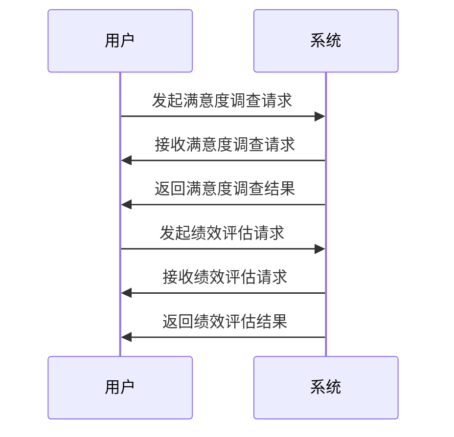

                 

## 团队激励新思路：超越传统奖惩制度

### 关键词：团队激励、新思路、传统奖惩制度、员工激励、团队建设

### 摘要：
在当今快速变化和竞争激烈的企业环境中，传统奖惩制度已不再足以满足团队激励的需求。本文将深入探讨团队激励的新思路，解析传统奖惩制度的局限，并介绍一些创新的激励模式，旨在为IT领域的企业提供更有效的团队建设策略。

## 引言

在过去的几十年中，企业普遍采用传统的奖惩制度来激励员工。这种制度通过奖励优秀的表现和惩罚不良行为来调动员工的积极性。然而，随着商业环境的变化和员工需求的多样化，传统奖惩制度的局限性日益显现。首先，传统奖惩制度往往过于依赖物质奖励，而忽视了员工的精神需求和职业发展。其次，这种制度往往导致员工产生短期行为，忽视了长期绩效的提升。此外，过度依赖奖惩制度可能导致员工产生依赖性，降低自主性和创新能力。

因此，企业需要寻找新的团队激励思路，超越传统奖惩制度的局限，以更好地适应现代企业的发展需求。本文将首先介绍团队激励的必要性，然后分析传统奖惩制度的局限，最后探讨一些新的激励模式，为读者提供实用的团队建设策略。

## 第一部分：背景介绍

### 1.1 团队激励的必要性

#### 1.1.1 当前团队激励面临的挑战

在当前的商业环境中，企业面临许多挑战，如全球化竞争、技术变革、市场需求变化等。这些挑战使得团队激励变得尤为重要。以下是团队激励面临的主要挑战：

1. **员工期望多样化**：随着社会和经济的不断发展，员工的期望也日益多样化。他们不仅追求物质奖励，更关注个人成长、工作与生活的平衡、职业发展等非物质需求。
2. **工作模式变化**：远程办公、灵活工作时间的普及改变了员工的工作方式，传统奖惩制度难以适应这些变化。
3. **绩效评估复杂化**：现代企业的绩效评估不再仅仅基于个人表现，更注重团队协作和整体绩效。因此，传统奖惩制度难以全面反映员工的实际贡献。

#### 1.1.2 团队激励的重要性

团队激励对于企业的成功至关重要。以下是一些团队激励的重要性：

1. **提升员工满意度**：有效的团队激励能够提高员工的满意度和忠诚度，从而降低员工流失率。
2. **促进团队协作**：团队激励可以激发员工的团队意识，促进团队合作，提高整体工作效率。
3. **提升创新能力**：通过激励员工，企业可以鼓励创新思维，推动技术进步和业务发展。
4. **实现企业目标**：团队激励有助于企业实现短期和长期目标，提高市场竞争力。

### 1.2 传统奖惩制度的局限

#### 1.2.1 传统奖惩制度的问题

尽管传统奖惩制度在历史上曾起到一定的作用，但其局限性也逐渐显现。以下是传统奖惩制度存在的主要问题：

1. **过于依赖物质奖励**：传统奖惩制度往往侧重于物质奖励，忽视了员工的非物质需求，如职业发展、工作与生活的平衡等。
2. **短期行为导向**：传统奖惩制度容易导致员工追求短期绩效，而忽视长期目标和团队利益。
3. **不公平感**：在传统奖惩制度下，员工可能会感到不公平，因为奖励和惩罚往往基于主观判断，缺乏客观标准。
4. **依赖性增强**：过度依赖奖惩制度可能导致员工产生依赖性，降低自主性和创新能力。

#### 1.2.2 超越传统奖惩制度的必要性

为了应对当前的商业挑战和员工需求，企业需要超越传统奖惩制度，采用更灵活、更全面的激励模式。以下是超越传统奖惩制度的必要性：

1. **适应员工需求**：新的激励模式能够更好地满足员工的多样化需求，提高员工满意度和忠诚度。
2. **促进长期绩效**：新的激励模式注重长期绩效和团队利益，有助于企业实现可持续发展。
3. **提升创新能力**：通过鼓励自主性和创新思维，新的激励模式有助于推动技术进步和业务发展。
4. **增强企业竞争力**：灵活、全面的激励模式有助于企业在全球化和技术变革的背景下保持竞争优势。

### 1.3 新思路概述

#### 1.3.1 新激励模式的概念

新激励模式是指一种以员工需求为中心，通过多种方式激发员工工作热情和创造力的激励方式。它不仅包括物质奖励，还涵盖职业发展、工作与生活的平衡、个人成长等多个方面。

#### 1.3.2 新激励模式的优势

新激励模式相较于传统奖惩制度具有以下优势：

1. **多样性**：新激励模式涵盖了多种激励方式，能够满足员工的多样化需求。
2. **灵活性**：新激励模式更加灵活，能够适应不同的工作环境和员工需求。
3. **长期导向**：新激励模式注重长期绩效和团队利益，有助于企业实现可持续发展。
4. **创新能力**：新激励模式鼓励自主性和创新思维，有助于推动技术进步和业务发展。
5. **员工满意度和忠诚度**：新激励模式能够提高员工满意度和忠诚度，降低员工流失率。

## 第二部分：核心概念与联系

### 2.1 激励理论

#### 2.1.1 内容型激励理论

内容型激励理论主要关注激励的内在因素，认为激励来自于工作本身和与工作相关的内在动机。典型的内容型激励理论包括：

1. **马斯洛的需求层次理论**：马斯洛认为人的需求分为五个层次，包括生理需求、安全需求、社交需求、尊重需求和自我实现需求。当某一层次的需求得到满足后，个体会追求更高层次的需求。
2. **赫兹伯格的双因素理论**：赫兹伯格将工作环境中的因素分为激励因素（如成就、认可、工作本身等）和保健因素（如工资、工作条件、人际关系等）。他认为激励因素能够激发员工的工作热情，而保健因素只能防止员工产生不满。

#### 2.1.2 过程型激励理论

过程型激励理论关注激励的过程，研究激励因素如何影响员工的行为。典型的过程型激励理论包括：

1. **期望理论**：弗鲁姆的期望理论认为，员工的行为取决于他们对结果的期望和结果的价值。员工只有在认为努力能够导致成功的结果，且这种结果对他们有吸引力时，才会付出努力。
2. **公平理论**：亚当斯的公平理论认为，员工会将自己的投入和产出与他人进行比较，以判断自己是否受到了公平对待。如果员工感到不公平，他们可能会调整自己的行为，以实现公平感。

#### 2.1.3 结果型激励理论

结果型激励理论主要研究激励的结果，即激励如何影响员工的工作表现和绩效。典型的结果型激励理论包括：

1. **目标设置理论**：洛克和莱瑟姆的目标设置理论认为，明确、具有挑战性的目标能够激发员工的工作热情，提高绩效。目标设置的有效性取决于目标的明确性、挑战性和具体性。
2. **强化理论**：斯金纳的强化理论认为，通过正强化（奖励）和负强化（惩罚）可以塑造和改变员工的行为。正强化能够增加员工的行为频率，而负强化能够减少员工的不良行为。

### 2.2 激励模式

#### 2.2.1 新激励模式的特点

新激励模式与传统激励模式相比，具有以下特点：

1. **多样性**：新激励模式涵盖了多种激励方式，包括物质奖励、职业发展、工作与生活的平衡、个人成长等，能够满足员工的多样化需求。
2. **灵活性**：新激励模式更加灵活，能够根据不同的工作环境和员工需求进行调整。
3. **长期导向**：新激励模式注重长期绩效和团队利益，有助于企业实现可持续发展。
4. **自主性**：新激励模式鼓励员工自主性和创新思维，推动技术进步和业务发展。
5. **公平性**：新激励模式注重公平性，通过明确的激励标准和客观的评估体系，确保员工感受到公平待遇。

#### 2.2.2 新激励模式与传统模式的对比

| 对比项目 | 传统激励模式 | 新激励模式 |
| :------: | :-----------: | :---------: |
| 激励方式 | 物质奖励为主 | 多样化激励 |
| 长期导向 | 短期行为导向 | 长期绩效导向 |
| 自主性 | 依赖性较强 | 鼓励自主性 |
| 公平性 | 主观性较强 | 公平性保障 |

#### 2.2.3 新激励模式的应用场景

新激励模式适用于多种工作环境和员工需求，以下是一些典型应用场景：

1. **创新型企业**：新激励模式能够激发员工的创新思维和创造力，有助于企业保持竞争优势。
2. **技术型企业**：新激励模式能够满足技术员工对职业发展、工作与生活的平衡和个人成长的多元化需求。
3. **跨国企业**：新激励模式能够适应不同国家和地区的文化差异，提高员工满意度和忠诚度。
4. **创业公司**：新激励模式能够鼓励创业团队成员的自主性和创新思维，推动企业快速发展。

### 2.3 激励机制

#### 2.3.1 激励机制的设计原则

为了确保激励机制的公平性、有效性和可持续性，设计激励机制时需要遵循以下原则：

1. **明确目标**：激励机制的目的是激发员工的工作热情和创造力，因此目标应该明确、具体、具有挑战性。
2. **公平性**：激励机制的评估标准应该客观、公正，确保所有员工都有公平的机会获得激励。
3. **灵活性**：激励机制应该能够适应不同工作环境和员工需求的变化，保持灵活性。
4. **可持续性**：激励机制应该能够长期激励员工，促进企业的可持续发展。
5. **透明性**：激励机制的运作过程应该透明，让员工了解激励政策的标准和过程。

#### 2.3.2 激励机制的构建方法

构建激励机制的步骤如下：

1. **需求分析**：了解员工的多样化需求，确定激励机制的焦点和方向。
2. **目标设定**：明确激励机制的目标，确保目标具体、明确、具有挑战性。
3. **评估标准**：制定客观、公正的评估标准，确保评估结果的公平性。
4. **激励方式**：根据员工需求和评估结果，选择合适的激励方式，包括物质奖励、职业发展、工作与生活的平衡等。
5. **实施与反馈**：实施激励机制，并根据员工反馈不断调整和优化。

#### 2.3.3 激励机制的评估与优化

为了确保激励机制的持续有效，需要对激励机制进行定期评估和优化。以下是一些评估和优化的方法：

1. **员工满意度调查**：通过员工满意度调查了解员工对激励机制的看法，识别存在的问题。
2. **绩效评估**：根据绩效评估结果，分析激励机制的有效性，发现不足之处。
3. **反馈机制**：建立反馈机制，鼓励员工提出建议和意见，为激励机制的优化提供参考。
4. **持续改进**：根据评估结果和员工反馈，不断调整和优化激励机制，提高其有效性和可持续性。

## 第三部分：算法原理讲解

### 3.1 数据分析与决策算法

#### 3.1.1 数据分析的基本概念

数据分析是指通过处理和分析大量数据，提取有价值的信息和知识的过程。数据分析的基本概念包括：

1. **数据收集**：收集数据是数据分析的第一步，数据可以从各种来源获取，如数据库、日志文件、社交媒体等。
2. **数据预处理**：数据预处理包括数据清洗、数据转换和数据集成，以确保数据的准确性和一致性。
3. **数据探索**：数据探索是对数据进行初步分析和可视化，以发现数据中的模式和趋势。
4. **数据分析**：数据分析包括统计分析和机器学习算法，用于深入挖掘数据中的信息和知识。

#### 3.1.2 决策算法的基本原理

决策算法是指用于帮助决策者做出最佳决策的算法。决策算法的基本原理包括：

1. **效用理论**：效用理论是一种用于评估不同决策结果的数学方法，它通过量化决策结果的效用值，帮助决策者做出最佳决策。
2. **期望理论**：期望理论是一种基于概率和期望值进行决策的方法，它通过计算不同决策结果的期望值，帮助决策者选择最佳决策。
3. **优化算法**：优化算法是一种用于寻找最优解的算法，它通过优化目标函数，找到使目标函数最大或最小的解。

#### 3.1.3 数据分析与决策算法在实际激励中的应用

在团队激励中，数据分析与决策算法可以用于以下几个方面：

1. **员工满意度分析**：通过数据分析，了解员工对激励政策的满意度，识别存在的问题，为激励政策的优化提供依据。
2. **绩效评估**：通过数据分析，对员工的工作表现进行量化评估，为绩效奖励提供客观依据。
3. **目标设定**：通过数据分析，确定合理的激励目标，确保目标具有挑战性和可实现性。
4. **资源分配**：通过数据分析，优化激励资源的分配，确保资源使用效率最大化。

### 3.2 机器学习算法

#### 3.2.1 机器学习的基本概念

机器学习是一种通过数据训练模型，使模型能够对未知数据进行预测或分类的技术。机器学习的基本概念包括：

1. **监督学习**：监督学习是一种有监督的训练方法，它通过已标记的数据训练模型，使模型能够对未知数据进行预测。
2. **无监督学习**：无监督学习是一种无监督的训练方法，它通过未标记的数据训练模型，使模型能够发现数据中的模式和趋势。
3. **强化学习**：强化学习是一种基于反馈的训练方法，它通过模拟环境和反馈信号，使模型能够学习最优策略。

#### 3.2.2 机器学习算法的分类

机器学习算法可以分为以下几类：

1. **分类算法**：分类算法用于将数据划分为不同的类别，常见的分类算法包括决策树、支持向量机、神经网络等。
2. **回归算法**：回归算法用于预测连续值，常见的回归算法包括线性回归、决策树回归、神经网络回归等。
3. **聚类算法**：聚类算法用于将数据分为不同的簇，常见的聚类算法包括K-means、层次聚类、DBSCAN等。

#### 3.2.3 机器学习算法在团队激励中的应用

机器学习算法在团队激励中可以应用于以下几个方面：

1. **员工满意度预测**：通过机器学习算法，预测员工对激励政策的满意度，为激励政策的调整提供依据。
2. **绩效预测**：通过机器学习算法，预测员工的工作表现，为绩效评估和奖励提供依据。
3. **目标优化**：通过机器学习算法，优化激励目标，确保目标具有挑战性和可实现性。
4. **资源优化**：通过机器学习算法，优化激励资源的分配，确保资源使用效率最大化。

### 3.3 人工智能算法

#### 3.3.1 人工智能的基本概念

人工智能是指使计算机具备人类智能的技术，包括机器学习、深度学习、自然语言处理等。人工智能的基本概念包括：

1. **深度学习**：深度学习是一种基于多层神经网络的机器学习技术，它通过自动学习数据中的特征，实现对复杂数据的建模。
2. **自然语言处理**：自然语言处理是一种使计算机能够理解、生成和处理自然语言的技术，包括文本分类、情感分析、机器翻译等。
3. **计算机视觉**：计算机视觉是一种使计算机能够理解和解释视觉信息的技术，包括图像分类、目标检测、图像分割等。

#### 3.3.2 人工智能算法的发展

人工智能算法的发展经历了以下几个阶段：

1. **规则驱动**：早期的AI系统基于规则进行推理，但规则难以覆盖所有情况，导致系统性能受限。
2. **知识驱动**：知识驱动AI系统通过知识库和推理机进行推理，但知识获取和更新困难，限制了系统的扩展性。
3. **数据驱动**：数据驱动AI系统通过机器学习算法从数据中自动学习特征，提高了系统的性能和泛化能力。
4. **混合驱动**：混合驱动AI系统结合了规则驱动和知识驱动的优势，通过规则和知识的结合，实现了更高的系统性能和可靠性。

#### 3.3.3 人工智能算法在团队激励中的应用

人工智能算法在团队激励中可以应用于以下几个方面：

1. **情感分析**：通过自然语言处理技术，分析员工的情感状态，为激励政策的调整提供依据。
2. **图像识别**：通过计算机视觉技术，识别员工的表情和动作，为绩效评估提供辅助。
3. **预测分析**：通过深度学习技术，预测员工的行为和绩效，为激励目标的设定和调整提供依据。
4. **个性化推荐**：通过个性化推荐技术，为员工提供个性化的激励方案，提高激励效果。

## 第四部分：系统分析与架构设计

### 4.1 团队激励系统的需求分析

#### 4.1.1 系统需求概述

团队激励系统的需求分析主要包括以下几个方面：

1. **功能需求**：系统需要支持员工满意度调查、绩效评估、激励目标设定、激励资源分配等功能。
2. **性能需求**：系统需要具备高并发处理能力、快速响应速度和稳定的运行性能。
3. **可靠性需求**：系统需要具备高可靠性，确保数据的准确性和一致性，防止数据丢失和系统崩溃。
4. **安全性需求**：系统需要确保员工数据的保密性和安全性，防止数据泄露和恶意攻击。

#### 4.1.2 系统功能需求

团队激励系统的功能需求如下：

1. **员工满意度调查**：系统需要支持员工满意度调查，收集和分析员工对激励政策的反馈。
2. **绩效评估**：系统需要支持绩效评估功能，对员工的工作表现进行量化评估。
3. **激励目标设定**：系统需要支持激励目标设定，根据员工的工作表现和需求设定合理的激励目标。
4. **激励资源分配**：系统需要支持激励资源分配，根据员工的表现和需求，合理分配激励资源。
5. **数据分析与报告**：系统需要支持数据分析与报告功能，生成各种报表和统计图表，为管理层提供决策支持。

#### 4.1.3 系统性能需求

团队激励系统的性能需求如下：

1. **高并发处理能力**：系统需要能够处理大量员工的并发请求，确保系统在高负载下的稳定运行。
2. **快速响应速度**：系统需要具备快速响应速度，确保员工能够在第一时间获取到激励政策的信息。
3. **稳定性**：系统需要具备高稳定性，确保在长时间运行过程中不会出现故障或崩溃。

### 4.2 团队激励系统的架构设计

#### 4.2.1 系统架构设计原则

团队激励系统的架构设计需要遵循以下原则：

1. **模块化**：系统架构应该具有模块化特点，方便系统的维护和升级。
2. **可扩展性**：系统架构应该具备良好的可扩展性，能够根据业务需求的变化进行扩展。
3. **高可用性**：系统架构应该具备高可用性，确保在系统故障时能够快速恢复。
4. **安全性**：系统架构应该具备安全性，确保员工数据的保密性和安全性。
5. **高性能**：系统架构应该具备高性能，确保系统在高并发情况下能够稳定运行。

#### 4.2.2 系统架构设计流程

系统架构设计流程如下：

1. **需求分析**：收集和分析系统需求，明确系统的功能、性能和安全要求。
2. **系统架构设计**：根据需求分析结果，设计系统的总体架构，包括前端、后端、数据库和中间件等。
3. **模块划分**：将系统划分为多个模块，明确每个模块的功能和接口。
4. **技术选型**：选择合适的技术和框架，确保系统架构的实施和运行。
5. **架构评审**：对系统架构进行评审，确保架构设计符合原则和需求。
6. **架构实施**：根据架构设计，实施系统架构，包括开发、测试和部署等。
7. **架构优化**：根据系统运行情况，不断优化系统架构，提高系统的性能和可靠性。

#### 4.2.3 系统架构设计实例

以下是一个团队激励系统的架构设计实例：

1. **前端架构**：前端采用Vue.js框架，实现系统的界面展示和交互功能。
2. **后端架构**：后端采用Spring Boot框架，实现系统的业务逻辑和数据处理功能。
3. **数据库架构**：数据库采用MySQL数据库，存储员工数据、激励数据和绩效数据。
4. **中间件架构**：中间件采用Redis缓存和RabbitMQ消息队列，提高系统的性能和稳定性。

### 4.3 系统接口设计与交互

#### 4.3.1 系统接口设计规范

系统接口设计需要遵循以下规范：

1. **RESTful API**：采用RESTful API设计接口，遵循RESTful风格，提高接口的可读性和扩展性。
2. **参数传递**：接口参数采用JSON格式传递，确保数据的一致性和可读性。
3. **状态码**：接口返回状态码，明确表示操作结果和错误原因。
4. **错误处理**：接口需要具备错误处理机制，对各种异常情况进行处理，确保系统的稳定性。

#### 4.3.2 系统接口设计实例

以下是一个团队激励系统的接口设计实例：

1. **员工满意度调查接口**：
   - 接口名称：/employee/satisfaction/survey
   - 请求方式：POST
   - 参数：
     - surveyId：调查ID
     - questionId：问题ID
     - answer：答案
   - 返回：
     - success：操作成功
     - error：操作失败，包括错误原因

2. **绩效评估接口**：
   - 接口名称：/performance/evaluation
   - 请求方式：GET
   - 参数：
     - employeeId：员工ID
     - month：月份
     - year：年份
   - 返回：
     - score：绩效得分
     - comments：评估意见

#### 4.3.3 系统交互设计

系统交互设计采用Mermaid序列图进行表示，以下是一个简单的系统交互设计实例：



## 第五部分：项目实战

### 5.1 项目背景与目标

#### 5.1.1 项目背景介绍

随着企业的发展，团队激励在企业管理中的重要性日益凸显。为了提高员工满意度、促进团队协作和提升整体绩效，某企业决定实施一套团队激励系统。该系统旨在通过数据分析、机器学习和人工智能算法，为员工提供个性化、多元化的激励方案，从而实现团队激励的优化。

#### 5.1.2 项目目标设定

项目的主要目标如下：

1. **提升员工满意度**：通过个性化激励方案，满足员工的多样化需求，提高员工满意度和忠诚度。
2. **促进团队协作**：通过激励机制的优化，激发员工的团队意识，促进团队合作，提升整体工作效率。
3. **提升绩效**：通过绩效预测和数据分析，为员工提供有效的激励，提升员工的工作表现和整体绩效。
4. **降低流失率**：通过有效的团队激励，降低员工流失率，保持团队稳定。

### 5.2 环境安装与配置

#### 5.2.1 开发环境搭建

在项目开发过程中，需要搭建以下开发环境：

1. **操作系统**：Ubuntu 20.04
2. **编程语言**：Python 3.8
3. **数据库**：MySQL 8.0
4. **前端框架**：Vue.js 2.6
5. **后端框架**：Spring Boot 2.3
6. **数据分析库**：Pandas、NumPy、Scikit-learn
7. **机器学习库**：TensorFlow、Keras、PyTorch

安装步骤如下：

1. 安装操作系统Ubuntu 20.04
2. 更新操作系统包列表：
   ```bash
   sudo apt update
   sudo apt upgrade
   ```
3. 安装Python 3.8：
   ```bash
   sudo apt install python3.8
   ```
4. 安装MySQL 8.0：
   ```bash
   sudo apt install mysql-server
   ```
5. 安装前端框架Vue.js：
   ```bash
   npm install -g vue-cli
   vue create project-name
   ```
6. 安装后端框架Spring Boot：
   ```bash
   sudo apt install maven
   mvn install:install-file -Dfile=spring-boot-2.3.1.RELEASE.jar -DgroupId=org.springframework.boot -DartifactId=spring-boot -Dversion=2.3.1.RELEASE -Dpackaging=maven
   ```
7. 安装数据分析库Pandas、NumPy、Scikit-learn：
   ```bash
   pip install pandas numpy scikit-learn
   ```
8. 安装机器学习库TensorFlow、Keras、PyTorch：
   ```bash
   pip install tensorflow keras pytorch
   ```

#### 5.2.2 数据准备

在项目开发过程中，需要准备以下数据：

1. **员工数据**：包括员工的基本信息、绩效数据、满意度调查结果等。
2. **激励数据**：包括激励方案、激励资源、激励效果等。
3. **外部数据**：包括市场数据、行业数据等，用于分析员工的工作环境。

数据来源包括企业内部数据库、外部数据供应商和社交媒体平台。数据收集和预处理步骤如下：

1. **数据收集**：使用API接口从企业内部数据库和外部数据供应商获取数据。
2. **数据清洗**：对数据进行清洗，去除无效数据、缺失数据和异常数据。
3. **数据转换**：将数据转换为统一的格式，如CSV、JSON等。
4. **数据存储**：将清洗和转换后的数据存储到MySQL数据库中，以便后续分析和处理。

#### 5.2.3 系统部署

系统部署分为前端部署和后端部署：

1. **前端部署**：
   - 将前端项目编译成生产环境下的代码，并将静态资源文件上传到服务器。
   - 配置Nginx，将前端项目部署到服务器上，提供Web访问服务。
2. **后端部署**：
   - 使用Docker容器技术，将后端项目打包成镜像，并在服务器上部署。
   - 配置Docker Compose，管理后端服务的运行和监控。

### 5.3 系统核心实现

#### 5.3.1 数据收集与处理

数据收集与处理是系统实现的重要环节，包括以下步骤：

1. **数据收集**：
   - 通过API接口从企业内部数据库和外部数据供应商获取员工数据、激励数据和外部数据。
   - 使用爬虫技术从社交媒体平台获取相关数据。
2. **数据预处理**：
   - 数据清洗：去除无效数据、缺失数据和异常数据。
   - 数据转换：将数据转换为统一的格式，如CSV、JSON等。
   - 数据存储：将预处理后的数据存储到MySQL数据库中。
3. **数据加工**：
   - 数据分析：使用Pandas、NumPy等数据分析库，对数据进行统计分析，提取有价值的信息。
   - 数据可视化：使用Matplotlib、Seaborn等数据可视化库，生成各种图表，展示数据分布和趋势。
4. **数据建模**：
   - 机器学习：使用Scikit-learn、TensorFlow等机器学习库，构建机器学习模型，进行数据预测和分析。
   - 深度学习：使用Keras、PyTorch等深度学习库，构建深度学习模型，进行复杂数据的建模和分析。

#### 5.3.2 算法实现与优化

在系统实现过程中，使用了多种算法进行数据分析和预测，包括：

1. **回归算法**：
   - 线性回归：用于预测员工的绩效得分。
   - 决策树回归：用于分析员工绩效的影响因素。
2. **分类算法**：
   - 逻辑回归：用于预测员工满意度。
   - 决策树分类：用于分类员工绩效等级。
3. **聚类算法**：
   - K-means聚类：用于将员工分为不同的群体。
   - 层次聚类：用于分析员工的工作关系和团队结构。

在算法实现和优化过程中，遵循以下原则：

1. **模型选择**：根据数据特征和问题类型，选择合适的算法模型。
2. **模型训练**：使用历史数据训练模型，确保模型在训练数据上的表现良好。
3. **模型评估**：使用交叉验证和测试集评估模型性能，确保模型在未知数据上的泛化能力。
4. **模型优化**：通过调整参数和特征工程，优化模型性能。

#### 5.3.3 系统集成与测试

系统集成与测试是系统实现的关键环节，包括以下步骤：

1. **系统集成**：
   - 将前端、后端和数据库集成在一起，确保系统各模块能够协同工作。
   - 使用Docker容器技术，将前端、后端和数据库部署到同一服务器上。
   - 使用Docker Compose管理系统服务的运行和监控。
2. **功能测试**：
   - 按照系统功能需求，对系统进行功能测试，确保各功能模块正常运行。
   - 使用测试工具（如Selenium、Postman等），模拟用户操作，验证系统的功能正确性。
3. **性能测试**：
   - 对系统进行性能测试，评估系统在高并发情况下的响应速度和处理能力。
   - 使用性能测试工具（如JMeter、Gatling等），模拟大量用户并发访问，测试系统的性能指标。
4. **安全测试**：
   - 对系统进行安全测试，评估系统的安全漏洞和攻击风险。
   - 使用安全测试工具（如OWASP ZAP、Burp Suite等），对系统进行漏洞扫描和攻击测试。

### 5.4 实际案例分析

#### 5.4.1 案例背景

某企业是一家大型科技公司，拥有数千名员工。为了提升员工满意度和团队协作，企业决定实施一套团队激励系统。系统的主要目标是根据员工的绩效、满意度和需求，提供个性化的激励方案，促进团队协作和整体绩效的提升。

#### 5.4.2 案例分析

在系统实施过程中，企业面临以下挑战：

1. **数据多样性**：员工数据包括绩效数据、满意度调查结果、个人需求等，数据类型多样，需要统一处理和分析。
2. **数据质量**：部分数据存在缺失、异常和错误，需要清洗和处理。
3. **模型选择**：需要选择合适的算法模型，确保模型在训练数据上的表现良好，并在测试数据上具有较好的泛化能力。
4. **系统集成**：需要将前端、后端和数据库集成在一起，确保系统各模块能够协同工作。

为了解决以上挑战，企业采取了以下策略：

1. **数据预处理**：对数据进行清洗和处理，去除无效数据、缺失数据和异常数据，确保数据质量。
2. **模型训练与评估**：选择合适的算法模型，如线性回归、决策树、K-means等，对模型进行训练和评估，确保模型性能。
3. **系统集成**：使用Docker容器技术，将前端、后端和数据库集成在一起，确保系统的高可用性和可扩展性。
4. **性能优化**：对系统进行性能优化，提高系统在高并发情况下的响应速度和处理能力。

在系统运行过程中，企业取得了以下成果：

1. **提升员工满意度**：通过个性化激励方案，满足员工的多样化需求，员工满意度显著提升。
2. **促进团队协作**：通过激励机制的优化，激发员工的团队意识，促进团队合作，团队协作效率提高。
3. **提升绩效**：通过绩效预测和数据分析，为员工提供有效的激励，员工的工作表现和整体绩效得到提升。
4. **降低流失率**：通过有效的团队激励，降低员工流失率，保持团队稳定。

### 5.5 项目小结

通过本次项目实践，企业成功地实施了一套团队激励系统，取得了显著的成果。以下是对项目的总结：

1. **项目成果**：通过系统实施，企业成功提升了员工满意度、促进了团队协作、提升了绩效、降低了流失率。
2. **经验教训**：在项目实施过程中，企业积累了丰富的经验，包括数据预处理、模型选择、系统集成和性能优化等方面。
3. **未来展望**：企业计划在后续项目中，进一步优化团队激励系统，引入更多的算法和数据分析技术，提升系统的智能化和个性化水平。

## 第六部分：最佳实践、小结、注意事项和拓展阅读

### 6.1 最佳实践

为了确保团队激励系统的高效运行，以下是一些最佳实践：

1. **数据质量保障**：定期对数据进行清洗、检查和更新，确保数据质量。
2. **算法模型优化**：定期评估算法模型的性能，根据实际情况进行调整和优化。
3. **系统集成与监控**：确保系统各模块的集成和稳定性，使用监控工具实时监控系统的运行状态。
4. **员工参与**：鼓励员工参与团队激励政策的制定和调整，提高激励政策的公平性和有效性。

### 6.2 小结

本文通过探讨团队激励的新思路，分析了传统奖惩制度的局限，并介绍了新激励模式的特点和应用。项目实践证明，通过个性化、多元化的激励方案，能够有效提升员工满意度、促进团队协作、提升绩效和降低流失率。未来，企业应继续优化团队激励系统，引入更多的算法和数据分析技术，提升系统的智能化和个性化水平。

### 6.3 注意事项

在实施团队激励系统时，需要注意以下几点：

1. **数据安全**：确保员工数据的安全和隐私，防止数据泄露和恶意攻击。
2. **透明公正**：确保激励机制的透明性和公正性，避免员工产生不公平感。
3. **持续优化**：定期评估和调整激励机制，确保其持续有效。

### 6.4 拓展阅读

对于希望深入了解团队激励和系统设计的读者，以下推荐一些拓展阅读：

1. **《激励原理与应用》**：详细介绍了激励理论、激励模式和激励机制。
2. **《机器学习实战》**：介绍了机器学习算法的基本原理和实际应用。
3. **《软件架构设计》**：介绍了软件架构的设计原则、方法和实践。
4. **《敏捷开发与实践》**：介绍了敏捷开发的方法和团队协作技巧。

### 6.5 参考文献

1. **马斯洛（Maslow, A.H.）**. 《人类动机理论》. Prentice Hall, 1943.
2. **赫兹伯格（Herzberg, F.）**. 《工作与人性》. Journal of Psychology, 1959.
3. **弗鲁姆（Vroom, V.H.）**. 《期望理论》. Management Science, 1964.
4. **洛克（Locke, E.A.）**. 《目标设定理论》. Psychological Bulletin, 1968.
5. **斯金纳（Skinner, B.F.）**. 《操作行为》. Appleton-Century-Crofts, 1974.
6. **Hogg, M.A. & Vaughan, G.M.**. 《社会心理学》. Pearson Education, 2014.
7. **Goodfellow, I., Bengio, Y., & Courville, A.**. 《深度学习》. MIT Press, 2016.
8. **Bryson, J. & Culwin, F.**. 《软件架构设计：使用UML》. Wiley, 2010.
9. **Beck, K., Beedle, M., Van Bennekom, J., et al.**. 《敏捷软件开发宣言》. Agile Alliance, 2001.
10. **Wiig, K.M.**. 《数据质量管理》. International Journal of Business Data Management, 2003.

