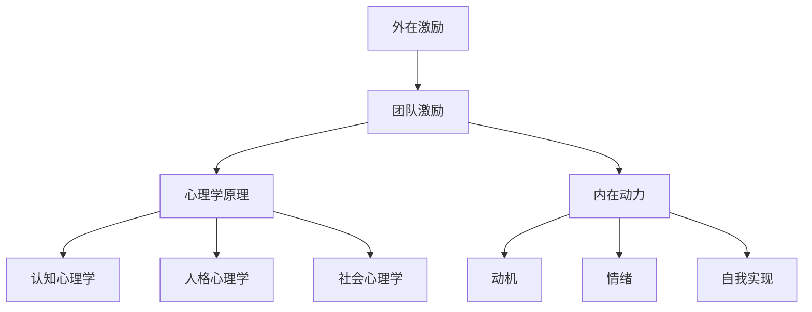

                 

### 团队激励的心理学：激发内在动力

#### 关键词：团队激励、心理学、内在动力、动机、情绪、领导力

#### 摘要：
本文旨在探讨团队激励中的心理学原理，特别是在激发团队成员内在动力方面。通过分析心理学基础理论、动机心理学、情绪心理学等核心概念，本文将探讨如何运用心理学原理来提高团队效率和创造力。此外，文章将通过案例分析和最佳实践，为读者提供实用的团队激励策略和建议。

#### 目录大纲：

##### 第一部分：问题背景与核心概念

- **第1章：团队激励与心理学概述**
  - **1.1 问题背景**
    - **1.1.1 团队激励的重要性**
    - **1.1.2 心理学在团队激励中的应用**
    - **1.1.3 内在动力的作用**
  - **1.2 核心概念介绍**
    - **1.2.1 团队激励的定义与特点**
    - **1.2.2 心理学的定义与分类**
    - **1.2.3 内在动力与外在激励的比较**
  - **1.3 概念关系图**

##### 第二部分：心理学原理在团队激励中的应用

- **第2章：心理学基础理论**
  - **2.1 认知心理学**
    - **2.1.1 认知心理学的定义**
    - **2.1.2 认知过程与团队激励**
    - **2.1.3 案例分析**
  - **2.2 人格心理学**
    - **2.2.1 人格心理学的定义**
    - **2.2.2 人格特质与团队激励**
    - **2.2.3 案例分析**
  - **2.3 社会心理学**
    - **2.3.1 社会心理学的定义**
    - **2.3.2 群体动力与团队激励**
    - **2.3.3 案例分析**

- **第3章：动机心理学**
  - **3.1 动机心理学概述**
    - **3.1.1 动机的定义与分类**
    - **3.1.2 动机与团队激励**
    - **3.1.3 激发内在动力的方法**
  - **3.2 内在动机的理论**
    - **3.2.1 自主性、动机和内在动力**
    - **3.2.2 成就感和内在动机**
    - **3.2.3 案例分析**

- **第4章：情绪心理学**
  - **4.1 情绪心理学概述**
    - **4.1.1 情绪的定义与分类**
    - **4.1.2 情绪与团队激励**
    - **4.1.3 情绪调节策略**
  - **4.2 情绪管理**
    - **4.2.1 积极情绪的培养**
    - **4.2.2 消极情绪的调节**
    - **4.2.3 案例分析**

##### 第三部分：内在动力激发实践

- **第5章：团队建设与互动**
  - **5.1 团队建设的心理学原理**
    - **5.1.1 团队动力模型**
    - **5.1.2 团队角色与互动**
    - **5.1.3 团队冲突与解决**
  - **5.2 内在动力激发的团队互动策略**
    - **5.2.1 增强团队成员的归属感**
    - **5.2.2 培养团队成员的自主性**
    - **5.2.3 案例分析**

- **第6章：目标设置与反馈机制**
  - **6.1 目标设置理论**
    - **6.1.1 目标设置的定义与类型**
    - **6.1.2 目标设置与内在动力**
    - **6.1.3 案例分析**
  - **6.2 反馈机制**
    - **6.2.1 正面反馈与负面反馈**
    - **6.2.2 反馈策略与内在动力**
    - **6.2.3 案例分析**

- **第7章：领导力与内在动力**
  - **7.1 领导力的心理学原理**
    - **7.1.1 领导力的定义与类型**
    - **7.1.2 领导力与内在动力**
    - **7.1.3 领导力模型**
  - **7.2 领导者的内在动力激发策略**
    - **7.2.1 增强领导者的影响力**
    - **7.2.2 培养团队成员的自信心**
    - **7.2.3 案例分析**

##### 第四部分：案例分析与实践应用

- **第8章：案例分析**
  - **8.1 案例背景**
    - **8.1.1 企业简介**
    - **8.1.2 团队背景**
    - **8.1.3 团队问题分析**
  - **8.2 心理学原理应用**
    - **8.2.1 团队建设与互动策略**
    - **8.2.2 目标设置与反馈机制**
    - **8.2.3 领导力与内在动力**
  - **8.3 案例结果与分析**
    - **8.3.1 案例成果**
    - **8.3.2 案例总结与反思**

- **第9章：实践应用**
  - **9.1 内在动力激发实践策略**
    - **9.1.1 团队文化建设**
    - **9.1.2 目标导向与激励机制**
    - **9.1.3 情绪管理与团队氛围**

##### 第五部分：小结与拓展

- **第10章：小结与拓展**
  - **10.1 全书内容总结**
  - **10.2 拓展阅读建议**
  - **10.3 总结与展望**

---

### 第1章：团队激励与心理学概述

#### 1.1 问题背景

**1.1.1 团队激励的重要性**

在现代社会，团队合作已成为企业成功的关键因素之一。一个高效的团队不仅可以提高工作效率，还能激发成员的创造力和创新能力。然而，如何激励团队成员，使其发挥最大潜力，始终是一个亟待解决的问题。

- **工作效率与团队合作**：研究表明，团队合作可以提高工作效率，减少错误率，并提高解决问题的能力。例如，Google等高科技公司通过实施团队协作模式，极大地提升了项目的完成质量和速度。
- **成员潜力激发**：通过有效的团队激励，企业可以挖掘出成员的潜在能力，使其在工作中发挥更大的价值。这不仅有助于个人职业发展，还能为团队和组织带来持续的竞争优势。

**1.1.2 心理学在团队激励中的应用**

心理学作为研究人类行为和心理过程的学科，在团队激励中具有广泛的应用。心理学原理可以帮助企业了解团队成员的心理需求，制定更有效的激励策略。

- **需求层次理论**：马斯洛的需求层次理论指出，人类需求分为生理需求、安全需求、社交需求、尊重需求和自我实现需求。在团队激励中，了解成员的不同需求层次，有助于制定个性化的激励策略。
- **动机理论**：心理学中的动机理论探讨了人类行为的动力来源。通过了解成员的动机类型，企业可以设计出更有针对性的激励措施，激发团队成员的内在动力。

**1.1.3 内在动力的作用**

内在动力是指个体内部产生的动力，驱动个体主动参与活动、追求目标和实现价值。与外在激励（如薪酬、奖励等）不同，内在动力来源于个体内心的兴趣、热情和价值观。

- **内在动力与工作效率**：研究表明，拥有内在动力的人往往更投入工作，表现出更高的工作效率和质量。例如，当员工对自己的工作充满热情时，他们更愿意付出额外的努力，以实现个人和团队的目标。
- **内在动力与创造力**：内在动力有助于激发团队成员的创造力和创新能力。当个体处于高度自主和充满激情的环境中时，他们更容易产生新颖的想法和创新的解决方案。

#### 1.2 核心概念介绍

**1.2.1 团队激励的定义与特点**

团队激励是指通过一系列措施和策略，激发团队成员的工作热情、积极性和创造力，以提高团队整体绩效和实现组织目标的过程。团队激励具有以下特点：

- **针对性**：团队激励应根据团队成员的不同特点和需求，制定个性化的激励措施。
- **系统性**：团队激励需要从多个层面和角度出发，构建一个系统化的激励体系。
- **长期性**：团队激励并非一蹴而就，而是一个持续的过程，需要长期投入和关注。

**1.2.2 心理学的定义与分类**

心理学是研究人类行为和心理过程的科学。根据研究内容和对象，心理学可分为以下几类：

- **认知心理学**：研究人类思维、记忆、语言和问题解决等认知过程。
- **人格心理学**：研究个体心理特征的差异，如性格、价值观和动机等。
- **社会心理学**：研究个体在社会环境中的行为和心理过程，如群体动力、态度和情感等。

**1.2.3 内在动力与外在激励的比较**

内在动力和外在激励是两种不同的激励方式，它们各有优缺点，适用于不同的情境。

- **内在动力**：
  - 优点：长期稳定、自发性高、有助于激发创造力和创新能力。
  - 缺点：可能受到个体差异和外部环境的影响。
- **外在激励**：
  - 优点：直接、明确、易于量化，有助于提高工作效率和短期绩效。
  - 缺点：可能导致依赖性、影响个体自主性和创造力。

#### 1.3 概念关系图

为了更好地理解团队激励、心理学和内在动力之间的关系，我们可以绘制一个概念关系图：

#### 1.4 总结

在本章中，我们介绍了团队激励的重要性、心理学在团队激励中的应用以及内在动力与外在激励的比较。通过了解这些核心概念，我们将为后续章节的深入探讨奠定基础。

---

在接下来的章节中，我们将进一步探讨心理学的核心理论，如认知心理学、人格心理学和社会心理学，以及如何将这些理论应用于团队激励，以激发团队成员的内在动力。让我们继续深入思考，探索团队激励的心理学奥秘。

