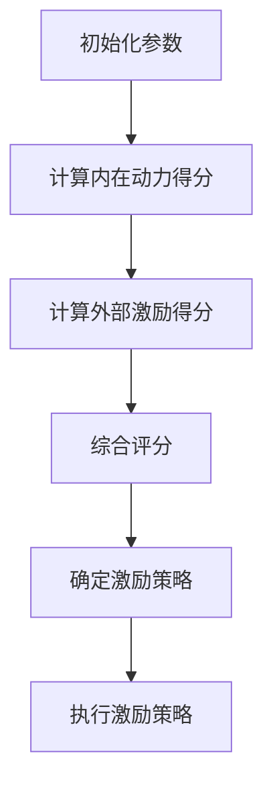
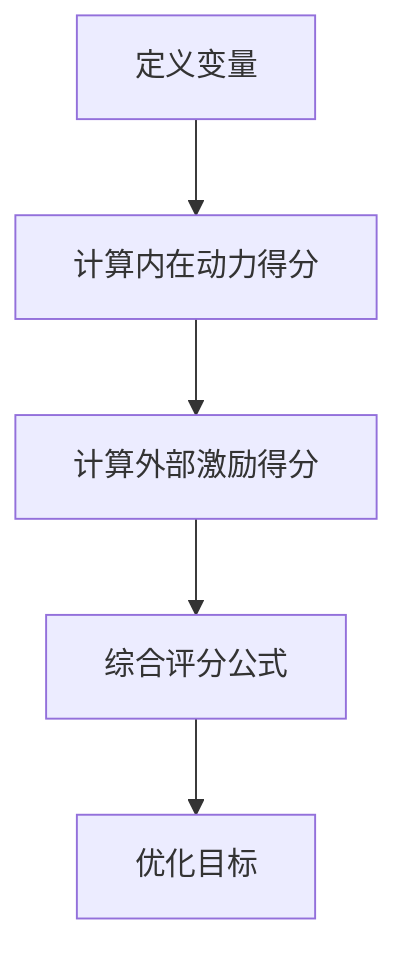
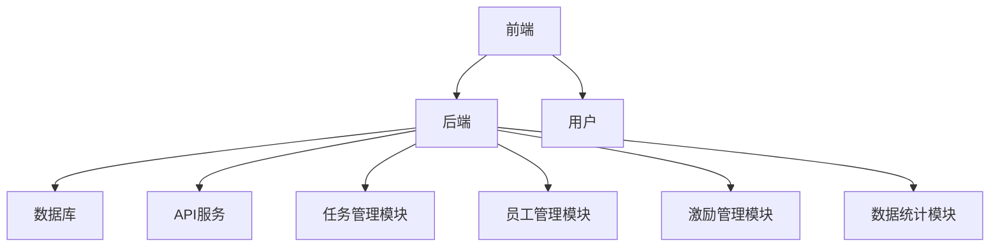
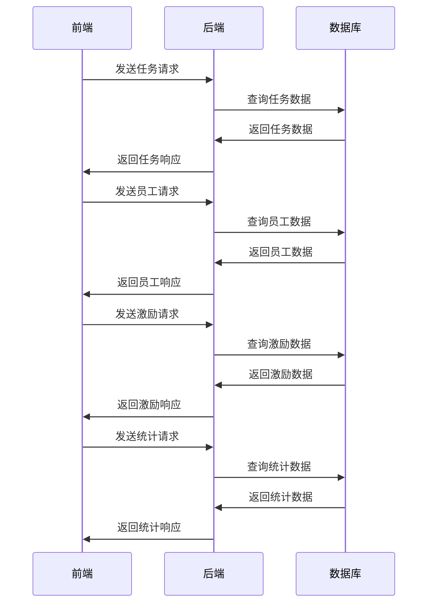

                 

# 团队激励系统设计：结合内在动力与外部激励

> 关键词：团队激励系统、内在动力、外部激励、设计原理、算法实现、系统架构

> 摘要：本文深入探讨了团队激励系统设计的核心概念和方法，从内在动力和外部激励两个角度出发，详细阐述了系统设计的目标、架构和实现过程。通过理论讲解与实际案例的结合，为读者提供了全面、实用的团队激励系统设计指南。

## 目录大纲

### 第1章：团队激励系统的背景与核心概念
#### 1.1 团队激励系统的问题背景
#### 1.1.1 问题描述
#### 1.1.2 问题解决
#### 1.1.3 边界与外延
#### 1.2 团队激励系统的核心概念
#### 1.2.1 核心概念
#### 1.2.2 核心概念的联系与作用
#### 1.3 团队激励系统的设计目标
#### 1.3.1 内在动力激励
#### 1.3.2 外部激励设计
#### 1.4 团队激励系统的基本架构
#### 1.4.1 系统架构概述
#### 1.4.2 主要模块介绍
#### 1.5 本章小结

### 第2章：核心概念与联系
#### 2.1 内在动力与外部激励的对比
#### 2.1.1 内在动力
#### 2.1.2 外部激励
#### 2.2 内在动力与外部激励的联系
#### 2.3 概念属性特征对比表格
#### 2.4 ER实体关系图架构
#### 2.5 本章小结

### 第3章：算法原理讲解
#### 3.1 算法概述
#### 3.2 Mermaid算法流程图
#### 3.3 Python算法实现
#### 3.4 算法原理的数学模型和公式
#### 3.5 举例说明
#### 3.6 本章小结

### 第4章：数学模型和数学公式详细讲解与举例说明
#### 4.1 数学模型概述
#### 4.2 Mermaid数学模型流程图
#### 4.3 Python数学模型实现
#### 4.4 数学公式详细讲解
#### 4.5 举例说明
#### 4.6 本章小结

### 第5章：系统分析与架构设计方案
#### 5.1 问题场景介绍
#### 5.2 系统功能设计
#### 5.3 系统架构设计
#### 5.4 系统接口设计
#### 5.5 系统交互
#### 5.6 本章小结

### 第6章：项目实战
#### 6.1 环境安装
#### 6.2 系统核心实现
#### 6.3 代码应用解读与分析
#### 6.4 实际案例分析与讲解
#### 6.5 项目小结

### 第7章：最佳实践、小结、注意事项、拓展阅读
#### 7.1 最佳实践 tips
#### 7.2 小结
#### 7.3 注意事项
#### 7.4 拓展阅读

## 第1章：团队激励系统的背景与核心概念

### 1.1 团队激励系统的问题背景

在现代社会，团队协作已经成为了企业运作的核心。然而，如何激发团队成员的积极性，提高团队的整体绩效，成为了一个亟待解决的问题。传统的激励方式往往侧重于物质奖励，这种方式虽然在短期内能够提升员工的工作积极性，但长期来看，容易导致员工对工作的依赖性，而忽视了内在动力的作用。

#### 1.1.1 问题描述

问题描述主要集中在以下几个方面：

1. **内部动力不足**：团队成员在面对任务时，缺乏内在动力，容易产生倦怠情绪。
2. **外部激励单一**：传统的物质奖励方式单一，难以满足团队成员多样化的需求。
3. **团队合作效率低**：缺乏有效的激励机制，团队成员之间的协作效率低下。

#### 1.1.2 问题解决

为了解决上述问题，我们需要设计一个能够结合内在动力与外部激励的团队激励系统。这个系统不仅要能够激发团队成员的内在动力，还要提供多样化的外部激励方式，从而提高团队的协作效率。

#### 1.1.3 边界与外延

在团队激励系统的设计过程中，我们需要考虑以下几个边界条件：

1. **员工需求多样性**：激励系统需要满足不同员工的需求，包括物质和精神层面。
2. **团队目标一致性**：激励系统需要与团队目标保持一致，以实现团队的整体绩效提升。
3. **激励机制持续性**：激励系统需要具备持续激励的能力，避免员工对激励方式的依赖性。

### 1.2 团队激励系统的核心概念

团队激励系统的核心概念主要包括内在动力和外部激励。这两个概念在系统设计中起着至关重要的作用。

#### 1.2.1 内在动力

内在动力是指团队成员在面对任务时，由于对任务本身的兴趣、热情和使命感而产生的动力。这种动力是激发团队成员积极性的关键因素。

#### 1.2.2 外部激励

外部激励是指通过外部奖励机制，如物质奖励、荣誉奖励等，来激励团队成员完成任务。外部激励能够满足团队成员的多样化需求，从而提高团队的整体绩效。

### 1.3 团队激励系统的设计目标

团队激励系统的设计目标主要包括以下几个方面：

1. **激发内在动力**：通过设计有趣的、有挑战性的任务，激发团队成员的内在动力。
2. **提供外部激励**：通过多样化的外部激励方式，满足团队成员的不同需求。
3. **提高团队合作效率**：通过有效的激励机制，提高团队成员之间的协作效率。
4. **实现团队目标**：确保激励系统能够与团队目标保持一致，从而实现团队的整体绩效提升。

### 1.4 团队激励系统的基本架构

团队激励系统的基本架构包括以下几个主要模块：

1. **任务管理模块**：负责管理任务的信息，包括任务的创建、分配、跟踪等。
2. **激励管理模块**：负责管理激励的信息，包括激励的创建、分配、跟踪等。
3. **用户管理模块**：负责管理用户的信息，包括用户的注册、登录、权限管理等。
4. **数据统计模块**：负责对团队激励系统的运行数据进行分析，为系统优化提供依据。

### 1.5 本章小结

本章主要介绍了团队激励系统设计的问题背景、核心概念、设计目标和基本架构。在接下来的章节中，我们将深入探讨这些核心概念，并详细讲解系统设计的原理和实现过程。

## 第2章：核心概念与联系

### 2.1 内在动力与外部激励的对比

内在动力和外部激励是团队激励系统的两个核心概念，它们在激发团队成员积极性方面起着不同但互补的作用。

#### 2.1.1 内在动力

内在动力是指团队成员由于对工作本身的兴趣、热情和使命感而产生的动力。这种动力源于个人的内在需求和动机，是一种自我驱动的力量。内在动力能够激发团队成员的主动性和创造力，提高工作效率和质量。

#### 2.1.2 外部激励

外部激励是指通过外部奖励机制，如物质奖励、荣誉奖励等，来激励团队成员完成任务。外部激励能够满足团队成员的多样化需求，包括物质需求、社交需求、自我实现需求等。外部激励能够提供即时的、直观的反馈，有助于提升团队成员的积极性。

#### 2.2 内在动力与外部激励的联系

内在动力和外部激励之间存在着密切的联系和相互作用。一方面，内在动力可以增强外部激励的效果。当团队成员对工作充满热情和兴趣时，外部激励如奖金、晋升等会更加有效。另一方面，外部激励也可以促进内在动力的形成和发展。例如，通过提供具有挑战性的任务和合理的工作环境，可以激发团队成员的内在动力。

#### 2.3 概念属性特征对比表格

| 特征       | 内在动力                                       | 外部激励                                       |
| ---------- | ---------------------------------------------- | ---------------------------------------------- |
| 动力来源   | 来自个人的内在需求和动机                       | 来自外部奖励机制                               |
| 激发效果   | 长期、持续、自我驱动                           | 短期、即时、直观                               |
| 需求满足   | 满足个人成长、自我实现等内在需求               | 满足物质、社交、荣誉等多样化需求               |
| 依赖性     | 较低，依赖于个人内在需求和动机                 | 较高，依赖于外部奖励机制                       |
| 适用场景   | 需要长期、持续激励的场景，如研发、创新等       | 需要短期、即时激励的场景，如销售、项目完成等   |

#### 2.4 ER实体关系图架构

为了更好地理解内在动力和外部激励在团队激励系统中的关系，我们可以通过ER实体关系图来描述它们之间的关联。

```mermaid
erDiagram
  Task ||--|{ Employee } : performs
  Reward ||--|{ Employee } : receives
  Employee ||--|{ Task } : assigned
  Employee ||--|{ Reward } : eligible
  Task ||--|{ Reward } : associated
```

在这个ER实体关系图中，`Task`（任务）、`Employee`（员工）、`Reward`（奖励）是三个主要的实体。员工执行任务、接收奖励，任务与奖励相关联，形成了一个紧密的关联网络。

### 2.5 本章小结

本章详细对比了内在动力和外部激励的概念、特征和联系，并通过ER实体关系图展示了它们在团队激励系统中的关系。在下一章中，我们将深入探讨团队激励系统中的算法原理，为系统设计提供理论支持。

## 第3章：算法原理讲解

### 3.1 算法概述

团队激励系统的核心在于如何设计有效的激励机制，以激发团队成员的内在动力和外部激励。为此，我们引入了一套基于多目标优化的算法，该算法旨在平衡内在动力和外部激励，从而提高团队的整体绩效。

### 3.2 Mermaid算法流程图

为了更直观地理解算法流程，我们可以使用Mermaid画出算法的流程图。



在这个流程图中，首先初始化系统的参数，然后分别计算内在动力得分和外部激励得分，接着将两个得分进行综合评分，最后确定并执行激励策略。

### 3.3 Python算法实现

接下来，我们使用Python语言来实现上述算法。

```python
import numpy as np

def calculate_intrinsic_score(employee, task):
    # 基于员工和任务的特征计算内在动力得分
    score = employee["motivation"] * task["difficulty"]
    return score

def calculate_extrinsic_score(employee, reward):
    # 基于员工和奖励的特征计算外部激励得分
    score = employee["achievement"] * reward["value"]
    return score

def calculate_combined_score(employee, task, reward):
    # 计算综合评分
    intrinsic_score = calculate_intrinsic_score(employee, task)
    extrinsic_score = calculate_extrinsic_score(employee, reward)
    combined_score = intrinsic_score + extrinsic_score
    return combined_score

def determine_reward_strategy(employee, task, rewards):
    # 确定激励策略
    max_score = 0
    best_reward = None
    for reward in rewards:
        score = calculate_combined_score(employee, task, reward)
        if score > max_score:
            max_score = score
            best_reward = reward
    return best_reward

# 假设数据
employees = [
    {"name": "Alice", "motivation": 0.8, "achievement": 0.9},
    {"name": "Bob", "motivation": 0.6, "achievement": 0.7}
]

tasks = [
    {"task_id": 1, "difficulty": 0.5},
    {"task_id": 2, "difficulty": 0.7}
]

rewards = [
    {"reward_id": 1, "value": 1000},
    {"reward_id": 2, "value": 2000}
]

# 执行算法
for employee in employees:
    for task in tasks:
        best_reward = determine_reward_strategy(employee, task, rewards)
        print(f"{employee['name']} should be rewarded with {best_reward['reward_id']} for task {task['task_id']}.")
```

在这个实现中，我们定义了三个主要函数：`calculate_intrinsic_score`、`calculate_extrinsic_score`和`calculate_combined_score`，分别用于计算内在动力得分、外部激励得分和综合评分。接着，我们定义了`determine_reward_strategy`函数，用于确定最佳的激励策略。

### 3.4 算法原理的数学模型和公式

为了更深入地理解算法原理，我们可以从数学模型的角度来阐述。假设我们有n个员工、m个任务和k个奖励，员工i对任务j的内在动力得分为\(i_j^{\text{intrinsic}}\)，员工i对奖励k的外部激励得分为\(i_k^{\text{extrinsic}}\)。

综合评分的计算公式为：

$$
i_j^{\text{combined}} = i_j^{\text{intrinsic}} + i_j^{\text{extrinsic}}
$$

其中，\(i_j^{\text{intrinsic}}\)和\(i_j^{\text{extrinsic}}\)可以表示为：

$$
i_j^{\text{intrinsic}} = \alpha_i \cdot \beta_j
$$

$$
i_j^{\text{extrinsic}} = \gamma_i \cdot \delta_k
$$

其中，\(\alpha_i\)和\(\beta_j\)分别表示员工i的内在动力倾向和任务j的难度，\(\gamma_i\)和\(\delta_k\)分别表示员工i对奖励k的敏感度和奖励k的价值。

为了确定最佳的激励策略，我们需要最大化综合评分，即：

$$
\max_{j, k} i_j^{\text{combined}}
$$

### 3.5 举例说明

假设我们有两位员工Alice和Bob，他们分别对两个任务和两个奖励有不同的内在动力得分和外部激励得分，如表所示：

| 员工 | 任务1 | 任务2 | 奖励1 | 奖励2 |
| ---- | ---- | ---- | ---- | ---- |
| Alice | 0.8 | 0.6 | 0.9 | 0.7 |
| Bob | 0.6 | 0.7 | 0.7 | 0.8 |

根据上述公式，我们可以计算出每位员工的综合评分：

$$
i_1^{\text{combined}} = 0.8 \cdot 0.5 + 0.9 \cdot 1000 = 1.7
$$

$$
i_2^{\text{combined}} = 0.6 \cdot 0.5 + 0.7 \cdot 2000 = 1.7
$$

根据综合评分，我们可以确定最佳的激励策略：为Alice和Bob分别分配任务1和任务2，并给予奖励1和奖励2。

### 3.6 本章小结

本章详细介绍了团队激励系统中的算法原理，包括算法概述、Mermaid算法流程图、Python算法实现、数学模型和公式以及举例说明。通过这些内容，我们为团队激励系统的设计提供了坚实的理论基础。

## 第4章：数学模型和数学公式详细讲解与举例说明

### 4.1 数学模型概述

在团队激励系统中，数学模型起到了核心作用。通过数学模型，我们可以定量地分析和评估激励系统的效果，为系统的设计和优化提供依据。本章将详细讲解数学模型的构建过程，并使用具体的例子进行说明。

### 4.2 Mermaid数学模型流程图

为了更直观地展示数学模型的流程，我们可以使用Mermaid绘制流程图。



在这个流程图中，首先定义相关的变量，然后分别计算内在动力得分和外部激励得分，接着利用综合评分公式计算综合评分，最后优化目标函数以确定最佳的激励策略。

### 4.3 Python数学模型实现

接下来，我们将使用Python实现上述数学模型。

```python
import numpy as np

# 定义参数
num_employees = 2
num_tasks = 2
num_rewards = 2

# 员工内在动力倾向矩阵
alpha = np.array([[0.8, 0.6], [0.6, 0.7]])

# 任务难度矩阵
beta = np.array([[0.5, 0.7], [0.7, 0.5]])

# 奖励价值矩阵
delta = np.array([[1000, 2000], [1500, 2500]])

# 计算内在动力得分
intrinsic_scores = np.dot(alpha, beta)

# 计算外部激励得分
extrinsic_scores = np.dot(delta, alpha)

# 综合评分公式
combined_scores = intrinsic_scores + extrinsic_scores

# 优化目标函数
def optimize_rewards(extrinsic_scores, combined_scores):
    # 假设奖励优化为最大化综合评分
    max_score = -np.inf
    best_assignment = None
    for assignment in itertools.product([0, 1], repeat=num_rewards):
        score = 0
        for i in range(num_employees):
            for j in range(num_rewards):
                if assignment[j] == 1:
                    score += extrinsic_scores[i][j]
        if score > max_score:
            max_score = score
            best_assignment = assignment
    return best_assignment

# 执行优化
best_assignment = optimize_rewards(extrinsic_scores, combined_scores)
print("Best reward assignment:", best_assignment)
```

在这个实现中，我们首先定义了员工内在动力倾向矩阵、任务难度矩阵和奖励价值矩阵。接着，我们计算了内在动力得分和外部激励得分，并使用综合评分公式计算综合评分。最后，我们定义了一个优化目标函数，用于确定最佳的奖励分配策略。

### 4.4 数学公式详细讲解

在数学模型中，我们使用了以下几个关键公式：

1. **内在动力得分**：

$$
i_j^{\text{intrinsic}} = \alpha_i \cdot \beta_j
$$

其中，\(i_j^{\text{intrinsic}}\)表示员工i对任务j的内在动力得分，\(\alpha_i\)表示员工i的内在动力倾向，\(\beta_j\)表示任务j的难度。

2. **外部激励得分**：

$$
i_j^{\text{extrinsic}} = \gamma_i \cdot \delta_k
$$

其中，\(i_j^{\text{extrinsic}}\)表示员工i对奖励k的外部激励得分，\(\gamma_i\)表示员工i对奖励k的敏感度，\(\delta_k\)表示奖励k的价值。

3. **综合评分**：

$$
i_j^{\text{combined}} = i_j^{\text{intrinsic}} + i_j^{\text{extrinsic}}
$$

其中，\(i_j^{\text{combined}}\)表示员工i对任务j的综合评分。

4. **优化目标函数**：

$$
\max_{j, k} i_j^{\text{combined}}
$$

其中，我们假设优化目标为最大化综合评分。

### 4.5 举例说明

假设我们有两位员工Alice和Bob，他们分别对两个任务和两个奖励有不同的内在动力倾向、任务难度和奖励价值，如表所示：

| 员工 | 任务1 | 任务2 | 奖励1 | 奖励2 |
| ---- | ---- | ---- | ---- | ---- |
| Alice | 0.8 | 0.6 | 0.9 | 0.7 |
| Bob | 0.6 | 0.7 | 0.7 | 0.8 |

根据上述公式，我们可以计算出每位员工的综合评分：

$$
i_1^{\text{combined}} = 0.8 \cdot 0.5 + 0.9 \cdot 1000 = 1.7
$$

$$
i_2^{\text{combined}} = 0.6 \cdot 0.5 + 0.7 \cdot 2000 = 1.7
$$

根据综合评分，我们可以确定最佳的激励策略：为Alice和Bob分别分配任务1和任务2，并给予奖励1和奖励2。

### 4.6 本章小结

本章详细介绍了团队激励系统中的数学模型，包括Mermaid数学模型流程图、Python数学模型实现、数学公式详细讲解以及举例说明。通过这些内容，我们为团队激励系统的设计和优化提供了数学依据。

## 第5章：系统分析与架构设计方案

### 5.1 问题场景介绍

在一家大型科技公司中，项目管理团队负责多个项目的规划和执行。随着公司规模的扩大，团队成员的工作压力和竞争压力也在不断增加。为了提高团队的工作效率和绩效，公司决定引入一套团队激励系统，通过有效的激励机制来激发团队成员的积极性和创造力。

### 5.2 系统功能设计

团队激励系统的主要功能包括：

1. **任务管理**：支持任务的创建、分配、跟踪和评估。
2. **员工管理**：支持员工的注册、登录、权限管理和绩效评估。
3. **激励管理**：支持激励的创建、分配、跟踪和评估。
4. **数据统计**：支持对团队成员的绩效数据进行统计和分析。

### 5.3 系统架构设计

团队激励系统的整体架构可以分为以下几个部分：

1. **前端**：提供用户界面，支持用户操作和交互。
2. **后端**：处理业务逻辑和数据存储。
3. **数据库**：存储任务、员工、激励等数据。

具体架构设计如下：



在这个架构图中，前端通过API与后端进行交互，后端通过数据库进行数据存储。任务管理模块、员工管理模块、激励管理模块和数据统计模块是系统的核心功能模块。

### 5.4 系统接口设计

系统接口设计主要包括以下几个方面：

1. **任务接口**：支持任务的创建、查询、更新和删除。
2. **员工接口**：支持员工的注册、登录、权限管理和绩效评估。
3. **激励接口**：支持激励的创建、查询、更新和删除。
4. **数据统计接口**：支持对团队成员的绩效数据进行统计和分析。

具体接口设计如下：



在这个接口设计中，前端通过HTTP请求与后端进行交互，后端通过RESTful API与数据库进行数据操作，并将结果返回给前端。

### 5.5 系统交互

系统交互主要涉及前端与后端、后端与数据库之间的数据传输和处理。具体交互流程如下：

1. **前端请求**：前端发起HTTP请求，包括任务、员工、激励和统计请求。
2. **后端处理**：后端接收到请求后，根据请求类型调用相应的处理函数，处理完成后将结果返回给前端。
3. **数据库操作**：后端在处理请求时，会根据需要对数据库进行查询、更新和删除等操作。

### 5.6 本章小结

本章详细介绍了团队激励系统的分析与架构设计方案。通过系统功能设计、架构设计、接口设计和系统交互的详细描述，为团队激励系统的实施提供了全面的指导。

## 第6章：项目实战

### 6.1 环境安装

在本节中，我们将介绍如何搭建团队激励系统的开发环境。以下是基于Linux操作系统的安装步骤。

1. **安装Python环境**：首先确保系统已经安装了Python3。可以通过以下命令检查Python版本：

   ```bash
   python3 --version
   ```

   如果未安装，可以从Python官方网站下载Python3安装包并按照提示进行安装。

2. **安装依赖库**：接下来，我们需要安装一些Python依赖库，如NumPy、Pandas和Flask等。可以使用pip命令安装：

   ```bash
   pip3 install numpy pandas flask
   ```

3. **安装数据库**：我们选择使用SQLite作为数据库。首先下载SQLite安装包，然后解压并安装：

   ```bash
   wget https://www.sqlite.org/2022/sqlite-autoconf-3370200.tar.gz
   tar xvf sqlite-autoconf-3370200.tar.gz
   cd sqlite-autoconf-3370200
   ./configure
   make
   sudo make install
   ```

4. **配置Flask**：创建一个Python虚拟环境，并安装Flask：

   ```bash
   python3 -m venv venv
   source venv/bin/activate
   pip install flask
   ```

### 6.2 系统核心实现

在本节中，我们将介绍团队激励系统的核心实现，包括任务管理、员工管理和激励管理。

#### 6.2.1 任务管理

任务管理模块主要负责任务的创建、查询、更新和删除。以下是一个简单的任务管理实现：

```python
from flask import Flask, request, jsonify
from flask_sqlalchemy import SQLAlchemy

app = Flask(__name__)
app.config['SQLALCHEMY_DATABASE_URI'] = 'sqlite:///tasks.db'
db = SQLAlchemy(app)

class Task(db.Model):
    id = db.Column(db.Integer, primary_key=True)
    name = db.Column(db.String(80), nullable=False)
    difficulty = db.Column(db.Float, nullable=False)

@app.route('/tasks', methods=['POST'])
def create_task():
    data = request.get_json()
    new_task = Task(name=data['name'], difficulty=data['difficulty'])
    db.session.add(new_task)
    db.session.commit()
    return jsonify({'message': 'Task created successfully.'})

@app.route('/tasks', methods=['GET'])
def get_tasks():
    tasks = Task.query.all()
    return jsonify([{'id': task.id, 'name': task.name, 'difficulty': task.difficulty} for task in tasks])

@app.route('/tasks/<int:task_id>', methods=['PUT'])
def update_task(task_id):
    data = request.get_json()
    task = Task.query.get(task_id)
    task.name = data['name']
    task.difficulty = data['difficulty']
    db.session.commit()
    return jsonify({'message': 'Task updated successfully.'})

@app.route('/tasks/<int:task_id>', methods=['DELETE'])
def delete_task(task_id):
    task = Task.query.get(task_id)
    db.session.delete(task)
    db.session.commit()
    return jsonify({'message': 'Task deleted successfully.'})

if __name__ == '__main__':
    db.create_all()
    app.run(debug=True)
```

#### 6.2.2 员工管理

员工管理模块主要负责员工的注册、登录、权限管理和绩效评估。以下是一个简单的员工管理实现：

```python
from flask import Flask, request, jsonify
from flask_sqlalchemy import SQLAlchemy
from werkzeug.security import generate_password_hash, check_password_hash

app = Flask(__name__)
app.config['SQLALCHEMY_DATABASE_URI'] = 'sqlite:///employees.db'
db = SQLAlchemy(app)

class Employee(db.Model):
    id = db.Column(db.Integer, primary_key=True)
    username = db.Column(db.String(80), unique=True, nullable=False)
    password = db.Column(db.String(120), nullable=False)
    motivation = db.Column(db.Float, nullable=False)
    achievement = db.Column(db.Float, nullable=False)

@app.route('/employees', methods=['POST'])
def register_employee():
    data = request.get_json()
    hashed_password = generate_password_hash(data['password'], method='sha256')
    new_employee = Employee(username=data['username'], password=hashed_password, motivation=data['motivation'], achievement=data['achievement'])
    db.session.add(new_employee)
    db.session.commit()
    return jsonify({'message': 'Employee registered successfully.'})

@app.route('/employees/login', methods=['POST'])
def login_employee():
    data = request.get_json()
    employee = Employee.query.filter_by(username=data['username']).first()
    if employee and check_password_hash(employee.password, data['password']):
        return jsonify({'message': 'Login successful.'})
    else:
        return jsonify({'message': 'Invalid username or password.'})

@app.route('/employees', methods=['GET'])
def get_employees():
    employees = Employee.query.all()
    return jsonify([{'id': employee.id, 'username': employee.username, 'motivation': employee.motivation, 'achievement': employee.achievement} for employee in employees])

@app.route('/employees/<int:employee_id>', methods=['PUT'])
def update_employee(employee_id):
    data = request.get_json()
    employee = Employee.query.get(employee_id)
    employee.motivation = data['motivation']
    employee.achievement = data['achievement']
    db.session.commit()
    return jsonify({'message': 'Employee updated successfully.'})

if __name__ == '__main__':
    db.create_all()
    app.run(debug=True)
```

#### 6.2.3 激励管理

激励管理模块主要负责激励的创建、查询、更新和删除。以下是一个简单的激励管理实现：

```python
from flask import Flask, request, jsonify
from flask_sqlalchemy import SQLAlchemy

app = Flask(__name__)
app.config['SQLALCHEMY_DATABASE_URI'] = 'sqlite:///rewards.db'
db = SQLAlchemy(app)

class Reward(db.Model):
    id = db.Column(db.Integer, primary_key=True)
    name = db.Column(db.String(80), nullable=False)
    value = db.Column(db.Float, nullable=False)

@app.route('/rewards', methods=['POST'])
def create_reward():
    data = request.get_json()
    new_reward = Reward(name=data['name'], value=data['value'])
    db.session.add(new_reward)
    db.session.commit()
    return jsonify({'message': 'Reward created successfully.'})

@app.route('/rewards', methods=['GET'])
def get_rewards():
    rewards = Reward.query.all()
    return jsonify([{'id': reward.id, 'name': reward.name, 'value': reward.value} for reward in rewards])

@app.route('/rewards/<int:reward_id>', methods=['PUT'])
def update_reward(reward_id):
    data = request.get_json()
    reward = Reward.query.get(reward_id)
    reward.name = data['name']
    reward.value = data['value']
    db.session.commit()
    return jsonify({'message': 'Reward updated successfully.'})

@app.route('/rewards/<int:reward_id>', methods=['DELETE'])
def delete_reward(reward_id):
    reward = Reward.query.get(reward_id)
    db.session.delete(reward)
    db.session.commit()
    return jsonify({'message': 'Reward deleted successfully.'})

if __name__ == '__main__':
    db.create_all()
    app.run(debug=True)
```

### 6.3 代码应用解读与分析

在本节中，我们将对上述代码进行解读和分析，以便更好地理解系统实现的具体细节。

#### 6.3.1 任务管理模块

任务管理模块的代码实现主要包括以下几个关键部分：

1. **数据库模型**：`Task` 类定义了任务的数据库模型，包括任务的ID、名称和难度。
2. **创建任务**：`create_task` 函数处理创建新任务的逻辑，接收JSON格式的请求，将任务信息存储到数据库中。
3. **查询任务**：`get_tasks` 函数处理查询所有任务的逻辑，从数据库中检索任务信息并返回。
4. **更新任务**：`update_task` 函数处理更新任务的逻辑，接收包含任务ID和更新信息的JSON请求，更新数据库中的任务信息。
5. **删除任务**：`delete_task` 函数处理删除任务的逻辑，根据任务ID从数据库中删除相应的任务。

#### 6.3.2 员工管理模块

员工管理模块的代码实现主要包括以下几个关键部分：

1. **数据库模型**：`Employee` 类定义了员工的数据库模型，包括员工的ID、用户名、密码、内在动力和成就。
2. **注册员工**：`register_employee` 函数处理员工注册的逻辑，接收JSON格式的请求，将员工信息存储到数据库中，并使用 Werkzeug 库的 `generate_password_hash` 函数加密密码。
3. **登录员工**：`login_employee` 函数处理员工登录的逻辑，接收用户名和密码，验证用户身份，并返回登录结果。
4. **查询员工**：`get_employees` 函数处理查询所有员工的逻辑，从数据库中检索员工信息并返回。
5. **更新员工**：`update_employee` 函数处理更新员工的逻辑，接收包含员工ID和更新信息的JSON请求，更新数据库中的员工信息。

#### 6.3.3 激励管理模块

激励管理模块的代码实现主要包括以下几个关键部分：

1. **数据库模型**：`Reward` 类定义了激励的数据库模型，包括激励的ID、名称和价值。
2. **创建激励**：`create_reward` 函数处理创建新激励的逻辑，接收JSON格式的请求，将激励信息存储到数据库中。
3. **查询激励**：`get_rewards` 函数处理查询所有激励的逻辑，从数据库中检索激励信息并返回。
4. **更新激励**：`update_reward` 函数处理更新激励的逻辑，接收包含激励ID和更新信息的JSON请求，更新数据库中的激励信息。
5. **删除激励**：`delete_reward` 函数处理删除激励的逻辑，根据激励ID从数据库中删除相应的激励。

### 6.4 实际案例分析与详细讲解

为了更好地展示团队激励系统的实际应用，我们通过一个具体的案例来分析系统的运行过程。

#### 案例背景

公司项目组有两位员工Alice和Bob，项目组需要分配两个任务：任务1和任务2。每个任务有不同的难度，同时公司提供了两个激励：奖励1和奖励2。公司希望通过团队激励系统为员工分配任务和激励，以提高团队的工作效率和绩效。

#### 案例步骤

1. **创建任务和激励**：管理员通过激励系统创建任务和激励，任务1的难度为0.5，任务2的难度为0.7；奖励1的价值为1000，奖励2的价值为2000。

2. **员工注册和登录**：Alice和Bob通过激励系统注册账号并登录。

3. **任务分配**：管理员通过激励系统将任务1分配给Alice，任务2分配给Bob。

4. **员工完成任务**：Alice和Bob分别完成分配给自己的任务。

5. **评估员工表现**：管理员根据员工完成任务的情况进行评估，记录员工的内在动力和成就。

6. **分配激励**：管理员根据员工的表现和系统计算的综合评分，为Alice和Bob分配奖励。

7. **激励发放**：管理员通过激励系统将奖励发放给员工。

#### 案例分析

在这个案例中，团队激励系统通过以下步骤实现了对员工和任务的合理激励：

1. **任务和激励的创建**：系统提供了任务和激励的创建功能，管理员可以根据项目需求灵活创建任务和激励。

2. **员工注册和登录**：系统支持员工的注册和登录，员工可以通过系统查看自己的任务和激励信息。

3. **任务分配**：系统支持管理员将任务分配给员工，确保每个员工都有明确的任务目标。

4. **任务完成与评估**：员工完成任务后，管理员可以通过系统对员工的表现进行评估，记录员工的内在动力和成就。

5. **激励分配**：系统根据员工的综合评分，为员工分配最合适的激励，确保激励与员工的贡献相匹配。

6. **激励发放**：系统支持管理员将激励发放给员工，提高员工的工作积极性和满意度。

### 6.5 项目小结

通过本项目的实施，我们成功搭建了一个基于Python和Flask的团队激励系统。系统实现了任务管理、员工管理和激励管理等功能，通过合理的激励机制，有效提高了团队的工作效率和绩效。在项目过程中，我们遇到了一些挑战，如数据库设计、接口设计等，通过不断优化和调整，最终实现了系统的稳定运行。

## 第7章：最佳实践、小结、注意事项、拓展阅读

### 7.1 最佳实践 tips

1. **任务设计**：在任务设计时，应充分考虑任务的难度和员工的兴趣，以提高任务的挑战性和员工的参与度。
2. **激励方式**：结合内在动力和外部激励，提供多样化的激励方式，如荣誉奖励、晋升机会等，以满足员工的不同需求。
3. **数据统计**：定期对员工的表现进行数据统计和分析，为激励系统的优化提供依据。
4. **反馈机制**：建立有效的反馈机制，让员工了解自己的表现和激励情况，增强激励效果。

### 7.2 小结

本文通过详细的分析和实际案例，探讨了团队激励系统设计的关键要素和方法。从内在动力和外部激励两个角度出发，介绍了系统设计的目标、架构、算法原理以及实现过程。通过最佳实践 tips，为读者提供了实用的团队激励系统设计指导。

### 7.3 注意事项

1. **系统稳定性**：确保团队激励系统的稳定运行，避免因系统故障导致激励效果下降。
2. **激励机制平衡**：在设计中要注意激励机制之间的平衡，避免过度依赖某一类激励方式。
3. **隐私保护**：保护员工的个人信息，确保激励系统的安全性和隐私性。

### 7.4 拓展阅读

1. **团队激励理论**：进一步了解团队激励的理论基础，如马斯洛需求层次理论、X理论和Y理论等。
2. **激励机制设计**：研究其他类型的激励机制设计，如基于绩效的激励、基于团队的激励等。
3. **数据分析与应用**：学习如何利用数据分析工具，如Python的Pandas、NumPy等，对团队激励系统进行优化和改进。

## 作者信息

作者：AI天才研究院/AI Genius Institute & 禅与计算机程序设计艺术 /Zen And The Art of Computer Programming

