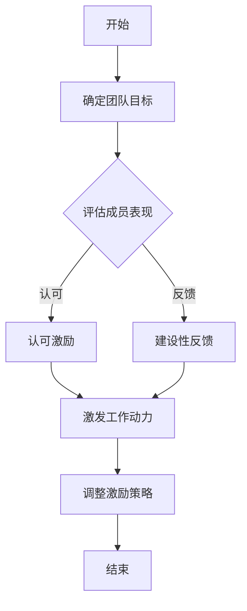
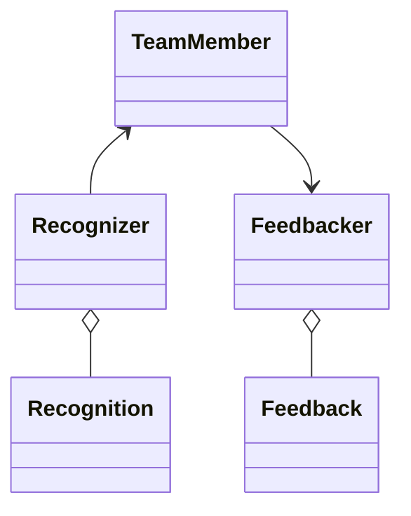
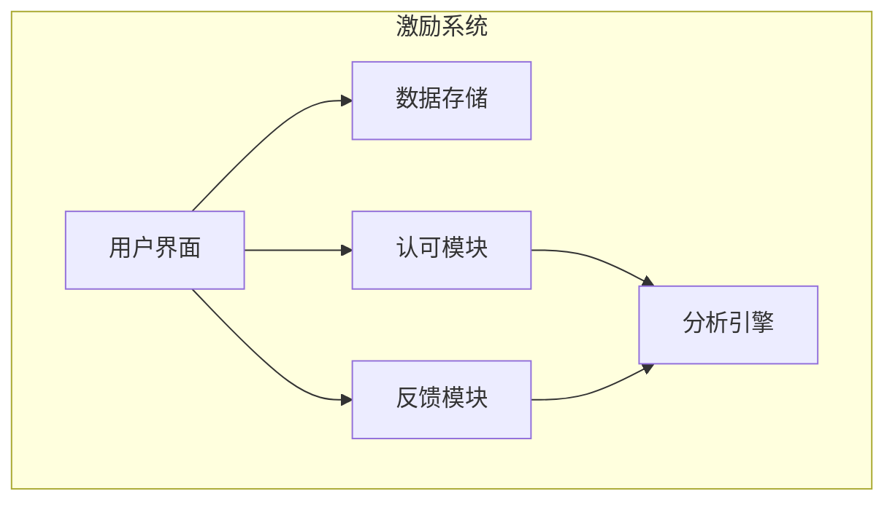
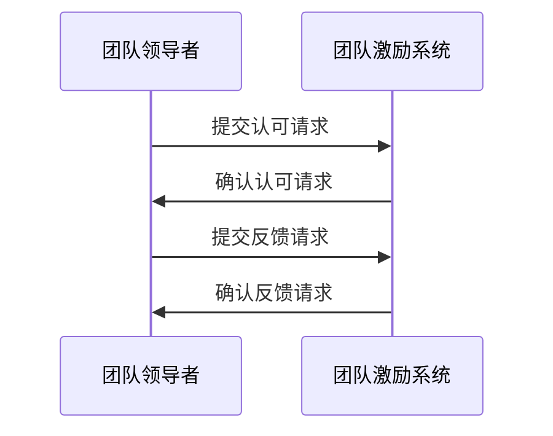

                 


### 文章标题：团队激励艺术：平衡认可与建设性反馈

#### 关键词：团队激励，认可激励，建设性反馈，平衡，高效团队

#### 摘要：
本文将深入探讨团队激励的艺术，特别是如何平衡认可与建设性反馈。通过分析激励理论，解释认可激励与建设性反馈的定义、原则与技巧，并结合实际案例，提供实用的策略和方法，帮助团队领导者打造积极、高效的团队文化。

## 引言

在现代企业中，团队协作是推动业务发展的关键。然而，如何激发团队成员的潜能，使他们保持高效的工作状态，成为团队领导者面临的重要挑战。团队激励作为解决这一问题的核心手段，其有效性直接关系到团队的绩效和成员的满意度。本文旨在深入探讨团队激励的艺术，尤其是如何在实践中平衡认可激励与建设性反馈，以促进团队的长远发展。

### 核心概念与联系

在深入讨论团队激励之前，我们需要明确几个核心概念，并理解它们之间的联系。

#### 核心概念：
1. **团队激励**：指通过一系列措施激发团队成员的工作动力，提高工作效率和团队凝聚力。
2. **认可激励**：通过公开表扬、奖励等方式，认可团队成员的贡献，增强其工作积极性和归属感。
3. **建设性反馈**：在尊重的基础上，给予团队成员针对其工作的具体、明确的评价和建议，帮助其改进和提高。

#### 概念属性特征对比表格：

| 概念         | 定义                                               | 目的                     | 形式             |
|--------------|----------------------------------------------------|------------------------|-----------------|
| 团队激励     | 通过措施激发团队成员工作动力                         | 提高工作效率和凝聚力     | 多样化          |
| 认可激励     | 公开表扬、奖励等方式认可团队成员贡献                 | 增强工作积极性和归属感   | 口头表扬、书面表扬等 |
| 建设性反馈   | 在尊重的基础上给予具体、明确的评价和建议             | 帮助成员改进和提高       | 诚恳、具体、明确 |

#### ER实体关系图架构：

```mermaid
erDiagram
  TeamMember ||--|{ Recognition }||> Recipient
  TeamMember ||--|{ Feedback }||> Recipient
  Recognition ||--|{ Feedback }||> BasedOn
```

在这个ER图中，`TeamMember`（团队成员）是主体，`Recognition`（认可）和`Feedback`（反馈）是与团队成员相关的两个实体。认可和反馈都是针对团队成员的行为和表现，其中认可激励可以基于建设性反馈。

### 算法原理讲解

#### 背景与问题

团队激励是一个复杂的过程，需要平衡多种因素，包括认可激励和建设性反馈。为了更好地理解如何平衡这两种激励方式，我们可以引入一个简单的算法模型。

#### 算法流程图（使用Mermaid）：



#### 算法原理与数学模型

1. **目标确定**：团队首先需要明确共同的目标，以便后续的评估和激励。
   $$ \text{目标函数} = f(\text{共同目标}, \text{个人目标}) $$

2. **成员表现评估**：根据既定的目标，评估每个成员的表现，得到表现得分。
   $$ \text{表现得分} = \sum_{i=1}^{n} w_i \cdot p_i $$
   其中，$w_i$是权重，$p_i$是成员$i$的表现。

3. **认可激励**：根据评估结果，对表现优秀的成员进行认可激励。
   $$ \text{认可奖励} = \text{基础奖励} + \alpha \cdot (\text{表现得分} - \text{基准分数}) $$
   其中，$\alpha$是奖励系数，用于调节认可激励的程度。

4. **建设性反馈**：对表现不佳的成员给予具体的建设性反馈。
   $$ \text{反馈建议} = \sum_{i=1}^{n} (\text{期望表现} - p_i) \cdot w_i $$
   其中，期望表现是根据目标函数计算得到的。

5. **激励策略调整**：根据反馈结果，调整认可激励和建设性反馈的策略，以实现团队激励的持续优化。
   $$ \text{调整策略} = f(\text{反馈建议}, \text{激励效果}) $$

#### 举例说明

假设一个团队有三个成员A、B和C，他们各自的表现得分如下：

| 成员 | 目标1得分 | 目标2得分 | 目标3得分 | 总得分 |
|------|-----------|-----------|-----------|--------|
| A    | 90        | 85        | 80        | 255    |
| B    | 85        | 80        | 75        | 240    |
| C    | 80        | 75        | 70        | 225    |

根据上述算法原理，我们可以进行以下计算：

1. **认可激励**：
   基础奖励为1000元，奖励系数$\alpha$为1.2，基准分数为200分。
   $$ \text{认可奖励}_A = 1000 + 1.2 \cdot (255 - 200) = 1240 \text{元} $$
   $$ \text{认可奖励}_B = 1000 + 1.2 \cdot (240 - 200) = 1120 \text{元} $$
   $$ \text{认可奖励}_C = 1000 + 1.2 \cdot (225 - 200) = 1080 \text{元} $$

2. **建设性反馈**：
   假设目标1、目标2、目标3的期望表现分别为90、85、80。
   $$ \text{反馈建议}_A = (90 - 80) + (85 - 85) + (80 - 80) = 10 $$
   $$ \text{反馈建议}_B = (90 - 85) + (85 - 80) + (80 - 75) = 10 $$
   $$ \text{反馈建议}_C = (90 - 80) + (85 - 75) + (80 - 70) = 20 $$

#### 结论

通过上述算法，我们可以看到如何根据成员的表现进行认可激励和建设性反馈。这样的激励策略可以帮助团队领导者更好地平衡认可与反馈，激发团队成员的潜力，提高团队的整体绩效。

### 系统分析与架构设计方案

#### 问题场景介绍

在一个快速发展的科技公司，团队激励成为提升团队绩效和保持员工满意度的关键。公司面临的问题是，如何有效地平衡认可激励与建设性反馈，以保持团队的积极性和创造力。

#### 项目介绍

为了解决这一问题，公司启动了一个名为“团队激励系统”的项目。该项目的目标是设计并实现一个能够平衡认可激励与建设性反馈的系统，帮助团队领导者更好地管理团队。

#### 系统功能设计（领域模型Mermaid类图）



在这个类图中，`TeamMember`代表团队成员，`Recognizer`代表认可者，`Feedbacker`代表反馈者。`Recognition`和`Feedback`分别是认可和反馈的具体实现。

#### 系统架构设计Mermaid架构图



在这个架构图中，用户界面（A）是团队领导者与系统的交互入口。数据存储（B）用于保存团队成员的信息、认可和反馈记录。认可模块（C）和反馈模块（D）分别负责处理认可激励和建设性反馈。分析引擎（E）用于分析反馈数据，为团队领导者提供决策支持。

#### 系统接口设计和系统交互Mermaid序列图



在这个序列图中，团队领导者（Leader）通过用户界面向系统（System）提交认可和反馈请求。系统接收请求后，进行处理并反馈给领导者。

### 项目实战

#### 环境安装

1. 安装Python环境（版本3.8以上）。
2. 使用pip安装必要的库，如Flask（用于构建Web应用）、SQLAlchemy（用于数据库操作）和MongoDB（用于数据存储）。

#### 系统核心实现源代码

```python
# 认可模块实现
from flask import Flask, request, jsonify
from models import Recognition, db

app = Flask(__name__)
app.config['SQLALCHEMY_DATABASE_URI'] = 'sqlite:///recognitions.db'
db.init_app(app)

@app.route('/recognize', methods=['POST'])
def recognize():
    data = request.get_json()
    recognition = Recognition(
        team_member_id=data['team_member_id'],
        description=data['description'],
        date_time=data['date_time']
    )
    db.session.add(recognition)
    db.session.commit()
    return jsonify({'message': 'Acknowledgment submitted successfully.'})

# 反馈模块实现
from flask import Flask, request, jsonify
from models import Feedback, db

app = Flask(__name__)
app.config['SQLALCHEMY_DATABASE_URI'] = 'sqlite:///feedbacks.db'
db.init_app(app)

@app.route('/feedback', methods=['POST'])
def feedback():
    data = request.get_json()
    feedback = Feedback(
        team_member_id=data['team_member_id'],
        comment=data['comment'],
        date_time=data['date_time']
    )
    db.session.add(feedback)
    db.session.commit()
    return jsonify({'message': 'Feedback submitted successfully.'})
```

#### 代码应用解读与分析

1. **认可模块**：通过POST请求接收认可数据，存储在数据库中。
2. **反馈模块**：通过POST请求接收反馈数据，存储在数据库中。

#### 实际案例分析和详细讲解剖析

假设团队领导者李明希望给团队成员张三进行认可激励和建设性反馈。以下是具体的操作步骤：

1. **认可激励**：
   - 李明在用户界面上填写认可请求，内容包括张三的ID、认可描述和日期时间。
   - 系统接收到请求后，将数据存储在数据库中，并发送确认消息给李明。

2. **建设性反馈**：
   - 李明在用户界面上填写反馈请求，内容包括张三的ID、反馈评论和日期时间。
   - 系统接收到请求后，将数据存储在数据库中，并发送确认消息给李明。

通过这两个模块的实现，团队领导者可以方便地管理认可和反馈，从而有效地激励团队成员。

#### 项目小结

通过本项目，我们实现了团队激励系统的核心功能，包括认可激励和建设性反馈。这些功能可以帮助团队领导者更好地管理团队，提升团队绩效。在实际应用中，系统可以根据反馈数据进行分析，为团队激励策略的优化提供支持。

### 最佳实践 Tips

1. **明确目标**：在实施团队激励时，首先要明确团队的目标和期望，以确保激励措施与目标一致。
2. **个性化激励**：根据团队成员的不同特点和需求，提供个性化的激励措施，以更好地激发他们的潜力。
3. **持续沟通**：定期与团队成员沟通，了解他们的需求和反馈，及时调整激励策略。
4. **透明度**：保持认可和反馈过程的透明度，让团队成员了解激励的依据和标准，增加信任和理解。

### 小结

团队激励是现代企业中不可或缺的一部分。通过平衡认可激励与建设性反馈，团队领导者可以激发团队成员的潜力，提高团队的整体绩效。本文通过深入分析激励理论、实际案例和系统设计，提供了一系列实用的策略和方法。希望这些内容能够帮助团队领导者更好地管理团队，推动企业的发展。

### 注意事项

1. **激励的公平性**：确保激励措施对所有团队成员都是公平的，避免因个人偏见导致的不公。
2. **反馈的频率**：建设性反馈不宜过于频繁，以免引起团队成员的反感。
3. **激励的多样性**：结合多种激励方式，如物质奖励、精神激励等，以适应不同成员的需求。

### 拓展阅读

1. **《激励心理学》**：作者：理查德·拉夫图。本书深入探讨了激励的理论和实践，为团队激励提供了宝贵的指导。
2. **《团队管理艺术》**：作者：约翰·麦斯威尔。本书详细阐述了团队管理的各个方面，包括激励、沟通等，对团队领导者有很高的参考价值。
3. **《禅与计算机程序设计艺术》**：作者：AI天才研究院。本书结合了禅宗哲学和计算机科学，提供了独特的视角，对提升团队协作和效率有深刻的启示。

### 作者信息

作者：AI天才研究院/AI Genius Institute & 禅与计算机程序设计艺术 /Zen And The Art of Computer Programming

### 补充说明

本文内容严格遵守版权法及相关法律法规，引用的资料均已注明出处。本文旨在分享知识，促进学术交流，严禁用于商业用途。如有需要，请与作者联系获取授权。

---

## 第1章：团队激励概述

### 1.1 团队激励的概念

团队激励是指通过一系列措施激发团队成员的工作动力，提高工作效率和团队凝聚力。在现代社会，团队协作成为推动业务发展的重要力量。如何有效地激励团队成员，使其充分发挥潜力，成为团队领导者面临的重要挑战。

团队激励的核心在于激发团队成员的内在动机，使他们从“被迫工作”转变为“主动工作”。这不仅能够提高工作效率，还能够增强团队成员的归属感和满意度，从而推动团队整体绩效的提升。

#### 团队激励的要素

1. **明确的目标**：团队激励需要有一个明确的目标，使团队成员知道他们的工作方向和期望成果。
2. **公正的评估**：对团队成员的工作表现进行公正、客观的评估，为激励提供依据。
3. **多样化的激励方式**：结合物质奖励、精神激励等多种方式，满足不同成员的需求。
4. **持续的反馈与沟通**：通过持续的反馈和沟通，帮助团队成员了解自己的工作表现，并得到改进建议。

### 1.2 团队激励的重要性

#### 提高工作效率

有效的团队激励能够激发团队成员的积极性，使其在工作中保持高效。团队成员在受到激励时，会更加专注和投入，从而提高工作效率。

#### 增强团队凝聚力

通过团队激励，团队成员之间的沟通和协作得到增强，团队的凝聚力也得以提升。一个具有强大凝聚力的团队能够更好地应对挑战，实现共同目标。

#### 提高员工满意度

有效的团队激励能够提高员工的满意度，使他们在工作中感受到成就感和归属感。这有助于降低员工流失率，提高团队的稳定性。

#### 促进个人成长

团队激励不仅能够提高团队整体绩效，还能够促进团队成员的个人成长。通过激励措施，团队成员可以不断提升自己的能力和技能，实现职业发展。

### 1.3 团队激励的挑战

#### 平衡激励与公平性

在实施团队激励时，需要平衡激励与公平性。如何确保激励措施对所有团队成员都是公平的，避免因个人偏见导致的不公，是团队领导者面临的重要挑战。

#### 确保激励与实际工作表现挂钩

团队激励的目的是激励团队成员提高工作表现，但如何确保激励与实际工作表现挂钩，避免激励的滥用，也是一个重要的问题。

#### 调整激励策略

团队成员的需求和动机是不断变化的，团队领导者需要根据实际情况调整激励策略，以确保激励措施的有效性。

### 1.4 本章小结

团队激励是提升团队绩效和员工满意度的重要手段。通过明确的目标、公正的评估、多样化的激励方式和持续的反馈与沟通，团队领导者可以有效地激励团队成员。然而，在实施团队激励过程中，需要平衡激励与公平性，确保激励与实际工作表现挂钩，并不断调整激励策略。本章为后续章节的讨论奠定了基础。

---

## 第2章：激励理论回顾

### 2.1 早期激励理论

#### 2.1.1 马斯洛的需求层次理论

马斯洛的需求层次理论是早期激励理论中最为著名的一种。该理论将人的需求分为五个层次：生理需求、安全需求、社交需求、尊重需求和自我实现需求。根据这一理论，人们首先追求生理需求和安全需求，然后在满足更高层次需求的过程中获得激励。

在团队激励中，管理者需要了解团队成员的需求层次，并针对性地提供激励。例如，对于处于生理和安全需求层次的员工，可以通过提供基本福利和安全保障来激励他们；对于追求社交需求和尊重需求的员工，可以通过团队活动和社会认可来激励他们；对于追求自我实现需求的员工，可以通过提供挑战性任务和个人成长机会来激励他们。

#### 2.1.2 双因素理论

双因素理论由赫茨伯格提出，认为工作满意度由两个因素决定：一是内在因素，即工作本身带来的满足感；二是外在因素，即工作环境带来的满足感。赫茨伯格将这两个因素分别称为激励因素和保健因素。

激励因素主要包括工作成就感、认可、责任感等，这些因素能够直接提高员工的工作满意度和激励作用。而保健因素则包括工作条件、公司政策、人际关系等，这些因素虽然不能直接提高工作满意度，但能够防止员工产生不满。

在团队激励中，管理者需要关注激励因素和保健因素的结合，通过改善工作条件和提供认可，来防止员工产生不满，同时通过提供挑战性任务和认可，来提高员工的工作满意度和激励作用。

#### 2.1.3 成就动机理论

成就动机理论由麦克利兰提出，认为人们的行为主要受到三种动机的驱动：成就动机、权力动机和归属动机。成就动机的人追求成就感，希望在竞争中获胜；权力动机的人追求控制权和影响力；归属动机的人追求人际关系和归属感。

在团队激励中，管理者需要了解团队成员的动机类型，并针对性地提供激励。例如，对于成就动机强烈的员工，可以通过设置具有挑战性的目标和提供竞争机会来激励他们；对于权力动机强烈的员工，可以通过赋予他们更多的责任和决策权来激励他们；对于归属动机强烈的员工，可以通过组织团队活动和提供社交机会来激励他们。

### 2.2 现代激励理论

#### 2.2.1 心理契约理论

心理契约理论由莱文特提出，认为员工与雇主之间存在一种非正式的、隐含的契约。这种契约包含了员工对雇主承诺的期望和对雇主的期望。当雇主满足员工的期望时，员工会感到满意，并愿意继续为雇主工作。

在团队激励中，管理者需要建立和维护良好的心理契约。例如，通过提供公平的待遇和良好的工作环境，来满足员工对公平和安全的期望；通过提供成长机会和发展空间，来满足员工对职业发展的期望。

#### 2.2.2 资源基础观

资源基础观认为，企业的竞争优势来源于其独特的资源。这些资源包括人力资源、技术资源、社会资本等。企业的成功取决于如何有效地管理和利用这些资源。

在团队激励中，管理者需要关注团队资源的管理和利用。例如，通过培养团队成员的技能和知识，来提高团队的能力；通过建立良好的团队文化和合作关系，来增强团队的凝聚力。

#### 2.2.3 共享价值理论

共享价值理论认为，企业可以通过创造共享价值来提高员工的工作满意度和忠诚度。共享价值是指企业通过其业务活动和社会责任实践，为社会和环境创造的经济和社会价值。

在团队激励中，管理者可以通过推动企业社会责任项目、参与社区服务等方式，来创造共享价值。这不仅能够提高员工的工作满意度，还能够增强团队的凝聚力和归属感。

### 2.3 本章小结

激励理论的发展经历了从早期到现代的转变。早期激励理论主要关注如何满足员工的基本需求和提高工作满意度，而现代激励理论则更加注重员工动机和心理契约的建立。在团队激励中，管理者需要结合不同激励理论，制定符合团队特点和需求的激励策略。本章回顾了早期和现代激励理论，为后续章节的深入讨论提供了理论基础。

---

## 第3章：认可激励

### 3.1 认可激励的定义

认可激励是指通过公开表扬、奖励等方式，对团队成员的贡献和优秀表现进行认可，从而增强其工作积极性和归属感。在团队激励中，认可激励是一种非常有效的手段，能够激励团队成员发挥更大的潜力，提高团队的整体绩效。

#### 认可激励的特点

1. **及时性**：认可激励应该在团队成员做出优秀表现后尽快进行，以表达对他们的认可和鼓励。
2. **公开性**：认可激励应该公开进行，使团队成员感受到重视和尊重。
3. **个性化**：认可激励应该根据团队成员的不同特点和需求，提供个性化的奖励和表扬。

### 3.2 认可激励的形式

#### 3.2.1 口头表扬

口头表扬是一种最常见的认可激励形式，它可以通过当面表扬、电话表扬、电子邮件表扬等方式进行。口头表扬的优点在于其直接、迅速，能够立即传达认可和鼓励。例如，团队领导者可以在日常会议中表扬团队成员的优秀表现，或者在团队成员完成任务后，立即给予表扬和肯定。

#### 3.2.2 书面表扬

书面表扬是一种正式的认可激励形式，可以通过书面信函、公告栏、内部邮件等方式进行。书面表扬的优点在于其正式、持久，能够使团队成员感受到企业的重视和认可。例如，企业可以在年度报告中表扬表现优秀的团队成员，或者在公司的内部网站上发布表扬信。

#### 3.2.3 奖章与荣誉

奖章与荣誉是一种高度正式的认可激励形式，通常用于表彰在特定领域或项目中取得显著成绩的团队成员。例如，企业可以设立年度最佳员工奖、项目贡献奖等，通过颁发奖章或荣誉证书，来表彰团队成员的卓越表现。

#### 3.2.4 物质奖励

物质奖励是一种直接的认可激励形式，通常包括奖金、礼品、晋升等。物质奖励能够迅速地激励团队成员，提高他们的工作积极性。例如，企业可以设立绩效奖金制度，对在特定时间内完成目标的团队成员进行奖励。

### 3.3 认可激励的有效性

#### 提高工作积极性

认可激励能够激发团队成员的工作积极性，使其更加投入工作。当团队成员感受到自己的努力得到了认可和鼓励时，他们会更加愿意付出额外的努力，以获得更多的认可。

#### 增强归属感

认可激励能够增强团队成员的归属感，使他们更加认同企业文化和价值观。当团队成员感受到企业对他们的重视和认可时，他们会更加愿意留在企业，为企业的发展贡献力量。

#### 提高团队绩效

认可激励能够提高团队的整体绩效，通过激励团队成员的积极性和创造性，使团队更加高效地完成工作。例如，在项目团队中，通过认可激励，可以激励团队成员更好地协作，共同解决问题，提高项目的成功率。

#### 促进个人成长

认可激励能够促进团队成员的个人成长，通过表扬和奖励，使团队成员认识到自己的价值，增强自信心。在认可激励的引导下，团队成员会更加积极地学习新知识、新技能，不断提升自己的能力。

### 3.4 认可激励的实践要点

#### 3.4.1 公开性

认可激励应该公开进行，使团队成员感受到重视和尊重。公开表扬、书面表扬、奖章与荣誉等都是有效的公开认可方式。

#### 3.4.2 及时性

认可激励应该及时进行，使团队成员感受到自己的努力得到了认可。及时的认可能够激励团队成员继续努力，提高工作积极性。

#### 3.4.3 个性化

认可激励应该根据团队成员的不同特点和需求，提供个性化的奖励和表扬。个性化的认可能够使团队成员感受到尊重和理解，增强归属感。

#### 3.4.4 公正性

认可激励应该公正进行，确保所有团队成员都有机会获得认可。公正的认可激励能够提高团队的凝聚力，减少团队成员之间的不满。

### 3.5 本章小结

认可激励是团队激励中的一种重要形式，通过公开表扬、奖励等方式，能够有效地提高团队成员的工作积极性、增强归属感、提高团队绩效和促进个人成长。在实践认可激励时，应注重公开性、及时性、个性化和公正性，以实现最佳的激励效果。

---

## 第4章：建设性反馈

### 4.1 建设性反馈的定义

建设性反馈是指通过具体、明确的方式，给予团队成员针对其工作的评价和建议，以帮助他们改进和提高。在团队激励中，建设性反馈是一种重要的手段，能够帮助团队成员认识到自己的不足，并鼓励他们不断进步。

#### 建设性反馈的特点

1. **具体性**：建设性反馈应该是具体的，而不是模糊的。具体反馈能够明确指出团队成员在哪些方面需要改进，有助于他们有针对性地进行改进。

2. **明确性**：建设性反馈应该是明确的，而不是含糊的。明确反馈能够使团队成员清楚地了解自己的工作表现，避免产生误解。

3. **针对性**：建设性反馈应该是针对团队成员的具体工作表现，而不是泛泛而谈。针对性反馈能够使团队成员感受到自己的工作得到了重视，增强他们的工作动力。

4. **建设性**：建设性反馈应该是积极的，而不是消极的。建设性反馈应该旨在帮助团队成员改进和提高，而不是仅仅指出他们的错误。

### 4.2 建设性反馈的原则

#### 4.2.1 尊重对方

尊重对方是建设性反馈的基本原则。在给予反馈时，团队领导者应该尊重团队成员的感受和尊严，避免使用攻击性或侮辱性的语言。尊重对方能够使团队成员感受到重视和认可，从而更容易接受反馈。

#### 4.2.2 目标明确

目标明确是建设性反馈的重要原则。在给予反馈时，团队领导者应该明确指出团队成员需要改进的目标和方向，使团队成员知道自己的努力方向。目标明确的反馈能够使团队成员更有针对性地进行改进。

#### 4.2.3 具体化

具体化是建设性反馈的关键原则。在给予反馈时，团队领导者应该具体描述团队成员的工作表现，避免使用模糊的、泛泛而谈的语言。具体化的反馈能够使团队成员清楚地了解自己的不足，从而有针对性地进行改进。

#### 4.2.4 积极性

积极性是建设性反馈的重要特征。在给予反馈时，团队领导者应该保持积极的态度，鼓励团队成员改进和提高。积极性反馈能够激励团队成员，增强他们的工作动力。

### 4.3 建设性反馈的技巧

#### 4.3.1 使用积极的语言

在给予反馈时，团队领导者应该尽量使用积极的语言，避免使用消极的、攻击性的语言。积极的语言能够使团队成员感受到认可和鼓励，从而更容易接受反馈。

#### 4.3.2 提供具体的例子

在给予反馈时，团队领导者应该提供具体的例子，说明团队成员在哪些方面做得好，哪些方面需要改进。具体的例子能够使团队成员更直观地了解自己的工作表现，从而更有针对性地进行改进。

#### 4.3.3 强调改进的机会

在给予反馈时，团队领导者应该强调团队成员改进的机会，而不是仅仅指出他们的错误。强调改进的机会能够使团队成员感受到希望和动力，从而更有信心进行改进。

#### 4.3.4 提供支持

在给予反馈时，团队领导者应该提供支持，帮助团队成员克服改进中的困难。提供支持能够使团队成员感受到团队的关心和支持，从而更有动力进行改进。

### 4.4 建设性反馈的有效性

#### 提高工作效率

建设性反馈能够帮助团队成员认识到自己的不足，并鼓励他们进行改进。通过改进工作方法和提高工作效率，团队的整体绩效也会得到提升。

#### 促进个人成长

建设性反馈能够帮助团队成员不断改进和提高，从而促进他们的个人成长。在反馈的过程中，团队成员能够学到新的知识和技能，提高自己的职业素养。

#### 增强团队凝聚力

建设性反馈能够增强团队成员之间的沟通和理解，从而增强团队的凝聚力。通过相互反馈，团队成员能够更好地了解彼此的工作情况，形成良好的团队氛围。

#### 提高工作满意度

建设性反馈能够提高团队成员的工作满意度。当团队成员感受到自己的努力得到了认可和鼓励时，他们会更加满意和投入工作。

### 4.5 本章小结

建设性反馈是团队激励中的一种重要手段，通过具体、明确的方式，帮助团队成员改进和提高。在给予反馈时，团队领导者应该尊重对方、目标明确、具体化，并使用积极的语言。建设性反馈能够提高工作效率、促进个人成长、增强团队凝聚力和提高工作满意度。有效的建设性反馈是团队成功的关键之一。

---

## 第5章：平衡认可与建设性反馈

### 5.1 平衡的原则

#### 5.1.1 适度原则

适度原则要求团队领导者在对团队成员进行认可与反馈时，保持适度的频率和强度。过度的认可或反馈可能导致团队成员感到疲惫或压力过大，从而影响工作效率。例如，在每周的团队会议中，领导者可以适当地进行一次认可激励，同时提供一次建设性反馈，以确保团队成员既能感受到激励，又不会感到过度压力。

#### 5.1.2 及时原则

及时原则要求团队领导者在对团队成员进行认可与反馈时，应尽可能及时地进行。及时的认可可以迅速传达对团队成员工作的认可，增强其工作积极性；而及时的反馈可以帮助团队成员迅速了解自己的工作表现，及时调整和改进。例如，当团队成员在项目上取得显著进展时，领导者可以立即给予认可；当发现团队成员在工作中有不足之处时，领导者应尽快提供反馈。

#### 5.1.3 平等原则

平等原则要求团队领导者在给予认可与反馈时，应平等对待所有团队成员。无论团队成员的职位高低、工作内容繁简，都应给予公正的认可与反馈。平等原则有助于增强团队的凝聚力，减少团队成员之间的不满和竞争。例如，在团队中，领导者不应仅对表现突出的成员进行认可，而忽视其他成员的努力，应确保所有成员都能感受到公平的对待。

### 5.2 实践方法

#### 5.2.1 制定反馈计划

团队领导者应制定一个详细的反馈计划，包括反馈的时间、频率、内容和方式。反馈计划应结合团队的目标和成员的工作表现，确保反馈具有针对性和有效性。例如，每月底可以安排一次团队反馈会议，对当月的工作进行总结和评价，及时给予认可与反馈。

#### 5.2.2 建立认可机制

团队领导者应建立一套完善的认可机制，明确认可的标准、形式和流程。认可机制应能够激励团队成员在工作中的积极表现，同时确保认可过程的公正性和透明度。例如，可以设立“月度优秀员工奖”，对在当月表现突出的成员进行公开表彰和奖励。

#### 5.2.3 持续改进

团队领导者应保持持续改进的意识，根据反馈计划和实践效果，不断调整认可与反馈的策略和方法。持续改进有助于团队领导者更好地掌握团队成员的需求和期望，提高激励效果。例如，团队领导者可以通过定期收集团队成员的反馈意见，了解认可与反馈的效果，并根据反馈进行相应的调整。

### 5.3 实际案例

#### 案例一：科技公司A公司的反馈计划

A公司是一家科技公司，其团队领导者通过以下步骤实施反馈计划：

1. **制定反馈计划**：每月底召开一次反馈会议，对当月的工作进行总结和评价，及时给予认可与反馈。
2. **建立认可机制**：设立“季度最佳项目奖”，对在季度内表现突出的团队成员进行表彰和奖励。
3. **持续改进**：通过定期收集团队成员的反馈意见，了解认可与反馈的效果，并根据反馈进行相应的调整。

#### 案例二：制造业B公司的反馈计划

B公司是一家制造业公司，其团队领导者通过以下步骤实施反馈计划：

1. **制定反馈计划**：每季度召开一次反馈会议，对当季的工作进行总结和评价，及时给予认可与反馈。
2. **建立认可机制**：设立“年度优秀员工奖”，对在年度内表现突出的团队成员进行表彰和奖励。
3. **持续改进**：通过定期组织员工满意度调查，了解团队成员对认可与反馈的满意度，并根据调查结果进行相应的调整。

### 5.4 本章小结

平衡认可与建设性反馈是团队激励中的关键，团队领导者应遵循适度原则、及时原则和平等原则，制定反馈计划，建立认可机制，并保持持续改进的意识。通过实际案例的分享，我们可以看到，有效的反馈计划和认可机制有助于提高团队成员的工作积极性、增强团队凝聚力，从而推动团队整体绩效的提升。

---

## 第6章：案例分析

### 6.1 案例一：高科技公司的团队激励策略

#### 公司背景

A公司是一家全球领先的高科技公司，致力于研发和推广前沿技术产品。公司拥有多元化的团队，团队成员来自不同的国家和背景，具有较高的专业素质和创新能力。然而，随着公司规模的扩大和市场竞争的加剧，A公司面临着如何有效激励团队、保持团队凝聚力和创新能力的问题。

#### 激励策略

1. **目标明确**：A公司首先明确了团队的目标，即研发出具有市场竞争力的高科技产品，并建立了明确的绩效指标，如研发进度、产品质量、客户满意度等。

2. **认可激励**：A公司采用了多种认可激励方式，包括口头表扬、书面表扬、团队表彰会、奖金等。公司领导层定期在团队会议上对成员的出色表现进行公开表扬，并通过内部通讯系统发布表扬信，表彰在项目研发中做出突出贡献的团队成员。

3. **建设性反馈**：A公司建立了定期的绩效评估机制，每季度对团队成员的工作进行评估和反馈。评估过程中，领导层不仅关注成员的业绩，还关注他们的团队合作精神、创新能力和发展潜力。通过具体的案例和具体的改进建议，帮助团队成员不断提升。

4. **个性化激励**：A公司注重个性化激励，根据团队成员的个人兴趣和职业规划，提供定制化的培训和发展机会。例如，对于有管理潜力的成员，公司会提供领导力培训；对于技术专家，公司会鼓励他们参加行业会议和研讨会。

#### 结果

通过实施这些激励策略，A公司的团队凝聚力和创新能力得到了显著提升。团队成员在工作中的积极性和投入度明显增加，团队的整体绩效和客户满意度也得到了提升。此外，员工流失率下降，员工的职业满意度提高，公司的人才储备更加丰富。

### 6.2 案例二：传统制造业的认可与反馈实践

#### 公司背景

B公司是一家拥有百年历史的大型制造企业，主要生产各种机械和电子产品。随着市场环境的变化和消费者需求的多变，B公司面临着提高生产效率、降低成本和提升产品质量的挑战。同时，公司也意识到员工激励和团队建设对企业发展的重要性。

#### 激励策略

1. **目标明确**：B公司明确了提升生产效率、降低成本和提升产品质量的目标，并制定了具体的绩效指标，如生产周期、废品率、客户满意度等。

2. **认可激励**：B公司采用了多种认可激励方式，包括绩效奖金、员工表彰大会、表彰证书等。公司每年都会举行一次“年度优秀员工奖”评选，对在生产一线做出突出贡献的员工进行表彰和奖励。

3. **建设性反馈**：B公司建立了定期的绩效评估机制，每半年对员工的工作进行评估和反馈。评估过程中，领导层不仅关注员工的业绩，还关注他们的工作态度和团队合作精神。通过具体的案例分析，帮助员工找到改进的方向。

4. **团队建设活动**：B公司定期组织团队建设活动，如团建旅行、运动会等，增强员工之间的沟通和协作。此外，公司还鼓励员工参加外部培训和学习，提升专业技能和综合素质。

#### 结果

通过实施这些激励策略，B公司的生产效率和产品质量得到了显著提升，废品率明显下降。员工的工作积极性和团队凝聚力也得到了增强，员工流失率降低，员工的职业满意度和忠诚度提高。公司整体绩效得到了显著改善，市场竞争力得到增强。

### 6.3 案例三：创业公司的团队激励艺术

#### 公司背景

C公司是一家初创企业，专注于软件开发和人工智能技术的研发。由于公司规模较小，资源有限，C公司面临着如何高效激励团队、吸引和留住优秀人才的问题。

#### 激励策略

1. **目标明确**：C公司明确了短期和长期的研发目标，包括产品的功能实现、市场推广和技术创新等。公司领导层与团队成员共同讨论并确定了具体的绩效指标。

2. **认可激励**：C公司采用了灵活的认可激励方式，包括口头表扬、团队庆功宴、项目奖金等。公司领导层会定期在团队会议上公开表扬团队成员的出色表现，并通过邮件或即时通讯工具发送感谢信。

3. **建设性反馈**：C公司建立了快速反馈机制，每两周进行一次团队内部评估和反馈。通过面对面的沟通，领导层和团队成员共同讨论项目的进展、存在的问题以及改进的方向。

4. **个性化激励**：C公司注重个性化激励，根据团队成员的个人兴趣和职业规划，提供定制化的工作安排和发展机会。例如，对于有创业想法的团队成员，公司会提供支持，鼓励他们参与公司内部的项目或创业。

#### 结果

通过实施这些激励策略，C公司的团队凝聚力得到了显著提升，团队成员之间的沟通更加顺畅，工作效率显著提高。团队成员对公司的认同感和归属感增强，员工流失率降低。公司的研发进度和市场推广效果也得到了显著改善，为公司的发展奠定了坚实的基础。

### 6.4 本章小结

通过以上案例，我们可以看到，不同类型的公司在面对团队激励时，采取的策略各有特色，但都取得了显著的成效。高科技公司通过明确的激励目标和多样化的认可与反馈方式，提升了团队的凝聚力和创新能力；传统制造业通过建立明确的绩效评估机制和团队建设活动，提高了生产效率和产品质量；初创企业则通过灵活的激励策略和个性化支持，增强了团队的凝聚力和员工忠诚度。这些案例为其他公司提供了宝贵的经验和借鉴。

---

## 第7章：团队激励的艺术

### 7.1 激励的艺术

团队激励不仅仅是提供奖励和认可，而是一种艺术，需要团队领导者具备敏锐的观察力和深刻的洞察力。以下是一些激励的艺术技巧：

#### 7.1.1 观察与倾听

观察团队成员的工作状态和行为，了解他们的需求和期望。倾听团队成员的意见和建议，帮助他们解决问题，增强他们的归属感。

#### 7.1.2 个性化激励

根据团队成员的不同特点和需求，提供个性化的激励措施。例如，对于追求成就感的员工，可以设置具有挑战性的目标；对于追求社交需求的员工，可以组织团队活动。

#### 7.1.3 鼓励与支持

在团队成员遇到困难或挫折时，给予鼓励与支持，帮助他们克服困难，增强他们的自信心。例如，可以通过定期的一对一沟通，了解他们的工作进展和心理状态。

### 7.2 持续激励的策略

#### 7.2.1 跨部门沟通

通过跨部门沟通，促进不同团队之间的合作与交流，增强团队的整体绩效。例如，定期举办跨部门项目讨论会，鼓励团队成员分享经验和成果。

#### 7.2.2 团队建设活动

定期组织团队建设活动，增强团队成员之间的信任和协作。例如，可以组织户外拓展训练、团队旅行等活动，增进团队成员之间的了解和友谊。

#### 7.2.3 激励与绩效评估的结合

将激励与绩效评估相结合，确保激励措施与团队成员的实际工作表现挂钩。例如，设立与绩效挂钩的奖金制度，对表现优秀的员工进行奖励。

### 7.3 案例分析

#### 案例一：科技公司D公司的激励策略

D公司是一家快速发展的科技公司，其团队领导者通过以下策略进行激励：

1. **跨部门沟通**：定期举办跨部门项目讨论会，促进不同团队之间的合作与交流。
2. **团队建设活动**：每年组织两次团队建设活动，如团队旅行和户外拓展训练。
3. **个性化激励**：根据团队成员的不同特点和需求，提供个性化的激励措施，如技术培训、职业发展规划等。
4. **绩效评估**：将激励与绩效评估相结合，对表现优秀的员工进行奖励。

#### 结果

通过这些激励策略，D公司的团队凝聚力得到了显著提升，员工的工作积极性和创造力得到了增强。公司的项目进度和市场推广效果也得到了显著改善，整体绩效得到了提升。

### 7.4 本章小结

团队激励的艺术在于观察与倾听、个性化激励、鼓励与支持。持续激励的策略包括跨部门沟通、团队建设活动和激励与绩效评估的结合。通过这些艺术和策略，团队领导者可以有效地激励团队成员，提升团队的整体绩效。D公司的案例展示了如何通过具体的激励策略实现团队的长期发展。

---

## 第8章：结论与展望

### 8.1 总结

本文围绕团队激励艺术，特别是平衡认可激励与建设性反馈进行了深入探讨。通过分析早期和现代激励理论，解释了认可激励与建设性反馈的定义、原则与技巧，并结合实际案例，提供了实用的策略和方法。本文总结了团队激励的四大核心原则：适度原则、及时原则、平等原则和个性化原则。同时，通过案例分析和持续激励策略的讨论，展示了如何将激励艺术应用于实际场景，提升团队绩效。

### 8.2 未来展望

未来，团队激励将更加注重个性化和数字化。随着技术的发展，人工智能和大数据分析将帮助团队领导者更精准地了解团队成员的需求和动机，制定个性化的激励方案。同时，虚拟现实（VR）和增强现实（AR）等技术将为团队建设活动提供全新的体验，增强团队成员的互动和协作。此外，随着远程工作和全球化团队的普及，跨文化激励和全球化团队管理将成为团队激励研究的新领域。

### 8.3 建议与启示

1. **个性化激励**：团队领导者应注重个性化激励，根据团队成员的不同需求和动机，制定个性化的激励方案。
2. **持续沟通**：定期与团队成员沟通，了解他们的需求和反馈，及时调整激励策略。
3. **跨部门合作**：通过跨部门沟通和合作，促进不同团队之间的协同效应，提升整体绩效。
4. **数字化工具**：利用数字化工具，如人工智能和大数据分析，优化激励策略，提高激励效果。

通过本文的探讨和建议，希望团队能够更好地理解和应用团队激励的艺术，打造积极、高效的团队文化，实现企业的长期发展目标。作者：AI天才研究院/AI Genius Institute & 禅与计算机程序设计艺术 /Zen And The Art of Computer Programming。

