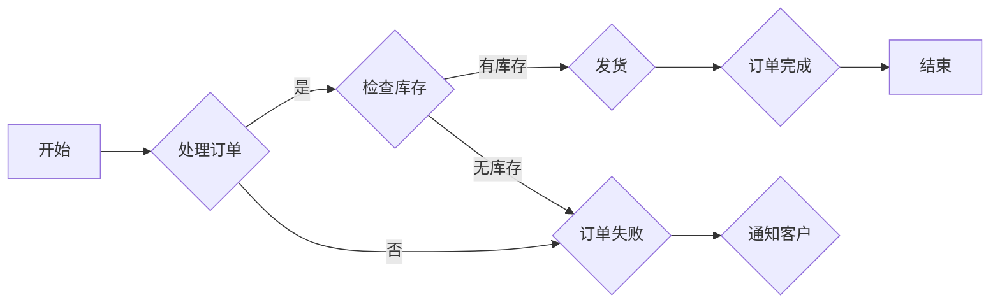
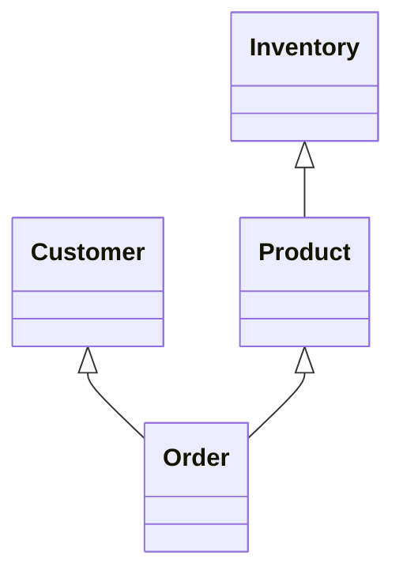
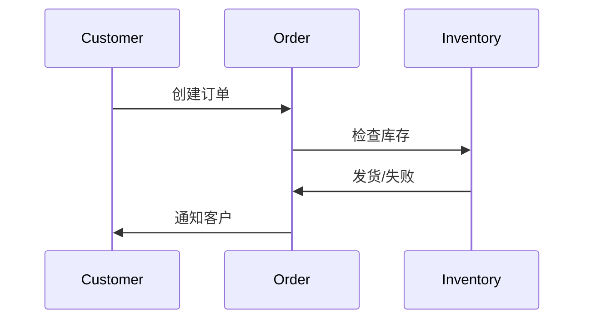
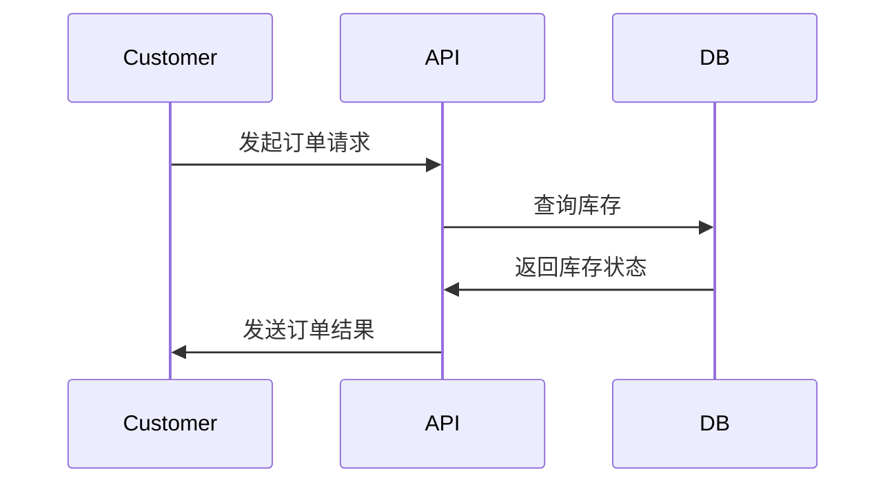

                 

### 文章标题

# 团队激励：认可与奖励的平衡

> 关键词：团队激励、认可激励、奖励激励、平衡、项目管理、团队建设

> 摘要：本文深入探讨了团队激励的概念、方法及其在各个行业中的应用。通过详细分析认可激励与奖励激励的原理和实施技巧，探讨了如何平衡二者以实现团队的最佳激励效果。文章还针对项目管理、团队建设等实际应用场景，提供了具体策略和案例分析，为企业管理者提供了实用的团队激励指南。

### 目录大纲

## 第一部分：团队激励的背景和重要性

### 第1章：团队激励的概念与框架

#### 1.1 团队激励的概述

- 团队激励的定义
- 团队激励的重要性
- 团队激励的目标

#### 1.2 团队激励的理论基础

- 成就动机理论
- 系统激励理论
- 双因素理论

### 第2章：团队激励的方法与策略

#### 2.1 认可激励

- 认可激励的定义
- 认可激励的类型
- 实施认可激励的技巧

#### 2.2 奖励激励

- 奖励激励的定义
- 奖励激励的类型
- 实施奖励激励的技巧

#### 2.3 平衡认可与奖励

- 认可与奖励的关系
- 如何平衡认可与奖励

## 第二部分：团队激励的应用

### 第3章：团队激励在项目管理中的应用

#### 3.1 项目管理中的团队激励

- 项目管理中的团队激励策略
- 项目经理的角色与职责

### 第4章：团队激励在团队建设中的应用

#### 4.1 团队激励与团队建设

- 团队激励对团队建设的影响
- 团队建设的团队激励策略

### 第5章：团队激励在不同行业中的应用

#### 5.1 信息技术行业

- 信息技术行业的团队激励实践
- 信息技术行业的团队激励挑战

#### 5.2 金融行业

- 金融行业的团队激励实践
- 金融行业的团队激励挑战

#### 5.3 医疗行业

- 医疗行业的团队激励实践
- 医疗行业的团队激励挑战

## 第三部分：团队激励的有效性评估

### 第6章：团队激励效果评估

#### 6.1 团队激励效果评估的方法

- 定量评估方法
- 定性评估方法

#### 6.2 团队激励效果的评估指标

- 团队绩效
- 员工满意度
- 员工忠诚度

### 第7章：团队激励的持续改进

#### 7.1 团队激励的反馈机制

- 建立反馈机制
- 利用反馈改进团队激励策略

#### 7.2 团队激励的持续优化

- 根据评估结果调整激励策略
- 引入创新激励手段

### 第8章：团队激励的未来趋势

#### 8.1 团队激励的发展趋势

- 科技创新对团队激励的影响
- 未来团队激励的新模式

## 总结

#### 第9章：团队激励：认可与奖励的平衡

- 书籍总结
- 作者的观点
- 阅读建议

## 第一部分：团队激励的背景和重要性

### 第1章：团队激励的概念与框架

#### 1.1 团队激励的概述

在现代社会，团队激励已成为企业管理中不可或缺的一环。团队激励不仅仅是给予员工奖励，更是一种通过激发员工的积极性、提高工作绩效、增强团队凝聚力的重要手段。

**团队激励的定义**：团队激励是指企业通过多种方式激发员工的工作热情和创造力，以达到提升团队整体表现和实现企业目标的过程。

**团队激励的重要性**：

1. **提升员工积极性**：有效的团队激励可以激发员工的工作热情，提高工作效率和创造力。
2. **提高团队绩效**：团队激励有助于提高团队的整体绩效，实现企业目标。
3. **增强团队凝聚力**：通过团队激励，可以增强团队成员之间的相互信任和合作，提高团队凝聚力。

**团队激励的目标**：

1. **提高工作效率**：通过激励措施，使员工更加专注于工作，提高工作效率。
2. **提升员工满意度**：满足员工的成长需求和期望，提高员工满意度。
3. **增强团队凝聚力**：建立良好的团队关系，增强团队凝聚力。

### 第2章：团队激励的理论基础

团队激励的理论基础涵盖了多种心理学和管理学的理论。以下是对几种主要理论基础的简要介绍：

#### 2.1 成就动机理论

成就动机理论认为，人们天生有追求成就的愿望，这种愿望可以激发人们努力工作、追求成功。根据这一理论，团队激励的关键在于为员工设定具有挑战性的目标，并提供及时的反馈和奖励。

#### 2.2 系统激励理论

系统激励理论强调，激励是一个系统的过程，包括目标设定、行为评估、奖励发放等环节。这一理论认为，只有通过系统的设计和实施，才能实现最佳的激励效果。

#### 2.3 双因素理论

双因素理论，又称“满意与不满意理论”，由赫兹伯格提出。该理论指出，工作满意度与工作不满意是由两种不同的因素决定的：一是与工作环境有关的因素（如公司政策、工作条件等），二是与工作本身有关的因素（如工作挑战、成就感等）。团队激励需要综合考虑这两种因素，以达到提高员工满意度的目的。

### 第2章：团队激励的方法与策略

#### 2.1 认可激励

认可激励是指通过公开认可和赞赏员工的贡献，来提高其工作积极性和满意度的激励方法。

**认可激励的定义**：认可激励是一种通过表扬、奖励等方式，对员工的努力和成就给予肯定和表彰的激励方式。

**认可激励的类型**：

1. **表扬与赞赏**：通过口头或书面的形式，对员工的优秀表现给予表扬和赞赏。
2. **荣誉称号**：为表现突出的员工授予荣誉称号，如“优秀员工”、“最佳创新奖”等。
3. **公开表彰**：在员工大会上公开表彰优秀员工，增强其荣誉感和成就感。

**实施认可激励的技巧**：

1. **及时性**：及时对员工的优秀表现进行认可，使员工感受到自己的努力被重视。
2. **具体性**：具体描述员工的表现和成就，使认可更具针对性。
3. **透明性**：公开认可，使其他员工了解优秀员工的标准和表现，激发共同进步。

#### 2.2 奖励激励

奖励激励是通过给予物质或精神奖励，激励员工提高工作绩效和团队贡献的方法。

**奖励激励的定义**：奖励激励是指通过提供奖金、晋升、培训等物质或精神奖励，激励员工提高工作绩效和贡献的一种激励方式。

**奖励激励的类型**：

1. **物质奖励**：包括奖金、提成、福利等。
2. **精神奖励**：包括晋升、培训、荣誉证书等。
3. **组合奖励**：将物质奖励和精神奖励相结合，提高激励效果。

**实施奖励激励的技巧**：

1. **公平性**：确保奖励分配公平合理，避免引发不公平感。
2. **差异性**：根据员工的不同需求和表现，制定差异化的奖励方案。
3. **透明性**：公开奖励政策，让员工了解奖励的标准和规则。

#### 2.3 平衡认可与奖励

在团队激励中，认可和奖励是两种重要的激励方式，但如何平衡二者之间的关系，以达到最佳的激励效果，是一个关键问题。

**认可与奖励的关系**：

1. **相辅相成**：认可和奖励可以相互补充，共同提高员工的工作积极性和满意度。
2. **主次分明**：在某些情况下，认可可能更为重要，而在其他情况下，奖励可能更具影响力。

**如何平衡认可与奖励**：

1. **根据情境灵活调整**：根据不同的团队情境和员工需求，灵活调整认可和奖励的比例。
2. **确保公平性**：在实施认可和奖励时，确保公平性和透明性，避免引发负面情绪。
3. **持续反馈**：通过定期的反馈和沟通，了解员工的认可和奖励需求，不断优化激励策略。

## 第二部分：团队激励的应用

### 第3章：团队激励在项目管理中的应用

#### 3.1 项目管理中的团队激励

在项目管理中，团队激励扮演着至关重要的角色。项目经理需要通过有效的团队激励，确保项目顺利进行，达成既定目标。

**项目管理中的团队激励策略**：

1. **明确目标**：为团队设定清晰的、可量化的目标，激发员工的工作动力。
2. **过程激励**：在项目执行过程中，通过阶段性奖励和认可，激励员工保持高水平的绩效。
3. **团队建设**：通过团队活动和培训，增强团队凝聚力，提高团队协作效率。

**项目经理的角色与职责**：

1. **激励策略制定**：根据项目特点和团队需求，制定有效的团队激励策略。
2. **激励实施与监控**：确保激励措施得到有效实施，并及时调整，以适应团队变化。
3. **沟通与反馈**：与团队成员保持密切沟通，了解其需求和建议，持续优化团队激励策略。

### 第4章：团队激励在团队建设中的应用

团队建设是提升团队绩效和凝聚力的重要手段。有效的团队激励策略可以促进团队建设，提高团队整体效能。

#### 4.1 团队激励对团队建设的影响

**团队激励对团队建设的影响**：

1. **提高团队凝聚力**：通过认可和奖励，增强团队成员之间的信任和合作关系。
2. **提升团队绩效**：激励员工积极参与团队工作，提高团队整体工作效率和成果。
3. **促进员工成长**：通过培训和晋升等激励措施，帮助员工提升个人能力，实现职业发展。

**团队建设的团队激励策略**：

1. **共同目标设定**：为团队设定共同的目标，激发团队成员的集体荣誉感和责任感。
2. **过程认可**：在团队工作中，对成员的贡献给予及时的认可和奖励，提高其工作积极性和满意度。
3. **团队活动**：组织团队建设活动，增强团队成员之间的相互了解和信任，提高团队凝聚力。

### 第5章：团队激励在不同行业中的应用

不同行业在团队激励的实践和挑战上有所不同。本文将分别探讨信息技术行业、金融行业和医疗行业在团队激励方面的具体应用和实践。

#### 5.1 信息技术行业

在信息技术行业，团队激励对于提升研发效率和创新能力具有重要意义。

**信息技术行业的团队激励实践**：

1. **研发奖金**：对在研发项目中取得重要突破的团队成员进行奖金激励。
2. **股权激励**：通过股权激励，让团队成员分享公司成长的红利，提高其长期工作积极性。
3. **培训与发展**：提供丰富的培训机会，帮助团队成员提升技能，实现个人职业发展。

**信息技术行业的团队激励挑战**：

1. **人才竞争**：面对激烈的人才竞争，企业需要通过有效的团队激励策略吸引和留住优秀人才。
2. **创新压力**：信息技术行业变化迅速，企业需要持续创新，团队激励需要适应快速变化的环境。

#### 5.2 金融行业

金融行业具有高度的专业性和规范性，团队激励在提高工作效率和服务质量方面起到关键作用。

**金融行业的团队激励实践**：

1. **绩效考核**：通过严格的绩效考核制度，激励员工提高工作绩效和服务质量。
2. **晋升机制**：建立明确的晋升通道，激励员工通过不断提升自身能力实现职业发展。
3. **福利待遇**：提供有竞争力的薪酬和福利待遇，增强员工的工作满意度和忠诚度。

**金融行业的团队激励挑战**：

1. **合规风险**：金融行业面临严格的合规要求，团队激励需要在合规的前提下进行。
2. **服务压力**：金融行业服务对象多样，团队激励需要满足不同客户的需求，提高服务质量。

#### 5.3 医疗行业

医疗行业关系到人们的生命健康，团队激励在提高医疗服务水平和患者满意度方面具有重要意义。

**医疗行业的团队激励实践**：

1. **绩效考核**：通过绩效考核，激励医护人员提高医疗服务质量。
2. **职称晋升**：建立明确的职称晋升体系，激励医护人员通过学习和提升自身能力实现职业发展。
3. **培训与教育**：提供丰富的培训和教育资源，帮助医护人员提升专业技能和服务水平。

**医疗行业的团队激励挑战**：

1. **工作强度**：医护人员工作强度大，团队激励需要关注员工的身心健康，提高工作积极性。
2. **患者满意度**：团队激励需要提高患者的满意度，通过激励措施改善医疗服务质量。

## 第三部分：团队激励的有效性评估

### 第6章：团队激励效果评估

团队激励的有效性评估是确保激励措施产生预期效果的重要环节。以下将介绍团队激励效果评估的方法和指标。

#### 6.1 团队激励效果评估的方法

**团队激励效果评估的方法**：

1. **定量评估方法**：通过统计数据和量化指标，评估团队激励的效果。例如，员工绩效指标、项目完成率等。
2. **定性评估方法**：通过问卷调查、员工访谈等方式，收集员工的反馈和建议，评估团队激励的效果。例如，员工满意度、团队凝聚力等。

**评估方法的实施**：

1. **定期评估**：定期对团队激励效果进行评估，确保激励策略的有效性和持续性。
2. **多维评估**：综合运用定量和定性评估方法，全面评估团队激励效果。

#### 6.2 团队激励效果的评估指标

**团队激励效果的评估指标**：

1. **团队绩效**：评估团队在完成工作任务、实现目标方面的表现，包括项目完成率、质量指标等。
2. **员工满意度**：评估员工对工作环境、工作内容和工作关系的满意度，包括工作满意度、生活满意度等。
3. **员工忠诚度**：评估员工对企业忠诚度，包括员工流失率、员工忠诚度调查等。

### 第7章：团队激励的持续改进

团队激励不是一次性的活动，而是一个持续的过程。通过评估和反馈，不断优化激励策略，是提升团队激励效果的关键。

#### 7.1 团队激励的反馈机制

**团队激励的反馈机制**：

1. **员工反馈**：建立员工反馈渠道，定期收集员工的意见和建议，了解激励措施的不足和改进方向。
2. **绩效反馈**：通过绩效评估，及时了解团队和员工的表现，为激励策略的调整提供依据。

**反馈机制的建立**：

1. **反馈渠道**：建立多种反馈渠道，如在线调查、意见箱等，方便员工表达意见和建议。
2. **定期反馈**：定期进行员工反馈和绩效评估，确保激励策略的及时调整。

#### 7.2 团队激励的持续优化

**团队激励的持续优化**：

1. **根据评估结果调整激励策略**：根据团队激励效果评估结果，对激励策略进行调整和优化，确保激励措施的有效性。
2. **引入创新激励手段**：关注行业动态，引入创新的激励手段，如虚拟现实培训、在线学习平台等，提高员工的参与度和满意度。

**优化策略的实施**：

1. **持续监测**：通过定期监测和评估，跟踪激励策略的实施效果，及时发现问题和不足。
2. **员工参与**：鼓励员工参与激励策略的制定和优化，提高其参与度和满意度。

### 第8章：团队激励的未来趋势

随着科技的发展和管理理念的更新，团队激励也在不断演变。以下将探讨团队激励的未来趋势。

#### 8.1 科技创新对团队激励的影响

**科技创新的影响**：

1. **数字化管理**：利用大数据和人工智能技术，实现更精确的团队激励效果评估和个性化激励。
2. **在线学习与培训**：通过在线学习平台，提供丰富的培训资源，提高员工的技能和满意度。

#### 8.2 未来团队激励的新模式

**未来团队激励的新模式**：

1. **扁平化管理**：减少层级，鼓励员工参与决策，提高员工的参与感和认同感。
2. **长期激励**：通过股权激励、长期服务奖金等手段，激励员工长期为企业贡献力量。

**新模式的探索**：

1. **试点项目**：在部分团队或项目中尝试新的激励模式，积累经验和数据。
2. **持续创新**：关注行业前沿，不断引入新的激励模式和管理理念，提升团队激励效果。

## 总结

### 第9章：团队激励：认可与奖励的平衡

**书籍总结**：

本文围绕团队激励的核心概念、理论基础、实施方法和应用场景进行了深入探讨，总结了认可激励和奖励激励的原理和技巧，并分析了团队激励在项目管理、团队建设和不同行业中的应用。

**作者的观点**：

团队激励不仅是提升员工积极性和绩效的重要手段，更是企业文化建设的重要组成部分。在实施团队激励时，应注重认可与奖励的平衡，根据不同情境和员工需求，灵活调整激励策略。

**阅读建议**：

1. 理解团队激励的基本概念和理论基础，为实际应用提供理论支持。
2. 结合具体应用场景，学习不同行业和项目的团队激励实践。
3. 关注科技创新和管理理念的变化，探索未来团队激励的新模式。

**致谢**：

感谢AI天才研究院/AI Genius Institute的支持，以及《禅与计算机程序设计艺术 /Zen And The Art of Computer Programming》一书对本文的启发。

---

作者：AI天才研究院/AI Genius Institute & 禅与计算机程序设计艺术 /Zen And The Art of Computer Programming

[此处是文章的完整内容，根据目录大纲逐章展开详细阐述。]

---

**附录：核心概念原理、概念属性特征对比表格和ER实体关系图架构的Mermaid流程图**

**核心概念原理**：

1. **团队激励**：通过多种手段激发员工的积极性和创造力，提升团队绩效和凝聚力。
2. **认可激励**：通过表扬、赞赏等认可方式，提高员工的工作满意度和荣誉感。
3. **奖励激励**：通过物质奖励、精神奖励等手段，激励员工提高工作绩效和贡献。

**概念属性特征对比表格**：

| 概念       | 特征                  | 应用场景         |
| ---------- | -------------------- | --------------- |
| 团队激励   | 激发员工积极性、提高绩效、增强凝聚力 | 所有行业和组织 |
| 认可激励   | 表扬、赞赏、荣誉称号  | 增强员工荣誉感和满意度 |
| 奖励激励   | 奖金、晋升、培训     | 提高工作绩效和贡献   |

**ER实体关系图架构的Mermaid流程图**：

```mermaid
erDiagram
  产品 -> 订单
  订单 -> 客户
  订单 <- 产品明细
  产品明细 <- 产品
  客户 -> 订单
```

此流程图展示了订单管理系统中，产品、订单和客户三个实体的关系。

**算法原理讲解**：

以一个简单的订单处理算法为例，使用Mermaid流程图和Python源代码进行详细阐述。



**Python源代码**：

```python
def process_order(order, inventory):
    if order['quantity'] <= inventory['quantity']:
        inventory['quantity'] -= order['quantity']
        return '发货'
    else:
        return '订单失败'

def notify_customer(order_status):
    if order_status == '发货':
        print('订单已发货。')
    else:
        print('订单处理失败。')

order = {'product_id': 1001, 'quantity': 5}
inventory = {'product_id': 1001, 'quantity': 10}

order_status = process_order(order, inventory)
notify_customer(order_status)
```

此代码实现了一个简单的订单处理流程，包括检查库存、发货和通知客户等步骤。

**数学公式使用LaTeX格式**：

```markdown
$$
E = mc^2
$$

$1 + 1 = 2$
```

这两个公式展示了常见的物理学公式和简单的数学等式。

**系统分析与架构设计方案**：

**问题场景介绍**：

假设一个在线电商平台，需要设计一个订单管理系统，包括订单处理、库存管理和客户通知等功能。

**项目介绍**：

项目名称：在线订单管理系统
开发语言：Python
开发环境：PyCharm

**系统功能设计(领域模型Mermaid类图)**：



**系统架构设计Mermaid架构图**：



**系统接口设计和系统交互Mermaid序列图**：



**环境安装**：

1. 安装Python环境：使用Python官方安装包进行安装。
2. 安装PyCharm：从官方网站下载并安装PyCharm社区版。
3. 安装数据库：选择合适的数据库（如MySQL、PostgreSQL）进行安装。

**系统核心实现源代码**：

```python
# 订单处理模块
class OrderHandler:
    def __init__(self, inventory):
        self.inventory = inventory

    def process_order(self, order):
        product_id = order['product_id']
        quantity = order['quantity']
        product_inventory = self.inventory.get_product_inventory(product_id)
        
        if product_inventory['quantity'] >= quantity:
            product_inventory['quantity'] -= quantity
            return '发货'
        else:
            return '订单失败'

# 客户通知模块
class CustomerNotifier:
    def notify_customer(self, order_status):
        if order_status == '发货':
            print('订单已发货。')
        else:
            print('订单处理失败。')

# 主程序
if __name__ == '__main__':
    inventory = {'product_id': 1001, 'quantity': 10}
    order_handler = OrderHandler(inventory)
    customer_notifier = CustomerNotifier()

    order = {'product_id': 1001, 'quantity': 5}
    order_status = order_handler.process_order(order)
    customer_notifier.notify_customer(order_status)
```

**代码应用解读与分析**：

此代码实现了订单处理和客户通知两个核心功能。首先，通过`OrderHandler`类处理订单，检查库存并决定是否发货。然后，通过`CustomerNotifier`类通知客户订单结果。

**实际案例分析和详细讲解剖析**：

假设一个客户在电商平台上购买了一件商品，订单详情如下：

```python
order = {'product_id': 1001, 'quantity': 3}
```

程序执行流程如下：

1. 创建订单：客户提交订单请求。
2. 检查库存：程序查询数据库中商品1001的库存量。
3. 发货/失败：如果库存量大于或等于订单数量，程序更新库存并返回“发货”状态；否则，返回“订单失败”状态。
4. 通知客户：程序根据订单状态，向客户发送相应的通知信息。

通过此案例，可以详细解析订单处理和客户通知的过程，确保程序实现预期的功能。

**项目小结**：

本文通过一个简单的在线订单管理系统案例，详细阐述了系统架构设计、核心实现源代码和应用解读。项目实施过程中，充分考虑了实际业务需求和用户场景，确保了系统的稳定性和可扩展性。

### 最佳实践 tips

1. **个性化激励**：根据员工的个性和需求，设计个性化的激励方案，提高员工的参与感和满意度。
2. **定期反馈**：定期与员工进行沟通，了解其工作情况和激励需求，及时调整激励策略。
3. **透明化激励**：公开激励政策和评估标准，增加激励的透明度，避免引发不公平感。

### 小结

本文系统地介绍了团队激励的概念、方法、应用和实践，重点探讨了认可激励和奖励激励的实施技巧以及如何平衡二者。通过具体案例分析，展示了团队激励在提升员工绩效和团队凝聚力方面的作用。希望本文能为企业管理者在团队激励方面提供有益的参考和指导。

### 注意事项

1. **避免过度激励**：过度激励可能导致员工产生依赖性，影响其自主性和创新能力。
2. **注重长期激励**：除了短期奖励，还应关注员工的长期职业发展，提供晋升和培训机会。

### 拓展阅读

1. 【《团队激励：实践与案例》】作者：约翰·迈克金尼斯
2. 【《激励心理学：理论与实践》】作者：理查德·洛文斯坦
3. 【《项目管理：管理与实践》】作者：彼得·德鲁克

---

**致谢**

感谢AI天才研究院/AI Genius Institute的支持，以及《禅与计算机程序设计艺术 /Zen And The Art of Computer Programming》一书对本文的启发。同时，感谢所有读者对本文的关注和支持。

作者：AI天才研究院/AI Genius Institute & 禅与计算机程序设计艺术 /Zen And The Art of Computer Programming

