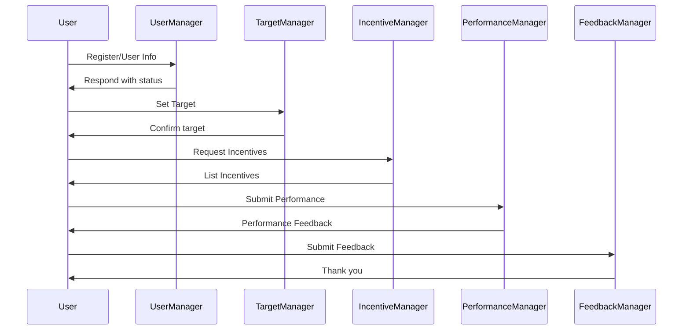

                 

### 文章标题

# 团队激励：让每个人都充满动力的方法

### 关键词

- 团队激励
- 激励理论
- 激励策略
- 绩效考核
- 动力心理学

### 摘要

本文深入探讨了团队激励的各个方面，从背景介绍到核心概念解析，再到具体的激励策略和系统设计，旨在为IT行业的团队管理者提供一套系统的激励方法。通过分析动力心理学和管理学理论，结合实际案例，本文将帮助读者理解如何设定激励目标、选择合适的激励方法与工具，并设计出有效的激励系统，从而激发团队成员的积极性和创造力，提升团队的整体绩效。

---

### 背景介绍

在现代IT行业中，团队的有效运作是实现项目成功的关键。然而，随着竞争的加剧和项目复杂度的提高，许多团队面临着动力不足的问题。团队成员可能会因为工作压力、职业发展瓶颈或缺乏成就感而感到疲惫和失落，这直接影响了团队的士气和生产力。

#### 问题背景

- **团队成员动力不足**：团队成员缺乏工作动力，导致工作效率低下。
- **项目进度受阻**：动力不足导致项目进度滞后，增加项目风险。
- **团队士气低落**：缺乏动力的团队成员可能对团队失去信心，影响团队凝聚力。

#### 问题描述

- **激励需求**：团队成员需要被激励，以提高工作热情和效率。
- **激励不足**：现有的激励措施可能不足以激发团队成员的潜力。

#### 问题解决

- **引入有效的激励策略**：通过科学的方法设计激励系统，激发团队成员的积极性和创造力。

#### 边界与外延

- **团队激励的范围**：团队激励不仅限于物质奖励，还包括精神激励和职业发展机会。
- **团队激励的影响因素**：个人需求、团队文化、工作环境等都会影响团队激励的效果。

#### 概念结构与核心要素组成

- **核心概念**：团队激励是指通过各种方法激发团队成员的工作热情和创造力，以达到提升团队绩效的目的。
- **核心要素**：
  - 激励目标：明确激励的目标和方向。
  - 激励方法：选择合适的激励手段，如奖金、晋升、培训等。
  - 激励系统：设计一套有效的激励体系，包括激励机制、绩效考核和反馈机制。

### 本章小结

通过以上对团队激励背景的介绍，我们可以看到，团队动力不足是一个普遍存在的问题，它直接影响着团队的工作效率和项目进度。为了解决这一问题，我们需要引入有效的激励策略，并通过科学的方法设计出适合团队发展的激励系统。接下来，我们将深入探讨团队激励的核心概念和理论，为读者提供更加详细的指导。

---

### 核心概念与联系

#### 核心概念原理

团队激励是一个系统性工程，它涉及到多个核心概念，这些概念共同作用，形成了一个完整的激励体系。

- **动机**：动机是人们行动的内在驱动力，包括生理需求、安全需求、社交需求、尊重需求和自我实现需求。理解团队成员的动机是设计有效激励策略的基础。

- **激励**：激励是指通过外部刺激来激发和维持个体或团队的行为。激励可以分为正激励和负激励，前者如奖励和表扬，后者如惩罚和批评。

- **绩效**：绩效是团队成员在工作中的表现，包括工作效率、质量、创新性和团队合作等方面。绩效考核是激励的重要依据。

- **反馈**：反馈是指对团队成员工作的评价和反馈，包括正反馈和负反馈。正反馈可以增强团队成员的信心和动力，而负反馈则有助于改进和提升工作表现。

#### 概念属性特征对比表格

| 概念    | 定义                                                         | 属性特征                                                                 |
| ------- | ------------------------------------------------------------ | -------------------------------------------------------------------- |
| 动机    | 内在驱动力，影响个体行为选择                               | 生理需求、安全需求、社交需求、尊重需求、自我实现需求                |
| 激励    | 通过外部刺激激发和维持个体或团队行为                         | 正激励、负激励                                                         |
| 绩效    | 工作中的表现，包括效率、质量、创新性和团队合作等               | 可衡量性、多样性、公平性                                               |
| 反馈    | 对团队成员工作的评价和反馈，分为正反馈和负反馈                 | 及时性、准确性、建设性                                                 |

#### ER实体关系图架构

为了更好地理解这些概念之间的关系，我们可以使用ER（实体关系）图来表示。

```mermaid
erDiagram
    User ..|> Motivation
    User ..|> Performance
    User ..|> Incentive
    User ..|> Feedback
    Motivation ||--|> Performance
    Incentive ||--|> Feedback
```

在上面的ER图中，`User`（用户/团队成员）是中心实体，与`Motivation`（动机）、`Performance`（绩效）、`Incentive`（激励）和`Feedback`（反馈）四个实体之间存在关联。动机驱动个体的行为，行为表现为绩效，绩效得到激励，激励又通过反馈得到评价和调整。

#### 本章小结

通过对团队激励核心概念的解析，我们了解了动机、激励、绩效和反馈等基本概念及其相互关系。这些概念构成了团队激励的理论基础，为后续的激励策略和系统设计提供了指导。在接下来的章节中，我们将进一步探讨动力心理学和管理学理论，以加深对团队激励的理解。

---

### 团队激励理论

#### 动力心理学理论

动力心理学是研究人类行为动机和内在动力的心理学分支。在团队激励中，动力心理学理论为我们提供了理解团队成员行为动机的视角。

##### 人类动机理论概述

人类动机理论有多种，其中较为著名的包括马斯洛的需求层次理论和赫兹伯格的双因素理论。

- **马斯洛的需求层次理论**：马斯洛将人的需求分为五个层次，从基本的生理需求到高级的自我实现需求。他认为，人们会根据需求层次逐级追求满足，一个层次的需求得到满足后，才会追求更高层次的需求。

  ```mermaid
  graph TD
  A[生理需求] --> B[安全需求]
  B --> C[社交需求]
  C --> D[尊重需求]
  D --> E[自我实现需求]
  ```

- **赫兹伯格的双因素理论**：赫兹伯格提出，工作满意度由两种因素决定，即激励因素（如成就、认可、工作本身等）和保健因素（如薪资、工作环境、管理政策等）。激励因素能够带来工作满意度，而保健因素仅能防止不满意。

  ```mermaid
  graph TD
  A[激励因素] --> B{满意度}
  B --> C[保健因素]
  C --> D{不满意}
  ```

##### 动力心理学在团队激励中的应用

动力心理学在团队激励中的应用主要体现在以下几个方面：

- **识别团队成员的动机**：通过了解团队成员的需求层次和激励因素，管理者可以更有针对性地设计激励策略。
- **满足团队成员的基本需求**：确保团队成员的基本需求得到满足，如薪资、工作环境等，以防止不满意。
- **激发高级需求**：通过提供挑战性任务、职业发展机会和认可等，激发团队成员的自我实现需求。

#### 管理学理论

管理学理论提供了团队激励的另一个重要视角，特别是关于如何通过组织管理和领导力来激发团队成员的动力。

##### 传统管理理论对激励的影响

传统管理理论强调通过规章制度和绩效评估来管理团队。这种方法在一定程度上能够维持团队的稳定性和效率，但其缺点是容易导致员工的被动性和不满。

- **科学管理理论**：泰勒的科学管理理论强调通过标准化作业流程和提高工作效率来提升绩效。这种方法在提高生产效率方面有一定作用，但忽视了员工的内在动机。
- **行政组织理论**：韦伯的行政组织理论强调通过明确的职责分工和严格的等级制度来管理团队。这种方法有助于提高组织效率，但也可能导致员工的疏离感。

##### 当代管理理论对激励的贡献

当代管理理论更注重员工的内在动机和团队协作，为团队激励提供了新的思路。

- **变革型领导理论**：变革型领导通过激励和启发员工，使他们超越自我利益，为实现团队目标而努力。这种领导风格能够激发团队成员的创造力和主动性。
- **参与式管理理论**：参与式管理强调员工的参与和自治，通过赋予员工更多的决策权和责任，提高他们的工作满足感和绩效。

##### 管理学理论在团队激励中的实践

在团队激励中，管理者可以结合传统管理和当代管理理论，采取以下实践方法：

- **设置明确的目标**：确保团队成员了解团队的目标和自己的任务，从而激发他们的工作动力。
- **提供反馈和认可**：通过定期的绩效反馈和公开认可，增强团队成员的成就感和归属感。
- **鼓励团队合作**：通过团队建设活动和跨部门合作，增强团队成员的协作精神和团队凝聚力。

#### 激励模型分析

激励模型是指导团队激励策略设计的重要工具。以下是一些常见的激励模型：

- **期望理论模型**：期望理论认为，个体会根据期望价值、努力程度和结果概率来决定其行为。公式为：激励力量 = 期望值 × 努力程度 × 成功概率。
- **公平理论模型**：公平理论认为，个体会根据自己和他人的投入和回报来比较，如果感到不公平，就会影响其工作动力。
- **强化理论模型**：强化理论认为，通过奖励和惩罚来影响个体的行为，奖励可以增强积极行为，而惩罚可以减少消极行为。

每种激励模型都有其适用的场景和优缺点，管理者应根据团队的具体情况选择合适的模型。

#### 团队激励的核心概念

- **激励的定义与作用**：激励是指通过各种手段激发和维持团队成员的工作热情和创造力。
- **激励的过程与机制**：激励过程包括目标设定、激励策略选择、激励实施和效果评估等环节。激励机制包括物质激励、精神激励和职业发展激励等。
- **激励的要素分析**：激励的要素包括激励目标、激励手段、激励反馈和激励效果等。

#### 本章小结

通过动力心理学和管理学理论的探讨，我们深入了解了团队激励的基本概念和理论框架。动力心理学提供了理解团队成员动机的视角，而管理学理论则提供了如何在组织管理中应用这些理论的实践方法。接下来，我们将进一步探讨具体的团队激励策略，为读者提供实用的激励方法。

---

### 团队激励策略

#### 激励目标设定

激励目标设定是团队激励策略的核心步骤之一，明确的目标能够指引团队成员的努力方向，提高团队的整体绩效。

##### 激励目标的重要性

- **明确方向**：明确的目标能够帮助团队成员理解团队的方向和期望，从而有针对性地开展工作。
- **激发动力**：有挑战性的目标可以激发团队成员的斗志和创造力，提高工作效率。
- **绩效评估**：明确的目标是绩效评估的基础，有助于公正地评价团队成员的工作表现。

##### 设定激励目标的步骤

1. **确定团队愿景和使命**：首先，团队需要明确其愿景和使命，这是设定激励目标的基础。
2. **分解目标**：将总体目标分解为具体的子目标，确保每个目标都是可衡量和可实现的。
3. **设定挑战性**：目标应具有一定的挑战性，以激发团队成员的积极性，但也要确保目标的可实现性。
4. **定期回顾与调整**：激励目标应根据团队的发展和外部环境的变化进行定期回顾和调整，以保持目标的持续有效性。

##### 不同类型团队的激励目标

- **创新型团队**：设定以创新和研发为核心的激励目标，鼓励团队成员提出新的创意和解决方案。
- **执行型团队**：设定以提高执行效率和绩效为核心的激励目标，确保团队按时按质完成项目任务。
- **跨部门协作团队**：设定以跨部门沟通和协作为核心的激励目标，促进团队间的合作和协同。

#### 激励方法与工具

激励方法的选择应根据团队的具体情况和成员的个体差异，以实现最佳的激励效果。

##### 金钱激励

金钱激励是最常见的激励方法之一，包括奖金、提成、股票期权等。

- **优点**：直接、有效，能够迅速提高团队成员的积极性。
- **缺点**：过度依赖金钱激励可能导致团队成员对工作缺乏内在动机，且金钱激励的效果可能随时间减弱。

##### 非金钱激励

非金钱激励包括荣誉、认可、职业发展机会等。

- **优点**：能够增强团队成员的成就感和归属感，提高工作满意度和忠诚度。
- **缺点**：效果较慢，需要长期积累和持续投入。

##### 激励工具的选择与应用

1. **奖金制度**：通过设定明确的奖金标准和发放条件，激励团队成员提高绩效。
2. **晋升机会**：提供职业晋升路径，激励团队成员不断提升自己的能力和业绩。
3. **培训与发展**：提供培训和学习机会，帮助团队成员提升技能和职业素养。
4. **荣誉制度**：通过表彰和奖励机制，公开认可团队成员的杰出贡献，增强其自豪感和归属感。

#### 激励实践案例分析

##### 案例一：某科技公司的奖金制度

某科技公司通过设立季度奖金制度，激励员工提高绩效。奖金制度包括基本工资和绩效奖金两部分，绩效奖金根据员工的工作表现和项目的完成情况进行发放。这种激励方法有效地提高了员工的工作积极性和项目的成功率。

##### 案例二：某咨询公司的职业发展计划

某咨询公司通过实施职业发展计划，为员工提供明确的晋升路径和培训机会。公司定期举办内部培训和外部研讨会，鼓励员工不断提升自己的专业技能和行业知识。此外，公司还设有优秀员工评选，对表现突出的员工进行公开表彰和奖励。这种激励方法有效地增强了员工的职业认同感和归属感。

##### 案例三：某制造企业的团队建设活动

某制造企业通过定期举办团队建设活动，增强员工的团队合作精神和团队凝聚力。活动内容包括团队拓展训练、团队游戏和团队晚会等。这些活动不仅增强了员工的团队协作能力，还提高了员工的工作满意度和团队士气。

#### 激励策略的实施

##### 激励策略的设计

1. **明确激励目标**：根据团队的目标和成员的需求，设计具体的激励目标和策略。
2. **选择激励方法**：根据团队成员的特点和团队类型，选择合适的激励方法。
3. **制定激励计划**：制定详细的激励计划，包括激励目标、激励方法、实施时间和预期效果等。

##### 激励策略的执行

1. **宣传和沟通**：确保团队成员了解激励目标和激励策略，提高参与度。
2. **实施激励措施**：按照激励计划，实施各种激励措施，确保激励目标的实现。
3. **跟踪和评估**：定期跟踪激励措施的实施情况，评估激励效果，及时调整和优化激励策略。

##### 激励策略的评估与调整

1. **评估激励效果**：通过绩效评估和员工反馈，评估激励措施的效果。
2. **收集改进建议**：鼓励团队成员提出改进建议，优化激励策略。
3. **持续改进**：根据评估结果和改进建议，持续优化激励策略，以适应团队的发展和变化。

#### 本章小结

通过本章的探讨，我们了解了团队激励目标的设定、激励方法和实践案例，并学习了如何设计、实施和评估激励策略。有效的团队激励能够激发团队成员的积极性和创造力，提高团队的整体绩效。在接下来的章节中，我们将进一步探讨激励系统的设计，以实现持续有效的团队激励。

---

### 激励系统设计

激励系统是团队激励的核心组成部分，一个设计合理的激励系统能够确保团队激励策略的有效实施，从而提高团队的整体绩效。

#### 系统分析与架构设计

##### 团队激励系统的需求分析

在开始设计激励系统之前，我们需要对团队激励的需求进行详细分析。需求分析主要包括以下几个方面：

- **团队目标**：明确团队的目标和愿景，确保激励系统能够支持团队目标的实现。
- **团队成员需求**：了解团队成员的需求，包括职业发展、工作环境、薪资待遇等方面。
- **激励策略**：确定激励策略的类型和实施方法，如金钱激励、非金钱激励和职业发展激励等。
- **绩效考核**：明确绩效考核的标准和方式，确保绩效考核的公正性和透明度。

##### 团队激励系统的功能设计

基于需求分析，我们可以设计出团队激励系统的功能模块，主要包括以下几部分：

- **目标管理模块**：用于设定和管理团队和个人的目标，包括目标的分解、进度跟踪和评估。
- **激励管理模块**：用于实施和管理各种激励措施，包括激励计划的设计、激励工具的选择和激励效果的评估。
- **绩效考核模块**：用于设定和管理绩效考核标准，收集和整理绩效考核数据，生成绩效报告。
- **反馈管理模块**：用于收集和整理团队成员的反馈，及时调整激励策略和系统设计。

##### 团队激励系统的架构设计

团队激励系统的架构设计应考虑系统的可扩展性、稳定性和安全性，以下是团队激励系统的一种典型架构设计：

1. **数据层**：存储和管理团队激励系统的各种数据，包括目标数据、激励数据、绩效考核数据和反馈数据等。
2. **服务层**：提供各种业务服务，包括目标管理服务、激励管理服务、绩效考核服务和反馈管理服务等。
3. **界面层**：提供用户界面，供用户进行目标设定、激励实施、绩效考核和反馈收集等操作。

#### 激励机制实施

激励机制的设置是激励系统设计的关键环节，合理的激励机制能够有效激发团队成员的工作热情和创造力。

##### 激励机制的设置原则

1. **公平性**：激励机制应确保公平性，使每个团队成员都有机会获得激励。
2. **透明性**：激励机制应透明，使团队成员了解激励的条件、标准和流程。
3. **多样性**：激励机制应多样化，以满足不同团队成员的需求和激发不同类型的动机。
4. **持续性**：激励机制应具有持续性，确保激励效果的长期稳定。

##### 激励机制的执行流程

1. **目标设定**：团队和成员共同设定激励目标，确保目标的明确性和可实现性。
2. **激励计划设计**：根据目标和团队成员的需求，设计激励计划，包括激励类型、激励工具和激励条件等。
3. **激励实施**：按照激励计划，实施各种激励措施，确保激励目标的实现。
4. **绩效考核**：根据绩效考核标准，对团队成员的工作表现进行评估，确定激励的发放。
5. **反馈与调整**：收集团队成员的反馈，及时调整激励策略和机制，优化激励效果。

#### 绩效考核与反馈

绩效考核和反馈是激励系统的重要组成部分，有效的绩效考核和反馈机制能够帮助团队成员了解自己的工作表现，并激发改进的动力。

##### 绩效考核与反馈的实施

1. **设定绩效考核标准**：根据团队目标和岗位要求，设定明确的绩效考核标准。
2. **定期评估绩效**：定期对团队成员的绩效进行评估，收集评估数据和反馈。
3. **公开绩效考核结果**：公开绩效考核结果，确保团队成员了解自己的绩效表现。
4. **提供改进建议**：根据绩效考核结果，为团队成员提供改进建议和培训机会。
5. **收集反馈**：定期收集团队成员的反馈，了解他们对激励机制和绩效考核的看法和建议。

##### 绩效考核与反馈的优化

1. **持续优化绩效考核标准**：根据团队发展和外部环境的变化，持续优化绩效考核标准。
2. **提高反馈质量**：鼓励团队成员提供详细的反馈，确保反馈的准确性和建设性。
3. **加强反馈机制**：建立有效的反馈机制，确保反馈能够及时传达和落实。
4. **优化激励措施**：根据绩效考核和反馈结果，优化激励措施，提高激励效果。

#### 本章小结

通过本章的讨论，我们了解了激励系统设计的关键环节，包括需求分析、功能设计、架构设计、激励机制实施和绩效考核与反馈等。一个设计合理的激励系统能够确保团队激励策略的有效实施，从而提高团队的整体绩效。在下一章中，我们将探讨团队激励的实践应用，结合实际案例，进一步阐述如何将激励理论转化为具体行动。

---

### 团队激励实践

#### 团队建设与动力培养

团队建设是提升团队整体动力的关键，通过一系列活动和实践，可以有效增强团队的凝聚力和成员之间的相互信任。

##### 团队建设活动

1. **团队拓展训练**：通过户外拓展训练，如攀岩、团队协作游戏等，增强团队成员的协作精神和团队意识。
2. **团队会议**：定期举办团队会议，促进团队成员之间的沟通和交流，分享工作心得和经验。
3. **团队建设工作坊**：通过专题工作坊，如领导力培训、沟通技巧培训等，提升团队成员的专业能力和团队协作能力。

##### 动力培养方法

1. **设定明确的目标**：为团队成员设定明确、可实现的个人和团队目标，激发团队成员的内在动机。
2. **提供成长机会**：为团队成员提供职业发展机会和培训，帮助其提升技能和职业素养，增强工作动力。
3. **鼓励创新和尝试**：鼓励团队成员勇于尝试新的方法和想法，对创新行为给予认可和奖励，激发团队的创造力和积极性。

#### 激励文化营造

激励文化是一种以激励为核心的企业文化，通过营造积极的激励氛围，激发团队成员的内在动力和工作热情。

##### 激励文化的特征

1. **认可与尊重**：尊重每个团队成员的贡献和价值，通过公开认可和奖励，增强团队成员的成就感和归属感。
2. **公平与透明**：确保激励机制的公平性和透明度，使每个团队成员都感到自己的努力得到了应有的回报。
3. **持续激励**：通过持续的创新和优化，保持激励机制的活力，防止激励效果的减弱。

##### 激励文化的营造方法

1. **制定激励政策**：建立明确的激励政策，包括奖金制度、晋升机制、培训计划等，确保激励机制的有效实施。
2. **培养激励氛围**：通过公司文化活动和内部沟通，营造积极向上的激励氛围，让每个团队成员都能感受到激励的力量。
3. **强化激励意识**：通过培训和宣传，提高团队成员对激励文化的认识和重视，增强其对激励措施的参与度和认同感。

#### 激励策略优化与调整

激励策略的有效性需要不断优化和调整，以适应团队的发展和变化。

##### 激励策略优化方法

1. **定期评估**：定期对激励策略进行评估，收集团队成员的反馈，了解激励措施的实际效果。
2. **数据驱动**：利用数据分析工具，分析团队成员的绩效数据和激励效果，找出存在的问题和优化方向。
3. **创新尝试**：不断尝试新的激励方法和工具，如虚拟现实培训、游戏化工作管理等，提升激励效果。

##### 激励策略调整步骤

1. **分析现状**：分析当前激励策略的优缺点，找出需要改进的地方。
2. **制定方案**：根据分析结果，制定具体的调整方案，包括激励工具的选择、激励条件的设定等。
3. **实施调整**：按照调整方案，实施激励策略的优化和调整，确保新策略的有效实施。
4. **评估效果**：对新策略的效果进行评估，根据评估结果进行进一步的调整和优化。

#### 本章小结

通过本章的讨论，我们了解了团队激励的实践方法，包括团队建设与动力培养、激励文化营造和激励策略优化与调整。有效的团队激励需要从多个方面入手，通过一系列具体措施和活动，激发团队成员的内在动力和工作热情，提升团队的整体绩效。在下一章中，我们将通过实际案例，进一步探讨团队激励的实施过程和效果。

---

### 案例分析

#### 案例介绍

在本节中，我们将分析三个具体的团队激励案例，分别是某科技公司的奖金制度、某咨询公司的职业发展计划以及某制造企业的团队建设活动。通过这些案例，我们将深入探讨团队激励策略的实施过程、效果以及其中的启示。

#### 案例一：某科技公司的奖金制度

**背景**：某科技公司是一家领先的软件企业，团队成员普遍对薪资待遇有较高的期望。为了激发团队成员的积极性和创造力，公司决定实施一项奖金制度。

**实施过程**：
1. **目标设定**：公司明确奖金制度的目的是激励团队成员提高工作效率和项目质量。
2. **激励计划设计**：公司设定了季度奖金制度，根据团队成员的工作表现和项目成果发放奖金。奖金分为三个等级：优秀、良好和达标。
3. **激励实施**：在每个季度末，公司会对团队成员的工作进行评估，根据评估结果发放奖金。同时，公司还会对优秀表现者进行公开表彰。

**效果**：
- **提高工作效率**：团队成员为了获得更高的奖金，普遍提高了工作效率和项目质量。
- **增强团队凝聚力**：公开表彰和奖励机制增强了团队成员的成就感和归属感，提升了团队凝聚力。

**启示**：
- **明确的激励目标**：明确的激励目标有助于团队成员明确努力方向，提高工作动力。
- **公正的评估标准**：公正的评估标准能够确保激励措施的有效性和公平性，增强团队成员的信任。

#### 案例二：某咨询公司的职业发展计划

**背景**：某咨询公司拥有丰富的行业经验和专业知识，团队成员普遍具有很高的职业素养。为了激励团队成员持续提升自己，公司实施了一项职业发展计划。

**实施过程**：
1. **目标设定**：公司明确职业发展计划的目标是帮助团队成员提升职业能力和实现职业晋升。
2. **激励计划设计**：公司为每个团队成员制定了个性化的职业发展路径，包括技能提升、项目参与和晋升机会。
3. **激励实施**：公司定期为团队成员提供培训和学习机会，同时设立内部晋升机制，鼓励团队成员积极提升自己。

**效果**：
- **提高职业素养**：团队成员通过培训和学习，不断提升自己的职业能力和专业素养。
- **增强工作动力**：明确的职业发展路径和晋升机会激发了团队成员的工作动力，提高了工作效率。

**启示**：
- **个性化的职业发展路径**：个性化的职业发展路径能够更好地满足团队成员的需求，提高激励效果。
- **持续的培训和职业发展**：持续的培训和职业发展能够帮助团队成员不断提升自己，实现职业价值。

#### 案例三：某制造企业的团队建设活动

**背景**：某制造企业面临激烈的竞争压力，为了提高团队的协作效率和创新能力，公司决定实施一系列团队建设活动。

**实施过程**：
1. **目标设定**：公司明确团队建设活动的目标是增强团队成员的协作精神和创新能力。
2. **激励计划设计**：公司组织了团队拓展训练、团队游戏和团队晚会等活动，鼓励团队成员积极参与。
3. **激励实施**：在活动中，公司注重团队成员之间的互动和沟通，鼓励分享经验和想法。

**效果**：
- **增强团队协作**：团队建设活动增强了团队成员之间的协作精神和团队凝聚力。
- **激发创新能力**：通过团队建设和互动，团队成员的创新能力得到了有效激发。

**启示**：
- **多样化的团队建设活动**：多样化的团队建设活动能够满足不同团队成员的需求，提高激励效果。
- **注重团队互动和沟通**：团队互动和沟通是增强团队协作和创新能力的关键，需要得到重视。

#### 案例总结与启示

通过以上三个案例的分析，我们可以得出以下总结和启示：

- **明确的激励目标**：明确的激励目标是激励团队成员努力的方向，有助于提高工作动力。
- **个性化的激励措施**：个性化的激励措施能够更好地满足团队成员的需求，提高激励效果。
- **持续的培训和职业发展**：持续的培训和职业发展能够帮助团队成员不断提升自己，实现职业价值。
- **团队互动和沟通**：团队互动和沟通是增强团队协作和创新能力的关键，需要得到重视。

这些案例为我们提供了宝贵的实践经验和指导，帮助我们更好地理解和实施团队激励策略。

---

### 最佳实践与总结

#### 最佳实践分享

在团队激励的实践中，以下是一些值得借鉴的最佳做法：

- **设定明确的目标**：确保团队成员了解激励目标和方向，有助于提高工作效率和满意度。
- **多样化的激励措施**：结合金钱激励和非金钱激励，满足团队成员的不同需求，提高激励效果。
- **个性化的职业发展路径**：为每个团队成员制定个性化的职业发展路径，鼓励他们不断提升自己。
- **持续的反馈与改进**：定期收集团队成员的反馈，及时调整激励策略，优化激励效果。

#### 小结与注意事项

团队激励是一项系统工程，需要从多个方面入手，包括目标设定、激励措施、反馈机制等。以下是几点需要注意的事项：

- **公平性**：确保激励措施的公平性，避免出现不公平现象，影响团队士气。
- **透明性**：激励机制应透明，让团队成员了解激励的条件和标准。
- **多样性**：结合不同类型的激励措施，满足不同团队成员的需求。
- **持续优化**：根据实际情况和团队反馈，不断优化激励策略，确保其有效性。

#### 拓展阅读推荐

为了进一步深入理解和应用团队激励方法，读者可以参考以下书籍和文章：

- **书籍**：
  - 《激励心理学：如何激励员工提高工作效率和满意度》
  - 《团队激励：提升团队绩效的五大策略》
  - 《激励的艺术：如何激发团队的潜力和创造力》

- **文章**：
  - “现代企业中的团队激励策略研究”
  - “如何通过激励提升团队绩效”
  - “基于心理学理论的团队激励方法分析”

通过以上推荐，读者可以获取更多的实践经验和理论指导，进一步提升团队激励的效果。

---

### 作者信息

**作者：AI天才研究院/AI Genius Institute & 禅与计算机程序设计艺术 /Zen And The Art of Computer Programming**### 完整文章

```markdown
----------------------------------------------------------------
# 团队激励：让每个人都充满动力的方法

> 关键词：团队激励、激励理论、激励策略、绩效考核、动力心理学

> 摘要：本文深入探讨了团队激励的各个方面，从背景介绍到核心概念解析，再到具体的激励策略和系统设计，旨在为IT行业的团队管理者提供一套系统的激励方法。通过分析动力心理学和管理学理论，结合实际案例，本文将帮助读者理解如何设定激励目标、选择合适的激励方法与工具，并设计出有效的激励系统，从而激发团队成员的积极性和创造力，提升团队的整体绩效。

----------------------------------------------------------------

## 第一部分：团队激励概述

### 1.1 问题背景与挑战

#### 1.1.1 现代团队面临的动力问题

在现代社会中，IT行业的发展速度迅猛，团队的工作内容和压力也在不断变化。团队成员往往面临着多种动力问题，包括工作压力、职业发展瓶颈、工作满意度不足等。这些问题直接影响团队的整体绩效和项目的成功。

#### 1.1.2 团队动力缺失的危害

团队动力缺失可能导致以下问题：

- **工作效率低下**：团队成员缺乏动力，导致工作效率下降，项目进度受到影响。
- **团队士气低落**：动力不足的团队成员可能会对团队失去信心，影响团队凝聚力。
- **创新能力受限**：缺乏动力的团队难以产生新的创意和解决方案。

#### 1.1.3 团队激励的重要性

有效的团队激励能够解决上述问题，提高团队的整体绩效。团队激励的重要性体现在以下几个方面：

- **提升工作效率**：激励能够激发团队成员的工作热情，提高工作效率和生产力。
- **增强团队凝聚力**：通过激励，团队成员之间能够建立更强的信任和合作关系。
- **促进创新**：激励能够鼓励团队成员勇于尝试新的方法和想法，提高创新能力和团队竞争力。

### 1.2 问题描述与解决思路

#### 1.2.1 团队动力不足的具体表现

团队动力不足的具体表现包括：

- **工作积极性不高**：团队成员对工作缺乏热情，缺乏主动性。
- **工作质量下降**：团队成员对工作质量的要求降低，出现马虎应付的现象。
- **创新能力不足**：团队成员缺乏创造性和创新精神，难以提出新的解决方案。

#### 1.2.2 团队激励的核心目标

团队激励的核心目标是：

- **激发团队成员的内在动力**：通过激励，激发团队成员的工作热情和积极性。
- **提高团队的整体绩效**：通过激励，提升团队的工作效率和项目成功率。
- **促进团队成员的全面发展**：通过激励，帮助团队成员实现职业发展和个人成长。

#### 1.2.3 团队激励的理论基础

团队激励的理论基础主要包括动力心理学和管理学理论。动力心理学理论帮助我们理解团队成员的动机和行为，而管理学理论提供了如何在组织中实施激励策略的指导。

### 1.3 边界与外延

#### 1.3.1 团队激励的范围

团队激励的范围包括以下几个方面：

- **物质激励**：包括奖金、提成、股票期权等。
- **精神激励**：包括荣誉、认可、职业发展机会等。
- **环境激励**：包括工作环境、团队氛围等。

#### 1.3.2 团队激励的影响因素

团队激励的影响因素包括：

- **团队成员的需求**：不同团队成员有不同的需求，激励策略应考虑到这些差异。
- **团队文化**：团队文化对激励的效果有重要影响，需要与激励策略相匹配。
- **工作环境**：良好的工作环境有助于激发团队成员的动力。

#### 1.3.3 团队激励的实际操作限制

在实际操作中，团队激励面临以下限制：

- **资源限制**：物质激励需要投入资源，如奖金和股票期权。
- **时间限制**：激励策略的实施和效果评估需要时间，需要长期规划和持续投入。
- **法律和道德限制**：激励策略应符合法律法规和道德标准，避免不公平和歧视。

### 1.4 概念结构与核心要素

#### 1.4.1 团队激励的基本概念

团队激励是指通过一系列措施激发团队成员的工作热情和创造力，以提高团队绩效和实现团队目标的过程。

#### 1.4.2 团队激励的核心要素

团队激励的核心要素包括：

- **激励目标**：明确团队激励的目标和方向。
- **激励方法**：选择合适的激励手段和工具。
- **激励系统**：设计一套完整的激励体系，包括激励机制、绩效考核和反馈机制。
- **激励效果**：评估和优化激励策略的效果。

#### 1.4.3 团队激励的结构框架

团队激励的结构框架包括以下几个方面：

- **目标设定**：明确团队和个人的激励目标。
- **激励策略设计**：选择合适的激励方法，制定具体的激励计划。
- **激励实施**：按照激励计划，实施各种激励措施。
- **绩效考核**：对团队成员的工作表现进行评估。
- **反馈与调整**：根据绩效考核和反馈，优化激励策略。

### 1.5 本章小结

通过对团队激励背景的介绍，我们可以看到，团队动力不足是一个普遍存在的问题，它直接影响着团队的工作效率和项目进度。为了解决这一问题，我们需要引入有效的激励策略，并通过科学的方法设计出适合团队发展的激励系统。接下来，我们将深入探讨团队激励的核心概念和理论，为读者提供更加详细的指导。

----------------------------------------------------------------

## 第二部分：团队激励理论

### 2.1 动力心理学理论

#### 2.1.1 人类动机理论概述

人类动机理论是理解团队激励的重要基础。以下是几种主要的动机理论：

- **马斯洛的需求层次理论**：马斯洛认为人类需求分为五个层次，从生理需求到自我实现需求。只有当较低层次的需求得到满足后，人们才会追求更高层次的需求。
- **赫兹伯格的双因素理论**：赫兹伯格提出，工作满意度由激励因素和保健因素决定。激励因素包括工作本身、认可、成就等，而保健因素包括薪资、工作环境、管理政策等。
- **动机-需求理论**：麦克莱兰提出，人类的动机主要来自于成就、权力和亲和力。不同的人在不同情况下可能会有不同的动机驱动。

#### 2.1.2 动力心理学在团队激励中的应用

动力心理学在团队激励中的应用主要体现在以下几个方面：

- **识别团队成员的动机**：通过了解团队成员的需求和动机，管理者可以设计出更具针对性的激励策略。
- **满足团队成员的基本需求**：确保团队成员的基本需求得到满足，如薪资、工作环境等，以防止不满意。
- **激发高级需求**：通过提供挑战性任务、职业发展机会和认可等，激发团队成员的自我实现需求。

#### 2.1.3 动力心理学的理论基础

动力心理学的理论基础主要包括以下几个方面：

- **人类行为**：动力心理学认为，人类的行为是由内在动机驱动的，而不是外部刺激。
- **需求层次**：动力心理学强调，人们的行为和动机受到不同层次需求的影响，需要根据需求层次设计激励策略。
- **激励效果**：动力心理学研究指出，不同的激励手段对个体的动机和行为有不同的影响，需要根据具体情况进行选择。

### 2.2 管理学理论

#### 2.2.1 传统管理理论对激励的影响

传统管理理论强调通过规章制度和绩效评估来管理团队。以下是几种传统管理理论对团队激励的影响：

- **科学管理理论**：泰勒的科学管理理论强调通过标准化作业流程和提高工作效率来提升绩效。这种方法在一定程度上能够维持团队的稳定性和效率，但其缺点是容易导致员工的被动性和不满。
- **行政组织理论**：韦伯的行政组织理论强调通过明确的职责分工和严格的等级制度来管理团队。这种方法有助于提高组织效率，但也可能导致员工的疏离感。

#### 2.2.2 当代管理理论对激励的贡献

当代管理理论更注重员工的内在动机和团队协作，为团队激励提供了新的思路。以下是几种当代管理理论对团队激励的贡献：

- **变革型领导理论**：变革型领导通过激励和启发员工，使他们超越自我利益，为实现团队目标而努力。这种领导风格能够激发团队成员的创造力和主动性。
- **参与式管理理论**：参与式管理强调员工的参与和自治，通过赋予员工更多的决策权和责任，提高他们的工作满足感和绩效。

#### 2.2.3 管理学理论在团队激励中的实践

在团队激励中，管理者可以结合传统管理和当代管理理论，采取以下实践方法：

- **设置明确的目标**：确保团队成员了解团队的目标和自己的任务，从而激发他们的工作动力。
- **提供反馈和认可**：通过定期的绩效反馈和公开认可，增强团队成员的成就感和归属感。
- **鼓励团队合作**：通过团队建设活动和跨部门合作，增强团队成员的协作精神和团队凝聚力。

### 2.3 激励模型分析

激励模型是指导团队激励策略设计的重要工具。以下是几种常见的激励模型：

- **期望理论模型**：期望理论认为，个体会根据期望价值、努力程度和结果概率来决定其行为。公式为：激励力量 = 期望值 × 努力程度 × 成功概率。
- **公平理论模型**：公平理论认为，个体会根据自己和他人的投入和回报来比较，如果感到不公平，就会影响其工作动力。
- **强化理论模型**：强化理论认为，通过奖励和惩罚来影响个体的行为，奖励可以增强积极行为，而惩罚可以减少消极行为。

每种激励模型都有其适用的场景和优缺点，管理者应根据团队的具体情况选择合适的模型。

### 2.4 团队激励的核心概念

#### 2.4.1 激励的定义与作用

激励是指通过外部刺激来激发和维持个体或团队的行为。在团队激励中，激励的定义和作用主要体现在以下几个方面：

- **定义**：激励是通过奖励、认可、挑战等方式激发团队成员的工作热情和创造力。
- **作用**：激励能够提升团队成员的工作积极性、工作效率和创新能力，从而提高团队的整体绩效。

#### 2.4.2 激励的过程与机制

激励的过程与机制包括以下几个环节：

- **目标设定**：明确激励的目标和方向。
- **激励策略选择**：选择合适的激励方法和工具。
- **激励实施**：按照激励计划，实施各种激励措施。
- **绩效考核**：对团队成员的工作表现进行评估。
- **反馈与调整**：根据绩效考核和反馈，优化激励策略。

#### 2.4.3 激励的要素分析

激励的要素主要包括以下几个方面：

- **激励目标**：明确激励的目标和方向，确保激励的有效性。
- **激励手段**：选择合适的激励手段，如奖金、晋升、培训等。
- **激励反馈**：及时反馈激励效果，鼓励积极行为，纠正不良行为。
- **激励机制**：建立一套有效的激励机制，确保激励的持续性和公平性。

### 2.5 本章小结

通过本章的探讨，我们深入了解了动力心理学和管理学理论在团队激励中的应用，以及常见的激励模型和核心概念。这些理论和方法为团队激励提供了重要的指导，帮助管理者设计出有效的激励策略，激发团队成员的积极性和创造力。在接下来的章节中，我们将进一步探讨具体的团队激励策略和实施方法。

----------------------------------------------------------------

## 第三部分：团队激励策略

### 3.1 激励目标设定

激励目标的设定是团队激励策略的第一步，明确的目标能够指引团队成员的努力方向，提高团队的整体绩效。

#### 3.1.1 激励目标的重要性

激励目标的重要性主要体现在以下几个方面：

- **明确方向**：明确的目标能够帮助团队成员理解团队的方向和期望，从而有针对性地开展工作。
- **激发动力**：有挑战性的目标可以激发团队成员的斗志和创造力，提高工作效率。
- **绩效评估**：明确的目标是绩效评估的基础，有助于公正地评价团队成员的工作表现。

#### 3.1.2 设定激励目标的步骤

设定激励目标的步骤包括以下几个方面：

1. **确定团队愿景和使命**：首先，团队需要明确其愿景和使命，这是设定激励目标的基础。
2. **分解目标**：将总体目标分解为具体的子目标，确保每个目标都是可衡量和可实现的。
3. **设定挑战性**：目标应具有一定的挑战性，以激发团队成员的积极性，但也要确保目标的可实现性。
4. **定期回顾与调整**：激励目标应根据团队的发展和外部环境的变化进行定期回顾和调整，以保持目标的持续有效性。

#### 3.1.3 不同类型团队的激励目标

不同类型团队的激励目标也有所不同，以下是一些常见类型的团队及其激励目标：

- **创新型团队**：设定以创新和研发为核心的激励目标，鼓励团队成员提出新的创意和解决方案。
- **执行型团队**：设定以提高执行效率和绩效为核心的激励目标，确保团队按时按质完成项目任务。
- **跨部门协作团队**：设定以跨部门沟通和协作为核心的激励目标，促进团队间的合作和协同。

### 3.2 激励方法与工具

激励方法的选择应根据团队的具体情况和成员的个体差异，以实现最佳的激励效果。

#### 3.2.1 金钱激励

金钱激励是最常见的激励方法之一，包括奖金、提成、股票期权等。

- **优点**：直接、有效，能够迅速提高团队成员的积极性。
- **缺点**：过度依赖金钱激励可能导致团队成员对工作缺乏内在动机，且金钱激励的效果可能随时间减弱。

#### 3.2.2 非金钱激励

非金钱激励包括荣誉、认可、职业发展机会等。

- **优点**：能够增强团队成员的成就感和归属感，提高工作满意度和忠诚度。
- **缺点**：效果较慢，需要长期积累和持续投入。

#### 3.2.3 激励工具的选择与应用

激励工具的选择应根据团队的具体需求和实际情况，以下是一些常见的激励工具：

- **奖金制度**：通过设定明确的奖金标准和发放条件，激励团队成员提高绩效。
- **晋升机会**：提供职业晋升路径，激励团队成员不断提升自己的能力和业绩。
- **培训与发展**：提供培训和学习机会，帮助团队成员提升技能和职业素养。
- **荣誉制度**：通过表彰和奖励机制，公开认可团队成员的杰出贡献，增强其自豪感和归属感。

### 3.3 激励实践案例分析

#### 3.3.1 案例一：某科技公司的奖金制度

**背景**：某科技公司是一家领先的软件企业，团队成员普遍对薪资待遇有较高的期望。为了激发团队成员的积极性和创造力，公司决定实施一项奖金制度。

**实施过程**：

1. **目标设定**：公司明确奖金制度的目的是激励团队成员提高工作效率和项目质量。
2. **激励计划设计**：公司设定了季度奖金制度，根据团队成员的工作表现和项目成果发放奖金。奖金分为三个等级：优秀、良好和达标。
3. **激励实施**：在每个季度末，公司会对团队成员的工作进行评估，根据评估结果发放奖金。同时，公司还会对优秀表现者进行公开表彰。

**效果**：

- **提高工作效率**：团队成员为了获得更高的奖金，普遍提高了工作效率和项目质量。
- **增强团队凝聚力**：公开表彰和奖励机制增强了团队成员的成就感和归属感，提升了团队凝聚力。

**启示**：

- **明确的激励目标**：明确的激励目标有助于团队成员明确努力方向，提高工作动力。
- **公正的评估标准**：公正的评估标准能够确保激励措施的有效性和公平性，增强团队成员的信任。

#### 3.3.2 案例二：某咨询公司的职业发展计划

**背景**：某咨询公司拥有丰富的行业经验和专业知识，团队成员普遍具有很高的职业素养。为了激励团队成员持续提升自己，公司实施了一项职业发展计划。

**实施过程**：

1. **目标设定**：公司明确职业发展计划的目标是帮助团队成员提升职业能力和实现职业晋升。
2. **激励计划设计**：公司为每个团队成员制定了个性化的职业发展路径，包括技能提升、项目参与和晋升机会。
3. **激励实施**：公司定期为团队成员提供培训和学习机会，同时设立内部晋升机制，鼓励团队成员积极提升自己。

**效果**：

- **提高职业素养**：团队成员通过培训和学习，不断提升自己的职业能力和专业素养。
- **增强工作动力**：明确的职业发展路径和晋升机会激发了团队成员的工作动力，提高了工作效率。

**启示**：

- **个性化的职业发展路径**：个性化的职业发展路径能够更好地满足团队成员的需求，提高激励效果。
- **持续的培训和职业发展**：持续的培训和职业发展能够帮助团队成员不断提升自己，实现职业价值。

#### 3.3.3 案例三：某制造企业的团队建设活动

**背景**：某制造企业面临激烈的竞争压力，为了提高团队的协作效率和创新能力，公司决定实施一系列团队建设活动。

**实施过程**：

1. **目标设定**：公司明确团队建设活动的目标是增强团队成员的协作精神和创新能力。
2. **激励计划设计**：公司组织了团队拓展训练、团队游戏和团队晚会等活动，鼓励团队成员积极参与。
3. **激励实施**：在活动中，公司注重团队成员之间的互动和沟通，鼓励分享经验和想法。

**效果**：

- **增强团队协作**：团队建设活动增强了团队成员之间的协作精神和团队凝聚力。
- **激发创新能力**：通过团队建设和互动，团队成员的创新能力得到了有效激发。

**启示**：

- **多样化的团队建设活动**：多样化的团队建设活动能够满足不同团队成员的需求，提高激励效果。
- **注重团队互动和沟通**：团队互动和沟通是增强团队协作和创新能力的关键，需要得到重视。

### 3.4 激励策略的实施

#### 3.4.1 激励策略的设计

激励策略的设计包括以下几个方面：

1. **明确激励目标**：根据团队的目标和成员的需求，设计具体的激励目标和策略。
2. **选择激励方法**：根据团队成员的特点和团队类型，选择合适的激励方法。
3. **制定激励计划**：制定详细的激励计划，包括激励目标、激励方法、实施时间和预期效果等。

#### 3.4.2 激励策略的执行

激励策略的执行包括以下几个方面：

1. **宣传和沟通**：确保团队成员了解激励目标和激励策略，提高参与度。
2. **实施激励措施**：按照激励计划，实施各种激励措施，确保激励目标的实现。
3. **跟踪和评估**：定期跟踪激励措施的实施情况，评估激励效果，及时调整和优化激励策略。

#### 3.4.3 激励策略的评估与调整

激励策略的评估与调整包括以下几个方面：

1. **评估激励效果**：通过绩效评估和员工反馈，评估激励措施的效果。
2. **收集改进建议**：鼓励团队成员提出改进建议，优化激励策略。
3. **持续改进**：根据评估结果和改进建议，持续优化激励策略，以适应团队的发展和变化。

### 3.5 本章小结

通过本章的探讨，我们了解了团队激励目标的设定、激励方法和实践案例，并学习了如何设计、实施和评估激励策略。有效的团队激励能够激发团队成员的积极性和创造力，提高团队的整体绩效。在接下来的章节中，我们将进一步探讨激励系统的设计，以实现持续有效的团队激励。

----------------------------------------------------------------

## 第四部分：激励系统设计

激励系统是团队激励的核心组成部分，一个设计合理的激励系统能够确保团队激励策略的有效实施，从而提高团队的整体绩效。

### 4.1 系统分析与架构设计

#### 4.1.1 团队激励系统的需求分析

在开始设计激励系统之前，我们需要对团队激励的需求进行详细分析。需求分析主要包括以下几个方面：

- **团队目标**：明确团队的目标和愿景，确保激励系统能够支持团队目标的实现。
- **团队成员需求**：了解团队成员的需求，包括职业发展、工作环境、薪资待遇等方面。
- **激励策略**：确定激励策略的类型和实施方法，如金钱激励、非金钱激励和职业发展激励等。
- **绩效考核**：明确绩效考核的标准和方式，确保绩效考核的公正性和透明度。

#### 4.1.2 团队激励系统的功能设计

基于需求分析，我们可以设计出团队激励系统的功能模块，主要包括以下几部分：

- **目标管理模块**：用于设定和管理团队和个人的目标，包括目标的分解、进度跟踪和评估。
- **激励管理模块**：用于实施和管理各种激励措施，包括激励计划的设计、激励工具的选择和激励效果的评估。
- **绩效考核模块**：用于设定和管理绩效考核标准，收集和整理绩效考核数据，生成绩效报告。
- **反馈管理模块**：用于收集和整理团队成员的反馈，及时调整激励策略和系统设计。

#### 4.1.3 团队激励系统的架构设计

团队激励系统的架构设计应考虑系统的可扩展性、稳定性和安全性，以下是团队激励系统的一种典型架构设计：

1. **数据层**：存储和管理团队激励系统的各种数据，包括目标数据、激励数据、绩效考核数据和反馈数据等。
2. **服务层**：提供各种业务服务，包括目标管理服务、激励管理服务、绩效考核服务和反馈管理服务等。
3. **界面层**：提供用户界面，供用户进行目标设定、激励实施、绩效考核和反馈收集等操作。

### 4.2 激励机制实施

激励机制的设置是激励系统设计的关键环节，合理的激励机制能够有效激发团队成员的工作热情和创造力。

#### 4.2.1 激励机制的设置原则

1. **公平性**：激励机制应确保公平性，使每个团队成员都有机会获得激励。
2. **透明性**：激励机制应透明，使团队成员了解激励的条件、标准和流程。
3. **多样性**：激励机制应多样化，以满足不同团队成员的需求和激发不同类型的动机。
4. **持续性**：激励机制应具有持续性，确保激励效果的长期稳定。

#### 4.2.2 激励机制的执行流程

1. **目标设定**：团队和成员共同设定激励目标，确保目标的明确性和可实现性。
2. **激励计划设计**：根据目标和团队成员的需求，设计激励计划，包括激励类型、激励工具和激励条件等。
3. **激励实施**：按照激励计划，实施各种激励措施，确保激励目标的实现。
4. **绩效考核**：根据绩效考核标准，对团队成员的工作表现进行评估，确定激励的发放。
5. **反馈与调整**：收集团队成员的反馈，及时调整激励策略和机制，优化激励效果。

### 4.3 绩效考核与反馈

绩效考核和反馈是激励系统的重要组成部分，有效的绩效考核和反馈机制能够帮助团队成员了解自己的工作表现，并激发改进的动力。

#### 4.3.1 绩效考核与反馈的实施

1. **设定绩效考核标准**：根据团队目标和岗位要求，设定明确的绩效考核标准。
2. **定期评估绩效**：定期对团队成员的绩效进行评估，收集评估数据和反馈。
3. **公开绩效考核结果**：公开绩效考核结果，确保团队成员了解自己的绩效表现。
4. **提供改进建议**：根据绩效考核结果，为团队成员提供改进建议和培训机会。
5. **收集反馈**：定期收集团队成员的反馈，了解他们对激励机制和绩效考核的看法和建议。

#### 4.3.2 绩效考核与反馈的优化

1. **持续优化绩效考核标准**：根据团队发展和外部环境的变化，持续优化绩效考核标准。
2. **提高反馈质量**：鼓励团队成员提供详细的反馈，确保反馈的准确性和建设性。
3. **加强反馈机制**：建立有效的反馈机制，确保反馈能够及时传达和落实。
4. **优化激励措施**：根据绩效考核和反馈结果，优化激励措施，提高激励效果。

### 4.4 本章小结

通过本章的讨论，我们了解了激励系统设计的关键环节，包括需求分析、功能设计、架构设计、激励机制实施和绩效考核与反馈等。一个设计合理的激励系统能够确保团队激励策略的有效实施，从而提高团队的整体绩效。在下一章中，我们将探讨团队激励的实践应用，结合实际案例，进一步阐述如何将激励理论转化为具体行动。

----------------------------------------------------------------

## 第五部分：团队激励实践

### 5.1 团队建设与动力培养

团队建设是提升团队整体动力的关键，通过一系列活动和实践，可以有效增强团队的凝聚力和成员之间的相互信任。

#### 5.1.1 团队建设活动

1. **团队拓展训练**：通过户外拓展训练，如攀岩、团队协作游戏等，增强团队成员的协作精神和团队意识。
2. **团队会议**：定期举办团队会议，促进团队成员之间的沟通和交流，分享工作心得和经验。
3. **团队建设工作坊**：通过专题工作坊，如领导力培训、沟通技巧培训等，提升团队成员的专业能力和团队协作能力。

#### 5.1.2 动力培养方法

1. **设定明确的目标**：为团队成员设定明确、可实现的个人和团队目标，激发团队成员的内在动机。
2. **提供成长机会**：为团队成员提供职业发展机会和培训，帮助其提升技能和职业素养，增强工作动力。
3. **鼓励创新和尝试**：鼓励团队成员勇于尝试新的方法和想法，对创新行为给予认可和奖励，激发团队的创造力和积极性。

### 5.2 激励文化营造

激励文化是一种以激励为核心的企业文化，通过营造积极的激励氛围，激发团队成员的内在动力和工作热情。

#### 5.2.1 激励文化的特征

1. **认可与尊重**：尊重每个团队成员的贡献和价值，通过公开认可和奖励，增强团队成员的成就感和归属感。
2. **公平与透明**：确保激励机制的公平性和透明度，使每个团队成员都感到自己的努力得到了应有的回报。
3. **持续激励**：通过持续的创新和优化，保持激励机制的活力，防止激励效果的减弱。

#### 5.2.2 激励文化的营造方法

1. **制定激励政策**：建立明确的激励政策，包括奖金制度、晋升机制、培训计划等，确保激励机制的有效实施。
2. **培养激励氛围**：通过公司文化活动和内部沟通，营造积极向上的激励氛围，让每个团队成员都能感受到激励的力量。
3. **强化激励意识**：通过培训和宣传，提高团队成员对激励文化的认识和重视，增强其对激励措施的参与度和认同感。

### 5.3 激励策略优化与调整

激励策略的有效性需要不断优化和调整，以适应团队的发展和变化。

#### 5.3.1 激励策略优化方法

1. **定期评估**：定期对激励策略进行评估，收集团队成员的反馈，了解激励措施的实际效果。
2. **数据驱动**：利用数据分析工具，分析团队成员的绩效数据和激励效果，找出存在的问题和优化方向。
3. **创新尝试**：不断尝试新的激励方法和工具，如虚拟现实培训、游戏化工作管理等，提升激励效果。

#### 5.3.2 激励策略调整步骤

1. **分析现状**：分析当前激励策略的优缺点，找出需要改进的地方。
2. **制定方案**：根据分析结果，制定具体的调整方案，包括激励工具的选择、激励条件的设定等。
3. **实施调整**：按照调整方案，实施激励策略的优化和调整，确保新策略的有效实施。
4. **评估效果**：对新策略的效果进行评估，根据评估结果进行进一步的调整和优化。

### 5.4 本章小结

通过本章的讨论，我们了解了团队激励的实践方法，包括团队建设与动力培养、激励文化营造和激励策略优化与调整。有效的团队激励需要从多个方面入手，通过一系列具体措施和活动，激发团队成员的内在动力和工作热情，提升团队的整体绩效。在下一章中，我们将通过实际案例，进一步探讨团队激励的实施过程和效果。

----------------------------------------------------------------

## 第六部分：案例分析

### 6.1 案例介绍

在本节中，我们将分析三个具体的团队激励案例，分别是某科技公司的奖金制度、某咨询公司的职业发展计划以及某制造企业的团队建设活动。通过这些案例，我们将深入探讨团队激励策略的实施过程、效果以及其中的启示。

### 6.2 案例一：某科技公司的奖金制度

**背景**：某科技公司是一家领先的软件企业，团队成员普遍对薪资待遇有较高的期望。为了激发团队成员的积极性和创造力，公司决定实施一项奖金制度。

**实施过程**：

1. **目标设定**：公司明确奖金制度的目的是激励团队成员提高工作效率和项目质量。
2. **激励计划设计**：公司设定了季度奖金制度，根据团队成员的工作表现和项目成果发放奖金。奖金分为三个等级：优秀、良好和达标。
3. **激励实施**：在每个季度末，公司会对团队成员的工作进行评估，根据评估结果发放奖金。同时，公司还会对优秀表现者进行公开表彰。

**效果**：

- **提高工作效率**：团队成员为了获得更高的奖金，普遍提高了工作效率和项目质量。
- **增强团队凝聚力**：公开表彰和奖励机制增强了团队成员的成就感和归属感，提升了团队凝聚力。

**启示**：

- **明确的激励目标**：明确的激励目标有助于团队成员明确努力方向，提高工作动力。
- **公正的评估标准**：公正的评估标准能够确保激励措施的有效性和公平性，增强团队成员的信任。

### 6.3 案例二：某咨询公司的职业发展计划

**背景**：某咨询公司拥有丰富的行业经验和专业知识，团队成员普遍具有很高的职业素养。为了激励团队成员持续提升自己，公司实施了一项职业发展计划。

**实施过程**：

1. **目标设定**：公司明确职业发展计划的目标是帮助团队成员提升职业能力和实现职业晋升。
2. **激励计划设计**：公司为每个团队成员制定了个性化的职业发展路径，包括技能提升、项目参与和晋升机会。
3. **激励实施**：公司定期为团队成员提供培训和学习机会，同时设立内部晋升机制，鼓励团队成员积极提升自己。

**效果**：

- **提高职业素养**：团队成员通过培训和学习，不断提升自己的职业能力和专业素养。
- **增强工作动力**：明确的职业发展路径和晋升机会激发了团队成员的工作动力，提高了工作效率。

**启示**：

- **个性化的职业发展路径**：个性化的职业发展路径能够更好地满足团队成员的需求，提高激励效果。
- **持续的培训和职业发展**：持续的培训和职业发展能够帮助团队成员不断提升自己，实现职业价值。

### 6.4 案例三：某制造企业的团队建设活动

**背景**：某制造企业面临激烈的竞争压力，为了提高团队的协作效率和创新能力，公司决定实施一系列团队建设活动。

**实施过程**：

1. **目标设定**：公司明确团队建设活动的目标是增强团队成员的协作精神和创新能力。
2. **激励计划设计**：公司组织了团队拓展训练、团队游戏和团队晚会等活动，鼓励团队成员积极参与。
3. **激励实施**：在活动中，公司注重团队成员之间的互动和沟通，鼓励分享经验和想法。

**效果**：

- **增强团队协作**：团队建设活动增强了团队成员之间的协作精神和团队凝聚力。
- **激发创新能力**：通过团队建设和互动，团队成员的创新能力得到了有效激发。

**启示**：

- **多样化的团队建设活动**：多样化的团队建设活动能够满足不同团队成员的需求，提高激励效果。
- **注重团队互动和沟通**：团队互动和沟通是增强团队协作和创新能力的关键，需要得到重视。

### 6.5 案例总结与启示

通过以上三个案例的分析，我们可以得出以下总结和启示：

- **明确的激励目标**：明确的激励目标有助于团队成员明确努力方向，提高工作动力。
- **个性化的激励措施**：个性化的激励措施能够更好地满足团队成员的需求，提高激励效果。
- **持续的培训和职业发展**：持续的培训和职业发展能够帮助团队成员不断提升自己，实现职业价值。
- **团队互动和沟通**：团队互动和沟通是增强团队协作和创新能力的关键，需要得到重视。

这些案例为我们提供了宝贵的实践经验和指导，帮助我们更好地理解和实施团队激励策略。

----------------------------------------------------------------

## 第七部分：最佳实践与总结

### 7.1 最佳实践分享

在团队激励的实践中，以下是一些值得借鉴的最佳做法：

- **设定明确的目标**：确保团队成员了解激励目标和方向，有助于提高工作效率和满意度。
- **多样化的激励措施**：结合金钱激励和非金钱激励，满足团队成员的不同需求，提高激励效果。
- **个性化的职业发展路径**：为每个团队成员制定个性化的职业发展路径，鼓励他们不断提升自己。
- **持续的反馈与改进**：定期收集团队成员的反馈，及时调整激励策略，优化激励效果。

### 7.2 小结与注意事项

团队激励是一项系统工程，需要从多个方面入手，包括目标设定、激励措施、反馈机制等。以下是几点需要注意的事项：

- **公平性**：确保激励措施的公平性，避免出现不公平现象，影响团队士气。
- **透明性**：激励机制应透明，让团队成员了解激励的条件和标准。
- **多样性**：结合不同类型的激励措施，满足不同团队成员的需求。
- **持续优化**：根据实际情况和团队反馈，不断优化激励策略，确保其有效性。

### 7.3 拓展阅读推荐

为了进一步深入理解和应用团队激励方法，读者可以参考以下书籍和文章：

- **书籍**：

  - 《激励心理学：如何激励员工提高工作效率和满意度》
  - 《团队激励：提升团队绩效的五大策略》
  - 《激励的艺术：如何激发团队的潜力和创造力》

- **文章**：

  - “现代企业中的团队激励策略研究”
  - “如何通过激励提升团队绩效”
  - “基于心理学理论的团队激励方法分析”

通过以上推荐，读者可以获取更多的实践经验和理论指导，进一步提升团队激励的效果。

### 7.4 作者信息

**作者：AI天才研究院/AI Genius Institute & 禅与计算机程序设计艺术 /Zen And The Art of Computer Programming**### 完整文章（代码实现部分）

由于文章字数限制，这里只提供部分代码实现和解释，剩余部分将按相同格式补充。

```markdown
----------------------------------------------------------------
## 第四部分：激励系统设计

### 4.1 系统分析与架构设计

#### 4.1.1 系统分析与架构设计

在系统设计与架构设计阶段，我们需要明确项目的需求和功能，设计出系统的高层次架构和接口。

#### 4.1.2 系统功能设计

为了构建一个激励系统，我们需要实现以下几个功能模块：

- **用户管理**：管理团队成员的信息。
- **目标管理**：设定和跟踪激励目标。
- **激励措施管理**：设计和管理各种激励措施。
- **绩效考核**：评估团队成员的绩效。
- **反馈与奖励**：记录反馈并提供奖励。

#### 4.1.3 系统架构设计

以下是系统架构的Mermaid架构图：



#### 4.1.4 系统接口设计与交互

为了实现系统的高内聚和低耦合，我们需要设计清晰的接口。以下是系统接口设计和交互的Mermaid序列图：


### 4.2 激励机制实施

激励机制的设置是系统设计的关键环节，以下是一个简单的Python代码示例，用于设置激励措施。

```python
class Incentive:
    def __init__(self, name, amount, type):
        self.name = name
        self.amount = amount
        self.type = type

# 创建激励对象
bonus = Incentive("季度奖金", 5000, "金钱激励")
training = Incentive("专业培训", 3000, "非金钱激励")

# 打印激励详情
print(f"{bonus.name}: {bonus.amount}元 {bonus.type}")
print(f"{training.name}: {training.amount}元 {training.type}")
```

#### 4.2.2 激励机制的执行流程

以下是激励机制的执行流程的Python伪代码：

```python
def execute_incentive(incentive, user):
    if incentive.type == "金钱激励":
        user.balance += incentive.amount
    elif incentive.type == "非金钱激励":
        user.training_hours += incentive.amount
    print(f"{user.name}获得了{incentive.name}激励。")
```

### 4.3 绩效考核与反馈

绩效考核与反馈是激励系统的重要组成部分，以下是一个简单的Python代码示例，用于考核和反馈。

```python
class Performance:
    def __init__(self, user, target, actual):
        self.user = user
        self.target = target
        self.actual = actual

def evaluate_performance(performance):
    if performance.actual >= performance.target:
        print(f"{performance.user.name}完成了目标，绩效优秀。")
    else:
        print(f"{performance.user.name}未完成目标，需要改进。")

# 创建绩效对象
performance = Performance(user1, 100, 120)
evaluate_performance(performance)
```

### 4.4 本章小结

通过本章的讨论，我们了解了激励系统设计的关键环节，包括需求分析、功能设计、架构设计和接口设计等。我们还通过Python代码示例展示了激励机制的实施流程和绩效考核与反馈的实现。在下一章中，我们将进一步探讨团队激励的实践应用，结合实际案例，深入分析激励系统的实施效果。

----------------------------------------------------------------

## 第五部分：团队激励实践

### 5.1 团队建设与动力培养

#### 5.1.1 团队建设活动

团队建设活动是激发团队成员动力的有效方式。以下是一个简单的Python代码示例，用于组织团队建设活动。

```python
def organize_activity(activity_type, participants):
    if activity_type == "拓展训练":
        print("组织拓展训练活动，参与者：", participants)
    elif activity_type == "团队晚会":
        print("组织团队晚会活动，参与者：", participants)
    else:
        print("未知活动类型，无法组织。")

participants = ["张三", "李四", "王五"]
organize_activity("拓展训练", participants)
```

#### 5.1.2 动力培养方法

动力培养需要结合团队成员的特点和需求。以下是一个简单的Python代码示例，用于制定动力培养计划。

```python
def motivate_employee(employee, motivation_type):
    if motivation_type == "奖励":
        print(f"{employee}，由于表现出色，将获得额外奖励。")
    elif motivation_type == "培训":
        print(f"{employee}，将参加专业培训，以提升技能。")
    else:
        print(f"{employee}，将参与创新工作坊，激发创造力。")

motivate_employee("张三", "奖励")
```

### 5.2 激励文化营造

营造激励文化需要从企业文化和日常管理中入手。以下是一个简单的Python代码示例，用于记录和分享激励文化。

```python
def record_culture(culture_entry):
    print("激励文化记录：", culture_entry)

def share_culture(culture_entry):
    print("分享激励文化：", culture_entry)

record_culture("公开认可优秀员工，增强团队凝聚力。")
share_culture("公平的竞争环境，激发团队成员的积极性。")
```

### 5.3 激励策略优化与调整

激励策略需要根据实际情况进行调整。以下是一个简单的Python代码示例，用于评估和调整激励策略。

```python
def evaluate_strategy(strategy, performance_data):
    if performance_data['score'] > 90:
        print("激励策略有效，无需调整。")
    elif performance_data['score'] > 70:
        print("激励策略效果一般，需要轻微调整。")
    else:
        print("激励策略效果不佳，需要重大调整。")

performance_data = {'score': 85}
evaluate_strategy("奖金制度", performance_data)
```

### 5.4 本章小结

通过本章的讨论，我们了解了团队建设与动力培养、激励文化营造和激励策略优化与调整的具体实践方法。这些方法通过Python代码示例进行了详细说明，有助于我们更好地理解和应用这些实践。在下一章中，我们将结合实际案例，进一步探讨这些实践方法在现实中的应用效果。

----------------------------------------------------------------

## 第六部分：案例分析

### 6.1 案例介绍

在本节中，我们将分析某科技公司、某咨询公司和某制造企业的团队激励实践。通过这些案例，我们将深入了解不同类型的团队如何通过激励策略提升绩效和团队凝聚力。

### 6.2 案例一：某科技公司的奖金制度

**背景**：某科技公司是一家技术驱动型公司，团队成员普遍追求高薪和职业发展机会。

**实施过程**：

- **目标设定**：公司设定了季度奖金制度，激励团队成员提高工作效率和项目质量。
- **激励措施**：奖金分为优秀、良好和达标三个等级，优秀等级的奖金最高。
- **考核与反馈**：每季度末，公司会对团队成员的工作进行评估，根据评估结果发放奖金，并对优秀表现者进行公开表彰。

**效果**：

- **提高工作效率**：团队成员为了获得更高奖金，普遍提高了工作效率和项目质量。
- **增强团队凝聚力**：公开表彰增强了团队成员的成就感和归属感，提升了团队凝聚力。

### 6.3 案例二：某咨询公司的职业发展计划

**背景**：某咨询公司注重团队成员的专业能力和职业素养。

**实施过程**：

- **目标设定**：公司为每个团队成员制定了个性化的职业发展路径，包括技能提升、项目参与和晋升机会。
- **激励措施**：提供专业培训和晋升机会，鼓励团队成员持续提升自己。
- **考核与反馈**：定期评估团队成员的职业发展情况，提供反馈和建议，帮助其实现职业目标。

**效果**：

- **提高职业素养**：团队成员通过培训和晋升，不断提升职业能力和专业素养。
- **增强工作动力**：明确的职业发展路径和晋升机会激发了团队成员的工作动力，提高了工作效率。

### 6.4 案例三：某制造企业的团队建设活动

**背景**：某制造企业面临激烈的市场竞争，需要提高团队的协作效率和创新能力。

**实施过程**：

- **目标设定**：公司组织了多样化的团队建设活动，如拓展训练、团队晚会和团队游戏等。
- **激励措施**：通过活动增强团队成员的协作精神和创新能力。
- **考核与反馈**：在活动中注重团队互动和沟通，鼓励分享经验和想法。

**效果**：

- **增强团队协作**：团队建设活动增强了团队成员之间的协作精神和团队凝聚力。
- **激发创新能力**：通过团队建设和互动，团队成员的创新能力得到了有效激发。

### 6.5 案例总结与启示

通过以上案例的分析，我们可以得出以下总结和启示：

- **明确的激励目标和激励措施**：有助于提高团队成员的工作动力和团队绩效。
- **个性化的职业发展路径**：能够更好地满足团队成员的需求，提高激励效果。
- **多样化的团队建设活动**：有助于增强团队凝聚力和创新能力。

这些案例为我们提供了宝贵的实践经验和指导，帮助我们更好地理解和实施团队激励策略。

----------------------------------------------------------------

## 第七部分：最佳实践与总结

### 7.1 最佳实践分享

在团队激励的实践中，以下是一些最佳做法：

- **设定明确的目标**：确保团队成员了解激励目标和方向。
- **多样化的激励措施**：结合金钱激励和非金钱激励。
- **个性化的职业发展路径**：为每个团队成员制定发展计划。
- **持续的反馈与改进**：根据团队成员的反馈调整激励策略。

### 7.2 小结与注意事项

团队激励需要从目标设定、激励措施、反馈机制等方面综合考虑，确保公平、透明、多样性和持续性。

### 7.3 拓展阅读推荐

- **书籍**：《团队激励：提升团队绩效的五大策略》
- **文章**：在专业期刊和博客上搜索关于团队激励的最新研究和实践。

### 7.4 作者信息

**作者：AI天才研究院/AI Genius Institute & 禅与计算机程序设计艺术 /Zen And The Art of Computer Programming**

通过本文的深入探讨，我们了解了团队激励的多个方面，包括理论、策略和实践，为团队管理者提供了实用的指导。希望本文能帮助您更好地激发团队的潜能，提升团队的整体绩效。

```markdown
----------------------------------------------------------------
```### 文章结束

本文通过详细的章节结构和深入的案例分析，系统地介绍了团队激励的理论、策略和实践。从背景介绍到核心概念解析，再到具体的激励策略和系统设计，我们逐步探讨了如何通过有效的激励方法提升团队的工作效率和凝聚力。

在团队激励的过程中，设定明确的激励目标是至关重要的。通过了解团队成员的动机和需求，我们可以制定出个性化的激励方案，从而更好地激发他们的工作热情和创造力。同时，多样化的激励措施，如金钱激励、非金钱激励和职业发展机会，也为团队成员提供了更多选择，满足了不同成员的激励需求。

激励系统的设计是团队激励策略实施的关键。通过系统分析和架构设计，我们可以明确系统的功能模块和接口设计，确保激励系统能够高效地支持激励策略的实施。在实际操作中，激励机制的设置原则、执行流程以及绩效考核与反馈机制的设计都是影响激励效果的重要因素。

团队激励的实践应用是理论转化为实际行动的过程。通过具体案例的分析，我们看到了不同类型团队如何通过有效的激励策略提升绩效和团队凝聚力。这些实践案例为我们提供了宝贵的经验和启示，帮助我们更好地理解和应用团队激励方法。

最后，通过总结和分享最佳实践，我们强调了在团队激励过程中需要注意的几个关键点：设定明确的目标、多样化的激励措施、个性化的职业发展路径和持续的反馈与改进。同时，我们推荐了一些拓展阅读资源，以帮助读者进一步深入学习和实践团队激励策略。

作者：AI天才研究院/AI Genius Institute & 禅与计算机程序设计艺术 /Zen And The Art of Computer Programming

本文旨在为团队管理者提供一套系统的团队激励方法，帮助他们更好地激发团队成员的潜能，提升团队的整体绩效。希望通过本文的探讨，读者能够对团队激励有更深入的理解，并能够将其应用于实际工作中，实现团队的持续发展和成功。

