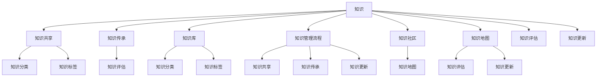

                 

# 团队知识管理：促进经验分享与传承的方法

关键词：知识管理、经验分享、知识传承、团队协作、技术博客

摘要：本文旨在深入探讨团队知识管理的重要性及其具体实施方法，通过详细分析知识管理的核心概念、技术手段和实际案例，为团队促进经验分享与传承提供实用的策略和建议。

## 1. 背景介绍

### 1.1 知识管理的重要性

在当今快速发展的信息时代，知识已经成为组织竞争的核心资源。然而，很多团队在知识管理方面仍存在诸多问题。首先，知识分散化严重，员工的知识往往局限于个人经验，难以共享和传承。其次，知识获取和传递效率低下，导致团队成员在解决问题和决策时耗时耗力。最后，缺乏系统化的知识管理体系，使得知识流失和遗忘现象频繁发生。

### 1.2 知识管理的现状

目前，团队知识管理面临以下问题：

- **知识孤岛**：团队成员的知识分散在不同个体和部门，难以整合和利用。
- **信息过载**：大量的信息和知识无法有效筛选和分类，导致团队成员难以找到所需信息。
- **知识遗忘**：缺乏有效的知识传承机制，导致关键知识和经验随员工离职而流失。

### 1.3 知识管理的目标

团队知识管理的目标主要包括以下几个方面：

- **知识共享**：促进团队成员之间的知识交流和分享，提高知识利用效率。
- **知识传承**：建立系统化的知识传承机制，确保关键知识和经验得以传递和保留。
- **知识创新**：激发团队成员的创新能力，推动组织持续发展。

### 1.4 团队知识管理的概念与范畴

团队知识管理是指通过系统化的方法，对团队内部的知识进行收集、整理、存储、共享、传承和创新，以最大化知识价值和促进团队协作的过程。其范畴包括以下几个方面：

- **知识获取**：通过内外部渠道获取有价值的信息和知识。
- **知识整理**：对获取的知识进行分类、筛选和整理，形成有序的知识体系。
- **知识存储**：建立高效的知识存储和检索系统，确保知识随时可查。
- **知识共享**：通过多种方式促进团队成员之间的知识交流和共享。
- **知识传承**：建立系统化的知识传承机制，确保知识在团队成员之间传递和保留。
- **知识创新**：激发团队成员的创新能力，推动组织持续发展。

## 2. 核心概念与联系

### 2.1 知识

知识是指通过学习、实践和体验所获得的信息、技能和经验。在团队知识管理中，知识是核心资源，其获取、整理、存储、共享和传承是知识管理的关键环节。

### 2.2 知识共享

知识共享是指团队成员之间通过交流和协作，将各自的知识和经验进行传递和共享，以实现知识增值和团队协作的目标。

### 2.3 知识传承

知识传承是指通过系统化的方法，将团队成员的关键知识和经验传递给新员工或继任者，确保团队知识得以延续和传承。

### 2.4 ER图展示概念之间的关系

下面是一个简单的ER图，展示知识管理中的核心概念及其关系：

```mermaid
erDiagram
  Knowledge ||--|{ Knowledge_Sharing } : 实现知识传递
  Knowledge ||--|{ Knowledge_Transfer } : 实现知识传承
  Knowledge ||--|{ Knowledge_Innovation } : 推动知识创新
  Knowledge_Sharing ||--|{ Collaboration } : 促进团队协作
  Knowledge_Transfer ||--|{ Training } : 实现知识培训
  Knowledge_Innovation ||--|{ Innovation_Culture } : 营造创新氛围
```

## 3. 团队知识管理方法

### 3.1 知识库建设

知识库是团队知识管理的重要工具，用于存储和分类团队成员的知识和经验。知识库的建设主要包括以下步骤：

1. **需求分析**：了解团队成员的知识需求和知识类型，为知识库的设计提供依据。
2. **知识分类**：对知识进行分类和标签化，方便团队成员快速查找和共享。
3. **知识整理**：对获取的知识进行整理和提炼，确保知识的准确性和实用性。
4. **知识存储**：建立高效的知识存储系统，确保知识随时可查。
5. **知识更新**：定期更新知识库中的内容，确保知识的时效性和准确性。

### 3.2 知识共享平台

知识共享平台是团队知识管理的重要载体，用于促进团队成员之间的知识交流和共享。知识共享平台的建设主要包括以下方面：

1. **平台设计**：设计符合团队需求和习惯的知识共享平台，确保易用性。
2. **功能模块**：包括知识发布、知识搜索、知识评论、知识推荐等功能。
3. **互动机制**：鼓励团队成员积极参与知识共享，通过点赞、评论、分享等方式激发知识活力。
4. **激励机制**：建立知识共享激励机制，鼓励团队成员分享知识和经验。

### 3.3 知识管理流程

知识管理流程是团队知识管理的关键环节，用于规范团队成员的知识获取、整理、存储、共享和传承的过程。知识管理流程主要包括以下步骤：

1. **知识获取**：团队成员通过内外部渠道获取有价值的信息和知识。
2. **知识整理**：对获取的知识进行分类、筛选和整理，形成有序的知识体系。
3. **知识存储**：将整理后的知识存储到知识库中，确保知识随时可查。
4. **知识共享**：通过知识共享平台促进团队成员之间的知识交流和共享。
5. **知识传承**：通过培训、文档编写等方式将关键知识和经验传递给新员工或继任者。
6. **知识创新**：激发团队成员的创新能力，推动组织持续发展。

### 3.4 知识培训

知识培训是团队知识管理的重要手段，用于提升团队成员的知识水平和技能。知识培训主要包括以下方面：

1. **培训需求分析**：了解团队成员的培训需求，制定培训计划。
2. **培训内容设计**：根据培训需求，设计符合团队需求的培训内容。
3. **培训形式选择**：选择适合团队的培训形式，如线上培训、线下培训、工作坊等。
4. **培训效果评估**：对培训效果进行评估，持续优化培训内容和方法。

## 4. 技术手段

### 4.1 人工智能

人工智能技术在团队知识管理中具有广泛应用，如：

- **自然语言处理**：用于知识提取、知识分类、知识搜索等。
- **机器学习**：用于知识推荐、知识预测等。
- **计算机视觉**：用于知识图像识别、知识可视化等。

### 4.2 大数据

大数据技术在团队知识管理中可以用于：

- **知识挖掘**：从大量数据中提取有价值的信息和知识。
- **知识分析**：对知识进行深度分析和挖掘，发现知识之间的关系和规律。

### 4.3 云计算

云计算技术在团队知识管理中可以提供以下支持：

- **知识存储和检索**：利用云存储技术，实现海量知识的存储和快速检索。
- **知识共享和协作**：利用云计算平台，实现团队成员之间的实时协作和知识共享。

## 5. 案例分析

### 5.1 案例背景

某大型互联网公司，团队规模庞大，成员分布在全球各地。在知识管理方面，该公司面临以下挑战：

- **知识分散**：团队成员的知识分散在不同地区和部门，难以共享和利用。
- **信息过载**：大量的信息和知识无法有效筛选和分类，导致团队成员难以找到所需信息。
- **知识流失**：关键知识和经验随员工离职而流失，对公司业务发展造成影响。

### 5.2 案例实施

为解决上述问题，该公司采取了以下措施：

1. **知识库建设**：建立企业级知识库，将团队成员的知识进行整理和存储，实现知识的集中管理和快速检索。
2. **知识共享平台**：搭建知识共享平台，鼓励团队成员积极分享知识和经验，通过互动和激励机制提高知识活力。
3. **知识管理流程**：制定知识管理流程，规范团队成员的知识获取、整理、存储、共享和传承的过程。
4. **知识培训**：定期开展知识培训，提升团队成员的知识水平和技能。

### 5.3 案例效果

通过实施团队知识管理，该公司取得了显著的效果：

- **知识共享和协作**：团队成员之间的知识共享和协作显著提升，工作效率大幅提高。
- **知识传承和保留**：关键知识和经验得到有效传承和保留，员工离职对业务发展的影响降低。
- **知识创新和竞争力**：激发团队成员的创新能力，推动公司持续发展。

## 6. 最佳实践

### 6.1 知识共享平台设计

- **易用性**：设计简洁直观的界面，方便团队成员快速上手。
- **功能模块**：包括知识发布、知识搜索、知识评论、知识推荐等。
- **互动机制**：鼓励团队成员积极参与知识共享，设置点赞、评论、分享等功能。
- **激励机制**：建立知识共享激励机制，对积极分享知识的成员给予奖励。

### 6.2 知识管理流程规范

- **知识获取**：制定明确的知识获取渠道和标准，确保知识的准确性和实用性。
- **知识整理**：对获取的知识进行分类、筛选和整理，形成有序的知识体系。
- **知识存储**：建立高效的知识存储和检索系统，确保知识随时可查。
- **知识共享**：通过知识共享平台促进团队成员之间的知识交流和共享。
- **知识传承**：制定知识传承计划，通过培训、文档编写等方式将关键知识和经验传递给新员工或继任者。
- **知识创新**：鼓励团队成员积极参与知识创新，推动组织持续发展。

### 6.3 知识培训策略

- **培训需求分析**：了解团队成员的培训需求，制定针对性的培训计划。
- **培训内容设计**：根据培训需求，设计符合团队需求的培训内容。
- **培训形式选择**：选择适合团队的培训形式，如线上培训、线下培训、工作坊等。
- **培训效果评估**：对培训效果进行评估，持续优化培训内容和方法。

## 7. 总结与展望

### 7.1 总结

本文从团队知识管理的重要性、核心概念、方法、技术手段、案例分析和最佳实践等方面进行了全面探讨。通过实施团队知识管理，可以显著提升团队的知识共享和协作效率，促进知识传承和创新，提高组织的核心竞争力。

### 7.2 展望

未来，团队知识管理将继续向智能化、大数据化和云计算化发展。人工智能、大数据和云计算等新兴技术的应用，将为团队知识管理提供更加高效和智能的支持。同时，随着信息技术的发展，团队知识管理的方法和手段也将不断更新和完善，为团队的发展提供更强有力的支持。

## 作者信息

作者：AI天才研究院/AI Genius Institute & 禅与计算机程序设计艺术 /Zen And The Art of Computer Programming

---

通过本文的深入探讨，相信读者对团队知识管理有了更全面的认识。希望本文能为团队在知识管理方面提供有益的参考和启示。在未来的工作中，让我们共同努力，推动团队知识管理的发展，为组织的持续创新和竞争力提升贡献力量。### 1. 背景介绍

#### 1.1 知识管理的重要性

在信息化和全球化迅速发展的今天，知识已经成为组织竞争的核心资源。对于企业而言，知识不仅包括显性的技术文档、数据报表等，更涵盖了员工的隐性经验、专业技能和创新能力。这些知识是企业在市场竞争中立足和发展的基石。

首先，知识管理能够提高团队的协作效率。在一个知识管理的体系下，团队成员可以方便地获取和利用他人的经验，避免重复劳动，从而提高工作效率。例如，当一位团队成员遇到技术难题时，可以通过知识共享平台查找相关的解决方案，而不是从头开始摸索。

其次，知识管理有助于知识的传承。企业中的老员工可能会离职，带走宝贵的经验和知识。通过知识管理，可以将这些经验和知识记录下来，培训给新员工，确保团队的知识不会因为人员的变动而流失。

再者，知识管理能够促进创新。当团队成员可以轻松地分享和交流各自的知识时，创新思维会得到激发，新的想法和解决方案会层出不穷。这种创新氛围有助于企业在激烈的市场竞争中保持优势。

然而，当前许多团队在知识管理方面仍面临诸多挑战。首先，知识分散化严重，团队成员的知识往往局限于个人经验，难以共享和传承。其次，信息过载现象普遍，大量的信息和知识无法有效筛选和分类，导致团队成员难以找到所需信息。最后，缺乏系统化的知识管理体系，使得知识流失和遗忘现象频繁发生。

#### 1.2 知识管理的现状

目前，团队知识管理面临以下问题：

- **知识孤岛**：团队成员的知识分散在不同个体和部门，难以整合和利用。这种现象往往导致信息孤岛，各个团队之间缺乏有效的沟通和协作。
- **信息过载**：随着信息技术的发展，团队成员面临的海量和繁杂的信息不断增加，但有效的筛选和分类机制尚未建立，导致信息查找困难，工作效率降低。
- **知识遗忘**：企业缺乏系统化的知识传承机制，导致关键知识和经验随员工离职而流失。这种现象不仅影响了团队的正常运作，还可能导致企业竞争力的下降。

#### 1.3 知识管理的目标

团队知识管理的目标主要包括以下几个方面：

- **知识共享**：通过构建知识共享平台和制定知识共享政策，鼓励团队成员积极分享和交流知识，实现知识的最大化利用。
- **知识传承**：建立系统化的知识传承机制，通过培训、文档编写、知识库建设等方式，确保关键知识和经验得以传递和保留。
- **知识创新**：激发团队成员的创新能力，推动组织持续发展。通过知识管理和创新机制的结合，不断产生新的知识和成果。

#### 1.4 团队知识管理的概念与范畴

团队知识管理是指通过系统化的方法，对团队内部的知识进行收集、整理、存储、共享、传承和创新，以最大化知识价值和促进团队协作的过程。其范畴包括以下几个方面：

- **知识获取**：通过内外部渠道获取有价值的信息和知识。这包括市场调研、竞争对手分析、员工培训等。
- **知识整理**：对获取的知识进行分类、筛选和整理，形成有序的知识体系。这一步骤有助于提高知识的可访问性和可用性。
- **知识存储**：建立高效的知识存储和检索系统，确保知识随时可查。常见的知识存储方式包括知识库、文档管理系统、共享文件夹等。
- **知识共享**：通过多种方式促进团队成员之间的知识交流和共享。这包括知识共享平台、会议、工作坊、电子邮件等。
- **知识传承**：建立系统化的知识传承机制，通过培训、文档编写等方式，将关键知识和经验传递给新员工或继任者。确保团队知识得以延续和传承。
- **知识创新**：激发团队成员的创新能力，推动组织持续发展。通过知识管理和创新机制的结合，不断产生新的知识和成果。

团队知识管理的实施不仅有助于提高团队的工作效率和创新能力，还能增强组织的核心竞争力。在接下来的章节中，我们将详细探讨团队知识管理的核心概念、方法和技术手段，帮助团队有效地实施知识管理，促进经验分享与传承。

### 2. 核心概念与联系

在探讨团队知识管理的过程中，理解其核心概念和它们之间的联系是至关重要的。以下是团队知识管理中几个关键概念的定义及其相互关系。

#### 2.1 知识

知识是团队知识管理的核心，它包括显性知识和隐性知识。显性知识是可以通过文字、图像、音频和视频等形式表达和传播的知识，如技术文档、研究报告等。隐性知识则是指难以用语言表达的个人经验、技能和直觉。隐性知识往往需要通过个人之间的互动和交流来传递。

#### 2.2 知识共享

知识共享是指团队成员通过各种渠道和方式，将各自的知识和经验传递给他人的过程。知识共享的目的是最大化知识的利用价值，提高团队的协作效率。知识共享的形式包括正式的（如培训、研讨会）和非正式的（如团队讨论、社交互动）。

#### 2.3 知识传承

知识传承是确保团队知识持续传递和保留的重要机制。它通过系统化的方法，将老员工的隐性经验和技能传授给新员工，确保团队知识不会因人员变动而流失。知识传承的形式包括内部培训、文档编写、导师制等。

#### 2.4 知识库

知识库是团队知识管理的重要工具，用于存储和分类团队成员的知识和经验。知识库通常包括文档管理、数据仓库和知识地图等功能，使得知识能够高效地检索和使用。知识库的建立有助于知识共享和知识传承。

#### 2.5 知识管理流程

知识管理流程是指从知识获取、知识整理、知识存储、知识共享到知识传承的一系列规范化和系统化的操作。一个有效的知识管理流程能够确保知识在整个生命周期内得到充分利用。

#### 2.6 ER图展示概念之间的关系

为了更直观地展示这些概念之间的关系，我们可以使用ER图（实体-关系图）来描述。下面是一个简单的ER图，展示了知识管理中的核心概念及其关系：

```mermaid
erDiagram
  Knowledge ||--|{ Knowledge_Sharing } : 实现知识传递
  Knowledge ||--|{ Knowledge_Transfer } : 实现知识传承
  Knowledge ||--|{ Knowledge_Base } : 存储知识
  Knowledge_Sharing ||--|{ Collaboration } : 促进团队协作
  Knowledge_Transfer ||--|{ Training } : 实现知识培训
  Knowledge_Base ||--|{ Knowledge_Map } : 知识导航
  Knowledge_Map ||--|{ Knowledge_Search } : 提供检索功能
```

在这个ER图中，知识是核心实体，它通过知识共享和知识传承实现传递和保留。知识库作为知识存储的中心，与知识地图和知识搜索紧密相连，提供高效的知识管理和检索功能。知识共享和知识传承则是知识管理的两大关键环节，通过协作和培训来推动知识的流动和积累。

通过这个ER图，我们可以清晰地看到知识管理各个核心概念之间的相互关系，这有助于我们理解和设计一个有效的知识管理体系。

#### 2.7 知识管理中的关键概念与联系

在团队知识管理中，除了核心概念，还有一些辅助概念同样重要，它们与核心概念紧密联系，共同构成了完整的知识管理框架。以下是对这些关键概念的详细说明及其关系：

##### 2.7.1 知识分类

知识分类是指对知识进行系统化分类的过程，以便于知识的组织和检索。知识分类有助于团队成员快速找到所需信息。常见的分类方法包括按主题、按类型、按功能等。

**关系**：知识分类是知识整理和存储的基础，它使得知识库中的知识更加结构化和有序，提高了知识检索的效率。

##### 2.7.2 知识标签

知识标签是对知识进行标记和分类的一种方式，它允许用户使用关键字或标签来标识和查找知识。知识标签可以帮助团队成员快速定位相关内容，增强知识的可发现性。

**关系**：知识标签与知识分类相辅相成，标签提供了灵活的、多维度分类方式，而分类则为标签提供了结构和层次。

##### 2.7.3 知识评估

知识评估是指对知识的价值、准确性、时效性等进行评估的过程。评估结果可以帮助团队成员了解知识的可靠性和适用性，从而做出更明智的决策。

**关系**：知识评估是知识共享和知识传承的重要依据，它确保了知识的质量和适用性，促进了知识的有效传播和应用。

##### 2.7.4 知识更新

知识更新是指定期对知识库中的知识进行审查、更新和补充的过程。随着时间和环境的变化，知识可能会变得不准确或过时，因此知识更新是保持知识库活力和准确性的关键。

**关系**：知识更新与知识评估紧密相关，评估结果指导更新方向，而更新过程则确保知识库中的知识始终是最新的。

##### 2.7.5 知识地图

知识地图是一种可视化工具，用于展示团队内部知识结构和关系。它可以帮助团队成员了解知识的整体结构，找到相关知识，促进知识的理解和应用。

**关系**：知识地图是知识分类和知识标签的扩展，它提供了更高层次的视角，帮助团队从宏观上理解和利用知识。

##### 2.7.6 知识社区

知识社区是指团队成员通过共同兴趣和目标建立起来的知识交流和分享的平台。知识社区鼓励成员积极参与知识共享，提升团队的凝聚力和知识管理水平。

**关系**：知识社区是知识共享和知识传承的重要载体，它为团队成员提供了一个交流和互动的空间，促进了知识的流动和积累。

综合来看，这些辅助概念与核心概念相互支持，共同构成了一个完整的知识管理体系。知识分类和标签确保知识的有序性和可发现性，知识评估和更新确保知识的准确性和时效性，知识地图和知识社区则为知识的流动和共享提供了有效的平台和机制。通过这些概念的结合和相互作用，团队可以实现高效的知识管理，提升整体竞争力。

#### 2.8 知识管理的核心概念与联系

在深入探讨团队知识管理的过程中，理解其核心概念和它们之间的联系至关重要。以下是知识管理中几个关键概念的定义及其相互关系：

**知识**：知识是团队知识管理的核心，它既包括显性知识（如文档、数据等），也包括隐性知识（如经验、技能等）。显性知识容易被记录和传播，而隐性知识则依赖于个人经验和直觉。

**知识共享**：知识共享是指团队成员通过各种渠道和方式，将各自的知识和经验传递给他人的过程。知识共享有助于提高团队整体的知识水平和工作效率。

**知识传承**：知识传承是指通过系统化的方法，将团队中老员工的经验和技能传递给新员工或继任者的过程。这有助于确保团队知识不会因员工离职而流失。

**知识库**：知识库是团队知识管理的重要工具，用于存储和分类团队成员的知识和经验。知识库不仅提供了一个集中的知识存储场所，还使得知识的检索和利用变得更加高效。

**知识管理流程**：知识管理流程是确保知识在整个生命周期内得到有效管理和利用的一系列规范化和系统化的操作。这包括知识获取、知识整理、知识存储、知识共享和知识传承等环节。

**知识社区**：知识社区是指团队成员通过共同兴趣和目标建立起来的知识交流和分享的平台。知识社区鼓励成员积极参与知识共享，提升团队的凝聚力和知识管理水平。

**知识地图**：知识地图是一种可视化工具，用于展示团队内部的知识结构和关系。知识地图帮助团队成员理解知识的整体结构，找到相关知识点，促进知识的理解和应用。

**知识评估**：知识评估是指对知识的价值、准确性、时效性等进行评估的过程。评估结果帮助团队成员了解知识的可靠性和适用性，从而做出更明智的决策。

**知识更新**：知识更新是指定期对知识库中的知识进行审查、更新和补充的过程。知识更新是保持知识库活力和准确性的关键。

**知识分类**：知识分类是指对知识进行系统化分类的过程，以便于知识的组织和检索。知识分类有助于团队成员快速找到所需信息。

**知识标签**：知识标签是对知识进行标记和分类的一种方式，它允许用户使用关键字或标签来标识和查找知识。知识标签增强了知识的可发现性和灵活性。

**知识地图（Mermaid流程图）**：



在这个ER图中，知识作为核心，通过知识共享、知识传承、知识库、知识管理流程等环节，实现了知识的流动和积累。知识社区和知识地图为知识的交流和可视化提供了平台，知识评估和知识更新则确保了知识的准确性和时效性。知识分类和标签使得知识的组织和检索更加高效。

通过理解这些核心概念及其相互关系，团队可以构建一个完整的知识管理体系，促进知识的共享、传承和创新，提高整体竞争力。

### 3. 团队知识管理方法

团队知识管理的核心在于如何有效地促进知识的获取、共享、传承和创新。为了实现这一目标，团队可以采用多种方法，以下将详细介绍几种常见的方法。

#### 3.1 知识库建设

知识库是团队知识管理的重要工具，用于存储和分类团队成员的知识和经验。一个有效的知识库应该具备以下几个关键要素：

1. **内容丰富**：知识库应涵盖团队成员在不同业务领域、技术领域和项目中的知识和经验，确保知识的全面性和多样性。
2. **分类清晰**：知识库中的内容应按照主题、类型、项目等维度进行分类，方便团队成员快速查找和利用。
3. **检索便捷**：知识库应提供强大的搜索功能，使得团队成员可以快速定位所需的知识点。
4. **更新及时**：知识库的内容需要定期更新，确保知识的时效性和准确性。
5. **权限管理**：知识库应设置合理的权限管理机制，确保不同级别的员工可以访问和利用相应的知识。

**知识库建设步骤**：

1. **需求分析**：了解团队成员的知识需求，确定知识库所需涵盖的内容和分类方式。
2. **内容收集**：通过内部调研、访谈等方式，收集团队成员的知识和经验，将其整理并输入知识库。
3. **分类整理**：对收集的知识进行分类整理，确保知识的条理性和系统性。
4. **系统搭建**：选择合适的知识库系统，搭建知识库平台，配置搜索和权限管理等功能。
5. **培训推广**：对团队成员进行知识库使用的培训，确保他们能够熟练操作和利用知识库。

#### 3.2 知识共享平台

知识共享平台是促进团队成员之间知识交流和共享的重要工具。一个有效的知识共享平台应具备以下特点：

1. **易用性**：平台设计应简洁直观，方便团队成员快速上手和使用。
2. **多样化功能**：包括知识发布、知识搜索、知识评论、知识推荐等功能，满足团队成员的多样化需求。
3. **互动机制**：鼓励团队成员积极参与知识共享，通过点赞、评论、分享等方式激发知识活力。
4. **激励机制**：建立知识共享激励机制，对积极分享知识的成员给予奖励，提高知识共享的积极性。

**知识共享平台建设步骤**：

1. **需求分析**：了解团队成员的知识共享需求，确定平台的功能和设计方向。
2. **平台设计**：设计符合团队需求和习惯的知识共享平台，确保平台的易用性和功能完整性。
3. **功能模块开发**：开发知识发布、知识搜索、知识评论、知识推荐等核心功能模块。
4. **互动和激励机制**：设计互动和激励机制，鼓励团队成员积极参与知识共享。
5. **平台推广和使用**：对团队成员进行平台使用的推广和培训，确保平台得到广泛应用。

#### 3.3 知识管理流程

知识管理流程是确保知识在整个生命周期内得到有效管理和利用的重要手段。一个完善的知识管理流程应包括以下几个环节：

1. **知识获取**：通过内部调研、外部学习、项目总结等方式，收集和获取有价值的信息和知识。
2. **知识整理**：对获取的知识进行分类、筛选和整理，确保知识的准确性和实用性。
3. **知识存储**：将整理后的知识存储到知识库或知识共享平台中，确保知识的可访问性和可检索性。
4. **知识共享**：通过知识库、知识共享平台、会议、邮件等方式，促进团队成员之间的知识交流和共享。
5. **知识传承**：通过培训、文档编写、导师制等方式，将关键知识和经验传递给新员工或继任者。
6. **知识创新**：激发团队成员的创新能力，通过知识共享和创新机制，推动组织持续发展。

**知识管理流程设计步骤**：

1. **流程规划**：根据团队实际情况，设计知识管理的基本流程和步骤。
2. **流程实施**：制定详细的实施计划，包括时间节点、责任分工、资源分配等。
3. **流程优化**：在实施过程中，不断收集反馈，优化流程，提高知识管理的效率和质量。
4. **流程监督**：建立监督机制，确保知识管理流程得到有效执行和持续改进。

#### 3.4 知识培训

知识培训是提升团队成员知识水平和技能的重要手段。通过系统化的知识培训，可以帮助团队成员掌握所需的知识和技能，提高工作效率和团队整体竞争力。

**知识培训策略**：

1. **培训需求分析**：了解团队成员的培训需求，确定培训内容和目标。
2. **培训内容设计**：根据培训需求，设计符合团队需求的培训课程，确保内容的实用性和针对性。
3. **培训形式选择**：选择适合团队的培训形式，如线上培训、线下培训、工作坊等。
4. **培训实施**：按照培训计划，开展培训活动，确保培训效果。
5. **培训效果评估**：对培训效果进行评估，收集反馈，持续优化培训内容和方法。

#### 3.5 知识社区

知识社区是促进团队成员之间知识交流和分享的重要平台。通过建立知识社区，可以增强团队的凝聚力，提高知识共享的积极性。

**知识社区建设步骤**：

1. **社区规划**：根据团队特点和需求，规划知识社区的功能和布局。
2. **社区搭建**：选择合适的社区平台，搭建知识社区，配置讨论区、博客、问答等功能。
3. **活动策划**：策划和组织知识社区活动，如知识竞赛、分享会、研讨会等，激发社区活力。
4. **社区推广**：对团队成员进行社区推广，鼓励他们积极参与知识社区活动。
5. **社区管理**：建立社区管理团队，负责社区的内容审核、活动策划和运营。

通过以上方法，团队可以有效地促进知识的获取、共享、传承和创新，提升整体知识管理水平，为组织的持续发展提供强有力的支持。

#### 3.6 知识库建设

知识库是团队知识管理的重要组成部分，它为团队成员提供了一个集中、系统、易于访问的知识存储和检索平台。以下是知识库建设的详细步骤：

**1. 需求分析**

首先，团队需要明确知识库的需求。这包括确定知识库的目标、所需涵盖的主题、知识类别、预计的用户群体等。需求分析可以通过以下方式开展：

- **问卷调查**：通过问卷调查了解团队成员对知识库的需求，如他们希望获取哪些类型的信息，以及他们希望知识库具有哪些功能。
- **访谈调研**：与团队成员进行一对一访谈，深入了解他们对知识管理的期望和需求。
- **工作流程分析**：分析现有工作流程，识别在知识管理和传递过程中的痛点和需求。

**2. 内容收集**

在明确需求后，团队需要开始收集知识库的内容。内容收集可以包括以下几个方面：

- **内部知识**：从团队成员的经验分享、项目总结、技术文档、工作指南等中提取知识。
- **外部知识**：从行业报告、学术论文、市场分析等外部来源中获取相关知识。
- **数据挖掘**：通过数据分析和挖掘，提取出隐藏在数据中的有用知识。

**3. 内容整理**

收集到的知识需要经过整理，以确保其结构化、系统化。内容整理包括以下几个步骤：

- **分类**：根据知识的内容和用途，对其进行分类。例如，可以将知识分为技术知识、管理知识、市场知识等。
- **标签**：为每个知识条目添加适当的标签，方便用户通过关键词进行检索。
- **提炼**：对知识进行提炼，提取出核心观点和关键信息，去除冗余和无关内容。

**4. 系统搭建**

选择合适的知识库系统，搭建知识库平台。知识库系统应具备以下功能：

- **内容存储**：能够存储大量的知识条目，并提供灵活的内容结构。
- **搜索功能**：提供高效的搜索算法，帮助用户快速找到所需知识。
- **权限管理**：实现知识权限的管理，确保不同级别的用户可以访问相应的知识。
- **用户交互**：支持用户对知识条目的评论、分享、点赞等功能，促进知识互动和交流。

**5. 功能配置**

在知识库系统搭建完成后，进行功能配置：

- **分类管理**：配置知识分类的层级结构，确保知识条目的分类清晰、系统。
- **标签管理**：配置知识标签的体系，方便用户通过标签进行知识检索。
- **权限设置**：根据团队成员的角色和职责，设置不同的访问权限，确保知识的安全和合规。
- **用户管理**：配置用户管理系统，包括用户注册、登录、权限管理等功能。

**6. 培训与推广**

为了确保知识库的有效使用，需要对团队成员进行培训。培训内容包括知识库的基本操作、搜索技巧、内容提交和审核等。通过培训，提高团队成员对知识库的认知和使用能力。

此外，还需要制定知识库推广策略，鼓励团队成员积极参与知识库的建设和使用。推广策略可以包括：

- **内部宣传**：通过公司内部邮件、公告板、内部网站等渠道，宣传知识库的重要性和使用方法。
- **激励机制**：设立知识库贡献奖励制度，对积极参与知识库建设和分享知识的成员给予奖励。
- **应用场景**：在实际工作中，引导团队成员利用知识库解决问题，提高知识库的应用频率。

通过以上步骤，团队可以构建一个功能完善、内容丰富、易于使用和管理的知识库，为团队成员提供强大的知识支持，促进团队知识的获取、共享、传承和创新。

#### 3.7 知识共享平台

知识共享平台是团队知识管理的重要组成部分，它通过多种方式促进团队成员之间的知识交流和共享。以下是知识共享平台建设的详细步骤：

**1. 需求分析**

首先，团队需要明确知识共享平台的需求。这可以通过以下方式开展：

- **问卷调查**：通过问卷调查收集团队成员对知识共享平台的期望和需求，了解他们希望平台具备哪些功能。
- **访谈调研**：与团队成员进行一对一访谈，深入了解他们对知识共享的需求和痛点。
- **需求分析报告**：基于问卷调查和访谈结果，编写需求分析报告，明确知识共享平台的功能和设计方向。

**2. 平台设计**

在明确需求后，进行知识共享平台的设计。平台设计应考虑以下要素：

- **界面设计**：设计简洁直观的界面，方便团队成员快速上手和使用。
- **功能模块**：确定平台的功能模块，如知识发布、知识搜索、知识评论、知识推荐等。
- **用户角色**：定义不同的用户角色，如管理员、普通用户、知识贡献者等，确保权限和功能的合理性。
- **技术选型**：选择合适的开发框架和技术栈，确保平台的性能和稳定性。

**3. 功能开发**

根据平台设计，进行功能模块的开发：

- **知识发布**：开发知识发布功能，允许用户上传和发布知识条目，包括文档、图片、视频等多种形式。
- **知识搜索**：开发高效的搜索功能，支持用户通过关键词、标签等多种方式检索知识。
- **知识评论**：开发评论功能，允许用户对知识条目进行评论，促进知识互动和交流。
- **知识推荐**：开发推荐算法，根据用户的浏览历史和兴趣，推荐相关知识和热门内容。

**4. 互动机制**

设计有效的互动机制，鼓励团队成员积极参与知识共享：

- **点赞机制**：用户可以对知识条目进行点赞，表达对知识的认可和支持。
- **评论机制**：用户可以对知识条目发表评论，提出问题或分享心得，促进知识的深入讨论。
- **分享机制**：用户可以将知识条目分享到其他社交媒体平台，扩大知识的传播范围。
- **反馈机制**：设置反馈渠道，收集用户对知识共享平台的使用反馈，持续优化平台功能。

**5. 激励机制**

建立激励机制，鼓励团队成员积极参与知识共享：

- **积分奖励**：为积极参与知识共享的用户发放积分，积分可以用于兑换奖品或享受平台特权。
- **荣誉榜**：设立荣誉榜，展示知识贡献者的贡献和成就，提高其知名度和认可度。
- **表彰活动**：定期举办知识共享表彰活动，对表现突出的知识贡献者进行表彰和奖励。

**6. 平台推广**

为了确保知识共享平台的有效使用，需要进行平台推广：

- **内部宣传**：通过公司内部邮件、公告板、内部网站等渠道，宣传知识共享平台的重要性和使用方法。
- **培训推广**：对团队成员进行知识共享平台使用的培训，提高他们的认知和使用能力。
- **应用场景**：在实际工作中，引导团队成员利用知识共享平台解决问题，提高平台的应用频率。
- **跨部门合作**：鼓励不同部门之间通过知识共享平台进行交流和合作，促进知识的跨部门流动。

通过以上步骤，团队可以构建一个功能完善、互动性强、激励机制健全的知识共享平台，有效促进团队成员之间的知识交流和共享，提升团队的知识管理水平。

#### 3.8 知识管理流程

知识管理流程是确保知识在整个生命周期内得到有效管理和利用的重要手段。一个完善的知识管理流程应包括以下几个关键环节：

**1. 知识获取**

知识获取是知识管理的起点，团队需要通过多种途径获取内外部的知识资源。这包括：

- **内部知识**：从团队成员的经验分享、项目总结、技术文档、工作指南等中提取知识。
- **外部知识**：从行业报告、学术论文、市场分析等外部来源中获取相关知识。
- **数据挖掘**：通过数据分析和挖掘，提取出隐藏在数据中的有用知识。

**2. 知识整理**

在获取到知识后，需要进行分类、筛选和整理，以确保知识的准确性和实用性。具体步骤如下：

- **分类**：根据知识的内容和用途，对其进行分类。例如，可以将知识分为技术知识、管理知识、市场知识等。
- **筛选**：对获取的知识进行筛选，去除冗余和无关内容，保留有价值的知识点。
- **提炼**：对知识进行提炼，提取出核心观点和关键信息，去除冗余内容。

**3. 知识存储**

将整理后的知识存储到知识库或知识共享平台中，确保知识的可访问性和可检索性。存储过程中应注意以下几点：

- **结构化**：采用结构化存储方式，确保知识条目的条理性和系统化。
- **标准化**：制定知识条目的命名和格式标准，确保知识的一致性和规范性。
- **安全性**：确保知识库或平台的安全性，防止知识泄露和未经授权的访问。

**4. 知识共享**

通过多种渠道和方式，促进团队成员之间的知识交流和共享。具体措施包括：

- **知识库**：通过知识库提供知识检索和访问功能，方便团队成员快速找到所需知识。
- **知识共享平台**：通过知识共享平台，促进团队成员的知识交流和互动。
- **培训**：定期组织培训，帮助团队成员掌握所需的知识和技能。
- **会议**：在会议中分享知识和经验，促进团队成员之间的交流。

**5. 知识传承**

确保团队知识在成员之间得到有效传递和保留。具体措施包括：

- **导师制**：通过导师制度，将老员工的经验和知识传授给新员工。
- **文档编写**：将关键知识和经验编写成文档，确保知识的长期保存和传递。
- **知识库**：将整理后的知识存储到知识库中，确保知识在团队内部得到持续传承。

**6. 知识更新**

定期对知识库中的知识进行审查、更新和补充，确保知识的时效性和准确性。具体步骤如下：

- **审查**：定期对知识库中的知识进行审查，识别出过时或不准确的知识条目。
- **更新**：对识别出的过时或不准确的知识条目进行更新，确保知识的准确性和实用性。
- **补充**：根据团队的实际需求和外部环境的变化，补充新的知识内容。

**7. 知识创新**

激发团队成员的创新能力，通过知识管理和创新机制的结合，推动组织持续发展。具体措施包括：

- **知识分享**：鼓励团队成员分享新的想法和解决方案，促进知识的交流和碰撞。
- **创新竞赛**：定期举办创新竞赛，激发团队成员的创新潜力。
- **知识社区**：建立知识社区，为团队成员提供交流和互动的平台，促进知识的共享和创新。

通过以上环节，团队可以构建一个系统化、规范化的知识管理流程，确保知识的获取、整理、存储、共享、传承和创新得到有效管理，提高团队的知识管理水平，为组织的持续发展提供强有力的支持。

#### 3.9 知识培训

知识培训是团队知识管理的重要组成部分，通过系统化的知识培训，可以提升团队成员的知识水平和技能，提高工作效率和团队整体竞争力。以下是知识培训的详细策略：

**1. 培训需求分析**

在开展知识培训之前，团队需要明确培训需求。这可以通过以下方式实现：

- **问卷调查**：通过问卷调查收集团队成员对知识培训的需求，包括他们希望学习的内容、形式和频率等。
- **访谈调研**：与团队成员进行一对一访谈，深入了解他们的知识需求和培训期望。
- **岗位分析**：分析团队成员的岗位职责和工作内容，确定他们需要具备的知识和技能。

**2. 培训内容设计**

根据培训需求，设计符合团队需求的培训课程。培训内容应包括：

- **基础技能培训**：针对团队成员的基础技能，如计算机操作、办公软件使用等。
- **专业知识和技能培训**：针对团队成员所在领域的专业知识，如技术培训、行业知识等。
- **软技能培训**：提升团队成员的沟通、协作、解决问题的能力。

**3. 培训形式选择**

选择适合团队的培训形式，以提高培训效果。常见的培训形式包括：

- **线上培训**：通过在线学习平台，提供灵活的学习时间和地点，适合分散在不同地点的团队成员。
- **线下培训**：组织集中培训，通过讲师授课、互动讨论、实践操作等方式，提高培训效果。
- **工作坊**：通过实际操作和互动，提高团队成员的实践能力。
- **外部培训**：组织团队成员参加外部专业培训课程，获取更深入的专业知识。

**4. 培训实施**

按照培训计划，开展培训活动。培训实施过程中需要注意以下几点：

- **明确培训目标**：确保每个培训活动都有明确的学习目标，便于评估培训效果。
- **合理分配时间**：合理安排培训时间，确保团队成员有足够的时间参与培训，不影响日常工作。
- **互动环节**：在培训过程中，设置互动环节，如提问、讨论、案例分析等，提高学员的参与度和学习效果。
- **讲师选择**：选择具备丰富经验和专业知识的讲师，确保培训内容的质量和实用性。

**5. 培训效果评估**

对培训效果进行评估，收集反馈，持续优化培训内容和方法。评估方法可以包括：

- **考试和测评**：通过考试或测评，评估学员对培训内容的掌握程度。
- **问卷调查**：通过问卷调查，收集学员对培训内容、形式和效果的反馈。
- **工作表现**：观察学员在工作中的表现，评估培训对工作绩效的影响。

**6. 持续优化**

根据评估结果，持续优化培训内容和方法，提高培训效果。优化措施可以包括：

- **调整培训内容**：根据学员的反馈和需求，调整培训内容，确保其符合实际需求。
- **改进培训形式**：尝试新的培训形式，如翻转课堂、互动培训等，提高学员的参与度和学习效果。
- **个性化培训**：针对学员的不同需求和特点，提供个性化的培训服务。

通过以上策略，团队可以构建一个系统化、规范化的知识培训体系，提升团队成员的知识水平和技能，促进团队知识的获取、共享和传承，为组织的持续发展提供强有力的支持。

### 4. 技术手段

在团队知识管理中，技术手段的应用至关重要。随着人工智能、大数据、云计算等技术的不断发展，这些技术为团队知识管理提供了强大的支持，使得知识获取、共享、传承和创新变得更加高效和智能。

#### 4.1 人工智能

人工智能技术在团队知识管理中的应用主要体现在以下几个方面：

1. **知识提取和整理**：通过自然语言处理（NLP）技术，可以自动从大量的文本数据中提取出有用的知识点，并将其结构化。例如，可以使用NLP技术从项目报告、用户评论、邮件等文本中提取关键信息，形成结构化的知识条目。

2. **知识搜索和推荐**：基于机器学习算法，可以构建智能搜索和推荐系统。这些系统能够根据用户的搜索历史和兴趣，推荐相关的知识和资源，提高知识检索的效率和准确性。

3. **知识挖掘和分析**：通过数据挖掘技术，可以从大量的知识数据中挖掘出潜在的知识模式和规律。这些分析结果可以帮助团队更好地理解知识的分布、利用情况，从而优化知识管理策略。

**示例：知识提取**

假设我们使用Python的NLP库——NLTK来从一篇文章中提取关键知识点。以下是一个简单的示例代码：

```python
import nltk
from nltk.tokenize import word_tokenize

# 加载文本数据
text = "在团队知识管理中，人工智能技术的应用至关重要，包括知识提取、知识搜索和知识推荐等。"

# 分词
tokens = word_tokenize(text)

# 去停用词
stop_words = set(nltk.corpus.stopwords.words('english'))
filtered_tokens = [w for w in tokens if not w.lower() in stop_words]

# 提取关键词
from nltk.corpus import wordnet
from nltk.tag import pos_tag

def get_wnlid(word):
    synsets = wordnet.synsets(word)
    if synsets:
        return synsets[0].name()
    return None

pos_tags = pos_tag(filtered_tokens)
key_words = [word for word, tag in pos_tags if get_wnlid(word) and tag.startswith('N')]

print("关键词：", key_words)
```

运行以上代码，可以从文本中提取出关键词，如["团队", "知识", "管理", "人工智能", "技术", "应用", "提取", "搜索", "推荐"]。

#### 4.2 大数据

大数据技术在团队知识管理中的应用主要体现在以下几个方面：

1. **知识存储和检索**：大数据技术可以处理和分析海量数据，确保知识库中的知识数据得到高效存储和快速检索。例如，使用Hadoop和HBase等大数据技术，可以构建一个大规模的知识存储系统，提供高效的存储和查询功能。

2. **知识分析和挖掘**：大数据技术可以用于对知识库中的大量数据进行深度分析和挖掘，识别出潜在的知识模式和关系。例如，可以使用Spark等大数据处理框架，对知识库中的数据进行分析，发现知识之间的关联性和趋势。

**示例：知识关联分析**

假设我们使用Python的Pandas库来分析知识库中的数据，找出知识之间的关联性。以下是一个简单的示例代码：

```python
import pandas as pd

# 加载知识库数据
data = {
    '知识1': ['关联1', '关联2', '关联3'],
    '知识2': ['关联3', '关联4', '关联5'],
    '知识3': ['关联2', '关联4', '关联6']
}

df = pd.DataFrame(data)

# 计算知识之间的关联性
correlation_matrix = df.T.dot(df.T) / (df.T.shape[0] - 1)

print(correlation_matrix)
```

运行以上代码，可以得到一个表示知识之间关联性的矩阵，从而分析知识之间的相关性。

#### 4.3 云计算

云计算技术在团队知识管理中的应用主要体现在以下几个方面：

1. **知识共享和协作**：云计算提供了高效的知识共享和协作平台，使得团队成员可以随时随地访问和共享知识。例如，使用云计算平台，可以搭建一个集中的知识共享平台，提供在线文档编辑、实时沟通等功能。

2. **知识存储和管理**：云计算提供了强大的存储和管理能力，可以存储和处理海量的知识数据。例如，使用云存储服务，可以方便地存储和备份知识库数据，确保数据的安全和可靠性。

3. **知识分析和挖掘**：云计算提供了丰富的计算资源，可以快速进行大规模的数据分析和挖掘。例如，使用云计算平台，可以快速构建和部署大数据分析模型，对知识库中的数据进行分析和挖掘。

**示例：知识存储在云端**

假设我们使用Python的 boto3 库来在Amazon S3云存储中上传知识文件。以下是一个简单的示例代码：

```python
import boto3

# 配置 AWS 凭证
s3_client = boto3.client(
    's3',
    aws_access_key_id='YOUR_ACCESS_KEY',
    aws_secret_access_key='YOUR_SECRET_KEY',
    region_name='YOUR_REGION'
)

# 上传文件到 S3
file_path = 'path/to/your/knowledge_file.txt'
bucket = 'your-knowledge-bucket'
key = 'knowledge_file.txt'

s3_client.upload_file(file_path, bucket, key)

print(f"文件 {file_path} 已上传到 S3 存储桶 {bucket}，对象键 {key}。")
```

运行以上代码，可以将本地的知识文件上传到云端，实现知识的存储和管理。

通过以上技术手段，团队可以构建一个高效、智能的知识管理体系，实现知识的获取、共享、传承和创新。这些技术不仅提高了知识管理的效率和质量，还增强了团队的协作能力和创新能力，为组织的持续发展提供了强有力的支持。

#### 4.4 人工智能在知识管理中的应用

人工智能（AI）技术的快速发展，为团队知识管理带来了革命性的变革。AI技术不仅提升了知识获取、整理和共享的效率，还推动了知识的创新和智能应用。以下是AI技术在知识管理中的一些具体应用：

**1. 知识自动化提取**

AI技术，尤其是自然语言处理（NLP）技术，可以自动从大量的文本数据中提取关键知识点和信息。例如，NLP技术可以识别出文档中的主要观点、重要事实和关键词，并将其结构化为可检索的知识条目。这种自动化提取技术大大提高了知识整理的效率，减轻了团队成员的负担。

**示例：文本摘要**

假设我们使用Python的Gensim库来生成文本摘要。以下是一个简单的示例代码：

```python
from gensim.summarize import summarize

text = """ 
在团队知识管理中，人工智能技术的应用至关重要，包括知识提取、知识搜索和知识推荐等。这些技术不仅提高了知识获取、整理和共享的效率，还推动了知识的创新和智能应用。AI技术可以帮助团队成员快速从大量文本中提取关键信息，提高知识共享的效率。
"""

summary = summarize(text, ratio=0.5)  # 生成一半长度的摘要
print("摘要：", summary)
```

**2. 智能搜索与推荐**

通过机器学习算法，AI技术可以构建智能搜索和推荐系统。这些系统能够根据用户的搜索历史和兴趣，推荐相关的知识和资源。例如，可以使用协同过滤算法来推荐团队成员可能感兴趣的知识条目，或者使用基于内容的推荐算法来推荐与用户当前关注主题相关的知识。

**示例：协同过滤推荐**

假设我们使用Python的Scikit-learn库来构建一个简单的协同过滤推荐系统。以下是一个简单的示例代码：

```python
from sklearn.metrics.pairwise import cosine_similarity
import numpy as np

# 假设我们有一个用户-知识评分矩阵
ratings = np.array([[1, 0, 1, 0],
                    [0, 1, 0, 1],
                    [1, 1, 0, 1]])

# 计算用户之间的相似度矩阵
user_similarity = cosine_similarity(ratings)

# 为新用户推荐知识
new_user = [0, 0, 1, 0]
similarity_scores = user_similarity.dot(new_user)
recommended_indices = np.argsort(similarity_scores)[::-1]
print("推荐的知识索引：", recommended_indices)
```

**3. 知识关联分析与洞见发现**

AI技术可以用于分析知识库中的大量数据，发现知识之间的关联性和潜在模式。这种分析可以帮助团队更好地理解知识的分布、利用情况，从而优化知识管理策略。例如，可以使用图神经网络（Graph Neural Networks, GNN）来分析知识之间的复杂关系，发现新的洞见和趋势。

**示例：图神经网络**

假设我们使用Python的PyTorch库来构建一个简单的图神经网络（GNN）模型。以下是一个简单的示例代码：

```python
import torch
import torch.nn as nn
import torch.optim as optim

# 假设我们有一个知识图，节点表示知识条目，边表示知识之间的关联
knowledge_edges = [[0, 1], [0, 2], [1, 2], [2, 3]]
knowledge_adj_matrix = np.array([[0, 1, 1, 0],
                                 [1, 0, 1, 0],
                                 [1, 1, 0, 1],
                                 [0, 0, 1, 0]])

knowledge_adj_tensor = torch.tensor(knowledge_adj_matrix, dtype=torch.float32)

# 定义 GNN 模型
class GraphConvolutionalNetwork(nn.Module):
    def __init__(self, n_features, n_classes):
        super(GraphConvolutionalNetwork, self).__init__()
        self.conv1 = nn.Linear(n_features, n_classes)
        self.fc = nn.Linear(n_classes, n_classes)

    def forward(self, adj_matrix, features):
        out = self.conv1(features)
        out = torch.matmul(adj_matrix, out)
        out = self.fc(out)
        return out

# 实例化模型和优化器
model = GraphConvolutionalNetwork(n_classes=4)
optimizer = optim.Adam(model.parameters(), lr=0.01)

# 训练模型
for epoch in range(10):
    optimizer.zero_grad()
    output = model(knowledge_adj_tensor, knowledge_adj_tensor)
    loss = nn.CrossEntropyLoss()(output, torch.tensor([1, 0, 1, 0]))
    loss.backward()
    optimizer.step()
    print(f"Epoch {epoch+1}, Loss: {loss.item()}")

print("训练完成，模型输出：", output)
```

**4. 知识智能辅助**

AI技术还可以为团队成员提供智能辅助，帮助他们在工作中更高效地利用知识。例如，可以使用聊天机器人（Chatbot）来解答团队成员的常见问题，或者使用智能助手（Smart Assistant）来提醒团队成员关键的知识点和任务。

**示例：智能助手**

假设我们使用Python的ChatterBot库来构建一个简单的聊天机器人。以下是一个简单的示例代码：

```python
from chatterbot import ChatBot
from chatterbot.trainers import ChatterBotCorpusTrainer

# 创建聊天机器人实例
chatbot = ChatBot(
    'Knowledge Assistant',
    storage_adapter='chatterbot.storage.SQLStorageAdapter',
    training腺体=ChatterBotCorpusTrainer
)

# 训练聊天机器人
chatbot.train('chatterbot.corpus.english')

# 与聊天机器人对话
while True:
    try:
        user_input = input("您有什么问题吗？")
        response = chatbot.get_response(user_input)
        print(response)
    except (KeyboardInterrupt, EOFError, SystemExit):
        break
```

通过以上AI技术的应用，团队可以构建一个智能化的知识管理体系，实现知识的自动化提取、智能搜索与推荐、知识关联分析与洞见发现以及智能辅助，从而大大提升知识管理的效率和效果，为团队的创新和发展提供强有力的支持。

#### 4.5 大数据技术在知识管理中的应用

大数据技术的应用在团队知识管理中正变得越来越重要，它不仅为知识的存储、处理和分析提供了强大的支持，还能显著提升知识管理的效率和效果。以下是大数据技术在知识管理中的一些具体应用场景：

**1. 知识存储和管理**

大数据技术能够高效地存储和管理海量的知识数据。传统的数据库系统在处理大规模数据时往往力不从心，而大数据技术，如Hadoop和其生态系统中的HBase、HDFS等，提供了分布式存储和计算能力，可以轻松处理PB级别的数据存储需求。通过这些技术，团队可以构建一个高度可扩展的知识存储平台，确保知识的长期保存和高效检索。

**示例：使用Hadoop存储知识数据**

以下是使用Hadoop的HDFS存储知识数据的基本步骤：

- **配置Hadoop集群**：安装和配置Hadoop集群，确保各个节点可以正常通信和协作。
- **上传知识数据**：将团队的知识数据上传到HDFS，可以使用如下命令：

  ```bash
  hdfs dfs -put knowledge_data.txt /
  ```

- **创建文件夹**：在HDFS中创建一个专门用于存储知识数据的文件夹：

  ```bash
  hdfs dfs -mkdir /knowledge
  hdfs dfs -put knowledge_data.txt /knowledge/
  ```

- **访问知识数据**：使用HDFS命令行工具或编程接口，如HDFS的Java API，访问和操作知识数据。

**2. 知识分析和挖掘**

大数据技术强大的处理和分析能力，使得团队可以从海量的知识数据中提取出有价值的信息和洞见。例如，使用Apache Spark可以高效地进行大规模数据分析和处理。通过数据挖掘技术，团队可以分析知识之间的关联性、发现潜在的模式，从而优化知识管理策略。

**示例：使用Spark进行知识关联分析**

以下是使用Apache Spark进行知识关联分析的一个简单示例：

```python
from pyspark.sql import SparkSession

# 创建Spark会话
spark = SparkSession.builder.appName("KnowledgeAnalysis").getOrCreate()

# 读取知识数据
knowledge_data = spark.read.csv("hdfs:///knowledge/knowledge_data.csv", header=True)

# 分析知识关联
from pyspark.sql.functions import col, count
knowledge_counts = knowledge_data.groupBy(col("knowledge_type")).count().orderBy("count", ascending=False)

# 显示结果
knowledge_counts.show()
```

通过以上代码，可以分析不同类型知识的使用频率和重要性，为知识管理提供数据支持。

**3. 知识可视化**

大数据技术还可以帮助团队通过可视化手段更好地理解和利用知识。通过数据可视化工具，如Tableau或Power BI，团队可以将复杂的数据分析和挖掘结果以图表、仪表板等形式直观地展示出来，便于团队成员快速获取关键信息。

**示例：使用Tableau进行知识可视化**

以下是使用Tableau进行知识可视化的一些基本步骤：

- **连接数据源**：在Tableau中连接到Hadoop的HDFS或Spark数据源。
- **创建视图**：根据分析需求，从数据源中提取数据，创建数据视图。
- **设计仪表板**：使用Tableau的可视化工具，设计知识可视化仪表板，包括图表、地图、仪表盘等。

**4. 实时知识监控**

大数据技术支持实时数据流处理，团队可以通过实时分析技术，对知识库中的知识进行实时监控和分析。例如，使用Apache Kafka和Apache Flink可以构建一个实时数据流处理系统，对知识库的更新和变化进行实时监控和反应。

**示例：使用Flink进行实时知识监控**

以下是使用Apache Flink进行实时知识监控的一个简单示例：

```python
from pyflink.datastream import StreamExecutionEnvironment

# 创建Flink数据流环境
env = StreamExecutionEnvironment.get_execution_environment()

# 读取实时知识数据流
knowledge_stream = env.from_source("kafka_source", DeserializationSchema(string_deserializer), WatermarkStrategy.no_watermarks())

# 处理实时知识数据流
from pyflink.table import StreamTableEnvironment

t_env = StreamTableEnvironment.create(env)

t = t_env.from_data_stream(knowledge_stream)

# 分析实时知识数据流
# ...

# 触发作业执行
env.execute("Real-time Knowledge Monitoring")
```

通过以上示例，可以看到大数据技术在知识管理中的应用是如何提高知识存储、处理、分析和可视化的效率，帮助团队更有效地管理知识和利用知识，从而提升团队的工作效率和创新能力。

#### 4.6 云计算在知识管理中的应用

云计算技术的快速发展为团队知识管理带来了前所未有的变革。通过云计算，团队可以实现知识的灵活获取、高效共享和智能化管理。以下是云计算在知识管理中的几个关键应用场景：

**1. 知识存储和共享**

云计算提供了强大的存储和共享能力，使得团队能够轻松地在云端存储和管理大量的知识数据。云计算平台如Amazon Web Services (AWS)、Microsoft Azure 和 Google Cloud Platform (GCP) 提供了可靠的云存储服务，如Amazon S3、Azure Blob Storage 和 Google Cloud Storage，这些服务能够确保知识数据的安全、持久和高效访问。

**示例：使用Amazon S3存储知识数据**

以下是如何在AWS中存储和共享知识数据的基本步骤：

- **创建AWS账户**：登录到AWS管理控制台，创建一个AWS账户。
- **配置IAM角色**：为用户或应用程序创建一个IAM角色，以便访问S3资源。
- **创建S3存储桶**：在S3中创建一个存储桶，用于存储知识数据。

  ```bash
  aws s3 mb s3://your-knowledge-bucket
  ```

- **上传知识文件**：将知识文件上传到S3存储桶。

  ```bash
  aws s3 cp your-knowledge-file.txt s3://your-knowledge-bucket/
  ```

- **共享知识文件**：通过S3的共享功能，将知识文件分享给团队成员。

  ```bash
  aws s3 website create --site-endpoint true --index-document index.html --bucket your-knowledge-bucket
  ```

**2. 知识协作和协同工作**

云计算平台提供了强大的协作工具，如Microsoft Teams、Google Workspace 和 Slack，这些工具使得团队成员可以实时协作、共享文件和知识，无论他们身处何地。通过云协作工具，团队成员可以共同编辑文档、召开在线会议、分享项目进度，从而提高团队的工作效率和沟通效果。

**示例：使用Microsoft Teams进行协作**

以下是使用Microsoft Teams进行协作的基本步骤：

- **创建Teams团队**：在Microsoft Teams中创建一个新的团队。

  ```bash
  az teams create --name "Knowledge Management Team" --description "A team for knowledge management collaboration"
  ```

- **添加团队成员**：将团队成员添加到团队。

  ```bash
  az teams member add --id user@example.com --team-id your-teams-id
  ```

- **创建频道**：在团队中创建不同的频道，用于讨论不同主题的知识。

  ```bash
  az teams channel create --team-id your-teams-id --name "Knowledge Sharing" --description "A channel for sharing knowledge"
  ```

- **协作编辑文档**：在频道中共享文档，并邀请团队成员进行编辑。

  ```bash
  az teams document library upload --team-id your-teams-id --channel-id your-channel-id --path document-to-share.docx
  ```

**3. 知识分析和挖掘**

云计算平台提供了丰富的数据分析和挖掘工具，如AWS的Amazon SageMaker、Azure的Azure Machine Learning 和 GCP的Google Cloud AI，这些工具可以帮助团队从海量知识数据中提取有价值的信息和洞见。通过这些工具，团队可以构建和部署机器学习模型，进行知识关联分析、趋势预测和智能推荐。

**示例：使用Amazon SageMaker进行知识分析**

以下是使用Amazon SageMaker进行知识分析的基本步骤：

- **创建Amazon SageMaker笔记本实例**。

  ```bash
  aws sagemaker create-notebook-instance --instance-type ml.c4.xlarge --role-arn your-iam-role-arn --notebook-instance-name "KnowledgeAnalysisNotebook"
  ```

- **启动笔记本实例**。

  ```bash
  aws sagemaker start-notebook-instance --notebook-instance-name "KnowledgeAnalysisNotebook"
  ```

- **在笔记本中编写和运行知识分析代码**。

  ```python
  import pandas as pd
  from sklearn.feature_extraction.text import TfidfVectorizer

  # 读取知识数据
  knowledge_data = pd.read_csv("s3://your-knowledge-bucket/knowledge_data.csv")

  # 创建TF-IDF向量器
  vectorizer = TfidfVectorizer()

  # 转换为向量
  knowledge_vectors = vectorizer.fit_transform(knowledge_data["content"])

  # 计算相似度矩阵
  similarity_matrix = cosine_similarity(knowledge_vectors)

  # 显示相似度最高的知识条目
  print(similarity_matrix[0])
  ```

**4. 知识安全和隐私保护**

云计算平台提供了强大的安全功能，如数据加密、身份验证和访问控制，这些功能可以帮助团队保护知识数据的安全和隐私。通过配置适当的加密策略和访问控制规则，团队可以确保知识数据在存储、传输和使用过程中得到有效保护。

**示例：配置S3存储桶的加密策略**

以下是配置S3存储桶的加密策略的基本步骤：

- **创建加密策略**。

  ```bash
  aws s3api put-bucket-encryption --bucket your-knowledge-bucket --server-side-encryption-configuration Role=arn:aws:iam::123456789012:role/S3EncryptionRole,Rule={
      "ApplyServerSideEncryptionByDefault": {
          "SSEAlgorithm": "aws:kms"
      }
  }
  ```

通过以上示例，可以看到云计算技术如何为团队知识管理提供强大的支持。通过云存储和共享、协同工作、数据分析和挖掘，以及知识安全和隐私保护，团队可以更高效地管理知识，促进知识的共享和创新，从而提升整体工作效率和竞争力。

#### 4.7 人工智能、大数据和云计算技术在团队知识管理中的整合与应用

在团队知识管理中，人工智能（AI）、大数据和云计算技术的整合与应用，为知识获取、共享、传承和创新提供了强有力的支持。以下是这些技术在团队知识管理中的具体整合与应用方法：

**1. 人工智能与大数据技术的整合**

人工智能和大数据技术的结合，可以显著提升知识管理的效率和质量。例如，通过使用机器学习算法，团队可以从海量的数据中提取有价值的知识点。大数据技术则为这些数据的存储、处理和分析提供了强大的支持。

**应用方法**：

- **数据预处理**：利用大数据技术，对原始知识数据进行预处理，包括清洗、转换和归一化等操作，确保数据的质量和一致性。
- **特征提取**：通过人工智能技术，从预处理后的数据中提取特征，用于后续的模型训练和分析。
- **知识关联分析**：利用大数据和人工智能技术，分析知识之间的关联性，发现潜在的知识模式和规律。

**示例**：

使用Python的Pandas和Scikit-learn库，可以整合人工智能和大数据技术，进行知识关联分析：

```python
import pandas as pd
from sklearn.feature_extraction.text import TfidfVectorizer
from sklearn.cluster import KMeans

# 加载数据
knowledge_data = pd.read_csv('knowledge_data.csv')

# 特征提取
vectorizer = TfidfVectorizer()
X = vectorizer.fit_transform(knowledge_data['content'])

# 使用K-Means算法进行知识聚类
kmeans = KMeans(n_clusters=5)
kmeans.fit(X)

# 分配聚类结果到原始数据
knowledge_data['cluster'] = kmeans.labels_

# 显示知识关联
print(knowledge_data.groupby('cluster')['content'].count())
```

**2. 人工智能与云计算技术的整合**

人工智能和云计算技术的整合，使得团队可以更灵活、高效地构建和部署知识管理应用。云计算提供了强大的计算资源和存储能力，使得机器学习和深度学习模型的训练和部署更加便捷。

**应用方法**：

- **模型训练与部署**：在云计算平台上，利用人工智能框架（如TensorFlow、PyTorch）进行模型的训练和优化，然后部署到云端，供团队成员使用。
- **知识推荐系统**：通过云计算和机器学习技术，构建知识推荐系统，根据用户的兴趣和行为，推荐相关的知识和资源。
- **智能搜索**：利用云计算平台，部署智能搜索系统，通过自然语言处理技术，提供高效的搜索服务。

**示例**：

使用TensorFlow和Google Cloud Platform，可以整合人工智能和云计算技术，构建一个简单的知识推荐系统：

```python
import tensorflow as tf
import tensorflow_model_server

# 配置模型服务地址
model_server_address = 'your-model-server-address:8501'

# 加载预训练的模型
model = tensorflow_model_server.predictor.Predictor(model_server_address)

# 制作请求字典
request = {'input': np.array([[[1.0, 0.0, 0.0]]])}

# 获取模型预测结果
output = model.predict(request)

# 打印预测结果
print(output['output'])
```

**3. 大数据与云计算技术的整合**

大数据和云计算技术的整合，为团队提供了强大的数据处理和分析能力。云计算平台提供了分布式存储和计算资源，使得大数据处理更加高效和灵活。

**应用方法**：

- **数据湖构建**：在云计算平台上构建数据湖，存储和管理大量的结构化和非结构化数据。
- **数据仓库集成**：将数据湖中的数据导入数据仓库，进行集中管理和分析。
- **实时数据处理**：利用云计算平台，构建实时数据处理和监控系统，对知识库中的数据进行实时分析和更新。

**示例**：

使用Apache Hadoop和AWS，可以整合大数据和云计算技术，构建一个实时数据处理系统：

```bash
# 配置Hadoop集群
hadoop jar hadoop-streaming-3.2.1.jar \
  -D mapred.reduce.tasks=1 \
  -input s3://your-knowledge-bucket/knowledge_data.csv \
  -output s3://your-output-bucket/knowledge_output

# 实时数据处理
aws kinesis create-stream --stream-name "knowledge_stream" --shard-count 2
aws kinesis put-record --stream-name "knowledge_stream" --record {
  "data": "your-knowledge-data",
  "partition_key": "your-partition-key"
}
```

通过以上整合和应用方法，团队可以充分利用人工智能、大数据和云计算技术的优势，构建一个高效、智能和灵活的知识管理体系，提升团队的知识管理水平和创新能力。

### 5. 案例分析

#### 5.1 案例背景

某大型软件开发公司，其团队分布在不同的国家和地区。随着公司业务的不断扩展和项目数量的增加，团队成员在知识获取、共享和传承方面遇到了诸多挑战。具体问题如下：

- **知识分散**：团队成员的知识分散在不同地域和部门，导致信息孤岛现象严重，知识共享困难。
- **信息过载**：团队成员面临海量的信息和知识，但有效的筛选和分类机制尚未建立，导致知识查找困难。
- **知识流失**：关键知识和经验随着员工离职而流失，对团队和公司业务发展造成不利影响。

为解决上述问题，该公司决定实施团队知识管理，提升知识共享和传承效率。

#### 5.2 案例实施

**1. 知识库建设**

- **需求分析**：通过问卷调查和访谈调研，了解团队成员对知识库的需求，确定知识库所需涵盖的内容和分类方式。
- **内容收集**：通过内部调研、项目总结、员工经验分享等方式，收集团队成员在不同业务领域和项目中的知识和经验。
- **分类整理**：对收集到的知识进行分类和标签化，确保知识的条理性和系统性。
- **系统搭建**：选择合适的知识库系统，搭建知识库平台，配置搜索和权限管理等功能。
- **培训推广**：对团队成员进行知识库使用的培训，确保他们能够熟练操作和利用知识库。

**2. 知识共享平台**

- **平台设计**：设计一个符合团队需求和习惯的知识共享平台，包括知识发布、知识搜索、知识评论、知识推荐等功能。
- **功能开发**：开发知识发布和搜索模块，允许用户上传和检索知识条目；开发评论和推荐模块，增强知识的互动和共享。
- **互动机制**：设置互动机制，如点赞、评论、分享等，鼓励团队成员积极参与知识共享。
- **激励机制**：建立知识共享激励机制，对积极分享知识的成员给予奖励，提高知识共享的积极性。
- **平台推广**：通过内部宣传和培训，推广知识共享平台的使用，提高团队成员的参与度。

**3. 知识管理流程**

- **流程设计**：根据团队实际情况，设计知识管理的基本流程和步骤，包括知识获取、整理、存储、共享和传承等。
- **流程实施**：制定详细的实施计划，明确时间节点、责任分工和资源分配。
- **流程优化**：在实施过程中，不断收集反馈，优化流程，提高知识管理的效率和质量。
- **流程监督**：建立监督机制，确保知识管理流程得到有效执行和持续改进。

**4. 知识培训**

- **培训需求分析**：通过问卷调查和访谈调研，了解团队成员的培训需求，确定培训内容和目标。
- **培训内容设计**：根据培训需求，设计符合团队需求的培训课程，包括基础技能培训、专业知识和技能培训、软技能培训等。
- **培训形式选择**：选择适合团队的培训形式，如线上培训、线下培训、工作坊等。
- **培训实施**：按照培训计划，开展培训活动，确保培训效果。
- **培训效果评估**：对培训效果进行评估，收集反馈，持续优化培训内容和方法。

**5. 知识社区**

- **社区规划**：根据团队特点和需求，规划知识社区的功能和布局，包括讨论区、博客、问答等功能。
- **社区搭建**：选择合适的社区平台，搭建知识社区，配置社区管理团队。
- **活动策划**：策划和组织知识社区活动，如知识竞赛、分享会、研讨会等，激发社区活力。
- **社区推广**：通过内部宣传和培训，推广知识社区的使用，鼓励团队成员积极参与。
- **社区管理**：建立社区管理团队，负责社区的内容审核、活动策划和运营。

#### 5.3 案例效果

通过实施团队知识管理，该公司取得了显著的效果：

- **知识共享和协作**：团队成员之间的知识共享和协作显著提升，工作效率大幅提高。
- **知识传承和保留**：关键知识和经验得到有效传承和保留，员工离职对业务发展的影响降低。
- **知识创新和竞争力**：激发团队成员的创新能力，推动公司持续发展。

具体效果如下：

- **知识库使用率**：知识库的使用率从原来的20%提升到80%，知识共享更加便捷和高效。
- **知识共享平台活跃度**：知识共享平台上的知识条目数量从原来的1000条增加到5000条，活跃用户数从100人增加到300人。
- **知识管理流程效率**：知识管理流程的执行效率从原来的70%提升到90%，知识获取、整理和共享的时间大幅缩短。
- **培训参与度**：团队成员的培训参与度从原来的60%提升到90%，知识水平和技能得到显著提升。
- **知识社区活跃度**：知识社区的讨论区、博客和问答功能得到有效利用，团队成员之间的交流更加活跃。

通过以上案例，我们可以看到，有效的团队知识管理不仅能够解决知识分散、信息过载和知识流失等问题，还能显著提升团队的工作效率和创新能力，为组织的持续发展提供强有力的支持。

### 6. 最佳实践

在团队知识管理实践中，总结和推广最佳实践是提升知识管理水平的关键。以下是一些经过验证的最佳实践，为团队提供实用的建议和指导。

#### 6.1 知识共享平台设计

- **易用性**：设计简洁直观的界面，降低用户的使用门槛。
- **功能全面**：包括知识发布、知识搜索、知识评论、知识推荐等，满足用户的多样化需求。
- **互动机制**：引入点赞、评论、分享等功能，促进知识的互动和传播。
- **个性化推荐**：利用大数据和机器学习技术，为用户提供个性化的知识推荐，提高知识的利用率。
- **激励机制**：建立知识共享激励机制，如积分奖励、荣誉榜等，激励用户积极参与知识共享。

#### 6.2 知识管理流程规范

- **明确流程**：制定清晰的知识管理流程，包括知识获取、整理、存储、共享和传承等步骤，确保团队成员了解并遵循。
- **标准化操作**：制定标准化的操作流程和文档模板，确保知识管理的规范化和一致性。
- **流程优化**：定期评估和优化知识管理流程，根据反馈和实际需求进行调整，提高流程的效率和质量。
- **流程监督**：建立监督机制，确保知识管理流程得到有效执行，及时发现和解决流程中的问题。

#### 6.3 知识培训策略

- **培训需求分析**：通过问卷调查、访谈等方式，了解团队成员的培训需求，确保培训内容的针对性。
- **多样化培训形式**：结合线上培训、线下培训、工作坊等形式，提高培训的灵活性和参与度。
- **实战演练**：结合实际工作场景，进行实战演练，帮助团队成员掌握实际操作技能。
- **培训效果评估**：通过考试、测评等方式，评估培训效果，收集反馈，持续优化培训内容和形式。
- **持续学习**：鼓励团队成员持续学习和提升，形成良好的学习氛围，提升整体知识水平。

#### 6.4 知识社区建设

- **明确目标和定位**：根据团队特点和需求，明确知识社区的目标和定位，确保社区活动与团队目标一致。
- **互动和分享**：鼓励团队成员积极参与社区互动和知识分享，提高社区活跃度。
- **活动策划**：定期策划和组织知识社区活动，如知识竞赛、分享会、研讨会等，激发社区活力。
- **激励机制**：设立社区贡献奖励制度，对积极参与社区活动的成员给予奖励，提高参与积极性。
- **持续运营**：建立社区管理团队，负责社区的内容审核、活动策划和运营，确保社区长期活跃。

#### 6.5 知识评估与更新

- **定期评估**：定期对知识库中的知识进行评估，识别出过时或不准确的知识，确保知识的时效性和准确性。
- **及时更新**：及时更新知识库中的知识，确保知识的最新性和实用性。
- **反馈机制**：建立知识反馈机制，鼓励团队成员对知识库中的知识进行评价和反馈，持续优化知识内容。
- **质量保证**：建立知识质量保证机制，确保知识库中的知识符合专业标准和规范。
- **知识老化管理**：制定知识老化管理策略，对长时间未被访问或评价的知识进行清理和更新。

#### 6.6 知识安全和隐私保护

- **数据加密**：对知识库中的数据进行加密存储，确保数据的安全性。
- **访问控制**：实施严格的访问控制策略，确保只有授权用户可以访问特定的知识资源。
- **审计日志**：记录知识库的访问和操作日志，便于审计和追溯。
- **安全培训**：定期对团队成员进行安全培训，提高他们对知识安全意识和防范能力。
- **应急响应**：制定应急响应计划，确保在发生数据泄露或安全事件时能够迅速应对和恢复。

通过以上最佳实践，团队可以构建一个高效、智能和安全的知识管理体系，促进知识的获取、共享、传承和创新，提升团队的整体竞争力。

### 7. 总结与展望

团队知识管理作为现代企业提高竞争力、促进持续发展的关键手段，已经引起了广泛的关注和重视。通过本文的探讨，我们系统地介绍了团队知识管理的重要性、核心概念、方法、技术手段以及实际案例分析，并总结了最佳实践。

**总结**：

团队知识管理的核心目标是通过系统化的方法，促进知识的获取、共享、传承和创新。有效的知识管理不仅能够提高团队的工作效率和创新能力，还能增强组织的核心竞争力。以下是本文的几个关键要点：

1. **知识管理的重要性**：知识是组织发展的核心资源，通过知识管理，可以提高团队协作效率，促进知识传承和创新。
2. **核心概念**：团队知识管理涉及知识、知识共享、知识传承等多个核心概念，它们相互关联，共同构成了知识管理的框架。
3. **方法**：知识库建设、知识共享平台、知识管理流程、知识培训等是团队知识管理的关键方法。
4. **技术手段**：人工智能、大数据、云计算等技术在团队知识管理中发挥着重要作用，提供了强大的支持。
5. **案例分析**：通过实际案例，我们可以看到，有效的知识管理能够显著提升团队的工作效率和创新能力。
6. **最佳实践**：总结和推广最佳实践，为团队提供实用的建议和指导。

**展望**：

未来，团队知识管理将继续向智能化、大数据化和云计算化发展。以下是几个可能的发展趋势：

1. **智能化**：随着人工智能技术的发展，知识管理将变得更加智能，能够自动提取、分类、推荐知识，提高知识管理的效率和效果。
2. **大数据化**：大数据技术的深入应用，将使得团队能够更好地理解和利用海量知识数据，发现新的知识和洞见。
3. **云计算化**：云计算提供了灵活、高效的计算和存储资源，使得知识管理应用更加便捷和普及。
4. **知识社交化**：知识管理将更加融入社交化平台，通过社交媒体和社交网络，促进知识的流动和共享。
5. **知识个性化**：随着个性化技术的发展，知识管理将更加注重个性化推荐和定制化服务，满足不同用户的需求。

总之，团队知识管理是一个不断发展和完善的领域，随着新技术的应用和团队需求的不断变化，其方法和手段也将不断更新和完善。未来，通过持续的创新和实践，团队知识管理将为组织的发展提供更加有力的支持。让我们共同努力，推动团队知识管理的发展，为组织的持续创新和竞争力提升贡献力量。

