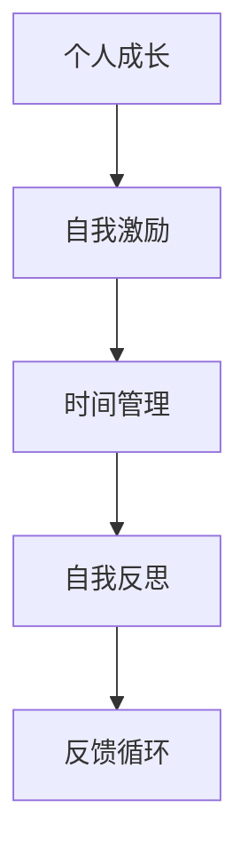
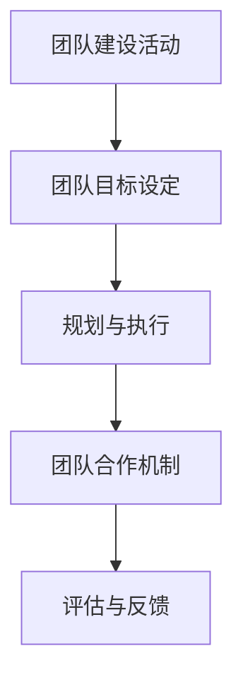
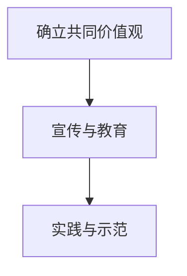
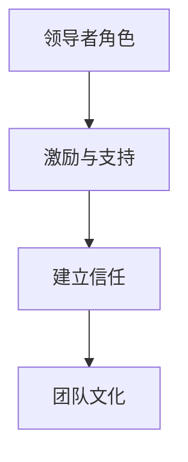
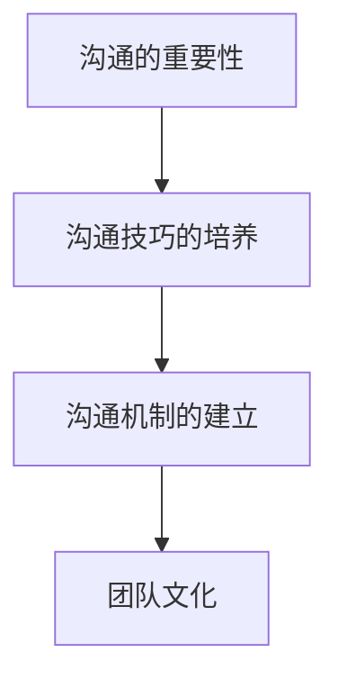
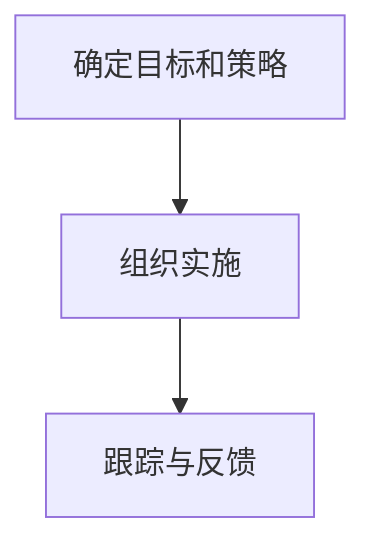
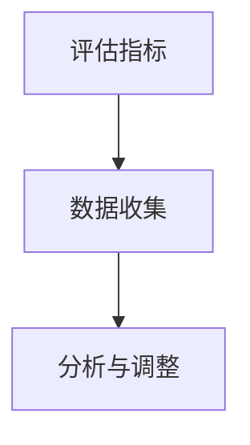

                 


## 团队精神培养：塑造积极向上的团队文化

### 关键词：团队精神、团队文化、培养策略、领导力、沟通

> 摘要：本文将深入探讨团队精神培养和积极向上的团队文化的塑造。通过分析核心概念、实施策略和实际案例，本文旨在为读者提供一套系统性、可操作的团队建设指南。

### 目录

1. **团队精神与团队文化的概述**
   - 1.1 团队精神的定义与重要性
   - 1.2 团队文化的概念与构成要素
   - 1.3 团队精神与团队文化的联系

2. **核心概念与联系**
   - 2.1 团队精神的特征分析
   - 2.2 团队文化的关键要素
   - 2.3 团队精神与团队文化的联系

3. **团队精神培养策略**
   - 3.1 个体层面的培养策略
   - 3.2 团队层面的培养策略

4. **团队文化塑造**
   - 4.1 团队价值观的塑造
   - 4.2 领导力与团队文化
   - 4.3 沟通与团队文化

5. **案例研究**
   - 5.1 成功案例：A公司的团队精神培养实践
   - 5.2 成功案例：B公司的团队文化建设
   - 5.3 失败案例：C公司的团队建设教训

6. **实施与评估**
   - 6.1 团队精神培养与团队文化塑造的实施步骤
   - 6.2 评估与调整

7. **最佳实践与总结**
   - 7.1 最佳实践总结
   - 7.2 小贴士与注意事项
   - 7.3 拓展阅读

### 第1章：团队精神与团队文化的概述

#### 1.1 团队精神的定义与重要性

团队精神，简单来说，是团队成员共同追求团队目标，相互支持，协同工作的意愿和行为。它不仅仅是一种情感上的联结，更是一种行为上的指导原则。一个具有团队精神的团队，能够发挥出巨大的集体智慧和工作效率。

**为什么团队精神如此重要？**

1. **提高工作效率**：团队精神能够促进团队成员之间的协作，减少沟通障碍，提高工作效率。
2. **增强团队凝聚力**：团队精神能够增强团队成员之间的归属感和认同感，提高团队的凝聚力。
3. **提升创新能力**：团队精神鼓励成员之间的交流和合作，有助于激发创新思维和创造力。

#### 1.2 团队文化的概念与构成要素

团队文化是指一个团队在长期运作过程中形成的共同价值观、信仰、行为准则和工作方式。它包括以下几个方面：

1. **团队价值观**：团队价值观是团队文化的核心，它决定了团队成员的行为和决策。
2. **领导风格**：领导风格对团队文化有着深远的影响。不同的领导风格会塑造出不同的团队文化。
3. **沟通机制**：有效的沟通是团队文化的重要组成部分，它能够促进团队成员之间的理解和协作。

#### 1.3 团队精神与团队文化的联系

团队精神和团队文化是相辅相成的。团队精神是团队文化的表现，而团队文化则是团队精神的土壤。只有建立了良好的团队文化，才能培养出真正的团队精神。同时，团队精神的发挥也需要团队文化的支持和保障。

### 第2章：核心概念与联系

#### 2.1 团队精神的特征分析

团队精神具有以下几个主要特征：

1. **协作性**：团队成员之间能够相互协作，共同完成任务。
2. **目标一致性**：团队成员有着共同的目标，并为此努力奋斗。
3. **尊重与信任**：团队成员之间相互尊重，建立起信任关系。

**团队精神特征对比表格**：

| 特征       | 描述                                           |
| ---------- | ---------------------------------------------- |
| 协作性     | 成员之间相互协作，共同完成任务                   |
| 目标一致性 | 成员有着共同的目标，并为此努力                   |
| 尊重与信任 | 成员之间相互尊重，建立起信任关系                 |

**ER实体关系图架构**：

```mermaid
entity Relationship {
  Member
  TeamSpirit
}

Member {
  +id
  +name
  +role
}

TeamSpirit {
  +feature
  +description
}

Relationship {
  +member_id
  +teamSpirit_id
}
```

#### 2.2 团队文化的关键要素

团队文化由以下几个关键要素构成：

1. **团队价值观**：团队价值观是团队文化的核心，它决定了团队成员的行为和决策。
2. **领导风格**：领导风格对团队文化有着深远的影响。不同的领导风格会塑造出不同的团队文化。
3. **沟通机制**：有效的沟通是团队文化的重要组成部分，它能够促进团队成员之间的理解和协作。

**团队文化要素对比表格**：

| 要素         | 描述                                           |
| ------------ | ---------------------------------------------- |
| 团队价值观   | 团队成员共同遵循的价值观和信仰                   |
| 领导风格     | 领导者对团队成员的影响和塑造方式                 |
| 沟通机制     | 团队成员之间的沟通方式和方法                     |

**ER实体关系图架构**：

```mermaid
entity Relationship {
  TeamCulture
  CultureElement
}

TeamCulture {
  +id
  +name
}

CultureElement {
  +id
  +name
  +description
}

Relationship {
  +teamCulture_id
  +cultureElement_id
}
```

#### 2.3 团队精神与团队文化的联系

团队精神与团队文化是相互依存的。团队精神是团队文化的表现，而团队文化则是团队精神的土壤。只有建立了良好的团队文化，才能培养出真正的团队精神。同时，团队精神的发挥也需要团队文化的支持和保障。

### 第3章：团队精神培养策略

#### 3.1 个体层面的培养策略

个体层面的培养策略主要包括以下几个方面：

1. **个人成长与自我激励**：团队成员应该不断提升自己的技能和能力，通过自我激励来保持积极的工作态度。
2. **时间管理技能**：合理的时间管理能够帮助团队成员更高效地完成任务，减少拖延和焦虑。
3. **自我反思与反馈**：团队成员应该定期进行自我反思，从自己的工作中学习和改进。

**个体层面培养策略流程图**：



#### 3.2 团队层面的培养策略

团队层面的培养策略主要包括以下几个方面：

1. **团队建设活动**：通过团队建设活动，增强团队成员之间的相互了解和信任。
2. **团队目标设定与规划**：明确团队的目标和规划，有助于提高团队成员的凝聚力和工作效率。
3. **团队合作机制的建立**：建立有效的团队合作机制，确保团队成员能够高效协作。

**团队层面培养策略流程图**：



### 第4章：团队文化塑造

#### 4.1 团队价值观的塑造

团队价值观是团队文化的核心。塑造团队价值观的过程可以分为以下几个步骤：

1. **确立共同价值观**：团队领导者需要与团队成员共同讨论，确立团队的共同价值观。
2. **宣传与教育**：通过内部宣传和教育，让团队成员深刻理解和认同团队的价值观。
3. **实践与示范**：团队领导者应该通过自己的行为来示范团队的价值观，树立榜样。

**团队价值观塑造流程图**：



#### 4.2 领导力与团队文化

领导力对团队文化有着至关重要的影响。优秀的领导力能够塑造出积极的团队文化。

1. **领导者角色的定位**：领导者不仅是团队的领导者，更是团队的榜样和引领者。
2. **激励与支持**：领导者应该激励团队成员，提供必要的支持和资源。
3. **建立信任**：领导者需要建立起团队成员之间的信任，这是团队文化的重要组成部分。

**领导力与团队文化关系图**：



#### 4.3 沟通与团队文化

有效的沟通是团队文化的重要组成部分。良好的沟通能够促进团队成员之间的理解和协作。

1. **沟通的重要性**：沟通是团队协作的基础，良好的沟通能够提高团队的工作效率。
2. **沟通技巧的培养**：团队成员应该学习并掌握有效的沟通技巧，如倾听、表达、反馈等。
3. **沟通机制的建立**：团队需要建立有效的沟通机制，确保信息能够及时、准确地传递。

**沟通与团队文化关系图**：



### 第5章：案例研究

#### 5.1 成功案例：A公司的团队精神培养实践

A公司通过一系列的团队建设活动和团队文化塑造，成功培养了团队精神。

1. **团队建设活动**：A公司定期组织团队建设活动，如户外拓展、团建晚会等，增强团队成员之间的相互了解和信任。
2. **团队价值观的塑造**：A公司确立了“创新、协作、诚信”的团队价值观，并通过内部宣传和教育，让团队成员深刻理解和认同。
3. **领导力建设**：A公司的领导层以身作则，通过激励和支持团队成员，建立了良好的团队文化。

#### 5.2 成功案例：B公司的团队文化建设

B公司通过一系列的措施，成功塑造了积极的团队文化。

1. **沟通机制的建立**：B公司建立了多层次的沟通机制，确保信息能够及时、准确地传递。
2. **团队目标的设定与规划**：B公司明确了团队的目标和规划，并通过定期的团队会议，确保团队成员对目标的明确和认同。
3. **领导力与激励**：B公司的领导层注重领导力的培养，通过激励和支持，提高了团队成员的工作积极性。

#### 5.3 失败案例：C公司的团队建设教训

C公司由于忽视了团队精神的培养和团队文化的塑造，导致团队工作效率低下，员工流失率增加。

1. **忽视团队精神培养**：C公司的领导层没有重视团队精神的培养，导致团队成员缺乏协作精神。
2. **缺乏有效的沟通机制**：C公司的沟通机制不畅，导致信息传递不及时，团队成员之间缺乏有效的沟通。
3. **领导力不足**：C公司的领导力不足，无法有效激励和支持团队成员，导致团队文化消极。

### 第6章：实施与评估

#### 6.1 团队精神培养与团队文化塑造的实施步骤

1. **确定目标和策略**：首先需要明确团队精神培养和团队文化塑造的目标，并制定相应的策略。
2. **组织实施**：根据制定的策略，组织具体的实施活动，如团队建设活动、团队价值观的塑造等。
3. **跟踪与反馈**：在实施过程中，需要不断跟踪和反馈，确保实施效果。

**实施步骤流程图**：



#### 6.2 评估与调整

1. **评估指标**：根据团队精神培养和团队文化塑造的目标，制定相应的评估指标。
2. **数据收集**：通过问卷调查、访谈等方式，收集相关数据。
3. **分析与调整**：根据收集的数据，进行分析和调整，确保实施效果。

**评估与调整流程图**：



### 第7章：最佳实践与总结

#### 7.1 最佳实践总结

1. **注重团队精神培养**：团队精神是团队成功的关键，需要持续培养。
2. **建立有效的团队文化**：良好的团队文化能够促进团队精神的培养。
3. **领导者的示范作用**：领导者的行为对团队文化有着深远的影响。

#### 7.2 小贴士与注意事项

1. **避免过度竞争**：过度的竞争可能导致团队精神的缺失。
2. **建立良好的沟通机制**：良好的沟通是团队协作的基础。
3. **定期进行团队建设活动**：团队建设活动能够增强团队成员之间的相互了解和信任。

#### 7.3 拓展阅读

- 《领导者的语言》
- 《团队的智慧》
- 《团队建设：理论与实践》

### 作者信息

作者：AI天才研究院/AI Genius Institute & 禅与计算机程序设计艺术/Zen And The Art of Computer Programming

---

本文以逻辑清晰、结构紧凑、简单易懂的方式，详细探讨了团队精神培养和积极向上的团队文化的塑造。通过实际案例的分析，读者可以了解到如何在实际工作中实施这些策略，从而提升团队的整体绩效。希望本文能为IT领域的团队建设提供有价值的参考和指导。

