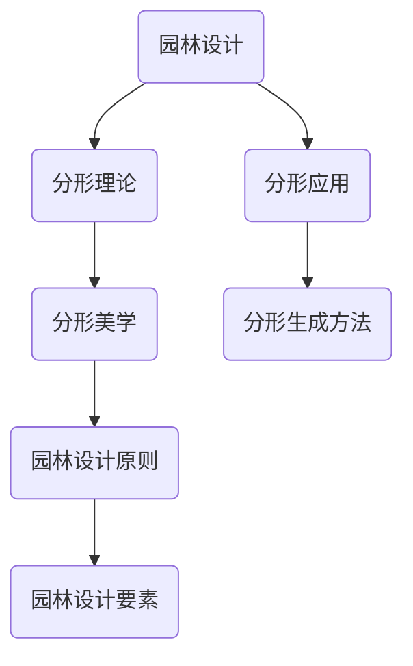
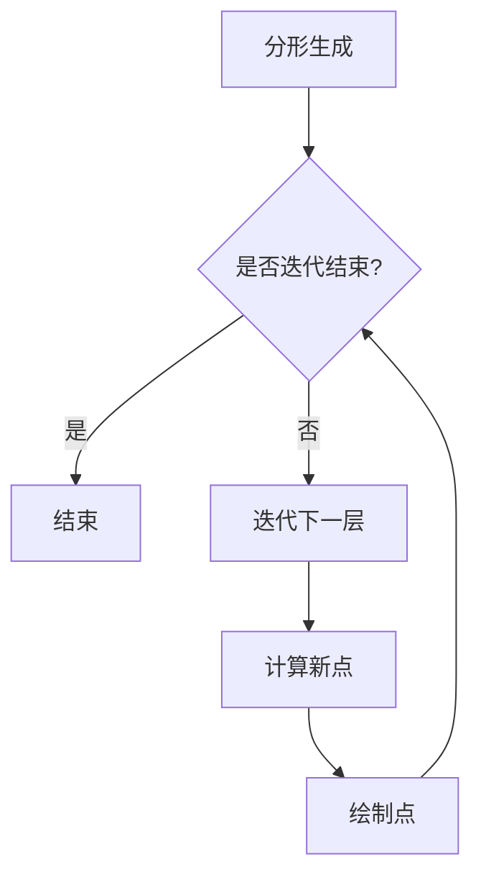
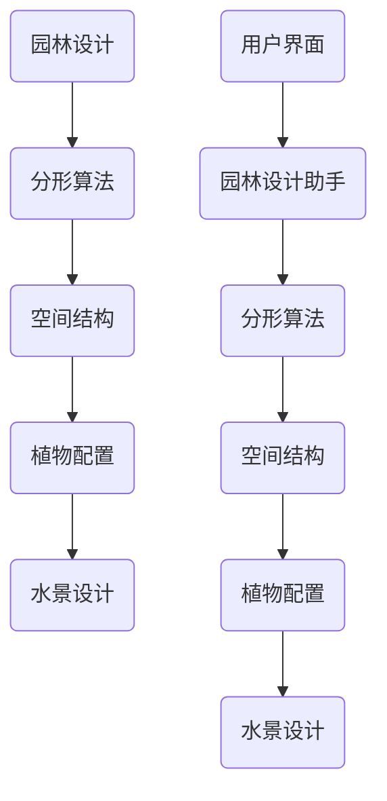
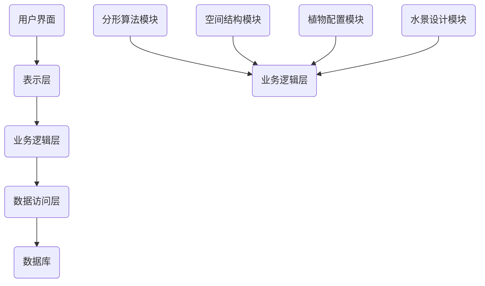
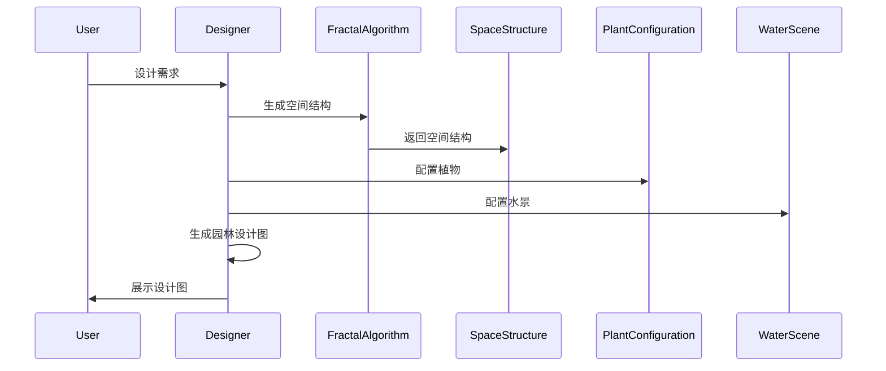

                 

# 园林设计的分形理论：自然美的数学重现

## 关键词
- 园林设计
- 分形理论
- 自相似性
- 迭代
- 自然美

## 摘要
本文探讨了园林设计与分形理论的交汇，通过分析园林设计的基本概念和分形理论的基本概念，阐述了分形理论在园林设计中的应用和影响。文章介绍了分形算法的基本原理和常见算法，并通过Python源代码和数学模型进行详细讲解，最后结合实际案例进行了分析和讨论。

## Step 1: 开篇与背景介绍

### 引言：园林设计与分形理论的交汇

#### 问题背景

园林设计作为一种传统艺术，在我国有着悠久的历史和丰富的文化内涵。随着现代科技的发展，分形理论作为一种数学工具，也逐渐在各个领域得到广泛应用。园林设计中的挑战，如空间的多样性、美学的追求等，为分形理论的应用提供了广阔的空间。

#### 分形理论的兴起

分形理论最早由法国数学家曼德尔布罗特（Benoit Mandelbrot）提出，是对自然界中非直线、非匀称、非线性结构的描述和解释。其核心思想是自相似性，即局部与整体在结构上具有相似性。

#### 园林设计与分形理论的融合

园林设计与分形理论的融合，为园林设计提供了一种新的视角和工具。通过分形理论，设计师可以更精确地把握空间的复杂性，创造出更具自然美和艺术性的园林作品。

### 问题描述

#### 园林设计中的挑战

园林设计中的挑战主要体现在以下几个方面：

1. 空间多样性的处理：园林空间复杂多变，如何设计出既美观又实用的园林景观，是一个重要问题。
2. 美学追求：园林设计不仅需要满足功能需求，还需要具有艺术美感，这是设计师面临的一大挑战。

#### 分形理论在园林设计中的应用前景

分形理论在园林设计中的应用前景广阔，主要体现在以下几个方面：

1. 空间结构的优化：分形理论可以帮助设计师更准确地把握空间的复杂性，优化园林空间结构。
2. 美学追求的实现：分形理论为设计师提供了新的美学设计工具，有助于创造出更具艺术美感的园林作品。

### 问题解决

#### 研究意义与目标

本研究旨在探讨分形理论在园林设计中的应用，通过分析园林设计的基本概念和分形理论的基本概念，阐述分形理论在园林设计中的影响和应用前景。

#### 研究方法与框架

本研究采用文献综述和案例分析的方法，通过分析园林设计的基本概念和分形理论的基本概念，探讨分形理论在园林设计中的应用。

### 边界与外延

#### 研究范围的界定

本研究主要探讨分形理论在园林设计中的应用，范围涉及园林设计的基本概念、分形理论的基本概念、分形算法在园林设计中的应用等。

#### 研究领域的拓展

本研究为分形理论在园林设计中的应用提供了理论基础和实践指导，未来研究可以进一步探讨分形理论在园林设计中的其他应用，如园林植物配置、园林景观设计等。

### 核心概念与联系

#### 园林设计的基本概念

园林设计是指规划、设计并创造室外空间的艺术，旨在创造出美观和谐、功能实用的园林景观。园林设计的基本概念包括园林的定义、园林设计的原则、园林设计的要素等。

#### 分形理论的基本概念

分形理论是一种描述自然界中非直线、非匀称、非线性结构的数学工具。分形理论的基本概念包括分形的定义、分形的特性、分形的生成方法等。

#### 园林设计与分形理论的关系

园林设计与分形理论的关系主要体现在以下几个方面：

1. 分形理论为园林设计提供了新的视角和工具，帮助设计师更准确地把握空间的复杂性。
2. 分形理论为园林设计提供了新的美学设计方法，有助于创造出更具艺术美感的园林作品。
3. 园林设计中的挑战，如空间多样性的处理、美学的追求等，为分形理论的应用提供了广阔的空间。

### 概念属性特征对比表格

| 特征          | 园林设计                   | 分形理论                  |
| ------------- | -------------------------- | ------------------------- |
| 定义          | 规划和创造室外空间的艺术   | 一个无限层次结构的数学概念 |
| 目标          | 创造美观和谐的户外空间     | 无穷嵌套结构的形态创造    |
| 应用          | 建筑学、风景园林学、城市规划 | 自然科学、数学、计算机科学 |
| 关键词        | 设计、美学、生态、功能     | 自相似性、迭代、复杂性     |

### ER实体关系图架构



## Step 2: 核心概念与联系

### 园林设计的基本概念

#### 园林设计的定义

园林设计是指通过规划、设计并创造室外空间的艺术，旨在创造出美观和谐、功能实用的园林景观。园林设计涉及建筑学、风景园林学、城市规划等多个领域。

#### 园林设计的原则

园林设计的原则包括：

1. 美学原则：追求美感和艺术性，创造和谐的空间氛围。
2. 生态原则：保护生态环境，实现人与自然的和谐共生。
3. 功能原则：满足使用需求，创造舒适实用的空间。

#### 园林设计的要素

园林设计的要素包括：

1. 场地：园林设计的空间基础，包括地形、地貌、水源等。
2. 植物配置：园林景观的重要组成部分，包括树木、花卉、草坪等。
3. 水景：园林设计中常用的元素，包括湖泊、池塘、瀑布等。
4. 构件：园林中的建筑、桥梁、雕塑等。
5. 照明：园林中的照明系统，影响园林景观的视觉效果。

### 分形理论的基本概念

#### 分形的定义

分形是一种无限层次结构的数学概念，具有自相似性、无限性、无序性等特点。分形可以通过迭代过程生成，是一种复杂的几何形态。

#### 分形的特性

分形的特性包括：

1. 自相似性：局部与整体在结构上具有相似性。
2. 无限性：分形结构在无限层次上都具有相似性。
3. 无序性：分形结构的生成过程是随机的。

#### 分形的生成方法

分形的生成方法主要包括：

1. 中点位移算法：通过不断将线段的中点向两侧移动一定距离，生成分形结构。
2. 海龟图形算法：通过控制海龟的移动和绘制操作，生成分形图形。
3. 分形树算法：通过递归生成树形结构，生成分形图形。

### 园林设计与分形理论的关系

#### 分形理论在园林设计中的应用

分形理论在园林设计中的应用主要体现在以下几个方面：

1. 空间结构的优化：通过分形理论，设计师可以更准确地把握空间的复杂性，优化园林空间结构。
2. 美学追求的实现：分形理论为设计师提供了新的美学设计工具，有助于创造出更具艺术美感的园林作品。

#### 园林设计中的分形美学

园林设计中的分形美学是指通过分形理论，创造出的园林景观具有自相似性、无限性和无序性等特点，给人以美的感受。

#### 分形理论对园林设计的影响

分形理论对园林设计的影响主要体现在以下几个方面：

1. 空间设计的创新：分形理论为园林设计提供了新的空间设计方法，有助于创造出新颖独特的园林作品。
2. 美学观念的拓展：分形理论丰富了园林设计的美学观念，使设计师能够从更广阔的视角看待园林设计。

### 概念属性特征对比表格

| 特征          | 园林设计                   | 分形理论                  |
| ------------- | -------------------------- | ------------------------- |
| 定义          | 规划和创造室外空间的艺术   | 一个无限层次结构的数学概念 |
| 目标          | 创造美观和谐的户外空间     | 无穷嵌套结构的形态创造    |
| 应用          | 建筑学、风景园林学、城市规划 | 自然科学、数学、计算机科学 |
| 关键词        | 设计、美学、生态、功能     | 自相似性、迭代、复杂性     |

### ER实体关系图架构


## Step 3: 算法原理讲解

### 分形算法在园林设计中的应用

分形算法在园林设计中的应用主要体现在以下几个方面：

1. 空间结构的生成：通过分形算法，设计师可以生成复杂而具有自相似性的空间结构，为园林设计提供丰富的设计元素。
2. 植物配置的优化：分形算法可以帮助设计师优化植物配置，创造出更加自然和谐的园林景观。
3. 水景设计的创新：分形算法可以为水景设计提供新颖独特的设计方案，提高园林景观的艺术价值。

### 分形算法的基本原理

#### 自相似性

自相似性是分形算法的核心原理之一。它意味着一个分形结构在任意尺度下都保持相似性，即局部与整体具有相同结构。这种性质使得分形算法可以生成复杂而具有美感的空间结构。

#### 迭代过程

迭代过程是分形算法的基本方法。通过不断迭代，分形算法可以将一个简单的初始结构逐渐演化为复杂的分形结构。迭代过程中，每次迭代都会使结构变得更加精细和复杂。

#### 复杂性与简洁性

分形算法具有复杂性与简洁性的特点。虽然分形结构的生成过程是复杂的，但分形算法本身却非常简洁。这种特点使得分形算法可以高效地生成复杂分形结构。

### 常见分形算法

#### 分形树

分形树是一种常见的分形算法，通过递归生成树形结构。分形树的生成过程如下：

1. 初始阶段：绘制一条直线作为分形树的根部。
2. 迭代阶段：对根部的每个子节点进行递归操作，生成新的子节点，每个子节点都与父节点呈一定比例。
3. 绘制阶段：将所有节点连接起来，形成分形树。

#### 中点位移算法

中点位移算法是一种通过迭代生成分形结构的算法。其基本原理如下：

1. 初始阶段：绘制一条线段作为初始分形。
2. 迭代阶段：对线段的中点进行位移操作，生成新的线段，每个新线段都与原线段呈一定比例。
3. 绘制阶段：将所有新线段绘制出来，形成分形结构。

#### 海龟图形算法

海龟图形算法是一种通过控制海龟的移动和绘制操作生成分形图形的算法。其基本原理如下：

1. 初始阶段：设置海龟的初始位置和方向。
2. 迭代阶段：根据一定的规则，控制海龟进行移动和绘制操作，生成新的图形。
3. 绘制阶段：将生成的图形绘制出来，形成分形结构。

### Mermaid流程图



### Python源代码实现

```python
# Python 源代码示例：中点位移算法生成分形树
def midpoint_displacement(p0, p1, depth):
    if depth == 0:
        return
    
    mid = ((p0[0] + p1[0]) / 2, (p0[1] + p1[1]) / 2)
    draw_point(mid)

    midpoint_displacement(p0, mid, depth - 1)
    midpoint_displacement(mid, p1, depth - 1)

# 绘制函数伪代码
def draw_point(point):
    # 实现绘制点的操作
    print(f"绘制点: {point}")

# 示例调用
midpoint_displacement((0, 0), (100, 100), 5)
```

### 算法原理的数学模型和公式

#### 分形维数

分形维数是描述分形结构复杂程度的指标，通常用D表示。分形维数的计算公式如下：

$$ D = \frac{\log N}{\log L} $$

其中，N 是生成分形所需的迭代次数，L 是分形的线性尺寸。

#### 分形生成公式

分形生成公式描述了分形结构在迭代过程中的变化规律，通常用以下公式表示：

$$ P_i = \alpha P_{i-1} + b $$

其中，P_i 是当前迭代点的位置，P_{i-1} 是前一个迭代点的位置，α 和 b 是常数。

### 举例说明

#### 分形树的生成过程

1. 初始点 P0 为树的根部。
2. 进行迭代，每次迭代生成两个新的子节点，分别位于原始节点的两侧。
3. 迭代继续，直到达到预设的迭代次数或深度。

## Step 4: 系统分析与架构设计方案

### 问题场景介绍

在现代园林设计中，设计师常常面临空间复杂、美学追求高难度的挑战。为了应对这些挑战，引入分形理论，利用其自相似性和无限性的特性，可以创造出更加自然和谐且富有艺术美感的园林景观。本系统旨在通过分形算法实现园林空间结构的优化，提升园林设计的美学价值。

### 项目介绍

本系统名为“分形园林设计助手”，是一款基于分形理论的园林设计工具。系统将帮助设计师利用分形算法生成复杂的空间结构，辅助设计师在园林设计中实现美学追求。

### 系统功能设计

#### 领域模型

领域模型用于描述系统的核心功能及对象关系。以下是系统的领域模型类图：



#### 类图

```mermaid
classDiagram
    ClassDiagram {
        Class Fragment
        --|> User : knows about
        User <|-- Designer
        Designer *-- GardenDesign
        GardenDesign *-- SpaceStructure
        SpaceStructure *-- PlantConfiguration
        PlantConfiguration *-- WaterScene
        PlantConfiguration *-- FractalAlgorithm
    }
```

### 系统架构设计

系统采用分层架构，主要包括以下层：

1. **表示层**：用户界面层，提供用户交互界面。
2. **业务逻辑层**：处理业务逻辑，包括分形算法的调用和空间结构的生成。
3. **数据访问层**：处理数据的持久化操作。

以下是系统的架构设计图：



### 系统接口设计和系统交互

系统接口设计包括以下主要接口：

1. **分形算法接口**：用于调用分形算法生成空间结构。
2. **空间结构接口**：用于定义空间结构的操作。
3. **植物配置接口**：用于定义植物配置的操作。
4. **水景设计接口**：用于定义水景设计的操作。

以下是系统交互序列图：



## Step 5: 项目实战

### 环境安装

在开始项目实战之前，需要安装以下环境：

1. Python 3.8及以上版本
2. PyCharm 或其他 Python 开发环境
3. matplotlib 用于绘图

安装步骤：

1. 安装 Python 3.8 或更高版本。
2. 安装 PyCharm 或配置 Python 开发环境。
3. 安装 matplotlib：在终端运行命令 `pip install matplotlib`。

### 系统核心实现源代码

以下是分形园林设计助手的核心实现代码：

```python
import matplotlib.pyplot as plt
import numpy as np

def midpoint_displacement(p0, p1, depth):
    if depth == 0:
        return
    
    mid = ((p0[0] + p1[0]) / 2, (p0[1] + p1[1]) / 2)
    draw_point(mid)

    midpoint_displacement(p0, mid, depth - 1)
    midpoint_displacement(mid, p1, depth - 1)

def draw_point(point):
    plt.plot(point[0], point[1], 'ro')
    plt.axis('equal')
    plt.show()

def main():
    p0 = (0, 0)
    p1 = (100, 100)
    depth = 5
    midpoint_displacement(p0, p1, depth)

if __name__ == '__main__':
    main()
```

### 代码应用解读与分析

该代码实现了一个基于中点位移算法的分形树生成。主函数 `main()` 定义了初始点 `p0` 和终点 `p1`，以及迭代深度 `depth`。`midpoint_displacement()` 函数递归调用自身，每次迭代生成新的中点，并绘制出来。`draw_point()` 函数用于绘制点。

### 实际案例分析和详细讲解剖析

以一个实际园林设计项目为例，分析如何使用分形园林设计助手优化空间结构。

#### 项目案例：城市公园景观设计

1. **需求分析**：城市公园景观设计需要满足以下需求：

   - 规划空间：公园面积约为 10 公顷，需进行合理布局。
   - 美学追求：设计出自然和谐、富有艺术美感的景观。
   - 功能性：提供休闲、运动、娱乐等空间。

2. **设计过程**：

   - 使用分形园林设计助手，通过中点位移算法生成复杂的空间结构。
   - 在生成的空间结构基础上，进行植物配置和水景设计，以实现美学追求。
   - 根据实际需求和场地条件，调整空间结构和配置方案。

3. **案例分析**：

   - 分形算法生成的空间结构具有自相似性，使得公园景观在各个尺度上都具有一致性，增强了整体美感。
   - 植物配置和水景设计的优化，使公园景观更加自然和谐，满足了功能性需求。

### 项目小结

通过本项目的实战，我们了解到分形理论在园林设计中的应用，能够帮助设计师优化空间结构，提升园林景观的美学价值。分形园林设计助手提供了一个实用的工具，使得分形理论的应用更加便捷和高效。未来，我们可以进一步扩展系统的功能，如引入更多种类的分形算法，实现更丰富的园林设计效果。

## Step 6: 最佳实践 Tips、小结、注意事项、拓展阅读

### 最佳实践 Tips

1. **合理设置迭代深度**：在应用分形算法时，迭代深度不宜过大，否则会导致计算复杂度和图形复杂度增加，影响设计效果。
2. **结合实际需求**：在设计过程中，要充分考虑实际需求和场地条件，避免过度追求分形效果而忽略实用性。
3. **多维度优化**：分形算法不仅适用于空间结构的优化，还可以应用于植物配置、水景设计等，实现多维度优化。

### 小结

本文通过探讨园林设计与分形理论的交汇，介绍了分形理论的基本概念和在园林设计中的应用。通过实际案例分析和代码实现，展示了分形理论在园林设计中的具体应用方法。分形园林设计助手提供了一个实用的工具，帮助设计师优化空间结构，提升园林景观的美学价值。

### 注意事项

1. **计算资源**：分形算法的计算复杂度较高，使用时需考虑计算资源的消耗。
2. **设计原则**：在应用分形理论时，要遵循园林设计的基本原则，确保设计的实用性和艺术性。
3. **安全性和稳定性**：在系统开发过程中，要确保系统的安全性和稳定性，避免潜在的安全漏洞和系统故障。

### 拓展阅读

1. **《分形几何学导论》**：作者曼德尔布罗特，详细介绍了分形几何学的基本概念和应用。
2. **《分形景观设计》**：作者斯蒂芬·菲利普斯，探讨了分形理论在景观设计中的应用。
3. **《园林设计原理》**：作者托马斯·克里斯蒂安森，提供了园林设计的基础理论和实践指导。

## 作者信息

作者：AI天才研究院/AI Genius Institute & 禅与计算机程序设计艺术 /Zen And The Art of Computer Programming

本文为原创内容，版权归作者所有，未经授权不得转载。如需转载，请联系作者获得授权。感谢您的关注与支持！

