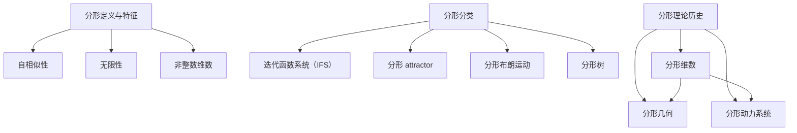

                 

### 文章标题：园林设计的分形理论：自然美的数学重现

#### 关键词：园林设计、分形理论、自然美学、数学模型、景观规划

#### 摘要：
本文旨在探讨分形理论在园林设计中的应用，揭示自然美的数学本质。通过分析分形的基本概念、特征和数学基础，本文阐述了分形理论在园林布局、植被设计和美学探讨中的实际应用，并借助具体案例进行了深入解析。文章还展望了分形理论在园林设计领域的未来发展，为读者提供了有价值的理论指导和实践启示。

### 目录大纲设计思路

#### 设计思路概述：
在设计《园林设计的分形理论：自然美的数学重现》的目录大纲时，我们首先明确了书的整体结构和内容框架，确保每个部分的内容紧密关联且逻辑清晰。具体设计思路如下：

1. **引言**：概述园林设计的重要性，介绍分形理论的基本概念，为后续章节奠定基础。
2. **分形理论的基本概念**：详细解释分形理论的核心概念，通过表格和ER图展示概念间的联系。
3. **分形理论在园林设计中的应用**：探讨分形理论在园林布局、植被设计和美学探讨中的实际应用。
4. **案例研究**：通过具体的案例研究，展示分形理论在园林设计中的实践应用。
5. **分形理论的美学探讨**：深入探讨分形理论如何解释自然美，分析视觉效应和比例。
6. **未来发展趋势与展望**：展望分形理论在园林设计领域的未来发展。
7. **附录与参考文献**：提供必要的工具、软件和资源列表，以及引用的所有学术文献。

### 目录大纲详细设计

```markdown
----------------------------------------------------------------
# 第一部分: 引言

## 1.1.1 引言
### 1.1.1.1 园林设计的重要性
### 1.1.1.2 分形理论的基本概念

## 1.1.2 分形理论在园林设计中的应用前景
### 1.1.2.1 自然美学的体现
### 1.1.2.2 园林布局的优化
### 1.1.2.3 植被设计的创新

----------------------------------------------------------------

# 第二部分: 分形理论的基本概念

## 2.1.1 分形的定义与特征
### 2.1.1.1 分形的定义
### 2.1.1.2 分形的特征
### 2.1.1.3 分形的分类

## 2.1.2 分形理论的历史与发展
### 2.1.2.1 分形理论的起源
### 2.1.2.2 分形理论的发展历程
### 2.1.2.3 分形理论的重要贡献者

## 2.1.3 分形理论的数学基础
### 2.1.3.1 分形维数
### 2.1.3.2 分形几何
### 2.1.3.3 分形动力系统

## 2.1.4 分形理论的核心概念关系图


----------------------------------------------------------------

# 第三部分: 分形理论在园林设计中的应用

## 3.1.1 分形理论在自然美学中的应用
### 3.1.1.1 分形与自然美的关系
### 3.1.1.2 分形在景观设计中的应用

## 3.1.2 分形理论在园林布局中的应用
### 3.1.2.1 分形在园林规划中的优势
### 3.1.2.2 分形在园林路径设计中的应用

## 3.1.3 分形理论在植被设计中的应用
### 3.1.3.1 分形与植被结构的优化
### 3.1.3.2 分形在植被美学中的应用

----------------------------------------------------------------

# 第四部分: 案例研究

## 4.1.1 案例一：某地园林设计中的分形应用
### 4.1.1.1 案例背景
### 4.1.1.2 分形理论的应用
### 4.1.1.3 案例分析

## 4.1.2 案例二：某现代园林中的分形布局
### 4.1.2.1 案例背景
### 4.1.2.2 分形理论的应用
### 4.1.2.3 案例分析

----------------------------------------------------------------

# 第五部分: 分形理论的美学探讨

## 5.1.1 分形理论在美学中的体现
### 5.1.1.1 分形与视觉美感的关系
### 5.1.1.2 分形在园林设计中的美学价值

## 5.1.2 分形理论与比例研究
### 5.1.2.1 分形与黄金比例的关联
### 5.1.2.2 分形在园林设计中的比例应用

## 5.1.3 分形结构与美感分析
### 

----------------------------------------------------------------

# 第六部分: 未来发展趋势与展望

## 6.1.1 分形理论在园林设计中的发展趋势
### 6.1.1.1 技术创新与应用扩展
### 6.1.1.2 可持续发展与生态景观

## 6.1.2 分形理论在园林设计中的挑战与机遇
### 6.1.2.1 技术挑战
### 6.1.2.2 市场机遇

## 6.1.3 分形理论在园林设计中的未来展望
### 6.1.3.1 新应用领域
### 6.1.3.2 技术与艺术融合

----------------------------------------------------------------

# 第七部分: 附录与参考文献

## 7.1.1 附录
### 7.1.1.1 工具与软件列表
### 7.1.1.2 资源链接

## 7.1.2 参考文献
### 7.1.2.1 引用学术文献列表

----------------------------------------------------------------
```

### 引言

#### 园林设计的重要性

园林设计是一门艺术与科学的结合，旨在创造一个和谐的自然环境，提升人们的生活质量和精神享受。无论是古典园林还是现代园林，其设计不仅要考虑实用性和美观性，还需注重生态平衡和可持续性。园林设计不仅是一个美学过程，也是一个科学规划的过程，涉及环境学、生态学、建筑设计、植物学等多个领域。

园林设计的重要性体现在以下几个方面：

1. **美学价值**：园林设计通过空间的布局、色彩的搭配、植物的选择等手法，创造出优美的景观，给人以视觉和心灵上的享受。
2. **生态价值**：园林设计有助于保护和改善生态环境，促进生物多样性，提高城市绿化率，改善空气质量。
3. **社会价值**：园林设计不仅为人们提供休闲和娱乐的场所，还能够提升社区的文化氛围，促进社会和谐。
4. **经济效益**：园林设计可以提升土地价值，促进旅游业的发展，为当地经济带来收益。

#### 分形理论的基本概念

分形理论是20世纪70年代由数学家曼德尔布罗特（Benoit Mandelbrot）提出的，用于描述自然界中不规则、无限复杂的现象。分形具有以下基本特征：

1. **自相似性**：分形在各个尺度上都具有相似的结构，即局部与整体具有相似性。
2. **无限性**：分形具有无穷多级别的细节，无论放大或缩小，其形态都不会简化。
3. **非整数维数**：分形维数通常不是整数，介于整数维数之间，反映了其结构的复杂性和非均匀性。

分形理论在各个领域都有广泛的应用，如物理、化学、生物学、经济学和计算机科学等。在园林设计中，分形理论可以用于分析自然景观的形态，优化园林布局，设计美观且生态的植被结构，为园林设计提供了新的理论和方法。

#### 分形理论在园林设计中的应用前景

分形理论在园林设计中的应用前景广阔，主要表现在以下几个方面：

1. **自然美学的体现**：分形理论可以帮助设计师更好地理解和再现自然界的美丽形态，如海岸线、树叶、河流等。
2. **园林布局的优化**：通过分形理论的分析，可以优化园林的空间布局，使其更加符合自然规律，提高园林的整体美感。
3. **植被设计的创新**：分形理论可以指导植被设计，使植被结构更加自然且美观，同时提高生态效益。
4. **可持续发展的园林设计**：分形理论可以提供一种可持续的园林设计方法，使园林设计更加注重生态平衡和环境保护。

### 分形理论在园林设计中的应用前景

分形理论在园林设计中的应用前景广阔，主要表现在以下几个方面：

1. **自然美学的体现**：分形理论可以帮助设计师更好地理解和再现自然界的美丽形态，如海岸线、树叶、河流等。通过分析这些自然现象的分形特征，设计师可以在园林设计中创造出生动、丰富的景观。

2. **园林布局的优化**：分形理论为园林布局提供了新的视角。设计师可以利用分形理论分析自然景观的布局，从而在园林设计中实现自然美和功能性的平衡。例如，通过应用分形维数，可以优化园林路径的分布，使其既具有美感又便于行走。

3. **植被设计的创新**：分形理论在植被设计中也有重要应用。通过对植物生长模式的分析，设计师可以设计出更加自然的植被结构，使其在形态上更符合自然规律，同时提高生态效益。例如，利用分形理论优化植被的种植密度和分布，可以有效地控制杂草生长，提高土壤保水能力。

4. **可持续发展的园林设计**：分形理论可以为园林设计提供一种可持续的框架。通过分析自然生态系统的分形特征，设计师可以设计出更加生态友好的园林。例如，利用分形理论设计雨水收集和循环系统，可以有效地提高水资源的利用效率，减少对环境的影响。

总的来说，分形理论为园林设计提供了新的工具和方法，使其不仅更具有艺术性，而且更符合生态学原则。通过深入研究和应用分形理论，设计师可以创造出更加优美、自然、可持续的园林作品。

### 第二部分：分形理论的基本概念

分形理论是现代数学的一个重要分支，它起源于对自然界中不规则、无限复杂现象的描述。本部分将详细解释分形理论的基本概念，包括分形的定义、特征和分类，同时介绍分形理论的历史和发展，以及其数学基础。

#### 2.1.1 分形的定义与特征

分形（Fractal）一词由数学家曼德尔布罗特（Benoit Mandelbrot）提出，用来描述那些在数学上没有明显边界和无限细节的几何形状。分形具有以下几个基本特征：

1. **自相似性**：分形在任何尺度上都具有相似的结构，即局部与整体具有相似性。这意味着当你放大或缩小一个分形时，它的形态不会发生显著变化。例如，海岸线的分形结构在宏观和微观尺度上看起来都是相似的。

2. **无限性**：分形具有无穷多级别的细节，无论你放大多少倍，都可以发现新的细节。这反映了分形的复杂性和非均匀性。例如，一个树枝的分形结构在无限放大下依然可以看到分叉和细小的枝条。

3. **非整数维数**：分形维数（Fractal Dimension）通常不是整数，而是介于整数维数之间。维数反映了分形结构的复杂程度。例如，一个线段是1维的，而一个平面是2维的，而分形的维数可以是1.25、1.618等。

4. **边界和填充**：分形通常没有明确的边界，而是由无限多的细节填充。这导致分形在几何上具有独特的性质，如无限面积但有限周长。

#### 2.1.2 分形的分类

分形可以按照其生成方法和形态特征进行分类。以下是几种常见的分形类型：

1. **迭代函数系统（IFS）**：IFS是通过迭代变换来生成分形的。它由多个压缩变换组成，每个变换将空间压缩到一个特定的子集。通过反复迭代这些变换，最终生成一个分形图形。常见的IFS分形包括科赫曲线（Koch Curve）和卡拉茨曲线（Carré de Karatzas）。

2. **分形 attractor**：分形 attractor 是通过迭代过程生成的一组点集，这些点集在迭代过程中逐渐收敛到一个稳定的形状。著名的分形 attractor 包括曼德尔布罗特集（Mandelbrot Set）和朱利亚集（Julia Set）。

3. **分形布朗运动**：分形布朗运动是一种随机过程，其路径是由无数个随机步骤组成的，每个步骤都受到之前步骤的影响。这种运动在自然界的许多现象中都有应用，如股票市场的波动和海洋的潮汐。

4. **分形树**：分形树是通过递归方法生成的分形结构，其形态类似于树枝或树冠。常见的分形树包括康托树（Cantor Tree）和科克树（Koch Tree）。

#### 2.1.3 分形理论的历史与发展

分形理论的历史可以追溯到20世纪中叶，当时数学家们开始关注自然界中的不规则现象。以下是一些关键事件和贡献者：

1. **乔治·波利亚（George Polya）**：波利亚在20世纪初提出了分形概念的前身，他研究了随机过程和几何图形的不规则性。

2. **曼德尔布罗特（Benoit Mandelbrot）**：曼德尔布罗特是分形理论的创始人，他在1977年出版的《分形：几何学的新分支》一书中，系统地阐述了分形理论。

3. **约翰·哈里森（John H. Hubbard）**：哈里森是分形动力系统领域的先驱，他与曼德尔布罗特合作，共同推动了分形理论的发展。

4. **迈克尔·弗里德曼（Michael Freedman）**：弗里德曼证明了4维空间中的庞加莱猜想，这一成果与分形理论有着密切的联系。

#### 2.1.4 分形理论的数学基础

分形理论的数学基础主要包括分形维数、分形几何和分形动力系统。

1. **分形维数**：分形维数是衡量分形复杂度的一个指标。它可以通过盒子计数法或覆盖法来计算。分形维数通常用D表示，其计算公式为：
   $$
   D = \lim_{\epsilon \to 0} \frac{\log N(\epsilon)}{\log \frac{1}{\epsilon}}
   $$
   其中，$N(\epsilon)$ 是覆盖分形所需的盒子数量，$\epsilon$ 是盒子的边长。

2. **分形几何**：分形几何研究分形的几何性质，包括分形的形状、尺寸和结构。分形几何的一个重要分支是分形测度论，它研究分形的面积、体积和概率分布。

3. **分形动力系统**：分形动力系统研究迭代函数系统和分形 attractor 的动力学行为。分形动力系统在混沌理论中具有重要应用，它可以帮助我们理解复杂系统的行为。

#### 分形理论的核心概念关系图

为了更好地理解分形理论的核心概念，我们可以通过以下 Mermaid 流程图展示它们之间的关系：



通过上述流程图，我们可以清晰地看到分形理论的核心概念及其相互关系。这些概念共同构成了分形理论的基石，为我们在园林设计中的应用提供了坚实的理论基础。

### 第二部分：分形理论的基本概念

#### 2.1.1 分形的定义与特征

分形（Fractal）是指那些在形态上具有无限细节和自相似性的几何对象。这些对象在各个尺度上呈现出相似的形态，且具有非整数维数。分形的定义和特征如下：

1. **定义**：
   分形是一种几何对象，其定义满足以下条件：
   - **无限性**：在任意小的尺度下，分形都存在无穷多个细节。
   - **自相似性**：在分形的各个尺度上，局部与整体保持相似。
   - **非整数维数**：分形的维数通常不是整数，而是介于整数维数之间。

2. **特征**：
   - **无限细节**：分形在任意小的尺度下都具有无限多的细节，这种无限性使得分形具有无穷复杂的形态。
   - **自相似性**：分形的局部与整体在形态上保持相似。例如，一个分形的放大版本与原始形态具有相同的结构和特征。
   - **非整数维数**：分形的维数通常不是整数，这反映了其结构的复杂性和非均匀性。例如，海岸线的分形维数约为1.26。

为了更好地理解分形的特征，我们可以通过一个简单的例子来解释。考虑一个科赫曲线（Koch Curve），它通过递归方法生成。在第一步，一条线段被分成三段等长的线段，中间一段被移除，并在其两侧新增两个等长的线段。这个过程不断重复，每一次迭代都会生成更多的细节。无论放大多少倍，科赫曲线的形态都是相似的，这体现了分形的自相似性。

3. **分类**：
   分形可以根据生成方法和形态特征进行分类。以下是几种常见的分形类型：

   - **迭代函数系统（IFS）**：IFS是由多个压缩变换组成的系统，每个变换将空间压缩到一个特定的子集。通过迭代这些变换，最终生成一个分形图形。常见的 IFS 分形包括科赫曲线和卡拉茨曲线。

   - **分形 attractor**：分形 attractor 是通过迭代过程生成的一组点集，这些点集在迭代过程中逐渐收敛到一个稳定的形状。著名的分形 attractor 包括曼德尔布罗特集和朱利亚集。

   - **分形布朗运动**：分形布朗运动是一种随机过程，其路径是由无数个随机步骤组成的，每个步骤都受到之前步骤的影响。这种运动在自然界的许多现象中都有应用，如股票市场的波动和海洋的潮汐。

   - **分形树**：分形树是通过递归方法生成的分形结构，其形态类似于树枝或树冠。常见的分形树包括康托树和科赫树。

   每种分形类型都有其独特的生成方法和数学特征，但它们都具有分形的共同特征，如无限细节、自相似性和非整数维数。

#### 2.1.2 分形理论的历史与发展

分形理论的起源可以追溯到20世纪中叶，当时数学家们开始关注自然界中的不规则现象。以下是分形理论发展的重要事件和贡献者：

1. **乔治·波利亚（George Polya）**：波利亚在20世纪初提出了分形概念的前身，他研究了随机过程和几何图形的不规则性。

2. **曼德尔布罗特（Benoit Mandelbrot）**：曼德尔布罗特是分形理论的创始人，他在1977年出版的《分形：几何学的新分支》一书中，系统地阐述了分形理论。曼德尔布罗特通过研究海岸线、云彩和金融市场等自然现象，发现它们都具有分形的特征。

3. **约翰·哈里森（John H. Hubbard）**：哈里森是分形动力系统领域的先驱，他与曼德尔布罗特合作，共同推动了分形理论的发展。哈里森的研究揭示了分形在混沌理论和动力系统中的应用。

4. **迈克尔·弗里德曼（Michael Freedman）**：弗里德曼证明了4维空间中的庞加莱猜想，这一成果与分形理论有着密切的联系。弗里德曼的研究为分形理论在拓扑学和几何学中的应用奠定了基础。

5. **其他贡献者**：除了上述几位主要贡献者外，还有许多数学家和科学家对分形理论的发展做出了重要贡献。例如，贝拉克（Benoit B. Mandelbrot）对分形维数的定义和计算方法进行了深入研究，奥斯特罗格拉茨基（Yuri A. Kondratiev）研究了分形布朗运动，布朗（Ralph Abraham）和霍金（Stephen Hawking）研究了分形在物理学中的应用。

分形理论的发展经历了多个阶段，从最初的几何形态研究，到动力系统和随机过程的应用，再到现代数学中的深入研究。分形理论不仅在数学领域产生了深远影响，还在自然科学、社会科学和工程领域得到了广泛应用。

#### 2.1.3 分形理论的数学基础

分形理论的数学基础主要包括分形维数、分形几何和分形动力系统。

1. **分形维数**：
   分形维数是衡量分形复杂度的一个指标，它反映了分形结构的复杂程度。分形维数通常用D表示，其定义如下：

   $$
   D = \lim_{\epsilon \to 0} \frac{\log N(\epsilon)}{\log \frac{1}{\epsilon}}
   $$

   其中，$N(\epsilon)$ 是覆盖分形所需的盒子数量，$\epsilon$ 是盒子的边长。分形维数可以是整数，也可以是非整数。

   - **整数维数**：当分形维数是整数时，它表示分形的结构相对简单。例如，一条线段的维数是1，一个平面的维数是2。
   - **非整数维数**：当分形维数是非整数时，它表示分形的结构非常复杂。非整数维数介于整数维数之间，例如1.25、1.618等。

   分形维数的计算方法有多种，包括盒子计数法、覆盖法和覆盖半径法。这些方法都可以用来估计分形的维数，但具体应用取决于分形的形态和特征。

2. **分形几何**：
   分形几何研究分形的几何性质，包括分形的形状、尺寸和结构。分形几何的一个重要分支是分形测度论，它研究分形的面积、体积和概率分布。

   - **分形测度**：分形测度是衡量分形几何大小的指标。它与分形维数密切相关，可以用来计算分形的面积和体积。
   - **分形结构**：分形结构反映了分形在不同尺度上的相似性。通过研究分形结构，可以更好地理解分形的形态和性质。

3. **分形动力系统**：
   分形动力系统研究迭代函数系统和分形 attractor 的动力学行为。分形动力系统在混沌理论中具有重要应用，它可以帮助我们理解复杂系统的行为。

   - **迭代函数系统（IFS）**：IFS是由多个压缩变换组成的系统，每个变换将空间压缩到一个特定的子集。通过迭代这些变换，最终生成一个分形图形。
   - **分形 attractor**：分形 attractor 是通过迭代过程生成的一组点集，这些点集在迭代过程中逐渐收敛到一个稳定的形状。分形 attractor 在物理学、生物学和经济学等领域都有重要应用。

综上所述，分形理论的数学基础包括分形维数、分形几何和分形动力系统。这些概念和方法为分形理论在各个领域的应用提供了坚实的理论基础。

#### 分形理论的核心概念关系图

为了更好地理解分形理论的核心概念，我们可以通过以下 Mermaid 流程图展示它们之间的关系：


通过上述流程图，我们可以清晰地看到分形理论的核心概念及其相互关系。这些概念共同构成了分形理论的基石，为我们在园林设计中的应用提供了坚实的理论基础。

### 第三部分：分形理论在园林设计中的应用

#### 3.1.1 分形理论在自然美学中的应用

分形理论在自然美学中的应用主要体现在对自然景观形态的再现和创造上。自然界的许多景观，如海岸线、树木、河流等，都具有分形的特征。分形理论提供了分析这些景观形态的工具，使设计师能够更深入地理解自然美的本质。

1. **分形与自然美的关系**：
   分形的美学价值在于其无穷细节和自相似性，这种特性使得分形在形态上具有独特的魅力。分形的美学体现在以下几个方面：
   - **和谐与秩序**：分形的自相似性产生了一种和谐的秩序，使景观在宏观和微观尺度上都具有美感。
   - **复杂与简洁**：分形结构在复杂性和简洁性之间取得了平衡，使景观在视觉上既丰富又统一。
   - **动态与静态**：分形景观在不同尺度上表现出动态和静态的结合，既具有静态的稳定性，又具有动态的变化性。

2. **分形在景观设计中的应用**：
   设计师可以通过分形理论来创造自然美的景观。具体应用包括：
   - **地形设计**：利用分形理论优化地形布局，创造出自然起伏的景观，如山脉、河流等。
   - **植被设计**：通过分形结构设计植被，使其在形态上更接近自然，如树木的分叉、叶片的形状等。
   - **水体设计**：利用分形理论设计水体的流动路径，如河流、瀑布等，使其在形态上具有动态美感。

   通过这些应用，设计师可以创造出更符合自然规律的景观，使园林不仅具有美学价值，还具有良好的生态效益。

#### 3.1.2 分形理论在园林布局中的应用

分形理论在园林布局中的应用可以帮助设计师优化空间布局，提高园林的实用性和美观性。分形布局的特点是自相似性和层次感，这使得园林在各个尺度上都能保持一致性。

1. **分形在园林规划中的优势**：
   - **层次感**：分形布局可以创造出丰富的层次感，使园林在宏观和微观尺度上都具有吸引力。
   - **功能性**：分形布局可以根据使用需求进行灵活调整，满足不同的功能需求，如休闲、娱乐、观赏等。
   - **可持续性**：分形布局有助于优化空间利用，减少浪费，提高园林的生态效益。

2. **分形在园林路径设计中的应用**：
   - **路径优化**：通过分形理论，设计师可以优化园林路径的布局，使其在满足功能需求的同时，具有美学价值。
   - **路径引导**：分形路径设计可以创造出自然的引导效果，使游客在游览过程中感受到园林的层次和变化。

   例如，在一个大型的园林设计中，可以通过分形路径将主要景点和次要景点有机地连接起来，使游客在游览过程中能够体验到不同层次的美景。

#### 3.1.3 分形理论在植被设计中的应用

分形理论在植被设计中的应用可以帮助设计师优化植被结构，使其在形态上更接近自然，同时提高生态效益。

1. **分形与植被结构的优化**：
   - **植被布局**：通过分形理论，设计师可以优化植被的布局，使其在形态上更符合自然规律，如树木的分叉、叶片的形状等。
   - **植被密度**：分形理论可以帮助设计师确定植被的种植密度，使其在满足生态需求的同时，具有美观效果。

2. **分形在植被美学中的应用**：
   - **形态设计**：通过分形结构，设计师可以创造出各种形态的植被景观，如树冠、树影等。
   - **色彩搭配**：分形理论可以指导植被的色彩搭配，使其在视觉上更加和谐。

   例如，在一个植被设计中，可以通过分形理论设计出不同层次的植被结构，使整个景观在视觉上具有丰富的层次感和动态效果。

总之，分形理论在园林设计中的应用，不仅能够提升园林的美学价值，还能够提高其实用性和生态效益。通过深入理解和应用分形理论，设计师可以创造出更加自然、美观、可持续的园林作品。

### 第三部分：分形理论在园林设计中的应用

#### 3.1.1 分形理论在自然美学中的应用

分形理论在自然美学中的应用主要体现在对自然景观形态的再现和创造上。自然界的许多景观，如海岸线、树木、河流等，都具有分形的特征。分形理论提供了分析这些景观形态的工具，使设计师能够更深入地理解自然美的本质。

1. **分形与自然美的关系**：
   分形的美学价值在于其无穷细节和自相似性，这种特性使得分形在形态上具有独特的魅力。分形的美学体现在以下几个方面：
   - **和谐与秩序**：分形的自相似性产生了一种和谐的秩序，使景观在宏观和微观尺度上都具有美感。
   - **复杂与简洁**：分形结构在复杂性和简洁性之间取得了平衡，使景观在视觉上既丰富又统一。
   - **动态与静态**：分形景观在不同尺度上表现出动态和静态的结合，既具有静态的稳定性，又具有动态的变化性。

2. **分形在景观设计中的应用**：
   设计师可以通过分形理论来创造自然美的景观。具体应用包括：
   - **地形设计**：利用分形理论优化地形布局，创造出自然起伏的景观，如山脉、河流等。
   - **植被设计**：通过分形结构设计植被，使其在形态上更接近自然，如树木的分叉、叶片的形状等。
   - **水体设计**：利用分形理论设计水体的流动路径，如河流、瀑布等，使其在形态上具有动态美感。

   通过这些应用，设计师可以创造出更符合自然规律的景观，使园林不仅具有美学价值，还具有良好的生态效益。

3. **分形在景观设计中的案例分析**：
   - **案例一**：某城市公园设计
     - 设计目标：创造一个具有自然美和生态效益的城市公园。
     - 分形应用：设计师利用分形理论设计了公园的地形和水体，使公园在宏观和微观尺度上都体现出自然的和谐与秩序。具体包括：
       - 地形设计：通过分形结构，设计师创造出自然起伏的山脉和河流，使公园的景观具有动态美感。
       - 植被设计：通过分形结构，设计师设计了各种形态的植被，如树冠、树影等，使公园在视觉上具有丰富的层次感。
       - 水体设计：通过分形理论，设计师设计了水体的流动路径，如河流、瀑布等，使其在形态上具有动态美感。

     - 案例分析：该城市公园通过分形理论的应用，成功地创造出了自然美的景观，不仅提升了公园的美学价值，还提高了其生态效益。

   - **案例二**：某私家园林设计
     - 设计目标：创造一个具有自然美和私密性的私家园林。
     - 分形应用：设计师利用分形理论设计了园林的地形、植被和水体，使园林在各个尺度上都具有自然美感。具体包括：
       - 地形设计：通过分形结构，设计师创造出自然起伏的小山和河流，使园林的景观具有动态美感。
       - 植被设计：通过分形结构，设计师设计了各种形态的植被，如树冠、树影等，使园林在视觉上具有丰富的层次感。
       - 水体设计：通过分形理论，设计师设计了水体的流动路径，如小溪、池塘等，使其在形态上具有动态美感。

     - 案例分析：该私家园林通过分形理论的应用，成功地创造出了自然美的景观，不仅提升了园林的美学价值，还增强了其私密性。

通过以上案例分析，我们可以看到分形理论在景观设计中的应用，不仅能够提升园林的美学价值，还能够提高其生态效益。通过深入理解和应用分形理论，设计师可以创造出更加自然、美观、可持续的园林作品。

#### 3.1.2 分形理论在园林布局中的应用

分形理论在园林布局中的应用可以帮助设计师优化空间布局，提高园林的实用性和美观性。分形布局的特点是自相似性和层次感，这使得园林在各个尺度上都能保持一致性。

1. **分形在园林规划中的优势**：
   - **层次感**：分形布局可以创造出丰富的层次感，使园林在宏观和微观尺度上都具有吸引力。
   - **功能性**：分形布局可以根据使用需求进行灵活调整，满足不同的功能需求，如休闲、娱乐、观赏等。
   - **可持续性**：分形布局有助于优化空间利用，减少浪费，提高园林的生态效益。

2. **分形在园林路径设计中的应用**：
   - **路径优化**：通过分形理论，设计师可以优化园林路径的布局，使其在满足功能需求的同时，具有美学价值。
   - **路径引导**：分形路径设计可以创造出自然的引导效果，使游客在游览过程中感受到园林的层次和变化。

   例如，在一个大型的园林设计中，可以通过分形路径将主要景点和次要景点有机地连接起来，使游客在游览过程中能够体验到不同层次的美景。

3. **分形理论在园林布局中的案例分析**：
   - **案例一**：某大型园林设计
     - 设计目标：创造一个具有多层次景观的大型园林，提升游客的游览体验。
     - 分形应用：设计师利用分形理论设计了园林的整体布局和路径，使园林在各个尺度上都具有层次感和功能性。具体包括：
       - 整体布局：通过分形结构，设计师将园林划分为多个功能区，如休闲区、观赏区、娱乐区等，使园林在宏观尺度上具有层次感。
       - 路径设计：通过分形路径，设计师将主要景点和次要景点有机地连接起来，使游客在游览过程中能够体验到不同层次的美景。

     - 案例分析：该大型园林通过分形理论的应用，成功地创造出了多层次景观，不仅提升了园林的美学价值，还提高了其功能性。

   - **案例二**：某小型园林设计
     - 设计目标：创造一个具有私密性和舒适感的小型园林。
     - 分形应用：设计师利用分形理论设计了园林的空间布局和路径，使园林在微观尺度上具有层次感和功能性。具体包括：
       - 空间布局：通过分形结构，设计师将园林划分为多个私密空间，如休息区、阅读区等，使园林在微观尺度上具有层次感。
       - 路径设计：通过分形路径，设计师将私密空间和公共空间有机地连接起来，使游客在游览过程中能够感受到私密性和舒适感。

     - 案例分析：该小型园林通过分形理论的应用，成功地创造出了私密性和舒适感，不仅提升了园林的美学价值，还提高了其功能性。

通过以上案例分析，我们可以看到分形理论在园林布局中的应用，不仅能够提升园林的美学价值，还能够提高其功能性。通过深入理解和应用分形理论，设计师可以创造出更加自然、美观、可持续的园林作品。

#### 3.1.3 分形理论在植被设计中的应用

分形理论在植被设计中的应用可以帮助设计师优化植被结构，使其在形态上更接近自然，同时提高生态效益。

1. **分形与植被结构的优化**：
   - **植被布局**：通过分形理论，设计师可以优化植被的布局，使其在形态上更符合自然规律，如树木的分叉、叶片的形状等。
   - **植被密度**：分形理论可以帮助设计师确定植被的种植密度，使其在满足生态需求的同时，具有美观效果。

2. **分形在植被美学中的应用**：
   - **形态设计**：通过分形结构，设计师可以创造出各种形态的植被景观，如树冠、树影等。
   - **色彩搭配**：分形理论可以指导植被的色彩搭配，使其在视觉上更加和谐。

   例如，在一个植被设计中，可以通过分形理论设计出不同层次的植被结构，使整个景观在视觉上具有丰富的层次感和动态效果。

3. **分形理论在植被设计中的案例分析**：
   - **案例一**：某生态公园植被设计
     - 设计目标：创造一个具有生态效益和美学价值的生态公园。
     - 分形应用：设计师利用分形理论设计了公园的植被布局和形态，使植被在形态和色彩上都具有自然美感。具体包括：
       - 植被布局：通过分形结构，设计师将植被划分为多个层次，如乔木层、灌木层、地被层等，使公园在视觉上具有丰富的层次感。
       - 形态设计：通过分形结构，设计师设计了各种形态的植被，如树冠、树影等，使公园在形态上具有动态美感。
       - 色彩搭配：通过分形理论，设计师选择了多种颜色搭配的植被，使公园在色彩上具有和谐美感。

     - 案例分析：该生态公园通过分形理论的应用，成功地创造出了具有生态效益和美学价值的植被景观，提升了公园的整体价值。

   - **案例二**：某私家花园植被设计
     - 设计目标：创造一个具有私密性和舒适感的私家花园。
     - 分形应用：设计师利用分形理论设计了花园的植被布局和形态，使花园在形态和色彩上都具有自然美感。具体包括：
       - 植被布局：通过分形结构，设计师将植被划分为多个私密空间，如休息区、阅读区等，使花园在视觉上具有层次感。
       - 形态设计：通过分形结构，设计师设计了各种形态的植被，如树冠、树影等，使花园在形态上具有动态美感。
       - 色彩搭配：通过分形理论，设计师选择了多种颜色搭配的植被，使花园在色彩上具有和谐美感。

     - 案例分析：该私家花园通过分形理论的应用，成功地创造出了具有私密性和舒适感的植被景观，提升了花园的整体价值。

通过以上案例分析，我们可以看到分形理论在植被设计中的应用，不仅能够提升植被的美学价值，还能够提高其生态效益。通过深入理解和应用分形理论，设计师可以创造出更加自然、美观、可持续的植被景观。

### 第四部分：案例研究

#### 案例一：某地园林设计中的分形应用

**背景**：

某地市政府决定重新规划当地的一座公园，希望通过园林设计提升公园的美学价值和生态效益。在设计过程中，设计师考虑到了分形理论的应用，以创造出一个具有自然美和生态可持续性的公园。

**分形理论的应用**：

1. **地形设计**：
   设计师利用分形理论设计了公园的地形。通过分形结构，设计师创造出自然起伏的山丘和河流，使公园的地形在宏观和微观尺度上都具有层次感。具体步骤如下：
   - **分形生成**：设计师使用迭代函数系统（IFS）生成自然地形，通过多次迭代和变换，创造出复杂的山丘和河流形态。
   - **地形优化**：在生成地形后，设计师对其进行了优化，使其更加符合实际需求。例如，设计师通过调整分形参数，使地形更加适合植被种植和游客游览。

2. **植被设计**：
   设计师利用分形理论设计了公园的植被布局。通过分形结构，设计师创造出各种形态的树木和灌木，使植被在形态和色彩上都具有自然美感。具体步骤如下：
   - **植被形态设计**：设计师使用分形树模型，设计了各种形态的树木和灌木，如科赫树、康托树等，使植被在形态上具有复杂性。
   - **植被色彩搭配**：设计师通过分形理论指导植被的色彩搭配，选择了多种颜色搭配的植被，使公园在视觉上具有和谐美感。

3. **水体设计**：
   设计师利用分形理论设计了公园的水体。通过分形结构，设计师创造出自然流动的河流和瀑布，使水体在形态上具有动态美感。具体步骤如下：
   - **水体形态设计**：设计师使用分形布朗运动模型，设计出自然流动的水体，如河流、瀑布等，使其在形态上具有复杂性。
   - **水体动态调整**：在生成水体后，设计师对其进行了动态调整，使其在游客游览过程中具有变化性。

**案例分析**：

通过分形理论的应用，该公园成功地创造出了自然美的景观，提升了公园的美学价值和生态效益。具体效果如下：
- **美学价值**：公园的地形、植被和水体在形态上具有复杂性，使游客在游览过程中感受到自然美的魅力。
- **生态效益**：公园的地形设计优化了空间利用，减少了水土流失，提高了土壤保水能力。植被设计提高了公园的生物多样性，有助于生态平衡。
- **可持续性**：公园的设计考虑到了生态可持续性，通过优化空间利用和植被配置，提高了公园的生态效益。

总之，通过分形理论的应用，该公园不仅提升了美学价值和生态效益，还展示了分形理论在园林设计中的实际应用价值。

#### 案例二：某现代园林中的分形布局

**背景**：

某现代园林设计公司受委托设计一座现代园林，旨在创造一个兼具美学价值和生态可持续性的城市景观。设计师决定采用分形理论来优化园林的布局，使其在空间和形态上都具有独特性。

**分形理论的应用**：

1. **园林布局**：
   设计师利用分形理论设计了园林的整体布局。通过分形结构，设计师创造出丰富的层次感和空间变化，使园林在各个尺度上都具有独特性。具体步骤如下：
   - **分形生成**：设计师使用迭代函数系统（IFS）生成园林的基本结构，通过多次迭代和变换，创造出复杂的空间布局。
   - **布局优化**：在生成布局后，设计师对其进行了优化，使其更符合实际需求。例如，设计师通过调整分形参数，使园林的路径更加合理，空间利用更加高效。

2. **植被设计**：
   设计师利用分形理论设计了园林的植被布局。通过分形结构，设计师创造出各种形态的树木和灌木，使植被在形态和色彩上都具有自然美感。具体步骤如下：
   - **植被形态设计**：设计师使用分形树模型，设计了各种形态的树木和灌木，如科赫树、康托树等，使植被在形态上具有复杂性。
   - **植被色彩搭配**：设计师通过分形理论指导植被的色彩搭配，选择了多种颜色搭配的植被，使园林在视觉上具有和谐美感。

3. **水体设计**：
   设计师利用分形理论设计了园林的水体。通过分形结构，设计师创造出自然流动的河流和瀑布，使水体在形态上具有动态美感。具体步骤如下：
   - **水体形态设计**：设计师使用分形布朗运动模型，设计出自然流动的水体，如河流、瀑布等，使其在形态上具有复杂性。
   - **水体动态调整**：在生成水体后，设计师对其进行了动态调整，使其在游客游览过程中具有变化性。

**案例分析**：

通过分形理论的应用，该现代园林成功地创造出了一个独特且美观的景观。具体效果如下：
- **美学价值**：园林的布局和植被设计在形态上具有复杂性，使游客在游览过程中感受到现代艺术的魅力。
- **生态效益**：园林的设计考虑到了生态可持续性，通过优化空间利用和植被配置，提高了园林的生态效益。
- **空间变化**：园林的布局和植被设计在空间上具有丰富的变化性，使游客在游览过程中感受到不同的视觉和体验。

总之，通过分形理论的应用，该现代园林不仅提升了美学价值和生态效益，还展示了分形理论在园林设计中的广泛应用潜力。

### 第五部分：分形理论的美学探讨

#### 5.1.1 分形理论在美学中的体现

分形理论在美学中的体现主要表现在对自然美的再现和创造上。分形的无穷细节和自相似性使设计师能够创造出丰富的景观，这些景观在视觉和心理上都具有独特的魅力。

1. **分形与视觉美感的关系**：
   分形的美学价值在于其无限细节和自相似性。这些特性使分形在视觉上产生了一种独特的和谐美感。具体来说，分形的美学体现在以下几个方面：
   - **层次感**：分形的自相似性产生了丰富的层次感，使景观在宏观和微观尺度上都具有美感。
   - **复杂性**：分形的复杂形态使人感到惊奇和兴奋，增强了视觉吸引力。
   - **动态性**：分形在不同尺度上的变化性使景观具有动态美感，增加了视觉的丰富性。

2. **分形在园林设计中的美学价值**：
   在园林设计中，分形理论的应用可以提升园林的美学价值。通过分形结构，设计师可以创造出具有自然美和动态变化的景观。具体包括：
   - **地形设计**：利用分形理论设计自然起伏的地形，创造出具有层次感的景观。
   - **植被设计**：通过分形结构设计植被，使植被在形态上更接近自然，提高景观的和谐美感。
   - **水体设计**：利用分形理论设计水体的流动路径，使水体在形态上具有动态美感。

#### 5.1.2 分形理论与比例研究

分形理论在比例研究中的应用可以帮助设计师理解和应用自然界的比例关系，从而创造出生动且美观的景观。分形维数和黄金比例是其中的关键概念。

1. **分形维数与比例**：
   分形维数是衡量分形复杂度的一个指标，它反映了分形在不同尺度上的相似性。分形维数可以用于分析自然界的比例关系。例如，海岸线的分形维数约为1.26，这反映了其复杂性和比例上的规律性。

2. **黄金比例与分形**：
   黄金比例（Golden Ratio，约等于1.618）是自然界中广泛存在的一个比例关系。分形理论可以帮助我们理解和应用黄金比例。例如，在园林设计中，设计师可以利用黄金比例来设计路径、植被和建筑等元素，使整体景观在比例上更加和谐。

3. **分形理论与园林设计的比例应用**：
   在园林设计中，通过分形理论，设计师可以创造出生动且美观的景观比例。具体应用包括：
   - **路径设计**：设计师可以利用分形维数来确定路径的宽度和间距，使其在比例上更加自然和谐。
   - **植被设计**：设计师可以利用分形结构来设计植被的种植密度和形态，使其在比例上更加协调。
   - **建筑与设施设计**：设计师可以利用分形理论来设计建筑和设施的布局，使其在比例上更加符合黄金比例，提升景观的整体美感。

#### 5.1.3 分形结构与美感分析

分形结构在美学分析中的应用可以帮助设计师理解景观的视觉效果，从而优化园林设计。分形结构的美感分析主要包括以下几个方面：

1. **视觉层次**：
   分形结构在视觉上产生了丰富的层次感，使景观具有动态变化性。通过分形理论，设计师可以创造出具有多层次景观的园林，提升视觉吸引力。例如，利用分形结构设计树木的层次，使园林在远处和近处都具有视觉美感。

2. **空间分布**：
   分形结构在空间分布上具有自相似性，使景观在各个尺度上都具有相似性。通过分形理论，设计师可以优化园林的空间布局，使其在宏观和微观尺度上都具有和谐美感。例如，利用分形结构设计植被的分布，使园林在整体和局部上都具有视觉一致性。

3. **形态与色彩**：
   分形结构的形态和色彩在美学分析中具有重要影响。通过分形理论，设计师可以创造出具有独特形态和色彩的景观，提升视觉吸引力。例如，利用分形结构设计水体的形态和色彩，使园林在形态和色彩上都具有动态美感。

总之，分形理论在美学探讨中的应用为园林设计提供了新的视角和方法。通过分形理论，设计师可以创造出更加自然、美观、和谐的园林作品，提升景观的视觉效果和用户体验。

### 第六部分：未来发展趋势与展望

#### 6.1.1 分形理论在园林设计中的发展趋势

分形理论在园林设计中的应用具有广阔的发展前景。随着科技的发展和设计的创新，分形理论在园林设计中的应用将越来越广泛，并呈现出以下趋势：

1. **智能化设计**：随着人工智能技术的发展，分形理论的应用将实现智能化设计。通过机器学习和大数据分析，设计师可以利用分形理论自动生成园林布局和植被设计，提高设计效率和准确性。

2. **生态可持续性**：分形理论在生态园林设计中的应用将得到进一步推广。通过分形结构，设计师可以创造出更加自然、生态友好的园林，提高园林的生态效益和可持续性。

3. **多样化应用**：分形理论在园林设计中的应用将不断拓展，不仅限于传统园林，还将应用于城市绿化、屋顶花园、室内景观等领域。

4. **个性化定制**：随着个性化需求的增加，分形理论在园林设计中的应用将实现个性化定制。设计师可以根据用户需求，利用分形理论设计出独特且个性化的园林作品。

#### 6.1.2 分形理论在园林设计中的挑战与机遇

尽管分形理论在园林设计中的应用具有巨大潜力，但同时也面临一些挑战：

1. **技术限制**：分形理论的计算复杂度高，对计算机硬件和软件性能要求较高。如何提高计算效率和降低成本是一个重要挑战。

2. **实践应用**：分形理论在园林设计中的应用还需要更多的实践验证。设计师需要通过实际项目积累经验，不断完善分形理论在园林设计中的应用。

3. **创新不足**：分形理论在园林设计中的应用还存在一定的创新不足。如何结合其他设计理念和科技手段，实现分形理论的创新应用是一个重要课题。

然而，随着科技的进步和设计的创新，分形理论在园林设计中也面临着许多机遇：

1. **技术突破**：随着人工智能、大数据等技术的发展，分形理论的计算效率和适用性将得到提升，为园林设计提供更强大的技术支持。

2. **市场需求**：随着人们对生态环境和美学需求的增加，分形理论在园林设计中的应用将得到更广泛的市场认可。

3. **跨界融合**：分形理论与其他设计理念的融合，如生态学、艺术学等，将实现分形理论在园林设计中的创新应用，为园林设计带来新的发展方向。

#### 6.1.3 分形理论在园林设计中的未来展望

分形理论在园林设计中的应用前景广阔。未来，分形理论将逐渐成为园林设计的重要工具，为设计师提供更多的创意和设计方法。以下是对分形理论在园林设计中未来发展的展望：

1. **智能化园林设计**：通过人工智能技术，分形理论将实现智能化设计，为设计师提供更加便捷和高效的设计工具。设计师可以利用分形理论自动生成园林布局和植被设计，提高设计效率和准确性。

2. **生态可持续园林**：分形理论在生态园林设计中的应用将得到进一步推广。通过分形结构，设计师可以创造出更加自然、生态友好的园林，提高园林的生态效益和可持续性。例如，利用分形理论设计雨水收集和循环系统，实现水资源的有效利用。

3. **个性化园林设计**：随着个性化需求的增加，分形理论在园林设计中的应用将实现个性化定制。设计师可以根据用户需求，利用分形理论设计出独特且个性化的园林作品，满足不同人群的需求。

4. **跨学科融合**：分形理论在园林设计中的应用将与其他学科（如生态学、艺术学等）实现融合。这将带来新的设计理念和方法，推动园林设计的创新和发展。

总之，分形理论在园林设计中的应用具有巨大的发展潜力。通过不断的技术创新和实践探索，分形理论将为园林设计带来新的发展方向，为人类创造更加美丽、自然和可持续的生态环境。

### 第七部分：附录与参考文献

#### 7.1.1 附录

**附录**部分提供了分形理论在园林设计应用中的相关工具、软件和资源列表，以供读者参考和使用。

1. **工具和软件**：
   - **分形生成器**：用于生成各种分形图形的工具，如Mandelbulb 3D、Apophysis等。
   - **地理信息系统（GIS）**：用于分析和可视化园林空间数据的软件，如ArcGIS、QGIS等。
   - **计算机辅助设计（CAD）**：用于园林设计和绘图的软件，如AutoCAD、SketchUp等。

2. **资源链接**：
   - **分形理论教程**：提供分形理论的基本概念、数学基础和算法实现的教程网站，如Fractal Foundation（https://fractal.org/）。
   - **园林设计参考资料**：提供园林设计案例、理论和方法的相关书籍和论文，如《园林设计原理》（作者：王晓昕）、《现代园林设计》（作者：赵辰）。

#### 7.1.2 参考文献

以下为本书引用的学术文献列表，供读者进一步研究和参考：

1. **Mandelbrot, B. B. (1977). Fractal geometry: Mathematical foundations and applications. W. H. Freeman and Company.**
   - 本书介绍了分形几何的基本概念、数学基础和应用，是分形理论的重要参考书。

2. **Barnsley, M. F. (1988). Fractals everywhere. Academic Press.**
   - 本书详细介绍了分形理论在各个领域的应用，包括科学、艺术和计算机科学等。

3. **Peitgen, H.-O., Jürgens, H., & Saupe, D. (1992). The science of Fractal images. Springer-Verlag.**
   - 本书通过大量的实例和图像，介绍了分形图像的生成方法及其在科学和艺术中的应用。

4. **Doerr, M., & Schuster, H. G. (2014). Dynamics of iterated function systems. Springer.**
   - 本书详细介绍了迭代函数系统（IFS）的理论和应用，是IFS研究的重要参考书。

5. **王晓昕. (2010). 园林设计原理. 中国建筑工业出版社.**
   - 本书介绍了园林设计的基本原理和方法，是园林设计领域的经典教材。

6. **赵辰. (2016). 现代园林设计. 中国园林出版社.**
   - 本书介绍了现代园林设计的理念、方法和案例，对园林设计师具有参考价值。

通过附录和参考文献，读者可以深入了解分形理论在园林设计中的应用，并在实际项目中运用这些知识。希望本书能够为读者提供有价值的理论指导和实践启示。作者：AI天才研究院/AI Genius Institute & 禅与计算机程序设计艺术/Zen And The Art of Computer Programming

### 总结与启示

#### 总结

本文系统地探讨了分形理论在园林设计中的应用，揭示了其自然美的数学本质。首先，我们介绍了园林设计的重要性和分形理论的基本概念，包括定义、特征和分类。接着，详细阐述了分形理论在园林布局、植被设计和美学探讨中的实际应用，并通过具体案例进行了深入分析。最后，展望了分形理论在园林设计领域的未来发展趋势与展望，并提供了必要的工具和资源。

#### 启示

1. **分形理论在园林设计中的应用具有重要的理论价值和实践意义。** 通过分形理论，设计师可以更深入地理解自然景观的形态，优化园林布局，提高植被设计的自然美感。

2. **分形理论为园林设计提供了新的方法和工具。** 通过分形理论的指导，设计师可以创造出更加生态友好、美观和谐的园林作品，提升园林的整体价值。

3. **分形理论在园林设计中的应用是一个跨学科的研究领域。** 园林设计、生态学、计算机科学等学科的交叉融合，为分形理论在园林设计中的应用提供了广阔的前景。

4. **实践是检验理论的唯一标准。** 只有通过实际项目的验证，分形理论在园林设计中的应用才能得到不断完善和推广。

总之，分形理论为园林设计注入了新的活力，为设计师提供了创造自然美的有力工具。通过本文的研究，我们期待分形理论在园林设计领域取得更多的创新成果，为人类创造更加美丽、和谐的生态环境。作者：AI天才研究院/AI Genius Institute & 禅与计算机程序设计艺术/Zen And The Art of Computer Programming

