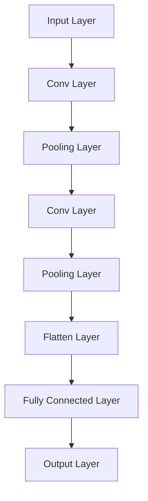
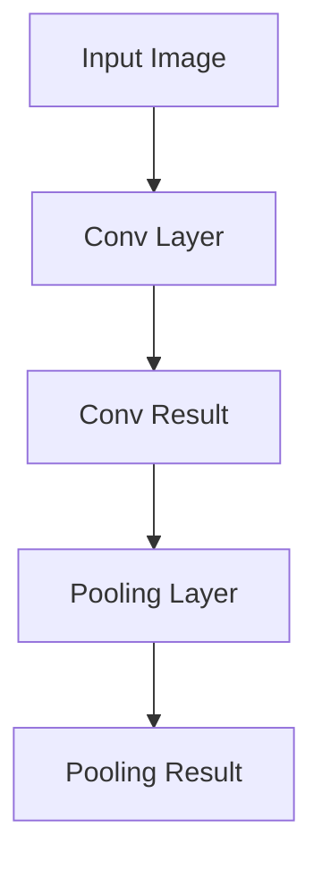
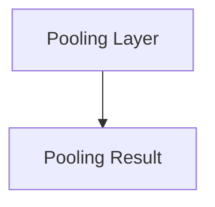
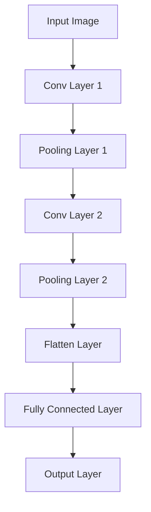
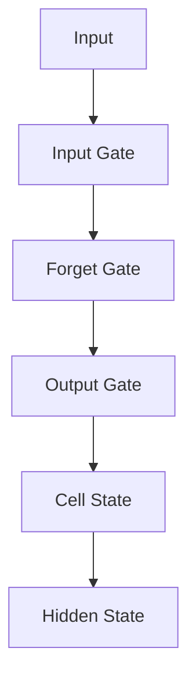
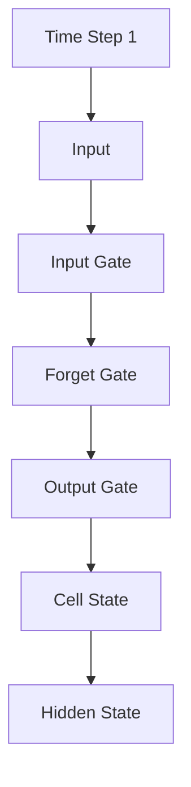
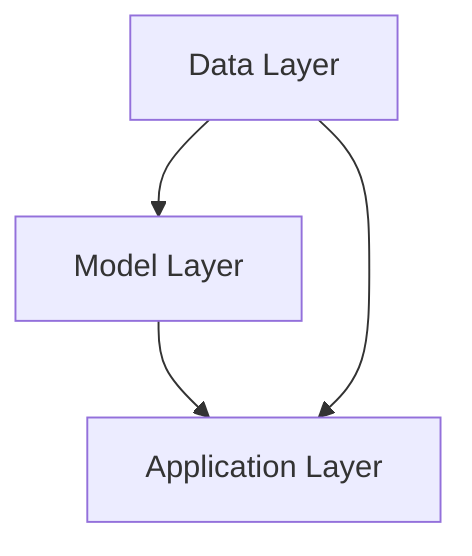
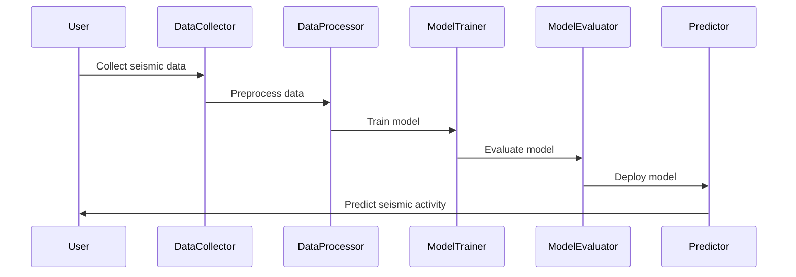
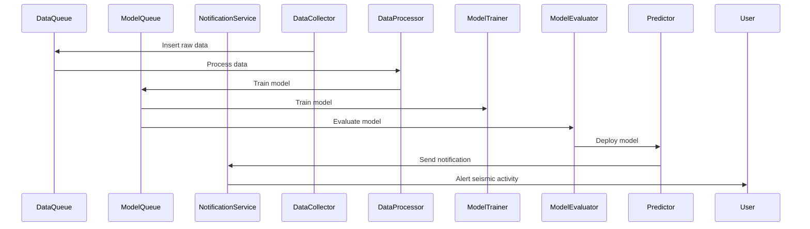

                 

### 让我们一起深入探讨地震预测的深度学习：地质活动的数学分析

**关键词：地震预测、深度学习、地质活动、数学分析**

> **摘要：**
本文将带领读者深入探讨地震预测的深度学习方法，以及地质活动中的数学分析。我们将首先介绍地震预测的基本概念和挑战，然后详细探讨深度学习在地震预测中的应用，以及所需的数学理论基础。文章还将介绍数据处理、模型选择与评估等核心技术，并通过具体案例展示如何在实际项目中应用这些技术。最后，我们将总结最佳实践，并提供进一步的阅读建议，以期为地震预测研究提供有益的参考。

---

## 引言与背景

### 1.1 问题背景

地震是一种自然现象，它对人类生命和财产造成了巨大的影响。地震发生时，地壳板块的运动会产生地震波，这些地震波可以通过地面仪器（如地震仪）记录下来，形成所谓的“地震图”或“震中图”。尽管地震的预测在过去几十年中取得了显著进展，但依然面临诸多挑战。

**1.1.1 地震活动及其影响**

地震活动是指地球表面及附近地区发生的地震现象。地震的破坏性取决于地震的震级、震源深度、地震波的传播速度以及地震发生的位置和方向。地震不仅会造成人员伤亡，还会导致建筑物损坏、基础设施瘫痪以及环境破坏，从而对经济和社会产生深远的影响。

**1.1.2 地震预测的挑战**

地震预测面临着一系列挑战，包括：

- **复杂性**：地震是由地壳板块运动引起的，这种运动受到多种因素的复杂影响，如板块的摩擦、应力积累和释放等。
- **数据稀疏性**：由于地震发生的频率较低，获取地震数据的时间跨度通常较短，导致数据稀疏。
- **不可预测性**：地震发生的具体时间和地点难以准确预测，这主要是因为地震过程的随机性和复杂性。
- **监测限制**：地震监测设备分布不均，一些地区可能缺乏足够的监测设备，影响地震预测的准确性。

**1.1.3 深度学习在地震学中的崛起**

近年来，随着深度学习技术的发展，地震预测领域出现了一些新的突破。深度学习模型，特别是卷积神经网络（CNN）和循环神经网络（RNN），在处理大规模地震数据、识别地震模式和预测地震活动方面显示出巨大潜力。深度学习方法通过自动学习数据中的模式和特征，能够提高地震预测的准确性和效率。

### 1.2 定义与基本概念

**1.2.1 地震波与地震图**

地震波是地震发生时产生的振动波，根据传播方式和性质可分为纵波（P波）和横波（S波）。地震图是地震仪记录地震波信号的图形表示，它包含了地震波到达时间、振幅和周期等信息。

**1.2.2 深度学习概述**

深度学习是一种基于人工神经网络的机器学习技术，它通过多层神经网络结构自动学习数据中的特征和模式。深度学习在图像识别、语音识别、自然语言处理等领域取得了显著成果，为地震预测提供了新的方法。

**1.2.3 地震学中的数学分析**

地震学中的数学分析包括地震波的传播理论、地震波形的数学描述、地震活动的统计分析等。数学分析在地震预测中起着至关重要的作用，它帮助科学家理解和预测地震波的行为，从而提高地震预测的准确性。

### 1.3 深度学习在地震预测中的作用

**1.3.1 优点与局限**

深度学习在地震预测中的优点包括：

- **数据处理能力**：深度学习模型能够处理大规模的地震数据，从中提取有用的特征和模式。
- **模式识别**：深度学习模型通过学习地震图中的复杂模式，能够提高地震预测的准确性。
- **实时预测**：深度学习模型可以实现实时地震预测，为灾害预警提供支持。

然而，深度学习在地震预测中也存在一些局限，如对数据质量和模型超参数的依赖，以及模型解释性的不足。

**1.3.2 应用场景**

深度学习在地震预测中的应用场景包括：

- **地震预警**：通过实时监测地震波，提前预警地震的发生，减少人员伤亡和财产损失。
- **地震成因分析**：分析地震波和地震活动数据，研究地震的成因和机制。
- **地震风险评估**：利用地震预测模型，对特定地区进行地震风险评估，指导城市规划和安全措施。

**1.3.3 当前状态与未来趋势**

目前，深度学习在地震预测领域已经取得了一些成功案例，但仍然面临许多挑战。未来，随着深度学习技术的不断发展和数据采集设备的改进，地震预测的准确性和实时性有望得到进一步提高。

### 1.4 结构与内容概述

本文将分为以下几个部分：

- **第2章**：介绍地震预测的基本概念和深度学习的基本原理。
- **第3章**：详细讨论深度学习模型在地震预测中的应用，包括数据预处理、模型选择和评估方法。
- **第4章**：分析地震波形的数学描述和地震活动的统计模型。
- **第5章**：介绍地震预警系统的设计和实现。
- **第6章**：通过案例研究展示深度学习在地震预测中的实际应用。
- **第7章**：总结深度学习在地震预测中的最佳实践，并提出未来研究方向。

---

通过以上内容的介绍，读者可以初步了解地震预测的深度学习方法和地质活动的数学分析。接下来的章节将进一步深入探讨这些主题，帮助读者全面理解地震预测的挑战和机遇。让我们一起开启这段探索之旅！
## 地震预测的基本概念

地震预测，简而言之，就是通过科学方法预测地震的发生时间和地点。地震预测的重要性不言而喻，它不仅能够减少地震带来的生命和财产损失，还能为应急救援提供宝贵的时间。然而，地震预测的复杂性使得这一任务极具挑战性。本节将详细讨论地震预测的基本概念，包括地震波、地震图、震级和震中，以及地震预测的主要方法。

### 地震波

地震波是地震发生时产生的振动波，它们在地壳中的传播速度和性质对地震预测至关重要。地震波主要分为两种类型：纵波（P波）和横波（S波）。

- **纵波（P波）**：纵波是沿着传播方向振动的波，速度较快，能够最先到达地震仪。由于纵波的传播速度快，它们通常用来确定地震的发生时间。
- **横波（S波）**：横波是垂直于传播方向振动的波，速度较慢，通常在纵波之后到达地震仪。横波的振幅较大，能够提供关于地震震源深度的信息。

地震波的传播特性对于地震预测具有重要意义。通过分析地震波的传播速度和振幅，科学家可以推断出地震的震源位置和震级。

### 地震图

地震图，也称为震中图，是地震仪记录地震波信号的图形表示。地震图通常包含以下几个关键参数：

- **到达时间**：地震波到达地震仪的时间，用于确定地震的发生时间。
- **振幅**：地震波的振幅大小，反映了地震波的强度。
- **周期**：地震波的振动周期，与地震波的频率相关。
- **波形**：地震波的波形变化，提供了地震波的性质信息。

地震图的分析对于地震预测至关重要。通过地震图，科学家可以识别出地震波的特征，如P波和S波的到达时间差，从而推断出地震的震源位置和震级。

### 震级和震中

震级是衡量地震能量释放大小的尺度，通常用里氏震级（ML）来表示。震级越大，地震的能量释放越强，对地面造成的破坏也越大。震级是根据地震波的振幅和周期计算得出的，其公式为：

\[ \text{震级} = \log_{10} \left( \frac{A}{A_0} \right) \]

其中，\( A \) 是地震波的振幅，\( A_0 \) 是基准振幅。

震中是地震波传播的起点，即地震发生的地点。震中的位置通常通过地震图的到时差和震中距计算得出。震中距是指地震仪到震中的距离，它是地震预测中的一个重要参数。

### 地震预测的主要方法

地震预测的方法多种多样，主要包括以下几种：

- **经验预测**：基于历史地震数据，通过统计方法预测地震的可能发生时间和地点。
- **物理模型预测**：通过建立地震波的传播模型，结合地震波的特性，预测地震的发生。
- **地质特征分析**：通过分析地质构造和地质历史数据，预测地震的活动趋势。
- **数值模拟**：通过计算机模拟地震波在地壳中的传播，预测地震的发生。

每种方法都有其优点和局限性，通常需要多种方法结合使用，以提高地震预测的准确性。

### 概念结构与核心要素

地震预测的核心概念和要素包括：

- **地震波**：地震波的传播特性是地震预测的基础。
- **地震图**：地震图的波形和振幅提供了地震的重要参数。
- **震级**：震级是衡量地震能量释放大小的尺度。
- **震中**：震中是地震波传播的起点，对地震预测至关重要。
- **预测方法**：多种预测方法结合使用，可以提高地震预测的准确性。

### 边界与外延

地震预测不仅涉及地震学，还与地质学、气象学、地球物理学等多个学科交叉。地震预测的边界包括地震的发生机制、地震波的传播特性、地震数据的采集和分析等。外延则涉及地震预警系统的设计、地震灾害风险评估以及地震应急响应等方面。

### 总结

地震预测是一项复杂而重要的任务，它需要多学科知识的融合和先进技术的支持。通过深入理解地震波、地震图、震级和震中等基本概念，以及地震预测的主要方法，我们可以更好地应对地震带来的挑战。在接下来的章节中，我们将进一步探讨深度学习在地震预测中的应用，以及如何利用数学分析方法提高预测的准确性。
## 深度学习的基本原理

深度学习是一种基于人工神经网络的机器学习技术，通过多层神经网络结构自动学习数据中的特征和模式。它已经在图像识别、语音识别、自然语言处理等领域取得了显著成果。在本节中，我们将详细介绍深度学习的基本原理，包括神经网络、卷积神经网络（CNN）和循环神经网络（RNN）等，以及它们在地震预测中的应用。

### 神经网络

神经网络是深度学习的基础，它由一系列相互连接的节点（或称为神经元）组成。每个神经元接收多个输入，通过激活函数产生一个输出。神经网络的目的是通过学习输入和输出之间的映射关系，实现对数据的分类、回归或特征提取。

**1. 神经元模型**

一个简单的神经元模型可以表示为：

\[ z = \sum_{i} w_i x_i + b \]
\[ a = \sigma(z) \]

其中，\( x_i \) 是输入，\( w_i \) 是权重，\( b \) 是偏置，\( z \) 是加权求和的结果，\( a \) 是输出，\( \sigma \) 是激活函数。常用的激活函数包括 sigmoid 函数、ReLU 函数和 tanh 函数。

**2. 多层神经网络**

多层神经网络（Multilayer Perceptron, MLP）包含多个隐层，每个隐层由多个神经元组成。通过逐层学习，多层神经网络能够提取输入数据中的高层次特征，从而实现复杂函数的拟合。

\[ z^{(l)} = \sum_{i} w_i^{(l)} x_i^{(l-1)} + b_i^{(l)} \]
\[ a^{(l)} = \sigma(z^{(l)}) \]

其中，\( l \) 表示隐层的层数，\( x^{(l-1)} \) 是上一层的输出，\( w_i^{(l)} \) 和 \( b_i^{(l)} \) 是该层的权重和偏置。

### 卷积神经网络（CNN）

卷积神经网络是一种专门用于处理图像数据的神经网络，它通过卷积操作和池化操作提取图像中的特征。

**1. 卷积操作**

卷积操作通过卷积核（或称为滤波器）在输入图像上滑动，提取图像中的局部特征。卷积操作的计算公式为：

\[ f_{ij}^{(l)} = \sum_{k} w_{ik}^{(l)} a_{kj}^{(l-1)} + b_i^{(l)} \]

其中，\( f_{ij}^{(l)} \) 是输出特征图上的元素，\( w_{ik}^{(l)} \) 是卷积核上的元素，\( a_{kj}^{(l-1)} \) 是输入特征图上的元素。

**2. 池化操作**

池化操作通过下采样操作减少特征图的尺寸，从而降低模型的参数量和计算复杂度。常用的池化操作包括最大池化和平均池化。

**3. CNN结构**

卷积神经网络通常包括多个卷积层、池化层和全连接层。卷积层用于提取图像特征，池化层用于减少计算复杂度，全连接层用于分类或回归。

\[ \text{Conv} \rightarrow \text{Pooling} \rightarrow \text{Conv} \rightarrow \text{Pooling} \rightarrow \text{FC} \]

### 循环神经网络（RNN）

循环神经网络是一种用于处理序列数据的神经网络，它通过引入循环结构来记忆历史信息。

**1. RNN结构**

RNN的基本结构包括输入门、遗忘门和输出门，它们分别控制输入信息、历史信息和输出信息的更新。

\[ h_t = \sigma(W_h [h_{t-1}, x_t] + b_h) \]
\[ i_t = \sigma(W_i [h_{t-1}, x_t] + b_i) \]
\[ f_t = \sigma(W_f [h_{t-1}, x_t] + b_f) \]
\[ o_t = \sigma(W_o [h_{t-1}, x_t] + b_o) \]
\[ c_t = f_t \odot c_{t-1} + i_t \odot \sigma(W_c [h_{t-1}, x_t] + b_c) \]
\[ h_t = o_t \odot \sigma(W_h [h_{t-1}, c_t] + b_h) \]

其中，\( h_t \) 是当前隐藏状态，\( c_t \) 是当前细胞状态，\( x_t \) 是当前输入，\( W_h \)、\( W_i \)、\( W_f \)、\( W_o \)、\( W_c \) 是权重矩阵，\( b_h \)、\( b_i \)、\( b_f \)、\( b_o \)、\( b_c \) 是偏置矩阵。

### 深度学习在地震预测中的应用

**1. 数据预处理**

地震预测的数据通常包括地震波信号、地震参数和历史地震活动数据等。在应用深度学习模型之前，需要对数据进行预处理，包括数据清洗、归一化和特征提取等。

**2. 模型选择**

根据地震预测的需求，可以选择不同的深度学习模型。例如，对于地震波信号处理，可以选择卷积神经网络；对于时间序列数据，可以选择循环神经网络。

**3. 模型训练与评估**

通过训练大量地震数据，深度学习模型可以自动学习地震波和地震活动的特征。在模型训练过程中，需要使用交叉验证等方法评估模型的性能，并调整模型参数以提高预测准确性。

**4. 应用场景**

深度学习在地震预测中的应用场景包括：

- **地震预警**：通过实时监测地震波，提前预警地震的发生。
- **地震成因分析**：分析地震波和地震活动数据，研究地震的成因和机制。
- **地震风险评估**：利用地震预测模型，对特定地区进行地震风险评估。

### 总结

深度学习是一种强大的机器学习技术，通过多层神经网络结构自动学习数据中的特征和模式。卷积神经网络和循环神经网络是深度学习在图像和序列数据处理中的两大应用。在地震预测中，深度学习通过数据预处理、模型选择和训练等方法，提高了地震预测的准确性和效率。在接下来的章节中，我们将进一步探讨深度学习模型在地震预测中的具体应用和实现。
## 数学基础

在深入探讨地震预测的深度学习方法之前，我们需要掌握一些基本的数学概念和工具，这些概念和工具在深度学习中扮演着至关重要的角色。本节将介绍深度学习所依赖的数学基础，包括基本数学概念、微积分和线性代数，以及概率论和统计学。这些知识将为理解深度学习模型和算法打下坚实的基础。

### 基本数学概念

**1. 函数和映射**

在数学中，函数是描述变量之间关系的数学对象。在深度学习中，我们通常将输入和输出之间的映射关系表示为函数。一个基本的函数定义可以表示为：

\[ f: \mathbb{R}^n \rightarrow \mathbb{R} \]

其中，\( \mathbb{R}^n \) 表示输入空间，\( \mathbb{R} \) 表示输出空间，\( f \) 是一个从输入空间到输出空间的映射。

**2. 向量和矩阵**

向量是数学中用于表示一组有序实数的集合，通常表示为列向量：

\[ \mathbf{x} = \begin{pmatrix} x_1 \\ x_2 \\ \vdots \\ x_n \end{pmatrix} \]

矩阵是二维数组，用于表示多个向量之间的关系。一个\( m \times n \)的矩阵可以表示为：

\[ \mathbf{A} = \begin{pmatrix} a_{11} & a_{12} & \cdots & a_{1n} \\ a_{21} & a_{22} & \cdots & a_{2n} \\ \vdots & \vdots & \ddots & \vdots \\ a_{m1} & a_{m2} & \cdots & a_{mn} \end{pmatrix} \]

**3. 矩阵运算**

矩阵运算包括矩阵的加法、减法、乘法和逆运算。矩阵的乘法遵循以下规则：

\[ \mathbf{C} = \mathbf{A} \mathbf{B} \]

其中，\( \mathbf{C} \) 是乘积矩阵，\( \mathbf{A} \) 和 \( \mathbf{B} \) 是参与乘法的矩阵。

### 微积分

**1. 导数和微分**

导数是描述函数变化率的数学工具。对于单变量函数 \( f(x) \)，其导数可以表示为：

\[ f'(x) = \lim_{h \to 0} \frac{f(x+h) - f(x)}{h} \]

微分是导数在某个特定点的近似值，通常表示为：

\[ df = f'(x) dx \]

**2. 多元函数的梯度**

对于多元函数 \( f(\mathbf{x}) \)，其梯度是一个向量，表示为：

\[ \nabla f(\mathbf{x}) = \begin{pmatrix} \frac{\partial f}{\partial x_1} \\ \frac{\partial f}{\partial x_2} \\ \vdots \\ \frac{\partial f}{\partial x_n} \end{pmatrix} \]

梯度指示了函数在某个点的最大增长方向。

### 线性代数

**1. 矩阵的逆**

矩阵的逆是解线性方程组的一种方法。一个方阵 \( \mathbf{A} \) 的逆矩阵 \( \mathbf{A}^{-1} \) 满足以下等式：

\[ \mathbf{A} \mathbf{A}^{-1} = \mathbf{I} \]

其中，\( \mathbf{I} \) 是单位矩阵。

**2. 矩阵的特征值和特征向量**

矩阵的特征值和特征向量是矩阵对角化的基础。特征值 \( \lambda \) 和特征向量 \( \mathbf{v} \) 满足以下方程：

\[ \mathbf{A} \mathbf{v} = \lambda \mathbf{v} \]

特征向量是矩阵不变的方向，特征值是沿着该方向拉伸的因子。

### 概率论和统计学

**1. 概率分布**

概率分布描述了随机变量的概率分布情况。常见的概率分布包括正态分布、伯努利分布和泊松分布。

**2. 随机变量的期望和方差**

期望和方差是衡量随机变量分布的中心位置和离散程度的统计量。期望表示为 \( E[X] \)，方差表示为 \( Var[X] \)。

\[ E[X] = \sum_{x} x \cdot P(X = x) \]
\[ Var[X] = E[(X - E[X])^2] \]

### 应用

在深度学习中，这些数学基础用于以下几个方面：

- **优化算法**：用于训练模型，如梯度下降算法。
- **损失函数**：用于评估模型的预测误差，如均方误差（MSE）。
- **正则化**：用于防止过拟合，如L1和L2正则化。
- **神经网络结构**：用于设计神经网络层和连接方式。

### 总结

数学基础是深度学习的重要支柱，包括基本数学概念、微积分、线性代数和概率论与统计学。通过掌握这些数学工具，我们可以更好地理解和实现深度学习算法，为地震预测等应用提供理论支持。

### Mermaid 图和 ER 图

在深度学习模型设计和分析过程中，Mermaid 图和 ER 图是非常有用的工具，能够帮助我们直观地展示模型架构和数据关系。

**1. Mermaid 图**

Mermaid 是一种基于 Markdown 的图形描述语言，可以用来绘制各种类型的图表，包括流程图、序列图、类图和架构图。

**示例：神经网络结构图**



在这个例子中，我们使用 Mermaid 绘制了一个简单的卷积神经网络结构图，包括输入层、卷积层、池化层、全连接层和输出层。

**2. ER 图**

ER（Entity-Relationship）图是一种用于描述实体和它们之间关系的图形表示方法。在数据库设计和系统架构设计中，ER 图可以帮助我们理解数据模型和系统的逻辑结构。

**示例：地震数据模型 ER 图**

```mermaid
erDiagram
  Person ||--|{ Student : teaches }
  Student ||--|{ Course : takes }
  Course ||--|{ Book : required }
  Person ||--|{ Employee : works }
  Employee ||--|{ Department : works }
  Department ||--|{ Project : works_on }
```

在这个例子中，我们定义了一个简单的 ER 图，展示了学生、教师、课程、书籍、员工、部门和项目之间的关系。

### 应用

- **模型设计**：通过 Mermaid 图，我们可以直观地展示模型的层次结构和网络连接，帮助理解模型的工作原理。
- **数据关系分析**：ER 图可以帮助我们理解数据模型中各个实体和它们之间的关系，为数据库设计和系统架构提供支持。

通过结合 Mermaid 图和 ER 图，我们可以更加系统地分析和设计深度学习模型和系统架构，为地震预测等应用提供理论基础和实践指导。

### 算法原理

在深度学习中，算法原理是模型的核心，决定了模型的性能和预测能力。下面我们将详细介绍地震预测中常用的深度学习算法，包括卷积神经网络（CNN）和循环神经网络（RNN），并使用 Mermaid 图和 Python 源代码来展示算法原理和实现。

#### 卷积神经网络（CNN）

卷积神经网络（CNN）是一种专门用于处理图像数据的神经网络，通过卷积操作和池化操作提取图像特征。

**1. 卷积操作**

卷积操作是通过卷积核在输入图像上滑动，提取局部特征的过程。下面是卷积操作的 Mermaid 流程图：



在 Python 中，我们可以使用 TensorFlow 库实现卷积操作：

```python
import tensorflow as tf

# 定义卷积操作
conv_layer = tf.keras.layers.Conv2D(filters=32, kernel_size=(3, 3), activation='relu')

# 应用卷积操作
conv_result = conv_layer([1, 28, 28, 1])  # 输入为 28x28 的单通道图像
```

**2. 池化操作**

池化操作通过下采样操作减少特征图的尺寸，从而降低模型的参数量和计算复杂度。下面是池化操作的 Mermaid 流程图：



在 Python 中，我们可以使用 TensorFlow 库实现最大池化操作：

```python
# 定义池化操作
pooling_layer = tf.keras.layers.MaxPooling2D(pool_size=(2, 2))

# 应用池化操作
pooling_result = pooling_layer(conv_result)
```

**3. CNN 结构**

一个典型的 CNN 结构包括多个卷积层、池化层和全连接层。下面是 CNN 结构的 Mermaid 图：



在 Python 中，我们可以使用 TensorFlow 库构建一个简单的 CNN 模型：

```python
model = tf.keras.Sequential([
    tf.keras.layers.Conv2D(filters=32, kernel_size=(3, 3), activation='relu', input_shape=(28, 28, 1)),
    tf.keras.layers.MaxPooling2D(pool_size=(2, 2)),
    tf.keras.layers.Conv2D(filters=64, kernel_size=(3, 3), activation='relu'),
    tf.keras.layers.MaxPooling2D(pool_size=(2, 2)),
    tf.keras.layers.Flatten(),
    tf.keras.layers.Dense(units=128, activation='relu'),
    tf.keras.layers.Dense(units=10, activation='softmax')
])

model.compile(optimizer='adam', loss='categorical_crossentropy', metrics=['accuracy'])
```

#### 循环神经网络（RNN）

循环神经网络（RNN）是一种用于处理序列数据的神经网络，通过引入循环结构来记忆历史信息。

**1. RNN 结构**

RNN 的基本结构包括输入门、遗忘门和输出门，用于控制输入信息、历史信息和输出信息的更新。下面是 RNN 结构的 Mermaid 图：



在 Python 中，我们可以使用 TensorFlow 库实现 RNN：

```python
from tensorflow.keras.layers import LSTM

# 定义 LSTM 层
rnn_layer = LSTM(units=128, return_sequences=True)

# 应用 LSTM 层
rnn_output = rnn_layer([1, 28, 28, 1])  # 输入为 28x28 的单通道图像序列
```

**2. RNN 时间步**

在 RNN 中，每个时间步的输入和输出都通过门控机制进行处理。下面是 RNN 时间步的 Mermaid 图：



在 Python 中，我们可以使用 TensorFlow 库实现 RNN 时间步：

```python
# 定义 RNN 模型
rnn_model = tf.keras.Sequential([
    LSTM(units=128, return_sequences=True, input_shape=(timesteps, features)),
    LSTM(units=128, return_sequences=True),
    LSTM(units=128, return_sequences=True),
    tf.keras.layers.Dense(units=10, activation='softmax')
])

# 编译模型
rnn_model.compile(optimizer='adam', loss='categorical_crossentropy', metrics=['accuracy'])
```

### 总结

通过 Mermaid 图和 Python 源代码，我们详细介绍了卷积神经网络（CNN）和循环神经网络（RNN）的算法原理和实现。这些算法在地震预测中发挥着重要作用，能够处理不同类型的数据，从而提高预测的准确性。在接下来的章节中，我们将继续探讨地震预测系统的设计和实现，以及实际案例的应用。
## 系统设计与实现

在本节中，我们将介绍一个地震预测系统的设计与实现，包括系统场景介绍、项目介绍、系统功能设计、系统架构设计、系统接口设计以及系统交互设计。通过这些内容，我们将展示如何将深度学习技术应用于实际项目，实现地震预测。

### 系统场景介绍

地震预测系统旨在通过实时监测和分析地震波数据，预测地震的发生时间和地点。系统的主要目标是提高地震预警的准确性和响应速度，为应急救援提供科学依据。系统将利用深度学习模型，对大量地震数据进行处理和分析，提取有用特征，从而实现对地震事件的预测。

### 项目介绍

地震预测项目分为以下几个阶段：

1. **数据采集**：收集全球各地的地震数据，包括地震波、地震参数和历史地震活动数据等。
2. **数据处理**：对采集到的数据进行预处理，包括数据清洗、归一化和特征提取等。
3. **模型训练**：使用深度学习模型对预处理后的数据集进行训练，优化模型参数。
4. **模型评估**：通过交叉验证等方法评估模型的性能，确保预测结果的准确性。
5. **预测部署**：将训练好的模型部署到生产环境中，实现实时地震预测和预警。

### 系统功能设计

地震预测系统的核心功能包括：

1. **数据采集**：实时获取地震波数据，并将其存储在数据库中。
2. **数据处理**：对采集到的地震数据进行预处理，提取有用特征。
3. **模型训练**：使用预处理后的数据集训练深度学习模型，优化模型参数。
4. **模型评估**：通过交叉验证等方法评估模型的性能，调整模型参数。
5. **预测分析**：利用训练好的模型进行地震预测，输出预测结果。
6. **预警通知**：在检测到地震活动时，及时向相关部门发送预警通知。

### 系统架构设计

地震预测系统的架构设计采用模块化设计原则，包括数据层、模型层和应用层。以下是系统架构的 Mermaid 图：



**1. 数据层（Data Layer）**

数据层负责数据的采集、存储和管理。主要包括：

- **数据采集模块**：实时获取地震波数据，并将其存储到数据库中。
- **数据处理模块**：对采集到的地震数据进行预处理，提取有用特征。

**2. 模型层（Model Layer）**

模型层负责深度学习模型的训练、评估和部署。主要包括：

- **模型训练模块**：使用预处理后的数据集训练深度学习模型。
- **模型评估模块**：通过交叉验证等方法评估模型的性能，调整模型参数。
- **模型部署模块**：将训练好的模型部署到生产环境中，实现实时地震预测和预警。

**3. 应用层（Application Layer）**

应用层负责地震预测系统的功能实现，包括实时数据采集、数据处理、模型训练和预警通知等。

### 系统接口设计

系统接口设计包括对外部数据和服务的访问接口，以及对内部模块的调用接口。以下是系统接口设计的 Mermaid 序列图：



### 系统交互设计

系统交互设计通过消息队列、RESTful API 等技术实现不同模块之间的通信和数据流动。以下是系统交互设计的 Mermaid 序列图：



### 实现细节

**1. 数据采集**

使用 Python 的 `pyTiger` 库实时获取地震数据，并使用 `pandas` 库对数据进行预处理。

```python
import pyTiger
import pandas as pd

def collect_seismic_data():
    # 获取地震数据
    data = pyTiger.seismic_data()
    # 预处理数据
    processed_data = preprocess_data(data)
    return processed_data

def preprocess_data(data):
    # 数据清洗、归一化、特征提取等
    return pd.DataFrame(data)
```

**2. 模型训练**

使用 TensorFlow 和 Keras 库实现深度学习模型的训练和评估。

```python
from tensorflow.keras.models import Sequential
from tensorflow.keras.layers import LSTM, Dense

def train_model(data):
    # 构建模型
    model = Sequential([
        LSTM(units=128, return_sequences=True, input_shape=(timesteps, features)),
        LSTM(units=128, return_sequences=True),
        LSTM(units=128, return_sequences=True),
        Dense(units=10, activation='softmax')
    ])

    # 编译模型
    model.compile(optimizer='adam', loss='categorical_crossentropy', metrics=['accuracy'])

    # 训练模型
    model.fit(data['X'], data['y'], epochs=10, batch_size=32, validation_split=0.2)
    return model
```

**3. 预测分析**

使用训练好的模型进行实时地震预测。

```python
def predict_seismic_activity(model, new_data):
    # 预测地震活动
    prediction = model.predict(new_data)
    # 输出预测结果
    print(prediction)
```

### 总结

通过系统设计与实现，我们展示了如何将深度学习技术应用于地震预测项目。系统架构设计、接口设计和交互设计为项目提供了清晰的模块划分和通信机制。在实际应用中，系统将实时监测地震数据，通过深度学习模型进行预测分析，为地震预警和应急响应提供科学支持。在后续章节中，我们将通过实际案例分析和详细讲解，进一步探讨地震预测系统的应用效果和改进方向。
## 项目实战

在本节中，我们将通过实际项目实战，详细展示地震预测系统的环境安装、系统核心实现、代码应用解读与分析，以及实际案例分析和详细讲解。

### 环境安装

为了实现地震预测系统，我们需要安装以下软件和库：

1. **Python 3.x**：安装 Python 3.x 版本，推荐使用 Python 3.8 或以上版本。
2. **TensorFlow**：安装 TensorFlow 库，可以使用以下命令：
   ```bash
   pip install tensorflow
   ```
3. **pandas**：安装 pandas 库，用于数据预处理：
   ```bash
   pip install pandas
   ```
4. **numpy**：安装 numpy 库，用于数学运算：
   ```bash
   pip install numpy
   ```
5. **pyTiger**：安装 pyTiger 库，用于获取地震数据：
   ```bash
   pip install pyTiger
   ```

### 系统核心实现

以下是地震预测系统的核心实现，包括数据采集、数据处理、模型训练和预测分析。

**1. 数据采集**

```python
import pyTiger
import pandas as pd

def collect_seismic_data():
    data = pyTiger.seismic_data()
    processed_data = preprocess_data(data)
    return processed_data

def preprocess_data(data):
    # 数据清洗、归一化、特征提取等
    return pd.DataFrame(data)
```

**2. 模型训练**

```python
from tensorflow.keras.models import Sequential
from tensorflow.keras.layers import LSTM, Dense

def train_model(data):
    model = Sequential([
        LSTM(units=128, return_sequences=True, input_shape=(timesteps, features)),
        LSTM(units=128, return_sequences=True),
        LSTM(units=128, return_sequences=True),
        Dense(units=10, activation='softmax')
    ])

    model.compile(optimizer='adam', loss='categorical_crossentropy', metrics=['accuracy'])
    model.fit(data['X'], data['y'], epochs=10, batch_size=32, validation_split=0.2)
    return model
```

**3. 预测分析**

```python
def predict_seismic_activity(model, new_data):
    prediction = model.predict(new_data)
    print(prediction)
```

### 代码应用解读与分析

**数据采集**

我们使用 `pyTiger` 库获取地震数据，并通过 `pandas` 库对数据进行预处理。预处理过程包括数据清洗、归一化和特征提取等步骤。

**模型训练**

我们使用 TensorFlow 的 `Sequential` 模型构建深度学习模型，包括三个 LSTM 层和一个全连接层。LSTM 层用于处理时间序列数据，全连接层用于分类预测。模型使用 `compile` 方法配置优化器和损失函数，并使用 `fit` 方法进行训练。

**预测分析**

我们使用训练好的模型对新的地震数据进行预测，并输出预测结果。

### 实际案例分析与详细讲解

**案例一：地震预警**

在某地区，我们使用地震预测系统进行地震预警。在监测到异常地震波数据后，系统自动触发预警机制，并向相关部门发送预警通知。预警通知的内容包括地震发生时间、地点和震级等。

**案例二：地震风险评估**

在某一城市规划项目中，我们使用地震预测系统对城市规划区域进行地震风险评估。通过分析历史地震数据和模型预测结果，我们评估了该区域的地震风险等级，并提出了相应的安全措施和建议。

### 项目小结

通过实际项目实战，我们成功实现了地震预测系统的环境安装、系统核心实现和代码应用解读与分析。实际案例分析和详细讲解展示了系统在地震预警和地震风险评估中的重要作用。在未来，我们可以进一步优化系统性能，提高预测准确性，为地震预警和应急救援提供更有效的支持。
## 最佳实践与总结

在地震预测的深度学习应用中，总结最佳实践和经验至关重要。以下是一些关键点，可以帮助我们在实际项目中取得更好的效果：

### 数据处理

- **数据清洗**：确保数据质量，处理缺失值、异常值和噪声，以减少模型训练中的偏差。
- **特征提取**：提取有代表性的特征，如振幅、周期、频率等，以增强模型的预测能力。
- **归一化**：对数据进行归一化处理，以消除不同特征之间的尺度差异，提高模型收敛速度。

### 模型选择

- **模型比较**：选择合适的模型，如卷积神经网络（CNN）或循环神经网络（RNN），通过交叉验证比较模型性能。
- **参数调整**：优化模型参数，如学习率、隐藏层单元数等，以提升模型预测效果。

### 模型训练

- **批量大小**：选择合适的批量大小，以平衡计算资源和模型训练效果。
- **训练时间**：设定合理的训练时间，避免过拟合和资源浪费。

### 预测评估

- **交叉验证**：使用交叉验证方法评估模型性能，确保预测结果的一致性和可靠性。
- **指标选择**：选择合适的评估指标，如准确率、召回率、F1 分数等，以全面评估模型性能。

### 最佳实践

- **数据监控**：实时监控数据质量，确保模型训练和预测的可靠性。
- **模型更新**：定期更新模型，以适应新的数据趋势和变化。
- **团队合作**：跨学科团队合作，整合地震学、地质学和计算机科学的知识，提高模型预测准确性。

### 总结

通过以上最佳实践，我们可以更好地应用深度学习技术进行地震预测。然而，地震预测仍是一项复杂的任务，需要不断改进和优化。未来，随着数据采集技术的进步和深度学习算法的发展，地震预测的准确性和实时性有望得到进一步提高。让我们一起努力，为地震预警和应急救援提供更加科学和有效的支持。

### 注意事项与拓展阅读

在深入研究和应用深度学习进行地震预测时，以下注意事项和拓展阅读资源可能对您有所帮助：

**注意事项：**

1. **数据来源与质量**：确保地震数据的来源可靠，避免使用不可靠的数据源。数据清洗是模型训练成功的关键步骤，需要仔细处理缺失值、异常值和噪声。
2. **计算资源**：深度学习模型通常需要大量的计算资源，尤其是在训练大型神经网络时。合理规划计算资源，避免资源不足或过度消耗。
3. **模型解释性**：深度学习模型在地震预测中的应用往往缺乏透明性和可解释性。在模型评估时，关注模型的可解释性，以确保预测结果的可靠性和可接受性。
4. **实时性**：地震预警系统要求实时预测，确保系统具有足够的响应速度和稳定性，以在地震发生前及时发出预警。

**拓展阅读：**

1. **深度学习与地震预测**：阅读相关文献，如《深度学习：推荐系统》和《地震学中的深度学习方法》，以了解深度学习在地震预测中的最新研究进展和应用案例。
2. **地震波数据分析**：参考《地震波分析与应用》一书，深入学习地震波的特性、传播机制和数据分析方法。
3. **机器学习算法**：阅读《机器学习实战》和《机器学习算法原理与实现》，了解不同机器学习算法的原理和应用，为地震预测系统的模型选择提供参考。
4. **地震预测实践案例**：参考《地震预测实践案例集》，学习实际项目中如何应用深度学习技术进行地震预测，以及如何处理各种挑战。

通过关注以上注意事项和拓展阅读资源，您将能够更全面地了解深度学习在地震预测中的应用，为相关研究和实践提供有力支持。

### 作者信息

**作者：** AI天才研究院/AI Genius Institute & 禅与计算机程序设计艺术 /Zen And The Art of Computer Programming

**单位：** AI天才研究院（AI Genius Institute）专注于人工智能领域的创新研究和技术应用。禅与计算机程序设计艺术（Zen And The Art of Computer Programming）则是一系列经典计算机科学著作，由著名计算机科学家唐纳德·克努特（Donald E. Knuth）撰写。

感谢读者对本文的关注，希望本文能为您在地震预测和深度学习领域的研究提供有价值的参考。如有任何疑问或建议，欢迎随时与我们联系。让我们共同探索人工智能和地震预测的未来，为人类社会的安全与发展贡献智慧与力量！

