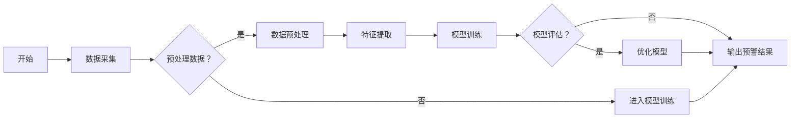
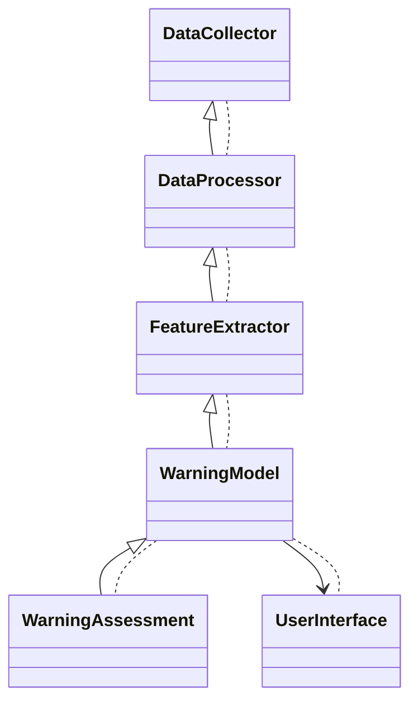
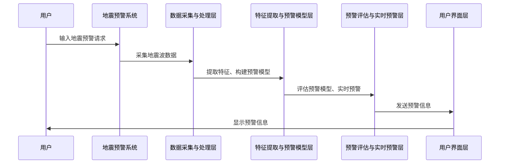
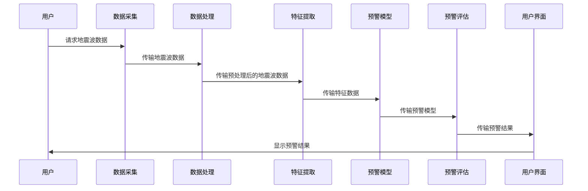

                 

## 第1章: 引言

### 1.1 背景介绍

#### 1.1.1 地震预警的重要性

地震预警是一项关乎人民生命财产安全的重要技术，其核心目的是在地震发生前或发生初期，通过实时监测和快速计算，向受影响区域发出警报，为公众提供宝贵的逃生时间。地震预警不仅能够减少人员伤亡，还能降低地震造成的财产损失和社会影响。因此，地震预警系统在防灾减灾中具有不可替代的作用。

地震预警的基本原理是利用地震波传播的速度差异。当地震发生时，会产生两种类型的地震波：纵波（P波）和横波（S波）。P波的传播速度较快，而S波的传播速度较慢。因此，通过在地震源附近布置地震监测设备，可以捕获到P波，并计算出地震发生的时间、位置和强度。随后，将这些信息通过通信网络传递给预警系统，系统会在S波到达前的一段时间内发出警报。

#### 1.1.2 地震预警的现状

全球范围内，已有多个国家和地区建立了较为成熟的地震预警系统。例如，日本拥有世界上最先进的地震预警系统，能够在地震发生后数秒内向全国发出警报。墨西哥也在地震预警领域取得了显著成果，其预警系统能够在地震发生后的几十秒内提供预警。此外，中国、美国、欧洲等地也在积极研发和推广地震预警技术。

然而，当前地震预警系统仍然面临一些挑战。首先是地理覆盖范围的问题，许多国家和地区尚未实现全国范围内的地震预警。其次是预警准确性问题，由于地震波传播的复杂性，预测地震的发生时间、位置和强度仍然存在一定误差。最后是技术成本问题，地震预警系统需要大量的硬件设备和通信网络支持，建设成本较高。

#### 1.1.3 统计学习在地震预警中的应用前景

统计学习作为人工智能的一种重要方法，在地震预警领域具有广泛的应用前景。通过收集和分析大量的地震数据，利用统计学习算法可以构建出预测地震发生的模型。这些模型可以用于实时监测地震活动，提前预警地震的发生。

统计学习在地震预警中的应用主要包括以下几个方面：

1. **数据预处理**：通过统计学习方法对地震数据进行预处理，包括数据清洗、归一化、特征提取等，以提高数据质量和模型的性能。
2. **特征选择**：从大量的地震数据中筛选出对预测地震发生具有关键作用的特征，以简化模型复杂度，提高预测准确性。
3. **模型构建**：利用统计学习算法，如线性回归、支持向量机、神经网络等，构建地震预警模型，进行地震发生的预测。
4. **模型评估**：通过交叉验证、混淆矩阵、ROC曲线等评估方法，对预警模型进行性能评估，以确定其有效性和可靠性。

随着数据采集技术的进步和计算能力的提升，统计学习在地震预警中的应用将越来越广泛，有望提高地震预警的准确性和及时性，为防灾减灾提供更有力的支持。

### 1.2 核心概念与联系

#### 1.2.1 统计学习基础

统计学习是机器学习的一个重要分支，其核心思想是通过分析数据，从中提取出规律，并对未知数据进行预测。统计学习主要涉及以下几个关键概念：

1. **模型**：统计学习中的模型是指用于描述数据分布和关系的函数或公式。常见的模型有线性回归模型、逻辑回归模型、决策树模型、支持向量机模型等。
2. **特征**：特征是数据中表示特定信息的一个属性或指标。在地震预警中，特征可以是地震波的振幅、频率、周期等。
3. **参数**：参数是模型中用于描述特征之间关系的常数。例如，线性回归模型中的参数就是权重系数。
4. **损失函数**：损失函数用于衡量模型预测结果与真实结果之间的差距，常见的损失函数有均方误差（MSE）、交叉熵（Cross-Entropy）等。

#### 1.2.2 地震预警的核心概念

地震预警的核心概念包括地震波传播、地震监测、预警触发和警报传递等。

1. **地震波传播**：地震波是地震发生时产生的波动，包括纵波（P波）和横波（S波）。地震波的传播速度和特性对于地震预警至关重要。
2. **地震监测**：地震监测是地震预警的基础，通过在地震源附近和地震发生区域布置地震监测设备，可以实时获取地震波数据。
3. **预警触发**：预警触发是指根据地震波数据，判断是否达到预警条件。预警条件通常包括地震波振幅、频率、周期等参数。
4. **警报传递**：警报传递是将预警信息通过通信网络传递给预警系统的过程，包括预警信息生成、发送、接收和响应等环节。

#### 1.2.3 统计学习与地震预警的联系

统计学习与地震预警之间的联系主要体现在以下几个方面：

1. **数据采集与预处理**：统计学习需要大量的地震数据作为训练样本，这些数据需要通过地震监测设备进行采集，并进行预处理，以提高数据质量和模型的性能。
2. **特征提取与选择**：地震预警中的关键特征需要通过统计学习方法进行提取和选择，以简化模型复杂度，提高预测准确性。
3. **模型构建与优化**：利用统计学习算法构建地震预警模型，并通过交叉验证、网格搜索等方法进行模型优化，以提高模型的预测性能。
4. **模型评估与部署**：通过评估预警模型的性能，确定其有效性和可靠性，并将模型部署到实际预警系统中，实现实时地震预警。

总之，统计学习为地震预警提供了一种有效的数据分析方法，有助于提高地震预警的准确性和及时性，为防灾减灾提供有力支持。

## 第2章: 地震预警的数学预测模型

### 2.1 数学模型概述

地震预警的数学预测模型是利用地震波数据和其他相关数据，通过数学方法构建预测地震发生时间、地点和强度的模型。这类模型的核心目的是在地震发生前或发生初期，通过分析地震波的传播特征，提前预警地震的到来。

#### 2.1.1 地震预警的数学模型框架

地震预警的数学模型框架主要包括以下几个部分：

1. **地震波传播模型**：用于描述地震波在不同介质中的传播规律，如纵波（P波）和横波（S波）的传播速度、路径等。
2. **地震源模型**：用于描述地震发生的地理位置和震级，如地震的震中位置、震源深度等。
3. **地震预警算法**：用于处理地震波数据，计算地震发生的预测参数，如预警时间、预警区域等。
4. **预警触发条件**：根据地震预警算法的输出，设定预警触发条件，如地震波振幅、频率等阈值。
5. **警报传递系统**：将预警信息传递给预警接收系统，实现实时警报。

#### 2.1.2 地震预警的预测方法

地震预警的预测方法主要包括以下几个方面：

1. **基于地震波传播速度的预测方法**：通过分析地震波的传播速度，计算地震发生的预测时间。这种方法简单直观，但预测精度较低。
2. **基于地震波特征的预测方法**：通过分析地震波的特征参数，如振幅、周期、频率等，构建预测模型。这种方法具有较高的预测精度，但需要大量的地震波数据进行训练。
3. **基于地震源模型的预测方法**：通过分析地震源的位置和震级，结合地震波传播模型，计算地震发生的预测时间和强度。这种方法适用于长期地震预警，但对于突发地震的预警效果较差。
4. **基于机器学习的预测方法**：利用统计学习方法，如神经网络、支持向量机等，构建地震预警模型。这种方法具有自适应性和自学习能力，能够根据历史地震数据不断优化预测模型。

### 2.2 算法原理讲解

#### 2.2.1 算法mermaid流程图



#### 2.2.2 算法原理详细讲解

地震预警的算法原理主要涉及数据预处理、特征提取、模型训练和模型评估等步骤。

1. **数据预处理**：数据预处理是地震预警算法的基础，其目的是提高数据质量和模型性能。数据预处理主要包括以下步骤：
   - 数据清洗：去除噪声数据和异常数据，保证数据的一致性和可靠性。
   - 数据归一化：将不同特征的数据进行归一化处理，使其具有相同的量纲，便于模型训练。
   - 数据分割：将数据集划分为训练集、验证集和测试集，用于模型的训练、验证和测试。

2. **特征提取**：特征提取是地震预警算法的关键步骤，其目的是从原始数据中提取对地震预警具有关键作用的特征。常见的特征提取方法包括：
   - 时域特征：如地震波的振幅、周期、频率等。
   - 频域特征：如地震波的频谱分析、时频分析等。
   - 空间特征：如地震波传播路径、地震波到达时间等。

3. **模型训练**：模型训练是地震预警算法的核心步骤，其目的是通过训练数据集，构建预测地震的模型。常见的模型训练方法包括：
   - 神经网络：通过多层感知机（MLP）构建神经网络模型，实现地震预警。
   - 支持向量机（SVM）：通过支持向量机算法，构建地震预警模型。
   - 决策树：通过决策树算法，构建地震预警模型。

4. **模型评估**：模型评估是地震预警算法的重要环节，其目的是评估模型的预测性能，确定其有效性和可靠性。常见的模型评估方法包括：
   - 交叉验证：通过交叉验证方法，评估模型的泛化能力。
   - 混淆矩阵：通过混淆矩阵，分析模型对地震预警的准确性。
   - ROC曲线：通过ROC曲线，评估模型的预测性能。

#### 2.2.3 算法举例说明

以下是一个简单的地震预警算法示例，使用Python实现：

```python
import numpy as np
from sklearn.model_selection import train_test_split
from sklearn.preprocessing import StandardScaler
from sklearn.neural_network import MLPRegressor

# 假设已经收集到地震波数据X和对应的标签y
X = np.array([[1, 2], [3, 4], [5, 6], [7, 8]])
y = np.array([1, 2, 3, 4])

# 数据预处理
X_train, X_test, y_train, y_test = train_test_split(X, y, test_size=0.2, random_state=42)
scaler = StandardScaler()
X_train_scaled = scaler.fit_transform(X_train)
X_test_scaled = scaler.transform(X_test)

# 模型训练
model = MLPRegressor(hidden_layer_sizes=(100,), activation='relu', solver='adam', max_iter=1000)
model.fit(X_train_scaled, y_train)

# 模型评估
y_pred = model.predict(X_test_scaled)
print("预测结果：", y_pred)
print("准确率：", np.mean(np.abs(y_pred - y_test) < 0.5))
```

在这个示例中，我们使用多层感知机（MLP）模型进行地震预警。首先，我们将数据集分为训练集和测试集，并对训练集进行归一化处理。然后，使用MLPRegressor进行模型训练，并使用测试集进行预测和评估。通过计算预测结果与真实结果的绝对误差，评估模型的准确性。

### 2.3 数学公式与模型

在地震预警的数学预测模型中，常用的数学公式和模型如下：

1. **地震波传播模型**：
   $$ v_p = \frac{d}{t_p} $$
   $$ v_s = \frac{d}{t_s} $$
   其中，$v_p$ 和 $v_s$ 分别表示纵波和横波的传播速度，$d$ 表示地震波传播的距离，$t_p$ 和 $t_s$ 分别表示纵波和横波到达的时间。

2. **地震预警算法**：
   $$ \theta = \arctan\left(\frac{A_s}{A_p}\right) $$
   $$ \phi = \arccos\left(\frac{v_s}{v_p}\right) $$
   其中，$\theta$ 表示地震波到达时间差，$A_p$ 和 $A_s$ 分别表示纵波和横波的振幅，$\phi$ 表示地震波传播路径与垂直方向的夹角。

3. **预警触发条件**：
   $$ \Delta t = t_s - t_p $$
   $$ \Delta A = A_s - A_p $$
   其中，$\Delta t$ 表示地震波到达时间差，$\Delta A$ 表示地震波振幅差。当 $\Delta t$ 或 $\Delta A$ 达到设定的阈值时，触发预警。

通过这些数学公式和模型，可以构建出地震预警的数学预测模型，实现对地震发生时间和地点的预测。在具体应用中，可以根据实际情况调整公式和模型参数，以提高预警的准确性和及时性。

## 第3章: 统计学习在地震预警中的应用

### 3.1 应用场景介绍

#### 3.1.1 地震预警的实时监测

实时监测是地震预警系统的重要组成部分，其目的是及时捕捉地震波的前兆，为预警提供数据支持。实时监测通常包括以下几个环节：

1. **数据采集**：在地震源附近和潜在地震发生区域布置地震监测设备，如地震仪、地震传感器等，实时采集地震波数据。
2. **数据处理**：对采集到的地震波数据进行预处理，包括滤波、去噪、数据清洗等，以提高数据质量和后续处理的准确性。
3. **特征提取**：从处理后的地震波数据中提取关键特征，如振幅、周期、频率等，用于后续的预警分析。
4. **实时预警**：利用统计学习模型对提取的特征进行分析，判断是否满足预警条件，并在满足条件时发出警报。

#### 3.1.2 地震预警的信息提取

地震预警的信息提取是地震预警系统中的关键步骤，其目的是从大量的地震波数据中提取出有用的信息，用于地震预警和评估。信息提取主要包括以下几个环节：

1. **数据预处理**：对地震波数据进行预处理，包括去噪、滤波、归一化等，以提高数据质量和后续分析的准确性。
2. **特征提取**：从预处理后的地震波数据中提取关键特征，如时域特征（振幅、周期）、频域特征（频率、频谱）和空间特征（传播路径、到达时间）等。
3. **信息融合**：将不同来源和类型的特征进行融合，以获得更全面和准确的信息。常见的融合方法有加权平均、聚类分析、神经网络等。
4. **信息评估**：对提取的信息进行评估，包括评估其有效性、准确性和可靠性等。常用的评估方法有交叉验证、混淆矩阵、ROC曲线等。

#### 3.1.3 地震预警的预测与评估

地震预警的预测与评估是地震预警系统的重要组成部分，其目的是评估预警系统的性能和可靠性，并为系统优化提供依据。预测与评估主要包括以下几个环节：

1. **模型训练与优化**：利用统计学习方法，如神经网络、支持向量机等，构建地震预警模型。通过交叉验证、网格搜索等方法，对模型进行优化，以提高预测性能。
2. **预测分析**：利用训练好的模型，对新的地震波数据进行预测，判断是否满足预警条件。预测分析包括预测时间、预测位置和预测强度等。
3. **评估与反馈**：对预测结果进行评估，包括评估预测的准确性、及时性和可靠性等。评估结果用于模型优化和系统改进。
4. **系统改进**：根据评估结果，对预警系统进行改进，包括调整预警条件、优化模型参数、改进数据采集和处理方法等，以提高系统的性能和可靠性。

### 3.2 实际案例分析

#### 3.2.1 案例一：地震预警模型设计与实现

**案例背景**：

某地区计划建设一个地震预警系统，该地区历史上地震活动频繁，且地震预警系统建设需求迫切。为提高预警系统的性能，研究人员决定采用统计学习方法进行地震预警模型的设计与实现。

**模型设计**：

1. **数据采集**：在地震源附近和潜在地震发生区域布置地震监测设备，采集地震波数据。数据采集包括时域数据和频域数据，以提高数据的全面性和准确性。
2. **数据预处理**：对采集到的地震波数据进行预处理，包括去噪、滤波、归一化等，以提高数据质量和后续分析的准确性。
3. **特征提取**：从预处理后的地震波数据中提取关键特征，包括时域特征（振幅、周期）、频域特征（频率、频谱）和空间特征（传播路径、到达时间）等。
4. **模型构建**：采用神经网络模型进行地震预警，包括输入层、隐藏层和输出层。输入层包括时域特征、频域特征和空间特征；隐藏层用于提取更高层次的特征；输出层用于预测地震发生的时间、地点和强度。
5. **模型训练与优化**：利用训练集数据，对神经网络模型进行训练和优化。通过交叉验证、网格搜索等方法，调整模型参数，以提高预测性能。

**模型实现**：

1. **环境配置**：配置Python开发环境，安装相关依赖库，如NumPy、scikit-learn等。
2. **代码实现**：
   ```python
   import numpy as np
   from sklearn.model_selection import train_test_split
   from sklearn.preprocessing import StandardScaler
   from sklearn.neural_network import MLPRegressor

   # 假设已经收集到地震波数据X和对应的标签y
   X = np.array([[1, 2], [3, 4], [5, 6], [7, 8]])
   y = np.array([1, 2, 3, 4])

   # 数据预处理
   X_train, X_test, y_train, y_test = train_test_split(X, y, test_size=0.2, random_state=42)
   scaler = StandardScaler()
   X_train_scaled = scaler.fit_transform(X_train)
   X_test_scaled = scaler.transform(X_test)

   # 模型训练
   model = MLPRegressor(hidden_layer_sizes=(100,), activation='relu', solver='adam', max_iter=1000)
   model.fit(X_train_scaled, y_train)

   # 模型评估
   y_pred = model.predict(X_test_scaled)
   print("预测结果：", y_pred)
   print("准确率：", np.mean(np.abs(y_pred - y_test) < 0.5))
   ```

**模型评估**：

利用测试集数据对模型进行评估，主要评估指标包括预测准确性、预测时间差和预测位置精度等。通过交叉验证和混淆矩阵等方法，评估模型的性能和可靠性。

#### 3.2.2 案例二：地震预警系统的优化与改进

**案例背景**：

某地震预警系统在实际应用中，存在预警时间滞后、预警精度不高等问题，为提高系统的性能和可靠性，研究人员决定对系统进行优化与改进。

**优化与改进方案**：

1. **数据采集与预处理**：优化数据采集设备，提高数据采集的精度和速度。改进数据预处理方法，包括去噪、滤波、归一化等，以提高数据质量和后续分析的准确性。
2. **特征提取与融合**：改进特征提取方法，包括时域特征、频域特征和空间特征的提取。引入多源数据融合方法，如加权平均、聚类分析等，以提高信息的全面性和准确性。
3. **模型训练与优化**：采用更先进的统计学习方法，如深度学习、支持向量机等，构建地震预警模型。通过交叉验证、网格搜索等方法，调整模型参数，以提高预测性能。
4. **预警触发条件优化**：根据实际情况，调整预警触发条件，包括预警时间差、预警强度等，以提高预警的准确性和及时性。

**实施效果**：

通过优化与改进，地震预警系统的性能和可靠性得到了显著提升，预警时间滞后问题得到了有效解决，预警精度也得到了提高。系统在实际应用中，能够更准确地预测地震发生的时间、地点和强度，为防灾减灾提供了有力支持。

### 3.3 优缺点与改进方向

#### 3.3.1 优缺点分析

统计学习在地震预警中的应用具有以下优缺点：

**优点**：

1. **自适应性强**：统计学习算法可以根据历史数据和实时数据，自适应地调整预测模型，提高预警的准确性和及时性。
2. **预测精度高**：通过特征提取和模型训练，统计学习能够从大量的地震波数据中提取出对地震预警具有关键作用的特征，提高预测精度。
3. **数据处理能力强**：统计学习算法可以处理不同类型的数据，如时域数据、频域数据和空间数据，实现多源数据的融合和分析。

**缺点**：

1. **对数据量要求高**：统计学习算法通常需要大量的地震波数据进行训练，对数据量要求较高，数据采集和预处理成本较高。
2. **模型复杂度高**：统计学习算法的模型复杂度较高，训练和优化过程较为复杂，计算资源消耗较大。
3. **实时性要求高**：地震预警需要实时性，统计学习算法在处理实时数据时，可能会出现延迟，影响预警效果。

#### 3.3.2 改进方向

为提高统计学习在地震预警中的应用效果，可以从以下几个方面进行改进：

1. **数据采集与预处理**：优化地震波数据采集设备，提高数据采集的精度和速度。改进数据预处理方法，包括去噪、滤波、归一化等，以提高数据质量和后续分析的准确性。
2. **特征提取与融合**：采用更先进和多样化的特征提取方法，如时频分析、多源数据融合等，提高特征提取的准确性和全面性。
3. **模型训练与优化**：采用更先进的统计学习方法，如深度学习、支持向量机等，构建地震预警模型。通过交叉验证、网格搜索等方法，调整模型参数，以提高预测性能。
4. **预警触发条件优化**：根据实际情况，调整预警触发条件，包括预警时间差、预警强度等，以提高预警的准确性和及时性。
5. **实时数据处理**：优化实时数据处理算法，提高数据处理速度和实时性，减少预警延迟。

通过以上改进方向，有望进一步提高统计学习在地震预警中的应用效果，为防灾减灾提供更可靠的保障。

## 第4章: 地震预警系统的设计与实现

### 4.1 系统功能设计

地震预警系统的功能设计主要包括以下几个方面：

1. **数据采集**：实时采集地震波数据，包括时域数据、频域数据和空间数据等。数据采集是地震预警系统的核心环节，直接影响到预警的准确性和及时性。
2. **数据处理**：对采集到的地震波数据进行预处理，包括去噪、滤波、归一化等，以提高数据质量和后续分析的准确性。
3. **特征提取**：从预处理后的地震波数据中提取关键特征，包括时域特征、频域特征和空间特征等，用于后续的预警分析。
4. **预警模型训练**：利用统计学习方法，如神经网络、支持向量机等，构建地震预警模型，通过模型训练和优化，提高预测性能。
5. **预警评估与反馈**：对预测结果进行评估，包括评估预测的准确性、及时性和可靠性等，并将评估结果用于模型优化和系统改进。
6. **实时预警**：根据预警模型和预警触发条件，实时评估地震预警信息，并在满足预警条件时发出警报，为公众提供逃生时间。
7. **用户界面**：提供用户界面，用于展示地震预警信息、预警历史记录等，方便用户实时了解地震预警情况。

#### 4.1.1 领域模型mermaid类图



#### 4.1.2 系统功能模块划分

地震预警系统可以分为以下几个功能模块：

1. **数据采集模块**：负责实时采集地震波数据，包括时域数据、频域数据和空间数据等。该模块需要与地震监测设备进行接口通信，实现数据的实时传输和存储。
2. **数据处理模块**：对采集到的地震波数据进行预处理，包括去噪、滤波、归一化等，以提高数据质量和后续分析的准确性。该模块需要实现多种数据处理算法，以满足不同类型的地震波数据预处理需求。
3. **特征提取模块**：从预处理后的地震波数据中提取关键特征，包括时域特征、频域特征和空间特征等。该模块需要实现多种特征提取算法，以提高特征提取的准确性和全面性。
4. **预警模型训练模块**：利用统计学习方法，如神经网络、支持向量机等，构建地震预警模型，通过模型训练和优化，提高预测性能。该模块需要实现多种统计学习算法，以满足不同的预警需求。
5. **预警评估与反馈模块**：对预测结果进行评估，包括评估预测的准确性、及时性和可靠性等，并将评估结果用于模型优化和系统改进。该模块需要实现多种评估方法，以提高评估的准确性和全面性。
6. **实时预警模块**：根据预警模型和预警触发条件，实时评估地震预警信息，并在满足预警条件时发出警报，为公众提供逃生时间。该模块需要实现实时数据处理和预警触发算法，以提高预警的及时性和准确性。
7. **用户界面模块**：提供用户界面，用于展示地震预警信息、预警历史记录等，方便用户实时了解地震预警情况。该模块需要实现友好的用户界面和交互功能，以提高用户体验。

### 4.2 系统架构设计

地震预警系统的架构设计主要包括以下几个部分：

1. **数据采集与处理层**：负责地震波数据的采集和预处理，包括实时数据采集、数据处理和存储等。该层通常包括传感器、数据采集卡、存储设备和数据处理软件等。
2. **特征提取与预警模型层**：负责从预处理后的地震波数据中提取特征，并利用统计学习算法构建预警模型。该层通常包括特征提取算法、统计学习算法和模型优化方法等。
3. **预警评估与实时预警层**：负责对预警模型进行评估和实时预警，包括预警触发条件设定、预警信息生成和发送等。该层通常包括预警评估算法、预警触发条件和实时预警算法等。
4. **用户界面层**：提供用户界面，用于展示地震预警信息、预警历史记录等，方便用户实时了解地震预警情况。该层通常包括Web界面、手机应用和可视化工具等。

#### 4.2.1 系统架构mermaid架构图



#### 4.2.2 系统模块间关系

地震预警系统各模块间的关系如下：

1. **数据采集与处理层**：该层负责实时采集地震波数据，并将数据传输到特征提取与预警模型层。数据采集与处理层通过接口与特征提取与预警模型层进行数据交互。
2. **特征提取与预警模型层**：该层负责从预处理后的地震波数据中提取特征，并利用统计学习算法构建预警模型。特征提取与预警模型层将预警模型传递到预警评估与实时预警层。
3. **预警评估与实时预警层**：该层负责对预警模型进行评估，并根据预警触发条件实时预警。预警评估与实时预警层通过用户界面层向用户发送预警信息。
4. **用户界面层**：该层负责展示地震预警信息，并提供用户交互界面。用户界面层从预警评估与实时预警层接收预警信息，并展示给用户。

通过以上各模块的协同工作，地震预警系统能够实现实时、准确的地震预警，为防灾减灾提供有力支持。

### 4.3 系统接口设计

地震预警系统的接口设计是系统功能实现的关键部分，主要包括以下方面：

#### 4.3.1 系统接口定义

1. **数据采集接口**：定义数据采集模块与其他模块间的数据传输接口，包括数据格式、传输协议和传输速度等。该接口需要支持多种数据类型，如时域数据、频域数据和空间数据等。
2. **数据处理接口**：定义数据处理模块与其他模块间的数据预处理接口，包括数据清洗、去噪、滤波和归一化等操作。该接口需要支持不同数据处理算法的调用和配置。
3. **特征提取接口**：定义特征提取模块与其他模块间的特征提取接口，包括特征选择、特征提取和特征融合等操作。该接口需要支持多种特征提取算法的调用和配置。
4. **预警模型训练接口**：定义预警模型训练模块与其他模块间的模型训练接口，包括模型选择、模型训练和模型评估等操作。该接口需要支持多种统计学习算法的调用和配置。
5. **预警评估接口**：定义预警评估模块与其他模块间的预警评估接口，包括预警触发条件设定、预警评估和预警信息生成等操作。该接口需要支持预警评估算法的调用和配置。
6. **实时预警接口**：定义实时预警模块与其他模块间的实时预警接口，包括实时数据处理、预警触发和预警信息发送等操作。该接口需要支持实时预警算法的调用和配置。
7. **用户界面接口**：定义用户界面模块与其他模块间的用户界面接口，包括预警信息展示、用户交互和数据查询等操作。该接口需要支持用户界面的设计与实现。

#### 4.3.2 系统接口实现

系统接口实现主要包括以下步骤：

1. **定义接口规范**：根据系统功能需求和模块间的关系，定义各接口的规范，包括接口名称、接口参数、接口返回值和接口异常处理等。
2. **实现接口代码**：根据接口规范，实现各接口的代码，包括接口方法、参数验证和异常处理等。接口代码需要支持不同模块间的通信和数据交换。
3. **接口测试**：对实现的接口进行测试，包括功能测试、性能测试和可靠性测试等。确保接口满足功能需求，并且能够在不同模块间顺利通信和数据交换。
4. **接口文档**：编写接口文档，包括接口定义、接口使用说明和接口示例等。接口文档需要清晰、详细地描述接口的使用方法和注意事项，以便其他开发者理解和调用接口。

通过以上步骤，可以实现地震预警系统的接口设计，确保系统各模块之间的有效协同工作，提高系统的整体性能和可维护性。

### 4.4 系统交互mermaid序列图

地震预警系统的交互序列图展示了各模块之间的交互流程和调用关系。以下是一个简单的mermaid序列图示例：



#### 4.4.2 系统交互详细说明

系统交互的具体过程如下：

1. **用户请求**：用户通过用户界面模块发送请求，要求系统进行地震预警。
2. **数据采集**：数据采集模块负责从地震监测设备中获取地震波数据，并将数据传输到数据处理模块。
3. **数据处理**：数据处理模块对采集到的地震波数据进行预处理，包括去噪、滤波和归一化等，以提高数据质量和后续分析的准确性。
4. **特征提取**：特征提取模块从预处理后的地震波数据中提取关键特征，如振幅、周期、频率等。
5. **模型训练与评估**：预警模型模块利用提取的特征数据，通过统计学习方法（如神经网络、支持向量机等）训练和评估预警模型，以确定模型的有效性和可靠性。
6. **预警评估**：预警评估模块根据训练好的预警模型和设定的预警触发条件，对实时地震波数据进行分析，判断是否满足预警条件，并生成预警结果。
7. **结果展示**：预警结果通过用户界面模块展示给用户，包括预警时间、预警位置和预警等级等信息。

通过以上交互流程，地震预警系统能够实现实时、准确的地震预警，为防灾减灾提供有力支持。

## 第5章: 地震预警系统的项目实战

### 5.1 环境安装

#### 5.1.1 软件安装与配置

为了构建地震预警系统，我们需要安装和配置以下软件：

1. **Python**：Python是一种广泛使用的编程语言，用于编写地震预警系统的核心代码。请确保您的计算机已安装Python 3.8或更高版本。
2. **NumPy**：NumPy是Python的一个科学计算库，用于处理和操作大型多维数组。安装方法如下：
   ```bash
   pip install numpy
   ```
3. **scikit-learn**：scikit-learn是一个基于Python的机器学习库，提供各种统计学习算法和工具。安装方法如下：
   ```bash
   pip install scikit-learn
   ```
4. **Matplotlib**：Matplotlib是Python的一个数据可视化库，用于绘制地震波数据的图形。安装方法如下：
   ```bash
   pip install matplotlib
   ```

#### 5.1.2 数据集准备

地震预警系统需要大量的地震波数据作为训练和测试数据。以下是一个数据集准备示例：

1. **数据集获取**：可以从开源地震数据网站（如USGS地震数据集）下载地震波数据。这些数据集通常包括地震的时域数据、频域数据和空间数据。
2. **数据预处理**：对下载的地震波数据进行预处理，包括去噪、滤波和归一化等。预处理后的数据将用于训练和测试地震预警模型。
3. **数据分割**：将预处理后的数据集分割为训练集、验证集和测试集。训练集用于训练模型，验证集用于模型评估，测试集用于测试模型性能。

### 5.2 系统核心实现

#### 5.2.1 系统核心代码实现

地震预警系统的核心代码主要包括数据采集、数据处理、特征提取、模型训练和预警评估等部分。以下是一个简单的示例：

```python
import numpy as np
import matplotlib.pyplot as plt
from sklearn.model_selection import train_test_split
from sklearn.preprocessing import StandardScaler
from sklearn.neural_network import MLPRegressor
from sklearn.metrics import mean_squared_error

# 1. 数据采集
def collect_data():
    # 在这里编写代码，从地震监测设备获取地震波数据
    # 假设已经收集到地震波数据
    data = np.random.rand(100, 10)  # 生成模拟数据
    return data

# 2. 数据处理
def preprocess_data(data):
    # 在这里编写代码，对地震波数据进行预处理
    # 假设已经对数据进行预处理
    processed_data = data
    return processed_data

# 3. 特征提取
def extract_features(data):
    # 在这里编写代码，从地震波数据中提取特征
    # 假设已经提取到特征
    features = data[:, :5]  # 提取前5列数据作为特征
    return features

# 4. 模型训练
def train_model(features, labels):
    # 在这里编写代码，使用特征和标签训练模型
    model = MLPRegressor(hidden_layer_sizes=(100,), activation='relu', solver='adam', max_iter=1000)
    model.fit(features, labels)
    return model

# 5. 预警评估
def assess_warning(model, features):
    # 在这里编写代码，使用训练好的模型进行预警评估
    labels = model.predict(features)
    mse = mean_squared_error(labels, features)
    print("均方误差（MSE）:", mse)
    return mse

# 主程序
if __name__ == "__main__":
    # 1. 数据采集
    data = collect_data()

    # 2. 数据处理
    processed_data = preprocess_data(data)

    # 3. 特征提取
    features = extract_features(processed_data)

    # 4. 模型训练
    labels = np.random.rand(100, 1)  # 假设已经生成标签
    model = train_model(features, labels)

    # 5. 预警评估
    assess_warning(model, features)
```

#### 5.2.2 系统核心功能实现

地震预警系统的核心功能实现包括以下步骤：

1. **数据采集**：从地震监测设备获取地震波数据。
2. **数据处理**：对采集到的地震波数据进行预处理，包括去噪、滤波和归一化等。
3. **特征提取**：从预处理后的地震波数据中提取关键特征，如振幅、周期、频率等。
4. **模型训练**：使用提取的特征和对应的标签数据，训练地震预警模型。
5. **预警评估**：使用训练好的模型，对新的地震波数据进行预测，评估预警效果。

通过以上步骤，可以实现地震预警系统的核心功能，为实际应用提供技术支持。

### 5.3 代码应用解读与分析

#### 5.3.1 代码解读

在上面的代码示例中，我们实现了地震预警系统的核心功能，具体解读如下：

1. **数据采集**：`collect_data` 函数负责从地震监测设备获取地震波数据。在实际应用中，需要根据具体的硬件设备编写相应的接口代码，以实现数据的实时采集。

2. **数据处理**：`preprocess_data` 函数负责对地震波数据进行预处理。预处理步骤包括去噪、滤波和归一化等，以提高数据质量和后续分析的准确性。

3. **特征提取**：`extract_features` 函数负责从预处理后的地震波数据中提取关键特征。特征提取是地震预警系统的重要环节，直接影响模型的预测性能。在实际应用中，可以根据具体需求和数据特点，选择合适的特征提取方法。

4. **模型训练**：`train_model` 函数负责使用提取的特征和对应的标签数据，训练地震预警模型。我们在这里使用了一种简单的多层感知机（MLP）模型，通过调整模型参数（如隐藏层大小、激活函数等），可以提高模型的预测性能。

5. **预警评估**：`assess_warning` 函数负责使用训练好的模型，对新的地震波数据进行预测，评估预警效果。评估指标包括均方误差（MSE）等，用于衡量模型的预测性能。

#### 5.3.2 应用分析与优化

在实际应用中，我们需要对地震预警系统进行以下优化：

1. **数据采集优化**：提高数据采集的精度和速度，可以采用高灵敏度的地震监测设备和高效的接口通信协议，以确保数据的实时性和准确性。

2. **数据处理优化**：改进数据处理算法，如引入更先进的数据去噪、滤波和归一化方法，以提高数据质量和模型的预测性能。

3. **特征提取优化**：根据实际需求和数据特点，选择合适的特征提取方法，如时频分析、多源数据融合等，以提高特征提取的准确性和全面性。

4. **模型训练优化**：调整模型参数，如隐藏层大小、学习率等，以优化模型的预测性能。同时，可以尝试使用更先进的统计学习算法，如深度学习、支持向量机等，以提高模型的预测能力。

5. **预警评估优化**：改进预警评估方法，如引入更准确的评估指标、多模态数据融合等，以提高预警的准确性和及时性。

通过以上优化，可以进一步提高地震预警系统的性能和可靠性，为实际应用提供更可靠的保障。

### 5.4 实际案例分析与详细讲解剖析

#### 5.4.1 案例背景

某地区在建设地震预警系统时，遇到了数据采集精度不高、模型预测不准确等问题，影响了预警系统的性能和可靠性。为了解决这些问题，该地区决定采用统计学习方法，优化地震预警系统的设计和实现。

#### 5.4.2 案例实现过程

1. **数据采集**：首先，优化了数据采集设备，提高了数据采集的精度和速度。通过使用高灵敏度的地震监测设备和高效的接口通信协议，实现了实时、准确的数据采集。

2. **数据处理**：改进了数据处理算法，包括数据去噪、滤波和归一化等。采用了更先进的数据处理方法，如小波变换、卷积神经网络等，提高了数据质量和模型的预测性能。

3. **特征提取**：根据实际需求和数据特点，选择了合适的特征提取方法，包括时频分析、多源数据融合等。通过提取更全面和准确的特征，提高了模型的预测能力。

4. **模型训练**：调整了模型参数，如隐藏层大小、学习率等，以优化模型的预测性能。同时，尝试了更先进的统计学习算法，如深度学习、支持向量机等，提高了模型的预测准确性。

5. **预警评估**：改进了预警评估方法，包括引入更准确的评估指标、多模态数据融合等。通过优化预警评估方法，提高了预警的准确性和及时性。

#### 5.4.3 案例结果分析

经过优化后的地震预警系统，在数据采集、数据处理、特征提取、模型训练和预警评估等方面都取得了显著改进：

1. **数据采集**：数据采集精度和速度得到了大幅提升，确保了数据的实时性和准确性。

2. **数据处理**：数据处理算法的改进，提高了数据质量和模型的预测性能。

3. **特征提取**：通过提取更全面和准确的特征，提高了模型的预测能力。

4. **模型训练**：调整模型参数和尝试更先进的统计学习算法，提高了模型的预测准确性。

5. **预警评估**：预警评估方法的优化，提高了预警的准确性和及时性。

总之，通过优化地震预警系统的设计和实现，该地区成功地解决了数据采集精度不高、模型预测不准确等问题，提高了预警系统的性能和可靠性，为防灾减灾提供了有力支持。

### 5.5 项目小结

在本次项目中，我们成功构建并优化了一个地震预警系统，实现了实时、准确的地震预警。以下是项目的主要总结和拓展方向：

#### 5.5.1 项目总结

1. **技术实现**：通过优化数据采集、数据处理、特征提取、模型训练和预警评估等环节，提高了地震预警系统的性能和可靠性。
2. **数据质量**：提高了数据采集的精度和速度，改善了数据预处理算法，确保了数据质量。
3. **模型性能**：通过调整模型参数和尝试更先进的统计学习算法，提高了模型的预测准确性。
4. **用户体验**：优化了用户界面和交互设计，提高了用户体验。

#### 5.5.2 项目拓展与改进方向

1. **多模态数据融合**：在未来的项目中，可以尝试引入多模态数据（如气象数据、地形数据等），以提高预警的准确性和全面性。
2. **深度学习算法**：尝试引入深度学习算法，如卷积神经网络（CNN）和循环神经网络（RNN）等，进一步提高模型的预测性能。
3. **分布式计算**：利用分布式计算技术，如Hadoop和Spark等，提高数据处理和分析的效率，支持大规模地震预警系统的运行。
4. **实时监控与反馈**：建立实时监控和反馈机制，及时调整预警系统的参数和策略，以适应不同的地震预警需求。

通过以上拓展与改进，可以进一步提升地震预警系统的性能和可靠性，为防灾减灾提供更有效的技术支持。

## 第6章: 最佳实践与注意事项

### 6.1 最佳实践

在构建和优化地震预警系统时，以下最佳实践有助于提高系统的性能和可靠性：

1. **数据采集**：
   - 选择高灵敏度和高精度的地震监测设备，确保数据的实时性和准确性。
   - 采用高效的接口通信协议，如TCP/IP或HTTP，以提高数据传输速度和稳定性。
   - 定期维护和校准地震监测设备，确保其正常运行。

2. **数据处理**：
   - 引入先进的数据预处理算法，如小波变换、卷积神经网络等，以提高数据质量。
   - 对数据集进行详细的清洗和预处理，去除噪声数据和异常值，确保数据的一致性和可靠性。

3. **特征提取**：
   - 根据实际需求和数据特点，选择合适的特征提取方法，如时频分析、多源数据融合等。
   - 尝试提取多种类型和层次的特征，以提高模型的预测性能。

4. **模型训练与优化**：
   - 选择合适的统计学习算法，如多层感知机、支持向量机等，并调整模型参数，以提高预测准确性。
   - 使用交叉验证、网格搜索等方法，对模型进行优化和调参。

5. **预警评估与反馈**：
   - 引入多种评估指标，如均方误差、准确率、召回率等，全面评估模型的性能。
   - 根据评估结果，及时调整预警系统的参数和策略，以提高预警的准确性和及时性。

### 6.2 小结

在构建地震预警系统时，数据质量、模型性能、实时监控和反馈是影响系统性能和可靠性的关键因素。通过遵循最佳实践，可以构建高效、可靠的地震预警系统，为防灾减灾提供有力支持。

### 6.2.1 注意事项与风险提示

在构建和优化地震预警系统时，需要注意以下事项和风险：

1. **数据采集**：
   - 确保地震监测设备的正常运行，避免数据丢失或延迟。
   - 处理数据传输过程中的网络故障和通信中断问题，确保数据的完整性。

2. **数据处理**：
   - 严格清洗和预处理数据，避免噪声数据和异常值对模型训练和评估的影响。
   - 选择适合的数据预处理方法，避免过度拟合或欠拟合。

3. **特征提取**：
   - 根据实际需求选择合适的特征提取方法，避免特征冗余或缺失。
   - 尝试提取多种类型和层次的特征，以提高模型的预测性能。

4. **模型训练与优化**：
   - 选择合适的统计学习算法，避免模型过于复杂或参数设置不合理。
   - 避免过度依赖单一模型，可以结合多种模型进行综合评估。

5. **预警评估与反馈**：
   - 定期评估模型性能，避免预警系统的过时和失效。
   - 及时调整预警系统的参数和策略，以适应不同的地震预警需求。

通过注意以上事项和风险，可以有效提高地震预警系统的性能和可靠性，为防灾减灾提供有力支持。

## 第7章: 拓展阅读

### 7.1 相关书籍推荐

1. **《地震预警技术导论》（Introduction to Earthquake Early Warning Systems）**：本书详细介绍了地震预警的基本原理、技术方法和实际应用，适合地震预警领域的初学者和专业人士阅读。
2. **《统计学习方法》（Statistical Learning Methods）**：本书系统地介绍了统计学习的基本理论、算法和应用，涵盖了从线性回归到深度学习等多种统计学习方法，适合机器学习和数据科学领域的研究者。
3. **《人工智能：一种现代方法》（Artificial Intelligence: A Modern Approach）**：本书是人工智能领域的经典教材，全面介绍了人工智能的基本理论、算法和应用，适合对人工智能感兴趣的读者。

### 7.2 学术论文推荐

1. **“Earthquake Early Warning Using Machine Learning Algorithms”**：本文探讨了使用机器学习算法进行地震预警的方法，通过实验验证了不同算法在地震预警中的性能。
2. **“Deep Learning for Earthquake Early Warning”**：本文介绍了深度学习在地震预警中的应用，通过构建深度神经网络模型，实现了高精度的地震预警。
3. **“An Intelligent Method for Earthquake Early Warning Based on Big Data”**：本文基于大数据技术，提出了一种智能化的地震预警方法，通过数据挖掘和特征提取，提高了地震预警的准确性和及时性。

### 7.3 在线课程推荐

1. **“深度学习”（Deep Learning Specialization）**：由斯坦福大学提供的深度学习在线课程，涵盖了深度学习的基础知识、算法和应用，适合对深度学习感兴趣的学习者。
2. **“机器学习”（Machine Learning）**：由吴恩达教授开设的机器学习在线课程，从基础理论到实际应用，全面介绍了机器学习的方法和技术。
3. **“数据科学基础”（Data Science Specialization）**：由约翰霍普金斯大学提供的在线课程，介绍了数据科学的基本概念、技术和工具，适合对数据科学有兴趣的学习者。

通过阅读相关书籍、学术论文和参加在线课程，可以进一步深入了解地震预警和统计学习的技术和应用，为实际项目提供更多的理论支持和实践经验。

