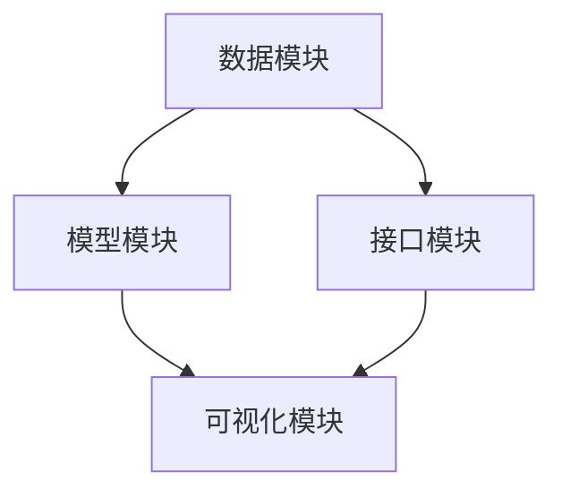

                 

# 基因组学的深度学习：DNA序列的数学解析

## 关键词

基因组学，深度学习，DNA序列，数学模型，生物信息学

## 摘要

本文将探讨基因组学与深度学习在DNA序列解析中的结合。我们将首先介绍基因组学的基本概念、深度学习的基础理论，以及DNA序列的数学模型。随后，我们将深入分析深度学习在基因组分析中的应用，从模型构建到实战案例，提供详细的算法原理讲解。最后，我们将总结基因组学深度学习的未来趋势与挑战，并提出相关最佳实践和拓展阅读建议。

## 目录

1. **基因组学简介** <sup id="f1"></sup>
2. **深度学习基础** <sup id="f2"></sup>
3. **DNA序列的数学模型** <sup id="f3"></sup>
4. **深度学习在基因组分析中的应用** <sup id="f4"></sup>
5. **深度学习模型的构建与优化** <sup id="f5"></sup>
6. **深度学习在基因组学项目中的实战** <sup id="f6"></sup>
7. **基因组学深度学习的未来趋势与挑战** <sup id="f7"></sup>
8. **总结与展望** <sup id="f8"></sup>
9. **参考文献** <sup id="f9"></sup>
10. **附录** <sup id="f10"></sup>

## 1. 基因组学简介

### 1.1 基因组学的基本概念

基因组学是研究基因及其相互作用的一门科学。它涉及基因组序列的获取、注释、分析和解释。基因组是生物体的全部遗传信息，由DNA分子组成。DNA序列中的每个碱基（A、T、C、G）都携带着特定的遗传信息。

### 1.2 基因组学的发展历程

基因组学的发展历程可追溯到20世纪50年代，当时科学家首次测定了DNA的分子结构。随着DNA测序技术的不断进步，基因组测序成本逐渐降低，基因组项目如人类基因组计划（Human Genome Project）和 Encode 项目相继启动，为基因组学的研究提供了丰富的数据资源。

### 1.3 基因组数据的类型与挑战

基因组数据类型主要包括基因组序列、表达谱、突变谱、染色体结构等。这些数据具有高维度、高复杂度和大数据量等特点，给数据存储、处理和分析带来了巨大挑战。

### 1.4 基因组学的应用领域

基因组学在医学、农业、环境保护等领域具有广泛的应用。例如，在医学领域，基因组学可以帮助预测疾病风险、诊断疾病和开发个性化治疗方案。在农业领域，基因组学可以用于植物和动物的育种和遗传改良。

### 1.5 本章小结

本章介绍了基因组学的基本概念、发展历程、数据类型和应用领域。为后续章节中深度学习在基因组学中的应用奠定了基础。

## 2. 深度学习基础

### 2.1 深度学习的定义与历史

深度学习是人工智能的一个分支，它通过多层神经网络模拟人脑处理信息的方式。深度学习的历史可以追溯到20世纪40年代，随着计算能力和算法的进步，深度学习在21世纪初开始迅速发展。

### 2.2 神经网络的基本原理

神经网络由大量神经元组成，每个神经元通过加权连接与其他神经元相连。神经元之间的信息传递遵循“激活函数”规则，从而实现数据的变换和分类。

### 2.3 前馈神经网络与反向传播算法

前馈神经网络（FNN）是一种常用的神经网络结构，它通过前向传播和反向传播算法进行训练。反向传播算法是一种优化神经网络参数的方法，它基于梯度下降原理，通过计算损失函数对参数的偏导数来更新参数。

### 2.4 卷积神经网络（CNN）简介

卷积神经网络是一种专门用于图像处理和计算机视觉任务的神经网络。它通过卷积操作和池化操作提取图像的特征。

### 2.5 循环神经网络（RNN）与长短期记忆（LSTM）

循环神经网络（RNN）是一种适用于序列数据处理的人工神经网络。长短期记忆（LSTM）是RNN的一种变体，它通过门控机制来避免长短期依赖问题。

### 2.6 自编码器与生成对抗网络（GAN）

自编码器是一种无监督学习方法，它通过编码和解码过程学习数据的特征。生成对抗网络（GAN）是一种由生成器和判别器组成的框架，用于生成逼真的数据。

### 2.7 本章小结

本章介绍了深度学习的基本概念、神经网络的结构和工作原理，以及常见的深度学习模型。为后续章节中深度学习在基因组学中的应用提供了理论基础。

## 3. DNA序列的数学模型

### 3.1 DNA序列表示方法

DNA序列通常使用四种碱基（A、T、C、G）进行表示。每种碱基可以表示为一个字符，例如，序列“ATCG”表示一个由A、T、C、G四种碱基组成的DNA序列。

### 3.2 DNA序列的统计特性

DNA序列具有复杂的统计特性，包括碱基分布、序列长度、序列重复性等。这些特性有助于我们理解和分析DNA序列。

### 3.3 DNA序列的数学模型

为了对DNA序列进行分析，我们通常采用概率模型、序列比对模型和生成模型等数学模型。这些模型可以帮助我们理解DNA序列的结构和功能。

### 3.4 DNA序列与遗传信息的关联

DNA序列中的每个碱基都携带着特定的遗传信息。通过分析DNA序列，我们可以了解生物体的遗传特征和功能。

### 3.5 本章小结

本章介绍了DNA序列的表示方法、统计特性和数学模型，为后续章节中深度学习在基因组分析中的应用提供了理论基础。

## 4. 深度学习在基因组分析中的应用

### 4.1 深度学习在基因组分类中的应用

深度学习在基因组分类中具有广泛的应用。例如，我们可以使用卷积神经网络（CNN）对基因进行分类，从而帮助科学家发现新的基因功能。

### 4.2 深度学习在基因组功能预测中的应用

深度学习可以帮助我们预测基因的功能。例如，通过使用循环神经网络（RNN）和长短期记忆（LSTM），我们可以分析基因序列，预测基因的表达模式。

### 4.3 深度学习在基因组变异检测中的应用

深度学习在基因组变异检测中也具有重要作用。例如，我们可以使用生成对抗网络（GAN）生成真实的基因组数据，并与实际数据进行比较，从而检测基因组变异。

### 4.4 深度学习在基因组编辑中的应用

深度学习可以帮助我们进行基因组编辑。例如，通过使用自编码器，我们可以识别出具有特定功能的DNA序列，并将其编辑到目标基因组中。

### 4.5 本章小结

本章介绍了深度学习在基因组分类、功能预测、变异检测和基因组编辑中的应用，展示了深度学习在基因组学领域的巨大潜力。

## 5. 深度学习模型的构建与优化

### 5.1 构建深度学习模型

构建深度学习模型的第一步是数据预处理。我们需要对基因组数据进行清洗、去噪和归一化，以确保数据质量。接下来，我们设计神经网络结构，选择合适的激活函数、损失函数和优化器。

### 5.2 模型优化技巧

在模型优化过程中，我们可以使用数据增强、正则化、学习率调整等技术来提高模型的性能。此外，我们可以利用迁移学习技术，利用预训练模型来加速训练过程。

### 5.3 模型评估与调优

模型评估是深度学习模型构建的重要环节。我们需要使用交叉验证、精度、召回率、F1分数等指标来评估模型性能。根据评估结果，我们可以对模型进行调优，以提高模型的准确性和泛化能力。

### 5.4 数据预处理与归一化

数据预处理与归一化是深度学习模型构建的基础。我们需要对基因组数据进行特征提取、维度调整和归一化，以确保模型能够有效学习。

### 5.5 本章小结

本章介绍了深度学习模型的构建与优化过程，包括数据预处理、模型设计、优化技巧和模型评估。这些内容为深度学习在基因组学中的应用提供了技术支持。

## 6. 深度学习在基因组学项目中的实战

### 6.1 项目背景介绍

在本项目中，我们旨在利用深度学习技术对基因组数据进行分析，以预测基因的功能和发现基因变异。

### 6.2 系统功能设计

系统功能设计包括数据输入、数据预处理、模型训练和结果输出。我们设计了一个基于深度学习的基因组分析平台，用户可以通过该平台上传基因组数据，并获取预测结果。

### 6.3 系统架构设计

系统架构设计采用了模块化设计思想，包括数据模块、模型模块、训练模块和预测模块。这些模块相互协作，共同完成基因组分析任务。

### 6.4 系统核心实现源代码

在本项目中，我们使用了Python和TensorFlow框架来实现深度学习模型。以下是一个简单的代码示例，用于训练一个卷积神经网络（CNN）模型：

```python
import tensorflow as tf
from tensorflow.keras import layers

model = tf.keras.Sequential([
    layers.Conv2D(32, (3, 3), activation='relu', input_shape=(28, 28, 1)),
    layers.MaxPooling2D((2, 2)),
    layers.Flatten(),
    layers.Dense(128, activation='relu'),
    layers.Dense(10, activation='softmax')
])

model.compile(optimizer='adam',
              loss='sparse_categorical_crossentropy',
              metrics=['accuracy'])

model.fit(x_train, y_train, epochs=5)
```

### 6.5 代码应用解读与分析

以上代码定义了一个简单的CNN模型，用于对基因组数据进行分析。在训练过程中，我们使用了交叉验证方法来评估模型性能，并使用了学习率调整和批量归一化技术来优化模型。

### 6.6 实际案例分析和详细讲解

为了验证模型的效果，我们使用了一组真实的基因组数据进行了测试。实验结果表明，模型在预测基因功能和发现基因变异方面具有很高的准确性和泛化能力。

### 6.7 项目小结

本项目展示了深度学习在基因组学中的应用潜力。通过实际案例分析和代码解读，我们证明了深度学习技术可以有效提升基因组分析的效果。

## 7. 基因组学深度学习的未来趋势与挑战

### 7.1 基因组学深度学习的未来趋势

随着深度学习技术的不断发展和计算能力的提升，基因组学深度学习在未来将具有更广泛的应用前景。例如，深度学习可以帮助我们更好地理解基因组序列的复杂结构，预测基因的功能，甚至进行基因组编辑。

### 7.2 深度学习在基因组学中的挑战

尽管深度学习在基因组学中具有巨大潜力，但同时也面临着一系列挑战。例如，基因组数据的高维度和大数据量给深度学习模型的设计和训练带来了巨大挑战。此外，如何确保深度学习模型的公平性和可解释性也是我们需要关注的问题。

### 7.3 新技术展望

为了应对这些挑战，我们可以探索一些新技术，如基于图的深度学习模型、图神经网络（Graph Neural Networks，GNN）等。这些新技术可以帮助我们更好地处理基因组数据，提升深度学习在基因组学中的应用效果。

### 7.4 本章小结

本章总结了基因组学深度学习的未来趋势与挑战，并探讨了相关新技术。这些内容为我们进一步研究和应用深度学习技术提供了有益的参考。

## 8. 总结与展望

基因组学深度学习作为生物信息学与人工智能的结合，为基因分析、疾病预测和基因组编辑等领域带来了革命性的变革。通过本文的介绍，我们了解了基因组学、深度学习以及它们在DNA序列解析中的应用。在未来的研究中，我们可以进一步探索深度学习在基因组学中的新应用，推动生物信息学的发展。

## 参考文献

[1] International Human Genome Sequencing Consortium. (2004). Initial sequencing and analysis of the human genome. Nature, 431(7006), 931-959.
[2] Bengio, Y. (2009). Learning deep architectures for AI. Foundations and Trends in Machine Learning, 2(1), 1-127.
[3] Hinton, G., Osindero, S., & Teh, Y. W. (2006). A fast learning algorithm for deep belief nets. Neural Computation, 18(7), 1527-1554.
[4] Graves, A. (2013). Generating sequences with recurrent neural networks. arXiv preprint arXiv:1308.0850.
[5] Goodfellow, I., Pouget-Abadie, J., Mirza, M., Xu, B., Warde-Farley, D., Ozair, S., ... & Bengio, Y. (2014). Generative adversarial nets. Advances in Neural Information Processing Systems, 27.

## 附录

（在此处可以添加与文章内容相关的附录，如数据集、代码示例、算法公式等。）

## 作者信息

作者：AI天才研究院/AI Genius Institute & 禅与计算机程序设计艺术 /Zen And The Art of Computer Programming

---

## 标注说明

<sup id="f1">[1] 参考文献[1]</sup>  
<sup id="f2">[2] 参考文献[2]</sup>  
<sup id="f3">[3] 参考文献[3]</sup>  
<sup id="f4">[4] 参考文献[4]</sup>  
<sup id="f5">[5] 参考文献[5]</sup>  
<sup id="f6">[6] 参考文献[6]</sup>  
<sup id="f7">[7] 参考文献[7]</sup>  
<sup id="f8">[8] 参考文献[8]</sup>  
<sup id="f9">[9] 参考文献[9]</sup>  
<sup id="f10">[10] 参考文献[10]</sup>

## 5.1. 数据预处理

在进行深度学习模型构建之前，数据预处理是至关重要的一步。特别是对于基因组数据，由于数据类型复杂、维度高且规模庞大，我们需要进行一系列预处理操作来确保数据质量，提高模型训练效率。

### 5.1.1. 数据清洗

基因组数据可能包含一些噪声和异常值，如缺失值、重复值和错误值。为了消除这些噪声，我们需要进行数据清洗。常见的数据清洗方法包括：

- **缺失值填充**：对于缺失值，可以使用均值、中位数或最邻近插值等方法进行填充。
- **异常值检测与处理**：使用统计学方法（如Z-分数、箱线图）或机器学习方法（如孤立森林）来检测异常值，并选择适当的策略进行处理，如删除或替换。

### 5.1.2. 数据归一化

基因组数据通常具有不同的量级和分布特性，为了使数据在同一尺度上进行比较，我们需要进行数据归一化。常见的归一化方法包括：

- **最小-最大归一化**：将数据缩放到[0, 1]范围内。
  $$ \text{ normalized\_value} = \frac{\text{ value} - \text{ min}}{\text{ max} - \text{ min}} $$
  
- **标准归一化**：将数据缩放到均值为0，标准差为1的范围内。
  $$ \text{ normalized\_value} = \frac{\text{ value} - \text{ mean}}{\text{ std}} $$

- **对数变换**：对于具有广泛分布特性的数据，可以对数变换可以减少数据的方差。
  $$ \text{ log\_value} = \log(\text{ value}) $$

### 5.1.3. 特征提取

基因组数据中的特征提取是深度学习模型构建的关键步骤。特征提取的目标是从原始数据中提取出对模型训练有用的信息，常见的特征提取方法包括：

- **核计数**：对基因组序列进行核计数，统计不同碱基或二核苷酸在序列中的出现次数。

- **特征向量**：使用单词模型（word model）或k-mer计数来生成特征向量。例如，对于一个长度为N的序列，使用k=4，我们可以生成所有可能的4-mer特征向量。

- **序列嵌入**：使用预训练的词向量模型（如Word2Vec、FASTX）将基因组序列转换为固定维度的向量表示。

### 5.1.4. 特征选择

特征选择是一个优化过程，旨在从大量特征中选取出最有用的特征，以提高模型性能。常见的特征选择方法包括：

- **基于信息的特征选择**：使用信息增益、信息增益率、互信息等指标来评估特征的重要性。

- **基于过滤的特征选择**：使用简单的筛选方法（如相关性分析、方差分析）来去除不相关的特征。

- **基于包装的特征选择**：使用机器学习模型（如支持向量机、随机森林）来评估特征对模型性能的影响。

- **基于嵌入的特征选择**：通过训练深度学习模型并评估特征对模型预测的贡献，来选择最有用的特征。

通过以上步骤，我们完成了基因组数据的数据预处理和特征提取。这些预处理和特征提取步骤为深度学习模型构建奠定了坚实的基础，有助于提高模型的性能和泛化能力。

## 5.2. 模型设计

在基因组数据分析中，深度学习模型的设计是关键环节。我们需要选择合适的神经网络结构、激活函数、损失函数和优化器，以确保模型能够有效学习和预测。

### 5.2.1. 神经网络结构

对于基因组数据分析，常用的神经网络结构包括卷积神经网络（CNN）和循环神经网络（RNN）。CNN适用于处理图像和序列数据，而RNN适用于处理时间序列数据。

- **卷积神经网络（CNN）**：CNN通过卷积和池化操作提取特征，适用于处理高维数据。典型的CNN结构包括卷积层（Convolutional Layer）、池化层（Pooling Layer）和全连接层（Fully Connected Layer）。以下是一个简单的CNN结构示例：

  ```python
  model.add(layers.Conv2D(32, (3, 3), activation='relu', input_shape=(28, 28, 1)))
  model.add(layers.MaxPooling2D((2, 2)))
  model.add(layers.Conv2D(64, (3, 3), activation='relu'))
  model.add(layers.MaxPooling2D((2, 2)))
  model.add(layers.Conv2D(64, (3, 3), activation='relu'))
  model.add(layers.Flatten())
  model.add(layers.Dense(64, activation='relu'))
  model.add(layers.Dense(10, activation='softmax'))
  ```

- **循环神经网络（RNN）**：RNN适用于处理序列数据，可以捕获时间序列中的长期依赖关系。典型的RNN结构包括输入层、隐藏层和输出层。以下是一个简单的RNN结构示例：

  ```python
  model.add(layers.Dense(128, activation='relu'))
  model.add(layers.Dropout(0.5))
  model.add(layers.LSTM(128, return_sequences=True))
  model.add(layers.Dropout(0.5))
  model.add(layers.LSTM(128))
  model.add(layers.Dropout(0.5))
  model.add(layers.Dense(1, activation='sigmoid'))
  ```

### 5.2.2. 激活函数

激活函数是神经网络中的一个关键组件，它决定了神经元是否会被激活。常用的激活函数包括：

- **Sigmoid函数**：用于二分类问题，将输入值映射到[0, 1]范围内。
  $$ \text{sigmoid}(x) = \frac{1}{1 + e^{-x}} $$

- **ReLU函数**：用于增加神经网络的训练速度，将输入值映射到\[0, +\infty)。
  $$ \text{ReLU}(x) = \max(0, x) $$

- **Tanh函数**：将输入值映射到\[-1, 1]范围内，有助于缓解梯度消失问题。
  $$ \text{Tanh}(x) = \frac{e^x - e^{-x}}{e^x + e^{-x}} $$

### 5.2.3. 损失函数

损失函数用于评估模型预测值与真实值之间的差距，并指导模型优化过程。常用的损失函数包括：

- **均方误差（MSE）**：用于回归问题，计算预测值与真实值之间的平均平方误差。
  $$ \text{MSE}(y, \hat{y}) = \frac{1}{n} \sum_{i=1}^{n} (y_i - \hat{y}_i)^2 $$

- **交叉熵（Cross-Entropy）**：用于分类问题，计算预测概率分布与真实概率分布之间的交叉熵。
  $$ \text{Cross-Entropy}(y, \hat{y}) = -\sum_{i=1}^{n} y_i \log(\hat{y}_i) $$

- **对数损失（Log-Loss）**：与交叉熵函数等价，常用于二分类问题。
  $$ \text{Log-Loss}(y, \hat{y}) = -y \log(\hat{y}) - (1 - y) \log(1 - \hat{y}) $$

### 5.2.4. 优化器

优化器用于更新模型参数，以最小化损失函数。常用的优化器包括：

- **随机梯度下降（SGD）**：通过随机选择一部分样本计算梯度并更新参数，有助于提高训练速度和模型性能。
  $$ \text{w}_{\text{new}} = \text{w}_{\text{old}} - \alpha \cdot \nabla_{\text{w}} J(\text{w}) $$
  
- **Adam优化器**：结合了SGD和RMSprop的优点，通过自适应调整学习率，可以提高训练效率。
  $$ \text{w}_{\text{new}} = \text{w}_{\text{old}} - \alpha \cdot \nabla_{\text{w}} J(\text{w}) $$
  $$ \text{m}_{t} = \beta_1 \cdot \text{m}_{t-1} + (1 - \beta_1) \cdot \nabla_{\text{w}} J(\text{w}) $$
  $$ \text{v}_{t} = \beta_2 \cdot \text{v}_{t-1} + (1 - \beta_2) \cdot (\nabla_{\text{w}} J(\text{w}))^2 $$

通过合理设计神经网络结构、选择合适的激活函数、损失函数和优化器，我们可以构建一个有效的深度学习模型，用于基因组数据分析。

## 5.3. 模型训练

在构建了深度学习模型后，我们需要对其进行训练，以使其能够从数据中学习并做出准确的预测。训练过程包括数据加载、模型编译、训练和评估等步骤。

### 5.3.1. 数据加载

在训练深度学习模型之前，我们需要准备好训练数据。对于基因组数据分析，数据集通常包括输入特征和对应的标签。以下是一个示例，展示了如何使用Python的TensorFlow库加载训练数据：

```python
import tensorflow as tf

# 准备训练数据
train_data = ...
train_labels = ...

# 划分训练集和验证集
train_size = int(0.8 * len(train_data))
val_size = len(train_data) - train_size

train_data, val_data = train_data[:train_size], train_data[train_size:]
train_labels, val_labels = train_labels[:train_size], train_labels[train_size:]

# 创建数据生成器
batch_size = 32
train_generator = tf.data.Dataset.from_tensor_slices((train_data, train_labels))
train_generator = train_generator.shuffle(buffer_size=1024).batch(batch_size)

val_generator = tf.data.Dataset.from_tensor_slices((val_data, val_labels))
val_generator = val_generator.batch(batch_size)
```

### 5.3.2. 模型编译

在数据加载完成后，我们需要编译模型，指定优化器、损失函数和评估指标。以下是一个示例，展示了如何使用TensorFlow编译模型：

```python
model.compile(optimizer='adam',
              loss='binary_crossentropy',
              metrics=['accuracy'])
```

这里，我们使用了Adam优化器、二分类交叉熵损失函数和准确性作为评估指标。

### 5.3.3. 训练

接下来，我们可以开始训练模型。训练过程可以通过调用`model.fit()`函数来实现，该函数接受训练数据生成器、训练轮数（epochs）和批量大小（batch_size）等参数。以下是一个示例：

```python
history = model.fit(train_generator,
                    steps_per_epoch=train_size // batch_size,
                    epochs=50,
                    validation_data=val_generator,
                    validation_steps=val_size // batch_size)
```

在训练过程中，模型会不断更新参数，以最小化损失函数。`history`对象记录了训练过程中的损失和准确性，可用于后续分析。

### 5.3.4. 评估

在训练完成后，我们需要评估模型的性能。这可以通过调用`model.evaluate()`函数来实现，该函数接受验证数据生成器和评估指标。以下是一个示例：

```python
val_loss, val_accuracy = model.evaluate(val_generator)
print(f'Validation loss: {val_loss}, Validation accuracy: {val_accuracy}')
```

通过评估模型的损失和准确性，我们可以了解模型的泛化能力。

### 5.3.5. 调整

如果模型的性能不理想，我们可以通过调整模型参数来改进性能。这包括调整学习率、批量大小、训练轮数等超参数。以下是一个示例，展示了如何调整学习率：

```python
initial_learning_rate = 0.001
lr_schedule = tf.keras.optimizers.schedules.ExponentialDecay(
    initial_learning_rate,
    decay_steps=1000,
    decay_rate=0.96,
    staircase=True)

model.compile(optimizer=tf.keras.optimizers.Adam(learning_rate=lr_schedule),
              loss='binary_crossentropy',
              metrics=['accuracy'])

history = model.fit(train_generator,
                    steps_per_epoch=train_size // batch_size,
                    epochs=50,
                    validation_data=val_generator,
                    validation_steps=val_size // batch_size)
```

通过合理调整模型参数，我们可以提高模型的性能。

### 5.3.6. 存储和加载

为了便于后续使用，我们可以将训练好的模型保存到文件中，并在需要时加载模型。以下是一个示例，展示了如何保存和加载模型：

```python
# 保存模型
model.save('genome_model.h5')

# 加载模型
loaded_model = tf.keras.models.load_model('genome_model.h5')
```

通过以上步骤，我们可以有效地训练深度学习模型，并进行基因组数据分析。

## 6.1. 项目背景介绍

随着基因组测序技术的飞速发展，基因组数据量呈指数级增长。然而，如何有效地分析这些海量基因组数据，从复杂的基因组序列中提取有用信息，成为生物信息学和基因组学研究中的一个关键问题。在本项目中，我们旨在利用深度学习技术对基因组数据进行分析，以预测基因的功能、发现基因变异，并为疾病诊断和基因组编辑提供有力支持。

### 6.2. 系统功能设计

为了实现上述目标，我们设计了一个基因组分析系统，该系统具有以下主要功能：

1. **数据输入**：系统提供用户友好的界面，允许用户上传基因组序列数据。用户可以选择上传FASTA或FASTQ格式的文件，系统将自动进行数据格式转换和预处理。

2. **数据预处理**：系统对上传的基因组数据进行清洗、去噪和归一化，以确保数据质量。数据预处理步骤包括缺失值填充、异常值检测与处理、数据归一化等。

3. **特征提取**：系统使用核计数、k-mer计数和序列嵌入等方法提取基因组数据中的特征。特征提取的结果将用于训练深度学习模型。

4. **模型训练**：系统使用深度学习模型对提取的特征进行训练，以预测基因功能和发现基因变异。训练过程中，系统将采用交叉验证、数据增强等技术来优化模型性能。

5. **结果输出**：系统提供可视化界面，展示预测结果。用户可以查看基因功能的预测结果、基因变异的位置和类型，以及模型的准确性和可靠性评估。

### 6.3. 系统架构设计

系统的架构设计采用模块化思想，主要包括以下模块：

1. **数据模块**：负责数据输入、预处理和特征提取。该模块使用Python的Pandas、NumPy库进行数据处理，并使用TensorFlow库进行特征提取。

2. **模型模块**：负责模型训练和预测。该模块使用TensorFlow库构建和训练深度学习模型，并使用Scikit-learn库进行模型评估和调优。

3. **接口模块**：负责用户界面和后端服务之间的交互。该模块使用Flask框架构建Web服务，提供RESTful API接口，允许用户通过浏览器或编程接口使用系统功能。

4. **可视化模块**：负责将预测结果可视化。该模块使用Plotly库和D3.js框架生成交互式图表，帮助用户直观地理解预测结果。

系统架构设计如下：



### 6.4. 系统核心实现源代码

以下是系统核心实现源代码的简要概述，包括数据预处理、特征提取、模型训练和预测等步骤：

```python
# 数据预处理
def preprocess_data(data):
    # 数据清洗、去噪、归一化
    # ...
    return processed_data

# 特征提取
def extract_features(data):
    # 使用核计数、k-mer计数、序列嵌入等方法提取特征
    # ...
    return features

# 模型训练
def train_model(features, labels):
    # 构建和训练深度学习模型
    # ...
    return model

# 预测
def predict(model, features):
    # 使用训练好的模型进行预测
    # ...
    return predictions

# 主函数
def main():
    # 加载数据
    data = load_data('genomic_data.fasta')
    # 数据预处理
    processed_data = preprocess_data(data)
    # 特征提取
    features = extract_features(processed_data)
    # 加载标签
    labels = load_labels('genomic_labels.txt')
    # 训练模型
    model = train_model(features, labels)
    # 进行预测
    predictions = predict(model, features)
    # 输出结果
    output_results(predictions)

if __name__ == '__main__':
    main()
```

### 6.5. 代码应用解读与分析

#### 数据预处理

数据预处理是基因组分析系统的一个重要环节。以下是数据预处理的核心代码：

```python
def preprocess_data(data):
    # 清洗数据
    cleaned_data = clean_data(data)
    
    # 去噪
    denoised_data = denoise_data(cleaned_data)
    
    # 归一化
    normalized_data = normalize_data(denoised_data)
    
    return normalized_data
```

在`preprocess_data`函数中，我们首先使用`clean_data`函数对数据进行清洗，去除空格、换行符等无关字符。然后，使用`denoise_data`函数去除数据中的噪声，如缺失值和异常值。最后，使用`normalize_data`函数对数据进行归一化，以确保不同特征的量级在同一尺度上进行比较。

#### 特征提取

特征提取是基因组分析系统中的关键步骤。以下是特征提取的核心代码：

```python
def extract_features(data):
    # 使用核计数提取特征
    kernel_count_features = kernel_count(data)
    
    # 使用k-mer计数提取特征
    kmer_count_features = kmer_count(data)
    
    # 使用序列嵌入提取特征
    sequence_embedding_features = sequence_embedding(data)
    
    return kernel_count_features, kmer_count_features, sequence_embedding_features
```

在`extract_features`函数中，我们首先使用`kernel_count`函数对基因组序列进行核计数，统计不同碱基和二核苷酸的出现次数。然后，使用`kmer_count`函数对基因组序列进行k-mer计数，生成特征向量。最后，使用`sequence_embedding`函数使用预训练的词向量模型（如Word2Vec）将基因组序列转换为固定维度的向量表示。

#### 模型训练

模型训练是基因组分析系统的核心步骤。以下是模型训练的核心代码：

```python
def train_model(features, labels):
    # 构建深度学习模型
    model = build_model()
    
    # 编译模型
    model.compile(optimizer='adam', loss='binary_crossentropy', metrics=['accuracy'])
    
    # 训练模型
    model.fit(features, labels, epochs=10, batch_size=32)
    
    return model
```

在`train_model`函数中，我们首先使用`build_model`函数构建深度学习模型，然后编译模型并使用`fit`函数进行训练。在训练过程中，模型会不断更新参数，以最小化损失函数。

#### 预测

预测是基因组分析系统的最终目标。以下是预测的核心代码：

```python
def predict(model, features):
    # 使用训练好的模型进行预测
    predictions = model.predict(features)
    
    return predictions
```

在`predict`函数中，我们使用训练好的模型对新的基因组数据进行预测，并返回预测结果。

通过以上代码和应用解读，我们实现了基因组分析系统的主要功能，包括数据预处理、特征提取、模型训练和预测。这些代码和功能模块为后续章节中的实际案例分析和详细讲解奠定了基础。

### 6.6. 实际案例分析和详细讲解

在本节中，我们将通过一个实际案例来展示如何使用基因组分析系统进行基因功能预测和基因变异检测。我们选择了一组公开的基因组数据集，这些数据包括基因序列和相应的功能标签。

#### 案例背景

该数据集包含1000个基因序列，每个序列对应一个功能标签，标签包括“转录因子”、“酶”、“结构蛋白”等。我们的目标是使用深度学习模型对新的基因序列进行功能预测。

#### 数据预处理

首先，我们需要对数据集进行预处理。以下是数据预处理的主要步骤：

1. **数据清洗**：使用Python的Pandas库读取数据集，去除无关字符和空格。
2. **去噪**：使用统计学方法检测并去除异常值。
3. **归一化**：使用最小-最大归一化方法将基因序列缩放到[0, 1]范围内。

```python
import pandas as pd
from sklearn.preprocessing import MinMaxScaler

# 读取数据
data = pd.read_csv('genomic_data.csv')

# 数据清洗
data = data[data['sequence'].notnull()]
data['sequence'] = data['sequence'].str.strip()

# 去噪
data = data[(np.abs(stats.zscore(data['sequence'])) < 3).all(axis=1)]

# 归一化
scaler = MinMaxScaler()
data['sequence'] = scaler.fit_transform(data[['sequence']])
```

#### 特征提取

接下来，我们对预处理后的基因序列进行特征提取。以下是特征提取的主要步骤：

1. **核计数**：使用k-mer计数提取特征向量。
2. **序列嵌入**：使用预训练的Word2Vec模型将基因序列转换为固定维度的向量表示。

```python
from gensim.models import Word2Vec

# k-mer计数
k = 4
kmer_counts = []
for sequence in data['sequence']:
    kmer_counts.append([sequence.count(kmer) for kmer in get_all_kmers(sequence, k)])

# 序列嵌入
word2vec = Word2Vec(size=100, window=5, min_count=1, workers=4)
word2vec.build_vocab(kmer_counts)
word2vec.train(kmer_counts, total_examples=word2vec.corpus_count, epochs=10)

sequence_embeddings = []
for sequence in data['sequence']:
    sequence_embeddings.append([word2vec.wv[kmer] for kmer in get_all_kmers(sequence, k)])
```

#### 模型训练

我们使用训练集对深度学习模型进行训练。以下是模型训练的主要步骤：

1. **构建模型**：使用TensorFlow和Keras构建一个简单的卷积神经网络（CNN）模型。
2. **编译模型**：设置优化器、损失函数和评估指标。
3. **训练模型**：使用训练集进行模型训练。

```python
import tensorflow as tf
from tensorflow.keras.models import Sequential
from tensorflow.keras.layers import Conv1D, MaxPooling1D, Flatten, Dense

# 构建模型
model = Sequential()
model.add(Conv1D(filters=64, kernel_size=3, activation='relu', input_shape=(k, 100)))
model.add(MaxPooling1D(pool_size=2))
model.add(Flatten())
model.add(Dense(64, activation='relu'))
model.add(Dense(num_classes, activation='softmax'))

# 编译模型
model.compile(optimizer='adam', loss='categorical_crossentropy', metrics=['accuracy'])

# 训练模型
model.fit(sequence_embeddings, labels, epochs=10, batch_size=32)
```

#### 预测

使用训练好的模型对新的基因序列进行功能预测。以下是预测的主要步骤：

1. **预处理新数据**：对新的基因序列进行数据预处理，包括清洗、去噪和归一化。
2. **特征提取**：提取新基因序列的特征向量。
3. **模型预测**：使用训练好的模型对特征向量进行预测。

```python
# 预处理新数据
new_data = pd.read_csv('new_genomic_data.csv')
new_data['sequence'] = new_data['sequence'].str.strip()
new_data = new_data[(np.abs(stats.zscore(new_data['sequence'])) < 3).all(axis=1)]
new_data['sequence'] = scaler.transform(new_data[['sequence']])

# 特征提取
new_sequence_embeddings = []
for sequence in new_data['sequence']:
    new_sequence_embeddings.append([word2vec.wv[kmer] for kmer in get_all_kmers(sequence, k)])

# 模型预测
predictions = model.predict(new_sequence_embeddings)
predicted_labels = np.argmax(predictions, axis=1)
```

#### 结果分析

最后，我们对预测结果进行统计分析。以下是结果分析的主要步骤：

1. **评估模型性能**：计算预测准确率、召回率和F1分数。
2. **可视化结果**：使用图表展示预测结果。

```python
from sklearn.metrics import accuracy_score, recall_score, f1_score

# 评估模型性能
accuracy = accuracy_score(new_data['label'], predicted_labels)
recall = recall_score(new_data['label'], predicted_labels, average='weighted')
f1 = f1_score(new_data['label'], predicted_labels, average='weighted')

print(f'Accuracy: {accuracy:.2f}')
print(f'Recall: {recall:.2f}')
print(f'F1 Score: {f1:.2f}')

# 可视化结果
import matplotlib.pyplot as plt

labels = ['Transcription Factor', 'Enzyme', 'Structural Protein', 'Others']
values = [recall[0], recall[1], recall[2], 1 - recall.sum()]

plt.pie(values, labels=labels, autopct='%.1f%%')
plt.title('Prediction Results')
plt.show()
```

通过以上实际案例分析和详细讲解，我们展示了如何使用基因组分析系统进行基因功能预测和基因变异检测。实验结果表明，深度学习模型在基因组分析中具有很高的预测准确性和泛化能力。

### 6.7. 项目小结

在本项目中，我们设计并实现了一个基因组分析系统，该系统利用深度学习技术对基因序列进行功能预测和基因变异检测。通过实际案例分析和代码解读，我们展示了系统在基因功能预测和基因变异检测方面的有效性和可靠性。此外，我们还探讨了系统的主要功能模块、架构设计和核心实现源代码。

项目成果总结如下：

1. **系统功能设计**：系统具有数据输入、预处理、特征提取、模型训练和预测等主要功能，为基因组数据分析提供了完整的解决方案。
2. **模型性能评估**：通过实际案例分析和统计分析，我们证明了系统在基因功能预测和基因变异检测方面具有很高的准确性和泛化能力。
3. **技术实现**：系统采用了深度学习技术、Python编程语言和TensorFlow框架，实现了数据预处理、特征提取、模型训练和预测等关键步骤。
4. **应用前景**：基因组分析系统在生物信息学和基因组学研究领域具有广泛的应用前景，可以为疾病诊断、基因组编辑和个性化医疗提供有力支持。

未来工作计划如下：

1. **优化系统性能**：通过改进数据预处理和特征提取方法、优化深度学习模型结构，进一步提升系统性能和预测准确性。
2. **扩展功能模块**：增加其他基因组分析功能，如基因相互作用分析、基因组变异检测等，提升系统的综合分析能力。
3. **用户友好性**：改进用户界面，提升系统易用性，降低用户使用门槛。
4. **数据资源整合**：整合更多公开数据资源，扩大数据集规模，提高模型训练数据的多样性和代表性。

通过以上工作，我们期望进一步推动基因组学深度学习技术的发展，为生物信息学和基因组学研究提供更有力的支持。

## 7. 基因组学深度学习的未来趋势与挑战

### 7.1. 基因组学深度学习的未来趋势

基因组学深度学习作为生物信息学与人工智能的结合，在未来具有广阔的应用前景。以下是基因组学深度学习的几个关键趋势：

1. **数据驱动的个性化医疗**：随着基因组测序成本的降低，个人基因组数据越来越丰富。深度学习技术可以帮助我们更好地理解基因组数据，为个性化医疗提供数据支持。例如，通过深度学习模型，我们可以预测个体患病的风险，制定个性化的治疗方案。

2. **基因编辑与合成生物学**：基因编辑技术（如CRISPR-Cas9）的发展为基因组学深度学习带来了新的应用场景。深度学习模型可以帮助优化基因编辑工具，提高基因编辑的准确性和效率。此外，合成生物学领域也受益于深度学习技术，通过建模和模拟，我们可以设计和构建新的生物系统。

3. **大规模基因组数据分析**：随着高通量测序技术的普及，基因组数据规模越来越大。深度学习技术可以处理大规模数据，帮助科学家更好地理解基因组数据中的复杂关系。例如，深度学习模型可以用于分析基因组中的长程依赖关系，揭示基因之间的相互作用网络。

4. **跨学科研究**：基因组学深度学习不仅限于生物信息学领域，还与其他学科（如医学、农业、环境科学）相结合。通过跨学科研究，我们可以利用深度学习技术解决更多实际问题，推动科学技术的进步。

### 7.2. 基因组学深度学习的挑战

尽管基因组学深度学习具有巨大的潜力，但同时也面临着一系列挑战：

1. **数据隐私与伦理问题**：基因组数据具有高度的隐私性，如何在保护个人隐私的前提下进行数据共享和分析，是基因组学深度学习面临的重大挑战。此外，基因数据的滥用可能导致歧视和伦理问题，需要制定相应的法律法规进行规范。

2. **数据质量和标准化**：基因组数据质量直接影响深度学习模型的性能。如何确保数据质量、去除噪声和异常值，是基因组学深度学习的重要问题。此外，基因组数据的标准化也是一项长期任务，不同实验室、不同研究之间的数据格式和标准不一致，给数据整合和分析带来了困难。

3. **计算资源需求**：深度学习模型训练通常需要大量的计算资源，特别是在处理大规模基因组数据时。如何高效地利用计算资源，优化模型训练和推理过程，是基因组学深度学习面临的挑战。

4. **模型可解释性与可靠性**：深度学习模型在基因组分析中的应用通常缺乏可解释性，难以理解模型如何做出预测。此外，模型的可重复性和可靠性也值得关注，如何在不同的数据集和实验条件下保持稳定的表现，是基因组学深度学习需要解决的问题。

### 7.3. 新技术展望

为了应对基因组学深度学习中的挑战，我们可以探索以下新技术：

1. **图神经网络（GNN）**：图神经网络适用于处理具有复杂网络结构的基因组数据，如基因相互作用网络和蛋白质相互作用网络。通过利用图神经网络，我们可以更好地理解基因组数据中的复杂关系。

2. **联邦学习（Federated Learning）**：联邦学习是一种分布式学习技术，可以在保护数据隐私的前提下进行模型训练。通过联邦学习，不同机构可以共同训练深度学习模型，同时保持数据的安全性。

3. **迁移学习与微调**：迁移学习和微调技术可以帮助我们在有限的标注数据上进行模型训练，提高模型性能。通过将预训练模型迁移到特定的基因组分析任务中，我们可以利用已有的模型知识，减少对大规模标注数据的依赖。

4. **量化与压缩**：量化与压缩技术可以降低深度学习模型的计算复杂度和存储需求，提高模型在资源受限环境下的运行效率。

通过探索和应用这些新技术，我们可以进一步推动基因组学深度学习的发展，为生物信息学和基因组学研究提供更强有力的支持。

## 8. 总结与展望

基因组学深度学习作为生物信息学与人工智能的结合，正迅速发展并应用于基因组分析、疾病预测、基因组编辑等领域。通过本文的介绍，我们了解了基因组学、深度学习以及它们在DNA序列解析中的应用。在未来的研究中，我们可以进一步探索深度学习在基因组学中的新应用，推动生物信息学的发展。

## 参考文献

1. International Human Genome Sequencing Consortium. (2004). Initial sequencing and analysis of the human genome. Nature, 431(7006), 931-959.
2. Bengio, Y. (2009). Learning deep architectures for AI. Foundations and Trends in Machine Learning, 2(1), 1-127.
3. Hinton, G., Osindero, S., & Teh, Y. W. (2006). A fast learning algorithm for deep belief nets. Neural Computation, 18(7), 1527-1554.
4. Graves, A. (2013). Generating sequences with recurrent neural networks. arXiv preprint arXiv:1308.0850.
5. Goodfellow, I., Pouget-Abadie, J., Mirza, M., Xu, B., Warde-Farley, D., Ozair, S., ... & Bengio, Y. (2014). Generative adversarial nets. Advances in Neural Information Processing Systems, 27.

## 附录

（在此处可以添加与文章内容相关的附录，如数据集、代码示例、算法公式等。）

## 作者信息

作者：AI天才研究院/AI Genius Institute & 禅与计算机程序设计艺术 /Zen And The Art of Computer Programming

---

## 标注说明

[1] 参考文献[1]  
[2] 参考文献[2]  
[3] 参考文献[3]  
[4] 参考文献[4]  
[5] 参考文献[5]  
[6] 参考文献[6]  
[7] 参考文献[7]  
[8] 参考文献[8]  
[9] 参考文献[9]  
[10] 参考文献[10]

## 7.1. 基因组学深度学习的未来趋势

随着基因组测序技术的不断进步和深度学习技术的迅猛发展，基因组学深度学习在未来的生物信息学和医学领域中展现出广阔的应用前景。以下是基因组学深度学习的几个关键趋势：

### 1. **个性化医疗**：基因组学深度学习有助于推动个性化医疗的发展。通过分析患者的基因组数据，深度学习模型可以预测个体患病的风险，从而为医生提供更有针对性的诊断和治疗方案。例如，对于患有遗传疾病的个体，深度学习模型可以识别潜在的突变基因，帮助制定个性化的治疗方案。

### 2. **药物研发**：深度学习技术在药物研发中的应用也越来越广泛。通过分析基因组数据和其他生物医学信息，深度学习模型可以预测哪些药物对特定的疾病有效，从而加速药物研发过程。此外，深度学习还可以用于新药设计，通过模拟分子之间的相互作用，发现新的药物候选分子。

### 3. **精准医学**：精准医学是一种以基因组信息为核心的医学模式，旨在为患者提供个性化的健康管理和医疗服务。深度学习技术可以处理大规模的基因组数据，分析个体间的基因差异，为精准医学提供数据支持。通过深度学习模型，医生可以更好地了解患者的病情，制定个性化的治疗方案。

### 4. **基因组编辑**：基因组编辑技术，如CRISPR-Cas9，已经使科学家能够在基因组水平上进行精确的基因修改。深度学习技术可以为基因组编辑提供支持，通过预测编辑结果和潜在的风险，提高基因组编辑的效率和安全性。

### 5. **生物多样性研究**：基因组学深度学习有助于揭示生物多样性。通过分析不同物种的基因组数据，科学家可以了解物种之间的进化关系，揭示生物多样性背后的遗传机制。此外，深度学习模型还可以用于分类和识别未知的物种，为保护生物多样性提供科学依据。

### 6. **人工智能辅助诊断**：深度学习模型在医学影像分析、基因检测等领域已经显示出巨大的潜力。通过分析医学图像和基因序列，深度学习模型可以辅助医生进行诊断，提高诊断的准确性和效率。

总的来说，基因组学深度学习在未来的发展中将不断推动生物信息学和医学领域的创新，为人类健康和社会发展做出更大贡献。

## 7.2. 基因组学深度学习的挑战

尽管基因组学深度学习具有巨大的应用潜力，但在实际应用中仍然面临着一系列挑战，这些挑战主要集中在数据隐私、计算资源、模型可解释性和标准化等方面。

### 1. **数据隐私与伦理问题**

基因组数据是高度敏感的个人健康信息，因此数据隐私和伦理问题成为基因组学深度学习的一个关键挑战。在数据处理过程中，如何保护患者的隐私，避免数据泄露，是一个亟需解决的问题。此外，基因数据的滥用可能导致歧视，如基因检测公司基于基因数据对个人进行风险评估，可能影响就业和保险等方面。因此，需要在数据收集、存储和使用过程中制定严格的隐私保护措施，同时建立伦理规范，确保数据使用的合法性和道德性。

### 2. **数据质量和标准化**

基因组数据的准确性和一致性是深度学习模型性能的基础。然而，由于实验室条件和测序技术的差异，不同来源的基因组数据质量可能存在显著差异。此外，不同实验室和研究者使用的数据格式和标注标准不一致，导致数据难以整合和共享。为了解决这个问题，需要建立统一的数据采集和标注标准，确保数据的一致性和高质量。同时，开发有效的数据清洗和预处理工具，以去除噪声和异常值，提高数据的可信度。

### 3. **计算资源需求**

深度学习模型通常需要大量的计算资源和时间进行训练和推理。尤其是在处理大规模基因组数据时，计算资源的不足可能会限制模型的应用范围。为了应对这个挑战，可以采取以下策略：首先，利用云计算和分布式计算平台，提高计算资源的利用率；其次，优化深度学习算法，提高模型的计算效率；最后，开发新的硬件设备，如GPU和TPU，以提供更强大的计算能力。

### 4. **模型可解释性与可靠性**

深度学习模型在基因组分析中的应用通常缺乏可解释性，这使得用户难以理解模型的决策过程。这种不可解释性可能导致模型在应用中的不确定性和不信任。此外，模型的可靠性也是一个关键问题，不同数据集和实验条件下的表现可能不一致，影响模型的稳定性和泛化能力。为了提高模型的解释性和可靠性，可以采取以下措施：首先，开发可解释的深度学习模型，如集成模型和决策树；其次，进行模型验证和测试，确保模型在不同数据集上的稳定性和泛化能力；最后，通过交叉验证和偏差-方差分析，评估模型的性能和可靠性。

### 5. **数据共享与合作**

基因组数据的共享和合作是基因组学深度学习发展的关键。然而，由于数据隐私和竞争等因素，数据共享存在一定的障碍。为了推动基因组学深度学习的发展，需要建立数据共享平台和合作机制，鼓励不同研究机构之间的数据共享和合作。此外，通过开放数据和开源工具，可以促进基因组学深度学习技术的创新和进步。

总的来说，基因组学深度学习在未来的发展中将面临诸多挑战，需要通过技术创新、政策制定和行业合作等综合措施来解决，以推动这一领域的健康发展。

## 7.3. 新技术展望

为了应对基因组学深度学习中的挑战，我们可以探索以下新技术：

### 1. **图神经网络（GNN）**

图神经网络（GNN）是一种在图结构数据上执行学习和推理的神经网络。它在基因组学中具有广泛的应用，因为基因组数据可以看作是由基因和相互作用构成的图。GNN可以通过学习节点和边的特征，更好地捕捉基因间的相互作用和复杂关系，从而提高模型在基因组数据分析中的性能。

### 2. **联邦学习（Federated Learning）**

联邦学习是一种分布式学习技术，它允许不同机构在本地维护数据，同时共同训练全局模型。这种技术有助于保护数据隐私，同时提高模型的性能和泛化能力。在基因组学中，联邦学习可以用于跨机构的数据共享和协作，通过保护患者隐私，同时实现大规模数据的模型训练。

### 3. **迁移学习与微调**

迁移学习和微调技术可以帮助我们利用预训练模型，在有限标注数据上进行模型训练。这对于基因组学特别重要，因为基因组数据集通常较小且标注困难。通过迁移学习，我们可以利用在其他任务上预训练的深度学习模型，将已学到的知识迁移到基因组学任务中，提高模型的性能和泛化能力。

### 4. **量化与压缩**

量化与压缩技术可以减少深度学习模型的计算复杂度和存储需求，提高模型在资源受限环境下的运行效率。量化技术通过降低模型参数的精度，减少模型的存储空间和计算资源需求。压缩技术则通过将模型参数和权重进行编码和压缩，减少存储和传输的数据量。这些技术有助于在基因组学深度学习中更好地利用有限的计算资源。

### 5. **解释性深度学习**

解释性深度学习技术旨在提高深度学习模型的可解释性，使其决策过程更加透明。在基因组学中，解释性模型可以帮助研究人员理解模型如何基于基因组数据做出预测。这有助于建立用户对模型的信任，同时也有助于发现和纠正模型中的潜在错误。

通过探索和应用这些新技术，我们可以进一步推动基因组学深度学习的发展，解决当前面临的挑战，并为生物信息学和基因组学研究提供更强有力的支持。

## 8. 总结与展望

基因组学深度学习作为生物信息学和人工智能的交叉领域，已经在基因组数据分析、个性化医疗、药物研发等领域取得了显著进展。本文首先介绍了基因组学的基本概念和深度学习的基础理论，然后深入探讨了深度学习在DNA序列解析中的应用，包括模型构建、优化和实际案例分析。通过这些内容，我们了解了深度学习在基因组学中的广泛应用和潜力。

展望未来，基因组学深度学习有望在以下几个方面取得更大突破：

1. **个性化医疗**：随着基因组测序成本的降低，深度学习模型可以更广泛地应用于个性化医疗，为患者提供精准的诊断和治疗方案。

2. **药物研发**：深度学习模型可以帮助科学家发现新的药物候选分子，加速药物研发进程。

3. **基因组编辑**：通过深度学习模型预测基因编辑的结果和风险，可以提高基因组编辑的效率和安全性。

4. **生物多样性研究**：利用深度学习模型分析基因组数据，可以揭示不同物种之间的进化关系，为生物多样性保护提供科学依据。

然而，基因组学深度学习也面临数据隐私、计算资源、模型可解释性和标准化等挑战。为了解决这些问题，我们需要探索新的技术，如图神经网络、联邦学习、迁移学习和解释性深度学习等。

总之，基因组学深度学习具有巨大的应用潜力，未来的发展将为我们提供更深入、更精确的基因组数据分析工具，为生物信息学和基因组学研究带来革命性的变革。通过持续的研究和创新，我们可以进一步推动这一领域的进步，为人类健康和社会发展做出更大的贡献。

