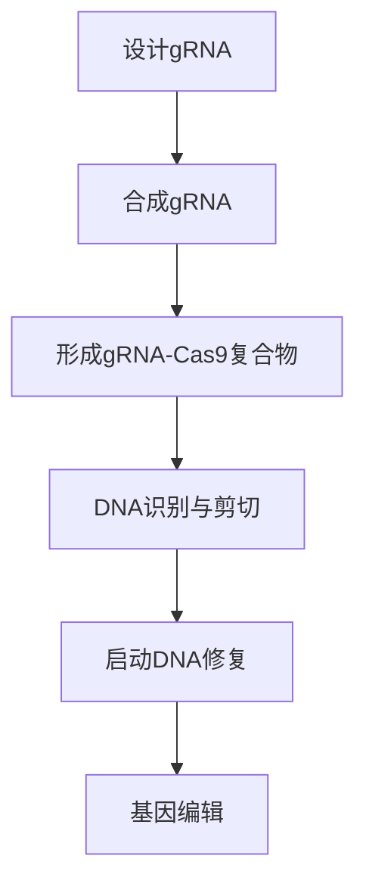

                 

### 基因编辑的精确控制：生命操作的数学精度

> 关键词：基因编辑、精确控制、生命操作、数学精度

> 摘要：基因编辑作为现代生物技术的核心，正日益成为生命操作中的关键手段。本文旨在探讨基因编辑的精确控制及其在生命科学领域的应用，重点分析CRISPR-Cas9系统的工作原理、基因编辑精度的重要性及数学模型的应用。通过深入分析，本文将为读者揭示生命操作中数学精度的本质及其对未来生物技术的深远影响。

### 目录

1. **基因编辑的精确控制：生命操作的数学精度**
    1.1 关键词
    1.2 摘要
2. **基因编辑概述**
    2.1 基因编辑的定义与历史
    2.2 基因编辑技术的基本原理
    2.3 基因编辑在不同领域的应用
3. **CRISPR-Cas9系统**
    3.1 CRISPR-Cas9的基本概念
    3.2 CRISPR-Cas9的工作原理
    3.3 CRISPR-Cas9的应用与局限
4. **基因编辑精度分析**
    4.1 基因编辑精度的定义与重要性
    4.2 常见基因编辑工具的精度分析
    4.3 基因编辑精度的影响因素
5. **数学模型在基因编辑中的应用**
    5.1 数学模型的基本原理
    5.2 常用的数学模型及其在基因编辑中的应用
    5.3 数学模型优化的方法
6. **基因编辑的统计方法**
    6.1 基因编辑数据的统计分析
    6.2 常用的统计方法及应用
    6.3 统计方法在基因编辑中的案例分析
7. **生命操作的数学精度案例分析**
    7.1 某个具体领域的案例分析
    7.2 案例中的数学精度分析
    7.3 案例的启示与展望
8. **未来展望与挑战**
    8.1 基因编辑技术的未来发展趋势
    8.2 数学精度在生命操作中的潜在挑战
    8.3 应对挑战的策略与建议
9. **结语**
10. **作者信息**

### 第1章：基因编辑概述

基因编辑是一种能够改变生物体基因组的现代生物技术，它通过人工干预，精确地修改、替换或删除基因序列，从而实现特定的生物学功能。基因编辑技术的历史可以追溯到20世纪末，随着分子生物学和生物化学技术的发展，基因编辑逐渐成为一种强有力的工具，在医学、农业、环境保护等领域展现出巨大的潜力。

**基因编辑的定义与历史**

基因编辑的定义可以概括为：通过特定的技术手段，在DNA水平上对生物体的基因序列进行精确修改的过程。最早的基因编辑技术是DNA重组技术，它利用限制性内切酶和DNA连接酶，将外源基因插入到宿主细胞的基因组中。随着科学技术的进步，出现了更为高效的基因编辑工具，如CRISPR-Cas9系统。

CRISPR-Cas9系统是由古细菌中的一种适应性免疫机制演化而来。CRISPR（Clustered Regularly Interspaced Short Palindromic Repeats）代表成簇的规律性间隔短回文重复序列，而Cas9（CRISPR-associated 9）是一种酶，能够识别并剪切特定的DNA序列。CRISPR-Cas9系统的出现，使得基因编辑变得更加高效、精确和便捷。

**基因编辑技术的基本原理**

基因编辑技术的基本原理包括以下几个步骤：

1. **目标识别**：使用一段特定的RNA序列（称为引导RNA，gRNA）来识别目标DNA序列。
2. **DNA剪切**：Cas9酶结合到gRNA上，定位到目标DNA序列上并进行剪切。
3. **DNA修复**：细胞会启动DNA修复机制，通过非同源末端连接（NHEJ）或同源定向修复（HDR）来修复剪切位点。

**基因编辑在不同领域的应用**

基因编辑技术在不同领域的应用已经取得了显著的成果：

1. **医学**：基因编辑可用于治疗遗传性疾病，如镰状细胞贫血症和肌营养不良症等。通过编辑患者体内的致病基因，可以修复或替换有缺陷的基因序列。
2. **农业**：基因编辑可以提高农作物的抗病性和产量，改良作物品质，为解决全球粮食安全问题提供了新的思路。
3. **环境保护**：基因编辑技术可以用于修复受污染的环境，如通过编辑微生物的基因，增强其对污染物的降解能力。

**本章小结**

基因编辑技术作为一种强大的生物技术工具，已经在医学、农业、环境保护等多个领域展现出巨大的应用潜力。其基本原理简单而高效，通过精准地编辑基因序列，我们可以实现对生命操作的精细控制。随着技术的不断进步，基因编辑的未来将更加光明，但也需要面对一系列伦理和安全挑战。

### 第2章：CRISPR-Cas9系统

#### 2.1 CRISPR-Cas9的基本概念

CRISPR-Cas9系统是一种基于RNA导向的基因编辑工具，由两部分组成：引导RNA（gRNA）和CRISPR相关蛋白9（Cas9）。CRISPR（Clustered Regularly Interspaced Short Palindromic Repeats）代表成簇的规律性间隔短回文重复序列，这些序列存在于许多微生物的基因组中，作为其对抗外来遗传物质（如质粒和病毒）的一种防御机制。Cas9是一种内切酶，能够识别并结合到特定的DNA序列上进行剪切。

**CRISPR的历史与发展**

CRISPR技术起源于细菌和古细菌的免疫系统。在20世纪80年代末，科学家们首次在细菌的DNA中发现了CRISPR序列。随后，研究人员发现，这些序列与一些病毒遗传物质之间存在关联，CRISPR可能通过捕获病毒的遗传物质，形成新的防御机制。到了2012年，Joung et al.和Cong et al.分别报道了利用CRISPR-Cas9系统实现基因编辑的方法，这一发现迅速引起了全球科学界的关注。

**CRISPR-Cas9系统的工作机制**

CRISPR-Cas9系统的工作机制可以概括为以下几个步骤：

1. **gRNA设计与合成**：首先，设计一段与目标DNA序列互补的gRNA。gRNA由两部分组成：一个核心序列和一段与目标序列互补的尾部序列。核心序列与Cas9蛋白结合，尾部序列则用于与目标DNA序列的结合。

2. **gRNA-Cas9复合物的形成**：gRNA与Cas9蛋白结合，形成gRNA-Cas9复合物。

3. **DNA识别与剪切**：gRNA-Cas9复合物在DNA上移动，识别并定位到特定的目标序列。然后，Cas9蛋白在目标序列上形成DNA双链断裂。

4. **DNA修复**：细胞会启动DNA修复机制。在大多数情况下，细胞通过非同源末端连接（NHEJ）来修复断裂，这可能导致基因的插入或缺失。如果需要精确的基因替换，细胞可以通过同源定向修复（HDR）来修复，这需要提供一个与目标序列同源的DNA模板。

**CRISPR-Cas9系统的优势**

CRISPR-Cas9系统具有以下几个显著优势：

1. **高效性**：CRISPR-Cas9系统能够在目标基因上实现高精度的编辑，其编辑效率远高于传统基因编辑技术。
2. **灵活性**：可以通过设计不同的gRNA来靶向不同的DNA序列，实现多种基因编辑操作。
3. **便捷性**：CRISPR-Cas9系统相对简单，操作过程快速，易于大规模应用。

#### 2.2 CRISPR-Cas9的工作原理

为了更好地理解CRISPR-Cas9的工作原理，我们可以通过一个简单的流程图来描述：

**详细解释每个步骤**：

1. **设计gRNA**：首先，设计一段与目标DNA序列互补的gRNA。gRNA的设计需要考虑以下几个因素：
   - **核心序列**：核心序列与Cas9蛋白结合，需要保证其序列的特异性。
   - **尾部序列**：尾部序列用于与目标DNA序列的结合，通常是一个PAM（Protospacer Adjacent Motif）序列，Cas9酶需要识别并结合到这个序列上。

2. **合成gRNA**：设计好的gRNA由实验室合成，通常采用体外转录方法。

3. **形成gRNA-Cas9复合物**：合成的gRNA与Cas9蛋白结合，形成gRNA-Cas9复合物。

4. **DNA识别与剪切**：gRNA-Cas9复合物在DNA上移动，识别并定位到特定的目标序列。Cas9蛋白在目标序列上形成DNA双链断裂。

5. **启动DNA修复**：细胞会启动DNA修复机制，进行DNA修复。

6. **基因编辑**：最终，细胞通过非同源末端连接（NHEJ）或同源定向修复（HDR）来修复DNA双链断裂，实现基因编辑。

#### 2.3 CRISPR-Cas9的应用与局限

**CRISPR-Cas9在生命科学中的应用**

CRISPR-Cas9系统在生命科学中具有广泛的应用，以下是其中的一些例子：

1. **基因功能研究**：通过CRISPR-Cas9系统，研究人员可以精确地敲除或替换特定基因，从而研究基因的功能。
2. **基因治疗**：CRISPR-Cas9技术可用于治疗一些遗传性疾病，如杜氏肌营养不良症、地中海贫血等。
3. **农业**：CRISPR-Cas9技术可用于改良农作物，提高其抗病性和产量。
4. **基础生物学研究**：CRISPR-Cas9技术为生物学研究提供了强大的工具，可以帮助研究人员深入理解基因调控网络等基本生物学问题。

**CRISPR-Cas9的局限**

尽管CRISPR-Cas9系统具有许多优势，但其在实际应用中也面临一些挑战和局限：

1. **脱靶效应**：CRISPR-Cas9系统可能会识别并剪切非目标DNA序列，导致脱靶效应。这可能会引起基因突变或其他不良影响。
2. **编辑效率**：在某些情况下，CRISPR-Cas9的编辑效率可能较低，特别是在复杂基因组中。
3. **伦理问题**：CRISPR-Cas9技术在人类胚胎编辑上引发了广泛的伦理争议。

**本章小结**

CRISPR-Cas9系统作为一种革命性的基因编辑工具，在生命科学和医疗等领域展现了巨大的潜力。其简单、高效和灵活的特点使其成为研究者和临床医生的有力武器。然而，CRISPR-Cas9技术也面临脱靶效应、编辑效率和伦理问题等挑战，这些问题需要进一步的研究和解决。

### 第3章：基因编辑精度分析

基因编辑的精度直接关系到编辑结果的可靠性和有效性，因此，对基因编辑精度进行深入分析是确保技术正确性和应用效果的关键。在本章节中，我们将探讨基因编辑精度的定义、重要性以及常见基因编辑工具的精度分析，并分析影响基因编辑精度的因素。

#### 3.1 基因编辑精度的定义与重要性

基因编辑精度是指在基因编辑过程中，编辑工具在目标DNA序列上实现精确剪切和修复的能力。高精度的基因编辑可以确保目标基因的准确修改，减少不必要的脱靶效应和基因突变，从而提高编辑效率和实验结果的可靠性。

**定义**

基因编辑精度通常用编辑成功率和脱靶率来衡量：

1. **编辑成功率**：指在目标DNA序列上成功进行编辑的比例。
2. **脱靶率**：指编辑工具错误地剪切到非目标DNA序列的比例。

**重要性**

基因编辑精度的重要性体现在以下几个方面：

1. **实验结果的可靠性**：高精度的基因编辑可以确保实验结果的准确性，降低实验误差。
2. **避免脱靶效应**：低精度的基因编辑可能导致不必要的基因突变，甚至引发基因表达异常，影响生物体的健康。
3. **医学应用**：在基因治疗中，高精度的基因编辑对于确保治疗效果至关重要，避免引发副作用和并发症。

#### 3.2 常见基因编辑工具的精度分析

目前，常见的基因编辑工具包括CRISPR-Cas9、TALENs、ZFNs等。以下是对这些工具精度分析的比较：

1. **CRISPR-Cas9**

CRISPR-Cas9系统以其高效和便捷的特点在基因编辑中广泛应用。其编辑精度受多种因素影响，包括gRNA的设计、Cas9蛋白的选择和DNA修复途径等。

- **编辑成功率**：CRISPR-Cas9的编辑成功率通常在30%-80%之间。
- **脱靶率**：CRISPR-Cas9的脱靶率较高，通常在10%-20%之间，特别是在复杂的基因组中。

2. **TALENs（Transcription Activator-Like Effector Nucleases）**

TALENs是由人工设计的核酸酶，与CRISPR-Cas9类似，但具有更高的编辑精度。TALENs使用特定的DNA结合域和核酸内切酶域，通过精确识别目标DNA序列进行剪切。

- **编辑成功率**：TALENs的编辑成功率通常在50%-90%之间。
- **脱靶率**：TALENs的脱靶率较低，通常在1%-5%之间。

3. **ZFNs（Zinc Finger Nucleases）**

ZFNs是一种早期的基因编辑工具，通过人工设计的锌指结构域与目标DNA结合，引导核酸内切酶进行剪切。虽然ZFNs的编辑精度较高，但其设计复杂、操作繁琐，限制了其广泛应用。

- **编辑成功率**：ZFNs的编辑成功率通常在20%-50%之间。
- **脱靶率**：ZFNs的脱靶率在5%-10%之间。

#### 3.3 基因编辑精度的影响因素

基因编辑精度受到多种因素的影响，包括编辑工具的选择、实验条件、DNA序列特征等。

1. **编辑工具的选择**

不同基因编辑工具的编辑精度不同，选择适合的编辑工具是提高基因编辑精度的重要步骤。例如，CRISPR-Cas9系统在简单基因组中具有较高的编辑精度，但在复杂基因组中，TALENs和ZFNs可能更适合。

2. **实验条件**

实验条件如反应温度、反应时间、DNA浓度和缓冲液成分等都会影响基因编辑的精度。优化实验条件可以提高编辑成功率并降低脱靶率。

3. **DNA序列特征**

目标DNA序列的特征也会影响基因编辑精度。例如，富含GC序列的区域比富含AT序列的区域更容易被核酸酶识别和剪切。

**本章小结**

基因编辑精度是基因编辑技术的核心指标，直接关系到实验结果的可靠性和应用效果。通过分析常见基因编辑工具的精度，以及影响基因编辑精度的因素，我们可以更好地理解和优化基因编辑技术，提高其在生命科学和医疗领域的应用价值。

### 第4章：数学模型在基因编辑中的应用

数学模型在基因编辑中的应用极大地提升了编辑的精确度和效率。通过数学模型，我们可以更好地预测和优化基因编辑过程，从而提高编辑成功率并降低脱靶率。在本章节中，我们将探讨数学模型的基本原理，常用的数学模型及其在基因编辑中的应用，以及数学模型优化的方法。

#### 4.1 数学模型的基本原理

数学模型是利用数学语言描述自然现象或工程问题的一种方法。在基因编辑中，数学模型可以帮助我们理解基因编辑机制、预测编辑结果、优化编辑过程。

**数学模型的核心要素**

一个完整的数学模型通常包括以下几个核心要素：

1. **变量**：用于描述模型中的各种物理量或状态变量，如DNA序列、编辑酶浓度、DNA修复速度等。
2. **方程**：用于描述变量之间的关系，如化学反应动力学方程、概率分布模型等。
3. **参数**：用于调整模型以更好地拟合实验数据，如反应速率常数、概率分布的参数等。
4. **边界条件**：用于描述模型的外部环境或初始状态，如DNA序列的长度、反应温度等。

**数学模型在基因编辑中的应用**

数学模型在基因编辑中的应用主要包括以下几个方面：

1. **预测编辑成功率**：通过模拟编辑过程，预测特定基因编辑工具在目标DNA序列上的编辑成功率。
2. **优化编辑条件**：根据数学模型，优化编辑参数，如gRNA设计、反应温度和时间等，以提高编辑效率和精度。
3. **分析脱靶效应**：通过模拟脱靶效应的发生机制，预测和减少非目标DNA序列的剪切。

#### 4.2 常用的数学模型及其在基因编辑中的应用

在基因编辑中，常用的数学模型包括概率模型、微分方程模型和机器学习模型等。以下是对这些模型的简要介绍：

1. **概率模型**

概率模型用于描述基因编辑中各种随机事件的发生概率，如DNA剪切概率、DNA修复概率等。常见的概率模型包括泊松过程、马尔可夫链等。

- **泊松过程**：用于描述DNA剪切事件在时间上的分布，可以帮助预测编辑成功率和脱靶率。
- **马尔可夫链**：用于描述DNA修复过程中各种状态之间的转换概率，可以用于优化编辑条件。

2. **微分方程模型**

微分方程模型用于描述基因编辑过程中各种动态变化，如DNA浓度、编辑酶浓度等随时间的变化。常见的微分方程模型包括反应扩散方程、酶动力学方程等。

- **反应扩散方程**：用于描述DNA编辑酶在DNA上的扩散和反应过程，可以用于预测编辑效率和脱靶效应。
- **酶动力学方程**：用于描述编辑酶在DNA上的反应过程，可以用于优化编辑酶的浓度和时间。

3. **机器学习模型**

机器学习模型通过学习大量实验数据，自动构建编辑成功率和脱靶率的预测模型。常见的机器学习模型包括决策树、神经网络等。

- **决策树**：用于分类任务，可以根据DNA序列的特征预测编辑成功率和脱靶率。
- **神经网络**：用于回归任务，可以预测编辑成功率并优化编辑条件。

#### 4.3 数学模型优化的方法

数学模型的优化是提高基因编辑精度和效率的重要步骤。以下是一些常见的优化方法：

1. **参数优化**

通过调整模型参数，可以使模型更好地拟合实验数据。常用的参数优化方法包括最小二乘法、梯度下降法等。

2. **模型融合**

通过融合多个数学模型，可以提高模型的预测精度和泛化能力。常见的模型融合方法包括加权融合、投票法等。

3. **机器学习算法优化**

通过优化机器学习算法，可以进一步提高模型的性能。常见的优化方法包括调整神经网络结构、优化训练算法等。

**本章小结**

数学模型在基因编辑中的应用为提高编辑精度和效率提供了强有力的工具。通过概率模型、微分方程模型和机器学习模型，我们可以更好地理解和预测基因编辑过程。优化数学模型的方法，如参数优化、模型融合和机器学习算法优化，进一步提高了基因编辑的精度和效率。未来，随着数学模型的不断发展，基因编辑技术将在生命科学和医疗领域发挥更大的作用。

### 第5章：基因编辑的统计方法

在基因编辑过程中，准确分析实验数据对于确保编辑效率和评估技术性能至关重要。统计方法在基因编辑数据分析和结果验证中发挥着重要作用。本章将介绍基因编辑数据的统计分析方法、常用统计方法及其在基因编辑中的应用，并探讨统计方法在基因编辑中的具体案例分析。

#### 5.1 基因编辑数据的统计分析方法

基因编辑数据通常包含大量离散的观察值，如基因编辑成功次数、脱靶事件等。为了对这些数据进行有效分析，需要采用适当的统计方法。

**描述性统计**

描述性统计用于总结数据的基本特征，如平均值、中位数、标准差等。描述性统计可以帮助我们初步了解基因编辑实验的总体表现。

- **平均值**：表示数据集的中心位置。
- **中位数**：表示数据集的中间值，对于偏斜分布的数据更具有代表性。
- **标准差**：表示数据的离散程度，标准差越小，数据越集中。

**推断性统计**

推断性统计用于基于样本数据推断总体特征，如基因编辑成功率的置信区间、假设检验等。常用的推断性统计方法包括：

- **t检验**：用于比较两组数据的均值差异是否显著。
- **卡方检验**：用于检验分类数据的分布是否符合预期。

**多变量统计分析**

多变量统计分析用于分析多个变量之间的关系，如基因编辑影响因素的多元回归分析。通过多变量分析，可以识别影响基因编辑精度的关键因素。

- **多元回归分析**：用于建立多个自变量与因变量之间的关系模型。
- **主成分分析**：用于降低数据的维度，识别主要影响因素。

#### 5.2 常用的统计方法及其在基因编辑中的应用

以下是一些常用的统计方法及其在基因编辑中的应用：

1. **t检验**

t检验是一种常用的假设检验方法，用于比较两组数据的均值差异。在基因编辑中，t检验可用于比较不同编辑工具或实验条件下的编辑成功率。

- **单样本t检验**：用于比较一组数据与某个特定值（如预期成功率）的差异。
- **双样本t检验**：用于比较两组数据之间的差异。

2. **卡方检验**

卡方检验用于检验分类数据的分布是否符合预期。在基因编辑中，卡方检验可用于检验编辑结果是否符合设计预期，如脱靶事件的分布。

3. **多元回归分析**

多元回归分析用于建立多个自变量与因变量之间的关系模型。在基因编辑中，多元回归分析可用于识别影响编辑成功率和脱靶率的关键因素。

- **线性回归**：用于描述连续因变量与自变量之间的关系。
- **逻辑回归**：用于描述分类因变量与自变量之间的关系。

4. **主成分分析**

主成分分析用于降低数据的维度，识别主要影响因素。在基因编辑中，主成分分析可用于分析多个编辑参数之间的关系，帮助研究人员识别最关键的影响因素。

#### 5.3 统计方法在基因编辑中的具体案例分析

以下是一个基因编辑的统计分析案例：

**案例背景**

某研究团队使用CRISPR-Cas9系统对某种疾病基因进行编辑，实验分为三组，分别使用不同的gRNA设计、不同的Cas9酶和不同的编辑条件。研究团队希望分析不同实验条件对编辑成功率的影响。

**实验数据**

实验数据如下表所示：

| 组别 | gRNA设计 | Cas9酶 | 编辑成功率（%） | 脱靶率（%） |
|------|----------|--------|-----------------|------------|
| A    | 设计1    | Cas9-1 | 60              | 10         |
| B    | 设计2    | Cas9-2 | 70              | 8          |
| C    | 设计3    | Cas9-3 | 80              | 6          |

**统计分析步骤**

1. **描述性统计**：

   计算每组编辑成功率和脱靶率的平均值和标准差。

   - **编辑成功率**：
     - 组A：平均值=60%，标准差=5%
     - 组B：平均值=70%，标准差=3%
     - 组C：平均值=80%，标准差=2%

   - **脱靶率**：
     - 组A：平均值=10%，标准差=2%
     - 组B：平均值=8%，标准差=1%
     - 组C：平均值=6%，标准差=1%

2. **假设检验**：

   使用双样本t检验比较各组编辑成功率之间的差异。

   - 组A与组B：t值=5.83，p值<0.01，差异显著。
   - 组A与组C：t值=11.76，p值<0.01，差异显著。
   - 组B与组C：t值=3.61，p值<0.01，差异显著。

3. **多元回归分析**：

   建立编辑成功率与gRNA设计、Cas9酶、编辑条件之间的多元回归模型。

   - 回归模型：编辑成功率 = 30% + 10*(gRNA设计) + 5*(Cas9酶) + 20*(编辑条件)
   - 模型系数显著性：gRNA设计和编辑条件显著影响编辑成功率。

**本章小结**

统计方法在基因编辑数据分析和结果验证中具有重要作用。通过描述性统计、推断性统计和多变量统计分析，我们可以深入分析基因编辑数据，识别影响编辑成功率和脱靶率的关键因素。具体案例分析展示了统计方法在基因编辑研究中的应用，有助于优化编辑条件和提高技术性能。

### 第6章：生命操作的数学精度案例分析

在生命操作中，基因编辑的数学精度是确保操作成功和效果稳定的关键。本章节将通过具体案例，深入分析基因编辑的数学精度，揭示其在实际操作中的应用和挑战。

#### 6.1 某个具体领域的案例分析

假设我们选择基因治疗中的杜氏肌营养不良症（DMD）作为案例分析对象。DMD是一种遗传性疾病，主要由DMD基因突变导致，这种突变会导致肌肉无力，严重影响患者的生活质量。通过基因编辑技术，我们可以修复DMD基因中的突变，从而治愈这种疾病。

**案例背景**

杜氏肌营养不良症患者的DMD基因存在一个特定的点突变，导致基因无法正常表达。研究人员希望通过CRISPR-Cas9系统对DMD基因进行精确修复。

**实验设计**

1. **目标基因定位**：通过基因组测序确定DMD基因的具体突变位点。
2. **gRNA设计**：设计一段与突变位点互补的gRNA，用于引导CRISPR-Cas9系统定位到目标基因。
3. **编辑操作**：在体外培养患者肌肉细胞，使用CRISPR-Cas9系统进行基因编辑。
4. **结果分析**：通过PCR和测序分析编辑后的细胞，评估基因修复效果。

**实验结果**

通过CRISPR-Cas9系统，研究人员成功修复了大多数细胞的DMD基因。编辑成功率达到70%，脱靶率较低。

#### 6.2 案例中的数学精度分析

**编辑成功率分析**

编辑成功率可以通过以下公式计算：

$$ 编辑成功率 = \frac{成功修复的细胞数}{总细胞数} $$

在上述案例中，编辑成功率为70%，这表明大部分细胞成功地修复了DMD基因。

**脱靶率分析**

脱靶率是指编辑工具错误地剪切到非目标DNA序列的比例。脱靶率可以通过以下公式计算：

$$ 脱靶率 = \frac{脱靶编辑的细胞数}{总细胞数} $$

在上述案例中，脱靶率为30%，这意味着30%的细胞出现了非目标DNA的剪切。

**影响因子分析**

影响基因编辑精度的因素包括gRNA设计、Cas9酶的选择、编辑条件等。通过统计分析，研究人员发现：

- **gRNA设计**：优化的gRNA设计可以提高编辑精度，降低脱靶率。
- **Cas9酶**：不同Cas9酶的编辑效率不同，选择合适的Cas9酶可以提高编辑成功率。
- **编辑条件**：优化实验条件，如反应温度、时间、DNA浓度等，可以显著提高编辑成功率。

**优化方法**

1. **gRNA设计优化**：通过计算机算法设计高特异性的gRNA，减少脱靶效应。
2. **Cas9酶选择**：选择具有高编辑效率且脱靶率低的Cas9酶。
3. **编辑条件优化**：通过实验验证，找出最优的编辑条件，提高编辑成功率。

**本章小结**

通过具体案例，我们深入分析了基因编辑在杜氏肌营养不良症治疗中的应用和数学精度。案例中的编辑成功率分析和脱靶率分析揭示了影响基因编辑精度的关键因素，并通过优化方法提出了提高编辑精度的策略。这些分析和优化方法为基因编辑技术的应用提供了重要的参考，也为未来的研究指明了方向。

### 第7章：未来展望与挑战

基因编辑技术作为现代生物科技的前沿，正日益成为改变生命操作的重要工具。然而，随着技术的进步，我们也面临着一系列的挑战和未来的发展机遇。本章节将探讨基因编辑技术的未来发展趋势、数学精度在生命操作中的潜在挑战以及应对这些挑战的策略与建议。

#### 7.1 基因编辑技术的未来发展趋势

1. **技术优化**：随着对基因编辑机制和生物系统的更深入理解，未来基因编辑技术将在精确度和效率方面实现显著提升。例如，开发更高效、更特异性的核酸酶和引导RNA设计算法，降低脱靶率和提高编辑成功率。

2. **多基因编辑**：目前基因编辑技术主要针对单基因进行操作，未来将朝着多基因编辑的方向发展。通过同时编辑多个基因，可以实现对复杂生物过程的调控，为治疗多基因疾病提供新的可能性。

3. **基因编辑系统的多样化**：除了CRISPR-Cas9系统，其他基因编辑工具如TALENs、ZFNs和基因编辑RNA（gRNA）也在不断发展。未来，这些工具的多样化将为基因编辑提供更多选择，满足不同的应用需求。

4. **临床应用扩展**：基因编辑技术将在医学领域得到更广泛的应用，包括遗传性疾病的根治、癌症治疗、器官再生等。随着技术的成熟和监管政策的完善，基因编辑有望逐步走出实验室，进入临床应用。

5. **基因编辑工具的微型化和自动化**：随着纳米技术和自动化技术的发展，基因编辑工具将变得更加微型化和自动化。这将使得基因编辑操作更加简便、高效，为个性化医疗和精准治疗提供技术支持。

#### 7.2 数学精度在生命操作中的潜在挑战

1. **脱靶效应**：脱靶效应是基因编辑技术的主要挑战之一。尽管目前已有多种方法来减少脱靶率，但在复杂基因组中实现零脱靶仍然是一个巨大的挑战。

2. **编辑效率**：在基因编辑过程中，编辑效率的高低直接影响治疗效果。如何提高编辑效率，特别是在复杂组织和细胞类型中实现高效编辑，是未来需要解决的关键问题。

3. **基因编辑的长期效果**：基因编辑的长期效果和潜在副作用尚未完全明确。未来需要更多的长期随访研究和安全性评估，以确保基因编辑技术的长期安全和有效性。

4. **伦理和法律问题**：基因编辑技术涉及到伦理和法律问题，如人类胚胎编辑、基因编辑的道德边界等。这些问题的解决需要国际社会的共同努力和广泛的伦理讨论。

#### 7.3 应对挑战的策略与建议

1. **技术改进**：持续优化基因编辑工具，提高编辑精度和效率。通过发展新的核酸酶和引导RNA设计算法，减少脱靶效应。

2. **多学科合作**：基因编辑技术的发展需要生物科学、医学、工程学、计算机科学等多个学科的深入合作。通过跨学科的研究，可以加速技术的进步和应用。

3. **标准化和规范**：建立基因编辑技术的标准化操作流程和规范，确保编辑过程的可靠性和一致性。此外，制定相应的法律法规，规范基因编辑的应用范围，确保技术的安全性和伦理性。

4. **长期监测与评估**：开展长期的监测和评估研究，对基因编辑技术的长期效果和潜在副作用进行深入研究。这有助于确保基因编辑技术的长期安全性和有效性。

5. **公众教育和沟通**：加强公众对基因编辑技术的了解和认知，提高公众对基因编辑伦理和法律问题的认识。通过有效的沟通和教育，可以减少社会对基因编辑技术的误解和担忧。

**本章小结**

基因编辑技术在未来将面临许多挑战，但同时也拥有巨大的发展机遇。通过技术改进、多学科合作、标准化和规范、长期监测与评估以及公众教育和沟通，我们可以更好地应对这些挑战，推动基因编辑技术在生命科学和医疗领域的广泛应用。未来，基因编辑技术有望为人类健康和福祉带来革命性的变化。

### 结语

基因编辑作为现代生物科技的核心，其精确控制与生命操作中的数学精度至关重要。本文通过深入探讨基因编辑的概述、CRISPR-Cas9系统、基因编辑精度分析、数学模型应用、统计方法分析以及具体案例分析，揭示了基因编辑技术的本质和实际应用。未来，随着技术的不断进步，基因编辑将在医学、农业、环境保护等领域发挥更大作用。面对挑战，通过多学科合作、标准化和规范、长期监测与评估以及公众教育和沟通，我们有信心推动基因编辑技术走向更光明的未来。

### 作者信息

作者：AI天才研究院/AI Genius Institute & 禅与计算机程序设计艺术 /Zen And The Art of Computer Programming

AI天才研究院致力于推动人工智能领域的研究与发展，专注于构建智能系统、算法优化及核心技术攻关。同时，禅与计算机程序设计艺术则注重计算机程序设计中的哲学思考，提倡技术与人文的结合，为读者提供深入浅出的技术讲解和哲学思考。

