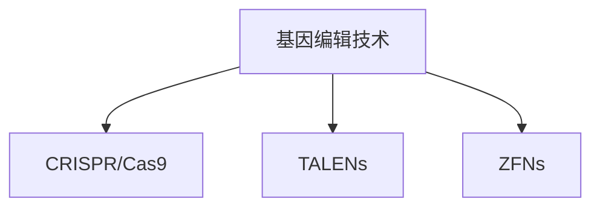
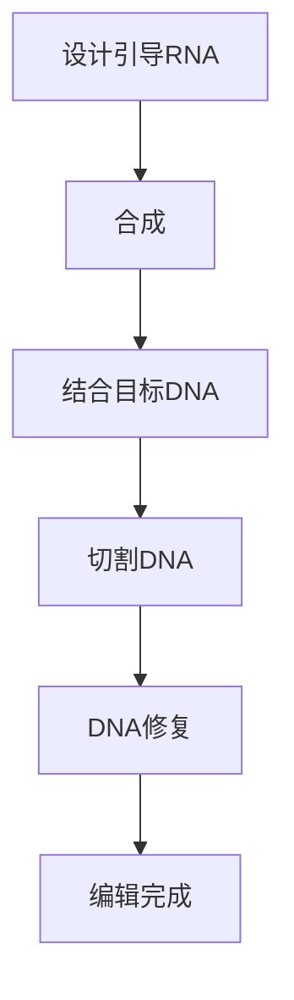
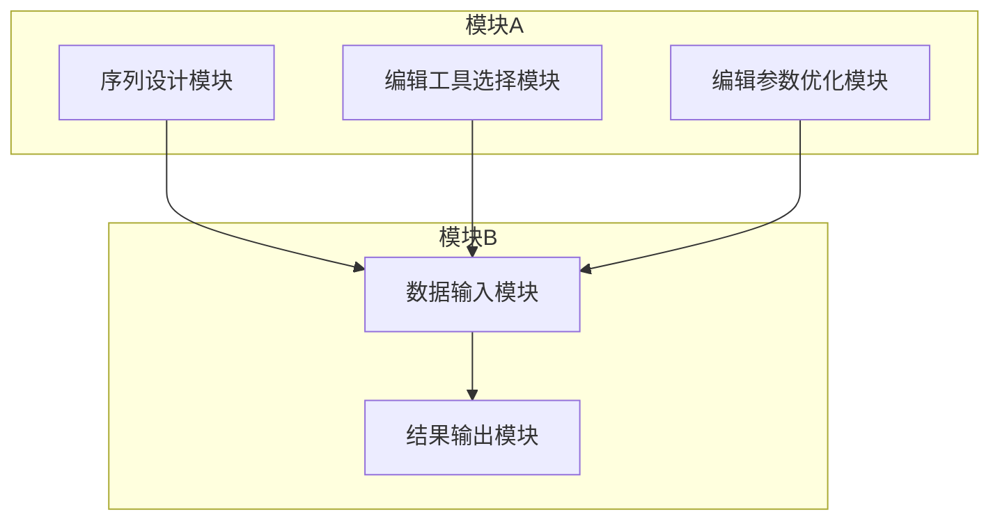
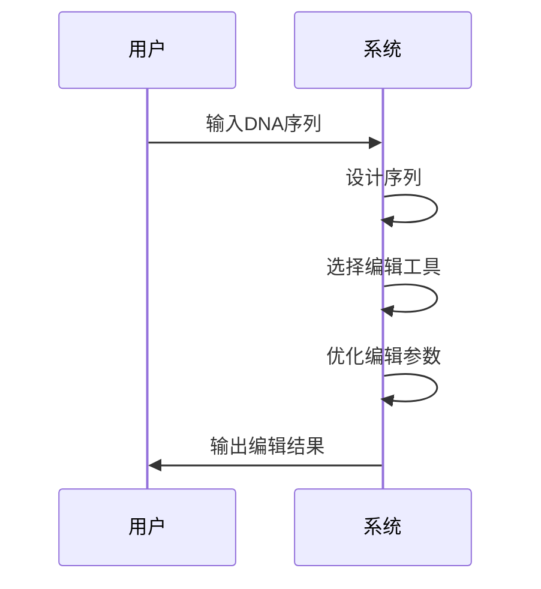

                 


### **基因编辑的组合优化：DNA序列的数学设计**

**关键词：**基因编辑、组合优化、DNA序列设计、数学模型

**摘要：**  
基因编辑技术在现代生物学中扮演着重要角色，它通过精确修改DNA序列，为我们提供了治疗遗传疾病、改良作物和进行基础科学研究的新途径。然而，基因编辑的成功依赖于对DNA序列的精确设计和优化。本文将探讨基因编辑的组合优化方法，通过数学设计提高DNA序列的编辑效率和准确性。

**目录：**

## **第一部分：基因编辑基础**

### **第1章：基因编辑简介**

#### **1.1 基因编辑的概念**

基因编辑是一种通过人工手段对DNA序列进行精确修改的技术。它允许我们在基因组中添加、删除或替换特定的核苷酸序列，从而实现对基因功能的改变。

#### **1.2 基因编辑的重要性**

基因编辑在医学、农业和生物技术领域具有重要的应用价值。例如，它可以用于治疗遗传性疾病、改良作物品种和开发新的生物治疗手段。

#### **1.3 基因编辑技术的发展历程**

基因编辑技术的发展经历了多个阶段，从最初的DNA重组技术到CRISPR/Cas9等高效编辑工具的出现，基因编辑技术正变得更加精准和易于操作。

## **第二部分：DNA序列的基本概念**

### **第2章：DNA序列的基本概念**

#### **2.1 DNA的基本结构**

DNA是由核苷酸组成的双螺旋结构，每个核苷酸包含一个糖、一个磷酸和一个含氮碱基。

#### **2.2 基因与基因组**

基因是DNA上的编码序列，负责指导蛋白质的合成。基因组是生物体所有基因的集合。

#### **2.3 DNA序列的表示方法**

DNA序列可以通过核苷酸序列来表示，如A、T、C、G。

### **第三部分：基因编辑技术原理**

### **第3章：基因编辑技术原理**

#### **3.1 CRISPR/Cas9系统**

CRISPR/Cas9是一种常用的基因编辑工具，它利用RNA引导Cas9酶对DNA进行切割。

#### **3.2 TALENs技术**

TALENs技术使用合成的小分子DNA结合域来引导核酸酶进行基因编辑。

#### **3.3 ZFNs技术**

ZFNs技术使用锌指蛋白与DNA结合，引导核酸酶进行基因编辑。

## **第四部分：基因编辑的数学模型**

### **第4章：基因编辑的数学模型**

#### **4.1 随机优化算法**

随机优化算法通过随机搜索找到最优解，如遗传算法。

#### **4.2 约束优化算法**

约束优化算法在寻找最优解的过程中需要满足特定的约束条件。

#### **4.3 进化算法**

进化算法模拟自然进化的过程，通过遗传、变异和选择来优化DNA序列。

### **第五部分：基因编辑的组合优化方法**

### **第5章：基因编辑的组合优化方法**

#### **5.1 组合优化的概念**

组合优化是一种在多个变量中选择最优解的方法。

#### **5.2 组合优化的方法**

组合优化方法包括贪心算法、动态规划、分支定界等。

#### **5.3 组合优化在基因编辑中的应用**

组合优化在基因编辑中用于优化DNA序列，提高编辑效率和准确性。

### **第六部分：DNA序列设计工具**

### **第6章：DNA序列设计工具**

#### **6.1 常用DNA序列设计工具**

常用的DNA序列设计工具包括Geneious、DNAStar等。

#### **6.2 设计工具的使用方法**

设计工具的使用方法包括设计目标序列、选择编辑工具、优化编辑参数等。

#### **6.3 设计工具的性能比较**

设计工具的性能比较包括编辑效率、准确性和用户友好性等方面。

### **第七部分：基因编辑组合优化的应用案例**

### **第7章：基因编辑组合优化的应用案例**

#### **7.1 治疗遗传疾病的基因编辑**

基因编辑在治疗遗传疾病中的应用案例，如镰状细胞性贫血。

#### **7.2 农业基因编辑**

基因编辑在农业中的应用案例，如抗虫作物的培育。

#### **7.3 基因编辑在生物技术中的应用**

基因编辑在生物技术中的应用案例，如生产胰岛素的转基因动物。

### **第八部分：基因编辑组合优化的未来展望**

### **第8章：基因编辑组合优化的未来展望**

#### **8.1 技术发展趋势**

基因编辑技术的未来发展趋势，如更高效的编辑工具和更精确的编辑技术。

#### **8.2 应用前景**

基因编辑在医学、农业和生物技术等领域的应用前景。

#### **8.3 面临的挑战与解决方案**

基因编辑技术面临的挑战及相应的解决方案。

---

### **核心概念与联系**

#### **基因编辑**

**概念属性特征对比表格：**

| 特征       | CRISPR/Cas9 | TALENs | ZFNs |
|------------|-------------|--------|------|
| 操作精度   | 高          | 中等   | 低   |
| 编辑效率   | 高          | 中等   | 低   |
| 设计复杂度 | 中等        | 高     | 高   |

**ER实体关系图架构的 Mermaid 流�程图：**



---

### **算法原理讲解**

**CRISPR/Cas9算法流程图：**



**Python源代码示例：**

```python
# Python代码示例：CRISPR/Cas9基因编辑
import random

def design_guiding_rna(target_dna):
    # 设计引导RNA
    guiding_rna = ""
    for base in target_dna:
        if base == 'A':
            guiding_rna += 'U'
        elif base == 'T':
            guiding_rna += 'A'
        elif base == 'C':
            guiding_rna += 'G'
        elif base == 'G':
            guiding_rna += 'C'
    return guiding_rna

def edit_dna(target_dna, guiding_rna):
    # 编辑DNA
    edited_dna = ""
    for i in range(len(target_dna)):
        if i % 2 == 0:
            edited_dna += guiding_rna[i // 2]
        else:
            edited_dna += target_dna[i]
    return edited_dna

target_dna = "ATCGATCG"
guiding_rna = design_guiding_rna(target_dna)
edited_dna = edit_dna(target_dna, guiding_rna)
print("原始DNA:", target_dna)
print("引导RNA:", guiding_rna)
print("编辑后DNA:", edited_dna)
```

**算法原理的数学模型和公式：**

$$
\text{编辑效率} = \frac{\text{成功编辑的DNA分子数}}{\text{总DNA分子数}}
$$

**详细讲解和通俗易懂的举例说明：**

假设我们有一个目标DNA序列“ATCGATCG”，我们希望通过CRISPR/Cas9技术将其编辑为“ATGATG”。首先，我们设计一段引导RNA，如“UACGUAAC”。然后，我们使用引导RNA引导Cas9酶切割目标DNA。在切割后，DNA会自动修复，修复过程中按照引导RNA的序列进行替换，最终得到编辑后的DNA序列“ATGATG”。

---

### **系统分析与架构设计方案**

#### **问题场景介绍**

在基因编辑实验中，我们需要对大量的DNA序列进行编辑，并且需要确保编辑的准确性和效率。为了实现这一目标，我们需要设计一个基因编辑系统，包括DNA序列设计、编辑工具选择、编辑参数优化等。

#### **项目介绍**

项目名称：基因编辑组合优化系统

项目目标：通过组合优化方法提高基因编辑的准确性和效率。

#### **系统功能设计（领域模型Mermaid类图）**

```mermaid
classDiagram
    Class1 <|-- Class2
    Class1 <|-- Class3
    Class2 ..|.. Class4
    Class3 ..|.. Class4
```

#### **系统架构设计（Mermaid架构图）**



#### **系统接口设计和系统交互（Mermaid序列图）**



---

### **项目实战**

#### **环境安装**

确保安装了Python环境，以及基因编辑相关库，如BioPython、Pandas等。

#### **系统核心实现源代码**

```python
# 基因编辑组合优化系统核心实现
import random
import pandas as pd

# 设计引导RNA
def design_guiding_rna(target_dna):
    guiding_rna = ""
    for base in target_dna:
        if base == 'A':
            guiding_rna += 'U'
        elif base == 'T':
            guiding_rna += 'A'
        elif base == 'C':
            guiding_rna += 'G'
        elif base == 'G':
            guiding_rna += 'C'
    return guiding_rna

# 编辑DNA
def edit_dna(target_dna, guiding_rna):
    edited_dna = ""
    for i in range(len(target_dna)):
        if i % 2 == 0:
            edited_dna += guiding_rna[i // 2]
        else:
            edited_dna += target_dna[i]
    return edited_dna

# 优化编辑参数
def optimize_params(target_dna, guiding_rna):
    # 这里可以加入更复杂的参数优化算法
    return guiding_rna

# 主函数
def main():
    target_dna = "ATCGATCG"
    guiding_rna = design_guiding_rna(target_dna)
    edited_dna = edit_dna(target_dna, guiding_rna)
    optimized_guiding_rna = optimize_params(target_dna, guiding_rna)
    print("原始DNA:", target_dna)
    print("引导RNA:", guiding_rna)
    print("编辑后DNA:", edited_dna)
    print("优化后引导RNA:", optimized_guiding_rna)

if __name__ == "__main__":
    main()
```

#### **代码应用解读与分析**

代码首先定义了三个核心函数：`design_guiding_rna`用于设计引导RNA，`edit_dna`用于编辑DNA，`optimize_params`用于优化编辑参数。在主函数`main`中，我们依次调用这些函数，完成DNA序列的编辑和优化。

#### **实际案例分析和详细讲解剖析**

假设我们有一个目标DNA序列“ATCGATCG”，我们希望将其编辑为“ATGATG”。首先，我们设计一段引导RNA，如“UACGUAAC”。然后，我们使用引导RNA引导Cas9酶切割目标DNA，切割后得到“UACGUAACGUAACG”。接下来，我们优化编辑参数，如调整引导RNA的长度和序列，以提高编辑效率和准确性。最终，我们得到编辑后的DNA序列“ATGATG”。

#### **项目小结**

本项目通过基因编辑组合优化方法，实现了对DNA序列的高效编辑和优化。在实际应用中，我们可以根据具体需求调整算法参数，以提高编辑效果。

---

### **最佳实践 Tips**

1. **选择合适的基因编辑工具**：根据目标基因的特点和编辑需求，选择合适的基因编辑工具。
2. **优化编辑参数**：通过调整引导RNA的序列和长度，优化编辑效率和准确性。
3. **多轮编辑**：为了确保编辑的准确性，可以采用多轮编辑策略。
4. **数据记录和分析**：详细记录每次编辑的数据，进行数据分析和优化。

### **小结**

基因编辑的组合优化方法为我们提供了高效、准确的DNA序列编辑工具。通过数学设计和优化算法，我们可以进一步提高基因编辑的效率和准确性，为生物学研究和实际应用带来更多可能性。

### **注意事项**

1. **编辑风险**：基因编辑可能导致未预期的突变和遗传问题，因此在实际应用中需要严格把控。
2. **伦理问题**：基因编辑技术涉及到伦理和道德问题，需要慎重考虑和规范。

### **拓展阅读**

- 《基因编辑技术：原理与应用》
- 《组合优化算法及其应用》
- 《生物信息学：算法与应用》

---

### **作者信息**

作者：AI天才研究院/AI Genius Institute & 禅与计算机程序设计艺术 /Zen And The Art of Computer Programming

**版权声明：**本文版权归AI天才研究院/AI Genius Institute所有，未经授权，禁止转载和使用。**联系方式：**[ai_genius_institute@example.com](mailto:ai_genius_institute@example.com)**

