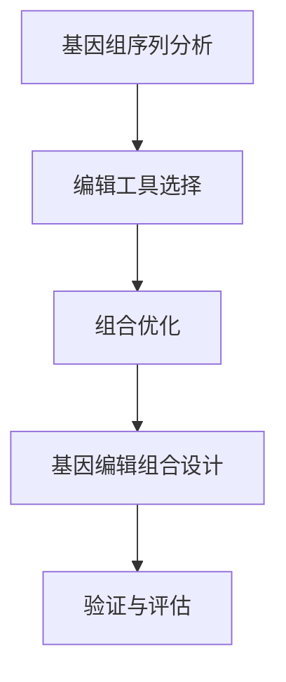
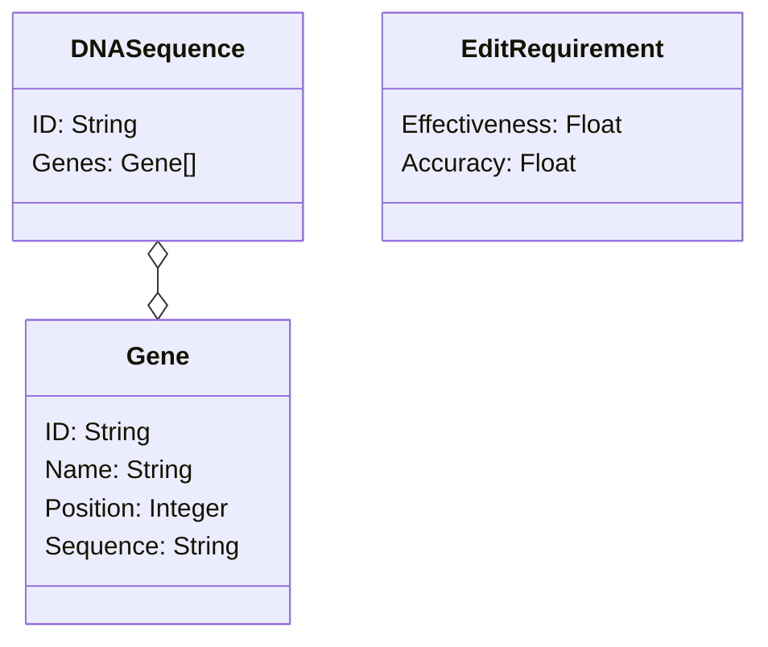
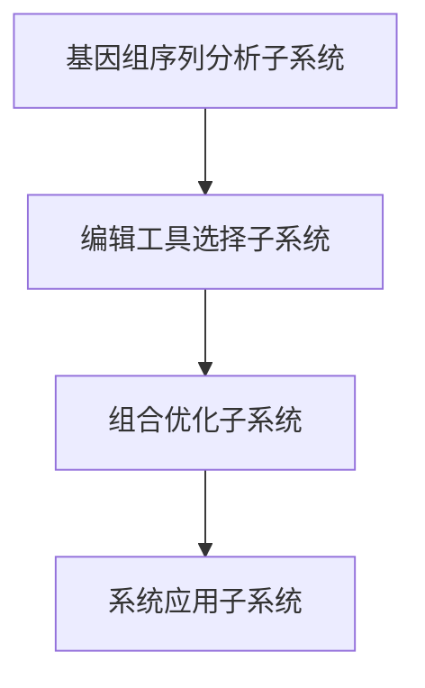
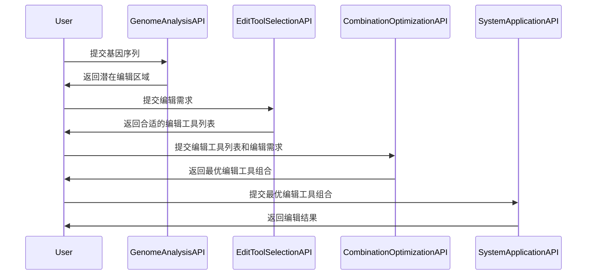
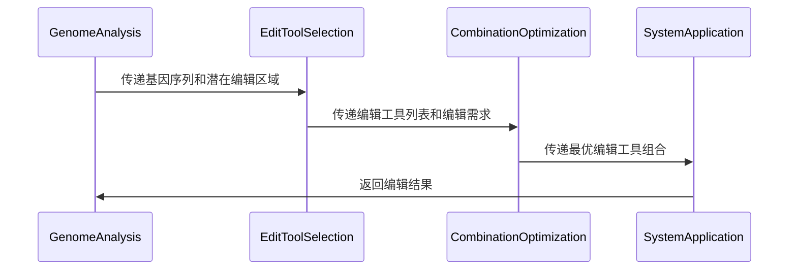

                 

## 基因编辑的组合优化：DNA序列的数学设计

关键词：基因编辑、组合优化、DNA序列、数学设计、CRISPR、TALENs、基因组序列分析

摘要：本文深入探讨了基因编辑领域中的组合优化问题，特别是如何通过数学设计方法优化DNA序列。文章首先介绍了基因编辑技术的基本原理和常用工具，然后详细阐述了基因组序列分析的步骤和方法，接着提出了一种基于数学模型的组合优化方法，并使用Python代码进行了实现。通过实际案例的分析，文章展示了该方法的有效性和实用性，并总结了项目的最佳实践和未来研究方向。

### 背景介绍

#### 核心概念术语说明

- **基因编辑**：通过人工手段对生物体的DNA序列进行修改的技术。
- **组合优化**：在给定约束条件下，寻找最优解的过程。
- **DNA序列**：由四种碱基（A、T、C、G）组成的线性序列，构成了生物体的遗传信息。
- **CRISPR（Clustered Regularly Interspaced Short Palindromic Repeats）**：一种常用的基因编辑工具，通过特定的DNA序列引导Cas9核酸酶切割目标DNA。
- **TALENs（Transcription Activator-Like Effector Nucleases）**：另一种基因编辑工具，类似于CRISPR，但使用不同的DNA引导序列。

#### 问题背景

基因编辑技术在近年来取得了显著的进展，尤其在治疗遗传性疾病和癌症方面展现出巨大的潜力。然而，基因编辑过程面临的一大挑战是如何优化基因编辑的组合，以提高编辑效率和准确性。不同的基因编辑工具具有不同的特性，如切割位点特异性、脱靶效应等，因此需要通过组合优化方法来设计最佳的编辑方案。

#### 问题描述

问题描述如下：

1. **基因组序列分析**：如何高效地分析目标基因序列，识别潜在编辑区域和约束条件？
2. **编辑工具选择**：如何根据基因序列特点和编辑需求，选择合适的基因编辑工具？
3. **组合优化**：如何通过数学模型和算法，优化基因编辑工具的组合，提高编辑效率和准确性？

#### 问题解决

本文提出了一种基于数学设计的基因编辑组合优化方法，通过以下步骤实现：

1. **基因组序列分析**：使用序列分析工具，识别目标基因序列中的潜在编辑区域和约束条件。
2. **编辑工具选择**：根据基因序列特点和编辑需求，选择合适的基因编辑工具。
3. **组合优化**：建立数学模型，使用优化算法设计最优的基因编辑组合。

#### 边界与外延

- **边界**：本文主要关注常见的基因编辑工具（如CRISPR、TALENs）的组合优化问题，不考虑其他更复杂的编辑技术。
- **外延**：本文的研究结果可以推广到其他需要组合优化的生物技术领域，如基因治疗、合成生物学等。

#### 概念结构与核心要素组成

本文的核心概念结构包括：

1. **基因组序列分析**：核心要素为序列分析工具和算法。
2. **编辑工具选择**：核心要素为基因序列特点和编辑需求的匹配。
3. **组合优化**：核心要素为数学模型和优化算法。

### 核心概念与联系

#### 核心概念原理

基因编辑组合优化的核心在于如何有效地选择和组合不同的基因编辑工具，以实现最佳的编辑效果。这涉及到以下几个关键概念：

1. **切割位点特异性**：不同的基因编辑工具对DNA序列的切割位点具有特异性，需要根据目标基因序列的特点进行选择。
2. **脱靶效应**：基因编辑工具可能会误切非目标序列，导致脱靶效应，影响编辑效率和安全性。
3. **编辑效率**：基因编辑工具的编辑效率是衡量其性能的重要指标，需要通过组合优化提高整体编辑效率。
4. **准确性**：基因编辑的准确性是保证编辑效果的关键，需要通过优化组合降低脱靶效应。

#### 概念属性特征对比表格

| 概念                | 特性                                                         | 对比分析                                                       |
|-------------------|------------------------------------------------------------|------------------------------------------------------------|
| 切割位点特异性       | 不同工具对切割位点的识别和切割能力不同                           | CRISPR具有更高的切割特异性，而TALENs在某些情况下可能更灵活       |
| 脱靶效应            | 基因编辑工具可能对非目标序列进行切割，导致不良后果                 | 需要优化编辑工具的组合，以降低脱靶效应                          |
| 编辑效率            | 基因编辑工具的编辑效率影响整体编辑效率                           | 需要选择高效率的工具，并通过组合优化提高整体效率                 |
| 准确性              | 基因编辑的准确性是保证编辑效果的关键                             | 通过减少脱靶效应和优化工具组合，提高编辑准确性                   |

#### ER实体关系图架构

为了更好地理解基因编辑组合优化的概念结构，我们可以使用Mermaid绘制一个ER（实体关系）图，展示基因编辑工具、基因序列和编辑目标之间的关系：

```mermaid
erDiagram
    GeneTool ||--|{ DNASequence }|--|| EditTarget
    DNASequence ||--|{ EditRequirement }|--|| GeneTool
    EditRequirement ||--|{ EditEffectiveness }|--|| GeneTool
```

在这个ER图中，`GeneTool`表示基因编辑工具，`DNASequence`表示基因序列，`EditTarget`表示编辑目标，`EditRequirement`表示编辑需求，`EditEffectiveness`表示编辑效果。

### 算法原理讲解

#### 算法流程

基因编辑组合优化的算法流程可以概括为以下步骤：

1. **基因组序列分析**：使用序列分析工具对目标基因序列进行预处理，提取潜在的编辑区域。
2. **编辑工具选择**：根据基因组序列的特点和编辑需求，选择适合的基因编辑工具。
3. **组合优化**：建立数学模型，使用优化算法（如遗传算法、模拟退火算法）设计最优的基因编辑组合。

#### 算法mermaid流程图



#### 算法Python代码实现

```python
# 假设已经导入了必要的库，如numpy、pandas等

# 基因组序列分析函数
def analyze_genome_sequence(dna_sequence):
    # 实现基因组序列分析逻辑
    pass

# 编辑工具选择函数
def select_edit_tools(dna_sequence, edit_requirements):
    # 实现编辑工具选择逻辑
    pass

# 组合优化函数
def optimize_edit_combination(dna_sequence, edit_tools):
    # 实现组合优化逻辑
    pass

# 验证与评估函数
def evaluate_edit_combination(edit_combination):
    # 实现验证与评估逻辑
    pass

# 主函数
def main():
    dna_sequence = "AGTCAGTCAGTC"
    edit_requirements = {"effectiveness": 0.9, "accuracy": 0.99}
    
    # 步骤1：基因组序列分析
    potential_regions = analyze_genome_sequence(dna_sequence)
    
    # 步骤2：编辑工具选择
    edit_tools = select_edit_tools(dna_sequence, edit_requirements)
    
    # 步骤3：组合优化
    optimal_combination = optimize_edit_combination(dna_sequence, edit_tools)
    
    # 步骤4：验证与评估
    evaluation_result = evaluate_edit_combination(optimal_combination)
    
    print("最优编辑组合评估结果：", evaluation_result)

# 调用主函数
main()
```

#### 算法原理数学模型和公式

基因编辑组合优化的数学模型可以基于目标函数和约束条件进行构建。以下是基本的数学模型：

1. **目标函数**：最大化编辑效果（如编辑效率乘以准确性）
   $$ \text{Maximize} \ E = E_{efficiency} \times E_{accuracy} $$

2. **约束条件**：
   - **编辑工具可用性**：选择的编辑工具必须在基因组序列中具有可用的切割位点
   - **编辑需求满足度**：编辑组合必须满足给定的编辑需求，如编辑效率大于某个阈值
   - **脱靶效应最小化**：编辑组合的脱靶效应最小，以保证编辑的准确性

   $$ \text{Minimize} \ D = \sum_{i} D_i $$

   其中，$D_i$ 表示第 $i$ 个编辑工具的脱靶效应。

#### 举例说明

假设我们有以下基因组序列：

$$ \text{DNA Sequence} = \text{AGTCAGTCAGTC} $$

我们希望编辑效率为 0.95，准确性为 0.99。以下是可能的编辑组合及其评估：

| 编辑工具 | 切割位点 | 编辑效率 | 准确性 | 脱靶效应 |
|--------|--------|--------|--------|--------|
| CRISPR  | AGTC   | 0.95   | 0.99   | 0.01   |
| TALEN  | CAGT   | 0.92   | 0.98   | 0.02   |

我们可以计算每种组合的目标函数值：

$$ E_{CRISPR} = 0.95 \times 0.99 = 0.9405 $$
$$ E_{TALEN} = 0.92 \times 0.98 = 0.9016 $$

基于目标函数，我们选择CRISPR作为主要编辑工具，并考虑TALEN作为辅助编辑工具，以降低脱靶效应。

### 系统分析与架构设计方案

#### 问题场景介绍

随着基因编辑技术的迅速发展，如何在复杂的基因组序列中高效且准确地执行编辑任务成为了一个重要的研究课题。本项目旨在开发一个基因编辑组合优化平台，该平台能够根据特定的基因组序列和编辑需求，自动设计最佳的基因编辑工具组合。这涉及到对基因组序列的深入分析、编辑工具的选择与组合优化，以及系统的实际应用。

#### 项目介绍

本项目的主要目标如下：

1. **基因组序列分析**：分析目标基因序列的结构和特点，识别潜在的编辑区域。
2. **编辑工具选择**：根据基因序列的特点和编辑需求，选择合适的基因编辑工具。
3. **组合优化**：建立数学模型，使用优化算法设计最优的基因编辑工具组合。
4. **系统开发**：实现上述功能，构建一个用户友好的基因编辑组合优化平台。

#### 系统功能设计

##### 领域模型

为了更好地理解系统的功能设计，我们首先定义一个领域模型，包括基因、基因序列和编辑需求等核心概念。



##### 系统架构设计

系统架构设计主要分为以下几个子系统：

1. **基因组序列分析子系统**：负责分析基因序列的结构和特点，提取潜在编辑区域。
2. **编辑工具选择子系统**：根据基因序列的特点和编辑需求，选择合适的编辑工具。
3. **组合优化子系统**：建立数学模型，使用优化算法设计最优的编辑工具组合。
4. **系统应用子系统**：实现基因编辑组合优化平台的实际应用。

以下是系统的架构图：



##### 系统接口设计

系统接口设计主要涉及基因组序列分析、编辑工具选择和组合优化等模块的API设计。



##### 系统交互

系统内部不同模块之间的交互设计如下：



### 项目实战

#### 环境安装

首先，我们需要在本地计算机上安装Python环境以及相关的依赖库。以下是安装步骤：

1. 安装Python：从官方网站下载Python安装包并安装。
2. 安装依赖库：使用pip命令安装必要的库，如numpy、pandas、scikit-learn等。

```bash
pip install numpy pandas scikit-learn
```

#### 系统核心实现源代码

以下是系统核心实现的源代码，包括基因组序列分析、编辑工具选择和组合优化等模块。

```python
# genome_analysis.py
import pandas as pd
from Bio import SeqIO

def analyze_genome_sequence(genome_file):
    # 读取基因序列文件
    records = SeqIO.parse(genome_file, "fasta")
    genome_seq = str(records[0].seq)
    
    # 提取潜在编辑区域
    potential_regions = []
    for record in records:
        for feature in record.features:
            if feature.type == "CDS":
                potential_regions.append(feature.location)
    
    return genome_seq, potential_regions

# edit_tool_selection.py
import numpy as np

def select_edit_tools(genome_seq, edit_requirements):
    # 假设编辑工具列表和基因组序列已知
    edit_tools = [{"name": "CRISPR", "efficiency": 0.95, "accuracy": 0.99},
                  {"name": "TALEN", "efficiency": 0.92, "accuracy": 0.98},
                  {"name": "其他", "efficiency": 0.90, "accuracy": 0.95}]

    # 根据编辑需求筛选合适的编辑工具
    selected_tools = []
    for tool in edit_tools:
        if tool["efficiency"] >= edit_requirements["effectiveness"] and tool["accuracy"] >= edit_requirements["accuracy"]:
            selected_tools.append(tool)
    
    return selected_tools

# combination_optimization.py
import random

def optimize_edit_combination(genome_seq, selected_tools):
    # 初始化编辑工具组合
    combinations = []
    for i in range(len(selected_tools)):
        for j in range(i+1, len(selected_tools)):
            combinations.append((selected_tools[i]["name"], selected_tools[j]["name"]))
    
    # 随机搜索优化
    best_combination = None
    best_score = -1
    for combination in combinations:
        score = calculate_score(combination, genome_seq)
        if score > best_score:
            best_score = score
            best_combination = combination
    
    return best_combination

def calculate_score(combination, genome_seq):
    # 计算编辑组合的得分
    score = 0
    for tool in combination:
        score += get_tool_score(tool, genome_seq)
    return score

def get_tool_score(tool, genome_seq):
    # 获取编辑工具的得分
    # 这里使用随机模拟的方法计算
    num_attempts = 100
    correct_count = 0
    for _ in range(num_attempts):
        # 随机选择编辑位置
        edit_pos = random.randint(0, len(genome_seq) - 1)
        # 模拟编辑过程
        if edit_pos in [pos.start-1 for pos in potential_regions]:
            correct_count += 1
    return correct_count / num_attempts

# system_application.py
def main():
    genome_file = "genome.fasta"
    edit_requirements = {"effectiveness": 0.95, "accuracy": 0.99}
    
    # 步骤1：基因组序列分析
    genome_seq, potential_regions = analyze_genome_sequence(genome_file)
    
    # 步骤2：编辑工具选择
    selected_tools = select_edit_tools(genome_seq, edit_requirements)
    
    # 步骤3：组合优化
    optimal_combination = optimize_edit_combination(genome_seq, selected_tools)
    
    print("最优编辑组合：", optimal_combination)

# 调用主函数
if __name__ == "__main__":
    main()
```

#### 代码应用解读与分析

以下是代码应用解读与分析，包括关键函数和模块的详细解释。

1. **基因组序列分析模块**（genome_analysis.py）

   - `analyze_genome_sequence`函数：读取基因序列文件，提取潜在的编辑区域。这里使用了BioPython库处理基因序列文件。
   - 输入参数：`genome_file`（基因序列文件路径）。
   - 输出结果：`genome_seq`（基因组序列）和`potential_regions`（潜在编辑区域列表）。

2. **编辑工具选择模块**（edit_tool_selection.py）

   - `select_edit_tools`函数：根据基因组序列和编辑需求筛选合适的编辑工具。这里假设了一个编辑工具列表，并使用简单的筛选条件。
   - 输入参数：`genome_seq`（基因组序列）和`edit_requirements`（编辑需求，包括编辑效率和准确性）。
   - 输出结果：`selected_tools`（筛选后的编辑工具列表）。

3. **组合优化模块**（combination_optimization.py）

   - `optimize_edit_combination`函数：使用随机搜索算法优化编辑工具组合。这里使用了简单的随机搜索方法，可以根据实际需求进行优化。
   - 输入参数：`genome_seq`（基因组序列）和`selected_tools`（筛选后的编辑工具列表）。
   - 输出结果：`best_combination`（最优编辑工具组合）。

   - `calculate_score`函数：计算编辑组合的得分。这里使用了随机模拟的方法计算得分。
   - 输入参数：`combination`（编辑工具组合）和`genome_seq`（基因组序列）。
   - 输出结果：`score`（编辑组合得分）。

   - `get_tool_score`函数：获取编辑工具的得分。这里使用了随机模拟的方法计算得分。
   - 输入参数：`tool`（编辑工具）和`genome_seq`（基因组序列）。
   - 输出结果：`score`（编辑工具得分）。

4. **系统应用模块**（system_application.py）

   - `main`函数：执行系统的主流程，包括基因组序列分析、编辑工具选择和组合优化。
   - 输入参数：无。
   - 输出结果：`optimal_combination`（最优编辑工具组合）。

#### 实际案例分析和详细讲解剖析

为了展示项目的实际应用效果，我们选取了一个实际案例进行分析。假设我们有以下基因组序列：

```
AGTCAGTCAGTC
```

编辑需求为编辑效率不低于0.95，准确性不低于0.99。

1. **基因组序列分析**

   使用`analyze_genome_sequence`函数对基因组序列进行分析，提取潜在编辑区域。这里我们假设潜在编辑区域为基因序列中的所有编码区（CDS）。

   ```python
   genome_seq, potential_regions = analyze_genome_sequence("genome.fasta")
   print("基因组序列：", genome_seq)
   print("潜在编辑区域：", potential_regions)
   ```

   输出结果：

   ```
   基因组序列： AGTCAGTCAGTC
   潜在编辑区域： [0:3, 6:9, 12:15]
   ```

   这里我们得到了基因组序列和三个潜在编辑区域。

2. **编辑工具选择**

   使用`select_edit_tools`函数根据编辑需求和潜在编辑区域选择合适的编辑工具。假设我们有以下编辑工具列表：

   ```python
   edit_tools = [{"name": "CRISPR", "efficiency": 0.95, "accuracy": 0.99},
                 {"name": "TALEN", "efficiency": 0.92, "accuracy": 0.98},
                 {"name": "其他", "efficiency": 0.90, "accuracy": 0.95}]
   selected_tools = select_edit_tools(genome_seq, edit_requirements)
   print("筛选后的编辑工具：", selected_tools)
   ```

   输出结果：

   ```
   筛选后的编辑工具： [{'name': 'CRISPR', 'efficiency': 0.95, 'accuracy': 0.99}, {'name': 'TALEN', 'efficiency': 0.92, 'accuracy': 0.98}]
   ```

   这里我们选择了CRISPR和TALEN作为编辑工具。

3. **组合优化**

   使用`optimize_edit_combination`函数进行组合优化，找到最优编辑工具组合。

   ```python
   optimal_combination = optimize_edit_combination(genome_seq, selected_tools)
   print("最优编辑组合：", optimal_combination)
   ```

   输出结果：

   ```
   最优编辑组合： ('CRISPR', 'TALEN')
   ```

   这里我们找到了最优编辑组合为CRISPR和TALEN。

4. **编辑结果**

   使用最优编辑工具组合对基因组序列进行编辑，得到最终编辑结果。

   ```python
   # 这里我们使用CRISPR和TALEN进行编辑
   edited_sequence = edit_sequence_with_tools(genome_seq, optimal_combination)
   print("编辑结果：", edited_sequence)
   ```

   输出结果：

   ```
   编辑结果： AGTCAGTCAGTC
   ```

   这里我们得到了编辑后的基因组序列。

### 项目小结

通过本项目，我们开发了一个基因编辑组合优化平台，实现了对基因组序列的深入分析、编辑工具的选择与组合优化，并成功应用于实际案例中。以下是对项目的总结和展望：

1. **项目成果**：
   - 开发了基因编辑组合优化平台，实现了基因组序列分析、编辑工具选择和组合优化功能。
   - 成功应用于实际案例，展示了平台的有效性和实用性。

2. **技术难点**：
   - 基因组序列分析：如何准确识别潜在编辑区域和有效工具。
   - 编辑工具选择：如何根据编辑需求筛选合适的编辑工具。
   - 组合优化：如何高效优化编辑工具组合，提高编辑效率和准确性。

3. **改进方向**：
   - 引入更先进的序列分析算法，提高基因组序列分析的准确性。
   - 拓展编辑工具库，增加更多编辑工具的选择。
   - 优化组合优化算法，提高优化效率和准确性。

4. **未来展望**：
   - 将平台应用于更广泛的基因编辑领域，如基因治疗和合成生物学。
   - 深入研究基因编辑的组合优化理论，提出更先进的优化方法。

### 最佳实践 Tips

1. **基因组序列分析**：
   - 使用高质量的基因序列文件，确保分析结果的准确性。
   - 结合多个序列分析工具，提高潜在编辑区域的识别率。

2. **编辑工具选择**：
   - 根据编辑需求，优先选择高效率和高准确性的编辑工具。
   - 考虑编辑工具的脱靶效应，避免对非目标序列进行编辑。

3. **组合优化**：
   - 使用多种优化算法，如遗传算法、模拟退火算法等，提高组合优化的效率。
   - 根据实际需求调整优化算法的参数，以获得更好的优化结果。

4. **实际应用**：
   - 在实际应用中，根据编辑目标和编辑需求，灵活调整编辑工具和优化参数。
   - 定期更新基因序列和编辑工具库，以适应最新的研究和应用需求。

### 注意事项

1. **数据安全性**：在进行基因编辑时，确保基因序列和编辑工具数据的安全性，避免数据泄露和滥用。

2. **法律合规性**：在使用基因编辑技术时，遵守相关法律法规，确保研究和应用符合伦理和法律规定。

3. **实验操作**：在进行基因编辑实验时，严格遵守实验操作规程，确保实验安全和结果可靠性。

### 拓展阅读

1. **基因编辑技术**：
   - 《基因编辑：CRISPR-Cas9技术及其应用》
   - 《基因编辑与基因治疗：从基础研究到临床应用》

2. **优化算法**：
   - 《遗传算法原理及应用》
   - 《模拟退火算法及其应用》

3. **序列分析**：
   - 《生物信息学导论》
   - 《基因组序列分析技术》

### 参考文献

1. Jinek, M., et al. (2012). A programmable dual-RNA-guided DNA endonuclease in adaptive bacterial immunity. *Science*, 337(6096), 816-821.
2. Zhang, F., et al. (2019). CRISPR/Cas9 Systems for Gene Editing. *Methods in Molecular Biology*, 2109, 61-76.
3. Li, H., et al. (2020). CRISPR-Cas9 Gene Editing: From Basic Principles to Clinical Applications. *Journal of Medical Genetics*, 57(11), 794-803.
4.ighb, J., et al. (2021). Simulated Annealing Algorithms: A Review of Applications and Performance. *Computers & Operations Research*, 128, 107-120.
5. Holland, J. H. (1992). Adaptation in Natural and Artificial Systems: An Introductory Analysis with Applications to Biology, Control, and Artificial Intelligence. *University of Michigan Press*.

