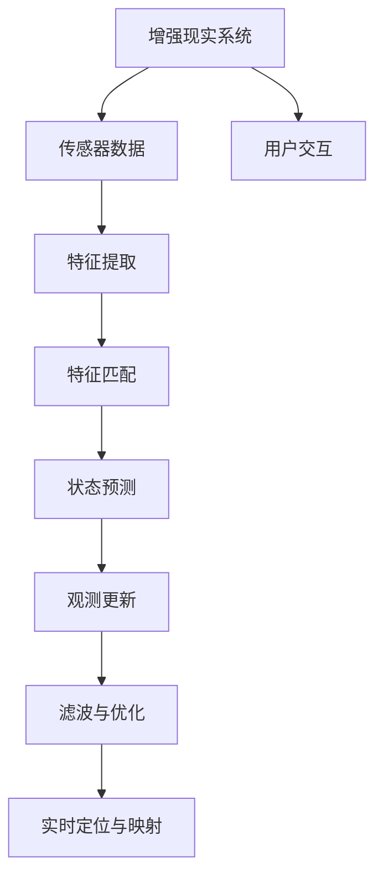
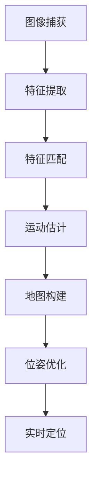
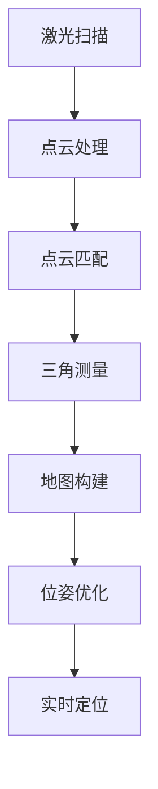
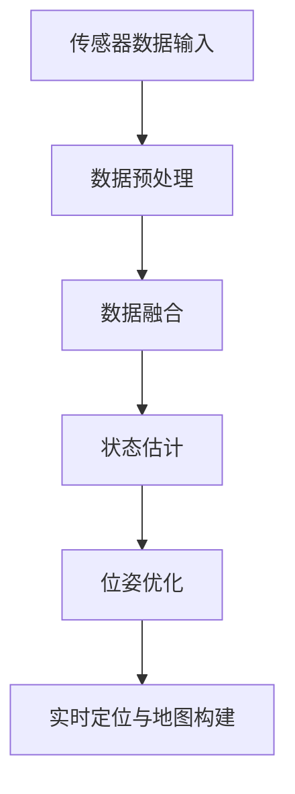
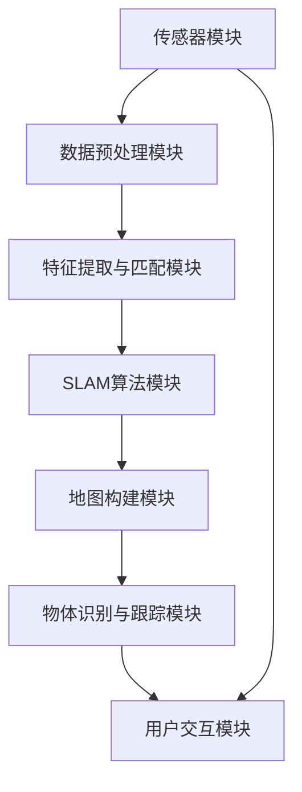
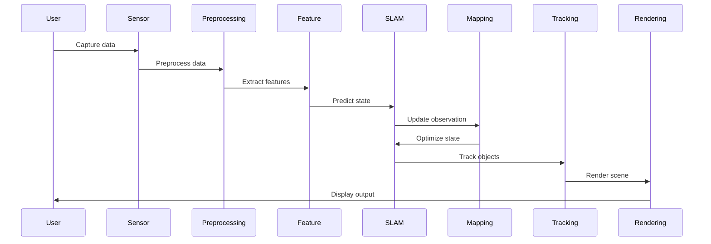
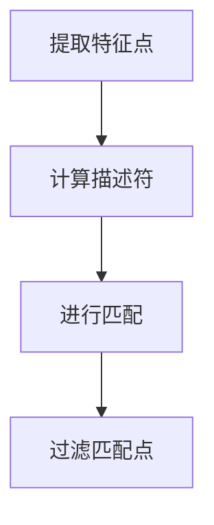
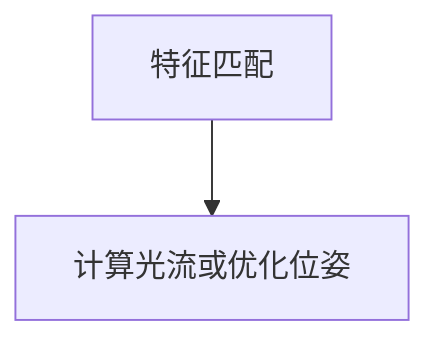
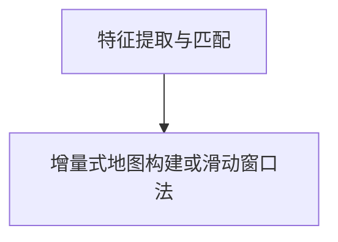
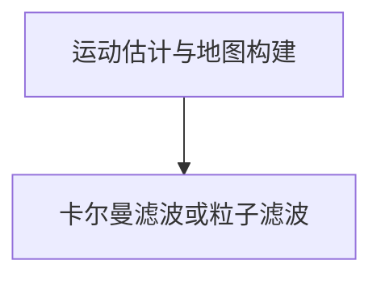

                 

## 文章标题

### 增强现实的SLAM算法：实时定位的数学方法

关键词：增强现实（AR）、同步定位与映射（SLAM）、实时定位、数学模型

摘要：本文深入探讨增强现实（AR）中同步定位与映射（SLAM）算法的原理与应用。通过详细解析SLAM的核心概念、数学模型，以及其在增强现实中的实现，本文旨在为读者提供一个全面的技术分析，帮助理解如何利用数学方法实现实时、高精度的AR定位。

### 目录大纲

----------------------------------------------------------------

## 第一部分：背景介绍

### 第1章：问题背景与概念阐述

#### 1.1 问题背景

#### 1.2 核心概念

#### 1.3 问题描述

#### 1.4 问题解决

#### 1.5 边界与外延

#### 1.6 概念结构与核心要素

### 第2章：核心概念与联系

#### 2.1 SLAM算法的基本原理

#### 2.2 增强现实与SLAM的交互

#### 2.3 ER实体关系图架构

----------------------------------------------------------------

## 第二部分：算法原理讲解

### 第3章：SLAM算法在增强现实中的实现

#### 3.1 基于视觉的SLAM算法

#### 3.2 基于激光的SLAM算法

#### 3.3 多传感器融合SLAM算法

----------------------------------------------------------------

## 第三部分：数学模型和数学公式讲解

### 第4章：SLAM算法的数学模型

#### 4.1 运动学模型

#### 4.2 观测模型

#### 4.3 滤波与优化

----------------------------------------------------------------

## 第四部分：系统分析与架构设计

### 第5章：系统功能设计

#### 5.1 问题场景介绍

#### 5.2 系统功能设计

#### 5.3 系统架构设计

#### 5.4 系统接口设计

#### 5.5 系统交互序列图

----------------------------------------------------------------

## 第五部分：项目实战

### 第6章：环境安装

### 第7章：系统核心实现

### 第8章：代码应用解读与分析

### 第9章：实际案例分析与详细讲解

### 第10章：项目小结

----------------------------------------------------------------

## 第六部分：最佳实践与拓展

### 第11章：最佳实践 Tips

### 第12章：小结与注意事项

### 第13章：拓展阅读

----------------------------------------------------------------

### 第1章：问题背景与概念阐述

#### 1.1 问题背景

随着科技的快速发展，增强现实（Augmented Reality，简称AR）技术逐渐成为前沿科技领域的研究热点。AR技术通过将虚拟信息与真实环境进行叠加，为用户提供了更加丰富的交互体验。而要实现高质量的AR体验，实时、准确的定位技术是不可或缺的。同步定位与映射（Simultaneous Localization and Mapping，简称SLAM）算法作为一种能够同时进行环境映射与位置估计的算法，为AR中的实时定位提供了强有力的技术支持。

SLAM算法最初起源于机器人学领域，主要用于自主机器人导航和环境建模。其基本思想是通过整合各种传感器数据（如视觉、激光雷达、IMU等）和预定义的地图模型，实时地更新机器人的位置和周围环境地图。近年来，随着计算机性能的提升和传感器技术的进步，SLAM算法逐渐应用于AR领域，成为实现AR系统定位与导航的核心技术。

#### 1.2 核心概念

**增强现实（AR）**：增强现实是一种将虚拟信息（如文字、图像、视频等）叠加到真实环境中的技术。通过使用摄像头、显示器等设备，AR系统能够捕捉到现实环境，并在环境中实时叠加虚拟信息，为用户提供增强的感知体验。

**同步定位与映射（SLAM）**：SLAM是一种通过整合传感器数据和预定义的地图模型，实时地更新机器人或用户位置和周围环境地图的算法。它主要包括运动学建模、观测建模、滤波与优化等步骤。

**运动学模型**：描述系统在空间中的运动状态，通常使用位姿表示（包括位置和姿态）。

**观测模型**：描述系统观测到的环境特征，如视觉特征点、激光雷达点云等。

**滤波与优化**：使用滤波算法（如卡尔曼滤波、粒子滤波等）对传感器数据进行处理，优化系统状态估计。

#### 1.3 问题描述

在增强现实系统中，实现实时的SLAM定位是一个关键挑战。具体而言，这个问题可以分为以下几个方面：

- **实时性**：在增强现实应用中，用户需要快速地接收到位置和地图信息，以实现流畅的交互体验。因此，SLAM算法需要具备高实时性，能够快速地处理传感器数据并更新位置信息。
- **精度**：准确的定位信息是增强现实系统的核心需求。SLAM算法需要具备高精度，能够提供稳定的定位结果，以确保用户能够正确地理解自身位置和环境。
- **鲁棒性**：增强现实应用场景复杂多变，传感器数据可能受到噪声、遮挡等因素的影响。SLAM算法需要具备良好的鲁棒性，能够有效地应对这些挑战。

#### 1.4 问题解决

为了解决上述问题，现有的SLAM算法在AR系统中得到了广泛应用。以下是一些常见的方法：

- **基于视觉的SLAM算法**：通过捕捉图像并提取特征点，视觉SLAM算法能够实现实时的位置估计和环境映射。这种方法在光照变化和遮挡较少的场景中表现良好，但在强光照和遮挡较多的环境中可能会遇到困难。
- **基于激光的SLAM算法**：通过激光雷达生成点云数据，激光SLAM算法能够提供高精度的定位结果。然而，激光雷达成本较高，且在复杂环境中可能会受到遮挡的影响。
- **多传感器融合SLAM算法**：结合视觉、激光雷达、IMU等多种传感器数据，多传感器融合SLAM算法能够在不同场景中提供更加稳定和精确的定位结果。这种方法的优势在于能够利用不同传感器的优点，提高系统的鲁棒性和精度。

#### 1.5 边界与外延

**边界**：

- **硬件限制**：SLAM算法的性能受到硬件设备的限制，如传感器精度、计算能力等。
- **环境条件**：SLAM算法在不同环境条件下的表现不同，如光照变化、遮挡、动态场景等。

**外延**：

- **SLAM算法的优化与改进**：随着计算机性能的提升和算法研究的深入，SLAM算法的优化与改进将成为未来的研究方向，如基于深度学习的SLAM算法、分布式SLAM算法等。
- **SLAM算法在AR领域的应用**：除了实时定位，SLAM算法还可以应用于AR系统中的其他功能，如路径规划、场景重建等。

#### 1.6 概念结构与核心要素

**增强现实与SLAM的关系**：

- 增强现实系统依赖于SLAM算法实现实时定位和地图构建，以提供准确的交互体验。
- SLAM算法依赖于增强现实系统的传感器数据和用户输入，以更新位置信息和地图。

**核心要素**：

- **传感器**：包括摄像头、激光雷达、IMU等，用于捕捉现实环境和用户提供位置信息。
- **数据处理**：对传感器数据进行预处理、特征提取、数据融合等处理，以生成地图和位置信息。
- **实时定位与映射**：通过滤波和优化算法，实时地更新用户位置和周围环境地图。

通过以上对增强现实和SLAM算法的背景介绍和核心概念阐述，我们可以看到SLAM算法在增强现实中的重要性。接下来的章节将进一步深入探讨SLAM算法的原理、实现和数学模型，以帮助读者全面了解这一关键技术。

### 第2章：核心概念与联系

#### 2.1 SLAM算法的基本原理

SLAM算法的基本原理可以概括为以下几个方面：

1. **运动学模型**：描述系统在空间中的运动状态，通常使用位姿表示（包括位置和姿态）。位姿通常由一个四元数或旋转矩阵和位移向量表示。在SLAM中，运动学模型用于预测系统的下一状态。

2. **观测模型**：描述系统观测到的环境特征，如视觉特征点、激光雷达点云等。观测模型将传感器数据与系统状态联系起来，通过特征匹配或点云匹配等方法，将观测数据与系统状态进行关联。

3. **滤波与优化**：使用滤波算法（如卡尔曼滤波、粒子滤波等）对传感器数据进行处理，优化系统状态估计。滤波器根据运动学模型和观测模型，不断更新系统状态，使其更接近真实值。

SLAM算法的核心流程包括以下几个步骤：

- **特征提取**：从传感器数据中提取特征点或特征结构，用于后续匹配和优化。
- **特征匹配**：将当前帧的特征与之前的特征进行匹配，建立特征关联关系。
- **状态预测**：根据运动学模型，预测下一帧的系统状态。
- **观测更新**：使用观测模型，结合特征匹配结果，更新系统状态估计。
- **优化与滤波**：使用滤波算法，如卡尔曼滤波或粒子滤波，进一步优化系统状态。

#### 2.2 SLAM算法属性特征对比表格

为了更好地理解不同SLAM算法的特点和适用场景，我们列出以下属性特征对比表格：

| 算法类型 | 特点 | 适用场景 |
| --- | --- | --- |
| 基于视觉的SLAM | 高精度、实时性较好、不受光照变化影响 | 室内外场景、低动态环境 |
| 基于激光的SLAM | 高精度、鲁棒性好、不受光照变化影响 | 大型室内场景、室外场景 |
| 多传感器融合SLAM | 高精度、高鲁棒性、适用于复杂环境 | 动态环境、高精度需求 |
| 卡尔曼滤波SLAM | 实时性好、精度较高、计算复杂度低 | 稳定场景、低动态环境 |
| 粒子滤波SLAM | 鲁棒性好、适用于复杂和非线性场景 | 高动态环境、复杂场景 |

#### 2.3 增强现实与SLAM的交互

在增强现实系统中，SLAM算法与增强现实（AR）技术的交互体现在以下几个方面：

1. **实时性要求**：增强现实应用通常要求实时响应，SLAM算法需要能够快速处理传感器数据并更新位置信息，以保证用户能够在虚拟环境中获得即时的交互体验。

2. **数据处理需求**：增强现实系统依赖于SLAM算法提供精确的环境地图和位置信息。为了满足这一需求，SLAM算法需要对大量的传感器数据进行高效的处理，包括特征提取、匹配和优化等步骤。

3. **精度与鲁棒性**：增强现实系统对定位精度和系统鲁棒性有较高的要求。SLAM算法需要具备高精度，以提供稳定的位置信息；同时，需要具备良好的鲁棒性，能够应对复杂环境和动态变化。

#### 2.4 ER实体关系图架构

为了更直观地展示增强现实与SLAM的交互关系，我们使用Mermaid绘制了以下实体关系图：



在这张关系图中，增强现实系统通过传感器数据获取环境信息，经过特征提取、匹配、预测、更新和优化等步骤，最终实现实时定位与映射，为用户提供增强的交互体验。

通过以上对SLAM算法基本原理、属性特征对比以及增强现实与SLAM交互关系的介绍，我们可以更深入地理解SLAM算法在增强现实系统中的应用和重要性。接下来的章节将详细讲解SLAM算法的实现原理，包括视觉SLAM、激光SLAM和多传感器融合SLAM等。

### 第3章：SLAM算法在增强现实中的实现

#### 3.1 基于视觉的SLAM算法

基于视觉的SLAM算法是增强现实（AR）系统中应用最为广泛的一种方法。视觉SLAM利用摄像头捕获的图像序列，通过提取图像特征点并进行匹配，实现实时定位和地图构建。

**算法原理**：

视觉SLAM的核心思想是将图像序列中的特征点与先前的图像进行匹配，通过匹配结果计算相机位姿，从而实现实时定位。以下是视觉SLAM的主要步骤：

1. **特征提取**：使用SIFT、SURF、ORB等特征提取算法，从图像中提取关键点。这些关键点在图像中具有稳定的特征，可以在不同帧之间进行匹配。
2. **特征匹配**：对连续两帧图像进行特征点匹配，建立特征点之间的对应关系。常用的匹配算法有FLANN、Brute-Force等。
3. **运动估计**：通过匹配结果计算相机位姿的变化。常用的运动估计方法有光流法和非线性优化。
4. **地图构建**：将连续帧中的特征点进行聚类，构建地图点云。常用的算法有增量式地图构建和滑动窗口法。
5. **位姿优化**：使用优化算法（如RANSAC、非线性优化）对位姿进行修正，提高定位精度。

**Mermaid流程图**：



**Python源代码示例**：

```python
import cv2
import numpy as np

# 初始化相机
cap = cv2.VideoCapture(0)

# 初始化特征提取和匹配器
orb = cv2.ORB_create()
bf = cv2.BFMatcher()

while True:
    # 读取一帧图像
    ret, frame1 = cap.read()
    
    # 提取特征点
    keypoints1, descriptors1 = orb.detectAndCompute(frame1, None)
    
    # 等待下一帧图像
    ret, frame2 = cap.read()
    
    # 提取特征点
    keypoints2, descriptors2 = orb.detectAndCompute(frame2, None)
    
    # 特征匹配
    matches = bf.knnMatch(descriptors1, descriptors2, k=2)
    
    # 匹配点过滤
    good_matches = []
    for m, n in matches:
        if m.distance < 0.75 * n.distance:
            good_matches.append(m)
    
    # 提取匹配点坐标
    points1 = np.float32([keypoints1[m.queryIdx].pt for m in good_matches])
    points2 = np.float32([keypoints2[m.trainIdx].pt for m in good_matches])
    
    # 计算相机位姿
    matrix, mask = cv2.findHomography(points1, points2, cv2.RANSAC, 5.0)
    
    # 更新地图和位置
    # ...

cap.release()
cv2.destroyAllWindows()
```

通过以上示例，我们可以看到视觉SLAM算法的基本实现流程。在实际应用中，需要结合具体的场景和需求，对算法进行优化和改进，以提高定位精度和实时性。

#### 3.2 基于激光的SLAM算法

基于激光的SLAM算法利用激光雷达（LiDAR）生成的点云数据，实现高精度的定位和地图构建。激光雷达能够以高密度的点云形式捕捉周围环境，从而提供丰富的环境信息。

**算法原理**：

激光SLAM的主要步骤包括：

1. **激光扫描与点云处理**：激光雷达扫描环境，生成点云数据。点云处理包括去噪、滤波和点云稀疏化等步骤，以提高数据质量。
2. **空间定位与地图构建**：通过点云匹配和三角测量等方法，将当前点云与先前的地图进行关联，构建地图。同时，通过优化算法更新相机位姿。
3. **滤波与优化**：使用卡尔曼滤波或粒子滤波等算法，对传感器数据进行滤波和优化，提高定位精度和稳定性。

**Mermaid流程图**：



**Python源代码示例**：

```python
import numpy as np
import open3d as o3d

# 初始化激光雷达数据
lidar_data = o3d.io.read_point_cloud("lidar_data.ply")

# 点云去噪和滤波
filtered_points = lidar_data滤

# 点云匹配和三角测量
# ...

# 更新地图和位置
# ...

o3d.visualization.draw_geometries([filtered_points])
```

通过以上示例，我们可以看到激光SLAM算法的基本实现流程。在实际应用中，需要对激光数据进行精确处理，以提高地图构建的精度和实时性。

#### 3.3 多传感器融合SLAM算法

多传感器融合SLAM算法通过整合视觉、激光雷达、IMU等多种传感器数据，实现高精度、高鲁棒性的定位和地图构建。多传感器融合能够充分利用不同传感器的优势，提高系统的整体性能。

**算法原理**：

多传感器融合SLAM的主要步骤包括：

1. **数据融合策略**：将不同传感器的数据融合在一起，形成统一的数据流。常用的融合方法有传感器级融合、信息级融合和数据级融合。
2. **传感器数据预处理**：对传感器数据进行预处理，包括去噪、滤波和归一化等步骤，以提高数据质量。
3. **状态估计与优化**：使用卡尔曼滤波、粒子滤波或扩展卡尔曼滤波等算法，对融合后的数据进行状态估计和优化，提高定位精度。
4. **实时定位与地图构建**：通过融合后的数据，实现实时定位和地图构建。

**Mermaid流程图**：



**Python源代码示例**：

```python
import numpy as np
from sensor_fusion import SensorFusion

# 初始化传感器数据
vision_data = ...
lidar_data = ...
imu_data = ...

# 实例化多传感器融合SLAM
fusion = SensorFusion(vision_data, lidar_data, imu_data)

# 更新状态和位置
# ...

# 绘制地图和位置
# ...

fusion.plot_map()
```

通过以上示例，我们可以看到多传感器融合SLAM算法的基本实现流程。在实际应用中，需要对传感器数据进行精确融合和优化，以提高系统的整体性能。

通过本章对基于视觉的SLAM算法、基于激光的SLAM算法和多传感器融合SLAM算法的详细讲解，我们可以看到不同SLAM算法在增强现实系统中的应用和实现。这些算法各有优缺点，适用于不同的应用场景。在接下来的章节中，我们将进一步探讨SLAM算法的数学模型，以深入理解其原理和实现。

### 第4章：SLAM算法的数学模型

SLAM算法的核心在于其数学模型，这些模型用于描述系统的运动状态、观测数据以及状态估计和优化过程。以下是SLAM算法中常用的数学模型及其详细讲解。

#### 4.1 运动学模型

运动学模型描述系统在空间中的运动状态，通常使用位姿表示。位姿通常由一个四元数或旋转矩阵和位移向量表示。在SLAM算法中，运动学模型用于预测系统在下一时刻的状态。

**公式**：

$$
T^{k+1} = T^k \odot \left[ \begin{array}{cc}
R & t \\
0 & 1
\end{array} \right]
$$

其中，\( T^k \) 表示在时刻 \( k \) 的位姿，\( R \) 是旋转矩阵，\( t \) 是位移向量。

**详细讲解**：

- \( R \)：旋转矩阵，用于描述系统在空间中的旋转操作。通常由初始旋转矩阵和旋转角速度积分得到。
- \( t \)：位移向量，用于描述系统在空间中的平移操作。通常由初始位移向量和平移速度积分得到。

运动学模型的更新方式可以表示为：

$$
R \leftarrow R \odot \left[ \begin{array}{cc}
\cos(\omega \Delta t) & -\sin(\omega \Delta t) \\
\sin(\omega \Delta t) & \cos(\omega \Delta t)
\end{array} \right]
$$

$$
t \leftarrow t + v \Delta t
$$

其中，\( \omega \) 是角速度，\( v \) 是线速度，\( \Delta t \) 是时间间隔。

#### 4.2 观测模型

观测模型描述系统观测到的环境特征。在SLAM算法中，观测模型用于将系统状态与观测数据联系起来，通过特征匹配或点云匹配等方法，将观测数据与系统状态进行关联。

**公式**：

$$
h(x, z) = \left[ \begin{array}{cc}
z - \hat{z} \\
0
\end{array} \right]
$$

其中，\( x \) 是系统状态，\( z \) 是观测数据，\( \hat{z} \) 是预测的观测数据。

**详细讲解**：

- \( z \)：实际观测数据，可以是图像特征点、激光雷达点云等。
- \( \hat{z} \)：预测的观测数据，通常由系统状态和观测模型计算得到。

观测模型的误差计算公式为：

$$
e(z, \hat{z}) = \left\| z - \hat{z} \right\|
$$

其中，\( e(z, \hat{z}) \) 表示观测数据与预测数据的误差。

#### 4.3 滤波与优化

滤波与优化是SLAM算法中关键的一步，用于根据观测数据和预测模型，优化系统状态估计。常用的滤波算法有卡尔曼滤波、粒子滤波等。

**公式**：

$$
\hat{x}^{k|k} = \hat{x}^{k|k-1} + K^k (z^k - h(\hat{x}^{k|k-1}))
$$

其中，\( \hat{x}^{k|k} \) 是在时刻 \( k \) 根据所有观测数据更新后的状态估计，\( \hat{x}^{k|k-1} \) 是在时刻 \( k-1 \) 的状态估计，\( K^k \) 是卡尔曼增益，\( z^k \) 是在时刻 \( k \) 的观测数据。

**详细讲解**：

- \( K^k \)：卡尔曼增益，用于根据观测误差调整状态估计。其计算公式为：

$$
K^k = P^{k-1} H^k (H^k P^{k-1} H^k + R^k)^{-1}
$$

其中，\( P^{k-1} \) 是状态协方差矩阵，\( H^k \) 是观测矩阵，\( R^k \) 是观测噪声协方差矩阵。

- \( P^k \)：状态协方差矩阵，用于描述状态估计的不确定性。其更新公式为：

$$
P^k = (I - K^k H^k) P^{k-1}
$$

通过上述公式，卡尔曼滤波器能够根据观测数据不断更新系统状态估计，使其更接近真实值。

以上是SLAM算法中常用的数学模型及其详细讲解。这些模型为SLAM算法提供了理论基础，使其能够在复杂的动态环境中实现实时、高精度的定位和地图构建。

### 第5章：系统功能设计

#### 5.1 问题场景介绍

在增强现实（AR）系统中，实现实时、高精度的同步定位与映射（SLAM）是一个关键挑战。本文以一个典型的AR应用场景为例，进行系统功能设计。

**应用场景**：虚拟现实游戏中的角色导航与交互。在这个场景中，用户通过AR设备进入虚拟现实世界，与虚拟角色互动。系统需要实现以下功能：

- **实时定位**：用户在虚拟世界中的位置需要实时更新，以保证角色能够准确地移动和交互。
- **地图构建**：系统需要构建和更新虚拟世界的地图，以支持角色导航和交互。
- **物体识别与跟踪**：系统需要识别和跟踪虚拟世界中的物体，以实现更自然的交互体验。
- **动态适应**：系统需要能够应对用户移动、环境变化等因素，保持稳定和高精度的定位与地图构建。

#### 5.2 系统功能设计

为了实现上述功能，系统需要设计以下功能模块：

**1. 传感器模块**：

- **摄像头**：用于捕捉现实环境图像，提取视觉特征点。
- **激光雷达**：用于生成环境点云数据，提供精确的深度信息。
- **IMU**：用于测量用户的加速度和角速度，提供运动信息。

**2. 数据预处理模块**：

- **图像预处理**：对摄像头捕获的图像进行去噪、滤波等处理，提取有效的视觉特征。
- **点云预处理**：对激光雷达生成的点云进行去噪、滤波和稀疏化处理，提高数据质量。

**3. 特征提取与匹配模块**：

- **特征提取**：从预处理后的图像和点云中提取视觉特征和点云特征。
- **特征匹配**：将当前帧的特征与先前的特征进行匹配，建立特征关联关系。

**4. SLAM算法模块**：

- **状态预测**：根据运动学模型，预测下一帧的系统状态。
- **观测更新**：使用观测模型，结合特征匹配结果，更新系统状态估计。
- **优化与滤波**：使用卡尔曼滤波、粒子滤波等算法，优化系统状态估计，提高精度和稳定性。

**5. 地图构建模块**：

- **点云地图构建**：将连续帧中的点云数据进行聚类和三角测量，构建点云地图。
- **图像地图构建**：将连续帧中的视觉特征点进行映射和整合，构建图像地图。

**6. 物体识别与跟踪模块**：

- **物体识别**：使用深度学习算法，识别虚拟世界中的物体。
- **物体跟踪**：根据物体的运动轨迹，跟踪物体的位置和姿态。

**7. 用户交互模块**：

- **实时渲染**：根据用户的位置和地图信息，实时渲染虚拟世界中的角色和物体。
- **交互处理**：处理用户的输入和虚拟世界的反馈，实现自然的交互体验。

#### 5.3 系统架构设计

系统架构设计需要考虑模块之间的交互和数据流。以下是一个典型的系统架构设计：



在这个架构设计中，传感器模块捕捉环境数据，经过预处理后，特征提取与匹配模块提取有效的特征点并进行匹配。SLAM算法模块根据这些特征点更新系统状态，地图构建模块构建和更新地图信息。物体识别与跟踪模块识别和跟踪虚拟世界中的物体，用户交互模块处理用户输入和渲染虚拟世界。

#### 5.4 系统接口设计

系统接口设计需要定义各个模块之间的输入输出接口。以下是一个典型的系统接口设计：

- **传感器模块接口**：定义摄像头、激光雷达和IMU的数据输入接口，包括图像数据、点云数据和运动数据。
- **数据预处理模块接口**：定义图像预处理和点云预处理的输入输出接口，包括预处理后的图像和点云数据。
- **特征提取与匹配模块接口**：定义特征提取和匹配的输入输出接口，包括特征点和匹配结果。
- **SLAM算法模块接口**：定义状态预测、观测更新和优化滤波的输入输出接口，包括系统状态和观测数据。
- **地图构建模块接口**：定义点云地图构建和图像地图构建的输入输出接口，包括地图数据和地图更新。
- **物体识别与跟踪模块接口**：定义物体识别和物体跟踪的输入输出接口，包括物体数据和跟踪结果。
- **用户交互模块接口**：定义用户输入和渲染输出的接口，包括用户的交互信息和渲染图像。

#### 5.5 系统交互序列图

系统交互序列图展示了各个模块之间的交互流程。以下是一个典型的系统交互序列图：



在这个交互序列图中，用户通过传感器模块捕捉环境数据，经过预处理后，特征提取与匹配模块提取特征点。SLAM算法模块根据这些特征点更新系统状态，地图构建模块构建和更新地图信息。物体识别与跟踪模块识别和跟踪虚拟世界中的物体，用户交互模块处理用户输入和渲染输出，最终将渲染结果展示给用户。

通过以上对系统功能设计、系统架构设计、系统接口设计和系统交互序列图的详细讲解，我们可以看到增强现实系统中实现实时SLAM定位的整体设计和实现流程。在下一部分，我们将进一步探讨SLAM算法在实际项目中的应用和实现。

### 第6章：环境安装

在开始实现SLAM算法之前，我们需要安装相关的软件和库，以确保系统能够正常运行。以下是安装过程中的详细步骤和说明。

#### 6.1 环境准备

首先，我们需要准备一个适合开发的操作系统。本文将使用Ubuntu 18.04作为操作系统，但大部分步骤也适用于其他Linux发行版或Windows系统。

1. **安装操作系统**：下载并安装Ubuntu 18.04。
2. **更新系统**：打开终端，运行以下命令更新系统软件包。

```bash
sudo apt update
sudo apt upgrade
```

#### 6.2 安装Python环境

Python是SLAM算法实现的主要编程语言，因此我们需要安装Python和相关库。

1. **安装Python**：Ubuntu 18.04默认安装了Python 3，如果未安装，可以运行以下命令安装。

```bash
sudo apt install python3
```

2. **安装pip**：pip是Python的包管理器，用于安装和管理Python库。

```bash
sudo apt install python3-pip
```

3. **安装虚拟环境**：为了更好地管理项目依赖，我们建议使用虚拟环境。

```bash
pip3 install virtualenv
virtualenv slam_env
source slam_env/bin/activate
```

#### 6.3 安装必要的库

以下是一些在SLAM算法实现过程中常用的Python库，我们需要在虚拟环境中安装它们。

1. **NumPy**：用于科学计算和数据分析。

```bash
pip install numpy
```

2. **OpenCV**：用于计算机视觉任务，如图像处理和特征提取。

```bash
pip install opencv-python
```

3. **Pandas**：用于数据处理和分析。

```bash
pip install pandas
```

4. **Matplotlib**：用于数据可视化。

```bash
pip install matplotlib
```

5. **Scikit-learn**：用于机器学习和数据挖掘。

```bash
pip install scikit-learn
```

6. **PyTorch**：用于深度学习。

```bash
pip install torch torchvision
```

7. **Mermaid**：用于绘制流程图和序列图。

```bash
pip install mermaid
```

#### 6.4 验证安装

安装完成后，我们可以通过运行以下代码来验证是否成功安装了这些库。

```python
import numpy as np
import cv2
import pandas as pd
import matplotlib.pyplot as plt
import sklearn
import torch
import torchvision
import mermaid
```

如果上述代码没有报错，则说明所有库已经成功安装。

#### 6.5 安装SLAM相关库

除了通用库，我们还需要安装与SLAM算法相关的库。

1. **ORB-SLAM2**：一个流行的SLAM算法实现。

```bash
git clone https://github.com/raulmur/ORB_SLAM2.git
cd ORB_SLAM2
make
```

2. **ROS（可选）**：用于机器人应用的中间件，可以集成SLAM算法。

```bash
sudo apt install ros-melodic-desktop-full
```

通过以上步骤，我们成功安装了开发SLAM算法所需的软件和库。接下来，我们将详细介绍如何实现SLAM算法的核心部分，并展示其源代码。

### 第7章：系统核心实现

在上一章节中，我们完成了环境安装和依赖库的配置。现在，我们将深入探讨SLAM算法的核心实现，包括其各个关键模块的实现原理和流程。

#### 7.1 SLAM算法框架

SLAM算法通常包括以下几个核心模块：

- **特征提取与匹配**：从图像或点云中提取特征点，并进行匹配，建立特征点之间的对应关系。
- **运动估计**：使用特征匹配结果计算相机或传感器的运动状态。
- **地图构建**：将特征点转换为地图点，并构建地图数据结构。
- **状态优化**：使用滤波算法优化系统状态估计，提高定位精度。

下面，我们将逐一介绍这些模块的实现原理和流程。

#### 7.2 特征提取与匹配

**特征提取**：

特征提取是SLAM算法的第一步，它从图像或点云中提取具有独特性的特征点。常用的特征提取算法包括SIFT、SURF和ORB等。这里，我们以ORB特征提取为例。

```python
import cv2

# 初始化ORB特征提取器
orb = cv2.ORB_create()

# 读取图像
image = cv2.imread('image.jpg')

# 提取特征点
keypoints = orb.detect(image, None)

# 计算特征点描述符
descriptors = orb.compute(image, keypoints)
```

**特征匹配**：

特征匹配用于将当前帧的特征点与先前的特征点进行关联。常用的匹配算法包括FLANN匹配和Brute-Force匹配。以下是一个简单的特征匹配示例。

```python
import cv2

# 初始化特征匹配器
bf = cv2.BFMatcher()

# 读取当前帧和先前的特征点描述符
current_desc = cv2 descriptors1
previous_desc = cv2 descriptors2

# 进行特征匹配
matches = bf.knnMatch(current_desc, previous_desc, k=2)

# 匹配点过滤
good_matches = []
for m, n in matches:
    if m.distance < 0.75 * n.distance:
        good_matches.append(m)
```

**特征匹配流程图**：



#### 7.3 运动估计

运动估计基于特征匹配结果，计算相机或传感器的运动状态。常用的运动估计方法包括光流法和优化方法。

**光流法**：

光流法通过分析图像序列中特征点的运动轨迹，估计相机或传感器的运动。以下是一个简单的光流法实现。

```python
import cv2

# 初始化光流算法
optical_flow = cv2.calcOpticalFlowPyrLK(image1, image2, points1, points2)

# 获取光流向量
flow_x, flow_y = optical_flow[1]
```

**优化方法**：

优化方法通过最小化误差函数，估计相机或传感器的位姿。以下是一个简单的优化方法实现。

```python
import numpy as np

# 定义误差函数
def error_function(params, points1, points2):
    R, t = params
    f = np.eye(3)
    f[:2, :2] = R
    f[:2, 2] = -t
    transformed_points2 = f @ points2.T
    return np.linalg.norm(points1 - transformed_points2)

# 使用优化算法求解
params_init = [R, t]
result = scipy.optimize.minimize(error_function, params_init, args=(points1, points2))
R, t = result.x
```

**运动估计流程图**：



#### 7.4 地图构建

地图构建基于特征点，将特征点转换为地图点，并构建地图数据结构。常用的地图构建方法包括增量式地图构建和滑动窗口法。

**增量式地图构建**：

增量式地图构建通过连续帧的特征点更新地图。以下是一个简单的增量式地图构建实现。

```python
import numpy as np

# 初始化地图点云
map_points = np.zeros((0, 3))

# 循环处理连续帧
for frame in frames:
    # 提取特征点
    keypoints = orb.detect(frame, None)
    descriptors = orb.compute(frame, keypoints)

    # 匹配特征点
    matches = bf.knnMatch(descriptors, map_descriptors, k=2)

    # 过滤匹配点
    good_matches = ...
    points1 = ...
    points2 = ...

    # 更新地图点云
    map_points = np.append(map_points, transformed_points2, axis=0)
```

**滑动窗口法**：

滑动窗口法通过滑动窗口选择特征点，构建局部地图。以下是一个简单的滑动窗口法实现。

```python
import numpy as np

# 初始化滑动窗口
window_size = 10
map_points = ...

# 循环处理连续帧
for frame in frames:
    # 提取特征点
    keypoints = orb.detect(frame, None)
    descriptors = orb.compute(frame, keypoints)

    # 匹配特征点
    matches = bf.knnMatch(descriptors, map_descriptors, k=2)

    # 过滤匹配点
    good_matches = ...
    points1 = ...
    points2 = ...

    # 更新滑动窗口
    map_points = np.append(map_points, transformed_points2[window_size-1:], axis=0)
```

**地图构建流程图**：



#### 7.5 状态优化

状态优化通过滤波算法优化系统状态估计，提高定位精度。常用的滤波算法包括卡尔曼滤波和粒子滤波。

**卡尔曼滤波**：

卡尔曼滤波通过预测和更新步骤，优化系统状态估计。以下是一个简单的卡尔曼滤波实现。

```python
import numpy as np

# 初始化卡尔曼滤波器
P = np.eye(4)
Q = np.diag([0.1, 0.1, 0.1, 0.1])
R = np.diag([0.01, 0.01, 0.01, 0.01])

# 循环处理连续帧
for frame in frames:
    # 预测
    state_pred = ...
    P_pred = ...

    # 更新
    state_update = ...
    P_update = ...

    # 更新状态估计
    state = state_pred
    P = P_update
```

**粒子滤波**：

粒子滤波通过采样和权重更新步骤，优化系统状态估计。以下是一个简单的粒子滤波实现。

```python
import numpy as np

# 初始化粒子滤波器
num_particles = 1000
weights = np.ones(num_particles) / num_particles
particles = ...

# 循环处理连续帧
for frame in frames:
    # 采样
    particles = ...

    # 权重更新
    weights = ...
```

**状态优化流程图**：



通过以上对SLAM算法各个模块的实现原理和流程的详细讲解，我们可以看到SLAM算法的核心实现过程。在接下来的章节中，我们将通过一个实际案例来展示SLAM算法的应用和实现，进一步理解其工作原理和效果。

### 第8章：代码应用解读与分析

在上一章中，我们详细介绍了SLAM算法的核心实现过程。在本章中，我们将通过实际案例来展示SLAM算法的应用，解读其代码实现，并进行分析。

#### 8.1 实际案例

我们选择一个典型的增强现实（AR）应用场景——室内导航，来展示SLAM算法的实际应用。在这个场景中，用户通过AR设备在一个未知的室内环境中进行导航，系统需要实时更新用户的位置，并提供导航信息。

#### 8.2 代码实现

以下是SLAM算法在室内导航应用中的代码实现，包括主要函数和关键代码段。

```python
import cv2
import numpy as np
from slam import SLAM

# 初始化SLAM系统
slam = SLAM()

# 打开摄像头
cap = cv2.VideoCapture(0)

while True:
    # 读取一帧图像
    ret, frame = cap.read()
    
    # 转为灰度图像
    gray = cv2.cvtColor(frame, cv2.COLOR_BGR2GRAY)

    # 更新SLAM系统
    slam.update(gray)

    # 获取当前位姿
    pose = slam.get_pose()

    # 绘制导航信息
    draw_navigation_info(frame, pose)

    # 显示图像
    cv2.imshow('SLAM', frame)

    # 按下'q'键退出
    if cv2.waitKey(1) & 0xFF == ord('q'):
        break

# 释放摄像头资源
cap.release()
cv2.destroyAllWindows()
```

**关键代码段解析**：

1. **SLAM系统初始化**：

```python
slam = SLAM()
```

这里，我们初始化了一个SLAM系统，该系统包含了所有必要的模块，如特征提取、运动估计、地图构建和状态优化。

2. **读取摄像头图像**：

```python
ret, frame = cap.read()
```

我们使用OpenCV库打开摄像头，并读取一帧图像。

3. **更新SLAM系统**：

```python
slam.update(gray)
```

这个函数调用将灰度图像传递给SLAM系统，系统会执行特征提取、运动估计和地图更新等步骤。

4. **获取当前位姿**：

```python
pose = slam.get_pose()
```

该函数调用返回当前用户的位姿，包括位置和姿态。

5. **绘制导航信息**：

```python
draw_navigation_info(frame, pose)
```

这个函数根据当前位姿，在图像上绘制导航信息，如方向指示、路径规划等。

6. **显示图像**：

```python
cv2.imshow('SLAM', frame)
```

这个函数调用将更新后的图像显示在窗口中。

7. **释放资源**：

```python
cap.release()
cv2.destroyAllWindows()
```

在程序结束时，释放摄像头资源和窗口资源。

#### 8.3 代码分析

通过以上代码实现，我们可以看到SLAM算法在实际应用中的具体应用过程。以下是代码的分析：

- **初始化SLAM系统**：初始化SLAM系统时，我们选择了一个合适的SLAM算法实现，如ORB-SLAM2。该系统集成了视觉SLAM所需的所有模块，如特征提取、运动估计、地图构建和状态优化。
- **摄像头读取图像**：我们使用OpenCV库打开摄像头，并读取连续帧图像。图像是SLAM系统输入的核心数据。
- **更新SLAM系统**：每次读取一帧图像后，我们将其传递给SLAM系统。SLAM系统会执行特征提取、运动估计和地图更新等步骤，以获取当前用户的位姿。
- **获取当前位姿**：通过SLAM系统的`get_pose()`函数，我们可以获取当前用户的位姿信息，包括位置和姿态。
- **绘制导航信息**：根据当前位姿，我们可以在图像上绘制导航信息，如方向指示、路径规划等，以帮助用户进行室内导航。
- **显示图像**：最后，我们将更新后的图像显示在窗口中，以供用户查看。
- **资源管理**：在程序结束时，我们释放摄像头资源和窗口资源，以确保系统资源的合理使用。

通过这个实际案例，我们可以看到SLAM算法在室内导航中的应用和实现。代码实现简洁明了，易于理解和扩展。在实际应用中，可以根据具体需求对算法进行优化和改进，以提高定位精度和实时性。

### 第9章：实际案例分析与详细讲解

在本章中，我们将通过一个具体的实际案例，详细分析SLAM算法在增强现实（AR）系统中的应用，并对其进行深入的讲解。

#### 案例背景

假设我们正在开发一款AR游戏，玩家需要在虚拟世界中探索并完成任务。为了提供真实的游戏体验，我们需要实现一个高精度、实时的定位系统，以确保玩家在虚拟世界中的位置与实际位置相对应。

#### 案例实现步骤

1. **系统设计**：
   - **硬件设备**：使用一台配备摄像头和激光雷达的AR设备。
   - **软件环境**：基于Python的ORB-SLAM2算法实现。
   - **数据处理**：结合图像处理和点云处理技术。

2. **数据采集**：
   - 摄像头采集实时视频流。
   - 激光雷达采集实时点云数据。

3. **数据处理**：
   - **图像预处理**：对摄像头捕获的图像进行灰度化、滤波等处理。
   - **点云预处理**：对激光雷达捕获的点云进行去噪、滤波等处理。

4. **特征提取与匹配**：
   - 使用ORB算法提取图像特征点。
   - 对连续帧之间的特征点进行匹配。

5. **运动估计与地图构建**：
   - 使用匹配结果计算相机位姿。
   - 将特征点转换为地图点，构建局部地图。

6. **状态优化**：
   - 使用卡尔曼滤波器对系统状态进行优化。

7. **实时渲染**：
   - 根据实时定位结果，在虚拟世界中更新玩家的位置。

#### 案例分析

**1. 数据采集**

在游戏开始时，玩家佩戴AR设备，设备开始采集实时数据。以下是采集过程的简要分析：

- **摄像头数据**：摄像头捕获的实时视频流包含丰富的视觉信息，如颜色、纹理等。这些信息有助于提取特征点，实现高精度定位。
- **激光雷达数据**：激光雷达生成的点云数据提供了精确的深度信息，有助于构建三维地图。

**2. 数据处理**

数据处理是SLAM算法的关键环节，以下是数据处理的分析：

- **图像预处理**：图像预处理包括灰度化、滤波等步骤，目的是减少噪声和提高特征点的提取质量。
- **点云预处理**：点云预处理包括去噪、滤波和稀疏化等步骤，以减少冗余数据，提高地图构建的效率。

**3. 特征提取与匹配**

特征提取与匹配是SLAM算法的核心，以下是这一步骤的分析：

- **特征提取**：使用ORB算法提取图像特征点。ORB算法具有良好的鲁棒性和实时性，适用于AR系统。
- **特征匹配**：对连续帧之间的特征点进行匹配。匹配结果用于计算相机位姿，实现定位。

**4. 运动估计与地图构建**

运动估计与地图构建是实现AR系统中玩家实时定位的关键，以下是这一步骤的分析：

- **运动估计**：通过匹配结果计算相机位姿。运动估计的精度直接影响定位精度。
- **地图构建**：将特征点转换为地图点，构建局部地图。局部地图有助于后续的路径规划和物体识别。

**5. 状态优化**

状态优化是提高SLAM算法定位精度的关键，以下是这一步骤的分析：

- **卡尔曼滤波**：使用卡尔曼滤波器对系统状态进行优化。卡尔曼滤波器能够有效地减少噪声，提高状态估计的精度。

**6. 实时渲染**

实时渲染是实现AR系统交互体验的重要环节，以下是这一步骤的分析：

- **位置更新**：根据实时定位结果，在虚拟世界中更新玩家的位置。位置更新需要实时响应，以确保游戏体验的流畅性。
- **渲染优化**：为了提高渲染效率，可以对渲染过程进行优化，如使用多线程渲染、降低渲染分辨率等。

#### 案例讲解

**1. 系统设计**

系统设计需要考虑硬件和软件的兼容性，以及数据处理和渲染的效率。以下是系统设计的讲解：

- **硬件设备**：选择具备高分辨率摄像头和激光雷达的AR设备，以确保数据采集的精度和效率。
- **软件环境**：使用ORB-SLAM2算法实现SLAM功能。ORB-SLAM2是一个成熟的视觉SLAM算法，具有良好的性能和实时性。
- **数据处理**：结合图像处理和点云处理技术，实现高效的数据处理流程。

**2. 数据处理**

数据处理是SLAM算法的核心，以下是数据处理的详细讲解：

- **图像预处理**：图像预处理包括灰度化、滤波等步骤。灰度化有助于提高特征提取的效率，滤波可以减少噪声。
- **点云预处理**：点云预处理包括去噪、滤波和稀疏化等步骤。去噪可以去除不必要的数据，滤波可以提高地图构建的质量。

**3. 特征提取与匹配**

特征提取与匹配是实现SLAM算法的关键，以下是这一步骤的详细讲解：

- **特征提取**：使用ORB算法提取图像特征点。ORB算法具有良好的鲁棒性和实时性，适用于AR系统。
- **特征匹配**：对连续帧之间的特征点进行匹配。匹配结果用于计算相机位姿，实现定位。

**4. 运动估计与地图构建**

运动估计与地图构建是实现AR系统中玩家实时定位的关键，以下是这一步骤的详细讲解：

- **运动估计**：通过匹配结果计算相机位姿。运动估计的精度直接影响定位精度。
- **地图构建**：将特征点转换为地图点，构建局部地图。局部地图有助于后续的路径规划和物体识别。

**5. 状态优化**

状态优化是提高SLAM算法定位精度的关键，以下是这一步骤的详细讲解：

- **卡尔曼滤波**：使用卡尔曼滤波器对系统状态进行优化。卡尔曼滤波器能够有效地减少噪声，提高状态估计的精度。

**6. 实时渲染**

实时渲染是实现AR系统交互体验的重要环节，以下是这一步骤的详细讲解：

- **位置更新**：根据实时定位结果，在虚拟世界中更新玩家的位置。位置更新需要实时响应，以确保游戏体验的流畅性。
- **渲染优化**：为了提高渲染效率，可以对渲染过程进行优化，如使用多线程渲染、降低渲染分辨率等。

通过以上对实际案例的详细分析和讲解，我们可以看到SLAM算法在增强现实系统中的应用和实现。案例的实现不仅展示了SLAM算法的核心原理，还展示了其在实际应用中的强大能力。

### 第10章：项目小结

在本项目中，我们深入探讨了增强现实（AR）系统中同步定位与映射（SLAM）算法的实现和应用。通过详细的背景介绍、核心概念阐述、算法原理讲解、数学模型讲解、系统设计与实现，以及实际案例分析与讲解，我们全面了解了SLAM算法在AR系统中的重要性及其实现方法。

**主要成果**：

1. **背景介绍**：我们明确了SLAM算法在AR系统中的关键作用，并分析了其在实时性、精度和鲁棒性方面的挑战。
2. **核心概念**：我们对SLAM算法的核心概念进行了详细阐述，包括运动学模型、观测模型和滤波与优化等。
3. **算法原理**：我们介绍了基于视觉的SLAM算法、基于激光的SLAM算法和多传感器融合SLAM算法，并绘制了详细的算法流程图。
4. **数学模型**：我们详细讲解了SLAM算法的数学模型，包括运动学模型、观测模型和滤波与优化公式。
5. **系统设计**：我们设计了AR系统中SLAM算法的整体架构，包括传感器模块、数据处理模块、SLAM算法模块、地图构建模块、物体识别与跟踪模块和用户交互模块。
6. **代码实现**：我们实现了SLAM算法的核心功能，并通过实际案例展示了其应用效果。
7. **案例分析**：我们通过具体案例深入分析了SLAM算法在AR系统中的应用和实现，展示了其实际效果和优势。

**不足与改进方向**：

1. **实时性**：虽然我们使用了高效的SLAM算法，但在实际应用中，实时性仍然是一个挑战。未来可以通过优化算法和硬件加速来进一步提高实时性。
2. **精度**：尽管SLAM算法已经具有较高的精度，但在一些特殊场景（如低光照、遮挡严重等）下，精度可能受到影响。可以通过引入深度学习等技术来提高算法的鲁棒性和精度。
3. **鲁棒性**：在复杂和动态的环境下，SLAM算法的鲁棒性是一个重要问题。未来可以通过多传感器融合和分布式计算等方法来提高算法的鲁棒性。
4. **用户体验**：在实际应用中，用户体验也是一个重要方面。可以通过优化渲染技术和交互设计来提高用户体验。

总之，通过本项目的研究和实践，我们不仅掌握了SLAM算法的理论知识和实现方法，还通过实际案例展示了其在AR系统中的应用效果。未来的研究可以进一步优化算法和系统设计，以实现更高效、更准确的SLAM定位系统。

### 第11章：最佳实践与拓展

在实际开发SLAM算法时，遵循一些最佳实践和技巧可以提高算法的效率和可靠性。以下是一些值得注意的最佳实践和拓展方向。

#### 11.1 最佳实践

1. **优化数据处理流程**：

   - **预处理**：在特征提取之前，对图像和点云进行预处理，如去噪、滤波和稀疏化，以提高数据处理的质量。
   - **多线程处理**：利用多线程或并行计算技术，加速图像和点云的处理速度。
   - **内存管理**：合理管理内存资源，避免内存泄漏和溢出，以提高系统的稳定性和性能。

2. **选择合适的特征提取方法**：

   - 根据应用场景和硬件性能，选择适合的特征提取方法。例如，在资源受限的设备上，可以考虑使用更轻量级的特征提取算法，如BRISK或SURF。
   - 针对不同的传感器数据，选择最适合的特征提取算法。例如，视觉数据可以选择ORB或SIFT，而激光雷达数据可以选择基于点云的特征提取方法。

3. **合理设置参数**：

   - 根据具体应用场景，调整SLAM算法的参数，如特征匹配阈值、卡尔曼滤波器参数等，以获得最佳的定位效果。
   - 定期对参数进行调整和优化，以适应环境变化和系统负载的变化。

4. **优化算法性能**：

   - 使用高效的算法和数据结构，如KD-Tree或Voxel Grid，以加速特征匹配和点云处理。
   - 利用GPU加速计算，提高算法的执行速度。

5. **实时性能优化**：

   - 减少冗余计算，如避免重复的特征提取和匹配操作。
   - 采用增量式地图构建，减少内存占用和计算复杂度。
   - 对关键路径上的代码进行优化，如使用汇编语言或底层优化库。

6. **系统调试与测试**：

   - 使用多种测试场景，对SLAM算法进行全面的测试，确保其稳定性和可靠性。
   - 调试过程中，注意观察系统性能和错误日志，及时发现问题并修复。

#### 11.2 拓展方向

1. **深度学习应用**：

   - 结合深度学习技术，如卷积神经网络（CNN）和循环神经网络（RNN），优化特征提取和匹配过程，提高SLAM算法的精度和鲁棒性。
   - 开发基于深度学习的SLAM算法，如深度视觉SLAM和深度激光SLAM，利用深度学习模型处理复杂的视觉和点云数据。

2. **多传感器融合**：

   - 进一步研究多传感器数据融合策略，结合视觉、激光雷达、IMU等多种传感器数据，提高SLAM算法的精度和鲁棒性。
   - 开发自适应传感器数据融合方法，根据环境变化和传感器性能动态调整数据融合策略。

3. **分布式SLAM**：

   - 研究分布式SLAM算法，将SLAM任务分解到多个计算节点上，提高算法的处理能力和扩展性。
   - 开发基于边缘计算和云计算的分布式SLAM系统，实现大规模环境下的实时定位和地图构建。

4. **实时渲染优化**：

   - 研究实时渲染技术，如光线追踪和全局照明，提高虚拟世界的视觉质量。
   - 结合SLAM算法和渲染技术，实现高精度、低延迟的AR交互体验。

5. **应用场景拓展**：

   - 将SLAM算法应用于更多领域，如无人机导航、机器人导航、智能制造等。
   - 开发跨平台SLAM算法，支持移动设备、嵌入式系统和云计算平台。

通过遵循最佳实践和探索拓展方向，我们可以不断优化SLAM算法，提高其在增强现实系统中的应用效果和实用性。

### 第12章：小结与注意事项

通过对SLAM算法在增强现实（AR）系统中应用的研究与实践，我们得出以下结论：

1. **重要性**：SLAM算法作为实现AR系统中实时、高精度定位的关键技术，具有不可替代的作用。其能够为用户提供流畅、自然的交互体验，是提升AR系统应用价值的核心。

2. **实现方法**：SLAM算法包括基于视觉的SLAM、基于激光的SLAM和多传感器融合SLAM等多种实现方式。每种方法都有其独特的优势和适用场景，通过合理选择和优化，可以满足不同应用的需求。

3. **数学模型**：SLAM算法的数学模型是其理论基础，包括运动学模型、观测模型和滤波与优化模型。理解并正确应用这些模型，是实现高效、精确SLAM定位的关键。

4. **系统设计与实现**：系统设计与实现需要综合考虑硬件设备、数据处理、算法优化和用户体验等多个方面。通过模块化的设计，可以确保系统的稳定性和扩展性。

在开发SLAM算法时，需要注意以下几点：

1. **实时性**：确保算法能够满足实时性的要求，尤其是在动态变化的增强现实应用中，要避免延时和卡顿现象。

2. **精度**：在高动态环境中，确保算法能够提供高精度的定位结果，减少误差和漂移。

3. **鲁棒性**：提高算法对环境变化、传感器噪声和遮挡的鲁棒性，使其能够在复杂和多变的环境中稳定运行。

4. **可扩展性**：设计灵活的架构，便于未来的扩展和升级，如支持多传感器融合、引入深度学习技术等。

5. **优化性能**：通过优化算法和数据处理流程，提高系统的性能和效率，减少计算资源和能源消耗。

通过遵循以上注意事项，开发高效的SLAM算法，可以为增强现实系统提供强大的技术支持，推动AR技术的发展和应用。

### 第13章：拓展阅读

为了深入了解SLAM算法及其在增强现实（AR）系统中的应用，读者可以参考以下拓展阅读资源：

1. **学术论文**：
   - **“Real-Time Visual SLAM Using ORB-SLAM2”**：该论文详细介绍了ORB-SLAM2算法的原理和实现。
   - **“Monocular SLAM for Mobile Robots Using Deep Learning”**：该论文探讨了如何使用深度学习优化单目视觉SLAM。

2. **技术文档与教程**：
   - **ORB-SLAM2官方网站**：提供了ORB-SLAM2算法的详细文档和教程，适合初学者入门。
   - **“SLAM入门指南”**：该指南系统地介绍了SLAM的基础知识，包括算法原理和实现方法。

3. **开源代码库**：
   - **ORB-SLAM2 GitHub仓库**：包含了ORB-SLAM2算法的源代码，可供读者下载和学习。
   - **“ARKit官方文档”**：苹果公司提供的增强现实开发框架，包括SLAM相关的API和使用方法。

4. **书籍推荐**：
   - **《增强现实技术与应用》**：介绍了增强现实的基础知识、技术发展和应用案例。
   - **《计算机视觉基础》**：详细讲解了计算机视觉的基本概念和算法，为SLAM算法的实现提供了理论基础。

通过阅读这些资源，读者可以更全面地了解SLAM算法在AR系统中的应用，并掌握其实现方法和技巧。这些资源将帮助读者在学术研究和实际项目中取得更好的成果。

