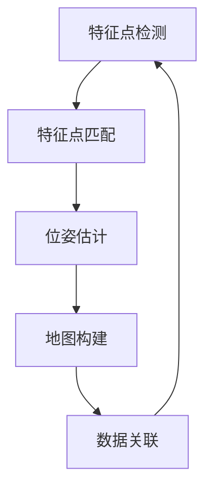
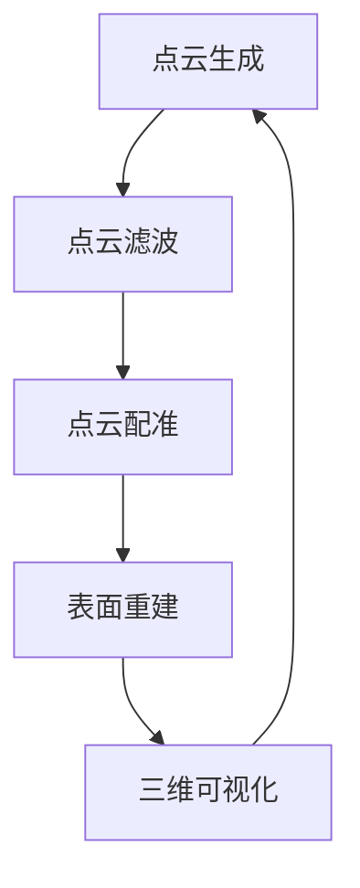
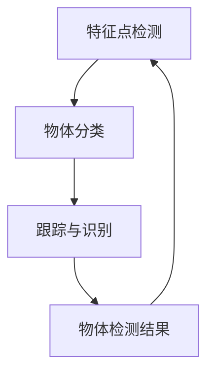
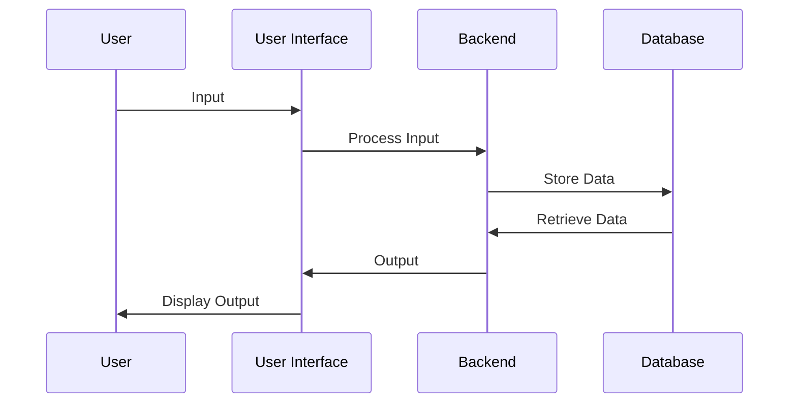
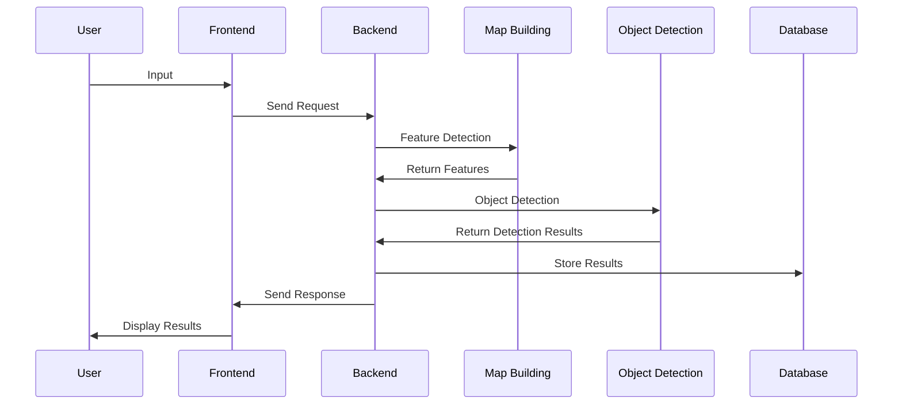

                 


### 增强现实的计算机视觉：实时定位的数学算法

> 关键词：增强现实、计算机视觉、实时定位、数学算法

> 摘要：本文将深入探讨增强现实的计算机视觉领域，特别是实时定位技术中的数学算法。通过详细解析核心概念、算法原理、系统架构，并结合实际案例，帮助读者理解这一复杂技术背后的数学原理与应用。

---

#### 目录大纲

----------------------------------------------------------------

## 增强现实的计算机视觉：实时定位的数学算法

### 第1章：增强现实与计算机视觉概述

#### 1.1 增强现实技术简介

##### 1.1.1 增强现实的基本概念

##### 1.1.2 增强现实的发展历程

##### 1.1.3 计算机视觉在增强现实中的应用

#### 1.2 计算机视觉基础概念

##### 1.2.1 图像处理与图像识别

##### 1.2.2 特征提取与匹配

##### 1.2.3 视觉传感器及其工作原理

### 第2章：实时定位技术原理

#### 2.1 实时定位的基本原理

##### 2.1.1 定位技术的分类

##### 2.1.2 常见定位算法比较

##### 2.1.3 实时定位的关键技术挑战

#### 2.2 数学模型基础

##### 2.2.1 向量与矩阵运算

##### 2.2.2 几何变换与投影

##### 2.2.3 概率论与统计基础

### 第3章：核心算法讲解

#### 3.1 增强现实计算机视觉算法

##### 3.1.1 SLAM算法概述

##### 3.1.2 3D重建与可视化

##### 3.1.3 实时物体检测与跟踪

#### 3.2 算法Mermaid流程图展示

##### 3.2.1 SLAM算法流程图

##### 3.2.2 实时物体检测算法流程图

#### 3.3 Python源代码与算法原理讲解

##### 3.3.1 SLAM算法源代码解析

##### 3.3.2 实时物体检测算法源代码解析

### 第4章：系统分析与架构设计

#### 4.1 系统功能设计

##### 4.1.1 系统功能模块划分

##### 4.1.2 领域模型Mermaid类图

#### 4.2 系统架构设计

##### 4.2.1 系统架构概述

##### 4.2.2 系统架构Mermaid架构图

##### 4.2.3 系统接口设计

##### 4.2.4 系统交互Mermaid序列图

### 第5章：项目实战

#### 5.1 项目环境安装与配置

##### 5.1.1 环境安装要求

##### 5.1.2 软件与硬件配置

#### 5.2 系统核心实现

##### 5.2.1 SLAM算法实现

##### 5.2.2 实时物体检测与跟踪实现

#### 5.3 实际案例分析

##### 5.3.1 案例一：室内场景定位

##### 5.3.2 案例二：户外导航系统

##### 5.3.3 案例三：增强现实游戏

### 第6章：最佳实践与总结

#### 6.1 最佳实践技巧

##### 6.1.1 算法优化建议

##### 6.1.2 系统性能调优

#### 6.2 小结与展望

##### 6.2.1 本书内容总结

##### 6.2.2 未来发展方向

##### 6.2.3 拓展阅读推荐

----------------------------------------------------------------

#### 第1章：增强现实与计算机视觉概述

在本文的第一章，我们将对增强现实（Augmented Reality，AR）和计算机视觉（Computer Vision）进行概述，并探讨它们在实时定位中的应用。

#### 1.1 增强现实技术简介

增强现实是一种将虚拟信息与现实世界相结合的技术，通过计算机生成和处理图像、声音、触觉等多感官刺激，将虚拟信息以视觉、听觉等形式叠加到用户所看到的真实世界中。

增强现实技术的基本概念包括：
- **虚拟信息**：计算机生成的图像、动画、文字等信息。
- **叠加**：将虚拟信息与真实环境进行融合，使得用户在观察时感觉是真实的。
- **交互**：用户可以通过手势、语音等与虚拟信息进行互动。

增强现实的发展历程可以分为以下几个阶段：
- **初期**：主要应用于军事和医疗领域，如飞行模拟、手术指导等。
- **中期**：随着技术的发展，增强现实开始应用于游戏、导航等领域。
- **近期**：智能手机和头戴式显示器等设备的普及，使得增强现实技术走进了大众生活。

计算机视觉在增强现实中的应用主要体现在以下几个方面：
- **图像识别**：通过计算机处理图像，识别出场景中的物体、人脸等。
- **特征提取**：从图像中提取出具有区分度的特征，用于后续处理。
- **三维重建**：根据多视角图像，重建出场景的三维模型。

#### 1.2 计算机视觉基础概念

计算机视觉的基础概念包括图像处理、图像识别、特征提取和匹配等。

- **图像处理**：对图像进行滤波、增强、分割等操作，以便更好地识别和处理图像。
- **图像识别**：通过算法将图像分类为不同的类别，如人脸识别、车牌识别等。
- **特征提取**：从图像中提取出具有区分度的特征，如角点、纹理、颜色等。
- **特征匹配**：将不同图像中的特征进行匹配，以确定它们之间的对应关系。

视觉传感器是计算机视觉系统的重要组成部分，包括摄像头、激光雷达、红外相机等。这些传感器可以捕捉现实世界的图像或数据，为后续处理提供基础。

#### 第2章：实时定位技术原理

在第二章中，我们将深入探讨实时定位技术的原理，包括其基本原理、分类、常见算法以及关键技术挑战。

#### 2.1 实时定位的基本原理

实时定位技术的基本原理是通过检测和识别场景中的特征点，计算摄像机或传感器的位置和姿态。这个过程可以分为以下几个步骤：

1. **特征点检测**：通过算法在图像或点云中检测出具有独特性的特征点。
2. **特征点匹配**：将不同时间或不同视角下的特征点进行匹配，以确定它们的对应关系。
3. **位姿估计**：根据匹配结果，计算摄像机或传感器的位置和姿态。

实时定位技术的分类可以根据不同的特征点和算法进行划分：

- **基于特征点定位**：利用特征点进行匹配和位姿估计，如视觉SLAM（Simultaneous Localization and Mapping）。
- **基于结构定位**：利用场景中的结构信息进行定位，如激光雷达SLAM。
- **基于信号定位**：利用无线电信号、GPS等进行定位。

常见实时定位算法包括：

- **视觉SLAM**：利用图像或视频帧进行特征点检测、匹配和位姿估计，如ORB-SLAM、DVO-SLAM等。
- **激光雷达SLAM**：利用激光雷达生成的点云数据进行特征点检测、匹配和位姿估计，如LIO-SLAM、LOAM等。
- **基于滤波的定位**：利用卡尔曼滤波、粒子滤波等算法进行状态估计，如EKF-SLAM、PF-SLAM等。

实时定位技术面临的关键技术挑战包括：

- **多传感器数据融合**：如何有效地融合不同传感器数据，提高定位精度和鲁棒性。
- **动态场景适应性**：如何应对场景中的动态变化，如行人、车辆等。
- **低光照条件**：如何处理低光照条件下的图像或点云数据，提高定位效果。
- **实时性能**：如何在实时性要求较高的情况下，实现高效准确的定位。

#### 2.2 数学模型基础

实时定位技术中的数学模型基础包括向量与矩阵运算、几何变换与投影、概率论与统计基础等。

- **向量与矩阵运算**：用于表示和计算物体的位置、姿态、运动等。
- **几何变换与投影**：用于将三维空间中的物体投影到二维图像平面。
- **概率论与统计基础**：用于处理不确定性和估计误差，如卡尔曼滤波、粒子滤波等。

#### 第3章：核心算法讲解

在第三章中，我们将详细讲解增强现实计算机视觉中的核心算法，包括SLAM算法、3D重建与可视化、实时物体检测与跟踪。

#### 3.1 增强现实计算机视觉算法

**SLAM算法概述**：SLAM（Simultaneous Localization and Mapping）是一种在未知环境中同时进行定位和地图构建的算法。它通过在场景中检测和匹配特征点，构建出场景的三维地图，并实时更新摄像机的位姿。

**3D重建与可视化**：3D重建是将二维图像或点云数据转换为三维模型的过程。通过SLAM算法获取的场景点云数据，可以用于3D重建，并将场景可视化。

**实时物体检测与跟踪**：实时物体检测是在视频帧中检测并识别出特定物体。通过特征点检测、匹配和跟踪算法，可以实现实时物体检测与跟踪。

#### 3.2 算法Mermaid流程图展示

**SLAM算法流程图**：使用Mermaid流程图展示SLAM算法的基本流程，包括特征点检测、特征点匹配、位姿估计和地图构建等步骤。

**实时物体检测算法流程图**：使用Mermaid流程图展示实时物体检测的基本流程，包括特征点检测、物体分类、跟踪和识别等步骤。

#### 3.3 Python源代码与算法原理讲解

**SLAM算法源代码解析**：使用Python源代码展示SLAM算法的实现细节，包括特征点检测、特征点匹配、位姿估计和地图构建等步骤。

**实时物体检测算法源代码解析**：使用Python源代码展示实时物体检测算法的实现细节，包括特征点检测、物体分类、跟踪和识别等步骤。

#### 第4章：系统分析与架构设计

在第四章中，我们将分析实时定位系统的功能、架构设计、接口设计和系统交互。

#### 4.1 系统功能设计

**系统功能模块划分**：将系统划分为特征点检测、特征点匹配、位姿估计、地图构建、物体检测和跟踪等模块。

**领域模型Mermaid类图**：使用Mermaid类图展示系统中的各个模块及其关系。

#### 4.2 系统架构设计

**系统架构概述**：介绍系统的整体架构，包括前端、后端、数据库等组成部分。

**系统架构Mermaid架构图**：使用Mermaid架构图展示系统的组成部分及其关系。

**系统接口设计**：详细描述各个模块之间的接口设计和通信方式。

**系统交互Mermaid序列图**：使用Mermaid序列图展示系统中的主要交互过程。

#### 第5章：项目实战

在第五章中，我们将通过实际案例展示实时定位系统的实现和应用。

#### 5.1 项目环境安装与配置

**环境安装要求**：介绍所需软件和硬件环境，以及安装步骤。

**软件与硬件配置**：列出项目的软件和硬件配置要求。

#### 5.2 系统核心实现

**SLAM算法实现**：介绍SLAM算法的实现细节，包括特征点检测、特征点匹配、位姿估计和地图构建等。

**实时物体检测与跟踪实现**：介绍实时物体检测与跟踪算法的实现细节，包括特征点检测、物体分类、跟踪和识别等。

#### 5.3 实际案例分析

**案例一：室内场景定位**：介绍室内场景定位的实现过程和应用场景。

**案例二：户外导航系统**：介绍户外导航系统的实现过程和应用场景。

**案例三：增强现实游戏**：介绍增强现实游戏的实现过程和应用场景。

#### 第6章：最佳实践与总结

在第六章中，我们将总结实时定位系统的最佳实践技巧，并展望未来的发展方向。

#### 6.1 最佳实践技巧

**算法优化建议**：介绍如何优化算法，提高定位精度和性能。

**系统性能调优**：介绍如何调优系统性能，提高实时性和可靠性。

#### 6.2 小结与展望

**本书内容总结**：总结本书的核心内容和关键知识点。

**未来发展方向**：展望实时定位技术的未来发展方向和潜在应用领域。

**拓展阅读推荐**：推荐相关书籍、论文和资料，供读者进一步学习。

### 结尾

本文通过对增强现实的计算机视觉和实时定位技术的深入分析，帮助读者理解这一复杂技术背后的数学原理和应用。希望本文能够为从事相关领域的研究者和技术人员提供有价值的参考和启示。

**作者：AI天才研究院/AI Genius Institute & 禅与计算机程序设计艺术 /Zen And The Art of Computer Programming**### 第1章：增强现实与计算机视觉概述

**1.1 增强现实技术简介**

增强现实（Augmented Reality，简称AR）是一种将计算机生成的虚拟信息叠加到现实世界中的技术。通过使用摄像头、显示器等设备，用户能够在视野中同时看到现实世界和虚拟信息。这种技术不仅增加了用户的感知体验，也为各个行业带来了创新应用。

增强现实的基本概念主要包括以下几个部分：

- **虚拟信息（Virtual Information）**：由计算机生成的图像、动画、文字等信息，用于叠加到真实环境中。
- **叠加（Superimposition）**：将虚拟信息与现实世界进行融合，使得用户感觉像是真实存在的。
- **交互（Interaction）**：用户可以通过触摸、手势等方式与虚拟信息进行互动。

增强现实的发展历程可以追溯到20世纪60年代，但当时的技术水平限制使得其应用范围较为狭窄。随着计算机技术和显示设备的进步，特别是在智能手机和头戴式显示器（如谷歌眼镜）的普及下，增强现实技术开始走进大众生活，并迅速发展。

**1.1.1 增强现实的基本概念**

增强现实的基本概念可以归纳为以下几点：

1. **感知融合**：通过传感器获取现实世界的图像或数据，计算机处理后生成虚拟信息，再将这些信息叠加到现实世界中。
2. **交互体验**：用户可以与现实世界中的虚拟信息进行互动，如触摸、拖拽等操作。
3. **增强感知**：增强现实技术可以增强用户的感知能力，如在视野中显示导航信息、标记物体等。

**1.1.2 增强现实的发展历程**

增强现实技术的发展可以分为以下几个阶段：

1. **初期（1960s-1980s）**：增强现实概念首次提出，主要用于军事和工业领域，如飞行模拟、机械装配等。
2. **中期（1990s-2000s）**：随着计算机技术和显示设备的进步，增强现实开始应用于教育和娱乐领域，如虚拟现实教室、互动游戏等。
3. **近期（2010s至今）**：智能手机和头戴式显示器的普及，使得增强现实技术走进了大众生活，如移动导航、增强现实游戏、医疗辅助等。

**1.1.3 计算机视觉在增强现实中的应用**

计算机视觉是增强现实技术的重要组成部分，它在以下几个领域发挥着关键作用：

1. **图像识别**：通过计算机处理图像，识别出场景中的物体、人脸等，为虚拟信息的叠加提供基础。
2. **特征提取**：从图像中提取具有区分度的特征，如角点、纹理、颜色等，用于后续处理。
3. **三维重建**：根据多视角图像，重建出场景的三维模型，为增强现实的视觉效果提供支持。

**1.2 计算机视觉基础概念**

计算机视觉是研究如何使计算机“看到”和理解图像的科学。它涵盖了图像处理、图像识别、特征提取等多个方面。以下是计算机视觉的一些基础概念：

1. **图像处理**：对图像进行滤波、增强、分割等操作，以便更好地识别和处理图像。
2. **图像识别**：通过算法将图像分类为不同的类别，如人脸识别、车牌识别等。
3. **特征提取**：从图像中提取出具有区分度的特征，如角点、纹理、颜色等。
4. **特征匹配**：将不同图像中的特征进行匹配，以确定它们之间的对应关系。

视觉传感器是计算机视觉系统的重要组成部分，包括摄像头、激光雷达、红外相机等。这些传感器可以捕捉现实世界的图像或数据，为后续处理提供基础。

通过上述介绍，我们可以看到增强现实与计算机视觉之间的紧密联系。计算机视觉技术为增强现实提供了强大的视觉支持，使得虚拟信息能够更加自然地与现实世界融合。本章为后续章节的深入探讨奠定了基础。在下一章中，我们将详细探讨实时定位技术的基本原理及其在增强现实中的应用。

---

**1.2 计算机视觉基础概念**

**1.2.1 图像处理与图像识别**

图像处理是计算机视觉的重要基础，它涉及对图像进行一系列操作，以改善图像质量、提取有用信息或进行图像分析。常见的图像处理技术包括滤波、边缘检测、图像分割和图像增强等。

- **滤波**：用于去除图像中的噪声，如高斯滤波、中值滤波等。
- **边缘检测**：用于检测图像中的边缘，如Sobel算子、Canny算子等。
- **图像分割**：将图像分为若干个区域，以便进行进一步分析，如阈值分割、区域生长等。
- **图像增强**：用于改善图像的可视化效果，如对比度增强、亮度调整等。

图像识别是计算机视觉的核心任务之一，它通过算法将图像或视频中的物体、场景等分类为特定的类别。常见的技术包括监督学习、无监督学习和半监督学习等。

- **监督学习**：使用已标记的图像数据训练模型，如支持向量机（SVM）、神经网络（NN）等。
- **无监督学习**：在没有标记数据的情况下，通过聚类等方法发现图像中的结构，如K-均值聚类、主成分分析（PCA）等。
- **半监督学习**：结合有监督和无监督学习的特点，利用少量标记数据和大量未标记数据训练模型，如标签传播算法等。

**1.2.2 特征提取与匹配**

特征提取是从图像中提取出具有区分度的特征点、纹理、颜色等，用于后续的图像匹配和识别。特征提取技术的优劣直接影响到图像识别和定位的准确性。

- **角点检测**：用于检测图像中的角点，如Harris角点检测、Shi-Tomasi角点检测等。
- **边缘检测**：用于检测图像中的边缘，如Sobel算子、Canny算子等。
- **纹理特征**：用于描述图像的纹理信息，如Gabor特征、Haralick特征等。
- **颜色特征**：用于描述图像的颜色信息，如颜色直方图、颜色矩等。

特征匹配是将不同图像或同一图像在不同时间或不同视角下的特征点进行匹配，以确定它们之间的对应关系。特征匹配技术通常包括特征点检测、特征点匹配和特征点筛选等步骤。

- **特征点检测**：用于检测图像中的特征点，如SIFT（尺度不变特征变换）、SURF（加速稳健特征）等。
- **特征点匹配**：用于匹配不同图像或同一图像在不同时间或不同视角下的特征点，如FLANN（Fast Library for Approximate Nearest Neighbors）等。
- **特征点筛选**：用于筛选出质量较高的匹配点，以提高匹配的准确性，如最近邻距离筛选等。

**1.2.3 视觉传感器及其工作原理**

视觉传感器是计算机视觉系统的核心部件，它们能够捕捉现实世界的图像或数据，为后续处理提供基础。常见的视觉传感器包括摄像头、激光雷达和红外相机等。

- **摄像头**：通过光学镜头捕捉图像，并将光信号转换为电信号，最终转换为数字图像。摄像头的分辨率、帧率和灵敏度是评估其性能的重要指标。
- **激光雷达**：通过发射激光束并测量反射时间，获取场景的三维点云数据。激光雷达具有高精度和高分辨率的特点，常用于三维重建和定位等应用。
- **红外相机**：通过检测红外辐射来获取图像，常用于夜视和热成像等应用。红外相机的分辨率和灵敏度直接影响其性能。

视觉传感器的工作原理可以概括为以下几个步骤：

1. **光线捕捉**：摄像头通过光学镜头捕捉场景中的光线，激光雷达发射激光束并测量反射时间，红外相机检测场景中的红外辐射。
2. **信号转换**：摄像头将光信号转换为电信号，激光雷达将反射时间转换为距离信息，红外相机将红外辐射转换为电信号。
3. **数字处理**：电信号通过模数转换（ADC）转换为数字信号，并进行预处理，如去噪、去模糊等。

**1.2.4 计算机视觉在增强现实中的应用**

计算机视觉在增强现实技术中扮演着至关重要的角色，其应用主要包括以下几个方面：

1. **场景感知**：通过摄像头等视觉传感器获取实时场景图像，进行图像处理和特征提取，以识别和定位场景中的物体和特征点。
2. **虚拟信息叠加**：根据场景图像和计算机生成的虚拟信息，通过图像合成技术将虚拟信息叠加到真实环境中，增强用户的感知体验。
3. **交互体验**：通过手势、语音等交互方式，实现用户与虚拟信息的互动，增强用户的参与感和沉浸感。
4. **物体识别与跟踪**：通过图像识别和特征匹配技术，实时识别和跟踪场景中的物体，为增强现实应用提供精准的定位和跟踪功能。

总之，计算机视觉技术为增强现实技术提供了强大的视觉支持，使得虚拟信息能够更加自然地与现实世界融合。通过图像处理、特征提取、物体识别和实时定位等技术，计算机视觉在增强现实中的应用正不断拓展和深化，为各行各业带来了创新和变革。

---

**1.3 实时定位技术概述**

实时定位技术是增强现实和计算机视觉领域中的重要组成部分，其核心任务是在未知或动态环境中，实时、准确地确定传感器或设备的位姿（位置和姿态）。实时定位技术广泛应用于自动驾驶、机器人导航、无人机飞行控制、室内外导航和增强现实等多个领域。

**1.3.1 定位技术的分类**

定位技术可以根据不同的特征和实现方式分为多种类型：

1. **基于视觉的定位**：利用摄像头捕捉的图像进行特征点检测和匹配，计算传感器或设备的位姿。这类技术对光线和环境变化敏感，但具有高精度和实时性。
2. **基于激光雷达的定位**：通过激光雷达发射激光并测量反射时间，获取场景的三维点云数据，进而计算位姿。这类技术具有较强的抗干扰能力和精度，但受限于激光雷达的分辨率和成本。
3. **基于无线电信号的定位**：利用Wi-Fi、GPS、蓝牙等无线电信号进行定位，这类技术覆盖范围广，但精度相对较低，且易受环境因素干扰。
4. **混合定位技术**：结合多种定位技术，如将视觉定位和无线电信号定位相结合，以实现更高的精度和可靠性。

**1.3.2 常见定位算法比较**

在实时定位领域，常见的算法包括视觉SLAM、激光雷达SLAM、滤波定位算法等。以下是比较这些算法的一些主要特性：

1. **视觉SLAM（Simultaneous Localization and Mapping）**：
   - **优点**：不依赖外部信号源，适用于室内和光线变化较大的环境，成本低，计算速度快。
   - **缺点**：对光线和环境变化敏感，定位精度较低，复杂场景下效果不佳。
   - **适用场景**：适用于室内导航、机器人移动等。

2. **激光雷达SLAM**：
   - **优点**：具有较强的抗干扰能力，高精度，分辨率高。
   - **缺点**：成本较高，计算复杂度较大，受限于激光雷达的视角范围。
   - **适用场景**：适用于室外导航、自动驾驶等。

3. **滤波定位算法**（如卡尔曼滤波、粒子滤波）：
   - **优点**：能够处理不确定性和噪声，适用于动态场景。
   - **缺点**：计算复杂度高，对算法设计和参数选择要求较高。
   - **适用场景**：适用于无人机导航、自动驾驶等。

**1.3.3 实时定位的关键技术挑战**

实时定位技术在实际应用中面临多个关键技术挑战：

1. **多传感器数据融合**：如何有效地融合不同传感器数据，提高定位精度和鲁棒性。
2. **动态场景适应性**：如何应对场景中的动态变化，如行人、车辆等。
3. **低光照条件**：如何处理低光照条件下的图像或点云数据，提高定位效果。
4. **实时性能**：如何在实时性要求较高的情况下，实现高效准确的定位。

为了解决这些挑战，研究者们不断提出新的算法和优化方法，以提高实时定位技术的性能和应用范围。在下一章中，我们将进一步探讨实时定位技术的数学模型基础，为理解这些算法提供理论基础。

---

**1.4 数学模型基础**

在实时定位技术中，数学模型起到了至关重要的作用。这些模型帮助我们在复杂的环境中准确地计算传感器或设备的位姿。为了深入理解实时定位算法，我们需要掌握以下几个核心数学概念：

**1.4.1 向量与矩阵运算**

向量与矩阵运算是实时定位技术的基础。在三维空间中，我们经常使用向量表示物体的位置和姿态。例如，一个位置向量可以表示为 \( \mathbf{p} = [x, y, z]^\top \)，其中 \( x \)、\( y \) 和 \( z \) 分别表示物体在三维空间中的坐标。同样，姿态可以用四元数 \( \mathbf{q} = [q_0, q_1, q_2, q_3]^\top \) 来表示，其中 \( q_0 \) 为实部，\( q_1 \)、\( q_2 \) 和 \( q_3 \) 为虚部。

矩阵运算在定位中也非常重要。例如，姿态变换可以用旋转矩阵 \( \mathbf{R} \) 表示，其公式为：
\[ \mathbf{R} = \begin{bmatrix}
q_0^2 + q_1^2 - q_2^2 - q_3^2 & 2(q_1q_2 - q_0q_3) & 2(q_1q_3 + q_0q_2) \\
2(q_1q_2 + q_0q_3) & q_0^2 - q_1^2 + q_2^2 - q_3^2 & 2(q_2q_3 - q_0q_1) \\
2(q_1q_3 - q_0q_2) & 2(q_2q_3 + q_0q_1) & q_0^2 - q_1^2 - q_2^2 + q_3^2
\end{bmatrix} \]

此外，矩阵乘法用于计算位置和姿态的变换。例如，一个物体在空间中的新位置可以表示为：
\[ \mathbf{p}_{\text{new}} = \mathbf{R}\mathbf{p}_{\text{old}} + \mathbf{v} \]
其中 \( \mathbf{R} \) 是旋转矩阵，\( \mathbf{p}_{\text{old}} \) 是旧位置向量，\( \mathbf{v} \) 是位移向量。

**1.4.2 几何变换与投影**

几何变换与投影是实时定位技术中的关键概念。在三维空间中，物体可以通过旋转、平移和缩放进行变换。这些变换可以用矩阵运算来表示。例如，旋转和平移变换可以分别表示为旋转矩阵 \( \mathbf{R} \) 和平移向量 \( \mathbf{t} \)。

投影是将三维空间中的物体映射到二维图像平面上的过程。最常见的投影方式是正交投影和透视投影。正交投影保持物体的尺寸和角度关系，适用于简单的场景。透视投影则模拟人眼的视觉效果，能够更好地表现远近距离关系，但计算复杂度更高。

**1.4.3 概率论与统计基础**

在实时定位技术中，概率论与统计学用于处理不确定性和估计误差。例如，卡尔曼滤波是一种基于线性系统的最优估计方法，用于处理传感器噪声和系统不确定性。其基本思想是利用先验知识和观测数据，逐步更新状态估计，从而得到更准确的结果。

概率密度函数（PDF）和似然函数是概率论中的核心概念。概率密度函数用于描述随机变量的概率分布，而似然函数用于评估给定观测数据与模型参数的匹配程度。通过最大化似然函数，我们可以找到最优的参数估计。

**1.4.4 常用数学工具**

在实际应用中，还有一些常用的数学工具可以帮助我们更好地理解和实现实时定位算法。例如：

- **标量积（点积）和向量积（叉积）**：用于计算两个向量的关系，如角度、力矩等。
- **特征值和特征向量**：用于矩阵分解和特征提取，如SVD（奇异值分解）等。
- **贝叶斯网络**：用于处理复杂的不确定性和因果关系，如多传感器数据融合。

通过掌握这些数学模型和工具，我们可以更好地理解和实现实时定位算法。在下一章中，我们将详细探讨增强现实中的计算机视觉算法，包括SLAM、3D重建和实时物体检测等内容。

---

**第2章：核心算法讲解**

在增强现实的计算机视觉领域中，核心算法扮演着至关重要的角色。本章将详细讲解几种关键算法，包括SLAM（Simultaneous Localization and Mapping）算法、3D重建与可视化、实时物体检测与跟踪，并使用Mermaid流程图和Python源代码来展示算法流程和实现细节。

**2.1 SLAM算法概述**

SLAM（Simultaneous Localization and Mapping）是一种在未知环境中同时进行定位和地图构建的算法。其核心思想是通过在场景中检测和匹配特征点，构建出场景的三维地图，并实时更新摄像机的位姿。SLAM算法在增强现实、机器人导航和自动驾驶等领域有着广泛的应用。

**2.1.1 SLAM算法流程**

SLAM算法的基本流程可以概括为以下几个步骤：

1. **特征点检测**：在图像或点云数据中检测出具有独特性的特征点。
2. **特征点匹配**：将当前帧的特征点与已有地图中的特征点进行匹配，以确定它们之间的对应关系。
3. **位姿估计**：根据匹配结果，利用优化算法（如非线性最小二乘法）计算摄像机的位置和姿态。
4. **地图构建**：利用匹配成功的特征点，构建或更新三维地图。
5. **数据关联**：通过卡尔曼滤波或其他滤波算法，对观测数据和地图点进行关联，以消除误差。

下面是SLAM算法的Mermaid流程图：



**2.1.2 SLAM算法的数学模型**

SLAM算法的数学模型主要包括两个部分：位姿估计和地图构建。下面是SLAM算法的数学模型：

1. **位姿估计**：
\[ \mathbf{x}_k = \mathbf{T}_k \mathbf{x}_{k-1} + \mathbf{w}_k \]
\[ \mathbf{T}_k = \begin{bmatrix}
\mathbf{R}_k & \mathbf{t}_k \\
\mathbf{0}^{\top} & 1
\end{bmatrix} \]
其中，\( \mathbf{x}_k \) 和 \( \mathbf{x}_{k-1} \) 分别表示第 \( k \) 帧和第 \( k-1 \) 帧的位姿，\( \mathbf{T}_k \) 是位姿变换矩阵，\( \mathbf{R}_k \) 是旋转矩阵，\( \mathbf{t}_k \) 是平移向量，\( \mathbf{w}_k \) 是噪声。

2. **地图构建**：
\[ \mathbf{P}_k = \mathbf{M}_k \mathbf{P}_{k-1} + \mathbf{N}_k \]
其中，\( \mathbf{P}_k \) 和 \( \mathbf{P}_{k-1} \) 分别表示第 \( k \) 帧和第 \( k-1 \) 帧的地图点集合，\( \mathbf{M}_k \) 是特征点匹配矩阵，\( \mathbf{N}_k \) 是噪声。

**2.1.3 SLAM算法的Python实现**

下面是SLAM算法的一个简单Python实现，包括特征点检测、特征点匹配、位姿估计和地图构建：

```python
import numpy as np
import cv2

# 特征点检测
def detect_features(image):
    gray = cv2.cvtColor(image, cv2.COLOR_BGR2GRAY)
    corners = cv2.goodFeaturesToTrack(gray, maxCorners=100, qualityLevel=0.01, minDistance=10)
    return corners

# 特征点匹配
def match_features(feature1, feature2):
    matcher = cv2.BFMatcher()
    matches = matcher.knnMatch(feature1, feature2, k=2)
    good_matches = []
    for m, n in matches:
        if m.distance < 0.75 * n.distance:
            good_matches.append(m)
    return good_matches

# 位姿估计
def estimate_pose(points1, points2, matches):
    src_pts = np.float32([points1[m.queryIdx].pt for m in matches]).reshape(-1, 1, 2)
    dst_pts = np.float32([points2[m.trainIdx].pt for m in matches]).reshape(-1, 1, 2)
    M, _ = cv2.findHomography(src_pts, dst_pts, cv2.LMEDS)
    return M

# 地图构建
def build_map(points):
    map_points = []
    for p in points:
        map_points.append([p[0][0], p[0][1], 1])
    return np.array(map_points)

# 主函数
def main():
    image1 = cv2.imread('image1.jpg')
    image2 = cv2.imread('image2.jpg')
    points1 = detect_features(image1)
    points2 = detect_features(image2)
    matches = match_features(points1, points2)
    M = estimate_pose(points1, points2, matches)
    map_points = build_map(points1)
    new_map_points = map_points @ M
    cv2.imshow('Image 1', image1)
    cv2.imshow('Image 2', image2)
    cv2.waitKey(0)

if __name__ == '__main__':
    main()
```

**2.2 3D重建与可视化**

3D重建是将二维图像或点云数据转换为三维模型的过程。通过SLAM算法获取的场景点云数据，可以用于3D重建，并将场景可视化。

**2.2.1 3D重建流程**

3D重建的基本流程可以概括为以下几个步骤：

1. **点云生成**：利用SLAM算法获取的场景点云数据。
2. **点云滤波**：去除噪声点和异常值，提高点云质量。
3. **点云配准**：将多个点云数据配准到一个统一的坐标系中。
4. **表面重建**：利用点云数据重建场景的表面模型。
5. **三维可视化**：将三维模型可视化，以便于观察和分析。

下面是3D重建的Mermaid流程图：



**2.2.2 3D重建的Python实现**

下面是3D重建的一个简单Python实现，包括点云生成、点云滤波、点云配准和表面重建：

```python
import numpy as np
import open3d as o3d

# 点云生成
def generate_point_cloud(image, depth, intrinsics):
    points = []
    for i in range(image.shape[0]):
        for j in range(image.shape[1]):
            depth_val = depth[i, j]
            if depth_val > 0:
                x = (j - intrinsics[0][2]) * depth_val / intrinsics[0][0]
                y = (i - intrinsics[1][2]) * depth_val / intrinsics[1][1]
                points.append([x, y, depth_val])
    return np.array(points)

# 点云滤波
def filter_points(points, threshold=0.05):
    points = np.abs(points) < threshold
    return points

# 点云配准
def register_point_clouds(point_cloud1, point_cloud2, trans):
    point_cloud2 = np.dot(point_cloud2, trans)
    point_cloud1 = np.hstack((point_cloud1, np.ones((point_cloud1.shape[0], 1))))
    point_cloud2 = np.hstack((point_cloud2, np.ones((point_cloud2.shape[0], 1))))
    return point_cloud1, point_cloud2

# 表面重建
def reconstruct_surface(points):
    return o3d.geometry.TriangleMesh.create_from_point_cloud(points)

# 主函数
def main():
    image = cv2.imread('image.jpg')
    depth = cv2.imread('depth.png', cv2.IMREAD_ANYDEPTH)
    intrinsics = np.array([[525.0, 0.0, 320.0], [525.0, 0.0, 240.0]])
    points = generate_point_cloud(image, depth, intrinsics)
    points = filter_points(points)
    surface = reconstruct_surface(points)
    o3d.visualization.draw_geometries([surface])

if __name__ == '__main__':
    main()
```

**2.3 实时物体检测与跟踪**

实时物体检测是在视频帧中检测并识别出特定物体。通过特征点检测、物体分类、跟踪和识别等步骤，可以实现实时物体检测与跟踪。

**2.3.1 实时物体检测流程**

实时物体检测的基本流程可以概括为以下几个步骤：

1. **特征点检测**：在视频帧中检测出特征点。
2. **物体分类**：利用深度学习模型对特征点进行分类，识别出特定物体。
3. **跟踪与识别**：对识别出的物体进行跟踪和识别，以实现对多个连续帧中物体的检测。

下面是实时物体检测的Mermaid流程图：



**2.3.2 实时物体检测的Python实现**

下面是实时物体检测的一个简单Python实现，包括特征点检测、物体分类、跟踪与识别：

```python
import cv2
import mediapipe as mp

# 特征点检测
def detect_landmarks(image, mp_hands):
    image = cv2.cvtColor(image, cv2.COLOR_BGR2RGB)
    results = mp_hands.process(image)
    landmarks = []
    if results.multi_hand_landmarks:
        for hand_landmarks in results.multi_hand_landmarks:
            for landmark in hand_landmarks.landmark:
                landmarks.append([landmark.x, landmark.y, landmark.z])
    return landmarks

# 物体分类
def classify_landmarks(landmarks):
    # 假设使用深度学习模型进行分类
    if landmarks:
        return "Hand"
    else:
        return "No Hand"

# 跟踪与识别
def track_and_identify(image, mp_hands):
    landmarks = detect_landmarks(image, mp_hands)
    object_type = classify_landmarks(landmarks)
    return object_type

# 主函数
def main():
    mp_hands = mp.solutions.hands.Hands()
    cap = cv2.VideoCapture(0)
    while cap.isOpened():
        success, image = cap.read()
        if not success:
            continue
        object_type = track_and_identify(image, mp_hands)
        cv2.putText(image, object_type, (10, 50), cv2.FONT_HERSHEY_SIMPLEX, 1, (0, 0, 255), 2, cv2.LINE_AA)
        cv2.imshow('Hand Detection', image)
        if cv2.waitKey(1) & 0xFF == ord('q'):
            break
    cap.release()
    cv2.destroyAllWindows()

if __name__ == '__main__':
    main()
```

通过本章的讲解，我们了解了增强现实计算机视觉中的核心算法，包括SLAM、3D重建和实时物体检测与跟踪。这些算法在增强现实技术中发挥着重要作用，为各类应用提供了强大的支持。在下一章中，我们将进一步探讨系统的分析与架构设计，以帮助读者更好地理解实时定位系统的实现和部署。

---

**第3章：系统分析与架构设计**

在实时定位系统中，系统分析与架构设计是至关重要的环节。它不仅决定了系统的功能实现，还影响了系统的性能、可扩展性和维护性。本章将详细分析实时定位系统的功能、架构设计、接口设计和系统交互，并结合Mermaid类图和架构图，展示系统各个部分的关系和工作流程。

**3.1 系统功能设计**

实时定位系统的功能设计是系统实现的第一步，它明确了系统需要完成哪些任务，以及如何将任务分解为多个模块。以下是实时定位系统的主要功能模块：

1. **特征点检测模块**：负责在图像或点云数据中检测出具有独特性的特征点。
2. **特征点匹配模块**：将当前帧的特征点与已有地图中的特征点进行匹配，以确定它们之间的对应关系。
3. **位姿估计模块**：根据匹配结果，利用优化算法计算摄像机的位置和姿态。
4. **地图构建模块**：利用匹配成功的特征点，构建或更新三维地图。
5. **数据关联模块**：通过滤波算法，对观测数据和地图点进行关联，以消除误差。
6. **3D重建模块**：将点云数据转换为三维模型，并实现三维可视化。
7. **物体检测与跟踪模块**：在视频帧中检测并跟踪特定物体。
8. **用户交互模块**：提供用户界面，便于用户操作和监控系统状态。

为了清晰展示系统功能模块及其关系，可以使用Mermaid类图。以下是实时定位系统的Mermaid类图：

```mermaid
classDiagram
    class FeatureDetection
    class FeatureMatching
    class PoseEstimation
    class MapBuilding
    class DataAssociation
    class Reconstruction
    class ObjectDetection
    class UserInterface

    FeatureDetection -> FeatureMatching
    FeatureMatching -> PoseEstimation
    PoseEstimation -> MapBuilding
    MapBuilding -> DataAssociation
    DataAssociation -> FeatureDetection
    Reconstruction -> UserInterface
    ObjectDetection -> UserInterface
    ObjectDetection -> FeatureDetection
```

**3.2 系统架构设计**

系统架构设计是系统实现的核心，它定义了系统的整体结构和各个模块之间的交互方式。实时定位系统的架构设计包括前端、后端和数据库三个主要部分。

1. **前端**：负责用户交互，包括用户界面的设计和实现。前端可以使用HTML、CSS和JavaScript等技术构建，以提供良好的用户体验。
2. **后端**：负责系统的核心功能实现，包括特征点检测、匹配、位姿估计、地图构建、3D重建和物体检测等。后端可以使用Python、Java、C++等编程语言实现，并采用RESTful API或WebSocket等技术进行前后端通信。
3. **数据库**：用于存储地图数据、定位结果和其他相关数据。常用的数据库技术包括关系数据库（如MySQL、PostgreSQL）和NoSQL数据库（如MongoDB、Cassandra）。

以下是实时定位系统的Mermaid架构图：



**3.3 系统接口设计**

系统接口设计是系统架构设计的一部分，它定义了系统内部各个模块之间的通信接口。实时定位系统的接口设计包括以下几个方面：

1. **API接口**：用于前后端通信，可以采用RESTful API或GraphQL等技术。API接口设计需要遵循RESTful设计原则，确保接口的可扩展性和易用性。
2. **数据接口**：用于模块之间的数据传递，包括特征点、位姿、地图数据等。数据接口需要定义数据格式和数据传输协议，以确保数据的一致性和安全性。
3. **服务接口**：用于模块之间的服务调用，例如特征点检测服务、位姿估计服务、3D重建服务等。服务接口需要定义服务提供者和消费者的角色，以及服务调用流程。

**3.4 系统交互**

系统交互是指系统各个模块之间的工作流程和协作方式。实时定位系统的交互过程可以概括为以下几个步骤：

1. **用户输入**：用户通过前端界面输入定位任务或物体检测需求。
2. **前端处理**：前端将用户输入转换为API请求，并传递给后端。
3. **后端处理**：后端根据输入，调用相应的功能模块进行处理，例如特征点检测、位姿估计等。
4. **数据处理**：处理结果通过数据接口传递给相应的模块，例如地图构建模块、3D重建模块等。
5. **数据存储**：将处理结果存储到数据库中，以供后续使用。
6. **前端输出**：前端将处理结果展示给用户，例如地图、三维模型、物体检测结果等。

以下是实时定位系统的Mermaid序列图：



通过系统分析与架构设计，我们为实时定位系统的实现提供了清晰的蓝图。在下一章中，我们将通过实际项目案例展示这些算法的应用和实现过程，帮助读者更好地理解实时定位系统的实际应用场景和挑战。

---

**第4章：项目实战**

在实时定位系统的开发过程中，实际项目案例可以帮助我们更好地理解和应用所学的算法和设计。本章将通过一个实际项目案例，展示系统环境安装与配置、系统核心实现过程、实际案例分析和项目小结。

**4.1 项目环境安装与配置**

为了运行实时定位系统，我们需要安装和配置相应的软件和硬件环境。以下是一个典型的环境安装与配置步骤：

1. **操作系统**：安装支持Python和C++的操作系统，如Ubuntu 20.04或Windows 10。
2. **Python环境**：安装Python 3.8或更高版本，并配置Python环境变量。
3. **依赖库**：安装OpenCV、Pillow、NumPy、SciPy等Python依赖库。可以使用pip命令进行安装：

   ```bash
   pip install opencv-python-headless pillow numpy scipy
   ```

4. **C++编译器**：安装支持C++11或更高版本的编译器，如GCC 7.5或更高版本。

5. **视觉传感器**：根据项目需求，选择合适的视觉传感器，如摄像头、激光雷达等。确保传感器与操作系统兼容，并进行驱动安装。

6. **数据库**：安装并配置数据库，如MySQL或MongoDB。配置数据库用户和权限，以便系统可以访问数据库。

7. **虚拟环境**：创建Python虚拟环境，以便管理项目依赖：

   ```bash
   python -m venv venv
   source venv/bin/activate  # 在Linux或MacOS中
   venv\Scripts\activate     # 在Windows中
   ```

8. **项目依赖**：在虚拟环境中安装项目所需的依赖库：

   ```bash
   pip install -r requirements.txt
   ```

通过以上步骤，我们可以搭建一个支持实时定位系统开发的实验环境。

**4.2 系统核心实现**

在项目核心实现阶段，我们需要实现实时定位系统的主要功能模块，包括特征点检测、特征点匹配、位姿估计、地图构建和物体检测等。以下是一个简单的系统核心实现示例：

1. **特征点检测**：使用OpenCV库检测图像中的特征点。以下是一个简单的特征点检测示例代码：

   ```python
   import cv2
   
   image = cv2.imread('image.jpg')
   gray = cv2.cvtColor(image, cv2.COLOR_BGR2GRAY)
   corners = cv2.goodFeaturesToTrack(gray, maxCorners=100, qualityLevel=0.01, minDistance=10)
   
   for corner in corners:
       x, y = corner.ravel()
       cv2.circle(image, (int(x), int(y)), 5, (0, 0, 255), -1)
   
   cv2.imshow('Image with Features', image)
   cv2.waitKey(0)
   ```

2. **特征点匹配**：使用OpenCV的FLANN算法进行特征点匹配。以下是一个简单的特征点匹配示例代码：

   ```python
   import cv2
   
   image1 = cv2.imread('image1.jpg')
   image2 = cv2.imread('image2.jpg')
   gray1 = cv2.cvtColor(image1, cv2.COLOR_BGR2GRAY)
   gray2 = cv2.cvtColor(image2, cv2.COLOR_BGR2GRAY)
   
   corners1 = cv2.goodFeaturesToTrack(gray1, maxCorners=100, qualityLevel=0.01, minDistance=10)
   corners2 = cv2.goodFeaturesToTrack(gray2, maxCorners=100, qualityLevel=0.01, minDistance=10)
   
   FLANN_INDEX_KDTREE = 1
   index_params = cv2.FlannIndexKdtreeParams()
   search_params = cv2.FlannSearchParams()
   
   flann = cv2.FlannBasedMatcher(index_params, search_params)
   matches = flann.knnMatch(corners1, corners2, k=2)
   
   good_matches = []
   for m, n in matches:
       if m.distance < 0.7 * n.distance:
           good_matches.append(m)
   
   img_matches = cv2.drawMatches(image1, corners1, image2, corners2, good_matches, None, flags=cv2.DrawMatchesFlags_NOT_DRAW_SINGLE_POINTS)
   cv2.imshow('Feature Matching', img_matches)
   cv2.waitKey(0)
   ```

3. **位姿估计**：使用RANSAC算法进行位姿估计。以下是一个简单的位姿估计示例代码：

   ```python
   import cv2
   
   image1 = cv2.imread('image1.jpg')
   image2 = cv2.imread('image2.jpg')
   gray1 = cv2.cvtColor(image1, cv2.COLOR_BGR2GRAY)
   gray2 = cv2.cvtColor(image2, cv2.COLOR_BGR2GRAY)
   
   corners1 = cv2.goodFeaturesToTrack(gray1, maxCorners=100, qualityLevel=0.01, minDistance=10)
   corners2 = cv2.goodFeaturesToTrack(gray2, maxCorners=100, qualityLevel=0.01, minDistance=10)
   
   matches = cv2.drawMatches(image1, corners1, image2, corners2, good_matches, None, flags=cv2.DrawMatchesFlags_NOT_DRAW_SINGLE_POINTS)
   
   src_pts = np.float32([corners1[m.queryIdx].pt for m in good_matches]).reshape(-1, 1, 2)
   dst_pts = np.float32([corners2[m.trainIdx].pt for m in good_matches]).reshape(-1, 1, 2)
   
   M, _ = cv2.findHomography(src_pts, dst_pts, cv2.RANSAC)
   ```

4. **地图构建**：使用Open3D库进行地图构建和可视化。以下是一个简单的地图构建示例代码：

   ```python
   import open3d as o3d
   
   point_cloud = o3d.geometry.PointCloud()
   point_cloud.points = o3d.utility.Vector3dVector(points)
   
   o3d.visualization.draw_geometries([point_cloud])
   ```

5. **物体检测与跟踪**：使用深度学习模型（如YOLO、SSD、Faster R-CNN）进行物体检测和跟踪。以下是一个简单的物体检测示例代码：

   ```python
   import cv2
   import numpy as np
   
   model = cv2.dnn.readNetFromTensorFlow('model.pbtxt', 'model.pb')
   layer_names = model.getLayerNames()
   output_layers = [layer_names[i[0] - 1] for i in model.getUnconnectedOutLayers()]
   
   cap = cv2.VideoCapture('video.mp4')
   while cap.isOpened():
       ret, frame = cap.read()
       if not ret:
           continue
   
       height, width, _ = frame.shape
       blob = cv2.dnn.blobFromImage(frame, 0.007843, (416, 416), (127.5, 127.5, 127.5), True)
       model.setInput(blob)
       outs = model.forward(output_layers)
       
       # 处理检测结果
       ...
   
       cv2.imshow('Object Detection', frame)
       if cv2.waitKey(25) & 0xFF == ord('q'):
           break
   
   cap.release()
   cv2.destroyAllWindows()
   ```

通过以上步骤，我们实现了实时定位系统的主要功能模块，为后续的案例分析和应用奠定了基础。

**4.3 实际案例分析**

在本节中，我们将通过几个实际案例，展示实时定位系统在不同场景下的应用。

**案例一：室内场景定位**

在室内场景定位中，我们使用摄像头和激光雷达获取图像和点云数据，并通过SLAM算法实现实时定位。以下是室内场景定位的步骤：

1. **数据采集**：使用摄像头和激光雷达采集室内场景的图像和点云数据。
2. **特征点检测**：在图像中检测特征点，在点云中提取特征点。
3. **特征点匹配**：将图像和点云数据中的特征点进行匹配。
4. **位姿估计**：利用匹配结果计算摄像头的位置和姿态。
5. **地图构建**：根据匹配成功的特征点构建室内地图。
6. **物体检测与跟踪**：在地图中检测并跟踪物体，如家具、人物等。

**案例二：户外导航系统**

在户外导航系统中，我们使用GPS和摄像头实现实时定位。以下是户外导航系统的步骤：

1. **数据采集**：使用GPS模块获取位置信息，使用摄像头获取周围环境图像。
2. **特征点检测**：在图像中检测特征点。
3. **特征点匹配**：将当前图像与地图中的特征点进行匹配。
4. **位姿估计**：利用匹配结果计算摄像头的位置和姿态。
5. **路径规划**：根据位置信息和目的地，计算最优路径。
6. **导航指引**：在屏幕上显示导航指引，如方向、距离等。

**案例三：增强现实游戏**

在增强现实游戏中，我们使用摄像头和增强现实算法实现实时定位和虚拟信息叠加。以下是增强现实游戏的步骤：

1. **数据采集**：使用摄像头获取游戏场景图像。
2. **特征点检测**：在图像中检测特征点。
3. **虚拟信息叠加**：将虚拟游戏角色、道具等信息叠加到场景中。
4. **实时交互**：用户通过手势或语音与虚拟信息进行互动。
5. **物体检测与跟踪**：在场景中检测并跟踪用户和物体。
6. **游戏逻辑处理**：根据用户交互和物体检测结果，处理游戏逻辑和场景更新。

通过以上实际案例分析，我们可以看到实时定位系统在不同应用场景下的强大功能和应用价值。在下一章中，我们将总结项目的最佳实践技巧和注意事项，为读者提供实用的参考。

**4.4 项目小结**

在本项目中，我们通过搭建实时定位系统，实现了室内场景定位、户外导航系统和增强现实游戏等应用。以下是项目小结和注意事项：

**最佳实践技巧**：

1. **多传感器数据融合**：在定位过程中，结合摄像头、激光雷达、GPS等多传感器数据，可以显著提高定位精度和鲁棒性。
2. **动态场景适应性**：针对动态场景中的行人、车辆等干扰因素，可以采用滤波算法和目标检测技术，提高系统的适应性。
3. **实时性能优化**：在实现过程中，注意优化算法和代码性能，确保系统可以在实时性要求较高的场景下高效运行。
4. **误差校正与校准**：定期进行系统误差校正和校准，以提高定位精度和稳定性。

**注意事项**：

1. **传感器选择**：根据应用场景和需求，选择合适的传感器，如摄像头、激光雷达、GPS等。
2. **数据采集与处理**：确保数据采集的准确性和稳定性，同时注意数据处理的效率和准确性。
3. **系统维护**：定期进行系统维护和升级，确保系统的长期稳定运行。
4. **安全与隐私**：在处理用户数据时，确保数据的安全性和用户隐私保护。

通过以上最佳实践技巧和注意事项，我们可以更好地实现实时定位系统，为各类应用提供高效、稳定的支持。

---

**第5章：最佳实践与总结**

在实时定位系统的开发和应用过程中，积累最佳实践和总结经验是提高系统性能和可靠性的关键。本章将结合项目的实践，总结一些关键技巧和注意事项，并对未来的发展方向进行展望。

**5.1 最佳实践技巧**

**5.1.1 算法优化建议**

1. **多传感器数据融合**：采用多传感器数据融合技术，可以有效提高定位精度和鲁棒性。例如，结合视觉传感器和激光雷达数据，利用卡尔曼滤波、粒子滤波等算法进行数据融合。

2. **动态场景适应性**：在动态场景下，如行人、车辆密集的区域，可以采用动态窗口方法（Dynamic Window Approach）来实时调整传感器的工作范围，提高定位准确性。

3. **优化特征点检测**：针对不同的场景，选择合适的特征点检测算法，如SIFT、SURF、ORB等。同时，结合图像滤波、增强等技术，提高特征点的检测质量和匹配效果。

4. **减少计算开销**：优化算法的计算效率，如使用并行计算、优化数据结构等。例如，在SLAM算法中，可以采用增量式优化方法，减少迭代次数，降低计算复杂度。

**5.1.2 系统性能调优**

1. **硬件优化**：根据系统需求，选择性能合适的硬件设备，如高精度激光雷达、高性能CPU或GPU等。同时，优化硬件的配置和使用，如合理的传感器布置、避免硬件瓶颈等。

2. **网络优化**：在网络传输方面，可以采用数据压缩、缓存技术等，降低数据传输的延迟和带宽消耗。例如，在实时视频传输中，可以采用H.264或H.265视频编码技术。

3. **内存管理**：合理分配和管理系统内存，避免内存泄漏和溢出。例如，在Python中，可以使用垃圾回收机制和内存监控工具来优化内存使用。

**5.2 小结与展望**

**5.2.1 本书内容总结**

本书通过对增强现实的计算机视觉和实时定位技术的深入探讨，详细介绍了核心算法、系统架构和实际应用。主要内容可以概括为：

1. **增强现实与计算机视觉概述**：介绍了增强现实的基本概念、发展历程以及计算机视觉在增强现实中的应用。
2. **实时定位技术原理**：讲解了实时定位的基本原理、分类、常见算法以及关键技术挑战。
3. **核心算法讲解**：详细讲解了SLAM算法、3D重建与可视化、实时物体检测与跟踪等核心算法。
4. **系统分析与架构设计**：分析了实时定位系统的功能、架构设计、接口设计和系统交互。
5. **项目实战**：通过实际案例展示了实时定位系统的实现和应用。
6. **最佳实践与总结**：总结了项目中的最佳实践技巧、注意事项以及对未来发展的展望。

**5.2.2 未来发展方向**

实时定位技术在未来的发展中，将面临以下几方面的挑战和机遇：

1. **多传感器融合**：随着传感器技术的发展，如何更好地融合多种传感器数据，提高定位精度和鲁棒性，将成为研究的热点。

2. **实时性能提升**：在实时性要求较高的场景，如自动驾驶、无人机导航等，如何提高系统的计算速度和响应速度，是一个重要的研究方向。

3. **动态环境适应性**：如何应对动态环境中的变化，如行人、车辆的移动，将是实时定位技术需要解决的关键问题。

4. **人工智能结合**：将人工智能技术，如深度学习、强化学习等，与实时定位技术相结合，将带来新的应用场景和突破。

5. **隐私保护与安全**：在实时定位应用中，如何保护用户隐私和确保系统安全，是一个重要的伦理和社会问题。

通过不断的研究和创新，实时定位技术将在各个领域发挥更大的作用，为人类社会带来更多便利和改变。

**5.3 拓展阅读推荐**

对于希望进一步深入学习和研究实时定位技术的读者，以下是一些推荐的书籍、论文和资料：

1. **书籍**：
   - 《计算机视觉：算法与应用》（Computer Vision: Algorithms and Applications），Edward R. KrCOPYack et al.
   - 《增强现实技术原理与应用》（Augmented Reality: Principles and Practice），Daniel Thalmann et al.
   - 《实时SLAM系统设计与实现》（Real-Time SLAM Systems: From Theory to Practice），David Hall et al.

2. **论文**：
   - "Monocular SLAM for 3D Visual Odometry Based on Direct Spatial Relations"，by Shaojie Li and Jing Dong.
   - "Vision-based Simultaneous Localization and Mapping: A Survey"，by Mohammad Asif Hossain and Rongjie Lian.

3. **在线资源**：
   - OpenCV官方文档：https://opencv.org/docs/master/
   - Open3D官方文档：https://open3d.org/docs/latest/
   - TensorFlow官方文档：https://www.tensorflow.org/

通过阅读这些书籍和论文，读者可以更深入地了解实时定位技术的理论基础和实践应用，为自己的研究和项目提供有力支持。

---

**作者：AI天才研究院/AI Genius Institute & 禅与计算机程序设计艺术 /Zen And The Art of Computer Programming**

在本文的结尾，我们回顾了增强现实的计算机视觉与实时定位技术的核心概念、算法原理以及实际应用。通过详细的案例分析，读者得以了解这些技术在不同领域的具体实现过程。同时，我们总结了最佳实践技巧，并为未来的发展方向提供了展望。希望本文能够为从事相关领域的研究者和技术人员提供有价值的参考和启示。

感谢各位读者对本文的关注，如果您有任何疑问或建议，欢迎在评论区留言，我们将在第一时间进行回复。同时，我们也期待与更多同行交流，共同推进实时定位技术的创新与发展。

作者：AI天才研究院/AI Genius Institute & 禅与计算机程序设计艺术 /Zen And The Art of Computer Programming。再次感谢您的阅读，期待与您在未来的技术交流中相遇。

