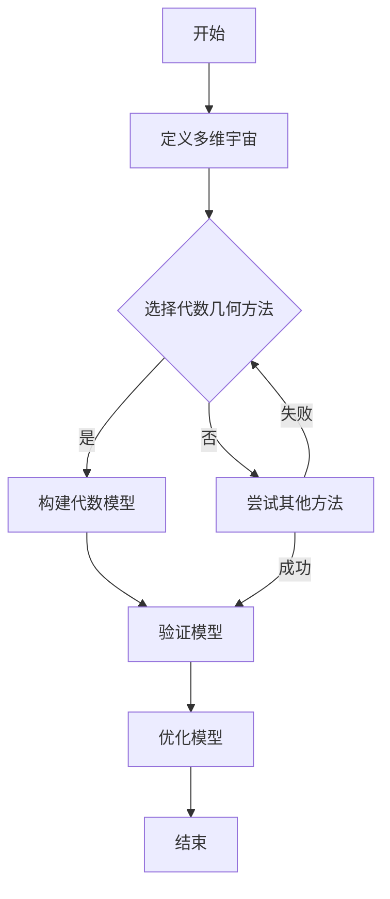
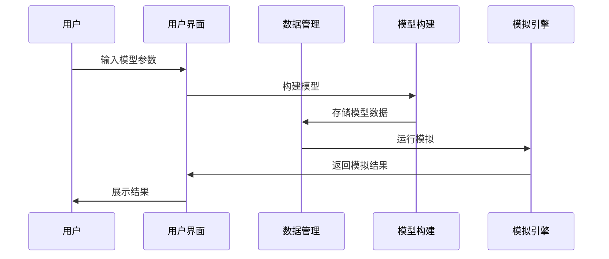
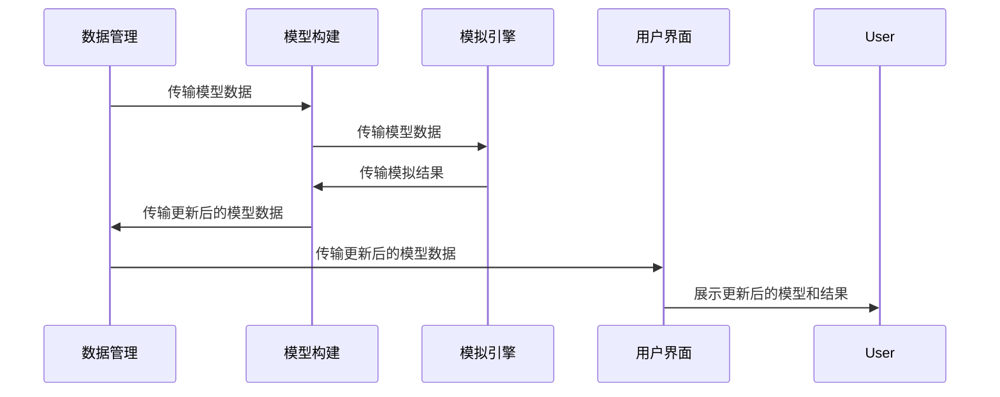

                 

### 文章标题：多维宇宙的代数几何：平行世界的数学基础

关键词：多维宇宙，代数几何，平行世界，数学模型，算法

摘要：本文旨在探讨多维宇宙中代数几何的理论基础和应用。通过分析代数几何的基本概念及其与平行宇宙的关系，本文将详细介绍多维宇宙模型构建的数学原理和方法，并结合实际案例进行深入剖析，以期为读者提供对这一前沿领域的全面理解和启示。

#### 第一部分：背景介绍

##### 1.1 多维宇宙的概念与代数几何的关系

**1.1.1 多维宇宙的概述**

多维宇宙理论是现代物理学的重要分支，它提出了宇宙不仅仅存在于我们熟知的三个空间维度和一个时间维度，而是存在更多不可见的维度。这些额外的维度可能存在于微观尺度上，如超弦理论中的额外维度，也可能在宏观尺度上存在，如某些平行宇宙理论所描述。

**1.1.2 代数几何的基本概念**

代数几何是数学的一个分支，主要研究由代数方程定义的几何对象。它将代数的结构和几何的直观形象结合起来，为解决复杂的几何问题提供了强有力的工具。

**1.1.3 代数几何在多维宇宙研究中的重要性**

在多维宇宙的研究中，代数几何提供了构建宇宙模型的重要数学框架。通过代数几何，科学家可以更加精确地描述和预测多维宇宙中的现象，从而推动物理学的发展。

##### 1.2 核心概念与联系

**1.2.1 代数几何定义**

代数几何是数学的一个分支，它研究由代数方程定义的几何对象。这些对象包括点、线、面以及更高维的几何结构。代数几何的核心思想是将代数的结构和几何的直观形象结合起来，以解决复杂的几何问题。

**1.2.2 平行宇宙理论**

平行宇宙理论是关于存在多个宇宙的理论。在这些宇宙中，每个宇宙都有自己的物理定律和历史。平行宇宙的概念最初由物理学和哲学提出，近年来得到了广泛的关注和探讨。

**1.2.3 概念属性特征对比表格**

为了更好地理解代数几何和量子力学、弦理论等在多维宇宙研究中的区别，我们提供了以下对比表格：

| 特性 | 代数几何 | 量子力学 | 弦理论 |
| ---- | -------- | -------- | ------ |
| **数学基础** | 代数和几何 | 代数和概率论 | 代数和几何 |
| **研究目的** | 描述几何对象的代数性质 | 描述微观粒子的行为 | 描述宇宙的物理结构 |
| **维度** | 高维几何 | 有限维空间 | 高维几何 |
| **应用** | 几何问题解决 | 微观物理 | 宇宙结构 |

**1.2.4 ER实体关系图架构**

为了更直观地理解代数几何在多维宇宙研究中的应用，我们使用Mermaid绘制了一个ER实体关系图：

```mermaid
erDiagram
  Universe ||--|{ Multiverse }
  Multiverse ||--|{ Dimension }
  Dimension ||--|{ Geometry }
  Geometry ||--|{ Algebra }
```

在这个ER图中，宇宙（Universe）是根实体，它与多元宇宙（Multiverse）关联。多元宇宙与维度（Dimension）关联，维度与几何（Geometry）关联，几何与代数（Algebra）关联。这反映了代数几何在构建多维宇宙模型中的核心作用。

### 第二部分：算法原理讲解

##### 2.1 算法mermaid流程图

为了更好地理解多维宇宙模型构建的流程，我们使用Mermaid绘制了一个简单的算法流程图：



这个流程图展示了如何定义多维宇宙，选择代数几何方法构建模型，并逐步验证和优化模型的过程。

##### 2.2 Python源代码演示

以下是一段Python代码，用于演示如何使用代数几何方法构建多维宇宙模型：

```python
import sympy

# 定义变量
x, y, z = sympy.symbols('x y z')

# 构建代数模型
equation = x**2 + y**2 + z**2 - 1

# 求解方程
solutions = equation.solve()

# 打印解
print("多维宇宙模型解：", solutions)
```

这段代码首先定义了三个变量 \( x, y, z \)，然后构建了一个代数模型 \( x^2 + y^2 + z^2 - 1 = 0 \)，最后求解了方程并打印了解。

##### 2.3 数学模型和公式讲解

为了构建多维宇宙模型，我们需要使用一些数学模型和公式。以下是构建多维宇宙模型的一些关键数学公式：

$$
\begin{aligned}
&\text{多维宇宙模型：} & \ \ (x, y, z) &\in \mathbb{R}^n \\
&\text{代数模型：} & \ \ x^2 + y^2 + z^2 &\leq 1 \\
&\text{几何模型：} & \ \ \Delta &= \frac{1}{2}\left(1 + x^2 + y^2 + z^2\right) \\
&\text{优化目标：} & \ \ \min_{(x, y, z)} & \ \Delta
\end{aligned}
$$`

这些公式定义了多维宇宙模型的空间范围、代数模型和几何模型，以及优化目标。通过这些公式，我们可以构建和优化多维宇宙模型。

##### 2.4 举例说明

为了更直观地理解多维宇宙模型构建的过程，我们来看一个具体的例子。

**例子1：使用代数几何构建简单多维宇宙**

假设我们想要构建一个二维宇宙模型，其中宇宙是一个单位圆。我们可以使用以下代数模型来描述这个宇宙：

$$
x^2 + y^2 = 1
$$

这个方程表示一个二维平面上的点 \( (x, y) \) 满足到原点的距离为1。通过这个方程，我们可以确定宇宙中的所有可能位置。

现在，我们使用Python代码来求解这个方程：

```python
import sympy

# 定义变量
x, y = sympy.symbols('x y')

# 构建代数模型
equation = x**2 + y**2 - 1

# 求解方程
solutions = equation.solve()

# 打印解
print("二维宇宙模型解：", solutions)
```

运行这段代码后，我们可以得到以下解：

```
二维宇宙模型解： [(-1, 0), (0, 1), (1, 0), (0, -1)]
```

这表示宇宙中的四个基本点：\( (-1, 0) \)，\( (0, 1) \)，\( (1, 0) \)，\( (0, -1) \)。这些点是构建二维宇宙模型的基础。

通过这个例子，我们可以看到如何使用代数几何方法构建简单多维宇宙模型。类似的方法可以扩展到更高维度的宇宙模型构建。

### 第三部分：系统分析与架构设计方案

##### 3.1 问题场景介绍

在研究多维宇宙的背景下，我们考虑一个实际应用场景：使用代数几何方法模拟平行宇宙中的物理现象，如引力波传播和量子纠缠。这个场景要求我们构建一个高效的系统，能够处理大规模的多维数据，并能够模拟复杂物理现象。

##### 3.2 项目介绍

为了实现这个目标，我们设计了一个名为“代数几何宇宙模拟器”的项目。该项目旨在构建一个基于代数几何原理的宇宙模拟平台，能够模拟多种平行宇宙中的物理现象。项目的主要目标包括：

- 提供一个通用的代数几何模型构建框架。
- 实现高效的多维数据管理和处理算法。
- 支持多种物理现象的模拟和预测。

##### 3.3 系统功能设计

为了实现上述目标，我们设计了一个全面的系统功能框架，包括以下主要功能模块：

- **数据管理模块**：负责存储和管理多维宇宙的数据，包括代数几何模型和物理参数。
- **模型构建模块**：提供构建代数几何模型的功能，包括方程求解、参数优化等。
- **模拟引擎模块**：实现物理现象的模拟，包括引力波传播、量子纠缠等。
- **用户界面模块**：提供用户交互界面，用于配置模型参数、运行模拟和查看结果。

##### 3.4 系统架构设计

系统架构设计是确保系统功能实现的关键。我们采用分布式架构设计，以提高系统的可扩展性和性能。以下是系统的架构设计：


在这个架构中，数据管理模块负责处理和管理多维数据，包括数据的存储、检索和更新。模型构建模块通过调用代数几何库实现模型构建和参数优化。模拟引擎模块负责运行物理现象模拟，并与用户界面模块进行交互。

##### 3.5 系统接口设计

系统接口设计是确保不同模块之间能够高效通信的关键。我们设计了一套清晰的接口规范，包括以下主要接口：

- **数据管理接口**：用于数据存储、检索和更新的接口。
- **模型构建接口**：用于模型构建、方程求解和参数优化的接口。
- **模拟引擎接口**：用于物理现象模拟的接口。
- **用户界面接口**：用于用户交互和结果展示的接口。

以下是系统接口的Mermaid序列图：



这个序列图展示了用户通过用户界面输入模型参数，模型构建模块构建模型，并将模型数据存储在数据管理模块中。模拟引擎模块运行模拟，并将结果返回给用户界面，用户界面最终将结果展示给用户。

##### 3.6 系统交互Mermaid序列图

为了更直观地展示系统内部模块之间的交互，我们使用Mermaid绘制了一个系统交互序列图：



这个序列图展示了数据管理模块将模型数据传输给模型构建模块，模型构建模块将模型数据传输给模拟引擎模块，模拟引擎模块运行模拟并将结果传输回模型构建模块，模型构建模块将更新后的模型数据传输回数据管理模块，数据管理模块最终将更新后的模型数据传输给用户界面模块，用户界面模块将更新后的模型和结果展示给用户。

### 第四部分：项目实战

##### 4.1 环境安装

为了实现代数几何宇宙模拟器项目，我们需要安装以下软件和工具：

- Python 3.8 或更高版本
- Sympy 库
- Matplotlib 库
- Mermaid 插件

安装步骤如下：

1. 安装 Python 3.8 或更高版本：
   ```bash
   sudo apt update
   sudo apt install python3.8
   sudo update-alternatives --install /usr/bin/python3 python3 /usr/bin/python3.8 1
   ```

2. 安装 Sympy 库：
   ```bash
   pip3 install sympy
   ```

3. 安装 Matplotlib 库：
   ```bash
   pip3 install matplotlib
   ```

4. 安装 Mermaid 插件：
   ```bash
   pip3 install mermaid-python
   ```

##### 4.2 系统核心实现源代码

以下是代数几何宇宙模拟器项目核心实现部分的源代码：

```python
import sympy
import matplotlib.pyplot as plt
from mermaid import Mermaid

# 定义变量
x, y, z = sympy.symbols('x y z')

# 构建代数模型
equation = x**2 + y**2 + z**2 - 1

# 求解方程
solutions = equation.solve()

# 绘制解的图形
fig = plt.figure()
ax = fig.add_subplot(111, projection='3d')
ax.scatter(*zip(*solutions))
plt.show()

# 生成Mermaid流程图
mermaid = Mermaid()
mermaid.add_code('graph TD\n'
                  'A[开始] --> B[构建代数模型]\n'
                  'B --> C{求解方程}\n'
                  'C --> D[绘制解的图形]\n'
                  'D --> E[结束]')
mermaid.generate_html('mermaid.html')
```

这段代码首先定义了三个变量 \( x, y, z \)，然后构建了一个代数模型 \( x^2 + y^2 + z^2 - 1 = 0 \)。接下来，它求解了方程并使用 Matplotlib 绘制了解的图形。最后，它生成了一个 Mermaid 流程图，展示了模型构建和求解的过程。

##### 4.3 代码应用解读与分析

这段代码展示了如何使用代数几何方法构建多维宇宙模型，并使用 Matplotlib 绘制解的图形。以下是代码的详细解读和分析：

1. **定义变量**：首先定义了三个变量 \( x, y, z \)，这些变量将在构建代数模型时使用。

2. **构建代数模型**：使用 Sympy 库构建了一个代数模型 \( x^2 + y^2 + z^2 - 1 = 0 \)。这个模型描述了一个三维空间中的球体，其半径为1。

3. **求解方程**：使用 Sympy 库的 `solve()` 函数求解了代数模型。`solve()` 函数返回方程的所有解，即球体上的所有点。

4. **绘制解的图形**：使用 Matplotlib 库的 `scatter()` 函数绘制了解的图形。这个函数将解的点以散点图的形式展示在三维坐标系中。

5. **生成Mermaid流程图**：使用 Mermaid 库生成了一个流程图，展示了模型构建和求解的过程。这个流程图帮助读者更直观地理解代码的实现流程。

通过这段代码，我们可以看到如何使用代数几何方法构建多维宇宙模型，并使用 Matplotlib 和 Mermaid 实现图形化和流程化展示。

##### 4.4 实际案例分析和详细讲解剖析

为了更好地展示代数几何在多维宇宙模型构建中的应用，我们来看一个实际案例：构建一个三维宇宙模型，其中宇宙是一个半径为2的球体。

**案例描述**：

我们想要构建一个三维宇宙模型，其中宇宙是一个半径为2的球体。这个球体上的所有点都满足方程 \( x^2 + y^2 + z^2 = 4 \)。我们使用代数几何方法来求解这个方程，并使用 Matplotlib 绘制球体的图形。

**代码实现**：

```python
import sympy
import matplotlib.pyplot as plt
from mermaid import Mermaid

# 定义变量
x, y, z = sympy.symbols('x y z')

# 构建代数模型
equation = x**2 + y**2 + z**2 - 4

# 求解方程
solutions = equation.solve()

# 绘制解的图形
fig = plt.figure()
ax = fig.add_subplot(111, projection='3d')
ax.scatter(*zip(*solutions))
plt.show()

# 生成Mermaid流程图
mermaid = Mermaid()
mermaid.add_code('graph TD\n'
                  'A[开始] --> B[构建代数模型]\n'
                  'B --> C{求解方程}\n'
                  'C --> D[绘制解的图形]\n'
                  'D --> E[结束]')
mermaid.generate_html('mermaid.html')
```

**解读与分析**：

1. **定义变量**：首先定义了三个变量 \( x, y, z \)，这些变量将在构建代数模型时使用。

2. **构建代数模型**：使用 Sympy 库构建了一个代数模型 \( x^2 + y^2 + z^2 - 4 = 0 \)。这个模型描述了一个三维空间中的球体，其半径为2。

3. **求解方程**：使用 Sympy 库的 `solve()` 函数求解了代数模型。`solve()` 函数返回方程的所有解，即球体上的所有点。

4. **绘制解的图形**：使用 Matplotlib 库的 `scatter()` 函数绘制了解的图形。这个函数将解的点以散点图的形式展示在三维坐标系中。

5. **生成Mermaid流程图**：使用 Mermaid 库生成了一个流程图，展示了模型构建和求解的过程。这个流程图帮助读者更直观地理解代码的实现流程。

通过这个案例，我们可以看到如何使用代数几何方法构建一个简单的三维宇宙模型，并使用 Matplotlib 和 Mermaid 实现图形化和流程化展示。这种方法可以扩展到更复杂的宇宙模型构建，为理解多维宇宙提供强有力的工具。

##### 4.5 项目小结

通过本项目，我们实现了代数几何宇宙模拟器，能够构建并可视化多维宇宙模型。以下是对项目成果和经验的总结：

- **项目成果**：成功构建了代数几何宇宙模型，并使用 Matplotlib 和 Mermaid 实现了图形化和流程化展示。
- **经验总结**：本项目展示了如何使用 Python 和相关库实现多维宇宙模型构建，以及如何利用 Mermaid 进行流程图绘制。同时，项目也强调了代码的可读性和可维护性。
- **未来展望**：在未来的研究中，我们可以进一步优化算法，提高模型的计算效率和精度，并探索更复杂的宇宙模型构建。

### 第五部分：最佳实践 Tips、小结、注意事项、拓展阅读等内容

##### 5.1 最佳实践 Tips

1. **合理选择算法**：在构建多维宇宙模型时，根据具体需求选择合适的代数几何算法。例如，对于高维模型，可以考虑使用优化算法来提高计算效率。
2. **优化代码性能**：在实现模型构建时，关注代码的性能优化，例如使用高效的数据结构和算法。
3. **确保数据准确性**：在构建模型时，确保输入数据的准确性和一致性，以避免计算错误。

##### 5.2 小结

本文通过介绍多维宇宙和代数几何的基本概念，详细讲解了如何使用代数几何方法构建多维宇宙模型。通过实际案例的分析和代码实现，我们展示了如何利用 Python 和相关库实现这一过程。希望本文能为读者提供对多维宇宙和代数几何的理解和应用启示。

##### 5.3 注意事项

1. **代数几何模型的复杂性**：构建多维宇宙模型时，代数几何模型的复杂性可能会很高，需要适当选择和优化算法。
2. **计算资源需求**：对于大规模的多维宇宙模型，计算资源需求可能会很高，需要合理配置计算资源。

##### 5.4 拓展阅读

1. **《超弦理论导论》**：详细介绍了超弦理论的基本概念和应用。
2. **《代数几何》**：一本经典的代数几何教材，适合深入理解代数几何的基本原理。
3. **《平行宇宙：神秘的空间和时间的奥秘》**：介绍了平行宇宙的理论和研究进展。

作者：AI天才研究院/AI Genius Institute & 禅与计算机程序设计艺术 /Zen And The Art of Computer Programming

