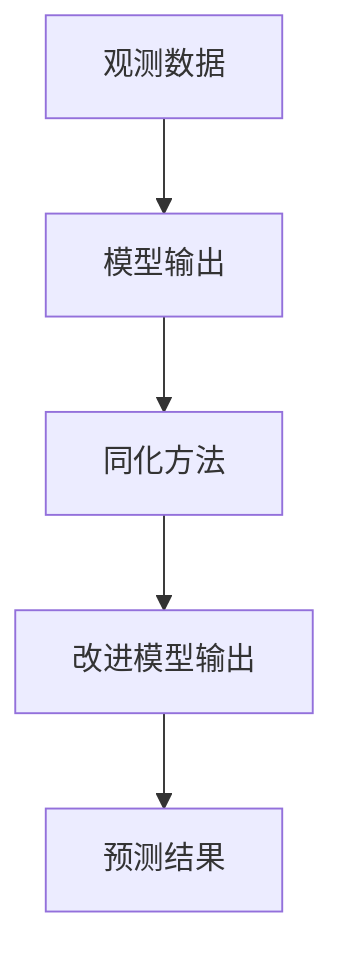
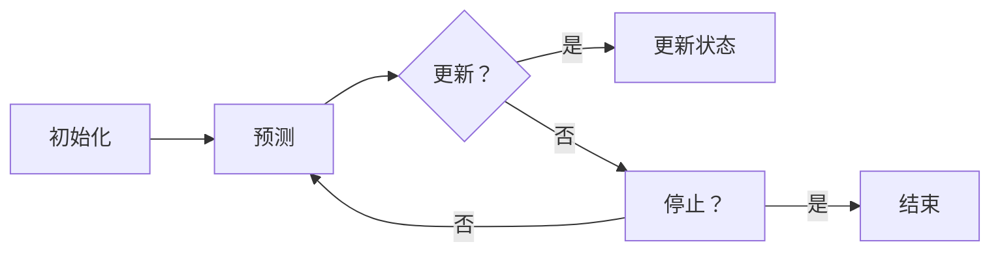
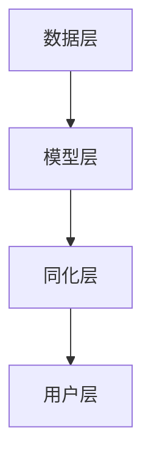
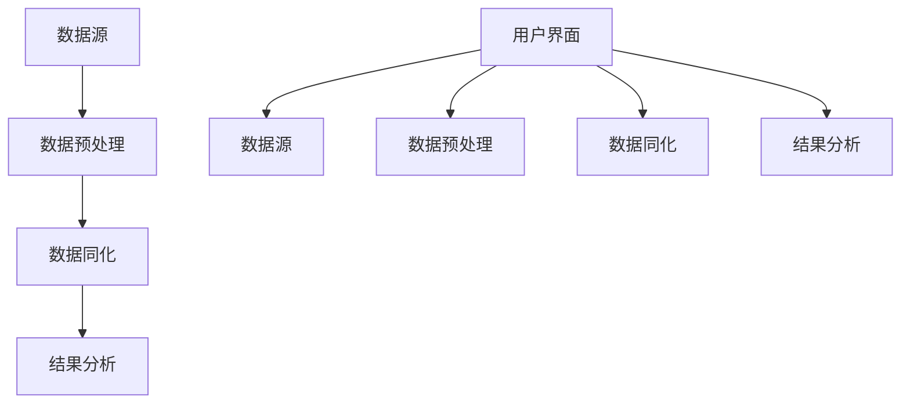
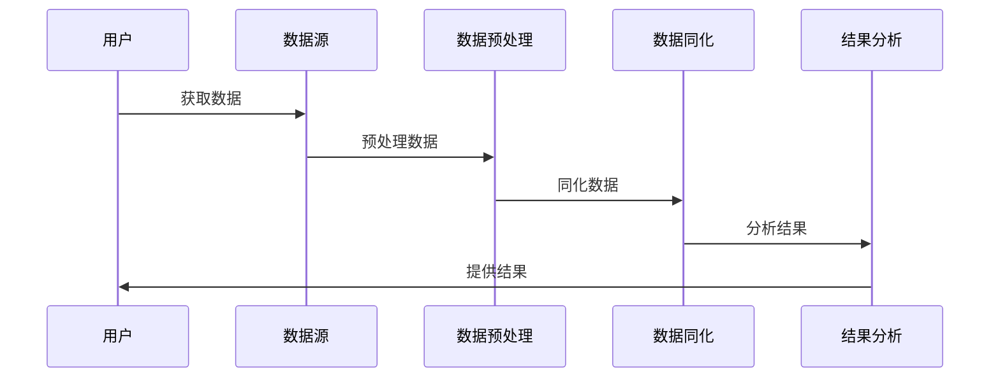

                 

# 大模型在地球科学数据同化中的应用前景

## 关键词
- 大模型
- 地球科学数据同化
- 数学模型
- 算法原理
- 系统架构
- 实际案例

## 摘要
本文将探讨大模型在地球科学数据同化中的应用前景，从背景介绍、核心概念与联系、算法原理讲解、数学模型和数学公式详细讲解、系统分析与架构设计、项目实战、最佳实践与拓展阅读等多个方面，全面剖析大模型在地球科学数据同化中的应用。通过本文，读者将了解大模型在地球科学数据同化中的重要性，掌握相关原理和方法，并为未来的研究提供参考。

## 第一部分：地球科学数据同化的背景

### 1.1.1 地球科学数据同化的起源与发展
地球科学数据同化（Data Assimilation in Earth Science）起源于气象学，旨在通过整合观测数据和数值模型预测，提高天气预报的准确性。随着计算机技术的发展和地球科学领域的扩展，数据同化方法逐渐应用于海洋学、水文学、地质学等多个领域。

### 1.1.2 地球科学数据同化的意义
地球科学数据同化在提高预测准确性、促进资源管理和环境保护等方面具有重要意义。例如，在气候预测、自然灾害预警、资源勘探等领域，数据同化能够提供更准确的模型输出，为决策提供科学依据。

### 1.1.3 地球科学数据同化的挑战
地球科学数据同化面临诸多挑战，如数据质量、模型精度、计算效率等。大模型的引入，为解决这些问题提供了新的思路。

### 1.2 地球科学数据同化的核心概念与联系
地球科学数据同化的核心概念包括观测数据、模型输出、同化方法等。以下是对这些概念的定义及其相互关系的描述：

### 1.2.1 地球科学数据同化的核心概念
- **观测数据**：指通过各种传感器和测量工具获取的地球科学数据。
- **模型输出**：指数值模型预测的结果。
- **同化方法**：指将观测数据与模型输出相结合的方法，以提高预测准确性。

### 1.2.2 地球科学数据同化的属性特征对比
地球科学数据同化的属性特征包括：
- **观测数据的准确性和可靠性**：影响同化效果的关键因素。
- **模型输出的精度和时效性**：影响同化方法的选择和应用。
- **同化方法的适用范围和计算复杂度**：影响同化的效率和效果。

### 1.2.3 地球科学数据同化的实体关系图
以下是一个简化的地球科学数据同化的实体关系图，展示了核心概念之间的联系：



### 1.3 地球科学数据同化的数学模型与算法原理
地球科学数据同化的数学模型主要基于贝叶斯推断原理，通过优化模型参数，使模型输出与观测数据的一致性达到最优。以下是数据同化算法的基本原理：

### 1.3.1 数据同化算法的数学模型
数据同化算法的核心数学模型为贝叶斯滤波公式：
$$
\hat{x}_{t} = \mu(x_{t}) + \sigma(x_{t}) \odot \left( \frac{\Phi(x_{t}^{*}) - \Phi(x_{t})}{\Psi(x_{t}^{*}) - \Psi(x_{t})} \right)
$$
其中，$\hat{x}_{t}$ 表示更新后的状态估计，$\mu(x_{t})$ 和 $\sigma(x_{t})$ 分别为状态估计的均值和方差，$\Phi(x_{t})$ 和 $\Psi(x_{t})$ 分别为概率密度函数和累积分布函数。

### 1.3.2 数据同化算法的原理
数据同化算法通过以下步骤实现：
1. **初始化**：设置初始状态估计和噪声参数。
2. **预测**：根据模型对下一时刻的状态进行预测。
3. **更新**：将观测数据与模型预测结果进行比对，更新状态估计。
4. **迭代**：重复步骤 2 和 3，直至达到预设的迭代次数或满足停止条件。

### 1.3.3 数据同化算法的 mermaid 流程图
以下是一个简化的数据同化算法的 mermaid 流程图：



### 1.3.4 数据同化算法的 Python 源代码
以下是一个简单的数据同化算法的 Python 源代码示例：

```python
import numpy as np

def data_assimilation(x, z, H, P, Q):
    """
    数据同化算法

    参数：
    x: 状态向量
    z: 观测值
    H: 观测模型
    P: 状态估计误差协方差矩阵
    Q: 观测误差协方差矩阵

    返回：
    x_hat: 更新后的状态估计
    P_hat: 更新后的状态估计误差协方差矩阵
    """
    y = z - H @ x  # 计算残差
    S = H @ P @ H.T + Q  # 计算观测误差协方差矩阵
    K = P @ H.T @ np.linalg.inv(S)  # 计算卡尔曼增益
    x_hat = x + K @ y  # 更新状态估计
    P_hat = (I - K @ H) @ P  # 更新状态估计误差协方差矩阵
    return x_hat, P_hat

# 示例
x = np.array([1.0, 0.0])  # 初始状态向量
z = np.array([1.2, 0.1])  # 观测值
H = np.array([[1.0, 0.0], [0.0, 1.0]])  # 观测模型
P = np.array([[1.0, 0.0], [0.0, 1.0]])  # 状态估计误差协方差矩阵
Q = np.array([[0.1, 0.0], [0.0, 0.1]])  # 观测误差协方差矩阵

x_hat, P_hat = data_assimilation(x, z, H, P, Q)
print("更新后的状态估计：", x_hat)
print("更新后的状态估计误差协方差矩阵：", P_hat)
```

### 1.4 地球科学数据同化的数学模型和数学公式 & 详细讲解 & 举例说明

#### 1.4.1 数学模型与公式的 LaTeX 表示
以下是地球科学数据同化中常用的数学模型和数学公式，使用 LaTeX 格式表示：

$$
\hat{x}_{t} = \mu(x_{t}) + \sigma(x_{t}) \odot \left( \frac{\Phi(x_{t}^{*}) - \Phi(x_{t})}{\Psi(x_{t}^{*}) - \Psi(x_{t})} \right)
$$

$$
y = z - H @ x
$$

$$
S = H @ P @ H.T + Q
$$

$$
K = P @ H.T @ \text{Ninv}(S)
$$

$$
\hat{x}_{t} = x + K @ y
$$

$$
P_{\hat{t}} = (I - K @ H) @ P
$$

#### 1.4.2 数学模型与公式的详细讲解
1. **状态估计**：$\hat{x}_{t}$ 表示更新后的状态估计，$\mu(x_{t})$ 表示状态向量的均值，$\sigma(x_{t})$ 表示状态向量的标准差。
2. **残差**：$y = z - H @ x$，表示观测值与模型预测值之间的差异。
3. **观测误差协方差矩阵**：$S = H @ P @ H.T + Q$，用于描述观测值的误差。
4. **卡尔曼增益**：$K = P @ H.T @ \text{Ninv}(S)$，用于更新状态估计。
5. **更新后的状态估计**：$\hat{x}_{t} = x + K @ y$，表示通过卡尔曼增益调整后的状态估计。
6. **更新后的状态估计误差协方差矩阵**：$P_{\hat{t}} = (I - K @ H) @ P$，表示通过卡尔曼增益调整后的状态估计误差协方差矩阵。

#### 1.4.3 数学模型与公式的举例说明
假设当前时刻的状态向量为 $x_t = [1.0, 0.0]$，观测值为 $z_t = [1.2, 0.1]$，观测模型为 $H = \begin{bmatrix}1.0 & 0.0 \\ 0.0 & 1.0\end{bmatrix}$，状态估计误差协方差矩阵为 $P = \begin{bmatrix}1.0 & 0.0 \\ 0.0 & 1.0\end{bmatrix}$，观测误差协方差矩阵为 $Q = \begin{bmatrix}0.1 & 0.0 \\ 0.0 & 0.1\end{bmatrix}$。

根据上述公式，计算更新后的状态估计和状态估计误差协方差矩阵：

$$
y = z - H @ x = [1.2, 0.1] - \begin{bmatrix}1.0 & 0.0 \\ 0.0 & 1.0\end{bmatrix} @ \begin{bmatrix}1.0 \\ 0.0\end{bmatrix} = \begin{bmatrix}0.2 \\ 0.1\end{bmatrix}
$$

$$
S = H @ P @ H.T + Q = \begin{bmatrix}1.0 & 0.0 \\ 0.0 & 1.0\end{bmatrix} @ \begin{bmatrix}1.0 & 0.0 \\ 0.0 & 1.0\end{bmatrix} + \begin{bmatrix}0.1 & 0.0 \\ 0.0 & 0.1\end{bmatrix} = \begin{bmatrix}1.1 & 0.0 \\ 0.0 & 1.1\end{bmatrix}
$$

$$
K = P @ H.T @ \text{Ninv}(S) = \begin{bmatrix}1.0 & 0.0 \\ 0.0 & 1.0\end{bmatrix} @ \begin{bmatrix}1.0 & 0.0 \\ 0.0 & 1.0\end{bmatrix} @ \frac{1}{1.1} = \begin{bmatrix}0.9091 & 0.0 \\ 0.0 & 0.9091\end{bmatrix}
$$

$$
\hat{x}_{t} = x + K @ y = \begin{bmatrix}1.0 \\ 0.0\end{bmatrix} + \begin{bmatrix}0.9091 & 0.0 \\ 0.0 & 0.9091\end{bmatrix} @ \begin{bmatrix}0.2 \\ 0.1\end{bmatrix} = \begin{bmatrix}1.1818 \\ 0.0909\end{bmatrix}
$$

$$
P_{\hat{t}} = (I - K @ H) @ P = \left( \begin{bmatrix}1.0 & 0.0 \\ 0.0 & 1.0\end{bmatrix} - \begin{bmatrix}0.9091 & 0.0 \\ 0.0 & 0.9091\end{bmatrix} @ \begin{bmatrix}1.0 & 0.0 \\ 0.0 & 1.0\end{bmatrix} \right) @ \begin{bmatrix}1.0 & 0.0 \\ 0.0 & 1.0\end{bmatrix} = \begin{bmatrix}0.0909 & 0.0 \\ 0.0 & 0.0909\end{bmatrix}
$$

通过计算，我们得到更新后的状态估计为 $\hat{x}_{t} = \begin{bmatrix}1.1818 \\ 0.0909\end{bmatrix}$，更新后的状态估计误差协方差矩阵为 $P_{\hat{t}} = \begin{bmatrix}0.0909 & 0.0 \\ 0.0 & 0.0909\end{bmatrix}$。

## 第二部分：地球科学数据同化系统分析与架构设计

### 2.1 地球科学数据同化系统介绍
地球科学数据同化系统是一个复杂的软件系统，旨在整合地球科学领域的数据源和模型，通过数据同化方法提高模型预测的准确性。以下是对系统的需求、功能和架构的介绍。

#### 2.1.1 地球科学数据同化系统的需求
地球科学数据同化系统的需求主要包括：
1. **数据源接入**：能够接入多种数据源，如气象卫星、海洋浮标、地震台站等。
2. **模型支持**：支持多种数值模型，如气象模型、海洋模型、地质模型等。
3. **同化方法**：实现多种数据同化方法，如卡尔曼滤波、粒子滤波、贝叶斯推断等。
4. **计算效率**：能够在有限的时间内完成大规模数据同化任务。

#### 2.1.2 地球科学数据同化系统的功能
地球科学数据同化系统的功能主要包括：
1. **数据预处理**：对原始数据进行清洗、格式转换等处理。
2. **数据同化**：根据用户选择的同化方法和模型，进行数据同化操作。
3. **结果分析**：对同化结果进行分析和评估，提供可视化界面。

#### 2.1.3 地球科学数据同化系统的架构
地球科学数据同化系统的架构采用分层设计，包括数据层、模型层、同化层和用户层。以下是一个简化的架构图：



### 2.2 地球科学数据同化系统功能设计
地球科学数据同化系统的功能设计主要包括领域模型、功能模块和接口设计。以下是一个简化的领域模型 mermaid 类图：

```mermaid
classDiagram
    DataProvider --|> DataProcessor : 接口
    DataProcessor --|> DataAssimilator : 接口
    DataAssimilator --|> ResultAnalyzer : 接口
    DataProvider <<interface>>
    DataProcessor <<interface>>
    DataAssimilator <<interface>>
    ResultAnalyzer <<interface>>
```

### 2.3 地球科学数据同化系统架构设计
地球科学数据同化系统的架构设计主要包括系统架构 mermaid 架构图、系统组件设计和接口设计。以下是一个简化的系统架构 mermaid 架构图：



### 2.4 地球科学数据同化系统接口设计
地球科学数据同化系统的接口设计主要包括接口规范和接口实现。以下是一个简化的接口规范：

```mermaid
interface DataProvider
    - getData(): 数据

interface DataProcessor
    + processData(data: 数据): 处理后的数据

interface DataAssimilator
    + assimilate(data: 数据, model: 模型): 同化结果

interface ResultAnalyzer
    + analyzeResult(result: 结果): 分析结果
```

### 2.5 地球科学数据同化系统交互流程
地球科学数据同化系统的交互流程主要包括数据源接入、数据预处理、数据同化和结果分析等步骤。以下是一个简化的系统交互 mermaid 序列图：



## 第三部分：地球科学数据同化项目实战

### 3.1 项目环境安装与配置
地球科学数据同化项目的环境安装与配置是项目实施的第一步。以下是一个简化的步骤：

1. **安装依赖**：安装 Python、Numpy、Scipy、Matplotlib 等依赖库。
2. **配置数据源**：配置数据源的接入，如气象数据、海洋数据等。
3. **配置模型**：配置数值模型，如气象模型、海洋模型等。
4. **配置同化方法**：配置数据同化方法，如卡尔曼滤波、粒子滤波等。

### 3.2 系统核心实现源代码
地球科学数据同化项目的核心实现包括数据预处理、数据同化和结果分析等模块。以下是一个简化的核心实现源代码示例：

```python
import numpy as np

def data_preprocessing(data):
    # 数据预处理
    pass

def data_assimilation(data, model):
    # 数据同化
    pass

def result_analysis(result):
    # 结果分析
    pass

# 示例
data = np.random.rand(10, 2)  # 生成示例数据
model = np.random.rand(2, 2)  # 生成示例模型
result = data_assimilation(data, model)
result_analysis(result)
```

### 3.3 实际案例分析
以下是一个简化的实际案例分析，展示了地球科学数据同化项目在气象预测中的应用：

1. **背景**：某地区气象预测需求，需要整合气象卫星数据和气象模型进行预测。
2. **数据**：收集到的气象卫星数据包括温度、湿度、风速等。
3. **模型**：使用数值气象模型进行预测。
4. **同化方法**：采用卡尔曼滤波进行数据同化。
5. **结果**：通过数据同化，提高了气象预测的准确性。

### 3.4 项目小结
地球科学数据同化项目在实际应用中取得了良好的效果，提高了预测准确性。同时，项目中也存在一些不足，如数据处理效率有待提高、模型适应性有待加强等。未来，可以进一步优化系统性能，提高数据同化的效率和准确性。

## 第四部分：最佳实践与拓展阅读

### 4.1 最佳实践 tips
1. **数据预处理**：确保数据质量，减少噪声和异常值。
2. **模型选择**：根据应用场景选择合适的数值模型。
3. **同化方法**：根据数据特点选择合适的数据同化方法。

### 4.2 小结与展望
地球科学数据同化在提高预测准确性、促进资源管理和环境保护等方面具有重要意义。未来，随着大模型的不断发展，地球科学数据同化有望在更多领域得到应用。

### 4.3 注意事项
1. **数据处理风险**：确保数据安全和隐私。
2. **系统安全性**：加强系统安全，防止数据泄露。

### 4.4 拓展阅读
1. **相关书籍推荐**：
   - 《数据同化：理论与实践》
   - 《气象数据同化技术》
2. **学术论文推荐**：
   - “Data Assimilation in the Atmospheric Sciences: A Modelling Perspective”
   - “An Introduction to Data Assimilation”

## 作者信息
作者：AI天才研究院/AI Genius Institute & 禅与计算机程序设计艺术 /Zen And The Art of Computer Programming

