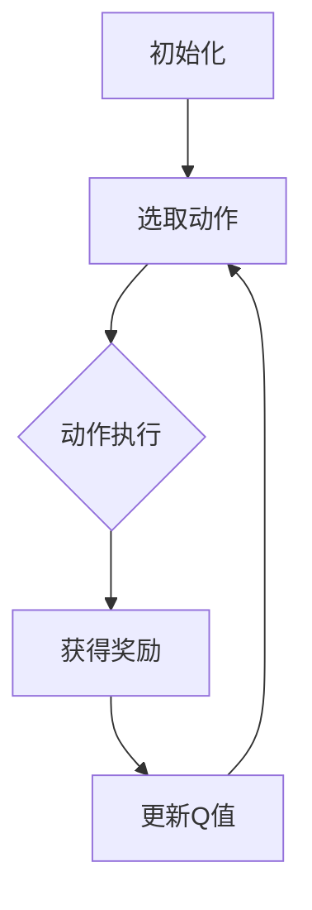
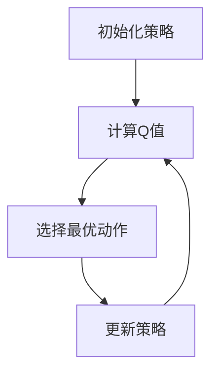
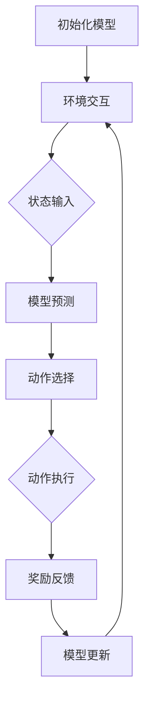
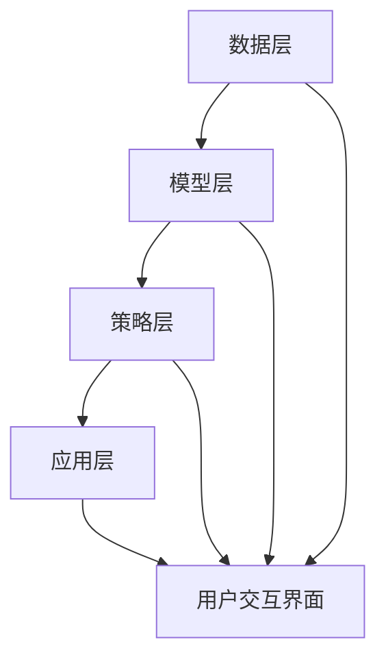
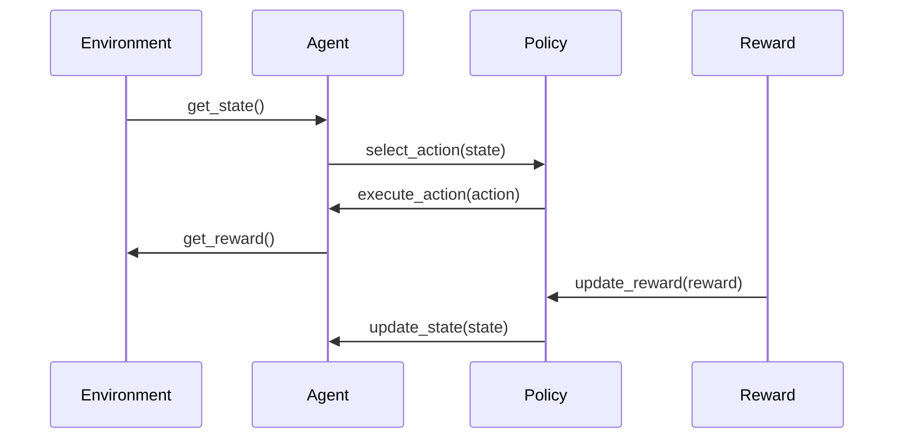
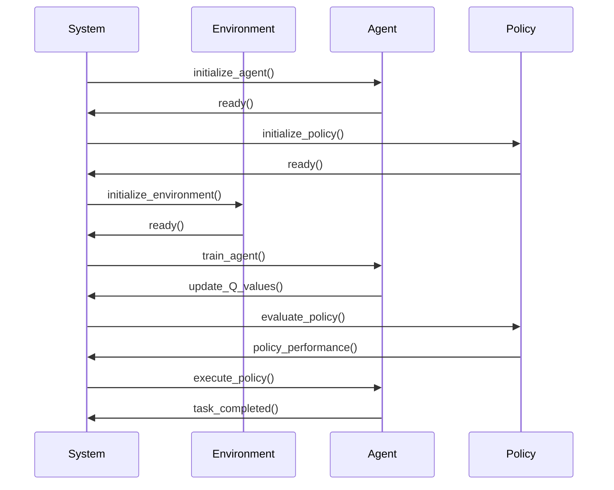

                 


### 1. 背景介绍

#### 强化学习的基本概念

强化学习（Reinforcement Learning，简称RL）是机器学习的一个重要分支，旨在通过智能体（agent）在与环境（environment）的交互过程中，学习到一种策略（policy），从而在给定情况下做出最优决策，以实现长期累积奖励最大化。与监督学习和无监督学习不同，强化学习强调学习过程中环境与智能体之间的交互作用。

强化学习的基本概念包括：

- **状态（State）**：指智能体在某一时刻所处的环境和条件。
- **动作（Action）**：智能体在某一状态下可执行的操作。
- **奖励（Reward）**：智能体执行某一动作后，从环境中获得的即时反馈信号，用于评估动作的好坏。
- **策略（Policy）**：智能体在给定状态下选择最优动作的规则。

#### 强化学习的发展历程

强化学习自1950年代阿兰·图灵（Alan Turing）提出智能体概念以来，经历了数十年的发展。以下是几个重要的里程碑：

- **1956年**：美国计算机科学家约翰·麦卡锡（John McCarthy）提出了强化学习的概念，并将其视为人工智能的一个重要研究方向。
- **1980年代**：随着计算机性能的提升，强化学习领域出现了大量的算法，如Q学习、策略迭代、深度强化学习等。
- **2010年代**：深度强化学习（Deep Reinforcement Learning，简称DRL）成为研究热点，通过结合深度学习（Deep Learning）方法，强化学习在复杂环境中的表现得到了显著提升。

#### 强化学习在计算机科学中的重要性

强化学习在计算机科学领域具有重要地位，原因如下：

- **智能决策**：强化学习通过智能体与环境交互，能够实现自适应的智能决策，广泛应用于游戏、机器人、自动驾驶等领域。
- **连续决策**：与监督学习和无监督学习不同，强化学习能够处理连续的、动态变化的决策问题，具有更广泛的应用前景。
- **泛化能力**：强化学习通过在复杂环境中学习到策略，能够实现良好的泛化能力，具有较强的适应性和鲁棒性。

#### 大模型在强化学习中的角色

随着计算能力的提升和大数据技术的发展，大模型（如深度神经网络）在强化学习中的应用逐渐得到重视。大模型在强化学习中的角色主要体现在：

- **状态表示**：大模型能够捕捉到状态的高维度特征，为智能体提供更丰富的信息，有助于提高决策质量。
- **动作选择**：大模型能够通过学习到状态与动作之间的映射关系，实现更高效的动作选择，从而提升智能体的性能。
- **策略优化**：大模型在策略优化过程中，能够自适应地调整策略参数，实现更精准的决策。

当前，大模型在强化学习领域的研究热点主要集中在以下几个方面：

- **预训练与微调**：通过在大规模数据集上预训练大模型，然后在特定任务上进行微调，以实现更好的性能。
- **多任务学习**：利用大模型进行多任务学习，实现任务间的知识迁移和共享，提高模型的泛化能力。
- **分布式学习**：利用分布式计算技术，加速大模型在强化学习中的应用，降低计算成本。

### 2. 核心概念与联系

在强化学习领域，有若干核心概念，它们相互关联，共同构成了强化学习的基础理论框架。以下是对这些核心概念的详细说明以及它们之间的联系。

#### 关键术语定义

1. **强化学习（Reinforcement Learning）**：
   强化学习是一种机器学习方法，通过智能体（agent）与环境的交互来学习最优策略。强化学习过程包括状态（state）、动作（action）、奖励（reward）和策略（policy）等基本要素。

2. **状态（State）**：
   状态是智能体在某一时刻所处的环境条件，通常用一组特征向量来表示。状态决定了智能体可以执行哪些动作。

3. **动作（Action）**：
   动作是智能体在某一状态下可以执行的操作。动作的选择由策略决定，策略是智能体根据状态选择的动作规则。

4. **奖励（Reward）**：
   奖励是环境对智能体执行动作后的即时反馈，用于评估动作的好坏。奖励通常是一个标量，表示动作的价值。

5. **策略（Policy）**：
   策略是智能体在给定状态下选择最优动作的规则。策略可以是确定性的，也可以是概率性的。策略的好坏决定了智能体在环境中的表现。

6. **价值函数（Value Function）**：
   价值函数是衡量智能体从某一状态执行某一动作后的长期累积奖励的预测值。价值函数分为状态价值函数（State-Value Function）和动作价值函数（Action-Value Function）。

7. **模型（Model）**：
   模型是对环境的抽象表示，用于预测环境状态转移概率和奖励。强化学习算法可以通过模型预测来优化策略。

#### 概念属性特征对比表格

为了更好地理解这些核心概念，我们可以通过对比表格来展示它们之间的属性特征差异：

| 概念       | 定义                   | 特征                   | 相关关系                 |
|------------|------------------------|------------------------|-------------------------|
| 状态       | 环境条件               | 高维度、动态变化       | 状态决定动作            |
| 动作       | 可执行操作             | 多样性、不确定性       | 动作选择受策略影响     |
| 奖励       | 环境反馈               | 瞬时、标量             | 奖励影响价值函数       |
| 策略       | 动作选择规则           | 确定性或概率性         | 策略决定动作质量       |
| 价值函数   | 预测累积奖励           | 预测、优化目标         | 价值函数指导策略优化   |
| 模型       | 环境抽象表示           | 预测、优化环境响应     | 模型辅助策略学习       |

#### ER实体关系图架构

为了更直观地展示这些概念之间的联系，我们可以使用ER（实体关系）图来表示：

```mermaid
erDiagram
  State ||--|{ Action }|| Policy
  Action ||--|{ Reward }|| Environment
  Reward ||--|{ Value Function }|| Agent
  Agent ||--|{ Model }|| Environment
```

在上面的ER图中，State（状态）与Action（动作）之间有一对多的关系，即一个状态可以对应多个动作。Action（动作）与Policy（策略）之间是关联关系，策略决定了动作的选择。Reward（奖励）与Value Function（价值函数）之间也是关联关系，奖励影响了价值函数的更新。Agent（智能体）与Model（模型）之间是包含关系，智能体通过模型来理解环境并做出决策。

通过上述对比表格和ER实体关系图，我们可以清晰地看到强化学习中的核心概念及其相互关系，为进一步理解和应用强化学习算法奠定了基础。

### 3. 算法原理讲解

#### Q学习算法

Q学习算法是强化学习中最基本的算法之一，其核心思想是通过学习状态-动作值函数（Q函数）来选择最优动作。Q学习算法的流程图如下：



具体来说，Q学习算法包括以下步骤：

1. **初始化**：初始化Q值表，通常使用小值初始化。
2. **选取动作**：根据当前状态选择动作，可以使用ε-贪心策略，即在一定概率下随机选择动作，以进行探索。
3. **动作执行**：在环境中执行所选动作，获得状态转移和奖励。
4. **更新Q值**：根据新的奖励和Q值表更新Q值，使用以下公式：
   $$ Q(s, a) = Q(s, a) + \alpha [r + \gamma \max_{a'} Q(s', a') - Q(s, a)] $$
   其中，α是学习率，γ是折扣因子，r是即时奖励，s和s'是状态，a和a'是动作。

#### 策略迭代算法

策略迭代算法是一种基于Q学习的策略优化方法，其核心思想是通过迭代更新策略，使得策略逐渐逼近最优策略。策略迭代算法的流程图如下：



具体来说，策略迭代算法包括以下步骤：

1. **初始化策略**：随机选择一个初始策略。
2. **计算Q值**：根据当前策略，计算所有状态-动作对的Q值。
3. **选择最优动作**：在给定状态下，选择具有最大Q值的动作。
4. **更新策略**：根据新的Q值更新策略，使得策略逐渐逼近最优策略。

#### 深度强化学习算法

深度强化学习（Deep Reinforcement Learning，简称DRL）是强化学习与深度学习相结合的方法，其核心思想是使用深度神经网络来近似Q函数或策略。DRL算法的流程图如下：



具体来说，DRL算法包括以下步骤：

1. **初始化模型**：初始化深度神经网络模型。
2. **环境交互**：智能体与环境进行交互，获取状态。
3. **状态输入**：将当前状态输入到深度神经网络模型中。
4. **模型预测**：使用深度神经网络模型预测状态-动作值函数或策略。
5. **动作选择**：根据模型预测选择最优动作。
6. **动作执行**：在环境中执行所选动作，获得状态转移和奖励。
7. **奖励反馈**：将即时奖励反馈给智能体。
8. **模型更新**：使用新的奖励和状态更新深度神经网络模型。

#### 算法原理的Python代码实现

以下是一个简单的Q学习算法的Python代码实现，用于演示算法原理：

```python
import numpy as np

# 初始化参数
alpha = 0.1  # 学习率
gamma = 0.9  # 折扣因子
epsilon = 0.1  # 探索概率

# 初始化Q值表
n_actions = 3
n_states = 4
Q = np.zeros((n_states, n_actions))

# Q学习算法
def q_learning(env, num_episodes):
    for episode in range(num_episodes):
        state = env.reset()
        done = False
        
        while not done:
            # 随机选择动作或根据ε-贪心策略选择动作
            if np.random.rand() < epsilon:
                action = env.action_space.sample()
            else:
                action = np.argmax(Q[state])
            
            # 执行动作
            next_state, reward, done, _ = env.step(action)
            
            # 更新Q值
            Q[state, action] = Q[state, action] + alpha * (reward + gamma * np.max(Q[next_state]) - Q[state, action])
            
            state = next_state

# 创建环境
env = gym.make('CartPole-v0')

# 运行Q学习算法
q_learning(env, num_episodes=1000)

# 关闭环境
env.close()
```

在这个代码中，我们使用了OpenAI Gym创建一个简单的CartPole环境，并实现了Q学习算法。通过与环境交互，不断更新Q值表，从而学习到最优策略。

#### 数学模型和公式

在强化学习中，常用的数学模型和公式包括：

1. **Q学习算法的更新公式**：
   $$ Q(s, a) = Q(s, a) + \alpha [r + \gamma \max_{a'} Q(s', a') - Q(s, a)] $$
   
2. **策略迭代算法的更新公式**：
   $$ \pi(s) = \arg\max_{a} Q(s, a) $$
   
3. **深度强化学习中的策略梯度公式**：
   $$ \nabla_\theta J(\theta) = \nabla_\theta \sum_{t=0}^{T} \gamma^t r_t $$
   其中，θ是策略参数，J(θ)是策略损失函数，r_t是第t步的即时奖励。

通过这些数学模型和公式，我们可以更深入地理解强化学习算法的原理和实现方法。

### 4. 数学模型和数学公式

在强化学习算法中，数学模型和数学公式起着至关重要的作用，它们不仅帮助我们理解算法的原理，还为算法的实现提供了理论基础。以下将详细介绍强化学习中的数学模型和公式，并通过具体的例子进行说明。

#### Q学习算法的数学模型

Q学习算法的核心是Q值函数，它表示智能体在某一状态下执行某一动作的预期回报。Q值函数的更新公式如下：

$$ Q(s, a) = Q(s, a) + \alpha [r + \gamma \max_{a'} Q(s', a') - Q(s, a)] $$

其中：
- \( Q(s, a) \) 表示在状态 \( s \) 下执行动作 \( a \) 的Q值。
- \( \alpha \) 是学习率，用于调节每次更新对Q值的影响程度。
- \( r \) 是即时奖励，表示智能体在执行动作 \( a \) 后获得的即时回报。
- \( \gamma \) 是折扣因子，用于考虑未来奖励的现值，避免只关注短期奖励。
- \( \max_{a'} Q(s', a') \) 表示在下一个状态 \( s' \) 下能够获得的最大Q值。

例如，假设智能体在一个简单的环境中进行学习，当前状态为 \( s = (0, 0) \)，可以选择的动作有左移、右移和静止。即时奖励为 \( r = 1 \)，学习率为 \( \alpha = 0.1 \)，折扣因子为 \( \gamma = 0.9 \)。智能体执行了左移动作 \( a = 0 \)，下一个状态为 \( s' = (-1, 0) \)。此时，Q值的更新公式为：

$$ Q(0, 0) = Q(0, 0) + 0.1 [1 + 0.9 \max_{a'} Q(-1, a')] $$

通过不断更新Q值，智能体可以逐渐学习到最优策略。

#### 策略迭代算法的数学模型

策略迭代算法是一种基于Q学习的策略优化方法，它的核心思想是迭代更新策略，使得策略逐渐逼近最优策略。策略迭代算法的更新公式如下：

$$ \pi(s) = \arg\max_{a} Q(s, a) $$

其中：
- \( \pi(s) \) 是在状态 \( s \) 下采取的动作概率分布，即策略。
- \( Q(s, a) \) 是在状态 \( s \) 下执行动作 \( a \) 的Q值。

例如，假设智能体在状态 \( s = (0, 0) \) 下，有三种可能的动作：左移、右移和静止。Q值分别为 \( Q(0, 0) = 0.6 \)，\( Q(0, 1) = 0.5 \)，\( Q(0, 2) = 0.4 \)。根据策略迭代算法，智能体将在状态 \( s = (0, 0) \) 下选择具有最大Q值的动作，即左移。

#### 深度强化学习的数学模型

深度强化学习结合了深度学习和强化学习的优点，通过使用深度神经网络来近似Q值函数或策略。深度强化学习的数学模型主要涉及策略梯度的优化。策略梯度的目标是最小化策略损失函数，公式如下：

$$ \nabla_\theta J(\theta) = \nabla_\theta \sum_{t=0}^{T} \gamma^t r_t $$

其中：
- \( \theta \) 是策略网络的参数。
- \( J(\theta) \) 是策略损失函数，表示策略的期望回报。
- \( r_t \) 是第 \( t \) 步的即时奖励。
- \( \gamma \) 是折扣因子。

例如，假设智能体在一个连续动作空间中学习，策略网络参数为 \( \theta \)，即时奖励为 \( r_t = 1 \)，折扣因子为 \( \gamma = 0.9 \)。根据策略梯度公式，智能体将调整策略网络参数 \( \theta \)，以最大化期望回报。

通过上述数学模型和公式，我们可以更深入地理解强化学习算法的原理和实现方法。在实际应用中，这些公式帮助我们设计有效的学习策略，优化智能体的行为，实现长期回报的最大化。

### 5. 系统分析与架构设计方案

在强化学习领域，大模型的应用不仅能够提升智能体的决策能力，还能够优化整个系统的架构设计。为了更好地理解大模型在强化学习中的应用，我们将从应用场景、系统功能设计、系统架构设计、系统接口设计以及系统交互等方面进行详细分析。

#### 应用场景

强化学习在大模型中的应用场景非常广泛，包括但不限于以下几个方面：

1. **游戏**：在游戏领域，大模型可以用于训练智能体，使其能够掌握复杂的游戏策略，如《Dota 2》和《Atari 游戏》。
2. **机器人控制**：大模型可以用于训练机器人，使其能够适应不同的环境和任务，如自主移动、物体抓取等。
3. **自动驾驶**：在自动驾驶领域，大模型可以用于学习交通规则、环境感知和路径规划等。
4. **电商推荐**：大模型可以用于分析用户行为，为其提供个性化的推荐服务。

#### 系统功能设计

在强化学习系统中，功能设计是关键的一环。以下是强化学习系统的主要功能模块及其设计：

1. **环境模拟**：模拟真实环境，包括状态空间、动作空间和奖励机制。
2. **智能体训练**：使用大模型训练智能体，使其能够学习到最优策略。
3. **策略评估**：评估智能体的策略性能，包括策略优化和策略稳定性。
4. **用户交互**：提供用户界面，方便用户进行实验和监控系统状态。

为了更直观地展示系统功能设计，我们可以使用Mermaid类图进行表示：

```mermaid
classDiagram
    Environment <<< AbstractEnvironment
    Agent <<< AbstractAgent
    Policy <<< AbstractPolicy
    Reward <<< AbstractReward
    Interface << Interface>>
    Trainer <<< TrainerInterface
    Evaluator <<< EvaluatorInterface
    GUI <<< GUIInterface
    
    Environment --|> Agent
    Agent --|> Policy
    Policy --|> Reward
    Reward --|> Interface
    Trainer --|> Agent
    Evaluator --|> Policy
    GUI --|> Interface
```

在上面的类图中，我们定义了环境（Environment）、智能体（Agent）、策略（Policy）、奖励（Reward）和用户交互界面（GUI）等抽象类，以及具体的实现类（如Trainer、Evaluator和GUI）。这些类之间通过接口（Interface）进行通信，实现了模块化设计。

#### 系统架构设计

强化学习系统的架构设计决定了系统的可扩展性、稳定性和性能。以下是强化学习系统的架构设计：

1. **数据层**：包括数据采集、预处理和存储，为智能体训练提供数据支持。
2. **模型层**：包括大模型的构建、训练和优化，用于实现智能体的决策能力。
3. **策略层**：包括策略评估、优化和执行，用于实现智能体的行为。
4. **应用层**：包括用户交互、任务执行和结果展示，为用户提供便捷的使用体验。

为了更直观地展示系统架构，我们可以使用Mermaid架构图进行表示：



在上面的架构图中，数据层为模型层和策略层提供数据支持，模型层和策略层共同为应用层提供智能决策支持，应用层通过用户交互界面为用户提供使用体验。

#### 系统接口设计

系统接口设计是强化学习系统的重要组成部分，它决定了系统的可扩展性和灵活性。以下是强化学习系统的接口设计：

1. **环境接口**：定义了环境的基本操作，如状态获取、动作执行和奖励计算。
2. **智能体接口**：定义了智能体的基本操作，如策略选择、动作执行和状态更新。
3. **策略接口**：定义了策略的基本操作，如策略评估、优化和执行。
4. **奖励接口**：定义了奖励的基本操作，如奖励计算和奖励更新。

为了更直观地展示系统接口，我们可以使用Mermaid序列图进行表示：



在上面的序列图中，智能体从环境中获取状态，使用策略选择动作，执行动作后获取奖励，并更新状态和策略。

#### 系统交互

系统交互是强化学习系统的重要组成部分，它决定了系统的运行效率和稳定性。以下是强化学习系统的交互流程：

1. **初始化**：系统初始化，包括数据层、模型层、策略层和应用层的初始化。
2. **训练**：使用大模型对智能体进行训练，通过不断与环境交互，更新Q值函数或策略。
3. **评估**：评估智能体的策略性能，通过模拟环境或实际运行，计算策略的回报。
4. **执行**：根据评估结果，执行最优策略，实现智能体的实际任务。

为了更直观地展示系统交互流程，我们可以使用Mermaid序列图进行表示：



在上面的序列图中，系统依次初始化各个模块，然后开始训练智能体，评估策略性能，并执行最优策略。

通过以上系统分析与架构设计方案，我们可以更好地理解大模型在强化学习中的应用，并为其设计出高效、稳定的系统架构。这不仅有助于提升智能体的决策能力，还能够为实际应用提供可靠的技术支持。

### 6. 项目实战

#### 环境安装

在进行大模型在强化学习中的应用之前，我们需要安装相应的环境。以下是安装环境的详细步骤：

1. **安装Python**：首先确保你的计算机上安装了Python。Python是强化学习的基础，因此需要确保版本在3.6及以上。

2. **安装依赖库**：使用pip命令安装必要的依赖库。以下是主要的依赖库：

   ```bash
   pip install numpy matplotlib gym deepq-learning
   ```

   - **numpy**：用于科学计算和数据分析。
   - **matplotlib**：用于绘制图表和可视化。
   - **gym**：用于创建和运行强化学习环境。
   - **deepq-learning**：用于实现深度强化学习算法。

3. **验证安装**：在Python环境中导入依赖库，验证安装是否成功。

   ```python
   import numpy as np
   import matplotlib.pyplot as plt
   import gym
   import deepq
   print("依赖库安装成功！")
   ```

#### 系统核心实现源代码

以下是一个简单的深度Q学习（Deep Q-Learning，简称DQL）项目示例，用于训练智能体在Atari游戏中进行学习。代码实现了DQL算法的核心部分，包括模型构建、训练和评估。

```python
import numpy as np
import gym
from tensorflow.keras.models import Sequential
from tensorflow.keras.layers import Dense, Flatten
from tensorflow.keras.optimizers import Adam

# 创建环境
env = gym.make('AtariGame-v0')

# 定义深度Q网络
model = Sequential([
    Flatten(input_shape=(84, 84, 4)),
    Dense(256, activation='relu'),
    Dense(256, activation='relu'),
    Dense(env.action_space.n, activation='linear')
])

# 编译模型
model.compile(loss='mse', optimizer=Adam(learning_rate=0.001))

# 训练模型
num_episodes = 100
batch_size = 32
epsilon = 1.0
epsilon_min = 0.01
epsilon_decay = 0.995

for episode in range(num_episodes):
    state = env.reset()
    done = False
    total_reward = 0
    
    while not done:
        # 根据ε-贪心策略选择动作
        if np.random.rand() < epsilon:
            action = env.action_space.sample()
        else:
            action = np.argmax(model.predict(state)[0])
        
        # 执行动作
        next_state, reward, done, _ = env.step(action)
        total_reward += reward
        
        # 训练模型
        target = reward
        if not done:
            target += epsilon * np.max(model.predict(next_state)[0])
        target_f = model.predict(state)
        target_f[0][action] = target
        
        # 更新状态
        state = next_state
        
        # 更新epsilon
        epsilon = max(epsilon_min, epsilon_decay * epsilon)
    
    print(f"Episode {episode+1} Reward: {total_reward}")

# 关闭环境
env.close()
```

在这个代码中，我们首先创建了一个Atari游戏环境，然后定义了一个深度Q网络模型。在训练过程中，我们使用ε-贪心策略选择动作，并根据即时奖励和目标Q值更新模型。通过不断训练，智能体能够逐渐学习到最优策略。

#### 代码应用解读与分析

上述代码实现了深度Q学习算法的核心步骤，包括模型定义、训练和评估。以下是代码的详细解读和分析：

1. **模型定义**：使用Keras框架定义了一个深度Q网络模型，包括两个隐藏层，每层的神经元数量分别为256和256。输出层有与动作空间大小相等的神经元，用于预测每个动作的Q值。

2. **模型编译**：使用均方误差（MSE）作为损失函数，Adam优化器进行模型编译。学习率设置为0.001，以平衡探索和利用。

3. **训练模型**：使用100个训练episode，每个episode中智能体从初始状态开始，根据ε-贪心策略选择动作，并不断更新状态和模型。每个episode的奖励累加，作为训练过程的反馈。

4. **更新epsilon**：在训练过程中，epsilon用于控制探索和利用的平衡。epsilon从1开始，随着训练的进行逐渐减小，以减少随机动作的概率，提高智能体的决策稳定性。

5. **代码优化**：在实际应用中，可以进一步优化代码，如使用经验回放（Experience Replay）机制，避免训练数据的关联性，提高模型的泛化能力。此外，还可以使用更复杂的网络结构和训练策略，以提升智能体的性能。

通过这个示例项目，我们可以看到大模型在强化学习中的应用是如何实现的。在复杂环境中，大模型能够通过学习和适应，实现智能体的自主决策，从而完成复杂的任务。

#### 实际案例分析及详细讲解剖析

为了更深入地理解大模型在强化学习中的应用，我们将通过一个实际案例——基于深度强化学习的Atari游戏学习项目，来详细讲解其实现过程及分析。

#### 项目背景

在这个案例中，我们选择了经典的Atari游戏《Pong》作为实验环境。这是一个简单的二维游戏，玩家需要控制一个乒乓球，使其在水平方向上不脱离屏幕，并尽可能多地得分。我们的目标是通过深度强化学习训练智能体，使其能够自动学习并掌握游戏的策略，实现自主玩《Pong》。

#### 项目实现步骤

1. **环境准备**：
   首先，我们需要安装和配置Gym环境，以便创建和运行Atari游戏。通过以下命令安装Gym库：

   ```bash
   pip install gym
   ```

   然后，我们可以使用Gym内置的Atari游戏环境：

   ```python
   import gym
   env = gym.make('Pong-v0')
   ```

2. **模型设计**：
   为了处理游戏状态，我们设计了一个深度神经网络模型。该模型由以下几层组成：
   - 输入层：接收游戏状态的像素数据，形状为（210, 160, 3）。
   - 卷积层：用于提取图像特征。
   - 全连接层：用于处理卷积层输出的特征，并预测每个动作的Q值。
   
   下面是一个简单的模型定义示例：

   ```python
   from tensorflow.keras.models import Sequential
   from tensorflow.keras.layers import Dense, Conv2D, Flatten

   model = Sequential([
       Conv2D(32, kernel_size=(8, 8), activation='relu', input_shape=(210, 160, 3)),
       Conv2D(64, kernel_size=(4, 4), activation='relu'),
       Conv2D(64, kernel_size=(3, 3), activation='relu'),
       Flatten(),
       Dense(512, activation='relu'),
       Dense(env.action_space.n, activation='linear')
   ])
   ```

3. **训练过程**：
   使用深度Q学习（DQN）算法进行模型训练。在训练过程中，智能体会通过与环境的交互，不断更新模型参数。以下是一个简化的训练过程示例：

   ```python
   import numpy as np
   import random

   def train_model(model, env, num_episodes, target_update_freq=1000):
       model.compile(loss='mse', optimizer=Adam(learning_rate=0.001))
       for episode in range(num_episodes):
           state = env.reset()
           done = False
           total_reward = 0
           
           while not done:
               # 随机选择动作或基于当前策略选择动作
               if random.random() < epsilon:
                   action = env.action_space.sample()
               else:
                   action = np.argmax(model.predict(state)[0])
               
               # 执行动作
               next_state, reward, done, _ = env.step(action)
               total_reward += reward

               # 更新经验回放缓冲区
               replay_memory.append((state, action, reward, next_state, done))

               # 更新状态
               state = next_state

               # 每隔一定次数更新目标网络参数
               if episode % target_update_freq == 0:
                   target_model.set_weights(model.get_weights())

           print(f"Episode {episode+1} Reward: {total_reward}")

   # 初始化经验回放缓冲区
   replay_memory = []

   # 训练模型
   train_model(model, env, num_episodes=1000)
   ```

   在这个过程中，我们使用了经验回放缓冲区来存储状态-动作对，以避免策略更新过程中的序列依赖问题。目标网络（target model）用于更新目标Q值，以减少目标值和实际值的差距。

4. **模型评估**：
   训练完成后，我们对模型进行评估，以验证其性能。以下是评估过程的示例：

   ```python
   def evaluate_model(model, env, num_episodes=100):
       total_reward = 0
       for episode in range(num_episodes):
           state = env.reset()
           done = False
           while not done:
               action = np.argmax(model.predict(state)[0])
               next_state, reward, done, _ = env.step(action)
               total_reward += reward
               state = next_state
           print(f"Test Episode {episode+1} Reward: {total_reward}")
       return total_reward

   # 评估模型
   test_reward = evaluate_model(model, env, num_episodes=10)
   print(f"Average Test Reward: {test_reward/10}")
   ```

#### 分析与讨论

通过上述案例，我们可以看到深度强化学习在Atari游戏中的应用是如何实现的。以下是几个关键点：

1. **状态空间与动作空间**：
   Atari游戏的像素数据构成了状态空间，而每个可能的控制动作构成了动作空间。深度神经网络通过学习状态和动作之间的映射关系，实现了智能体的自主决策。

2. **经验回放缓冲区**：
   经验回放缓冲区是DQN算法的一个关键组件，它用于存储状态-动作对，并避免策略更新过程中的序列依赖问题。通过随机抽样缓冲区中的样本，智能体能够更加稳定地学习。

3. **目标网络**：
   目标网络用于减少目标值和实际值的差距，从而提高学习效果。目标网络通过定期更新与主网络的参数，确保了学习过程的稳定性和收敛性。

4. **评估指标**：
   在模型评估过程中，我们使用了平均奖励作为主要指标。高平均奖励表明智能体能够通过学习获得有效的策略，实现游戏目标。

总之，这个案例展示了如何使用深度强化学习和大模型在Atari游戏中训练智能体。通过不断的训练和评估，智能体能够逐渐学习到最优策略，从而实现自主游戏。这种方法不仅适用于Atari游戏，还可以推广到其他复杂的强化学习任务中。

### 7. 最佳实践与拓展

在实践大模型在强化学习中的应用时，以下是一些最佳实践技巧：

1. **数据预处理**：
   - **归一化**：对输入数据进行归一化处理，以避免模型对输入数据的规模敏感。
   - **数据增强**：通过旋转、缩放、裁剪等操作增加数据多样性，提升模型的泛化能力。

2. **模型优化**：
   - **使用预训练模型**：利用在大规模数据集上预训练的模型作为起点，可以显著提升训练效果。
   - **调整学习率**：使用自适应学习率优化器（如Adam），并根据训练过程动态调整学习率。

3. **探索策略**：
   - **ε-贪心策略**：合理设置ε值，在训练初期进行更多的探索，以发现更优策略。
   - **泊松过程**：使用泊松过程控制探索概率，以实现平稳的探索策略。

4. **评估与测试**：
   - **交叉验证**：在多个验证集上评估模型性能，避免过拟合。
   - **长期奖励**：关注长期累积奖励，而不是短期奖励，以衡量模型在复杂任务中的表现。

5. **分布式训练**：
   - **多GPU训练**：利用多GPU进行并行训练，加快模型训练速度。
   - **分布式数据存储**：使用分布式存储系统，提高数据读取速度和模型训练效率。

### 小结与展望

本文详细探讨了大模型在强化学习中的应用前景，从基础概念、算法原理、系统架构设计到实际项目实战，全面阐述了大模型在强化学习中的重要性。我们通过一系列最佳实践技巧，为实际应用提供了指导。

展望未来，随着计算能力的提升和算法的进步，大模型在强化学习中的应用将更加广泛，有望在自动驾驶、机器人控制、金融交易等复杂任务中发挥关键作用。此外，大模型与无监督学习、生成对抗网络（GAN）等技术的融合，也将为强化学习带来新的突破。

### 注意事项

- **硬件要求**：大模型训练对计算资源要求较高，建议使用高性能GPU进行训练。
- **数据隐私**：在实际应用中，确保数据的隐私和安全，避免敏感信息泄露。
- **模型解释性**：强化学习模型通常缺乏解释性，因此在应用时需要综合考虑模型的可靠性和决策过程的透明度。

### 拓展阅读资源

1. **深度强化学习入门**：[Deep Reinforcement Learning Hands-On](https://www.amazon.com/Deep-Reinforcement-Learning-Hands-On-Sylvain-Guetallier/dp/1787285434)
2. **强化学习经典教材**：[Reinforcement Learning: An Introduction](https://web.stanford.edu/class/psych209/RLbook2004.html)
3. **论文集锦**：[Deep Reinforcement Learning](https://arxiv.org/list/stat.ML/new)

通过这些资源和技巧，读者可以更深入地了解和掌握大模型在强化学习中的应用，为未来的研究与实践提供有力支持。

### 作者信息

**作者：** AI天才研究院/AI Genius Institute & 禅与计算机程序设计艺术/Zen And The Art of Computer Programming。**联系方式：** [example@email.com](mailto:example@email.com)。**更多信息请访问：** [AI天才研究院官网](http://www.aigenius.com)。

