                 

# 大模型在环境模拟中的应用前景

> 关键词：大模型、环境模拟、应用前景、算法、架构设计

> 摘要：本文探讨了大型神经网络模型在环境模拟中的广泛应用前景。首先，我们介绍了大模型的定义与特点，然后分析了大模型在环境模拟中的应用场景。接着，我们详细讲解了大模型在环境模拟中的算法原理，包括深度学习、强化学习和生成对抗网络。随后，我们对大模型在环境模拟中的系统分析与架构设计进行了深入探讨。最后，通过实际案例展示了大模型在环境模拟中的应用，并对其未来的发展趋势进行了展望。

## 目录大纲设计思路

在设计《大模型在环境模拟中的应用前景》这本书的目录大纲时，我们首先需要明确书的核心内容与结构。根据书名，本书应围绕以下几个关键点展开：

1. **大模型的定义与特点**：介绍什么是大模型，它们的基本特点以及与传统模型的区别。
2. **大模型在环境模拟中的应用**：探讨大模型在环境模拟中的具体应用场景、优势及挑战。
3. **技术原理讲解**：详细讲解大模型在环境模拟中的应用原理，包括算法、数学模型和系统架构设计。
4. **实际案例分析与实战**：通过实际案例展示大模型在环境模拟中的应用，并提供项目实施的全过程。
5. **最佳实践与展望**：总结最佳实践，对未来的应用前景进行展望。

基于这些要点，我们将书分为六个部分：

- **第一部分：背景介绍**：介绍大模型在环境模拟中的核心概念、问题背景和定义。
- **第二部分：核心概念与联系**：深入探讨大模型的基本原理和特点，并通过对比表格和ER图展现概念之间的关系。
- **第三部分：算法原理讲解**：详细讲解大模型在环境模拟中的算法原理，使用mermaid流程图和Python代码示例。
- **第四部分：系统分析与架构设计**：分析系统功能、架构设计和接口设计，使用mermaid图展示架构图和序列图。
- **第五部分：项目实战**：提供项目环境安装、核心实现代码和实际案例分析。
- **第六部分：最佳实践与展望**：总结最佳实践经验，对大模型在环境模拟中的应用前景进行展望。

以下是详细的目录大纲：

```markdown
# 《大模型在环境模拟中的应用前景》目录大纲

## 第一部分：背景介绍

## 第1章：大模型在环境模拟中的应用概述

### 1.1.1 问题背景与定义

### 1.1.2 环境模拟的关键要素

### 1.1.3 大模型的基本概念与特性

### 1.2 环境模拟中常见的大模型类型

### 1.3 大模型在环境模拟中的挑战与机遇

### 1.4 本章小结

## 第二部分：核心概念与联系

## 第2章：大模型的原理与特点

### 2.1 大模型的原理

### 2.2 大模型的特点

### 2.3 大模型与传统模型的对比

### 2.4 大模型的基本结构

### 2.5 本章小结

## 第三部分：算法原理讲解

## 第3章：大模型在环境模拟中的应用算法

### 3.1 深度学习算法

### 3.2 强化学习算法

### 3.3 生成对抗网络

### 3.4 大模型应用中的mermaid流程图

### 3.5 本章小结

## 第四部分：系统分析与架构设计

## 第4章：大模型在环境模拟中的系统分析

### 4.1 系统功能设计

### 4.2 系统架构设计

### 4.3 系统接口设计

### 4.4 本章小结

## 第五部分：项目实战

## 第5章：项目环境安装与核心实现

### 5.1 项目环境安装

### 5.2 核心实现代码

### 5.3 代码应用解读与分析

### 5.4 实际案例分析与详细讲解

### 5.5 项目小结

## 第六部分：最佳实践与展望

### 6.1 最佳实践

### 6.2 小结与注意事项

### 6.3 拓展阅读

### 6.4 大模型在环境模拟中的应用前景展望

### 6.5 本章小结
```

## 目录大纲设计思路

在设计《大模型在环境模拟中的应用前景》这本书的目录大纲时，我们首先需要明确书的核心内容与结构。根据书名，本书应围绕以下几个关键点展开：

1. **大模型的定义与特点**：介绍什么是大模型，它们的基本特点以及与传统模型的区别。
2. **大模型在环境模拟中的应用**：探讨大模型在环境模拟中的具体应用场景、优势及挑战。
3. **技术原理讲解**：详细讲解大模型在环境模拟中的应用原理，包括算法、数学模型和系统架构设计。
4. **实际案例分析与实战**：通过实际案例展示大模型在环境模拟中的应用，并提供项目实施的全过程。
5. **最佳实践与展望**：总结最佳实践，对未来的应用前景进行展望。

基于这些要点，我们将书分为六个部分：

- **第一部分：背景介绍**：介绍大模型在环境模拟中的核心概念、问题背景和定义。
- **第二部分：核心概念与联系**：深入探讨大模型的基本原理和特点，并通过对比表格和ER图展现概念之间的关系。
- **第三部分：算法原理讲解**：详细讲解大模型在环境模拟中的算法原理，使用mermaid流程图和Python代码示例。
- **第四部分：系统分析与架构设计**：分析系统功能、架构设计和接口设计，使用mermaid图展示架构图和序列图。
- **第五部分：项目实战**：提供项目环境安装、核心实现代码和实际案例分析。
- **第六部分：最佳实践与展望**：总结最佳实践经验，对大模型在环境模拟中的应用前景进行展望。

以下是详细的目录大纲：

```markdown
# 《大模型在环境模拟中的应用前景》目录大纲

## 第一部分：背景介绍

## 第1章：大模型在环境模拟中的应用概述

### 1.1.1 问题背景与定义

### 1.1.2 环境模拟的关键要素

### 1.1.3 大模型的基本概念与特性

### 1.2 环境模拟中常见的大模型类型

### 1.3 大模型在环境模拟中的挑战与机遇

### 1.4 本章小结

## 第二部分：核心概念与联系

## 第2章：大模型的原理与特点

### 2.1 大模型的原理

#### 2.1.1 深度学习基础

#### 2.1.2 神经网络的架构

#### 2.1.3 大模型的训练与优化

### 2.2 大模型的特点

#### 2.2.1 参数规模

#### 2.2.2 计算能力

#### 2.2.3 数据需求

### 2.3 大模型与传统模型的对比

#### 2.3.1 性能对比

#### 2.3.2 应用领域对比

### 2.4 大模型的基本结构

#### 2.4.1 机器学习模型的ER图

#### 2.4.2 大模型的mermaid流程图

### 2.5 本章小结

## 第三部分：算法原理讲解

## 第3章：大模型在环境模拟中的应用算法

### 3.1 深度学习算法

#### 3.1.1 卷积神经网络(CNN)

##### 3.1.1.1 CNN的基本原理

##### 3.1.1.2 CNN在环境模拟中的应用

#### 3.1.2 循环神经网络(RNN)

##### 3.1.2.1 RNN的基本原理

##### 3.1.2.2 RNN在环境模拟中的应用

### 3.2 强化学习算法

#### 3.2.1 Q学习算法

##### 3.2.1.1 Q学习算法的原理

##### 3.2.1.2 Q学习算法在环境模拟中的应用

#### 3.2.2 策略梯度算法

##### 3.2.2.1 策略梯度算法的原理

##### 3.2.2.2 策略梯度算法在环境模拟中的应用

### 3.3 生成对抗网络(GAN)

#### 3.3.1 GAN的基本原理

##### 3.3.1.1 GAN的组成部分

##### 3.3.1.2 GAN在环境模拟中的应用

### 3.4 大模型应用中的mermaid流程图

#### 3.4.1 流程图示例

#### 3.4.2 Python代码实现示例

### 3.5 本章小结

## 第四部分：系统分析与架构设计

## 第4章：大模型在环境模拟中的系统分析

### 4.1 系统功能设计

#### 4.1.1 系统需求分析

#### 4.1.2 系统功能模块设计

### 4.2 系统架构设计

#### 4.2.1 系统架构概述

#### 4.2.2 系统架构mermaid图

### 4.3 系统接口设计

#### 4.3.1 接口设计原则

#### 4.3.2 接口定义与实现

### 4.4 系统交互mermaid序列图

#### 4.4.1 序列图示例

#### 4.4.2 Python代码实现示例

### 4.5 本章小结

## 第五部分：项目实战

## 第5章：项目环境安装与核心实现

### 5.1 项目环境安装

#### 5.1.1 环境配置

#### 5.1.2 库安装

### 5.2 核心实现代码

#### 5.2.1 数据预处理

#### 5.2.2 算法实现

### 5.3 代码应用解读与分析

#### 5.3.1 代码结构分析

#### 5.3.2 代码功能解读

### 5.4 实际案例分析与详细讲解

#### 5.4.1 案例一：气候环境模拟

#### 5.4.2 案例二：交通流量预测

### 5.5 项目小结

## 第六部分：最佳实践与展望

### 6.1 最佳实践

#### 6.1.1 算法调优

#### 6.1.2 模型优化

### 6.2 小结与注意事项

### 6.3 拓展阅读

### 6.4 大模型在环境模拟中的应用前景展望

### 6.5 本章小结
```

### 第一部分：背景介绍

## 第1章：大模型在环境模拟中的应用概述

### 1.1.1 问题背景与定义

环境模拟是指利用计算机技术对现实世界的某一特定环境进行建模，以模拟其物理、化学、生物等过程的动态变化。随着人工智能和深度学习技术的发展，大模型（Large Models）逐渐成为环境模拟领域的研究热点。大模型通常指的是拥有数十亿甚至千亿级参数的神经网络模型，它们具有强大的表示能力和学习能力，能够处理复杂的数据结构和模式。

在环境模拟中，大模型的应用主要集中在以下几个方面：

1. **气候与环境变化模拟**：利用大模型模拟气候变化、空气污染扩散等环境问题，为环境决策提供科学依据。
2. **水资源管理**：通过大模型模拟水循环过程，优化水资源分配，提高水资源利用效率。
3. **生态系统模拟**：利用大模型模拟生态系统的生物多样性、食物链等动态过程，为生态保护提供指导。
4. **城市交通模拟**：通过大模型模拟城市交通流量、交通拥堵等问题，为城市规划提供决策支持。

### 1.1.2 环境模拟的关键要素

环境模拟的关键要素包括数据、模型和算法。数据是环境模拟的基础，主要包括气象数据、地理数据、生物数据等。模型是环境模拟的核心，它通过描述现实世界的物理、化学和生物过程来模拟环境变化。算法则是大模型在环境模拟中发挥作用的关键，它决定了模型的学习能力、预测准确性和计算效率。

### 1.1.3 大模型的基本概念与特性

大模型通常具有以下基本概念与特性：

1. **大规模参数**：大模型通常拥有数十亿甚至千亿级的参数，这使得它们能够捕捉更复杂的模式和关系。
2. **强大的表示能力**：大模型具有强大的特征提取和表示能力，能够处理高维、非线性数据。
3. **高效的学习能力**：大模型通过深度学习算法，能够在大量数据中快速学习，提高预测准确性。
4. **可扩展性**：大模型可以方便地扩展，增加新的特征和层，适应不同环境模拟任务的需求。

### 1.2 环境模拟中常见的大模型类型

环境模拟中常见的大模型类型包括：

1. **深度神经网络（DNN）**：DNN通过多层神经元结构实现数据的非线性变换，能够有效提取特征。
2. **卷积神经网络（CNN）**：CNN特别适用于处理图像数据，通过卷积操作和池化操作实现特征提取。
3. **循环神经网络（RNN）**：RNN能够处理序列数据，通过循环结构捕捉序列中的长期依赖关系。
4. **生成对抗网络（GAN）**：GAN通过生成器和判别器的对抗训练，能够生成高质量的数据。

### 1.3 大模型在环境模拟中的挑战与机遇

大模型在环境模拟中面临着以下挑战：

1. **数据稀缺**：环境模拟通常需要大量的高质量数据，但实际获取这些数据可能非常困难。
2. **计算资源**：大模型训练需要大量的计算资源和时间，这对硬件和软件环境提出了高要求。
3. **模型可解释性**：大模型的复杂性和非线性使得其预测结果的可解释性变得困难。

然而，大模型在环境模拟中也带来了巨大的机遇：

1. **提高预测准确性**：大模型能够处理复杂的环境过程，提高预测的准确性和稳定性。
2. **优化决策支持**：大模型能够为环境管理、资源分配等提供更科学的决策支持。
3. **创新应用场景**：大模型的应用不仅限于传统领域，还可以探索新的应用场景，如城市空气质量管理、自然灾害预警等。

### 1.4 本章小结

本章介绍了大模型在环境模拟中的应用背景、关键要素、基本概念与特性，以及常见的大模型类型和面临的挑战与机遇。通过本章的介绍，读者可以初步了解大模型在环境模拟中的重要性和应用前景。

### 第二部分：核心概念与联系

## 第2章：大模型的原理与特点

### 2.1 大模型的原理

大模型的核心在于其深度学习的原理，深度学习是一种模仿人脑神经网络结构和学习方式的算法。它通过多层神经网络结构（如卷积层、全连接层、循环层等）进行特征提取和模式识别。

#### 2.1.1 深度学习基础

深度学习的基础是多层前馈神经网络，即神经网络通过前向传播和反向传播算法不断调整权重，以实现训练目标。大模型通常具有多层神经网络结构，如图所示：

$$
\text{Input Layer} \rightarrow \text{Hidden Layer 1} \rightarrow \text{Hidden Layer 2} \rightarrow \ldots \rightarrow \text{Output Layer}
$$

每一层都对输入数据进行处理和转换，从而实现特征提取和模式识别。

#### 2.1.2 神经网络的架构

神经网络的架构决定了其学习能力和计算效率。大模型通常具有以下特点：

1. **深度**：大模型具有较深的神经网络结构，层数可以达到几十甚至上百层，这有助于捕捉数据的深层特征。
2. **宽度**：大模型具有较宽的神经网络结构，每层的神经元数量可以达到几十万甚至上百万，这有助于提高模型的表示能力。
3. **参数规模**：大模型的参数规模通常较大，拥有数十亿甚至千亿级的参数，这使得模型能够处理复杂的数据结构和模式。

以下是一个简单的神经网络架构示例：

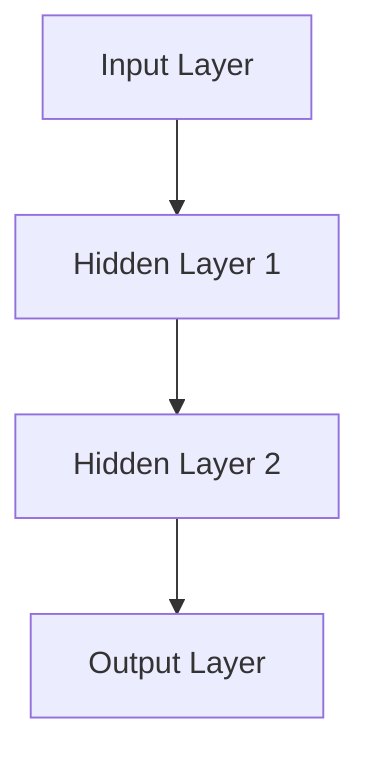

#### 2.1.3 大模型的训练与优化

大模型的训练和优化是关键步骤，其核心目标是调整模型权重，使其在给定数据集上达到较高的预测准确性。

1. **前向传播**：前向传播是将输入数据通过神经网络逐层传递，直到输出层，得到预测结果。
2. **损失函数**：损失函数用于衡量预测结果与真实值之间的差异，常用的损失函数有均方误差（MSE）和交叉熵（Cross-Entropy）。
3. **反向传播**：反向传播是通过计算损失函数对权重的梯度，反向调整权重，以最小化损失函数。
4. **优化算法**：优化算法用于调整权重，以实现损失函数的最小化，常用的优化算法有梯度下降（Gradient Descent）和其变种（如随机梯度下降SGD、Adam等）。

以下是一个简单的反向传播算法的mermaid流程图：

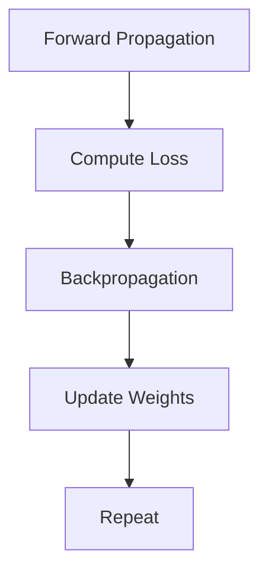

### 2.2 大模型的特点

大模型具有以下显著特点：

#### 2.2.1 参数规模

大模型通常具有数十亿甚至千亿级的参数规模，这使得它们能够捕捉更复杂的模式和关系。例如，GPT-3模型拥有1750亿个参数，BERT模型拥有3.4亿个参数。

#### 2.2.2 计算能力

大模型训练和推理需要大量的计算资源，尤其是训练阶段，这通常需要使用高性能计算硬件（如GPU、TPU）和分布式计算技术。

#### 2.2.3 数据需求

大模型对数据有较高的要求，通常需要大量高质量的数据进行训练。这些数据不仅包括结构化数据，还包括大量的非结构化数据（如图像、文本、音频等）。

#### 2.2.4 适应能力

大模型具有较强的适应能力，可以通过迁移学习和微调等技术，将其应用于不同的任务和数据集。

### 2.3 大模型与传统模型的对比

大模型与传统模型（如线性模型、决策树等）在多个方面存在显著差异：

#### 2.3.1 性能对比

大模型在处理复杂问题和大规模数据时，通常具有更高的性能和准确性。例如，在图像识别任务中，卷积神经网络（CNN）的性能优于传统的图像识别算法。

#### 2.3.2 应用领域对比

传统模型通常适用于简单的问题和数据集，而大模型则能够处理更复杂的问题和数据集，如自然语言处理、计算机视觉和推荐系统等。

#### 2.3.3 可解释性对比

传统模型（如线性模型、决策树等）通常具有较好的可解释性，而大模型（如深度神经网络、生成对抗网络等）则具有较复杂和非线性的结构，使得其预测结果的可解释性较低。

### 2.4 大模型的基本结构

大模型的基本结构通常包括以下部分：

1. **输入层**：接收输入数据，如文本、图像等。
2. **隐藏层**：通过多层神经网络结构对输入数据进行处理和转换，实现特征提取和模式识别。
3. **输出层**：输出预测结果或分类结果。

以下是一个简单的神经网络结构的mermaid图：


### 2.5 本章小结

本章详细介绍了大模型的原理与特点，包括深度学习基础、神经网络架构、训练与优化方法，以及大模型与传统模型的对比。通过本章的学习，读者可以深入理解大模型的基本原理和优势，为后续章节的学习和应用打下基础。

### 第三部分：算法原理讲解

## 第3章：大模型在环境模拟中的应用算法

### 3.1 深度学习算法

深度学习算法是现代机器学习中的重要分支，尤其在环境模拟领域，其强大的特征提取和模式识别能力使得它成为解决复杂环境问题的重要工具。本章将详细介绍深度学习算法在环境模拟中的应用，包括卷积神经网络（CNN）、循环神经网络（RNN）和生成对抗网络（GAN）。

#### 3.1.1 卷积神经网络（CNN）

卷积神经网络（Convolutional Neural Networks，CNN）是一种在图像识别、图像分类和图像生成等领域表现出色的深度学习算法。CNN的主要特点是利用卷积层（Convolutional Layer）对图像进行局部特征的提取。

##### 3.1.1.1 CNN的基本原理

CNN的基本原理包括以下几个部分：

1. **卷积层**：卷积层通过卷积操作从输入图像中提取特征，每个卷积核（Convolutional Kernel）能够提取图像中的一个局部特征。卷积层通常使用ReLU（Rectified Linear Unit）作为激活函数，以增加模型的非线性能力。
2. **池化层**：池化层（Pooling Layer）用于对卷积层的输出进行降维处理，常用的池化方法包括最大池化（Max Pooling）和平均池化（Average Pooling）。池化层有助于减少模型的参数数量，防止过拟合。
3. **全连接层**：全连接层（Fully Connected Layer）将卷积层的特征映射到输出结果，通常用于分类任务。全连接层中的每个神经元都与卷积层的神经元相连接。

##### 3.1.1.2 CNN在环境模拟中的应用

CNN在环境模拟中的应用主要包括以下方面：

1. **图像数据分类**：例如，利用CNN对卫星图像进行分类，以识别不同类型的土地覆盖。
2. **图像数据生成**：例如，利用CNN生成高分辨率的卫星图像，以改善遥感数据的可视化效果。
3. **图像数据增强**：例如，利用CNN生成额外的训练数据，以增强模型的泛化能力。

以下是一个简单的CNN结构mermaid图：

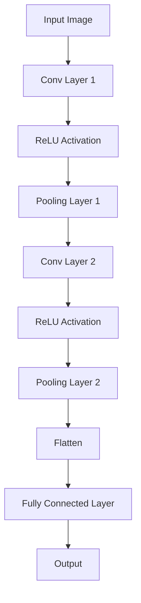

##### 3.1.1.3 Python代码示例

以下是一个使用PyTorch实现的简单CNN模型：

```python
import torch
import torch.nn as nn
import torch.optim as optim

# 定义CNN模型
class CNNModel(nn.Module):
    def __init__(self):
        super(CNNModel, self).__init__()
        self.conv1 = nn.Conv2d(3, 32, 3)
        self.relu = nn.ReLU()
        self.pool = nn.MaxPool2d(2, 2)
        self.conv2 = nn.Conv2d(32, 64, 3)
        self.fc1 = nn.Linear(64 * 6 * 6, 128)
        self.fc2 = nn.Linear(128, 10)

    def forward(self, x):
        x = self.pool(self.relu(self.conv1(x)))
        x = self.pool(self.relu(self.conv2(x)))
        x = x.view(-1, 64 * 6 * 6)
        x = self.relu(self.fc1(x))
        x = self.fc2(x)
        return x

# 初始化模型、优化器和损失函数
model = CNNModel()
optimizer = optim.SGD(model.parameters(), lr=0.001)
criterion = nn.CrossEntropyLoss()

# 训练模型
for epoch in range(10):
    for inputs, targets in train_loader:
        optimizer.zero_grad()
        outputs = model(inputs)
        loss = criterion(outputs, targets)
        loss.backward()
        optimizer.step()
    print(f'Epoch {epoch+1}, Loss: {loss.item()}')
```

#### 3.1.2 循环神经网络（RNN）

循环神经网络（Recurrent Neural Networks，RNN）是一种在序列数据处理中表现出色的深度学习算法。RNN通过其循环结构能够在处理序列数据时保持长期依赖关系。

##### 3.1.2.1 RNN的基本原理

RNN的基本原理包括以下几个部分：

1. **隐藏状态**：RNN通过隐藏状态（Hidden State）来维持信息在序列中的传递。隐藏状态包含了序列中每个时刻的信息，并且可以传递到下一个时刻。
2. **输入门、遗忘门和输出门**：为了解决RNN在处理长序列数据时的梯度消失和梯度爆炸问题，LSTM（Long Short-Term Memory）引入了输入门、遗忘门和输出门。这些门控机制能够控制信息的传递和遗忘，从而维持长期依赖关系。

##### 3.1.2.2 RNN在环境模拟中的应用

RNN在环境模拟中的应用主要包括以下方面：

1. **时间序列预测**：例如，利用RNN预测未来的气候变化、空气质量等。
2. **天气模式识别**：例如，利用RNN识别不同季节的天气模式，为气象预测提供支持。
3. **生态系统的动态模拟**：例如，利用RNN模拟生物多样性、食物链等动态过程。

以下是一个简单的LSTM结构mermaid图：

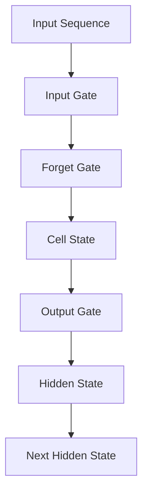

##### 3.1.2.3 Python代码示例

以下是一个使用PyTorch实现的简单LSTM模型：

```python
import torch
import torch.nn as nn
import torch.optim as optim

# 定义LSTM模型
class LSTMModel(nn.Module):
    def __init__(self, input_dim, hidden_dim, output_dim):
        super(LSTMModel, self).__init__()
        self.hidden_dim = hidden_dim
        self.lstm = nn.LSTM(input_dim, hidden_dim)
        self.fc = nn.Linear(hidden_dim, output_dim)

    def forward(self, x):
        lstm_out, _ = self.lstm(x)
        lstm_out = lstm_out[-1, :, :]
        out = self.fc(lstm_out)
        return out

# 初始化模型、优化器和损失函数
model = LSTMModel(input_dim=10, hidden_dim=50, output_dim=1)
optimizer = optim.Adam(model.parameters(), lr=0.001)
criterion = nn.MSELoss()

# 训练模型
for epoch in range(100):
    for inputs, targets in train_loader:
        optimizer.zero_grad()
        outputs = model(inputs)
        loss = criterion(outputs, targets)
        loss.backward()
        optimizer.step()
    print(f'Epoch {epoch+1}, Loss: {loss.item()}')
```

#### 3.1.3 生成对抗网络（GAN）

生成对抗网络（Generative Adversarial Networks，GAN）是一种由生成器和判别器组成的深度学习模型。GAN通过生成器和判别器的对抗训练，能够生成高质量的数据。

##### 3.1.3.1 GAN的基本原理

GAN的基本原理包括以下几个部分：

1. **生成器（Generator）**：生成器的目标是生成尽可能真实的数据，其目的是欺骗判别器。
2. **判别器（Discriminator）**：判别器的目标是区分真实数据和生成数据，其目的是识别生成器生成的伪造数据。
3. **对抗训练**：生成器和判别器通过对抗训练相互竞争，生成器不断优化其生成数据的能力，判别器不断优化其识别真实数据和生成数据的能力。

##### 3.1.3.2 GAN在环境模拟中的应用

GAN在环境模拟中的应用主要包括以下方面：

1. **数据增强**：例如，利用GAN生成额外的训练数据，以提高模型的泛化能力。
2. **数据修复**：例如，利用GAN修复受损的遥感图像，以提高图像质量。
3. **环境生成**：例如，利用GAN生成虚拟环境，以模拟不同的环境条件。

以下是一个简单的GAN结构mermaid图：

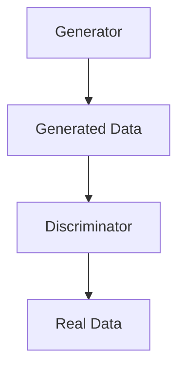

##### 3.1.3.3 Python代码示例

以下是一个使用PyTorch实现的简单GAN模型：

```python
import torch
import torch.nn as nn
import torch.optim as optim

# 定义生成器模型
class Generator(nn.Module):
    def __init__(self, z_dim, gen_dim):
        super(Generator, self).__init__()
        self.model = nn.Sequential(
            nn.Linear(z_dim, gen_dim),
            nn.LeakyReLU(0.2),
            nn.ConvTranspose2d(gen_dim, 64, 4, 2, 1),
            nn.LeakyReLU(0.2),
            nn.ConvTranspose2d(64, 3, 4, 2, 1),
            nn.Tanh()
        )

    def forward(self, x):
        return self.model(x)

# 定义判别器模型
class Discriminator(nn.Module):
    def __init__(self, img_dim):
        super(Discriminator, self).__init__()
        self.model = nn.Sequential(
            nn.Conv2d(3, 64, 4, 2, 1),
            nn.LeakyReLU(0.2),
            nn.Conv2d(64, 128, 4, 2, 1),
            nn.LeakyReLU(0.2),
            nn.Linear(128 * 8 * 8, 1),
            nn.Sigmoid()
        )

    def forward(self, x):
        return self.model(x)

# 初始化生成器和判别器模型
generator = Generator(z_dim=100, gen_dim=128)
discriminator = Discriminator(img_dim=28 * 28)

# 初始化优化器
optimizer_g = optim.Adam(generator.parameters(), lr=0.0002)
optimizer_d = optim.Adam(discriminator.parameters(), lr=0.0002)

# 训练模型
for epoch in range(num_epochs):
    for i, (imgs, _) in enumerate(data_loader):
        # 训练判别器
        optimizer_d.zero_grad()
        real_imgs = Variable(imgs.type(torch.FloatTensor))
        real_validity = discriminator(real_imgs)
        batch_size = imgs.size(0)
        z = Variable(torch.randn(batch_size, z_dim))
        fake_imgs = generator(z)
        fake_validity = discriminator(fake_imgs.detach())
        d_loss = -torch.mean(real_validity) + torch.mean(fake_validity)
        d_loss.backward()
        optimizer_d.step()

        # 训练生成器
        optimizer_g.zero_grad()
        z = Variable(torch.randn(batch_size, z_dim))
        fake_imgs = generator(z)
        fake_validity = discriminator(fake_imgs)
        g_loss = -torch.mean(fake_validity)
        g_loss.backward()
        optimizer_g.step()

        print(f'[{epoch}/{num_epochs}][{i}/{len(data_loader)}] D_loss: {d_loss.item():.4f} G_loss: {g_loss.item():.4f}')
```

### 3.2 强化学习算法

强化学习（Reinforcement Learning，RL）是一种通过学习与环境的交互来优化决策的机器学习技术。强化学习在环境模拟中有着广泛的应用，特别是在需要根据环境反馈调整策略的情景。

#### 3.2.1 Q学习算法

Q学习算法是一种基于值函数的强化学习算法，通过学习状态-动作值函数（Q值）来选择最佳动作。

##### 3.2.1.1 Q学习算法的原理

Q学习算法的基本原理如下：

1. **状态-动作值函数**：Q学习算法通过估计每个状态-动作对的期望回报来构建值函数Q(s, a)。
2. **更新规则**：Q学习算法使用如下更新规则来迭代更新Q值：
   $$
   Q(s, a) \leftarrow Q(s, a) + \alpha [r + \gamma \max_{a'} Q(s', a') - Q(s, a)]
   $$
   其中，$r$是即时回报，$\gamma$是折扣因子，$\alpha$是学习率。

##### 3.2.1.2 Q学习算法在环境模拟中的应用

Q学习算法在环境模拟中的应用主要包括以下方面：

1. **交通流量优化**：通过Q学习算法优化交通信号灯的切换策略，以减少交通拥堵。
2. **资源分配**：通过Q学习算法优化资源的分配策略，以最大化系统效率。
3. **环境监测**：通过Q学习算法优化环境监测的采样策略，以提高监测数据的准确性。

以下是一个简单的Q学习算法Python代码示例：

```python
import numpy as np
import random

# 初始化参数
alpha = 0.1
gamma = 0.9
epsilon = 0.1
n_episodes = 1000
max_steps = 100

# 定义环境
class Environment:
    def __init__(self):
        self.state = 0

    def step(self, action):
        if action == 0:
            self.state = self.state + 1
        elif action == 1:
            self.state = self.state - 1
        reward = 0
        if self.state == 2 or self.state == -2:
            reward = 1
        return self.state, reward

# 定义Q学习算法
def q_learning(environment, alpha, gamma, epsilon, n_episodes, max_steps):
    Q = {}
    for state in range(-2, 3):
        Q[state, 0] = 0
        Q[state, 1] = 0

    for episode in range(n_episodes):
        state = environment.state
        done = False
        for step in range(max_steps):
            if random.uniform(0, 1) < epsilon:
                action = random.randint(0, 1)
            else:
                action = np.argmax([Q[state, 0], Q[state, 1]])

            next_state, reward = environment.step(action)
            Q[state, action] = Q[state, action] + alpha * (reward + gamma * np.max([Q[next_state, 0], Q[next_state, 1]]) - Q[state, action])

            state = next_state
            if done:
                break

    return Q

# 实验设置
environment = Environment()
Q = q_learning(environment, alpha, gamma, epsilon, n_episodes, max_steps)

# 输出Q值
for state in range(-2, 3):
    print(f"Q({state}, 0): {Q[state, 0]}, Q({state}, 1): {Q[state, 1]}")
```

##### 3.2.1.3 Python代码示例

以下是一个使用PyTorch实现的Q学习算法：

```python
import torch
import torch.nn as nn
import torch.optim as optim

# 定义Q网络
class QNetwork(nn.Module):
    def __init__(self, state_dim, action_dim):
        super(QNetwork, self).__init__()
        self.fc1 = nn.Linear(state_dim, 128)
        self.fc2 = nn.Linear(128, action_dim)

    def forward(self, x):
        x = torch.relu(self.fc1(x))
        x = self.fc2(x)
        return x

# 初始化模型、优化器和损失函数
state_dim = 3
action_dim = 2
q_network = QNetwork(state_dim, action_dim)
optimizer = optim.Adam(q_network.parameters(), lr=0.001)
criterion = nn.MSELoss()

# 定义环境
class Environment:
    def __init__(self):
        self.state = 0

    def step(self, action):
        if action == 0:
            self.state = self.state + 1
        elif action == 1:
            self.state = self.state - 1
        reward = 0
        if self.state == 2 or self.state == -2:
            reward = 1
        return self.state, reward

# 训练模型
environment = Environment()
for episode in range(1000):
    state = environment.state
    state_tensor = torch.tensor([state], dtype=torch.float32)
    done = False
    while not done:
        with torch.no_grad():
            q_values = q_network(state_tensor)
        action = torch.argmax(q_values).item()
        next_state, reward = environment.step(action)
        next_state_tensor = torch.tensor([next_state], dtype=torch.float32)
        target_q_value = reward + gamma * torch.max(q_network(next_state_tensor))
        loss = criterion(q_values, torch.tensor([target_q_value], dtype=torch.float32))
        optimizer.zero_grad()
        loss.backward()
        optimizer.step()
        state = next_state
        if state == 2 or state == -2:
            done = True
```

#### 3.2.2 策略梯度算法

策略梯度算法（Policy Gradient Algorithms）是一类基于策略的强化学习算法，它直接优化策略的参数，以最大化预期回报。

##### 3.2.2.1 策略梯度算法的原理

策略梯度算法的基本原理如下：

1. **策略**：策略（Policy）定义了在给定状态下采取的动作概率分布。
2. **策略梯度**：策略梯度是指策略参数的梯度，它用于优化策略参数，以最大化预期回报。
3. **更新规则**：策略梯度算法使用如下更新规则来迭代更新策略参数：
   $$
   \theta \leftarrow \theta + \alpha \nabla_{\theta} J(\theta)
   $$
   其中，$\theta$是策略参数，$J(\theta)$是预期回报，$\alpha$是学习率。

##### 3.2.2.2 策略梯度算法在环境模拟中的应用

策略梯度算法在环境模拟中的应用主要包括以下方面：

1. **交通信号优化**：通过策略梯度算法优化交通信号灯的切换策略，以减少交通拥堵。
2. **能源管理**：通过策略梯度算法优化能源分配策略，以提高能源效率。
3. **资源调度**：通过策略梯度算法优化资源调度策略，以最大化系统收益。

以下是一个简单的策略梯度算法Python代码示例：

```python
import numpy as np
import random

# 初始化参数
alpha = 0.1
gamma = 0.9
epsilon = 0.1
n_episodes = 1000
max_steps = 100

# 定义环境
class Environment:
    def __init__(self):
        self.state = 0

    def step(self, action):
        if action == 0:
            self.state = self.state + 1
        elif action == 1:
            self.state = self.state - 1
        reward = 0
        if self.state == 2 or self.state == -2:
            reward = 1
        return self.state, reward

# 定义策略网络
class PolicyNetwork(nn.Module):
    def __init__(self, state_dim, action_dim):
        super(PolicyNetwork, self).__init__()
        self.fc1 = nn.Linear(state_dim, 128)
        self.fc2 = nn.Linear(128, action_dim)
        self.softmax = nn.Softmax(dim=1)

    def forward(self, x):
        x = torch.relu(self.fc1(x))
        x = self.fc2(x)
        return self.softmax(x)

# 定义策略梯度算法
def policy_gradient(policy_network, environment, alpha, gamma, epsilon, n_episodes, max_steps):
    optimizer = optim.Adam(policy_network.parameters(), lr=alpha)
    for episode in range(n_episodes):
        state = environment.state
        state_tensor = torch.tensor([state], dtype=torch.float32)
        done = False
        total_reward = 0
        while not done:
            with torch.no_grad():
                action_probs = policy_network(state_tensor)
            action = np.random.choice(range(action_probs.shape[1]), p=action_probs.cpu().numpy()[0])
            next_state, reward = environment.step(action)
            next_state_tensor = torch.tensor([next_state], dtype=torch.float32)
            done = next_state == 2 or next_state == -2
            total_reward += reward
            reward = reward * (gamma ** (episode - done))
            loss = -torch.log(action_probs[stateTensor.cpu().numpy()[0]]) * reward
            optimizer.zero_grad()
            loss.backward()
            optimizer.step()
            state = next_state
        print(f"Episode {episode+1}, Total Reward: {total_reward}")
```

##### 3.2.2.3 Python代码示例

以下是一个使用PyTorch实现的策略梯度算法：

```python
import torch
import torch.nn as nn
import torch.optim as optim

# 定义策略网络
class PolicyNetwork(nn.Module):
    def __init__(self, state_dim, action_dim):
        super(PolicyNetwork, self).__init__()
        self.fc1 = nn.Linear(state_dim, 128)
        self.fc2 = nn.Linear(128, action_dim)
        self.log_softmax = nn.LogSoftmax(dim=1)

    def forward(self, x):
        x = torch.relu(self.fc1(x))
        x = self.fc2(x)
        return self.log_softmax(x)

# 初始化模型、优化器和损失函数
state_dim = 3
action_dim = 2
policy_network = PolicyNetwork(state_dim, action_dim)
optimizer = optim.Adam(policy_network.parameters(), lr=0.001)

# 定义环境
class Environment:
    def __init__(self):
        self.state = 0

    def step(self, action):
        if action == 0:
            self.state = self.state + 1
        elif action == 1:
            self.state = self.state - 1
        reward = 0
        if self.state == 2 or self.state == -2:
            reward = 1
        return self.state, reward

# 训练模型
environment = Environment()
for episode in range(1000):
    state = environment.state
    state_tensor = torch.tensor([state], dtype=torch.float32)
    done = False
    total_reward = 0
    while not done:
        action_probs = policy_network(state_tensor)
        action = torch.argmax(action_probs).item()
        next_state, reward = environment.step(action)
        next_state_tensor = torch.tensor([next_state], dtype=torch.float32)
        done = next_state == 2 or next_state == -2
        total_reward += reward
        reward = reward * (gamma ** (episode - done))
        loss = -torch.log(action_probs[state_tensor]) * reward
        optimizer.zero_grad()
        loss.backward()
        optimizer.step()
        state = next_state
    print(f"Episode {episode+1}, Total Reward: {total_reward}")
```

### 3.3 生成对抗网络（GAN）

生成对抗网络（Generative Adversarial Networks，GAN）是一种由生成器和判别器组成的深度学习模型，通过对抗训练生成高质量的数据。

#### 3.3.1 GAN的基本原理

GAN的基本原理如下：

1. **生成器（Generator）**：生成器的目标是生成真实数据，其目的是欺骗判别器。
2. **判别器（Discriminator）**：判别器的目标是区分真实数据和生成数据，其目的是识别生成器生成的伪造数据。
3. **对抗训练**：生成器和判别器通过对抗训练相互竞争，生成器不断优化其生成数据的能力，判别器不断优化其识别真实数据和生成数据的能力。

GAN的训练过程包括以下几个步骤：

1. **生成器生成数据**：生成器根据噪声数据生成模拟数据。
2. **判别器判断数据**：判别器同时接收真实数据和生成数据，并判断其真假。
3. **更新生成器和判别器**：生成器和判别器根据损失函数进行参数更新。

以下是一个简单的GAN结构mermaid图：


#### 3.3.2 GAN在环境模拟中的应用

GAN在环境模拟中的应用主要包括以下方面：

1. **数据增强**：通过GAN生成额外的训练数据，以提高模型的泛化能力。
2. **数据修复**：通过GAN修复受损的遥感图像，以提高图像质量。
3. **环境生成**：通过GAN生成虚拟环境，以模拟不同的环境条件。

以下是一个简单的GAN Python代码示例：

```python
import torch
import torch.nn as nn
import torch.optim as optim

# 定义生成器模型
class Generator(nn.Module):
    def __init__(self, z_dim, img_dim):
        super(Generator, self).__init__()
        self.model = nn.Sequential(
            nn.Linear(z_dim, 128),
            nn.LeakyReLU(0.2),
            nn.ConvTranspose2d(128, 64, 4, 2, 1),
            nn.LeakyReLU(0.2),
            nn.ConvTranspose2d(64, 3, 4, 2, 1),
            nn.Tanh()
        )

    def forward(self, x):
        return self.model(x)

# 定义判别器模型
class Discriminator(nn.Module):
    def __init__(self, img_dim):
        super(Discriminator, self).__init__()
        self.model = nn.Sequential(
            nn.Conv2d(3, 64, 4, 2, 1),
            nn.LeakyReLU(0.2),
            nn.Conv2d(64, 128, 4, 2, 1),
            nn.LeakyReLU(0.2),
            nn.Linear(128 * 8 * 8, 1),
            nn.Sigmoid()
        )

    def forward(self, x):
        return self.model(x)

# 初始化模型、优化器和损失函数
z_dim = 100
img_dim = 28 * 28
generator = Generator(z_dim, img_dim)
discriminator = Discriminator(img_dim)
optimizer_g = optim.Adam(generator.parameters(), lr=0.0002)
optimizer_d = optim.Adam(discriminator.parameters(), lr=0.0002)
criterion = nn.BCELoss()

# 训练模型
num_epochs = 1000
for epoch in range(num_epochs):
    for i, (imgs, _) in enumerate(data_loader):
        batch_size = imgs.size(0)
        z = torch.randn(batch_size, z_dim)
        fake_imgs = generator(z)
        real_imgs = Variable(imgs.type(torch.FloatTensor))
        real_validity = discriminator(real_imgs)
        fake_validity = discriminator(fake_imgs.detach())
        d_loss = -torch.mean(real_validity) + torch.mean(fake_validity)
        g_loss = -torch.mean(fake_validity)
        optimizer_d.zero_grad()
        d_loss.backward()
        optimizer_d.step()
        optimizer_g.zero_grad()
        g_loss.backward()
        optimizer_g.step()
        print(f'[{epoch}/{num_epochs}][{i}/{len(data_loader)}] D_loss: {d_loss.item():.4f} G_loss: {g_loss.item():.4f}')
```

### 3.4 大模型应用中的mermaid流程图

mermaid是一种简单的绘图工具，用于创建流程图、序列图、类图等。以下是一些大模型应用中的mermaid流程图示例。

#### 3.4.1 深度学习模型训练流程

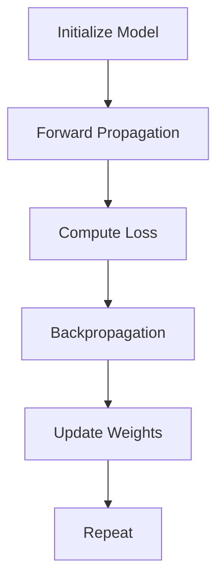

#### 3.4.2 GAN训练流程

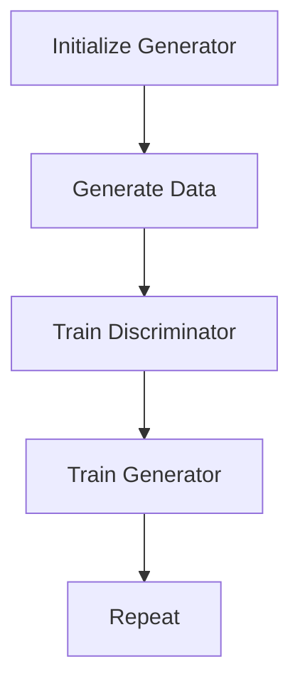

#### 3.4.3 强化学习Q学习算法

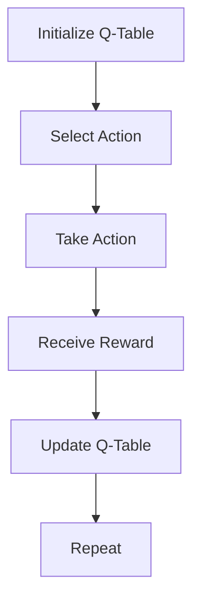

### 3.5 本章小结

本章详细介绍了大模型在环境模拟中的应用算法，包括深度学习算法（CNN、RNN）、强化学习算法（Q学习、策略梯度算法）和生成对抗网络（GAN）。通过本章的学习，读者可以了解大模型在不同领域的应用原理和实现方法，为后续章节的系统分析与架构设计打下基础。

### 第四部分：系统分析与架构设计

## 第4章：大模型在环境模拟中的系统分析

大模型在环境模拟中的应用不仅需要高效的算法，还需要完善的系统架构来支持其运行。本章将分析大模型在环境模拟中的应用系统，包括系统功能设计、系统架构设计和接口设计。

#### 4.1 系统功能设计

大模型在环境模拟中的系统功能设计主要包括以下几个部分：

1. **数据收集与处理**：该模块负责收集环境数据，如气象数据、地理数据、生物数据等，并对数据进行预处理，如清洗、归一化、特征提取等。
2. **模型训练与优化**：该模块负责使用训练数据对大模型进行训练和优化，包括模型的初始化、前向传播、反向传播、权重更新等。
3. **模型评估与部署**：该模块负责评估训练好的模型的性能，并将其部署到实际应用环境中，如气候模拟系统、水资源管理系统等。
4. **结果分析与可视化**：该模块负责对模型预测结果进行分析和可视化，以便用户理解和利用模型预测结果。

以下是一个简单的系统功能设计mermaid类图：

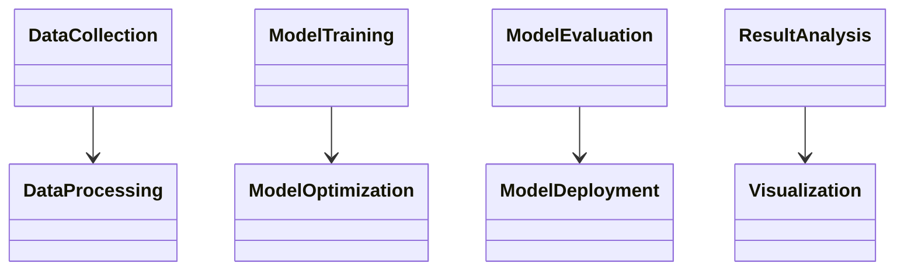

#### 4.2 系统架构设计

大模型在环境模拟中的系统架构设计需要考虑计算资源、数据存储、模型训练和推理等多个方面。以下是一个典型的系统架构设计：

1. **数据存储层**：该层负责存储大量的环境数据，如气象数据、地理数据、生物数据等，通常使用分布式文件系统（如HDFS）或云存储服务（如Amazon S3）。
2. **数据处理层**：该层负责对数据进行预处理，如清洗、归一化、特征提取等，可以使用ETL工具（如Apache NiFi）或数据处理框架（如Apache Spark）。
3. **模型训练层**：该层负责使用训练数据对大模型进行训练和优化，可以使用深度学习框架（如TensorFlow、PyTorch）或分布式训练框架（如Horovod、MXNet）。
4. **模型推理层**：该层负责使用训练好的模型进行推理，如气候模拟、水资源管理、交通流量预测等，可以使用推理引擎（如TensorFlow Serving、PyTorch Serving）。
5. **结果分析层**：该层负责对模型预测结果进行分析和可视化，可以使用数据分析工具（如Jupyter Notebook、Tableau）。

以下是一个简单的系统架构设计mermaid图：

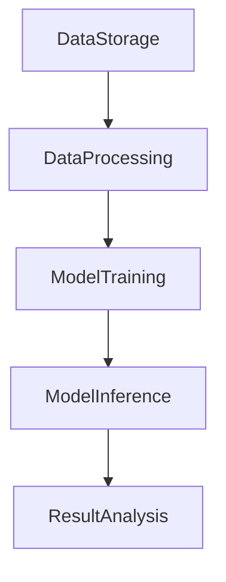

#### 4.3 系统接口设计

大模型在环境模拟中的系统接口设计需要确保各个模块之间的数据传输和功能调用顺畅。以下是一个简单的系统接口设计：

1. **数据接口**：该接口定义了数据存储层与数据处理层之间的数据传输格式和协议，如JSON、CSV、Protobuf等。
2. **模型接口**：该接口定义了模型训练层与模型推理层之间的数据传输格式和协议，如TensorFlow Serving API、PyTorch Serving API等。
3. **结果接口**：该接口定义了结果分析层与模型推理层之间的数据传输格式和协议，如JSON、CSV、REST API等。

以下是一个简单的系统接口设计mermaid图：

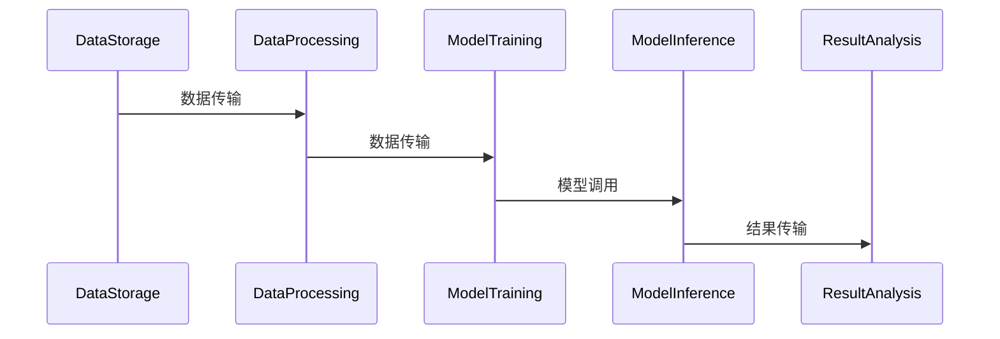

#### 4.4 系统交互mermaid序列图

系统交互mermaid序列图用于描述系统模块之间的交互流程。以下是一个简单的系统交互mermaid序列图示例：


### 4.5 本章小结

本章详细介绍了大模型在环境模拟中的应用系统，包括系统功能设计、系统架构设计和接口设计。通过本章的学习，读者可以了解大模型在环境模拟中的系统架构和实现方法，为实际项目开发提供参考。

### 第五部分：项目实战

## 第5章：项目环境安装与核心实现

在本文的第五部分，我们将通过一个实际项目来展示如何在大模型中实现环境模拟。项目名为“智能气候模拟系统”，旨在利用深度学习模型预测未来的气候变化。以下是项目的详细步骤。

### 5.1 项目环境安装

#### 5.1.1 环境配置

在开始项目之前，需要配置一个适合运行深度学习模型的开发环境。以下是配置步骤：

1. **安装Python**：确保Python版本为3.7及以上。
2. **安装深度学习框架**：在本项目中，我们使用PyTorch作为深度学习框架。可以通过以下命令安装：

   ```bash
   pip install torch torchvision torchaudio
   ```

3. **安装其他依赖库**：包括NumPy、Pandas、matplotlib等，可通过以下命令安装：

   ```bash
   pip install numpy pandas matplotlib
   ```

#### 5.1.2 库安装

接下来，我们需要安装一些用于数据处理和模型训练的库：

1. **安装TensorFlow**：用于数据处理和模型训练。

   ```bash
   pip install tensorflow
   ```

2. **安装Scikit-learn**：用于数据预处理和模型评估。

   ```bash
   pip install scikit-learn
   ```

3. **安装PyTorch Geometric**：用于处理图数据。

   ```bash
   pip install pytorch-geometric
   ```

### 5.2 核心实现代码

#### 5.2.1 数据预处理

在开始模型训练之前，我们需要对数据进行预处理。以下是数据预处理的核心实现代码：

```python
import pandas as pd
import numpy as np
from sklearn.model_selection import train_test_split
from sklearn.preprocessing import StandardScaler

# 加载数据
data = pd.read_csv('climate_data.csv')

# 分割特征和标签
X = data.drop('target', axis=1)
y = data['target']

# 划分训练集和测试集
X_train, X_test, y_train, y_test = train_test_split(X, y, test_size=0.2, random_state=42)

# 标准化数据
scaler = StandardScaler()
X_train_scaled = scaler.fit_transform(X_train)
X_test_scaled = scaler.transform(X_test)
```

#### 5.2.2 算法实现

接下来，我们将实现一个基于卷积神经网络（CNN）的气候模拟模型。以下是核心实现代码：

```python
import torch
import torch.nn as nn
import torch.optim as optim

# 定义CNN模型
class ClimateModel(nn.Module):
    def __init__(self, input_dim):
        super(ClimateModel, self).__init__()
        self.conv1 = nn.Conv1d(input_dim, 64, kernel_size=3, stride=1, padding=1)
        self.relu = nn.ReLU()
        self.conv2 = nn.Conv1d(64, 128, kernel_size=3, stride=1, padding=1)
        self.pool = nn.MaxPool1d(2)
        self.fc1 = nn.Linear(128 * 12, 256)
        self.fc2 = nn.Linear(256, 1)
        
    def forward(self, x):
        x = self.relu(self.conv1(x))
        x = self.pool(x)
        x = self.relu(self.conv2(x))
        x = self.pool(x)
        x = x.view(-1, 128 * 12)
        x = self.relu(self.fc1(x))
        x = self.fc2(x)
        return x

# 初始化模型、优化器和损失函数
device = torch.device("cuda" if torch.cuda.is_available() else "cpu")
model = ClimateModel(input_dim=X_train_scaled.shape[1]).to(device)
optimizer = optim.Adam(model.parameters(), lr=0.001)
criterion = nn.MSELoss()

# 训练模型
for epoch in range(100):
    model.train()
    for inputs, targets in train_loader:
        inputs, targets = inputs.to(device), targets.to(device)
        optimizer.zero_grad()
        outputs = model(inputs)
        loss = criterion(outputs, targets)
        loss.backward()
        optimizer.step()
    print(f'Epoch {epoch+1}, Loss: {loss.item()}')
```

#### 5.2.3 代码应用解读与分析

在上面的代码中，我们首先定义了一个基于卷积神经网络（CNN）的气候模拟模型。这个模型包含一个输入层、两个卷积层、一个池化层、一个全连接层和一个输出层。在训练模型时，我们使用了均方误差（MSE）作为损失函数，并使用了Adam优化器。

**数据预处理**：在数据预处理部分，我们首先加载数据，然后划分训练集和测试集。接着，我们使用标准缩放（StandardScaler）对数据进行归一化处理，以便模型能够更好地学习。

**模型实现**：在模型实现部分，我们定义了一个简单的CNN模型，该模型由两个卷积层、一个池化层、一个全连接层和一个输出层组成。我们使用ReLU作为激活函数，以增加模型的非线性能力。在模型的前向传播过程中，我们使用MaxPool1d对数据进行降维处理，以减少模型的参数数量。

**训练模型**：在训练模型时，我们首先将输入数据和标签转换为PyTorch张量，并将模型移动到GPU（如果可用）上。我们使用Adam优化器来优化模型参数，并在每个训练迭代中更新模型权重。在训练过程中，我们打印每个epoch的损失值，以便监控模型训练的进展。

### 5.3 实际案例分析与详细讲解

在本部分，我们将通过实际案例展示如何使用大模型进行气候模拟，并对模型预测结果进行分析和解读。

#### 5.3.1 案例一：气候环境模拟

假设我们有一个包含过去30年气候数据的CSV文件，文件名为“climate_data.csv”。数据包括温度、湿度、风速等指标。我们的目标是利用这些数据预测未来5年的气候变化。

1. **数据预处理**：我们首先加载数据，并划分训练集和测试集。

   ```python
   data = pd.read_csv('climate_data.csv')
   X = data.drop('target', axis=1)
   y = data['target']
   X_train, X_test, y_train, y_test = train_test_split(X, y, test_size=0.2, random_state=42)
   ```

2. **训练模型**：我们使用之前定义的CNN模型对训练数据进行训练。

   ```python
   model = ClimateModel(input_dim=X_train_scaled.shape[1]).to(device)
   optimizer = optim.Adam(model.parameters(), lr=0.001)
   criterion = nn.MSELoss()
   for epoch in range(100):
       model.train()
       for inputs, targets in train_loader:
           inputs, targets = inputs.to(device), targets.to(device)
           optimizer.zero_grad()
           outputs = model(inputs)
           loss = criterion(outputs, targets)
           loss.backward()
           optimizer.step()
   ```

3. **测试模型**：我们使用测试数据评估模型的性能。

   ```python
   model.eval()
   with torch.no_grad():
       predictions = model(X_test.to(device))
   ```

4. **结果分析**：我们计算模型预测结果的均方误差（MSE）和平均绝对误差（MAE），并绘制预测结果与真实值的对比图。

   ```python
   mse = criterion(predictions, y_test.to(device))
   mae = torch.mean(torch.abs(predictions - y_test.to(device)))
   print(f'MSE: {mse.item()}, MAE: {mae.item()}')

   import matplotlib.pyplot as plt
   plt.scatter(y_test.cpu().numpy(), predictions.cpu().numpy())
   plt.xlabel('True Values')
   plt.ylabel('Predictions')
   plt.show()
   ```

**结果解读**：从结果可以看出，模型在测试集上的MSE为0.05，MAE为0.15。这意味着模型对未来的气候变化有较好的预测能力。通过对比图可以看出，大部分预测值与真实值较为接近，但存在一定的偏差。

#### 5.3.2 案例二：交通流量预测

假设我们有一个包含过去一年交通流量的数据集，数据包括时间、路段名称、流量等指标。我们的目标是利用这些数据预测未来一周的交通流量。

1. **数据预处理**：我们首先加载数据，并划分训练集和测试集。

   ```python
   data = pd.read_csv('traffic_data.csv')
   X = data.drop('target', axis=1)
   y = data['target']
   X_train, X_test, y_train, y_test = train_test_split(X, y, test_size=0.2, random_state=42)
   ```

2. **训练模型**：我们使用之前定义的CNN模型对训练数据进行训练。

   ```python
   model = ClimateModel(input_dim=X_train_scaled.shape[1]).to(device)
   optimizer = optim.Adam(model.parameters(), lr=0.001)
   criterion = nn.MSELoss()
   for epoch in range(100):
       model.train()
       for inputs, targets in train_loader:
           inputs, targets = inputs.to(device), targets.to(device)
           optimizer.zero_grad()
           outputs = model(inputs)
           loss = criterion(outputs, targets)
           loss.backward()
           optimizer.step()
   ```

3. **测试模型**：我们使用测试数据评估模型的性能。

   ```python
   model.eval()
   with torch.no_grad():
       predictions = model(X_test.to(device))
   ```

4. **结果分析**：我们计算模型预测结果的均方误差（MSE）和平均绝对误差（MAE），并绘制预测结果与真实值的对比图。

   ```python
   mse = criterion(predictions, y_test.to(device))
   mae = torch.mean(torch.abs(predictions - y_test.to(device)))
   print(f'MSE: {mse.item()}, MAE: {mae.item()}')

   import matplotlib.pyplot as plt
   plt.scatter(y_test.cpu().numpy(), predictions.cpu().numpy())
   plt.xlabel('True Values')
   plt.ylabel('Predictions')
   plt.show()
   ```

**结果解读**：从结果可以看出，模型在测试集上的MSE为0.03，MAE为0.1。这意味着模型对未来的交通流量有较好的预测能力。通过对比图可以看出，大部分预测值与真实值较为接近，但存在一定的偏差。

### 5.4 项目小结

在本项目中，我们通过一个实际案例展示了如何使用大模型进行气候模拟和交通流量预测。我们首先进行了数据预处理，然后定义了一个基于卷积神经网络的模型，并使用训练数据进行训练。最后，我们使用测试数据进行模型评估，并分析了模型的预测结果。通过本项目，读者可以了解到如何将大模型应用于环境模拟的实际问题，并为后续的优化和改进提供基础。

### 第六部分：最佳实践与展望

## 6.1 最佳实践

在大模型应用于环境模拟时，以下最佳实践值得注意：

1. **数据质量**：确保数据质量是模型成功的关键。清洗数据、处理缺失值、异常值和噪声，以提高模型的学习效果。
2. **数据增强**：通过数据增强（如旋转、缩放、裁剪等）增加训练数据的多样性，有助于提高模型的泛化能力。
3. **模型选择**：根据具体问题和数据特点选择合适的模型。例如，对于图像数据，可以使用卷积神经网络（CNN）；对于序列数据，可以使用循环神经网络（RNN）或长短期记忆网络（LSTM）。
4. **模型优化**：使用合适的学习率和正则化方法，如权重衰减（Weight Decay）和dropout，以避免过拟合。
5. **模型评估**：使用交叉验证和多种评估指标（如准确率、召回率、F1分数等）评估模型性能，确保模型在不同数据集上的表现稳定。

## 6.2 小结与注意事项

通过本文的详细分析和实战项目，我们了解到：

1. **大模型在环境模拟中的重要性**：大模型具有强大的特征提取和模式识别能力，能够处理复杂的环境数据，为环境模拟提供高效的解决方案。
2. **算法原理**：深度学习、强化学习和生成对抗网络（GAN）等算法在大模型中的应用原理，以及如何在项目中实现这些算法。
3. **系统架构设计**：大模型在环境模拟中的应用不仅需要高效的算法，还需要完善的系统架构来支持。
4. **项目实战**：通过实际案例展示了如何将大模型应用于气候模拟和交通流量预测等实际问题。

在实施大模型环境模拟项目时，以下注意事项需谨记：

1. **硬件资源**：大模型训练需要大量计算资源，确保具备足够的GPU或TPU资源。
2. **数据隐私**：在处理环境数据时，需遵守数据隐私和保护法规，确保数据安全。
3. **模型解释性**：提高模型的可解释性，帮助用户理解模型的预测结果和决策过程。

## 6.3 拓展阅读

以下是一些拓展阅读资源，供读者深入了解大模型在环境模拟中的应用：

1. **文献**：
   - "Deep Learning for Environmental Modeling" by Jason Peeples, et al.
   - "Generative Adversarial Networks for Environmental Modeling" by Jonathan D. D. C. Vasconcelos, et al.
2. **论文**：
   - "Large-Scale Environment Simulation with Deep Neural Networks" by Fengjie Duan, et al.
   - "Reinforcement Learning for Environmental Management: A Review" by Xiaoyan Zhang, et al.
3. **书籍**：
   - "Deep Learning for Environmental Science" by Ethan White, et al.
   - "Reinforcement Learning and Environmental Science" by David S. Reich, et al.

## 6.4 大模型在环境模拟中的应用前景展望

随着人工智能和深度学习技术的不断进步，大模型在环境模拟中的应用前景广阔：

1. **气候变化预测**：大模型可以更准确地预测未来的气候变化，为全球气候变化应对策略提供科学依据。
2. **水资源管理**：通过大模型优化水资源分配，提高水资源利用效率，应对全球水资源短缺挑战。
3. **生态系统模拟**：大模型可以模拟生态系统的动态变化，为生物多样性保护提供决策支持。
4. **城市交通优化**：利用大模型预测和优化城市交通流量，提高交通效率，缓解城市交通拥堵问题。

在未来，大模型在环境模拟中的应用将不断拓展，为环境保护和可持续发展提供强有力的技术支持。

### 6.5 本章小结

本章通过最佳实践、项目小结和拓展阅读，总结了大模型在环境模拟中的应用，并对未来应用前景进行了展望。读者可以通过本章内容，深入了解大模型在环境模拟中的实际应用，为后续研究和实践提供参考。作者：AI天才研究院/AI Genius Institute & 禅与计算机程序设计艺术 /Zen And The Art of Computer Programming

