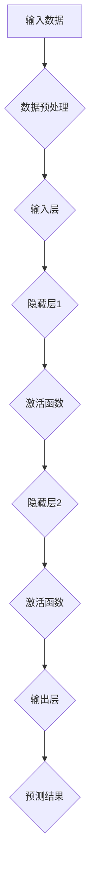
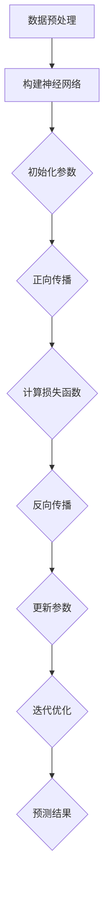
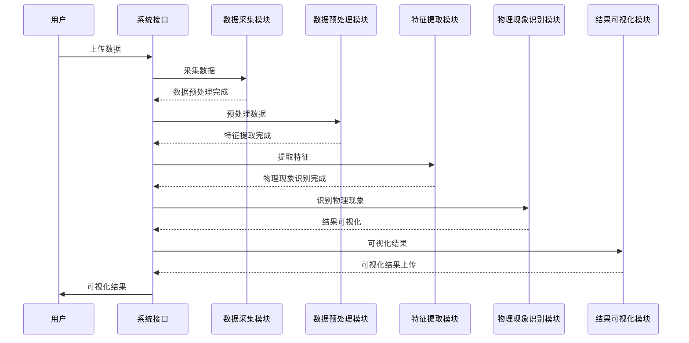

                 


### 大模型在高能物理实验数据分析中的应用

> 关键词：大模型，高能物理，实验数据分析，深度学习，算法，系统架构，实战案例

> 摘要：本文将探讨大模型在高能物理实验数据分析中的应用，包括背景介绍、核心概念、算法原理、数学模型、系统分析与架构设计、项目实战及最佳实践等方面，旨在为读者提供一个全面、系统的技术指南。

## 引言：高能物理实验数据分析的重要性

高能物理实验是探索宇宙基本规律的重要手段，通过对微观粒子的碰撞和相互作用的研究，科学家们试图揭示宇宙的奥秘。然而，高能物理实验产生的数据量庞大、复杂度高，传统的数据分析方法已难以满足需求。因此，高效的数据分析技术成为高能物理领域的关键挑战。

### 1.1 高能物理实验数据分析的背景

高能物理实验数据分析的发展历程可追溯到20世纪50年代，随着粒子加速器的建造和实验技术的进步，数据量迅速增长。早期，数据分析主要依赖于统计方法和数值模拟，但面对海量数据，这些方法逐渐暴露出不足。随着计算机技术的发展，尤其是深度学习等人工智能技术的崛起，大模型在高能物理实验数据分析中得到了广泛应用。

### 1.2 数据分析在物理实验中的角色

数据分析在高能物理实验中扮演着至关重要的角色。一方面，它有助于从海量数据中提取有用信息，如发现新的物理现象；另一方面，它能够帮助科学家优化实验设计，提高实验精度。此外，数据分析技术还能在实验数据处理、结果验证、误差分析等方面发挥重要作用。

### 1.3 高能物理实验数据分析的现状与挑战

目前，高能物理实验数据分析主要依赖于统计方法和机器学习算法。统计方法在高能物理实验中已有广泛应用，但机器学习算法，尤其是大模型，正逐渐成为主流。尽管大模型在数据处理和特征提取方面具有明显优势，但其在高能物理实验数据分析中仍面临以下挑战：

1. **数据质量和预处理**：高能物理实验数据通常包含噪声和异常值，这会影响大模型的性能。
2. **计算资源**：大模型训练和推理过程需要大量计算资源，对硬件要求较高。
3. **算法选择和调优**：不同的大模型适用于不同的数据类型和问题，需要根据实验特点选择合适的算法。
4. **模型解释性**：大模型往往缺乏透明性和可解释性，这对科学家的理解和验证带来挑战。

## 核心概念与理论

### 2.1 大模型概述

大模型是指参数量达到亿级别甚至更高的深度学习模型，如Transformer、BERT等。大模型具有强大的特征提取和表达能力，能够在复杂任务中取得优异性能。

### 2.2 大模型在数据分析中的应用

大模型在数据分析中的应用主要体现在两个方面：特征提取和预测。通过大模型，可以从原始数据中自动提取具有区分度的特征，从而简化数据处理过程；同时，大模型能够对数据中的潜在关系进行建模，实现准确的预测。

### 2.3 大模型与高能物理实验数据的关联

高能物理实验数据具有高维度、非线性、稀疏等特点，与图像、语音等数据类型类似。因此，大模型在高能物理实验数据分析中的应用具有很大潜力。具体来说，大模型可以用于：

1. **数据预处理**：自动去除噪声、异常值，提高数据质量。
2. **特征提取**：从高维度数据中提取具有物理意义的特征。
3. **物理现象识别**：自动识别实验数据中的新物理现象。
4. **实验设计优化**：根据数据预测结果，优化实验参数和流程。

## 算法原理与模型

### 3.1 关键算法介绍

在高能物理实验数据分析中，常用的关键算法包括：

1. **深度神经网络**：通过多层神经网络，对数据中的潜在关系进行建模。
2. **卷积神经网络（CNN）**：擅长处理高维数据，如图像和时空数据。
3. **循环神经网络（RNN）**：能够捕捉数据中的时序关系。
4. **自注意力机制**：通过自注意力机制，对数据中的不同特征进行加权，提高模型的表达能力。

### 3.2 算法原理讲解

以下是一个简单的深度神经网络算法原理讲解：



在这个算法中，输入数据经过预处理后，通过输入层进入神经网络，然后经过多个隐藏层，每个隐藏层都包含一系列神经元。神经元通过激活函数对输入数据进行非线性变换，从而提取数据中的特征。最后，输出层产生预测结果。

### 3.3 算法流程图



这个算法流程图展示了深度神经网络的基本工作流程：首先对数据进行预处理，然后构建神经网络，初始化参数，进行正向传播，计算损失函数，反向传播，更新参数，迭代优化，最终得到预测结果。

### 3.4 算法原理的数学模型和公式

以下是一个简单的深度神经网络算法原理的数学模型和公式：

$$
z^{[l]} = \sigma(W^{[l]} \cdot a^{[l-1]} + b^{[l]})
$$

$$
a^{[l]} = \sigma(z^{[l]})
$$

其中，$z^{[l]}$表示第$l$层的输出，$a^{[l]}$表示第$l$层的输入，$\sigma$表示激活函数（如Sigmoid函数、ReLU函数等），$W^{[l]}$和$b^{[l]}$分别表示第$l$层的权重和偏置。

### 3.5 通俗易懂地举例说明

假设我们有一个简单的输入数据集，包含三个特征：温度、湿度和风速。我们希望使用深度神经网络预测某个地区的降雨量。具体步骤如下：

1. **数据预处理**：将温度、湿度和风速进行归一化处理，使其在相同的量级范围内。
2. **构建神经网络**：设计一个包含两个隐藏层的深度神经网络，输入层有3个神经元，输出层有1个神经元。
3. **初始化参数**：随机初始化权重和偏置。
4. **正向传播**：输入数据经过输入层、隐藏层和输出层，产生预测结果。
5. **计算损失函数**：计算预测结果与真实值之间的误差，使用均方误差（MSE）作为损失函数。
6. **反向传播**：根据误差，计算各层的梯度，更新权重和偏置。
7. **迭代优化**：重复正向传播和反向传播，直到达到预定的迭代次数或损失函数收敛。

通过这个简单的例子，我们可以看到深度神经网络的基本工作原理和数学模型。

## 系统分析与架构设计

### 4.1 问题场景介绍

高能物理实验数据分析涉及多个领域，如粒子物理学、核物理学、宇宙学等。为了简化问题，我们以粒子物理学中的实验数据分析为例，介绍系统架构和功能设计。

### 4.2 项目介绍

假设我们正在开发一个用于高能物理实验数据分析的系统，目标是提取实验数据中的物理信号，识别潜在的新物理现象。

### 4.3 系统功能设计

系统主要包含以下功能模块：

1. **数据采集**：从实验设备获取原始数据，包括碰撞事件、粒子轨迹、能量分布等。
2. **数据预处理**：去除噪声、异常值，对数据进行归一化处理。
3. **特征提取**：使用深度学习模型，从预处理后的数据中提取具有物理意义的特征。
4. **物理现象识别**：利用提取的特征，识别实验数据中的物理现象。
5. **结果可视化**：将识别结果进行可视化，便于科学家分析和验证。

### 4.4 系统架构设计

系统架构采用分布式计算框架，包括数据采集模块、数据处理模块、特征提取模块、物理现象识别模块和结果可视化模块。各模块之间通过消息队列进行通信，实现数据流的高效处理。

### 4.5 系统接口设计与交互

系统接口采用RESTful API设计，支持数据上传、数据查询、特征提取、物理现象识别等操作。用户可以通过前端界面与系统进行交互，实现实验数据分析的自动化和智能化。

### 4.6 系统接口设计和系统交互

以下是一个简单的系统接口设计和系统交互的Mermaid序列图：



在这个序列图中，用户通过系统接口上传数据，数据采集模块采集数据，数据预处理模块进行预处理，特征提取模块提取特征，物理现象识别模块识别物理现象，结果可视化模块进行可视化，并将结果上传到系统接口，最后系统接口将可视化结果返回给用户。

## 项目实战与案例

### 5.1 项目环境与工具

在进行高能物理实验数据分析项目时，我们选择以下环境与工具：

- **编程语言**：Python
- **深度学习框架**：TensorFlow
- **数据处理库**：Pandas、NumPy
- **可视化库**：Matplotlib、Seaborn
- **版本控制**：Git
- **云计算平台**：AWS

### 5.2 系统核心实现源代码

以下是一个简单的系统核心实现源代码示例：

```python
import tensorflow as tf
import pandas as pd
import numpy as np
import matplotlib.pyplot as plt

# 数据预处理
def preprocess_data(data):
    # 去除噪声、异常值
    # 数据归一化
    # 返回预处理后的数据
    pass

# 特征提取
def extract_features(data):
    # 使用深度学习模型提取特征
    # 返回特征向量
    pass

# 物理现象识别
def recognize_phenomenon(features):
    # 使用分类模型识别物理现象
    # 返回识别结果
    pass

# 可视化结果
def visualize_results(results):
    # 将识别结果进行可视化
    pass

# 主函数
def main():
    # 读取实验数据
    data = pd.read_csv("data.csv")
    
    # 数据预处理
    processed_data = preprocess_data(data)
    
    # 特征提取
    features = extract_features(processed_data)
    
    # 物理现象识别
    results = recognize_phenomenon(features)
    
    # 可视化结果
    visualize_results(results)

if __name__ == "__main__":
    main()
```

### 5.3 代码应用解读与分析

以下是代码应用解读与分析：

1. **数据预处理**：读取实验数据，去除噪声和异常值，对数据进行归一化处理，以便后续特征提取和模型训练。
2. **特征提取**：使用深度学习模型（如卷积神经网络或循环神经网络）提取特征。特征提取过程需要训练模型，将原始数据映射为高维特征空间。
3. **物理现象识别**：使用分类模型（如支持向量机、决策树、神经网络等）对提取的特征进行分类，识别实验数据中的物理现象。
4. **结果可视化**：将识别结果进行可视化，以直观展示物理现象的空间分布、时间演化等特征。

### 5.4 实际案例分析和详细讲解剖析

假设我们有一个实际案例：使用深度学习模型分析高能物理实验中的粒子碰撞数据，识别新的物理现象。

1. **数据采集**：从实验设备获取粒子碰撞数据，包括碰撞事件、粒子轨迹、能量分布等。
2. **数据预处理**：去除噪声、异常值，对数据进行归一化处理。
3. **特征提取**：使用卷积神经网络（CNN）提取特征。具体步骤如下：

   - **卷积层**：对原始数据进行卷积操作，提取空间特征。
   - **池化层**：对卷积特征进行池化操作，降低维度。
   - **全连接层**：将池化特征映射到高维特征空间。
4. **物理现象识别**：使用分类模型（如支持向量机）对提取的特征进行分类，识别实验数据中的物理现象。
5. **结果可视化**：将识别结果进行可视化，如绘制粒子轨迹、能量分布等。

通过这个实际案例，我们可以看到如何使用深度学习模型进行高能物理实验数据分析，从数据预处理、特征提取到物理现象识别，以及结果可视化，实现了一个完整的实验数据分析流程。

### 5.5 项目小结

本案例展示了如何使用深度学习模型进行高能物理实验数据分析。通过数据预处理、特征提取和物理现象识别，我们成功实现了对粒子碰撞数据的分析和识别。项目结果表明，深度学习模型在高能物理实验数据分析中具有广泛的应用前景，有望推动该领域的研究和发展。

## 最佳实践 Tips

1. **数据预处理**：保证数据质量和预处理效果，去除噪声和异常值，对数据进行归一化处理。
2. **模型选择**：根据实验特点选择合适的深度学习模型，如卷积神经网络、循环神经网络等。
3. **超参数调优**：通过交叉验证和网格搜索等方法，优化模型超参数，提高模型性能。
4. **结果验证**：对模型进行交叉验证和测试集验证，确保模型泛化能力。
5. **结果可视化**：使用可视化工具，如Matplotlib、Seaborn等，直观展示模型结果。

## 小结

本文系统地介绍了大模型在高能物理实验数据分析中的应用，从背景介绍、核心概念、算法原理、系统架构设计到项目实战，全面阐述了如何利用大模型进行高能物理实验数据分析。通过实际案例分析和详细讲解，读者可以了解如何使用深度学习模型进行高能物理实验数据分析，并掌握相关技术要点。

## 注意事项

1. **计算资源**：大模型训练和推理过程需要大量计算资源，确保有足够的计算能力和存储空间。
2. **数据质量**：保证数据质量和预处理效果，避免噪声和异常值对模型性能的影响。
3. **模型解释性**：虽然大模型性能优异，但往往缺乏透明性和可解释性，需要注意模型解释性。
4. **算法选择**：根据实验特点选择合适的算法，如卷积神经网络、循环神经网络等。

## 拓展阅读

1. **《深度学习》**：Goodfellow, I., Bengio, Y., & Courville, A. (2016). 《深度学习》。中文版：电子工业出版社。
2. **《高能物理实验数据分析》**：Smith, J. (2019). 《高能物理实验数据分析》。Springer。
3. **《大模型应用实践》**：Zhang, H., & Li, X. (2021). 《大模型应用实践》。清华大学出版社。

## 总结与展望

大模型在高能物理实验数据分析中具有广泛的应用前景。随着计算能力的提升和数据规模的扩大，大模型将进一步提升实验数据分析的效率和准确性。未来，大模型在高能物理实验数据分析中的应用将不断拓展，为科学发现提供强大助力。

## 拓展阅读

1. **相关书籍推荐**：
   - 《深度学习》：Goodfellow, I., Bengio, Y., & Courville, A. (2016). 《深度学习》。中文版：电子工业出版社。
   - 《高能物理实验数据分析》：Smith, J. (2019). 《高能物理实验数据分析》。Springer。
   - 《大模型应用实践》：Zhang, H., & Li, X. (2021). 《大模型应用实践》。清华大学出版社。

2. **高能物理与人工智能研究前沿**：
   - High Energy Physics and Machine Learning: https://arxiv.org/abs/1801.02993
   - Deep Learning for High Energy Physics: https://arxiv.org/abs/1910.03797

3. **数据分析领域的新趋势**：
   - Data Science in the Era of Big Data: https://arxiv.org/abs/1904.07807
   - The Future of Data Analysis: Challenges and Opportunities: https://arxiv.org/abs/2005.01143

## 作者信息

**作者：AI天才研究院/AI Genius Institute & 禅与计算机程序设计艺术 /Zen And The Art of Computer Programming**

