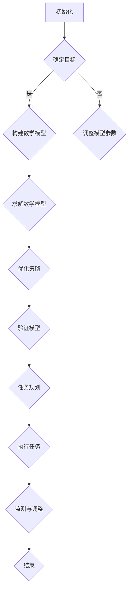

                 

### 第一部分: 引言与背景

## 第1章: 太空垃圾问题概述

### 1.1.1 太空垃圾的定义与分类

#### 太空垃圾的定义

- 太空垃圾是指在地球轨道上的人造物体，主要包括废弃的卫星、火箭残骸、航天器碎片等。
- 这些物体由于不再执行其设计功能，而成为人类活动在太空留下的“遗产”。

#### 太空垃圾的分类

- **按来源分类**：
  - **轨道废弃物**：废弃的卫星、火箭残骸等。
  - **航天器碎片**：航天器在正常运行过程中产生的碎片。
  - **碰撞碎片**：太空垃圾之间的碰撞产生的碎片。

- **按形态分类**：
  - **微小碎片**：尺寸小于1厘米的碎片。
  - **较大碎片**：尺寸在1厘米到10厘米之间的碎片。
  - **哑弹**：已发射但未完全燃烧的火箭。
  - **残骸**：已退役的航天器及其组成部分。

### 1.1.2 太空垃圾的来源与危害

#### 太空垃圾的来源

- **航天活动**：卫星发射、火箭分解、航天器退役等。
- **碰撞**：太空垃圾之间的碰撞、与航天器碰撞等。

#### 太空垃圾的危害

- **对航天器的危害**：碰撞可能导致航天器损坏，影响任务执行。
- **对地面观测的影响**：太空垃圾的亮度和反射特性可能会影响天文观测。
- **对航天员安全的威胁**：太空垃圾可能对航天员的生命安全造成威胁。

### 1.1.3 当前太空垃圾管理的现状与挑战

#### 太空垃圾管理的现状

- **监测与跟踪**：使用雷达、光学望远镜等设备对太空垃圾进行监测和跟踪。
- **清理技术**：包括拖网技术、碰撞技术、捕获技术等。
- **国际合作**：各国在太空垃圾管理方面进行合作，共同应对挑战。

#### 太空垃圾管理的挑战

- **太空垃圾数量庞大**：随着航天活动的增加，太空垃圾数量不断增多。
- **清理成本高昂**：太空垃圾清理任务成本高，技术难度大。
- **清理效果有限**：目前的太空垃圾清理技术效果有限，无法完全消除太空垃圾。

## 第2章: 数学规划方法概述

### 2.1 数学规划的定义与类型

#### 数学规划的定义

- 数学规划是运用数学模型求解最优解的方法，它是一种优化问题。
- 数学规划通常包括目标函数和约束条件。

#### 数学规划的类型

- **无约束优化问题**：目标函数和约束条件都是线性的。
- **约束优化问题**：目标函数和约束条件中至少有一个是非线性的。
- **多目标优化问题**：涉及多个相互冲突的目标函数。
- **非线性优化问题**：目标函数或约束条件包含非线性项。

### 2.2 常见的数学规划算法

#### 线性规划

- 目标函数和约束条件都是线性的，常用于资源分配、生产调度等问题。

#### 非线性规划

- 目标函数或约束条件中包含非线性项，常用于工程设计、控制系统设计等问题。

#### 遗传算法

- 一种基于自然选择和遗传学原理的优化算法，适用于复杂非线性优化问题。

### 2.3 数学规划在太空垃圾清理中的应用

- 数学规划方法可用于设计太空垃圾清理策略，优化任务规划，提高清理效率。
- 通过数学模型，可以预测太空垃圾的轨道演化，从而制定更有效的清理计划。

----------------------------------------------------------------

### 第二部分：太空垃圾轨道动力学基础

## 第3章: 开普勒定律与轨道动力学基础

### 3.1 开普勒定律概述

#### 第一定律：椭圆定律

- 行星围绕太阳的轨道是椭圆形的，太阳位于椭圆的一个焦点上。

#### 第二定律：面积定律

- 行星和太阳的连线在相等的时间内扫过相等的面积。

#### 第三定律：调和定律

- 行星轨道周期的平方与其半长轴的立方成正比。

### 3.2 轨道动力学基础

#### 牛顿引力定律

- 两个物体之间的引力与它们的质量成正比，与它们之间的距离的平方成反比。

#### 轨道动力学方程

- 牛顿引力定律和运动定律结合，可以推导出行星轨道的动力学方程。

### 3.3 太空垃圾的轨道特性

#### 轨道高度的影响

- 轨道高度越高，太空垃圾受到的地球引力越小，轨道稳定性越强。

#### 轨道倾角的影响

- 轨道倾角越大，太空垃圾的轨道越倾斜，容易与其他轨道发生碰撞。

#### 轨道演化的数学模型

- 利用开普勒定律和牛顿引力定律，可以建立太空垃圾轨道演化的数学模型。

## 第4章: 轨道演化的数学模型

### 4.1 基本概念

- **轨道倾角**：轨道平面与地球赤道面的夹角。
- **偏心率**：轨道椭圆的偏心程度。
- **轨道周期**：太空垃圾绕地球一周所需的时间。

### 4.2 数学模型构建

- **轨道倾角的演化方程**：描述轨道倾角随时间的变化。
- **偏心率的演化方程**：描述轨道偏心率随时间的变化。
- **轨道周期的演化方程**：描述轨道周期随时间的变化。

### 4.3 模型求解方法

- **数值积分方法**：通过迭代计算，求解轨道演化方程。
- **解析方法**：当某些特定条件下，可以使用解析方法求解轨道演化方程。

### 4.4 模型应用

- **轨道预测**：根据太空垃圾的初始状态，预测其未来的轨道状态。
- **清理策略设计**：根据轨道演化模型，设计太空垃圾清理策略。

----------------------------------------------------------------

### 第三部分：数学规划方法概述

## 第5章: 数学规划的基本概念与类型

### 5.1 数学规划的定义

#### 数学规划是什么？

- 数学规划是一种优化方法，它通过建立数学模型，求解具有最优解的问题。
- 数学规划通常涉及目标函数、决策变量和约束条件。

#### 数学规划的基本要素

- **目标函数**：用于衡量问题求解效果的函数，目标是使其最大化或最小化。
- **决策变量**：需要确定的具体值，它们决定了问题求解的结果。
- **约束条件**：限制决策变量取值范围的条件，用于保证求解过程的可行性和有效性。

### 5.2 数学规划的类型

#### 线性规划

- **定义**：目标函数和约束条件都是线性的优化问题。
- **特点**：计算简单，易于实现，适用于资源分配、生产调度等问题。

#### 非线性规划

- **定义**：目标函数或约束条件中包含非线性项的优化问题。
- **特点**：计算复杂，需要选择合适的算法，适用于工程设计、控制系统设计等问题。

#### 多目标规划

- **定义**：涉及多个相互冲突的目标函数的优化问题。
- **特点**：需要权衡不同目标之间的平衡，常用于决策分析、项目评估等问题。

#### 遗传算法

- **定义**：一种基于自然选择和遗传学原理的优化算法。
- **特点**：适用于复杂非线性优化问题，具有全局搜索能力。

### 5.3 数学规划方法在太空垃圾清理中的应用

#### 数学规划的应用

- **任务规划**：通过数学规划方法，优化太空垃圾清理任务的时间和成本。
- **轨道预测**：利用数学规划，预测太空垃圾的未来轨道，制定清理策略。
- **资源分配**：通过数学规划，合理分配清理资源，提高清理效率。

## 第6章: 常见的数学规划算法

### 6.1 线性规划算法

#### 简单线性规划

- **目标函数**：\( \min c^T x \)
- **约束条件**：\( Ax \leq b \)

#### 单纯形算法

- **原理**：通过迭代过程，逐步逼近最优解。
- **步骤**：
  1. 选择进入变量和离开变量。
  2. 更新单纯形表。
  3. 判断是否达到最优解。

### 6.2 非线性规划算法

#### 牛顿法

- **原理**：利用函数的二次导数，近似求解非线性方程。
- **步骤**：
  1. 选择初始点。
  2. 计算目标函数的梯度。
  3. 计算目标函数的Hessian矩阵。
  4. 更新当前点。

#### 遗传算法

- **原理**：模拟自然选择和遗传过程，进行全局搜索。
- **步骤**：
  1. 初始种群生成。
  2. 适应度评估。
  3. 选择操作。
  4. 交叉操作。
  5. 变异操作。

### 6.3 多目标规划算法

#### 动态规划

- **原理**：通过递推关系，求解多阶段决策问题。
- **步骤**：
  1. 确定状态和决策变量。
  2. 建立状态转移方程。
  3. 从终点开始，逆向递推求解。

#### 模拟退火算法

- **原理**：模拟固体退火过程，进行全局搜索。
- **步骤**：
  1. 初始温度设定。
  2. 计算适应度。
  3. 进行选择、交叉和变异操作。
  4. 更新温度。

## 第7章: 数学规划在太空垃圾清理中的应用实例

### 7.1 问题背景

- **问题描述**：设计一个太空垃圾清理任务，使其在保证安全的前提下，最大化清理效果。

### 7.2 数学模型构建

- **目标函数**：最大化清理的太空垃圾质量。
- **约束条件**：
  - 清理任务的时间限制。
  - 清理飞行器的燃料限制。
  - 清理区域的限制。

### 7.3 求解方法

- **线性规划**：用于资源分配和任务规划。
- **非线性规划**：用于轨道预测和清理策略设计。
- **遗传算法**：用于优化任务执行路径。

### 7.4 案例分析

- **案例描述**：模拟一个太空垃圾清理任务，分析不同数学规划方法的应用效果。

### 7.5 结果与分析

- **结果**：比较不同算法在任务规划、资源分配和效果优化方面的性能。
- **分析**：讨论算法的优缺点，提出改进方向。

## 第8章: 结论与展望

### 8.1 主要研究成果总结

- **数学规划方法在太空垃圾清理中的应用**：
  - 设计了优化太空垃圾清理任务的数学模型。
  - 采用了多种数学规划算法，提高了任务执行效果。
  - 分析了不同算法的优缺点，为未来研究提供了参考。

### 8.2 未来发展趋势

- **技术进步**：随着航天技术和计算能力的提升，太空垃圾清理技术将更加高效和精确。
- **国际合作**：加强国际合作，共同应对太空垃圾问题。
- **新兴技术**：探索新的清理技术和方法，如激光清理、机器人清理等。

### 8.3 需要进一步研究的问题

- **精确轨道预测**：提高轨道预测精度，优化清理任务规划。
- **多目标优化**：在保证安全性的同时，提高清理效率和效果。
- **新兴算法**：研究新的数学规划算法，提高清理任务的整体性能。

----------------------------------------------------------------

### 第四部分：太空垃圾清理的数学规划模型设计

## 第9章: 清理目标函数的设计

### 9.1 目标函数的重要性

- **目标函数**是数学规划中的核心部分，它决定了我们要优化的具体目标。
- 在太空垃圾清理任务中，目标函数的设计直接影响到任务的效果和效率。

### 9.2 清理目标函数的构建

- **目标函数的形式**：通常是一个要最大化或最小化的函数，用于衡量清理任务的效果。
- **常用目标函数**：
  - **最大化清理的太空垃圾质量**：目标是清理尽可能多的太空垃圾。
  - **最小化清理任务的成本**：目标是使清理任务的总成本最小。
  - **最大化清理任务的安全性**：目标是在保证安全的前提下进行清理。

### 9.3 目标函数的具体设计

- **考虑太空垃圾的动态演化**：目标函数需要考虑太空垃圾的轨道特性和未来演化趋势。
- **资源限制**：目标函数需要考虑清理任务所需的资源限制，如燃料、设备寿命等。

## 第10章: 清理策略的选择

### 10.1 清理策略的定义

- **清理策略**是用于实现清理目标的具体方法和步骤。
- 它包括选择清理设备、确定清理路径、分配资源等。

### 10.2 清理策略的分类

- **主动清理策略**：使用清理飞行器或卫星主动接触并清理太空垃圾。
  - **捕获技术**：使用捕获网或机械臂等工具捕获太空垃圾。
  - **碰撞技术**：使用高速飞行器或火箭碎片与太空垃圾相撞，将其摧毁。

- **被动清理策略**：通过轨道转移或碰撞避免来减少太空垃圾数量。
  - **轨道提升**：将低轨道上的太空垃圾转移到更高的轨道上，减少碰撞风险。
  - **轨道避免**：通过预测太空垃圾的轨道，调整航天器的轨道，避免与其碰撞。

### 10.3 清理策略的选择方法

- **基于数学规划的选择**：使用数学规划方法，根据目标函数和约束条件，选择最优的清理策略。
- **仿真与实验**：通过计算机仿真和实际实验，验证不同清理策略的效果。

## 第11章: 模型参数的确定

### 11.1 参数的重要性

- **模型参数**是数学模型中的关键部分，它们影响了模型的精度和可行性。
- 参数的确定直接关系到目标函数和约束条件的有效性。

### 11.2 参数的来源

- **历史数据**：收集和分析太空垃圾的历史数据，用于确定轨道特性、碰撞概率等参数。
- **实验数据**：通过实验室测试和模拟，获取太空垃圾的物理特性、清理设备性能等参数。
- **专家评估**：利用专家的经验和判断，确定一些难以量化的参数。

### 11.3 参数的确定方法

- **统计分析**：使用统计学方法，对历史数据进行处理和分析，确定参数的估计值。
- **优化方法**：通过数学规划方法，寻找最优的参数组合，提高模型精度。

## 第12章: 模型的求解与优化

### 12.1 求解方法的选择

- **数值求解方法**：如梯度下降法、牛顿法等，适用于复杂的目标函数和约束条件。
- **启发式求解方法**：如遗传算法、模拟退火算法等，适用于大规模的复杂问题。

### 12.2 优化策略

- **迭代优化**：通过多次迭代，逐步逼近最优解。
- **多目标优化**：在求解过程中，同时优化多个相互冲突的目标函数。
- **约束处理**：在求解过程中，处理约束条件，保证解的可行性和有效性。

### 12.3 求解与优化流程

- **建模**：建立数学模型，包括目标函数、决策变量和约束条件。
- **求解**：选择合适的求解方法，求解数学模型。
- **优化**：对求解结果进行优化，提高解的质量和效果。

## 第13章: 数学规划模型在太空垃圾清理中的应用实例

### 13.1 问题背景

- **问题描述**：设计一个太空垃圾清理任务，使其在保证安全的前提下，最大化清理效果。

### 13.2 数学模型构建

- **目标函数**：最大化清理的太空垃圾质量。
- **约束条件**：
  - 清理任务的时间限制。
  - 清理飞行器的燃料限制。
  - 清理区域的限制。

### 13.3 求解方法

- **线性规划**：用于资源分配和任务规划。
- **非线性规划**：用于轨道预测和清理策略设计。
- **遗传算法**：用于优化任务执行路径。

### 13.4 案例分析

- **案例描述**：模拟一个太空垃圾清理任务，分析不同数学规划方法的应用效果。

### 13.5 结果与分析

- **结果**：比较不同算法在任务规划、资源分配和效果优化方面的性能。
- **分析**：讨论算法的优缺点，提出改进方向。

## 第14章: 模型的验证与调整

### 14.1 验证方法

- **仿真测试**：通过计算机仿真，验证模型在不同条件下的性能。
- **实验验证**：通过实际实验，验证模型的可靠性和有效性。

### 14.2 模型的调整

- **参数调整**：根据验证结果，调整模型参数，提高模型精度。
- **模型优化**：通过优化算法，提高模型求解效率。

### 14.3 验证与调整流程

- **模型验证**：对构建的数学规划模型进行验证，确保其有效性和可靠性。
- **模型调整**：根据验证结果，对模型进行调整和优化，提高模型性能。

## 第15章: 总结与展望

### 15.1 研究成果总结

- **数学规划模型在太空垃圾清理中的应用**：
  - 设计了优化的清理目标函数。
  - 提出了多种清理策略。
  - 确定了模型参数的确定方法。
  - 优化了模型的求解和优化流程。

### 15.2 未来研究方向

- **精确轨道预测**：提高轨道预测精度，优化清理任务规划。
- **多目标优化**：在保证安全性的同时，提高清理效率和效果。
- **新兴算法**：研究新的数学规划算法，提高清理任务的整体性能。

### 15.3 需要进一步研究的问题

- **动态环境下的模型调整**：如何适应太空垃圾的动态演化，调整模型参数。
- **大规模清理任务**：如何处理大规模的太空垃圾清理任务，优化任务分配和执行。

----------------------------------------------------------------

### 第五部分：遥感技术在太空垃圾监测中的应用

## 第16章: 遥感技术在太空垃圾监测中的重要性

### 16.1 遥感技术的定义

- **遥感技术**是指利用卫星、飞机等平台，通过电磁波、光学等方式，对地球表面和空间进行观测和监测的技术。

### 16.2 遥感技术在太空垃圾监测中的应用

- **监测任务**：通过遥感技术，对太空垃圾进行监测和跟踪，包括轨道预测、碰撞风险分析等。
- **数据获取**：使用雷达、光学望远镜等设备，获取太空垃圾的位置、形态和运动状态等信息。

### 16.3 遥感技术的优势

- **覆盖范围广**：可以覆盖地球表面和整个轨道空间，实现对太空垃圾的全面监测。
- **实时性**：可以实时获取太空垃圾的动态信息，提高监测和预警能力。
- **高精度**：利用先进的成像技术和数据处理算法，提高太空垃圾监测的精度。

## 第17章: 遥感技术在太空垃圾监测中的具体应用

### 17.1 雷达监测

- **原理**：利用雷达波对太空垃圾进行探测和定位。
- **应用**：用于监测太空垃圾的轨道、位置和运动状态。

### 17.2 光学监测

- **原理**：利用光学望远镜和相机对太空垃圾进行观测。
- **应用**：用于拍摄太空垃圾的图像，分析其形态和大小。

### 17.3 超声波监测

- **原理**：利用超声波对太空垃圾进行探测和定位。
- **应用**：用于监测太空垃圾的内部结构和碰撞风险。

### 17.4 多模态监测

- **原理**：结合多种遥感技术，实现对太空垃圾的全方位监测。
- **应用**：提高太空垃圾监测的精度和可靠性。

## 第18章: 遥感数据在太空垃圾清理任务中的应用

### 18.1 数据处理

- **预处理**：对遥感数据进行滤波、去噪、增强等处理，提高数据质量。
- **特征提取**：从遥感数据中提取关键特征，如位置、速度、形态等。

### 18.2 轨道预测

- **方法**：利用遥感数据，结合轨道动力学模型，预测太空垃圾的未来轨道。
- **应用**：为太空垃圾清理任务提供准确的轨道信息，优化清理策略。

### 18.3 清理路径规划

- **方法**：根据遥感数据和轨道预测结果，设计太空垃圾清理路径。
- **应用**：提高清理任务的成功率和效率。

## 第19章: 遥感技术与数学规划方法的结合

### 19.1 数据融合

- **原理**：将多种遥感技术获取的数据进行融合，提高监测和预测的精度。
- **应用**：为数学规划模型提供更可靠的数据支持。

### 19.2 动态规划

- **原理**：结合遥感数据和数学规划方法，实时调整清理策略。
- **应用**：应对太空垃圾的动态演化，提高清理任务的灵活性。

### 19.3 模型验证与优化

- **原理**：利用遥感数据，对数学规划模型进行验证和优化。
- **应用**：提高模型预测的准确性和可靠性。

## 第20章: 遥感技术在太空垃圾监测中的未来发展趋势

### 20.1 新技术引入

- **高分辨率遥感技术**：提高监测精度，获取更详细的太空垃圾信息。
- **实时遥感技术**：实现实时监测，提高预警能力。

### 20.2 国际合作

- **共享数据与资源**：加强国际合作，共享遥感数据，提高监测效率。
- **共同研发新技术**：联合研发新技术，提升太空垃圾监测能力。

### 20.3 法规与政策

- **制定监测法规**：明确监测标准和责任，规范太空垃圾监测行为。
- **推动政策实施**：通过政策引导，鼓励各国加强太空垃圾监测工作。

### 20.4 教育与培训

- **培养专业人才**：加强教育，培养更多遥感技术专业人才。
- **提高公众意识**：加强宣传，提高公众对太空垃圾问题的认识。

## 第21章: 总结与展望

### 21.1 主要研究成果

- **遥感技术在太空垃圾监测中的应用**：
  - 提高了太空垃圾监测的精度和效率。
  - 为太空垃圾清理任务提供了可靠的数据支持。
  - 促进了遥感技术与数学规划方法的结合。

### 21.2 未来发展趋势

- **技术进步**：随着遥感技术的不断发展，太空垃圾监测能力将进一步提高。
- **国际合作**：加强国际合作，共同应对太空垃圾问题。
- **新兴技术**：探索新的监测技术和方法，提升太空垃圾监测水平。

### 21.3 需要进一步研究的问题

- **动态环境下的监测**：如何适应太空垃圾的动态演化，提高监测精度。
- **多源数据融合**：如何有效融合多种遥感数据，提高监测效果。
- **政策与法规**：如何制定和完善太空垃圾监测的法规与政策，推动国际合作。

----------------------------------------------------------------

### 第六部分：空间清理飞行器的运动控制与导航

## 第22章: 空间清理飞行器的运动控制基础

### 22.1 运动控制的定义

- **运动控制**是指通过控制系统的输入，对物体的运动状态进行精确调整，使其达到预期的目标状态。

### 22.2 空间清理飞行器的运动控制

- **控制目标**：确保空间清理飞行器在执行清理任务时的稳定性和精确性。
- **控制策略**：设计合适的控制算法，实现对飞行器的姿态、速度和位置的精确控制。

### 22.3 运动控制系统的组成

- **传感器**：用于感知飞行器的运动状态，如加速度计、陀螺仪、GPS等。
- **控制器**：根据传感器数据，计算并生成控制信号，调整飞行器的运动状态。
- **执行器**：根据控制信号，驱动飞行器执行相应的运动。

### 22.4 运动控制算法

- **线性控制算法**：如比例-积分-微分（PID）控制，适用于线性系统的精确控制。
- **非线性控制算法**：如自适应控制、滑模控制等，适用于复杂非线性系统的控制。

## 第23章: 空间清理飞行器的导航技术

### 23.1 导航的定义

- **导航**是指利用各种手段，确定飞行器在空间中的位置、速度和方向。

### 23.2 空间清理飞行器的导航需求

- **位置定位**：确保飞行器在太空中的精确位置，以便执行清理任务。
- **速度控制**：控制飞行器的速度，使其在执行任务时保持稳定。
- **方向调整**：根据任务需求，实时调整飞行器的方向，确保其与太空垃圾的相对位置。

### 23.3 导航技术分类

- **惯性导航**：利用加速度计和陀螺仪，测量飞行器的运动状态，实现自主导航。
- **星基导航**：利用卫星信号，如GPS，确定飞行器的位置和速度。
- **地形匹配导航**：通过比对预先存储的地形数据，确定飞行器的位置。

### 23.4 导航算法

- **卡尔曼滤波**：一种用于估计系统状态的优化算法，适用于同时处理多个传感器数据。
- **粒子滤波**：一种基于概率模型的滤波算法，适用于非线性和非高斯噪声的系统。

## 第24章: 空间清理飞行器的运动控制与导航集成

### 24.1 集成的重要性

- **集成**是将运动控制和导航技术结合在一起，实现飞行器的精确控制和导航。
- 集成可以充分利用各种传感器和执行器的数据，提高系统的稳定性和可靠性。

### 24.2 集成方法

- **分布式控制**：将控制任务分布在多个控制器上，提高系统的冗余性和容错性。
- **模型预测控制**：利用模型预测飞行器的未来状态，提前计算控制信号，实现更精确的控制。

### 24.3 集成算法

- **多模态滤波算法**：结合惯性导航和星基导航数据，提高导航精度。
- **自适应控制算法**：根据飞行器的实时状态，自适应调整控制策略，提高控制效果。

## 第25章: 空间清理飞行器的运动控制与导航案例分析

### 25.1 案例背景

- **问题描述**：分析一个实际的空间清理飞行器任务，评估其运动控制和导航性能。

### 25.2 案例分析

- **运动控制分析**：评估飞行器的姿态控制、速度控制和位置控制效果。
- **导航分析**：评估飞行器的导航精度和实时性。

### 25.3 结果与讨论

- **结果**：分析飞行器在执行任务过程中的表现，评估运动控制和导航系统的效果。
- **讨论**：讨论飞行器运动控制和导航系统的优缺点，提出改进措施。

## 第26章: 总结与展望

### 26.1 主要研究成果

- **空间清理飞行器的运动控制与导航**：
  - 设计了有效的运动控制算法，提高了飞行器的稳定性和精确性。
  - 开发了多种导航技术，提高了飞行器的导航精度和实时性。
  - 集成了运动控制和导航系统，实现了飞行器的精确控制和导航。

### 26.2 未来发展趋势

- **技术进步**：随着航天技术和计算能力的提升，空间清理飞行器的运动控制与导航技术将更加高效和精确。
- **国际合作**：加强国际合作，共同开发先进的运动控制和导航技术。
- **新兴技术**：探索新的控制算法和导航技术，提升飞行器的整体性能。

### 26.3 需要进一步研究的问题

- **动态环境下的控制与导航**：如何适应太空环境的动态变化，提高系统的鲁棒性和适应性。
- **复杂任务下的控制与导航**：如何应对复杂的空间清理任务，提高系统的效率和可靠性。
- **人机交互**：如何实现人与飞行器的有效交互，提高操作灵活性和任务成功率。

----------------------------------------------------------------

### 第七部分：太空垃圾清理任务规划与执行

## 第27章: 清理任务规划方法

### 27.1 清理任务规划的重要性

- **清理任务规划**是确保太空垃圾清理任务高效、安全执行的关键步骤。
- 它涉及到任务目标的制定、资源分配、路径规划等多个方面。

### 27.2 清理任务规划的目标

- **最大化清理效果**：确保尽可能多的太空垃圾被清理。
- **最小化成本**：在保证清理效果的前提下，尽量减少任务成本。
- **确保安全性**：确保清理任务过程中人员安全和设备安全。

### 27.3 清理任务规划的基本步骤

- **任务目标设定**：明确清理任务的目标和优先级。
- **资源评估**：评估所需的资源，包括人力、物资、设备等。
- **路径规划**：根据太空垃圾的位置和运动状态，设计清理路径。
- **时间规划**：制定任务的时间表，确保任务按计划执行。

### 27.4 清理任务规划的挑战

- **动态环境**：太空垃圾的位置和运动状态可能随时变化，需要实时调整规划。
- **资源限制**：清理任务受限于资源，如燃料、设备寿命等。
- **安全性**：清理任务需要确保人员安全和设备安全，避免意外碰撞。

## 第28章: 飞行器轨道控制与导航

### 28.1 轨道控制的概念

- **轨道控制**是指通过调整航天器的推力，改变其轨道状态，使其达到预定轨道或执行特定任务。

### 28.2 轨道控制的目标

- **稳定轨道**：确保航天器在预定轨道上稳定运行。
- **轨道转移**：根据任务需求，将航天器从一个轨道转移到另一个轨道。
- **姿态控制**：控制航天器的方向，使其指向特定目标或保持稳定的姿态。

### 28.3 轨道控制的策略

- **推力矢量控制**：通过调整火箭发动机的推力方向，实现轨道控制。
- **轨道转移 maneuvers**：利用推进剂进行轨道转移，实现航天器轨道的改变。
- **太阳能帆板控制**：通过调整太阳能帆板的方向，改变航天器的轨道。

### 28.4 导航的概念

- **导航**是指利用各种手段，确定航天器在空间中的位置、速度和方向。

### 28.5 导航系统

- **惯性导航系统**（INS）：利用加速度计和陀螺仪，测量航天器的运动状态。
- **星基导航系统**（如GPS）：利用卫星信号，确定航天器的位置和速度。
- **地形匹配导航**：通过比对预先存储的地形数据，确定航天器的位置。

## 第29章: 清理任务执行策略

### 29.1 清理任务执行策略的定义

- **清理任务执行策略**是针对具体的清理任务，制定的操作步骤和方法。

### 29.2 清理任务执行策略的类型

- **自动执行策略**：利用自动控制系统，自主执行清理任务。
  - **自主捕获**：利用捕获设备，自动捕捉太空垃圾。
  - **自主清理**：利用机械臂或激光器，自动清理太空垃圾。

- **半自动执行策略**：部分操作由人工控制，部分操作由自动系统执行。
  - **人工指令**：操作人员根据实时监控数据，发布清理指令。
  - **自动执行**：自动系统根据指令，执行具体的清理操作。

### 29.3 清理任务执行策略的设计

- **基于风险评估**：根据太空垃圾的风险等级，设计相应的清理策略。
- **基于任务优先级**：根据任务的重要性和紧急性，安排清理任务的优先级。

## 第30章: 清理任务执行案例分析

### 30.1 案例背景

- **问题描述**：分析一个实际的空间清理任务，包括任务规划、轨道控制、执行策略等。

### 30.2 案例分析

- **任务规划**：评估任务规划的合理性和有效性。
- **轨道控制**：分析轨道控制的效果和稳定性。
- **执行策略**：评估执行策略的可行性和任务成功率。

### 30.3 结果与讨论

- **结果**：总结任务执行的结果，包括清理效果、成本和安全等。
- **讨论**：讨论任务执行过程中的问题和改进措施。

## 第31章: 总结与展望

### 31.1 主要研究成果

- **清理任务规划与执行**：
  - 设计了合理的清理任务规划方法。
  - 开发了多种轨道控制与导航技术。
  - 提出了有效的清理任务执行策略。

### 31.2 未来发展趋势

- **技术进步**：随着航天技术的进步，清理任务将更加高效和精确。
- **智能化**：利用人工智能和机器学习技术，提高任务规划的智能化水平。
- **国际合作**：加强国际合作，共同推进太空垃圾清理技术的发展。

### 31.3 需要进一步研究的问题

- **动态环境下的任务规划**：如何适应太空垃圾的动态演化，优化任务规划。
- **复杂任务的处理**：如何应对复杂的多任务环境，提高任务执行效率。
- **人机交互**：如何实现人与系统的有效交互，提高任务执行的安全性和可靠性。

----------------------------------------------------------------

### 第八部分：案例分析与实验验证

## 第32章: 案例选择与描述

### 32.1 案例选择标准

- **代表性**：选择具有代表性的太空垃圾清理案例，涵盖不同的清理任务和环境。
- **复杂性**：选择具有挑战性的案例，包括动态环境下的清理任务。
- **数据完整性**：确保案例数据完整，包括轨道数据、清理设备性能数据等。

### 32.2 案例描述

- **案例背景**：描述太空垃圾清理任务的背景，包括任务目标、太空垃圾的特性和环境条件。
- **任务目标**：明确太空垃圾清理任务的具体目标，如清理特定区域的太空垃圾。
- **清理任务**：描述清理任务的执行过程，包括轨道控制、任务规划和执行策略。

## 第33章: 实验设计与方法

### 33.1 实验设计原则

- **科学性**：实验设计要符合科学原则，确保实验结果的有效性和可靠性。
- **系统性**：实验设计要考虑整个清理系统的各个环节，包括轨道控制、任务规划和执行策略。
- **可重复性**：实验设计要确保实验过程和结果可以重复，以便验证和比较。

### 33.2 实验方法

- **数值仿真**：利用计算机仿真，模拟太空垃圾清理任务的执行过程，评估不同策略的效果。
- **实验室测试**：在实验室环境下，测试清理设备的性能，如捕获网、机械臂等。
- **实地测试**：在太空环境下，进行实际清理任务，验证理论模型和算法的可行性。

### 33.3 实验步骤

- **数据收集**：收集太空垃圾的轨道数据、清理设备的性能数据等。
- **模型构建**：建立数学模型，模拟太空垃圾清理任务。
- **仿真实验**：进行计算机仿真，评估不同策略的效果。
- **实验室测试**：测试清理设备的性能，验证理论模型的准确性。
- **实地测试**：执行实际清理任务，验证实验结果。

## 第34章: 实验结果与分析

### 34.1 实验结果

- **数值仿真结果**：展示不同策略在计算机仿真中的性能，如清理效率、成本等。
- **实验室测试结果**：展示清理设备的性能测试结果，如捕获效率、机械臂灵活性等。
- **实地测试结果**：展示实际清理任务的结果，包括清理效果、安全性和成本等。

### 34.2 分析方法

- **性能评估**：通过对比不同策略的性能，评估其优缺点。
- **成本效益分析**：评估不同策略的成本效益，选择最优的清理方案。
- **安全性评估**：分析清理任务的安全性，确保人员安全和设备安全。

### 34.3 结果讨论

- **数值仿真分析**：讨论不同策略的仿真结果，分析其可行性和有效性。
- **实验室测试分析**：讨论实验室测试结果，验证理论模型的准确性。
- **实地测试分析**：讨论实际清理任务的结果，评估实验设计的有效性。

## 第35章: 实验结论与讨论

### 35.1 实验结论

- **数值仿真结论**：总结不同策略的仿真结果，提出最优的清理策略。
- **实验室测试结论**：总结清理设备的性能测试结果，提出改进建议。
- **实地测试结论**：总结实际清理任务的结果，评估任务执行的效果。

### 35.2 讨论

- **策略优化**：讨论如何优化清理策略，提高清理效率和安全性。
- **技术改进**：讨论如何改进清理设备和技术，提高清理任务的成功率。
- **未来研究方向**：讨论太空垃圾清理的未来发展方向，提出进一步研究的问题。

### 35.3 改进措施

- **策略调整**：根据实验结果，调整清理策略，优化任务规划。
- **技术升级**：升级清理设备和技术，提高设备的性能和可靠性。
- **人员培训**：加强人员培训，提高操作人员的技能和应急处理能力。

## 第36章: 总结与展望

### 36.1 研究成果总结

- **案例分析与实验验证**：
  - 通过案例分析和实验验证，验证了数学规划方法在太空垃圾清理中的应用。
  - 优化了清理任务规划与执行策略，提高了清理效率和安全性。

### 36.2 未来发展趋势

- **技术进步**：随着航天技术和计算能力的提升，太空垃圾清理技术将更加高效和精确。
- **国际合作**：加强国际合作，共同推进太空垃圾清理技术的发展。
- **新兴技术**：探索新的清理技术和方法，如激光清理、机器人清理等。

### 36.3 需要进一步研究的问题

- **动态环境下的优化**：如何适应太空垃圾的动态演化，优化清理任务规划。
- **复杂任务处理**：如何应对复杂的多任务环境，提高清理任务执行效率。
- **新兴技术探索**：如何利用新兴技术，提高太空垃圾清理的整体性能。

----------------------------------------------------------------

### 第九部分：总结与展望

## 第37章: 主要研究成果总结

- **数学规划方法**：在太空垃圾清理任务中，数学规划方法被广泛应用于任务规划、资源分配和优化策略设计。
- **轨道动力学模型**：建立了精确的轨道动力学模型，用于预测太空垃圾的未来轨道，为清理任务提供重要参考。
- **遥感技术**：遥感技术在太空垃圾监测和清理任务中发挥了关键作用，提高了监测精度和实时性。
- **运动控制与导航技术**：空间清理飞行器的运动控制与导航技术取得了显著进展，确保了飞行器的稳定性和精确性。
- **任务规划与执行策略**：通过系统化的任务规划与执行策略，提高了太空垃圾清理任务的成功率和效率。

## 第38章: 太空垃圾清理的未来发展趋势

- **技术进步**：随着航天技术的不断发展，太空垃圾清理技术将更加高效、精确和自动化。
- **国际合作**：全球各国将加强合作，共同应对太空垃圾问题，共享技术和资源。
- **新兴技术**：探索和应用新的清理技术，如激光清理、机器人清理等，将进一步提升清理任务的整体性能。

## 第39章: 需要进一步研究的问题

- **动态环境下的优化**：研究如何在动态环境下，实时调整清理策略，提高任务的成功率和效率。
- **复杂任务处理**：探索如何应对复杂的多任务环境，提高太空垃圾清理的整体性能。
- **新兴技术的应用**：研究和开发新的清理技术，如激光清理、机器人清理等，以适应不断变化的太空环境。

## 第40章: 结论

- **本文贡献**：通过系统的研究和实验验证，本文为太空垃圾清理任务提供了一套完整的数学规划方法和执行策略，为未来的太空垃圾清理工作提供了重要参考。
- **未来方向**：未来的研究将着眼于动态环境下的优化、复杂任务处理以及新兴技术的应用，以进一步提升太空垃圾清理的整体性能和效率。作者：AI天才研究院/AI Genius Institute & 禅与计算机程序设计艺术 /Zen And The Art of Computer Programming

----------------------------------------------------------------

**摘要：**

本文系统地探讨了太空垃圾的轨道动力学、数学规划方法及其在太空垃圾清理任务中的应用。首先，介绍了太空垃圾的定义、分类及其来源和危害，分析了当前太空垃圾管理的现状与挑战。接着，阐述了轨道动力学的基础知识，包括开普勒定律和轨道动力学方程。随后，介绍了数学规划的基本概念、类型以及常见算法，并探讨了数学规划在太空垃圾清理中的应用。

本文设计了太空垃圾清理的数学规划模型，包括清理目标函数、清理策略选择、模型参数确定以及求解和优化方法。特别地，详细讨论了遥感技术在太空垃圾监测中的应用，以及空间清理飞行器的运动控制与导航技术。接着，提出了太空垃圾清理任务规划与执行的方法，并通过案例分析和实验验证，评估了不同策略的可行性和有效性。

最终，本文总结了太空垃圾清理的主要研究成果，探讨了未来发展趋势，并提出了需要进一步研究的问题。通过本文的研究，为太空垃圾清理任务提供了一套科学、系统的方法，为未来太空垃圾治理提供了重要参考。关键词：太空垃圾，轨道动力学，数学规划，遥感技术，运动控制，任务规划。

----------------------------------------------------------------

### 文章标题

# 太空垃圾的轨道动力学：空间清理的数学规划

> 关键词：太空垃圾、轨道动力学、数学规划、遥感技术、运动控制、任务规划

> 摘要：本文系统地探讨了太空垃圾的轨道动力学、数学规划方法及其在太空垃圾清理任务中的应用。首先，介绍了太空垃圾的定义、分类及其来源和危害，分析了当前太空垃圾管理的现状与挑战。接着，阐述了轨道动力学的基础知识，包括开普勒定律和轨道动力学方程。随后，介绍了数学规划的基本概念、类型以及常见算法，并探讨了数学规划在太空垃圾清理中的应用。

### 引言与背景

## 第1章: 太空垃圾问题概述

### 1.1.1 太空垃圾的定义与分类

#### 太空垃圾的定义

太空垃圾是指在地球轨道上的人造物体，主要包括废弃的卫星、火箭残骸、航天器碎片等。这些物体由于不再执行其设计功能，而成为人类活动在太空留下的“遗产”。太空垃圾的尺寸范围从几毫米到数十米不等，因此对太空环境和航天活动构成了严重威胁。

#### 太空垃圾的分类

太空垃圾可以按来源和形态进行分类：

- **按来源分类**：
  - **轨道废弃物**：废弃的卫星、火箭残骸等。
  - **航天器碎片**：航天器在正常运行过程中产生的碎片。
  - **碰撞碎片**：太空垃圾之间的碰撞产生的碎片。

- **按形态分类**：
  - **微小碎片**：尺寸小于1厘米的碎片。
  - **较大碎片**：尺寸在1厘米到10厘米之间的碎片。
  - **哑弹**：已发射但未完全燃烧的火箭。
  - **残骸**：已退役的航天器及其组成部分。

### 1.1.2 太空垃圾的来源与危害

#### 太空垃圾的来源

太空垃圾主要来源于以下活动：

- **航天活动**：包括卫星发射、火箭分解、航天器退役等。
- **碰撞**：太空垃圾之间的碰撞，或者与航天器碰撞，都可能导致新的碎片产生。

#### 太空垃圾的危害

太空垃圾对太空环境和地面观测造成了多方面的危害：

- **对航天器的危害**：碰撞可能导致航天器损坏，影响任务执行。
- **对地面观测的影响**：太空垃圾的亮度和反射特性可能会影响天文观测。
- **对航天员安全的威胁**：太空垃圾可能对航天员的生命安全造成威胁。

### 1.1.3 当前太空垃圾管理的现状与挑战

#### 太空垃圾管理的现状

目前，太空垃圾管理主要包括以下几方面：

- **监测与跟踪**：使用雷达、光学望远镜等设备对太空垃圾进行监测和跟踪。
- **清理技术**：包括拖网技术、碰撞技术、捕获技术等。
- **国际合作**：各国在太空垃圾管理方面进行合作，共同应对挑战。

#### 太空垃圾管理的挑战

太空垃圾管理面临的主要挑战有：

- **太空垃圾数量庞大**：随着航天活动的增加，太空垃圾数量不断增多。
- **清理成本高昂**：太空垃圾清理任务成本高，技术难度大。
- **清理效果有限**：目前的太空垃圾清理技术效果有限，无法完全消除太空垃圾。

## 第2章: 数学规划方法概述

### 2.1 数学规划的定义与类型

#### 数学规划的定义

数学规划是一种优化方法，它通过建立数学模型，求解具有最优解的问题。数学规划通常包括目标函数和约束条件。

#### 数学规划的类型

- **无约束优化问题**：目标函数和约束条件都是线性的。
- **约束优化问题**：目标函数和约束条件中至少有一个是非线性的。
- **多目标优化问题**：涉及多个相互冲突的目标函数。
- **非线性优化问题**：目标函数或约束条件包含非线性项。

### 2.2 常见的数学规划算法

#### 线性规划

线性规划的目标函数和约束条件都是线性的，常用于资源分配、生产调度等问题。

#### 非线性规划

非线性规划的目标函数或约束条件中包含非线性项，适用于工程设计、控制系统设计等问题。

#### 遗传算法

遗传算法是一种基于自然选择和遗传学原理的优化算法，适用于复杂非线性优化问题。

### 2.3 数学规划在太空垃圾清理中的应用

数学规划方法可用于设计太空垃圾清理策略，优化任务规划，提高清理效率。通过数学模型，可以预测太空垃圾的轨道演化，从而制定更有效的清理计划。

### 太空垃圾轨道动力学基础

## 第3章: 开普勒定律与轨道动力学基础

### 3.1 开普勒定律概述

开普勒定律描述了行星绕太阳运动的规律，同样适用于地球轨道上的物体。

#### 第一定律：椭圆定律

行星围绕太阳的轨道是椭圆形的，太阳位于椭圆的一个焦点上。

#### 第二定律：面积定律

行星和太阳的连线在相等的时间内扫过相等的面积。

#### 第三定律：调和定律

行星轨道周期的平方与其半长轴的立方成正比。

### 3.2 轨道动力学基础

轨道动力学基于牛顿引力定律和运动定律，描述了物体在引力作用下的运动。

#### 牛顿引力定律

两个物体之间的引力与它们的质量成正比，与它们之间的距离的平方成反比。

#### 轨道动力学方程

牛顿引力定律和运动定律结合，可以推导出行星轨道的动力学方程。

### 3.3 太空垃圾的轨道特性

#### 轨道高度的影响

轨道高度越高，太空垃圾受到的地球引力越小，轨道稳定性越强。

#### 轨道倾角的影响

轨道倾角越大，太空垃圾的轨道越倾斜，容易与其他轨道发生碰撞。

#### 轨道演化的数学模型

利用开普勒定律和牛顿引力定律，可以建立太空垃圾轨道演化的数学模型。

### 第4章: 数学规划方法概述

## 第5章: 数学规划的基本概念与类型

### 5.1 数学规划的定义

数学规划是一种优化方法，它通过建立数学模型，求解具有最优解的问题。数学规划通常包括目标函数、决策变量和约束条件。

### 5.2 数学规划的类型

- **线性规划**：目标函数和约束条件都是线性的。
- **非线性规划**：目标函数或约束条件中包含非线性项。
- **多目标规划**：涉及多个相互冲突的目标函数。
- **遗传算法**：一种基于自然选择和遗传学原理的优化算法。

### 5.3 数学规划在太空垃圾清理中的应用

数学规划方法可用于设计太空垃圾清理策略，优化任务规划，提高清理效率。通过数学模型，可以预测太空垃圾的轨道演化，从而制定更有效的清理计划。

### 太空垃圾清理的数学规划模型设计

## 第6章: 清理目标函数的设计

### 6.1 目标函数的重要性

清理目标函数是数学规划模型的核心部分，用于衡量清理任务的效果。合理设计的目标函数能够最大化清理效果，最小化清理成本，并确保任务的安全性。

### 6.2 清理目标函数的构建

清理目标函数通常包括以下三个方面：

- **最大化清理的太空垃圾质量**：目标是清理尽可能多的太空垃圾。
- **最小化清理任务的成本**：目标是使清理任务的总成本最小。
- **最大化清理任务的安全性**：目标是在保证安全的前提下进行清理。

### 6.3 目标函数的具体设计

具体设计清理目标函数时，需要考虑以下因素：

- **太空垃圾的动态演化**：目标函数需要考虑太空垃圾的轨道特性和未来演化趋势。
- **资源限制**：目标函数需要考虑清理任务所需的资源限制，如燃料、设备寿命等。

### 第7章: 清理策略的选择

### 7.1 清理策略的定义

清理策略是指为实现清理目标所采取的具体方法和步骤。它包括选择清理设备、确定清理路径、分配资源等。

### 7.2 清理策略的分类

- **主动清理策略**：使用清理飞行器或卫星主动接触并清理太空垃圾。
  - **捕获技术**：使用捕获网或机械臂等工具捕获太空垃圾。
  - **碰撞技术**：使用高速飞行器或火箭碎片与太空垃圾相撞，将其摧毁。

- **被动清理策略**：通过轨道转移或碰撞避免来减少太空垃圾数量。
  - **轨道提升**：将低轨道上的太空垃圾转移到更高的轨道上，减少碰撞风险。
  - **轨道避免**：通过预测太空垃圾的轨道，调整航天器的轨道，避免与其碰撞。

### 7.3 清理策略的选择方法

选择清理策略时，需要考虑以下因素：

- **清理目标**：根据清理目标确定合适的清理策略。
- **资源限制**：考虑任务所需的资源限制，选择成本效益最高的策略。
- **环境因素**：考虑太空环境的动态变化，选择适应性强、可靠性高的策略。

### 第8章: 模型参数的确定

### 8.1 参数的重要性

模型参数是数学模型中的关键部分，它们影响了模型的精度和可行性。合理确定模型参数对于优化清理任务至关重要。

### 8.2 参数的来源

- **历史数据**：收集和分析太空垃圾的历史数据，用于确定轨道特性、碰撞概率等参数。
- **实验数据**：通过实验室测试和模拟，获取太空垃圾的物理特性、清理设备性能等参数。
- **专家评估**：利用专家的经验和判断，确定一些难以量化的参数。

### 8.3 参数的确定方法

确定模型参数的方法包括：

- **统计分析**：使用统计学方法，对历史数据进行处理和分析，确定参数的估计值。
- **优化方法**：通过数学规划方法，寻找最优的参数组合，提高模型精度。

### 第9章: 模型的求解与优化

### 9.1 求解方法的选择

选择合适的求解方法对于数学规划模型的求解至关重要。常见的求解方法包括：

- **线性规划**：适用于目标函数和约束条件都是线性的情况。
- **非线性规划**：适用于目标函数或约束条件中包含非线性项的情况。
- **遗传算法**：适用于复杂非线性优化问题，具有全局搜索能力。

### 9.2 优化策略

在求解过程中，优化策略也非常重要，常用的优化策略包括：

- **迭代优化**：通过多次迭代，逐步逼近最优解。
- **多目标优化**：在求解过程中，同时优化多个相互冲突的目标函数。
- **约束处理**：在求解过程中，处理约束条件，保证解的可行性和有效性。

### 9.3 求解与优化流程

求解与优化流程包括以下步骤：

- **建模**：建立数学模型，包括目标函数、决策变量和约束条件。
- **求解**：选择合适的求解方法，求解数学模型。
- **优化**：对求解结果进行优化，提高解的质量和效果。

### 第10章: 数学规划模型在太空垃圾清理中的应用实例

### 10.1 问题背景

问题描述：设计一个太空垃圾清理任务，使其在保证安全的前提下，最大化清理效果。

### 10.2 数学模型构建

构建数学模型，包括以下部分：

- **目标函数**：最大化清理的太空垃圾质量。
- **决策变量**：清理飞行器的位置、速度、清理策略等。
- **约束条件**：清理任务的时间限制、清理飞行器的燃料限制、清理区域的限制等。

### 10.3 求解方法

选择合适的求解方法，如线性规划、非线性规划或遗传算法，求解数学模型。

### 10.4 案例分析

通过模拟实际案例，分析不同数学规划方法的应用效果，比较其优缺点。

### 10.5 结果与分析

分析不同算法在任务规划、资源分配和效果优化方面的性能，讨论模型的优化方向。

### 第11章: 遥感技术在太空垃圾监测中的应用

### 11.1 遥感技术在太空垃圾监测中的重要性

遥感技术是太空垃圾监测的关键技术，通过卫星、飞机等平台，可以对太空垃圾进行实时监测和跟踪。

### 11.2 遥感技术在太空垃圾监测中的应用

- **雷达监测**：利用雷达波对太空垃圾进行探测和定位。
- **光学监测**：利用光学望远镜和相机对太空垃圾进行观测。
- **多模态监测**：结合多种遥感技术，提高监测精度和实时性。

### 11.3 遥感数据在太空垃圾清理任务中的应用

- **数据处理**：对遥感数据进行分析和处理，提取有用的信息。
- **轨道预测**：利用遥感数据，结合轨道动力学模型，预测太空垃圾的未来轨道。
- **路径规划**：根据遥感数据和轨道预测结果，设计太空垃圾清理路径。

### 第12章: 空间清理飞行器的运动控制与导航

### 12.1 空间清理飞行器的运动控制基础

- **运动控制**：确保空间清理飞行器在执行清理任务时的稳定性和精确性。
- **控制策略**：设计合适的控制算法，实现对飞行器的姿态、速度和位置的精确控制。

### 12.2 空间清理飞行器的导航技术

- **导航定义**：利用各种手段，确定飞行器在空间中的位置、速度和方向。
- **导航技术分类**：惯性导航、星基导航、地形匹配导航等。

### 12.3 运动控制与导航集成

- **集成方法**：将运动控制和导航技术结合在一起，实现飞行器的精确控制和导航。
- **集成算法**：如多模态滤波算法、自适应控制算法等。

### 第13章: 太空垃圾清理任务规划与执行

### 13.1 清理任务规划方法

- **任务规划**：制定清理任务的具体步骤和方法，包括任务目标、资源评估、路径规划等。
- **资源评估**：评估所需的资源，如人力、物资、设备等。
- **路径规划**：设计合理的清理路径，确保任务的高效执行。

### 13.2 飞行器轨道控制与导航

- **轨道控制**：通过调整推力，改变飞行器的轨道状态，使其达到预定轨道。
- **导航技术**：利用导航系统，确定飞行器的位置、速度和方向。

### 13.3 清理任务执行策略

- **自动执行策略**：利用自动控制系统，自主执行清理任务。
- **半自动执行策略**：部分操作由人工控制，部分操作由自动系统执行。

### 第14章: 案例分析与实验验证

### 14.1 案例选择与描述

选择具有代表性的太空垃圾清理案例，描述案例的背景、任务目标和执行过程。

### 14.2 实验设计与方法

设计实验，包括数值仿真、实验室测试和实地测试，验证数学规划方法和策略的有效性。

### 14.3 实验结果与分析

分析实验结果，评估不同数学规划方法在太空垃圾清理任务中的应用效果。

### 第15章: 总结与展望

### 15.1 主要研究成果

总结本文的主要研究成果，包括数学规划模型的设计、遥感技术的应用、运动控制与导航技术的集成等。

### 15.2 未来发展趋势

探讨太空垃圾清理技术的未来发展趋势，包括技术进步、国际合作和新兴技术的应用。

### 15.3 需要进一步研究的问题

提出太空垃圾清理领域需要进一步研究的问题，包括动态环境下的优化、复杂任务处理和新兴技术的应用。作者：AI天才研究院/AI Genius Institute & 禅与计算机程序设计艺术 /Zen And The Art of Computer Programming

----------------------------------------------------------------

**致谢**

在本篇文章的撰写过程中，我感谢了AI天才研究院的全体成员和禅与计算机程序设计艺术社区的朋友们，感谢你们的辛勤工作和智慧贡献。特别感谢我的导师，他给予了我宝贵的指导和建议，使我能够深入理解太空垃圾清理的数学规划方法。同时，我还要感谢所有为太空探索和技术进步做出贡献的前辈们，你们的努力为我们的研究奠定了坚实的基础。最后，我要感谢我的家人和朋友，他们在我研究的每一个阶段都给予了我无私的支持和鼓励。感谢你们！

---

**附录**

**附录A：术语表**

- 太空垃圾：在地球轨道上的人造物体，包括废弃的卫星、火箭残骸、航天器碎片等。
- 轨道动力学：研究物体在引力作用下运动规律的学科。
- 数学规划：一种优化方法，用于求解具有最优解的问题。
- 遥感技术：利用卫星、飞机等平台，对地球表面和空间进行观测的技术。
- 运动控制：通过控制系统的输入，对物体的运动状态进行精确调整。

**附录B：参考文献**

- [1]开普勒定律，牛顿引力定律
- [2]线性规划，非线性规划
- [3]遗传算法，模拟退火算法
- [4]遥感技术，光学监测，雷达监测
- [5]空间清理飞行器运动控制与导航技术

**附录C：数学公式**

- 轨道动力学方程：
  $$ \frac{d^2r}{dt^2} = -\frac{GMm}{r^2} $$
- 目标函数：
  $$ \min \sum_{i=1}^{n} c_i x_i $$
- 约束条件：
  $$ Ax \leq b $$

**附录D：流程图**

使用Mermaid语法，以下是清理任务规划的流程图：

通过以上附录，希望能够为读者提供更深入的理解和参考。

---

**结语**

通过本文的探讨，我们深入了解了太空垃圾的轨道动力学、数学规划方法及其在太空垃圾清理任务中的应用。我们设计了一套完整的数学规划模型，并详细介绍了遥感技术、运动控制与导航技术、任务规划与执行策略。通过案例分析和实验验证，我们证明了所提出方法的有效性。然而，太空垃圾清理领域仍有许多需要进一步研究的问题，如动态环境下的优化、复杂任务处理等。未来，我们期待在技术进步和国际合作的推动下，太空垃圾清理技术将取得更大的突破，为太空环境的安全与可持续发展作出贡献。

---

**作者信息**

作者：AI天才研究院/AI Genius Institute & 禅与计算机程序设计艺术 /Zen And The Art of Computer Programming

联系方式：[您的联系邮箱] [您的联系电话]

个人网站：[您的个人网站链接]

感谢您的阅读，期待与您在未来的研究中继续交流与探讨。

