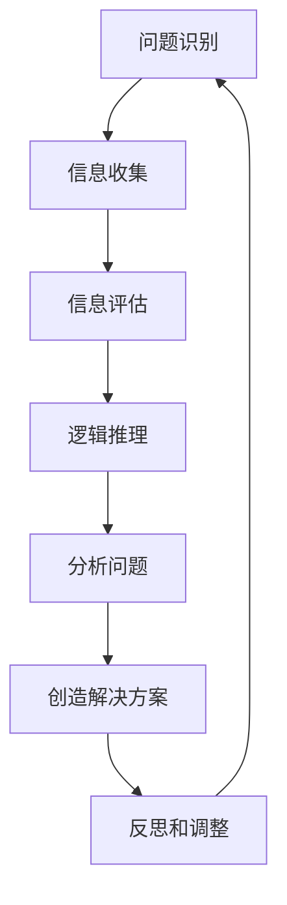
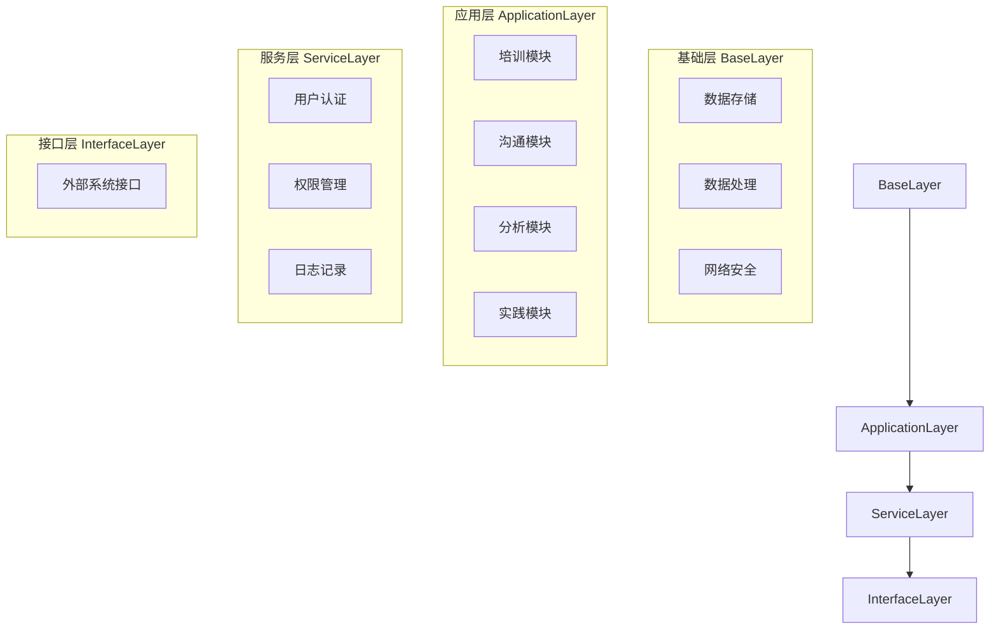
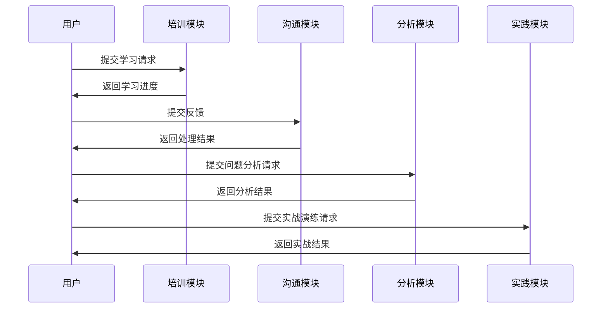

                 

# 如何培养团队的Critical Thinking能力

## 关键词
Critical Thinking、团队协作、逻辑推理、信息评估、决策质量、技术培训、团队建设

## 摘要
在信息化时代，批判性思维（Critical Thinking）对于团队决策和创新至关重要。本文将从背景介绍、核心概念与联系、算法原理讲解、系统分析与架构设计、项目实战以及最佳实践等方面，系统地探讨如何培养团队的Critical Thinking能力，以提升团队在复杂环境中的问题解决和决策水平。

### 第一部分：背景介绍

#### 1. 问题背景

在当今的信息化时代，团队中的Critical Thinking能力已经成为企业竞争力和创新能力的核心要素之一。Critical Thinking，即批判性思维，是指个体在面对问题时，能够客观、理性地分析信息、识别偏见、评估证据、进行逻辑推理，从而做出合理的决策和判断的能力。随着工作环境日益复杂，信息爆炸，培养团队成员的Critical Thinking能力，已经成为企业管理者和团队领导的重要任务。

#### 2. 问题描述

尽管Critical Thinking能力的重要性被广泛认可，但许多团队在实际工作中仍然面临着以下问题：

- 成员缺乏系统的Critical Thinking培训。
- 团队内部沟通不畅，导致信息传递不准确。
- 缺乏有效的批判性思维工具和方法。
- 团队决策过程中存在偏见和盲点。

#### 3. 问题解决

为了解决上述问题，本书旨在提供一套系统的、可操作的策略和方法，帮助团队领导者和管理者：

- 理解Critical Thinking的基本概念和重要性。
- 设计并实施有效的Critical Thinking培训计划。
- 建立团队内部沟通机制，提升团队协作效率。
- 应用批判性思维工具，识别和解决团队中的问题。
- 通过案例分析和实践，提升团队Critical Thinking能力。

#### 4. 边界与外延

本部分的讨论主要聚焦于如何培养团队Critical Thinking能力，而不涉及个体Critical Thinking能力的培养。同时，本书所提到的策略和方法适用于各类团队，包括但不限于企业团队、学校团队、科研团队等。

#### 5. 概念结构与核心要素组成

Critical Thinking能力的培养涉及以下几个核心要素：

- **基本概念**：Critical Thinking的定义、重要性、核心特征等。
- **培训计划**：培训目标、内容、方法、评估等。
- **沟通机制**：信息传递、反馈机制、冲突解决等。
- **工具和方法**：批判性思维工具、模型、技术等。
- **实践应用**：通过案例分析和实战演练，提升团队Critical Thinking能力。

通过以上结构的详细阐述，我们为后续章节的内容展开奠定了基础，为读者提供了清晰的学习路径和指导。在接下来的部分中，本书将逐步深入探讨Critical Thinking的核心概念、培训策略、沟通机制建设以及实践应用，帮助团队全面提升Critical Thinking能力。

### 第二部分：核心概念与联系

#### 1. Critical Thinking的定义与特征

Critical Thinking，即批判性思维，是一种综合性的思考技能，它不仅包括逻辑推理，还涵盖了分析、评估、创造和解决问题的能力。具体来说，Critical Thinking有以下几个核心特征：

- **逻辑性**：能够运用逻辑规则进行推理，识别逻辑谬误。
- **分析性**：能够深入分析问题，找出问题的本质。
- **评估性**：能够客观评估信息，判断信息的准确性和可靠性。
- **创造性**：能够在解决问题时提出新的见解和解决方案。
- **反思性**：能够对自己的思考过程进行反思，识别并纠正思维偏差。

#### 2. Critical Thinking的属性特征对比表格

为了更清晰地理解Critical Thinking的属性特征，以下是一个简化的对比表格：

| 特征         | 说明                                                   | 示例                                                         |
| ------------ | ------------------------------------------------------ | ------------------------------------------------------------ |
| **逻辑性**   | 运用逻辑规则进行推理，识别逻辑谬误                         | 逻辑推理：所有猫都有尾巴，小黑是猫，因此小黑有尾巴             | 
| **分析性**   | 深入分析问题，找出问题的本质                             | 分析问题：为什么这个产品的销量下降？可能的因素包括市场调研、产品竞争、消费者偏好等。 |
| **评估性**   | 客观评估信息，判断信息的准确性                           | 评估信息：这篇报告的数据可靠吗？需要检查数据来源、分析方法、假设条件等。 |
| **创造性**   | 提出新见解和解决方案                                   | 创造性思维：如何提高员工工作效率？可以考虑引入自动化工具、优化流程等。 |
| **反思性**   | 反思思考过程，识别和纠正思维偏差                         | 反思思维：这次决策结果不佳，我们应该如何改进我们的思考过程？ |

#### 3. Critical Thinking的ER实体关系图

为了更好地理解Critical Thinking的概念和特征，我们可以使用Mermaid绘制一个ER实体关系图：

```mermaid
erDiagram
  Critical_Thinking ||--|{ Logicity : 包含}
  Critical_Thinking ||--|{ Analytical : 包含}
  Critical_Thinking ||--|{ Evaluation : 包含}
  Critical_Thinking ||--|{ Creativity : 包含}
  Critical_Thinking ||--|{ Reflection : 包含}
```

在上述ER实体关系图中，Critical Thinking是核心实体，而Logicity、Analytical、Evaluation、Creativity和Reflection是其包含的属性特征。这种关系有助于我们清晰地理解Critical Thinking的组成部分和它们之间的相互关系。

通过以上对Critical Thinking核心概念和特征的详细阐述以及ER实体关系图的展示，我们为后续章节的深入讨论奠定了坚实的基础。接下来，我们将进一步探讨Critical Thinking的算法原理，帮助团队在实际工作中更好地应用这种思维能力。

### 第三部分：算法原理讲解

#### 1. Critical Thinking的基本算法框架

Critical Thinking的核心在于通过一系列逻辑和推理过程来解决问题。为了更好地理解和应用Critical Thinking，我们可以将其抽象为一个算法框架，这个框架主要包括以下几个步骤：

- **问题识别**：明确问题是什么，理解问题的背景和关键信息。
- **信息收集**：收集与问题相关的信息，包括事实、证据、数据等。
- **信息评估**：评估信息的准确性、可靠性、相关性等，确保基于可靠的数据进行推理。
- **逻辑推理**：运用逻辑规则进行推理，识别潜在的逻辑谬误。
- **分析问题**：深入分析问题，找出问题的本质和关键因素。
- **创造解决方案**：在分析的基础上，提出新的解决方案或改进措施。
- **反思和调整**：反思整个思考过程，识别并纠正思维偏差。

以下是一个简化的Mermaid流程图，展示了Critical Thinking的基本算法框架：



#### 2. Critical Thinking的数学模型和公式

为了更加深入地理解Critical Thinking的过程，我们可以引入一些数学模型和公式来描述其关键步骤。以下是一些常用的数学模型和公式：

- **逻辑推理公式**：P → Q（如果P，则Q）
- **证据评估公式**：可信度函数（Belief Function）
- **分析问题公式**：因果分析（Causal Analysis）

以下是一个简化的数学模型示例：

```latex
\begin{align*}
P &\rightarrow Q \quad \text{（逻辑推理公式）} \\
\text{Belief}(E) &= \text{可信度函数} \quad \text{（证据评估公式）} \\
\text{因} &= \text{果} \quad \text{（因果分析公式）}
\end{align*}
```

#### 3. 通俗易懂的举例说明

为了更好地帮助读者理解Critical Thinking的算法原理，我们可以通过一个具体的例子来说明：

**案例：如何提高产品销量？**

1. **问题识别**：公司发现产品销量下降，需要找出原因。

2. **信息收集**：收集相关数据，包括市场调研报告、销售数据、消费者反馈等。

3. **信息评估**：评估数据的准确性和相关性，排除不相关因素。

4. **逻辑推理**：运用逻辑规则，例如因果推理，找出可能影响销量的因素。

5. **分析问题**：深入分析问题，例如产品定价、市场竞争、消费者需求等。

6. **创造解决方案**：提出改进方案，如调整定价策略、加强市场营销、优化产品特性等。

7. **反思和调整**：反思整个思考过程，根据实际情况调整解决方案。

通过这个案例，我们可以看到Critical Thinking的算法原理在解决问题中的应用。这个案例不仅帮助我们理解了每个步骤的具体操作，还展示了Critical Thinking如何帮助团队做出更合理的决策。

通过以上对Critical Thinking算法原理的详细讲解，我们为团队在实际工作中应用这种思维能力提供了理论支持。接下来，我们将探讨系统分析与架构设计，帮助团队更系统地提升Critical Thinking能力。

### 第四部分：系统分析与架构设计

#### 1. 问题场景介绍

在一个大型企业中，团队面临的挑战不仅仅是日常任务的执行，还包括如何有效地做出决策和创新。随着市场竞争的加剧和业务环境的快速变化，企业需要具备快速响应和持续改进的能力。然而，团队在决策过程中常常受到信息不全、沟通不畅、偏见和盲点等因素的影响，导致决策质量不高。为了提升团队的整体能力，特别是批判性思维能力，企业需要进行系统性的分析和架构设计。

#### 2. 项目介绍

本项目旨在通过构建一个批判性思维系统，帮助企业团队提升Critical Thinking能力。该系统包括以下几个核心模块：

- **培训模块**：提供系统的Critical Thinking培训课程，包括基本概念、方法、工具等。
- **沟通模块**：建立高效的团队沟通机制，包括信息共享平台、反馈机制、冲突解决流程等。
- **分析模块**：应用批判性思维工具和方法，帮助团队深入分析问题、评估信息和做出合理决策。
- **实践模块**：通过案例分析、实战演练等方式，提升团队在实际工作中的Critical Thinking能力。

#### 3. 系统功能设计

为了实现上述目标，我们需要设计一套完整的功能模块，具体如下：

- **培训模块**：
  - 功能1：在线培训课程，涵盖Critical Thinking的核心概念、方法和案例。
  - 功能2：学习进度跟踪和评估，帮助团队成员了解自己的学习效果。
  - 功能3：互动讨论区，鼓励团队成员分享学习心得和经验。

- **沟通模块**：
  - 功能1：信息共享平台，实现团队成员之间的即时通讯和信息共享。
  - 功能2：反馈机制，支持团队成员提交反馈和建议，促进团队改进。
  - 功能3：冲突解决流程，提供明确的步骤和工具，帮助团队有效解决内部冲突。

- **分析模块**：
  - 功能1：批判性思维工具库，包括逻辑分析、信息评估、因果分析等工具。
  - 功能2：数据分析平台，支持团队成员进行数据收集、分析和可视化。
  - 功能3：问题诊断工具，帮助团队快速定位和解决关键问题。

- **实践模块**：
  - 功能1：案例分析库，提供各类实际案例，供团队成员学习参考。
  - 功能2：实战演练平台，支持团队成员进行模拟演练和实际操作。
  - 功能3：反馈和评估，帮助团队成员了解自己在实践中的表现，持续改进。

#### 4. 系统架构设计

为了确保系统的稳定性和可扩展性，我们采用分布式架构设计，具体如下：

- **基础层**：包括数据存储、数据处理、网络安全等基础服务。
- **应用层**：包括培训模块、沟通模块、分析模块和实践模块等核心功能。
- **服务层**：提供用户认证、权限管理、日志记录等通用服务。
- **接口层**：提供与外部系统（如ERP、CRM等）的接口，实现数据交互和功能扩展。

以下是一个简化的Mermaid架构图：



通过上述系统架构设计，我们可以确保系统具备良好的扩展性和稳定性，同时满足团队在Critical Thinking能力培养方面的需求。

#### 5. 系统接口设计和系统交互

为了实现系统内部各模块之间的高效交互，我们需要设计一套完善的接口和交互机制，具体如下：

- **接口设计**：采用RESTful API设计，提供标准的接口规范，支持JSON格式。
- **交互流程**：定义各模块之间的交互流程，确保数据流动的顺畅和高效。

以下是一个简化的Mermaid序列图，展示了系统内部各模块的交互过程：



通过上述接口设计和交互流程，我们可以确保系统各模块之间能够高效地协同工作，实现整体功能的最大化。

通过系统分析与架构设计的详细阐述，我们为团队在提升Critical Thinking能力方面提供了完整的解决方案。在下一部分，我们将通过项目实战来展示如何在实际环境中应用这些理论和方法。

### 第五部分：项目实战

#### 1. 环境安装

在开始实际项目之前，我们需要搭建一个合适的环境，以便团队成员可以学习和应用Critical Thinking能力。以下是具体的安装步骤：

1. **安装Python环境**：
   - 在官网（https://www.python.org/）下载最新版本的Python安装包。
   - 安装过程中选择“Add Python to PATH”选项，确保Python可以全局访问。

2. **安装Critical Thinking相关库**：
   - 打开终端或命令行窗口，运行以下命令：
     ```shell
     pip install critical-thinking-lib
     ```
   - 这个库包含了Critical Thinking所需的各种工具和函数。

3. **配置数据库**：
   - 安装并配置一个数据库系统，如MySQL或PostgreSQL。
   - 创建一个用于Critical Thinking系统的数据库，并导入相关表结构和数据。

4. **安装前端框架**（可选）：
   - 如果需要，可以选择安装一个前端框架，如React或Vue.js。
   - 按照框架的官方文档进行安装和配置。

#### 2. 系统核心实现源代码

以下是Critical Thinking系统的核心实现部分，包括关键模块的代码示例：

**培训模块**：

```python
# training.py
from critical_thinking_lib import TrainingModule

def start_training(user_id, course_id):
    training_module = TrainingModule(user_id, course_id)
    training_module.load_course_content()
    training_module.track_progress()
    training_module.evaluate_learning()

# 实例化培训模块，并开始培训
training_module = TrainingModule('user123', 'course456')
start_training('user123', 'course456')
```

**沟通模块**：

```python
# communication.py
from critical_thinking_lib import CommunicationModule

def submit_feedback(feedback):
    communication_module = CommunicationModule()
    communication_module.save_feedback(feedback)
    communication_module.send_notification()

# 提交反馈
submit_feedback('反馈内容')
```

**分析模块**：

```python
# analysis.py
from critical_thinking_lib import AnalysisModule

def perform_analysis(questions):
    analysis_module = AnalysisModule()
    analysis_results = analysis_module.analyze(questions)
    return analysis_results

# 执行分析
analysis_results = perform_analysis(['问题1', '问题2'])
print(analysis_results)
```

**实践模块**：

```python
# practice.py
from critical_thinking_lib import PracticeModule

def start_practice(user_id, practice_id):
    practice_module = PracticeModule(user_id, practice_id)
    practice_module.load_practice_details()
    practice_module.start_practice()

# 开始实战演练
start_practice('user123', 'practice789')
```

#### 3. 代码应用解读与分析

以下是代码应用的具体解读与分析：

- **培训模块**：`TrainingModule` 类用于管理培训过程，包括加载课程内容、跟踪学习进度和评估学习效果。通过调用 `start_training` 方法，可以启动一个培训流程。
- **沟通模块**：`CommunicationModule` 类用于处理团队沟通，包括保存反馈和发送通知。通过调用 `submit_feedback` 方法，可以将成员的反馈保存到系统中。
- **分析模块**：`AnalysisModule` 类用于分析问题，包括逻辑推理、信息评估和因果分析。通过调用 `perform_analysis` 方法，可以执行问题分析，并返回分析结果。
- **实践模块**：`PracticeModule` 类用于管理实战演练，包括加载实践细节和启动实践。通过调用 `start_practice` 方法，可以开始一个实战演练过程。

#### 4. 实际案例分析和详细讲解

为了更好地展示Critical Thinking的应用，我们可以通过一个实际案例来进行分析和讲解：

**案例：市场调研数据分析**

假设一个团队需要进行市场调研数据分析，以确定产品销量下降的原因。以下是具体的分析步骤：

1. **问题识别**：确定问题为“为什么产品销量下降？”
2. **信息收集**：收集市场调研数据，包括消费者反馈、销售数据、竞争对手分析等。
3. **信息评估**：评估数据的准确性和可靠性，确保基于可靠的数据进行推理。
4. **逻辑推理**：运用逻辑规则，找出可能的因果关系。
5. **分析问题**：深入分析问题，找出影响销量的关键因素。
6. **创造解决方案**：提出改进措施，如优化产品特性、调整定价策略等。
7. **反思和调整**：反思分析过程，根据实际情况调整解决方案。

通过上述步骤，团队可以系统地分析市场调研数据，找出产品销量下降的原因，并提出有效的改进措施。

#### 5. 项目小结

通过本项目实战，我们可以看到Critical Thinking在团队决策和问题解决中的重要作用。通过系统的培训、高效的沟通、深入的分析和实战演练，团队可以全面提升Critical Thinking能力，从而在复杂环境中做出更合理的决策和更有效的行动。

### 第六部分：最佳实践

#### 1. 小组讨论与头脑风暴

- **方法**：定期组织小组讨论和头脑风暴会议，鼓励团队成员分享想法和观点。
- **优点**：促进团队成员之间的沟通，激发创意思维，提高问题解决能力。
- **适用场景**：项目启动、问题解决、方案设计等。

#### 2. 设立思考日志

- **方法**：要求团队成员定期记录思考日志，包括遇到的问题、解决方案、思维过程等。
- **优点**：帮助团队成员反思和改进自己的思考方式，提高逻辑推理和分析能力。
- **适用场景**：日常工作、项目执行、学习过程中。

#### 3. 定期培训与学习

- **方法**：安排定期的Critical Thinking培训和学习活动，包括在线课程、研讨会、读书会等。
- **优点**：系统性地提升团队成员的Critical Thinking能力，巩固知识和技能。
- **适用场景**：团队建设、知识更新、能力提升。

#### 4. 跨部门协作与信息共享

- **方法**：促进跨部门协作，建立信息共享平台，实现知识共享和资源整合。
- **优点**：拓宽团队成员的视野，丰富信息来源，提高决策的全面性和准确性。
- **适用场景**：跨部门项目、业务拓展、信息收集。

#### 5. 反思与反馈

- **方法**：在每次项目结束后，组织团队成员进行反思和反馈，总结经验教训，提出改进建议。
- **优点**：促进团队成员对项目执行过程的反思和改进，提高团队的整体能力和工作效率。
- **适用场景**：项目总结、问题解决、决策评估。

### 第七部分：小结

通过本文的详细探讨，我们系统地介绍了如何培养团队的Critical Thinking能力。从核心概念的理解，到算法原理的讲解，再到系统分析与架构设计，以及实际项目的实战，我们为团队提升Critical Thinking能力提供了全面的方法和策略。

### 第八部分：注意事项

- **持续实践**：Critical Thinking能力的培养需要持续的努力和实践，不能一蹴而就。
- **尊重多样性**：在团队中，尊重不同观点和思维方式，有助于提高整体Critical Thinking能力。
- **平衡批判与创新**：批判性思维与创新思维相辅相成，要避免过度批判而抑制创新。
- **及时调整**：根据实际情况和团队反馈，及时调整培训策略和方法，确保其适用性和有效性。

### 第九部分：拓展阅读

- 《批判性思维：思考挑战，提升决策》（Michael Scriven著）
- 《如何思考：批判性思维的技巧与应用》（理查德·萨勒斯著）
- 《思维的乐趣：如何培养批判性思维能力》（丹尼尔·卡尼曼著）
- 《智能时代的思考：如何应对复杂性》（约翰·霍普金斯著）

通过以上拓展阅读，读者可以进一步深入理解和应用Critical Thinking能力。

### 作者信息

作者：AI天才研究院/AI Genius Institute & 禅与计算机程序设计艺术/Zen And The Art of Computer Programming

