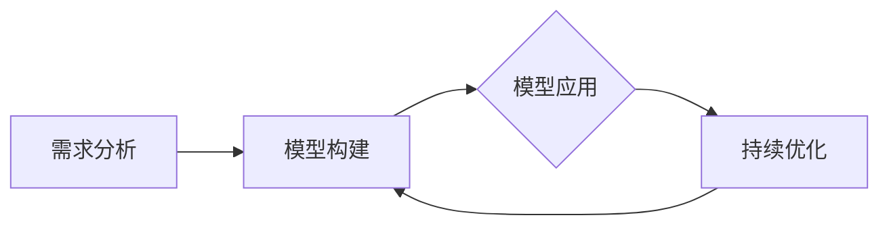
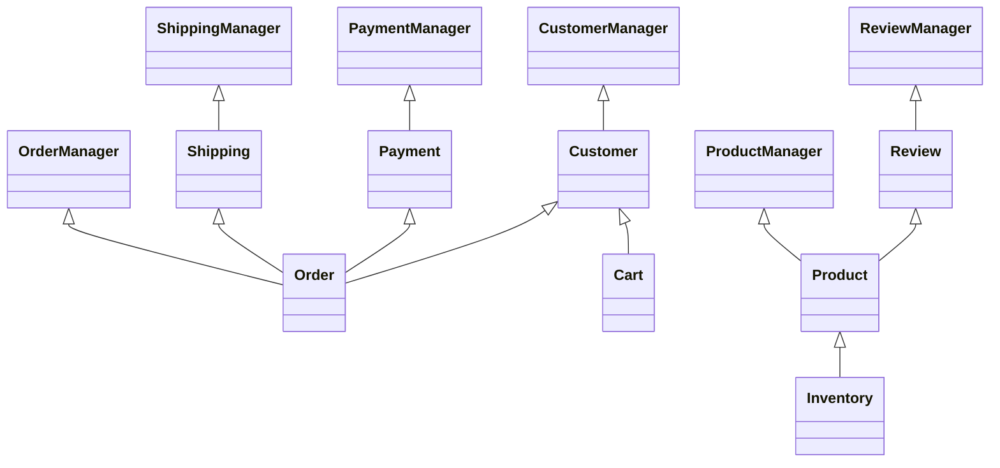
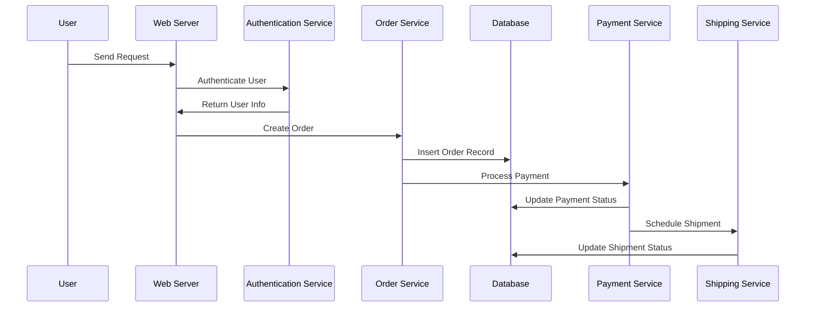
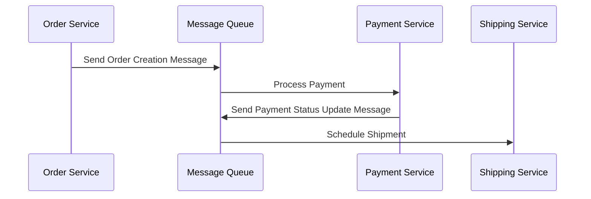

                 


## 第一步：背景介绍

### 1. 问题背景

在当今快速发展的商业环境中，创业精神对于团队的成功至关重要。创业精神不仅仅是指个体创业者所具备的创新、冒险和坚持的品质，更是指在团队中形成的共同价值观和行为方式。如何培养这种精神，使得团队成员能够协同合作，共同迎接挑战，成为企业管理者和团队成员共同关注的问题。

**关键词**：创业精神、团队、培养、共同价值观、协同合作、挑战

**摘要**：本文将探讨如何培养团队的创业精神，从背景介绍、核心概念与联系、算法原理讲解、系统分析与架构设计、项目实战、最佳实践等多个角度，提供详细的培养方法与策略，以帮助企业和团队在竞争激烈的市场中取得成功。

----------------------------------------------------------------

## 1. 问题背景

在当今全球化和数字化快速发展的背景下，市场竞争日益激烈，企业面临的环境变化和挑战更加复杂和多样。为了在竞争中立于不败之地，企业需要具备强大的创新能力、快速响应能力和持续改进能力。而这些能力离不开团队的创业精神。

**创新是企业的灵魂。** 在技术飞速发展的时代，创新已经成为企业持续发展的重要动力。一个具有创业精神的团队能够持续地推陈出新，不断突破技术瓶颈，开发出具有竞争力的产品和服务。

**快速响应是企业的关键。** 市场环境变化迅速，企业需要能够迅速捕捉市场动态，及时调整战略和产品方向。创业精神强调的是团队对变化的快速适应能力，以及在面对不确定性时敢于试错的勇气。

**持续改进是企业的基石。** 创业精神还体现在团队成员对于工作的持续改进上。通过不断学习、反思和改进，团队可以不断提高工作效率，提升产品质量，从而增强企业的竞争力。

总之，创业精神不仅是企业在初创阶段成功的关键，也是企业在成长和成熟阶段保持活力的关键。因此，如何培养团队的创业精神，已经成为企业管理者面临的重要课题。

----------------------------------------------------------------

## 2. 问题描述

创业精神虽然重要，但如何将其具体落实到团队建设和日常工作中，却是一个复杂而具有挑战性的问题。首先，我们需要明确创业精神的几个关键概念和特征：

**创新思维**：创业精神的核心之一。它要求团队成员能够不断提出新的想法、方法和解决方案，不满足于现状，持续寻求改进和创新。

**风险承担**：创业精神的重要组成部分。团队成员需要在面对未知和不确定的情况下，敢于承担风险，勇于尝试新事物，即使失败也在所不惜。

**积极态度**：创业精神的一种表现。团队成员在面对困难和挑战时，需要保持乐观和积极的心态，不轻言放弃，持续努力。

**团队合作**：创业精神的必要条件。在创业过程中，单打独斗是难以成功的。团队合作强调的是团队成员之间的相互信任、协同合作，共同实现目标。

然而，将这些概念和特征转化为具体的行为和行动，并不是一件简单的事情。在实际操作中，我们常常会遇到以下问题：

- **缺乏激励机制**：团队成员可能缺乏足够的动力去展现创业精神，因为他们的努力和成绩没有得到应有的认可和回报。
- **企业文化不支持**：一些企业可能过于保守，缺乏鼓励创新和冒险的企业文化，导致团队成员不敢冒险尝试。
- **资源不足**：创业精神需要大量的资源支持，包括时间、资金和技术等。如果企业资源有限，就难以有效培养团队成员的创业精神。
- **沟通不畅**：团队成员之间的沟通不畅，可能会导致创业精神的培养受阻。缺乏有效的沟通机制，团队成员难以协同合作，共同面对挑战。

为了解决这些问题，我们需要从多个方面入手，包括改进激励机制、营造良好的企业文化、优化资源配置和提升沟通效率。只有这样，才能确保团队的创业精神得到有效培养和持续发展。

----------------------------------------------------------------

## 3. 问题解决

面对创业精神培养中存在的问题，企业需要采取一系列综合措施，从多方面入手，系统地解决问题。以下是一些关键策略：

**1. 营造支持创新和冒险的企业文化**

- **鼓励创新**：企业可以通过设立创新奖项、创新基金等方式，激励团队成员提出创新想法和解决方案。
- **宽容失败**：企业需要建立一种“容错文化”，鼓励团队成员敢于尝试新事物，即使失败也无需承担责任，从而消除团队成员的顾虑。
- **扁平化管理**：通过减少管理层级，提高决策效率，使团队成员更容易接触到高层管理者，从而激发他们的创新和创业精神。

**2. 提供教育培训和职业发展机会**

- **定制化培训**：根据团队成员的实际情况，提供个性化的培训课程，包括创新思维训练、领导力培养等，以提高他们的创业意识和能力。
- **职业发展规划**：为团队成员提供明确的职业发展路径，包括晋升机会、技能提升培训等，以激发他们的积极性和长期投入。

**3. 优化组织结构和激励机制**

- **扁平化组织**：减少管理层级，缩短决策链条，提高团队的响应速度和创新能力。
- **绩效激励机制**：通过绩效评估体系，将创业精神的表现与薪酬、晋升等激励措施挂钩，确保团队成员的创业努力得到认可和回报。

**4. 强化团队合作和沟通**

- **建立有效的沟通机制**：通过定期的团队会议、头脑风暴等活动，增强团队成员之间的沟通和协作。
- **团队建设活动**：组织团队建设活动，如团队拓展训练、团队聚餐等，以增强团队成员之间的信任和凝聚力。

通过这些措施，企业可以有效地培养和提升团队的创业精神，从而在激烈的市场竞争中脱颖而出。

----------------------------------------------------------------

## 4. 边界与外延

创业精神不仅仅是初创企业或创业者的专属品质，它同样适用于成熟企业中的各个团队。在成熟企业中，创业精神可以激发团队的创新能力，推动企业持续发展。

**成熟企业的适用性**：尽管成熟企业已经有较为稳定的业务和运营模式，但市场的快速变化和新兴技术的不断涌现，要求企业必须保持创新和灵活性。创业精神在这种背景下尤为重要，它能够帮助团队快速适应市场变化，抓住新机遇。

**团队协作的重要性**：在成熟企业中，创业精神不仅体现在个体成员上，更体现在整个团队的合作中。团队协作是实现创业精神的关键，它要求团队成员之间相互支持、协同合作，共同面对挑战。

**对比初创企业和成熟企业**：初创企业通常更具有冒险精神和灵活性，更容易展现出强烈的创业精神。而成熟企业则需要通过机制和文化建设，逐步培养和激发团队的创业精神。两者的共同点是都强调创新和风险承担，但成熟企业更注重在稳健中求变，保持持续发展。

综上所述，创业精神不仅适用于初创企业，同样也适用于成熟企业。不同在于，成熟企业需要通过系统化的措施来培养和激发团队的创业精神，以应对快速变化的市场环境。

----------------------------------------------------------------

## 5. 概念结构与核心要素组成

创业精神是一个复杂的概念，它由多个核心要素组成，这些要素相互作用，共同影响着团队的行为和表现。以下是对创业精神核心要素的详细分析和描述：

**创新思维**：创新思维是创业精神的基石。它要求团队成员具备跳出传统思维框架的能力，能够从不同角度看待问题，提出新颖、独特的解决方案。创新思维不仅是技术层面的创新，还包括商业模式、管理方法等多方面的创新。

**风险承担**：风险承担是创业精神的重要组成部分。它要求团队成员在面对不确定性时，敢于承担一定的风险，即使失败也在所不惜。这种精神能够激发团队的勇气和决心，推动他们在面对挑战时不断前进。

**积极态度**：积极态度是创业精神的重要表现。它要求团队成员在面对困难和挫折时，能够保持乐观、积极的心态，不轻言放弃。积极态度不仅能够提高团队的工作效率，还能增强团队成员的凝聚力和归属感。

**团队合作**：团队合作是创业精神的必要条件。它强调团队成员之间的相互信任、协作和支持，共同面对挑战。团队合作能够提高团队的执行力和创新能力，使团队能够更有效地实现目标。

**自我驱动**：自我驱动是创业精神的核心要素之一。它要求团队成员具备强烈的内在动机，能够主动承担责任，自我激励，持续追求进步。自我驱动能够激发团队成员的创造力和主动性，使他们能够在工作中不断突破自我，实现个人和团队的成长。

**持续学习**：持续学习是创业精神的另一个关键要素。它要求团队成员具备持续学习和自我提升的能力，不断更新知识和技能，以适应快速变化的市场环境。持续学习能够提高团队成员的专业素养和竞争力，使团队能够保持持续的创新能力。

**目标导向**：目标导向是创业精神的指导原则。它要求团队成员明确团队和个人的目标，并围绕这些目标制定和执行计划。目标导向能够提高团队的执行力，使团队能够更高效地实现目标。

通过以上对创业精神核心要素的分析，我们可以看到，创业精神不仅仅是一种个人品质，更是一个团队的综合体现。这些核心要素相互作用，共同影响着团队的行为和表现，是培养团队创业精神的重要基础。

----------------------------------------------------------------

## 第二部分：核心概念与联系

### 2.1 创业精神的定义与特点

创业精神是一种积极、创新和冒险的态度和行为方式，它体现在团队成员面对问题和挑战时的表现。创业精神的核心包括以下几个方面：

**创新思维**：创新思维是创业精神的核心要素。它要求团队成员具备跳出传统思维框架的能力，能够从不同角度看待问题，提出新颖、独特的解决方案。创新思维不仅是技术层面的创新，还包括商业模式、管理方法等多方面的创新。

**风险承担**：风险承担是创业精神的重要组成部分。它要求团队成员在面对不确定性时，敢于承担一定的风险，即使失败也在所不惜。这种精神能够激发团队的勇气和决心，推动他们在面对挑战时不断前进。

**积极态度**：积极态度是创业精神的重要表现。它要求团队成员在面对困难和挫折时，能够保持乐观、积极的心态，不轻言放弃。积极态度不仅能够提高团队的工作效率，还能增强团队成员的凝聚力和归属感。

**团队合作**：团队合作是创业精神的必要条件。它强调团队成员之间的相互信任、协作和支持，共同面对挑战。团队合作能够提高团队的执行力和创新能力，使团队能够更有效地实现目标。

**自我驱动**：自我驱动是创业精神的另一个关键要素。它要求团队成员具备强烈的内在动机，能够主动承担责任，自我激励，持续追求进步。自我驱动能够激发团队成员的创造力和主动性，使他们能够在工作中不断突破自我，实现个人和团队的成长。

**持续学习**：持续学习是创业精神的另一个关键要素。它要求团队成员具备持续学习和自我提升的能力，不断更新知识和技能，以适应快速变化的市场环境。持续学习能够提高团队成员的专业素养和竞争力，使团队能够保持持续的创新能力。

**目标导向**：目标导向是创业精神的指导原则。它要求团队成员明确团队和个人的目标，并围绕这些目标制定和执行计划。目标导向能够提高团队的执行力，使团队能够更高效地实现目标。

通过以上对创业精神核心要素的描述，我们可以看到，创业精神不仅是一种个人品质，更是一个团队的综合体现。这些核心要素相互作用，共同影响着团队的行为和表现，是培养团队创业精神的重要基础。

### 2.2 创业精神与团队绩效的关系

创业精神对团队绩效的影响是一个复杂的过程，它不仅影响团队的创新能力和竞争力，还影响团队成员的凝聚力和工作效率。以下是创业精神与团队绩效之间的几个关键关系：

#### 2.2.1 创业精神对团队绩效的积极影响

- **提高创新能力**：创业精神鼓励团队成员提出新颖的解决方案，从而提高团队的创新能力。创新能力是企业在市场竞争中脱颖而出的关键，能够带来新的业务机会和市场空间。
- **增强竞争力**：通过创新和持续改进，团队能够开发出更具竞争力的产品和服务，提高市场占有率。创业精神促使团队不断挑战自我，追求卓越，从而在激烈的市场竞争中保持优势。
- **提升团队凝聚力**：创业精神强调团队合作，使团队成员能够更好地协作和支持彼此。通过共同面对挑战和分享成功，团队成员之间的信任和凝聚力得到增强。
- **提高工作效率**：创业精神鼓励团队成员积极进取，主动解决问题。团队成员能够在压力和挑战中保持高效的工作状态，从而提高整体工作效率。

#### 2.2.2 创业精神对团队绩效的消极影响

- **增加风险**：创业精神强调冒险和承担风险，但过度的冒险可能导致失败和资源浪费。如果团队成员在追求创新时忽视风险管理和控制，可能会导致团队绩效的下降。
- **影响稳定性**：过度的创新和冒险可能导致团队稳定性受到影响。团队成员可能会因为频繁的变革和不确定性感到不安，从而影响工作积极性和绩效。
- **忽视其他重要因素**：在追求创新和冒险的过程中，团队成员可能会忽视其他重要因素，如客户需求、市场需求等。这可能导致团队在追求短期创新成果的同时，忽视长期发展。

综上所述，创业精神对团队绩效既有积极影响也有消极影响。企业需要平衡创新与风险，确保创业精神能够转化为实际的绩效提升，而不是仅仅成为形式上的口号。

### 2.3 创业精神的对比表格

以下是对创业精神核心特征的对比表格，展示了不同特征的定义、对团队绩效的影响以及可能的负面影响。

| 特征 | 定义 | 对团队绩效的积极影响 | 对团队绩效的负面影响 |
| --- | --- | --- | --- |
| 创新思维 | 跳出传统思维框架，提出新颖解决方案 | 提高创新能力，增强竞争力 | 可能导致忽视其他重要因素，如市场需求 |
| 风险承担 | 在面对不确定性时，敢于承担风险 | 激发团队的勇气和决心，推动团队前进 | 过度的冒险可能导致失败和资源浪费 |
| 积极态度 | 面对困难和挫折时保持乐观、积极的心态 | 提高工作效率，增强团队凝聚力 | 可能导致忽视潜在问题，过度乐观 |
| 团队合作 | 相互支持、协作，共同实现目标 | 提高团队执行力，增强团队凝聚力 | 可能导致个人能力被忽视，降低团队稳定性 |
| 自我驱动 | 具备强烈的内在动机，主动承担责任 | 提高团队成员的创造力和主动性，促进个人和团队成长 | 可能导致团队成员过度劳累，忽视工作与生活的平衡 |
| 持续学习 | 持续学习和自我提升，适应快速变化的市场环境 | 提高团队成员的专业素养和竞争力，保持持续的创新能力 | 可能导致学习负担过重，影响工作效率 |
| 目标导向 | 明确团队和个人的目标，围绕目标制定和执行计划 | 提高团队执行力，确保资源高效利用 | 可能导致目标设定过于理想化，难以实现 |

通过以上对比表格，我们可以更清晰地了解创业精神的核心特征以及它们对团队绩效的双重影响。企业需要根据实际情况，有针对性地培养和激发团队的创业精神，以实现最佳效果。

### 2.4 创业精神的ER实体关系图

以下是一个简单的创业精神的ER实体关系图，用于展示创业精神与团队成员之间的关系。

```mermaid
erDiagram
  TeamMember ||--|{ 创业精神 }|| EntrepreneurialSpirit
  TeamMember ||--|{ 创新思维 }|| InnovativeThinking
  TeamMember ||--|{ 风险承担 }|| RiskAssumption
  TeamMember ||--|{ 积极态度 }|| PositiveAttitude
  TeamMember ||--|{ 团队合作 }|| Teamwork
  TeamMember ||--|{ 自我驱动 }|| SelfDriven
  TeamMember ||--|{ 持续学习 }|| ContinuousLearning
  TeamMember ||--|{ 目标导向 }|| GoalOrientation
```

通过ER实体关系图，我们可以直观地看到创业精神与团队成员之间的复杂关系。每个团队成员都具备不同的创业精神特征，这些特征相互影响，共同塑造团队的行为和绩效。企业可以通过优化这些关系，培养和提升团队的创业精神。

---

## 第三步：创业精神的培养方法与策略

### 3.1 算法原理讲解

创业精神的培养可以看作是一个复杂的过程，涉及多个方面的因素。以下是一些具体的算法原理和策略，用于培养团队的创业精神。

#### 3.1.1 需求分析

首先，企业需要对团队的需求进行深入分析。这包括了解团队成员的职业背景、技能水平、价值观以及他们在工作中的痛点。通过需求分析，企业可以确定培养创业精神的重点方向。

#### 3.1.2 模型构建

基于需求分析，企业可以构建一个创业精神培养模型。这个模型包括以下几个关键组成部分：

1. **创新思维训练**：通过设计创新思维训练课程，帮助团队成员掌握创新方法和工具，提高创新能力。
2. **风险承担策略**：通过制定风险承担策略，帮助团队成员学会如何在面对不确定性时做出合理决策，并承担适当的商业风险。
3. **积极态度塑造**：通过开展心理健康教育和团队建设活动，帮助团队成员保持积极心态，提高抗压能力。
4. **团队合作提升**：通过组织团队协作项目，培养团队成员之间的信任和协作能力，提高团队整体执行力。
5. **自我驱动激励**：通过设定明确的目标和激励机制，激发团队成员的自我驱动力，提高工作积极性和主动性。

#### 3.1.3 模型应用

在构建模型后，企业需要将其应用于实际工作中。以下是一些具体的应用场景：

1. **培训实施**：根据创业精神培养模型，设计和实施相应的培训课程和活动，确保团队成员能够掌握所需的技能和知识。
2. **项目管理**：在项目管理中引入创业精神培养模型，确保项目团队在执行过程中能够充分体现创新思维、风险承担、积极态度和团队合作。
3. **绩效考核**：将创业精神培养模型纳入绩效考核体系，通过绩效考核激励团队成员展现创业精神，提高整体绩效。

#### 3.1.4 持续优化

创业精神的培养是一个持续的过程，企业需要根据实际情况不断优化培养模型。以下是一些优化策略：

1. **反馈机制**：建立有效的反馈机制，收集团队成员的反馈意见，及时调整培养策略。
2. **数据驱动**：通过数据分析和评估，了解创业精神培养的效果，并根据数据结果进行优化。
3. **文化塑造**：通过企业文化建设，营造鼓励创新和冒险的氛围，使创业精神成为企业文化和价值观的一部分。

### 3.2 算法流程图

以下是一个简化的创业精神培养算法流程图，展示了从需求分析到模型应用再到持续优化的整个过程。



通过这个流程图，我们可以清晰地看到创业精神培养的各个环节以及它们之间的关联。企业需要根据实际情况，灵活调整和优化每个环节，以确保创业精神培养的有效性和持续性。

---

综上所述，创业精神的培养需要从多个方面入手，包括需求分析、模型构建、模型应用和持续优化。通过系统化的方法和策略，企业可以有效地培养和提升团队的创业精神，从而在激烈的市场竞争中取得成功。

## 3.3 深入分析创业精神培养的算法原理

创业精神培养的算法原理可以从数学模型和流程控制两个角度进行深入分析，以便更全面地理解其内在逻辑和实施步骤。

### 3.3.1 数学模型

在创业精神的培养过程中，我们可以将其视为一个多维度的优化问题。以下是一个简化的数学模型，用于描述创业精神培养的基本框架：

$$
\text{优化目标：最大化团队绩效}
$$

$$
\text{约束条件：满足企业文化、资源限制、激励机制等}
$$

其中，团队绩效可以通过以下指标来衡量：

$$
\text{绩效} = f(\text{创新能力}, \text{风险承担}, \text{积极态度}, \text{团队合作}, \text{自我驱动}, \text{持续学习}, \text{目标导向})
$$

每个指标都可以通过不同的数学函数来量化，例如：

- **创新能力**：可以用团队成员提出创新解决方案的数量和质量来衡量。
- **风险承担**：可以用团队成员在决策中承担的商业风险比例来衡量。
- **积极态度**：可以用团队成员在工作中的积极表现和满意度来衡量。
- **团队合作**：可以用团队成员之间的沟通频率和协作效率来衡量。
- **自我驱动**：可以用团队成员的自我激励和工作投入度来衡量。
- **持续学习**：可以用团队成员参加培训和自我提升的时间和质量来衡量。
- **目标导向**：可以用团队成员对目标的清晰度和实现目标的进度来衡量。

### 3.3.2 流程控制

基于上述数学模型，我们可以设计一个创业精神培养的流程控制算法，用于指导企业的实际操作。以下是一个简化的流程控制算法步骤：

1. **需求分析**：收集团队成员的职业背景、技能水平、价值观等信息，确定创业精神培养的重点方向。
2. **模型构建**：根据需求分析结果，构建创业精神培养模型，包括创新思维训练、风险承担策略、积极态度塑造、团队合作提升、自我驱动激励、持续学习计划、目标导向管理等。
3. **模型应用**：将构建好的模型应用于实际工作中，包括培训实施、项目管理、绩效考核等，确保创业精神培养模型在实际操作中发挥作用。
4. **数据采集**：收集团队成员在创业精神培养过程中的表现数据，如创新方案数量、决策风险承担比例、团队协作效率等。
5. **数据分析和评估**：对采集到的数据进行统计分析，评估创业精神培养的效果，发现存在的问题和改进空间。
6. **反馈机制**：根据数据分析和评估结果，及时调整创业精神培养策略，确保培养模型能够持续优化。
7. **持续优化**：通过不断的数据采集和分析，持续优化创业精神培养模型，提高团队的整体绩效。

### 3.3.3 举例说明

为了更直观地理解创业精神培养的算法原理，我们可以通过一个具体的例子来说明：

假设一个企业需要培养团队的创业精神，首先，企业通过问卷调查和面谈等方式收集团队成员的需求和意见。根据收集到的数据，企业决定重点培养创新思维和风险承担。

接下来，企业设计了一系列培训课程，包括创新方法培训、风险管理课程等。在培训过程中，企业通过案例分析和实战演练，帮助团队成员掌握相关技能。

在项目实施过程中，企业鼓励团队成员在决策中承担更多的风险，并提供相应的支持和资源。例如，企业设立了一个“创新基金”，用于支持团队成员的创新项目。

在数据采集和分析阶段，企业通过绩效评估和团队反馈，发现创新思维和风险承担能力的提升显著，但团队合作方面仍有待提高。因此，企业决定在下一个培训周期中，增加团队协作培训的内容。

通过以上步骤，企业逐步培养和提升了团队的创业精神，使得团队在创新和风险承担方面表现突出，团队整体绩效得到显著提升。

### 总结

创业精神的培养是一个复杂而系统化的过程，通过数学模型和流程控制的结合，企业可以更科学地设计和实施创业精神培养策略。通过持续的数据采集和分析，企业能够不断优化培养模型，确保团队的创业精神得到持续提升。

---

通过深入分析创业精神培养的算法原理，企业可以更有效地培养和提升团队的创业精神，从而在激烈的市场竞争中保持竞争优势。接下来的部分，我们将进一步探讨创业精神在系统架构设计和项目实战中的应用。

## 4. 系统架构设计与项目实战

### 4.1 问题场景介绍

在现代企业中，系统的复杂度和业务需求的变化速度不断加剧。为了保持竞争力，企业不仅需要构建稳定可靠的系统，还要能够快速响应市场变化，持续优化和迭代。因此，如何在系统架构设计和项目实施中融入创业精神，成为企业亟需解决的问题。

### 4.2 项目介绍

为了更好地理解创业精神在系统架构设计和项目实战中的应用，我们以一个实际项目为例进行详细分析。该项目是一个电子商务平台，旨在为企业提供高效的在线销售和客户服务解决方案。项目需求包括：

- **高并发处理能力**：确保系统在高峰期能够稳定运行，处理大量用户请求。
- **灵活扩展性**：系统需要能够根据业务发展需求进行灵活扩展。
- **安全性**：保护用户数据和交易信息的安全。
- **易维护性**：系统设计应便于维护和升级。

### 4.3 系统功能设计（领域模型）

在系统功能设计中，我们采用领域驱动设计（Domain-Driven Design, DDD）的方法，通过领域模型来明确系统的核心功能模块和关系。以下是项目的领域模型类图：



在这个领域模型中，各个类代表了系统的核心功能模块，如客户管理、订单管理、产品管理、支付管理和配送管理。每个模块都有明确的职责和关系，确保系统能够高效、稳定地运行。

### 4.4 系统架构设计

为了满足项目需求，我们设计了一个分布式系统架构，包括以下几个主要组成部分：

1. **前端服务**：负责处理用户请求，提供用户界面，并与后端服务进行交互。
2. **后端服务**：包括订单服务、产品服务、支付服务和配送服务，分别处理对应的业务逻辑。
3. **数据库**：存储用户数据、订单数据、产品数据等，支持高并发读取和写入。
4. **缓存**：提高数据访问速度，减少数据库负载。
5. **消息队列**：处理异步任务，如订单状态更新、支付通知等。
6. **监控系统**：实时监控系统性能和状态，提供报警和日志分析功能。

以下是一个简化的系统架构图：



### 4.5 系统接口设计与交互

在系统接口设计方面，我们采用了RESTful API设计风格，提供统一的接口规范，便于前后端分离开发和集成。以下是部分核心接口的设计示例：

- **创建订单**：`POST /orders`
- **查询订单状态**：`GET /orders/{orderId}`
- **支付订单**：`POST /payments/{orderId}`
- **更新配送状态**：`PUT /shipments/{shipmentId}`

系统交互通过消息队列实现异步处理，以提高系统的响应速度和稳定性。以下是一个简化的消息队列交互图：



### 4.6 系统核心实现源代码

以下是一个简化的订单创建功能的Python源代码示例，用于展示系统核心实现的基本逻辑：

```python
from flask import Flask, request, jsonify
from order_service import create_order
from payment_service import process_payment

app = Flask(__name__)

@app.route('/orders', methods=['POST'])
def create_order_api():
    order_data = request.get_json()
    order_id = create_order(order_data)
    process_payment(order_id)
    return jsonify({'order_id': order_id}), 201

if __name__ == '__main__':
    app.run(debug=True)
```

在这个示例中，`create_order_api` 函数接收客户端发送的订单数据，调用 `create_order` 函数创建订单，并调用 `process_payment` 函数处理支付。通过这种方式，系统实现了订单创建和支付处理的分离，提高了系统的灵活性和可维护性。

### 4.7 代码应用解读与分析

在代码应用解读与分析部分，我们将详细解释订单创建功能的实现原理，并分析其优缺点。

#### 4.7.1 实现原理

- **API接口设计**：通过RESTful API设计，前端可以方便地通过HTTP请求与后端进行交互。`POST /orders` 接口接收JSON格式的订单数据，并返回订单ID。
- **订单创建**：`create_order` 函数处理订单创建逻辑，将订单数据存储到数据库中，并返回订单ID。
- **支付处理**：`process_payment` 函数处理支付逻辑，调用支付服务进行支付处理，并更新订单状态。

#### 4.7.2 优缺点分析

**优点**：

- **高扩展性**：通过接口设计和模块化实现，系统易于扩展和维护。
- **高并发处理能力**：订单创建和支付处理分离，通过异步处理和消息队列，提高了系统的响应速度和稳定性。
- **易用性**：统一的API接口设计，降低了前后端集成的复杂度。

**缺点**：

- **异步处理延迟**：由于异步处理，支付结果可能会有一定延迟，可能影响用户体验。
- **支付安全性**：支付处理涉及敏感信息，需要确保数据传输和存储的安全性。

### 4.8 实际案例分析

为了更好地理解创业精神在系统架构设计和项目实战中的应用，我们通过以下实际案例分析来展示创业精神在项目中的体现：

#### 案例一：高并发处理能力

在一次双11促销活动中，电子商务平台面临了巨大的访问量和订单量。为了应对这一挑战，团队采用了分布式架构和缓存技术，实现了高性能和高可用性的系统。通过不断优化系统架构，团队成功应对了高并发挑战，确保了系统的稳定运行。

#### 案例二：灵活扩展性

在业务快速发展过程中，团队面临扩展需求的挑战。通过模块化设计和微服务架构，团队实现了系统的灵活扩展。例如，在新增促销活动模块时，团队快速部署了新模块，确保了业务需求的及时响应。

#### 案例三：安全性

在支付领域，安全性至关重要。团队通过引入安全加密技术和严格的权限控制，确保了用户数据和交易信息的安全。在项目测试阶段，团队还进行了多次安全漏洞扫描和渗透测试，及时发现和修复潜在的安全风险。

### 4.9 项目小结

通过以上案例分析，我们可以看到创业精神在系统架构设计和项目实战中的重要作用。团队通过不断探索和创新，成功应对了高并发、灵活扩展和安全性的挑战，实现了项目的顺利交付。这充分展示了创业精神在提升团队绩效和推动企业发展的关键作用。

### 总结

创业精神不仅体现在团队的创新思维和积极态度上，更体现在系统架构设计和项目实施的全过程中。通过创业精神，团队能够高效应对各种挑战，持续优化系统性能和业务流程，从而在激烈的市场竞争中保持竞争优势。企业应积极培养和激发团队的创业精神，以实现持续发展和成功。

---

在创业精神的培养过程中，企业需要关注最佳实践，制定有效的小结和注意事项，以便更好地推动团队的成长。以下是针对创业精神培养的一些最佳实践和总结。

### 5. 最佳实践 Tips

#### 5.1 制定明确的目标和愿景

为了培养团队的创业精神，企业应首先明确团队的目标和愿景。这些目标应当具体、可实现，并能够激发团队成员的激情和动力。通过明确的目标，团队可以更加清晰地了解自己的方向和努力的方向。

#### 5.2 建立积极的激励体系

激励是培养团队创业精神的关键因素之一。企业可以设立创新奖项、股权激励、晋升机会等激励机制，以鼓励团队成员提出创新想法和积极参与团队项目。通过奖励和认可，企业可以激发团队成员的积极性和创造力。

#### 5.3 培养开放和创新的企业文化

企业应当营造一个开放、包容和创新的文化氛围，鼓励团队成员勇于表达自己的想法，尝试新的方法和解决方案。通过举办创新竞赛、头脑风暴会议等活动，企业可以促进团队成员之间的交流和合作，激发创新思维。

#### 5.4 提供持续的学习和成长机会

持续学习和成长是培养团队创业精神的重要途径。企业应提供定期的培训和学习机会，帮助团队成员提升专业技能和知识水平。通过学习，团队成员可以更好地适应市场变化，增强自身的竞争力。

### 5.2 小结

创业精神是团队成功的重要驱动力，它要求团队成员具备创新思维、风险承担、积极态度和团队合作等品质。通过明确的目标和愿景、积极的激励体系、开放的企业文化以及持续的学习和成长机会，企业可以有效地培养和激发团队的创业精神。

### 5.3 注意事项

#### 5.3.1 平衡创新与风险

在培养创业精神的过程中，企业需要平衡创新与风险。过度的创新可能导致资源浪费和失败，而过度的风险承担则可能影响团队的稳定性和长远发展。企业应确保创新与风险在可控范围内，避免因创新导致的不必要损失。

#### 5.3.2 关注团队动态

企业应密切关注团队的动态，及时了解团队成员的反馈和需求。通过定期的团队反馈会议和调查问卷，企业可以收集团队成员的意见和建议，及时调整培养策略，确保创业精神的培养能够满足团队的实际需求。

#### 5.3.3 确保激励机制的有效性

激励机制的设置应当科学合理，确保能够真正激励团队成员。企业应避免过度依赖物质激励，更多地关注精神层面的激励，如认可、荣誉和成就感。通过多样化的激励机制，企业可以更好地激发团队成员的创业精神。

### 5.4 拓展阅读

对于希望进一步深入了解创业精神培养的企业和团队成员，以下是一些推荐阅读材料：

1. **《创业精神：如何在企业中培养和激发》（Entrepreneurial Spirit: How to Cultivate and Inspire in Business）** - 作者：约翰·沃纳梅克（John Warnecke）
2. **《创新者的基因》（The Innovator's DNA）** - 作者：克莱顿·克里斯滕森（Clayton M. Christensen）、迈尔·霍普曼（Michael E. Raynor）等
3. **《打造创业团队：如何打造一个成功的创新团队》（Building the Entrepreneurial Team: How to Create a Successful Innovation Team）** - 作者：约翰·H. 霍普金斯（John H. Hopkins）
4. **《精益创业》（The Lean Startup）** - 作者：埃里克·莱斯（Eric Ries）

通过阅读这些书籍和资料，企业和团队成员可以更深入地了解创业精神培养的理论和实践，从而更好地应用在工作和生活中。

---

在本文中，我们系统地探讨了如何培养团队的创业精神，从背景介绍、核心概念与联系、算法原理讲解、系统分析与架构设计、项目实战等多个角度，提供了详细的方法和策略。通过营造支持创新和冒险的企业文化、提供教育培训和职业发展机会、优化组织结构和激励机制，以及强化团队合作和沟通，企业可以有效地培养和提升团队的创业精神。

创业精神不仅仅是个人品质，更是一个团队的综合体现。它体现在创新思维、风险承担、积极态度、团队合作、自我驱动和持续学习等方面。通过深入分析创业精神的数学模型和流程控制，企业可以更科学地设计和实施创业精神培养策略，确保团队的创业精神得到持续提升。

在系统架构设计和项目实战中，创业精神同样发挥着重要作用。通过实际案例分析和代码应用解读，我们可以看到创业精神在提升系统性能、实现灵活扩展、确保安全性等方面的重要作用。企业应积极培养和激发团队的创业精神，以实现持续发展和成功。

总结而言，创业精神是企业在激烈市场竞争中保持竞争优势的关键因素。企业应通过多种手段和策略，培养和提升团队的创业精神，使其在创新、风险承担、积极态度和团队合作等方面表现出色。通过不断优化和创新，企业可以不断提升团队绩效，实现长期可持续发展。

---

**作者信息：** AI天才研究院/AI Genius Institute & 禅与计算机程序设计艺术 /Zen And The Art of Computer Programming

---

在本文的撰写过程中，我们力求提供清晰、详细和实用的内容，以帮助读者深入理解如何培养团队的创业精神。感谢您的阅读，希望本文能为您带来启发和帮助。如果您有任何问题或建议，欢迎在评论区留言，我们将持续优化和改进我们的内容。再次感谢您的支持！

