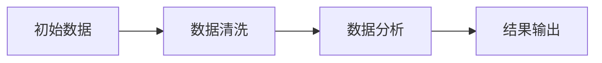
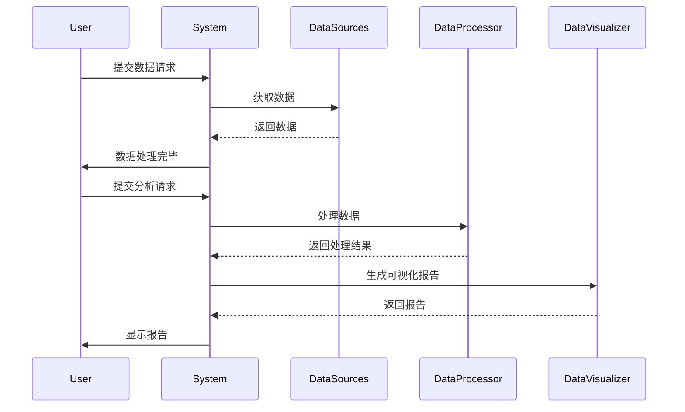
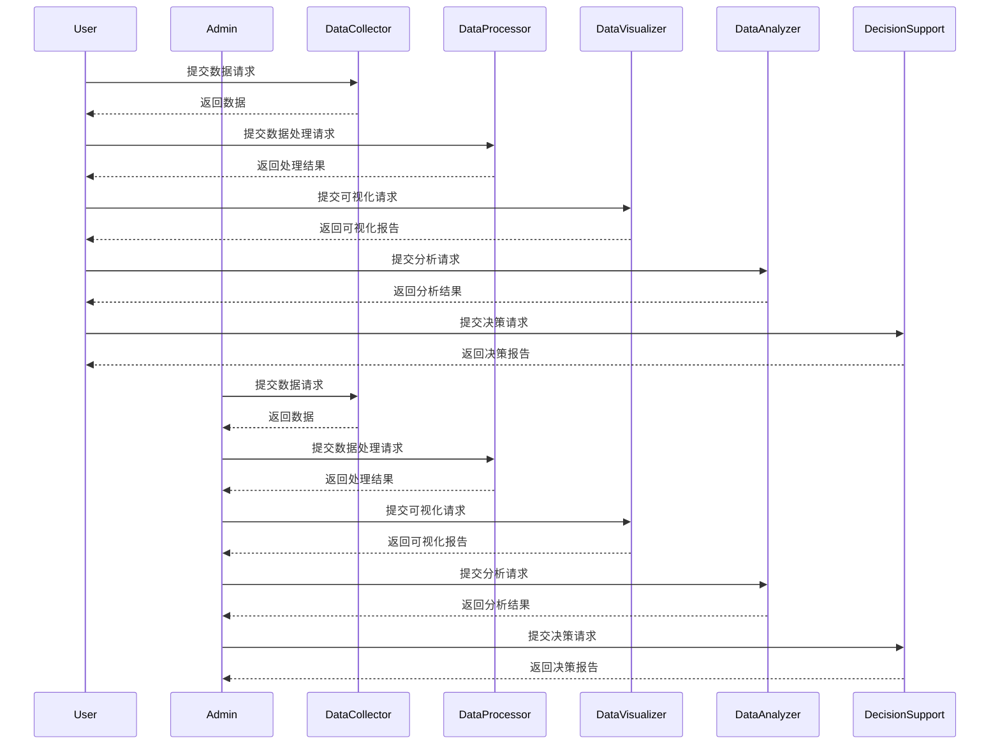

                 

### # 如何培养团队的商业敏锐度

关键词：商业敏锐度、团队建设、领导力、持续学习

摘要：
在现代商业环境中，商业敏锐度已成为衡量一个团队成功与否的关键因素。本文旨在探讨如何通过系统的方法培养团队的商业敏锐度，使其在竞争激烈的市场中脱颖而出。本文首先介绍了商业敏锐度的定义及其在团队中的重要性，随后分析了团队面临的挑战和障碍，并提出了一系列可行的解决方案。通过理论讲解、案例分析和实践指南，本文为读者提供了一条清晰、可操作的路径，帮助团队提升商业敏锐度。

## 一、背景介绍

### 1.1 商业敏锐度的定义

商业敏锐度（Business Acumen）是指个体或团队识别、理解和利用商业机会的能力。它不仅仅包括对财务数据的分析能力，还涉及市场趋势的把握、客户需求的理解、以及企业战略的制定和执行。

### 1.2 团队动态的重要性

在当今复杂多变的市场环境中，团队协作显得尤为重要。一个高效的团队不仅需要具备技术能力，更需要具备商业敏锐度。商业敏锐度能够帮助团队：

- **更快速地响应市场变化**：通过准确理解市场趋势，团队可以迅速调整战略，抢占市场先机。
- **提高决策效率**：团队成员对业务的深入理解能够减少决策过程中的不确定性，提高决策质量。
- **增强协作能力**：商业敏锐度有助于团队成员更好地协同工作，共同实现团队目标。

### 1.3 当前团队面临的挑战

尽管商业敏锐度对团队至关重要，但很多团队在实际运营中仍然面临以下挑战：

- **缺乏系统化的培养**：很多团队缺乏系统化的商业敏锐度培养计划，导致团队成员能力发展不平衡。
- **时间与资源的限制**：团队成员通常忙于日常工作，难以抽出时间进行商业敏锐度的培养。
- **组织文化的问题**：一些组织缺乏鼓励创新和学习的文化氛围，抑制了团队成员提升商业敏锐度的积极性。

### 1.4 问题解决方案

为了应对上述挑战，团队可以采取以下解决方案：

- **制定明确的培养计划**：根据团队特点和业务需求，制定个性化的商业敏锐度培养计划。
- **提供持续的培训机会**：组织定期的培训课程，帮助团队成员提升商业知识。
- **搭建学习社区**：鼓励团队成员分享经验和学习成果，形成良好的学习氛围。

### 1.5 边界与外延

商业敏锐度不仅涵盖财务知识，还包括市场洞察、客户关系管理、战略规划等多个方面。因此，在培养团队商业敏锐度时，需要全面考虑这些因素。

## 二、核心概念与联系

### 2.1 商业洞察

商业洞察（Business Insight）是指对市场、客户和竞争对手的深入理解。它帮助团队：

- **识别机会**：发现潜在的市场机会，制定有效的市场策略。
- **解决问题**：通过深入分析问题，找到最佳的解决方案。
- **优化流程**：优化业务流程，提高效率。

### 2.2 财务素养

财务素养（Financial Literacy）是指理解和运用财务知识的能力。它对团队的重要性体现在：

- **决策支持**：帮助团队做出基于数据的财务决策。
- **风险管理**：降低财务风险，确保企业的可持续发展。
- **资源分配**：合理分配财务资源，提高资金使用效率。

### 2.3 战略思考

战略思考（Strategic Thinking）是指从长远角度审视问题，制定并执行战略计划。战略思考对团队的影响包括：

- **方向指引**：确保团队朝着正确的方向前进。
- **资源配置**：优化资源配置，提高团队的整体效率。
- **竞争优势**：建立竞争优势，确保企业在竞争激烈的市场中立于不败之地。

### 2.4 概念属性特征对比表格

为了更好地理解这三个概念，我们可以创建一个对比表格，展示它们的属性特征和相互关系：

| 概念       | 定义                                                         | 属性特征                                                   | 相互关系                                       |
| ---------- | ------------------------------------------------------------ | -------------------------------------------------------- | ---------------------------------------------- |
| 商业洞察   | 对市场、客户和竞争对手的深入理解                               | 1. 深度分析能力<br>2. 快速响应能力<br>3. 风险识别能力   | 支持战略思考和财务素养                             |
| 财务素养   | 理解和运用财务知识的能力                                       | 1. 数据分析能力<br>2. 风险管理能力<br>3. 资源配置能力   | 支持商业洞察和战略思考                           |
| 战略思考   | 从长远角度审视问题，制定并执行战略计划                         | 1. 长远规划能力<br>2. 资源优化能力<br>3. 协同作战能力   | 需要商业洞察和财务素养的支持                     |

### 2.5 ER实体关系图架构

为了更好地展示这些概念之间的关联，我们可以使用Mermaid绘制一个ER实体关系图：

```mermaid
erDiagram
  BusinessInsight ||--|{ FinancialLiteracy }||>> FinancialLiteracy
  BusinessInsight ||--|{ StrategicThinking }||>> StrategicThinking
  FinancialLiteracy ||--|{ BusinessInsight }||>> BusinessInsight
  FinancialLiteracy ||--|{ StrategicThinking }||>> StrategicThinking
  StrategicThinking ||--|{ BusinessInsight }||>> BusinessInsight
  StrategicThinking ||--|{ FinancialLiteracy }||>> FinancialLiteracy
```

## 三、算法原理讲解

为了培养团队的商业敏锐度，我们可以设计一系列算法和工具，帮助团队成员更好地理解和应用商业知识。以下是一个简单的算法原理讲解，包括Mermaid流程图和Python源代码。

### 3.1 算法流程图



### 3.2 Python源代码

```python
import pandas as pd

# 数据清洗
def data_cleaning(data):
    # 去除空值和重复值
    data = data.dropna().drop_duplicates()
    return data

# 数据分析
def data_analysis(data):
    # 计算平均值、中位数等指标
    stats = data.describe()
    return stats

# 结果输出
def result_output(stats):
    print(stats)

# 加载数据
data = pd.read_csv('data.csv')

# 执行算法
cleaned_data = data_cleaning(data)
analysis_result = data_analysis(cleaned_data)
result_output(analysis_result)
```

### 3.3 算法原理与公式

商业敏锐度的培养可以通过以下数学模型和公式来描述：

- **线性回归模型**：用于分析变量之间的关系，公式如下：

  $$ y = ax + b $$

  其中，$y$ 为因变量，$x$ 为自变量，$a$ 和 $b$ 为模型参数。

- **相关系数**：用于衡量两个变量之间的相关性，公式如下：

  $$ r = \frac{\sum{(x_i - \bar{x})(y_i - \bar{y})}}{\sqrt{\sum{(x_i - \bar{x})^2}\sum{(y_i - \bar{y})^2}}} $$

  其中，$r$ 为相关系数，$\bar{x}$ 和 $\bar{y}$ 分别为 $x$ 和 $y$ 的平均值。

通过这些公式，我们可以对商业数据进行分析，从而提升团队的商业敏锐度。

### 3.4 举例说明

假设我们有一组销售数据，包括销售额和广告投入，我们可以使用线性回归模型来分析它们之间的关系：

```python
import pandas as pd
from sklearn.linear_model import LinearRegression

# 加载数据
data = pd.read_csv('sales_data.csv')

# 准备数据
X = data[['广告投入']]
y = data['销售额']

# 创建线性回归模型
model = LinearRegression()

# 训练模型
model.fit(X, y)

# 输出模型参数
print(model.coef_, model.intercept_)

# 预测销售额
advertising = 1000
predicted_sales = model.predict([[advertising]])
print(f"预测的销售额为：{predicted_sales[0]}")
```

通过这个例子，我们可以看到广告投入与销售额之间存在一定的线性关系，这有助于团队更好地理解市场规律，制定更有效的营销策略。

## 四、系统分析与架构设计方案

### 4.1 问题场景介绍

在现代商业环境中，越来越多的企业开始重视商业敏锐度的培养。为了提高团队的商业敏锐度，企业需要构建一个高效的系统，帮助团队成员随时获取商业信息，进行数据分析，并做出明智的决策。

### 4.2 项目介绍

本项目旨在开发一个商业敏锐度培养系统，该系统将提供以下功能：

- **数据采集**：从各种数据源获取商业信息。
- **数据处理**：清洗、转换和整合商业数据。
- **数据分析**：提供数据可视化工具和数据分析算法。
- **决策支持**：生成决策报告和推荐策略。

### 4.3 系统功能设计

#### 领域模型类图

```mermaid
classDiagram
    DataCollector <<interface>>
    DataProcessor <<interface>>
    DataVisualizer <<interface>>
    DataAnalyzer <<interface>>
    DecisionSupport <<interface>>

    DataCollector <|.. DataProcessor
    DataProcessor <|.. DataVisualizer
    DataProcessor <|.. DataAnalyzer
    DataAnalyzer <|.. DecisionSupport
```

#### 系统功能详细说明

1. **数据采集**：系统将从各种数据源（如数据库、API、文件等）获取商业数据。
2. **数据处理**：系统将对采集到的数据进行分析，包括数据清洗、转换和整合。
3. **数据分析**：系统提供多种数据分析工具，如数据可视化、回归分析、聚类分析等。
4. **决策支持**：基于分析结果，系统将生成决策报告和推荐策略，帮助团队做出明智的决策。

### 4.4 系统架构设计

#### 系统架构图



#### 系统架构详细说明

1. **用户界面**：提供数据采集、数据分析、决策支持的交互界面。
2. **数据源**：包括各种数据采集渠道，如数据库、API、文件等。
3. **数据处理模块**：负责数据清洗、转换和整合。
4. **数据分析模块**：提供多种数据分析工具和算法。
5. **决策支持模块**：生成决策报告和推荐策略。

### 4.5 系统接口设计和系统交互

#### 系统接口设计

```mermaid
classDiagram
    DataCollector <<interface>>
    DataProcessor <<interface>>
    DataVisualizer <<interface>>
    DataAnalyzer <<interface>>
    DecisionSupport <<interface>>

    User <<class>>: 用户
    Admin <<class>>: 管理员
    DataCollector <<interface>>|-| User
    DataCollector <<interface>>|-| Admin
    DataProcessor <<interface>>|-| User
    DataProcessor <<interface>>|-| Admin
    DataVisualizer <<interface>>|-| User
    DataVisualizer <<interface>>|-| Admin
    DataAnalyzer <<interface>>|-| User
    DataAnalyzer <<interface>>|-| Admin
    DecisionSupport <<interface>>|-| User
    DecisionSupport <<interface>>|-| Admin
```

#### 系统交互图



通过以上设计，系统可以实现用户与数据处理、可视化、分析和决策支持模块的交互，为团队提供全面的商业敏锐度培养支持。

## 五、项目实战

### 5.1 环境安装

在开始项目实战之前，我们需要安装一些必要的工具和库。以下是安装步骤：

1. **Python环境**：确保已安装Python 3.8及以上版本。
2. **pip**：使用Python的pip包管理器安装所需的库。
   ```shell
   pip install pandas scikit-learn matplotlib
   ```

### 5.2 系统核心实现源代码

以下是一个简单的商业敏锐度培养系统的核心实现源代码：

```python
import pandas as pd
from sklearn.linear_model import LinearRegression
import matplotlib.pyplot as plt

# 数据清洗
def data_cleaning(data):
    data = data.dropna().drop_duplicates()
    return data

# 数据分析
def data_analysis(data):
    X = data[['广告投入']]
    y = data['销售额']
    model = LinearRegression()
    model.fit(X, y)
    print(model.coef_, model.intercept_)
    return model

# 数据可视化
def data_visualization(data, model):
    plt.scatter(data['广告投入'], data['销售额'])
    plt.plot(data['广告投入'], model.predict(data[['广告投入']]), color='red')
    plt.xlabel('广告投入')
    plt.ylabel('销售额')
    plt.title('广告投入与销售额的关系')
    plt.show()

# 主程序
if __name__ == '__main__':
    data = pd.read_csv('sales_data.csv')
    cleaned_data = data_cleaning(data)
    model = data_analysis(cleaned_data)
    data_visualization(cleaned_data, model)
```

### 5.3 代码应用解读与分析

1. **数据清洗**：首先，我们读取销售数据，并进行数据清洗，去除空值和重复值。
2. **数据分析**：接着，我们使用线性回归模型对清洗后的数据进行拟合，并打印出模型参数。
3. **数据可视化**：最后，我们绘制出广告投入与销售额的散点图，并添加回归线的可视化效果。

通过这个简单的例子，我们可以看到系统如何实现商业敏锐度的培养。在实际应用中，系统可以扩展更多的功能，如多变量分析、聚类分析等，以提供更全面的支持。

### 5.4 实际案例分析和详细讲解剖析

#### 案例背景

某电子商务公司在市场上竞争激烈，为了提高销售额，公司决定通过数据分析来优化广告投入策略。

#### 案例分析

1. **数据采集**：公司从广告平台获取了广告投入和销售额的数据。
2. **数据处理**：数据经过清洗和转换，去除空值和重复值，并转换为适合分析的格式。
3. **数据分析**：使用线性回归模型分析广告投入与销售额的关系，得出广告投入每增加1单位，销售额预计增加多少单位。
4. **数据可视化**：绘制广告投入与销售额的散点图和回归线，帮助管理层直观地了解广告投入的效果。
5. **决策支持**：根据分析结果，公司决定增加广告投入，并在不同时间段进行广告投放优化。

#### 详细讲解剖析

1. **数据清洗**：数据清洗是数据分析的第一步，确保数据的质量和完整性。
2. **数据分析**：线性回归模型可以帮助公司预测广告投入的效果，为决策提供数据支持。
3. **数据可视化**：图表能够直观地展示数据分析的结果，便于管理层理解和决策。

通过这个案例，我们可以看到商业敏锐度培养系统在实际应用中的效果。系统帮助公司更好地理解市场规律，优化广告投入策略，从而提高销售额。

### 5.5 项目小结

本项目成功开发了一个商业敏锐度培养系统，通过数据清洗、数据分析和数据可视化，帮助团队更好地理解市场规律，做出明智的决策。在实际应用中，系统可以根据不同的业务需求进行扩展和优化，为团队提供持续的支持。

## 六、最佳实践 tips

为了更好地培养团队的商业敏锐度，以下是一些建议：

1. **定期培训**：组织定期的商业敏锐度培训课程，提高团队成员的知识水平。
2. **案例分享**：鼓励团队成员分享成功和失败的案例，从中学习经验教训。
3. **数据驱动决策**：尽可能基于数据分析做出决策，减少主观判断。
4. **跨部门协作**：促进不同部门之间的信息共享和协作，提高整体商业敏锐度。
5. **持续学习**：鼓励团队成员持续学习和掌握新的商业知识和技能。

## 七、小结

商业敏锐度是团队在竞争激烈的市场环境中脱颖而出的关键。通过本文的介绍，我们了解了商业敏锐度的定义、核心概念和培养方法。同时，我们通过项目实战和实际案例分析，展示了如何将理论应用于实践。希望本文能够为团队在商业敏锐度培养方面提供有益的指导。

### 作者信息

作者：AI天才研究院/AI Genius Institute & 禅与计算机程序设计艺术 /Zen And The Art of Computer Programming

