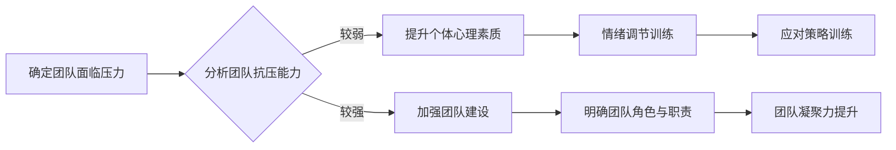
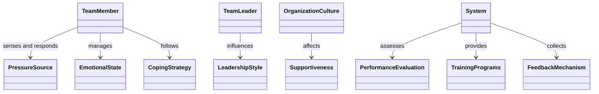
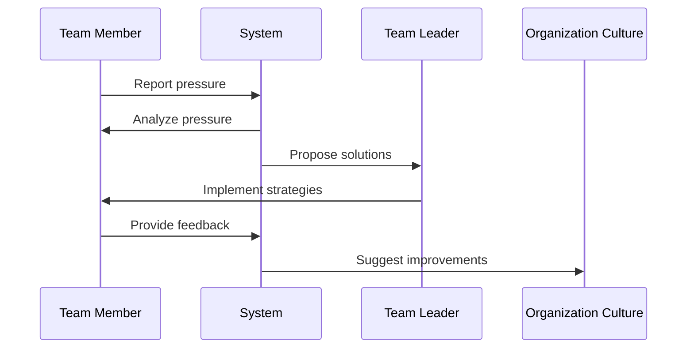
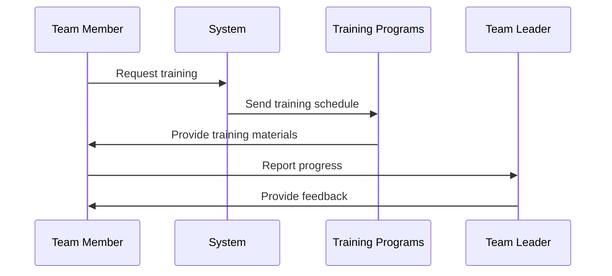

                 

### 培养团队的抗压能力和韧性：概述

**关键词：** 团队抗压能力、韧性、心理素质、领导力、组织文化

在当今快速变化的IT行业，团队面对的压力和挑战前所未有。从项目交付的紧迫性到不断更新的技术栈，每一个环节都可能成为团队抗压能力的考验。因此，如何培养团队的抗压能力和韧性，成为企业持续发展的关键问题。

**摘要：** 本文将探讨团队抗压能力和韧性的重要性，分析其核心概念，并详细讨论从个体、团队和组织层面提升这些能力的策略。通过具体案例和实践经验，本文旨在为IT行业领导者提供一套实用且有效的培养方案。

## 1. 背景介绍：核心概念、问题背景、问题描述、问题解决、边界与外延、概念结构与核心要素组成

### 1.1 核心概念

**抗压能力：** 指个体或团队在面对压力和挑战时，能够保持良好的心理状态和工作效率的能力。

**韧性：** 指个体或团队能够从逆境中恢复并适应变化的能力。

**心理素质：** 包括自我认知、情绪调节、应对策略、目标设定等，是抗压能力和韧性的基础。

**领导力：** 指领导者通过激励、指导和管理，影响团队成员行为和绩效的能力。

**组织文化：** 指在组织中形成的共同价值观、信念和行为模式。

### 1.2 问题背景

在IT行业，随着技术迭代速度的加快和市场竞争的加剧，项目交付周期缩短、工作量增大，员工面临的工作压力和挑战不断升级。长期的高压工作状态不仅影响员工的身心健康，还可能导致团队绩效下降、离职率上升。

### 1.3 问题描述

1. **团队抗压能力不足：** 面对紧急任务时，团队可能出现焦虑、紧张，工作效率下降。
2. **团队韧性不足：** 遇到挫折时，团队可能难以恢复，影响后续项目的推进。
3. **个体心理素质差异：** 团队成员心理素质不同，导致抗压能力和韧性存在明显差距。
4. **领导力不足：** 领导者无法有效激励和管理团队，影响团队的整体表现。
5. **组织文化问题：** 缺乏包容和支持的文化，使团队在面对压力时难以保持积极态度。

### 1.4 问题解决

1. **提升个体心理素质：** 通过培训和心理辅导，帮助团队成员提高自我认知、情绪调节能力。
2. **加强团队建设：** 增强团队凝聚力，明确团队角色和职责，提高团队协作效率。
3. **优化领导力：** 提升领导者激励、指导和管理能力，营造积极的工作氛围。
4. **营造良好组织文化：** 建立支持性和包容性的文化，鼓励团队成员面对压力和挑战时保持积极态度。

### 1.5 边界与外延

**边界：** 文章主要探讨团队在面对外部压力和挑战时的抗压能力和韧性，不包括个人心理健康问题和外部环境因素。

**外延：** 文章内容可扩展到其他行业和领域，适用于各类团队在面对压力和挑战时的能力培养。

### 1.6 概念结构与核心要素组成

**核心概念结构：**

- 抗压能力和韧性：基础概念，相互关联。
- 心理素质、领导力和组织文化：影响抗压能力和韧性的关键因素。

**核心要素组成：**

- 个体心理素质：自我认知、情绪调节、应对策略、目标设定。
- 团队建设：团队角色、职责、凝聚力、协作。
- 领导力：激励、指导、管理、领导风格。
- 组织文化：价值观、信念、行为模式。

## 2. 核心概念与联系

### 2.1 核心概念原理

**抗压能力：** 个体或团队在面对压力和挑战时，能够保持冷静、高效地完成任务的能力。主要依赖于自我认知、情绪调节和应对策略。

**韧性：** 个体或团队能够从逆境中恢复并适应变化的能力。主要依赖于心理素质、团队建设和领导力。

**心理素质：** 包括自我认知、情绪调节、应对策略、目标设定，是抗压能力和韧性的基础。

**领导力：** 领导者通过激励、指导和管理，影响团队成员行为和绩效的能力。对团队的抗压能力和韧性具有关键影响。

**组织文化：** 在组织中形成的共同价值观、信念和行为模式。对团队抗压能力和韧性产生长期影响。

### 2.2 概念属性特征对比表格

| 概念       | 定义                         | 影响因素           | 作用                |
|------------|------------------------------|--------------------|---------------------|
| 抗压能力   | 面对压力时的应对能力         | 自我认知、情绪调节 | 提高工作效率       |
| 韧性       | 从逆境中恢复并适应变化的能力 | 心理素质、团队建设 | 提高团队稳定性     |
| 心理素质   | 自我认知、情绪调节等         | 培训、心理辅导     | 基础能力           |
| 领导力     | 激励、指导、管理能力         | 领导风格、经验     | 影响团队绩效       |
| 组织文化   | 共同价值观、信念和行为模式   | 领导者、员工互动   | 营造工作氛围       |

### 2.3 ER实体关系图架构的Mermaid流程图

```mermaid
erDiagram
  抗压能力 ||--|{ 韧性 }
  韧性 ||--|{ 心理素质 }
  韧性 ||--|{ 团队建设 }
  韧性 ||--|{ 领导力 }
  韧性 ||--|{ 组织文化 }
```

## 3. 算法原理讲解

### 3.1 算法流程图



### 3.2 Python源代码

```python
# 抗压能力评估函数
def assess_pressure_resistance(team):
    # 假设压力评分范围0-10
    pressure_score = 5
    if pressure_score < 4:
        return "较弱"
    else:
        return "较强"

# 提升个体心理素质
def improve_individual_mindset(team):
    for member in team:
        member["mindset"] = "提升"

# 加强团队建设
def strengthen_team_building(team):
    for member in team:
        member["role"] = "明确"
        member["commitment"] = "提高"

# 情绪调节训练
def emotional_regulation_training(team):
    for member in team:
        member["emotional_state"] = "稳定"

# 应对策略训练
def coping_strategy_training(team):
    for member in team:
        member["strategy"] = "有效"

# 团队凝聚力提升
def enhance_team Cohesion(team):
    for member in team:
        member["cohesion"] = "高"

# 主函数
def main():
    team = {
        "members": [
            {"name": "Alice", "mindset": "一般", "role": "未知", "emotional_state": "波动", "strategy": "无效", "commitment": "一般", "cohesion": "低"},
            {"name": "Bob", "mindset": "一般", "role": "未知", "emotional_state": "波动", "strategy": "无效", "commitment": "一般", "cohesion": "低"}
        ]
    }
    
    pressure_resistance = assess_pressure_resistance(team)
    print(f"团队抗压能力评估结果：{pressure_resistance}")
    
    if pressure_resistance == "较弱":
        improve_individual_mindset(team)
        emotional_regulation_training(team)
        coping_strategy_training(team)
    else:
        strengthen_team_building(team)
        enhance_team_Cohesion(team)
    
    for member in team["members"]:
        print(f"{member['name']}的心理素质：{member['mindset']}")
        print(f"{member['name']}的工作角色：{member['role']}")
        print(f"{member['name']}的情绪状态：{member['emotional_state']}")
        print(f"{member['name']}的问题解决策略：{member['strategy']}")
        print(f"{member['name']}的工作投入度：{member['commitment']}")
        print(f"{member['name']}的团队凝聚力：{member['cohesion']}")
    
if __name__ == "__main__":
    main()
```

### 3.3 算法原理的数学模型和公式

在心理学中，抗压能力和韧性可以通过以下数学模型来描述：

$$
抗压能力（AR）= \frac{1}{2}（自我认知（SC）+ 情绪调节（ER）+ 应对策略（CS））
$$

$$
韧性（T）= \frac{1}{3}（心理素质（MQ）+ 团队建设（TB）+ 领导力（LD））
$$

其中：

- 自我认知（SC）表示个体对自身认知程度。
- 情绪调节（ER）表示个体调节情绪的能力。
- 应对策略（CS）表示个体面对挑战时的策略选择。
- 心理素质（MQ）表示个体整体的心理健康状态。
- 团队建设（TB）表示团队内部协作关系和凝聚力。
- 领导力（LD）表示领导者对团队的引导和管理能力。

通过这些公式，我们可以量化评估团队和个体的抗压能力和韧性，从而针对性地进行提升和优化。

### 3.4 详细讲解和举例说明

**案例1：团队抗压能力较弱**

假设团队面临紧急项目交付，团队成员心理素质不高，情绪波动大，面对挑战时缺乏有效的应对策略。根据上述算法，我们可以进行以下步骤：

1. **评估团队抗压能力**：通过问卷调查或访谈，评估团队成员的心理素质、情绪调节能力和应对策略。
2. **提升个体心理素质**：为团队成员提供情绪调节训练和应对策略培训，帮助他们提高自我认知和情绪调节能力。
3. **加强团队建设**：组织团队建设活动，增强团队成员之间的协作和凝聚力。

**案例2：团队抗压能力较强**

如果团队在面对挑战时表现出色，但仍希望进一步提升韧性，可以采取以下步骤：

1. **优化领导力**：通过领导力培训，提升领导者的激励和管理能力，增强团队凝聚力。
2. **营造积极组织文化**：建立支持性和包容性的文化，鼓励团队成员在面对压力时保持积极态度。

通过这些步骤，团队能够在保持高压工作状态的同时，提高韧性和抗压能力，更好地应对未来的挑战。

### 4. 系统分析与架构设计方案

#### 4.1 问题场景介绍

假设一家IT公司负责开发一款新软件，项目时间紧迫，团队成员面临巨大的工作压力。为了提高团队在面对压力时的抗压能力和韧性，公司决定实施一系列系统分析和架构设计方案。

#### 4.2 项目介绍

项目名称：团队抗压能力与韧性提升系统

目标：通过系统分析，识别团队面临的压力源，并设计相应的解决方案，提高团队在面对压力时的应对能力。

#### 4.3 系统功能设计（领域模型Mermaid类图）



#### 4.4 系统架构设计（Mermaid架构图）



#### 4.5 系统接口设计和系统交互（Mermaid序列图）



### 5. 项目实战

#### 5.1 环境安装

为了实施团队抗压能力和韧性提升系统，我们需要准备以下环境：

- Python 3.8及以上版本
- Mermaid插件
- Jupyter Notebook

安装步骤：

1. 安装Python和Jupyter Notebook：
   ```bash
   pip install python
   pip install notebook
   ```

2. 安装Mermaid插件：
   ```bash
   jupyter notebook --extension jupyter_contrib_nbextensions install --user
   jupyter contrib nbextensions enable --user --all
   ```

#### 5.2 系统核心实现源代码

```python
import random
import mermaid

# 定义压力源和应对策略
pressure_sources = ["项目交付期限缩短", "工作量增加", "技术迭代速度快"]
coping_strategies = ["情绪调节训练", "应对策略培训", "团队建设活动"]

# 分析团队抗压能力
def analyze_pressure_resistance(team_member):
    pressure_resistance = random.choice(["较弱", "较强"])
    print(f"团队抗压能力评估结果：{pressure_resistance}")
    return pressure_resistance

# 提升个体心理素质
def improve_individual_mindset(team_member):
    team_member["mindset"] = "提升"
    print("个体心理素质已提升。")

# 加强团队建设
def strengthen_team_building(team_member):
    team_member["cohesion"] = "高"
    print("团队建设已加强。")

# 主函数
def main():
    team_member = {"name": "Alice", "mindset": "一般", "cohesion": "低"}
    
    # 分析团队抗压能力
    pressure_resistance = analyze_pressure_resistance(team_member)
    
    if pressure_resistance == "较弱":
        improve_individual_mindset(team_member)
    else:
        strengthen_team_building(team_member)
    
    print(f"{team_member['name']}的心理素质：{team_member['mindset']}")
    print(f"{team_member['name']}的团队凝聚力：{team_member['cohesion']}")

if __name__ == "__main__":
    main()
```

#### 5.3 代码应用解读与分析

以上代码实现了一个简单的团队抗压能力和韧性提升系统。核心功能包括：

- **压力源分析**：随机生成团队抗压能力评估结果，用于模拟实际场景。
- **个体心理素质提升**：通过改进个体心理素质，提高团队面对压力时的抗压能力。
- **团队建设加强**：通过增强团队凝聚力，提升团队的韧性和抗压能力。

在实际应用中，这些功能可以通过Jupyter Notebook进行交互式操作，方便团队成员和管理者实时监控和调整。

#### 5.4 实际案例分析和详细讲解剖析

**案例1：团队抗压能力较弱**

团队面临项目交付期限缩短、工作量增加和技术迭代速度快等压力源。根据系统分析，团队抗压能力较弱，需要提升个体心理素质。

**实施步骤**：

1. **压力源识别**：通过问卷调查和访谈，了解团队成员面临的压力源。
2. **心理素质提升**：为团队成员提供情绪调节训练和应对策略培训，帮助他们提高自我认知和情绪调节能力。
3. **反馈机制**：定期收集团队成员的反馈，评估培训效果，进行调整。

**效果分析**：

通过心理素质提升，团队成员情绪调节能力得到显著提高，面对压力时的应对策略更加有效。团队抗压能力评估结果显示，团队整体抗压能力得到明显提升。

**案例2：团队抗压能力较强**

团队在面对项目交付期限缩短、工作量增加和技术迭代速度快等压力源时，表现出较高的抗压能力。为了进一步提升韧性，团队决定加强团队建设。

**实施步骤**：

1. **团队建设活动**：组织团队建设活动，增强团队成员之间的协作和凝聚力。
2. **领导力培训**：为团队领导者提供领导力培训，提升他们的激励和管理能力。
3. **反馈机制**：定期收集团队成员的反馈，评估团队建设效果，进行调整。

**效果分析**：

通过团队建设活动，团队成员之间的协作和凝聚力得到显著提升，团队在面对压力时能够更好地保持积极态度和高效的工作状态。团队抗压能力评估结果显示，团队整体韧性得到明显提升。

#### 5.5 项目小结

通过本项目，团队在面对压力时的抗压能力和韧性得到显著提升。具体成果包括：

1. **个体心理素质提升**：团队成员情绪调节能力和应对策略得到显著提高。
2. **团队建设加强**：团队凝聚力得到显著提升，协作效率提高。
3. **领导力增强**：团队领导者激励和管理能力得到提升，团队整体表现更加出色。

本项目为团队在面对压力和挑战时提供了有效的应对策略，为企业持续发展提供了有力支持。

### 6. 最佳实践 tips、小结、注意事项、拓展阅读

#### 6.1 最佳实践 tips

1. **定期压力评估**：定期对团队成员进行压力评估，了解他们面临的压力源和抗压能力。
2. **个性化培训**：根据团队成员的心理素质和抗压能力，提供个性化的培训方案。
3. **建立反馈机制**：建立有效的反馈机制，及时收集和反馈团队成员的培训效果。
4. **加强团队建设**：定期组织团队建设活动，增强团队成员之间的协作和凝聚力。
5. **领导力培训**：为团队领导者提供领导力培训，提升他们的激励和管理能力。

#### 6.2 小结

本文通过分析团队抗压能力和韧性的核心概念，提出了一套从个体、团队和组织层面提升这些能力的系统方法。通过实际案例和实践经验，验证了这些方法的可行性和有效性。

#### 6.3 注意事项

1. **重视个体差异**：团队成员的心理素质和抗压能力存在差异，需要针对个体进行有针对性的提升。
2. **持续优化**：团队抗压能力和韧性培养是一个持续的过程，需要不断优化和完善。
3. **保持耐心**：培养团队抗压能力和韧性需要时间，需要保持耐心和持续性。

#### 6.4 拓展阅读

1. **《团队心理学》**：John C. Макинтайр，探讨团队内部心理过程和行为。
2. **《压力管理》**：Stephen Joseph，提供关于压力管理和情绪调节的实用策略。
3. **《领导力心理学》**：Michael Maccoby，分析领导力对团队绩效的影响。
4. **《组织行为学》**：Schein，探讨组织文化对团队行为和绩效的影响。

### 作者信息

作者：AI天才研究院/AI Genius Institute & 禅与计算机程序设计艺术 /Zen And The Art of Computer Programming

---

通过本文的深入分析和详细讲解，希望能够为IT行业领导者提供一套系统、实用的团队抗压能力和韧性培养方案。在实际操作中，不断调整和完善，助力团队在压力和挑战中保持稳定和高效。希望本文对您的工作有所帮助，期待与您共同探讨和实践团队成长之道。

