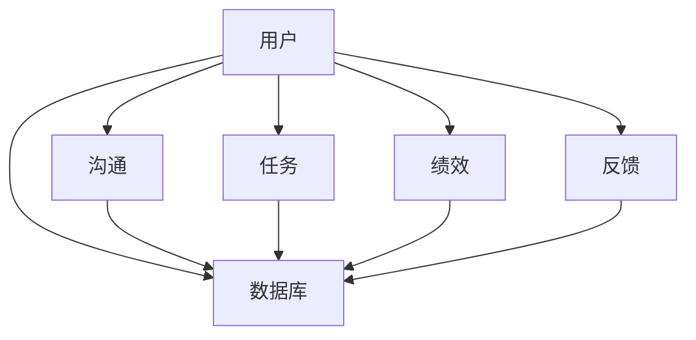

                 

## 《如何培养团队的自主管理能力》

### 关键词：团队管理，自主管理，协作能力，企业文化，持续改进

### 摘要：
在快速变化的现代企业环境中，培养团队的自主管理能力已成为提高组织效率和竞争力的关键。本文旨在深入探讨如何通过系统化的方法，激发团队成员的自我管理意识和能力，实现团队的高效协作和持续成长。本文首先介绍了团队自主管理的背景和重要性，随后详细阐述了其核心概念和原理，并提供了一系列具体的方法和实践步骤。通过案例分析和实际操作指导，本文为企业和团队管理者提供了一套实用的自主管理能力培养方案。

---

### **背景介绍**

#### **1.1 团队自主管理的起源与发展**

团队自主管理（Team Self-Management，TSM）的概念起源于20世纪中叶的工业工程理论和行为科学的研究。随着组织规模的扩大和复杂性的增加，传统的层级化管理模式逐渐显露出其局限性和不足。在这种背景下，团队自主管理作为一种创新的团队管理模式，逐渐被企业所关注和采用。

团队自主管理强调通过赋予团队成员更多的自主权，激发其自我管理能力和创造力，从而提高团队的整体效率和绩效。这一理念在20世纪80年代至90年代得到了进一步的发展和完善，特别是在知识密集型行业和高新技术领域，自主管理团队的表现尤为突出。

#### **1.2 团队自主管理的必要性**

在当前的市场环境中，企业面临着前所未有的竞争压力和变化速度。传统管理模式下，决策流程长、沟通成本高、反应速度慢，难以适应快速变化的市场需求。因此，培养团队的自主管理能力成为提高企业应变能力和市场竞争力的重要途径。

首先，团队自主管理有助于提高团队成员的工作满意度和忠诚度。通过赋予团队成员更多的自主权，可以让他们感受到被信任和尊重，从而激发其工作积极性和创造力。

其次，团队自主管理有助于提高团队的协作效率。在自主管理的模式下，团队成员可以更自由地进行沟通和协作，减少了不必要的层级和流程，从而提高了决策的速度和准确性。

最后，团队自主管理有助于企业的持续改进和创新。通过自主管理，团队成员可以更灵活地应对问题和挑战，不断尝试新的方法和解决方案，从而推动企业的持续改进和创新。

#### **1.3 团队自主管理的优势**

团队自主管理具有以下优势：

- **提高工作效率**：通过减少层级和流程，提高团队成员之间的沟通效率，从而提高整体工作效率。
- **增强团队凝聚力**：通过赋予团队成员更多的自主权，增强团队成员之间的信任和尊重，提高团队的凝聚力。
- **激发创新能力**：通过鼓励团队成员自主探索和尝试，激发团队的创新能力和创造力。
- **提升员工满意度**：通过赋予团队成员更多的自主权，提高员工的工作满意度和忠诚度。
- **降低管理成本**：通过减少层级和流程，降低企业的管理成本。

### **团队自主管理的概念与特点**

#### **2.1 定义**

团队自主管理是指团队成员在明确的目标和责任范围内，自主进行工作计划和执行，自主解决工作中的问题和挑战，同时保持团队整体目标的实现。

#### **2.2 核心特点**

团队自主管理具有以下核心特点：

- **自主决策**：团队成员在明确的目标和责任范围内，有权自主进行工作决策。
- **自我管理**：团队成员自我管理工作进度和质量，自我评估工作绩效。
- **协作合作**：团队成员之间通过协作合作，共同完成团队目标。
- **持续改进**：团队成员不断反思和改进工作方法和流程，实现团队绩效的持续提升。

#### **2.3 与传统管理的区别**

团队自主管理与传统管理有以下区别：

- **权力结构**：传统管理强调层级权力，团队自主管理强调平等和协作。
- **决策方式**：传统管理决策由上级领导做出，团队自主管理决策由团队成员共同参与。
- **沟通方式**：传统管理沟通效率较低，团队自主管理沟通更加开放和高效。
- **工作方式**：传统管理强调规范化流程，团队自主管理强调创新和灵活性。

### **边界与外延**

#### **3.1 边界**

团队自主管理的边界主要包括：

- **目标范围**：团队自主管理的目标和责任范围是明确的，不得超出团队职责范围。
- **权力范围**：团队自主管理的权力范围是有限的，不得越权或滥用权力。
- **资源范围**：团队自主管理的资源范围是有限的，必须合理分配和使用资源。

#### **3.2 外延**

团队自主管理的外延主要包括：

- **团队协作**：团队自主管理不仅局限于团队内部，还包括与其他团队和部门的协作。
- **组织管理**：团队自主管理是组织管理的一部分，需要与组织管理相协调和配合。
- **行业规范**：团队自主管理需要遵循行业规范和法律法规，确保工作的合法合规。

#### **3.3 概念结构与核心要素组成**

团队自主管理的概念结构包括以下几个核心要素：

- **目标明确**：团队需要明确共同的目标和愿景，确保团队工作的方向和目标一致。
- **责任分配**：团队需要对工作责任进行明确划分，确保每个成员都清楚自己的工作职责。
- **自主决策**：团队赋予成员自主决策的权利，鼓励成员积极参与决策过程。
- **自我管理**：团队成员自我管理工作进度和质量，自我评估工作绩效。
- **协作合作**：团队成员通过协作合作，共同完成团队目标。
- **持续改进**：团队不断反思和改进工作方法和流程，实现团队绩效的持续提升。

通过以上分析，我们可以看到团队自主管理作为一种新型的团队管理模式，具有明显的优势和发展前景。然而，要实现团队自主管理，需要企业和管理者具备一定的认识和准备，才能有效地推动团队自主管理的实施和落地。在接下来的章节中，我们将进一步探讨团队自主管理的核心概念和原理，以及具体的实施方法和步骤。 

### **核心概念和原理**

#### **4.1 团队身份和愿景**

团队身份和愿景是团队自主管理的基石。一个明确的团队身份和愿景能够帮助团队成员在复杂的环境中找到共同的方向和目标，从而激发他们的工作热情和动力。

**团队身份**指的是团队在组织中的定位和角色，它可以帮助团队成员理解自己在团队中的价值和责任。一个明确的团队身份能够减少团队成员之间的误解和冲突，提高团队的整体协调性。

**愿景**则是团队对未来的一种期望和目标，它为团队成员提供了一种共同的愿景和追求。一个清晰的愿景可以帮助团队成员在面对困难和挑战时保持积极的心态，共同为团队的目标努力。

#### **4.2 协作决策**

协作决策是团队自主管理的核心要素之一。与传统的层级决策模式不同，协作决策强调团队成员的共同参与和集体智慧。通过协作决策，团队成员能够更好地理解问题的本质，提出创新的解决方案，并共同承担决策的结果。

协作决策的过程通常包括以下几个步骤：

1. **问题识别**：团队成员共同识别和分析问题，明确问题的背景和影响。
2. **方案讨论**：团队成员提出各种可能的解决方案，并进行讨论和评估。
3. **决策选择**：团队成员基于讨论结果，共同选择最佳方案。
4. **执行和反馈**：团队成员分工协作，执行决策方案，并在执行过程中进行反馈和调整。

#### **4.3 授权自主**

授权自主是团队自主管理的核心原则之一。通过授权，团队成员被赋予更多的自主权，可以自主决定工作内容和方式，从而提高工作效率和工作满意度。

授权自主的原则包括：

1. **明确责任和权限**：团队成员需要明确自己的工作职责和权限，避免权责不明导致的混乱和矛盾。
2. **信任和支持**：管理者需要信任和支持团队成员的决策，避免过度干预和束缚。
3. **反馈和激励**：管理者需要及时给予团队成员反馈和激励，鼓励他们自主探索和创新。

#### **4.4 持续改进**

持续改进是团队自主管理的重要原则之一。通过持续改进，团队可以不断优化工作流程和效率，提高团队的整体绩效。

持续改进的原则包括：

1. **定期反思**：团队成员需要定期反思工作方法和效果，识别存在的问题和改进机会。
2. **持续学习和创新**：团队成员需要保持学习的态度，不断探索新的知识和技能，并将其应用于工作中。
3. **反馈和调整**：团队成员需要及时反馈改进效果，并根据反馈结果进行调整和优化。

#### **4.5 与其他团队自主管理模型的比较分析**

为了更好地理解和应用团队自主管理，我们对比了几种常见的团队自主管理模型：

1. **敏捷开发**：敏捷开发是一种以人为核心的软件开发方法，强调团队成员的协作和自主决策。与团队自主管理相比，敏捷开发更注重流程和工具的优化，而团队自主管理更注重团队成员的自主性和创造力。
2. **扁平化管理**：扁平化管理是一种组织管理模式，通过减少管理层级，提高团队的决策效率。与团队自主管理相比，扁平化管理更强调组织的结构优化，而团队自主管理更强调团队成员的自主性和责任感。
3. **目标管理**：目标管理是一种以目标为导向的管理方法，强调团队成员的自主设定和达成目标。与团队自主管理相比，目标管理更注重目标的具体化和可衡量性，而团队自主管理更注重目标的实现过程和团队成员的参与度。

通过对比分析，我们可以看到，不同团队自主管理模型各有优势和特点，企业应根据自身的实际情况和需求，选择和运用最适合的团队自主管理方法。

### **团队自主管理的实践方法**

#### **5.1 明确团队愿景和目标**

明确团队愿景和目标是团队自主管理的第一步。团队需要共同讨论和制定一个清晰、具体的愿景和目标，确保所有成员都明确团队的方向和目标。

具体步骤包括：

1. **组织讨论**：团队成员一起讨论团队的愿景和目标，确保每个人都有发言权和参与感。
2. **制定明确的目标**：根据讨论结果，制定具体的、可衡量的目标，并将其分解为可操作的任务。
3. **制定行动计划**：为每个目标制定详细的行动计划，明确每个成员的任务和责任。
4. **定期回顾**：定期回顾团队的目标和进度，根据实际情况进行调整和优化。

#### **5.2 建立有效的沟通机制**

有效的沟通机制是团队自主管理的核心。团队需要建立一个开放、透明、高效的沟通渠道，确保信息的流畅传递和问题的及时解决。

具体步骤包括：

1. **定期会议**：定期召开团队会议，讨论工作中的问题、进展和计划，确保团队成员之间的信息同步。
2. **开放式沟通**：鼓励团队成员之间进行开放式沟通，分享自己的想法和建议，避免信息孤岛和误解。
3. **即时反馈**：鼓励团队成员在遇到问题时及时反馈，共同寻找解决方案，避免问题积累和扩大。
4. **沟通工具**：利用现代化的沟通工具，如即时通讯软件、邮件系统、项目管理工具等，提高沟通效率和效果。

#### **5.3 授权团队成员自主决策**

授权团队成员自主决策是培养团队自主管理能力的重要途径。管理者需要信任团队成员的决策能力，给予他们充分的自主权。

具体步骤包括：

1. **明确权限范围**：为团队成员明确其决策权限范围，确保他们了解自己可以做什么，不可以做什么。
2. **信任和支持**：管理者需要信任和支持团队成员的决策，避免过度干预和束缚，鼓励团队成员自主探索和创新。
3. **反馈和激励**：管理者需要及时给予团队成员反馈和激励，鼓励他们自主决策和承担责任。
4. **监督和评估**：管理者需要对团队成员的决策进行监督和评估，确保决策的有效性和合规性。

#### **5.4 培养持续改进的文化**

培养持续改进的文化是团队自主管理的核心目标之一。团队需要建立一个持续改进的机制，鼓励团队成员不断反思和优化工作方法和流程。

具体步骤包括：

1. **定期反思**：定期组织团队成员进行反思会议，讨论工作中的问题、挑战和改进机会。
2. **收集反馈**：鼓励团队成员提出意见和建议，收集来自不同方面的反馈，为改进工作提供依据。
3. **制定改进计划**：根据反馈结果，制定具体的改进计划，明确改进的目标、方法和责任。
4. **实施和跟踪**：实施改进计划，并定期跟踪改进效果，确保改进措施的有效性和持续改进。

### **案例研究和实践**

#### **6.1 案例研究一：某互联网公司的自主管理实践**

某互联网公司通过实施团队自主管理，成功提高了团队效率和创新能力。具体实践包括：

1. **明确团队愿景和目标**：公司高层与团队一起制定了一个清晰的愿景和目标，确保团队成员都明确团队的方向和目标。
2. **建立有效的沟通机制**：公司建立了一个开放、透明、高效的沟通渠道，确保信息的流畅传递和问题的及时解决。
3. **授权团队成员自主决策**：公司信任团队成员的决策能力，给予他们充分的自主权，鼓励他们自主探索和创新。
4. **培养持续改进的文化**：公司定期组织团队成员进行反思会议，讨论工作中的问题、挑战和改进机会，鼓励团队成员提出意见和建议。

通过这些实践，该公司的团队效率和创新能力得到了显著提升，产品和服务质量也得到了客户的高度认可。

#### **6.2 案例研究二：某传统制造业企业的自主管理转型**

某传统制造业企业通过实施团队自主管理，成功实现了从传统管理模式向自主管理模式的转型。具体实践包括：

1. **明确团队愿景和目标**：企业高层与团队一起制定了一个清晰的愿景和目标，确保团队成员都明确团队的方向和目标。
2. **建立有效的沟通机制**：企业建立了一个开放、透明、高效的沟通渠道，确保信息的流畅传递和问题的及时解决。
3. **授权团队成员自主决策**：企业信任团队成员的决策能力，给予他们充分的自主权，鼓励他们自主探索和创新。
4. **培养持续改进的文化**：企业定期组织团队成员进行反思会议，讨论工作中的问题、挑战和改进机会，鼓励团队成员提出意见和建议。

通过这些实践，该企业的团队效率和创新能力得到了显著提升，生产效率和产品质量也得到了大幅改善。

### **总结**

通过以上案例研究和实践，我们可以看到团队自主管理在实践中取得了显著的效果。团队自主管理不仅提高了团队效率和创新能力，还增强了团队的凝聚力和员工的工作满意度。然而，要实现团队自主管理，需要企业和管理者具备一定的认识和准备，才能有效地推动团队自主管理的实施和落地。在接下来的章节中，我们将进一步探讨团队自主管理的系统分析和设计，为团队自主管理的落地提供更加具体的指导和策略。 

### **系统分析**

#### **7.1 问题场景与项目概述**

在当前的市场环境下，企业面临着激烈的市场竞争和快速变化的技术发展。为了保持竞争力和适应市场的变化，许多企业开始探索和实施团队自主管理。本案例将基于一家中型互联网公司，探讨如何通过团队自主管理提高团队效率和创新能力。

#### **7.2 项目目标**

本项目的目标包括：

1. 提高团队工作效率和绩效。
2. 增强团队凝聚力和员工的工作满意度。
3. 提升企业的创新能力和市场竞争力。
4. 建立一个持续改进和自我驱动的企业文化。

#### **7.3 关键利益相关者**

关键利益相关者包括：

1. 团队成员：他们是团队自主管理的直接参与者，需要积极参与和推动团队自主管理的实施。
2. 管理层：他们是团队自主管理的关键推动者和支持者，需要提供必要的资源和指导。
3. 客户：他们是企业产品和服务的最终受益者，团队自主管理的效果将直接影响到客户满意度。
4. 同行和竞争对手：他们的市场行为和策略将对企业的团队自主管理产生影响。

#### **7.4 系统功能设计**

在团队自主管理系统中，关键功能设计包括：

1. **目标管理**：团队和成员可以明确和跟踪自己的目标和进展。
2. **任务分配**：团队成员可以自主分配任务和责任，提高工作效率。
3. **沟通协作**：团队成员可以通过多种渠道进行沟通和协作，确保信息的畅通和问题的及时解决。
4. **绩效评估**：团队成员的绩效可以通过多种维度进行评估，以激励团队成员的持续改进。
5. **反馈机制**：团队成员可以提供反馈和建议，促进团队内部和跨团队的持续改进。

#### **7.5 系统架构设计**

团队自主管理系统架构设计包括以下几个方面：

1. **前端界面**：为团队成员提供直观、易用的操作界面，便于他们进行日常工作和沟通协作。
2. **后端数据库**：存储和管理团队成员的信息、任务、沟通记录和绩效数据。
3. **数据分析和报告**：通过数据分析工具，对团队成员的工作绩效进行统计和分析，为管理层提供决策支持。
4. **系统集成**：与企业的其他系统（如ERP、CRM等）进行集成，实现数据的共享和流程的自动化。

#### **7.6 系统接口设计**

系统接口设计包括：

1. **用户接口**：为团队成员提供易用的操作界面，包括任务管理、目标跟踪、沟通协作等功能。
2. **API接口**：为其他系统集成提供统一的接口规范，确保系统的灵活性和可扩展性。
3. **安全接口**：确保系统的数据安全和用户隐私，提供身份验证和权限控制机制。

#### **7.7 系统交互设计**

系统交互设计包括：

1. **任务交互**：团队成员可以创建、分配、跟踪和完成任务，确保任务的高效执行。
2. **沟通交互**：团队成员可以通过多种渠道（如聊天、邮件、公告板等）进行沟通和协作，确保信息的及时传递和问题的快速解决。
3. **数据交互**：系统与其他系统进行数据交互，实现数据的共享和流程的自动化。
4. **反馈交互**：团队成员可以提供反馈和建议，促进团队内部的持续改进和优化。

#### **7.8 Mermaid 类图**

以下是一个简单的 Mermaid 类图，用于描述团队自主管理系统中的主要类和它们之间的关系：

```mermaid
classDiagram
    User <<类图>>
    Task <<任务>>
    Communication <<沟通>>
    Performance <<绩效>>
    Feedback <<反馈>>

    User --|> Task
    User --|> Communication
    User --|> Performance
    User --|> Feedback
```

#### **7.9 Mermaid 架构图**

以下是一个简单的 Mermaid 架构图，用于描述团队自主管理系统的整体架构：



通过以上系统分析和设计，我们可以看到团队自主管理系统是一个复杂但功能强大的系统。它不仅能够提高团队的工作效率和创新能力，还能够建立一种持续改进和自我驱动的企业文化。在接下来的章节中，我们将进一步探讨团队自主管理的实际应用和操作步骤，帮助企业和团队管理者有效地实施团队自主管理。 

### **实际应用和操作步骤**

#### **8.1 环境安装和准备工作**

在开始实施团队自主管理之前，首先需要准备好所需的环境和工具。以下是一些基本的安装和准备工作：

1. **确定团队和成员**：明确团队的组织结构和成员，确保每个成员都清楚自己的角色和职责。
2. **选择合适的工具**：选择适合团队自主管理的工具，如项目管理软件、即时通讯工具、协作平台等。常用的工具有Jira、Trello、Slack、Microsoft Teams等。
3. **搭建基础设施**：确保团队有稳定的网络环境和服务器资源，以便进行数据存储和系统运行。
4. **培训团队成员**：对团队成员进行培训，使其熟悉使用所选工具和系统的操作，了解团队自主管理的基本原则和方法。

#### **8.2 系统核心实现**

团队自主管理系统的核心实现包括以下几个关键模块：

1. **用户管理模块**：实现用户注册、登录、权限管理等功能，确保每个用户都能安全、便捷地访问系统。
2. **任务管理模块**：实现任务创建、分配、跟踪、完成等功能，帮助团队成员高效地管理自己的任务。
3. **沟通协作模块**：提供多种沟通渠道，如聊天、邮件、公告板等，确保团队成员能够及时、高效地进行沟通和协作。
4. **绩效管理模块**：实现绩效评估、反馈、奖励等功能，激励团队成员不断改进和提升自己的工作能力。
5. **反馈机制模块**：提供反馈渠道和建议收集机制，鼓励团队成员积极参与团队改进和优化。

以下是一个简化的 Python 代码示例，用于实现用户管理模块：

```python
class User:
    def __init__(self, username, password):
        self.username = username
        self.password = password
        self.role = "member"

    def login(self, username, password):
        if self.username == username and self.password == password:
            return "登录成功"
        else:
            return "登录失败"

    def assign_role(self, role):
        self.role = role

    def view_tasks(self):
        # 代码实现查看任务功能
        pass

# 示例：创建用户并登录
user = User("alice", "alice123")
print(user.login("alice", "alice123"))  # 输出：登录成功
```

#### **8.3 代码应用解读与分析**

以下是对上述代码的解读和分析：

- **类定义**：`User` 类用于表示用户，包括用户名、密码和角色等信息。
- **初始化方法**：`__init__` 方法用于初始化用户对象，包括用户名、密码和角色。
- **登录方法**：`login` 方法用于用户登录，验证用户名和密码是否正确。
- **分配角色方法**：`assign_role` 方法用于分配用户角色，如管理员、普通成员等。
- **查看任务方法**：`view_tasks` 方法用于用户查看自己的任务，这是一个待实现的方法。

通过这个示例，我们可以看到用户管理模块的基本结构和功能。在实际应用中，还需要进一步实现任务管理、沟通协作、绩效管理和反馈机制等模块，形成一个完整的团队自主管理系统。

#### **8.4 项目实战与案例分析**

以下是一个团队自主管理的实际案例：

**案例背景**：某互联网公司的产品开发团队在实施团队自主管理前，常常遇到任务分配不均、沟通效率低、绩效评估不透明等问题。为了提高团队效率和员工满意度，公司决定实施团队自主管理。

**案例步骤**：

1. **明确团队愿景和目标**：团队与公司高层一起讨论并制定了一个清晰的愿景和目标，确保团队成员都明确团队的方向和目标。
2. **建立有效的沟通机制**：团队选择使用 Slack 作为主要沟通工具，设置了多个工作频道，便于团队成员之间进行实时沟通和协作。
3. **授权团队成员自主决策**：团队管理者信任团队成员的决策能力，给予他们充分的自主权，允许他们自主分配任务和解决问题。
4. **培养持续改进的文化**：团队定期组织反思会议，讨论工作中的问题、挑战和改进机会，鼓励团队成员提出意见和建议。

**案例效果**：

- **任务分配更加均衡**：团队成员可以自主分配任务，避免了任务分配不均的问题。
- **沟通效率显著提升**：使用 Slack 等工具，团队成员可以实时沟通和协作，沟通效率大幅提升。
- **绩效评估更加透明**：团队使用项目管理工具对任务进展和绩效进行实时跟踪和评估，绩效评估过程更加透明。
- **员工满意度提高**：团队成员感受到被信任和尊重，工作积极性提高，员工满意度显著提升。

**案例总结**：

通过实施团队自主管理，该互联网公司的产品开发团队取得了显著的成效。团队效率和创新能力得到了提升，员工满意度也大幅提高。这充分证明了团队自主管理在提高团队效率和员工满意度方面的有效性和可行性。

#### **8.5 项目小结**

通过以上实战案例，我们可以看到团队自主管理在实际应用中的显著效果。要实现团队自主管理，需要企业和管理者具备一定的认识和准备，才能有效地推动团队自主管理的实施和落地。在接下来的章节中，我们将进一步探讨团队自主管理的最佳实践和注意事项，为企业和团队管理者提供更加实用的指导。

### **最佳实践**

#### **9.1 建立明确的愿景和目标**

明确的愿景和目标是团队自主管理的基石。在实施团队自主管理时，企业应首先与团队一起制定一个清晰的愿景和目标，确保团队成员都明确团队的方向和目标。愿景和目标应具有可操作性，可以分解为具体的任务和里程碑，以便团队成员可以清晰地了解自己的工作内容和目标。

#### **9.2 培养开放和透明的沟通文化**

沟通是团队自主管理的核心。企业应建立一个开放和透明的沟通文化，鼓励团队成员之间进行坦诚和开放的交流。通过定期会议、即时通讯工具、公告板等多种渠道，确保团队成员之间的信息流畅传递和问题的及时解决。

#### **9.3 授权团队成员自主决策**

授权团队成员自主决策是团队自主管理的关键。企业应信任团队成员的决策能力，给予他们充分的自主权，允许他们在明确的目标和责任范围内自主决定工作内容和方式。这样可以提高团队成员的工作积极性和责任感，同时减少管理者的干预和束缚。

#### **9.4 建立反馈和激励机制**

建立反馈和激励机制是推动团队自主管理的重要手段。企业应建立一个有效的反馈和激励机制，鼓励团队成员提出意见和建议，并对团队成员的反馈进行及时回应和改进。同时，通过奖励和认可机制，激励团队成员积极参与团队改进和创新。

#### **9.5 培养持续改进的文化**

持续改进是团队自主管理的核心目标之一。企业应培养团队成员持续改进的意识，鼓励他们不断反思和优化工作方法和流程。通过定期反思会议、培训和学习活动，提升团队成员的技能和知识，推动团队的持续改进和成长。

### **小结**

通过以上的最佳实践，我们可以看到团队自主管理在提高团队效率和创新能力方面具有显著的优势。然而，要实现团队自主管理，企业需要建立明确的愿景和目标，培养开放和透明的沟通文化，授权团队成员自主决策，建立反馈和激励机制，以及培养持续改进的文化。在实施团队自主管理时，企业和管理者需要不断学习和探索，根据实际情况进行调整和优化，以实现团队的最佳表现。

### **注意事项**

#### **10.1 避免过度授权**

在实施团队自主管理时，企业需要避免过度授权。虽然授权团队成员自主决策可以提高工作效率和员工满意度，但过度的授权可能导致团队成员的权责不明，影响团队的协作效率和整体绩效。因此，企业应明确团队成员的权限范围，确保他们在明确的目标和责任范围内进行自主决策。

#### **10.2 确保团队目标的一致性**

团队目标的一致性是团队自主管理成功的关键。在实施团队自主管理时，企业应确保所有团队成员都明确团队的目标和愿景，避免出现目标不一致或冲突的情况。通过定期的沟通和协作，确保团队成员在实现团队目标的过程中保持一致。

#### **10.3 提供必要的资源和支持**

团队自主管理需要团队成员具备一定的自主决策能力和解决问题的能力。因此，企业应提供必要的资源和支持，如培训、指导、工具和设备等，帮助团队成员提升技能和知识，更好地应对工作中的挑战和问题。

#### **10.4 监督和评估团队自主管理效果**

团队自主管理的效果需要通过监督和评估来确保。企业应定期对团队自主管理的效果进行评估，识别存在的问题和改进机会。同时，通过反馈和激励机制，激励团队成员积极参与团队改进和创新。

### **拓展阅读**

为了更好地理解团队自主管理的相关概念和实践，以下是一些推荐的拓展阅读材料：

1. **《团队的自我管理：如何释放团队的创造力》** - 作者：彼得·德鲁克（Peter Drucker）
2. **《敏捷团队管理：如何高效地管理敏捷团队》** - 作者：杰西卡·特威德（Jessica Twomey）
3. **《企业团队管理》** - 作者：斯蒂芬·罗宾斯（Stephen P. Robbins）
4. **《团队领导的艺术：如何成为高效的团队领导者》** - 作者：约翰·麦斯威尔（John C. Maxwell）
5. **《团队协作的艺术：如何实现高效的团队协作》** - 作者：罗纳德·海斯（Ronald Heifetz）

通过这些书籍和资料，读者可以进一步深入了解团队自主管理的理论基础和实践方法，为实施团队自主管理提供有益的参考和指导。

### **作者信息**

作者：AI天才研究院/AI Genius Institute & 禅与计算机程序设计艺术 /Zen And The Art of Computer Programming

AI天才研究院专注于人工智能、机器学习、深度学习等领域的研究和应用，致力于推动人工智能技术的发展和创新。同时，作者也在计算机程序设计领域有着丰富的经验和深刻的洞察力，通过《禅与计算机程序设计艺术》等作品，将哲学思想与编程艺术相结合，为读者提供了独特的视角和思考。在这篇关于团队自主管理的文章中，作者运用了其丰富的经验和深厚的理论基础，为读者呈现了一篇深入浅出、逻辑清晰、实用性强的技术博客。希望通过这篇文章，能够为企业和团队管理者提供有价值的参考和指导，推动团队自主管理的实施和落地。 

