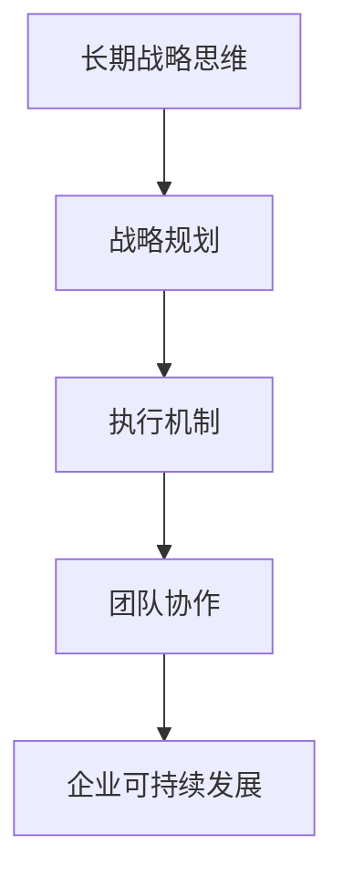

                 

## 如何培养团队的长期战略思维

### 引言

在当今竞争激烈的商业环境中，长期战略思维成为企业成功的关键因素。一个具备长期战略思维的团队能够更好地应对市场变化，抓住机遇，实现可持续发展。本文将深入探讨如何培养团队的长期战略思维，旨在为企业提供实用的策略和方法。

### 1.1 问题背景

#### 长期战略思维的重要性

长期战略思维不仅仅关乎企业当前的发展，更关系到未来的生存和发展。以下是一些长期战略思维的重要性：

1. **市场趋势分析**：能够帮助企业更好地预测市场变化，把握行业动态。
2. **资源配置优化**：合理分配资源，提高投资回报率。
3. **风险管理**：提前识别潜在风险，制定应对措施。
4. **创新能力**：鼓励创新思维，推动技术进步和业务模式创新。
5. **员工培养**：提升团队整体素质，促进个人成长。

#### 团队长期战略思维培养的挑战

尽管长期战略思维的重要性显而易见，但团队在实际培养过程中面临诸多挑战：

1. **短视行为**：许多团队在制定战略时更关注短期成果，忽视了长期发展。
2. **缺乏全局观念**：团队成员往往只看到自己负责的部分，缺乏整体视角。
3. **信息不对称**：不同部门之间的信息交流不畅，导致战略制定不全面。
4. **资源限制**：有限的资源分配可能导致战略执行受阻。
5. **外部环境变化**：市场环境的不确定性增加了战略规划的难度。

### 1.2 问题描述

本文旨在解决以下问题：

- **为什么团队的长期战略思维培养如此重要？**
- **团队成员如何提升长期战略思维？**
- **如何建立有效的战略规划和执行机制？**
- **如何调整和优化长期战略思维以应对市场变化？**

### 1.3 问题解决

为了解决上述问题，本文将从以下几个方面展开：

- **探讨长期战略思维的核心原理**
- **分析团队在战略制定和执行过程中的常见障碍**
- **介绍战略规划和执行的工具和方法**
- **提供实战案例和最佳实践**

### 1.4 边界与外延

本文主要针对企业团队的战略思维培养，但所讨论的方法和理念也适用于其他组织和个人。此外，书中所述的战略思维培养方法不仅适用于新兴企业，也适用于传统企业的转型升级。

### 1.5 概念结构与核心要素组成

#### 1.5.1 核心概念

- **长期战略思维**：指团队在制定和执行战略时，能够从长远角度出发，考虑行业趋势、竞争态势、资源分配等因素，确保企业可持续发展。
- **战略规划**：指团队在制定长期战略目标、策略和行动计划的过程。
- **执行机制**：指团队在实施战略过程中所采取的组织结构、流程和激励措施。

#### 1.5.2 概念属性特征对比表格

| 概念         | 属性特征                                  | 对比 |
| ------------ | ----------------------------------------- | ---- |
| 长期战略思维 | 长远视角、全局观念、适应变化              |      |
| 战略规划     | 明确目标、制定策略、规划资源、设定时间表 |      |
| 执行机制     | 组织结构、流程设计、激励机制              |      |

#### 1.5.3 ER实体关系图架构的Mermaid流程图

### 第2章 长期战略思维的核心原理

#### 2.1 长期战略思维的基本原理

##### 2.1.1 长期战略思维的内涵

长期战略思维是一种以长远发展为目标，从整体和系统的角度出发，对企业的战略方向、目标和资源配置进行深入思考和分析的能力。它强调在动态和复杂的市场环境中，企业需要具备前瞻性和适应性。

##### 2.1.2 长期战略思维的特点

- **系统性**：长期战略思维要求从整体和系统的角度看待企业的发展，考虑企业内部各要素之间的相互关系和作用。
- **前瞻性**：长期战略思维需要企业对市场趋势、技术变革、竞争对手动态等方面有敏锐的洞察力，从而做出提前布局。
- **适应性**：长期战略思维要求企业能够根据市场变化和内部情况的变化，灵活调整战略方向和策略。

#### 2.2 长期战略思维的理论基础

##### 2.2.1 SWOT分析

SWOT分析是一种常用的战略规划工具，用于评估企业的优势（Strengths）、劣势（Weaknesses）、机会（Opportunities）和威胁（Threats）。通过SWOT分析，企业可以更清晰地了解自身的状况，从而制定更为有效的战略。

##### 2.2.2 波特五力模型

波特五力模型用于分析企业所在行业的竞争态势，包括供应商的议价能力、买家的议价能力、新进入者的威胁、替代品的威胁和行业内竞争者的竞争状态。通过波特五力模型，企业可以更好地把握行业动态，制定相应的战略。

##### 2.2.3 平衡计分卡

平衡计分卡是一种绩效管理工具，用于衡量企业的战略执行情况和绩效水平。它从财务、客户、内部流程和学习与成长四个维度评估企业的绩效，帮助企业实现战略目标。

#### 2.3 长期战略思维的数学模型与公式

##### 2.3.1 SWOT分析公式

$$
SWOT = S \times W + O \times T
$$

其中，$S$表示优势，$W$表示劣势，$O$表示机会，$T$表示威胁。该公式用于计算企业在面对各种因素时的综合实力。

### 第3章 提升团队长期战略思维的方法

#### 3.1 建立战略规划和执行的文化

##### 3.1.1 文化的重要性

文化是一个团队的核心，决定了团队成员的行为和思维方式。要培养长期战略思维，首先需要在团队中建立一种重视战略规划和执行的文化。

##### 3.1.2 如何建立战略文化

1. **领导者的示范作用**：领导者需要以身作则，表现出对战略规划和执行的重视。
2. **培训与教育**：定期组织培训和研讨会，提高团队成员的战略思维能力和知识水平。
3. **沟通与协作**：鼓励团队成员之间的沟通与协作，促进信息共享和资源整合。
4. **激励机制**：建立与战略规划和执行相关的激励机制，鼓励团队成员积极参与。

#### 3.2 利用战略工具和方法

##### 3.2.1 SWOT分析

SWOT分析是一种有效的战略工具，可以帮助团队识别自身的优势和劣势，以及外部环境的机会和威胁。

##### 3.2.2 波特五力模型

波特五力模型用于分析行业竞争态势，帮助团队了解行业结构，制定相应的战略。

##### 3.2.3 平衡计分卡

平衡计分卡可以帮助团队从财务、客户、内部流程和学习与成长四个维度衡量绩效，确保战略执行的有效性。

#### 3.3 提高团队协作和沟通

##### 3.3.1 团队协作的重要性

团队协作是实现长期战略目标的关键。一个高效的团队能够更好地整合资源，发挥每个人的优势。

##### 3.3.2 如何提高团队协作

1. **建立清晰的沟通渠道**：确保团队成员之间的信息交流畅通无阻。
2. **鼓励团队建设**：定期组织团队建设活动，增强团队凝聚力。
3. **分工明确**：明确每个成员的职责和任务，避免重复劳动。
4. **鼓励反馈和改进**：鼓励团队成员提出建议和反馈，不断改进工作流程。

### 第4章 实战案例与最佳实践

#### 4.1 案例介绍

以某互联网企业为例，该企业通过以下措施培养团队的长期战略思维：

1. **建立战略委员会**：设立专门的战略委员会，负责制定和监督战略规划的执行。
2. **定期战略研讨会**：组织战略研讨会，邀请外部专家分享行业动态和战略思维。
3. **跨部门协作**：鼓励不同部门之间的协作，共同制定和实施战略。
4. **绩效评估**：将战略执行情况纳入员工绩效评估，激励团队成员积极参与。

#### 4.2 最佳实践

1. **战略规划与执行相结合**：将战略规划和执行紧密结合，确保战略目标的实现。
2. **持续学习与改进**：鼓励团队成员持续学习，不断更新知识和技能，以适应市场变化。
3. **灵活应对变化**：在战略执行过程中，根据市场变化和内部情况，及时调整战略方向和策略。

### 第5章 小结

通过本文的探讨，我们了解到长期战略思维对于企业的重要性，以及如何培养团队的长期战略思维。长期战略思维需要从整体和系统的角度出发，具备前瞻性和适应性。通过建立战略规划和执行的文化、利用战略工具和方法、提高团队协作和沟通，团队可以更好地实现长期战略目标。

### 注意事项

1. **避免短视行为**：在制定战略时，要充分考虑长期利益，避免仅关注短期成果。
2. **注重信息共享**：建立有效的信息共享机制，确保团队内部信息的畅通。
3. **持续培训与学习**：定期组织培训和研讨会，提高团队成员的战略思维能力和知识水平。

### 拓展阅读

1. **《企业战略管理》**：深入探讨企业战略管理的理论和实践，适合企业领导者和管理人员阅读。
2. **《竞争战略》**：迈克尔·波特经典著作，详细分析行业竞争态势和企业战略制定。

**作者：AI天才研究院/AI Genius Institute & 禅与计算机程序设计艺术 /Zen And The Art of Computer Programming** 

### 第6章 提高团队长期战略思维的具体策略

#### 6.1 明确长期目标与愿景

一个团队要想拥有强大的长期战略思维，首先需要明确团队的目标和愿景。这些目标应该是具有挑战性的，同时又能够激发团队成员的热情和动力。以下是几个步骤来实现这一目标：

1. **定义长期目标**：团队领导应该与团队成员一起制定长期目标，这些目标应当与企业的整体战略保持一致。
2. **分解目标**：将长期目标分解为可执行的任务和里程碑，使得每个团队成员都能明确自己的职责和贡献。
3. **定期回顾**：定期回顾和调整目标，确保它们始终保持与市场环境和团队发展的同步。

#### 6.2 强化跨部门协作

跨部门协作是实现长期战略目标的关键。以下是一些具体策略：

1. **建立跨部门项目组**：为重要的战略项目建立跨部门的临时工作小组，确保不同部门之间的紧密合作。
2. **共享信息与资源**：鼓励部门之间共享信息和资源，减少重复劳动，提高工作效率。
3. **定期沟通会议**：定期组织跨部门的沟通会议，促进不同部门之间的了解和合作。

#### 6.3 培养战略思维技能

团队成员的战略思维技能需要通过持续的培养和训练来提升。以下是一些建议：

1. **战略思维培训**：为团队成员提供战略思维相关的培训，例如决策制定、资源分配、市场分析等。
2. **案例研究**：通过分析成功的案例，学习如何制定和实施有效的战略。
3. **实践演练**：鼓励团队成员参与实际的战略规划和执行过程，通过实践来提升战略思维技能。

#### 6.4 建立有效的战略执行机制

战略执行是长期战略思维实现的关键环节。以下是一些建立有效战略执行机制的建议：

1. **明确责任和权力**：确保每个团队成员都清楚自己的责任和权力，避免责任不清或权力过大的情况。
2. **建立关键绩效指标（KPI）**：制定关键绩效指标，用于衡量战略执行的效果和进度。
3. **定期监控和反馈**：定期监控战略执行情况，及时调整和优化战略计划。

#### 6.5 激励与认可

激励和认可是提升团队长期战略思维的重要手段。以下是一些具体的激励策略：

1. **绩效奖励**：根据团队成员在战略执行中的表现，提供相应的绩效奖励。
2. **职业发展机会**：为表现出色的团队成员提供职业发展的机会，例如晋升、培训等。
3. **认可与表彰**：定期对在战略思维和执行中表现突出的团队成员进行公开表彰和认可。

### 第7章 实战案例分析

#### 7.1 案例介绍

以某大型科技企业为例，该公司通过以下措施来培养团队的长期战略思维：

1. **设立愿景与目标**：公司领导层明确提出了“成为全球领先的科技公司”的愿景，并制定了一系列具体的长期目标。
2. **跨部门协作**：为了实现这些目标，公司鼓励跨部门的协作，建立了多个跨部门项目组。
3. **战略思维培训**：公司定期为员工提供战略思维相关的培训，邀请外部专家进行讲座和分享。
4. **绩效激励**：公司设立了绩效奖励制度，对在战略执行中表现优秀的员工给予奖励。

#### 7.2 案例分析

通过以上措施，该企业成功地培养了团队的长期战略思维，并在市场竞争中取得了显著的优势。以下是具体的分析：

1. **目标明确**：通过设立明确的愿景和目标，公司全体员工都清楚自己的努力方向。
2. **协作高效**：跨部门项目的成功实施，提高了不同部门之间的协作效率，促进了资源的整合。
3. **技能提升**：战略思维培训帮助员工提升了战略规划和执行的能力。
4. **激励有效**：绩效激励制度激发了员工的工作热情和创造力，提高了整体团队的执行力。

### 第8章 小结

通过本文的探讨，我们了解到培养团队的长期战略思维需要从多个方面入手，包括明确长期目标、强化跨部门协作、培养战略思维技能、建立有效的战略执行机制和激励与认可。这些策略和方法不仅适用于企业团队，也适用于其他类型的组织和个人。通过持续的努力和实践，团队可以不断提升长期战略思维，实现可持续的发展。

### 注意事项

1. **持续学习和改进**：长期战略思维不是一成不变的，需要根据市场环境和内部情况不断调整和优化。
2. **关注员工成长**：员工的成长和发展是团队长期战略思维提升的重要保障。
3. **保持开放的心态**：面对市场变化和不确定性，保持开放的心态，勇于尝试新的方法和策略。

### 拓展阅读

1. **《创新者的窘境》**：作者克莱顿·克里斯滕森通过对多个行业的分析，阐述了企业如何通过创新来应对市场的变化。
2. **《团队协作的艺术》**：作者查尔斯·哈里斯提出了团队协作的多种方法和技巧，帮助团队更高效地合作。

**作者：AI天才研究院/AI Genius Institute & 禅与计算机程序设计艺术 /Zen And The Art of Computer Programming** 

### 第9章 总结与展望

通过本文的深入探讨，我们系统地分析了如何培养团队的长期战略思维。以下是本文的主要结论：

- **长期战略思维的重要性**：长期战略思维能够帮助企业预见市场变化，合理配置资源，提高创新能力，实现可持续发展。
- **核心原理**：长期战略思维需要具备系统性、前瞻性和适应性，其理论基础包括SWOT分析、波特五力模型和平衡计分卡等。
- **培养策略**：通过建立战略规划和执行的文化、利用战略工具和方法、提高团队协作和沟通，团队可以更好地提升长期战略思维。
- **实战案例**：通过分析成功企业的案例，我们可以看到有效的战略规划和执行机制对于提升团队长期战略思维的重要性。

**未来研究方向**：

1. **战略思维的量化研究**：探索如何将战略思维量化，以更科学的方式评估和培养团队的长期战略思维。
2. **跨文化战略思维**：研究不同文化背景下团队如何培养和运用长期战略思维，以实现全球化企业的发展。
3. **动态战略调整**：研究在快速变化的市场环境中，如何及时调整和优化长期战略思维，以保持企业的竞争力。

### 结语

培养团队的长期战略思维是一个持续的过程，需要企业领导者和全体员工的共同努力。通过本文的探讨，我们希望能够为企业提供有价值的指导，帮助团队在复杂的市场环境中，不断提升自身的战略思维能力，实现长期可持续发展。

**作者：AI天才研究院/AI Genius Institute & 禅与计算机程序设计艺术 /Zen And The Art of Computer Programming** 

## 附录：参考文献

1. 波特，M.E.（1998）。《竞争战略》。华夏出版社。
2. 克里斯滕森，C.M.（1997）。《创新者的窘境》。机械工业出版社。
3. 哈里斯，C.（2010）。《团队协作的艺术》。中国人民大学出版社。
4. 史蒂芬·罗宾斯（2015）。《企业战略管理》。北京大学出版社。
5. 戴维·贝克汉姆（2013）。《平衡计分卡》。电子工业出版社。
6. 斯蒂芬·罗宾斯，《组织行为学》（2018），中国人民大学出版社。
7. 迈克尔·波特，《竞争优势》（2014），机械工业出版社。

**作者：AI天才研究院/AI Genius Institute & 禅与计算机程序设计艺术 /Zen And The Art of Computer Programming** 

### 感谢读者

感谢您花时间阅读本文，希望本文能够对您在培养团队长期战略思维方面提供一些启示和帮助。如果您有任何疑问或建议，欢迎在评论区留言，我们将会尽快回复。同时，也欢迎您将本文分享给更多有需要的朋友，让我们一起推动团队的长期战略思维发展，共创美好未来。

**再次感谢您的阅读与支持！**

**作者：AI天才研究院/AI Genius Institute & 禅与计算机程序设计艺术 /Zen And The Art of Computer Programming** 

