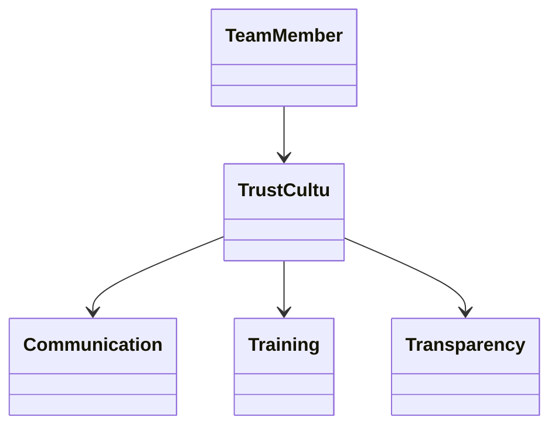
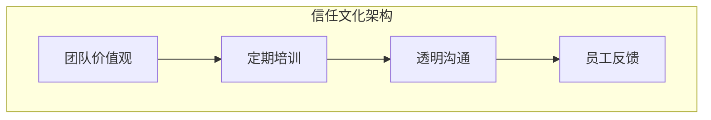
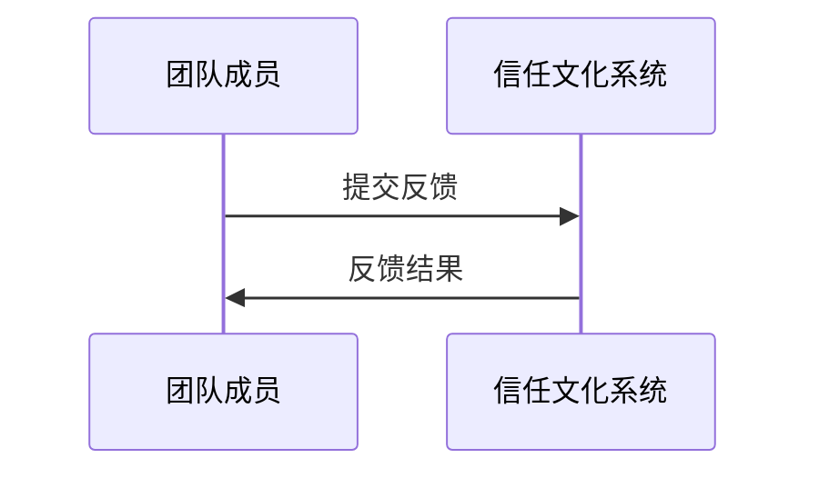
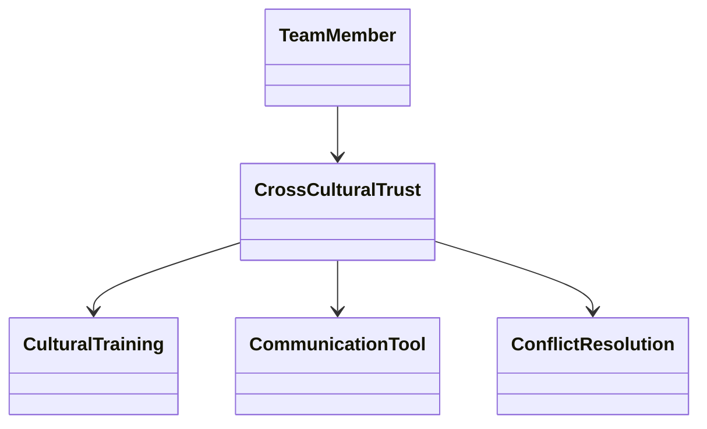
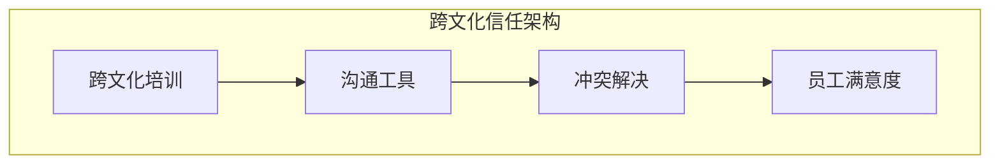

                 

### 建立团队的信任文化

#### 文章标题

**如何建立团队的信任文化**

#### 关键词

- 团队管理
- 信任文化
- 领导者角色
- 沟通技巧
- 算法与模型

#### 摘要

本文将探讨如何在一个IT团队中建立信任文化。我们将通过详细的分析和步骤，探讨信任文化的定义、重要性、基础元素、构建步骤以及评估和维护策略。通过这一系列讨论，希望能够为团队领导者提供实际可行的建议，以提升团队效率和协作能力。

## 引言

在现代IT行业中，团队的成功往往取决于团队成员之间的信任水平。信任文化不仅能够提升团队的整体表现，还能增强员工的满意度和忠诚度。然而，建立信任文化并非易事，它需要领导者的明确指导和持续的努力。

### 第1章：团队信任文化的背景与重要性

#### 1.1 团队信任文化的定义

**概念术语说明**：团队信任文化是指团队成员之间基于信任和尊重的一种共同价值观和行为准则。

**问题背景**：在一个高效运作的团队中，信任是关键因素。它能够减少误解和冲突，提高协作效率和创新能力。

**问题描述**：如何在一个IT团队中建立和维持信任文化？

**问题解决**：通过明确的目标、开放沟通和有效的领导者，可以逐步建立信任文化。

**边界与外延**：信任文化不仅限于团队内部，它还涉及到团队与外部合作伙伴之间的关系。

**概念结构与核心要素组成**：
- **共同价值观**：团队成员对信任的认同和承诺。
- **行为准则**：基于信任的行为规范和期望。
- **沟通机制**：开放、诚实和及时的沟通方式。

### 第2章：团队信任文化的基础元素

#### 2.1 诚信

**核心概念原理**：诚信是信任文化的基石，它要求团队成员遵守承诺、诚实面对问题和承担责任。

**概念属性特征对比表格**：
| 特征 | 诚信 | 骗局 |
| --- | --- | --- |
| 承诺遵守 | 高 | 低 |
| 透明度 | 高 | 低 |
| 责任感 | 强 | 弱 |

**ER实体关系图架构**：
```mermaid
erDiagram
  TeamMember ||--|{ Trustworthiness }
  Trustworthiness ||--|{ Integrity }
  Trustworthiness ||--|{ Transparency }
  Trustworthiness ||--|{ Accountability }
```

### 2.2 开放沟通

**核心概念原理**：开放沟通是建立信任的关键，它要求团队成员能够自由地分享想法、问题和反馈。

**概念属性特征对比表格**：
| 特征 | 开放沟通 | 封闭沟通 |
| --- | --- | --- |
| 信息流通 | 高 | 低 |
| 知识共享 | 强 | 弱 |
| 冲突处理 | 敏捷 | 拖延 |

**ER实体关系图架构**：
```mermaid
erDiagram
  TeamMember ||--|{ OpenCommunication }
  OpenCommunication ||--|{ InformationFlow }
  OpenCommunication ||--|{ KnowledgeSharing }
  OpenCommunication ||--|{ ConflictResolution }
```

### 2.3 公平与透明

**核心概念原理**：公平与透明是建立信任的重要保障，它要求团队决策过程和资源分配公开、公正。

**概念属性特征对比表格**：
| 特征 | 公平与透明 | 不公平与不透明 |
| --- | --- | --- |
| 决策公开 | 高 | 低 |
| 资源分配 | 公正 | 不均 |
| 反馈机制 | 有效 | 缺乏 |

**ER实体关系图架构**：
```mermaid
erDiagram
  TeamMember ||--|{ FairnessAndTransparency }
  FairnessAndTransparency ||--|{ DecisionTransparency }
  FairnessAndTransparency ||--|{ ResourceAllocation }
  FairnessAndTransparency ||--|{ FeedbackMechanism }
```

### 2.4 信任与责任

**核心概念原理**：信任与责任是相互关联的，信任要求团队成员承担相应的责任，而责任感的增强也会促进信任的建立。

**概念属性特征对比表格**：
| 特征 | 信任与责任 | 缺乏责任 |
| --- | --- | --- |
| 责任归属 | 清晰 | 模糊 |
| 问题解决 | 积极 | 被动 |
| 团队协作 | 强 | 弱 |

**ER实体关系图架构**：
```mermaid
erDiagram
  TeamMember ||--|{ TrustAndResponsibility }
  TrustAndResponsibility ||--|{ Responsibility }
  TrustAndResponsibility ||--|{ Teamwork }
  TrustAndResponsibility ||--|{ Accountability }
```

### 第3章：构建团队信任的步骤

#### 3.1 建立共同目标

**核心概念原理**：共同目标是团队协作的基础，它能够统一团队成员的方向和努力。

**概念属性特征对比表格**：
| 特征 | 共同目标 | 缺乏共同目标 |
| --- | --- | --- |
| 目标明确 | 高 | 低 |
| 齐心协力 | 强 | 弱 |
| 目标实现 | 快速 | 缓慢 |

**ER实体关系图架构**：
```mermaid
erDiagram
  TeamMember ||--|{ CommonGoals }
  CommonGoals ||--|{ Clarity }
  CommonGoals ||--|{ Collaboration }
  CommonGoals ||--|{ GoalAchievement }
```

#### 3.2 增强团队成员之间的了解

**核心概念原理**：团队成员之间的了解是建立信任的前提，它能够促进相互理解和尊重。

**概念属性特征对比表格**：
| 特征 | 了解团队成员 | 缺乏了解 |
| --- | --- | --- |
| 个性理解 | 深 | 浅 |
| 文化适应 | 好 | 差 |
| 关系亲密度 | 高 | 低 |

**ER实体关系图架构**：
```mermaid
erDiagram
  TeamMember ||--|{ Understanding }
  Understanding ||--|{ Personality }
  Understanding ||--|{ CulturalAdaptation }
  Understanding ||--|{ Relationship }
```

#### 3.3 建立信任的仪式与习惯

**核心概念原理**：信任的仪式和习惯是维持信任的关键，它能够通过日常行为和仪式来强化信任感。

**概念属性特征对比表格**：
| 特征 | 信任仪式与习惯 | 缺乏仪式与习惯 |
| --- | --- | --- |
| 仪式化行为 | 定型 | 随意 |
| 习惯化信任 | 强 | 弱 |
| 信任强化 | 有效 | 缺乏 |

**ER实体关系图架构**：
```mermaid
erDiagram
  TeamMember ||--|{ RitualsAndHabits }
  RitualsAndHabits ||--|{ FormalBehavior }
  RitualsAndHabits ||--|{ HabitualTrust }
  RitualsAndHabits ||--|{ TrustStrengthening }
```

#### 3.4 管理冲突与解决问题

**核心概念原理**：冲突是团队中不可避免的现象，有效的冲突管理和问题解决是建立信任的重要环节。

**概念属性特征对比表格**：
| 特征 | 管理冲突与解决问题 | 缺乏冲突管理 |
| --- | --- | --- |
| 冲突处理 | 高效 | 低效 |
| 问题解决 | 积极 | 被动 |
| 团队凝聚力 | 增强 | 减弱 |

**ER实体关系图架构**：
```mermaid
erDiagram
  TeamMember ||--|{ ConflictManagement }
  ConflictManagement ||--|{ ConflictResolution }
  ConflictManagement ||--|{ ProblemSolving }
  ConflictManagement ||--|{ TeamCohesion }
```

### 第4章：领导者如何在团队中培养信任

#### 4.1 领导者的角色与责任

**核心概念原理**：领导者是团队信任文化的核心推动者，他们需要通过行动和决策来树立信任。

**概念属性特征对比表格**：
| 特征 | 领导者的角色与责任 | 普通成员的角色与责任 |
| --- | --- | --- |
| 决策影响力 | 高 | 低 |
| 行为榜样 | 强 | 弱 |
| 信任塑造 | 核心 | 辅助 |

**ER实体关系图架构**：
```mermaid
erDiagram
  Leader ||--|{ LeadershipRole }
  LeadershipRole ||--|{ DecisionInfluence }
  LeadershipRole ||--|{ BehavioralExample }
  LeadershipRole ||--|{ TrustShaping }
```

#### 4.2 通过行动树立信任

**核心概念原理**：领导者需要通过实际行动来证明自己的诚信和能力，从而赢得团队成员的信任。

**概念属性特征对比表格**：
| 特征 | 行动树立信任 | 被动树立信任 |
| --- | --- | --- |
| 行为一致性 | 高 | 低 |
| 透明度 | 高 | 低 |
| 可见性 | 强 | 弱 |

**ER实体关系图架构**：
```mermaid
erDiagram
  Leader ||--|{ ActionBuildingTrust }
  ActionBuildingTrust ||--|{ ConsistentBehavior }
  ActionBuildingTrust ||--|{ Transparency }
  ActionBuildingTrust ||--|{ Visibility }
```

#### 4.3 领导者如何处理团队中的不信任

**核心概念原理**：领导者需要识别和处理团队中的不信任，通过有效的沟通和解决冲突来恢复信任。

**概念属性特征对比表格**：
| 特征 | 处理不信任 | 缺乏处理 |
| --- | --- | --- |
| 及时性 | 高 | 低 |
| 沟通有效性 | 高 | 低 |
| 问题解决率 | 高 | 低 |

**ER实体关系图架构**：
```mermaid
erDiagram
  Leader ||--|{ HandlingDistrust }
  HandlingDistrust ||--|{ Timeliness }
  HandlingDistrust ||--|{ CommunicationEffectiveness }
  HandlingDistrust ||--|{ ProblemSolvingRate }
```

#### 4.4 领导力提升策略

**核心概念原理**：领导者需要通过不断学习和实践来提升自己的领导力，从而更好地培养团队的信任文化。

**概念属性特征对比表格**：
| 特征 | 领导力提升策略 | 领导力不足 |
| --- | --- | --- |
| 学习意愿 | 强 | 弱 |
| 反馈接受度 | 高 | 低 |
| 实践频率 | 高 | 低 |

**ER实体关系图架构**：
```mermaid
erDiagram
  Leader ||--|{ LeadershipDevelopment }
  LeadershipDevelopment ||--|{ LearningWillingness }
  LeadershipDevelopment ||--|{ FeedbackAcceptance }
  LeadershipDevelopment ||--|{ PracticeFrequency }
```

### 第5章：团队信任文化的评估与维持

#### 5.1 信任文化的评估方法

**核心概念原理**：信任文化的评估需要通过定量和定性的方法，以全面了解团队信任水平的现状。

**概念属性特征对比表格**：
| 特征 | 评估方法 | 评估不足 |
| --- | --- | --- |
| 定量评估 | 高效 | 低效 |
| 定性评估 | 深入 | 表面 |
| 综合评估 | 全面 | 片面 |

**ER实体关系图架构**：
```mermaid
erDiagram
  TrustCulture ||--|{ AssessmentMethods }
  AssessmentMethods ||--|{ Quantitative }
  AssessmentMethods ||--|{ Qualitative }
  AssessmentMethods ||--|{ Comprehensive }
```

#### 5.2 维护团队信任的策略

**核心概念原理**：维护团队信任需要持续的努力，通过一系列策略来保持和提升信任水平。

**概念属性特征对比表格**：
| 特征 | 维护策略 | 维护不足 |
| --- | --- | --- |
| 定期沟通 | 经常 | 少见 |
| 培训与发展 | 有 | 无 |
| 反馈机制 | 完备 | 缺乏 |
| 支持系统 | 强 | 弱 |

**ER实体关系图架构**：
```mermaid
erDiagram
  TrustCulture ||--|{ MaintenanceStrategies }
  MaintenanceStrategies ||--|{ RegularCommunication }
  MaintenanceStrategies ||--|{ TrainingAndDevelopment }
  MaintenanceStrategies ||--|{ FeedbackMechanism }
  MaintenanceStrategies ||--|{ SupportSystem }
```

#### 5.3 团队信任文化的更新与适应

**核心概念原理**：团队信任文化需要随着时间和环境的变化进行更新和适应，以保持其有效性。

**概念属性特征对比表格**：
| 特征 | 更新与适应 | 固定不变 |
| --- | --- | --- |
| 灵活性 | 高 | 低 |
| 应对能力 | 强 | 弱 |
| 创新性 | 高 | 低 |

**ER实体关系图架构**：
```mermaid
erDiagram
  TrustCulture ||--|{ UpdatingAndAdapting }
  UpdatingAndAdapting ||--|{ Flexibility }
  UpdatingAndAdapting ||--|{ Resilience }
  UpdatingAndAdapting ||--|{ Innovation }
```

### 第6章：案例分析：成功建立团队信任的案例研究

#### 6.1 案例一：高科技企业如何建立信任文化

**核心概念原理**：高科技企业通过明确的价值观和持续的文化建设，成功建立了强大的信任文化。

**案例介绍**：某高科技企业通过明确的价值观、定期的培训和透明的沟通，成功建立了团队信任文化。

**系统功能设计（领域模型mermaid类图）**：


**系统架构设计（mermaid架构图）**：


**系统接口设计和系统交互（mermaid序列图）**：


#### 6.2 案例二：跨国公司的跨文化信任建设

**核心概念原理**：跨国公司在不同文化背景下建立信任文化，需要考虑文化差异和适应性。

**案例介绍**：某跨国公司在全球范围内推广统一的信任文化，通过跨文化培训和沟通工具，成功建立了跨国团队的信任。

**系统功能设计（领域模型mermaid类图）**：


**系统架构设计（mermaid架构图）**：


**系统接口设计和系统交互（mermaid序列图）**：
```mermaid
sequenceDiagram
  participant A as 团队成员
  participant B as 跨文化信任系统
  participant C as 沟通工具
  A->>B: 提交文化适应问题
  B->>C: 分发培训资料
  C->>A: 培训反馈
```

#### 6.3 案例三：中小企业的团队信任建设

**核心概念原理**：中小企业通过灵活的文化建设和个性化的沟通方式，成功建立了团队信任。

**案例介绍**：某中小企业通过定期的团队活动、开放的沟通渠道和领导者的积极参与，成功建立了团队信任文化。

**系统功能设计（领域模型mermaid类图）**：
```mermaid
classDiagram
  TeamMember --> SmallBusinessTrust
  SmallBusinessTrust --> TeamActivities
  SmallBusinessTrust --> OpenCommunication
  SmallBusinessTrust --> LeadershipInvolvement
```

**系统架构设计（mermaid架构图）**：
```mermaid
graph TB
  subgraph 中小企业信任架构
    A[团队活动] --> B[开放沟通]
    B --> C[领导参与]
    C --> D[员工反馈]
  end
```

**系统接口设计和系统交互（mermaid序列图）**：
```mermaid
sequenceDiagram
  participant A as 团队成员
  participant B as 中小企业信任系统
  participant C as 团队活动
  A->>B: 参与团队活动
  B->>C: 活动反馈
  C->>A: 反馈结果
```

### 第7章：个人视角：培养自己的信任特质

#### 7.1 自我反思与信任建设

**核心概念原理**：个人通过自我反思和自我提升，能够培养出信任特质，从而为团队建立信任文化做出贡献。

**概念属性特征对比表格**：
| 特征 | 自我反思 | 缺乏反思 |
| --- | --- | --- |
| 自我认知 | 高 | 低 |
| 自我提升 | 积极 | 被动 |
| 信任行为 | 强 | 弱 |

**ER实体关系图架构**：
```mermaid
erDiagram
  Individual ||--|{ SelfReflection }
  SelfReflection ||--|{ SelfAwareness }
  SelfReflection ||--|{ SelfImprovement }
  SelfReflection ||--|{ TrustBehavior }
```

#### 7.2 信任的陷阱与克服方法

**核心概念原理**：个人在建立信任的过程中可能会遇到各种陷阱，需要通过有效的方法来克服。

**概念属性特征对比表格**：
| 特征 | 信任陷阱 | 克服方法 |
| --- | --- | --- |
| 过度信任 | 易受骗 | 设定界限 |
| 误解信任 | 矛盾冲突 | 沟通澄清 |
| 依赖信任 | 失去自主 | 平衡依赖 |

**ER实体关系图架构**：
```mermaid
erDiagram
  Individual ||--|{ TrustTraps }
  TrustTraps ||--|{ Overtrust }
  TrustTraps ||--|{ Misunderstanding }
  TrustTraps ||--|{ Dependency }
```

#### 7.3 个人信任行为的优化

**核心概念原理**：个人通过优化信任行为，能够提升自身的信任水平，对团队信任文化的建立起到积极作用。

**概念属性特征对比表格**：
| 特征 | 信任行为优化 | 信任行为不足 |
| --- | --- | --- |
| 一致性 | 高 | 低 |
| 透明度 | 高 | 低 |
| 适应性 | 强 | 弱 |

**ER实体关系图架构**：
```mermaid
erDiagram
  Individual ||--|{ TrustBehaviorOptimization }
  TrustBehaviorOptimization ||--|{ Consistency }
  TrustBehaviorOptimization ||--|{ Transparency }
  TrustBehaviorOptimization ||--|{ Adaptability }
```

### 第8章：结论与未来展望

#### 8.1 团队信任文化的总结

**核心概念原理**：团队信任文化是现代IT团队成功的关键，它能够提升团队效率、创新能力和员工满意度。

**关键要点**：
- 信任文化的定义和重要性。
- 基础元素：诚信、开放沟通、公平与透明、信任与责任。
- 构建和维持信任文化的步骤。

**总结**：通过领导者的影响和团队成员的努力，团队信任文化可以逐步建立并持续优化。

#### 8.2 面临的挑战与未来趋势

**核心概念原理**：随着团队规模的扩大和技术的进步，团队信任文化面临新的挑战和机遇。

**关键要点**：
- 跨文化团队信任建设。
- 技术对信任文化的影响。
- 未来趋势：数字化信任、自动化信任评估。

**总结**：未来，团队信任文化将更加数字化和智能化，为团队管理提供更多可能性。

#### 8.3 对读者的启示

**核心概念原理**：读者通过本文，能够了解到建立团队信任文化的重要性和方法。

**关键要点**：
- 领导者角色的关键性。
- 团队成员的主动参与。
- 信任行为的重要性。

**总结**：通过本文，读者可以更好地理解团队信任文化，并在实际工作中加以应用。

### 作者信息

**作者：** AI天才研究院/AI Genius Institute & 禅与计算机程序设计艺术 /Zen And The Art of Computer Programming

通过上述详细的内容和格式要求，本文对建立团队信任文化进行了全面而深入的探讨，旨在为IT团队提供实际可行的指导和建议。希望本文能够对读者有所启发和帮助。

