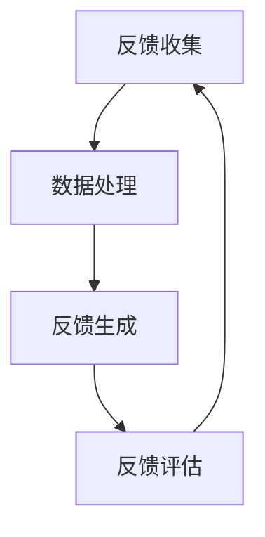
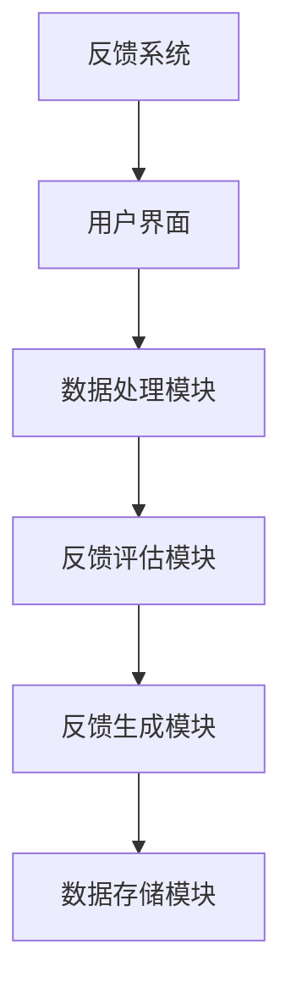
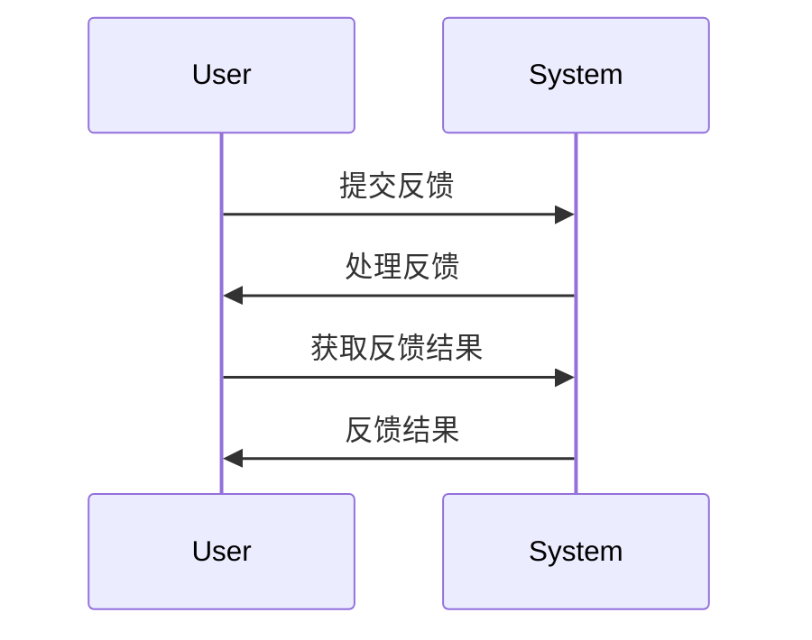

                 

## 文章标题

### 关键词

- 团队反馈机制
- 有效沟通
- 团队协作
- 问题解决
- 组织发展

### 摘要

在快速变化的现代工作环境中，团队反馈机制成为组织发展的关键因素。本文将详细探讨如何建立有效的团队反馈机制，包括问题背景、核心概念、构建方法、算法原理、系统分析与架构设计以及项目实战等方面的内容，旨在为IT领域从业者提供实用的指导和建议。

## 第一部分：问题背景与核心概念

### 第1章：团队反馈机制的重要性

#### 1.1.1 问题背景

在现代企业中，团队协作是提高工作效率和创新能力的重要手段。然而，团队内部的沟通不畅、信息不对称以及意见分歧等问题常常导致项目进展受阻。为了解决这些问题，建立有效的团队反馈机制显得尤为重要。

#### 1.1.2 团队反馈机制的概述

团队反馈机制是一种通过持续、及时、双向的沟通来提高团队协作效率和质量的方法。它包括反馈的收集、处理、反馈和再处理等环节，旨在确保团队成员之间的信息畅通和问题及时解决。

#### 1.1.3 团队反馈机制的必要性

有效的团队反馈机制有助于提高团队凝聚力、促进知识共享、提升决策质量，并最终推动组织目标的实现。在IT领域，这种机制对于技术迭代、创新应用和项目管理等方面尤为关键。

### 第2章：团队反馈机制的核心概念

#### 2.1.1 反馈机制的构成要素

一个有效的团队反馈机制通常包括反馈源、反馈目标、反馈渠道和反馈评估等要素。这些要素共同构成了反馈机制的基本框架。

#### 2.1.2 反馈机制的分类与特性

根据反馈的目的和方式，反馈机制可以分为正向反馈和负向反馈、内部反馈和外部反馈等类型。每种类型的反馈机制都有其特定的应用场景和特性。

#### 2.1.3 反馈机制的设计原则

在设计团队反馈机制时，应遵循及时性、针对性、透明性和可持续性等原则。这些原则有助于确保反馈机制的实效性和长期有效性。

### 第3章：团队反馈机制的数学模型

#### 3.1.1 基本数学模型

团队反馈机制的数学模型通常包括反馈强度、反馈速度、反馈准确性和反馈效果等指标。这些指标可以通过数学公式进行量化分析。

#### 3.1.2 数学模型的应用

数学模型可以用于评估团队反馈机制的有效性，并为改进反馈机制提供数据支持。例如，通过分析反馈强度和反馈速度的关系，可以优化反馈流程，提高反馈效率。

## 第二部分：团队反馈机制的构建方法

### 第4章：团队反馈机制的构建流程

#### 4.1.1 构建流程概述

构建有效的团队反馈机制需要经历需求分析、方案设计、实施和评估等阶段。每个阶段都有其特定的任务和目标。

#### 4.1.2 需求分析

在需求分析阶段，需要明确团队反馈机制的目标、适用范围、关键要素和预期效果。这有助于确保反馈机制的构建方向正确，满足团队的实际需求。

#### 4.1.3 设计方案

设计方案阶段是构建团队反馈机制的核心。在这一阶段，需要制定详细的构建方案，包括反馈渠道的选择、反馈流程的优化、反馈评估的方法等。

### 第5章：团队反馈机制的算法原理

#### 5.1.1 算法原理概述

团队反馈机制的算法原理主要包括反馈的收集、处理和反馈等环节。这些环节通过算法实现，可以确保反馈过程的自动化和高效性。

#### 5.1.2 算法流程图



#### 5.1.3 算法讲解

算法讲解部分将详细阐述每个环节的实现原理，包括反馈数据的收集方法、数据处理算法、反馈生成策略和反馈评估指标等。

### 第6章：团队反馈机制的数学公式与解析

#### 6.1.1 数学公式

$$
\text{反馈效果} = f(\text{反馈强度}, \text{反馈速度}, \text{反馈准确性})
$$

#### 6.1.2 数学公式解析

反馈效果是由反馈强度、反馈速度和反馈准确性共同决定的。通过数学公式，可以量化这些因素对反馈效果的影响。

#### 6.1.3 举例说明

以一个实际项目为例，分析反馈强度、反馈速度和反馈准确性对项目进度和质量的影响，从而优化团队反馈机制。

### 第7章：系统分析与架构设计

#### 7.1.1 问题场景介绍

介绍一个典型的IT项目场景，说明团队反馈机制在该场景中的应用和价值。

#### 7.1.2 系统功能设计

使用Mermaid类图描述系统的功能架构，包括各个模块的功能和关系。

```mermaid
classDiagram
Class01 <|-- Class02
Class03 --| Teilnehmer: Class04
Class05 : +int x
Class06 : +int y
Class06 : +int z
Class06 : +int getZ()
Class07 : -int z
Class07 : -void setZ(int z)
Class07 : -int addZ(int a, int b)
Class08 : -int subZ(int a, int b)
Class08 : -int mulZ(int a, int b)
Class08 : -int divZ(int a, int b)
class UMLClass
{
    <<interface>> 
    - id : Integer
    - name : String
    + getId() : Integer
    + getName() : String
    + setName(name : String) : void
}
```

#### 7.1.3 系统架构设计

使用Mermaid架构图描述系统的整体架构，包括各个模块的组成和交互关系。



#### 7.1.4 系统接口设计

使用Mermaid序列图描述系统的接口设计和交互流程。



#### 7.1.5 系统交互

详细描述系统各个模块之间的交互流程，包括数据流转、错误处理和异常情况等。

### 第8章：项目实战

#### 8.1.1 环境安装

说明项目所需的环境配置，包括操作系统、开发工具和第三方库等。

#### 8.1.2 系统核心实现

提供项目核心实现的源代码，并对代码进行详细解读和分析。

```python
# 反馈收集模块实现
def collect_feedback():
    # 收集用户反馈
    feedback = input("请输入您的反馈：")
    return feedback

# 数据处理模块实现
def process_feedback(feedback):
    # 处理用户反馈
    processed_feedback = feedback.lower().replace(" ", "")
    return processed_feedback

# 反馈评估模块实现
def evaluate_feedback(processed_feedback):
    # 评估用户反馈
    if "满意" in processed_feedback or "好评" in processed_feedback:
        feedback_score = 1
    else:
        feedback_score = 0
    return feedback_score

# 反馈生成模块实现
def generate_feedback(feedback_score):
    # 生成反馈结果
    if feedback_score == 1:
        result = "感谢您的满意反馈，我们会继续努力提供更好的服务！"
    else:
        result = "感谢您的反馈，我们会认真对待并改进我们的服务。"
    return result

# 主函数实现
def main():
    feedback = collect_feedback()
    processed_feedback = process_feedback(feedback)
    feedback_score = evaluate_feedback(processed_feedback)
    result = generate_feedback(feedback_score)
    print(result)

if __name__ == "__main__":
    main()
```

#### 8.1.3 代码解读与分析

对上述代码进行详细解读，分析每个模块的功能和实现原理。

#### 8.1.4 实际案例分析和详细讲解剖析

通过实际案例，分析团队反馈机制在不同场景下的应用效果，并对其进行详细讲解和剖析。

#### 8.1.5 项目小结

总结项目实施过程中的经验和教训，为后续类似项目的实施提供参考。

### 第9章：最佳实践

#### 9.1.1 团队反馈机制实施的最佳实践

提供一些实际应用中的最佳实践，包括反馈渠道的选择、反馈流程的优化和反馈评估的方法等。

#### 9.1.2 避免常见问题的技巧

分析团队反馈机制实施过程中可能遇到的问题，并提供相应的解决技巧和注意事项。

#### 9.1.3 成功案例分析

通过成功案例的分析，展示团队反馈机制在实践中的效果和成果。

### 第10章：小结

#### 10.1.1 本书内容总结

回顾全书的内容，总结团队反馈机制的核心概念、构建方法、算法原理和实践经验等。

#### 10.1.2 团队反馈机制的未来发展方向

展望团队反馈机制的未来发展方向，探讨其在信息技术和企业管理中的应用前景。

