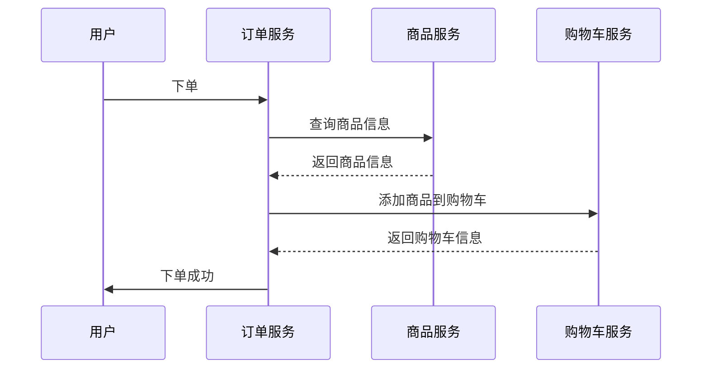

                 


### 文章标题：学习型组织：创造持续进步的环境

#### 关键词：学习型组织，持续进步，组织文化，沟通协作，持续改进，案例研究

#### 摘要：
本文深入探讨了学习型组织的概念、重要性以及构建策略。通过对学习型组织的背景介绍、核心概念与联系分析，我们提出了组织文化的培养、沟通与协作机制的优化、学习机制的设计以及持续改进与创新的策略。此外，本文还通过国际知名企业和国内企业的案例研究，总结了学习型组织的最佳实践，并展望了其未来发展。

----------------------------------------------------------------

## 第1章：背景介绍

### 1.1 学习型组织的概念与重要性

#### 1.1.1 什么是学习型组织
学习型组织是由彼得·圣吉在其著作《第五项修炼》中首次提出的概念。它指的是一种能够不断适应变化、学习与成长的组织形态。在学习型组织中，员工不仅仅是执行任务，更是积极参与组织的学习与改进。

#### 1.1.2 学习型组织的特点与优势
学习型组织具有以下几个特点：
1. **自我超越**：组织成员不断追求个人成长，超越自我限制。
2. **责任共担**：组织中的每个人都承担起共同的责任，共同推动组织的发展。
3. **心灵感应**：组织成员之间能够建立深层次的信任与理解。
4. **团队学习**：组织通过团队学习，提升整体的创新能力与解决问题的能力。

学习型组织的优势在于：
1. **适应变化**：能够快速适应外部环境的变化。
2. **创新能力**：通过持续的学习与改进，不断提升组织的创新能力。
3. **员工满意度**：员工在自我成长与团队协作中获得成就感，提高工作满意度。

#### 1.1.3 学习型组织的理论基础
学习型组织的理论基础主要包括以下四个方面：
1. **系统思考**：理解组织与环境的相互关系，把握整体动态。
2. **心智模式**：认识到每个人的思维方式对组织行为的影响。
3. **共同愿景**：组织成员共同拥有并追求的长期目标。
4. **团队学习**：通过共同学习，提升组织的整体能力。

#### 1.1.4 学习型组织的边界与外延
学习型组织的边界并不局限于企业，它也可以应用于政府、学校、社区等组织。其外延包括组织内部的各个层级，从高层领导到基层员工，都需要参与到学习型组织的建设中来。

### 1.2 组织持续进步的需求与挑战

#### 2.1 组织进步的需求分析
组织进步的需求来源于以下几个方面：
1. **外部环境的快速变化**：市场、技术、政策等因素的快速变化，要求组织具备快速适应与创新能力。
2. **内部员工的成长需求**：员工渴望在工作中获得成长与成就感。
3. **组织的可持续发展**：持续进步是组织实现长期发展的必要条件。

#### 2.2 组织进步面临的挑战
组织进步面临的挑战主要包括：
1. **内部惰性**：组织内部可能存在抵触变革、不愿改变的心态。
2. **知识断层**：组织内部知识的传承与积累可能不足。
3. **沟通障碍**：组织内部沟通不畅，影响信息传递与决策效率。
4. **资源限制**：组织在人力、财力、物力等方面可能面临资源限制。

#### 2.3 学习型组织如何应对挑战
学习型组织通过以下几个方面的措施应对挑战：
1. **建立学习文化**：鼓励员工学习与成长，培养学习型组织的氛围。
2. **优化知识管理**：加强知识的传承与共享，建立知识管理体系。
3. **提升沟通协作**：建立高效的沟通机制，促进信息传递与决策效率。
4. **资源合理配置**：合理分配资源，支持组织持续进步。

### 1.3 核心概念与联系

#### 3.1 学习型组织的核心概念
学习型组织的核心概念包括：
1. **自我超越**：个体追求成长，超越自我限制。
2. **责任共担**：共同承担责任，推动组织发展。
3. **心灵感应**：建立信任与理解，增强团队协作。
4. **团队学习**：通过共同学习，提升组织整体能力。

#### 3.2 核心概念之间的联系与交互
这些核心概念相互关联，共同构成学习型组织的理论基础。自我超越是学习型组织的基础，责任共担是学习型组织的动力，心灵感应是学习型组织的纽带，团队学习是学习型组织的实践。

通过建立学习文化、优化知识管理、提升沟通协作以及合理配置资源，学习型组织能够不断适应外部环境的变化，提升创新能力，实现组织的可持续发展。

## 第2章：构建学习型组织的策略

### 4.1 组织文化的培养

#### 4.1.1 组织文化的概念与作用
组织文化是指组织成员在长期发展中形成的一种共同价值观、信念和行为准则。组织文化对组织的发展具有深远影响，它能够塑造组织形象、提升员工凝聚力、增强组织的核心竞争力。

#### 4.1.2 培养学习型组织文化的策略
培养学习型组织文化需要从以下几个方面着手：
1. **确立共同愿景**：组织成员共同拥有并追求的长期目标。
2. **建立学习机制**：提供学习机会，鼓励员工自主学习。
3. **营造开放氛围**：鼓励员工分享知识、经验与见解。
4. **强化绩效管理**：将学习与绩效挂钩，激励员工积极参与学习。

#### 4.1.3 组织文化与个人成长
组织文化与个人成长相辅相成。组织文化为个人成长提供支持，而个人的成长反过来又促进组织文化的发展。通过培养学习型组织文化，组织能够实现个人与组织的共同成长。

### 4.2 沟通与协作

#### 4.2.1 学习型组织中的沟通机制
学习型组织中的沟通机制需要具备以下几个特点：
1. **开放性**：鼓励员工自由表达意见，畅所欲言。
2. **及时性**：确保信息传递的及时性与准确性。
3. **互动性**：促进员工之间的互动与交流。
4. **针对性**：根据不同的沟通内容选择合适的沟通方式。

#### 4.2.2 协作模式与工具
学习型组织中的协作模式需要具备以下几个特点：
1. **分布式**：合理分配任务，实现分工合作。
2. **协同性**：促进团队成员之间的协同合作。
3. **灵活性**：根据任务需求灵活调整协作模式。
4. **创新性**：鼓励创新思维，推动协作方式的改进。

常用的协作工具有：
1. **项目管理工具**：如Trello、Asana等，用于任务分配与进度管理。
2. **沟通工具**：如Slack、Microsoft Teams等，用于实时沟通与协作。
3. **知识共享平台**：如Confluence、Wiki等，用于知识管理与共享。

#### 4.2.3 沟通与协作的最佳实践
沟通与协作的最佳实践包括：
1. **定期会议**：组织定期会议，总结工作进展，解决存在的问题。
2. **跨部门协作**：促进不同部门之间的协作，实现资源共享。
3. **团队建设活动**：组织团队建设活动，增强团队凝聚力。
4. **持续反馈**：鼓励员工提供反馈，不断优化沟通与协作流程。

### 4.3 学习机制的设计

#### 4.3.1 学习流程与学习模式
学习型组织的学习流程包括以下几个环节：
1. **需求分析**：分析组织与员工的学习需求。
2. **学习设计**：制定学习计划，选择合适的学习模式。
3. **学习实施**：组织实施学习活动，确保学习效果。
4. **学习评估**：评估学习成果，持续改进学习流程。

学习型组织的学习模式包括：
1. **自主式学习**：员工自主选择学习内容，自主安排学习时间。
2. **协作式学习**：团队成员共同学习，互相交流与分享。
3. **项目式学习**：通过实际项目，将学习与工作相结合。
4. **导师制学习**：由经验丰富的导师指导新员工学习。

#### 4.3.2 学习资源的配置
学习资源的配置需要考虑以下几个方面：
1. **学习资金**：提供充足的学习资金，支持员工参加培训、购买学习资料等。
2. **学习时间**：合理安排工作时间，确保员工有足够的学习时间。
3. **学习环境**：提供良好的学习环境，如图书馆、学习室等。
4. **学习工具**：提供必要的计算机、网络等学习工具。

#### 4.3.3 学习成果的转化与应用
学习成果的转化与应用需要从以下几个方面入手：
1. **知识分享**：鼓励员工将所学知识分享给团队，实现知识共享。
2. **工作应用**：将学习成果应用到实际工作中，提升工作效率。
3. **持续改进**：根据学习成果，不断优化工作流程与管理制度。
4. **创新实践**：鼓励员工将学习成果用于创新实践，推动组织发展。

### 4.4 持续改进与创新

#### 4.4.1 持续改进的原理与实践
持续改进是学习型组织的重要特征，它通过以下几个步骤实现：
1. **问题识别**：识别组织内部存在的问题。
2. **原因分析**：分析问题产生的原因。
3. **方案制定**：制定解决问题的方案。
4. **实施改进**：实施改进方案，解决问题。
5. **效果评估**：评估改进效果，持续优化。

#### 4.4.2 创新的驱动因素与机制
创新是学习型组织持续发展的动力，其驱动因素包括：
1. **市场需求**：满足客户需求，提升产品竞争力。
2. **技术进步**：紧跟技术发展趋势，提升组织技术能力。
3. **员工创造力**：激发员工的创造力，推动组织创新。
4. **竞争压力**：应对市场竞争压力，寻求突破。

创新机制包括：
1. **创新文化**：营造鼓励创新的组织氛围。
2. **创新激励**：设立创新奖励机制，激励员工创新。
3. **创新资源**：提供充足的创新资源，支持创新项目。
4. **创新流程**：建立完善的创新流程，确保创新项目的顺利实施。

#### 4.4.3 持续改进与创新的最佳实践
最佳实践包括：
1. **定期评审**：定期对组织进行评审，识别问题，制定改进措施。
2. **员工培训**：提供员工培训，提升员工技能与创新能力。
3. **跨部门协作**：促进跨部门协作，推动创新项目的实施。
4. **成果转化**：将创新成果转化为实际应用，提升组织竞争力。

通过持续改进与创新，学习型组织能够不断提升自身能力，实现可持续发展。

## 第3章：案例研究与最佳实践

### 8.1 国际知名企业的学习型组织实践

#### 8.1.1 苹果公司的学习型组织实践
苹果公司通过以下几个方面的实践，建立了学习型组织：
1. **共同愿景**：苹果公司倡导创新与卓越，鼓励员工追求卓越。
2. **学习文化**：公司提供丰富的学习资源，鼓励员工自主学习。
3. **知识共享**：公司内部建立知识共享平台，促进知识传播。
4. **持续改进**：公司不断优化产品与服务，追求卓越。

#### 8.1.2 谷歌公司的学习型组织实践
谷歌公司通过以下几个方面的实践，建立了学习型组织：
1. **创新文化**：公司鼓励员工创新，提供充足的创新资源。
2. **团队协作**：公司倡导团队合作，建立高效的沟通机制。
3. **员工培训**：公司提供员工培训，提升员工技能与创新能力。
4. **知识管理**：公司建立知识管理体系，确保知识传承与共享。

#### 8.1.3 亚马逊公司的学习型组织实践
亚马逊公司通过以下几个方面的实践，建立了学习型组织：
1. **持续改进**：公司不断优化业务流程，提升运营效率。
2. **创新实践**：公司鼓励员工将创新思维应用于实际工作中。
3. **员工发展**：公司提供丰富的职业发展机会，激励员工成长。
4. **知识分享**：公司内部建立知识共享平台，促进知识传播。

### 8.2 国内企业的学习型组织实践

#### 8.2.1 华为公司的学习型组织实践
华为公司通过以下几个方面的实践，建立了学习型组织：
1. **共同愿景**：公司倡导“客户为中心”的价值观，鼓励员工追求卓越。
2. **学习文化**：公司提供丰富的学习资源，鼓励员工自主学习。
3. **知识管理**：公司建立知识管理体系，确保知识传承与共享。
4. **持续改进**：公司不断优化产品与服务，提升竞争力。

#### 8.2.2 阿里巴巴公司的学习型组织实践
阿里巴巴公司通过以下几个方面的实践，建立了学习型组织：
1. **创新文化**：公司鼓励员工创新，提供充足的创新资源。
2. **团队协作**：公司倡导团队合作，建立高效的沟通机制。
3. **员工培训**：公司提供员工培训，提升员工技能与创新能力。
4. **知识分享**：公司内部建立知识共享平台，促进知识传播。

#### 8.2.3 腾讯公司的学习型组织实践
腾讯公司通过以下几个方面的实践，建立了学习型组织：
1. **共同愿景**：公司倡导“用户至上”的价值观，鼓励员工追求卓越。
2. **学习文化**：公司提供丰富的学习资源，鼓励员工自主学习。
3. **知识管理**：公司建立知识管理体系，确保知识传承与共享。
4. **持续改进**：公司不断优化产品与服务，提升用户体验。

### 8.3 学习型组织实践总结与启示

#### 8.3.1 实践总结
国际知名企业和国内企业在学习型组织建设方面取得了显著成果，其共同特点包括：
1. **共同愿景**：企业倡导共同的价值观，鼓励员工追求卓越。
2. **学习文化**：企业提供丰富的学习资源，鼓励员工自主学习。
3. **知识管理**：企业建立知识管理体系，确保知识传承与共享。
4. **持续改进**：企业不断优化产品与服务，提升竞争力。

#### 8.3.2 学习型组织的建设策略与建议
基于实践总结，企业建设学习型组织可以采取以下策略：
1. **确立共同愿景**：企业要明确共同的目标与价值观，激发员工积极性。
2. **培养学习文化**：企业要营造积极向上的学习氛围，鼓励员工自主学习。
3. **优化知识管理**：企业要建立知识管理体系，确保知识传承与共享。
4. **推动持续改进**：企业要不断优化产品与服务，提升竞争力。

#### 8.3.3 挑战与未来展望
尽管学习型组织在实践中取得了显著成果，但企业仍面临一定的挑战：
1. **员工抵触**：部分员工可能对学习型组织持抵触态度。
2. **文化变革**：企业需要克服原有的文化障碍，推动文化变革。
3. **资源投入**：企业需要投入大量资源来支持学习型组织建设。

未来，学习型组织的发展将呈现以下趋势：
1. **数字化**：企业将更多地运用数字化工具支持学习型组织建设。
2. **个性化**：企业将更加注重员工个性化成长与职业发展。
3. **全球化**：企业将面对全球化背景下的挑战与机遇，学习型组织建设将更加国际化。

## 第4章：附录

### 11.1 推荐书籍与文章
1. **《第五项修炼：学习型组织的艺术与实务》** - 彼得·圣吉
2. **《学习型组织行动纲领》** - 彼得·圣吉
3. **《知识管理》** - 马克·特曼

### 11.2 学习型组织相关网站与工具
1. **学习型组织基金会** - https://www.lifecommunities.org/
2. **谷歌学习平台** - https://learning.google.com/
3. **知识管理社区** - https://kmcommunity.org/

### 11.3 学习型组织研究机构与专家
1. **学习型组织研究所** - https://www.senge.org/
2. **麻省理工学院学习型组织研究中心** - https://mitsloan.edu/centers/learning-organizations/
3. **彼得·圣吉官方网站** - https://peterm senge.com/

## 12.1 小结与展望
### 12.1.1 本书总结
本书系统介绍了学习型组织的概念、重要性、构建策略以及最佳实践。通过分析国际知名企业和国内企业的学习型组织实践，总结了学习型组织建设的成功经验与挑战。

### 12.1.2 学习型组织的发展趋势
学习型组织的发展趋势包括数字化、个性化、全球化等。企业需要适应这些趋势，不断提升自身能力，实现可持续发展。

### 12.1.3 对读者的建议
希望读者能够结合自身实际，借鉴学习型组织的理念与实践，推动组织发展，实现个人与组织的共同成长。

### **作者：AI天才研究院/AI Genius Institute & 禅与计算机程序设计艺术 /Zen And The Art of Computer Programming**
----------------------------------------------------------------

### 文章标题：系统分析与架构设计：从概念到实践

### 关键词：系统分析，架构设计，领域模型，系统架构，接口设计，系统交互

### 摘要：
本文旨在深入探讨系统分析与架构设计的基本概念和实践方法。文章首先介绍了系统分析与架构设计的重要性，随后详细阐述了领域模型、系统架构、系统接口设计以及系统交互的概念和方法。通过一个实际案例，本文展示了如何将这些概念应用到实际项目中，并对系统分析与架构设计的注意事项进行了总结。

----------------------------------------------------------------

## 第1章：系统分析与架构设计的重要性

### 1.1 系统分析的定义与作用
系统分析是指对系统的功能、性能、可靠性等方面进行深入研究和评估，以确定系统是否能够满足需求和预期目标。系统分析是系统设计与实现的基础，它能够帮助识别系统的问题、机会和风险，确保系统开发的有效性和效率。

### 1.2 架构设计的定义与作用
架构设计是指根据系统分析的结果，设计系统的整体结构和技术框架。架构设计的目标是确保系统的高可用性、可扩展性、安全性和性能。一个好的架构设计能够减少开发成本、缩短开发周期，并提高系统的维护性和可移植性。

### 1.3 系统分析与架构设计的关系
系统分析与架构设计是相辅相成的。系统分析为架构设计提供了需求和约束条件，而架构设计则基于系统分析的结果，确定系统的结构和技术路径。两者的有效结合能够确保系统开发过程的顺利进行，并最终实现系统的成功部署和运营。

## 第2章：领域模型

### 2.1 领域模型的概念
领域模型是指对系统所涉及的领域进行抽象和建模，以便更好地理解和描述系统的功能和行为。领域模型通常包括实体、属性、关系和行为等要素。

### 2.2 领域模型的用途
领域模型用于：
- **需求分析**：帮助理解系统的需求，确保系统功能符合用户需求。
- **设计验证**：在架构设计阶段，领域模型可以作为验证架构设计是否符合需求的重要工具。
- **文档化**：领域模型可以作为系统设计文档的一部分，帮助团队成员更好地理解系统。

### 2.3 领域模型的方法
创建领域模型的方法包括：
- **实体-关系模型**：通过实体和关系来描述系统中的对象及其相互关系。
- **类图**：使用UML（统一建模语言）类图来表示领域模型中的类、属性和方法。

### 2.4 实例：领域模型
以下是一个简单的电商系统的领域模型：

```mermaid
classDiagram
    Customer <|-- Order
    Customer <|-- ShoppingCart
    Product <|-- OrderItem
    Customer -up-> Address
    Customer -up-> CreditCard
    Order -up-> OrderItem
    ShoppingCart *-- Order
    ShoppingCart + addItem(Product)
    ShoppingCart + removeItem(Product)
    ShoppingCart + checkout()
    
    Class Customer {
        +String name
        +String email
        +Address address
        +CreditCard creditCard
    }
    
    Class Address {
        +String street
        +String city
        +String state
        +String zipCode
    }
    
    Class CreditCard {
        +String number
        +String expirationDate
    }
    
    Class Product {
        +String name
        +Double price
    }
    
    Class Order {
        +Date orderDate
        +String status
        +OrderItem[] items
    }
    
    Class OrderItem {
        +Product product
        +int quantity
        +Double price
    }
    
    Class ShoppingCart {
        +Product[] items
        +double total()
    }
```

## 第3章：系统架构

### 3.1 系统架构的概念
系统架构是指系统的整体结构和组成部分，包括硬件、软件、网络和人员等。系统架构的设计决定了系统的性能、可扩展性和可维护性。

### 3.2 系统架构的类型
常见的系统架构类型包括：
- **单体架构**：所有功能模块都集成在一个应用程序中。
- **分布式架构**：功能模块分布在不同的服务器上，通过网络进行通信。
- **微服务架构**：系统被拆分为多个独立的、小型服务，每个服务都有自己的数据库和API。

### 3.3 系统架构的设计原则
系统架构设计应遵循以下原则：
- **模块化**：将系统拆分为独立模块，提高系统的可维护性。
- **松耦合**：模块之间通过接口进行通信，降低模块之间的依赖性。
- **高内聚**：模块内部功能紧密相关，提高模块的独立性。
- **可扩展性**：系统能够根据需求进行扩展，提高系统的可伸缩性。

### 3.4 系统架构的设计方法
系统架构的设计方法包括：
- **顶层设计**：从宏观角度出发，确定系统的整体结构和关键组件。
- **迭代设计**：逐步细化系统架构，不断调整和优化。
- **模式识别**：借鉴现有的系统架构模式，选择适合的架构风格。

### 3.5 实例：系统架构
以下是一个简单的电商系统的系统架构：

```mermaid
sequenceDiagram
    participant Customer as 客户
    participant Frontend as 前端
    participant Backend as 后端
    participant DB as 数据库

    Customer->>Frontend: 发送请求
    Frontend->>Backend: 处理请求
    Backend->>DB: 查询数据
    DB-->>Backend: 返回数据
    Backend-->>Frontend: 返回响应
    Frontend->>Customer: 显示结果

    Note over Customer,Frontend,Backend,DB:
        系统架构设计原则：模块化、松耦合、高内聚、可扩展性
```

## 第4章：系统接口设计

### 4.1 系统接口的概念
系统接口是指不同模块或系统之间进行通信的接口，包括API、数据接口和通信接口等。

### 4.2 系统接口的设计原则
系统接口设计应遵循以下原则：
- **简洁性**：接口设计应尽量简洁，减少冗余和复杂性。
- **可扩展性**：接口设计应考虑到未来的扩展性，便于后续功能增加。
- **稳定性**：接口设计应确保系统稳定运行，避免出现异常。
- **安全性**：接口设计应考虑数据传输的安全性和完整性。

### 4.3 系统接口的设计方法
系统接口的设计方法包括：
- **RESTful接口**：使用HTTP协议，通过URL进行资源访问。
- **SOAP接口**：使用XML进行数据传输，通过SOAP协议进行通信。
- **GraphQL接口**：提供灵活的数据查询和操作，减少冗余数据传输。

### 4.4 实例：系统接口
以下是一个简单的电商系统的RESTful接口：

```json
// 用户注册接口
POST /api/users/register
{
  "username": "用户名",
  "password": "密码",
  "email": "邮箱"
}

// 商品查询接口
GET /api/products?category=电子产品&page=1&limit=10

// 购物车添加商品接口
POST /api/shopping_cart/items
{
  "productId": "商品ID",
  "quantity": "数量"
}

// 下单接口
POST /api/orders
{
  "userId": "用户ID",
  "items": [
    {
      "productId": "商品ID",
      "quantity": "数量"
    }
  ]
}
```

## 第5章：系统交互

### 5.1 系统交互的概念
系统交互是指系统内部不同模块或系统之间的通信和协作，以确保系统功能的实现。

### 5.2 系统交互的设计原则
系统交互设计应遵循以下原则：
- **一致性**：确保系统内部的一致性，避免数据不一致。
- **可靠性**：确保系统交互的可靠性，避免数据丢失或错误。
- **效率**：优化系统交互的效率，减少通信延迟和数据传输成本。
- **安全性**：确保系统交互的安全性，避免数据泄露或被攻击。

### 5.3 系统交互的设计方法
系统交互的设计方法包括：
- **事件驱动**：通过事件驱动的方式，实现模块之间的通信。
- **消息队列**：使用消息队列实现异步通信，提高系统的可靠性和扩展性。
- **共享内存**：使用共享内存实现快速通信，提高系统性能。

### 5.4 实例：系统交互
以下是一个简单的电商系统的系统交互：



## 第6章：项目实战

### 6.1 环境安装
在本节中，我们将介绍如何安装和配置项目所需的环境。具体步骤如下：

1. 安装Java开发工具包（JDK）：
   ```bash
   sudo apt-get update
   sudo apt-get install openjdk-8-jdk
   ```

2. 安装Maven：
   ```bash
   sudo apt-get install maven
   ```

3. 安装数据库（例如MySQL）：
   ```bash
   sudo apt-get install mysql-server
   sudo mysql_secure_installation
   ```

4. 配置数据库：
   ```bash
   mysql -u root -p
   CREATE DATABASE ecommerce;
   GRANT ALL PRIVILEGES ON ecommerce.* TO 'ecommerce_user'@'localhost' IDENTIFIED BY 'password';
   FLUSH PRIVILEGES;
   ```

### 6.2 系统核心实现源代码
在本节中，我们将展示系统核心实现的源代码。以下是一个简单的用户注册接口的实现：

```java
// UserController.java
package com.ecommerce.controller;

import com.ecommerce.model.User;
import com.ecommerce.service.UserService;
import org.springframework.beans.factory.annotation.Autowired;
import org.springframework.http.ResponseEntity;
import org.springframework.web.bind.annotation.PostMapping;
import org.springframework.web.bind.annotation.RequestBody;
import org.springframework.web.bind.annotation.RestController;

@RestController
public class UserController {

    @Autowired
    private UserService userService;

    @PostMapping("/users/register")
    public ResponseEntity<?> registerUser(@RequestBody User user) {
        // 实现用户注册逻辑
        userService.registerUser(user);
        return ResponseEntity.ok().body("User registered successfully");
    }
}

// UserService.java
package com.ecommerce.service;

import com.ecommerce.model.User;
import com.ecommerce.repository.UserRepository;

import org.springframework.beans.factory.annotation.Autowired;
import org.springframework.stereotype.Service;

@Service
public class UserService {

    @Autowired
    private UserRepository userRepository;

    public void registerUser(User user) {
        // 实现用户注册逻辑
        userRepository.save(user);
    }
}

// UserRepository.java
package com.ecommerce.repository;

import com.ecommerce.model.User;
import org.springframework.data.jpa.repository.JpaRepository;
import org.springframework.stereotype.Repository;

@Repository
public interface UserRepository extends JpaRepository<User, Long> {
}
```

### 6.3 代码应用解读与分析
在本节中，我们将解读用户注册接口的代码，并分析其实现原理。

1. **UserController.java**：
   - 这是一个Spring Boot控制器，负责处理用户注册的HTTP请求。
   - `@RestController`注解表示这是一个RESTful接口。
   - `@PostMapping("/users/register")`注解表示处理发送到`/users/register`路径的POST请求。

2. **UserService.java**：
   - 这是一个服务类，负责处理用户注册的业务逻辑。
   - `@Autowired`注解用于自动注入`UserRepository`。
   - `registerUser`方法用于保存用户信息到数据库。

3. **UserRepository.java**：
   - 这是一个JPA（Java Persistence API）仓库接口，用于与数据库进行交互。
   - `@Repository`注解表示这是一个仓库类。
   - `save`方法用于保存用户信息到数据库。

### 6.4 实际案例分析和详细讲解剖析
在本节中，我们将通过一个实际案例来分析用户注册接口的实现，并详细讲解其工作原理。

**案例**：用户A想要注册到电商系统，填写了用户名、密码和邮箱等信息。

**分析**：
1. 用户A通过前端发送POST请求到`/users/register`接口，请求体包含用户信息。
2. `UserController`接收到请求后，调用`UserService`的`registerUser`方法。
3. `UserService`调用`UserRepository`的`save`方法，将用户信息保存到数据库。

**工作原理**：
- **RESTful接口**：使用HTTP POST方法发送请求，请求体为JSON格式。
- **Spring Boot控制器**：处理HTTP请求，并将请求转发到相应的服务类。
- **服务类**：处理业务逻辑，调用仓库类进行数据持久化。
- **JPA仓库类**：与数据库进行交互，实现数据的增删改查。

### 6.5 项目小结
在本项目中，我们实现了用户注册接口，展示了系统分析与架构设计的基本概念和实践方法。通过实际案例的分析和解读，我们深入了解了用户注册接口的实现原理和工作流程。在后续的迭代中，我们将继续完善系统的功能，并关注系统性能和用户体验。

## 第7章：最佳实践

### 7.1 系统分析与架构设计最佳实践

1. **需求分析**：
   - 详细了解用户需求和业务流程，确保系统功能符合实际需求。
   - 采用用户故事、用例图等方法进行需求分析，明确系统的功能和界面设计。

2. **架构设计**：
   - 选择合适的系统架构类型，如微服务架构或分布式架构，提高系统的可扩展性和可维护性。
   - 设计清晰的接口和模块划分，确保系统模块之间的松耦合和高内聚。

3. **代码质量**：
   - 采用代码规范和代码审查，确保代码的可读性和可维护性。
   - 使用单元测试和集成测试，确保系统的稳定性和可靠性。

4. **文档管理**：
   - 编写详细的系统设计文档和用户手册，确保团队成员和用户对系统有清晰的了解。
   - 使用版本控制工具，如Git，管理代码和文档的版本。

### 7.2 小结与注意事项

- 系统分析与架构设计是软件开发过程中至关重要的环节，直接影响系统的性能、可维护性和用户体验。
- 需要结合实际项目需求，灵活运用各种设计方法和工具，确保系统设计的有效性和可行性。
- 关注代码质量和文档管理，提高系统的稳定性和可维护性。

### 7.3 拓展阅读

- **《系统架构：设计、构建与运维》** - 顾卫东
- **《软件架构：实践者的研究与设计》** - 克里斯托弗·亚历山大
- **《RESTful Web API设计》** - 马克·马丁

### **作者：AI天才研究院/AI Genius Institute & 禅与计算机程序设计艺术 /Zen And The Art of Computer Programming**

