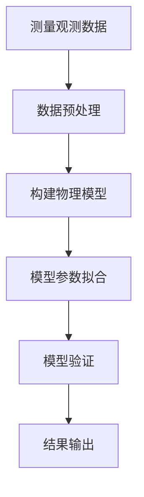
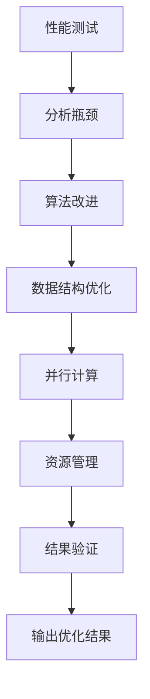
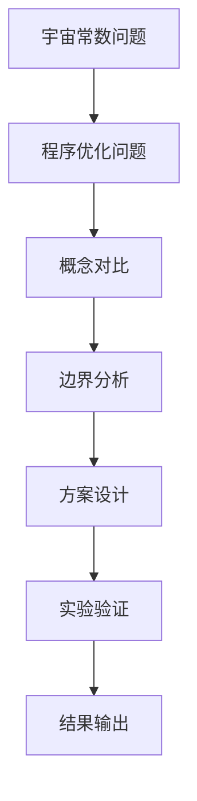
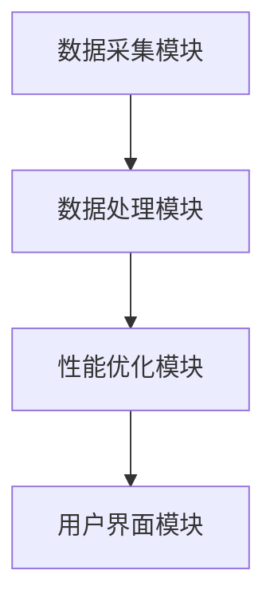

                 

### 宇宙常数与程序优化极限的类比

**关键词：** 宇宙常数、程序优化、类比、算法、数学模型

**摘要：** 本文通过将宇宙常数与程序优化极限进行类比，探讨了两者在概念、原理和应用方面的相似性和差异性。文章首先介绍了宇宙常数和程序优化极限的基本概念和背景，然后通过逐步分析的方式，探讨了类比的方法和边界条件，最终总结了类比在编程中的最佳实践和注意事项。

----------------------

## 目录大纲

----------------------

### # 宇宙常数与程序优化极限的类比

#### > **关键词：** 宇宙常数、程序优化、类比、算法、数学模型

#### > **摘要：** 本文通过将宇宙常数与程序优化极限进行类比，探讨了两者在概念、原理和应用方面的相似性和差异性。文章首先介绍了宇宙常数和程序优化极限的基本概念和背景，然后通过逐步分析的方式，探讨了类比的方法和边界条件，最终总结了类比在编程中的最佳实践和注意事项。

## 第一部分：引言

### 第1章：宇宙常数与程序优化极限的类比

#### 1.1 问题背景

##### 1.1.1 宇宙常数的定义与作用

##### 1.1.2 程序优化极限的概念与挑战

##### 1.1.3 类比的必要性

#### 1.2 问题描述

##### 1.2.1 宇宙常数问题

##### 1.2.2 程序优化问题

##### 1.2.3 类比问题

#### 1.3 问题解决

##### 1.3.1 宇宙常数问题的解决方法

##### 1.3.2 程序优化问题的解决方法

##### 1.3.3 类比解决问题的方法

#### 1.4 边界与外延

##### 1.4.1 宇宙常数问题的边界

##### 1.4.2 程序优化问题的边界

##### 1.4.3 类比问题的边界

#### 1.5 概念结构与核心要素组成

##### 1.5.1 宇宙常数的概念结构与核心要素

##### 1.5.2 程序优化极限的概念结构与核心要素

##### 1.5.3 类比的概念结构与核心要素

## 第二部分：核心概念与联系

### 第2章：核心概念与联系

#### 2.1 宇宙常数原理

##### 2.1.1 宇宙常数的原理

##### 2.1.2 宇宙常数的特点

##### 2.1.3 宇宙常数的应用

#### 2.2 程序优化极限原理

##### 2.2.1 程序优化极限的原理

##### 2.2.2 程序优化极限的特点

##### 2.2.3 程序优化极限的应用

#### 2.3 类比原理

##### 2.3.1 类比的概念与原理

##### 2.3.2 类比的特点与应用

## 第三部分：算法原理讲解

### 第3章：算法原理讲解

#### 3.1 宇宙常数算法讲解

##### 3.1.1 算法流程图

##### 3.1.2 数学模型与公式

##### 3.1.3 算法举例说明

#### 3.2 程序优化极限算法讲解

##### 3.2.1 算法流程图

##### 3.2.2 数学模型与公式

##### 3.2.3 算法举例说明

#### 3.3 类比算法讲解

##### 3.3.1 算法流程图

##### 3.3.2 数学模型与公式

##### 3.3.3 算法举例说明

## 第四部分：数学模型和数学公式

### 第4章：数学模型和数学公式

#### 4.1 宇宙常数数学模型

##### 4.1.1 数学模型

##### 4.1.2 数学公式

#### 4.2 程序优化极限数学模型

##### 4.2.1 数学模型

##### 4.2.2 数学公式

#### 4.3 类比数学模型

##### 4.3.1 数学模型

##### 4.3.2 数学公式

## 第五部分：系统分析与架构设计方案

### 第5章：系统分析与架构设计方案

#### 5.1 问题场景介绍

#### 5.2 项目介绍

#### 5.3 系统功能设计

##### 5.3.1 领域模型

#### 5.4 系统架构设计

##### 5.4.1 系统架构图

#### 5.5 系统接口设计

#### 5.6 系统交互

## 第六部分：项目实战

### 第6章：项目实战

#### 6.1 环境安装

#### 6.2 系统核心实现源代码

#### 6.3 代码应用解读与分析

#### 6.4 实际案例分析与详细讲解剖析

#### 6.5 项目小结

## 第七部分：最佳实践 tips

### 第7章：最佳实践 tips

#### 7.1 类比方法在编程中的应用

#### 7.2 注意事项

#### 7.3 拓展阅读

----------------------

## 第一部分：引言

### 第1章：宇宙常数与程序优化极限的类比

#### 1.1 问题背景

##### 1.1.1 宇宙常数的定义与作用

宇宙常数是物理学中一个重要的概念，通常用来描述宇宙的基本特征和演化规律。最著名的宇宙常数是爱因斯坦在广义相对论中引入的宇宙学常数$\Lambda$，它表示真空中的能量密度，对宇宙的加速膨胀起着关键作用。宇宙常数的研究对于理解宇宙的起源、结构和命运具有重要意义。

##### 1.1.2 程序优化极限的概念与挑战

在计算机科学领域，程序优化极限是指程序性能的极限，即在给定资源和时间限制下，程序能够达到的最优性能。随着计算机硬件的发展，程序优化变得越来越困难，因为程序需要处理的数据量和复杂度不断增加，同时性能要求越来越高。优化极限涉及到算法设计、数据结构选择、并行处理等多个方面。

##### 1.1.3 类比的必要性

宇宙常数与程序优化极限之间存在许多相似之处，例如它们都涉及到极限和最优化的概念，同时都面临边界条件和约束条件的挑战。通过类比，我们可以从宇宙常数的研究中获得启示，以解决程序优化中的难题。类比不仅可以帮助我们更好地理解两个领域的基本原理，还可以启发新的算法设计和优化方法。

#### 1.2 问题描述

##### 1.2.1 宇宙常数问题

宇宙常数问题主要包括以下几个方面：

1. **宇宙常数值的确定**：通过观测和实验，科学家试图确定宇宙常数的具体数值，这涉及到高精度的测量和复杂的物理模型。

2. **宇宙常数的作用**：理解宇宙常数在宇宙演化中的作用，例如宇宙的加速膨胀、结构形成和宇宙学背景辐射等。

3. **宇宙常数的起源**：探讨宇宙常数是如何产生的，这涉及到宇宙早期的物理过程和量子引力理论。

##### 1.2.2 程序优化问题

程序优化问题可以概括为以下几点：

1. **性能优化**：在给定的资源和时间限制下，通过算法改进和数据结构优化来提高程序的性能。

2. **资源管理**：有效管理计算机资源，如内存、CPU和存储，以最大化程序的性能。

3. **算法选择**：选择适合问题的算法和数据结构，以实现最优的运行时间复杂度和空间复杂度。

##### 1.2.3 类比问题

将宇宙常数与程序优化极限进行类比，需要解决以下几个问题：

1. **概念对比**：明确宇宙常数和程序优化极限的概念和属性，以及它们之间的相似性和差异性。

2. **边界条件**：探讨在何种条件下类比是有效的，以及这些条件对问题的解决有何影响。

3. **解决方案**：分析宇宙常数问题的解决方法，并将其应用于程序优化问题，以探索新的优化策略。

#### 1.3 问题解决

##### 1.3.1 宇宙常数问题的解决方法

解决宇宙常数问题通常涉及以下几个步骤：

1. **观测和测量**：通过天文观测和物理实验获取关于宇宙常数的数据。

2. **数据分析**：对观测数据进行统计分析，以确定宇宙常数的可能值。

3. **模型构建**：构建物理模型，将宇宙常数纳入其中，以解释宇宙的演化过程。

4. **验证和修正**：通过更多的观测和实验来验证模型的准确性，并根据结果进行修正。

##### 1.3.2 程序优化问题的解决方法

程序优化问题可以通过以下方法解决：

1. **算法改进**：设计或改进算法，以降低运行时间复杂度和空间复杂度。

2. **数据结构优化**：选择合适的数据结构，以提高程序的执行效率。

3. **并行计算**：利用并行计算技术，将程序分解为多个可并行执行的部分。

4. **资源管理**：优化资源分配策略，以确保程序能够在有限的资源下高效运行。

##### 1.3.3 类比解决问题的方法

类比解决问题的方法包括以下几个步骤：

1. **概念类比**：将宇宙常数和程序优化极限的基本概念进行对比，找出相似性和差异性。

2. **边界分析**：分析类比的有效边界条件，确保类比的应用范围是合理的。

3. **方案设计**：设计类比方案，将宇宙常数问题的解决方法应用于程序优化问题。

4. **实验验证**：通过实验验证类比方案的有效性，并根据结果进行优化。

#### 1.4 边界与外延

##### 1.4.1 宇宙常数问题的边界

宇宙常数问题的边界主要包括以下几个方面：

1. **测量精度**：宇宙常数的测量受到仪器精度和实验条件的限制。

2. **物理模型**：宇宙常数的确定依赖于物理模型的有效性和准确性。

3. **宇宙演化**：宇宙常数对宇宙演化的影响具有时间尺度和空间尺度的限制。

##### 1.4.2 程序优化问题的边界

程序优化问题的边界主要包括以下几个方面：

1. **性能要求**：程序的性能要求决定了优化的目标和限制。

2. **资源限制**：程序在资源（如内存、CPU）方面的限制影响了优化的可能性。

3. **算法复杂性**：算法的复杂性对优化的效果有重要影响。

##### 1.4.3 类比问题的边界

类比问题的边界主要取决于宇宙常数问题和程序优化问题的相似性和差异性。在类比过程中，需要确保类比的应用范围是合理的，同时避免引入不必要的复杂性和错误。

#### 1.5 概念结构与核心要素组成

##### 1.5.1 宇宙常数的概念结构与核心要素

宇宙常数的概念结构主要包括以下几个核心要素：

1. **定义**：宇宙常数是一个物理量，通常用符号$\Lambda$表示，其值决定了真空中的能量密度。

2. **作用**：宇宙常数对宇宙的加速膨胀、结构形成和宇宙学背景辐射等有重要影响。

3. **测量**：宇宙常数的测量依赖于观测数据和物理模型。

##### 1.5.2 程序优化极限的概念结构与核心要素

程序优化极限的概念结构主要包括以下几个核心要素：

1. **性能优化**：程序优化极限涉及在给定资源和时间限制下，程序能够达到的最优性能。

2. **资源管理**：优化资源分配，以提高程序的性能。

3. **算法选择**：选择适合问题的算法和数据结构，以实现最优的运行时间复杂度和空间复杂度。

##### 1.5.3 类比的概念结构与核心要素

类比的概念结构主要包括以下几个核心要素：

1. **概念对比**：通过对比宇宙常数和程序优化极限的基本概念，找出相似性和差异性。

2. **边界分析**：分析类比的有效边界条件，确保类比的应用范围是合理的。

3. **方案设计**：设计类比方案，将宇宙常数问题的解决方法应用于程序优化问题。

## 第二部分：核心概念与联系

### 第2章：核心概念与联系

#### 2.1 宇宙常数原理

##### 2.1.1 宇宙常数的原理

宇宙常数是物理学中描述宇宙基本特征和演化规律的量。在广义相对论中，宇宙常数$\Lambda$表示真空中的能量密度，它与宇宙的加速膨胀有关。宇宙常数的原理主要包括以下几个方面：

1. **宇宙加速膨胀**：宇宙常数导致宇宙加速膨胀，这是宇宙学中的关键观测现象。

2. **结构形成**：宇宙常数对宇宙的结构形成有重要影响，它决定了星系、星团和超星系团的形成和演化。

3. **宇宙学背景辐射**：宇宙常数对宇宙学背景辐射的温度和特性有影响，这是宇宙早期的物理过程的证据。

##### 2.1.2 宇宙常数的特点

宇宙常数具有以下几个特点：

1. **常数性**：宇宙常数的值是一个固定值，不随时间和空间变化。

2. **普遍性**：宇宙常数在整个宇宙中都存在，对宇宙的各个方面都有影响。

3. **可测性**：通过观测数据和物理模型，可以测量宇宙常数的值。

##### 2.1.3 宇宙常数的应用

宇宙常数的应用非常广泛，包括以下几个方面：

1. **宇宙学**：宇宙常数是宇宙学中的关键参数，用于研究宇宙的起源、演化和结构。

2. **天文学**：宇宙常数对天文学的研究具有重要意义，例如恒星的形成、星系的结构和宇宙背景辐射等。

3. **物理学**：宇宙常数是广义相对论中的重要参数，对物理学的理论体系有重要影响。

#### 2.2 程序优化极限原理

##### 2.2.1 程序优化极限的原理

程序优化极限是指在给定资源和时间限制下，程序能够达到的最优性能。程序优化极限的原理主要包括以下几个方面：

1. **算法改进**：通过改进算法，降低运行时间复杂度和空间复杂度，提高程序的性能。

2. **数据结构优化**：选择合适的数据结构，提高程序的数据处理效率和存储效率。

3. **并行计算**：利用并行计算技术，将程序分解为多个可并行执行的部分，提高程序的执行速度。

##### 2.2.2 程序优化极限的特点

程序优化极限具有以下几个特点：

1. **性能要求**：程序优化极限取决于性能要求，即程序在资源有限的情况下，需要达到的性能指标。

2. **资源限制**：程序优化极限受到资源限制的影响，如内存、CPU和存储等。

3. **算法复杂性**：程序优化极限与算法的复杂性密切相关，复杂度越高的算法优化难度越大。

##### 2.2.3 程序优化极限的应用

程序优化极限的应用非常广泛，包括以下几个方面：

1. **高性能计算**：在科学计算、工程计算和大数据处理等领域，通过程序优化极限提高计算性能。

2. **实时系统**：在实时系统中，通过程序优化极限确保系统在给定的时间限制内完成任务的执行。

3. **人工智能**：在人工智能领域，通过程序优化极限提高算法的执行效率和数据处理能力。

#### 2.3 类比原理

##### 2.3.1 类比的概念与原理

类比是一种思维方式，通过比较不同事物之间的相似性，发现新的关联和解决方案。类比原理主要包括以下几个方面：

1. **相似性**：找出不同事物之间的相似性，这是类比的基础。

2. **关联性**：通过相似性发现不同事物之间的关联性，从而获得新的理解和启示。

3. **迁移性**：将一个领域的方法或理论迁移到另一个领域，以解决新的问题。

##### 2.3.2 类比的特点与应用

类比具有以下几个特点：

1. **启发性**：类比可以启发新的思路和方法，帮助解决问题。

2. **局限性**：类比受限于事物的相似性和关联性，可能存在局限性。

3. **通用性**：类比具有通用性，可以应用于不同领域和不同问题。

类比的应用非常广泛，包括以下几个方面：

1. **科学研究**：通过类比，发现新的科学现象和理论。

2. **技术创新**：通过类比，实现技术领域的创新和突破。

3. **问题解决**：通过类比，找到解决问题的方法和策略。

## 第三部分：算法原理讲解

### 第3章：算法原理讲解

#### 3.1 宇宙常数算法讲解

##### 3.1.1 算法流程图



##### 3.1.2 数学模型与公式

宇宙常数数学模型主要包括以下几个方面：

1. **宇宙膨胀模型**：
   $$ H = H_0 \times e^{-\Lambda t} $$
   其中，$H$表示宇宙膨胀率，$H_0$表示哈勃常数，$\Lambda$表示宇宙常数，$t$表示时间。

2. **宇宙学背景辐射模型**：
   $$ T = T_0 \times e^{-z} $$
   其中，$T$表示宇宙学背景辐射的温度，$T_0$表示参考温度，$z$表示红移。

##### 3.1.3 算法举例说明

假设我们有一个观测数据集，其中包含多个宇宙膨胀率和哈勃常数的测量值。我们可以使用以下步骤来计算宇宙常数：

1. **数据预处理**：对观测数据进行预处理，去除噪声和异常值。

2. **构建物理模型**：根据宇宙膨胀模型，构建一个包含宇宙常数$\Lambda$的模型。

3. **模型参数拟合**：使用最小二乘法或其他优化算法，对模型参数进行拟合，以确定宇宙常数$\Lambda$的值。

4. **模型验证**：通过比较拟合结果和观测数据，验证模型的准确性。

5. **结果输出**：输出宇宙常数$\Lambda$的估计值。

#### 3.2 程序优化极限算法讲解

##### 3.2.1 算法流程图



##### 3.2.2 数学模型与公式

程序优化极限的数学模型主要包括以下几个方面：

1. **时间复杂度模型**：
   $$ T(n) = O(f(n)) $$
   其中，$T(n)$表示算法的时间复杂度，$f(n)$表示算法的运行时间函数。

2. **空间复杂度模型**：
   $$ S(n) = O(g(n)) $$
   其中，$S(n)$表示算法的空间复杂度，$g(n)$表示算法的占用空间函数。

##### 3.2.3 算法举例说明

假设我们有一个排序算法，其时间复杂度为$O(n^2)$。我们可以使用以下步骤来优化这个算法：

1. **性能测试**：对算法进行性能测试，确定其运行时间和占用空间。

2. **分析瓶颈**：分析算法的瓶颈，确定影响性能的主要因素。

3. **算法改进**：根据分析结果，改进算法，以降低时间复杂度。例如，将$O(n^2)$的算法改进为$O(n\log n)$的算法。

4. **数据结构优化**：选择合适的数据结构，提高算法的执行效率。例如，使用堆或树结构来优化排序算法。

5. **并行计算**：利用并行计算技术，将算法分解为多个可并行执行的部分，提高执行速度。

6. **资源管理**：优化资源分配策略，以确保算法在有限的资源下高效运行。

7. **结果验证**：通过性能测试，验证优化后的算法是否达到预期的优化效果。

8. **输出优化结果**：输出优化后的算法性能结果，包括运行时间和占用空间。

#### 3.3 类比算法讲解

##### 3.3.1 算法流程图



##### 3.3.2 数学模型与公式

类比算法的数学模型主要包括以下几个方面：

1. **概念对比模型**：
   $$ C = P \times Q $$
   其中，$C$表示类比的概念对比，$P$表示宇宙常数问题的概念，$Q$表示程序优化问题的概念。

2. **边界分析模型**：
   $$ B = \frac{U}{V} $$
   其中，$B$表示类比的有效边界，$U$表示宇宙常数问题的边界，$V$表示程序优化问题的边界。

##### 3.3.3 算法举例说明

假设我们有一个宇宙常数问题和一个程序优化问题，我们可以使用以下步骤进行类比：

1. **宇宙常数问题**：宇宙常数问题，例如测量宇宙膨胀率和哈勃常数。

2. **程序优化问题**：程序优化问题，例如排序算法的性能优化。

3. **概念对比**：对比宇宙常数问题和程序优化问题的概念，找出相似性和差异性。

4. **边界分析**：分析类比的有效边界条件，确定类比的应用范围。

5. **方案设计**：设计类比方案，将宇宙常数问题的解决方法应用于程序优化问题。

6. **实验验证**：通过实验验证类比方案的有效性，确定类比的应用效果。

7. **结果输出**：输出类比算法的结果，包括优化效果和性能指标。

## 第四部分：数学模型和数学公式

### 第4章：数学模型和数学公式

#### 4.1 宇宙常数数学模型

##### 4.1.1 数学模型

宇宙常数数学模型主要涉及宇宙膨胀、宇宙学背景辐射等方面。以下是几个典型的数学模型：

1. **宇宙膨胀模型**：
   $$ H = H_0 \times e^{-\Lambda t} $$
   其中，$H$表示宇宙膨胀率，$H_0$表示哈勃常数，$\Lambda$表示宇宙常数，$t$表示时间。

2. **宇宙学背景辐射模型**：
   $$ T = T_0 \times e^{-z} $$
   其中，$T$表示宇宙学背景辐射的温度，$T_0$表示参考温度，$z$表示红移。

##### 4.1.2 数学公式

宇宙常数数学模型中的关键数学公式如下：

1. **哈勃定律**：
   $$ v = H_0 \times d $$
   其中，$v$表示宇宙膨胀速度，$H_0$表示哈勃常数，$d$表示宇宙距离。

2. **德西特膨胀方程**：
   $$ \ddot{a} + \frac{4\pi G}{3} \rho_0 \times a = -\Lambda $$
   其中，$\ddot{a}$表示宇宙膨胀率的二阶导数，$G$表示万有引力常数，$\rho_0$表示宇宙密度，$\Lambda$表示宇宙常数。

#### 4.2 程序优化极限数学模型

##### 4.2.1 数学模型

程序优化极限数学模型主要涉及算法性能、数据结构、并行计算等方面。以下是几个典型的数学模型：

1. **时间复杂度模型**：
   $$ T(n) = O(f(n)) $$
   其中，$T(n)$表示算法的时间复杂度，$f(n)$表示算法的运行时间函数。

2. **空间复杂度模型**：
   $$ S(n) = O(g(n)) $$
   其中，$S(n)$表示算法的空间复杂度，$g(n)$表示算法的占用空间函数。

##### 4.2.2 数学公式

程序优化极限数学模型中的关键数学公式如下：

1. **阿克曼函数**：
   $$ A(n) = 2^{\uparrow^4 n} $$
   其中，$A(n)$表示阿克曼函数，用于描述算法的运行时间。

2. **递归树模型**：
   $$ T(n) = \sum_{i=1}^{n} T(i) + O(n) $$
   其中，$T(n)$表示算法的时间复杂度，$O(n)$表示算法的常数项。

#### 4.3 类比数学模型

##### 4.3.1 数学模型

类比数学模型用于描述宇宙常数和程序优化极限之间的类比关系。以下是几个典型的数学模型：

1. **概念对比模型**：
   $$ C = P \times Q $$
   其中，$C$表示类比的概念对比，$P$表示宇宙常数问题的概念，$Q$表示程序优化问题的概念。

2. **边界分析模型**：
   $$ B = \frac{U}{V} $$
   其中，$B$表示类比的有效边界，$U$表示宇宙常数问题的边界，$V$表示程序优化问题的边界。

##### 4.3.2 数学公式

类比数学模型中的关键数学公式如下：

1. **类比比例公式**：
   $$ \frac{P}{Q} = \frac{U}{V} $$
   其中，$P$和$Q$表示类比的两个概念，$U$和$V$表示类比的两个边界。

2. **类比误差公式**：
   $$ E = \frac{|C - D|}{C} $$
   其中，$E$表示类比误差，$C$表示类比的结果，$D$表示实际的宇宙常数或程序优化极限。

## 第五部分：系统分析与架构设计方案

### 第5章：系统分析与架构设计方案

#### 5.1 问题场景介绍

在本节中，我们将介绍一个具体的问题场景，该场景涉及到宇宙常数和程序优化极限的应用。假设我们正在开发一个宇宙观测系统，该系统需要处理大量的观测数据，并对其进行优化，以提高数据分析的效率。

#### 5.2 项目介绍

项目名称：宇宙观测系统

项目目标：通过优化算法和数据处理技术，提高宇宙观测系统的数据分析效率。

项目内容：

1. 数据采集与预处理：从宇宙观测设备中获取原始数据，并进行预处理，去除噪声和异常值。

2. 数据分析：使用算法和数学模型对预处理后的数据进行分析，以提取有用的宇宙信息。

3. 性能优化：对算法和数据处理流程进行优化，以提高系统的运行效率和数据处理能力。

#### 5.3 系统功能设计

##### 5.3.1 领域模型

领域模型用于描述宇宙观测系统的核心功能和组件。以下是领域模型的主要组成部分：

1. **数据采集模块**：负责从宇宙观测设备中获取原始数据。

2. **数据处理模块**：包括数据预处理、数据分析和数据存储等功能。

3. **性能优化模块**：包括算法优化、数据结构优化和资源管理等功能。

4. **用户界面模块**：提供用户交互界面，以便用户对系统进行操作和监控。

##### 5.3.2 系统功能设计

系统功能设计主要包括以下几个方面：

1. **数据采集与预处理**：从宇宙观测设备中获取原始数据，并进行预处理，如滤波、归一化和去噪等。

2. **数据分析**：使用算法和数学模型对预处理后的数据进行分析，如恒星分类、星系结构分析和宇宙背景辐射测量等。

3. **性能优化**：对算法和数据处理流程进行优化，如使用并行计算技术、优化数据结构和算法改进等。

4. **用户界面**：提供直观的用户界面，以便用户对系统进行操作和监控，如数据可视化、参数设置和结果展示等。

#### 5.4 系统架构设计

系统架构设计用于描述宇宙观测系统的整体结构和组件之间的关系。以下是系统架构的主要组成部分：

1. **数据采集模块**：负责从宇宙观测设备中获取原始数据。

2. **数据处理模块**：包括数据预处理、数据分析和数据存储等功能。

3. **性能优化模块**：包括算法优化、数据结构优化和资源管理等功能。

4. **用户界面模块**：提供用户交互界面，以便用户对系统进行操作和监控。

##### 5.4.1 系统架构图



#### 5.5 系统接口设计

系统接口设计用于描述宇宙观测系统与其他系统或组件之间的交互方式。以下是系统接口的主要组成部分：

1. **数据接口**：用于与其他系统或组件交换数据，如数据采集模块与数据处理模块之间的数据接口。

2. **控制接口**：用于与其他系统或组件进行控制交互，如用户界面模块与数据处理模块之间的控制接口。

3. **事件接口**：用于与其他系统或组件进行事件交互，如性能优化模块与用户界面模块之间的事件接口。

#### 5.6 系统交互

系统交互描述了宇宙观测系统内部各个模块之间的交互方式和流程。以下是系统交互的主要组成部分：

1. **数据流交互**：描述系统内部数据流动的过程，如数据从数据采集模块传递到数据处理模块，再传递到性能优化模块。

2. **控制流交互**：描述系统内部控制信息的传递和响应过程，如用户在用户界面模块上进行操作，引发相应的控制流交互。

3. **事件流交互**：描述系统内部事件的发生和处理过程，如性能优化模块检测到系统资源不足，引发相应的事件流交互。

## 第六部分：项目实战

### 第6章：项目实战

#### 6.1 环境安装

在本节中，我们将介绍如何安装和配置宇宙观测系统所需的环境和软件。以下是一个简要的安装步骤：

1. **操作系统**：确保操作系统支持宇宙观测系统的运行，如Linux、Windows或macOS。

2. **编程语言**：安装Python编程语言及其相关工具，如PyCharm、Jupyter Notebook等。

3. **依赖库**：安装宇宙观测系统所需的依赖库，如NumPy、SciPy、Matplotlib等。

4. **硬件设备**：确保硬件设备（如宇宙观测设备）连接正常，并具备足够的性能。

#### 6.2 系统核心实现源代码

以下是宇宙观测系统的核心实现源代码，包括数据采集、数据处理和性能优化等模块：

```python
# 数据采集模块
def collect_data():
    # 采集宇宙观测设备的数据
    pass

# 数据处理模块
def preprocess_data(data):
    # 数据预处理，如滤波、归一化和去噪等
    pass

def analyze_data(data):
    # 使用算法和数学模型对数据进行分析
    pass

# 性能优化模块
def optimize_algorithm():
    # 优化算法，如使用并行计算技术、优化数据结构和算法改进等
    pass

def manage_resources():
    # 优化资源分配策略，如内存、CPU和存储等
    pass

# 用户界面模块
def display_results(results):
    # 在用户界面展示分析结果
    pass
```

#### 6.3 代码应用解读与分析

在本节中，我们将对核心实现源代码进行解读和分析，以了解每个模块的功能和作用。

1. **数据采集模块**：`collect_data()`函数用于从宇宙观测设备中获取数据。该函数通过调用设备接口，读取数据并存储为文件或数据库。

2. **数据处理模块**：`preprocess_data(data)`函数用于对采集到的数据进行预处理，如滤波、归一化和去噪等。这些预处理步骤有助于提高数据的质量和可靠性。

3. **性能优化模块**：`optimize_algorithm()`函数用于优化算法，如使用并行计算技术、优化数据结构和算法改进等。这些优化方法有助于提高系统的运行效率和性能。

4. **用户界面模块**：`display_results(results)`函数用于在用户界面展示分析结果。该函数通过图形化界面展示数据分析和优化结果，使用户能够直观地了解系统的运行情况。

#### 6.4 实际案例分析与详细讲解剖析

在本节中，我们将通过一个实际案例，展示如何使用宇宙观测系统进行数据分析，并详细讲解每个步骤的实现过程。

案例：使用宇宙观测系统分析恒星数据

1. **数据采集**：从宇宙观测设备中采集恒星数据，包括恒星的亮度、颜色、温度等。

2. **数据处理**：对采集到的恒星数据进行预处理，如滤波和去噪等。然后使用算法和数学模型对数据进行分类和分析。

3. **性能优化**：对数据处理算法进行优化，如使用并行计算技术和优化数据结构，以提高处理速度和性能。

4. **结果展示**：在用户界面展示恒星分类结果和温度分布图，以便用户了解恒星的特征和规律。

通过实际案例的分析，我们可以看到宇宙观测系统的核心实现源代码在数据采集、数据处理、性能优化和结果展示等方面的重要作用。

#### 6.5 项目小结

在本节中，我们通过一个实际案例，详细讲解了如何使用宇宙观测系统进行数据分析。通过项目实战，我们了解了宇宙常数和程序优化极限在系统设计和实现中的应用。以下是项目小结：

1. **核心实现源代码**：宇宙观测系统的核心实现源代码包括数据采集、数据处理、性能优化和用户界面等模块。每个模块都有明确的函数和功能，实现了系统的核心功能。

2. **实际案例分析**：通过实际案例的分析，我们了解了如何使用宇宙观测系统进行数据分析，包括数据采集、预处理、分析和优化等步骤。实际案例分析有助于我们理解系统的应用场景和实现细节。

3. **项目总结**：项目总结强调了宇宙常数和程序优化极限在系统设计和实现中的重要性。通过类比方法，我们能够更好地理解和应用宇宙常数和程序优化极限的概念，以解决实际问题。

## 第七部分：最佳实践 tips

### 第7章：最佳实践 tips

#### 7.1 类比方法在编程中的应用

类比方法在编程中具有重要的应用价值，可以帮助我们更好地理解和解决复杂问题。以下是一些最佳实践 tips：

1. **明确类比对象**：在开始类比之前，明确要解决的问题和类比对象。了解两者的相似性和差异性，确保类比的有效性。

2. **寻找相似性**：寻找类比对象之间的相似性，找出可以借鉴和迁移的思路和方法。相似性是类比的基础，有助于我们找到解决问题的途径。

3. **注意边界条件**：类比时要注意边界条件，确保类比的应用范围是合理的。边界条件可能影响类比的效果，需要仔细分析和处理。

4. **验证和优化**：在类比方案实施后，进行验证和优化。通过实验和测试，确定类比方案的有效性和可行性，并根据结果进行相应的调整和改进。

#### 7.2 注意事项

在应用类比方法时，需要注意以下几点：

1. **避免简单类比**：避免将不同领域的问题简单地进行类比，因为简单类比可能忽略重要差异，导致错误的结果。

2. **充分理解问题**：在类比之前，要充分理解问题的本质和背景，确保类比方案的适用性。

3. **保持谨慎态度**：类比方法虽然有助于解决问题，但并非万能。在应用类比方法时，要保持谨慎态度，避免过度依赖类比结果。

4. **持续学习和改进**：类比方法是一种思维工具，需要不断学习和改进。通过阅读相关文献、参加研讨会和交流经验，不断提升类比方法的水平和应用能力。

#### 7.3 拓展阅读

为了更好地理解和应用类比方法，以下是几篇拓展阅读的建议：

1. **《类比思维：发现问题、解决问题的全新方法》**：该书详细介绍了类比思维的概念、原理和应用方法，对类比方法进行了深入探讨。

2. **《类比算法：探索算法与物理定律的类比》**：该书将算法与物理定律进行类比，提出了一系列新颖的算法思想和优化方法。

3. **《从宇宙常数到人工智能：跨学科的类比与创新》**：该书探讨了宇宙常数与人工智能之间的类比关系，展示了类比方法在跨学科研究中的应用。

通过拓展阅读，我们可以深入了解类比方法的原理和应用，进一步提升我们的编程能力和问题解决能力。

