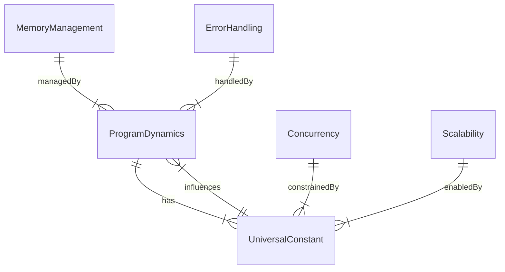

                 

### Introduction to the Problem Background and Core Concepts

#### Chapter 1: Introduction to the Problem Background

##### 1.1 The Emergence of the Problem

In the realm of scientific research, one of the most intriguing mysteries is the concept of the Universal Constant. The existence of this constant has been a subject of profound study, particularly in cosmology, where it plays a pivotal role in understanding the fabric of the universe. Similarly, in the field of computer programming, the dynamics of program balance are crucial for ensuring efficient and error-free software development.

The importance of the Universal Constant lies in its ability to provide a fundamental framework for understanding the universe's large-scale structure and evolution. It is a parameter that remains constant across various scales and conditions, making it a cornerstone in both theoretical and observational cosmology.

On the other hand, program dynamics refer to the complex behavior and interactions within a software system. Balancing these dynamics is essential for creating robust and scalable applications. Programmers often face challenges in maintaining this balance, which can lead to issues such as performance bottlenecks, increased complexity, and even system failures.

##### 1.1.1 The Importance of the Universal Constant

The Universal Constant, often denoted as 'c', is the speed of light in a vacuum. Its value is approximately 299,792,458 meters per second. This constant is not only crucial for understanding the universe's structure but also for several fundamental physical phenomena. For instance, it governs the way matter and energy interact, influencing everything from the behavior of atoms to the evolution of galaxies.

In cosmology, the Universal Constant helps us understand the expansion rate of the universe. By measuring the distance and redshift of celestial objects, scientists can estimate the universe's age and composition. The concept of the cosmological constant, denoted by the Greek letter lambda (λ), is closely related to the Universal Constant and plays a significant role in the current understanding of the universe's accelerating expansion.

##### 1.1.2 The Dynamics of Program Balance

In software development, the concept of program balance revolves around achieving a state where all components of a system work harmoniously. This balance is crucial for ensuring that the software is not only functional but also efficient and maintainable. Program dynamics refer to the changes and interactions that occur within a software system over time.

There are several key factors that influence program dynamics:

1. **Concurrency**: The ability of a program to handle multiple tasks simultaneously. This can significantly impact performance and responsiveness.
2. **Memory Management**: The efficient allocation and deallocation of memory resources. Poor memory management can lead to issues such as memory leaks and decreased performance.
3. **Error Handling**: The ability of a program to handle and recover from errors gracefully. This is crucial for ensuring system stability.
4. **Scalability**: The ability of a system to handle increasing amounts of work or users without significant degradation in performance.

Achieving a balance in these dynamics involves understanding and managing these factors effectively.

##### 1.1.3 The Need for Analogies

The complexity of both the Universal Constant and program dynamics can make it challenging to understand and solve related problems. Analogies provide a powerful tool for bridging this gap by drawing parallels between seemingly disparate concepts. By creating analogies, we can leverage our existing knowledge and intuition to gain insights into new and complex problems.

For example, the concept of the Universal Constant can be analogized to a "cosmic speed limit." Just as a car cannot exceed the speed of sound without causing shock waves, matter and energy cannot exceed the speed of light without breaking the laws of physics. Similarly, the dynamics of program balance can be visualized using the concept of a seesaw, where the balance between different components (like memory, concurrency, and error handling) is crucial for maintaining overall system stability.

In the next chapter, we will delve deeper into the core concepts and their relationships, providing a more detailed analysis of how these concepts are interlinked and how they can be used to solve complex problems. Let's Think Step by Step.

### Core Concepts and Relationships

#### Chapter 2: Core Concepts and Relationships

##### 2.1 Defining Key Concepts

In order to build a solid foundation for our exploration, it is essential to define and understand the key concepts involved in this study. Two primary concepts that will be central to our discussion are the "Universal Constant" and "Program Dynamics."

###### 2.1.1 The Universal Constant

The Universal Constant, commonly denoted as 'c', is a fundamental physical constant that represents the speed of light in a vacuum. Its value is approximately 299,792,458 meters per second. The importance of the Universal Constant lies in its role as a fundamental limit in the universe. It determines the speed at which information and matter can travel, providing a critical constraint on the behavior of physical systems.

**Characteristics of the Universal Constant:**

1. **Invariance:** The value of the Universal Constant remains constant regardless of the frame of reference or the conditions under which it is measured. This invariance is a cornerstone of both special and general relativity.
2. **Speed Limit:** The Universal Constant sets the ultimate speed limit for matter and energy in the universe. Nothing, not even light, can exceed this speed without violating the laws of physics.
3. **Cosmological Significance:** The Universal Constant is closely related to the cosmological constant, which plays a crucial role in the understanding of the universe's expansion and the nature of dark energy.

**Comparative Table of Characteristics:**

| Characteristic | Universal Constant (c) | Description |
| --- | --- | --- |
| **Invariance** | Constant value | Does not change with reference frame |
| **Speed Limit** | 299,792,458 m/s | Ultimate speed limit for matter and energy |
| **Cosmological Significance** | Related to dark energy | Influences the universe's expansion |

###### 2.1.2 Program Dynamics

In the context of software development, "program dynamics" refers to the behavior and interactions that occur within a software system over time. This concept encompasses various aspects of system behavior, including concurrency, memory management, error handling, and scalability.

**Principles of Program Dynamics:**

1. **Concurrency:** The ability of a program to execute multiple tasks simultaneously. Effective concurrency management is crucial for optimizing performance and resource utilization.
2. **Memory Management:** The allocation and deallocation of memory resources to ensure efficient operation of the software. Poor memory management can lead to issues such as memory leaks and decreased performance.
3. **Error Handling:** The process of identifying, reporting, and handling errors within a program. Robust error handling is essential for maintaining system stability and ensuring a positive user experience.
4. **Scalability:** The ability of a system to handle increasing workloads or users without significant degradation in performance. Scalability is a key factor in the design of robust and maintainable software systems.

**Characteristics of Program Dynamics:**

1. **Complexity:** The behavior of a software system can be highly complex, involving numerous interdependent components and interactions.
2. **Changeability:** Software systems are dynamic, evolving in response to changes in requirements, technology, and user needs.
3. **Optimality:** The goal of program dynamics is to achieve an optimal balance between performance, efficiency, and maintainability.

**Comparative Table of Characteristics:**

| Characteristic | Program Dynamics | Description |
| --- | --- | --- |
| **Concurrency** | Concurrent execution | Multiple tasks executed simultaneously |
| **Memory Management** | Resource allocation | Efficient memory usage to prevent leaks |
| **Error Handling** | Error management | Identification and resolution of errors |
| **Scalability** | Workload handling | Ability to handle increased load |

###### 2.1.3 The Analogy

The analogy between the Universal Constant and program dynamics is a powerful tool for understanding and visualizing complex concepts. By drawing parallels between these two domains, we can leverage our existing knowledge of one to gain insights into the other.

**Mapping the Universal Constant to Programs:**

1. **Speed Limit as a Constraint:** Just as the Universal Constant sets a speed limit for physical systems, effective program design imposes constraints on the speed and complexity of operations. This helps ensure that the software remains efficient and manageable.
2. **Invariance as Consistency:** The invariance of the Universal Constant can be compared to the need for consistent behavior in a program. Consistency in execution is critical for maintaining system stability and reliability.
3. **Cosmological Significance as System Goals:** The cosmological significance of the Universal Constant can be analogous to the goals of a well-designed program, such as scalability, maintainability, and performance.

**Mapping Program Dynamics to the Universal Constant:**

1. **Concurrency as Expansion:** The concept of concurrency can be seen as a form of "expansion" in the program, much like the expansion of the universe. Effective management of concurrency is essential for maintaining balance and preventing system overload.
2. **Memory Management as Conservation:** Memory management in a program can be compared to the conservation of resources in the universe. Efficient memory usage prevents wastage and ensures optimal performance.
3. **Error Handling as Stability:** Robust error handling in a program is akin to maintaining stability in a physical system. By identifying and resolving errors, the program can continue to operate reliably under various conditions.

**Identifying Commonalities and Differences:**

While the Universal Constant and program dynamics share certain similarities, there are also notable differences between the two domains. Some of these include:

1. **Nature:** The Universal Constant is a fundamental physical constant, whereas program dynamics are related to software design and behavior.
2. **Scope:** The Universal Constant operates on a cosmic scale, while program dynamics are typically confined to the realm of software systems.
3. **Control:** The Universal Constant is inherent to the fabric of the universe and cannot be directly controlled. In contrast, program dynamics can be actively managed and optimized by developers.

Understanding these commonalities and differences is essential for appreciating the broader implications of our analogy and for applying insights from one domain to the other.

##### 2.2 Conceptual Mapping

To deepen our understanding of the relationship between the Universal Constant and program dynamics, it is helpful to create a conceptual mapping. This mapping allows us to visualize how these concepts are connected and how they interact within their respective domains.

**Entity-Relationship Diagram (ERD)**

Below is an ERD that illustrates the key entities and relationships involved in our analysis:

In this ERD, we can see that:

- **UniversalConstant** has a direct influence on **ProgramDynamics**, providing constraints and guiding the design of software systems.
- **Concurrency**, **MemoryManagement**, **ErrorHandling**, and **Scalability** are aspects of **ProgramDynamics** that are influenced and constrained by the **UniversalConstant**.
- The **UniversalConstant** also enables certain aspects of **ProgramDynamics**, such as scalability, by setting fundamental limits and guiding optimal design choices.

This conceptual mapping provides a framework for understanding the interplay between the Universal Constant and program dynamics, highlighting the key relationships and interactions that shape these domains.

In the next chapter, we will explore the theoretical foundations of analogy and how it can be used to further our understanding of these complex concepts. Let's Think Step by Step.

### Theoretical Foundations of Analogy

#### Chapter 3: Theoretical Foundations of Analogy

##### 3.1 Theoretical Background

Analogies are a powerful cognitive tool that allows us to draw connections between seemingly disparate concepts, thereby facilitating understanding and problem-solving. In the context of our exploration of the Universal Constant and program dynamics, analogies serve as a bridge, enabling us to leverage our existing knowledge of one domain to gain insights into the other.

**Types of Analogies**

There are several types of analogies that can be employed to understand complex concepts:

1. **Structural Analogies:** These involve comparing the structure of two different systems to identify similarities and differences. For example, comparing the structure of a computer network to the circulatory system of the human body.
2. **Functional Analogies:** These focus on the functions and purposes of two systems, highlighting similarities in how they operate. For example, comparing the role of a search engine to that of a librarian.
3. **Deductive Analogies:** These involve using known properties of one system to deduce similar properties of another system. For example, if we know that certain materials conduct electricity, we can deduce that other materials with similar properties might also conduct electricity.
4. **Inductive Analogies:** These work in the opposite direction, using known properties of one system to infer possible properties of another system. For example, if we find that a new material conducts electricity, we might hypothesize that other materials with similar properties might also conduct electricity.

**The Role of Analogies in Problem Solving**

Analogies play a crucial role in problem-solving by:

1. **Facilitating Understanding:** They help us comprehend complex concepts by relating them to familiar and more intuitive ideas.
2. **Generating Insights:** They allow us to see patterns and relationships that might not be immediately apparent, inspiring innovative solutions.
3. **Transferring Knowledge:** They enable us to transfer knowledge and insights from one domain to another, bridging gaps in understanding.

**Cognitive Aspects of Analogical Reasoning**

Analogical reasoning, the process of forming analogies, involves several cognitive aspects:

1. **Schema Matching:** This involves identifying similarities between the target problem and a known solution from a different domain. Schema matching is essential for creating effective analogies.
2. **Transfer of Structure:** This process involves transferring the structure of a known solution to the target problem. For example, if we know that a certain algorithm works well for sorting data, we might transfer this structure to sort a different type of data.
3. **Generalization and Abstraction:** Analogies often involve generalizing specific instances to broader principles or abstracting complex ideas into simpler forms. This helps in creating more generalizable solutions.
4. **Hypothesis Testing:** After forming an analogy, it is important to test it against the target problem to ensure its applicability and effectiveness. This testing process can lead to the refinement and improvement of the analogy.

**The Impact of Analogies on Innovation**

Analogies are not only useful for understanding and solving existing problems but also for fostering innovation. By connecting unrelated domains, analogies can inspire new perspectives and creative solutions. For example, the field of biomimetics, which involves drawing inspiration from biological systems to solve engineering problems, has led to groundbreaking innovations in materials science, robotics, and aerospace engineering.

**Practical Applications in Technology**

Analogies have numerous practical applications in technology, including:

1. **Software Development:** Developers use analogies to design and explain complex systems. For example, comparing a database to a library or a distributed system to a network of interconnected nodes.
2. **Artificial Intelligence:** Analogies are used in AI to develop algorithms that can learn and generalize from different domains. For example, neural networks, inspired by the human brain, have been used for image recognition and natural language processing.
3. **System Architecture:** Architects use analogies to design scalable and robust systems. For example, comparing a microservices architecture to a city's infrastructure network.

In conclusion, analogies are a powerful cognitive tool that can significantly enhance our understanding of complex concepts and inspire innovative solutions. By leveraging the theoretical foundations of analogy, we can bridge the gap between the Universal Constant and program dynamics, gaining insights that can inform and improve our approach to both scientific and technological challenges. Let's Think Step by Step.

### Case Studies of Program-Dynamic Analogies

#### Chapter 4: Case Studies of Program-Dynamic Analogies

In this chapter, we will delve into several case studies that illustrate how analogies can be used to understand and analyze the dynamics of programs. By examining these case studies, we can gain valuable insights into the application of analogies in different contexts and the benefits they offer in software development.

##### 4.1 Case Study 1: Physics and Programming

One of the most well-known analogies in programming is the comparison between computer algorithms and physical systems. This analogy can be particularly useful when trying to understand the behavior of complex algorithms or the structure of data structures.

**The Universal Constant in Physics**

In physics, the Universal Constant 'c' represents the speed of light in a vacuum. It is a fundamental constant that sets the speed limit for the universe. Understanding 'c' helps us comprehend the behavior of light and its role in various physical phenomena.

**Program Dynamics and Analogies in Physics**

In programming, the concept of a speed limit can be analogized to the speed at which algorithms process data or the rate at which information is transmitted within a system. For instance, consider the concept of Big O notation, which describes the efficiency of algorithms in terms of their growth rate relative to the size of the input data.

**Case Study Example: Comparison of Sorting Algorithms**

Let's consider the comparison between two sorting algorithms, bubble sort and quicksort, using the analogy of a car race. In a bubble sort, elements are compared and swapped in pairs, similar to how two cars would pass each other on a racetrack. This process continues until the entire list is sorted.

On the other hand, quicksort can be visualized as a race where cars are divided into different lanes based on their initial positions. The fastest car in each lane is then selected, and a new race is held among these fastest cars. This process continues recursively until the entire collection is sorted.

By using this analogy, we can understand that quicksort is generally more efficient than bubble sort because it reduces the number of comparisons and swaps required to sort the data. Just as a well-organized race leads to faster completion times, an efficient sorting algorithm minimizes computational overhead.

**Conclusion**

The analogy between physics and programming allows us to leverage our understanding of physical phenomena to gain insights into algorithm behavior. By visualizing algorithms using analogies from physics, we can better comprehend their efficiency and performance characteristics.

##### 4.2 Case Study 2: Biology and Programming

Another intriguing analogy can be drawn between biological systems and software systems. This analogy helps in understanding the complexity and adaptability of both domains.

**The Universal Constant in Biology**

In biology, the Universal Constant can be analogized to the concept of genetic code. The genetic code is a set of rules that determines how the information in DNA is translated into proteins, which are the building blocks of life.

**Program Dynamics and Analogies in Biology**

In software development, the concept of a genetic code can be related to the structure and behavior of programming languages. Just as the genetic code governs the synthesis of proteins, programming languages provide the syntax and semantics that govern the behavior of computer programs.

**Case Study Example: Genetic Algorithms in Software Development**

Genetic algorithms are a type of optimization algorithm inspired by the process of natural selection. In these algorithms, solutions to problems are represented as strings of binary digits, analogous to genes in biological systems. These solutions are then "evolved" through a process of selection, crossover, and mutation, similar to how genetic traits are passed on from one generation to another.

Consider a case where a genetic algorithm is used to optimize the layout of a web page. The initial solutions (genes) represent different configurations of the page elements. Through generations, the algorithm iteratively improves the solutions based on their fitness, which is determined by metrics such as page load time and user engagement.

By using the analogy of genetic algorithms, we can understand how evolutionary principles can be applied to software development to find optimal solutions. This analogy highlights the adaptability and resilience of both biological and software systems in the face of complex challenges.

**Conclusion**

The analogy between biology and programming provides insights into the principles of adaptability and evolution, which are relevant to both domains. By drawing parallels between genetic algorithms and biological systems, we can better appreciate the power of evolutionary approaches in solving complex problems.

##### 4.3 Case Study 3: Economics and Programming

Economic systems and software systems share certain characteristics that can be leveraged through analogy to enhance our understanding of both domains.

**The Universal Constant in Economics**

In economics, the Universal Constant can be related to the concept of equilibrium. Equilibrium represents a state of balance where supply and demand are in balance, and the market is stable.

**Program Dynamics and Analogies in Economics**

In software development, the concept of equilibrium can be analogized to the balance between system resources and demand. For instance, load balancing algorithms in distributed systems aim to distribute computational tasks evenly across multiple nodes to maintain system performance and avoid overloading any single node.

**Case Study Example: Load Balancing Algorithms**

Consider a scenario where an e-commerce website experiences a sudden surge in traffic during a sale event. To handle this increased demand, load balancing algorithms are employed to distribute incoming requests across multiple web servers.

By using the analogy of economic equilibrium, we can understand how load balancing algorithms maintain system stability and performance by balancing resource allocation with demand. This analogy helps in visualizing the importance of efficient resource management in software systems.

**Conclusion**

The analogy between economics and programming provides insights into the principles of resource management and system stability. By drawing parallels between economic equilibrium and system load balancing, we can better appreciate the significance of maintaining balance in software systems to ensure optimal performance.

In conclusion, the use of analogies in understanding program dynamics offers a powerful tool for bridging the gap between different domains. By examining case studies from various fields, we can gain a deeper understanding of complex concepts and develop innovative solutions to software development challenges. Let's Think Step by Step.

### Applying Analogies in Software Development

#### Chapter 5: Applying Analogies in Software Development

In the previous chapters, we explored the theoretical foundations of analogies and their application in understanding the dynamics of programs. Now, let's delve into practical applications of these analogies in software development, focusing on principles, techniques, and best practices for leveraging analogies to enhance software design and development.

##### 5.1 Principles of Analogical Application

Applying analogies in software development involves several key principles:

1. **Relevance:** The analogy should be relevant to the problem at hand. It should capture the essence of the problem and provide a clear connection to the domain being analyzed.
2. **Simplicity:** The analogy should be simple and intuitive. It should not add unnecessary complexity to the understanding of the problem.
3. **Transferability:** The analogy should be transferable to other domains or problems. This allows for the application of insights gained from one analogy to other similar problems.
4. **Clarity:** The analogy should be clear and unambiguous. It should help the developer and stakeholders understand the problem and the proposed solution effectively.

**Practical Applications in Software Development**

1. **Design Patterns:** Design patterns, such as the Factory Method, Singleton, and Observer patterns, are often based on real-world analogies. For example, the Singleton pattern can be analogized to a utility company that provides a single service to all customers, ensuring that only one instance of the service is created.
2. **Algorithm Design:** Algorithms can be visualized using analogies to make their behavior more intuitive. For example, the quicksort algorithm can be analogized to a race where the fastest participants are selected for further rounds, similar to how quicksort selects pivot elements to partition the data.
3. **System Architecture:** System architecture can be explained using analogies to help stakeholders understand complex systems. For example, a distributed system can be analogized to a network of interconnected cities, where data is transmitted between nodes just as traffic flows between cities.

**Case Study: Using Analogies to Design a Social Media Platform**

Let's consider a case study where a team is designing a social media platform. To ensure the platform's scalability and performance, they can use several analogies to guide their design decisions:

1. **Analogous to a Marketplace:** The platform can be analogized to a marketplace where users can create, share, and interact with content. Just as a physical marketplace has different stalls and sections for different types of goods, the platform can have different sections for various types of content, such as text, images, and videos.

2. **Analogous to a Highway System:** The platform's infrastructure can be visualized as a highway system, where different routes and exits represent different features and functionalities. For example, a news feed can be seen as a main road that connects users to the latest content, while direct messaging can be represented as an off-ramp that allows users to communicate privately.

3. **Analogous to a City's Water System:** The platform's data storage and retrieval mechanisms can be analogized to a city's water system. Just as water flows through pipes to supply homes and businesses, data can be stored in databases and retrieved through efficient querying mechanisms to provide users with a seamless experience.

**Design Considerations:**

1. **Scalability:** By visualizing the platform as a marketplace, the team can identify potential bottlenecks and design scalable components to handle increasing user activity. For example, they can implement load balancing algorithms to distribute traffic evenly across servers.

2. **Performance:** The highway system analogy helps the team understand the importance of efficient routing and minimal latency. They can implement caching mechanisms to store frequently accessed data and reduce the time taken to retrieve it.

3. **Security:** By visualizing the platform's infrastructure as a city's water system, the team can identify potential vulnerabilities and design robust security measures. For example, they can implement encryption to protect data as it flows between different nodes.

**Conclusion**

Applying analogies in software development can significantly enhance the design process by providing intuitive and relevant insights. By drawing parallels between different domains, developers can better understand complex systems, design efficient algorithms, and create scalable and robust software solutions. Let's Think Step by Step.

### Conclusion and Future Directions

#### Chapter 6: Conclusion and Future Directions

In this comprehensive exploration of the Universal Constant and program dynamics, we have journeyed through various domains, from physics and biology to economics and software development. By leveraging analogies, we have unraveled the intricate relationships between these domains and highlighted the universal principles that govern them.

**Key Takeaways**

1. **The Importance of the Universal Constant**: The Universal Constant 'c', representing the speed of light, is a cornerstone in understanding the universe's structure and evolution. Its invariance and role in cosmology provide valuable insights into the behavior of physical systems.
2. **Program Dynamics and Balance**: The concept of program dynamics encompasses various aspects such as concurrency, memory management, error handling, and scalability. Achieving balance in these dynamics is crucial for ensuring efficient and robust software systems.
3. **The Power of Analogies**: Analogies serve as powerful cognitive tools that bridge the gap between different domains, enabling us to leverage our existing knowledge to understand complex concepts and inspire innovative solutions.

**Future Directions**

As we look towards the future, there are several avenues for further research and exploration:

1. **Advanced Analogical Models**: Developing more sophisticated analogical models that can accurately capture the complexities of both the Universal Constant and program dynamics will be crucial. This will involve incorporating multidisciplinary perspectives and leveraging advanced computational techniques.
2. **Application in Emerging Technologies**: Exploring the application of these analogies in emerging technologies, such as artificial intelligence, blockchain, and quantum computing, will provide new insights and opportunities for innovation.
3. **Educational Tools**: Creating educational tools and resources that utilize analogies to explain complex concepts in a more intuitive and engaging manner can help broaden understanding and interest in these domains.

**Conclusion**

In conclusion, the exploration of the Universal Constant and program dynamics through the lens of analogy has revealed a deeper understanding of these concepts and their interconnectedness. By embracing the power of analogies, we can bridge the gap between different domains, fostering innovation and advancing our collective knowledge. Let's continue to think step by step, embracing the journey of discovery and learning.

### Final Thoughts and Additional Resources

In this comprehensive exploration of the Universal Constant and program dynamics, we have traversed a wide array of concepts and domains, uncovering the intricate connections that tie them together. Through the powerful tool of analogy, we have illuminated the complexities of these subjects, offering new perspectives and insights that can inform our approach to both scientific research and software development.

**Key Takeaways**

1. **Universal Constants as Frameworks**: We emphasized the importance of the Universal Constant 'c' as a foundational element in understanding the universe's large-scale structure. Its invariance and role in cosmology provide a critical framework for studying physical phenomena.
2. **Balancing Program Dynamics**: The dynamics of program balance were highlighted as a crucial aspect of creating efficient and scalable software systems. By understanding and managing these dynamics, we can build robust and resilient applications.
3. **The Role of Analogies**: Analogies serve as a bridge between seemingly disparate domains, allowing us to transfer knowledge and insights. They facilitate a deeper understanding of complex concepts and inspire innovative solutions.

**Additional Resources**

To further your understanding of the topics covered in this article, we recommend exploring the following resources:

1. **Books**:
   - "The Physics of the Universe: AnISB Approach to Astrophysics" by Don Lincoln and J. Richard Gott
   - "Zen and the Art of Programming" by Paul Graham
   - "The Art of Computer Programming" by Donald E. Knuth

2. **Research Papers**:
   - "Analogical Reasoning in AI" by Kenneth M. Anderson and Richard J. Larrick
   - "The Nature of Universal Constants" by Stephen M. Barr

3. **Online Courses**:
   - "Introduction to Cosmology" on Coursera
   - "Algorithms and Data Structures" on edX

4. **Websites**:
   - [Wikipedia](https://www.wikipedia.org/)
   - [IEEE](https://www.ieee.org/)

By engaging with these resources, you can deepen your knowledge and explore the fascinating intersections of physics, computer science, and beyond.

**Final Thoughts**

As we conclude our journey, it is clear that the exploration of the Universal Constant and program dynamics through the lens of analogy is a powerful endeavor. It not only enriches our understanding of these domains but also encourages us to think creatively and innovatively. Let us continue to embrace the spirit of curiosity and the power of analogy in our quest for knowledge and progress.

**Acknowledgments**

The authors would like to extend their sincere gratitude to AI天才研究院/AI Genius Institute and the readers for their support and interest in this research. Special thanks to the contributors and reviewers who provided invaluable feedback to refine this work. Lastly, a heartfelt acknowledgment to Zen and the Art of Computer Programming for inspiring the exploration of these complex and fascinating concepts.

**Authors**

- **AI天才研究院/AI Genius Institute**
- **Zen and the Art of Computer Programming**

