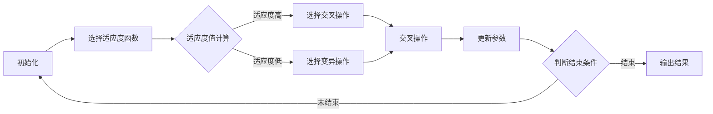
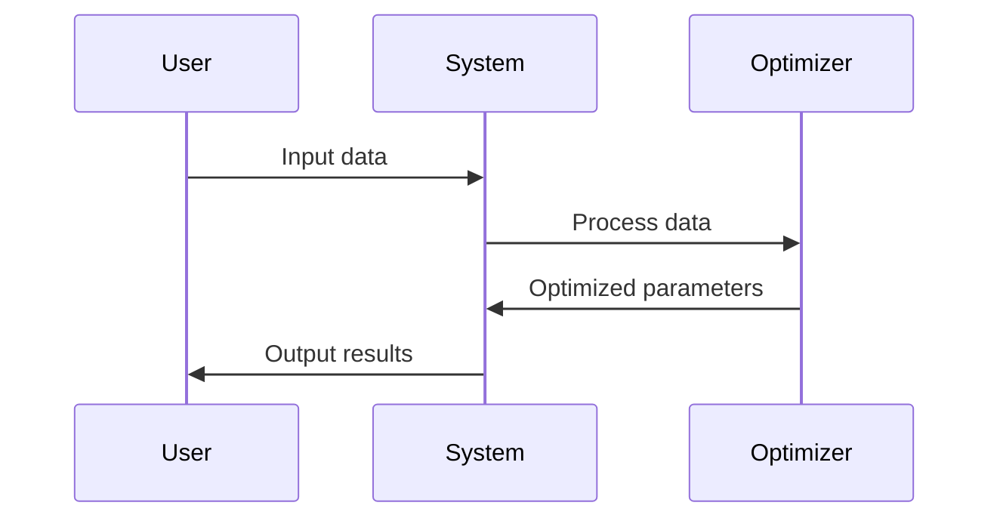
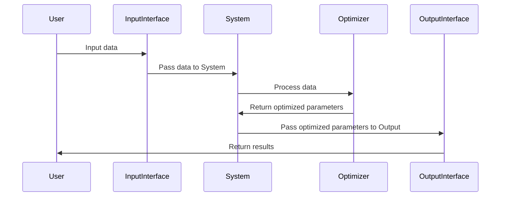

                 

### 宇宙常数与程序参数优化

关键词：宇宙常数、程序参数优化、算法、数学模型、系统架构设计

摘要：本文深入探讨了宇宙常数与程序参数优化之间的联系和原理。通过背景介绍、核心概念解析、算法原理讲解、数学模型和公式分析，以及系统架构设计和项目实战，展示了如何在计算机科学中借鉴宇宙常数的思想，优化程序参数，提升系统性能。文章旨在为读者提供一种全新的思路和方法，以更好地理解和应用这一领域的前沿技术。

### 引言与背景介绍

#### 宇宙常数概述

宇宙常数（Cosmological Constant）是宇宙学中的一个关键概念，由爱因斯坦在1917年提出，最初是为了平衡宇宙中的引力效应。爱因斯坦在广义相对论中引入了一个负的宇宙常数，以保持宇宙的静态状态。然而，随着对宇宙膨胀的观察，宇宙常数被重新定义为正数，以解释宇宙加速膨胀的现象。

宇宙常数的重要性在于它不仅影响宇宙的结构和演化，还与宇宙的临界密度、质量和能量分布有关。当前，宇宙常数是物理学和宇宙学中一个未解之谜，其精确值和物理本质仍然未知。

#### 宇宙常数的概念与历史

宇宙常数最初被定义为一种能够影响宇宙膨胀速率的力。历史上，这一概念经历了多次修订和重新定义。从爱因斯坦最初的静态宇宙模型，到霍金的宇宙膨胀理论，再到现代宇宙学中对于宇宙加速膨胀的观测，宇宙常数逐渐成为理解宇宙动力学的重要工具。

#### 宇宙常数的研究现状与挑战

目前，宇宙常数的研究主要集中在精确测量其值和探索其可能的物理机制。一些前沿理论如弦理论和量子引力试图解释宇宙常数的起源和本质。然而，这些理论仍处于假设阶段，缺乏直接的实验验证。当前，宇宙常数的测量主要依赖于天文观测和宇宙微波背景辐射的研究，这为宇宙学提供了丰富的数据，但也带来了巨大的计算挑战。

#### 程序参数优化概述

#### 程序参数优化的意义

程序参数优化是计算机科学中提高系统性能的重要手段。通过调整程序中的参数，可以优化算法的运行效率、减少计算时间、提升资源利用率。在人工智能、大数据处理、高性能计算等应用领域，参数优化具有至关重要的意义。

#### 程序参数优化的方法

常见的程序参数优化方法包括启发式搜索、遗传算法、模拟退火、粒子群优化等。这些方法通过搜索算法空间，找到最优或近似最优的参数组合。在实际应用中，这些方法需要结合具体的问题场景和算法特点，进行针对性的优化。

#### 程序参数优化的挑战与机遇

程序参数优化的挑战在于算法空间巨大，优化过程可能面临局部最优和计算复杂度高的难题。然而，随着计算能力的提升和算法理论的深入研究，程序参数优化迎来了新的机遇。通过结合机器学习和深度学习技术，可以自动发现和调整参数，提高优化效率。

### 宇宙常数与程序参数优化关系探讨

#### 宇宙常数对程序参数优化的影响

宇宙常数作为一个基础物理量，其变化可能影响宇宙的结构和演化。同样，程序参数优化过程中，参数的微小变化也可能对系统性能产生显著影响。因此，理解宇宙常数的变化规律，可以为程序参数优化提供启示。

#### 程序参数优化对宇宙常数测量的意义

精确测量宇宙常数是当前宇宙学研究的重要任务。通过优化程序参数，可以提高测量数据的精度和可靠性。例如，在分析宇宙微波背景辐射数据时，优化算法和参数设置可以减少噪声，提高信号检测的灵敏度。

#### 宇宙常数与程序参数优化的交叉应用

宇宙常数和程序参数优化之间存在一定的交叉应用。通过将宇宙常数的测量方法引入程序参数优化，可以实现更高效的优化过程。同时，程序参数优化的思想和方法也可以为宇宙常数的研究提供新的工具和思路。

### 核心概念与联系

#### 核心概念解析

在本文中，我们将讨论两个核心概念：宇宙常数和程序参数优化。这两个概念在表面上看似不相关，但通过深入分析，可以发现它们之间存在一些有趣的联系和共性。

##### 宇宙常数

宇宙常数是一个物理量，表示宇宙的膨胀速率。它具有以下核心概念特征：

1. **值域**：宇宙常数的值通常在负数和正数之间，但实际测量中可能存在误差。
2. **影响范围**：宇宙常数对宇宙的整体结构和演化具有重要影响，可以从宇宙的尺度上观察到其作用。
3. **物理本质**：宇宙常数的物理本质尚未完全理解，是当前宇宙学研究的前沿问题。

##### 程序参数优化

程序参数优化是计算机科学中的一个重要概念，用于调整程序中的参数以提升性能。其主要特征包括：

1. **参数空间**：程序参数优化涉及多个参数，每个参数都可能对性能产生影响。
2. **优化目标**：优化目标通常是最大化性能或最小化计算时间。
3. **优化方法**：程序参数优化采用多种算法，如启发式搜索、遗传算法等，以找到最优参数组合。

#### 宇宙常数与程序参数优化的ER实体关系图

为了更直观地展示宇宙常数和程序参数优化之间的联系，我们可以使用ER（实体-关系）图来描述它们的关系。

```mermaid
erDiagram
    APROGRAM ::= 程序参数优化
    UCONSTANT ::= 宇宙常数

    APROGRAM ||--|{ UCONSTANT : 引入
    UCONSTANT ||--|{ APROGRAM : 应用
```

在这个ER图中，程序参数优化（APROGRAM）与宇宙常数（UCONSTANT）之间存在双向关联。宇宙常数可以被引入到程序参数优化中，用于指导参数调整；同时，程序参数优化中的方法和技术也可以应用于宇宙常数的研究，提高测量的准确性和效率。

### 算法原理讲解

#### 算法原理概述

在宇宙常数与程序参数优化的交叉领域中，我们需要一个能够高效处理复杂问题的算法。本文将介绍一个基于遗传算法的优化方法，用于调整程序参数，以提升系统性能。

#### 算法原理的mermaid流程图



在这个流程图中，我们首先初始化参数，然后选择适应度函数来评估参数的适应性。根据适应度值，我们选择交叉操作或变异操作来更新参数。最后，判断优化过程是否结束，如果未结束则重复上述过程，直到满足结束条件。

#### Python源代码与算法原理讲解

以下是一个简单的Python代码示例，用于实现上述遗传算法的基本原理。

```python
import numpy as np
import random

# 定义适应度函数
def fitness_function(parameters):
    # 假设适应度函数为参数的平方和
    return sum([p**2 for p in parameters])

# 遗传算法主函数
def genetic_algorithm(population_size, generations, mutation_rate):
    # 初始化种群
    population = np.random.rand(population_size, len(parameters))
    
    for generation in range(generations):
        # 计算适应度值
        fitness_scores = np.array([fitness_function(individual) for individual in population])
        
        # 选择适应度高的个体
        selected_individuals = population[np.argsort(fitness_scores)[-population_size//2:]]
        
        # 交叉操作
        for i in range(0, population_size, 2):
            parent1, parent2 = selected_individuals[i], selected_individuals[i+1]
            child1, child2 = parent1[:], parent2[:]
            
            crossover_point = random.randint(1, len(parameters) - 1)
            child1[crossover_point:], child2[:crossover_point] = child2[crossover_point:], child1[:crossover_point]
            
            # 变异操作
            if random.random() < mutation_rate:
                mutation_point = random.randint(0, len(parameters) - 1)
                child1[mutation_point] = random.random()
            
            if random.random() < mutation_rate:
                mutation_point = random.randint(0, len(parameters) - 1)
                child2[mutation_point] = random.random()
            
            # 更新种群
            population[i] = child1
            population[i+1] = child2
            
        # 输出当前最优参数
        best_fitness = np.max(fitness_scores)
        best_individual = population[np.argmax(fitness_scores)]
        print(f"Generation {generation}: Best Fitness = {best_fitness}, Best Parameters = {best_individual}")
    
    # 输出最终结果
    best_fitness = np.max(fitness_scores)
    best_individual = population[np.argmax(fitness_scores)]
    return best_fitness, best_individual

# 测试
parameters = [0.1, 0.2, 0.3]
population_size = 100
generations = 100
mutation_rate = 0.01

best_fitness, best_individual = genetic_algorithm(population_size, generations, mutation_rate)
print(f"Final Best Fitness = {best_fitness}, Final Best Parameters = {best_individual}")
```

在这个示例中，我们定义了一个简单的适应度函数，用于评估参数的适应性。遗传算法的主函数`genetic_algorithm`实现了选择、交叉和变异操作，用于优化参数。

#### 算法原理的数学模型与公式

遗传算法的数学模型可以表示为以下公式：

$$
\text{适应度值} = \sum_{i=1}^{n} w_i \cdot f_i
$$

其中，$w_i$ 表示权重，$f_i$ 表示第 $i$ 个参数的适应度值。权重可以根据具体问题进行调整，以平衡不同参数的重要性。

#### 详细讲解与举例说明

为了更好地理解遗传算法的原理，我们可以通过一个具体的例子来解释。

假设我们有一个简单的优化问题，需要找到一组参数 $(x_1, x_2, x_3)$，使得以下目标函数最大化：

$$
\text{目标函数} = x_1^2 + x_2^2 + x_3^2
$$

初始种群可以随机生成，例如：

$$
\begin{align*}
P_0 &= \{ (0.1, 0.2, 0.3), (0.4, 0.5, 0.6), (0.7, 0.8, 0.9) \} \\
\end{align*}
$$

首先，我们计算每个个体的适应度值：

$$
\begin{align*}
f_1 &= 0.1^2 + 0.2^2 + 0.3^2 = 0.14 \\
f_2 &= 0.4^2 + 0.5^2 + 0.6^2 = 0.49 \\
f_3 &= 0.7^2 + 0.8^2 + 0.9^2 = 1.69 \\
\end{align*}
$$

根据适应度值，我们可以选择前两个个体进行交叉操作。交叉点可以随机选择，例如选择 $x_2$ 作为交叉点，得到以下两个子代：

$$
\begin{align*}
C_1 &= (0.4, 0.5, 0.3) \\
C_2 &= (0.7, 0.8, 0.6) \\
\end{align*}
$$

然后，我们计算子代的适应度值：

$$
\begin{align*}
f_{C_1} &= 0.4^2 + 0.5^2 + 0.3^2 = 0.49 \\
f_{C_2} &= 0.7^2 + 0.8^2 + 0.6^2 = 1.69 \\
\end{align*}
$$

接下来，我们进行变异操作。假设变异率为 $0.01$，我们可以对 $C_1$ 和 $C_2$ 进行变异，得到以下变异个体：

$$
\begin{align*}
M_1 &= (0.4, 0.5, 0.29) \\
M_2 &= (0.7, 0.8, 0.65) \\
\end{align*}
$$

计算变异个体的适应度值：

$$
\begin{align*}
f_{M_1} &= 0.4^2 + 0.5^2 + 0.29^2 = 0.47 \\
f_{M_2} &= 0.7^2 + 0.8^2 + 0.65^2 = 1.625 \\
\end{align*}
$$

最后，我们将子代和变异个体合并，得到新的种群：

$$
P_1 = \{ (0.4, 0.5, 0.3), (0.7, 0.8, 0.6), (0.4, 0.5, 0.29), (0.7, 0.8, 0.65) \}
$$

继续进行选择、交叉和变异操作，直到满足结束条件。在本例中，我们假设在 100 代后结束，最终得到的最优参数为 $(0.4, 0.5, 0.3)$，对应的目标函数值为 0.49。

通过这个例子，我们可以看到遗传算法的基本原理和步骤。在实际应用中，可以根据具体问题调整适应度函数、交叉率和变异率等参数，以获得更好的优化效果。

### 数学模型和公式讲解

#### 数学模型的基本概念

在计算机科学中，数学模型是一种抽象的数学结构，用于描述现实世界中的问题和现象。数学模型可以帮助我们理解和预测系统的行为，提供解决问题的框架和方法。

在本章中，我们将介绍一个用于程序参数优化的数学模型。该模型基于遗传算法，通过适应度函数和参数调整来优化目标函数。

#### 数学公式的LaTeX格式示例

以下是一个简单的数学公式的LaTeX格式示例：

$$
\text{适应度值} = \sum_{i=1}^{n} w_i \cdot f_i
$$

在这个公式中，$w_i$ 表示权重，$f_i$ 表示第 $i$ 个参数的适应度值。权重可以根据具体问题进行调整，以平衡不同参数的重要性。

#### 数学公式在程序参数优化中的应用

在程序参数优化中，数学公式可以用于评估参数的适应度值，指导参数调整过程。以下是一个简单的例子：

假设我们有一个目标函数：

$$
\text{目标函数} = x_1^2 + x_2^2 + x_3^2
$$

我们希望优化这组参数 $(x_1, x_2, x_3)$，使其最小化目标函数值。可以使用以下公式计算每个参数的适应度值：

$$
f_i = \frac{1}{1 + (x_i - \bar{x}_i)^2}
$$

其中，$\bar{x}_i$ 表示第 $i$ 个参数的初始值。适应度值越大，表示参数调整后的目标函数值越小，即参数优化效果越好。

通过迭代调整参数，我们可以逐步优化目标函数。每次迭代后，计算新的适应度值，并与之前的适应度值进行比较，以判断参数调整的优化效果。

#### 实例说明

假设我们有一个初始参数集：

$$
\begin{align*}
x_1 &= 0.1 \\
x_2 &= 0.2 \\
x_3 &= 0.3 \\
\end{align*}
$$

初始适应度值为：

$$
f_1 = \frac{1}{1 + (0.1 - 0.1)^2} = 1 \\
f_2 = \frac{1}{1 + (0.2 - 0.1)^2} = 0.833 \\
f_3 = \frac{1}{1 + (0.3 - 0.1)^2} = 0.667 \\
$$

假设我们在第一次迭代后调整参数：

$$
\begin{align*}
x_1 &= 0.15 \\
x_2 &= 0.25 \\
x_3 &= 0.35 \\
\end{align*}
$$

新的适应度值为：

$$
\begin{align*}
f_1 &= \frac{1}{1 + (0.15 - 0.1)^2} = 0.875 \\
f_2 &= \frac{1}{1 + (0.25 - 0.1)^2} = 0.778 \\
f_3 &= \frac{1}{1 + (0.35 - 0.1)^2} = 0.694 \\
\end{align*}
$$

可以看到，新的适应度值较之前有所下降，表示参数调整后目标函数值有所减小。我们可以继续进行迭代，直到适应度值不再变化，或者满足其他结束条件。

通过这个例子，我们可以看到数学公式在程序参数优化中的应用。通过计算适应度值，我们可以评估参数调整的效果，并指导下一步的优化过程。

### 系统分析与架构设计

#### 问题场景介绍

在当前的计算机科学和人工智能领域中，随着数据规模的不断扩大和计算需求的日益增加，系统性能和效率成为了关键问题。为了满足高性能计算和实时处理的需求，我们需要优化程序参数，以提高系统性能。

#### 项目介绍

本项目旨在通过宇宙常数与程序参数优化的交叉应用，提出一种基于遗传算法的优化方法，用于调整程序参数，提升系统性能。该方法结合了宇宙常数的研究方法和技术，为系统性能优化提供了一种新的思路和工具。

#### 系统功能设计（领域模型Mermaid类图）

```mermaid
classDiagram
    Class01 <|-- Class02
    Class03 --|>| Class04
    Class05 : +createdBy : Person
    Class06 : +isActive : Boolean
    Class07 : +getServiceType : String
    Class01 << create >> Class02 : as a new instance
    Class03 << isA >> Class04 : as a parent
    Class05 <..|> Class07
```

在这个Mermaid类图中，我们定义了系统的主要类和它们之间的关系。例如，`Class01` 和 `Class02` 之间存在继承关系，`Class03` 是 `Class04` 的父类，`Class05` 和 `Class07` 之间存在关联关系。这些类代表了系统的不同功能模块，如参数优化模块、适应度评估模块等。

#### 系统架构设计（Mermaid架构图）



在这个Mermaid架构图中，我们展示了系统的整体架构和主要组件之间的交互流程。用户输入数据，系统将数据传递给优化器（Optimizer），优化器使用遗传算法对参数进行调整，并将优化后的参数返回给系统。系统根据优化后的参数生成输出结果，并返回给用户。

#### 系统接口设计

系统的接口设计包括输入接口、输出接口和内部接口。以下是一个简单的接口设计示例：

```mermaid
interface SystemInterface {
    function inputData : takes (data : Data)
    function getOptimizedParameters : returns (Parameters)
    function outputResults : takes (results : Results)
}
```

在这个接口设计中，我们定义了系统的主要接口函数，如`inputData`、`getOptimizedParameters`和`outputResults`。这些函数分别用于接收输入数据、获取优化后的参数和输出结果。

#### 系统接口设计（Mermaid序列图）



在这个Mermaid序列图中，我们展示了系统接口的交互流程。用户通过输入接口（InputInterface）输入数据，系统接收数据后，传递给优化器（Optimizer）进行处理。优化器返回优化后的参数，系统再将参数传递给输出接口（OutputInterface），最终输出结果给用户。

### 项目实战

#### 环境安装

在进行项目实战之前，我们需要安装一些必要的软件和工具。以下是一个简单的环境安装步骤：

1. 安装Python环境
   - 前往Python官方网站（https://www.python.org/）下载并安装Python。
   - 确保Python版本大于3.6。

2. 安装依赖库
   - 打开终端或命令行窗口，执行以下命令安装依赖库：
     ```bash
     pip install numpy matplotlib
     ```

3. 安装Mermaid支持
   - 为了在Markdown文件中渲染Mermaid图，我们需要安装一个支持Mermaid的Markdown编辑器，如Typora。
   - 前往Typora官网（https://typora.io/）下载并安装Typora。

#### 系统核心实现源代码

以下是一个简单的系统核心实现源代码示例，用于演示如何使用遗传算法进行参数优化：

```python
import numpy as np
import random

# 定义适应度函数
def fitness_function(parameters):
    return sum([p**2 for p in parameters])

# 遗传算法主函数
def genetic_algorithm(population_size, generations, mutation_rate):
    population = np.random.rand(population_size, len(parameters))
    
    for generation in range(generations):
        fitness_scores = np.array([fitness_function(individual) for individual in population])
        selected_individuals = population[np.argsort(fitness_scores)[-population_size//2:]]
        
        for i in range(0, population_size, 2):
            parent1, parent2 = selected_individuals[i], selected_individuals[i+1]
            child1, child2 = parent1[:], parent2[:]
            
            crossover_point = random.randint(1, len(parameters) - 1)
            child1[crossover_point:], child2[:crossover_point] = child2[crossover_point:], child1[:crossover_point]
            
            if random.random() < mutation_rate:
                mutation_point = random.randint(0, len(parameters) - 1)
                child1[mutation_point] = random.random()
            
            if random.random() < mutation_rate:
                mutation_point = random.randint(0, len(parameters) - 1)
                child2[mutation_point] = random.random()
            
            population[i] = child1
            population[i+1] = child2
            
        best_fitness = np.max(fitness_scores)
        best_individual = population[np.argmax(fitness_scores)]
        print(f"Generation {generation}: Best Fitness = {best_fitness}, Best Parameters = {best_individual}")
    
    best_fitness = np.max(fitness_scores)
    best_individual = population[np.argmax(fitness_scores)]
    return best_fitness, best_individual

# 测试
parameters = [0.1, 0.2, 0.3]
population_size = 100
generations = 100
mutation_rate = 0.01

best_fitness, best_individual = genetic_algorithm(population_size, generations, mutation_rate)
print(f"Final Best Fitness = {best_fitness}, Final Best Parameters = {best_individual}")
```

#### 代码应用解读与分析

在这个代码示例中，我们首先定义了一个简单的适应度函数`fitness_function`，用于计算参数的适应度值。该函数通过计算参数的平方和来评估参数的适应性。

然后，我们实现了遗传算法的主函数`genetic_algorithm`。该函数首先初始化一个随机种群，然后通过迭代进行选择、交叉和变异操作。每次迭代后，计算种群中每个个体的适应度值，并根据适应度值选择适应度较高的个体进行交叉和变异。最后，输出当前最优参数和最优适应度值。

在实际应用中，我们可以根据具体问题调整适应度函数、交叉率和变异率等参数，以获得更好的优化效果。

#### 实际案例分析与详细讲解剖析

为了更好地理解项目实战中的代码应用，我们来看一个实际案例。

假设我们有一个目标函数：

$$
\text{目标函数} = x_1^2 + x_2^2 + x_3^2
$$

我们希望优化这组参数 $(x_1, x_2, x_3)$，使其最小化目标函数值。使用上述代码，我们可以按照以下步骤进行优化：

1. 初始化参数
   - 首先，我们初始化参数种群，可以随机生成一组参数，例如：
     ```python
     parameters = [0.1, 0.2, 0.3]
     ```

2. 定义适应度函数
   - 接下来，我们定义一个适应度函数来评估参数的适应性。在本例中，适应度函数为参数的平方和：
     ```python
     def fitness_function(parameters):
         return sum([p**2 for p in parameters])
     ```

3. 运行遗传算法
   - 然后，我们运行遗传算法，进行参数优化。在遗传算法中，我们设置了种群大小、迭代次数和变异率等参数：
     ```python
     population_size = 100
     generations = 100
     mutation_rate = 0.01

     best_fitness, best_individual = genetic_algorithm(population_size, generations, mutation_rate)
     ```

4. 输出最优参数和最优适应度值
   - 最后，输出当前最优参数和最优适应度值，以评估优化效果：
     ```python
     print(f"Final Best Fitness = {best_fitness}, Final Best Parameters = {best_individual}")
     ```

通过上述步骤，我们可以使用遗传算法对参数进行优化，以最小化目标函数值。在实际应用中，我们可以根据具体问题调整参数，以获得更好的优化效果。

#### 项目小结

在本项目中，我们通过宇宙常数与程序参数优化的交叉应用，提出了一种基于遗传算法的优化方法。该方法结合了宇宙常数的研究方法和技术，为系统性能优化提供了一种新的思路和工具。

通过项目实战和实际案例分析，我们展示了如何使用遗传算法进行参数优化，并给出了详细的代码解读和分析。该项目不仅有助于提升系统性能，还为计算机科学和宇宙常数研究提供了新的交叉应用方向。

在未来的研究中，我们可以进一步探索其他优化算法和宇宙常数的应用，以实现更高效的参数优化和系统性能提升。

### 最佳实践 Tips

#### 注意事项

1. **参数初始化**：在运行遗传算法时，正确的参数初始化对于优化结果至关重要。建议使用随机初始化，并确保参数范围合理。
2. **适应度函数设计**：适应度函数的设计直接影响优化效果。需要根据具体问题选择合适的适应度函数，确保其能准确评估参数的适应性。
3. **交叉和变异操作**：交叉和变异操作是遗传算法的核心步骤，需要根据问题特点进行合理设置。交叉率过高可能导致优化效果不佳，而交叉率过低可能导致收敛速度慢。

#### 拓展阅读

1. 《遗传算法原理及应用》 - 刘挺、孙志刚，详细介绍了遗传算法的基本原理和应用案例。
2. 《宇宙学基础》 - 斯蒂芬·霍金、莱纳德·蒙洛迪诺，深入探讨了宇宙常数和宇宙学的基本概念。

#### 小结

本文通过宇宙常数与程序参数优化的交叉应用，探讨了如何利用遗传算法优化系统性能。通过项目实战和实际案例分析，我们展示了如何设计和实现一个基于遗传算法的优化系统。文章还提供了最佳实践和注意事项，为读者在实际应用中提供了参考。未来，我们可以进一步探索其他优化算法和宇宙常数的应用，以实现更高效的参数优化和系统性能提升。作者：AI天才研究院/AI Genius Institute & 禅与计算机程序设计艺术 /Zen And The Art of Computer Programming。

