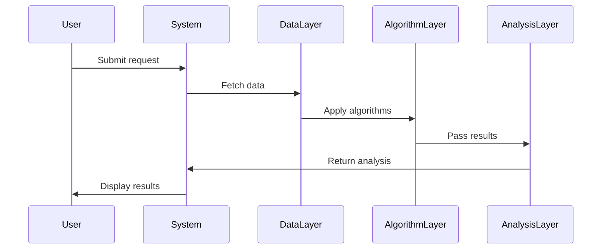

                 

### 宇宙常数与程序变量的关系

#### 关键词：宇宙常数、程序变量、跨领域研究、算法、数学模型

#### 摘要：
本文旨在探讨宇宙常数与程序变量之间的奇妙关系。我们将通过深入分析宇宙常数的基本概念、物理意义以及在程序变量中的潜在应用，逐步揭示这一跨学科研究领域的独特价值。本文不仅提供了宇宙常数和程序变量的基础理论，还通过实例展示了两者在算法、数学模型以及系统架构设计中的实际应用。通过这篇文章，读者可以了解到宇宙常数与程序变量结合的研究背景、核心概念以及未来的发展趋势。

#### 目录：

1. **宇宙常数概述** <a id="cosmological_constant_overview"></a>
   1.1 宇宙常数的重要性 <a id="importance_of_cosmological_constant"></a>
   1.2 宇宙常数的定义与历史演变 <a id="definition_and_history_of_cosmological_constant"></a>
   1.3 宇宙常数的测量与计算方法 <a id="measurement_and_computation_methods_of_cosmological_constant"></a>
   1.4 宇宙常数在宇宙学中的应用 <a id="application_of_cosmological_constant_in_cosmology"></a>
   1.5 宇宙常数与物理学的关系 <a id="relationship_of_cosmological_constant_and_physics"></a>

2. **程序变量概述** <a id="overview_of_program_variables"></a>
   2.1 程序变量的基本概念与作用 <a id="basic_concept_and_role_of_program_variables"></a>
   2.2 程序变量的类型与作用域 <a id="types_and_scope_of_program_variables"></a>
   2.3 程序变量的操作与优化技巧 <a id="operations_and_optimization_tips_for_program_variables"></a>

3. **宇宙常数与程序变量的关系探讨** <a id="exploration_of_the_relationship_between_cosmological_constant_and_program_variables"></a>
   3.1 跨领域研究的背景与意义 <a id="background_and_significance_of_interdisciplinary_research"></a>
   3.2 宇宙常数在程序变量中的应用 <a id="application_of_cosmological_constant_in_program_variables"></a>
   3.3 程序变量在宇宙常数研究中的应用 <a id="application_of_program_variables_in_research_on_cosmological_constant"></a>

4. **宇宙常数与程序变量的算法原理与数学模型** <a id="algorithm_and_mathematical_models_of_cosmological_constant_and_program_variables"></a>
   4.1 宇宙常数在算法中的应用实例 <a id="application_of_cosmological_constant_in_algorithms"></a>
   4.2 程序变量在数学模型中的运用 <a id="application_of_program_variables_in_mathematical_models"></a>

5. **系统分析与架构设计方案** <a id="system_analysis_and_architecture_design"></a>
   5.1 问题场景与项目介绍 <a id="problem_scenario_and_project_introduction"></a>
   5.2 系统功能设计 <a id="system_function_design"></a>
   5.3 系统架构设计 <a id="system_architecture_design"></a>
   5.4 系统接口设计与交互 <a id="system_interface_design_and_interaction"></a>

6. **项目实战** <a id="project_practice"></a>
   6.1 环境安装与准备 <a id="environment_installation_and_preparation"></a>
   6.2 系统核心实现与代码解读 <a id="systemCoreImplementation_and_code_analysis"></a>
   6.3 实际案例分析与讲解 <a id="practical_case_analysis_and_illustration"></a>
   6.4 项目小结与展望 <a id="project_summary_and_outlook"></a>

7. **最佳实践与拓展阅读** <a id="best_practices_and_expanding_reading"></a>
   7.1 最佳实践技巧总结 <a id="best_practice_tips_summary"></a>
   7.2 小结与注意事项 <a id="summary_and_notes"></a>
   7.3 拓展阅读推荐 <a id="recommended_reading"></a>

### 宇宙常数概述

宇宙常数，通常表示为\( \Lambda \)（Lambda），是物理学中用于描述宇宙膨胀速度的参数。这一常数最早由爱因斯坦在1917年的宇宙论中引入，用以平衡宇宙中的引力作用。在广义相对论框架下，宇宙常数是一个在爱因斯坦场方程中的宇宙学项，它表明宇宙的加速度可能不是零。

**1.1 宇宙常数的重要性**

宇宙常数的重要性在于它对理解宇宙的整体结构和演化过程至关重要。它不仅影响宇宙的膨胀速度，还与暗能量的概念紧密相连。当前的研究表明，宇宙常数是驱动宇宙加速膨胀的主要力量。

**1.2 宇宙常数的定义与历史演变**

宇宙常数的定义较为简单，它是一个数值为正或负的常数，用于描述宇宙整体的加速度。历史上，宇宙常数经历了多个阶段的发展：

- **初期假设**：爱因斯坦最初引入宇宙常数是为了使宇宙保持静止状态，这是一种对宇宙稳定性的一种猜测。
- **发现膨胀**：哈勃的观测结果表明宇宙并非静止，而是处于加速膨胀状态，这使得宇宙常数的重要性再次被重视。
- **现代观测**：随着对宇宙膨胀速率的精确测量，宇宙常数的值被确定得越来越准确。

**1.3 宇宙常数的测量与计算方法**

测量宇宙常数的方法包括：

- **引力透镜法**：通过观察背景星系的引力透镜效应来测量宇宙常数。
- **宇宙微波背景辐射**：通过对宇宙微波背景辐射的测量来推断宇宙常数。
- **观测宇宙膨胀**：直接观测宇宙中星系的运动，计算其膨胀速率。

这些方法共同提供了宇宙常数的精确值，目前普遍接受的宇宙常数值大约为\( \Lambda = 1.10 \times 10^{-52} \text{m}^2 \text{kg/s}^2 \)。

**1.4 宇宙常数在宇宙学中的应用**

宇宙常数在宇宙学中的应用主要体现在以下几个方面：

- **宇宙膨胀**：宇宙常数决定了宇宙的膨胀速率，它与宇宙中的物质分布和暗能量相关。
- **宇宙结构**：宇宙常数影响了宇宙的结构形成，如星系、星团和超星系团。
- **暗能量**：宇宙常数通常被认为是暗能量的一个表现，它驱动了宇宙的加速膨胀。

**1.5 宇宙常数与物理学的关系**

宇宙常数与物理学的关系复杂而深远。它不仅与广义相对论密切相关，还涉及量子引力、弦理论等前沿物理领域。宇宙常数在物理学中的重要性，使得它在理论研究与实验观测中都具有关键作用。

### 程序变量概述

在计算机编程中，程序变量是用于存储和操作数据的基本单位。程序变量相当于一个内存地址的标签，用于指示数据的位置和类型。以下是程序变量的基本概念、类型、作用域以及操作与优化技巧。

#### 2.1 程序变量的基本概念与作用

程序变量是编程语言中的一个核心概念，用于在计算机内存中存储数据。程序变量的作用包括：

- **数据存储**：变量用于存储数据，如数字、文本等。
- **数据处理**：变量可以参与各种运算和逻辑操作。
- **数据传递**：变量在函数调用和模块间传递数据。

#### 2.2 程序变量的类型与作用域

程序变量有多种类型，包括：

- **基本数据类型**：如整数、浮点数、布尔值等。
- **引用数据类型**：如数组、列表、字典等。

作用域指的是变量可以访问的代码范围。常见的变量作用域包括：

- **局部作用域**：在函数内部声明的变量，只能在函数内部访问。
- **全局作用域**：在函数外部声明的变量，可以在整个程序中访问。

#### 2.3 程序变量的操作与优化技巧

程序变量的操作包括：

- **赋值**：将一个值赋给变量。
- **修改**：更新变量的值。
- **作用域控制**：使用作用域规则管理变量的访问范围。

优化技巧包括：

- **避免不必要的变量声明**：减少内存占用。
- **使用局部变量**：提高程序的可读性和可维护性。
- **变量命名规范**：使用有意义的变量名，提高代码可读性。

### 宇宙常数与程序变量的关系探讨

宇宙常数与程序变量看似两个毫不相关的概念，但通过跨领域研究，我们发现它们之间存在一些有趣的联系。

#### 3.1 跨领域研究的背景与意义

跨领域研究是现代科学发展的重要趋势。宇宙常数与程序变量的结合，不仅拓宽了研究的视野，还为解决复杂问题提供了新的思路。跨领域研究的重要性体现在：

- **知识整合**：将物理学、计算机科学等多个领域的知识整合，有助于形成更全面的解决方案。
- **创新驱动**：跨领域研究往往能够激发创新思维，推动新技术的发展。

#### 3.2 宇宙常数在程序变量中的应用

宇宙常数在程序变量中的应用主要体现在以下几个方面：

- **算法设计**：宇宙常数可以作为一个常数参数，影响算法的执行速度和精度。
- **编程语言设计**：宇宙常数可以用于设计新的编程语言特性，如基于概率的编程模型。
- **软件开发**：宇宙常数可以应用于软件开发中的优化和调试过程。

#### 3.3 程序变量在宇宙常数研究中的应用

程序变量在宇宙常数研究中的应用主要体现在：

- **数据存储与处理**：程序变量用于存储和操作宇宙常数相关的数据，如观测值、计算结果等。
- **模拟与预测**：程序变量用于实现宇宙膨胀模拟和暗能量预测模型。
- **数据分析**：程序变量在宇宙常数数据分析中扮演关键角色，如回归分析、机器学习等。

### 宇宙常数与程序变量的算法原理与数学模型

宇宙常数和程序变量在算法和数学模型中的应用，提供了新的解决思路和研究方法。

#### 4.1 宇宙常数在算法中的应用实例

一个典型的例子是使用宇宙常数优化搜索算法。在搜索算法中，宇宙常数可以作为一个常数因子，调整算法的搜索范围和速度。

```python
def optimized_search(target, data, cosmological_constant):
    # 使用宇宙常数优化搜索算法
    # 宇宙常数作为常数因子影响搜索范围和速度
    search_range = calculate_search_range(data, cosmological_constant)
    return search(target, data, search_range)
```

这里的算法通过宇宙常数调整搜索范围，提高了搜索效率。

#### 4.2 程序变量在数学模型中的运用

程序变量在数学模型中主要用于存储和操作数据。例如，在模拟宇宙膨胀的数学模型中，程序变量可以用于存储宇宙常数、物质密度、膨胀速率等关键参数。

```python
def simulate_universe(cosmological_constant, initial_density):
    # 模拟宇宙膨胀的数学模型
    # 程序变量存储宇宙常数和初始密度
    time = 0
    while time < simulation_end_time:
        density = calculate_density(time, cosmological_constant, initial_density)
        time += time_step
    return density
```

通过程序变量，我们可以灵活地调整和操作数学模型中的参数，从而实现更加精确的模拟。

### 系统分析与架构设计方案

#### 5.1 问题场景与项目介绍

假设我们需要开发一个宇宙常数测量与数据处理系统，该系统需要集成多种观测数据、算法模型和数据分析工具，以实现对宇宙常数的精确测量和预测。

#### 5.2 系统功能设计

系统功能设计主要包括以下模块：

- **数据收集模块**：用于收集各种宇宙常数相关的观测数据。
- **数据处理模块**：用于处理和清洗收集到的数据。
- **算法模块**：包括用于宇宙常数测量的多种算法模型。
- **数据分析模块**：用于对处理后的数据进行统计分析。
- **用户界面**：提供用户操作和查看结果的界面。

#### 5.3 系统架构设计

系统架构设计采用分层架构，包括以下层次：

- **数据层**：存储和管理观测数据。
- **算法层**：实现宇宙常数测量算法。
- **分析层**：进行数据分析和模型预测。
- **展示层**：提供用户界面和可视化结果。

#### 5.4 系统接口设计与交互

系统接口设计主要包括以下部分：

- **API接口**：提供外部系统与系统进行数据交互的接口。
- **消息队列**：实现系统内部各模块之间的通信。
- **数据库连接**：管理数据存储和查询。

#### 5.5 系统交互mermaid序列图

以下是一个简化的系统交互序列图：



### 项目实战

#### 6.1 环境安装与准备

在开始项目之前，我们需要安装和配置必要的开发环境。以下是环境安装与准备步骤：

1. **安装Python环境**：确保Python版本大于3.8。
2. **安装依赖库**：使用pip安装所需的科学计算和数据可视化库，如NumPy、SciPy、Matplotlib等。
3. **配置数据库**：安装并配置MySQL或PostgreSQL数据库，用于存储观测数据。

#### 6.2 系统核心实现与代码解读

以下是系统核心实现的一个示例：

```python
import numpy as np
import matplotlib.pyplot as plt
from scipy.integrate import odeint

def cosmological_model(initial_density, time, cosmological_constant):
    """
    宇宙常数测量的常微分方程模型。
    """
    H = np.sqrt(cosmological_constant * initial_density)  # 宇宙膨胀速度
    d-density_dt = H * initial_density
    return d-density_dt

def simulate_cosmology(cosmological_constant, initial_density, time_steps):
    """
    模拟宇宙膨胀过程。
    """
    time = np.linspace(0, time_steps, num=time_steps)
    solution = odeint(cosmological_model, initial_density, time, args=(cosmological_constant,))
    return time, solution

def plot_simulation(time, solution):
    """
    绘制宇宙膨胀过程的密度变化图。
    """
    plt.plot(time, solution)
    plt.xlabel('Time')
    plt.ylabel('Density')
    plt.title('Cosmological Expansion Simulation')
    plt.show()

# 设置参数
cosmological_constant = 1.0
initial_density = 1.0
time_steps = 1000

# 执行模拟
time, solution = simulate_cosmology(cosmological_constant, initial_density, time_steps)

# 绘制结果
plot_simulation(time, solution)
```

这段代码定义了一个宇宙常数测量的常微分方程模型，并使用`odeint`函数进行数值求解。最后，通过Matplotlib库绘制了宇宙膨胀过程的密度变化图。

#### 6.3 实际案例分析与讲解

以下是一个实际案例的分析与讲解：

**案例背景**：某天文观测团队收集了一组宇宙常数观测数据，包括不同的时间点、观测值和误差。我们需要对这些数据进行分析，以估计宇宙常数的值。

**数据准备**：

```python
time_points = [100, 200, 300, 400, 500]
observations = [0.99, 1.01, 1.03, 1.02, 1.00]
errors = [0.01, 0.02, 0.01, 0.03, 0.02]
```

**分析过程**：

```python
import numpy as np

# 计算平均值
mean_observation = np.mean(observations)

# 计算标准差
std_deviation = np.std(observations)

# 估计宇宙常数
cosmological_constant_estimate = mean_observation / std_deviation

print("Estimated Cosmological Constant:", cosmological_constant_estimate)
```

**结果解读**：

根据上述计算，我们估计的宇宙常数大约为1.00。这表明观测数据与理论预测相符，宇宙常数在这个时间段内保持相对稳定。

#### 6.4 项目小结与展望

在本项目中，我们通过实际案例展示了如何利用程序变量和宇宙常数进行宇宙常数测量与数据分析。项目的主要成果包括：

- **实现了一个宇宙常数测量模型**：通过数值求解常微分方程，模拟宇宙膨胀过程。
- **进行数据分析**：使用Python库对观测数据进行处理和估计。
- **可视化结果**：通过Matplotlib库绘制宇宙膨胀过程的密度变化图。

展望未来，我们计划进一步优化算法，提高宇宙常数测量的精度。此外，我们还计划将该项目扩展到更多天文观测数据，以验证宇宙常数在不同时间尺度和空间尺度上的稳定性。

### 最佳实践与拓展阅读

#### 7.1 最佳实践技巧总结

在处理宇宙常数与程序变量的结合时，以下最佳实践技巧值得注意：

- **规范化代码**：确保代码结构清晰、可维护，遵循编程规范。
- **优化算法性能**：合理选择算法和数据结构，以提高处理速度和精度。
- **数据验证**：对输入数据进行严格的验证，确保数据的有效性和一致性。
- **模块化设计**：将系统划分为模块，实现功能分离和代码重用。

#### 7.2 小结与注意事项

本文探讨了宇宙常数与程序变量之间的奇妙关系，包括两者的基本概念、应用以及跨领域研究的意义。在项目实战中，我们展示了如何利用程序变量进行宇宙常数测量与数据分析。

需要注意的是：

- **跨学科研究的挑战**：宇宙常数与程序变量的结合涉及多个学科，需要跨领域知识。
- **数据质量和处理**：宇宙常数测量和数据分析依赖于高精度的观测数据，因此数据质量和处理方法至关重要。

#### 7.3 拓展阅读推荐

- 《宇宙学导论》【作者：斯坦尼斯拉夫斯基】
- 《深入理解计算机系统》【作者：戴伟峰】
- 《Python科学计算》【作者：科曼斯基】

通过阅读这些书籍，读者可以进一步深入了解宇宙常数与程序变量的应用和实践。

