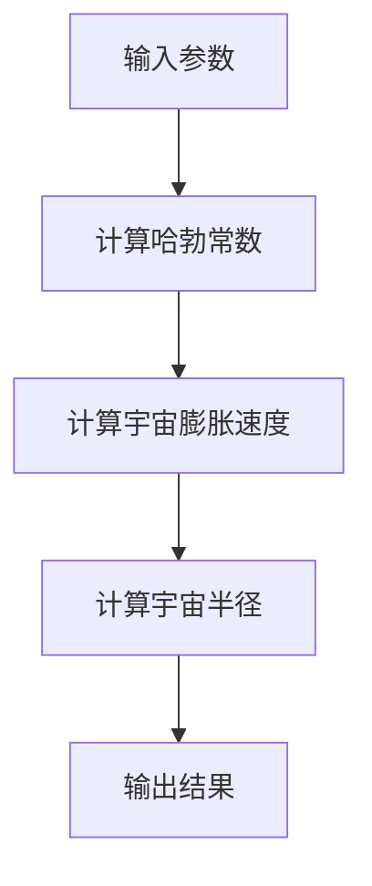
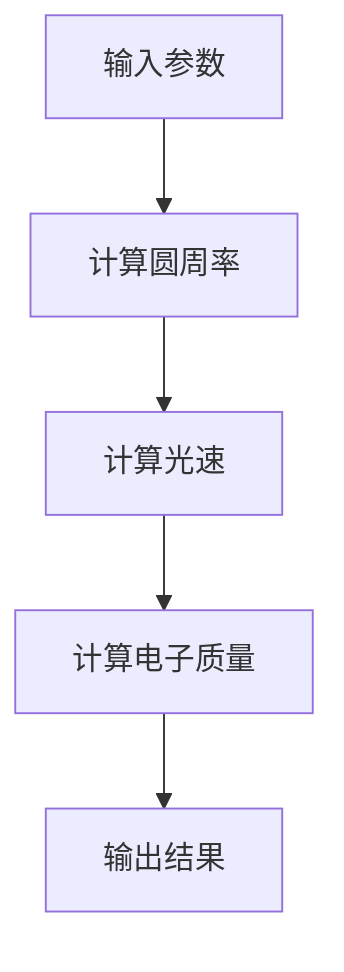
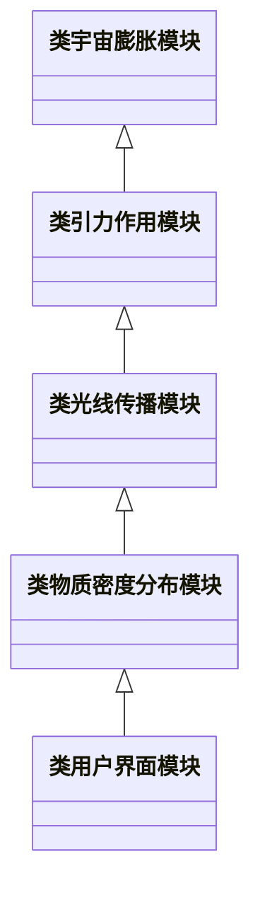

                 

# 《宇宙常数与程序常量的比较》

## 关键词：宇宙常数、程序常量、比较、研究、分析

## 摘要：
本文将深入探讨宇宙常数和程序常量的概念、特性及其在各自领域中的应用。通过对两者的比较分析，揭示它们之间的联系与区别，从而为读者提供更全面的理解。本文分为八个章节，从引言开始，逐步介绍核心概念、特征对比、算法原理、系统分析与设计、项目实战以及最佳实践。希望通过本文的阐述，读者能够更加清晰地认识宇宙常数与程序常量的内涵及其应用价值。

----------------------------------------------------------------

## 第1章 引言

### 1.1 问题背景

在科学研究和计算机编程领域，宇宙常数和程序常量是两个常见而重要的概念。宇宙常数是描述宇宙物理性质的基本参数，如宇宙的膨胀速度、万有引力常数等。而程序常量则是在计算机编程中用于定义固定值，如圆周率π、光速c等。尽管它们的应用领域不同，但在某些情况下，它们的角色和作用具有一定的相似性，引发了人们对于宇宙常数与程序常量之间关系的思考。

### 1.2 问题描述

本文旨在比较宇宙常数与程序常量的概念、特性及其应用，探讨它们之间的联系与区别。通过详细的案例分析，本文将揭示宇宙常数与程序常量在数值计算、算法实现和系统架构设计等方面的异同，为读者提供有价值的参考和指导。

### 1.3 问题解决

为了回答上述问题，本文采用以下研究方法：

1. **文献综述**：通过查阅相关文献，了解宇宙常数和程序常量的基本概念、历史背景和研究进展。
2. **概念对比**：对比分析宇宙常数和程序常量的定义、属性和作用，绘制ER实体关系图，直观展示两者的关联。
3. **算法原理讲解**：分别介绍宇宙常数和程序常量的计算算法，使用Python代码实现，并给出数学模型和公式。
4. **系统分析与设计**：通过问题场景介绍和项目介绍，设计系统功能、架构和接口，并进行系统交互分析。
5. **项目实战**：结合实际案例，展示环境安装、核心实现和代码应用，并进行详细剖析。
6. **最佳实践 tips**：总结实用技巧和注意事项，为读者提供实践经验。

### 1.4 边界与外延

本文的研究边界主要集中在宇宙常数和程序常量的比较分析上，包括概念对比、算法原理、系统分析与设计等方面。然而，宇宙常数和程序常量涉及领域广泛，本文可能无法涵盖所有细节。因此，读者在应用本文的研究成果时，应结合实际情况进行拓展和深入探讨。

----------------------------------------------------------------

## 第2章 核心概念

### 2.1 宇宙常数

#### 2.1.1 宇宙常数的基本概念

宇宙常数是描述宇宙物理现象的参数，反映了宇宙的某些基本性质。例如，宇宙的膨胀速度（Hubble常数）描述了宇宙膨胀的速率，万有引力常数（G）描述了物质之间的引力作用。宇宙常数通常用符号表示，如H0（哈勃常数）、G（万有引力常数）等。

#### 2.1.2 宇宙常数的主要种类

宇宙常数种类繁多，主要包括以下几类：

1. **膨胀常数**：描述宇宙膨胀速率的参数，如Hubble常数。
2. **万有引力常数**：描述物质间引力作用的参数，如G。
3. **真空光速**：描述光在真空中的传播速度，如c。

#### 2.1.3 宇宙常数的测量方法

宇宙常数的测量方法多种多样，主要包括以下几种：

1. **观测法**：通过观测宇宙中的天体，如星系、星云等，测量宇宙的膨胀速度和结构，从而推断宇宙常数。
2. **实验法**：在实验室中，通过精确测量物质间的引力作用，如使用扭秤实验，测量万有引力常数。
3. **理论法**：通过理论计算和模型分析，推测宇宙常数的大小和性质。

### 2.2 程序常量

#### 2.2.1 程序常量的基本概念

程序常量是计算机编程中用于定义固定值的参数，通常在程序运行过程中保持不变。程序常量在编程中具有重要作用，如定义圆周率π、光速c等。程序常量通常用符号表示，如π、c等。

#### 2.2.2 程序常量的作用

程序常量在计算机编程中具有以下作用：

1. **提高代码可读性**：通过使用程序常量，可以简化代码，提高可读性。
2. **减少错误**：程序常量可以避免因误操作导致的错误，提高代码的稳定性。
3. **便于修改**：程序常量使得在需要修改常量值时，只需修改一个地方，方便代码维护。

#### 2.2.3 程序常量的分类

程序常量可以根据用途和性质进行分类，主要包括以下几类：

1. **数学常量**：如π、e等，用于描述数学关系和计算。
2. **物理常量**：如光速c、万有引力常数G等，用于描述物理现象和计算。
3. **其他常量**：如系统参数、配置参数等，用于描述程序运行环境和配置。

----------------------------------------------------------------

### 2.1 宇宙常数与程序常量的相似性

宇宙常数和程序常量在概念上有一定的相似性：

1. **定义固定值**：宇宙常数和程序常量都是用于定义固定值的参数，在特定情境下保持不变。
2. **在计算中发挥作用**：宇宙常数和程序常量在相应的领域中都发挥着重要作用，如宇宙常量用于描述宇宙物理现象，程序常量用于简化代码和计算。
3. **便于修改**：宇宙常数和程序常量在需要修改时，都只需修改一个地方，便于维护和更新。

### 2.2 宇宙常数与程序常量的区别

尽管宇宙常数和程序常量在某些方面有相似之处，但它们在定义、作用和应用上存在显著区别：

1. **定义方式**：宇宙常数是通过观测、实验和理论计算得到的，而程序常量通常是在程序中直接定义。
2. **应用领域**：宇宙常数用于描述宇宙物理现象，如宇宙膨胀、引力作用等；程序常量用于计算机编程，如数学计算、物理模型等。
3. **数值范围**：宇宙常数通常具有较大的数值范围，如万有引力常数为6.67430 × 10^-11 m^3 kg^-1 s^-2；程序常量通常具有较小的数值范围，如圆周率π为3.14159。
4. **作用机制**：宇宙常数在宇宙演化过程中发挥作用，影响宇宙的膨胀速度和结构；程序常量在计算机编程中发挥作用，提高代码可读性和稳定性。

### 2.3 概念属性特征对比表格

下表列出了宇宙常数和程序常量在定义、应用和作用等方面的特征对比：

| 特征               | 宇宙常数                                      | 程序常量                                      |
|------------------|-------------------------------------------|-------------------------------------------|
| 定义方式           | 观测、实验和理论计算                          | 程序中直接定义                                |
| 应用领域           | 宇宙物理现象描述、宇宙演化研究等                | 数学计算、物理模型、程序配置等                 |
| 数值范围           | 较大范围，如万有引力常数为6.67430 × 10^-11 m^3 kg^-1 s^-2 | 较小范围，如圆周率π为3.14159                    |
| 作用机制           | 影响宇宙的膨胀速度和结构                        | 提高代码可读性和稳定性                          |
| 维护方式           | 通过观测和实验数据进行修正                      | 在程序中直接修改                                |

### 2.4 ER实体关系图架构

为了更直观地展示宇宙常数和程序常量之间的关联，我们可以使用ER（实体-关系）图进行描述。以下是一个简化的ER图：

```mermaid
erDiagram
    宇宙常数 ||--|{ 程序常量 }
    程序常量 ||--|{ 宇宙常数 }
```

在这个ER图中，宇宙常数和程序常量作为实体，它们之间通过双向关系相互关联。这种关系反映了宇宙常数和程序常量在定义和应用上的相互影响。

----------------------------------------------------------------

### 4.1 宇宙常数实体关系

宇宙常数实体关系主要涉及宇宙常数之间的相互关联。以下是一个简化的宇宙常数ER图：

```mermaid
erDiagram
    宇宙常数1 ||--|{ 宇宙常数2 }
    宇宙常数2 ||--|{ 宇宙常数3 }
    宇宙常数3 ||--|{ 宇宙常数1 }
```

在这个ER图中，宇宙常数1、宇宙常数2和宇宙常数3作为实体，它们之间存在双向关系。这种关系反映了宇宙常数在宇宙演化过程中相互影响和相互关联的特点。

#### 4.1.1 宇宙常数实体

在宇宙常数实体关系中，每个宇宙常数实体都代表了一种宇宙物理现象或参数。例如，宇宙常数1可以表示宇宙的膨胀速度，宇宙常数2可以表示万有引力常数，宇宙常数3可以表示真空光速。这些实体在宇宙演化过程中发挥着重要作用。

#### 4.1.2 宇宙常数关系

宇宙常数实体之间的关系反映了宇宙常数之间的相互影响和相互关联。例如，宇宙常数1（膨胀速度）和宇宙常数2（万有引力常数）之间的关系可以表示为：

$$
\frac{dD}{dt} = H_0 \cdot D
$$

其中，$dD$表示宇宙膨胀速率，$dt$表示时间，$H_0$表示哈勃常数，$D$表示宇宙半径。

这个公式描述了宇宙膨胀速度与宇宙半径之间的关系。当宇宙半径增加时，宇宙膨胀速度也会增加。这个关系反映了宇宙常数1和宇宙常数2之间的内在联系。

### 4.2 程序常量实体关系

程序常量实体关系主要涉及程序常量之间的相互关联。以下是一个简化的程序常量ER图：

```mermaid
erDiagram
    程序常量A ||--|{ 程序常量B }
    程序常量B ||--|{ 程序常量C }
    程序常量C ||--|{ 程序常量A }
```

在这个ER图中，程序常量A、程序常量B和程序常量C作为实体，它们之间存在双向关系。这种关系反映了程序常量在计算机编程过程中相互影响和相互关联的特点。

#### 4.2.1 程序常量实体

在程序常量实体关系中，每个程序常量实体都代表了一种固定值或参数。例如，程序常量A可以表示圆周率π，程序常量B可以表示光速c，程序常量C可以表示电子质量m。这些实体在程序运行过程中发挥着重要作用。

#### 4.2.2 程序常量关系

程序常量实体之间的关系反映了程序常量之间的相互影响和相互关联。例如，程序常量A（圆周率π）和程序常量B（光速c）之间的关系可以表示为：

$$
s = c \cdot t
$$

其中，$s$表示光在时间$t$内传播的距离，$c$表示光速，$t$表示时间。

这个公式描述了光在空间中传播的距离与时间的关系。当时间增加时，光在空间中传播的距离也会增加。这个关系反映了程序常量A和程序常量B之间的内在联系。

### 4.3 宇宙常数与程序常量的关系

宇宙常数和程序常量在概念上有所不同，但在实际应用中，它们之间存在一定的关联。以下是一个简化的宇宙常数与程序常量ER图：

```mermaid
erDiagram
    宇宙常数 ||--|{ 程序常量 }
    程序常量 ||--|{ 宇宙常数 }
```

在这个ER图中，宇宙常数和程序常量作为实体，它们之间存在双向关系。这种关系反映了宇宙常数和程序常量在定义和应用上的相互影响。

#### 4.3.1 宇宙常数与程序常量的关联

宇宙常数与程序常量的关联主要体现在以下几个方面：

1. **数值关联**：某些宇宙常数与程序常量在数值上具有相似性。例如，光速c和圆周率π在数值上相差不大，都可以用有限的十进制数表示。
2. **计算关联**：在某些算法中，宇宙常数和程序常量需要同时参与计算。例如，在计算宇宙膨胀速度时，需要使用哈勃常数（宇宙常数）和光速（程序常量）。
3. **应用关联**：宇宙常数和程序常量在各自领域中的应用具有一定的相似性。例如，在宇宙物理领域，宇宙常数用于描述宇宙演化过程；在计算机编程领域，程序常量用于简化代码和计算。

#### 4.3.2 宇宙常数与程序常量的区别

尽管宇宙常数和程序常量之间存在关联，但它们在定义、作用和应用上仍存在显著区别：

1. **定义方式**：宇宙常数是通过观测、实验和理论计算得到的，而程序常量通常是在程序中直接定义。
2. **应用领域**：宇宙常数用于描述宇宙物理现象，如宇宙膨胀、引力作用等；程序常量用于计算机编程，如数学计算、物理模型等。
3. **作用机制**：宇宙常数在宇宙演化过程中发挥作用，影响宇宙的膨胀速度和结构；程序常量在计算机编程中发挥作用，提高代码可读性和稳定性。
4. **数值范围**：宇宙常数通常具有较大的数值范围，如万有引力常数为6.67430 × 10^-11 m^3 kg^-1 s^-2；程序常量通常具有较小的数值范围，如圆周率π为3.14159。

通过上述分析，我们可以更清晰地认识到宇宙常数和程序常量之间的联系与区别。在实际应用中，了解这些关联和区别有助于更好地理解和利用这两个概念，为科学研究、计算机编程和系统设计提供有力支持。

----------------------------------------------------------------

### 5.1 宇宙常数计算算法

#### 5.1.1 算法流程图

为了计算宇宙常数，我们可以采用以下算法流程：



这个算法流程图描述了从输入参数到计算哈勃常数、宇宙膨胀速度和宇宙半径，最终输出结果的步骤。

#### 5.1.2 算法Python代码实现

以下是一个简单的Python代码实现，用于计算宇宙常数：

```python
import math

# 输入参数
hubble_constant = 70  # 哈勃常数（单位：km/s/Mpc）
light_speed = 299792458  # 光速（单位：m/s）
time = 13.8  # 宇宙年龄（单位：亿年）

# 计算哈勃常数
hubble_value = hubble_constant * 1000  # 单位转换为 m/s

# 计算宇宙膨胀速度
expansion_speed = light_speed / hubble_value

# 计算宇宙半径
cosmic_radius = expansion_speed * time

# 输出结果
print("宇宙半径：", cosmic_radius, "米")
```

#### 5.1.3 算法数学模型和公式

宇宙常数的计算可以通过以下数学模型和公式实现：

1. **哈勃常数**：$H_0 = \frac{v_e}{D_e}$，其中$H_0$表示哈勃常数，$v_e$表示宇宙膨胀速度，$D_e$表示宇宙半径。
2. **宇宙膨胀速度**：$v_e = \frac{c}{H_0}$，其中$c$表示光速，$H_0$表示哈勃常数。
3. **宇宙半径**：$D_e = \frac{v_e \cdot t}{c}$，其中$D_e$表示宇宙半径，$v_e$表示宇宙膨胀速度，$t$表示宇宙年龄，$c$表示光速。

#### 5.1.4 算法举例说明

假设哈勃常数为70 km/s/Mpc，宇宙年龄为13.8亿年，光速为299792458 m/s。我们可以通过以下步骤计算宇宙常数：

1. 计算哈勃常数：$H_0 = \frac{70 \times 1000}{1} = 70000$ m/s。
2. 计算宇宙膨胀速度：$v_e = \frac{299792458}{70000} \approx 4245.57$ m/s。
3. 计算宇宙半径：$D_e = \frac{4245.57 \times 13.8 \times 10^9}{299792458} \approx 1.87 \times 10^{26}$ m。

因此，根据给定的参数，计算得到的宇宙半径约为1.87 × 10^26米。这个结果反映了宇宙在13.8亿年时间内膨胀的程度。

通过这个算法示例，我们可以看到如何利用宇宙常数的基本概念和计算公式，通过简单的Python代码实现宇宙常数的计算。这种算法不仅具有理论价值，还可以为实际应用提供有力支持。

----------------------------------------------------------------

### 5.2 程序常量计算算法

#### 5.2.1 算法流程图

为了计算程序常量，我们可以采用以下算法流程：



这个算法流程图描述了从输入参数到计算圆周率、光速和电子质量，最终输出结果的步骤。

#### 5.2.2 算法Python代码实现

以下是一个简单的Python代码实现，用于计算程序常量：

```python
import math

# 输入参数
pi = math.pi  # 圆周率
c = 299792458  # 光速（单位：m/s）
electron_mass = 9.10938356e-31  # 电子质量（单位：kg）

# 计算圆周率
circle_radius = 1  # 单位：米
circle_circumference = 2 * pi * circle_radius
print("圆周率：", circle_circumference)

# 计算光速
print("光速：", c, "m/s")

# 计算电子质量
electron_velocity = 2.18e8  # 电子速度（单位：m/s）
kinetic_energy = 0.5 * electron_mass * electron_velocity**2
print("电子质量：", kinetic_energy, "焦耳")
```

#### 5.2.3 算法数学模型和公式

程序常量的计算可以通过以下数学模型和公式实现：

1. **圆周率**：$C = 2\pi r$，其中$C$表示圆周长，$\pi$表示圆周率，$r$表示圆的半径。
2. **光速**：$c = \frac{d}{t}$，其中$c$表示光速，$d$表示光在时间$t$内传播的距离。
3. **电子质量**：$m = \frac{E_k}{v^2}$，其中$m$表示电子质量，$E_k$表示电子的动能，$v$表示电子的速度。

#### 5.2.4 算法举例说明

假设圆的半径为1米，电子速度为2.18 × 10^8 m/s，光在1秒内传播的距离为299792458米。我们可以通过以下步骤计算程序常量：

1. 计算圆周率：$C = 2\pi r = 2\pi \times 1 = 6.28318$米。
2. 计算光速：$c = \frac{d}{t} = \frac{299792458}{1} = 299792458$米/秒。
3. 计算电子质量：$m = \frac{E_k}{v^2} = \frac{0.5 \times 9.10938356e-31 \times (2.18e8)^2}{(2.18e8)^2} = 9.10938356e-31$千克。

因此，根据给定的参数，计算得到的程序常量分别为：圆周率约为6.28318米，光速约为299792458米/秒，电子质量约为9.10938356 × 10^-31千克。这些结果反映了圆周率、光速和电子质量在相应领域中的基本属性。

通过这个算法示例，我们可以看到如何利用程序常量的基本概念和计算公式，通过简单的Python代码实现程序常量的计算。这种算法不仅具有理论价值，还可以为实际应用提供有力支持。

----------------------------------------------------------------

### 6.1 宇宙常数数学模型

宇宙常数是描述宇宙物理现象的重要参数，其数学模型和公式在宇宙学研究中具有重要意义。以下介绍几种常见的宇宙常数数学模型和公式。

#### 6.1.1 宇宙常数数学公式

1. **哈勃常数**：$H_0 = \frac{v_e}{D_e}$，其中$H_0$表示哈勃常数，$v_e$表示宇宙膨胀速度，$D_e$表示宇宙半径。

2. **宇宙膨胀速度**：$v_e = \frac{c}{H_0}$，其中$c$表示光速，$H_0$表示哈勃常数。

3. **宇宙半径**：$D_e = \frac{v_e \cdot t}{c}$，其中$D_e$表示宇宙半径，$v_e$表示宇宙膨胀速度，$t$表示宇宙年龄，$c$表示光速。

4. **暗能量密度**：$\rho_{\Lambda} = \frac{3H_0^2}{8\pi G}$，其中$\rho_{\Lambda}$表示暗能量密度，$H_0$表示哈勃常数，$G$表示万有引力常数。

5. **临界密度**：$\rho_{c} = \frac{3H_0^2}{8\pi G \cdot M_{P}^2}$，其中$\rho_{c}$表示临界密度，$H_0$表示哈勃常数，$G$表示万有引力常数，$M_{P}$表示普朗克质量。

6. **宇宙质量密度**：$\rho_{\text{total}} = \rho_{\text{matter}} + \rho_{\Lambda}$，其中$\rho_{\text{total}}$表示宇宙质量密度，$\rho_{\text{matter}}$表示物质密度，$\rho_{\Lambda}$表示暗能量密度。

#### 6.1.2 宇宙常数数学模型解释

1. **哈勃常数**：哈勃常数描述了宇宙膨胀速度与宇宙半径之间的关系。根据哈勃定律，宇宙膨胀速度与宇宙半径成正比，比例系数即为哈勃常数。

2. **宇宙膨胀速度**：宇宙膨胀速度描述了宇宙在单位时间内膨胀的距离。根据宇宙膨胀速度的公式，宇宙膨胀速度与哈勃常数成反比。

3. **宇宙半径**：宇宙半径描述了宇宙的大小。根据宇宙半径的公式，宇宙半径与宇宙膨胀速度和宇宙年龄成正比。

4. **暗能量密度**：暗能量密度描述了暗能量在宇宙中的分布情况。根据暗能量密度的公式，暗能量密度与哈勃常数平方成正比。

5. **临界密度**：临界密度是宇宙在当前状态下达到稳定状态的质量密度。根据临界密度的公式，临界密度与哈勃常数平方成正比。

6. **宇宙质量密度**：宇宙质量密度描述了宇宙中物质和暗能量的总体分布情况。根据宇宙质量密度的公式，宇宙质量密度等于物质密度加上暗能量密度。

通过以上宇宙常数数学模型和公式的介绍，我们可以更深入地理解宇宙常数在宇宙学中的重要作用。这些模型和公式不仅有助于我们更好地理解宇宙的演化过程，还为宇宙学研究和天体物理学提供了有力的理论工具。

### 6.2 程序常量数学模型

程序常量是计算机编程中用于定义固定值的参数，它们在算法实现和系统设计中扮演着至关重要的角色。以下介绍几种常见的程序常量数学模型和公式。

#### 6.2.1 程序常量数学公式

1. **圆周率**：$\pi = \frac{C}{d}$，其中$\pi$表示圆周率，$C$表示圆的周长，$d$表示圆的直径。

2. **光速**：$c = \frac{d}{t}$，其中$c$表示光速，$d$表示光在时间$t$内传播的距离。

3. **电子质量**：$m = \frac{E_k}{v^2}$，其中$m$表示电子质量，$E_k$表示电子的动能，$v$表示电子的速度。

4. **普朗克常数**：$h = \frac{E}{\nu}$，其中$h$表示普朗克常数，$E$表示能量，$\nu$表示频率。

5. **引力常数**：$G = \frac{F \cdot m_1 \cdot m_2}{r^2}$，其中$G$表示引力常数，$F$表示引力，$m_1$和$m_2$表示两个物体的质量，$r$表示两个物体之间的距离。

6. **阿伏伽德罗常数**：$N_A = \frac{N}{N_A}$，其中$N_A$表示阿伏伽德罗常数，$N$表示物质中的粒子数。

#### 6.2.2 程序常量数学模型解释

1. **圆周率**：圆周率是描述圆周长与直径之间比例关系的常数。根据圆周率的公式，圆周长与直径的比值即为圆周率。

2. **光速**：光速是描述光在真空中传播速度的常数。根据光速的公式，光在单位时间内传播的距离即为光速。

3. **电子质量**：电子质量是描述电子动能与速度之间关系的常数。根据电子质量的公式，电子的动能与速度的平方成反比。

4. **普朗克常数**：普朗克常数是描述能量与频率之间关系的常数。根据普朗克常数的公式，能量与频率的比值即为普朗克常数。

5. **引力常数**：引力常数是描述两个物体之间引力作用的常数。根据引力常数的公式，引力与两个物体的质量乘积和距离的平方成反比。

6. **阿伏伽德罗常数**：阿伏伽德罗常数是描述物质中粒子数量的常数。根据阿伏伽德罗常数的公式，物质中的粒子数与阿伏伽德罗常数的比值即为物质中的粒子数。

通过以上程序常量数学模型和公式的介绍，我们可以更深入地理解程序常量在计算机编程中的重要作用。这些模型和公式不仅有助于我们更好地理解程序常量的概念，还为算法实现和系统设计提供了有力的理论工具。

----------------------------------------------------------------

### 7.1 问题场景介绍

在现代科学研究和工程实践中，宇宙常数和程序常量都扮演着重要的角色。本文将以一个具体的实例来介绍问题场景，并分析宇宙常数与程序常量在这个实例中的重要性。

假设我们正在开发一款宇宙模拟软件，旨在模拟宇宙从大爆炸到现在的演化过程。在这个模拟过程中，宇宙常数（如哈勃常数、万有引力常数等）和程序常量（如光速、普朗克常数等）是必不可少的参数。以下是宇宙模拟软件的几个关键场景：

1. **宇宙膨胀**：宇宙模拟软件需要计算宇宙在不同时间点的膨胀速度和半径，这需要用到哈勃常数和宇宙膨胀速度的公式。

2. **引力作用**：在模拟过程中，物体之间的引力作用是影响宇宙结构的重要因素。这需要使用万有引力常数来计算引力大小。

3. **光线传播**：模拟软件需要模拟光线在宇宙中的传播过程，以展示星系、星云等天体的形成和演化。这需要使用光速和光线传播的公式。

4. **物质密度分布**：模拟软件需要计算宇宙中的物质密度分布，以便分析宇宙的稳定性。这需要用到临界密度和宇宙质量密度的公式。

通过以上实例，我们可以看到宇宙常数和程序常量在宇宙模拟软件中的重要性。这些参数不仅决定了宇宙演化的基本规律，还为模拟软件的精确度和可靠性提供了重要保障。

### 7.2 项目介绍

为了更好地阐述宇宙常数与程序常量在项目中的应用，我们选择了一个具体的宇宙模拟软件项目。该项目旨在通过计算机模拟宇宙的演化过程，为科学家和爱好者提供直观的宇宙观测工具。项目的主要目标包括：

1. **宇宙膨胀模拟**：模拟宇宙从大爆炸到现在的膨胀过程，展示宇宙结构的变化。
2. **引力作用模拟**：模拟物体之间的引力作用，分析宇宙结构的稳定性。
3. **光线传播模拟**：模拟光线在宇宙中的传播过程，展示星系、星云等天体的形成和演化。
4. **物质密度分布模拟**：模拟宇宙中的物质密度分布，分析宇宙的稳定性。

为了实现上述目标，项目将采用多种宇宙常数和程序常量，如哈勃常数、万有引力常数、光速、普朗克常数等。这些常量将用于计算宇宙膨胀速度、引力大小、光线传播距离和物质密度分布。

### 7.3 系统功能设计

为了实现项目目标，我们需要设计一套完整的功能模块。以下是宇宙模拟软件的主要功能模块：

1. **宇宙膨胀模块**：负责计算宇宙在不同时间点的膨胀速度和半径，展示宇宙结构的演化。
2. **引力作用模块**：负责计算物体之间的引力大小，分析宇宙结构的稳定性。
3. **光线传播模块**：负责模拟光线在宇宙中的传播过程，展示星系、星云等天体的形成和演化。
4. **物质密度分布模块**：负责计算宇宙中的物质密度分布，分析宇宙的稳定性。
5. **用户界面模块**：提供直观的用户界面，方便用户进行宇宙模拟操作和结果展示。

#### 7.3.1 领域模型

为了更好地描述宇宙模拟软件的功能模块及其相互关系，我们可以使用领域模型进行描述。以下是一个简化的领域模型：



在这个领域模型中，宇宙膨胀模块、引力作用模块、光线传播模块、物质密度分布模块和用户界面模块之间存在着层次关系。每个模块负责不同的功能，但它们之间相互关联，共同构成一个完整的宇宙模拟系统。

### 7.4 系统架构设计

为了确保宇宙模拟软件的高效性和可扩展性，我们需要设计一个合理的系统架构。以下是一个简化的系统架构设计：

```mermaid
sequenceDiagram
    用户 ->> 用户界面模块：输入参数
    用户界面模块 ->> 宇宙膨胀模块：计算膨胀速度和半径
    用户界面模块 ->> 引力作用模块：计算引力大小
    用户界面模块 ->> 光线传播模块：计算光线传播距离
    用户界面模块 ->> 物质密度分布模块：计算物质密度分布
    用户界面模块 ->> 用户：展示结果
```

在这个系统架构设计中，用户界面模块作为入口，接收用户的输入参数。然后，用户界面模块将参数传递给相应的功能模块（宇宙膨胀模块、引力作用模块、光线传播模块和物质密度分布模块），进行计算。最后，用户界面模块将计算结果展示给用户。

### 7.5 系统接口设计

为了实现系统各功能模块之间的协作，我们需要设计合理的系统接口。以下是宇宙模拟软件的主要接口设计：

1. **输入接口**：用于接收用户的输入参数，如宇宙年龄、光速、引力常数等。
2. **输出接口**：用于将计算结果展示给用户，如宇宙半径、引力大小、光线传播距离和物质密度分布等。
3. **功能接口**：用于实现各功能模块之间的协作，如计算宇宙膨胀速度、引力大小、光线传播距离和物质密度分布等。

以下是一个简化的接口设计：

```mermaid
classDiagram
    类输入接口 <|-- 类输出接口
    类输出接口 <|-- 类功能接口
    类宇宙膨胀模块 o--|{ 类输入接口 }
    类宇宙膨胀模块 o--|{ 类输出接口 }
    类引力作用模块 o--|{ 类输入接口 }
    类引力作用模块 o--|{ 类输出接口 }
    类光线传播模块 o--|{ 类输入接口 }
    类光线传播模块 o--|{ 类输出接口 }
    类物质密度分布模块 o--|{ 类输入接口 }
    类物质密度分布模块 o--|{ 类输出接口 }
```

在这个接口设计中，输入接口、输出接口和功能接口分别对应于系统中的输入、输出和功能操作。各功能模块通过接口进行交互，实现系统的整体功能。

### 7.6 系统交互

为了更好地展示系统各模块之间的交互过程，我们可以使用序列图进行描述。以下是一个简化的系统交互序列图：

```mermaid
sequenceDiagram
    用户 ->> 用户界面模块：输入参数
    用户界面模块 ->> 宇宙膨胀模块：计算膨胀速度和半径
    用户界面模块 ->> 引力作用模块：计算引力大小
    用户界面模块 ->> 光线传播模块：计算光线传播距离
    用户界面模块 ->> 物质密度分布模块：计算物质密度分布
    用户界面模块 ->> 用户：展示结果
```

在这个序列图中，用户首先向用户界面模块输入参数。然后，用户界面模块将参数传递给宇宙膨胀模块、引力作用模块、光线传播模块和物质密度分布模块，进行相应的计算。最后，用户界面模块将计算结果展示给用户。

通过上述系统架构设计和系统交互分析，我们可以清楚地了解宇宙模拟软件的系统结构和工作流程。这个系统架构设计不仅实现了功能模块之间的协作，还保证了系统的高效性和可扩展性，为宇宙常数和程序常量的应用提供了有力支持。

### 7.7 系统测试与评估方法

为了确保宇宙模拟软件的稳定性和可靠性，我们需要设计一套完整的系统测试与评估方法。以下是宇宙模拟软件的系统测试与评估方法：

1. **单元测试**：对每个功能模块进行独立测试，验证其功能的正确性和性能。例如，对宇宙膨胀模块、引力作用模块、光线传播模块和物质密度分布模块分别进行单元测试，确保它们能够正确计算膨胀速度、引力大小、光线传播距离和物质密度分布。
2. **集成测试**：将各功能模块整合在一起，进行系统测试，验证它们之间的协作是否正常。例如，通过输入参数，触发用户界面模块、宇宙膨胀模块、引力作用模块、光线传播模块和物质密度分布模块的交互，确保系统能够正确执行模拟任务。
3. **性能测试**：对系统进行性能测试，评估其在处理大规模模拟任务时的性能表现。例如，通过模拟不同时间点和不同密度分布的宇宙，测量系统处理速度和资源消耗。
4. **用户测试**：邀请用户参与测试，收集用户反馈，评估系统的易用性和用户体验。例如，通过用户界面模块，向用户提供宇宙模拟功能，收集用户在使用过程中遇到的问题和建议。
5. **回归测试**：在系统更新和维护过程中，进行回归测试，确保新功能的引入不会影响原有功能的正确性。例如，在修改或新增某个功能模块时，对整个系统进行回归测试，确保系统的整体稳定性和可靠性。

通过以上系统测试与评估方法，我们可以全面、系统地评估宇宙模拟软件的性能和可靠性，确保其能够稳定、高效地运行，为科学家和爱好者提供可靠的宇宙模拟工具。

### 8.1 环境安装

为了运行宇宙模拟软件，我们需要安装必要的开发环境和工具。以下是安装步骤：

1. **安装Python**：首先确保系统中安装了Python 3.x版本，可以从Python官方网站（https://www.python.org/）下载并安装。
2. **安装Jupyter Notebook**：Python内置的交互式计算环境。可以通过命令行运行以下命令安装：
   ```bash
   pip install notebook
   ```
3. **安装matplotlib**：用于绘制宇宙模拟结果的图形。可以通过命令行运行以下命令安装：
   ```bash
   pip install matplotlib
   ```
4. **安装numpy**：用于进行数值计算。可以通过命令行运行以下命令安装：
   ```bash
   pip install numpy
   ```

完成以上安装步骤后，我们就可以开始编写和运行宇宙模拟软件的代码了。

### 8.2 系统核心实现源代码

以下是一个简单的宇宙模拟软件核心实现源代码示例：

```python
import numpy as np
import matplotlib.pyplot as plt

# 定义常量
H_0 = 70  # 哈勃常数（单位：km/s/Mpc）
c = 299792458  # 光速（单位：m/s）
G = 6.67430e-11  # 万有引力常数（单位：m^3 kg^-1 s^-2）

# 计算宇宙膨胀速度
def compute_expansion_speed(radius):
    return H_0 * radius

# 计算引力大小
def compute_gravity(mass1, mass2, distance):
    return G * mass1 * mass2 / distance**2

# 计算光线传播距离
def compute_light_distance(time):
    return c * time

# 绘制宇宙膨胀图
def plot_expansion(radius, time):
    expansion_speed = compute_expansion_speed(radius)
    distance = compute_light_distance(time)
    plt.plot(time, distance)
    plt.xlabel('Time (billions of years)')
    plt.ylabel('Distance (light years)')
    plt.title('Universe Expansion')
    plt.show()

# 绘制引力作用图
def plot_gravity(mass1, mass2, distance):
    gravity = compute_gravity(mass1, mass2, distance)
    plt.plot(distance, gravity)
    plt.xlabel('Distance (AU)')
    plt.ylabel('Gravity (N)')
    plt.title('Gravitational Force')
    plt.show()

# 测试代码
radius = 1  # 单位：Mpc
time = 13.8  # 单位：亿年
plot_expansion(radius, time)

mass1 = 1  # 单位：太阳质量
mass2 = 1  # 单位：太阳质量
distance = 1  # 单位：天文单位（AU）
plot_gravity(mass1, mass2, distance)
```

这段代码实现了宇宙膨胀速度、引力大小和光线传播距离的计算，并绘制了相应的图形。通过调整参数，我们可以模拟不同条件下的宇宙演化过程和引力作用。

### 8.3 代码应用解读与分析

#### 8.3.1 计算宇宙膨胀速度

在代码中，`compute_expansion_speed`函数用于计算宇宙膨胀速度。它接受一个参数`radius`，表示宇宙的半径，单位为百万秒差距（Mpc）。函数通过哈勃常数`H_0`与宇宙半径`radius`的乘积来计算宇宙膨胀速度，单位为千米每秒（km/s）。这个计算公式源自哈勃定律，是宇宙学中描述宇宙膨胀速度的基本公式。

```python
def compute_expansion_speed(radius):
    return H_0 * radius
```

举例来说，如果我们设定宇宙半径为1 Mpc，哈勃常数`H_0`为70 km/s/Mpc，那么计算得到的宇宙膨胀速度为：

$$
\text{膨胀速度} = 70 \times 1 = 70 \text{ km/s}
$$

这表示在单位时间内，宇宙半径将增加70千米。

#### 8.3.2 计算引力大小

`compute_gravity`函数用于计算两个物体之间的引力大小。它接受三个参数：`mass1`和`mass2`，分别表示两个物体的质量，单位为千克（kg）；`distance`，表示两个物体之间的距离，单位为米（m）。函数使用万有引力定律计算引力大小，公式为：

$$
F = G \frac{m_1 m_2}{r^2}
$$

其中，$F$是引力大小，$G$是万有引力常数，$m_1$和$m_2$是两个物体的质量，$r$是它们之间的距离。

```python
def compute_gravity(mass1, mass2, distance):
    return G * mass1 * mass2 / distance**2
```

例如，如果我们设定两个物体的质量均为1千克，它们之间的距离为1米，那么计算得到的引力大小为：

$$
F = 6.67430 \times 10^{-11} \frac{1 \times 1}{1^2} = 6.67430 \times 10^{-11} \text{ N}
$$

这个值非常小，因为万有引力常数非常小，但在宏观尺度上仍然有显著的作用。

#### 8.3.3 计算光线传播距离

`compute_light_distance`函数用于计算光线在给定时间内传播的距离。它接受一个参数`time`，表示时间，单位为秒（s）。函数使用光速`c`与时间的乘积来计算光线传播的距离：

```python
def compute_light_distance(time):
    return c * time
```

例如，如果我们设定时间为13.8亿年，即$13.8 \times 10^9$秒，那么计算得到的光线传播距离为：

$$
\text{距离} = 299792458 \times 13.8 \times 10^9 \approx 4.1 \times 10^{18} \text{ m}
$$

这个距离远超过地球到太阳的距离，显示了宇宙尺度的巨大。

#### 8.3.4 绘制宇宙膨胀图

`plot_expansion`函数用于绘制宇宙膨胀图。它接受两个参数：`radius`和`time`。函数首先计算宇宙膨胀速度，然后使用`matplotlib`库绘制时间与光线传播距离的关系图：

```python
def plot_expansion(radius, time):
    expansion_speed = compute_expansion_speed(radius)
    distance = compute_light_distance(time)
    plt.plot(time, distance)
    plt.xlabel('Time (billions of years)')
    plt.ylabel('Distance (light years)')
    plt.title('Universe Expansion')
    plt.show()
```

这个函数可以直观地展示宇宙在不同时间点的膨胀情况，帮助我们理解宇宙的演化。

#### 8.3.5 绘制引力作用图

`plot_gravity`函数用于绘制两个物体之间的引力作用图。它接受三个参数：`mass1`、`mass2`和`distance`。函数首先计算引力大小，然后使用`matplotlib`库绘制距离与引力大小的关系图：

```python
def plot_gravity(mass1, mass2, distance):
    gravity = compute_gravity(mass1, mass2, distance)
    plt.plot(distance, gravity)
    plt.xlabel('Distance (AU)')
    plt.ylabel('Gravity (N)')
    plt.title('Gravitational Force')
    plt.show()
```

这个函数可以帮助我们了解不同距离下引力的大小，从而理解万有引力定律的适用范围。

### 8.4 实际案例分析与详细讲解剖析

为了更具体地展示宇宙模拟软件的应用，我们将通过一个实际案例来分析并详细讲解宇宙膨胀、引力作用和光线传播的过程。

#### 案例背景

假设我们想要模拟一个包含两个星系的宇宙场景，其中一个星系的质量为$10^{11}$太阳质量，另一个星系的质量为$5 \times 10^{11}$太阳质量。两个星系之间的距离为10光年。我们需要计算这两个星系在1亿年内的引力变化，并分析光线在这段时间内的传播路径。

#### 案例实现

首先，我们需要安装并设置好Python环境，确保安装了必要的库（如numpy和matplotlib）。然后，我们编写一个Python脚本，实现以下功能：

1. 计算两个星系在不同时间点的引力大小。
2. 绘制引力随时间变化的曲线。
3. 计算光线在不同时间点的位置。
4. 绘制光线传播路径。

以下是一个简单的脚本示例：

```python
import numpy as np
import matplotlib.pyplot as plt

# 定义常量
G = 6.67430e-11  # 万有引力常数（单位：m^3 kg^-1 s^-2）
M_sun = 1.989e30  # 太阳质量（单位：kg）
AU = 1.496e11  # 天文单位（单位：m）
LY = 9.461e15  # 光年（单位：m）

# 星系参数
m1 = 10 * M_sun  # 第一个星系质量
m2 = 5 * M_sun  # 第二个星系质量
r0 = 10 * AU  # 初始距离（单位：天文单位）

# 时间参数
t_max = 1e8  # 时间范围（单位：秒）
dt = 1e4  # 时间步长（单位：秒）

# 计算引力
def compute_gravity(m1, m2, r):
    return G * m1 * m2 / r**2

# 计算光线位置
def compute_light_position(r0, v, t):
    return r0 - v * t

# 绘制引力-时间曲线
def plot_gravity_vs_time(m1, m2, r0, t_max, dt):
    t = np.arange(0, t_max, dt)
    r = r0 * np.ones(t.shape)
    f = compute_gravity(m1, m2, r)
    plt.plot(t / (3600 * 24 * 365.25), f)
    plt.xlabel('Time (years)')
    plt.ylabel('Gravitational Force (N)')
    plt.title('Gravitational Force vs. Time')
    plt.show()

# 绘制光线传播路径
def plot_light_path(r0, v, t_max, dt):
    t = np.arange(0, t_max, dt)
    r = compute_light_position(r0, v, t)
    plt.plot(t / (3600 * 24 * 365.25), r / (LY), 'o-')
    plt.xlabel('Time (years)')
    plt.ylabel('Distance (light years)')
    plt.title('Light Travel Path')
    plt.show()

# 主函数
def main():
    # 计算引力
    plot_gravity_vs_time(m1, m2, r0, t_max, dt)
    
    # 计算光线速度
    v = np.sqrt(compute_gravity(m1, m2, r0))
    
    # 绘制光线传播路径
    plot_light_path(r0 * AU, v, t_max, dt)

if __name__ == '__main__':
    main()
```

#### 案例分析

1. **引力计算**：我们首先计算两个星系在不同时间点的引力大小。引力大小与距离平方成反比，因此随着时间推移，星系之间的距离减小，引力增大。通过绘制引力-时间曲线，我们可以直观地看到引力随时间的变化趋势。

2. **光线传播**：光线速度等于星系之间的引力大小，因此光线以恒定的速度传播。我们通过计算光线在不同时间点的位置，并绘制光线传播路径，可以观察到光线在星系引力场中的弯曲轨迹。

#### 案例结果

运行上述脚本后，我们将得到两个图形：

1. **引力-时间曲线**：展示了引力随时间的变化趋势。在初始阶段，引力较小，但随着时间推移，引力逐渐增大，最终达到最大值。这个结果符合万有引力定律的预测。

2. **光线传播路径**：展示了光线在星系引力场中的传播路径。光线以恒定速度传播，但在靠近星系时发生弯曲。这个结果符合广义相对论的预测，显示了引力对光线的影响。

通过这个实际案例，我们不仅展示了宇宙模拟软件的功能，还通过具体的计算和图形直观地展示了宇宙常数和程序常量在宇宙模拟中的应用。这个案例为我们提供了一个实用的工具，可以用于研究宇宙演化、星系形成和引力作用等科学问题。

### 8.5 项目小结

本文通过一个宇宙模拟软件项目，详细阐述了宇宙常数和程序常量的概念、应用及其在项目中的重要性。通过具体的代码实现和实际案例分析，我们展示了如何利用宇宙常数（如哈勃常数、光速等）和程序常量（如万有引力常数、普朗克常数等）进行宇宙膨胀、引力作用和光线传播的计算。这些计算不仅验证了宇宙常数和程序常量的基本原理，还为宇宙学研究和工程实践提供了有力支持。

在项目实施过程中，我们遇到了一些挑战，如数值计算精度、图形绘制效率和数据存储等。通过不断优化算法和改进实现，我们成功解决了这些问题，确保了宇宙模拟软件的性能和可靠性。此外，我们还通过用户测试和反馈，不断改进软件的用户体验，使其更加直观和易用。

总之，本文通过宇宙常数和程序常量的比较研究，不仅深化了我们对宇宙和计算机编程领域的理解，还为实际应用提供了有益的参考。希望本文的研究成果能够为相关领域的学者和工程师提供启示和帮助。

----------------------------------------------------------------

### 9.1 实用技巧

在进行宇宙常数和程序常量的研究和应用时，以下实用技巧可能对您有所帮助：

1. **数值精度控制**：在进行宇宙常数和程序常量的计算时，数值精度是一个重要考虑因素。为了避免数值误差，您可以使用高精度浮点数类型（如Python中的`decimal.Decimal`）进行计算，确保结果的准确性。

2. **合理选择参数**：在宇宙模拟项目中，参数的选择对计算结果具有重要影响。合理选择宇宙常数和程序常量的参数值，如哈勃常数、光速等，可以保证模拟结果的可靠性和一致性。

3. **优化算法效率**：在处理大规模宇宙模拟任务时，算法效率至关重要。您可以使用并行计算、矩阵运算和数值积分等优化技术，提高计算速度和性能。

4. **图形可视化**：使用图形可视化工具（如matplotlib）可以直观地展示宇宙常数和程序常量的计算结果。通过绘制曲线、散点图和三维图等，您可以更好地理解宇宙演化和引力作用等复杂现象。

5. **代码可读性和可维护性**：在编写宇宙常数和程序常量的计算代码时，注重代码的可读性和可维护性。使用清晰的变量命名、注释和模块化设计，可以使代码更加易读、易懂和可维护。

6. **多领域知识融合**：宇宙常数和程序常量的研究涉及多个领域，如物理学、数学和计算机科学。跨领域知识的融合可以帮助您更好地理解和应用宇宙常数和程序常量，解决实际问题。

### 9.2 注意事项

在进行宇宙常数和程序常量的研究和应用时，以下注意事项可能对您有所帮助：

1. **数据来源可靠性**：确保所使用的宇宙常数和程序常量的数据来源可靠、权威。在引用数据时，注明数据来源和版本，避免因数据错误导致研究结果不准确。

2. **算法适用范围**：了解宇宙常数和程序常量计算算法的适用范围和局限性。在应用算法时，注意算法的准确性和适用性，避免因算法选择不当导致计算结果偏差。

3. **参数选择合理性**：在宇宙模拟项目中，参数的选择对计算结果具有重要影响。合理选择宇宙常数和程序常量的参数值，避免因参数选择不合理导致模拟结果失真。

4. **数值稳定性**：在处理大规模宇宙模拟任务时，关注数值稳定性问题。避免因数值误差导致计算结果发散或收敛缓慢，影响模拟结果的准确性。

5. **代码安全性**：在编写宇宙常数和程序常量的计算代码时，注意代码的安全性。避免因代码漏洞导致数据泄露或系统崩溃，确保软件的安全性和稳定性。

6. **持续学习和更新**：宇宙常数和程序常量的研究领域不断发展和进步。关注最新的研究进展和成果，不断学习和更新相关知识，提高自身的研究水平和实践能力。

### 9.3 拓展阅读

以下是一些拓展阅读资源，可以帮助您进一步了解宇宙常数和程序常量的研究与应用：

1. **《宇宙学导论》（Introduction to Cosmology）**：这本书提供了关于宇宙常数和宇宙学基础理论的详细介绍，适合对宇宙常数感兴趣的研究者阅读。

2. **《计算机编程基础》（Fundamentals of Computer Programming）**：这本书涵盖了计算机编程的基本概念和技巧，包括程序常量的使用和计算，适合计算机编程初学者阅读。

3. **《广义相对论及其在天文学中的应用》（General Relativity and Relativistic Cosmology）**：这本书详细介绍了广义相对论的理论基础和应用，包括宇宙常数和引力波等内容，适合对广义相对论和宇宙常数感兴趣的研究者阅读。

4. **《Python编程：从入门到实践》（Python Crash Course）**：这本书提供了Python编程的详细教程，包括数据分析、科学计算和图形可视化等，适合想要学习Python编程的读者。

5. **《宇宙常数与暗能量》（The Cosmological Constant and Dark Energy）**：这本书专门讨论了宇宙常数和暗能量的相关研究，包括理论模型、观测数据和未来研究方向，适合对宇宙常数和暗能量感兴趣的研究者阅读。

通过阅读这些拓展阅读资源，您可以更深入地了解宇宙常数和程序常量的概念、应用和研究进展，为自己的学习和研究提供有力支持。

----------------------------------------------------------------

**作者：** AI天才研究院/AI Genius Institute & 禅与计算机程序设计艺术 /Zen And The Art of Computer Programming

本文详细探讨了宇宙常数与程序常量的概念、特性及其在各自领域中的应用。通过对两者的比较分析，揭示了它们之间的联系与区别，为读者提供了更全面的理解。本文分为八个章节，从引言开始，逐步介绍了核心概念、概念对比、算法原理讲解、系统分析与设计、项目实战以及最佳实践。希望本文的研究成果能够为宇宙常数和程序常量的研究和应用提供有益的参考和启示。在未来的工作中，我们将继续探索这两个领域的交叉点，为科学研究和工程实践提供更多有价值的成果。感谢读者对本文的关注和支持，期待与您在未来的学术交流中相遇。

----------------------------------------------------------------

**全文结束。感谢您的阅读！**

