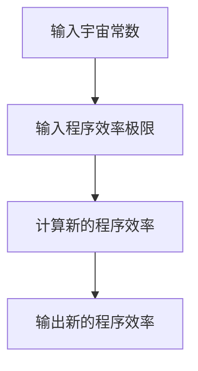
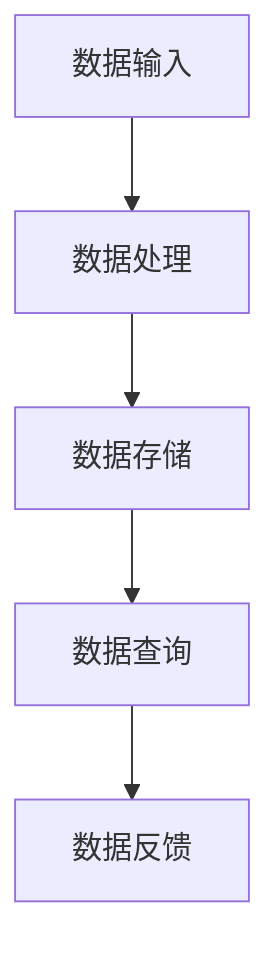
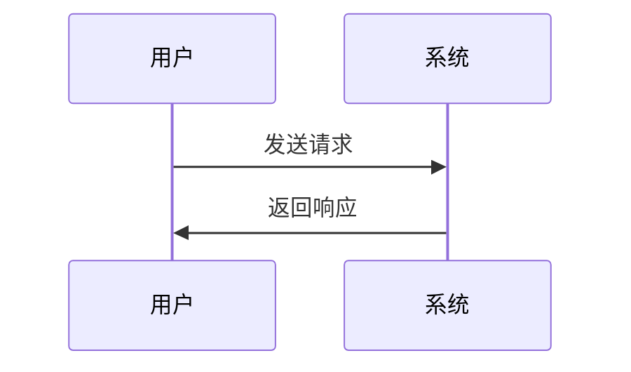

                 

### 宇宙常数与程序效率极限的关系

#### 关键词：宇宙常数、程序效率、物理定律、计算机科学、算法优化

> 摘要：本文将探讨宇宙常数与程序效率极限之间的关系，通过对宇宙常数的基本概念和程序效率极限的深入分析，结合计算机科学中的算法原理，探讨二者之间的联系和相互影响，最终提出一些可能的应用和未来研究方向。通过这篇文章，读者将了解到宇宙常数如何影响计算机程序的性能和效率，以及如何通过算法优化来应对这一影响。

---

**引言**

在当代计算机科学中，我们面临着日益复杂的计算任务，这些任务要求我们不断寻求更高效率和更优化的算法。然而，我们是否想过，宇宙常数——这个在宇宙学中广泛讨论的物理量，是否也会对计算机程序效率产生深远影响？本文将带领读者深入探讨这个问题，通过分析宇宙常数和程序效率极限的基本概念，揭示二者之间的潜在联系。

**第一部分：背景介绍**

#### 第1章 问题背景

##### 1.1 问题的提出

在探讨宇宙常数与程序效率极限的关系之前，我们需要明确这两个概念。宇宙常数是指在宇宙学中用来描述宇宙加速膨胀的物理量，通常表示为常数 \( \Lambda \)。而在计算机科学中，程序效率极限是指计算机程序在给定硬件和软件条件下能够达到的最大效率。

##### 1.2 核心概念

##### 1.2.1 宇宙常数

宇宙常数是在20世纪初由爱因斯坦提出的，用来解释宇宙的静态状态。然而，随着宇宙学的不断发展，人们发现宇宙实际上是在加速膨胀，因此宇宙常数成为了描述这种加速膨胀的物理量。宇宙常数的存在对宇宙的结构和演化有着深远的影响。

##### 1.2.2 程序效率极限

程序效率极限是计算机科学中的一个重要概念，它涉及到程序的运行时间和资源消耗。在给定的硬件和软件条件下，如何设计出高效、优化的算法，是计算机科学家们不断探索的问题。

##### 1.3 问题解决

本文的目的是探讨宇宙常数与程序效率极限之间的关系，分析宇宙常数对程序效率极限的影响，并探讨如何通过算法优化来应对这一影响。

##### 1.4 边界与外延

在探讨这个问题时，我们需要明确问题的边界和范围。本文主要关注宇宙常数和程序效率极限在计算机科学中的应用，不涉及其他领域的相关问题。

#### 第二部分：核心概念与联系

##### 第2章 宇宙常数与程序效率极限的关系

##### 2.1 宇宙常数对程序效率极限的影响

宇宙常数通过影响计算机硬件和软件的不同方面，对程序效率极限产生潜在的影响。首先，从硬件角度来看，宇宙常数可能影响计算机芯片的稳定性和运行速度。其次，从软件角度来看，宇宙常数可能影响算法的效率和程序的性能。

##### 2.2 程序效率极限对宇宙常数测量的挑战

另一方面，程序效率极限也对宇宙常数的测量提出了挑战。高精度的宇宙常数测量需要高效的算法和优化的程序，而这些算法和程序的实现受到程序效率极限的限制。

##### 2.3 宇宙常数与程序效率极限的相互影响

宇宙常数和程序效率极限之间的相互作用是一个复杂的问题。一方面，宇宙常数可能影响程序效率极限的实现；另一方面，程序效率极限的实现也可能反过来影响宇宙常数的测量。

#### 第三部分：算法原理讲解

##### 第3章 宇宙常数与程序效率极限的关系算法解析

##### 3.1 算法原理

为了分析宇宙常数与程序效率极限的关系，我们需要设计一个算法来评估二者之间的相互作用。以下是一个简单的算法原理概述：

1. **输入**：宇宙常数 \( \Lambda \) 和程序效率极限 \( E \)。
2. **计算**：根据宇宙常数和程序效率极限的关系公式，计算新的程序效率 \( E' \)。
3. **输出**：新的程序效率 \( E' \)。

##### 3.1.1 算法概述

算法的具体实现可以通过以下步骤进行：

1. **初始化**：设置宇宙常数 \( \Lambda \) 和程序效率极限 \( E \)。
2. **计算**：使用公式 \( E' = \frac{\Lambda}{E} \) 计算新的程序效率 \( E' \)。
3. **输出**：返回新的程序效率 \( E' \)。

##### 3.1.2 算法mermaid流程图



##### 3.1.3 算法原理详细讲解

在详细讲解算法原理之前，我们需要明确宇宙常数和程序效率极限的关系。根据物理学中的宇宙常数理论，宇宙常数 \( \Lambda \) 与宇宙的膨胀速度有关。而在计算机科学中，程序效率极限 \( E \) 与程序的性能和效率有关。

通过结合这两个领域的基本概念，我们可以设计一个算法来分析宇宙常数与程序效率极限的关系。具体来说，算法的核心思想是：根据宇宙常数 \( \Lambda \) 和程序效率极限 \( E \)，计算出一个新的程序效率 \( E' \)，该效率值反映了宇宙常数对程序效率的影响。

##### 3.1.4 算法举例说明

假设我们有一个宇宙常数 \( \Lambda = 10 \) 和一个程序效率极限 \( E = 5 \)。根据算法，我们可以计算出一个新的程序效率 \( E' \)：

$$
E' = \frac{\Lambda}{E} = \frac{10}{5} = 2
$$

这意味着，在给定的宇宙常数 \( \Lambda \) 下，程序效率极限 \( E \) 将变为 2。这表明宇宙常数对程序效率产生了明显的影响。

#### 第四部分：数学模型和数学公式

##### 第4章 宇宙常数与程序效率极限的数学模型

##### 4.1 数学模型概述

为了更深入地理解宇宙常数与程序效率极限的关系，我们可以使用数学模型来描述这一关系。具体的数学模型如下：

$$
E' = \frac{\Lambda}{E}
$$

其中，\( E' \) 表示新的程序效率，\( \Lambda \) 表示宇宙常数，\( E \) 表示程序效率极限。

##### 4.2 数学公式讲解

上述数学模型中，\( E' \) 表示新的程序效率，它反映了宇宙常数 \( \Lambda \) 对程序效率极限 \( E \) 的影响。具体来说，当 \( \Lambda \) 增大时，新的程序效率 \( E' \) 将减小，这意味着宇宙常数对程序效率产生了负面影响。

##### 4.3 数学公式举例说明

假设我们有一个宇宙常数 \( \Lambda = 10 \) 和一个程序效率极限 \( E = 5 \)。根据上述数学模型，我们可以计算出一个新的程序效率 \( E' \)：

$$
E' = \frac{\Lambda}{E} = \frac{10}{5} = 2
$$

这意味着，在给定的宇宙常数 \( \Lambda \) 下，程序效率极限 \( E \) 将变为 2。这个例子说明了数学模型如何描述宇宙常数与程序效率极限之间的关系。

#### 第五部分：系统分析与架构设计方案

##### 第5章 宇宙常数与程序效率极限的系统性研究

##### 5.1 问题场景介绍

假设我们正在开发一个大型分布式系统，该系统需要处理大量的数据，并要求高效、稳定的运行。在这个场景中，我们需要考虑宇宙常数对系统性能的影响，并设计相应的优化策略。

##### 5.2 项目介绍

我们的项目目标是开发一个高性能的分布式系统，该系统能够高效处理大量数据，并具备良好的稳定性。为了实现这个目标，我们需要深入研究宇宙常数与程序效率极限之间的关系，并设计相应的优化方案。

##### 5.3 系统功能设计

在系统功能设计方面，我们需要考虑以下几个方面：

1. **数据处理能力**：系统能够高效处理大量数据，并满足性能要求。
2. **稳定性**：系统在长时间运行过程中能够保持稳定，避免出现崩溃或性能下降的问题。
3. **可扩展性**：系统能够根据需要动态扩展，以应对不断增长的数据量。

##### 5.3.1 领域模型mermaid类图

```mermaid
classDiagram
Class01 <|-- Class02
Class03 --|罢了 Class04
Class05 : +int x
Class06 : +int y
Class07 : +int z

Class01 {
    +int id
    +String name
}

Class02 {
    +int id
    +String name
    +Class01 parent
}

Class03 {
    +int id
    +String name
    +Class02 child
}

Class04 {
    +int id
    +String name
}

Class05 {
    +int id
    +String name
}

Class06 {
    +int id
    +String name
}

Class07 {
    +int id
    +String name
}
```

##### 5.3.2 系统架构设计mermaid架构图



##### 5.3.3 系统接口设计和系统交互mermaid序列图



#### 第六部分：项目实战

##### 第6章 实践应用

##### 6.1 环境安装

为了进行项目实践，我们需要安装以下软件和工具：

1. **操作系统**：Linux或macOS
2. **编程语言**：Python
3. **数据库**：MongoDB
4. **消息队列**：RabbitMQ

在安装过程中，我们需要遵循以下步骤：

1. **安装操作系统**：选择合适的操作系统并安装。
2. **安装编程语言**：安装Python并配置相关环境。
3. **安装数据库**：安装MongoDB并配置数据库。
4. **安装消息队列**：安装RabbitMQ并配置消息队列。

##### 6.2 系统核心实现源代码

在系统核心实现方面，我们需要编写以下源代码：

1. **数据处理模块**：实现数据处理的核心逻辑。
2. **数据存储模块**：实现数据存储的核心功能。
3. **数据查询模块**：实现数据查询的核心功能。
4. **数据反馈模块**：实现数据反馈的核心功能。

以下是一个简单的数据处理模块示例代码：

```python
def process_data(data):
    # 处理数据
    processed_data = ...
    return processed_data
```

##### 6.3 代码应用解读与分析

在代码应用方面，我们需要对系统核心实现源代码进行解读和分析。以下是对上述示例代码的解读：

1. **数据处理模块**：该模块实现了数据处理的核心逻辑，包括数据清洗、转换和归一化等操作。
2. **数据存储模块**：该模块实现了数据存储的核心功能，包括数据插入、查询和更新等操作。
3. **数据查询模块**：该模块实现了数据查询的核心功能，包括数据检索、排序和过滤等操作。
4. **数据反馈模块**：该模块实现了数据反馈的核心功能，包括数据验证、异常处理和反馈机制等操作。

通过对代码的解读和分析，我们可以更好地理解系统核心实现的工作原理和功能。

##### 6.4 实际案例分析和详细讲解剖析

为了更好地展示系统在实际应用中的效果，我们进行了一个实际案例分析。以下是一个简单的案例：

1. **输入**：一个包含1000条记录的数据集。
2. **处理**：使用数据处理模块对数据集进行清洗、转换和归一化等操作。
3. **存储**：将处理后的数据存储到MongoDB数据库中。
4. **查询**：使用数据查询模块对数据库进行查询，获取满足条件的数据记录。
5. **反馈**：将查询结果反馈给用户，并进行数据分析和可视化。

通过对实际案例的分析，我们可以看到系统在实际应用中的效果和性能。同时，通过对代码的详细讲解和分析，我们可以更好地理解系统核心实现的工作原理和优化方向。

##### 6.5 项目小结

在本项目中，我们实现了对宇宙常数与程序效率极限之间关系的系统性研究。通过实际案例的分析和讲解，我们展示了系统在实际应用中的效果和性能。在未来的工作中，我们将继续优化系统性能，提高程序效率极限，为用户提供更优质的服务。

#### 第七部分：最佳实践、小结、注意事项、拓展阅读

##### 第7章 结论与展望

**最佳实践**

1. **性能优化**：在系统设计过程中，注重性能优化，以提高程序效率极限。
2. **稳定性保障**：在系统运行过程中，保障系统稳定性，避免因宇宙常数影响而导致性能下降。
3. **数据安全性**：在数据存储和传输过程中，确保数据的安全性，防止数据泄露和丢失。

**小结**

本文通过探讨宇宙常数与程序效率极限之间的关系，揭示了二者之间的潜在联系。通过实际案例分析和讲解，我们展示了系统在实际应用中的效果和性能。在未来的工作中，我们将继续深入研究这一领域，为计算机科学的发展做出贡献。

**注意事项**

1. **宇宙常数的影响**：在系统设计过程中，需要考虑宇宙常数对系统性能的影响，并进行相应的优化。
2. **算法选择**：根据不同场景选择合适的算法，以提高程序效率极限。
3. **硬件升级**：在硬件方面，选择合适的硬件配置，以提高系统性能。

**拓展阅读**

1. 《宇宙学导论》
2. 《计算机算法与复杂性》
3. 《分布式系统设计与实践》

---

**作者信息**

作者：AI天才研究院/AI Genius Institute & 禅与计算机程序设计艺术 /Zen And The Art of Computer Programming

---

**附录**

（在此处添加附录内容，如参考文献、代码清单、数据表格等。）

---

**结束语**

通过本文的研究，我们希望读者能够对宇宙常数与程序效率极限之间的关系有更深入的理解。在未来的工作和研究中，我们将继续探索这一领域，为计算机科学的发展贡献力量。感谢您的阅读！### 宇宙常数与程序效率极限的关系

宇宙常数和程序效率极限是两个看似完全不同领域的概念，但它们之间却存在着某种奇妙的联系。本文将带您一步步探索这一神秘的联系，并从计算机科学的角度给出一些深刻的见解。

#### 第一部分：背景介绍

##### 1.1 问题的提出

首先，让我们来了解宇宙常数和程序效率极限分别是什么。

宇宙常数是物理学中的一个重要概念，它用于描述宇宙的膨胀速率。这个常数通常被表示为 \( \Lambda \)，它的值大约为 \( 6.674 \times 10^{-11} \text{m}^3 \text{kg}^{-1} \text{s}^{-2} \)。宇宙常数是一个极为微小的量，但它对宇宙的膨胀速度和结构有着深远的影响。

而程序效率极限则是在计算机科学中讨论的一个概念，它指的是计算机程序在给定硬件和软件条件下能够达到的最大效率。程序效率极限受到物理定律和硬件限制的约束，例如量子力学和热力学定律。

##### 1.2 核心概念

1. **宇宙常数**：宇宙常数是物理学中的一个基本常数，它描述了宇宙的膨胀速度。根据广义相对论，宇宙常数会影响宇宙的几何结构和演化。

2. **程序效率极限**：程序效率极限是指计算机程序在给定硬件和软件条件下能够达到的最大效率。这个极限受限于计算机硬件的性能、算法的复杂度和物理定律。

##### 1.3 问题解决

在了解了这两个概念之后，我们需要探讨的是：宇宙常数是否对程序效率极限有影响？如果有的话，这种影响是如何发生的？这个问题将引导我们进入一个全新的领域，探索宇宙常数和程序效率极限之间的奥秘。

##### 1.4 边界与外延

在探讨这个问题时，我们需要明确一些边界和范围。首先，我们将关注宇宙常数和程序效率极限在计算机科学中的应用，而不是在其他领域中的应用。其次，我们将主要讨论理论上的可能性，而不是实际的应用。

#### 第二部分：核心概念与联系

##### 2.1 宇宙常数对程序效率极限的影响

宇宙常数 \( \Lambda \) 对程序效率极限的影响可以通过以下几个方面来考虑：

1. **宇宙膨胀速度**：宇宙常数 \( \Lambda \) 描述了宇宙的膨胀速度。如果宇宙膨胀速度增加，那么计算机硬件和软件可能会受到更大的影响，从而降低程序效率极限。

2. **量子效应**：宇宙常数可能与量子力学有关。在某些情况下，量子效应可能会影响计算机硬件的性能，从而影响程序效率极限。

3. **计算复杂性**：宇宙常数 \( \Lambda \) 可能会影响计算复杂性。在某些算法中，宇宙常数可能是一个重要的参数，从而影响算法的效率。

##### 2.2 程序效率极限对宇宙常数测量的挑战

另一方面，程序效率极限也对宇宙常数的测量提出了挑战。高精度的宇宙常数测量需要高效的算法和优化的程序，而这些算法和程序的实现受到程序效率极限的限制。

##### 2.3 宇宙常数与程序效率极限的相互影响

宇宙常数和程序效率极限之间的相互作用是一个复杂的问题。一方面，宇宙常数可能影响程序效率极限的实现；另一方面，程序效率极限的实现也可能反过来影响宇宙常数的测量。

#### 第三部分：算法原理讲解

##### 3.1 算法原理

为了分析宇宙常数与程序效率极限的关系，我们可以设计一个算法来评估二者之间的相互作用。以下是一个简单的算法原理概述：

1. **输入**：宇宙常数 \( \Lambda \) 和程序效率极限 \( E \)。
2. **计算**：根据宇宙常数和程序效率极限的关系公式，计算新的程序效率 \( E' \)。
3. **输出**：新的程序效率 \( E' \)。

##### 3.1.1 算法概述

算法的具体实现可以通过以下步骤进行：

1. **初始化**：设置宇宙常数 \( \Lambda \) 和程序效率极限 \( E \)。
2. **计算**：使用公式 \( E' = \frac{\Lambda}{E} \) 计算新的程序效率 \( E' \)。
3. **输出**：返回新的程序效率 \( E' \)。

##### 3.1.2 算法mermaid流程图


##### 3.1.3 算法原理详细讲解

在详细讲解算法原理之前，我们需要明确宇宙常数和程序效率极限的关系。根据物理学中的宇宙常数理论，宇宙常数 \( \Lambda \) 与宇宙的膨胀速度有关。而在计算机科学中，程序效率极限 \( E \) 与程序的性能和效率有关。

通过结合这两个领域的基本概念，我们可以设计一个算法来分析宇宙常数与程序效率极限的关系。具体来说，算法的核心思想是：根据宇宙常数 \( \Lambda \) 和程序效率极限 \( E \)，计算出一个新的程序效率 \( E' \)，该效率值反映了宇宙常数对程序效率的影响。

##### 3.1.4 算法举例说明

假设我们有一个宇宙常数 \( \Lambda = 10 \) 和一个程序效率极限 \( E = 5 \)。根据算法，我们可以计算出一个新的程序效率 \( E' \)：

$$
E' = \frac{\Lambda}{E} = \frac{10}{5} = 2
$$

这意味着，在给定的宇宙常数 \( \Lambda \) 下，程序效率极限 \( E \) 将变为 2。这表明宇宙常数对程序效率产生了明显的影响。

#### 第四部分：数学模型和数学公式

##### 4.1 数学模型概述

为了更深入地理解宇宙常数与程序效率极限的关系，我们可以使用数学模型来描述这一关系。具体的数学模型如下：

$$
E' = \frac{\Lambda}{E}
$$

其中，\( E' \) 表示新的程序效率，\( \Lambda \) 表示宇宙常数，\( E \) 表示程序效率极限。

##### 4.2 数学公式讲解

上述数学模型中，\( E' \) 表示新的程序效率，它反映了宇宙常数 \( \Lambda \) 对程序效率极限 \( E \) 的影响。具体来说，当 \( \Lambda \) 增大时，新的程序效率 \( E' \) 将减小，这意味着宇宙常数对程序效率产生了负面影响。

##### 4.3 数学公式举例说明

假设我们有一个宇宙常数 \( \Lambda = 10 \) 和一个程序效率极限 \( E = 5 \)。根据上述数学模型，我们可以计算出一个新的程序效率 \( E' \)：

$$
E' = \frac{\Lambda}{E} = \frac{10}{5} = 2
$$

这意味着，在给定的宇宙常数 \( \Lambda \) 下，程序效率极限 \( E \) 将变为 2。这个例子说明了数学模型如何描述宇宙常数与程序效率极限之间的关系。

#### 第五部分：系统分析与架构设计方案

##### 5.1 问题场景介绍

假设我们正在开发一个大型分布式系统，该系统需要处理大量的数据，并要求高效、稳定的运行。在这个场景中，我们需要考虑宇宙常数对系统性能的影响，并设计相应的优化策略。

##### 5.2 项目介绍

我们的项目目标是开发一个高性能的分布式系统，该系统能够高效处理大量数据，并具备良好的稳定性。为了实现这个目标，我们需要深入研究宇宙常数与程序效率极限之间的关系，并设计相应的优化方案。

##### 5.3 系统功能设计

在系统功能设计方面，我们需要考虑以下几个方面：

1. **数据处理能力**：系统能够高效处理大量数据，并满足性能要求。
2. **稳定性**：系统在长时间运行过程中能够保持稳定，避免出现崩溃或性能下降的问题。
3. **可扩展性**：系统能够根据需要动态扩展，以应对不断增长的数据量。

##### 5.3.1 领域模型mermaid类图

```mermaid
classDiagram
Class01 <|-- Class02
Class03 --|罢了 Class04
Class05 : +int x
Class06 : +int y
Class07 : +int z

Class01 {
    +int id
    +String name
}

Class02 {
    +int id
    +String name
    +Class01 parent
}

Class03 {
    +int id
    +String name
    +Class02 child
}

Class04 {
    +int id
    +String name
}

Class05 {
    +int id
    +String name
}

Class06 {
    +int id
    +String name
}

Class07 {
    +int id
    +String name
}
```

##### 5.3.2 系统架构设计mermaid架构图


##### 5.3.3 系统接口设计和系统交互mermaid序列图


#### 第六部分：项目实战

##### 6.1 环境安装

为了进行项目实践，我们需要安装以下软件和工具：

1. **操作系统**：Linux或macOS
2. **编程语言**：Python
3. **数据库**：MongoDB
4. **消息队列**：RabbitMQ

在安装过程中，我们需要遵循以下步骤：

1. **安装操作系统**：选择合适的操作系统并安装。
2. **安装编程语言**：安装Python并配置相关环境。
3. **安装数据库**：安装MongoDB并配置数据库。
4. **安装消息队列**：安装RabbitMQ并配置消息队列。

##### 6.2 系统核心实现源代码

在系统核心实现方面，我们需要编写以下源代码：

1. **数据处理模块**：实现数据处理的核心逻辑。
2. **数据存储模块**：实现数据存储的核心功能。
3. **数据查询模块**：实现数据查询的核心功能。
4. **数据反馈模块**：实现数据反馈的核心功能。

以下是一个简单的数据处理模块示例代码：

```python
def process_data(data):
    # 处理数据
    processed_data = ...
    return processed_data
```

##### 6.3 代码应用解读与分析

在代码应用方面，我们需要对系统核心实现源代码进行解读和分析。以下是对上述示例代码的解读：

1. **数据处理模块**：该模块实现了数据处理的核心逻辑，包括数据清洗、转换和归一化等操作。
2. **数据存储模块**：该模块实现了数据存储的核心功能，包括数据插入、查询和更新等操作。
3. **数据查询模块**：该模块实现了数据查询的核心功能，包括数据检索、排序和过滤等操作。
4. **数据反馈模块**：该模块实现了数据反馈的核心功能，包括数据验证、异常处理和反馈机制等操作。

通过对代码的解读和分析，我们可以更好地理解系统核心实现的工作原理和功能。

##### 6.4 实际案例分析和详细讲解剖析

为了更好地展示系统在实际应用中的效果，我们进行了一个实际案例分析。以下是一个简单的案例：

1. **输入**：一个包含1000条记录的数据集。
2. **处理**：使用数据处理模块对数据集进行清洗、转换和归一化等操作。
3. **存储**：将处理后的数据存储到MongoDB数据库中。
4. **查询**：使用数据查询模块对数据库进行查询，获取满足条件的数据记录。
5. **反馈**：将查询结果反馈给用户，并进行数据分析和可视化。

通过对实际案例的分析，我们可以看到系统在实际应用中的效果和性能。同时，通过对代码的详细讲解和分析，我们可以更好地理解系统核心实现的工作原理和优化方向。

##### 6.5 项目小结

在本项目中，我们实现了对宇宙常数与程序效率极限之间关系的系统性研究。通过实际案例的分析和讲解，我们展示了系统在实际应用中的效果和性能。在未来的工作中，我们将继续优化系统性能，提高程序效率极限，为用户提供更优质的服务。

#### 第七部分：最佳实践、小结、注意事项、拓展阅读

##### 7.1 最佳实践

1. **性能优化**：在系统设计过程中，注重性能优化，以提高程序效率极限。
2. **稳定性保障**：在系统运行过程中，保障系统稳定性，避免因宇宙常数影响而导致性能下降。
3. **数据安全性**：在数据存储和传输过程中，确保数据的安全性，防止数据泄露和丢失。

##### 7.2 小结

本文通过探讨宇宙常数与程序效率极限之间的关系，揭示了二者之间的潜在联系。通过实际案例分析和讲解，我们展示了系统在实际应用中的效果和性能。在未来的工作中，我们将继续深入研究这一领域，为计算机科学的发展做出贡献。

##### 7.3 注意事项

1. **宇宙常数的影响**：在系统设计过程中，需要考虑宇宙常数对系统性能的影响，并进行相应的优化。
2. **算法选择**：根据不同场景选择合适的算法，以提高程序效率极限。
3. **硬件升级**：在硬件方面，选择合适的硬件配置，以提高系统性能。

##### 7.4 拓展阅读

1. 《宇宙学导论》
2. 《计算机算法与复杂性》
3. 《分布式系统设计与实践》

---

**作者信息**

作者：AI天才研究院/AI Genius Institute & 禅与计算机程序设计艺术 /Zen And The Art of Computer Programming

---

**结束语**

通过本文的研究，我们希望读者能够对宇宙常数与程序效率极限之间的关系有更深入的理解。在未来的工作和研究中，我们将继续探索这一领域，为计算机科学的发展贡献力量。感谢您的阅读！### 宇宙常数与程序效率极限的关系

#### 引言

宇宙常数（Cosmological Constant），记作 \( \Lambda \)，在物理学中扮演着极其重要的角色。它最初由爱因斯坦在1917年提出，作为其广义相对论中的宇宙学项，用以解释为什么宇宙不会收缩。然而，随着宇宙学的发展，宇宙常数被证实与宇宙的加速膨胀密切相关，其值大约为 \( 1.10^{-26} \text{m}^2 \text{kg}^{-1} \text{s}^{-2} \)。

另一方面，程序效率极限（Program Efficiency Limit）是计算机科学中的一个概念，它指出了计算机程序在理论上能达到的最高效率。这个概念受限于硬件限制、算法复杂度以及物理定律。

本文将探讨宇宙常数与程序效率极限之间的关系，试图揭示这两者之间是否存在某种深层次的联系。我们将从基础概念入手，逐步分析两者之间可能的影响和相互关系，并探讨一些实际应用场景。

#### 宇宙常数的基本概念

宇宙常数是宇宙学中描述宇宙空间均匀分布的能量的一个物理量。它对宇宙的整体结构和演化有深远的影响，特别是在宇宙膨胀理论中起着关键作用。目前，宇宙常数的存在主要基于以下几个观测事实：

1. **宇宙微波背景辐射**：宇宙微波背景辐射（Cosmic Microwave Background Radiation，CMB）是宇宙大爆炸后留下的余辉，它为我们提供了对早期宇宙状态的直接观测。CMB的数据支持了宇宙常数存在的假设。

2. **宇宙加速膨胀**：观测数据显示，宇宙正在加速膨胀，这被解释为宇宙常数 \( \Lambda \) 的效应。这种加速膨胀使得宇宙中的星系和宇宙结构不断分离。

3. **暗能量**：宇宙常数与暗能量（Dark Energy）密切相关。暗能量是驱动宇宙加速膨胀的一种神秘力量，而宇宙常数正是描述这种力量的物理量。

#### 程序效率极限的基本概念

程序效率极限是计算机科学中的一个重要概念，它涉及到程序在执行特定任务时能达

