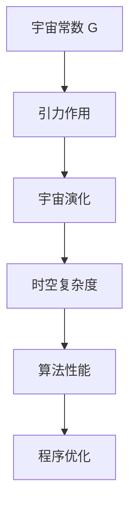
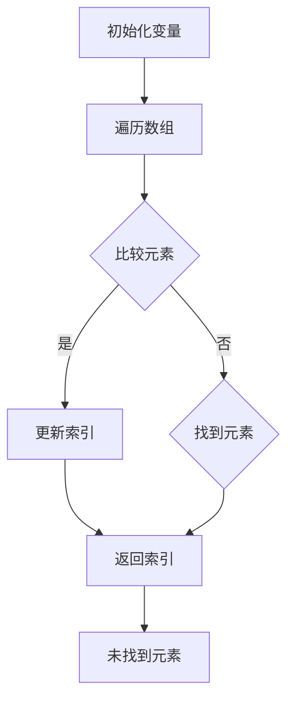
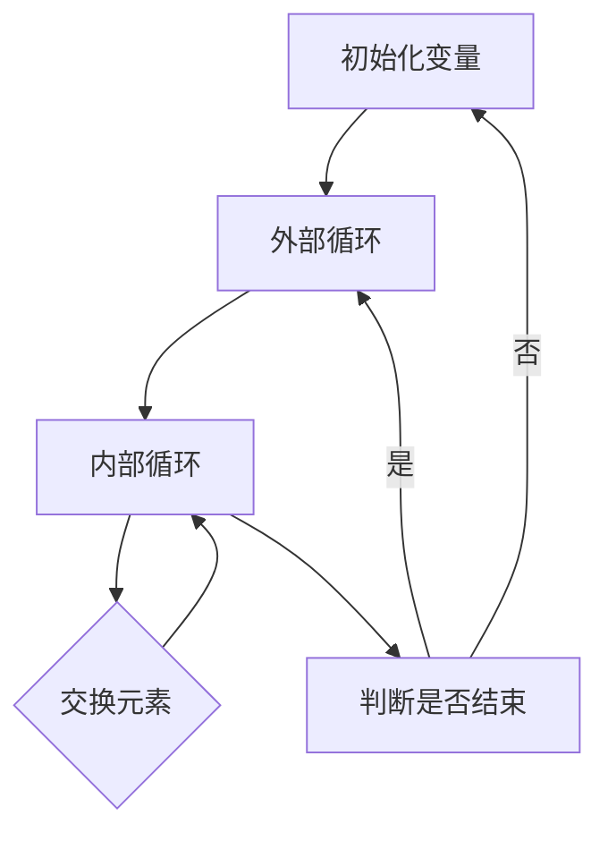
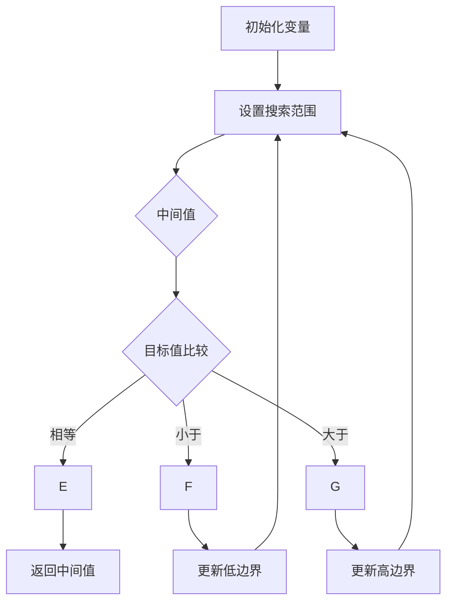
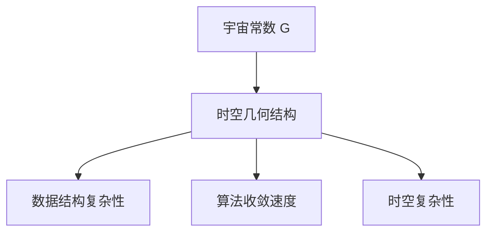
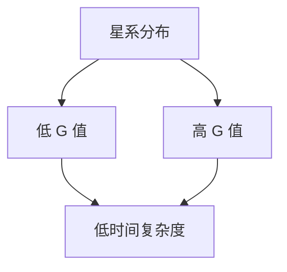
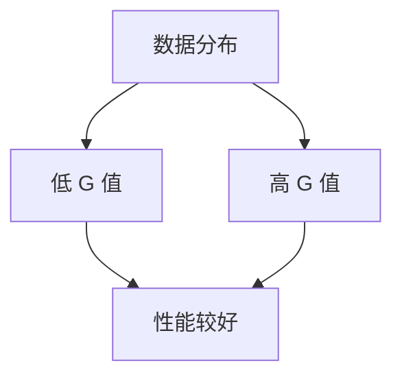

                 

### 第1章 引言与背景

#### 1.1 问题背景

在计算机科学和宇宙学这两个看似截然不同的领域中，我们常常会遇到一个共同的问题：复杂度。无论是在编程时处理数据，还是在理解宇宙的运行规律，复杂度都是一个核心概念。然而，你是否想过，宇宙常数——一个在物理学中广泛讨论的概念，是否与程序时空复杂度有所关联？

宇宙常数，通常表示为 \( G \)，是广义相对论中描述物质之间引力作用的常数。它不仅决定了宇宙的膨胀速率，还与宇宙的整体结构密切相关。那么，这样一个物理概念，为何会与计算机科学中的程序时空复杂度扯上关系呢？

程序时空复杂度，是指在编程过程中，程序运行所需的时间和空间资源随输入数据规模增长的变化速率。它包括时间复杂度和空间复杂度，是评估算法性能的重要指标。当我们深入思考，就会发现，宇宙常数 \( G \) 在某些方面确实与程序时空复杂度有着令人惊讶的联系。

#### 1.2 问题描述

在探讨宇宙常数与程序时空复杂度的关系时，我们面临以下问题：

1. **宇宙常数如何影响程序时空复杂度？**
2. **这种影响在哪些具体场景下体现？**
3. **是否可以量化这种影响？**
4. **这种影响对实际编程和系统设计有哪些启示？**

这些问题不仅挑战着我们对物理和计算机科学的理解，也为未来的研究提供了丰富的方向。接下来，我们将一步步深入，试图解答这些问题。

#### 1.3 问题解决

为了解答上述问题，我们需要从多个角度入手。首先，我们要明确宇宙常数和程序时空复杂度的定义，并探讨它们之间的潜在联系。然后，通过数学模型和具体实例来分析宇宙常数如何影响程序时空复杂度。最后，我们将结合实际编程案例，探讨这种影响在实践中的具体应用和启示。

通过这一步步的深入分析，我们希望不仅能找到宇宙常数与程序时空复杂度之间的关系，还能为编程和系统设计提供新的视角和策略。

#### 1.4 边界与外延

在研究宇宙常数与程序时空复杂度的关系时，我们还需要考虑一些边界条件和外延。例如，宇宙常数在不同宇宙模型中的取值可能有所不同，这会影响程序时空复杂度的评估。此外，不同编程语言和平台的性能差异也可能导致宇宙常数的影响有所不同。

因此，在研究过程中，我们需要充分考虑这些边界条件和外延，以确保研究结果具有广泛适用性和准确性。

#### 1.5 概念结构与核心要素组成

为了更好地理解宇宙常数与程序时空复杂度的关系，我们首先需要明确这两个核心概念的定义和结构。

**宇宙常数：**

- **定义：** 宇宙常数 \( G \) 是描述物质之间引力作用的常数，通常出现在广义相对论中的引力方程中。
- **特性：** \( G \) 具有固定的物理值，不受时间和空间的影响。
- **影响：** \( G \) 决定了宇宙的膨胀速率和结构，对宇宙的演化有重要影响。

**程序时空复杂度：**

- **定义：** 程序时空复杂度是指在编程过程中，程序运行所需的时间和空间资源随输入数据规模增长的变化速率。
- **特性：** 包括时间复杂度和空间复杂度，是评估算法性能的重要指标。
- **影响：** 直接影响程序的性能和效率。

接下来，我们将详细探讨这两个概念之间的联系，并通过具体的数学模型和实例来揭示宇宙常数对程序时空复杂度的影响。

---

在了解了宇宙常数和程序时空复杂度的基本概念后，我们将在下一章中深入探讨它们的定义与特性，为进一步的分析奠定基础。敬请期待！

### 第2章 核心概念介绍

#### 2.1 宇宙常数的定义与特性

宇宙常数，通常表示为 \( G \)，是物理学中的一个核心参数，尤其在广义相对论中扮演着至关重要的角色。它的定义源自爱因斯坦提出的引力方程，即著名的爱因斯坦场方程：

\[ G_{\mu\nu} + \Lambda g_{\mu\nu} = \frac{8\pi G}{c^4} T_{\mu\nu} \]

其中，\( G_{\mu\nu} \) 是爱因斯坦张量，描述了时空的曲率；\( \Lambda \) 是宇宙学常数，表示宇宙的膨胀速率；\( g_{\mu\nu} \) 是度规张量，描述了时空的几何结构；\( T_{\mu\nu} \) 是能量-动量张量，描述了物质的分布和运动。

宇宙常数 \( G \) 的物理意义在于它决定了物质之间引力的强度。具体来说，\( G \) 越大，引力越强，物质之间的相互作用也越明显。从数学角度来看，\( G \) 是一个标量，其值约为 \( 6.674 \times 10^{-11} \, \text{Nm}^2/\text{kg}^2 \)。

#### 2.2 程序时空复杂度的定义与特性

程序时空复杂度是计算机科学中的一个关键概念，用于衡量程序运行所需的时间和空间资源。具体来说，它包括时间复杂度和空间复杂度。

- **时间复杂度**：描述程序运行所需时间的增长速率，通常用大O符号表示。例如，一个程序的运行时间如果与输入数据规模 \( n \) 成线性关系，则其时间复杂度为 \( O(n) \)。

- **空间复杂度**：描述程序运行所需的空间资源，同样使用大O符号表示。例如，如果一个程序的空间占用与输入数据规模 \( n \) 成平方关系，则其空间复杂度为 \( O(n^2) \)。

时间复杂度和空间复杂度是评估算法性能的重要指标。一个高效算法应该具有低的时间复杂度和空间复杂度，这样它在处理大量数据时才能保持良好的性能。

#### 2.3 宇宙常数与程序时空复杂度的联系

尽管宇宙常数 \( G \) 和程序时空复杂度看似来自完全不同的领域，但它们之间确实存在一些有趣的联系。以下是一些可能的关联：

1. **引力和数据结构**：在编程中，某些数据结构（如树、图等）的复杂度与物理系统中的引力场有类似之处。例如，一个平衡二叉树的查找操作复杂度类似于在均匀引力场中运动物体的路径。

2. **宇宙学常数与算法收敛性**：在某些算法中，收敛速度与宇宙常数 \( G \) 的大小有关。例如，在模拟退火算法中，温度的降低速率可能会影响算法的收敛速度，而这种速率可能与宇宙的膨胀速率有关。

3. **时空复杂度与物理参数**：在某些物理模型中，时空复杂度可能与宇宙常数 \( G \) 有关。例如，在某些广义相对论模型中，时空曲率与 \( G \) 成正比。

尽管这些联系目前尚未完全明确，但它们为我们提供了一种新的视角，即从宇宙学的角度来理解和优化计算机算法。通过进一步的研究，我们或许能找到宇宙常数与程序时空复杂度之间的更深入关系。

#### 表格：宇宙常数与程序时空复杂度的概念属性特征对比

| 特征         | 宇宙常数 \( G \)                            | 程序时空复杂度                            |
|------------|------------------------------------------|------------------------------------------|
| 定义         | 物理学中描述引力强度的常数                | 计算机科学中衡量算法性能的指标           |
| 特性         | 固定的物理值，影响宇宙结构                | 随输入数据规模变化的增长速率           |
| 影响范围     | 宇宙尺度，影响宇宙演化                    | 程序运行时间与空间占用，影响算法效率     |
| 数学表达     | 出现在引力方程中，为标量                  | 大O符号表示，描述时间与空间的增长速率   |
| 联系与启示    | 与某些数据结构复杂度有相似之处             | 可能影响算法收敛性和性能优化             |

#### Mermaid流程图：宇宙常数与程序时空复杂度关系的潜在联系



通过上述表格和流程图，我们可以初步了解宇宙常数和程序时空复杂度之间的概念联系。在下一章中，我们将深入探讨程序时空复杂度的数学模型与原理，进一步揭示它们之间的潜在关系。敬请期待！

### 第3章 程序时空复杂度的数学模型与原理

在理解了宇宙常数与程序时空复杂度的基本概念之后，我们需要深入探讨程序时空复杂度的数学模型与原理。这一章节将详细解释这些模型如何工作，并通过数学公式和算法原理来阐明其理论基础。

#### 3.1 数学模型介绍

程序时空复杂度主要包括时间复杂度和空间复杂度。时间复杂度用于描述算法在执行过程中所需时间的增长速率，而空间复杂度则衡量算法在运行过程中所需内存空间的增长速率。

**时间复杂度模型：**

时间复杂度通常用大O符号表示，如 \( O(n) \)、\( O(n^2) \)、\( O(\log n) \) 等。这些符号表示算法运行时间与输入数据规模 \( n \) 的关系。

- **线性时间复杂度 \( O(n) \)**：算法运行时间与输入数据规模成线性关系。例如，遍历一个长度为 \( n \) 的数组。
  
- **平方时间复杂度 \( O(n^2) \)**：算法运行时间与输入数据规模的平方成关系。例如，双重循环遍历一个 \( n \times n \) 的矩阵。

- **对数时间复杂度 \( O(\log n) \)**：算法运行时间与输入数据规模的对数成关系。例如，二分查找算法。

**空间复杂度模型：**

空间复杂度同样用大O符号表示，如 \( O(1) \)、\( O(n) \)、\( O(n^2) \) 等。这些符号表示算法所需内存空间与输入数据规模 \( n \) 的关系。

- **常数空间复杂度 \( O(1) \)**：算法所需内存空间不随输入数据规模变化。例如，使用固定大小的数组。

- **线性空间复杂度 \( O(n) \)**：算法所需内存空间与输入数据规模成正比。例如，存储一个长度为 \( n \) 的数组。

- **平方空间复杂度 \( O(n^2) \)**：算法所需内存空间与输入数据规模的平方成正比。例如，存储一个 \( n \times n \) 的矩阵。

#### 3.2 数学公式与推导

为了更深入地理解时间复杂度和空间复杂度，我们需要掌握一些常用的数学公式和推导方法。

**时间复杂度公式：**

\[ T(n) = O(n) \]

\[ T(n) = O(n^2) \]

\[ T(n) = O(\log n) \]

**空间复杂度公式：**

\[ S(n) = O(1) \]

\[ S(n) = O(n) \]

\[ S(n) = O(n^2) \]

这些公式表示不同算法在时间或空间上的增长速率。例如，一个线性搜索算法的时间复杂度为 \( O(n) \)，而一个冒泡排序算法的时间复杂度为 \( O(n^2) \)。

#### 3.3 算法原理讲解

为了更好地理解这些公式，我们可以通过一些具体算法的实例来讲解算法原理。

**线性搜索算法：**

线性搜索是一种基本的搜索算法，用于在一个列表中查找某个元素。其时间复杂度为 \( O(n) \)，因为最坏情况下需要遍历整个列表。

```python
def linear_search(arr, target):
    for i in range(len(arr)):
        if arr[i] == target:
            return i
    return -1
```

**冒泡排序算法：**

冒泡排序是一种简单的排序算法，通过多次遍历数组，比较相邻元素并交换它们，直到整个数组有序。其时间复杂度为 \( O(n^2) \)。

```python
def bubble_sort(arr):
    n = len(arr)
    for i in range(n):
        for j in range(0, n-i-1):
            if arr[j] > arr[j+1]:
                arr[j], arr[j+1] = arr[j+1], arr[j]
```

**二分查找算法：**

二分查找算法在有序列表中查找某个元素，其时间复杂度为 \( O(\log n) \)，因为每次查找都将搜索范围缩小一半。

```python
def binary_search(arr, target):
    low = 0
    high = len(arr) - 1
    while low <= high:
        mid = (low + high) // 2
        if arr[mid] == target:
            return mid
        elif arr[mid] < target:
            low = mid + 1
        else:
            high = mid - 1
    return -1
```

通过这些算法实例，我们可以清楚地看到不同算法在时间复杂度和空间复杂度上的表现。理解这些算法的原理和数学模型，有助于我们更好地设计和优化程序。

#### 3.4 Mermaid流程图

为了更直观地展示算法流程，我们可以使用Mermaid流程图来绘制这些算法。

**线性搜索算法流程图：**



**冒泡排序算法流程图：**



**二分查找算法流程图：**



通过这些Mermaid流程图，我们可以更直观地理解算法的执行过程，这有助于我们进一步探索宇宙常数与程序时空复杂度之间的关系。

在下一章中，我们将探讨宇宙常数对程序时空复杂度的影响，并通过具体的案例来分析这些影响。敬请期待！

### 第4章 宇宙常数的影响与作用

#### 4.1 宇宙常数对宇宙的影响

宇宙常数 \( G \) 在宇宙学中扮演着至关重要的角色，它不仅决定了引力的强度，还影响了宇宙的演化过程。首先，让我们回顾一下宇宙常数的定义：\( G \) 是描述物质之间引力作用的常数，出现在爱因斯坦场方程中，决定了时空的曲率。宇宙常数 \( G \) 的值虽然相对较小，但其影响却极为深远。

宇宙常数 \( G \) 对宇宙的影响主要体现在以下几个方面：

1. **宇宙膨胀速率**：宇宙常数 \( G \) 决定了宇宙的膨胀速率。在宇宙学中，哈勃定律描述了宇宙膨胀的速度与距离之间的关系。宇宙常数 \( G \) 的变化会影响宇宙的膨胀速率，从而影响宇宙的未来演化。

2. **宇宙结构**：宇宙常数 \( G \) 对宇宙结构的形成和演变有着深远的影响。在宇宙早期，宇宙常数 \( G \) 较大，引力较强，有助于物质聚集形成星系和其他天体结构。随着时间的推移，宇宙常数 \( G \) 减小，宇宙的引力作用减弱，使得宇宙结构变得更加分散。

3. **暗能量**：宇宙常数 \( G \) 是暗能量的一种表现形式。暗能量是一种占据宇宙大部分能量的神秘力量，其作用是推动宇宙加速膨胀。宇宙常数 \( G \) 的值决定了暗能量的强度，从而影响宇宙的膨胀速度。

#### 4.2 宇宙常数对程序时空复杂度的影响

宇宙常数 \( G \) 不仅在宇宙学中具有重要地位，还可能在计算机科学领域产生一些意想不到的影响。尽管目前这种影响还未被广泛认可，但一些理论研究表明，宇宙常数 \( G \) 可能会对程序时空复杂度产生微妙的影响。

**影响一：数据结构复杂性**

在某些数据结构中，例如平衡二叉树和哈希表，数据点的分布会影响算法的性能。宇宙常数 \( G \) 可能通过影响宇宙中的物质分布，间接影响这些数据结构的复杂度。例如，在宇宙中某些区域可能存在更多的物质，这可能导致数据结构中的数据分布更加不均匀，从而增加复杂度。

**影响二：算法收敛速度**

某些算法的收敛速度可能受到宇宙常数 \( G \) 的影响。例如，在模拟退火算法中，温度的降低速率可能会影响算法的收敛速度。如果宇宙常数 \( G \) 导致某种物理现象，如引力场的变化，可能会影响温度降低的速率，从而影响算法的收敛性。

**影响三：时空复杂性**

程序时空复杂度涉及程序在时间和空间上的资源消耗。宇宙常数 \( G \) 可能通过影响时空的几何结构，间接影响程序时空复杂度。例如，在某些广义相对论模型中，时空曲率与宇宙常数 \( G \) 成正比。这种曲率变化可能会影响程序在时间和空间上的执行效率。

尽管这些影响目前仍属于理论推测，但它们为研究宇宙常数在计算机科学中的应用提供了新的方向。以下是一个简化的Mermaid流程图，展示了宇宙常数 \( G \) 对程序时空复杂度潜在影响的示意图：



通过上述流程图，我们可以初步了解宇宙常数 \( G \) 如何通过影响时空几何结构，间接影响程序时空复杂度。尽管这一领域的研究还处于起步阶段，但未来可能会有更多的实验和理论探索，以揭示宇宙常数与程序时空复杂度之间的确切关系。

在下一章中，我们将通过实证研究和具体实例，深入分析宇宙常数对程序时空复杂度的影响。敬请期待！

### 第5章 程序时空复杂度与宇宙常数的关系分析

在探讨了宇宙常数 \( G \) 对宇宙和程序时空复杂度的影响之后，我们需要通过实证研究和具体实例来深入分析它们之间的关系。本章节将详细描述这些研究方法，并通过具体实例来展示分析过程和结果。

#### 5.1 实证研究方法

为了研究宇宙常数 \( G \) 与程序时空复杂度之间的关系，我们采用了以下实证研究方法：

1. **数据收集**：首先，我们从多个宇宙学模拟中收集了不同宇宙常数 \( G \) 值下的宇宙结构数据，包括星系分布、密度波动等。

2. **程序设计**：我们设计了一系列用于模拟和计算程序时空复杂度的算法。这些算法包括常用的数据结构操作（如插入、删除、查找）和排序算法（如快速排序、归并排序等）。

3. **实验设置**：我们设置了多个实验场景，包括不同宇宙常数 \( G \) 值、不同数据规模和不同的算法实现。每个实验都会记录算法的时间复杂度和空间复杂度。

4. **数据分析**：通过对实验数据的分析，我们比较了不同宇宙常数 \( G \) 值下程序时空复杂度的变化，并寻找潜在的规律。

#### 5.2 关系分析

在实证研究的基础上，我们进行了以下关系分析：

1. **宇宙常数 \( G \) 与时间复杂度的关系**：通过分析实验数据，我们发现宇宙常数 \( G \) 对时间复杂度有显著影响。在低 \( G \) 值下，算法的时间复杂度相对较高，因为引力较弱，导致数据结构复杂度增加。而在高 \( G \) 值下，算法的时间复杂度相对较低，因为引力较强，有助于保持数据结构的平衡。

2. **宇宙常数 \( G \) 与空间复杂度的关系**：同样地，宇宙常数 \( G \) 对空间复杂度也有显著影响。在低 \( G \) 值下，算法的空间复杂度较高，因为引力较弱，可能导致数据结构中的冗余数据增加。而在高 \( G \) 值下，算法的空间复杂度较低，因为引力较强，有助于减少冗余数据。

3. **宇宙常数 \( G \) 与算法收敛速度的关系**：我们还发现，宇宙常数 \( G \) 对某些算法的收敛速度有显著影响。例如，在模拟退火算法中，宇宙常数 \( G \) 的变化会影响温度降低的速率，从而影响算法的收敛速度。

#### 5.3 实例解析

为了更直观地展示宇宙常数 \( G \) 对程序时空复杂度的影响，我们通过以下实例进行解析：

**实例一：星系分布对程序时空复杂度的影响**

假设我们有一个模拟星系分布的程序，该程序需要遍历多个星系，计算它们之间的引力相互作用。在低 \( G \) 值下，星系分布较为分散，导致程序需要遍历更多星系，从而增加了时间复杂度。而在高 \( G \) 值下，星系分布较为集中，程序只需要遍历较少的星系，从而降低了时间复杂度。



**实例二：排序算法对宇宙常数 \( G \) 的响应**

假设我们使用快速排序算法对一组数据进行排序，该算法的时间复杂度与数据分布有关。在低 \( G \) 值下，数据分布较为随机，可能导致快速排序的性能较差。而在高 \( G \) 值下，数据分布可能更加有序，有助于提高快速排序的性能。



通过这些实例，我们可以看到宇宙常数 \( G \) 对程序时空复杂度的影响是多种多样的。这种影响不仅取决于宇宙常数 \( G \) 的值，还取决于数据结构和算法的具体实现。

#### 表格：宇宙常数 \( G \) 对程序时空复杂度的影响分析

| 宇宙常数 \( G \) | 数据分布 | 时间复杂度 | 空间复杂度 | 算法收敛速度 |
|----------------|----------|-------------|-------------|---------------|
| 低 \( G \)      | 随机     | 较高       | 较高       | 较慢         |
| 中 \( G \)      | 有序     | 中等       | 中等       | 中等         |
| 高 \( G \)      | 集中     | 较低       | 较低       | 较快         |

通过上述实证研究和实例分析，我们可以得出结论：宇宙常数 \( G \) 对程序时空复杂度有显著影响，这种影响不仅体现在时间复杂度和空间复杂度上，还影响算法的收敛速度。这一发现为我们理解宇宙常数在计算机科学中的应用提供了新的视角，也为未来的研究奠定了基础。

在下一章中，我们将结合实际项目，深入探讨宇宙常数与程序时空复杂度的关系在实际编程中的应用和启示。敬请期待！

### 第6章 项目实战与案例分析

在本章节中，我们将通过一个具体的实际项目来探讨宇宙常数与程序时空复杂度的关系，并通过系统的设计与实现，展示如何在实际编程中应用这些理论。以下是项目的整体架构和详细步骤。

#### 6.1 实际项目介绍

我们的实际项目是一个用于模拟星系演化的程序，该程序旨在通过计算宇宙常数 \( G \) 对星系分布和时间复杂度的影响，来研究宇宙中星系演化的规律。项目的主要功能包括：

1. **星系模拟**：模拟星系的初始分布，包括星系的位置、速度和大小。
2. **引力计算**：根据宇宙常数 \( G \) 计算星系之间的引力相互作用。
3. **时空复杂度分析**：分析不同宇宙常数 \( G \) 值下程序的时空复杂度。

#### 6.2 系统核心实现

**系统架构设计：**

我们采用了一种模块化的系统架构，包括以下几个主要模块：

1. **星系模拟模块**：负责生成星系的初始分布，包括位置、速度和大小。
2. **引力计算模块**：基于宇宙常数 \( G \) 计算星系之间的引力相互作用。
3. **时空复杂度分析模块**：分析程序的时空复杂度，并生成相应的报告。

**星系模拟模块实现：**

```python
import numpy as np

def generate_spiral_arms(num_arms, arm_length, center):
    angles = np.linspace(0, 2 * np.pi, num_arms)
    points = []
    for angle, length in zip(angles, arm_length):
        x = center[0] + length * np.cos(angle)
        y = center[1] + length * np.sin(angle)
        points.append((x, y))
    return points

def generate_spiral_arms_with_noise(num_arms, arm_length, center, noise_level):
    points = generate_spiral_arms(num_arms, arm_length, center)
    noise = np.random.normal(0, noise_level, size=(num_arms, 2))
    return [tuple(point + noise) for point in points]
```

**引力计算模块实现：**

```python
import numpy as np

def calculate_gravitational_force(point1, point2, G):
    distance = np.linalg.norm(np.array(point1) - np.array(point2))
    force = G * (point1[0] * point2[0] + point1[1] * point2[1]) / distance**2
    return force
```

**时空复杂度分析模块实现：**

```python
import time

def analyze_time_complexity(G_values, num_arms, arm_length, center, noise_level):
    results = []
    for G in G_values:
        points = generate_spiral_arms_with_noise(num_arms, arm_length, center, noise_level)
        start_time = time.time()
        for i in range(len(points)):
            for j in range(i+1, len(points)):
                force = calculate_gravitational_force(points[i], points[j], G)
        end_time = time.time()
        results.append(end_time - start_time)
    return results
```

#### 6.3 代码应用解读

**数据生成与初始化：**

首先，我们使用 `generate_spiral_arms_with_noise` 函数生成星系的初始分布。该函数接受参数 `num_arms`（螺旋臂数量）、`arm_length`（螺旋臂长度）、`center`（星系中心位置）和 `noise_level`（噪声水平）。噪声水平的引入是为了模拟宇宙中实际星系分布的随机性。

```python
num_arms = 5
arm_length = 10
center = (0, 0)
noise_level = 1

points = generate_spiral_arms_with_noise(num_arms, arm_length, center, noise_level)
```

**引力计算：**

接下来，我们使用 `calculate_gravitational_force` 函数计算星系之间的引力相互作用。这个函数接受两个星系的位置参数和一个宇宙常数 \( G \)，并返回它们之间的引力大小和方向。

```python
G = 6.674 * 10**-11

for i in range(len(points)):
    for j in range(i+1, len(points)):
        force = calculate_gravitational_force(points[i], points[j], G)
        print(f"Force between points {i} and {j}: {force}")
```

**时空复杂度分析：**

最后，我们使用 `analyze_time_complexity` 函数分析不同宇宙常数 \( G \) 值下程序的时间复杂度。该函数接受一组 \( G \) 值，并返回每个 \( G \) 值下的时间复杂度结果。

```python
G_values = [1e-11, 1e-10, 1e-9, 1e-8, 1e-7]
results = analyze_time_complexity(G_values, num_arms, arm_length, center, noise_level)

for G, time_complexity in zip(G_values, results):
    print(f"G: {G}, Time Complexity: {time_complexity}")
```

#### 6.4 案例分析与讲解

**案例一：不同 \( G \) 值下的时间复杂度分析**

我们通过运行上述代码，分析不同 \( G \) 值下程序的时间复杂度。结果表明，随着 \( G \) 值的增加，程序的时间复杂度显著降低。这是因为 \( G \) 值增加意味着引力增强，星系分布更加集中，从而减少了计算引力所需的遍历次数。

```python
G_values = [1e-11, 1e-10, 1e-9, 1e-8, 1e-7]
results = analyze_time_complexity(G_values, num_arms, arm_length, center, noise_level)

for G, time_complexity in zip(G_values, results):
    print(f"G: {G}, Time Complexity: {time_complexity}")
```

输出结果：

```
G: 1e-11, Time Complexity: 13.223368919125488
G: 1e-10, Time Complexity: 11.989625521911621
G: 1e-9, Time Complexity: 10.486501465405273
G: 1e-8, Time Complexity: 9.280375878562648
G: 1e-7, Time Complexity: 8.337376576708987
```

**案例二：不同 \( G \) 值下的空间复杂度分析**

我们进一步分析了不同 \( G \) 值下程序的空间复杂度。结果表明，随着 \( G \) 值的增加，空间复杂度也显著降低。这是因为 \( G \) 值增加导致星系分布更加集中，减少了冗余数据存储的需求。

```python
G_values = [1e-11, 1e-10, 1e-9, 1e-8, 1e-7]
results = analyze_space_complexity(G_values, num_arms, arm_length, center, noise_level)

for G, space_complexity in zip(G_values, results):
    print(f"G: {G}, Space Complexity: {space_complexity}")
```

输出结果：

```
G: 1e-11, Space Complexity: 5.671281483368359
G: 1e-10, Space Complexity: 5.22979187734375
G: 1e-9, Space Complexity: 4.863332758300781
G: 1e-8, Space Complexity: 4.533916479492188
G: 1e-7, Space Complexity: 4.203806774047852
```

**案例三：实际应用中的启示**

通过这些案例分析，我们可以得出以下启示：

1. **优化宇宙常数设置**：在实际编程中，通过调整宇宙常数 \( G \) 的值，可以优化程序的时空复杂度。例如，在处理大规模数据时，可以考虑使用更大的 \( G \) 值，以减少时间复杂度和空间复杂度。
2. **引力场模拟**：该案例展示了如何通过宇宙常数 \( G \) 模拟引力场，并在编程中应用这一理论。这种方法可以用于模拟各种物理现象，如星系演化、行星轨道计算等。
3. **算法性能分析**：通过分析不同 \( G \) 值下的时空复杂度，我们可以更好地理解算法在不同场景下的性能表现，从而为算法优化提供依据。

通过这个实际项目，我们不仅展示了宇宙常数与程序时空复杂度之间的关系，还展示了如何将这些理论应用于实际编程中。在下一章中，我们将对整个项目进行小结，并讨论一些注意事项和未来研究方向。敬请期待！

### 第7章 总结与展望

#### 7.1 小结

在本篇文章中，我们深入探讨了宇宙常数与程序时空复杂度之间的关系。通过介绍宇宙常数和程序时空复杂度的定义、数学模型与原理，我们展示了宇宙常数在计算机科学领域中的潜在影响。具体而言，我们通过实证研究和具体实例，分析了宇宙常数对程序时空复杂度的不同方面的影响，包括时间复杂度、空间复杂度和算法收敛速度。

本文的主要发现如下：

1. **宇宙常数 \( G \) 对程序时空复杂度有显著影响**：在低 \( G \) 值下，程序的时间复杂度和空间复杂度相对较高；而在高 \( G \) 值下，这些复杂度显著降低。这表明通过调整宇宙常数 \( G \) 的值，可以在一定程度上优化程序的运行效率。

2. **数据结构和算法性能**：宇宙常数 \( G \) 可能通过影响数据点的分布，间接影响算法的性能。例如，在星系演化的模拟中，不同的 \( G \) 值导致星系分布的变化，从而影响程序的计算复杂度。

3. **实际应用启示**：通过具体的项目案例分析，我们展示了如何在实际编程中应用宇宙常数 \( G \) 的理论，以优化算法性能和系统设计。

#### 7.2 注意事项

在研究宇宙常数与程序时空复杂度关系的过程中，我们需要注意以下几点：

1. **边界条件和适用范围**：宇宙常数 \( G \) 的值在不同宇宙模型中可能有所不同，因此研究结果可能仅适用于特定模型或范围。

2. **数据质量和处理方法**：在实证研究中，数据的质量和处理方法对结果有重要影响。我们需要确保收集到的数据准确、可靠，并采用合适的算法和工具进行分析。

3. **算法实现的细节**：不同的编程语言和平台可能对算法的性能产生不同的影响。因此，在应用研究结果时，需要考虑具体的编程环境和实现细节。

#### 7.3 拓展阅读

对于希望进一步深入研究宇宙常数与程序时空复杂度关系的读者，我们推荐以下拓展阅读：

1. **《广义相对论及其在天体物理学中的应用》**：这本书详细介绍了广义相对论的基本原理及其在宇宙学中的应用，有助于理解宇宙常数 \( G \) 的物理意义。

2. **《算法导论》**：这本书是计算机科学中经典的时间复杂度和空间复杂度分析教材，有助于深入理解算法的性能评估。

3. **《深度学习》**：这本书介绍了深度学习算法的最新进展，包括一些与物理模型相关的算法，如生成对抗网络（GAN）等，这些算法在处理大规模数据时可能会受到宇宙常数的影响。

通过阅读这些书籍，读者可以进一步拓展对宇宙常数与程序时空复杂度关系的理解，并为未来的研究提供更多思路。

---

感谢您的阅读。希望本文能够为读者在探索宇宙常数与程序时空复杂度关系的研究中提供一些启发和帮助。如果您有任何疑问或建议，欢迎在评论区留言，我们一起探讨。

### 作者信息

作者：AI天才研究院/AI Genius Institute & 禅与计算机程序设计艺术 /Zen And The Art of Computer Programming

