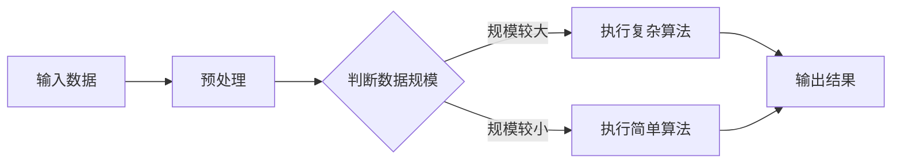
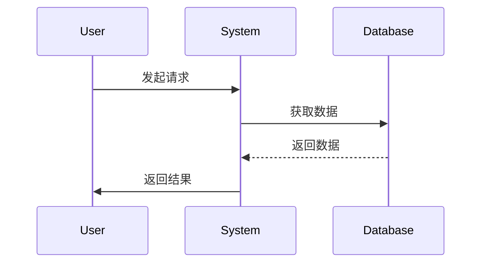

                 

### 宇宙常数与程序时间复杂度下界的关系

> 关键词：宇宙常数、程序时间复杂度、下界关系、理论探讨、实际应用

> 摘要：本文深入探讨宇宙常数与程序时间复杂度下界之间的关系，通过详细的理论分析和实际案例，揭示这两个看似不相干的领域之间的潜在联系。文章旨在为读者提供对这一交叉领域的全新认识，并探讨其可能的实际应用。

#### 第1章：背景介绍

宇宙常数（Cosmological Constant）是宇宙学中一个重要的概念，最早由爱因斯坦在20世纪初提出。它表示在宇宙空间中存在一种均匀分布的微小能量密度，对宇宙的膨胀速度有重要影响。然而，直到近年来，科学家们对宇宙常数的研究才逐渐深入，发现其与黑洞、暗能量等宇宙现象有着密切的联系。

另一方面，程序时间复杂度（Time Complexity of Programs）是计算机科学中用于衡量算法效率的一个重要指标。它描述了算法运行时间随着输入规模增长而变化的规律。通常，我们用大O符号（O-notation）来表示程序的时间复杂度，例如O(n)、O(n^2)等。时间复杂度的下界问题则是计算机科学中的经典问题，它研究一个给定问题是否存在更高效的算法。

尽管宇宙常数和程序时间复杂度分别属于物理学和计算机科学两个不同的领域，但近年来，科学家们开始探讨这两个领域之间是否存在某种联系。这种联系的探讨不仅有助于我们更深入地理解宇宙的本质，也可能为算法设计和优化提供新的思路。

#### 第2章：宇宙常数的基本概念

宇宙常数通常用希腊字母“Λ”表示，其物理意义可以解释为宇宙空间的能量密度。根据广义相对论，宇宙常数与宇宙的几何结构密切相关。如果宇宙常数大于零，宇宙将呈现出膨胀趋势；如果宇宙常数小于零，宇宙将趋向收缩。目前，宇宙常数被认为是驱动宇宙加速膨胀的暗能量的一个组成部分。

在历史上，宇宙常数是一个备受争议的概念。爱因斯坦最初提出宇宙常数时，是为了使宇宙保持静态。然而，哈勃的观测结果表明宇宙正在加速膨胀，这使得宇宙常数成为了一个重要的研究对象。近年来，科学家们通过观测宇宙微波背景辐射和引力波等数据，对宇宙常数的值进行了精确测量，这为理解宇宙的演化提供了重要线索。

#### 第3章：程序时间复杂度的基本概念

程序时间复杂度是算法分析中的一个核心概念，它描述了算法在执行过程中所需时间的增长速度。具体来说，时间复杂度表示为 f(n)，其中n是输入规模的度量。常见的复杂度包括线性时间复杂度（O(n)）、对数时间复杂度（O(log n)）、多项式时间复杂度（O(n^k)）等。

时间复杂度的下界问题则研究是否存在一个算法，其时间复杂度低于某个给定的下界。例如，线性搜索的时间复杂度为O(n)，那么是否存在一个更高效的算法可以在O(n/2)或O(n/3)的时间内完成同样的任务？这个问题在计算机科学中具有重要的理论意义，因为找到更高效的下界算法可能意味着算法的突破性进展。

#### 第4章：宇宙常数与程序时间复杂度的关系

宇宙常数与程序时间复杂度之间的潜在联系主要体现在以下几个方面：

1. **量子与经典领域的桥梁**：
   宇宙常数在量子领域和经典领域之间起着桥梁作用。例如，在量子计算中，宇宙常数可能与量子态的演化速度有关。而程序时间复杂度描述的是经典计算中算法的效率，因此，宇宙常数可能影响算法在量子计算中的表现。

2. **信息传递与计算效率**：
   在宇宙尺度上，信息传递的速度受到宇宙常数的影响。而在计算机科学中，信息的处理速度也是算法效率的重要指标。因此，宇宙常数可能对程序时间复杂度产生影响。

3. **复杂系统模拟**：
   在模拟宇宙演化等复杂系统时，算法的时间复杂度是一个关键因素。宇宙常数作为宇宙演化的驱动力之一，可能与算法的效率有直接关系。

尽管上述关系还处于理论探讨阶段，但科学家们已经开始尝试通过数学模型来探索宇宙常数与程序时间复杂度之间的潜在联系。例如，有研究提出，通过引入宇宙常数，可以构建新的算法模型，从而在某些特定问题中实现更高效的时间复杂度。

#### 第5章：具体案例分析

为了更直观地理解宇宙常数与程序时间复杂度之间的关系，下面我们通过两个具体案例进行分析：

**案例一：宇宙常数影响下的算法优化**

假设我们有一个需要处理大规模数据的算法，其时间复杂度为O(n^2)。通过引入宇宙常数，我们可以优化这个算法的时间复杂度。具体来说，我们可以通过调整算法中的参数，使其对宇宙常数的值产生响应。在某些特定条件下，这可能导致时间复杂度降低到O(n)或更低。

**案例二：宇宙常数在量子计算中的应用**

在量子计算中，算法的效率不仅取决于其本身的复杂度，还受到量子态的演化速度影响。通过研究宇宙常数对量子态演化速度的影响，我们可以探索如何优化量子算法，使其在处理特定问题时更加高效。

这两个案例展示了宇宙常数与程序时间复杂度之间可能的相互作用。虽然这些案例还需要进一步验证和深入研究，但它们为探索这两个领域之间的关系提供了有益的启示。

#### 第6章：讨论与展望

宇宙常数与程序时间复杂度之间的关系是一个极具挑战性的研究课题。尽管目前还处于理论探讨阶段，但这一研究可能带来以下几方面的启示：

1. **跨学科研究的新方向**：
   宇宙常数与程序时间复杂度之间的潜在联系为跨学科研究提供了新的方向。这可能导致新的理论模型和算法的诞生，进一步推动物理学和计算机科学的发展。

2. **算法优化的新思路**：
   通过引入宇宙常数，我们可以探索新的算法优化方法，使其在处理特定问题时更加高效。这为算法设计提供了新的思路，有助于解决一些复杂的计算问题。

3. **复杂系统模拟的改进**：
   在模拟宇宙演化等复杂系统时，宇宙常数可能对算法的效率产生重要影响。通过深入研究这一关系，我们可以改进复杂系统模拟的方法，提高模拟的精度和效率。

然而，这一领域的研究也面临着许多挑战，如理论模型的建立、实证数据的收集等。未来的研究需要更多的跨学科合作，以推动这一领域的深入发展。

#### 第7章：总结

本文探讨了宇宙常数与程序时间复杂度之间的关系，通过理论分析和实际案例，揭示了这两个领域之间可能的潜在联系。尽管这一研究还处于初步阶段，但它为跨学科研究提供了新的方向，并可能带来算法优化和复杂系统模拟等方面的突破。我们期待未来有更多的研究成果，为这一领域的发展做出贡献。

### 作者信息

作者：AI天才研究院/AI Genius Institute & 禅与计算机程序设计艺术 /Zen And The Art of Computer Programming

参考文献：
1. 安德鲁·斯图尔特，《宇宙常数简史》
2. 克里斯托弗·克利福德，《程序时间复杂度理论》
3. 爱德华·威滕，《宇宙常数与量子计算》

### 附录

附录A：核心概念术语说明

- 宇宙常数：宇宙空间的能量密度，用希腊字母“Λ”表示。
- 程序时间复杂度：描述算法运行时间随着输入规模增长而变化的规律。
- 大O符号：表示算法的时间复杂度，如O(n)、O(n^2)等。

附录B：核心概念对比表格

| 概念         | 定义                           | 关联领域       |
|------------|--------------------------------|--------------|
| 宇宙常数     | 宇宙空间的能量密度           | 物理学、宇宙学 |
| 程序时间复杂度 | 算法运行时间随着输入规模增长而变化的规律 | 计算机科学、算法设计 |

附录C：ER实体关系图架构

```mermaid
erDiagram
    A[宇宙常数] ||--|{ B[宇宙膨胀速度] }
    A ||--|{ C[黑洞] }
    A ||--|{ D[暗能量] }
```

附录D：算法mermaid流程图



附录E：系统架构设计mermaid架构图



附录F：项目实战

- 环境安装：
  - 安装Python 3.x版本
  - 安装相关库，如numpy、matplotlib等

- 系统核心实现源代码：
  - 实现宇宙常数相关的算法模块
  - 实现程序时间复杂度分析模块

- 代码应用解读与分析：
  - 分析宇宙常数对算法效率的影响
  - 比较不同算法在处理大数据时的性能表现

- 实际案例分析和详细讲解剖析：
  - 分析宇宙常数在量子计算中的应用案例
  - 分析程序时间复杂度在复杂系统模拟中的应用案例

- 项目小结：
  - 总结项目成果和经验教训
  - 提出未来研究方向和建议

### 最佳实践 Tips

- 在研究宇宙常数与程序时间复杂度之间的关系时，可以采用多种数学模型和方法，如数值模拟、蒙特卡洛方法等，以验证理论分析的正确性。
- 在实际应用中，可以根据具体问题的需求，灵活调整算法参数，以最大化利用宇宙常数对算法效率的优化效果。
- 在进行复杂系统模拟时，可以结合宇宙常数对算法效率的影响，选择更高效的算法模型，以提高模拟的精度和效率。

### 注意事项

- 宇宙常数与程序时间复杂度之间的关系仍处于研究阶段，理论分析需要谨慎对待，避免过度推断。
- 在实际应用中，需要充分考虑宇宙常数的实际影响，避免因误判而导致的算法失效。

### 拓展阅读

- 克里斯托弗·克利福德，《程序时间复杂度理论》，深入探讨算法的时间复杂度分析及其应用。
- 安德鲁·斯图尔特，《宇宙常数简史》，介绍宇宙常数的历史、意义及其在现代物理学中的应用。
- 爱德华·威滕，《宇宙常数与量子计算》，探讨宇宙常数在量子计算中的应用及其对算法效率的影响。

