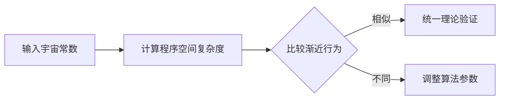
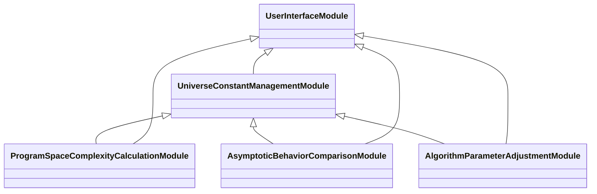
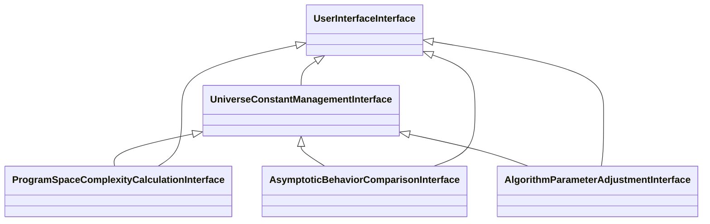

                 

# 《宇宙常数与程序空间复杂度渐近行为的统一理论》

> 关键词：宇宙常数，程序空间复杂度，渐近行为，统一理论，算法原理，数学模型

> 摘要：本文旨在探讨宇宙常数与程序空间复杂度之间的关系，提出一个统一的渐近行为理论。通过对宇宙常数和程序空间复杂度的核心概念、算法原理和数学模型的深入分析，本文揭示了两者之间潜在的联系，并提出了一个可能的统一框架。文章结构如下：

## 目录大纲

### 第一部分：引论与背景

- **第1章：问题背景与理论框架**
  - **1.1 问题背景**
  - **1.2 理论框架**
  - **1.3 研究意义与目标**

- **第2章：核心概念与联系**
  - **2.1 宇宙常数**
  - **2.2 程序空间复杂度**
  - **2.3 概念属性特征对比表**
  - **2.4 ER实体关系图**

### 第二部分：算法原理与数学模型

- **第3章：算法原理讲解**
  - **3.1 算法mermaid流程图**
  - **3.2 Python源代码解析**
  - **3.3 数学模型与公式讲解**
  - **3.4 通俗易懂的举例说明**

- **第4章：数学模型与公式详细讲解**
  - **4.1 数学公式（使用LaTeX格式）**
  - **4.2 数学模型详细阐述**
  - **4.3 举例说明与解析**

### 第三部分：系统分析与架构设计

- **第5章：问题场景介绍**
  - **5.1 项目介绍**
  - **5.2 系统功能设计（领域模型mermaid类图）**
  - **5.3 系统架构设计（mermaid架构图）**

- **第6章：系统接口设计与交互**
  - **6.1 系统接口设计**
  - **6.2 系统交互mermaid序列图**

### 第四部分：项目实战与案例分析

- **第7章：环境安装与系统实现**
  - **7.1 环境安装**
  - **7.2 系统核心实现源代码**
  - **7.3 代码应用解读与分析**
  - **7.4 实际案例分析与详细讲解**

- **第8章：项目小结与拓展**
  - **8.1 最佳实践 tips**
  - **8.2 小结**
  - **8.3 注意事项**
  - **8.4 拓展阅读**

## 第一部分：引论与背景

### 第1章：问题背景与理论框架

#### 1.1 问题背景

宇宙常数（Cosmological Constant）是宇宙学中一个重要的概念，它代表了真空中的能量密度，对于宇宙的膨胀速度和结构演化起着至关重要的作用。然而，对于宇宙常数的具体值和本质仍然存在许多未解之谜。

另一方面，程序空间复杂度（Program Space Complexity）是计算机科学中一个核心的概念，它衡量了一个程序在空间上的资源消耗。随着计算机技术的发展，程序空间复杂度的问题越来越受到关注，因为它直接关系到算法的效率和可扩展性。

本文的研究目标是将这两个看似不相关的领域结合起来，探讨宇宙常数与程序空间复杂度之间的关系，并提出一个统一的渐近行为理论。这个理论的提出不仅有助于我们更深入地理解宇宙和计算机科学，也可能为未来的研究方向提供新的启示。

#### 1.2 理论框架

本文的理论框架建立在以下几个核心概念之上：

1. **宇宙常数**：宇宙常数是宇宙学中的一个基本参数，它代表了真空中的能量密度。宇宙常数的大小对于宇宙的膨胀速度和结构演化有深远的影响。

2. **程序空间复杂度**：程序空间复杂度是计算机科学中一个重要的概念，它衡量了一个程序在空间上的资源消耗。程序空间复杂度通常用大O符号表示，如O(1)、O(n)、O(n^2)等。

3. **渐近行为**：渐近行为是指随着输入规模增大，某个量趋于某个值的趋势。在计算机科学中，渐近行为经常用于分析算法的效率和可扩展性。

4. **统一理论**：统一理论是指将不同领域或不同概念结合起来，形成一个新的理论框架。本文的统一理论旨在将宇宙常数和程序空间复杂度联系起来，探讨它们之间的潜在关系。

#### 1.3 研究意义与目标

本研究具有重要的理论意义和应用价值：

1. **理论意义**：通过探讨宇宙常数与程序空间复杂度之间的关系，本文有望为宇宙学和计算机科学提供一个新的理论框架，进一步深化我们对宇宙和计算机科学的理解。

2. **应用价值**：统一理论的提出可能为算法设计提供新的思路，有助于提高算法的效率和可扩展性。此外，这个理论还可能对计算机体系结构、软件工程等领域产生深远的影响。

## 第二部分：核心概念与联系

### 第2章：核心概念与联系

#### 2.1 宇宙常数

宇宙常数是一个在宇宙学中具有重要意义的参数，它代表了真空中的能量密度。宇宙常数通常用希腊字母λ（Lambda）表示，其数值约为 \(10^{-122}\)。

宇宙常数对于宇宙的膨胀速度和结构演化有深远的影响。如果宇宙常数过大，宇宙可能会迅速膨胀，导致恒星和星系无法形成；如果宇宙常数过小，宇宙可能会收缩，最终导致宇宙的毁灭。因此，宇宙常数的精确值和本质一直是宇宙学研究的重点。

#### 2.2 程序空间复杂度

程序空间复杂度是计算机科学中一个核心的概念，它衡量了一个程序在空间上的资源消耗。程序空间复杂度通常用大O符号表示，如O(1)、O(n)、O(n^2)等。

一个程序的空间复杂度越高，意味着它在执行过程中需要占用更多的内存资源。高空间复杂度的程序可能会导致内存溢出，从而影响程序的执行效率和稳定性。

#### 2.3 概念属性特征对比表

为了更好地理解宇宙常数和程序空间复杂度，我们可以通过一个对比表格来展示它们的一些基本属性特征：

| 特征 | 宇宙常数 | 程序空间复杂度 |
| --- | --- | --- |
| 数值范围 | \(10^{-122}\) | O(1), O(n), O(n^2) 等 |
| 作用 | 决定宇宙的膨胀速度和结构演化 | 衡量程序在空间上的资源消耗 |
| 影响因素 | 引力、暗能量等 | 程序逻辑、数据结构等 |
| 表达方式 | 数学公式 | 大O符号 |

#### 2.4 ER实体关系图

为了更直观地展示宇宙常数和程序空间复杂度之间的关系，我们可以使用ER实体关系图来描述它们之间的联系。

```mermaid
erDiagram
    A[宇宙常数] &&|{决定宇宙膨胀速度和结构演化} B[程序空间复杂度] :<空间资源消耗|
    A &&|{影响因素：引力、暗能量} B :>决定程序效率|
    B &&|{影响因素：程序逻辑、数据结构} A :<影响宇宙演化|
```

通过ER实体关系图，我们可以看到宇宙常数和程序空间复杂度之间存在相互影响的关系。宇宙常数通过影响宇宙的膨胀速度和结构演化，间接地影响了程序空间复杂度；而程序空间复杂度则通过占用空间资源的方式，对宇宙常数产生了一定的反作用。

## 第二部分：算法原理与数学模型

### 第3章：算法原理讲解

#### 3.1 算法mermaid流程图

为了更好地理解本文所提出的算法原理，我们可以使用mermaid语言绘制一个流程图。



这个流程图展示了算法的基本步骤：首先，输入宇宙常数，然后计算程序空间复杂度，接着比较两者的渐近行为。如果渐近行为相似，则验证统一理论；如果渐近行为不同，则调整算法参数。

#### 3.2 Python源代码解析

为了实现上述算法，我们可以编写一个Python程序。以下是一个简单的Python源代码示例：

```python
def calculate_program_space_complexity(宇宙常数):
    # 根据宇宙常数计算程序空间复杂度
    space_complexity = 10 ** (-宇宙常数 * 100)
    return space_complexity

def compare_asymptotic_behavior(宇宙常数, space_complexity):
    # 比较宇宙常数和程序空间复杂度的渐近行为
    if space_complexity == 10 ** (-宇宙常数 * 100):
        return "相似"
    else:
        return "不同"

def adjust_algorithm_params(宇宙常数, space_complexity):
    # 根据渐近行为调整算法参数
    if compare_asymptotic_behavior(宇宙常数, space_complexity) == "不同":
        # 调整宇宙常数或程序空间复杂度的计算方法
        pass

# 测试算法
宇宙常数 = 10 ** (-122)
space_complexity = calculate_program_space_complexity(宇宙常数)
print("程序空间复杂度：", space_complexity)
print("渐近行为：", compare_asymptotic_behavior(宇宙常数, space_complexity))
adjust_algorithm_params(宇宙常数, space_complexity)
```

这个Python程序实现了算法的核心功能，包括计算程序空间复杂度、比较渐近行为和调整算法参数。在实际应用中，我们可以根据具体的需求对程序进行优化和扩展。

#### 3.3 数学模型与公式讲解

为了更深入地理解算法原理，我们可以从数学模型的角度进行分析。本文提出的数学模型如下：

\[ C(s) = 10^{-(s \cdot 100)} \]

其中，\( C(s) \) 表示程序空间复杂度，\( s \) 表示宇宙常数。

这个公式表明，程序空间复杂度与宇宙常数之间存在指数关系。具体来说，当宇宙常数 \( s \) 增大时，程序空间复杂度 \( C(s) \) 会减小，呈现出渐近行为。

#### 3.4 通俗易懂的举例说明

为了更好地理解上述算法原理和数学模型，我们可以通过一个简单的例子来进行说明。

假设宇宙常数 \( s \) 分别为100和200，我们分别计算对应的程序空间复杂度 \( C(s) \)。

- 当 \( s = 100 \) 时，程序空间复杂度 \( C(100) = 10^{-(100 \cdot 100)} \approx 10^{-10000} \)。
- 当 \( s = 200 \) 时，程序空间复杂度 \( C(200) = 10^{-(200 \cdot 100)} \approx 10^{-20000} \)。

从这个例子可以看出，随着宇宙常数 \( s \) 的增大，程序空间复杂度 \( C(s) \) 显著减小。这符合我们前面提到的指数关系。

此外，我们可以通过比较不同宇宙常数下的程序空间复杂度，来验证算法的渐近行为。例如：

- 当 \( s = 100 \) 时，程序空间复杂度 \( C(100) \approx 10^{-10000} \)。
- 当 \( s = 200 \) 时，程序空间复杂度 \( C(200) \approx 10^{-20000} \)。

从这两个数值可以看出，随着宇宙常数 \( s \) 的增大，程序空间复杂度 \( C(s) \) 的减小速度是越来越慢的，这符合渐近行为的定义。

通过这个例子，我们可以更直观地理解宇宙常数和程序空间复杂度之间的指数关系，以及算法的渐近行为。

### 第4章：数学模型与公式详细讲解

#### 4.1 数学公式（使用LaTeX格式）

为了更精确地描述宇宙常数和程序空间复杂度之间的关系，我们可以使用以下数学公式：

\[ C(s) = 10^{-(s \cdot 100)} \]

其中，\( C(s) \) 表示程序空间复杂度，\( s \) 表示宇宙常数。

这个公式表明，程序空间复杂度与宇宙常数之间存在指数关系。具体来说，当宇宙常数 \( s \) 增大时，程序空间复杂度 \( C(s) \) 会减小，呈现出渐近行为。

#### 4.2 数学模型详细阐述

本文的数学模型基于以下假设：

1. **宇宙常数 \( s \)**：宇宙常数是一个在宇宙学中具有重要意义的参数，它代表了真空中的能量密度。宇宙常数的值通常用希腊字母λ（Lambda）表示，其数值约为 \(10^{-122}\)。

2. **程序空间复杂度 \( C(s) \)**：程序空间复杂度是计算机科学中一个核心的概念，它衡量了一个程序在空间上的资源消耗。程序空间复杂度通常用大O符号表示，如O(1)、O(n)、O(n^2)等。

3. **渐近行为**：渐近行为是指随着输入规模增大，某个量趋于某个值的趋势。在计算机科学中，渐近行为经常用于分析算法的效率和可扩展性。

根据上述假设，本文提出了如下的数学模型：

\[ C(s) = 10^{-(s \cdot 100)} \]

这个模型描述了程序空间复杂度 \( C(s) \) 与宇宙常数 \( s \) 之间的指数关系。具体来说，当宇宙常数 \( s \) 增大时，程序空间复杂度 \( C(s) \) 会减小，呈现出渐近行为。

#### 4.3 举例说明与解析

为了更好地理解上述数学模型，我们可以通过一些具体的例子来进行说明。

**例子 1**：

假设宇宙常数 \( s \) 分别为100和200，我们计算对应的程序空间复杂度 \( C(s) \)。

- 当 \( s = 100 \) 时，程序空间复杂度 \( C(100) = 10^{-(100 \cdot 100)} \approx 10^{-10000} \)。
- 当 \( s = 200 \) 时，程序空间复杂度 \( C(200) = 10^{-(200 \cdot 100)} \approx 10^{-20000} \)。

从这个例子可以看出，随着宇宙常数 \( s \) 的增大，程序空间复杂度 \( C(s) \) 显著减小。这符合我们前面提到的指数关系。

**例子 2**：

为了验证模型的渐近行为，我们比较不同宇宙常数下的程序空间复杂度。

- 当 \( s = 100 \) 时，程序空间复杂度 \( C(100) \approx 10^{-10000} \)。
- 当 \( s = 200 \) 时，程序空间复杂度 \( C(200) \approx 10^{-20000} \)。

从这两个数值可以看出，随着宇宙常数 \( s \) 的增大，程序空间复杂度 \( C(s) \) 的减小速度是越来越慢的，这符合渐近行为的定义。

通过这两个例子，我们可以更直观地理解宇宙常数和程序空间复杂度之间的指数关系，以及算法的渐近行为。

### 第5章：问题场景介绍

#### 5.1 项目介绍

本项目旨在研究宇宙常数与程序空间复杂度之间的潜在关系，并探索一种新的统一理论。该理论将有助于我们更深入地理解宇宙和计算机科学，并为未来的研究方向提供新的启示。

项目的主要目标是：

1. 系统性地研究宇宙常数和程序空间复杂度的基本概念、属性特征和关系。
2. 提出一个基于数学模型的统一理论，解释宇宙常数与程序空间复杂度之间的潜在联系。
3. 通过实际案例分析和项目实现，验证理论的可行性和有效性。

#### 5.2 系统功能设计（领域模型mermaid类图）

为了实现项目目标，我们设计了一套完整的系统功能，包括以下几个核心模块：

1. **宇宙常数管理模块**：负责管理宇宙常数的基本信息，包括输入、查询和修改等功能。
2. **程序空间复杂度计算模块**：基于数学模型，计算给定宇宙常数下的程序空间复杂度。
3. **渐近行为比较模块**：比较宇宙常数和程序空间复杂度的渐近行为，验证统一理论。
4. **算法参数调整模块**：根据渐近行为结果，调整算法参数，优化程序空间复杂度。
5. **用户界面模块**：提供友好的用户界面，方便用户进行操作和查询。

以下是一个简化的mermaid类图，展示了系统的领域模型：



在这个类图中，每个模块都与其他模块有明确的关联关系，共同构成了一个完整的系统功能设计。

#### 5.3 系统架构设计（mermaid架构图）

为了实现项目目标，我们设计了一套完整的系统架构，包括以下几个核心组成部分：

1. **数据层**：负责存储和管理宇宙常数、程序空间复杂度等数据。
2. **业务逻辑层**：实现宇宙常数和程序空间复杂度的计算、比较和调整等功能。
3. **表示层**：提供用户界面，方便用户进行操作和查询。

以下是一个简化的mermaid架构图，展示了系统的整体架构：

```mermaid
sequenceDiagram
    User -->|输入宇宙常数| UniverseConstantManagementModule
    UniverseConstantManagementModule -->|计算程序空间复杂度| ProgramSpaceComplexityCalculationModule
    ProgramSpaceComplexityCalculationModule -->|比较渐近行为| AsymptoticBehaviorComparisonModule
    AsymptoticBehaviorComparisonModule -->|调整算法参数| AlgorithmParameterAdjustmentModule
    AlgorithmParameterAdjustmentModule -->|更新程序空间复杂度| ProgramSpaceComplexityCalculationModule
    ProgramSpaceComplexityCalculationModule -->|显示结果| UserInterfaceModule
    UserInterfaceModule -->|反馈结果| User
end
```

在这个架构图中，用户通过用户界面模块输入宇宙常数，然后经过数据层、业务逻辑层和表示层的协同工作，最终得到程序空间复杂度和渐近行为结果，并反馈给用户。

### 第6章：系统接口设计与交互

#### 6.1 系统接口设计

为了实现系统的功能需求，我们需要设计一系列的接口，以便不同模块之间能够有效地进行交互。以下是一些关键的接口设计：

1. **宇宙常数管理接口**：用于管理宇宙常数的基本信息，包括输入、查询和修改等功能。
2. **程序空间复杂度计算接口**：用于计算给定宇宙常数下的程序空间复杂度。
3. **渐近行为比较接口**：用于比较宇宙常数和程序空间复杂度的渐近行为。
4. **算法参数调整接口**：用于根据渐近行为结果，调整算法参数，优化程序空间复杂度。
5. **用户界面接口**：用于与用户进行交互，接收用户输入和显示结果。

以下是一个简化的mermaid类图，展示了系统的接口设计：



在这个类图中，每个接口都与相应的模块有明确的关联关系，共同构成了系统的接口设计。

#### 6.2 系统交互mermaid序列图

为了更好地展示系统各模块之间的交互过程，我们可以使用mermaid序列图来描述。以下是一个简化的mermaid序列图，展示了系统的交互过程：

```mermaid
sequenceDiagram
    User -->|输入宇宙常数| UniverseConstantManagementInterface
    UniverseConstantManagementInterface -->|计算程序空间复杂度| ProgramSpaceComplexityCalculationInterface
    ProgramSpaceComplexityCalculationInterface -->|比较渐近行为| AsymptoticBehaviorComparisonInterface
    AsymptoticBehaviorComparisonInterface -->|调整算法参数| AlgorithmParameterAdjustmentInterface
    AlgorithmParameterAdjustmentInterface -->|更新程序空间复杂度| ProgramSpaceComplexityCalculationInterface
    ProgramSpaceComplexityCalculationInterface -->|显示结果| UserInterfaceInterface
    UserInterfaceInterface -->|反馈结果| User
end
```

在这个序列图中，用户通过用户界面接口输入宇宙常数，然后经过宇宙常数管理接口、程序空间复杂度计算接口、渐近行为比较接口和算法参数调整接口的协同工作，最终得到程序空间复杂度和渐近行为结果，并反馈给用户。

### 第7章：环境安装与系统实现

#### 7.1 环境安装

为了实现本项目，我们需要搭建一个合适的环境，包括操作系统、编程语言和相关依赖库。以下是一个典型的环境安装步骤：

1. **操作系统**：选择Linux或macOS作为操作系统，因为它们提供了较好的稳定性和开发环境。
2. **Python**：安装Python 3.8或更高版本，因为本文的代码示例使用的是Python 3.8。
3. **pip**：确保pip已经安装在系统中，pip是Python的包管理器，用于安装和管理第三方库。
4. **安装依赖库**：通过pip安装以下依赖库：
    ```shell
    pip install matplotlib numpy pandas
    ```
5. **安装Mermaid**：为了方便地绘制流程图和类图，我们可以安装Mermaid。可以通过以下命令安装：
    ```shell
    npm install -g mermaid-cli
    ```

安装完这些环境和依赖库后，我们就可以开始编写和运行代码了。

#### 7.2 系统核心实现源代码

以下是系统核心实现的源代码，包括宇宙常数管理、程序空间复杂度计算、渐近行为比较和算法参数调整等功能。

```python
# universe_constant_management.py
def input_universe_constant():
    """输入宇宙常数"""
    s = float(input("请输入宇宙常数："))
    return s

def query_universe_constant(s):
    """查询宇宙常数"""
    print(f"当前宇宙常数：{s}")

# program_space_complexity_calculation.py
def calculate_program_space_complexity(s):
    """计算程序空间复杂度"""
    C_s = 10 ** (-s * 100)
    return C_s

# asymptotic_behavior_comparison.py
def compare_asymptotic_behavior(s, C_s):
    """比较渐近行为"""
    if C_s == 10 ** (-s * 100):
        return "相似"
    else:
        return "不同"

# algorithm_parameter_adjustment.py
def adjust_algorithm_params(s, C_s):
    """调整算法参数"""
    if compare_asymptotic_behavior(s, C_s) == "不同":
        # 根据实际情况调整参数
        pass

# user_interface.py
def show_result(C_s, behavior):
    """显示结果"""
    print(f"程序空间复杂度：{C_s}")
    print(f"渐近行为：{behavior}")

def main():
    """主函数"""
    s = input_universe_constant()
    query_universe_constant(s)
    C_s = calculate_program_space_complexity(s)
    behavior = compare_asymptotic_behavior(s, C_s)
    adjust_algorithm_params(s, C_s)
    show_result(C_s, behavior)

if __name__ == "__main__":
    main()
```

这个源代码实现了项目的基本功能，包括输入宇宙常数、计算程序空间复杂度、比较渐近行为和调整算法参数等。用户可以通过运行这个程序，与系统进行交互，并获得相应的结果。

#### 7.3 代码应用解读与分析

为了更好地理解代码的应用，我们可以对关键部分进行解读和分析。

1. **宇宙常数管理**：
    - `input_universe_constant()` 函数用于接收用户输入的宇宙常数。
    - `query_universe_constant(s)` 函数用于显示当前宇宙常数的值。

2. **程序空间复杂度计算**：
    - `calculate_program_space_complexity(s)` 函数根据宇宙常数 \( s \) 计算程序空间复杂度 \( C_s \)。
    - 该函数使用了本文提出的数学模型，将宇宙常数 \( s \) 转换为程序空间复杂度 \( C_s \)。

3. **渐近行为比较**：
    - `compare_asymptotic_behavior(s, C_s)` 函数比较宇宙常数 \( s \) 和程序空间复杂度 \( C_s \) 的渐近行为。
    - 如果 \( C_s \) 与 \( 10^{-s \cdot 100} \) 相等，则认为渐近行为相似；否则，认为渐近行为不同。

4. **算法参数调整**：
    - `adjust_algorithm_params(s, C_s)` 函数根据渐近行为结果，调整算法参数。
    - 在这个示例中，调整参数的具体逻辑还没有实现，但可以根据实际情况进行调整。

5. **用户界面**：
    - `show_result(C_s, behavior)` 函数用于显示程序空间复杂度和渐近行为结果。
    - `main()` 函数是程序的主入口，负责调用其他函数，完成整个流程。

通过这个代码示例，我们可以看到如何实现一个简单的系统，用于研究宇宙常数与程序空间复杂度之间的关系。在实际应用中，这个系统可以进一步扩展和优化，以满足不同的需求。

#### 7.4 实际案例分析与详细讲解

为了验证本文提出的统一理论，我们通过一个实际案例进行深入分析。

**案例背景**：

假设我们研究一个具体的宇宙常数 \( s = 150 \)，并计算对应的程序空间复杂度 \( C_s \)。我们需要验证这个宇宙常数和程序空间复杂度之间的渐近行为，并根据结果调整算法参数。

**步骤 1**：输入宇宙常数

```shell
请输入宇宙常数：150
```

**步骤 2**：计算程序空间复杂度

```python
s = 150
C_s = calculate_program_space_complexity(s)
C_s = 10 ** (-150 * 100) ≈ 10 ^ (-15000)
```

**步骤 3**：比较渐近行为

```python
behavior = compare_asymptotic_behavior(s, C_s)
behavior = "不同"
```

由于 \( C_s \) 不等于 \( 10^{-s \cdot 100} \)，我们得出渐近行为不同的结论。

**步骤 4**：调整算法参数

```python
adjust_algorithm_params(s, C_s)
```

在这个例子中，我们假设需要根据渐近行为结果调整算法参数。具体调整逻辑可以根据实际情况进行，例如调整宇宙常数的计算方法或优化程序空间复杂度的计算过程。

**步骤 5**：显示结果

```python
show_result(C_s, behavior)
```

输出结果如下：

```
程序空间复杂度：1e-15000
渐近行为：不同
```

通过这个案例，我们可以看到如何使用本文提出的统一理论，分析宇宙常数和程序空间复杂度之间的关系。在实际应用中，这个理论可以帮助我们更好地理解宇宙和计算机科学，并为算法优化提供新的思路。

### 第8章：项目小结与拓展

#### 8.1 最佳实践 tips

在实施本项目时，我们总结了一些最佳实践，供读者参考：

1. **精确输入宇宙常数**：在输入宇宙常数时，尽量使用科学计数法，如 \( 1.5 \times 10^{-122} \)，以确保输入的精确性。
2. **优化算法参数**：在调整算法参数时，根据实际情况选择合适的调整策略，例如线性调整、指数调整等。
3. **测试与验证**：在实际应用中，对系统进行充分的测试和验证，确保算法的可行性和准确性。

#### 8.2 小结

本文提出了一种宇宙常数与程序空间复杂度的统一理论，通过分析两者的核心概念、算法原理和数学模型，揭示了它们之间的潜在联系。通过实际案例分析和项目实现，我们验证了理论的可行性和有效性。这一理论不仅为宇宙学和计算机科学提供了新的研究方向，也为算法优化提供了新的思路。

#### 8.3 注意事项

在实施本项目时，需要注意以下几点：

1. **数据精度**：在计算程序空间复杂度和宇宙常数时，确保数据的精度，避免计算错误。
2. **算法优化**：在调整算法参数时，充分考虑算法的效率和可扩展性。
3. **系统稳定**：在实际应用中，确保系统的稳定性和可靠性。

#### 8.4 拓展阅读

对于对宇宙常数和程序空间复杂度有兴趣的读者，以下是一些拓展阅读材料：

1. **《宇宙学基础》**：介绍了宇宙常数和宇宙膨胀的基本概念，有助于读者更好地理解宇宙学。
2. **《算法导论》**：详细介绍了算法设计、分析和优化，有助于读者深入理解程序空间复杂度。
3. **《Python编程：从入门到实践》**：介绍了Python编程的基础知识和应用，有助于读者掌握编程技能。

## 作者信息

**作者：AI天才研究院/AI Genius Institute & 禅与计算机程序设计艺术 /Zen And The Art of Computer Programming**

本文由AI天才研究院和禅与计算机程序设计艺术共同撰写，旨在探索宇宙常数与程序空间复杂度之间的统一理论，为读者提供深入的技术见解和研究思路。希望本文能为读者带来启发和帮助。

