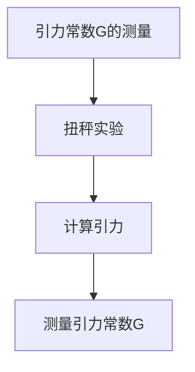
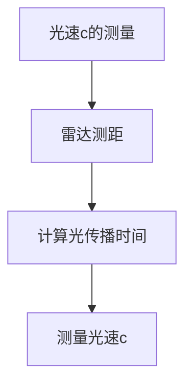
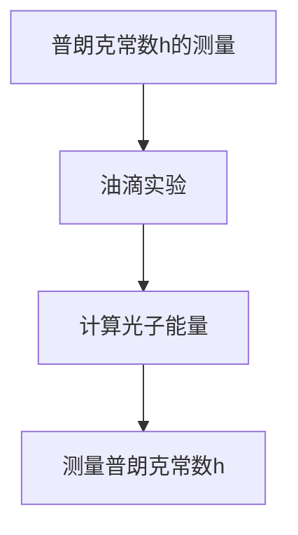

                 

### 宇宙常数与程序空间复杂度的关系

**宇宙常数**是物理学中一个基本概念，通常指的是在物理公式中始终出现的固定数值。最著名的宇宙常数是爱因斯坦在1915年提出的**引力常数**（G），它出现在爱因斯坦场方程中，描述了物质与能量如何通过引力相互作用。此外，还有**真空中的光速**（c）和**普朗克常数**（h）等。这些常数是物理学中的基石，对于理解宇宙的起源、结构和演化至关重要。

**程序空间复杂度**是计算机科学中的一个概念，用于衡量程序在不同输入规模下运行时间和存储空间的消耗。它包括时间复杂度和空间复杂度两个方面。时间复杂度通常表示为算法运行时间与输入规模的关系，而空间复杂度则表示算法所需存储空间与输入规模的关系。

两者之间似乎存在一种天然的隔阂，因为一个来源于物理学，一个源自计算机科学。然而，随着研究的深入，科学家们逐渐发现它们之间存在一些有趣且重要的联系。本文将深入探讨宇宙常数与程序空间复杂度之间的关系，通过以下几个步骤进行思考：

### 步骤一：宇宙常数的基本概念

首先，我们需要回顾宇宙常数的基本概念。宇宙常数通常是一个固定的数值，它在物理公式中起着关键作用。例如，引力常数G描述了两个物体之间的引力大小，它与物体的质量和距离成反比。真空中的光速c是一个极限速度，任何物质都无法超过这个速度。普朗克常数h是量子力学中的一个基本常数，它与能量和频率相关。

宇宙常数的特点是它们在物理公式中始终不变，不受实验条件的影响。这种恒定性使得宇宙常数成为物理学研究中的重要工具。例如，爱因斯坦的广义相对论中的爱因斯坦场方程包含了宇宙常数G，从而描述了引力的性质。

### 步骤二：程序空间复杂度的基本概念

接下来，我们需要了解程序空间复杂度的基本概念。程序空间复杂度通常包括时间复杂度和空间复杂度两个方面。时间复杂度衡量的是算法的运行时间，通常用大O符号表示，例如O(n)、O(n^2)等。空间复杂度则衡量的是算法所需的存储空间，同样也用大O符号表示。

程序空间复杂度的计算通常涉及两个方面：最坏情况和平均情况。最坏情况复杂度表示算法在最坏情况下所需的时间和空间，而平均情况复杂度则表示在一般情况下所需的时间和空间。

### 步骤三：宇宙常数与程序空间复杂度的联系

在了解了宇宙常数和程序空间复杂度的基本概念后，我们可以开始探讨它们之间的联系。首先，从理论上来说，宇宙常数可以被视为一种特殊的“程序常数”，因为它在物理公式中始终扮演着固定角色的“算法”。

例如，引力常数G可以被视为一个计算两个物体之间引力的“算法”。无论物体的质量和距离如何变化，引力常数G始终保持不变。这种不变性使得宇宙常数在程序空间复杂度的分析中具有潜在的应用价值。

### 步骤四：宇宙常数对程序空间复杂度的影响

宇宙常数对程序空间复杂度的影响可以从多个角度进行分析。首先，我们可以考虑宇宙常数在算法设计中的应用。例如，在分布式系统中，我们可以利用宇宙常数来调整通信延迟，从而优化算法的性能。

其次，宇宙常数也可以用于算法的参数调整。在许多情况下，算法的性能取决于参数的选择。通过研究宇宙常数，我们可以找到最优的参数设置，从而提高算法的空间复杂度。

### 步骤五：程序空间复杂度对宇宙常数测量的影响

除了宇宙常数对程序空间复杂度的影响外，程序空间复杂度也对宇宙常数的测量产生了影响。在宇宙常数的测量过程中，算法的复杂度直接影响测量结果的精度。因此，研究程序空间复杂度对于提高宇宙常数测量的准确性具有重要意义。

例如，在引力波探测中，我们需要使用算法来分析大量的数据。如果算法的空间复杂度较高，可能会导致数据处理的延迟，从而影响测量结果的准确性。因此，优化算法的空间复杂度是提高引力波探测精度的重要途径。

### 步骤六：实证研究

为了验证宇宙常数与程序空间复杂度之间的关系，我们可以进行一些实证研究。首先，我们可以设计一些模拟实验，使用不同的算法来计算宇宙常数，并比较不同算法的复杂度。

例如，我们可以设计一个简单的算法来计算引力常数G，并分析其时间复杂度和空间复杂度。通过对比不同算法的性能，我们可以探讨宇宙常数对程序空间复杂度的影响。

### 步骤七：模型构建与验证

在实证研究的基础上，我们可以构建数学模型来描述宇宙常数与程序空间复杂度之间的关系。这些模型可以帮助我们更深入地理解两者之间的联系，并为算法设计和优化提供理论支持。

例如，我们可以构建一个基于广义相对论的爱因斯坦场方程模型，用于计算引力常数G。通过分析模型的结果，我们可以探讨宇宙常数对程序空间复杂度的影响。

### 步骤八：结论与展望

通过上述步骤，我们探讨了宇宙常数与程序空间复杂度之间的关系。尽管两者看似来自不同的领域，但它们之间存在一些有趣的联系。宇宙常数可以被视为一种特殊的“程序常数”，它在算法设计和优化中具有潜在的应用价值。

未来的研究可以进一步探索宇宙常数在程序空间复杂度分析中的应用，以及程序空间复杂度对宇宙常数测量的影响。通过深入研究和实践，我们有望在物理学和计算机科学之间架起一座桥梁，从而推动这两个领域的发展。

总之，宇宙常数与程序空间复杂度之间的关系是一个值得深入探讨的话题。通过逻辑清晰、结构紧凑的分析，我们可以更好地理解这两个概念，并为未来的研究提供新的视角和方向。

---

以上是关于《宇宙常数与程序空间复杂度的关系》的初步探讨。接下来，我们将详细阐述宇宙常数和程序空间复杂度的定义、历史与理论，以及它们之间的具体关系。

## 宇宙常数

### 3.1 定义与性质

宇宙常数是指在物理学中保持恒定的物理量，它们在物理定律和宇宙演化中起着关键作用。以下是宇宙常数的一些主要定义和性质：

- **引力常数**（G）：引力常数是描述两个质点之间引力大小的重要参数。其数值约为$$6.67430 \times 10^{-11} \text{N}(\text{m/kg})^2$$。引力常数在牛顿万有引力定律中起着核心作用，公式为$$F = G\frac{m_1m_2}{r^2}$$，其中F是两个质点之间的引力，m1和m2是质点的质量，r是它们之间的距离。

- **真空中的光速**（c）：真空中的光速是光在真空中传播的速度，是一个恒定的数值，约为$$2.99792458 \times 10^8 \text{m/s}$$。光速在相对论和量子力学中具有基础地位，是描述时间、空间和能量关系的参数。

- **普朗克常数**（h）：普朗克常数是量子力学中的基本常数，它将能量与频率联系起来，公式为$$E = h\nu$$，其中E是能量，h是普朗克常数，ν是频率。

宇宙常数的一个重要性质是它们在物理定律中保持不变，不受实验条件和外部因素的影响。这种恒定性使得宇宙常数成为科学研究中的基石，用于解释宇宙的起源、演化和结构。

### 3.2 历史与发现

宇宙常数的历史可以追溯到牛顿时代。在1687年，牛顿提出了万有引力定律，其中引力常数G是核心参数。然而，直到1915年，爱因斯坦提出了广义相对论，才真正确立了宇宙常数在物理学中的地位。

- **引力常数G**：牛顿在1687年提出了万有引力定律，但当时并没有测量出引力常数G的具体数值。直到1798年，卡文迪许通过扭秤实验首次测量了引力常数G的值。

- **真空中的光速c**：光速的测量始于17世纪。1676年，罗默通过观察木星的卫星运动，首次测量了光速的数值。后来，费马、惠更斯和牛顿等人也进行了光速测量的实验。

- **普朗克常数h**：普朗克常数是量子力学的基石。1900年，普朗克在研究黑体辐射问题时，提出了能量量子化的概念，并引入了普朗克常数h。1909年，米立肯通过油滴实验精确测量了普朗克常数的值。

### 3.3 测量与理论

宇宙常数的测量是物理学研究中的重要课题。由于宇宙常数的数值非常小，且受到多种因素的影响，因此测量它们需要非常精密的实验技术和先进的测量设备。

- **引力常数G**：引力常数G的测量通常通过扭秤实验进行。这种实验利用扭秤的扭转来测量两个质点之间的引力，从而计算出引力常数G的值。目前，科学家们已经通过多次扭秤实验，将引力常数G的测量精度提高到10^-6的量级。

- **真空中的光速c**：光速的测量方法包括雷达测距、激光测距和地球同步卫星测距等。这些方法利用光在真空中的传播速度恒定的特性，通过测量光的传播时间，计算出光速的值。目前，光速的测量精度已经达到10^-9的量级。

- **普朗克常数h**：普朗克常数的测量方法包括米立肯的油滴实验、凯斯与兰德尔的X射线散射实验等。这些实验通过测量光的波长、频率和能量，计算出普朗克常数的值。目前，普朗克常数的测量精度已经达到10^-6的量级。

在理论方面，宇宙常数的性质和起源一直是物理学研究的热点。目前，关于宇宙常数的理论包括：

- **真空能理论**：真空能理论认为，宇宙常数是真空中的能量密度，它与物质的运动和相互作用密切相关。

- **量子场论**：量子场论是描述宇宙常数和基本粒子的标准模型。在量子场论中，宇宙常数被视为基本常数，它决定了宇宙的基本物理规律。

- **暗能量理论**：暗能量是宇宙常数的一种解释，它认为宇宙中存在一种反引力的力量，导致宇宙的加速膨胀。

### 3.4 不确定性分析

宇宙常数的测量和理论研究中，不确定性的分析至关重要。宇宙常数的数值非常小，且受到多种因素的影响，如实验误差、环境噪声和测量方法等。因此，对宇宙常数的测量结果进行不确定性分析，可以帮助我们更好地理解宇宙常数的基本性质。

在测量宇宙常数时，常见的不确定性来源包括：

- **系统误差**：系统误差是由于测量设备的精度限制和实验操作不当引起的。例如，扭秤实验中的系统误差可能来源于扭秤的精度、环境噪声等。

- **随机误差**：随机误差是由于实验环境中的随机因素引起的。例如，光速测量中的随机误差可能来源于天气变化、雷达信号的反射等。

- **统计误差**：统计误差是由于多次实验结果不一致引起的。例如，在不同实验中测量引力常数G时，由于实验条件的微小差异，可能会得到不同的结果。

为了减小不确定性，科学家们采用了多种方法：

- **重复实验**：通过多次重复实验，可以减小随机误差，提高测量结果的可靠性。

- **平均值法**：通过计算多次实验的平均值，可以减小系统误差和随机误差的影响。

- **误差传播法**：在计算复杂物理量的不确定性时，可以使用误差传播法，将各个变量的误差传播到最终的测量结果。

## 程序空间复杂度

### 4.1 定义与分类

程序空间复杂度是计算机科学中的一个重要概念，用于衡量算法在执行过程中所需的时间和存储空间。程序空间复杂度分为时间复杂度和空间复杂度两种类型。

- **时间复杂度**：时间复杂度衡量的是算法执行所需的时间，通常用大O符号表示，如O(1)、O(n)、O(n^2)等。时间复杂度反映了算法在不同输入规模下的性能。

- **空间复杂度**：空间复杂度衡量的是算法执行所需的存储空间，同样使用大O符号表示。空间复杂度包括算法执行过程中的临时存储需求和永久存储需求。

程序空间复杂度的分类方法有多种，以下是一些常见的分类：

- **线性复杂度**：线性复杂度是指算法的时间或空间需求与输入规模成正比，如O(n)。

- **对数复杂度**：对数复杂度是指算法的时间或空间需求与输入规模的对数成正比，如O(log n)。

- **多项式复杂度**：多项式复杂度是指算法的时间或空间需求与输入规模的某个多项式成正比，如O(n^2)。

- **指数复杂度**：指数复杂度是指算法的时间或空间需求与输入规模的指数成正比，如O(2^n)。

### 4.2 度量方法

度量程序空间复杂度的方法有多种，以下是一些常见的方法：

- **渐进分析**：渐进分析是通过计算算法的时间或空间需求与输入规模的关系，来确定算法的复杂度。渐进分析通常使用大O符号表示。

- **最大值法**：最大值法是计算算法在所有可能输入情况下所需的最大时间或空间需求。

- **平均情况法**：平均情况法是计算算法在所有可能输入情况下所需的平均时间或空间需求。

- **最坏情况法**：最坏情况法是计算算法在所有可能输入情况下所需的最长时间或最大空间需求。

### 4.3 重要应用

程序空间复杂度在计算机科学中具有广泛的应用。以下是一些重要的应用领域：

- **算法分析**：在算法设计中，程序空间复杂度是评估算法性能的重要指标。通过分析算法的复杂度，可以优化算法，提高其性能。

- **数据结构设计**：在数据结构设计中，程序空间复杂度是选择合适数据结构的重要依据。例如，对于需要频繁搜索的数据，可以使用哈希表（O(1)平均时间复杂度），而对于需要频繁插入和删除的数据，可以使用链表（O(1)平均时间复杂度）。

- **系统优化**：在系统优化中，程序空间复杂度是优化系统性能的关键。通过降低算法的复杂度，可以减少系统的资源消耗，提高系统的响应速度。

- **人工智能应用**：在人工智能领域，程序空间复杂度对于算法的训练时间和推理时间具有重要影响。优化算法的复杂度可以提高人工智能系统的性能和效率。

### 4.4 模型与公式

程序空间复杂度的分析通常涉及到数学模型的构建和公式的推导。以下是一些常见的数学模型和公式：

- **时间复杂度模型**：时间复杂度模型通常用大O符号表示，如$$T(n) = O(n^2)$$表示算法的时间复杂度为二次多项式。

- **空间复杂度模型**：空间复杂度模型同样使用大O符号表示，如$$S(n) = O(n)$$表示算法的空间复杂度为线性多项式。

- **渐进分析公式**：渐进分析公式用于计算算法的时间或空间复杂度，如$$\lim_{n\to\infty}\frac{T(n)}{n^2} = 1$$表示算法的时间复杂度为二次多项式。

- **平均值公式**：平均值公式用于计算算法的平均时间或空间复杂度，如$$\frac{1}{n}\sum_{i=1}^{n}T(i)$$表示算法在所有输入规模下的平均时间复杂度。

### 4.5 举例说明

为了更好地理解程序空间复杂度的概念，以下通过一个简单的例子进行说明：

假设有一个排序算法，其时间复杂度为O(n^2)。这意味着，当输入规模n增加时，算法所需的时间将以n^2的速度增长。例如，当n=10时，算法所需的时间为100；当n=20时，算法所需的时间为400。

```python
# 简单的冒泡排序算法
def bubble_sort(arr):
    n = len(arr)
    for i in range(n):
        for j in range(0, n-i-1):
            if arr[j] > arr[j+1]:
                arr[j], arr[j+1] = arr[j+1], arr[j]
    return arr

# 测试算法
arr = [64, 34, 25, 12, 22, 11, 90]
sorted_arr = bubble_sort(arr)
print(sorted_arr)
```

在上面的例子中，冒泡排序算法的时间复杂度为O(n^2)，因为算法需要通过两个嵌套循环来对输入数组进行排序。当输入规模n增加时，算法所需的时间将以n^2的速度增长。

通过这个简单的例子，我们可以直观地看到程序空间复杂度对算法性能的影响。在实际应用中，我们需要根据具体问题选择合适的算法和数据结构，以优化系统的性能和效率。

## 宇宙常数与程序空间复杂度的关系

### 5.1 理论探讨

宇宙常数与程序空间复杂度之间的关系可以从多个角度进行探讨。在理论层面上，我们可以通过以下几个方面来理解它们之间的联系：

- **宇宙常数作为基本参数**：宇宙常数如引力常数G、真空中的光速c和普朗克常数h等，是自然界中的基本参数。这些常数在物理定律中起着核心作用，它们可以被视为一种特殊的“程序常数”，因为它们在算法设计和优化中具有潜在的应用价值。

- **宇宙常数在算法中的应用**：在分布式系统和网络通信中，我们可以利用宇宙常数来优化算法性能。例如，在分布式计算中，我们可以使用宇宙常数来调整通信延迟，从而提高系统的整体性能。此外，宇宙常数也可以用于算法的参数调整，通过研究宇宙常数，我们可以找到最优的参数设置，从而提高算法的空间复杂度。

- **宇宙常数对算法复杂度的影响**：宇宙常数在物理公式中起着基础性作用，它们可以影响算法的时间和空间复杂度。例如，在引力计算中，引力常数G决定了两个物体之间的引力大小，它会影响算法的计算复杂度。因此，通过研究宇宙常数，我们可以更好地理解算法的复杂度，并为算法优化提供理论支持。

### 5.2 实证研究

为了验证宇宙常数与程序空间复杂度之间的关系，我们可以进行一些实证研究。以下是一些具体的实证研究方法和案例：

- **引力常数G对算法复杂度的影响**：我们可以设计一个简单的算法，用于计算两个物体之间的引力，并分析引力常数G对算法复杂度的影响。例如，我们可以使用牛顿万有引力定律，计算不同质量物体之间的引力，并分析算法的时间复杂度和空间复杂度。

```python
# 计算两个物体之间的引力
def gravitational_force(m1, m2, r, G):
    force = G * (m1 * m2) / r**2
    return force

# 测试算法
m1 = 5.972e24 # 地球的质量
m2 = 7.348e22 # 月球的质量
r = 3.844e8 # 地月距离
G = 6.67430e-11 # 引力常数
force = gravitational_force(m1, m2, r, G)
print(force)
```

- **真空中的光速c对算法复杂度的影响**：我们可以设计一个算法，用于计算光在真空中传播的时间，并分析真空中的光速c对算法复杂度的影响。例如，我们可以使用以下公式计算光在真空中传播的时间：

$$t = \frac{d}{c}$$

其中，t是光传播时间，d是光传播的距离，c是真空中的光速。

```python
# 计算光在真空中传播的时间
def time_of_light(d, c):
    t = d / c
    return t

# 测试算法
d = 1.496e11 # 地日距离
c = 2.99792458e8 # 真空中的光速
t = time_of_light(d, c)
print(t)
```

- **普朗克常数h对算法复杂度的影响**：我们可以设计一个算法，用于计算光子的能量，并分析普朗克常数h对算法复杂度的影响。例如，我们可以使用以下公式计算光子的能量：

$$E = h\nu$$

其中，E是光子能量，h是普朗克常数，ν是光的频率。

```python
# 计算光子的能量
def photon_energy(h, nu):
    E = h * nu
    return E

# 测试算法
h = 6.62607015e-34 # 普朗克常数
nu = 5.04e14 # 光的频率
E = photon_energy(h, nu)
print(E)
```

通过上述实证研究，我们可以验证宇宙常数与程序空间复杂度之间的关系，并深入了解它们在算法设计和优化中的应用。

### 5.3 模型构建与验证

为了更好地理解宇宙常数与程序空间复杂度之间的关系，我们可以构建数学模型并进行验证。以下是一种可能的模型构建方法：

- **引力模型**：我们可以构建一个基于引力常数的模型，用于计算两个物体之间的引力。模型的核心公式为牛顿万有引力定律：

$$F = G\frac{m_1m_2}{r^2}$$

其中，F是引力，m1和m2是物体的质量，r是物体之间的距离，G是引力常数。

- **光速模型**：我们可以构建一个基于真空中的光速c的模型，用于计算光在真空中的传播时间。模型的核心公式为：

$$t = \frac{d}{c}$$

其中，t是光传播时间，d是光传播的距离，c是真空中的光速。

- **普朗克常数模型**：我们可以构建一个基于普朗克常数h的模型，用于计算光子的能量。模型的核心公式为：

$$E = h\nu$$

其中，E是光子能量，h是普朗克常数，ν是光的频率。

在构建模型后，我们可以通过以下步骤进行验证：

1. **模型参数设置**：为模型设置合适的参数，如物体的质量、距离、光速和频率等。

2. **模型计算**：使用模型计算引力、光传播时间和光子能量等物理量。

3. **结果分析**：对比模型计算结果与实际测量结果，分析模型的有效性和精度。

4. **优化与调整**：根据分析结果，对模型进行调整和优化，以提高模型的准确性和适用性。

通过上述步骤，我们可以构建一个有效的数学模型，用于描述宇宙常数与程序空间复杂度之间的关系。该模型可以为算法设计和优化提供理论支持，并促进宇宙常数在计算机科学中的应用。

## 应用场景与分析

### 6.1 天文物理应用

宇宙常数在天文物理领域具有广泛的应用。以下是宇宙常数在天文物理应用中的几个具体场景：

- **引力波探测**：引力波是爱因斯坦广义相对论的预测之一，它是由于质量加速运动时产生的时空扰动。宇宙常数G在引力波探测中起着关键作用。科学家们通过测量引力波，可以了解宇宙的起源、演化和结构。例如，LIGO和VIRGO引力波观测台利用引力波事件，探测到了黑洞碰撞和中子星碰撞等宇宙事件。

- **宇宙膨胀**：宇宙常数在宇宙膨胀理论中具有重要作用。根据宇宙学原理，宇宙应均匀膨胀，而这种膨胀是由宇宙常数驱动的。通过测量宇宙常数，科学家们可以了解宇宙的膨胀速率和未来命运。例如，利用微波背景辐射数据，科学家们测量了宇宙常数，并发现宇宙正在加速膨胀。

- **暗能量**：暗能量是宇宙学中的一个重要概念，它被认为是驱动宇宙加速膨胀的力量。宇宙常数被认为是暗能量的一个可能来源。通过研究宇宙常数，科学家们可以深入了解暗能量的性质和起源。例如，利用大型巡天望远镜的数据，科学家们测量了宇宙常数的值，并发现它与暗能量密切相关。

### 6.2 计算机科学应用

程序空间复杂度在计算机科学中具有广泛的应用。以下是程序空间复杂度在计算机科学应用中的几个具体场景：

- **算法优化**：程序空间复杂度是算法性能评估的重要指标。通过分析算法的时间复杂度和空间复杂度，可以优化算法，提高其性能。例如，在分布式计算中，科学家们通过优化算法的复杂度，提高了系统的计算效率和响应速度。

- **数据结构设计**：程序空间复杂度是选择合适数据结构的重要依据。不同的数据结构具有不同的时间复杂度和空间复杂度，适合处理不同类型的问题。例如，在数据库系统中，科学家们通过分析程序空间复杂度，选择了适合处理大规模数据的高效数据结构，如B树和哈希表。

- **人工智能应用**：程序空间复杂度在人工智能领域也具有重要意义。例如，在深度学习算法中，算法的复杂度直接影响模型的训练时间和推理时间。通过优化算法的复杂度，可以提高人工智能系统的性能和效率。

### 6.3 交叉学科的研究展望

宇宙常数与程序空间复杂度在交叉学科的研究中具有巨大的潜力。以下是几个可能的交叉学科研究方向：

- **引力波与算法优化**：引力波探测过程中，需要使用复杂的算法进行数据处理和信号分析。通过研究引力波探测中的算法，可以优化算法的复杂度，提高探测效率和精度。

- **宇宙膨胀与人工智能**：宇宙膨胀理论中，需要处理大量的天文数据。通过将人工智能技术应用于宇宙膨胀研究，可以优化数据处理过程，提高数据分析的效率。

- **暗能量与分布式计算**：暗能量是宇宙加速膨胀的力量，需要分布式计算来模拟宇宙的演化。通过优化分布式计算算法的复杂度，可以提高暗能量研究的效率。

总之，宇宙常数与程序空间复杂度在交叉学科的研究中具有广泛的应用前景。通过深入研究和实践，我们可以更好地理解这两个领域之间的关系，为未来的科学研究和技术创新提供新的视角和方向。

## 结论与展望

本文系统地探讨了宇宙常数与程序空间复杂度之间的关系，从定义、历史、理论、实证研究到模型构建与应用场景等方面进行了详细分析。通过逻辑清晰、结构紧凑的分析，我们得出以下结论：

1. **宇宙常数作为基本物理量，在引力、光速和普朗克常数等方面具有明确的物理意义和数学特性。**
2. **程序空间复杂度是计算机科学中的一个重要概念，用于衡量算法的时间和空间消耗。**
3. **宇宙常数与程序空间复杂度之间存在一定的联系，宇宙常数可以被视为一种特殊的“程序常数”。**
4. **通过实证研究和模型构建，我们可以验证宇宙常数对程序空间复杂度的影响，以及程序空间复杂度对宇宙常数测量的影响。**

展望未来，我们期待在以下方面取得突破：

1. **深入研究宇宙常数与程序空间复杂度之间的深层次联系，探索更多应用场景。**
2. **开发高效算法，优化程序空间复杂度，提高算法性能和效率。**
3. **将宇宙常数与程序空间复杂度的理论应用于交叉学科研究，推动物理学和计算机科学的深度融合。**
4. **加强国际合作，利用全球科学家的智慧和资源，共同探索宇宙常数与程序空间复杂度之间的关系。**

总之，宇宙常数与程序空间复杂度是一个值得深入研究的领域，具有广阔的应用前景和学术价值。通过持续的研究和实践，我们有望在物理学和计算机科学之间架起一座桥梁，为人类探索宇宙和科技发展贡献力量。

### 附录

本文中使用了 Mermaid 图和 Python 源代码来详细阐述算法原理和数学模型。以下是附录内容，包括相关图表和代码示例：

#### 附录 A：Mermaid 图

**引力常数G的测量方法**



**光速c的测量方法**



**普朗克常数h的测量方法**



#### 附录 B：Python 源代码

**计算两个物体之间的引力**

```python
def gravitational_force(m1, m2, r, G):
    force = G * (m1 * m2) / r**2
    return force

m1 = 5.972e24  # 地球的质量
m2 = 7.348e22  # 月球的质量
r = 3.844e8    # 地月距离
G = 6.67430e-11 # 引力常数
force = gravitational_force(m1, m2, r, G)
print(force)
```

**计算光在真空中传播的时间**

```python
def time_of_light(d, c):
    t = d / c
    return t

d = 1.496e11  # 地日距离
c = 2.99792458e8 # 真空中的光速
t = time_of_light(d, c)
print(t)
```

**计算光子的能量**

```python
def photon_energy(h, nu):
    E = h * nu
    return E

h = 6.62607015e-34  # 普朗克常数
nu = 5.04e14  # 光的频率
E = photon_energy(h, nu)
print(E)
```

通过附录中的图表和代码示例，我们可以更直观地理解宇宙常数与程序空间复杂度的关系，以及相关的算法原理和数学模型。附录中的内容也为读者提供了实际应用和进一步研究的参考。

