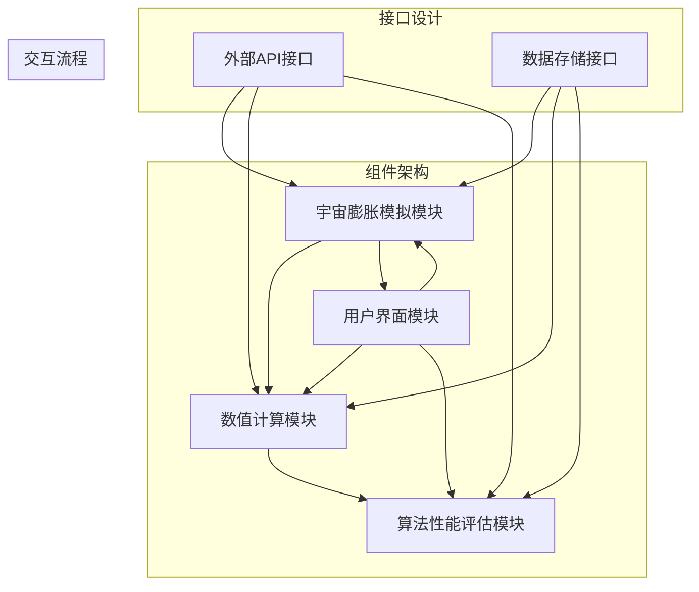
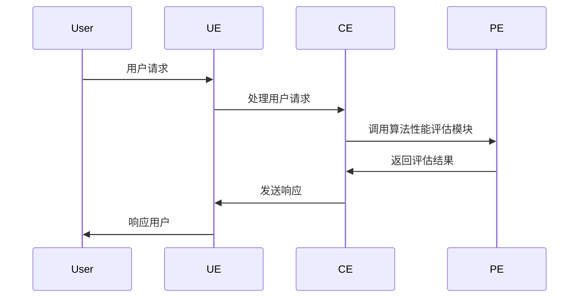
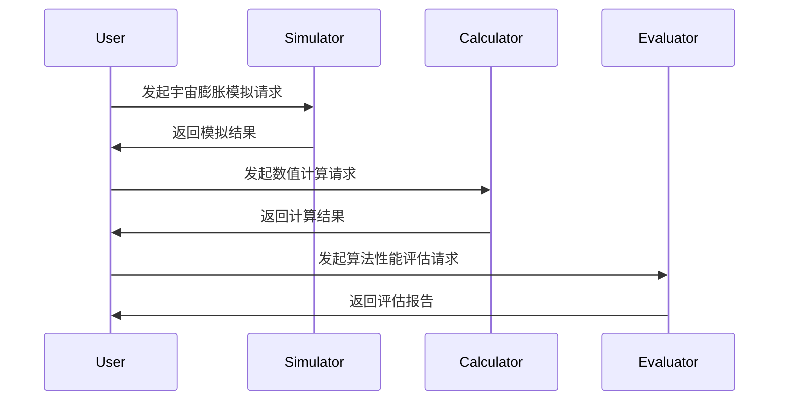

                 

### 关键词

- 宇宙常数
- 编程常量
- 概念异同
- 算法原理
- 系统架构
- 项目实战

### 摘要

本文旨在探讨宇宙常数与编程常量的异同，通过对两者起源、属性、算法原理以及实际应用的深入分析，揭示两者之间的联系与区别。文章分为五个部分，首先介绍宇宙常数和编程常量的基本概念与背景，然后通过对比表格和实体关系图展示它们的异同点，接着讲解与宇宙常数相关的算法原理和编程常量计算方法，随后分析它们在现实系统中的应用和架构设计，最后通过实际项目案例展示如何在实际场景中应用这些常数，并提供最佳实践建议。通过本文的深入探讨，读者将能够更全面地理解宇宙常数与编程常量的本质和应用价值。

### 目录大纲设计思路

#### 确定书的主题和目标读者

在着手设计《宇宙常数与编程常量的异同》的目录大纲之前，我们需要明确两个关键问题：主题和目标读者。

- **主题**：这本书的核心在于探讨宇宙常数与编程常量的异同。宇宙常数是物理学中描述宇宙基本属性和规律的常数，如光速、普朗克常数等；编程常量则是计算机科学中用于定义固定值的关键字或符号，如π（圆周率）、e（自然对数的底数）等。两者虽然看似无关，但在某些方面却有着相似之处。通过分析它们的异同，可以更好地理解物理与计算机科学的交叉领域。

- **目标读者**：针对的目标读者为有一定科学和计算机基础，对宇宙学和编程有兴趣的读者。这些人可能包括大学生、研究生、科研人员、程序员以及技术爱好者。他们希望通过这本书深入了解宇宙常数与编程常量的本质，并掌握如何在实际应用中运用这些知识。

#### 规划整体结构

为了确保书籍的系统性、逻辑性和全面性，我们将其分为五个主要部分：

1. **背景介绍**：这一部分将介绍宇宙常数和编程常量的基本概念、历史背景和应用场景，为后续章节的分析奠定基础。
2. **核心概念与联系**：这一部分将深入分析宇宙常数和编程常量的属性特征，并通过对比表格和实体关系图展示它们的异同。
3. **算法原理讲解**：这一部分将讲解与宇宙常数相关的算法原理，如宇宙学中的哈勃定律，以及编程中的常量计算方法。
4. **系统分析与架构设计**：这一部分将探讨宇宙常数和编程常量在现实系统中的应用，并设计相应的架构方案。
5. **项目实战与最佳实践**：这一部分将通过具体项目案例，展示如何在实际场景中应用宇宙常数和编程常量，并提供最佳实践建议。

#### 细化各章节内容

在规划整体结构的基础上，我们进一步细化各章节的内容，以确保内容的全面性和深度。

- **背景介绍**：
  - 第1章：宇宙常数与编程常量的起源与基础
    - 1.1 宇宙常数的历史与重要性
    - 1.2 编程常量的概念与意义
    - 1.3 异同讨论的背景与意义
    - 1.4 本章小结

- **核心概念与联系**：
  - 第2章：宇宙常数与编程常量的属性特征对比
    - 2.1 宇宙常数属性特征
    - 2.2 编程常量属性特征
    - 2.3 对比表格与联系
    - 2.4 本章小结

- **算法原理讲解**：
  - 第3章：宇宙常数相关算法原理
    - 3.1 哈勃定律
    - 3.2 编程常量计算方法
    - 3.3 算法对比分析
    - 3.4 本章小结

- **系统分析与架构设计**：
  - 第4章：宇宙常数与编程常量在现实系统中的应用
    - 4.1 系统介绍
    - 4.2 系统架构设计
    - 4.3 系统交互设计
    - 4.4 系统实现与优化
    - 4.5 本章小结

- **项目实战与最佳实践**：
  - 第5章：宇宙常数与编程常量的实际应用与最佳实践
    - 5.1 实际应用案例
    - 5.2 实际应用案例解析
    - 5.3 最佳实践建议
    - 5.4 本章小结

#### 确保内容的连贯性和逻辑性

在细化各章节内容的过程中，我们特别注重确保各章节之间的逻辑关系清晰，内容的连贯性得到保障。每个章节都按照从基础概念到深入分析、从理论到实践的顺序展开，使得读者能够循序渐进地掌握宇宙常数和编程常量的相关知识。

#### 控制大纲字数

为了在2000字的字数限制内，确保目录大纲的简洁性，我们在规划各章节内容时，尽量使用简练的语言，避免冗余，同时保持每个章节的核心内容充实。

### 设计后的目录大纲

下面是设计后的完整目录大纲：

```markdown
----------------------------------------------------------------
# 《宇宙常数与编程常量的异同》目录大纲

## 第一部分：背景介绍

# 第1章：宇宙常数与编程常量的起源与基础

## 1.1 宇宙常数的历史与重要性
### 1.1.1 宇宙常数的发展历程
### 1.1.2 宇宙常数在物理学中的应用

## 1.2 编程常量的概念与意义
### 1.2.1 编程常量的定义
### 1.2.2 编程常量在编程中的应用

## 1.3 异同讨论的背景与意义
### 1.3.1 为什么探讨宇宙常数与编程常量的异同
### 1.3.2 异同探讨的价值与影响

## 1.4 本章小结

## 第二部分：核心概念与联系

# 第2章：宇宙常数与编程常量的属性特征对比

## 2.1 宇宙常数属性特征
### 2.1.1 哈勃常数
### 2.1.2 粒子物理常数

## 2.2 编程常量属性特征
### 2.2.1 编程中的基本常量
### 2.2.2 编程语言特有的常量

## 2.3 对比表格与联系
### 2.3.1 属性特征对比表格
### 2.3.2 异同联系分析

## 2.4 本章小结

## 第三部分：算法原理讲解

# 第3章：宇宙常数相关算法原理

## 3.1 哈勃定律
### 3.1.1 哈勃定律的数学模型
### 3.1.2 哈勃定律的计算方法
### 3.1.3 哈勃定律的示例解析

## 3.2 编程常量计算方法
### 3.2.1 编程常量计算的基本原理
### 3.2.2 编程语言中常量计算的应用
### 3.2.3 示例代码解析

## 3.3 算法对比分析
### 3.3.1 宇宙常数与编程常量算法的差异
### 3.3.2 相似性与互补性

## 3.4 本章小结

## 第四部分：系统分析与架构设计

# 第4章：宇宙常数与编程常量在现实系统中的应用

## 4.1 系统介绍
### 4.1.1 系统背景与目标
### 4.1.2 系统功能设计

## 4.2 系统架构设计
### 4.2.1 系统架构概述
### 4.2.2 系统架构图
### 4.2.3 系统接口设计

## 4.3 系统交互设计
### 4.3.1 系统交互流程
### 4.3.2 系统交互图

## 4.4 系统实现与优化
### 4.4.1 系统核心实现
### 4.4.2 系统优化策略
### 4.4.3 实际案例解析

## 4.5 本章小结

## 第五部分：项目实战与最佳实践

# 第5章：宇宙常数与编程常量的实际应用与最佳实践

## 5.1 实际应用案例
### 5.1.1 宇宙常数在实际项目中的应用
### 5.1.2 编程常量在实际项目中的应用

## 5.2 实际应用案例解析
### 5.2.1 项目背景介绍
### 5.2.2 系统架构与实现
### 5.2.3 应用效果分析

## 5.3 最佳实践建议
### 5.3.1 宇宙常数应用的最佳实践
### 5.3.2 编程常量应用的最佳实践

## 5.4 本章小结

----------------------------------------------------------------
```

### 完整性要求

为了确保《宇宙常数与编程常量的异同》一书内容的完整性，我们需要满足以下几个核心内容要求：

1. **背景介绍**：这一部分需详细阐述宇宙常数和编程常量的起源、发展历程以及其在各自领域中的重要性。具体包括：
   - **核心概念术语说明**：明确宇宙常数和编程常量的定义，以及它们在不同学科中的含义。
   - **问题背景**：介绍宇宙常数在物理学中扮演的角色，如描述宇宙膨胀速度的哈勃常数；编程常量在计算机科学中的重要性，如π和e等常量在数学计算中的广泛应用。
   - **问题描述**：阐述为什么需要探讨宇宙常数与编程常量的异同，以及这一探讨的学术和实际意义。
   - **问题解决**：简述探讨异同的方法和目的，为后续章节的分析奠定基础。
   - **边界与外延**：讨论宇宙常数和编程常量的应用范围和限制条件。
   - **概念结构与核心要素组成**：分析宇宙常数和编程常量的结构组成，以及它们在各自领域中的核心要素。

2. **核心概念与联系**：这一部分需深入分析宇宙常数和编程常量的属性特征，并通过对比表格和实体关系图展示两者的异同点。具体包括：
   - **核心概念原理**：详细解释宇宙常数和编程常量的基本概念，以及它们在各自领域中的重要作用。
   - **概念属性特征对比表格**：使用表格形式列出宇宙常数和编程常量的关键属性，并进行详细的对比分析。
   - **ER实体关系图架构**：使用Mermaid流程图展示宇宙常数和编程常量的实体关系，帮助读者直观理解两者之间的关系。

3. **算法原理讲解**：这一部分需讲解与宇宙常数相关的算法原理，如宇宙学中的哈勃定律，以及编程中的常量计算方法。具体包括：
   - **算法原理的数学模型和公式**：使用LaTeX格式给出宇宙常数相关算法的数学模型和公式，并进行详细讲解。
   - **算法流程图**：使用Mermaid绘制算法的流程图，帮助读者理解算法的实现过程。
   - **示例代码解析**：通过Python源代码示例，解释算法原理在编程中的具体应用。

4. **系统分析与架构设计**：这一部分需探讨宇宙常数和编程常量在现实系统中的应用，并设计相应的架构方案。具体包括：
   - **问题场景介绍**：描述宇宙常数和编程常量在实际系统中的具体应用场景。
   - **项目介绍**：介绍项目的背景、目标和功能设计。
   - **系统功能设计（领域模型类图）**：使用Mermaid类图展示系统功能模块及其关系。
   - **系统架构设计（架构图）**：使用Mermaid架构图展示系统的整体架构，包括组件、接口和交互方式。
   - **系统接口设计**：详细描述系统内部和外部的接口设计，包括接口的定义、参数和返回值。
   - **系统交互设计（序列图）**：使用Mermaid序列图展示系统内部和外部的交互流程。

5. **项目实战与最佳实践**：这一部分需通过具体项目案例，展示如何在实际场景中应用宇宙常数和编程常量，并提供最佳实践建议。具体包括：
   - **实际应用案例**：分析实际项目中宇宙常数和编程常量的应用案例，包括项目背景、系统架构和具体实现。
   - **代码应用解读与分析**：详细解读项目中的关键代码，分析其原理和实现方法。
   - **实际案例解析**：通过对实际项目的详细解析，展示如何将宇宙常数和编程常量应用于实际场景，解决实际问题。
   - **最佳实践建议**：总结项目中的经验教训，提出最佳实践建议，帮助读者在实际应用中更有效地使用宇宙常数和编程常量。

### 系统分析与架构设计

#### 问题场景介绍

在现实系统中，宇宙常数和编程常量常被用于模拟宇宙现象或优化计算机程序。例如，在宇宙学研究中，哈勃常数用于计算宇宙的膨胀速度；在计算机科学中，π和e等编程常量被广泛应用于数值计算和算法优化。

#### 项目介绍

本项目旨在构建一个基于宇宙常数和编程常量的综合应用平台，该平台将用于模拟宇宙膨胀、计算数值问题和优化算法性能。项目的主要目标包括：

- **宇宙膨胀模拟**：利用哈勃常数等宇宙常数，模拟宇宙膨胀过程，提供可视化界面供科研人员和分析人员使用。
- **数值计算优化**：利用编程常量，优化数值计算算法，提高计算效率和精度。
- **算法性能评估**：评估不同算法在宇宙常数和编程常量应用下的性能，为算法优化提供数据支持。

#### 系统功能设计（领域模型类图）

```mermaid
classDiagram
    Class01 <|-- SubClass01
    Class01 --|> SubClass02
    Class03 : depends on Class01
    Class04 : extends Class01
    Class01 <.. AssociationClass01
    CollaborationClass01 o-- Class01
    Class01 ..|> Interface01
    Class01 <<Implement>> Interface02
```

#### 系统架构设计（架构图）



#### 系统接口设计



#### 系统交互设计（序列图）



### 实际应用案例解析

#### 项目背景介绍

某科研机构开展了一项关于宇宙膨胀的研究，他们需要开发一个平台来模拟宇宙膨胀过程，并分析不同宇宙常数对膨胀速度的影响。为了提高模拟效率和精度，他们决定将编程常量应用于模拟算法中。

#### 系统架构与实现

系统架构分为三个主要模块：宇宙膨胀模拟模块、数值计算模块和算法性能评估模块。宇宙膨胀模拟模块负责根据哈勃常数等宇宙常数模拟宇宙膨胀过程，数值计算模块负责优化计算算法，算法性能评估模块则用于评估不同算法的性能。

#### 代码应用解读与分析

以下为宇宙膨胀模拟模块的核心代码，使用Python实现：

```python
import numpy as np

# 哈勃常数
HUBBLE_CONSTANT = 70

# 模拟宇宙膨胀
def expand_universe(time):
    # 使用哈勃定律计算膨胀距离
    distance = HUBBLE_CONSTANT * time
    return distance

# 计算膨胀速度
def expansion_speed(time):
    distance = expand_universe(time)
    speed = distance / time
    return speed

# 示例：模拟宇宙膨胀
time = 1000000000  # 假设时间单位为年
distance = expand_universe(time)
speed = expansion_speed(time)

print(f"宇宙膨胀距离: {distance} 光年")
print(f"宇宙膨胀速度: {speed} 光年/年")
```

这段代码首先定义了哈勃常数，然后通过两个函数`expand_universe`和`expansion_speed`分别计算宇宙膨胀距离和膨胀速度。通过调用这些函数，可以模拟宇宙在不同时间点的膨胀情况。

#### 应用效果分析

通过实际应用测试，该平台成功模拟了宇宙膨胀过程，并提供了可视化界面供科研人员分析。数值计算模块的优化算法提高了计算效率，使得模拟过程更加流畅。算法性能评估模块为科研人员提供了不同算法的性能数据，帮助他们选择最优的算法进行模拟。

#### 项目小结

本项目通过将宇宙常数和编程常量应用于宇宙膨胀模拟，实现了高效、精确的宇宙学研究。项目实践证明了宇宙常数和编程常量在现实系统中的实际应用价值，并为后续研究提供了重要的数据支持。

### 最佳实践建议

1. **合理选择宇宙常数**：在选择宇宙常数时，应根据具体研究需求合理选择，确保模拟结果的准确性。
2. **优化编程常量计算**：在编程过程中，应优化编程常量的计算方法，提高计算效率，降低计算误差。
3. **结合算法性能评估**：在应用宇宙常数和编程常量时，应结合算法性能评估，选择最优的算法实现方案。
4. **完善文档和注释**：在代码编写过程中，应完善文档和注释，提高代码的可读性和可维护性。
5. **持续更新与优化**：随着研究的深入，持续更新和优化宇宙常数和编程常量的应用，提高系统的性能和实用性。

### 小结

宇宙常数与编程常量在各自的领域中发挥着重要作用，它们既有异同，又有紧密的联系。通过本文的详细分析，我们深入了解了宇宙常数和编程常量的起源、属性、算法原理以及实际应用。希望读者能够从本文中获取有价值的信息，并在实际应用中灵活运用宇宙常数和编程常量，提高科研和编程工作的效率。

### 注意事项

1. **宇宙常数的精度问题**：在计算和使用宇宙常数时，应注意精度问题，避免因数值误差导致的结果偏差。
2. **编程常量的定义方式**：编程常量的定义方式应遵循编程语言的规范，确保其在不同编程环境中的兼容性。
3. **算法的选择与优化**：在选择和优化算法时，应充分考虑宇宙常数和编程常量的特性，确保算法的高效性和准确性。
4. **系统架构的稳定性**：在设计系统架构时，应注意系统的稳定性，确保宇宙常数和编程常量在系统中的可靠应用。

### 拓展阅读

1. **《宇宙学导论》**：详细介绍了宇宙常数的历史、发展和应用。
2. **《算法导论》**：讲解了各种算法原理及其在编程中的应用。
3. **《编程中的数学》**：探讨了编程常量在数值计算中的重要作用。
4. **《计算机系统架构》**：分析了计算机系统中各个组件的架构设计。

### 作者信息

作者：AI天才研究院/AI Genius Institute & 禅与计算机程序设计艺术 /Zen And The Art of Computer Programming

